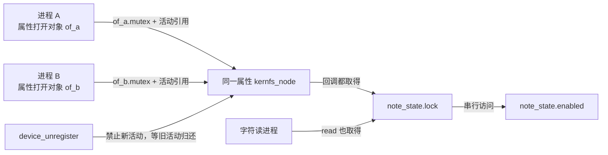
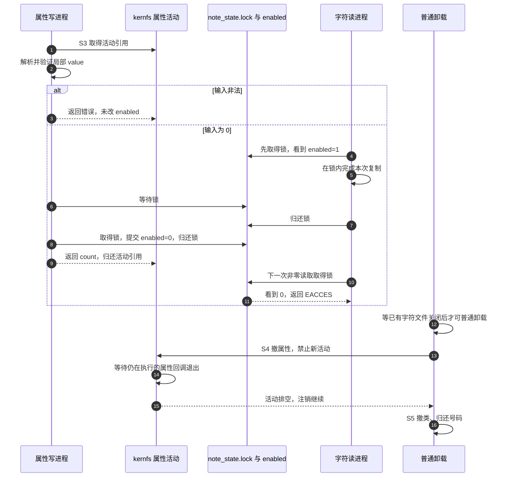

# 第4章\_并发访问与撤销

前两章的模块已经能回答一次读取或一次写入。但现在两个进程同时写属性，第三个进程正在读字符文件，退出路径准备删除目录。sysfs 既然已经有锁，我们的 mutex 是否多余？

要回答这个问题，先分清锁和引用分别保护哪一份状态。保护一次打开内部的缓冲，不等于保护所有打开共同访问的设备状态；保证回调执行时对象可访问，也不等于证明硬件仍在线。本章以 note_control 为例，沿完整周期检查这些保证。

## 4.1\_四组正交状态

这是多组状态共同组成的机制，不是 enabled 的一个状态机。

| 状态地址 | 谁写、谁读 | 保证 |
| --- | --- | --- |
| note_state.enabled 与 lock | store 提交；show/read 读取；初始化在发布前写 | 业务值与“允许并完成一段读取”的互斥 |
| 每次打开的 kernfs_open_file.mutex | kernfs I/O 路径取得和归还 | 同一个打开对象的回调串行；独立 open 有不同对象 |
| 属性 kernfs_node 的活动状态 | I/O 取得/归还活动引用；移除路径禁止新增并排空 | 活动回调与移除同步，不保护任意业务字段 |
| device 引用与 file 操作表 owner 引用 | 创建、持有、注销、最后关闭等路径维护 | 对象或代码寿命；不等于硬件在线，也不是 enabled 锁 |

mutex 不只是禁止两段代码“恰好同时写”。它还建立发布与读取的同步关系，让获取同一把锁的后续执行者观察到已经提交的状态。硬件缓存一致性负责共享内存值的传播，锁协议决定哪些访问被合法排序；不需要我们向每个读者发送一次手工通知，但成本并没有消失，竞争者仍要争用锁状态与受保护数据所在缓存行，必要时等待唤醒。

A 的打开锁和 B 的打开锁不是同一个地址，所以不能从“kernfs 有 mutex”推出两个 store 已串行。把普通 int 换成 atomic_t 也只能解决相应原子操作的约束，不能自动把检查、复制、多字段更新和对象释放变成一个事务。

## 4.2\_从准备到最后退出的统一周期

| 阶段 | 进入触发与状态变化 | 通信与退出条件 |
| --- | --- | --- |
| S0 准备 | 初始化 enabled=1、mutex、号码与 cdev | 无公开回调；状态先于发布准备 |
| S1 属性发布 | device_create_with_groups 使属性可达 | drvdata 将实例地址交给属性分派；回调可能立即进入 |
| S2 数据发布 | cdev_add 建立号码到操作表的关系 | open 可取得模块引用并保存实例地址 |
| S3 请求事务 | 解析局部值；持业务锁提交或检查并复制 | 锁归还后，下一个持锁者观察新值；错误输入不提交 |
| S4 撤销入口 | 普通卸载进入 exit 后先 cdev_del，再注销 device | 不持业务锁；属性移除排空既有活动，阻止后续活动 |
| S5 清理 | 撤类、归还号码，退出函数返回 | 本例无工作项、定时器或动态私有内存；不能省略真实驱动额外使用者 |

S3 中的 show 在锁内复制 enabled 到局部 value，解锁后格式化。它可能返回另一个写者刚刚覆盖之前的值，但这个值仍来自一次合法的读取时点，不是数据竞争。若需求是“读取两个字段必须来自同一提交”，要在同一锁范围取两个字段的快照；分读两个属性不能天然得到跨文件原子快照。

图里的“等待已有字符文件关闭”描述模块引用阻止普通卸载，不是 rmmod 保证自动等到成功。实际命令可能直接报告模块正在使用。强制卸载不在本例正确性条件内。

## 4.3\_撤目录不等于取消一切

属性活动排空与 device 引用归还是两件事。device_unregister 先撤可见关系，再 put 初始引用；还有额外引用时对象可继续存活。反过来，device 引用尚在也不保证属性目录仍在。第一章便利函数的最终 release 在公共内核中释放动态 device，本例的静态业务状态则随模块寿命保留。

退出不能持有 note_state.lock 再等待属性移除：假设已经进入的 show 正等这把锁，移除方又等 show 退出，就形成互相等待。应先阻止新的业务来源，再按引用和回调协议排空，不把“按初始化倒序”当成无需思考的通用算法。

加入工作队列、定时器或中断后，S4 还必须阻止它们重新提交工作，并在可睡眠的清理路径同步等待合适的完成条件，然后才释放它们读写的数据。这里只链接[设备热插拔](../P14_热插拔与模块生命周期.md)作为后续任务入口；本例没有模拟设备拔出，也没有证明那篇尚待展开的完整硬件协议。真实拔出可能在文件仍打开时发生，要另外维护离线状态、实例引用、挂起请求终止和硬件访问边界，不能靠 owner 引用解决。

## 4.4\_通知与性能的选择条件

如果应用每毫秒打开属性、读取、关闭并比较，它消耗的时间不仅是 show：还有进程或库代码、路径查找、打开对象分配、系统调用、格式化和可能的硬件访问。系统调用是权限边界切换，不必然发生任务调度；反复启动 cat 还混入新进程的成本。未经测量不能把所有差值归因于 sysfs 或“上下文切换”。

普通文本属性读路径经 seq_file 缓冲，不应假定每一个分段 read 都重新执行 show。读取频率、打开方式、seek/pread 行为、属性是否采用预分配路径都应记录。性能比较至少固定同一个设备、同一采样负载、同一打开策略，再报告读取次数、耗时和错误；本教材没有提供未经执行的吞吐数字。

当变化很少而轮询很密，驱动可以在状态变化时调用 `sysfs_notify`，用户程序在支持通知的属性上用 poll 等待并重新读取。通知唤醒由 kernfs 的事件状态和等待队列完成，不携带完整业务记录，多次变化可能合并成一次可见提醒。读者仍须读取当前值并按协议重新等待；本例没有调用 sysfs_notify，因此不能凭 DEVICE_ATTR_RW 就期待 poll 自动通知。

高频数据流、每条事件都必须保留或大量二进制数据，通常更适合已有子系统的数据接口或有队列契约的字符文件。sysfs 虽有 binary attribute，也不因此成为任意高速流协议的首选。若 show 必须通过 I²C 等可能睡眠的总线读取硬件，允许睡眠不等于允许无界延迟；可以由工作队列采样并公开缓存，同时说明时间戳、过期和失败语义。普通定时器回调不能直接执行可睡眠 I/O，缓存方案也不能把旧值冒充实时值。

## 4.5\_回顾与练习

sysfs 管理属性活动，业务锁管理状态一致性，对象引用管理内存寿命，模块引用管理代码寿命。它们互补，任意一个都不能替另外三个给出保证。

1. 两个 store 都顺利完成，最终只看到后一值，一定是竞态错误吗？
2. show 取快照后，写者马上更新值，show 返回旧值是否违反 mutex 保证？
3. 删除属性时，先持有业务锁能否“更保险”？
4. 把采样搬到后台后，如何让应用区分旧值与新值？

解答：第一题取决于 ABI；本例允许顺序覆盖，不提供累加或比较交换。第二题没有，它只承诺在某个持锁时点观察，不能承诺返回后世界不再变化。第三题可能与活动排空死锁，必须检查等待关系。第四题定义采样时间、有效性或序号与读取一致性；通知只能提醒重读，不能替这些字段提供无丢失历史。

上一篇：[从发布到设备节点](P03_从发布到设备节点.md)。

下一篇：[系统属性与接口选择参考](P05_系统属性与接口选择参考.md)。返回[大纲](大纲.md)。
