[TOC]


# 第1章_Linux_设备模型系统(Device_Model_System)

## 1.1_主题引入

Linux 设备模型系统（Linux Device Model）是内核中连接 **硬件设备、驱动程序和用户空间** 的核心机制之一。它在内核中为所有“设备”提供统一的抽象层，使得：

- 各种类型的设备（platform、I2C、SPI、PCI、USB……）都能被统一管理；
- 驱动与设备的绑定、卸载、热插拔事件可被通用处理；
- 用户空间能够通过 sysfs、udev 等机制动态感知设备变化；
- 电源管理（PM）、热插拔、设备层次关系、总线管理都基于同一套数据结构和框架完成。


**核心思想**：

> “一切设备皆对象（struct device），一切驱动皆对象（struct device_driver）。”

这种统一模型不仅让 Linux 支持复杂的设备层次结构，还能让驱动开发者在一致的框架下实现对硬件的管理。

------

## 1.2_设计哲学

### 1.2.1_统一抽象_struct_device_与_struct_device_driver

Linux 设备模型的哲学核心是**面向对象化的分层抽象**：

| 抽象层 | 数据结构               | 作用                                                         |
| ------ | ---------------------- | ------------------------------------------------------------ |
| 设备层 | `struct device`        | 抽象出硬件设备（或逻辑设备）                                 |
| 驱动层 | `struct device_driver` | 抽象出驱动实体                                               |
| 总线层 | `struct bus_type`      | 表示设备与驱动的中间层（负责匹配）                           |
| 类层   | `struct class`         | 将功能相似的设备聚合为用户空间可视的类别（如 /sys/class/leds） |

这种分层架构的目标是**“通用化 + 可扩展”**，例如：

- 设备通过 `device_register()` 注册；
- 驱动通过 `driver_register()` 注册；
- 总线通过 `bus_register()` 注册；
- 匹配流程统一由 `bus->match()` 实现；
- 用户空间通过 sysfs（/sys/devices、/sys/class）访问统一接口。

------

### 1.2.2_核心设计原则

| 原则              | 含义                                                         |
| ----------------- | ------------------------------------------------------------ |
| 一切设备皆 device | 无论是 platform、i2c、spi、usb 等，最终都封装为 struct device。 |
| 一切驱动皆 driver | 所有驱动都继承自 struct device_driver。                      |
| 统一匹配机制      | 设备与驱动由 bus_type::match 完成匹配。                      |
| 自动化资源管理    | devres、PM、热插拔等基于统一对象模型管理。                   |
| sysfs 映射        | 内核对象与用户空间文件系统一一对应。                         |

------

## 1.3_数据结构视角

### 1.3.1_struct_device

位于 `include/linux/device.h`：

```c
struct device {
    struct device        *parent;
    struct device_private *p;
    struct kobject       kobj;
    const char           *init_name;
    struct bus_type      *bus;
    struct device_driver *driver;
    void                 *platform_data;
    struct dev_pm_info   power;
    ...
};
```

**关键字段解析：**

| 字段            | 含义                                                 |
| --------------- | ---------------------------------------------------- |
| `parent`        | 指向父设备，构成层次结构（如 I2C 控制器 → I2C 设备） |
| `kobj`          | 用于与 sysfs 对应（/sys/devices/...）                |
| `bus`           | 当前设备所属总线（如 platform_bus_type）             |
| `driver`        | 当前绑定的驱动对象                                   |
| `platform_data` | 平台私有数据（用于非 DT 的板级传参）                 |
| `power`         | 电源管理接口（suspend/resume）                       |

------

### 1.3.2_struct_device_driver

```c
struct device_driver {
    const char      *name;
    struct bus_type *bus;
    struct module   *owner;
    const struct of_device_id *of_match_table;
    int  (*probe)(struct device *dev);
    void (*remove)(struct device *dev);
    ...
};
```

**字段作用：**

| 字段               | 含义                       |
| ------------------ | -------------------------- |
| `name`             | 驱动名称                   |
| `bus`              | 对应的总线类型             |
| `of_match_table`   | 设备树匹配表               |
| `probe` / `remove` | 设备绑定与解绑回调         |
| `owner`            | 模块所有权保护（防止卸载） |

------

### 1.3.3_struct_bus_type

```c
struct bus_type {
    const char *name;
    int (*match)(struct device *dev, struct device_driver *drv);
    int (*probe)(struct device *dev);
    void (*remove)(struct device *dev);
    ...
};
```

该结构定义了“如何在此总线上完成匹配与注册”的逻辑。

例如：

- `platform_bus_type.match = platform_match()`
- `i2c_bus_type.match = i2c_device_match()`

------

### 1.3.4_关系图

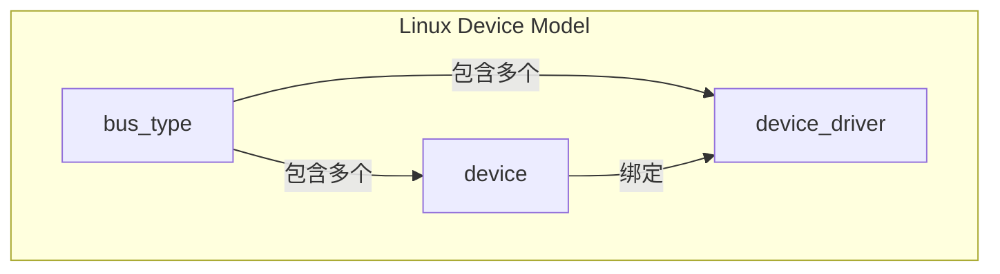

------

## 1.4_开发者视角

### 1.4.1_设备注册

驱动开发者通常通过以下函数注册设备：

```c
int device_register(struct device *dev);
void device_unregister(struct device *dev);
```

在 platform 总线上通常使用：

```c
platform_device_register(&pdev);
```

设备会出现在 `/sys/devices/` 下，udev 根据其属性创建设备节点。

------

### 1.4.2_驱动注册

驱动注册同理：

```c
int driver_register(struct device_driver *drv);
void driver_unregister(struct device_driver *drv);
```

或总线封装形式：

```c
platform_driver_register(&my_driver);
platform_driver_unregister(&my_driver);
```

------

### 1.4.3_匹配流程

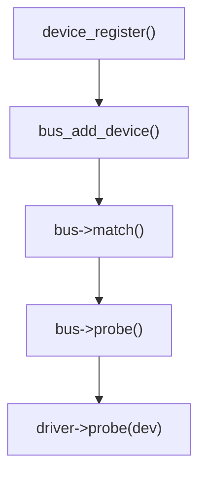

当一个新设备注册时，内核会遍历总线上的驱动列表进行匹配。

匹配成功后：

- 调用 `driver->probe(dev)`
- 创建 sysfs 节点
- 通知 uevent → 用户空间创建设备文件

------

## 1.5_用户视角

从用户角度看，设备模型体系通过 **sysfs** 提供可见接口：

- `/sys/devices/`：物理设备层次
- `/sys/bus/`：总线及设备驱动信息
- `/sys/class/`：功能分类，如 `/sys/class/leds`
- `/sys/dev/char/`、`/sys/dev/block/`：字符/块设备对应关系

用户空间工具（如 `udevadm info -a -p /sys/class/leds/...`）可直接查看设备与驱动绑定信息。

------

## 1.6_示例_Platform_驱动与设备模型关系

```c
// 简化平台驱动示例
static int led_probe(struct platform_device *pdev)
{
    struct device *dev = &pdev->dev;
    dev_info(dev, "LED device probed\n");
    return 0;
}

static const struct of_device_id led_of_match[] = {
    { .compatible = "nxp,imx6ull-led", },
    {}
};

static struct platform_driver led_driver = {
    .driver = {
        .name = "led_driver",
        .of_match_table = led_of_match,
    },
    .probe = led_probe,
};

module_platform_driver(led_driver);
```

该驱动自动展开为：

```c
static int __init led_driver_init(void)
{
    return platform_driver_register(&led_driver);
}
```

驱动注册后：

- `led_driver.driver.bus = &platform_bus_type`
- 匹配通过 `of_match_device()` 完成；
- 匹配成功调用 `led_probe()`；
- 设备出现在 `/sys/devices/platform/led_driver`。

------

## 1.7_调试与验证

| 检查项              | 命令                                       | 说明                    |
| ------------------- | ------------------------------------------ | ----------------------- |
| 查看设备树匹配情况  | `cat /sys/bus/platform/devices/*/modalias` | 查看匹配到的 compatible |
| 查看驱动加载情况    | `lsmod` / `dmesg                           | grep led_driver`        |
| 查看 sysfs 绑定关系 | `ls /sys/bus/platform/drivers/led_driver/` | 驱动绑定的设备          |
| 查看设备节点        | `udevadm info -a -p /sys/class/leds/...`   | 设备模型路径分析        |

------

## 1.8_小结

| 层次         | 结构体                                    | 关键作用                 |
| ------------ | ----------------------------------------- | ------------------------ |
| 设备层       | `struct device`                           | 描述硬件或逻辑设备       |
| 驱动层       | `struct device_driver`                    | 描述驱动实体及回调       |
| 总线层       | `struct bus_type`                         | 描述设备与驱动的匹配规则 |
| 类层         | `struct class`                            | 将设备暴露给用户空间     |
| 内核接口     | `device_register()` / `driver_register()` | 注册入口                 |
| 用户空间接口 | sysfs + uevent + udev                     | 实现设备可见性与动态管理 |

Linux 设备模型是所有驱动子系统的基础，它并不直接驱动硬件，而是提供了**驱动管理框架**。理解这一层，对后续 GPIO、I2C、SPI、PCI、USB、pinctrl 等子系统的学习具有根本性意义。


------

# 第2章_内核对象(kobject/kset)机制

## 2.1_主题引入

在 Linux 设备模型的最底层，存在一组通用的对象管理机制：**kobject（kernel object）**。它是整个设备模型的**最小原子单位**，承担以下任务：

- 维护内核对象（device、driver、bus、class）的基本生命周期；
- 建立对象层次结构（父子关系）；
- 在 sysfs 中自动创建对应的目录与属性文件；
- 统一引用计数、释放、热插拔（uevent）等基础管理功能。

几乎所有内核设备模型对象（`struct device`、`struct device_driver`、`struct bus_type`、`struct class`）都**嵌入了一个 kobject 成员**，作为其“元管理头”。

------

## 2.2_设计哲学

Linux 设备模型中，kobject 的设计核心是：

> **将 C 结构体对象的生命周期、层次关系和用户空间可见性统一管理。**

简言之，`kobject` 是内核对象的“身份标识系统”：

| 层次目标 | kobject 功能                              |
| -------- | ----------------------------------------- |
| 生命周期 | 统一引用计数（kref）与释放钩子（release） |
| 层次结构 | parent 指针形成对象树                     |
| 命名空间 | sysfs 中目录与属性命名                    |
| 用户接口 | 支撑 /sys 文件系统                        |
| 通知机制 | uevent 通知用户空间                       |

> 没有 kobject，就没有 sysfs；
> 没有 sysfs，就没有设备模型的可视化与热插拔。

------

## 2.3_数据结构视角

### 2.3.1_struct_kobject

位于 `include/linux/kobject.h`：

```c
struct kobject {
    const char              *name;       // 对象名
    struct list_head        entry;       // 挂入 kset 的链表节点
    struct kobject          *parent;     // 父对象
    struct kset             *kset;       // 所属集合
    struct kobj_type        *ktype;      // 类型信息
    struct kernfs_node      *sd;         // sysfs 对应目录节点
    struct kref             kref;        // 引用计数
};
```

### 2.3.2_核心子结构

#### (1)_struct_kset

kset 表示一组相关的 kobject 集合：

```c
struct kset {
    struct list_head 			list;     		// 包含的 kobject 链表
    spinlock_t       			list_lock;
    struct kobject    			kobj;    		// 自身也有一个 kobject
    const struct kset_uevent_ops *uevent_ops; 	 // 事件回调
};
```

它是中间层，用于在 sysfs 中形成层级目录（如 `/sys/class/leds/`）。

#### (2)_struct_kobj_type

用于定义对象的行为（类似“类”）：

```c
struct kobj_type {
    void (*release)(struct kobject *kobj);
    const struct sysfs_ops *sysfs_ops;
    struct attribute **default_attrs;
};
```

其中：

- `release()`：当引用计数为 0 时自动调用；
- `sysfs_ops`：定义读写属性文件的回调；
- `default_attrs`：默认导出的属性数组。

------

### 2.3.3_关系图

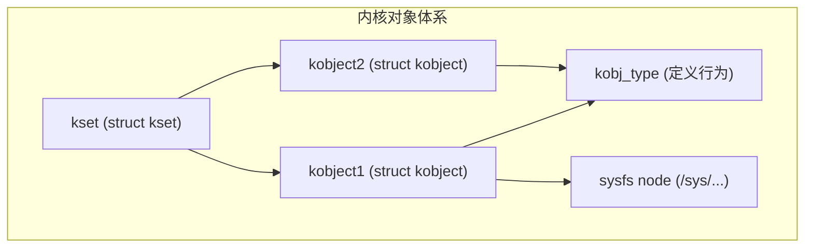

------

## 2.4_开发者视角

### 2.4.1_kobject_的生命周期

一个 kobject 的完整生命周期包括：

| 阶段 | 调用接口                                       | 作用                                   |
| ---- | ---------------------------------------------- | -------------------------------------- |
| 创建 | `kobject_init()` 或 `kobject_create_and_add()` | 初始化并添加到 sysfs                   |
| 使用 | `kobject_get()`                                | 引用计数 +1                            |
| 释放 | `kobject_put()`                                | 引用计数 -1；当为 0 时触发 `release()` |
| 销毁 | `release()`                                    | 用户自定义释放动作（通常为 `kfree()`） |

#### (1)_示例

```c
struct kobject *kobj;

kobj = kobject_create_and_add("my_kobj", kernel_kobj);
if (!kobj)
    return -ENOMEM;
```

sysfs 中出现：

```
/sys/kernel/my_kobj/
```

当不再使用：

```c
kobject_put(kobj);
```

------

### 2.4.2_kset_的使用

`kset` 允许多个 kobject 组织在同一集合中，形成 `/sys/class/xxx/` 目录。

示例：

```c
static struct kset *my_kset;

my_kset = kset_create_and_add("my_devices", NULL, kernel_kobj);
if (!my_kset)
    return -ENOMEM;

struct kobject *kobj = kobject_create_and_add("dev1", &my_kset->kobj);
```

sysfs 目录结构：

```
/sys/kernel/my_devices/dev1/
```

------

### 2.4.3_sysfs_属性绑定

属性通过 `struct attribute` 和 `sysfs_ops` 实现：

```c
static ssize_t my_show(struct kobject *kobj,
                       struct attribute *attr, char *buf)
{
    return sprintf(buf, "hello world\n");
}

static const struct sysfs_ops my_sysfs_ops = {
    .show = my_show,
};

static struct kobj_type my_ktype = {
    .release = my_release,
    .sysfs_ops = &my_sysfs_ops,
};
```

注册后，在 `/sys/kernel/my_kobj/` 可直接读取属性内容。

------

### 2.4.4_与设备模型结合

每个设备模型对象都包含一个 kobject：

| 内核对象               | 嵌入位置                            |
| ---------------------- | ----------------------------------- |
| `struct device`        | 成员：`struct kobject kobj;`        |
| `struct device_driver` | 成员：`struct kobject kobj;`        |
| `struct bus_type`      | 成员：`struct kobject subsys.kobj;` |
| `struct class`         | 成员：`struct kobject kobj;`        |

这使得所有设备、驱动、总线都能自动在 `/sys/` 中生成目录与属性。
 因此，kobject/kset 是整个设备模型树的“根节点机制”。

------

## 2.5_用户视角

用户空间中看到的 `/sys` 层次正是内核对象树的映射：

| sysfs 路径      | 对应内核结构         |
| --------------- | -------------------- |
| `/sys/devices/` | `struct device`      |
| `/sys/class/`   | `struct class`       |
| `/sys/bus/`     | `struct bus_type`    |
| `/sys/kernel/`  | `kernel_kobj` 根节点 |

当驱动注册设备时，例如：

```c
platform_driver_register()
platform_device_register()
```

kobject 会自动创建 `/sys/devices/platform/.../` 节点。
 udev 通过这些事件触发规则自动创建设备文件。

------

## 2.6_可视化_设备模型中的_kobject_继承关系

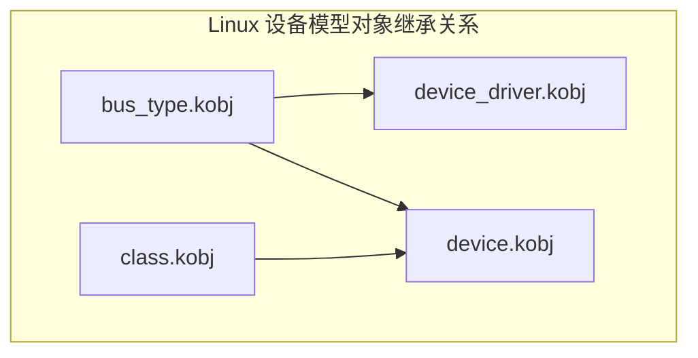

------

## 2.7_调试与验证

| 项目              | 命令                                     | 说明                |
| ----------------- | ---------------------------------------- | ------------------- |
| 查看内核对象树    | `tree /sys/devices`                      | 观察层次结构        |
| 查看 kobject 创建 | `dmesg                                   | grep kobject`       |
| 验证属性文件      | `cat /sys/kernel/my_kobj/...`            | 验证 sysfs 属性读写 |
| 查看引用计数      | 动态调试：`kobject_get()/put()` 打印日志 | 分析生命周期        |
| uevent 验证       | `udevadm monitor --kernel`               | 观察事件触发        |

------

## 2.8_小结

| 概念     | 数据结构                                     | 作用                             |
| -------- | -------------------------------------------- | -------------------------------- |
| 内核对象 | `struct kobject`                             | 提供统一的对象标识与生命周期管理 |
| 对象集合 | `struct kset`                                | 聚合同类对象，形成 sysfs 层级    |
| 类型描述 | `struct kobj_type`                           | 定义 release、sysfs 属性行为     |
| 内核接口 | `kobject_create_and_add()` / `kobject_put()` | 管理对象生命周期                 |
| 用户接口 | sysfs + uevent                               | 实现可视化与动态通知             |

------

> **总结：**
>
> - kobject/kset 是设备模型的骨架；
> - 它提供引用计数、命名、目录结构和事件机制；
> - 所有设备、驱动、总线、类都构建在它之上；
> - 理解 kobject，就是理解 Linux 设备模型的根基。


------

# 第3章_bus_type_总线机制与匹配流程详解

## 3.1_主题引入

在 Linux 设备模型中，**bus_type（总线类型）** 是连接 `device` 与 `driver` 的核心中介。它定义了**匹配规则**、**注册机制**与**事件传播路径**。

* 从驱动开发角度看，总线机制是 `device` 与 `driver` 结合的逻辑桥梁。
* 只有通过 bus_type 注册的匹配流程，驱动的 `probe()` 才会被调用。


典型总线包括：

| 总线类型 | 对应结构体          | 文件路径                      | 匹配函数             |
| -------- | ------------------- | ----------------------------- | -------------------- |
| platform | `platform_bus_type` | `drivers/base/platform.c`     | `platform_match()`   |
| i2c      | `i2c_bus_type`      | `drivers/i2c/i2c-core-base.c` | `i2c_device_match()` |
| spi      | `spi_bus_type`      | `drivers/spi/spi.c`           | `spi_match_device()` |
| usb      | `usb_bus_type`      | `drivers/usb/core/driver.c`   | `usb_device_match()` |

------

## 3.2_设计哲学

### 3.2.1_统一的抽象层_bus_type

设备模型将所有设备与驱动的连接抽象为统一概念——**总线（bus）**：

> 任何能承载设备与驱动的匹配逻辑的实体都称为总线。

无论是物理总线（如 I2C、SPI、USB）还是虚拟总线（如 platform），都必须提供以下功能：

| 功能       | 对应回调                                                     | 说明                     |
| ---------- | ------------------------------------------------------------ | ------------------------ |
| 匹配       | `int (*match)(struct device *dev, struct device_driver *drv);` | 决定设备与驱动是否兼容   |
| 探测       | `int (*probe)(struct device *dev);`                          | 匹配成功后执行驱动初始化 |
| 移除       | `int (*remove)(struct device *dev);`                         | 驱动卸载时回调           |
| 热插拔事件 | `int (*uevent)(struct device *dev, struct kobj_uevent_env *env);` | 生成 uevent 通知         |
| 属性接口   | `const struct attribute_group **bus_groups;`                 | 导出 sysfs 属性组        |

这种抽象保证了无论什么类型的硬件，匹配逻辑都能遵循同一标准接口。

------

### 3.2.2_核心关系图

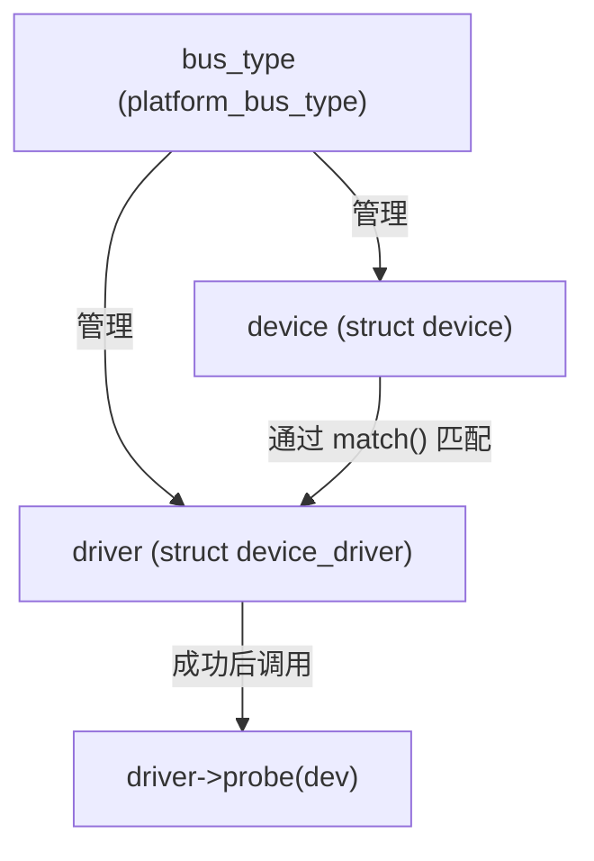

------

## 3.3_数据结构视角

### 3.3.1_struct_bus_type_定义

位于 `include/linux/device/bus.h`：

```c
struct bus_type {
    const char      *name;
    const char      *dev_name;
    struct device   *dev_root;

    struct bus_attribute 		*bus_attrs;
    const struct attribute_group **bus_groups;

    int (*match)(struct device *dev, struct device_driver *drv);
    int (*uevent)(struct device *dev, struct kobj_uevent_env *env);
    int (*probe)(struct device *dev);
    int (*remove)(struct device *dev);
    void (*shutdown)(struct device *dev);

    struct subsys_private *p;  // 私有成员
};
```

**字段说明：**

| 字段               | 作用                                     |
| ------------------ | ---------------------------------------- |
| `name`             | 总线名（如 `"platform"`、`"i2c"`）       |
| `match`            | 匹配函数，决定驱动与设备是否兼容         |
| `probe` / `remove` | 匹配成功后的驱动加载/卸载回调            |
| `uevent`           | 产生热插拔事件（用户空间监听）           |
| `bus_groups`       | 定义 sysfs 属性导出接口                  |
| `p`                | 私有数据（包含 kset、driver/dev 列表等） |

------

### 3.3.2_struct_subsys_private_内部组成

该结构体由 `bus_register()` 自动分配：

```c
struct subsys_private {
    struct kset subsys;
    struct kset *devices_kset;
    struct kset *drivers_kset;
    struct klist klist_devices;
    struct klist klist_drivers;
};
```

用于管理：

- 所有注册到该总线的设备；
- 所有注册到该总线的驱动；
- 驱动与设备匹配关系。

------

## 3.4_开发者视角

### 3.4.1_总线注册

通过以下接口注册新总线：

```c
int bus_register(struct bus_type *bus);
void bus_unregister(struct bus_type *bus);
```

注册后，会自动在 `/sys/bus/` 下生成对应目录。

例如：

```c
platform_bus_type.name = "platform";
bus_register(&platform_bus_type);
```

生成路径：

```
/sys/bus/platform/
    ├── devices/
    ├── drivers/
```

------

### 3.4.2_设备注册与绑定流程

#### (1)_注册设备

当调用：

```c
device_register(&dev);
```

或

```c
platform_device_register(&pdev);
```

内核会执行以下步骤：

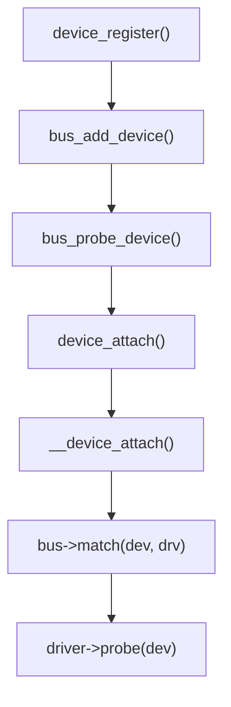

#### (2)_关键逻辑分析

- `bus_add_device()`：将设备添加到总线设备链表；
- `bus_probe_device()`：尝试在该总线上为设备匹配驱动；
- `bus->match()`：匹配函数；
- 匹配成功 → 调用 `driver->probe(dev)`。

------

### 3.4.3_驱动注册与匹配流程

当执行：

```c
platform_driver_register(&drv);
```

会间接调用：

```c
driver_register(&drv->driver);
```

驱动注册后，内核执行：

```c
bus_add_driver()
    ↓
driver_attach()
    ↓
bus_for_each_dev()
    ↓
__driver_attach()
    ↓
bus->match(dev, drv)
```

成功后：

- 调用 `driver_probe_device()`
- 进而执行 `drv->probe(dev)`

------

### 3.4.4_platform_match()_示例解析

位于 `drivers/base/platform.c`：

```c
static int platform_match(struct device *dev, struct device_driver *drv)
{
    struct platform_device *pdev = to_platform_device(dev);
    struct platform_driver *pdrv = to_platform_driver(drv);

    /* ① 设备树匹配 */
    if (of_driver_match_device(dev, drv))
        return 1;

    /* ② ACPI 匹配 */
    if (acpi_driver_match_device(dev, drv))
        return 1;

    /* ③ 名称匹配 */
    return (strcmp(pdev->name, pdrv->driver.name) == 0);
}
```

匹配逻辑优先级：

```
设备树 → ACPI → 名称匹配
```

------

## 3.5_用户视角

从用户空间看，bus_type 的存在使设备层次和驱动绑定可视化：

```
/sys/bus/platform/
├── devices/
│   ├── 2000000.gpio/
│   └── 2020000.uart/
└── drivers/
    ├── imx_gpio/
    └── imx_uart/
```

用户可以通过以下命令观察绑定关系：

| 操作             | 命令                                                  | 说明             |
| ---------------- | ----------------------------------------------------- | ---------------- |
| 查看设备绑定驱动 | `ls -l /sys/bus/platform/devices/2000000.gpio/driver` | 指向对应驱动     |
| 查看驱动绑定设备 | `ls -l /sys/bus/platform/drivers/imx_gpio/`           | 列出所有绑定设备 |
| 查看匹配信息     | `cat /sys/bus/platform/devices/2000000.gpio/modalias` | 输出 alias 名称  |
| 触发 uevent      | `echo add > /sys/bus/platform/devices/.../uevent`     | 通知 udev        |

------

## 3.6_示例_Platform_设备与驱动匹配全过程

### 3.6.1_设备树定义

```dts
led@0 {
    compatible = "nxp,imx6ull-led";
    reg = <0x02000000 0x1000>;
};
```

### 3.6.2_驱动定义

```c
static const struct of_device_id led_of_match[] = {
    { .compatible = "nxp,imx6ull-led" },
    {}
};

static int led_probe(struct platform_device *pdev)
{
    dev_info(&pdev->dev, "LED probe success!\n");
    return 0;
}

static struct platform_driver led_driver = {
    .driver = {
        .name = "led_driver",
        .of_match_table = led_of_match,
    },
    .probe = led_probe,
};

module_platform_driver(led_driver);
```

### 3.6.3_执行链概览

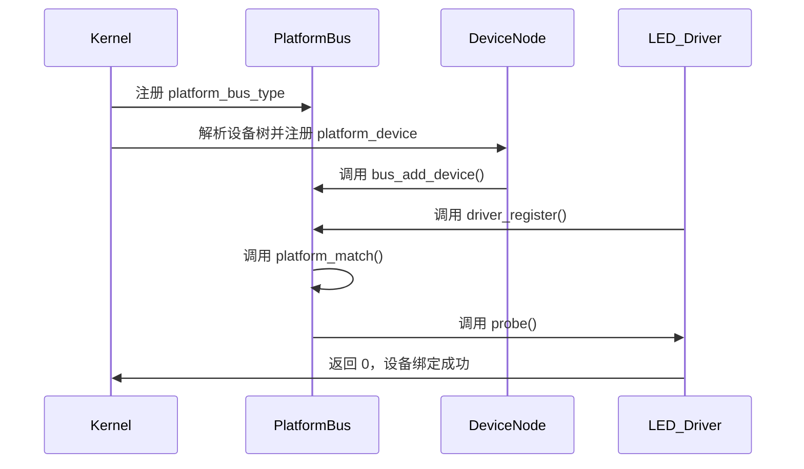

------

## 3.7_调试与验证

| 调试项        | 命令                                                        | 说明              |
| ------------- | ----------------------------------------------------------- | ----------------- |
| 查看总线注册  | `ls /sys/bus/`                                              | 查看所有 bus_type |
| 检查设备绑定  | `ls /sys/bus/platform/drivers/`                             | 驱动列表          |
| 查看 modalias | `cat /sys/bus/platform/devices/xxx/modalias`                | 匹配名            |
| 驱动加载日志  | `dmesg                                                      | grep probe`       |
| 动态解绑驱动  | `echo none > /sys/bus/platform/devices/xxx/driver_override` | 控制匹配行为      |

------

## 3.8_小结

| 层次     | 数据结构                        | 关键函数            | 作用                 |
| -------- | ------------------------------- | ------------------- | -------------------- |
| 总线     | `struct bus_type`               | `bus_register()`    | 注册总线管理框架     |
| 设备     | `struct device`                 | `device_register()` | 注册硬件节点         |
| 驱动     | `struct device_driver`          | `driver_register()` | 注册驱动实体         |
| 匹配     | `bus->match()`                  | `platform_match()`  | 判断匹配关系         |
| 探测     | `bus->probe()` / `drv->probe()` | 设备初始化回调      |                      |
| sysfs 层 | `/sys/bus/...`                  | 自动生成            | 可视化层次与绑定关系 |

> **总结：**
>  bus_type 是驱动开发的核心接口之一。
>  它定义了驱动和设备如何相遇、如何通信、如何解绑。
>  理解 `bus_type` 的 match 流程，是理解 Linux 驱动加载机制的关键。


------

# 第4章_device_与_device_driver_的匹配与绑定过程

## 4.1_主题引入

在上一章中，我们从总线层（`bus_type`）的角度看到了设备模型的匹配框架。但对驱动开发者而言，真正重要的不是抽象的 `bus_type`，而是：

> **当设备（device）注册后，内核是如何一步步找到对应驱动（device_driver）并触发 probe() 的？**

这一章，我们从设备注册的角度出发，完整剖析：

- 匹配核心函数：`of_driver_match_device()`、`of_match_device()`、`device_attach()`；
- 驱动注册与设备匹配的双向路径；
- 匹配成功后的绑定机制与释放逻辑；
- 实际驱动中的匹配链路验证。

------

## 4.2_设计哲学

Linux 内核设备模型的匹配机制遵循“三层逻辑”：

| 层次   | 关键角色        | 核心逻辑                     |
| ------ | --------------- | ---------------------------- |
| 总线层 | `bus_type`      | 定义匹配回调 match()         |
| 驱动层 | `device_driver` | 定义 probe()/remove() 等回调 |
| 设备层 | `device`        | 注册设备、调用 bus 匹配流程  |

该机制的设计哲学是：

> **匹配规则由总线定义，匹配行为由内核框架触发，匹配成功后由驱动执行。**

------

## 4.3_数据结构视角

### 4.3.1_struct_device

回顾第 1 章中提及的结构，这里仅列出与匹配有关的核心字段：

```c
struct device {
    struct device_driver *driver;     // 当前绑定的驱动
    struct bus_type      *bus;        // 所属总线
    struct device_node   *of_node;    // 设备树节点（匹配关键字段）
    void                 *platform_data;
    ...
};
```

其中：

- `bus` 指向所属总线（如 platform_bus_type）；
- `driver` 指向匹配成功后的驱动对象；
- `of_node` 是匹配设备树表的桥梁。

------

### 4.3.2_struct_device_driver

```c
struct device_driver {
    const struct of_device_id *of_match_table;
    struct bus_type *bus;
    int  (*probe)(struct device *dev);
    void (*remove)(struct device *dev);
};
```

`of_match_table` 是设备树匹配的核心字段。
 它定义了驱动可支持的硬件“签名”：

```c
static const struct of_device_id led_of_match[] = {
    { .compatible = "nxp,imx6ull-led", },
    {}
};
```

------

## 4.4_匹配调用链全景图

设备与驱动匹配的完整调用链如下：

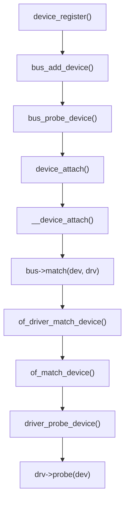

可以总结为：

> **注册设备 → 触发总线匹配 → 匹配成功 → 调用驱动 probe()**

------

## 4.5_关键函数剖析

### 4.5.1_device_attach()

位于 `drivers/base/dd.c`：

```c
int device_attach(struct device *dev)
{
    int ret = 0;

    if (dev->driver)
        return device_bind_driver(dev);

    ret = bus_for_each_drv(dev->bus, NULL, dev, __device_attach);
    return ret;
}
```

解释：

- 若设备已绑定驱动，则直接调用 `device_bind_driver()`；
- 否则，遍历总线上的所有驱动，通过 `__device_attach()` 尝试匹配。

------

### 4.5.2_device_attach()

```c
static int __device_attach(struct device_driver *drv, void *data)
{
    struct device *dev = data;

    if (!driver_match_device(drv, dev))
        return 0;

    return driver_probe_device(drv, dev);
}
```

调用链继续进入：

- `driver_match_device()` → 调用总线定义的 `bus->match()`；
- 匹配成功后 → 调用 `driver_probe_device()`。

------

### 4.5.3_driver_match_device()

```c
static inline int driver_match_device(struct device_driver *drv,
                                      struct device *dev)
{
    return drv->bus->match ? drv->bus->match(dev, drv) : 1;
}
```

这就是平台总线的匹配入口。
 最终调用 `platform_match()`（上一章讲解）。

------

### 4.5.4_of_driver_match_device()

位于 `drivers/of/device.c`：

```c
int of_driver_match_device(const struct device *dev,
                           const struct device_driver *drv)
{
    if (!dev->of_node || !drv->of_match_table)
        return 0;

    return of_match_device(drv->of_match_table, dev);
}
```

作用：

- 若设备或驱动无设备树信息，则跳过；
- 否则调用 `of_match_device()` 进行匹配。

------

### 4.5.5_of_match_device()

```c
const struct of_device_id *of_match_device(
        const struct of_device_id *matches,
        const struct device *dev)
{
    struct device_node *node = dev->of_node;

    while (matches->compatible[0]) {
        if (of_device_is_compatible(node, matches->compatible))
            return matches;
        matches++;
    }
    return NULL;
}
```

说明：

- 遍历驱动支持的 compatible 列表；
- 若匹配到与设备节点中 `compatible` 相同的字符串，则返回该项；
- 否则继续匹配。

------

### 4.5.6_driver_probe_device()

匹配成功后调用：

```c
int driver_probe_device(struct device_driver *drv, struct device *dev)
{
    if (dev->driver)
        return -EBUSY;

    dev->driver = drv;
    if (drv->probe)
        return drv->probe(dev);
    return 0;
}
```

作用：

1. 建立绑定关系：`dev->driver = drv`;
2. 调用驱动的 `probe()` 完成硬件初始化；
3. sysfs 创建关联节点。

------

## 4.6_设备绑定与解绑机制

### 4.6.1_绑定阶段

绑定发生在 `driver_probe_device()` 中：

```c
dev->driver = drv;
```

随后通过 `kobject_uevent()` 通知用户空间，
 `udev` 根据规则创建设备文件节点。

------

### 4.6.2_解绑阶段

解绑调用 `device_release_driver()`：

```c
void device_release_driver(struct device *dev)
{
    if (dev->driver && dev->driver->remove)
        dev->driver->remove(dev);
    dev->driver = NULL;
}
```

该函数通常在以下场景触发：

- 模块卸载；
- 设备热拔插；
- 手动写入 `/sys/bus/.../unbind`。

------

## 4.7_完整匹配流程可视化

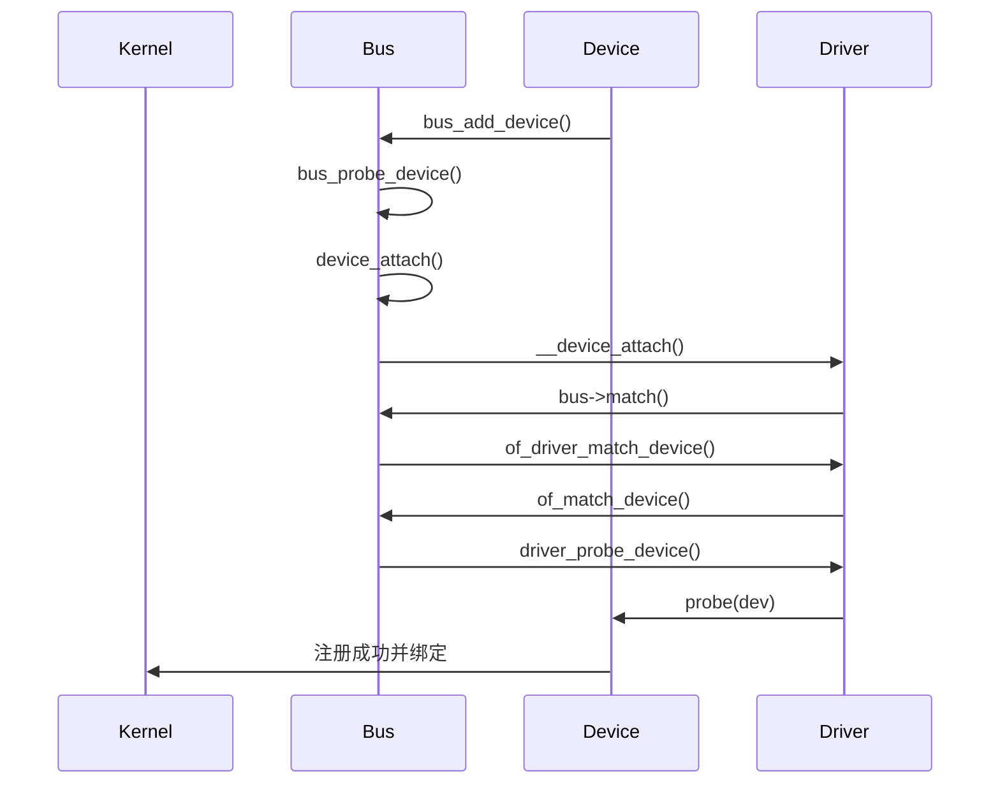

------

## 4.8_驱动开发中的应用示例

### 4.8.1_设备树部分

```dts
led@0 {
    compatible = "nxp,imx6ull-led";
    reg = <0x02000000 0x1000>;
};
```

### 4.8.2_驱动代码

```c
static const struct of_device_id led_of_match[] = {
    { .compatible = "nxp,imx6ull-led" },
    {}
};
MODULE_DEVICE_TABLE(of, led_of_match);

static int led_probe(struct platform_device *pdev)
{
    dev_info(&pdev->dev, "LED device matched and probed!\n");
    return 0;
}

static struct platform_driver led_driver = {
    .driver = {
        .name = "led_driver",
        .of_match_table = led_of_match,
    },
    .probe = led_probe,
};

module_platform_driver(led_driver);
```

输出日志：

```
[   2.104] led_driver: LED device matched and probed!
```

sysfs：

```
/sys/bus/platform/drivers/led_driver/
└── 2000000.led
```

------

## 4.9_调试与验证

| 检查项           | 命令                                                         | 说明             |
| ---------------- | ------------------------------------------------------------ | ---------------- |
| 查看匹配到的驱动 | `ls /sys/bus/platform/drivers/`                              | 验证 driver 名称 |
| 查看绑定设备     | `ls /sys/bus/platform/drivers/led_driver/`                   | 验证 device 出现 |
| 查看 modalias    | `cat /sys/bus/platform/devices/.../modalias`                 | 匹配名验证       |
| 查看 uevent      | `udevadm monitor --kernel`                                   | 驱动绑定事件     |
| 驱动解绑         | `echo 2000000.led > /sys/bus/platform/drivers/led_driver/unbind` | 手动解绑         |

------

## 4.10_小结

| 层次     | 函数                                        | 作用               |
| -------- | ------------------------------------------- | ------------------ |
| 设备注册 | `device_register()`                         | 注册到内核设备树   |
| 驱动注册 | `driver_register()`                         | 注册到总线驱动链表 |
| 匹配过程 | `bus->match()` → `of_driver_match_device()` | 检查兼容性         |
| 绑定过程 | `driver_probe_device()` → `drv->probe()`    | 建立驱动绑定       |
| 解绑过程 | `device_release_driver()`                   | 解除驱动绑定       |
| 用户层   | sysfs + uevent                              | 可视化绑定关系     |

------

> **总结：**
>
> - 匹配的实质是 `device` 与 `driver` 在同一总线上由 `bus->match()` 完成；
> - 驱动匹配流程依赖 `of_match_table` 或 `name` 机制；
> - 匹配成功后执行 `probe()`，解绑时执行 `remove()`；
> - sysfs 中 `/sys/bus/.../drivers/...` 目录即为绑定关系的直接映射。


------

# 第5章_of_device_id_与_of_match_table_匹配机制详解

## 5.1_主题引入

Linux 设备模型的匹配机制中，**of_device_id 表（又称 of_match_table）** 是设备树（Device Tree, DT）环境下最核心的匹配结构。它建立了驱动与设备树节点之间的“语言桥梁”。

传统匹配依靠字符串名称（如 `pdev->name == drv->name`），而在使用设备树的内核（Device Tree Enabled Kernel）中，**所有匹配都转移到设备树属性 `compatible` 与驱动的 `of_match_table` 表上完成**。

------

## 5.2_设计哲学

Linux 的设备树匹配机制遵循以下原则：

| 原则                             | 说明                                                         |
| -------------------------------- | ------------------------------------------------------------ |
| 一切匹配以 `compatible` 为核心   | 匹配的唯一关键字段是设备树节点中的 `compatible` 字符串       |
| 驱动提供匹配表（of_match_table） | 驱动声明可识别的硬件类型                                     |
| 内核统一匹配接口                 | 所有总线共用 `of_driver_match_device()` 和 `of_match_device()` |
| 匹配结果决定 probe 调用          | 匹配成功后立即触发 `driver->probe()`                         |

> 简言之：**“设备树 compatible → 驱动 of_match_table → 匹配成功 → probe()”**

------

## 5.3_数据结构视角

### 5.3.1_struct_of_device_id

位于 `include/linux/mod_devicetable.h`：

```c
struct of_device_id {
    char name[32];
    char type[32];
    char compatible[128];
    const void *data;
};
```

| 字段         | 含义                                                         |
| ------------ | ------------------------------------------------------------ |
| `name`       | 可选，匹配 `device_node.name`（一般不使用）                  |
| `type`       | 可选，匹配 `device_node.type`（极少使用）                    |
| `compatible` | 主要匹配字段，对应 DTS 中的 `"compatible"` 属性              |
| `data`       | 附加数据指针，可在匹配后被驱动直接取用（常用于区分 SoC 版本或配置） |

------

### 5.3.2_驱动结构中的关联

驱动在定义时，将匹配表指向 `driver.of_match_table`：

```c
static const struct of_device_id led_of_match[] = {
    { .compatible = "nxp,imx6ull-led", .data = NULL },
    { .compatible = "fsl,imx6ull-led", .data = NULL },
    { }  // 表结束符，必须保留
};
MODULE_DEVICE_TABLE(of, led_of_match);

static struct platform_driver led_driver = {
    .driver = {
        .name = "led_driver",
        .of_match_table = led_of_match,
    },
    .probe = led_probe,
};
```

> `.of_match_table` 必须以空项 `{}` 结尾，否则匹配循环不会终止。

------

### 5.3.3_MODULE_DEVICE_TABLE_宏展开

`MODULE_DEVICE_TABLE(of, led_of_match);`
 此宏位于 `include/linux/module.h`：

```c
#define MODULE_DEVICE_TABLE(type, name) \
    extern const typeof(name) __mod_##type##__##name##_device_table \
    __attribute__ ((unused, alias(#name)));
```

该宏会：

1. 在 ELF 符号表中生成一个名为
    `__mod_of__led_of_match_device_table` 的符号；
2. 使 `depmod` 工具能扫描出模块支持的 `compatible`；
3. 允许内核模块自动加载（udev 根据 alias 触发）。

------

## 5.4_开发者视角

### 5.4.1_匹配过程分析

匹配核心逻辑在 `drivers/of/device.c`：

```c
int of_driver_match_device(const struct device *dev,
                           const struct device_driver *drv)
{
    if (!dev->of_node || !drv->of_match_table)
        return 0;

    return of_match_device(drv->of_match_table, dev) != NULL;
}
```

继续深入 `of_match_device()`：

```c
const struct of_device_id *of_match_device(
        const struct of_device_id *matches,
        const struct device *dev)
{
    const struct device_node *node = dev->of_node;

    while (matches->compatible[0]) {
        if (of_device_is_compatible(node, matches->compatible))
            return matches;
        matches++;
    }
    return NULL;
}
```

而 `of_device_is_compatible()` 位于 `drivers/of/base.c`：

```c
bool of_device_is_compatible(const struct device_node *device,
                             const char *compat)
{
    const char *cp;
    int index = 0;

    while ((cp = of_get_property(device, "compatible", &len))) {
        if (!strcmp(cp, compat))
            return true;
        index++;
    }
    return false;
}
```

**即：**
 内核逐项遍历 `drv->of_match_table`，
 依次比较 `compatible` 字符串与设备节点属性是否一致。

------

### 5.4.2_匹配优先级

匹配优先顺序（针对 platform、i2c、spi 等总线均一致）：

| 优先级 | 匹配方式                                    | 来源           |
| ------ | ------------------------------------------- | -------------- |
| ①      | 设备树 `compatible` 与驱动 `of_match_table` | DT 匹配        |
| ②      | ACPI ID 表                                  | x86/ACPI 环境  |
| ③      | 平台名（pdev->name == drv->name）           | 非 DT 兼容平台 |

示例：
 若 DTS 中定义：

```dts
led@0 {
    compatible = "nxp,imx6ull-led";
};
```

驱动声明：

```c
{ .compatible = "nxp,imx6ull-led" }
```

→ 匹配成功。
 若驱动缺少 of_match_table，则退回到 `pdev->name` 名称匹配。

------

### 5.4.3_多兼容匹配表(SoC_区分)

常见于不同硬件平台共享同一驱动源码时：

```c
static const struct of_device_id uart_of_match[] = {
    { .compatible = "fsl,imx6ul-uart",  .data = &uart_data_imx6ul },
    { .compatible = "fsl,imx6ull-uart", .data = &uart_data_imx6ull },
    {}
};
```

在 probe() 中可直接读取 `.data`：

```c
const struct of_device_id *match;
match = of_match_device(uart_of_match, &pdev->dev);
if (match)
    hw_config = match->data;
```

这样驱动在同一源码中可支持多版本硬件。

------

### 5.4.4_of_match_ptr()_辅助宏

某些驱动在非设备树环境下也会编译，因此常使用：

```c
.driver = {
    .of_match_table = of_match_ptr(led_of_match),
}
```

`of_match_ptr()` 在非 DT 编译时展开为 `NULL`，保证兼容：

```c
#ifdef CONFIG_OF
#define of_match_ptr(_ptr) (_ptr)
#else
#define of_match_ptr(_ptr) NULL
#endif
```

------

## 5.5_用户视角

在用户空间，匹配成功的设备节点会反映到 sysfs：

```
/sys/bus/platform/drivers/led_driver/
└── 2000000.led
```

同时 `modalias` 属性显示 alias 名：

```bash
cat /sys/bus/platform/devices/2000000.led/modalias
of:NnxpCimx6ull-led
```

`udev` 规则中会利用该 alias 触发驱动加载：

```bash
modprobe led_driver
```

------

## 5.6_完整匹配过程可视化

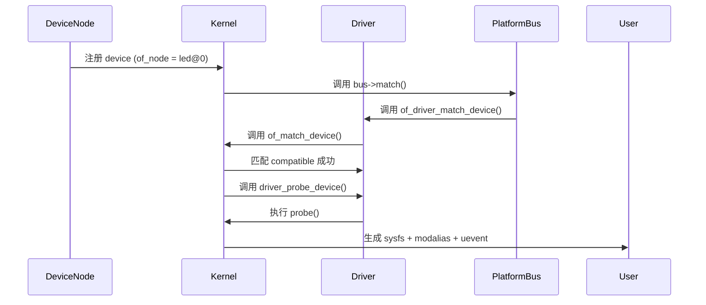

------

## 5.7_示例_多_compatible_匹配验证

### 5.7.1_设备树定义

```dts
led@0 {
    compatible = "nxp,imx6ull-led", "nxp,imx6ul-led";
};
```

### 5.7.2_驱动定义

```c
static const struct of_device_id led_of_match[] = {
    { .compatible = "nxp,imx6ul-led" },
    { .compatible = "nxp,imx6ull-led" },
    {}
};
```

**匹配结果：**
 内核会按 DTS 中 compatible 列表顺序匹配，
 若第一个失败，会继续尝试下一个。
 最终匹配 `nxp,imx6ull-led`，进入 probe。

------

## 5.8_调试与验证

| 检查项              | 命令                                         | 说明             |
| ------------------- | -------------------------------------------- | ---------------- |
| 查看设备 compatible | `cat /proc/device-tree/.../compatible`       | DTS 中的字符串   |
| 查看驱动支持表      | `strings drivers/.../*.ko                    | grep compatible` |
| 查看匹配结果        | `dmesg                                       | grep probe`      |
| 验证 alias          | `cat /sys/bus/platform/devices/.../modalias` | 匹配标识符       |
| 模块自动加载验证    | `udevadm monitor`                            | 监听 uevent 触发 |

------

## 5.9_小结

| 概念     | 数据结构                   | 核心接口            | 作用            |
| -------- | -------------------------- | ------------------- | --------------- |
| 匹配表   | `struct of_device_id`      | `of_match_device()` | 匹配 compatible |
| 匹配入口 | `of_driver_match_device()` | 总线 match 函数调用 |                 |
| 注册宏   | `MODULE_DEVICE_TABLE()`    | 模块自动加载支持    |                 |
| 宏保护   | `of_match_ptr()`           | 支持非 DT 编译环境  |                 |
| 结果输出 | `/sys/bus/.../modalias`    | 用户空间 alias 可见 |                 |

> **总结：**
>
> - `of_device_id` 是设备树匹配的核心桥梁；
> - 匹配基于字符串相等，不存在模糊匹配；
> - 驱动表项 `.data` 可用于 SoC 变种区分；
> - 驱动加载自动化依赖于 `MODULE_DEVICE_TABLE(of, xxx)`。


------

# 第6章_platform_device_与_platform_driver_框架

## 6.1_主题引入

在 Linux 设备模型体系中，`platform_device` 与 `platform_driver` 是最常见的一对设备-驱动结构。
 它们主要服务于**片上外设（SoC on-chip peripherals）**，
 这些外设通常不通过标准总线（如 PCI、USB、I²C）进行枚举，
 因此 Linux 内核需要人为地在 **platform 总线（platform_bus_type）** 上注册并匹配这些设备。

> **核心思想：**
>
> - 通过 `platform_device_register()` 注册设备；
> - 通过 `platform_driver_register()` 注册驱动；
> - platform 总线负责匹配二者；
> - 匹配成功后调用 `driver->probe()`。

------

## 6.2_设计哲学

### 6.2.1_platform_框架的定位

Platform 机制用于统一管理：

- **片上外设（SoC peripherals）**
- **虚拟设备（software-only devices）**
- **非自枚举型设备**

区别于 PCI/USB：

- PCI/USB 设备由硬件总线自动扫描；
- Platform 设备需要 **显式注册**（由 DTS 或手动注册）。

------

### 6.2.2_三层结构模型

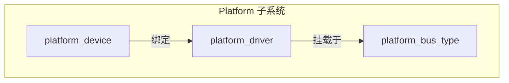

所有 platform 设备/驱动都通过 `platform_bus_type` 连接。

------

## 6.3_数据结构视角

### 6.3.1_struct_platform_device

位于 `include/linux/platform_device.h`：

```c
struct platform_device {
    const char 						*name;
    int 							id;
    struct device  					dev;
    u32 							num_resources;
    struct resource 				*resource;
    const struct platform_device_id   *id_entry;
};
```

| 字段       | 说明                                    |
| ---------- | --------------------------------------- |
| `name`     | 用于匹配驱动（非 DT 模式）              |
| `id`       | 区分多个同名设备（如 `led.0`、`led.1`） |
| `dev`      | 继承自通用设备结构（struct device）     |
| `resource` | 硬件资源表（I/O、IRQ、MEM）             |
| `id_entry` | 匹配表（非 DT 模式下使用）              |

------

### 6.3.2_struct_platform_driver

```c
struct platform_driver {
    int (*probe)(struct platform_device *);
    int (*remove)(struct platform_device *);
    struct device_driver driver;
    const struct platform_device_id *id_table;
};
```

| 字段               | 说明                               |
| ------------------ | ---------------------------------- |
| `probe` / `remove` | 驱动绑定/解绑时的回调              |
| `driver`           | 基础驱动结构（嵌入 device_driver） |
| `id_table`         | 平台 ID 匹配表（非 DT 环境）       |

------

### 6.3.3_struct_resource(硬件资源表)

```c
struct resource {
    resource_size_t start;
    resource_size_t end;
    const char *name;
    unsigned long flags;
};
```

常用标志：

| 标志             | 含义               |
| ---------------- | ------------------ |
| `IORESOURCE_MEM` | 内存映射寄存器区域 |
| `IORESOURCE_IRQ` | 中断号             |
| `IORESOURCE_DMA` | DMA 通道           |

------

## 6.4_开发者视角

### 6.4.1_注册设备

两种方式：

#### (1)_静态注册(设备树方式)

在设备树定义：

```dts
led@0 {
    compatible = "nxp,imx6ull-led";
    reg = <0x02000000 0x1000>;
    interrupts = <23>;
};
```

→ 内核解析后自动生成 `platform_device` 并注册。

#### (2)_动态注册(代码方式)

```c
static struct resource led_res[] = {
    [0] = {
        .start = 0x02000000,
        .end   = 0x02000FFF,
        .flags = IORESOURCE_MEM,
    },
};

static struct platform_device led_device = {
    .name = "led_driver",
    .id = -1,
    .num_resources = ARRAY_SIZE(led_res),
    .resource = led_res,
};

platform_device_register(&led_device);
```

------

### 6.4.2_注册驱动

```c
static int led_probe(struct platform_device *pdev)
{
    dev_info(&pdev->dev, "LED device probed!\n");
    return 0;
}

static int led_remove(struct platform_device *pdev)
{
    dev_info(&pdev->dev, "LED device removed!\n");
    return 0;
}

static const struct of_device_id led_of_match[] = {
    { .compatible = "nxp,imx6ull-led", },
    {}
};
MODULE_DEVICE_TABLE(of, led_of_match);

static struct platform_driver led_driver = {
    .probe = led_probe,
    .remove = led_remove,
    .driver = {
        .name = "led_driver",
        .of_match_table = of_match_ptr(led_of_match),
    },
};
module_platform_driver(led_driver);
```

> 宏 `module_platform_driver()` 等价于：
>
> ```c
> static int __init led_init(void) {
>     return platform_driver_register(&led_driver);
> }
> static void __exit led_exit(void) {
>     platform_driver_unregister(&led_driver);
> }
> module_init(led_init);
> module_exit(led_exit);
> ```

------

### 6.4.3_匹配机制回顾

当内核注册设备或驱动时，执行路径如下：

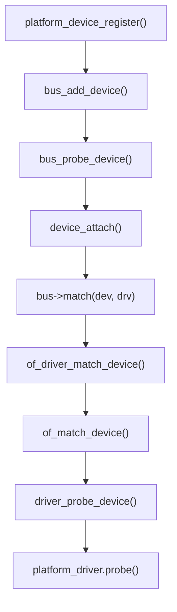

匹配成功后：

- `pdev->dev.driver` 被赋值；
- `probe()` 执行；
- sysfs 中自动创建 `/sys/bus/platform/drivers/xxx/yyy/`。

------

### 6.4.4_资源解析接口

Platform 框架提供一系列解析函数：

| 函数                                                         | 功能                     |
| ------------------------------------------------------------ | ------------------------ |
| `platform_get_resource(pdev, type, index)`                   | 获取硬件资源（I/O、IRQ） |
| `platform_get_irq(pdev, index)`                              | 获取中断号               |
| `devm_ioremap_resource(dev, res)`                            | 自动映射物理寄存器       |
| `platform_get_drvdata(pdev)` / `platform_set_drvdata(pdev, data)` | 驱动私有数据管理         |

示例：

```c
static int led_probe(struct platform_device *pdev)
{
    struct resource *res;
    void __iomem *base;

    res = platform_get_resource(pdev, IORESOURCE_MEM, 0);
    base = devm_ioremap_resource(&pdev->dev, res);
    if (IS_ERR(base))
        return PTR_ERR(base);

    dev_info(&pdev->dev, "LED mapped at %p\n", base);
    return 0;
}
```

------

## 6.5_用户视角

在 sysfs 中，platform 框架对应的层次：

```
/sys/devices/platform/
├── led_driver.0/
│   ├── driver -> ../../bus/platform/drivers/led_driver
│   ├── modalias
│   ├── of_node/
│   └── uevent
```

用户可查看匹配和资源信息：

```bash
cat /sys/devices/platform/led_driver.0/of_node/compatible
# nxp,imx6ull-led

cat /sys/bus/platform/devices/led_driver.0/modalias
# of:NnxpCimx6ull-led
```

------

## 6.6_可视化_注册与匹配流程图

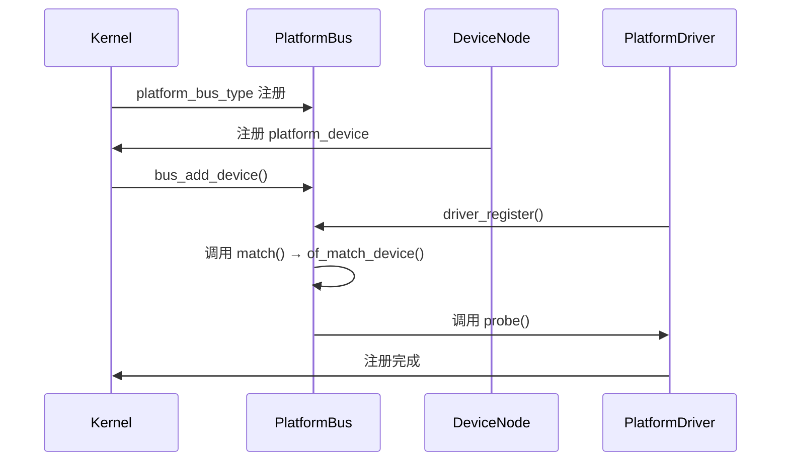

------

## 6.7_调试与验证

| 检查项        | 命令                                          | 说明           |
| ------------- | --------------------------------------------- | -------------- |
| 查看设备      | `ls /sys/devices/platform/`                   | 所有注册的设备 |
| 查看驱动      | `ls /sys/bus/platform/drivers/`               | 当前驱动列表   |
| 查看绑定关系  | `ls -l /sys/bus/platform/drivers/led_driver/` | 驱动绑定设备   |
| 查看资源      | `cat /proc/iomem                              | grep LED`      |
| 查看 modalias | `cat /sys/bus/platform/devices/.../modalias`  | 验证匹配名称   |

------

## 6.8_小结

| 层次     | 数据结构                 | 核心函数                     | 作用                |
| -------- | ------------------------ | ---------------------------- | ------------------- |
| 设备     | `struct platform_device` | `platform_device_register()` | 注册设备            |
| 驱动     | `struct platform_driver` | `platform_driver_register()` | 注册驱动            |
| 匹配     | `of_match_device()`      | `platform_bus_type.match`    | 检查 compatible     |
| 资源     | `struct resource`        | `platform_get_resource()`    | 获取 I/O 与中断信息 |
| 生命周期 | `probe()` / `remove()`   | 驱动加载与卸载               | 控制资源生命周期    |

> **总结：**
>
> - Platform 框架是 SoC 驱动开发的核心入口；
> - DTS 提供硬件信息，platform_bus_type 完成匹配；
> - 驱动只需定义匹配表 + probe，即可实现自动加载；
> - 对资源管理推荐使用 devm 系列接口，保证内存安全释放。


------

# 第7章_class_与设备分类机制

## 7.1_主题引入

Linux 内核设备模型中，`class` 是连接**内核设备体系**与**用户空间设备节点**的重要中间层。
 它定义了一类功能相似设备的集合（如字符设备、LED、I2C、SPI、USB、GPIO 等）。

> **核心功能：**
>
> - 在 `/sys/class/` 下建立统一入口；
> - 通过 `udev` 自动创建 `/dev` 设备节点；
> - 提供统一的属性接口与热插拔通知机制；
> - 使不同驱动共用同一类别管理规则。

示例：

```
/sys/class/leds/
├── led0/
│   ├── brightness
│   └── trigger
```

对应的设备节点自动生成：

```
/dev/led0
```

------

## 7.2_设计哲学

### 7.2.1_class_的存在意义

在设备模型中，设备（`device`）本身与驱动（`driver`）是一一匹配的。
 但是不同设备可能属于相同“功能类别”（如所有 LED 设备都属于 LED 类）。
 此时，class 机制就承担了“功能聚合”的职责。

| 层次           | 角色         | 示例                                  |
| -------------- | ------------ | ------------------------------------- |
| 总线（bus）    | 管理匹配规则 | platform、i2c、spi                    |
| 设备（device） | 描述硬件实例 | imx6ull-led                           |
| 驱动（driver） | 提供控制逻辑 | led_driver                            |
| 类（class）    | 功能聚合层   | `/sys/class/leds`、`/sys/class/input` |

------

### 7.2.2_关系图

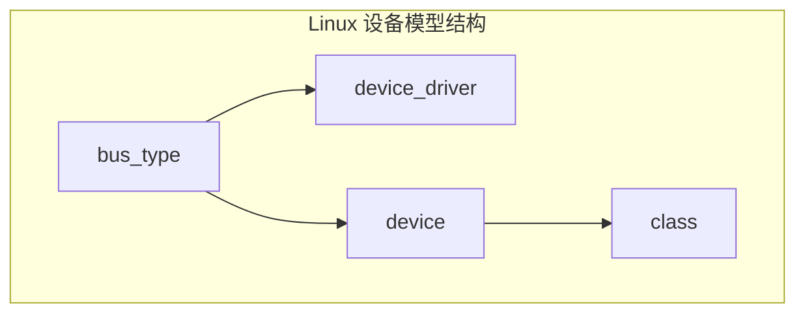

------

## 7.3_数据结构视角

### 7.3.1_struct_class

位于 `include/linux/device/class.h`：

```c
struct class {
    const char              	*name;        	// 类名（如 "leds"）
    struct module           	*owner;       	// 模块引用
    struct kobject           	kobj;        	// sysfs 节点
    struct class_attribute  	*class_attrs; 	// 类属性
    const struct attribute_group **dev_groups; 	// 设备属性组
    int (*dev_uevent)(struct device *dev, struct kobj_uevent_env *env);
    void (*dev_release)(struct device *dev);
};
```

| 字段          | 作用                                      |
| ------------- | ----------------------------------------- |
| `name`        | 决定 `/sys/class/<name>/` 的目录名        |
| `kobj`        | 对应 sysfs 中的节点                       |
| `class_attrs` | 类级别属性（如 /sys/class/leds/version）  |
| `dev_groups`  | 设备属性组，定义每个设备节点的 sysfs 属性 |
| `dev_uevent`  | 用于构建 udev 事件                        |
| `dev_release` | 设备释放回调                              |

------

### 7.3.2_struct_device_与_class_的关系

`struct device` 中包含：

```c
struct device {
    struct class *class;  // 指向所属 class
    struct device *parent;
    dev_t devt;           // 主次设备号（用于 /dev 节点）
    ...
};
```

当 `device.class != NULL` 时，该设备将出现在 `/sys/class/<class_name>/` 下。
 否则，仅存在于 `/sys/devices/...` 路径中。

------

## 7.4_开发者视角

### 7.4.1_注册_class

驱动中注册类：

```c
static struct class *led_class;

static int __init led_class_init(void)
{
    led_class = class_create(THIS_MODULE, "leds");
    if (IS_ERR(led_class))
        return PTR_ERR(led_class);
    return 0;
}
```

该函数定义于 `drivers/base/class.c`：

```c
struct class *class_create(struct module *owner, const char *name)
{
    struct class *cls;
    cls = kzalloc(sizeof(*cls), GFP_KERNEL);
    cls->name = name;
    return class_register(cls);
}
```

执行后，会在 sysfs 中生成：

```
/sys/class/leds/
```

------

### 7.4.2_注册设备节点(device_create)

与 class 关联的设备节点通过：

```c
struct device *device_create(struct class *class,
                             struct device *parent,
                             dev_t devt,
                             void *drvdata,
                             const char *fmt, ...);
```

该函数完成以下步骤：

1. 动态分配 `struct device`;
2. 设置 `dev->class = class`;
3. 设置设备号 `dev->devt = devt`;
4. 创建 `/sys/class/<class>/<device>/`;
5. 触发 uevent → udev 自动创建设备文件 `/dev/<device>`。

#### (1)_示例

```c
dev_t devt;
alloc_chrdev_region(&devt, 0, 1, "demo");
device_create(led_class, NULL, devt, NULL, "demo0");
```

效果：

```
/sys/class/leds/demo0
/dev/demo0
```

------

### 7.4.3_销毁设备与类

```c
device_destroy(led_class, devt);
class_destroy(led_class);
```

销毁顺序必须与创建相反。

------

### 7.4.4_dev_uevent_与设备节点生成机制

每次 `device_create()` 调用时：

- 内核通过 `kobject_uevent()` 触发 **add** 事件；
- udevd 进程接收该事件；
- 根据 `/lib/udev/rules.d/` 下规则，执行 `mknod /dev/<name>`；
- `/sys/class/...` 与 `/dev/...` 自动建立对应关系。

------

## 7.5_用户视角

从用户空间看，`class` 决定了 `/sys/class` 目录层级。
 不同类别的驱动对应不同路径：

| 类别     | sysfs 路径          | 说明         |
| -------- | ------------------- | ------------ |
| LED      | `/sys/class/leds/`  | LED 控制     |
| 网卡     | `/sys/class/net/`   | 网络接口     |
| 块设备   | `/sys/class/block/` | 存储设备     |
| 输入设备 | `/sys/class/input/` | 键盘、触摸屏 |
| 串口     | `/sys/class/tty/`   | UART         |
| 自定义   | `/sys/class/demo/`  | 用户自定义类 |

用户可通过 `cat` 或 `echo` 与驱动交互。

------

## 7.6_完整流程可视化

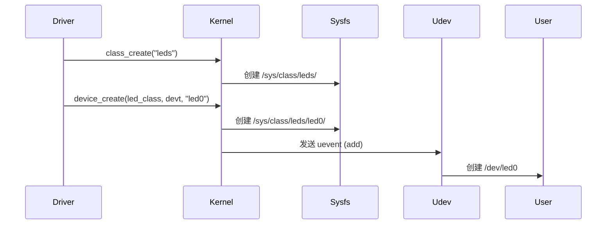

------

## 7.7_示例_字符设备与_class_集成

```c
static struct class *demo_class;
static dev_t devt;
static struct cdev demo_cdev;

static int __init demo_init(void)
{
    alloc_chrdev_region(&devt, 0, 1, "demo");
    cdev_init(&demo_cdev, &demo_fops);
    cdev_add(&demo_cdev, devt, 1);

    demo_class = class_create(THIS_MODULE, "demo");
    device_create(demo_class, NULL, devt, NULL, "demo0");

    pr_info("demo device created: /dev/demo0\n");
    return 0;
}

static void __exit demo_exit(void)
{
    device_destroy(demo_class, devt);
    class_destroy(demo_class);
    cdev_del(&demo_cdev);
    unregister_chrdev_region(devt, 1);
}

module_init(demo_init);
module_exit(demo_exit);
MODULE_LICENSE("GPL");
```

**执行结果：**

```
/sys/class/demo/demo0/
└── dev
/dev/demo0
```

------

## 7.8_调试与验证

| 检查项          | 命令                                       | 说明                 |
| --------------- | ------------------------------------------ | -------------------- |
| 查看 class 注册 | `ls /sys/class/`                           | 验证类别是否存在     |
| 查看设备节点    | `ls /sys/class/demo/`                      | 确认创建             |
| 查看 /dev 文件  | `ls -l /dev/demo0`                         | 自动节点验证         |
| 查看 uevent     | `udevadm monitor`                          | 监听 add/remove 事件 |
| 查看驱动绑定    | `udevadm info -a -p /sys/class/demo/demo0` | 分析属性             |

------

## 7.9_小结

| 层次         | 数据结构                            | 核心函数                               | 作用             |
| ------------ | ----------------------------------- | -------------------------------------- | ---------------- |
| 类注册       | `struct class`                      | `class_create()` / `class_destroy()`   | 创建功能类别目录 |
| 设备节点     | `struct device`                     | `device_create()` / `device_destroy()` | 创建设备实例     |
| 用户空间节点 | `/dev`                              | 由 udev 自动生成                       | 用户可访问接口   |
| 事件系统     | `dev_uevent()` / `kobject_uevent()` | 热插拔通知                             |                  |
| 典型路径     | `/sys/class/<class>/<dev>`          | sysfs 结构入口                         |                  |

> **总结：**
>
> - `class` 是设备模型中面向用户空间的分类接口；
> - 它通过 sysfs 目录与 udev 协作自动生成 `/dev` 节点；
> - 所有字符设备驱动都应通过 class 注册实现用户可见性；
> - 理解 class 机制，是编写高质量 Linux 驱动的关键。


------

# 第8章_device_attribute_与驱动属性文件机制

## 8.1_主题引入

Linux 内核的 **sysfs 属性文件机制** 是驱动开发中与用户空间交互的关键接口之一。
 开发者可以通过 `DEVICE_ATTR_*()` 系列宏在 `/sys/` 下创建可读写的文件，
 从而让用户空间以 `cat` / `echo` 方式直接访问内核变量或控制设备行为。

> **典型场景：**
>
> - 控制 LED 亮灭：`echo 1 > /sys/class/leds/led0/brightness`
> - 查询驱动状态：`cat /sys/class/net/eth0/operstate`
> - 调试驱动参数：`cat /sys/devices/.../register_dump`

sysfs 文件机制是 Linux 驱动模型的统一标准，
 其底层依托于 **kobject + sysfs_ops** 框架，
 而驱动层的具体实现则通过 **device_attribute** 完成。

------

## 8.2_设计哲学

| 原则           | 说明                                            |
| -------------- | ----------------------------------------------- |
| 一切文件皆属性 | 每个 `/sys/...` 文件都对应一个 `attribute` 对象 |
| 用户直接交互   | 文件读写映射到驱动层的 `show()` / `store()`     |
| 自动注册       | 属性文件与设备生命周期同步创建与销毁            |
| 无缓冲无缓存   | 读写操作直接作用于驱动代码（调试非常高效）      |

> sysfs 的目的不是高性能，而是 **透明、可见、可调试**。

------

## 8.3_数据结构视角

### 8.3.1_struct_device_attribute

位于 `include/linux/device.h`：

```c
struct device_attribute {
    struct attribute attr;
    ssize_t (*show)(struct device *dev,
                    struct device_attribute *attr, char *buf);
    ssize_t (*store)(struct device *dev,
                     struct device_attribute *attr, const char *buf, size_t count);
};
```

| 字段    | 说明                        |
| ------- | --------------------------- |
| `attr`  | 对应 sysfs 文件的名称与权限 |
| `show`  | 文件读回调，对应 `cat`      |
| `store` | 文件写回调，对应 `echo`     |

------

### 8.3.2_struct_attribute

```c
struct attribute {
    const char *name;
    umode_t mode;    // 文件权限，如 0444、0644
};
```

`umode_t` 是 Linux 文件权限掩码，与普通文件一致：

- `0444`：只读；
- `0644`：可读可写。

------

## 8.4_开发者视角

### 8.4.1_定义属性文件

```c
static ssize_t status_show(struct device *dev,
                           struct device_attribute *attr, char *buf)
{
    return sprintf(buf, "LED status: ON\n");
}

static ssize_t status_store(struct device *dev,
                            struct device_attribute *attr, const char *buf, size_t count)
{
    pr_info("LED write: %.*s", (int)count, buf);
    return count;
}
```

### 8.4.2_声明属性

使用内核提供的宏族：

| 宏                                     | 功能       | 权限       |
| -------------------------------------- | ---------- | ---------- |
| `DEVICE_ATTR(name, mode, show, store)` | 定义属性   | 自定义权限 |
| `DEVICE_ATTR_RO(name)`                 | 只读属性   | 0444       |
| `DEVICE_ATTR_RW(name)`                 | 可读写属性 | 0644       |
| `DEVICE_ATTR_WO(name)`                 | 只写属性   | 0200       |

#### (1)_示例

```c
static DEVICE_ATTR_RW(status);
```

展开后相当于：

```c
struct device_attribute dev_attr_status =
    __ATTR(status, 0644, status_show, status_store);
```

------

### 8.4.3_注册属性文件

驱动初始化阶段：

```c
int device_create_file(struct device *dev,
                       const struct device_attribute *attr);
```

用于在 `/sys/...` 下创建属性文件。

#### (1)_示例

```c
device_create_file(&pdev->dev, &dev_attr_status);
```

文件将出现：

```
/sys/devices/platform/led_driver/status
```

删除属性：

```c
device_remove_file(&pdev->dev, &dev_attr_status);
```

------

### 8.4.4_批量属性文件_attribute_group

如果属性较多，可以用组注册：

```c
static DEVICE_ATTR_RW(status);
static DEVICE_ATTR_RO(version);

static struct attribute *led_attrs[] = {
    &dev_attr_status.attr,
    &dev_attr_version.attr,
    NULL,
};

static const struct attribute_group led_attr_group = {
    .attrs = led_attrs,
};
```

注册接口：

```c
sysfs_create_group(&pdev->dev.kobj, &led_attr_group);
sysfs_remove_group(&pdev->dev.kobj, &led_attr_group);
```

------

### 8.4.5_show/store_调用时机

| 操作 | 用户命令                   | 调用函数         |
| ---- | -------------------------- | ---------------- |
| 读取 | `cat /sys/.../status`      | `status_show()`  |
| 写入 | `echo 1 > /sys/.../status` | `status_store()` |

两者均由 sysfs 层自动调度：

```c
static const struct sysfs_ops dev_sysfs_ops = {
    .show  = dev_attr_show,
    .store = dev_attr_store,
};
```

最终执行路径：

```
vfs_read() / vfs_write()
   ↓
sysfs_file_ops
   ↓
dev_attr_show() / dev_attr_store()
   ↓
driver-defined show()/store()
```

------

## 8.5_用户视角

从用户层面看，sysfs 属性文件的访问就像普通文本文件：

```bash
cat /sys/class/demo/demo0/status
# 输出: LED status: ON

echo OFF > /sys/class/demo/demo0/status
# 驱动端接收到 store() 回调
```

**特点：**

- 无缓存，每次读写都会触发驱动回调；
- 仅允许小数据交互（典型 < 4KB）；
- 非二进制安全（适合配置/调试，而非数据传输）。

------

## 8.6_可视化_属性文件交互流程

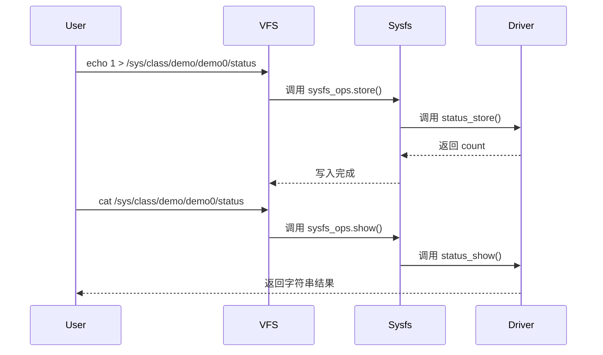

------

## 8.7_示例_在_platform_驱动中添加属性文件

```c
static ssize_t status_show(struct device *dev,
                           struct device_attribute *attr, char *buf)
{
    return sprintf(buf, "LED state: %d\n", led_status);
}

static ssize_t status_store(struct device *dev,
                            struct device_attribute *attr,
                            const char *buf, size_t count)
{
    if (buf[0] == '1')
        led_on();
    else
        led_off();
    return count;
}
static DEVICE_ATTR_RW(status);

static int led_probe(struct platform_device *pdev)
{
    device_create_file(&pdev->dev, &dev_attr_status);
    return 0;
}

static int led_remove(struct platform_device *pdev)
{
    device_remove_file(&pdev->dev, &dev_attr_status);
    return 0;
}
```

sysfs:

```
/sys/devices/platform/led_driver/status
```

------

## 8.8_调试与验证

| 检查项       | 命令                                    | 说明                 |
| ------------ | --------------------------------------- | -------------------- |
| 查看属性文件 | `ls /sys/class/demo/demo0/`             | 验证属性创建         |
| 读属性       | `cat /sys/class/demo/demo0/status`      | 执行 show()          |
| 写属性       | `echo 1 > /sys/class/demo/demo0/status` | 执行 store()         |
| 删除属性     | `device_remove_file()`                  | 属性消失             |
| 批量属性     | `sysfs_create_group()`                  | 检查多个文件是否出现 |

------

## 8.9_小结

| 层次     | 数据结构                             | 核心接口               | 说明         |
| -------- | ------------------------------------ | ---------------------- | ------------ |
| 单属性   | `struct device_attribute`            | `device_create_file()` | 注册单个属性 |
| 属性组   | `struct attribute_group`             | `sysfs_create_group()` | 批量注册     |
| 文件读写 | `show()` / `store()`                 | sysfs_ops              | 用户读写映射 |
| 宏族     | `DEVICE_ATTR_*()`                    | 宏展开自动生成结构体   | 简化开发     |
| 文件位置 | `/sys/class/...`、`/sys/devices/...` | sysfs                  | 驱动可见性   |

> **总结：**
>
> - sysfs 属性文件是驱动与用户空间交互的首选；
> - `DEVICE_ATTR_*()` 宏可快速定义属性；
> - 每次 `cat`/`echo` 都直接调用驱动代码；
> - 适用于调试、配置、监控等轻量级交互场景；
> - 若需要大数据通信，请使用字符设备或 ioctl。


------

# 第9章_devres_资源管理机制(devm_系列)

## 9.1_主题引入

在 Linux 驱动中，资源的申请与释放是一项极易出错的工作。
 传统写法需要在 `probe()` 成功路径和失败路径分别处理内存、IO、GPIO、时钟、中断等资源释放：

```c
res = request_mem_region(...);
if (!res)
    return -EBUSY;

irq = request_irq(...);
if (irq < 0)
    goto err_free_region;
...
err_free_region:
release_mem_region(...);
```

这种写法不仅繁琐，还容易在 probe 失败或 remove 时造成资源泄露。
 为解决这一问题，内核引入了 **devres（Device Resource Management）机制**。

> **核心思想：**
>
> - 每个 `struct device` 维护一个“资源栈”；
> - 所有使用 `devm_*()` 申请的资源自动加入该栈；
> - 当设备驱动被移除或 probe 失败时，自动执行回收。

------

## 9.2_设计哲学

| 原则             | 说明                                         |
| ---------------- | -------------------------------------------- |
| 资源与设备绑定   | 所有资源生命周期与设备绑定，而非驱动模块     |
| 自动释放         | 当 `device_release_driver()` 调用时自动释放  |
| 无需手动释放     | 开发者不再手动调用 `kfree()`、`iounmap()` 等 |
| probe() 失败安全 | 即使在 probe 阶段出错也能自动回滚全部资源    |

> 简言之：**devres = RAII（Resource Acquisition Is Initialization）的内核化实现。**

------

## 9.3_数据结构视角

### 9.3.1_struct_devres_node

定义于 `drivers/base/devres.c`：

```c
struct devres_node {
    struct list_head entry;
    dr_release_t release;
    const char *name;
};
```

- `entry`：链入设备资源链表；
- `release`：对应资源释放回调；
- `name`：资源类型（用于调试）。

------

### 9.3.2_struct_devres

每个资源都封装成一个 devres 对象：

```c
struct devres {
    struct devres_node node;
    unsigned long data[];
};
```

`data` 区域用于存储资源实体（如指针、IRQ号、内存映射地址等）。

------

### 9.3.3_struct_devres_group

用于成组管理多个资源（可批量释放）：

```c
struct devres_group {
    struct list_head list;
    struct devres_node node[2];
};
```

------

### 9.3.4_struct_device_与_devres_链表

每个 `struct device` 中都维护一个 devres 链表：

```c
struct device {
    ...
    struct list_head devres_head;  // 管理所有 devm 资源
};
```

当驱动卸载或 probe 失败时，调用：

```c
devres_release_all(dev);
```

自动释放链表中所有资源。

------

## 9.4_开发者视角

### 9.4.1_devm_资源生命周期

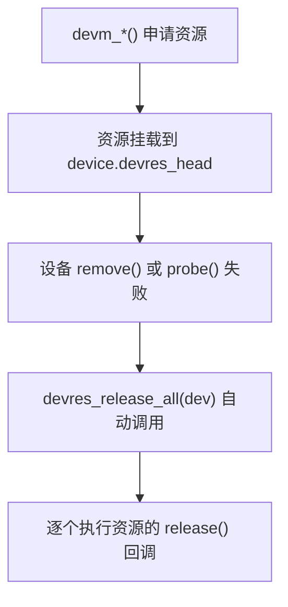

------

### 9.4.2_常用_devm_系列接口

| 接口                      | 作用                  | 对应传统函数                          |
| ------------------------- | --------------------- | ------------------------------------- |
| `devm_kzalloc()`          | 自动释放的 kmalloc    | `kzalloc()`                           |
| `devm_ioremap_resource()` | 自动 ioremap + 释放   | `ioremap()` + `iounmap()`             |
| `devm_request_irq()`      | 自动释放中断          | `request_irq()` + `free_irq()`        |
| `devm_clk_get()`          | 自动管理时钟资源      | `clk_get()` + `clk_put()`             |
| `devm_gpiod_get()`        | 自动获取 GPIO 描述符  | `gpiod_get()` + `gpiod_put()`         |
| `devm_pinctrl_get()`      | 自动获取 pinctrl 资源 | `pinctrl_get()` + `pinctrl_put()`     |
| `devm_regulator_get()`    | 自动电源管理          | `regulator_get()` + `regulator_put()` |
| `devm_kmalloc_array()`    | 自动释放数组内存      | `kmalloc_array()`                     |

------

### 9.4.3_devm_kzalloc()_示例

```c
struct my_device {
    void __iomem *base;
    int irq;
};

static int my_probe(struct platform_device *pdev)
{
    struct my_device *md;

    md = devm_kzalloc(&pdev->dev, sizeof(*md), GFP_KERNEL);
    if (!md)
        return -ENOMEM;

    platform_set_drvdata(pdev, md);
    return 0;
}
```

此内存会在驱动卸载时自动释放。

------

### 9.4.4_devm_ioremap_resource()_示例

```c
static int led_probe(struct platform_device *pdev)
{
    struct resource *res;
    void __iomem *base;

    res = platform_get_resource(pdev, IORESOURCE_MEM, 0);
    base = devm_ioremap_resource(&pdev->dev, res);
    if (IS_ERR(base))
        return PTR_ERR(base);

    // base 会在 remove 时自动 iounmap()
    return 0;
}
```

底层自动注册释放函数：

```c
devres_add(dev, release_ioremap);
```

------

### 9.4.5_devm_request_irq()_示例

```c
static irqreturn_t led_irq_handler(int irq, void *dev_id)
{
    pr_info("IRQ triggered!\n");
    return IRQ_HANDLED;
}

static int led_probe(struct platform_device *pdev)
{
    int irq = platform_get_irq(pdev, 0);
    int ret;

    ret = devm_request_irq(&pdev->dev, irq, led_irq_handler,
                           0, dev_name(&pdev->dev), NULL);
    if (ret)
        return ret;

    // 不需 free_irq()
    return 0;
}
```

------

### 9.4.6_devm_机制下的回滚保证

如果在 probe 阶段某一步失败：

```c
static int my_probe(struct platform_device *pdev)
{
    struct clk *clk;
    void __iomem *base;

    clk  = devm_clk_get(&pdev->dev, NULL);
    base = devm_ioremap_resource(&pdev->dev, res);

    if (IS_ERR(base))
        return PTR_ERR(base);  // 自动回滚之前申请的 clk
}
```

> 所有 devm 资源都记录在同一链表，
>  一旦 probe 返回错误，`devres_release_all()` 会逐项释放已登记资源。

------

## 9.5_用户视角

从用户角度看，devm 机制不可见；
 但它保证 `/sys/bus/...` 设备卸载后系统状态一致、资源无残留。

举例：

```bash
rmmod led_driver
# → 自动释放：GPIO、中断、内存映射、class 设备节点
```

而开发者无需实现任何 `remove()` 中的清理逻辑（除非有硬件状态复位需求）。

------

## 9.6_可视化_devm_管理流程图

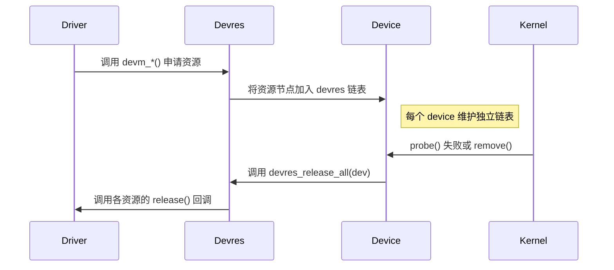

------

## 9.7_调试与验证

| 检查项           | 方式                                   | 说明                           |
| ---------------- | -------------------------------------- | ------------------------------ |
| 查看 devres 统计 | `cat /sys/kernel/debug/devres/devices` | 显示各设备 devres 链表         |
| 验证资源释放     | `rmmod <driver>`                       | 观察内核日志是否残留资源       |
| 验证 probe 回滚  | 强制返回 -EINVAL                       | 确认系统无泄露                 |
| 内核调试点       | `drivers/base/devres.c`                | 可设置 printk 验证自动释放路径 |

------

## 9.8_小结

| 层次     | 结构体                                   | 关键函数                                | 说明             |
| -------- | ---------------------------------------- | --------------------------------------- | ---------------- |
| 核心机制 | `struct devres`                          | `devres_add()` / `devres_release_all()` | 管理资源链表     |
| 自动资源 | `devm_*()` 系列                          | 各类资源申请                            | 自动注册释放函数 |
| 生命周期 | `device_release_driver()`                | 释放资源链                              | 设备移除时执行   |
| 典型资源 | 内存、GPIO、IRQ、clk、regulator、ioremap | 自动清理                                |                  |
| 回滚机制 | probe 出错自动清理                       | devres 栈反向执行释放                   | 避免泄露         |

> **总结：**
>
> - `devm_*()` 是 Linux 驱动最推荐的资源申请接口；
> - 它与设备绑定，而非驱动模块；
> - 无需显式 free/put 操作；
> - 大幅减少错误与冗余；
> - probe 出错或 remove 时系统自动保持干净状态。


------

# 第10章_driver_core_核心管理机制

## 10.1_主题引入

**driver core** 是 Linux 内核中负责管理**设备与驱动之间关系**的核心子系统。
 它位于 `drivers/base/` 目录下，是所有设备模型的统一实现基础。

driver core 的存在，使得：

- 所有设备（`device`）都能在统一框架中注册；
- 所有驱动（`driver`）都能通过统一接口管理；
- 匹配、探测、热插拔、sysfs、PM（电源管理）、devres 等功能都统一调度。

> **一句话概括：**
>
> **driver core = Linux 设备模型的大脑**。

------

## 10.2_设计哲学

### 10.2.1_核心目标

| 目标         | 说明                                                         |
| ------------ | ------------------------------------------------------------ |
| 统一接口     | 提供统一的注册与注销 API：`device_register()`、`driver_register()` |
| 解耦机制     | 设备、驱动、总线独立注册，自动匹配                           |
| 层次可视化   | 通过 sysfs 反映内核对象关系                                  |
| 自动资源管理 | 集成 devres、PM、kobject                                     |
| 可扩展性     | 适配不同总线类型（platform、PCI、USB...）                    |

------

### 10.2.2_核心目录结构(Linux_6.1+)

```
drivers/base/
├── core.c              # device/driver 注册核心逻辑
├── bus.c               # bus_type 管理
├── dd.c                # driver 与 device 匹配
├── driver.c            # 驱动注册接口
├── platform.c          # platform 框架实现
├── power/              # PM 支持
└── devres.c            # devm 自动资源管理
```

------

## 10.3_数据结构视角

### 10.3.1_核心结构体关系

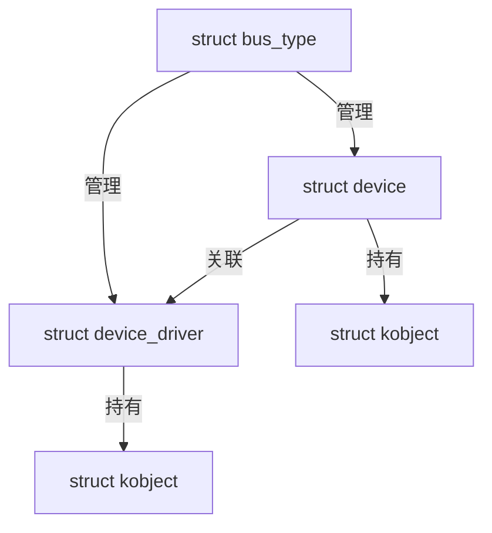

> `bus_type` 是 driver core 的核心容器，统一管理所有 device-driver 关系。

------

### 10.3.2_核心函数映射表

| 功能       | 接口                                  | 实现文件   |
| ---------- | ------------------------------------- | ---------- |
| 设备注册   | `device_register()`                   | `core.c`   |
| 驱动注册   | `driver_register()`                   | `driver.c` |
| 匹配流程   | `device_attach()` / `driver_attach()` | `dd.c`     |
| 总线管理   | `bus_register()` / `bus_add_device()` | `bus.c`    |
| sysfs 目录 | `device_add()` / `bus_create_file()`  | `core.c`   |
| 资源回收   | `devres_release_all()`                | `devres.c` |

------

## 10.4_开发者视角

### 10.4.1_设备注册流程

```c
int device_register(struct device *dev)
{
    device_initialize(dev);  // 初始化 kobject、devres 链表等
    return device_add(dev);
}
```

#### (1)_device_initialize()

- 设置默认引用计数；
- 初始化 devres；
- 绑定父设备；
- 初始化互斥锁；
- 建立 sysfs 层基础。

#### (2)_device_add()

位于 `drivers/base/core.c`：

```c
int device_add(struct device *dev)
{
    bus_add_device(dev);
    kobject_uevent(&dev->kobj, KOBJ_ADD);
}
```

该函数会触发：

1. 将设备添加到总线；
2. 生成 sysfs 目录 `/sys/devices/...`;
3. 发送 `uevent` 通知用户空间。

------

### 10.4.2_驱动注册流程

```c
int driver_register(struct device_driver *drv)
{
    bus_add_driver(drv);
    driver_add_groups(drv, drv->groups);
}
```

#### (1)_bus_add_driver()

```c
int bus_add_driver(struct device_driver *drv)
{
    klist_add_tail(&drv->p->knode_bus, &bus->p->klist_drivers);
    driver_attach(drv);
}
```

#### (2)_driver_attach()

会调用 `bus_for_each_dev()` 遍历所有设备，并执行匹配流程：

```
bus_for_each_dev()
    → __driver_attach()
        → driver_match_device()
        → driver_probe_device()
```

匹配成功 → 调用 `probe()`。

------

### 10.4.3_设备与驱动匹配时机

| 注册顺序               | 匹配触发函数         | 描述                     |
| ---------------------- | -------------------- | ------------------------ |
| 先注册设备，后注册驱动 | `driver_attach()`    | 驱动注册时扫描现有设备   |
| 先注册驱动，后注册设备 | `bus_probe_device()` | 设备注册时扫描已加载驱动 |

> 无论顺序如何，driver core 保证二者能最终匹配。

------

### 10.4.4_deferred_probe_机制

在复杂的设备依赖关系中（如设备依赖时钟、regulator），
 若 probe 阶段发现依赖尚未准备好，驱动可以返回 `-EPROBE_DEFER`。

driver core 会：

- 暂时搁置该设备；
- 等待依赖加载后重新尝试 probe。

源码位于 `drivers/base/dd.c`：

```c
if (ret == -EPROBE_DEFER) {
    dev_dbg(dev, "Probe deferred\n");
    driver_deferred_probe_add(dev);
}
```

> 这使得驱动能安全启动，而不会因依赖缺失导致失败。

------

## 10.5_用户视角

从用户空间角度看，driver core 的行为体现在 sysfs 层：

```
/sys/bus/platform/drivers/
│
├── led_driver/
│   ├── bind
│   ├── unbind
│   ├── led_driver.0 -> ../../devices/platform/led_driver.0
│   └── uevent
│
└── other_driver/
```

- `/sys/bus/.../drivers/<name>/bind`
   → 手动绑定驱动到设备；
- `/sys/bus/.../drivers/<name>/unbind`
   → 手动解绑；
- `uevent` 文件
   → 触发设备事件（add/remove/change）。

------

## 10.6_核心执行流程(可视化)

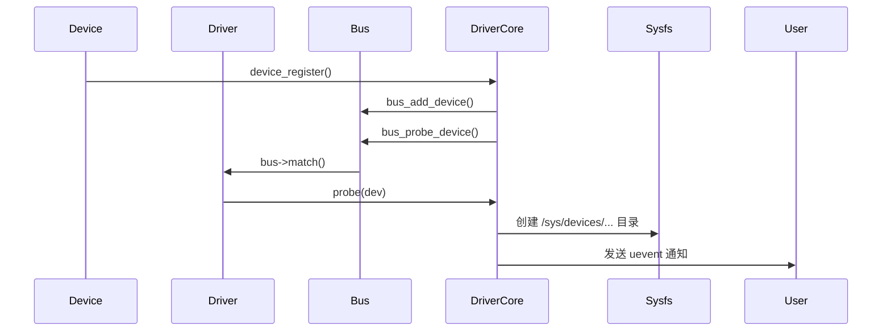

------

## 10.7_典型路径追踪(Platform_为例)

| 阶段       | 函数                         | 文件位置     | 描述                   |
| ---------- | ---------------------------- | ------------ | ---------------------- |
| 设备注册   | `platform_device_register()` | `platform.c` | 调用 device_register() |
| 驱动注册   | `platform_driver_register()` | `platform.c` | 调用 driver_register() |
| 匹配过程   | `platform_match()`           | `platform.c` | 检查 compatible/name   |
| 绑定阶段   | `driver_probe_device()`      | `dd.c`       | 执行 probe             |
| 资源管理   | `devm_*()`                   | `devres.c`   | 设备绑定资源           |
| sysfs 建立 | `device_add()`               | `core.c`     | 生成节点               |

------

## 10.8_调试与验证

| 检查项                | 命令                                   | 说明              |
| --------------------- | -------------------------------------- | ----------------- |
| 查看 driver core 模块 | `cat /proc/kallsyms                    | grep driver_core` |
| 追踪 probe 调用       | `dmesg                                 | grep probe`       |
| 查看 sysfs 结构       | `tree /sys/devices/`                   | 设备层级可视化    |
| 分析 deferred probe   | `cat /sys/kernel/debug/deferred_probe` | 待处理设备列表    |
| 验证资源自动释放      | `rmmod` + `dmesg`                      | 确保释放顺序正确  |

------

## 10.9_小结

| 功能模块   | 核心函数                                | 文件     | 说明                    |
| ---------- | --------------------------------------- | -------- | ----------------------- |
| 设备注册   | `device_register()`                     | core.c   | 注册设备对象            |
| 驱动注册   | `driver_register()`                     | driver.c | 注册驱动对象            |
| 匹配逻辑   | `driver_attach()` / `device_attach()`   | dd.c     | 匹配与探测              |
| 总线管理   | `bus_add_driver()` / `bus_add_device()` | bus.c    | 管理 driver/device 列表 |
| sysfs 映射 | `device_add()`                          | core.c   | 构建 /sys 层次结构      |
| 延迟探测   | `driver_deferred_probe_add()`           | dd.c     | 依赖延迟机制            |

> **总结：**
>
> - driver core 是 Linux 设备模型的逻辑中心；
> - 它统一调度设备、驱动和总线；
> - 确保即使注册顺序不同，也能完成匹配；
> - 提供 sysfs 可视化、uevent 通知、deferred probe、devres 等多种机制；
> - 几乎所有驱动子系统（GPIO、I2C、USB、PCI、platform）都直接依赖 driver core。


------

# 第11章_电源管理(PM)在设备模型中的集成

## 11.1_主题引入

Linux 内核的电源管理（Power Management, PM）是系统级运行效率的重要组成部分。
 在 SoC 驱动开发中，每个外设都可以单独被挂起、恢复或动态关断，以降低功耗。

driver core 将 **PM 管理机制** 深度嵌入进设备模型体系，使得：

- 每个设备（`struct device`）都具备独立的电源管理信息；
- 每个驱动（`struct dev_pm_ops`）都可以定义电源管理回调；
- 所有挂起/恢复/动态电源操作都通过 driver core 统一调度。

> **一句话概括：**
>  PM 机制让设备“有生命”，driver core 让它“有秩序地休眠与唤醒”。

------

## 11.2_设计哲学

| 原则     | 说明                                                |
| -------- | --------------------------------------------------- |
| 分层管理 | 驱动不直接操作硬件电源，由 PM 核心统一调度          |
| 统一接口 | 所有设备遵循相同 suspend/resume/pm_runtime 回调规范 |
| 按需唤醒 | 支持 runtime PM（设备闲置时自动休眠）               |
| 层级传播 | 父设备 suspend 时自动 cascade 到子设备              |
| 驱动自控 | 驱动可通过 dev_pm_ops 自定义各阶段动作              |

> **哲学核心：**
>  电源管理是设备模型的“垂直扩展”，贯穿 device-driver-bus 全层。

------

## 11.3_数据结构视角

### 11.3.1_struct_dev_pm_info(设备电源状态信息)

定义于 `include/linux/pm.h`：

```c
struct dev_pm_info {
    pm_message_t 			power_state;
    unsigned int 			can_wakeup:1;
    unsigned int 			async_suspend:1;
    atomic_t 				usage_count;
    struct device 			*power_parent;
    struct completion 		completion;
    struct pm_subsys_data 	*subsys_data;
};
```

| 字段            | 含义                           |
| --------------- | ------------------------------ |
| `power_state`   | 当前电源状态（D0~D3）          |
| `can_wakeup`    | 是否支持唤醒系统               |
| `async_suspend` | 是否异步挂起                   |
| `usage_count`   | 动态电源引用计数（runtime PM） |
| `power_parent`  | 父设备指针（层级控制）         |
| `completion`    | 异步同步控制                   |
| `subsys_data`   | 指向总线子系统 PM 状态数据     |

------

### 11.3.2_struct_dev_pm_ops(驱动电源回调)

定义于 `include/linux/pm.h`：

```c
struct dev_pm_ops {
    int (*prepare)(struct device *dev);
    void (*complete)(struct device *dev);
    int (*suspend)(struct device *dev);
    int (*resume)(struct device *dev);
    int (*freeze)(struct device *dev);
    int (*thaw)(struct device *dev);
    int (*poweroff)(struct device *dev);
    int (*restore)(struct device *dev);
    int (*runtime_suspend)(struct device *dev);
    int (*runtime_resume)(struct device *dev);
    int (*runtime_idle)(struct device *dev);
};
```

| 回调                | 阶段       | 说明                 |
| ------------------- | ---------- | -------------------- |
| `prepare()`         | 挂起前准备 | 同步状态、禁止 I/O   |
| `suspend()`         | 设备挂起   | 停止工作、断电       |
| `resume()`          | 设备恢复   | 重新上电、恢复寄存器 |
| `complete()`        | 挂起结束   | 通知应用可访问       |
| `runtime_suspend()` | 动态挂起   | 空闲时自动休眠       |
| `runtime_resume()`  | 动态恢复   | 访问时自动唤醒       |

> **备注：** suspend/resume 用于系统级挂起（system sleep）；
>  runtime_* 系列用于运行时节能（runtime PM）。

------

### 11.3.3_struct_device_中的集成点

```c
struct device {
    ...
    struct dev_pm_info power;
    const struct dev_pm_ops *pm;
};
```

这意味着每个设备都自带电源信息与回调指针。
 当系统进入休眠或恢复时，driver core 依次调用这些钩子。

------

## 11.4_开发者视角

### 11.4.1_驱动注册电源管理回调

```c
static const struct dev_pm_ops led_pm_ops = {
    .suspend = led_suspend,
    .resume  = led_resume,
    .runtime_suspend = led_runtime_suspend,
    .runtime_resume  = led_runtime_resume,
};
```

注册到驱动：

```c
static struct platform_driver led_driver = {
    .probe = led_probe,
    .remove = led_remove,
    .driver = {
        .name = "led_driver",
        .pm = &led_pm_ops,
    },
};
```

------

### 11.4.2_系统级挂起/恢复(suspend/resume)

```c
static int led_suspend(struct device *dev)
{
    pr_info("LED: enter suspend\n");
    // 关闭 GPIO、电源、时钟
    return 0;
}

static int led_resume(struct device *dev)
{
    pr_info("LED: resume from suspend\n");
    // 重新上电、恢复寄存器
    return 0;
}
```

当系统执行：

```bash
echo mem > /sys/power/state
```

内核将触发：

```
device_suspend()
   → bus->pm->suspend()
   → driver->pm->suspend()
```

------

### 11.4.3_运行时电源管理(Runtime_PM)

Runtime PM 用于设备在系统运行期间的动态节能。

核心接口定义于 `include/linux/pm_runtime.h`：

```c
int pm_runtime_get_sync(struct device *dev);
int pm_runtime_put_sync(struct device *dev);
int pm_runtime_enable(struct device *dev);
```

#### (1)_示例

```c
static int led_probe(struct platform_device *pdev)
{
    pm_runtime_enable(&pdev->dev);
    return 0;
}

static int led_runtime_suspend(struct device *dev)
{
    pr_info("LED runtime suspend\n");
    return 0;
}

static int led_runtime_resume(struct device *dev)
{
    pr_info("LED runtime resume\n");
    return 0;
}
```

- 当设备空闲时，PM 核心自动调用 `runtime_suspend()`；
- 当上层访问设备（如写寄存器）时，调用 `pm_runtime_get_sync()` 唤醒设备；
- 使用完毕后，调用 `pm_runtime_put_sync()` 重新进入休眠。

------

### 11.4.4_分层传播机制(Cascade)

在挂起/恢复阶段，driver core 会递归遍历设备树：

```text
device_suspend()
 ├── parent (bus, power domain)
 │    └── child1
 │        └── child2
```

执行顺序：

1. 自顶向下挂起（parent → child）
2. 自底向上恢复（child → parent）

这保证了依赖关系（如 clock → UART → console）的正确顺序。

------

### 11.4.5_PM_与_devres_的结合

devm 系列接口同样与 PM 机制集成。
 例如：

```c
clk = devm_clk_get(&pdev->dev, NULL);
```

当设备 suspend 时：

- 时钟自动关闭；
- resume 时重新开启；
- 驱动不需手动管理。

------

## 11.5_用户视角

从用户层面看，PM 的状态可通过以下接口查看：

| 文件路径                                      | 功能            | 示例                               |
| --------------------------------------------- | --------------- | ---------------------------------- |
| `/sys/power/state`                            | 系统级挂起控制  | `echo mem > /sys/power/state`      |
| `/sys/devices/.../power/control`              | runtime PM 控制 | `echo auto > /sys/.../control`     |
| `/sys/devices/.../power/runtime_status`       | 当前状态        | `active` / `suspended`             |
| `/sys/devices/.../power/autosuspend_delay_ms` | 自动休眠延时    | `echo 2000 > autosuspend_delay_ms` |

示例：

```bash
cat /sys/devices/platform/led_driver/power/runtime_status
# 输出: suspended
```

------

## 11.6_可视化_电源管理流程图

```mermaid
sequenceDiagram
    participant User
    participant Kernel
    participant Driver
    participant Hardware

    User->>Kernel: echo mem > /sys/power/state
    Kernel->>Driver: 调用 dev_pm_ops.suspend()
    Driver->>Hardware: 关闭外设电源/时钟
    Note right of Hardware: 设备进入低功耗
    User->>Kernel: 恢复操作
    Kernel->>Driver: 调用 dev_pm_ops.resume()
    Driver->>Hardware: 重新上电/初始化寄存器
```

------

## 11.7_调试与验证

| 检查项               | 命令                                         | 说明                                 |
| -------------------- | -------------------------------------------- | ------------------------------------ |
| 查看系统挂起状态     | `cat /sys/power/state`                       | 可选状态：`mem`, `freeze`, `standby` |
| 查看 runtime 状态    | `cat /sys/devices/.../power/runtime_status`  | 当前电源状态                         |
| 强制 runtime suspend | `echo auto > /sys/devices/.../power/control` | 启用自动节能                         |
| 追踪日志             | `dmesg                                       | grep suspend`                        |
| 分析依赖顺序         | `cat /sys/kernel/debug/devices_deferred`     | 检查延迟设备                         |

------

## 11.8_小结

| 模块     | 数据结构                  | 核心函数                  | 说明           |
| -------- | ------------------------- | ------------------------- | -------------- |
| 电源信息 | `struct dev_pm_info`      | -                         | 保存设备状态   |
| 驱动回调 | `struct dev_pm_ops`       | suspend/resume            | 驱动自定义操作 |
| 动态节能 | runtime PM                | pm_runtime_*()            | 自动空闲休眠   |
| 系统挂起 | suspend/resume            | system PM                 | 整机休眠与唤醒 |
| 依赖控制 | parent-child 层级         | device_suspend()/resume() | 层次传播       |
| 用户接口 | `/sys/devices/.../power/` | sysfs                     | 控制与调试     |

> **总结：**
>
> - driver core 与 PM 紧密耦合，设备模型天然支持多层电源控制；
> - 驱动只需实现 `dev_pm_ops` 即可接入整个电源管理体系；
> - runtime PM 提供动态节能机制，是嵌入式 SoC 的关键特性；
> - suspend/resume 机制保证系统安全进入与退出低功耗状态；
> - 所有动作都经过 driver core 统一调度，确保依赖顺序一致。


------

# 第12章_sysfs_与_kobject_内核对象模型

## 12.1_主题引入

设备模型并非直接以 C 结构体的形式存在于用户空间；
 它依赖一套统一的对象可视化机制，将内核对象（device、driver、bus、class 等）
 映射为 `/sys/` 文件系统中的目录和文件。

这一机制的核心组件有：

- **`kobject`（Kernel Object）**：内核对象的基础单位；
- **`kset`**：同类对象的集合；
- **`kobj_type`**：对象类型描述；
- **`sysfs`**：用户空间接口，将对象以目录/文件形式暴露。

> **一句话概括：**
>  `kobject` 是设备模型的“对象化基础”，`sysfs` 是它的“外部映射”。

------

## 12.2_设计哲学

| 原则       | 说明                                           |
| ---------- | ---------------------------------------------- |
| 对象可视化 | 一切内核设备、驱动、总线都以 `kobject` 存在    |
| 层级映射   | 内核对象树与 `/sys/` 目录结构一一对应          |
| 统一管理   | 通过 `kset` 管理同类对象，统一注册/销毁        |
| 动态可追踪 | 对象的创建/删除都触发 `uevent`，供 `udev` 监听 |
| 轻量与独立 | `kobject` 只负责管理层，不关心业务逻辑         |

> kobject 是所有内核“对象”的元模型（meta-object）。

------

## 12.3_数据结构视角

### 12.3.1_struct_kobject

定义于 `include/linux/kobject.h`：

```c
struct kobject {
    const char *name;
    struct list_head entry;
    struct kobject *parent;
    struct kset *kset;
    struct kobj_type *ktype;
    struct kernfs_node *sd;
    struct kref kref;
    unsigned int state_initialized:1;
};
```

| 字段     | 含义                           |
| -------- | ------------------------------ |
| `name`   | 对象名称（目录名）             |
| `parent` | 父对象（对应 sysfs 层级结构）  |
| `kset`   | 所属集合                       |
| `ktype`  | 对象类型（定义操作集）         |
| `sd`     | 对应 sysfs 节点（kernfs node） |
| `kref`   | 引用计数，用于自动释放         |
| `entry`  | 链入 kset 链表                 |

------

### 12.3.2_struct_kobj_type

定义对象的行为与属性集合：

```c
struct kobj_type {
    void (*release)(struct kobject *kobj);
    const struct sysfs_ops *sysfs_ops;
    struct attribute **default_attrs;
};
```

| 字段            | 说明                         |
| --------------- | ---------------------------- |
| `release`       | 对象引用计数归零时的释放函数 |
| `sysfs_ops`     | 文件操作接口（show/store）   |
| `default_attrs` | 默认属性文件列表             |

------

### 12.3.3_struct_kset

定义于 `include/linux/kobject.h`：

```c
struct kset {
    struct list_head list;
    spinlock_t list_lock;
    struct kobject kobj;
    const struct kset_uevent_ops *uevent_ops;
};
```

| 字段         | 含义                      |
| ------------ | ------------------------- |
| `list`       | 管理同类 kobject 链表     |
| `kobj`       | kset 自身也是一个 kobject |
| `uevent_ops` | 用于控制 uevent 通知行为  |

------

### 12.3.4_struct_sysfs_ops

定义 sysfs 文件的访问函数：

```c
struct sysfs_ops {
    ssize_t (*show)(struct kobject *, struct attribute *, char *);
    ssize_t (*store)(struct kobject *, struct attribute *, const char *, size_t);
};
```

用于实现 `/sys/...` 下文件的 `cat` 与 `echo` 功能。

------

## 12.4_开发者视角

### 12.4.1_kobject_创建与注册

#### (1)_方法_1_静态注册(最常用)

```c
int kobject_init_and_add(struct kobject *kobj,
                         const struct kobj_type *ktype,
                         struct kobject *parent,
                         const char *fmt, ...);
```

示例：

```c
static struct kobject *demo_kobj;

demo_kobj = kobject_create_and_add("demo", kernel_kobj);
if (!demo_kobj)
    return -ENOMEM;
```

这将在 `/sys/kernel/demo/` 下创建一个目录。

> `kernel_kobj` 是全局根对象，对应 `/sys/kernel/`。

------

#### (2)_方法_2_手动控制生命周期

```c
kobject_init(kobj, &kobj_type);
kobject_add(kobj, parent, "name");
kobject_put(kobj);  // 释放引用计数
```

`kobject_put()` 会在引用计数归零时调用 `ktype->release()`。

------

### 12.4.2_添加属性文件

```c
static ssize_t value_show(struct kobject *kobj, struct kobj_attribute *attr, char *buf)
{
    return sprintf(buf, "%d\n", demo_value);
}

static ssize_t value_store(struct kobject *kobj, struct kobj_attribute *attr,
                           const char *buf, size_t count)
{
    sscanf(buf, "%d", &demo_value);
    return count;
}

static struct kobj_attribute value_attr = __ATTR(value, 0664, value_show, value_store);

sysfs_create_file(demo_kobj, &value_attr.attr);
```

生成：

```
/sys/kernel/demo/value
```

> 读写文件即触发 `value_show()` / `value_store()`。

------

### 12.4.3_kset_示例_创建自定义集合

```c
static struct kset *demo_kset;

demo_kset = kset_create_and_add("demo_set", NULL, kernel_kobj);
if (!demo_kset)
    return -ENOMEM;

struct kobject *obj = kzalloc(sizeof(*obj), GFP_KERNEL);
kobject_init_and_add(obj, &demo_ktype, &demo_kset->kobj, "obj0");
```

结果：

```
/sys/kernel/demo_set/
└── obj0/
```

------

### 12.4.4_对象释放机制(release)

kobject 的内存释放遵循引用计数原则：

```c
static void demo_release(struct kobject *kobj)
{
    pr_info("kobject released: %s\n", kobject_name(kobj));
}

static const struct kobj_type demo_ktype = {
    .release = demo_release,
};
```

完整示例：

```c
// SPDX-License-Identifier: GPL-2.0
#include <linux/module.h>
#include <linux/kobject.h>
#include <linux/sysfs.h>

static struct kobject *demo_kobj;

/* --- 属性文件 --- */
static int demo_value = 0;

static ssize_t value_show(struct kobject *kobj,
                          struct kobj_attribute *attr, char *buf)
{
    return sprintf(buf, "%d\n", demo_value);
}

static ssize_t value_store(struct kobject *kobj,
                           struct kobj_attribute *attr,
                           const char *buf, size_t count)
{
    sscanf(buf, "%d", &demo_value);
    return count;
}

static struct kobj_attribute value_attr =
    __ATTR(value, 0664, value_show, value_store);

/* --- kobject 类型描述符 --- */
static void demo_release(struct kobject *kobj)
{
    pr_info("demo_release() called for kobject: %s\n", kobject_name(kobj));
}

static const struct kobj_type demo_ktype = {
    .release = demo_release,     // 关键：告诉内核该对象释放方式
};

/* --- 模块加载 --- */
static int __init demo_init(void)
{
    int ret;

    demo_kobj = kzalloc(sizeof(*demo_kobj), GFP_KERNEL);
    if (!demo_kobj)
        return -ENOMEM;

    /* 初始化并绑定 ktype */
    kobject_init(demo_kobj, &demo_ktype);

    /* 注册到 sysfs，设置父目录为 /sys/kernel/ */
    ret = kobject_add(demo_kobj, kernel_kobj, "demo_kobj");
    if (ret) {
        kobject_put(demo_kobj);  // 出错立即释放
        return ret;
    }

    /* 创建属性文件 */
    sysfs_create_file(demo_kobj, &value_attr.attr);

    pr_info("demo_kobj created under /sys/kernel/demo_kobj/\n");
    return 0;
}

/* --- 模块卸载 --- */
static void __exit demo_exit(void)
{
    sysfs_remove_file(demo_kobj, &value_attr.attr);
    kobject_put(demo_kobj);  // 引用计数减 1 -> 自动调用 demo_release()
    pr_info("demo_kobj removed\n");
}

module_init(demo_init);
module_exit(demo_exit);
MODULE_LICENSE("GPL");
```

调用：

```c
kobject_put(demo_kobj);
```

当引用计数归零时，自动执行 `demo_release()`。

------

## 12.5_sysfs_文件系统结构

sysfs 是一种专门为内核对象设计的虚拟文件系统，
 其根目录结构如下：

```
/sys/
├── bus/
│   ├── platform/
│   └── i2c/
├── class/
│   ├── net/
│   └── leds/
├── devices/
│   └── platform/
├── kernel/
│   └── debug/
└── module/
    └── demo/
```

每个目录都对应一个 kobject，每个文件对应一个 attribute。

------

## 12.6_可视化_kobject_与_sysfs_映射关系

```mermaid
flowchart TD
    A["kobject (struct device)"] -->|映射| B["/sys/devices/..."]
    C["kobject (struct driver)"] -->|映射| D["/sys/bus/.../drivers/..."]
    E["kobject (struct class)"] -->|映射| F["/sys/class/..."]
    G["kobject (struct kset)"] -->|映射| H["/sys/kernel/..."]
```

------

## 12.7_kobject_与设备模型的关系

| 模块              | 是否包含 kobject | sysfs 目录映射             |
| ----------------- | ---------------- | -------------------------- |
| `struct device`   | ✅                | `/sys/devices/...`         |
| `struct driver`   | ✅                | `/sys/bus/.../drivers/...` |
| `struct bus_type` | ✅                | `/sys/bus/...`             |
| `struct class`    | ✅                | `/sys/class/...`           |
| `struct module`   | ✅                | `/sys/module/...`          |

> 所有设备模型组件都是 kobject 的“衍生对象”。

------

## 12.8_用户视角

用户空间访问 sysfs 本质上是通过文件 I/O 与内核交互：

| 操作     | 命令                      | 内核调用                      |
| -------- | ------------------------- | ----------------------------- |
| 读取属性 | `cat /sys/.../value`      | `sysfs_ops.show()`            |
| 写入属性 | `echo 1 > /sys/.../value` | `sysfs_ops.store()`           |
| 删除对象 | 模块卸载                  | `kobject_put()` → `release()` |
| 监听事件 | `udevadm monitor`         | `uevent` 通知                 |

------

## 12.9_调试与验证

| 检查项            | 命令                                     | 说明                    |
| ----------------- | ---------------------------------------- | ----------------------- |
| 查看 sysfs 根结构 | `tree /sys/ -L 2`                        | 验证层次结构            |
| 查看 kobject 名称 | `cat /sys/kernel/debug/kobject_list`     | 调试对象注册            |
| 追踪 uevent       | `udevadm monitor --kernel`               | 监听 kobject add/remove |
| 内核日志追踪      | `dmesg                                   | grep kobject`           |
| 确认引用计数      | `cat /sys/kernel/debug/kobject_refcount` | 验证内存安全性          |

------

## 12.10_小结

| 层次     | 数据结构           | 核心函数                 | 说明           |
| -------- | ------------------ | ------------------------ | -------------- |
| 基础对象 | `struct kobject`   | `kobject_init_and_add()` | 内核对象抽象   |
| 类型定义 | `struct kobj_type` | `.release`, `.sysfs_ops` | 行为与属性描述 |
| 对象集合 | `struct kset`      | `kset_create_and_add()`  | 管理同类对象   |
| 属性接口 | `struct sysfs_ops` | `sysfs_create_file()`    | 文件访问接口   |
| 可视化   | sysfs              | `/sys/...`               | 用户空间映射   |
| 生命周期 | kref 引用计数      | `kobject_put()`          | 自动释放机制   |

> **总结：**
>
> - `kobject` 是 Linux 一切对象的基础；
> - 每个 `device`、`driver`、`bus`、`class` 都是一个 `kobject`；
> - `sysfs` 将这些对象层次化映射到用户空间；
> - 文件的读写通过 `sysfs_ops` 调度；
> - 设备模型的整个结构可视化完全依赖于 `kobject` 框架。


------

# 第13章_uevent_与_udev_内核事件通知机制

## 13.1_主题引入

Linux 的设备模型并非静态系统。
 当新设备注册、驱动绑定、模块加载或设备被移除时，
 内核都会通过 **uevent（用户空间事件）** 通知用户空间。

这些事件由 **`driver core` → `kobject` → `udev`** 三层协作实现：

| 层次             | 角色                             | 职责                                 |
| ---------------- | -------------------------------- | ------------------------------------ |
| 内核层           | `kobject_uevent()`               | 生成事件消息                         |
| 内核空间接口     | netlink (NETLINK_KOBJECT_UEVENT) | 事件通道                             |
| 用户空间守护进程 | `udevd`                          | 监听并执行规则（如创建 `/dev` 节点） |

> **一句话概括：**
>  uevent 是内核对外发出的“事件广播”；
>  udev 是用户空间的“自动执行者”。

------

## 13.2_设计哲学

| 原则               | 说明                                   |
| ------------------ | -------------------------------------- |
| 事件驱动           | 一切设备变化均通过事件通知，而非轮询   |
| 用户空间可编程     | 用户可用规则脚本定义响应行为           |
| 内核只广播，不处理 | 内核不直接创建设备节点，只发送通知     |
| 用户态与内核态分离 | uevent 在内核态生成，udev 在用户态执行 |

> Linux 保持“**内核负责机制，用户空间负责策略**”的哲学一致性。

------

## 13.3_数据结构视角

### 13.3.1_struct_kobj_uevent_env

定义于 `include/linux/kobject.h`：

```c
struct kobj_uevent_env {
    char 	*envp[UEVENT_NUM_ENVP];   // 环境变量字符串指针数组
    int 	envp_idx;                  // 当前索引
    char 	buf[UEVENT_BUFFER_SIZE];  // 缓冲区（默认 2048 字节）
    int 	buflen;
};
```

| 字段     | 说明                                            |
| -------- | ----------------------------------------------- |
| `envp[]` | 保存事件环境变量，如 ACTION、DEVPATH、SUBSYSTEM |
| `buf`    | 存放 key=value 字符串                           |
| `buflen` | 当前缓冲长度                                    |

------

### 13.3.2_struct_kset_uevent_ops

定义于 `include/linux/kobject.h`：

```c
struct kset_uevent_ops {
    int 		(*filter)(struct kset *kset, struct kobject *kobj);
    const char*  (*name)(struct kset *kset, struct kobject *kobj);
    int 		(*uevent)(struct kset *kset, struct kobject *kobj, struct kobj_uevent_env *env);
};
```

| 回调       | 说明                                     |
| ---------- | ---------------------------------------- |
| `filter()` | 控制是否发送事件                         |
| `name()`   | 指定子系统名称（如 "platform"、"block"） |
| `uevent()` | 添加自定义环境变量                       |

> 每个子系统（如 platform、i2c、block）可通过此结构自定义事件行为。

------

## 13.4_开发者视角

### 13.4.1_uevent_事件的触发路径

内核中任何对象（kobject）被 **添加、移除、修改** 时，都会调用：

```c
int kobject_uevent(struct kobject *kobj, enum kobject_action action);
```

其中 `action` 可为：

```
KOBJ_ADD, KOBJ_REMOVE, KOBJ_CHANGE, KOBJ_MOVE,
KOBJ_ONLINE, KOBJ_OFFLINE, KOBJ_BIND, KOBJ_UNBIND
```

------

### 13.4.2_事件构造流程

简化执行流程如下（位于 `lib/kobject_uevent.c`）：

```c
kobject_uevent()
  ↓
kset->uevent_ops->filter()
  ↓
kset->uevent_ops->name()
  ↓
kset->uevent_ops->uevent()
  ↓
add_uevent_var(env, "ACTION=%s", action_name)
  ↓
add_uevent_var(env, "DEVPATH=%s", devpath)
  ↓
add_uevent_var(env, "SUBSYSTEM=%s", subsystem_name)
  ↓
broadcast_uevent_netlink()
```

最终通过 **netlink** 向用户空间广播。

------

### 13.4.3_驱动中手动触发_uevent

驱动可显式调用：

```c
kobject_uevent(&pdev->dev.kobj, KOBJ_CHANGE);
```

这将触发：

```
ACTION=change
DEVPATH=/devices/platform/led_driver.0
SUBSYSTEM=platform
```

------

### 13.4.4_uevent_与_sysfs_的联动

当执行：

```c
device_add()
```

时，系统会自动调用：

```c
kobject_uevent(&dev->kobj, KOBJ_ADD);
```

于是用户空间 `udevd` 收到事件：

```
ACTION=add
DEVPATH=/devices/platform/led_driver.0
SUBSYSTEM=platform
MODALIAS=of:NnxpCimx6ull-led
```

udev 根据 MODALIAS 触发驱动模块加载：

```
/sbin/modprobe of:NnxpCimx6ull-led
```

------

### 13.4.5_环境变量列表(典型字段)

| 字段              | 含义                            |
| ----------------- | ------------------------------- |
| `ACTION`          | add / remove / change           |
| `DEVPATH`         | `/sys/devices/...` 路径         |
| `SUBSYSTEM`       | 设备所属子系统（如 platform）   |
| `SEQNUM`          | 事件序号                        |
| `MODALIAS`        | 模块别名，用于自动加载驱动      |
| `DEVNAME`         | 设备节点名称（如 `/dev/ttyS0`） |
| `MAJOR` / `MINOR` | 主次设备号                      |

------

### 13.4.6_手动测试_uevent

驱动中添加：

```c
kobject_uevent(&pdev->dev.kobj, KOBJ_ADD);
```

用户端运行：

```bash
udevadm monitor --kernel --property
```

输出：

```
KERNEL[1245.123456] add /devices/platform/led_driver.0 (platform)
ACTION=add
DEVPATH=/devices/platform/led_driver.0
SUBSYSTEM=platform
```

------

## 13.5_用户空间视角_udev_守护进程

### 13.5.1_udev_作用

用户空间的 `systemd-udevd` 进程持续监听 `NETLINK_KOBJECT_UEVENT` 套接字，
 并根据 `/etc/udev/rules.d/` 中的规则执行相应操作：

| 操作           | 行为                       |
| -------------- | -------------------------- |
| 创建设备节点   | `mknod /dev/<name>`        |
| 加载驱动模块   | `modprobe <module>`        |
| 设置权限与属主 | `chmod` / `chown`          |
| 执行脚本       | `RUN+="path/to/script.sh"` |

------

### 13.5.2_udev_规则文件示例

路径：`/etc/udev/rules.d/99-demo.rules`

```bash
SUBSYSTEM=="platform", KERNEL=="led_driver.*", ACTION=="add", \
    RUN+="/usr/bin/logger 'LED driver detected'"
```

也可以为设备自动创建设备节点：

```bash
KERNEL=="demo[0-9]*", MODE="0666", GROUP="users"
```

------

### 13.5.3_udev_与_modalias_自动加载

当内核发送带有 MODALIAS 的事件时：

```bash
ACTION=add
SUBSYSTEM=platform
MODALIAS=of:NnxpCimx6ull-led
```

udev 会自动调用：

```
/sbin/modprobe of:NnxpCimx6ull-led
```

只要驱动模块中存在：

```c
MODULE_DEVICE_TABLE(of, led_of_match);
```

udev 即可自动加载正确的驱动。

------

## 13.6_可视化_uevent_与_udev_协作流程

```mermaid
sequenceDiagram
    participant Kernel
    participant Driver
    participant kobject
    participant udevd
    participant User

    Driver->>kobject: kobject_uevent(KOBJ_ADD)
    kobject->>Kernel: 构造环境变量 (ACTION, DEVPATH, MODALIAS)
    Kernel->>udevd: 通过 netlink 广播事件
    udevd->>User: 执行匹配规则（mknod/modprobe）
    User->>System: /dev/demo0 节点出现
```

------

## 13.7_调试与验证

| 检查项           | 命令                                  | 说明             |
| ---------------- | ------------------------------------- | ---------------- |
| 查看 uevent 内容 | `cat /sys/devices/.../uevent`         | 显示最近事件信息 |
| 监听事件         | `udevadm monitor --kernel --property` | 实时事件流       |
| 查看规则匹配     | `udevadm info -a -p /sys/devices/...` | 检查 udev 属性链 |
| 重载规则         | `udevadm control --reload`            | 更新规则文件     |
| 模拟事件         | `udevadm trigger`                     | 重新广播 uevent  |
| 自动加载驱动验证 | `dmesg                                | grep modprobe`   |

------

## 13.8_小结

| 模块     | 数据结构                     | 核心函数                 | 说明           |
| -------- | ---------------------------- | ------------------------ | -------------- |
| 内核层   | `struct kobj_uevent_env`     | `kobject_uevent()`       | 构造与发送事件 |
| 过滤接口 | `struct kset_uevent_ops`     | `.filter()`, `.uevent()` | 控制事件输出   |
| 用户层   | `udevd`                      | `NETLINK_KOBJECT_UEVENT` | 接收并执行动作 |
| 自动加载 | `MODULE_DEVICE_TABLE()`      | udev `modprobe`          | 自动匹配驱动   |
| 手动触发 | `echo add > /sys/.../uevent` | 模拟事件                 | 测试通道稳定性 |

> **总结：**
>
> - `kobject_uevent()` 是驱动模型与用户空间的桥梁；
> - 事件内容以环境变量方式通过 Netlink 广播；
> - `udev` 根据规则自动执行创建节点、加载模块；
> - 驱动与用户空间完全解耦，保持机制与策略分离；
> - 这是 Linux 自动设备识别、热插拔与模块加载的根基。


------

# 第14章_device_与_subsystem_层级管理机制

## 14.1_主题引入

在 Linux 内核中，设备模型的所有对象（`device`、`driver`、`bus`、`class`）并非平面存放，
 而是构成一棵由 **driver core** 管理的有向层次树（device hierarchy tree）。
 这棵树以 **`/sys/devices`** 为根节点，向上挂接 `/sys/bus`、`/sys/class`、`/sys/module` 等目录。

每个设备节点都拥有：

- **父设备（parent）**
- **总线（bus）**
- **类（class）**
- **驱动（driver）**

> **一句话概括：**
>  Linux 的设备模型是一棵多根复合树，由 driver core 动态维护、sysfs 可视化。

------

## 14.2_设计哲学

| 原则       | 说明                                 |
| ---------- | ------------------------------------ |
| 层级统一   | 所有设备都属于 `/sys/devices` 根层   |
| 关系显式   | 父设备、总线、类别均显式建链         |
| 可递归操作 | suspend/resume/remove 都基于层级递归 |
| 自动同步   | sysfs 与 kobject 树结构保持一致      |
| 子系统自治 | 每个 subsystem 可独立管理自身子树    |

------

## 14.3_数据结构视角

### 14.3.1_struct_device_层级节点的核心

定义于 `include/linux/device.h`：

```c
struct device {
    struct device           *parent;
    struct bus_type         *bus;
    struct device_driver    *driver;
    struct class            *class;
    struct kobject          kobj;
    ...
};
```

| 成员     | 说明                             |
| -------- | -------------------------------- |
| `parent` | 指向父设备（形成设备层级）       |
| `bus`    | 所属总线，如 `platform_bus_type` |
| `class`  | 所属类别，如 `leds`、`input`     |
| `driver` | 当前绑定的驱动                   |
| `kobj`   | sysfs 对象，用于目录映射         |

------

### 14.3.2_struct_bus_type_总线层

```c
struct bus_type {
    const char 					*name;
    struct bus_attribute 		*bus_attrs;
    struct device_attribute 	*dev_attrs;
    struct driver_attribute 	*drv_attrs;
    struct kset 				subsys;           // 关键成员
};
```

`bus_type` 的 `subsys.kobj` 决定 `/sys/bus/<bus>/` 的创建。

------

### 14.3.3_struct_class_类别层

```c
struct class {
    const char 		*name;
    struct kobject 	*dev_kobj;
    struct kset 	*p;
};
```

当创建一个 class 时（如 `class_create(THIS_MODULE, "leds")`），
 内核自动生成 `/sys/class/leds` 目录。
 其内部的每个 `device` 会以软链接形式指向 `/sys/devices/...` 的真实对象。

------

### 14.3.4_device_subsys_层结构

在内核启动时，`driver_init()` 调用：

```c
subsys_system_register(&devices_subsys, NULL);
subsys_system_register(&drivers_subsys, NULL);
subsys_system_register(&bus_subsys, NULL);
subsys_system_register(&class_subsys, NULL);
```

这些 subsystem 的根节点形成 `/sys/devices`、`/sys/class` 等主目录。

------

## 14.4_开发者视角

### 14.4.1_设备注册时的层级挂接

当调用：

```c
device_register(dev);
```

时，会执行：

```c
device_initialize(dev);
device_add(dev);
```

在 `device_add()` 中：

```c
if (dev->parent)
    kobject_add(&dev->kobj, &dev->parent->kobj, dev_name(dev));
else
    kobject_add(&dev->kobj, &devices_kset->kobj, dev_name(dev));
```

这行代码决定了：

> 如果设备没有 parent，则直接挂载到 `/sys/devices/` 下；
>  否则，挂载到父设备对应的 sysfs 路径下。

------

### 14.4.2_父子设备关系(parent-child)

**示例：**

```c
struct device parent_dev, child_dev;

device_initialize(&parent_dev);
device_add(&parent_dev);

child_dev.parent = &parent_dev;
device_initialize(&child_dev);
device_add(&child_dev);
```

sysfs 结构：

```
/sys/devices/parent_dev/
└── child_dev/
```

> 当卸载 `parent_dev` 时，`driver core` 会递归释放所有子设备。

------

### 14.4.3_总线层级的注册机制

平台总线注册过程：

```c
bus_register(&platform_bus_type);
```

其内部执行：

```c
kset_create_and_add("platform", NULL, &bus_kset->kobj);
```

最终 sysfs 中出现：

```
/sys/bus/platform/
├── devices/
├── drivers/
└── uevent
```

> 其中 `devices/` 与 `drivers/` 子目录分别通过
>  `bus_add_device()` 与 `bus_add_driver()` 动态填充。

------

### 14.4.4_class_层级的软链接结构

在驱动中调用：

```c
device_create(led_class, NULL, devt, NULL, "led0");
```

内核自动创建：

```
/sys/class/leds/led0 → /sys/devices/platform/led_driver.0
```

即 class 层下的设备是指向 devices 层的**符号链接**，
 两者共享同一 `struct device` 实例。

------

### 14.4.5_subsystem_register()_机制

每个子系统（如 bus、class、devices）都通过以下函数注册：

```c
int subsys_system_register(struct subsystem *subsys,
                           const struct attribute_group **groups)
{
    kset_register(&subsys->kset);
}
```

从而在 sysfs 创建顶级目录：

```
/sys/class/
/sys/devices/
/sys/bus/
```

------

## 14.5_可视化结构_设备模型的分层树

```mermaid
graph TD
    A["/sys/"] --> B["devices/"]
    A --> C["class/"]
    A --> D["bus/"]
    A --> E["module/"]

    B --> B1["platform/"]
    B1 --> B2["led_driver.0/"]
    C --> C1["leds/"]
    C1 --> C2["led0 -> ../../devices/platform/led_driver.0"]
    D --> D1["platform/"]
    D1 --> D2["drivers/led_driver/"]
```

------

## 14.6_子系统间的交叉引用关系

| 层级            | 示例路径       | 描述                    |
| --------------- | -------------- | ----------------------- |
| `/sys/devices/` | 实体设备节点树 | device 实体             |
| `/sys/bus/`     | 总线分组       | device-driver 匹配关系  |
| `/sys/class/`   | 功能分组       | 用户空间访问入口        |
| `/sys/module/`  | 模块信息       | 模块与驱动关联          |
| `/sys/kernel/`  | 内核内部对象   | kobject/kset 测试对象等 |

所有这些目录的根节点均由 `driver core` 在初始化阶段通过 `subsys_system_register()` 自动创建。

------

## 14.7_调试与验证

| 检查项            | 命令                                  | 说明             |
| ----------------- | ------------------------------------- | ---------------- |
| 查看设备层级      | `tree /sys/devices/platform -L 2`     | 查看设备父子关系 |
| 查看 bus 层结构   | `tree /sys/bus/platform`              | 总线与驱动对应   |
| 查看 class 层链接 | `ls -l /sys/class/leds/`              | 确认符号链接关系 |
| 查看设备属性      | `udevadm info -a -p /sys/devices/...` | 属性层级追踪     |
| 验证释放顺序      | `rmmod <driver>` + `dmesg`            | 检查递归释放     |

------

## 14.8_小结

| 层次     | 数据结构           | 注册函数                   | sysfs 路径      | 说明       |
| -------- | ------------------ | -------------------------- | --------------- | ---------- |
| 设备层   | `struct device`    | `device_add()`             | `/sys/devices/` | 物理设备树 |
| 总线层   | `struct bus_type`  | `bus_register()`           | `/sys/bus/`     | 按协议分类 |
| 类层     | `struct class`     | `class_create()`           | `/sys/class/`   | 按功能分组 |
| 模块层   | `struct module`    | `module_init()`            | `/sys/module/`  | 模块可见性 |
| 子系统层 | `struct subsystem` | `subsys_system_register()` | 顶层目录        | 系统主树根 |

> **总结：**
>
> - 所有对象（device、driver、bus、class）都通过 `kobject` 构成统一层级；
> - `device` 层是真实的实体树，`class` 层是软链接抽象；
> - `bus` 层负责匹配关系，`module` 层负责加载逻辑；
> - 设备树的结构与 sysfs 层的树完全一致；
> - 设备模型的整个运行时关系都可以通过 `/sys` 完整可见。


------

# 第15章_设备模型与模块加载_从_insmod_到_probe_的全流程

## 15.1_主题引入

当我们执行：

```bash
insmod led_driver.ko
```

系统会自动完成：

1. 模块加载与初始化；
2. 驱动在设备模型中注册；
3. 与设备树中已存在的 device 匹配；
4. 调用驱动的 `probe()` 函数建立硬件连接。

这一过程是 Linux 驱动模型的“心脏”路径，
 由 **driver core** 驱动整个设备发现与绑定流程。

> **一句话概括：**
>  `insmod` 是入口，`driver core` 是引擎，`probe()` 是目标。

------

## 15.2_总体调用链

下图展示了从模块加载到驱动绑定的完整路径：

```mermaid
sequenceDiagram
    participant User as 用户空间
    participant Kernel as 内核模块管理
    participant Driver as 驱动模块
    participant Core as driver core
    participant Device as 已注册设备

    User->>Kernel: insmod led_driver.ko
    Kernel->>Driver: 调用 module_init(led_init)
    Driver->>Core: platform_driver_register()
    Core->>Core: driver_register()
    Core->>Core: bus_add_driver()
    Core->>Device: driver_attach() → device_bind_driver()
    Core->>Driver: 调用 probe()
    Driver->>Device: 初始化硬件寄存器
    Device-->>User: /sys/class/leds/led0 出现
```

------

## 15.3_模块加载阶段_module_init()

驱动模块的入口函数通常定义为：

```c
static int __init led_init(void)
{
    return platform_driver_register(&led_driver);
}
module_init(led_init);
```

### 15.3.1_module_init()_宏展开

定义于 `include/linux/init.h`：

```c
#define module_init(x)  __initcall(x);
```

这会将 `led_init()` 放入 `.initcall6.init` 段，
 模块加载时由内核模块加载器调用。

### 15.3.2_对应的退出函数

```c
static void __exit led_exit(void)
{
    platform_driver_unregister(&led_driver);
}
module_exit(led_exit);
```

当 `rmmod` 执行时，系统会自动调用该函数完成注销与解绑。

------

## 15.4_驱动注册阶段_platform_driver_register()

```c
int platform_driver_register(struct platform_driver *drv)
{
    drv->driver.bus = &platform_bus_type;
    return driver_register(&drv->driver);
}
```

该函数完成：

1. 指定所属总线 `platform_bus_type`；
2. 调用 `driver_register()` 在系统中注册该驱动。

------

## 15.5_driver_register()_驱动正式接入系统

定义于 `drivers/base/driver.c`：

```c
int driver_register(struct device_driver *drv)
{
    bus_add_driver(drv);
    return 0;
}
```

------

## 15.6_bus_add_driver()_驱动与总线绑定

核心步骤如下：

```c
int bus_add_driver(struct device_driver *drv)
{
    struct bus_type *bus = drv->bus;

    kobject_init_and_add(&drv->p->kobj, &driver_ktype,
                         &bus->p->drivers_kset->kobj, "%s", drv->name);
    list_add_tail(&drv->p->klist_devices, &bus->p->klist_drivers);
    driver_attach(drv);   // 核心：开始匹配设备
}
```

这一步：

- 将驱动注册为总线下的一个对象；
- 遍历总线上所有设备尝试匹配；
- 若匹配成功，调用 `probe()`。

------

## 15.7_device_attach()_遍历设备匹配驱动

```c
int driver_attach(struct device_driver *drv)
{
    return bus_for_each_dev(drv->bus, NULL, drv, __driver_attach);
}
```

内部遍历总线上的所有 `device`：

```c
static int __driver_attach(struct device *dev, void *data)
{
    struct device_driver *drv = data;
    if (driver_match_device(drv, dev))
        driver_probe_device(drv, dev);
}
```

------

## 15.8_设备匹配阶段_driver_match_device()

每个 bus 都定义自己的匹配函数。

以 **platform 总线** 为例（`drivers/base/platform.c`）：

```c
static int platform_match(struct device *dev, struct device_driver *drv)
{
    struct platform_device *pdev = to_platform_device(dev);
    struct platform_driver *pdrv = to_platform_driver(drv);

    /* 优先用设备树匹配 */
    if (of_driver_match_device(dev, drv))
        return 1;

    /* 否则用 name 匹配 */
    return (strcmp(pdev->name, pdrv->driver.name) == 0);
}
```

> 匹配优先级：
>
> 1. **compatible**（设备树）
> 2. **id_table**（platform_id）
> 3. **name**（驱动与设备名）

------

## 15.9_设备绑定阶段_driver_probe_device()

```c
int driver_probe_device(struct device_driver *drv, struct device *dev)
{
    if (dev->driver)
        return -EBUSY;

    if (driver_call_probe(drv, dev) == 0)
        dev->driver = drv;
}
```

最终执行：

```c
drv->probe(dev);
```

这就是驱动开发者编写的 `probe()` 函数，负责初始化硬件、申请资源、注册字符设备、创建 sysfs 节点等。

------

## 15.10_设备注销阶段_rmmod_反向路径

当执行：

```bash
rmmod led_driver
```

系统调用：

```c
platform_driver_unregister(&led_driver)
  → driver_unregister()
  → bus_remove_driver()
  → driver_detach()
```

从而调用：

```c
drv->remove(dev);
```

释放资源并清除绑定关系。

------

## 15.11_示例_完整驱动注册路径

```c
static int led_probe(struct platform_device *pdev)
{
    pr_info("led_probe: matched device %s\n", dev_name(&pdev->dev));
    return 0;
}

static int led_remove(struct platform_device *pdev)
{
    pr_info("led_remove: device %s removed\n", dev_name(&pdev->dev));
    return 0;
}

static const struct of_device_id led_of_match[] = {
    { .compatible = "nxp,imx6ull-led" },
    { /* sentinel */ }
};
MODULE_DEVICE_TABLE(of, led_of_match);

static struct platform_driver led_driver = {
    .driver = {
        .name = "led_driver",
        .of_match_table = led_of_match,
    },
    .probe = led_probe,
    .remove = led_remove,
};

module_platform_driver(led_driver);
```

加载结果：

```
[  1.234567] led_driver: probe() for nxp,imx6ull-led
/sys/devices/platform/led_driver.0
/sys/class/leds/led0
```

------

## 15.12_可视化_驱动注册流程图

```mermaid
flowchart TD
    A["insmod led_driver.ko"] --> B["module_init(led_init)"]
    B --> C["platform_driver_register()"]
    C --> D["driver_register()"]
    D --> E["bus_add_driver()"]
    E --> F["driver_attach()"]
    F --> G["driver_match_device()"]
    G --> H["driver_probe_device()"]
    H --> I["probe() 调用"]
    I --> J["设备节点注册完成"]
```

------

## 15.13_调试与验证

| 检查项           | 命令                                                  | 说明                 |
| ---------------- | ----------------------------------------------------- | -------------------- |
| 查看驱动绑定     | `ls /sys/bus/platform/drivers/`                       | 驱动注册状态         |
| 查看匹配设备     | `ls /sys/bus/platform/devices/`                       | 当前挂接设备         |
| 检查驱动绑定关系 | `ls -l /sys/bus/platform/devices/led_driver.0/driver` | 确认软链接           |
| 追踪 probe 调用  | `dmesg                                                | grep led_probe`      |
| 查看模块符号     | `cat /sys/module/led_driver/sections/.init.text`      | 确认加载地址         |
| 查看设备别名     | `cat /sys/devices/.../modalias`                       | 检查 MODALIAS 字符串 |

------

## 15.14_小结

| 阶段     | 函数                    | 说明                  |
| -------- | ----------------------- | --------------------- |
| 模块加载 | `module_init()`         | 注册驱动入口          |
| 驱动注册 | `driver_register()`     | 接入总线系统          |
| 匹配过程 | `driver_match_device()` | 设备树/名字匹配       |
| 绑定过程 | `driver_probe_device()` | 调用 probe() 建立连接 |
| 卸载过程 | `driver_unregister()`   | 移除驱动与设备绑定    |

> **总结：**
>
> - `insmod` 驱动模块后，最终通过 `driver core` 完成注册与匹配；
> - 每个 bus 定义独立的匹配策略；
> - 设备与驱动的关系通过 `driver_attach()` 递归扫描建立；
> - `probe()` 是整个加载过程的收尾，也是驱动开发者最常工作的阶段；
> - 设备模型的运行核心在于 “统一注册 + 按总线匹配 + 分层绑定”。


------

# 第16章_driver_core_设备匹配机制详解_from_of_match_device()_到_of_match_node()

## 16.1_主题引入

驱动模型中最关键的动作之一是**设备与驱动的匹配**。
 在设备模型中，一个设备（`struct device`）可能来源于：

- 设备树 (`Device Tree`)；
- 平台代码 (`platform_device_register()`)；
- 动态发现的总线设备（如 PCI、USB）。

而一个驱动（`struct device_driver`）则通过：

- `.of_match_table`（设备树匹配表）；
- `.id_table`（传统 ID 表）；
- `.name`（最后兜底匹配）
   来确定它能匹配哪些设备。

内核通过统一入口：

```c
driver_match_device()
```

启动一条匹配链路。

------

## 16.2_匹配调用链总览

```mermaid
flowchart TD
    A["driver_attach()"] --> B["__driver_attach()"]
    B --> C["driver_match_device()"]
    C --> D["bus->match()"]
    D --> E["of_driver_match_device()"]
    E --> F["of_match_device()"]
    F --> G["of_match_node()"]
    G --> H["返回匹配项 (struct of_device_id)"]
```

------

## 16.3_第一层入口_driver_match_device()

定义于 `drivers/base/driver.c`：

```c
int driver_match_device(struct device_driver *drv, struct device *dev)
{
    struct bus_type *bus = drv->bus;
    return bus->match ? bus->match(dev, drv) : 1;
}
```

它只是一个**分发器**：
 真正的匹配逻辑由各总线自定义，例如：

- platform 总线 → `platform_match()`
- i2c 总线 → `i2c_device_match()`
- spi 总线 → `spi_match_device()`

------

## 16.4_第二层_platform_match()

定义于 `drivers/base/platform.c`：

```c
static int platform_match(struct device *dev, struct device_driver *drv)
{
    struct platform_device *pdev = to_platform_device(dev);
    struct platform_driver *pdrv = to_platform_driver(drv);

    /* ① 设备树匹配 */
    if (of_driver_match_device(dev, drv))
        return 1;

    /* ② id_table 匹配 */
    if (pdrv->id_table)
        return platform_match_id(pdrv->id_table, pdev) != NULL;

    /* ③ name 匹配 */
    return (strcmp(pdev->name, pdrv->driver.name) == 0);
}
```

> 匹配优先级：
>
> 1. **设备树 compatible**
> 2. **platform_id**
> 3. **驱动名字符串**

------

## 16.5_第三层_of_driver_match_device()

定义于 `drivers/of/device.c`：

```c
int of_driver_match_device(struct device *dev, const struct device_driver *drv)
{
    const struct of_device_id *match;

    if (!dev->of_node || !drv->of_match_table)
        return 0;

    match = of_match_device(drv->of_match_table, dev);
    return match != NULL;
}
```

功能：

- 验证设备是否具备 OF node；
- 验证驱动是否定义匹配表；
- 调用 `of_match_device()` 进行逐项匹配。

------

## 16.6_第四层_of_match_device()

定义于 `drivers/of/device.c`：

```c
const struct of_device_id *of_match_device(const struct of_device_id *matches,
                                           const struct device *dev)
{
    if (!dev->of_node)
        return NULL;
    return of_match_node(matches, dev->of_node);
}
```

这层是一个中转：

- 获取设备的设备树节点；
- 将匹配操作下放到 `of_match_node()`；
- 最终返回匹配表项。

------

## 16.7_第五层_of_match_node()

定义于 `drivers/of/base.c`：

```c
const struct of_device_id *of_match_node(const struct of_device_id *matches,
                                         const struct device_node *node)
{
    const struct of_device_id *match;

    for (match = matches; match->compatible[0]; match++) {
        if (of_device_is_compatible(node, match->compatible))
            return match;
    }

    return NULL;
}
```

------

### 16.7.1_关键调用_of_device_is_compatible()

```c
int of_device_is_compatible(const struct device_node *device,
                            const char *compat)
{
    const char *cp;
    int index = 0;

    while ((cp = of_get_property(device, "compatible", NULL)) != NULL) {
        if (strcmp(cp + index, compat) == 0)
            return 1;
        index += strlen(cp + index) + 1;
    }
    return 0;
}
```

该函数逐项对比设备节点中的 `"compatible"` 字符串。

------

## 16.8_数据结构解读

### 16.8.1_设备树节点

```c
struct device_node {
    const char *name;
    const char *type;
    phandle phandle;
    const char *full_name;
    struct property *properties;  // 包含 compatible、reg 等
    struct device_node *parent;
    struct device_node *child;
};
```

### 16.8.2_匹配表

```c
struct of_device_id {
    char name[32];
    char type[32];
    char compatible[128];
    const void *data;
};
```

驱动中常见定义：

```c
static const struct of_device_id led_of_match[] = {
    { .compatible = "nxp,imx6ull-led" },
    { }
};
MODULE_DEVICE_TABLE(of, led_of_match);
```

------

## 16.9_示例_匹配流程追踪

假设设备树中定义：

```dts
led_driver: led@0 {
    compatible = "nxp,imx6ull-led";
    reg = <0x20 0x04>;
};
```

驱动定义：

```c
static const struct of_device_id led_of_match[] = {
    { .compatible = "nxp,imx6ull-led" },
    { }
};

MODULE_DEVICE_TABLE(of, led_of_match);

static struct platform_driver led_driver = {
    .driver = {
        .name = "led_driver",
        .of_match_table = led_of_match,
    },
};
```

执行匹配流程如下：

| 阶段 | 调用函数                   | 匹配结果                |
| ---- | -------------------------- | ----------------------- |
| 1    | `driver_match_device()`    | 调用 platform_match()   |
| 2    | `platform_match()`         | 检测设备树匹配          |
| 3    | `of_driver_match_device()` | 检查匹配表              |
| 4    | `of_match_device()`        | 提取 device.of_node     |
| 5    | `of_match_node()`          | 比对 compatible         |
| ✅    | 匹配成功                   | 返回 `&led_of_match[0]` |

------

## 16.10_可视化_匹配调用流程

```mermaid
flowchart TD
    A["platform_match(dev, drv)"]
      --> B["of_driver_match_device(dev, drv)"]
      --> C["of_match_device(drv->of_match_table, dev)"]
      --> D["of_match_node(matches, dev->of_node)"]
      --> E["of_device_is_compatible(node, match->compatible)"]
      --> F["return struct of_device_id *match"]
```

------

## 16.11_debug_方法与验证手段

| 检查项               | 命令                                               | 说明                     |
| -------------------- | -------------------------------------------------- | ------------------------ |
| 查看设备树匹配路径   | `cat /sys/devices/.../of_node/full_name`           | 确认节点路径             |
| 查看 compatible 属性 | `cat /sys/firmware/devicetree/base/.../compatible` | 验证字符串               |
| 驱动匹配表           | `modinfo led_driver.ko`                            | 查看 compiled 模块匹配表 |
| 事件日志             | `dmesg                                             | grep 'probe'`            |
| 手动触发匹配         | `echo 1 > /sys/bus/platform/drivers_probe`         | 强制重新匹配             |
| 禁用自动加载         | `modprobe --show-depends`                          | 查看 modalias 解析路径   |

------

## 16.12_小结

| 层级                       | 函数           | 作用                         | 返回值                |
| -------------------------- | -------------- | ---------------------------- | --------------------- |
| `driver_match_device()`    | 顶层分发器     | 调用 bus->match()            | bool                  |
| `platform_match()`         | 平台总线匹配   | 优先使用设备树               | bool                  |
| `of_driver_match_device()` | 设备树匹配入口 | 检查 of_node / of_table      | bool                  |
| `of_match_device()`        | 节点中转       | 提取 of_node 调用 match_node | ptr                   |
| `of_match_node()`          | 实际字符串比较 | 比对 compatible              | struct of_device_id * |

> **总结：**
>
> - 匹配链路是自顶向下的分层回调；
> - 每一层负责不同维度（bus / of / id / name）；
> - 驱动与设备树之间通过 `"compatible"` 完成绑定；
> - 返回值为匹配表项指针，后续被传入 `probe()`；
> - 这条链路是设备模型“自动识别驱动”的核心逻辑。


------

# 第17章_设备树匹配的高级机制与多层继承(compatible_列表与_fallback_匹配)

## 17.1_主题引入

Linux 设备树（Device Tree）中的 `"compatible"` 属性并不仅仅是一个字符串。
 它实际上是一个**字符串数组**，包含一组从最具体到最通用的匹配项。

例如：

```dts
compatible = "nxp,imx6ull-gpio", "fsl,imx6ul-gpio", "fsl,imx6q-gpio";
```

这意味着：

- 如果驱动支持 `"nxp,imx6ull-gpio"`，将优先匹配；
- 若找不到，则回退到 `"fsl,imx6ul-gpio"`；
- 若仍无对应驱动，则使用 `"fsl,imx6q-gpio"` 作为最终 fallback。

> **一句话概括：**
>  “compatible” 是设备匹配的继承链，最前面是“精确匹配”，最后是“兼容匹配”。

------

## 17.2_设计哲学

| 原则     | 说明                                  |
| -------- | ------------------------------------- |
| 向下兼容 | 新 SoC 可继承旧驱动实现，避免重复编写 |
| 精确优先 | 驱动表按具体 SoC 优先匹配             |
| 可扩展   | 允许同一驱动服务多个兼容字符串        |
| 数据差异 | 每个匹配项可绑定不同配置数据指针      |
| 稳定性   | 旧内核仍可识别新版设备树（反之亦然）  |

------

## 17.3_compatible_属性的定义规则

设备树语法支持一组字符串：

```dts
compatible = "<vendor>,<specific>", "<vendor>,<generic>", "<family>";
```

> 符号规则：
>
> - vendor：厂商名，如 `nxp`、`fsl`、`ti`、`rockchip`；
> - specific：具体 SoC 或 IP 实例，如 `imx6ull-gpio`；
> - generic：通用控制器类别，如 `imx-gpio`。

示例：

```dts
gpio1: gpio@0209c000 {
    compatible = "nxp,imx6ull-gpio", "fsl,imx6ul-gpio", "fsl,imx6q-gpio";
    reg = <0x0209c000 0x4000>;
};
```

------

## 17.4_of_match_node()_的多值匹配逻辑

前章已提到：

```c
of_device_is_compatible(node, compat);
```

该函数实际逐项遍历设备节点中的所有 `"compatible"` 值：

```c
while ((cp = of_get_property(node, "compatible", &len))) {
    while (len > 0) {
        if (strcmp(cp, compat) == 0)
            return 1;
        len -= strlen(cp) + 1;
        cp += strlen(cp) + 1;
    }
}
```

**匹配策略：**

1. 从第一个字符串开始逐一匹配；
2. 一旦匹配成功立即返回；
3. 驱动匹配表中按定义顺序逐项检查；
4. 匹配成功后返回对应的 `struct of_device_id *`。

------

## 17.5_驱动端的匹配表设计

### 17.5.1_示例_GPIO_控制器驱动

```c
static const struct of_device_id imx_gpio_of_match[] = {
    { .compatible = "nxp,imx6ull-gpio", .data = &imx6ull_cfg },
    { .compatible = "fsl,imx6ul-gpio",  .data = &imx6ul_cfg },
    { .compatible = "fsl,imx6q-gpio",   .data = &imx6q_cfg  },
    { /* sentinel */ }
};
MODULE_DEVICE_TABLE(of, imx_gpio_of_match);
```

`of_match_node()` 匹配成功后会返回指针 `match`，
 driver core 会将其传入 `probe()` 中的 `of_device_get_match_data()`。

------

## 17.6_使用_of_device_get_match_data()_提取匹配数据

```c
const void *of_device_get_match_data(const struct device *dev)
{
    const struct of_device_id *match;

    match = of_match_device(dev->driver->of_match_table, dev);
    return match ? match->data : NULL;
}
```

驱动中使用示例：

```c
static int imx_gpio_probe(struct platform_device *pdev)
{
    const struct imx_gpio_config *cfg;

    cfg = of_device_get_match_data(&pdev->dev);
    if (!cfg)
        return -EINVAL;

    pr_info("GPIO: base addr = 0x%x, irq_num = %d\n",
            cfg->base_addr, cfg->irq_num);
    return 0;
}
```

这样就能针对不同 SoC 使用不同配置结构体。

------

## 17.7_可视化_多层_compatible_匹配逻辑

```mermaid
flowchart TD
    A["设备树节点<br/>compatible = ['nxp,imx6ull-gpio', 'fsl,imx6ul-gpio', 'fsl,imx6q-gpio']"]
      --> B["驱动匹配表<br/>['nxp,imx6ull-gpio', 'fsl,imx6ul-gpio', 'fsl,imx6q-gpio']"]
      --> C["of_match_node()"]
      --> D["匹配第一个成功 → 返回 nxp,imx6ull-gpio"]
      --> E["match->data → imx6ull_cfg"]
      --> F["of_device_get_match_data() → probe() 中使用"]
```

------

## 17.8_兼容继承的工程意义

| 优势     | 实际效果                          |
| -------- | --------------------------------- |
| 平台兼容 | 同一驱动支持多 SoC                |
| 版本回退 | 新硬件可复用旧驱动                |
| 快速移植 | 仅修改 DTS，不改驱动              |
| 精确区分 | 可通过 `.data` 加载不同寄存器配置 |
| 向下兼容 | 旧内核仍可运行新硬件              |

------

## 17.9_实例_i.MX_GPIO_控制器继承关系

| SoC      | compatible 列表                                           | 驱动配置数据  |
| -------- | --------------------------------------------------------- | ------------- |
| i.MX6ULL | `"nxp,imx6ull-gpio", "fsl,imx6ul-gpio", "fsl,imx6q-gpio"` | `imx6ull_cfg` |
| i.MX6UL  | `"fsl,imx6ul-gpio", "fsl,imx6q-gpio"`                     | `imx6ul_cfg`  |
| i.MX6Q   | `"fsl,imx6q-gpio"`                                        | `imx6q_cfg`   |

驱动中：

```c
struct imx_gpio_config imx6ull_cfg = {
    .base_addr = 0x0209C000,
    .irq_num   = 80,
};
```

------

## 17.10_匹配优先级总结

| 优先级 | 匹配方式                   | 来源                        | 典型使用场景 |
| ------ | -------------------------- | --------------------------- | ------------ |
| ①      | 设备树 compatible 精确匹配 | `.of_match_table`           | SoC 驱动     |
| ②      | 平台 ID 匹配               | `.id_table`                 | 非设备树平台 |
| ③      | 驱动名匹配                 | `.driver.name == dev->name` | 旧式注册设备 |
| ④      | fallback compatible        | compatible 列表后项         | 向下兼容     |
| ⑤      | 通用 driver 注册           | `default_driver`            | 无匹配时备用 |

------

## 17.11_验证与调试

| 检查项                   | 命令                                               | 说明                   |
| ------------------------ | -------------------------------------------------- | ---------------------- |
| 查看节点 compatible 列表 | `cat /sys/firmware/devicetree/base/.../compatible` | 显示全部兼容项         |
| 查看驱动匹配表           | `modinfo driver.ko`                                | 验证 of_match_table    |
| 打印匹配结果             | `dmesg                                             | grep "matched device"` |
| 检查匹配数据             | 在 probe() 中打印 `cfg->base_addr`                 | 验证匹配正确性         |
| 模拟匹配失败             | 删除前缀 compatible 项                             | 验证 fallback 生效     |

------

## 17.12_小结

| 主题            | 关键点            | 说明                 |
| --------------- | ----------------- | -------------------- |
| compatible 属性 | 多字符串数组      | 支持多层继承与回退   |
| 匹配机制        | of_match_node()   | 顺序匹配第一个成功项 |
| 数据绑定        | of_device_id.data | 支持不同硬件配置     |
| 工程意义        | 通用驱动与兼容性  | 实现跨 SoC 复用      |
| fallback 策略   | 向后兼容匹配      | 保证旧驱动继续工作   |

> **总结：**
>
> - `"compatible"` 是内核设备模型中最具弹性的匹配机制；
> - 它不仅是匹配字符串，更是 SoC 继承链；
> - `of_match_node()` 顺序遍历字符串，最先匹配者优先；
> - `.data` 字段让驱动可根据匹配项加载特定配置；
> - fallback 机制使同一驱动可适配整个系列的控制器或外设。


------

# 第18章_从_device_node_到_platform_device_设备树节点在设备模型中的注册过程

## 18.1_主题引入

Linux 启动时，内核会解析设备树（Device Tree Blob, `.dtb`），
 将每个设备节点（`struct device_node`）转换为可管理的设备对象（`struct platform_device`）。

这些对象最终出现在：

```
/sys/devices/platform/
```

每个节点都通过 `platform_bus_type` 总线注册，并可与驱动的 `.of_match_table` 自动匹配。

> **一句话概括：**
>  “设备树的节点是静态描述，platform_device 是运行时实体。”

------

## 18.2_设计哲学

| 原则     | 说明                                            |
| -------- | ----------------------------------------------- |
| 动态生成 | 所有设备节点由设备树动态创建，而非静态表定义    |
| 统一注册 | 所有非总线型设备均挂载在 `platform_bus_type`    |
| 分层递归 | 节点注册遵循设备树层级结构                      |
| 自动关联 | 注册过程中建立 `device.of_node` 链接            |
| 透明匹配 | 驱动无需关心解析逻辑，只需定义 `of_match_table` |

------

## 18.3_关键函数调用链概览

```mermaid
flowchart TD
    A["start_kernel()"] --> B["of_platform_default_populate()"]
    B --> C["of_platform_populate()"]
    C --> D["of_platform_bus_create()"]
    D --> E["of_device_add()"]
    E --> F["platform_device_register_full()"]
    F --> G["device_register()"]
    G --> H["kobject_add()"]
    H --> I["sysfs: /sys/devices/platform/..."]
```

------

## 18.4_of_platform_populate()_设备树扫描入口

定义于 `drivers/of/platform.c`：

```c
int of_platform_populate(struct device_node *root,
                         const struct of_device_id *matches,
                         const struct of_dev_auxdata *aux,
                         struct device *parent)
{
    struct device_node *child;
    for_each_child_of_node(root, child)
        of_platform_bus_create(child, matches, aux, parent, true);
    return 0;
}
```

功能说明：

- 从 `root` 节点（通常是 `"soc"`）开始；
- 遍历子节点；
- 对每个节点调用 `of_platform_bus_create()`；
- 递归创建所有子节点对应的设备。

------

## 18.5_of_platform_bus_create()

核心逻辑（简化版）：

```c
static int of_platform_bus_create(struct device_node *bus,
                                  const struct of_device_id *matches,
                                  const struct of_dev_auxdata *aux,
                                  struct device *parent, bool strict)
{
    if (!of_match_node(matches, bus))
        return 0;

    /* 注册当前节点 */
    of_device_add(bus, parent);

    /* 递归创建子节点 */
    for_each_child_of_node(bus, child)
        of_platform_bus_create(child, matches, aux, parent, strict);

    return 0;
}
```

特点：

- 每个节点都由设备树匹配表过滤；
- 调用 `of_device_add()` 实际注册设备；
- 子节点继续递归处理。

------

## 18.6_of_device_add()_从节点到_platform_device

```c
struct platform_device *of_device_add(struct device_node *np,
                                      struct device *parent)
{
    struct platform_device *pdev;

    pdev = of_platform_device_create_pdata(np, NULL, parent);
    return pdev;
}
```

功能：

- 创建 `platform_device`；
- 绑定 `device_node`；
- 注册至设备模型。

------

## 18.7_of_platform_device_create_pdata()

核心代码（`drivers/of/platform.c`）：

```c
struct platform_device *
of_platform_device_create_pdata(struct device_node *np,
                                const void *pdata,
                                struct device *parent)
{
    struct platform_device_info pinfo = { };
    pinfo.name = np->name;
    pinfo.id = of_alias_get_id(np, np->name);
    pinfo.of_node = np;
    pinfo.parent = parent;
    pinfo.fwnode = of_fwnode_handle(np);
    pinfo.data = pdata;

    return platform_device_register_full(&pinfo);
}
```

此函数完成**设备信息封装**，
 并调用 `platform_device_register_full()` 完成注册。

------

## 18.8_platform_device_register_full()

定义于 `drivers/base/platform.c`：

```c
struct platform_device *
platform_device_register_full(const struct platform_device_info *pinfo)
{
    struct platform_device *pdev;

    pdev = platform_device_alloc(pinfo->name, pinfo->id);
    pdev->dev.parent = pinfo->parent;
    pdev->dev.of_node = pinfo->of_node;
    pdev->dev.fwnode = pinfo->fwnode;

    return platform_device_add(pdev);
}
```

------

## 18.9_platform_device_add()

```c
int platform_device_add(struct platform_device *pdev)
{
    pdev->dev.bus = &platform_bus_type;
    device_register(&pdev->dev);
    return 0;
}
```

该函数正式将设备注册到系统：

- 设置所属总线；
- 调用 `device_register()`；
- 自动触发 `uevent`；
- 进入设备模型树 `/sys/devices/platform/`。

------

## 18.10_device_register()

```c
int device_register(struct device *dev)
{
    device_initialize(dev);
    device_add(dev);
}
```

`device_add()` 会创建 `kobject`、加入全局链表、并在 sysfs 创建对应目录。

------

## 18.11_注册结果示例(以_i.MX6ULL_为例)

设备树：

```dts
leds {
    compatible = "simple-bus";
    #address-cells = <1>;
    #size-cells = <0>;

    led@0 {
        compatible = "nxp,imx6ull-led";
        reg = <0x020C406C>;
    };
};
```

内核注册后 sysfs 结构：

```
/sys/devices/platform/
├── leds/
│   └── led@0/
│       ├── of_node -> /sys/firmware/devicetree/base/leds/led@0
│       ├── uevent
│       └── modalias
```

------

## 18.12_数据结构关系可视化

```mermaid
flowchart TD
    A["struct device_node (DTS 节点)"]
        --> B["struct platform_device"]
        --> C["struct device"]
        --> D["struct kobject"]
        --> E["sysfs: /sys/devices/platform/..."]
```

------

## 18.13_of_node_与_device_的绑定机制

每个 `device` 都有指针：

```c
struct device {
    ...
    struct device_node *of_node;
    ...
};
```

`of_node` 直接指向对应的设备树节点。

示例：

```
/sys/devices/platform/led@0/of_node
    -> /sys/firmware/devicetree/base/leds/led@0
```

这样驱动就能通过：

```c
dev->of_node
```

获取原始的设备树定义，实现驱动与 DTS 属性解耦。

------

## 18.14_of_alias_get_id()_别名_ID_的生成

设备树中可定义：

```dts
aliases {
    led0 = &led_driver;
};
```

对应函数：

```c
int of_alias_get_id(struct device_node *np, const char *stem)
```

它为节点分配 ID，例如：

```
/sys/devices/platform/led_driver.0/
```

中的 `.0` 就是 alias ID。

------

## 18.15_调试与验证

| 检查项                 | 命令                                         | 说明                |
| ---------------------- | -------------------------------------------- | ------------------- |
| 查看 platform 设备列表 | `ls /sys/bus/platform/devices/`              | 所有已注册节点      |
| 查看节点路径           | `readlink /sys/devices/platform/.../of_node` | 验证绑定关系        |
| 查看设备属性           | `cat /sys/devices/platform/.../uevent`       | 确认 modalias 输出  |
| 查看匹配表             | `modinfo led_driver.ko`                      | 验证 of_match_table |
| 内核日志               | `dmesg                                       | grep platform`      |

------

## 18.16_小结

| 层级       | 函数                              | 说明                         |
| ---------- | --------------------------------- | ---------------------------- |
| 设备树解析 | `of_platform_populate()`          | 从根节点递归扫描             |
| 节点注册   | `of_device_add()`                 | 将节点转换为 platform_device |
| 设备生成   | `platform_device_register_full()` | 构建完整设备结构体           |
| 设备挂载   | `device_register()`               | 加入 `/sys/devices/`         |
| 绑定节点   | `dev->of_node`                    | 连接设备树定义与驱动实体     |

> **总结：**
>
> - 设备树节点并非直接被驱动使用，而是转换为 `platform_device`；
> - 整个注册过程由 `of_platform_populate()` 驱动递归完成；
> - 每个节点的 `of_node` 被绑定到 `device`；
> - 所有设备最终汇聚到 `/sys/devices/platform/`；
> - 驱动匹配通过 `of_match_table` 与 `of_node` 的 compatible 实现。


------

# 第19章_platform_device_与_platform_driver_的绑定过程(device_attach_与_probe_调用)

## 19.1_主题引入

当内核加载驱动模块后（第 15 章已讲解 `insmod → driver_register` 流程），
 如果系统中存在设备（`platform_device`），
 driver core 会自动执行如下匹配与绑定序列：

```
driver_attach()
    → __driver_attach()
        → driver_match_device()
        → driver_probe_device()
            → really_probe()
                → drv->probe()
```

从设备模型的角度看，这一步的作用是：

> **将 “静态设备对象” 与 “动态驱动对象” 完成双向绑定。**

绑定完成后：

- 设备节点 `dev->driver` 指向驱动；
- 驱动结构 `drv->p->klist_devices` 增加设备；
- sysfs 下生成双向符号链接（`devices/.../driver` 与 `drivers/.../device`）。

------

## 19.2_设计哲学

| 原则       | 说明                                             |
| ---------- | ------------------------------------------------ |
| 双向绑定   | 每个设备仅能绑定一个驱动，每个驱动可服务多个设备 |
| 分层递归   | bus 层负责遍历所有设备并尝试匹配                 |
| 异常可回退 | probe 失败会自动清理已注册资源                   |
| sysfs 同步 | 绑定关系会在 `/sys/bus/...` 下自动创建链接       |
| 可重复匹配 | 支持后加载驱动或后注册设备的双向动态检测         |

------

## 19.3_核心调用路径概览

```mermaid
flowchart TD
    A["bus_add_driver()"]
      --> B["driver_attach()"]
      --> C["bus_for_each_dev()"]
      --> D["__driver_attach()"]
      --> E["driver_match_device()"]
      --> F["driver_probe_device()"]
      --> G["really_probe()"]
      --> H["drv->probe(dev)"]
      --> I["绑定成功：dev->driver = drv"]
```

------

## 19.4_driver_attach()_驱动遍历设备的起点

定义于 `drivers/base/dd.c`：

```c
int driver_attach(struct device_driver *drv)
{
    return bus_for_each_dev(drv->bus, NULL, drv, __driver_attach);
}
```

该函数会遍历当前总线下的所有设备，
 对每个设备执行 `__driver_attach()`。

------

## 19.5_driver_attach()_匹配与_probe_调用调度点

```c
static int __driver_attach(struct device *dev, void *data)
{
    struct device_driver *drv = data;

    if (!driver_match_device(drv, dev))
        return 0;

    if (device_attach(dev))
        return 0;
    return 0;
}
```

流程：

1. 调用 `driver_match_device()` 判断是否匹配（详见第 16 章）；
2. 若匹配成功，调用 `device_attach()` 进入绑定阶段。

------

## 19.6_device_attach()_驱动与设备绑定入口

```c
int device_attach(struct device *dev)
{
    struct device_driver *drv = dev->driver;

    if (drv)
        return device_bind_driver(dev);

    return bus_for_each_drv(dev->bus, NULL, dev, __device_attach_driver);
}
```

### 19.6.1_情况一

若设备已绑定驱动（`dev->driver != NULL`） → 调用 `device_bind_driver()`。

### 19.6.2_情况二

若设备尚未绑定 → 遍历当前总线下所有驱动，尝试匹配。

对于 platform 总线，这会再次进入：

```
__device_attach_driver()
    → driver_match_device()
    → driver_probe_device()
```

------

## 19.7_driver_probe_device()_执行真正的_probe_调用

定义于 `drivers/base/dd.c`：

```c
int driver_probe_device(struct device_driver *drv, struct device *dev)
{
    if (dev->driver)
        return -EBUSY;

    if (!driver_match_device(drv, dev))
        return 0;

    return really_probe(dev, drv);
}
```

> `really_probe()` 才是实际调用驱动 `probe()` 函数的地方。

------

## 19.8_really_probe()_绑定与错误回滚的核心

完整函数（摘自 `drivers/base/dd.c`，省略异常路径）：

```c
static int really_probe(struct device *dev, struct device_driver *drv)
{
    int ret;

    dev->driver = drv;

    /* 增加引用计数，防止驱动模块卸载 */
    if (!try_module_get(drv->owner))
        return -ENODEV;

    /* 创建 sysfs 链接 */
    ret = device_bind_driver(dev);
    if (ret)
        goto probe_failed;

    /* 调用 probe() 函数 */
    ret = drv->probe(dev);
    if (ret)
        goto probe_failed;

    driver_bound(dev);
    return 0;

probe_failed:
    dev->driver = NULL;
    device_unbind_driver(dev);
    module_put(drv->owner);
    return ret;
}
```

执行逻辑：

| 阶段 | 动作                   | 说明                     |
| ---- | ---------------------- | ------------------------ |
| ①    | `dev->driver = drv;`   | 建立设备 → 驱动指针      |
| ②    | `try_module_get()`     | 增加模块引用，防止被卸载 |
| ③    | `device_bind_driver()` | 创建 sysfs 双向链接      |
| ④    | `drv->probe(dev)`      | 执行驱动 `probe()`       |
| ⑤    | `driver_bound()`       | 完成绑定并更新列表       |
| ⑥    | 异常路径               | 回滚引用计数与链接       |

------

## 19.9_device_bind_driver()_建立_sysfs_双向链接

```c
int device_bind_driver(struct device *dev)
{
    sysfs_create_link(&dev->driver->p->kobj, &dev->kobj, dev_name(dev));
    sysfs_create_link(&dev->kobj, &dev->driver->p->kobj, "driver");
    return 0;
}
```

结果：

```
/sys/bus/platform/devices/led_driver.0/driver -> ../../drivers/led_driver
/sys/bus/platform/drivers/led_driver/led_driver.0 -> ../../devices/platform/led_driver.0
```

------

## 19.10_driver_bound()_更新绑定状态

```c
void driver_bound(struct device *dev)
{
    klist_add_tail(&dev->p->knode_driver, &dev->driver->p->klist_devices);
}
```

> 该函数将设备加入驱动的设备链表，
>  驱动即可通过 `drv->p->klist_devices` 遍历所有绑定设备。

------

## 19.11_probe()_函数的执行语义

驱动作者定义的 `probe()` 是整个绑定链路的**最终落点**。

示例：

```c
static int led_probe(struct platform_device *pdev)
{
    struct resource *res;
    void __iomem *base;

    res = platform_get_resource(pdev, IORESOURCE_MEM, 0);
    base = devm_ioremap_resource(&pdev->dev, res);

    pr_info("LED probe: ioremap base=%p\n", base);
    return 0;
}
```

执行顺序：

1. `pdev->dev.of_node` 已绑定设备树节点；
2. `platform_get_resource()` 解析 `reg`；
3. `devm_*` 系列接口注册资源；
4. 完成硬件初始化。

------

## 19.12_probe()_调用完成后的系统状态

| 对象                               | 状态变化             |
| ---------------------------------- | -------------------- |
| `dev->driver`                      | 指向绑定驱动         |
| `drv->p->klist_devices`            | 新增设备节点         |
| `/sys/bus/platform/drivers/...`    | 增加链接项           |
| `/sys/devices/platform/.../driver` | 指向驱动目录         |
| `dmesg`                            | 打印 “probe success” |

系统中已建立完整设备与驱动对应关系。

------

## 19.13_可视化_probe_调用序列图

```mermaid
sequenceDiagram
    participant Core as driver core
    participant Bus as platform_bus_type
    participant Device as platform_device
    participant Driver as platform_driver

    Core->>Bus: driver_attach()
    Bus->>Core: __driver_attach()
    Core->>Bus: driver_match_device()
    Bus->>Core: 返回匹配成功
    Core->>Core: driver_probe_device()
    Core->>Core: really_probe()
    Core->>Driver: 调用 probe(dev)
    Driver->>Device: 初始化硬件/注册资源
    Device-->>Core: 返回成功
    Core->>Sysfs: 创建 driver/device 链接
```

------

## 19.14_调试与验证

| 检查项              | 命令                                                         | 说明                  |
| ------------------- | ------------------------------------------------------------ | --------------------- |
| 查看绑定关系        | `ls -l /sys/bus/platform/devices/led_driver.0/driver`        | 确认双向链接          |
| 查看 probe 调用日志 | `dmesg                                                       | grep led_probe`       |
| 查看驱动加载计数    | `cat /proc/modules                                           | grep led_driver`      |
| 检查设备链表        | `cat /sys/bus/platform/drivers/led_driver/bind`              | 手动绑定接口          |
| 模拟解绑            | `echo led_driver.0 > /sys/bus/platform/drivers/led_driver/unbind` | 验证 remove()         |
| 重新绑定            | `echo led_driver.0 > /sys/bus/platform/drivers/led_driver/bind` | 验证 probe() 再次调用 |

------

## 19.15_小结

| 阶段     | 函数                    | 作用                    |
| -------- | ----------------------- | ----------------------- |
| 遍历设备 | `driver_attach()`       | 扫描总线下所有设备      |
| 匹配验证 | `driver_match_device()` | 检查 compatible/id/name |
| 执行绑定 | `driver_probe_device()` | 调用 really_probe()     |
| 执行回调 | `drv->probe()`          | 初始化硬件与资源        |
| 建立链接 | `device_bind_driver()`  | 创建 sysfs 双向链接     |
| 更新状态 | `driver_bound()`        | 记录绑定关系            |

> **总结：**
>
> - probe() 是驱动加载过程的“终点”，也是硬件初始化的起点；
> - driver core 负责调用链调度、异常回滚、sysfs 同步；
> - 所有驱动与设备绑定都经过统一机制，不论总线类型；
> - 双向引用确保生命周期安全；
> - 设备模型的真正运行态（Runtime）始于 probe 成功的那一刻。


------

# 第20章_设备模型中的引用计数与生命周期管理(get_device_/_put_device_/_kref_机制)

## 20.1_主题引入

在 Linux 设备模型中，所有设备对象 (`struct device`) 都由 `driver core` 动态创建和销毁。
 内核必须确保设备对象在**使用中不被提前释放**、在**不再使用时能自动清理内存**。

这项任务由 **引用计数机制 (reference counting)** 完成。
 其核心依赖以下函数族：

| 函数                  | 功能                                       |
| --------------------- | ------------------------------------------ |
| `get_device()`        | 增加设备引用计数                           |
| `put_device()`        | 减少引用计数，若为 0 自动释放              |
| `device_initialize()` | 初始化 kref 与释放回调                     |
| `device_release()`    | 当引用计数归零时调用，用于释放设备对象内存 |

> **一句话概括：**
>  “引用计数是设备对象生存周期的唯一裁判。”

------

## 20.2_设计哲学

| 原则              | 说明                                                        |
| ----------------- | ----------------------------------------------------------- |
| 自动回收          | 使用计数归零后自动释放对象                                  |
| 不允许悬空        | 引用存在时禁止释放内存                                      |
| 驱动无须手动 free | 内核自动执行 `release()`                                    |
| 分层一致          | `kobject`、`device`、`driver` 均用 `kref` 管理              |
| 零侵入            | 开发者通过 `get_device()` / `put_device()` 即可维护引用关系 |

------

## 20.3_数据结构视角_kref_与_device

### 20.3.1_struct_kref(核心计数结构)

定义于 `include/linux/kref.h`：

```c
struct kref {
    refcount_t refcount;
};
```

它是内核的通用引用计数器，
 所有设备模型对象的生命周期都由它控制。

------

### 20.3.2_struct_device_中的引用成员

```c
struct device {
    struct kobject 			kobj;     // 包含 kref
    struct device_driver 	*driver;
    void (*release)(struct device *dev);
};
```

`device.kobj.kref` 是设备引用计数的真正计数源，
 `device.release()` 是引用归零时的回调函数。

------

## 20.4_device_initialize()_初始化阶段

每个设备在注册前都必须执行：

```c
void device_initialize(struct device *dev)
{
    kobject_init(&dev->kobj, &device_ktype);
    INIT_LIST_HEAD(&dev->dma_pools);
    ...
}
```

其中 `kobject_init()` 会调用：

```c
kref_init(&kobj->kref);
```

即：

> 初始化引用计数为 **1**（自持引用）。

------

## 20.5_get_device()_与_put_device()

### 20.5.1_get_device()

```c
struct device *get_device(struct device *dev)
{
    if (dev)
        get_device_unless_zero(dev);
    return dev;
}
```

内部核心为：

```c
kref_get(&dev->kobj.kref);
```

> 每次获取引用时，计数 +1。

------

### 20.5.2_put_device()

```c
void put_device(struct device *dev)
{
    if (dev)
        kref_put(&dev->kobj.kref, device_release);
}
```

`kref_put()` 会在计数归零时调用 `device_release()`。

> **结论：**
>
> - 每调用一次 `get_device()`，必须配对调用一次 `put_device()`；
> - 当引用计数为 0，`release()` 负责释放内存。

------

## 20.6_device_release()_生命周期终点

`device_release()` 是驱动层必须定义的回调函数，用于释放 `struct device` 占用的资源。
 如果驱动未定义该函数，内核会在注销时报错：

```
Device 'xxx' does not have a release() function, it is broken and must be fixed!
```

------

### 20.6.1_示例

```c
static void led_device_release(struct device *dev)
{
    pr_info("led_device_release() called for %s\n", dev_name(dev));
    kfree(dev);
}
```

注册阶段：

```c
pdev = kzalloc(sizeof(*pdev), GFP_KERNEL);
pdev->dev.release = led_device_release;
device_initialize(&pdev->dev);
platform_device_add(pdev);
```

当 `put_device(&pdev->dev)` 最终引用计数归零时，
 `led_device_release()` 会被自动调用。

------

## 20.7_引用计数的时序流程

```mermaid
sequenceDiagram
    participant Kernel
    participant Device
    participant Driver

    Kernel->>Device: device_initialize() (kref=1)
    Driver->>Device: get_device() (kref=2)
    Driver->>Device: put_device() (kref=1)
    Kernel->>Device: put_device() (kref=0)
    Device->>Device: 调用 release()
    Device->>Memory: 释放内存
```

------

## 20.8_引用计数与_kobject_的联动关系

`kobject` 与 `device` 的释放逻辑高度统一：

| 对象      | 初始化函数            | 释放函数              |
| --------- | --------------------- | --------------------- |
| `kobject` | `kobject_init()`      | `kobject_release()`   |
| `device`  | `device_initialize()` | `device_release()`    |
| `driver`  | `driver_register()`   | `driver_unregister()` |

它们共享同一个底层计数实现 (`kref`)。
 区别仅在于：

- `kobject` 调用 `.release(struct kobject *)`；
- `device` 调用 `.release(struct device *)`。

------

## 20.9_引用计数在_driver_core_各阶段的使用位置

| 阶段                  | 计数变化 | 说明           |
| --------------------- | -------- | -------------- |
| `device_initialize()` | +1       | 初始引用       |
| `device_register()`   | +1       | 注册进系统     |
| `get_device()`        | +1       | 驱动获取引用   |
| `put_device()`        | -1       | 释放引用       |
| `device_unregister()` | -2       | 移除并释放对象 |
| `device_release()`    | 0        | 真正释放内存   |

> 内核通过这种严格计数，确保任何访问 `dev` 的路径都处于安全状态。

------

## 20.10_常见错误与调试方法

### 20.10.1_未定义_release()

错误日志：

```
Device 'led0' does not have a release() function, it is broken and must be fixed!
```

解决：

```c
pdev->dev.release = led_release;
```

------

### 20.10.2_引用未释放

症状：

- 模块卸载时内存泄漏；
- `rmmod` 卡死。

原因：未调用 `put_device()`。

------

### 20.10.3_重复释放

症状：

```
kernel BUG at lib/refcount.c:28!
```

原因：多次调用 `put_device()` 或直接 `kfree(dev)`。

------

### 20.10.4_调试手段

| 调试目标       | 命令 / 方法                              |
| -------------- | ---------------------------------------- |
| 打印引用计数   | `cat /sys/kernel/debug/kobject_refcount` |
| 检查未释放设备 | `ls /sys/devices/platform/`              |
| 跟踪释放函数   | `dmesg                                   |
| 强制释放模块   | `rmmod -f driver`（仅测试）              |

------

## 20.11_与_devm_*_自动管理机制的关系

`devm_*` 系列函数（如 `devm_kzalloc()`、`devm_ioremap_resource()`）
 基于 devres 资源管理系统（将在第 21 章详细介绍）。

它们的释放时机：

> 当设备被移除、`device_release()` 调用前，
>  内核自动释放所有 devres 注册的资源。

即：

> `devm_*` 的释放逻辑与引用计数终点对齐。

------

## 20.12_可视化_引用计数生命周期图

```mermaid
flowchart TD
    A["device_initialize() (kref=1)"]
      --> B["device_register() (kref=2)"]
      --> C["get_device() (kref=3)"]
      --> D["put_device() (kref=2)"]
      --> E["device_unregister() (kref=0)"]
      --> F["device_release() 调用 → 内存释放"]
```

------

## 20.13_小结

| 阶段     | 函数                  | 功能         | 计数变化 |
| -------- | --------------------- | ------------ | -------- |
| 初始化   | `device_initialize()` | 初始化引用   | +1       |
| 注册     | `device_register()`   | 注册至系统   | +1       |
| 获取     | `get_device()`        | 获取额外引用 | +1       |
| 释放     | `put_device()`        | 释放引用     | -1       |
| 注销     | `device_unregister()` | 移除对象     | -2       |
| 释放终点 | `device_release()`    | 真正释放资源 | 0        |

> **总结：**
>
> - `get_device()` / `put_device()` 是设备生命周期的核心 API；
> - 引用计数由 `kref` 管理，统一于所有内核对象；
> - `device_release()` 是安全释放的唯一入口；
> - `devm_*` 资源管理与引用计数联动，确保无内存泄漏；
> - 任何未定义 release() 或手动释放 dev-> 内存的行为都是严重错误。


------

# 第21章_设备模型中的资源管理与_devm_*_接口机制

## 21.1_主题引入

传统驱动开发中，驱动工程师必须在 `probe()` 中手动分配资源（如内存、IO 区、GPIO、IRQ），
 并在 `remove()` 中手动释放：

```c
static int demo_probe(struct platform_device *pdev)
{
    data = kzalloc(...);
    base = ioremap(...);
    irq  = request_irq(...);
}

static int demo_remove(struct platform_device *pdev)
{
    free_irq(irq, ...);
    iounmap(base);
    kfree(data);
}
```

这种写法容易出错，尤其在 `probe()` 的某一步失败时，必须手动回滚前面分配的资源，极易造成**内存泄漏或访问非法地址**。

为解决此问题，Linux 引入 **devres（Device Resource）子系统**，提供一整套以 `devm_` 为前缀的自动管理接口，例如：

- `devm_kzalloc()`
- `devm_ioremap_resource()`
- `devm_request_irq()`
- `devm_gpiod_get()`

当设备生命周期结束时，devres 子系统会**自动释放所有已注册资源**。

> **一句话概括：**
>  “devm_* 接口 = 带生命周期的自动释放机制。”

------

## 21.2_设计哲学

| 目标         | 说明                                                         |
| ------------ | ------------------------------------------------------------ |
| 生命周期绑定 | 所有资源随设备释放自动清理                                   |
| 无需回滚     | probe() 任意步骤失败时，内核自动回收                         |
| 结构化注册   | 所有资源通过 devres_list 链接管理                            |
| 模块安全     | 避免 remove() 漏写或异常路径遗忘释放                         |
| 一致接口     | 同步存在 `devm_` 与普通版本函数（如 `kzalloc()` ↔ `devm_kzalloc()`） |

------

## 21.3_devres_子系统的核心数据结构

定义于 `include/linux/device.h`：

```c
struct devres {
    struct devres_node node;
    void (*release)(struct device *dev, void *res);
    /* 资源对象紧随其后 */
};
```

每个资源对象在注册时会被封装为 `devres` 节点，
 并挂入设备的 `dev->devres_head` 链表：

```c
struct device {
    ...
    struct list_head devres_head;   // 所有 devm_* 资源节点
    ...
};
```

可视化结构如下：

```mermaid
flowchart TD
    A["struct device (dev)"]
      --> B["devres_head"]
      --> C1["devres_node #1: mem (devm_kzalloc)"]
      --> C2["devres_node #2: irq (devm_request_irq)"]
      --> C3["devres_node #3: ioremap (devm_ioremap_resource)"]
```

------

## 21.4_devm_kzalloc()_最常用的资源申请接口

定义于 `drivers/base/devres.c`：

```c
void *devm_kzalloc(struct device *dev, size_t size, gfp_t gfp)
{
    void *p;

    p = kzalloc(size, gfp);
    if (p)
        devres_add(dev, p);
    return p;
}
```

与普通 `kzalloc()` 区别：

- 自动在 `devres_head` 中注册；
- 无需手动 `kfree()`；
- 当设备释放时，`p` 自动被释放。

------

### 21.4.1_示例

```c
static int led_probe(struct platform_device *pdev)
{
    struct led_data *data;

    data = devm_kzalloc(&pdev->dev, sizeof(*data), GFP_KERNEL);
    if (!data)
        return -ENOMEM;

    platform_set_drvdata(pdev, data);
    return 0;
}
```

当 `remove()` 调用或设备注销时，`data` 自动释放。

------

## 21.5_devres_add()_注册资源节点

```c
void devres_add(struct device *dev, void *res)
{
    struct devres *dr = container_of(res, struct devres, data);
    list_add_tail(&dr->node.entry, &dev->devres_head);
}
```

功能：

- 创建 `devres` 节点；
- 加入 `dev->devres_head`；
- 内核在 remove 阶段统一释放。

------

## 21.6_devres_release_all()_自动释放机制

在设备生命周期结束时（如 `device_release()` 前），
 内核会自动调用：

```c
void devres_release_all(struct device *dev)
{
    while (!list_empty(&dev->devres_head)) {
        struct devres *dr = list_first_entry(&dev->devres_head, struct devres, node.entry);
        if (dr->release)
            dr->release(dev, dr->data);
        list_del(&dr->node.entry);
        kfree(dr);
    }
}
```

> **这段代码是整个 devm 系统的灵魂。**

它保证：

- 释放顺序与申请顺序相反（后申请先释放）；
- 即使 probe 中途出错，devres 仍会释放；
- 无需用户手动干预。

------

## 21.7_常见_devm_*_接口汇总

| 接口                           | 功能            | 传统版本                  |
| ------------------------------ | --------------- | ------------------------- |
| `devm_kzalloc()`               | 分配内存        | `kzalloc()`               |
| `devm_ioremap_resource()`      | 映射 I/O 寄存器 | `ioremap()`               |
| `devm_request_irq()`           | 注册中断        | `request_irq()`           |
| `devm_gpiod_get()`             | 获取 GPIO 句柄  | `gpiod_get()`             |
| `devm_clk_get()`               | 获取时钟        | `clk_get()`               |
| `devm_regulator_get()`         | 获取电源管理器  | `regulator_get()`         |
| `devm_pinctrl_get()`           | 获取引脚控制器  | `pinctrl_get()`           |
| `devm_snd_soc_register_card()` | 注册音频卡      | `snd_soc_register_card()` |

------

## 21.8_可视化_devm_*_生命周期流程

```mermaid
sequenceDiagram
    participant Driver
    participant Device
    participant Devres

    Driver->>Device: probe() 调用 devm_kzalloc()
    Device->>Devres: devres_add() 注册资源节点
    Note over Devres: 资源挂入 dev->devres_head

    Driver->>Device: remove() 触发
    Device->>Devres: devres_release_all()
    Devres->>Driver: 调用每个 release(dev, res)
    Devres->>Memory: 自动释放所有资源
```

------

## 21.9_实际示例_带_GPIO_和_IRQ_的_LED_驱动

```c
static int led_probe(struct platform_device *pdev)
{
    struct led_data *data;
    int ret;

    data = devm_kzalloc(&pdev->dev, sizeof(*data), GFP_KERNEL);
    if (!data)
        return -ENOMEM;

    data->gpio = devm_gpiod_get(&pdev->dev, "led", GPIOD_OUT_LOW);
    if (IS_ERR(data->gpio))
        return PTR_ERR(data->gpio);

    data->irq = devm_request_irq(&pdev->dev, gpio_to_irq(desc_to_gpio(data->gpio)),
                                 led_irq_handler, 0, "led_irq", data);
    if (data->irq < 0)
        return data->irq;

    return 0;
}
```

**特点：**

- probe 中任意一步失败，无需清理；
- remove 不再需要释放；
- 驱动更加简洁、健壮。

------

## 21.10_devm_与普通接口的比较

| 项目          | 普通接口         | devm 接口                       |
| ------------- | ---------------- | ------------------------------- |
| 资源释放时机  | 手动释放         | 自动释放（随设备）              |
| 失败回滚      | 需手动实现       | 自动回滚                        |
| 适用范围      | 内核任意上下文   | 仅限有 `struct device` 的上下文 |
| remove() 实现 | 必须释放所有资源 | 可为空                          |
| 内核安全性    | 易出错           | 自动保障                        |

------

## 21.11_devm_与设备生命周期联动机制

devm 的释放时机触发于：

```c
device_release()
    → devres_release_all(dev)
    → 调用每个 release(dev, res)
```

与第 20 章引用计数机制协同，保证释放顺序严格一致。

------

## 21.12_调试与验证

| 检查项                 | 命令 / 方法                                    |
| ---------------------- | ---------------------------------------------- |
| 检查资源链表           | `cat /sys/kernel/debug/devres`（部分版本支持） |
| 验证释放日志           | `dmesg                                         |
| 观察 remove() 自动回收 | 卸载模块后观察是否有内存泄漏                   |
| 模拟 probe 失败        | 在 probe 中返回错误码验证自动清理              |
| 检查资源创建顺序       | `trace_printk()` 打印 devres_add() 调用顺序    |

------

## 21.13_小结

| 项目         | 核心点                  | 说明               |
| ------------ | ----------------------- | ------------------ |
| devres 核心  | `dev->devres_head` 链表 | 管理所有资源节点   |
| 注册函数     | `devres_add()`          | 加入链表           |
| 释放函数     | `devres_release_all()`  | 统一释放资源       |
| 自动化接口   | `devm_*`                | 带生命周期管理功能 |
| 生命周期终点 | `device_release()`      | 触发自动回收       |

> **总结：**
>
> - devm_* 接口构成设备资源自动管理系统；
> - probe() 任意失败路径都无需手动释放；
> - remove() 中可省略资源清理；
> - devm_* 与引用计数机制联动；
> - 设备释放顺序可预测、可控、无泄漏。


------

# 第22章_device_link_与电源依赖关系(Power_Domain_Dependencies)

## 22.1_主题引入

在一个完整的 SoC 系统中，多个设备存在依赖关系：

- 设备 **A（从属设备 consumer）** 需要设备 **B（提供设备 supplier）** 的电源或时钟；
- 当系统挂起或关闭时，必须**先挂起 consumer，再挂起 supplier**；
- 唤醒时则反向执行。

这种关系由设备模型中的 **device_link 机制** 管理。
 `device_link_add()` 负责在设备间建立“有向依赖图”，
 并在设备 suspend/resume 时确保执行顺序正确。

> **一句话概括：**
>  “device_link 是连接两个设备生命周期的电源依赖通道。”

------

## 22.2_设计哲学

| 原则         | 说明                                |
| ------------ | ----------------------------------- |
| 明确依赖     | 明确 consumer/supplier 关系         |
| 自动顺序     | suspend/resume 顺序由 link 自动推导 |
| 生命周期管理 | 链接随设备注册/注销自动调整         |
| 电源一致性   | 确保设备依赖的电源域始终有效        |
| 动态建立     | 链接可在运行时通过驱动动态创建      |

------

## 22.3_核心数据结构_struct_device_link

定义于 `include/linux/device.h`：

```c
struct device_link {
    struct device 			*supplier;
    struct device 			*consumer;
    struct list_head 		supplier_link;
    struct list_head 		consumer_link;
    enum device_link_state 	status;
    u32 				   flags;
};
```

可视化结构：

```mermaid
flowchart LR
  A["supplier device（电源提供方）"] <-->|struct device_link| B["consumer device（依赖方）"]
```

每个链接记录：

- **supplier**：提供电源/时钟的设备；
- **consumer**：依赖该资源的设备；
- **flags**：约束模式，如 `DL_FLAG_PM_RUNTIME`、`DL_FLAG_STATELESS`。

------

## 22.4_device_link_add()_建立设备依赖关系

定义于 `drivers/base/core.c`：

```c
struct device_link *device_link_add(struct device *consumer,
                                    struct device *supplier,
                                    u32 flags)
{
    struct device_link *link;

    link = kzalloc(sizeof(*link), GFP_KERNEL);
    link->consumer = consumer;
    link->supplier = supplier;
    link->flags = flags;

    list_add_tail(&link->supplier_link, &supplier->links.consumers);
    list_add_tail(&link->consumer_link, &consumer->links.suppliers);
    return link;
}
```

功能说明：

1. 建立 consumer → supplier 的单向依赖；
2. 挂入双方链表；
3. 在 suspend/resume 时依据该关系自动排序。

------

## 22.5_设备依赖关系链表结构

`struct device_links` 内含两个链表：

```c
struct dev_links_info {
    struct list_head suppliers; // 当前设备依赖的上游
    struct list_head consumers; // 当前设备的下游依赖者
};
```

挂载结构如下：

```mermaid
flowchart TD
    A["A(supplier)"] --> B["B(consumer)"]
    B --> C["C(consumer)"]
    A:::sup
    classDef sup fill:#f7f7ff,stroke:#446,stroke-width:1px;
```

A 设备可同时被多个设备依赖。
 设备树中电源域、复位控制器、时钟控制器等都是典型的 supplier。

------

## 22.6_常见_flags_定义与含义

| 宏                            | 含义                            | 使用场景        |
| ----------------------------- | ------------------------------- | --------------- |
| `DL_FLAG_AUTOREMOVE_CONSUMER` | 当 consumer 移除时自动删除 link | 常规外设        |
| `DL_FLAG_PM_RUNTIME`          | 参与 runtime PM 管理            | 时钟/电源域依赖 |
| `DL_FLAG_RPM_ACTIVE`          | 在创建 link 时立即激活 supplier | 设备上电依赖    |
| `DL_FLAG_STATELESS`           | 不参与 suspend/resume 序列      | 临时依赖        |
| `DL_FLAG_AUTOREMOVE_SUPPLIER` | 当 supplier 移除时清理 link     | 热插拔设备      |

------

## 22.7_device_link_del()_删除依赖关系

```c
void device_link_del(struct device_link *link)
{
    list_del(&link->consumer_link);
    list_del(&link->supplier_link);
    kfree(link);
}
```

典型调用场景：

- consumer 设备被注销；
- 电源域被释放；
- 模块卸载。

------

## 22.8_dev_pm_domain_attach_by_id()_自动建立_link_示例

在驱动中，若设备树指定了电源域：

```dts
gpu: gpu@... {
    power-domains = <&pd_gpu>;
};
```

驱动可通过：

```c
dev_pm_domain_attach_by_id(&pdev->dev, 0);
```

该函数内部会自动调用 `device_link_add()`，
 建立 consumer (GPU) → supplier (Power Domain) 的 link。

------

## 22.9_电源域_suspend/resume_顺序控制

在系统进入 suspend 时：

```text
device_suspend()
  → dpm_suspend()
      → device_links_read_lock()
          → 遍历所有 device_link
          → 确保 consumer 先挂起，supplier 后挂起
```

在 resume 时：

- 顺序反向：supplier 先恢复，consumer 后恢复。

> 这样可确保外设依赖的时钟、电源、复位控制器已处于工作状态。

------

## 22.10_可视化_suspend/resume_调用依赖顺序

```mermaid
sequenceDiagram
    participant Supplier as 电源域 (supplier)
    participant Consumer as 外设 (consumer)
    Note over Supplier,Consumer: 建立 link：consumer → supplier

    Consumer->>Supplier: device_link_add()
    Note right of Consumer: suspend 阶段
    Consumer->>Consumer: suspend() (先挂起)
    Supplier->>Supplier: suspend() (后挂起)

    Note right of Supplier: resume 阶段
    Supplier->>Supplier: resume() (先恢复)
    Consumer->>Consumer: resume() (后恢复)
```

------

## 22.11_典型示例_电源域与外设的绑定

设备树：

```dts
usbotg: usb@02184000 {
    compatible = "fsl,imx6ull-usb";
    power-domains = <&pd_usb>;
};
```

驱动代码：

```c
static int usb_probe(struct platform_device *pdev)
{
    int ret;

    ret = dev_pm_domain_attach_by_id(&pdev->dev, 0);
    if (ret)
        return ret;

    pr_info("USB power domain linked\n");
    return 0;
}
```

挂载关系：

```
/sys/devices/platform/pd_usb/
    └── consumers -> /sys/devices/platform/usb@02184000
```

------

## 22.12_调试与验证

| 检查项            | 命令 / 说明                                 |
| ----------------- | ------------------------------------------- |
| 查看电源域链接    | `cat /sys/kernel/debug/devices_deps`        |
| 查看 suspend 顺序 | `dmesg                                      |
| 验证 link 建立    | `ls /sys/devices/.../links/consumers`       |
| 模拟电源域断开    | `echo 0 > /sys/devices/.../supplier/remove` |
| 验证回滚          | 确认 consumer 自动停机                      |

------

## 22.13_device_link_的通用用途(除电源外)

| 场景       | supplier         | consumer |
| ---------- | ---------------- | -------- |
| 时钟依赖   | clock 控制器     | 外设     |
| 复位控制器 | reset controller | 外设     |
| 电源管理   | regulator        | 子设备   |
| 子系统同步 | GPU → VPU        | 视频管线 |
| 热插拔设备 | PCIe 设备        | 根桥     |

`device_link_add()` 的作用远超电源域控制，
 它是**设备间依赖图（Device Dependency Graph）**的通用描述机制。

------

## 22.14_错误与陷阱

| 问题                 | 原因                            | 修正方法                    |
| -------------------- | ------------------------------- | --------------------------- |
| suspend 顺序错误     | 未创建 link 或标志错误          | 检查 flags 与 link 建立时机 |
| link 循环依赖        | A→B→A                           | 避免环形依赖                |
| supplier 先卸载      | 缺失 `AUTOREMOVE_SUPPLIER` 标志 | 增加相应 flag               |
| consumer 未释放 link | 未调用 `device_link_del()`      | 在 remove() 中清理          |

------

## 22.15_小结

| 关键函数                       | 功能                  | 调用阶段              |
| ------------------------------ | --------------------- | --------------------- |
| `device_link_add()`            | 建立依赖关系          | 驱动初始化            |
| `device_link_del()`            | 删除依赖关系          | 驱动卸载              |
| `dev_pm_domain_attach_by_id()` | 自动绑定 power domain | probe 阶段            |
| `dev_pm_domain_detach()`       | 解除绑定              | remove 阶段           |
| `devres_release_all()`         | 释放资源              | device_release() 阶段 |

> **总结：**
>
> - device_link 是设备模型中“依赖关系”的核心结构；
> - 它确保 suspend/resume 的正确顺序；
> - dev_pm_domain_* 系列函数基于 device_link 实现；
> - 同时支持电源域、时钟、复位控制器等多类依赖；
> - 正确使用 device_link 是驱动在复杂 SoC 上稳定运行的关键。


------

# 第23章_bus_type_与_class_的深入实现机制(从_bus_register_到_sysfs_呈现)

## 23.1_主题引入

在 Linux 设备模型中，所有设备和驱动都必须依附于“总线类型（bus）”或“类（class）”。
 这两个抽象层是内核对象树（kobject hierarchy）的中枢节点：

| 类型         | 作用                               | 示例                         |
| ------------ | ---------------------------------- | ---------------------------- |
| **bus_type** | 表示物理或逻辑总线，连接驱动与设备 | platform、i2c、spi、usb、pci |
| **class**    | 表示设备的功能类别                 | net、input、leds、tty、block |

两者共同决定 `/sys` 的顶层组织结构：

```
/sys/bus/platform/
/sys/bus/i2c/
/sys/class/net/
/sys/class/leds/
```

> **一句话概括：**
>  “bus 是设备匹配的层，class 是用户可见的分类层。”

------

## 23.2_设计哲学

| 原则       | 说明                                       |
| ---------- | ------------------------------------------ |
| 分层抽象   | bus 关注匹配机制，class 关注设备功能       |
| 统一接口   | 所有总线都遵循相同的注册与匹配 API         |
| 可扩展性   | 新增总线类型只需定义 `struct bus_type`     |
| sysfs 显示 | 自动创建 `/sys/bus/` 与 `/sys/class/` 目录 |
| 设备独立   | 设备可独立存在于 bus 或 class 下           |

------

## 23.3_struct_bus_type_总线类型核心结构

定义于 `include/linux/device/bus.h`：

```c
struct bus_type {
    const char *name;
    struct bus_attribute *bus_attrs;
    struct device_attribute *dev_attrs;
    struct driver_attribute *drv_attrs;

    int (*match)(struct device *dev, struct device_driver *drv);
    int (*uevent)(struct device *dev, struct kobj_uevent_env *env);
    int (*probe)(struct device *dev);
    int (*remove)(struct device *dev);

    struct subsys_private *p;
};
```

------

## 23.4_bus_register()_总线注册入口

定义于 `drivers/base/bus.c`：

```c
int bus_register(struct bus_type *bus)
{
    bus->p = kzalloc(sizeof(*bus->p), GFP_KERNEL);
    kset_init(&bus->p->subsys.kset);
    kobject_set_name(&bus->p->subsys.kobj, bus->name);

    subsys_system_register(&bus->p->subsys, bus_attrs);
    return 0;
}
```

注册结果：

```
/sys/bus/<bus_name>/
├── devices/
├── drivers/
├── uevent
```

------

## 23.5_struct_class_设备功能分类核心结构

定义于 `include/linux/device/class.h`：

```c
struct class {
    const char *name;
    struct module *owner;
    struct class_attribute *class_attrs;
    struct device_attribute *dev_attrs;
    struct kobject *dev_kobj;
    struct subsys_private *p;
};
```

区别在于：

- `bus_type` 负责设备与驱动的**匹配逻辑**；
- `class` 负责**用户空间展示与节点生成**（如 `/dev`）。

------

## 23.6_class_register()_注册功能类入口

```c
int class_register(struct class *cls)
{
    cls->p = kzalloc(sizeof(*cls->p), GFP_KERNEL);
    kobject_set_name(&cls->p->subsys.kobj, cls->name);
    subsys_system_register(&cls->p->subsys, NULL);
    return 0;
}
```

注册结果：

```
/sys/class/<class_name>/
```

当调用 `device_create(cls, ...)` 时，自动生成：

```
/sys/class/<class_name>/<device_name>/
```

------

## 23.7_subsys_system_register()_核心封装函数

定义于 `drivers/base/base.h`：

```c
int subsys_system_register(struct bus_type *subsys,
                           const struct attribute_group **groups)
{
    subsys->kobj.kset = bus_kset;
    kset_register(&subsys->kset);
    kobject_add(&subsys->kobj, &bus_kset->kobj, subsys->name);
    sysfs_create_groups(&subsys->kobj, groups);
    return 0;
}
```

它是 **bus_register() 与 class_register() 的通用实现**。
 核心作用：

- 在 `/sys/bus/` 或 `/sys/class/` 下注册一个 kobject；
- 建立对应的 kset；
- 将属性文件注册进 sysfs。

------

## 23.8_kset_create_and_add()_创建集合容器

bus 与 class 在 sysfs 中都以 **kset（对象集合）** 的形式存在。
 定义于 `lib/kobject.c`：

```c
struct kset *kset_create_and_add(const char *name,
                                 const struct kset_uevent_ops *u,
                                 struct kobject *parent)
{
    struct kset *kset = kzalloc(sizeof(*kset), GFP_KERNEL);
    kset_init(kset);
    kobject_set_name(&kset->kobj, name);
    kobject_add(&kset->kobj, parent, name);
    return kset;
}
```

系统默认注册的顶层 kset 有：

```
/sys/bus/
/sys/class/
/sys/devices/
```

------

## 23.9_可视化_bus/class/kobject_层次关系

```mermaid
graph TD
    A["/sys"]
      --> B["bus/"]
      --> C["class/"]
      --> D["devices/"]

    B --> B1["platform/"]
    B1 --> B1d["devices/led_driver.0"]
    B1 --> B1r["drivers/led_driver"]

    C --> C1["leds/"]
    C1 --> C1d["led0/"]
    C1d --> C1a["uevent"]
```

------

## 23.10_bus_与_class_的差异总结

| 项目         | bus_type             | class                  |
| ------------ | -------------------- | ---------------------- |
| 定义位置     | `drivers/base/bus.c` | `drivers/base/class.c` |
| 作用         | 匹配设备与驱动       | 分类展示设备           |
| 典型目录     | `/sys/bus/`          | `/sys/class/`          |
| 匹配函数     | `.match()`           | 无匹配逻辑             |
| 典型应用     | platform、i2c、spi   | input、net、leds、tty  |
| 设备节点创建 | 自动                 | 需 `device_create()`   |
| 与驱动绑定   | 是                   | 否                     |

------

## 23.11_device_create()_class_层生成节点

定义于 `drivers/base/core.c`：

```c
struct device *device_create(struct class *cls,
                             struct device *parent,
                             dev_t devt,
                             void *drvdata,
                             const char *fmt, ...)
{
    struct device *dev;
    dev = kzalloc(sizeof(*dev), GFP_KERNEL);
    dev->class = cls;
    dev->devt = devt;
    device_initialize(dev);
    dev_set_drvdata(dev, drvdata);
    device_add(dev);
    return dev;
}
```

结果：

```
/sys/class/leds/led0/
└── dev -> ../devices/platform/led_driver.0
```

并在 `/dev/` 下生成对应节点（由 udev 负责）。

------

## 23.12_示例_Platform_总线与_LED_类

### 23.12.1_注册总线

```c
subsys_initcall(platform_bus_init);
```

自动创建：

```
/sys/bus/platform/
```

### 23.12.2_注册类

```c
static struct class led_class = {
    .name = "leds",
};
module_init(class_register(&led_class));
```

自动创建：

```
/sys/class/leds/
```

### 23.12.3_注册设备

```c
device_create(&led_class, NULL, MKDEV(240, 0), NULL, "led0");
```

生成节点：

```
/sys/class/leds/led0/
→ /dev/led0
```

------

## 23.13_driver_core_中_bus/class_的数据关系

```mermaid
flowchart TD
    A["bus_type: platform"]
      --> B["device: led_driver.0"]
      --> C["class: leds"]
      --> D["device: led0"]
```

- bus 提供匹配机制（驱动与设备之间）；
- class 提供展示层（功能类别与节点创建）。

------

## 23.14_调试与验证

| 检查项           | 命令                                    | 说明                |
| ---------------- | --------------------------------------- | ------------------- |
| 查看 bus 列表    | `ls /sys/bus/`                          | 查看所有总线类型    |
| 查看 class 列表  | `ls /sys/class/`                        | 查看功能分类        |
| 查看设备所属 bus | `readlink /sys/devices/.../subsystem`   | 指向 `/sys/bus/...` |
| 查看 class 链接  | `readlink /sys/class/.../device`        | 指向真实设备路径    |
| 检查匹配函数     | `grep -r "platform_match" drivers/base` | 查找匹配函数实现    |

------

## 23.15_小结

| 层级               | 注册函数                   | sysfs 位置                | 主要作用         |
| ------------------ | -------------------------- | ------------------------- | ---------------- |
| 总线（bus_type）   | `bus_register()`           | `/sys/bus/<bus_name>`     | 匹配驱动与设备   |
| 功能类（class）    | `class_register()`         | `/sys/class/<class_name>` | 用户空间展示     |
| 系统子层（subsys） | `subsys_system_register()` | 通用封装                  | 构建 sysfs 层次  |
| 集合对象（kset）   | `kset_create_and_add()`    | `/sys/bus` `/sys/class`   | kobject 集合容器 |
| 设备节点（device） | `device_create()`          | `/sys/class/...`          | 生成 `/dev` 节点 |

> **总结：**
>
> - `bus_type` 决定驱动匹配关系；
> - `class` 决定功能展示与设备节点生成；
> - 二者共同构建 `/sys` 的分层对象模型；
> - 内核通过 `subsys_system_register()` 将它们映射为统一的 kobject 层；
> - 用户空间工具（udev）正是依据这些 sysfs 结构生成 `/dev` 节点。


------

# 第24章_driver_core_与模块系统的交互机制(THIS_MODULE_与引用保护)

## 24.1_主题引入

在模块化驱动体系下（即 `.ko` 文件可加载/卸载），内核必须防止以下情况：

> 驱动正在执行 `probe()` 或处理中断时，用户执行了 `rmmod`，导致模块被释放，而代码仍在运行。

为解决此问题，Linux 采用 **模块引用计数机制（module refcount）**，并通过 `THIS_MODULE`、`try_module_get()`、`module_put()` 自动维护引用关系。

> **一句话概括：**
>  “内核通过模块引用计数机制，防止驱动在被使用时被卸载。”

------

## 24.2_设计哲学

| 原则     | 说明                             |
| -------- | -------------------------------- |
| 自动保护 | probe() 执行期间模块不可卸载     |
| 计数一致 | 模块被多个设备使用时引用计数累加 |
| 自动回退 | remove() 后自动减少引用计数      |
| 安全并行 | 允许多设备共用同一驱动的安全并发 |
| 核心目标 | 保护执行中代码不被卸载破坏       |

------

## 24.3_关键数据结构_struct_module

定义于 `include/linux/module.h`：

```c
struct module {
    refcount_t refcnt;
    const char *name;
    struct module_kobject mkobj;
    ...
};
```

引用计数字段：

```c
refcount_t refcnt;   // 模块被使用的次数
```

模块引用计数由 `/proc/modules` 和 `/sys/module/<name>/refcnt` 共同维护。

------

## 24.4_THIS_MODULE_宏

`THIS_MODULE` 是一个特殊的宏，
 在编译阶段由编译器替换为当前编译模块的 `struct module *` 指针。

```c
#define THIS_MODULE (&__this_module)
```

在驱动定义中：

```c
static struct platform_driver led_driver = {
    .probe = led_probe,
    .remove = led_remove,
    .driver = {
        .name = "led_driver",
        .owner = THIS_MODULE,   // <-- 指向当前模块
        .of_match_table = of_match_leds,
    },
};
```

这确保 driver core 能在绑定设备时自动为模块增加引用计数。

------

## 24.5_模块加载与引用增加路径

当驱动被注册时：

```c
platform_driver_register(&led_driver);
```

内部会设置：

```
drv->driver.owner = THIS_MODULE;
```

随后在匹配成功并执行 probe() 之前，
 driver core 会调用：

```c
try_module_get(drv->owner);
```

定义于 `include/linux/module.h`：

```c
bool try_module_get(struct module *module)
{
    return module && !module_is_live(module) &&
           refcount_inc_not_zero(&module->refcnt);
}
```

> 成功则引用计数 +1，阻止模块卸载。

------

## 24.6_引用计数减少_module_put()

在驱动与设备解绑（remove）或 probe 失败时，
 driver core 调用：

```c
module_put(drv->owner);
```

定义：

```c
void module_put(struct module *module)
{
    refcount_dec(&module->refcnt);
}
```

> 当计数归零时，模块进入可卸载状态。

------

## 24.7_执行路径回顾_really_probe()

在第 19 章的 `really_probe()` 中：

```c
static int really_probe(struct device *dev, struct device_driver *drv)
{
    if (!try_module_get(drv->owner))
        return -ENODEV;

    ret = drv->probe(dev);
    if (ret)
        module_put(drv->owner);

    return ret;
}
```

即：

1. `try_module_get()` → 增加模块引用；
2. `drv->probe()` → 驱动初始化；
3. 若 probe 失败 → 回滚 `module_put()`；
4. 若成功 → 模块保持锁定，直到 remove()。

------

## 24.8_remove()_调用链中的_module_put()

在设备解绑时：

```c
driver_remove_device(dev)
    → devres_release_all()
    → drv->remove(dev)
    → module_put(drv->owner);
```

当所有设备都 remove 完成后，
 `refcnt` 归零 → 模块可安全卸载。

------

## 24.9_模块引用计数的可视化示意

```mermaid
flowchart TD
    A["insmod driver.ko<br/>refcnt = 1 (self hold)"]
      --> B["probe() 开始<br/>try_module_get() -> refcnt = 2"]
      --> C["设备运行中<br/>防止卸载"]
      --> D["remove() 调用<br/>module_put() -> refcnt = 1"]
      --> E["rmmod driver.ko<br/>refcnt = 0<br/>模块卸载完成"]
```

------

## 24.10_验证引用计数

| 检查项           | 命令                            | 说明                     |
| ---------------- | ------------------------------- | ------------------------ |
| 查看模块引用计数 | `cat /proc/modules`             | 第三列为 refcount        |
| 模块被使用状态   | `lsmod                          | grep led_driver`         |
| 检查 sysfs 计数  | `/sys/module/led_driver/refcnt` | 实时引用数               |
| 模拟卸载         | `rmmod led_driver`              | 若 refcnt ≠ 0 → 拒绝卸载 |
| 调试日志         | `dmesg                          | grep module_put`         |

------

## 24.11_多设备场景下的计数行为

当一个驱动控制多个设备时：

| 设备数量              | 行为                 | 结果                  |
| --------------------- | -------------------- | --------------------- |
| 1 个设备              | probe 后 refcnt=2    | remove 后恢复为 1     |
| N 个设备              | 每 probe 一次计数 +1 | 每 remove 一次计数 -1 |
| 所有 remove 完成      | refcnt=1 → 可卸载    |                       |
| 强制卸载 (`rmmod -f`) | 跳过计数检查（危险） |                       |

------

## 24.12_probe/remove_与模块引用关系表

| 阶段            | 函数             | 引用计数变化 |
| --------------- | ---------------- | ------------ |
| 模块加载        | insmod           | +1           |
| 设备匹配成功    | try_module_get() | +1           |
| 设备 probe 失败 | module_put()     | -1           |
| 设备正常 remove | module_put()     | -1           |
| 所有设备解绑    | refcnt=1         |              |
| 用户卸载模块    | refcnt→0         |              |

------

## 24.13_错误与调试要点

| 错误                         | 原因                        | 修复建议                          |
| ---------------------------- | --------------------------- | --------------------------------- |
| 模块卸载时报 “Resource busy” | 仍有设备持有引用            | 确认 remove() 执行并释放资源      |
| 模块强制卸载后系统崩溃       | 跳过 refcount 检查          | 禁止使用 `rmmod -f`               |
| probe 后立即卸载模块未报错   | 未设置 `.owner=THIS_MODULE` | 在 `driver.driver.owner` 中补全宏 |
| refcount 无法归零            | 缺失 `module_put()`         | 检查 probe 与 remove 路径平衡性   |

------

## 24.14_小结

| 函数                      | 功能               | 调用阶段             |
| ------------------------- | ------------------ | -------------------- |
| `THIS_MODULE`             | 指向当前模块结构体 | 驱动静态定义         |
| `try_module_get()`        | 增加模块引用计数   | probe 之前           |
| `module_put()`            | 减少模块引用计数   | remove 或 probe 失败 |
| `refcount_inc/dec()`      | 内核原子操作       | 底层实现             |
| `lsmod` / `/proc/modules` | 查看引用状态       | 调试工具             |

> **总结：**
>
> - `THIS_MODULE` 是驱动模块与内核对象的连接桥；
> - `try_module_get()` 在 probe 前锁定模块，防止卸载；
> - `module_put()` 在 remove 时解锁；
> - 引用计数保障驱动生命周期安全；
> - 多设备场景中计数按设备维度累加；
> - 任何丢失 `.owner = THIS_MODULE` 的驱动都存在潜在风险。


------

# 第25章_热插拔与设备动态创建机制(Hotplug_&_Dynamic_Device)

## 25.1_主题引入

早期 Linux 系统中，所有设备节点都由人工通过 `mknod` 创建。
 但现代 Linux 使用了 **“热插拔机制（Hotplug）”** 与 **`udevd` 守护进程**，
 实现自动检测、动态创建设备节点。

设备插入（或加载驱动）后，内核会：

1. 通过 `kobject_uevent()` 向用户空间发送事件；
2. `udevd` 接收事件，根据 `/lib/udev/rules.d/*.rules` 执行动作；
3. 自动创建 `/dev/<device>` 节点；
4. 在 `/sys/devices/` 下建立 kobject 层级关系。

> **一句话概括：**
>  “内核负责事件，用户空间负责响应。”

------

## 25.2_设计哲学

| 原则       | 说明                                 |
| ---------- | ------------------------------------ |
| 事件驱动   | 一切由内核事件触发                   |
| 用户态响应 | 用户空间负责实际节点创建             |
| 自动同步   | `/sys` 与 `/dev` 自动对应            |
| 无需脚本   | devtmpfs + udev 实现全自动           |
| 可扩展     | 支持 USB、PCI、I2C、MMC 等热插拔总线 |

------

## 25.3_热插拔事件的触发点

在设备注册（`device_add()`）过程中，内核会调用：

```c
kobject_uevent(&dev->kobj, KOBJ_ADD);
```

在设备移除时调用：

```c
kobject_uevent(&dev->kobj, KOBJ_REMOVE);
```

其它事件类型包括：

| 事件类型                       | 含义         |
| ------------------------------ | ------------ |
| `KOBJ_ADD`                     | 新设备注册   |
| `KOBJ_REMOVE`                  | 设备移除     |
| `KOBJ_CHANGE`                  | 属性更新     |
| `KOBJ_MOVE`                    | 移动到新路径 |
| `KOBJ_ONLINE` / `KOBJ_OFFLINE` | 动态上下线   |

------

## 25.4_kobject_uevent()_内部流程

定义于 `lib/kobject_uevent.c`：

```c
int kobject_uevent(struct kobject *kobj, enum kobject_action action)
{
    struct kobj_uevent_env *env;
    char *action_string = action_to_string(action);
    add_uevent_var(env, "ACTION=%s", action_string);
    add_uevent_var(env, "DEVPATH=%s", kobject_get_path(kobj, GFP_KERNEL));
    ...
    broadcast_uevent(env);
}
```

### 25.4.1_主要逻辑

1. 生成事件描述字符串（如 `"add"`, `"remove"`）；
2. 记录环境变量（ACTION、DEVPATH、SUBSYSTEM、SEQNUM 等）；
3. 向用户空间广播事件（`netlink` 通道）。

------

## 25.5_用户空间接收机制_udevd

`udevd` 是运行在用户空间的设备事件守护进程，
 通过 **Netlink socket** 接收来自内核的 `KOBJ_*` 事件。

接收到事件后，udevd 会：

1. 匹配规则文件 `/lib/udev/rules.d/*.rules`；
2. 提取属性（如 `SUBSYSTEM`、`DRIVER`、`DEVTYPE`）；
3. 执行相应动作（如 `mknod`、`chmod`、`symlink`）。

示例日志：

```
udevd[123]: add /devices/platform/led_driver.0 (platform)
udevd[123]: creating device node '/dev/led0'
```

------

## 25.6_环境变量(udev_事件内容)

每次 uevent 都包含一组关键环境变量：

| 变量名      | 示例值                           | 说明               |
| ----------- | -------------------------------- | ------------------ |
| `ACTION`    | `add`                            | 事件类型           |
| `DEVPATH`   | `/devices/platform/led_driver.0` | sysfs 设备路径     |
| `SUBSYSTEM` | `platform`                       | 所属子系统         |
| `DRIVER`    | `led_driver`                     | 驱动名称           |
| `DEVNAME`   | `led0`                           | 节点名（udev生成） |
| `SEQNUM`    | `1234`                           | 事件序号           |

------

## 25.7_可视化_内核事件到用户空间流程

```mermaid
sequenceDiagram
    participant Kernel as 内核
    participant KObject as kobject_uevent()
    participant Netlink as NETLINK_KOBJECT_UEVENT
    participant Udevd as udevd
    participant Devfs as /dev/

    Kernel->>KObject: device_add()
    KObject->>Netlink: 发送 KOBJ_ADD
    Netlink->>Udevd: 传递事件
    Udevd->>Udevd: 匹配 rules.d 规则
    Udevd->>Devfs: 创建设备节点 /dev/led0
```

------

## 25.8_devtmpfs_设备节点的内核自动挂载系统

### 25.8.1_机制简介

`devtmpfs` 是内核提供的特殊文件系统，
 在设备注册时由内核自动创建节点，而非依赖 udev。

配置项：

```
CONFIG_DEVTMPFS=y
CONFIG_DEVTMPFS_MOUNT=y
```

挂载位置：

```
/dev
```

### 25.8.2_作用

- 在极早期（udevd 尚未运行时）即可创建设备节点；
- 使嵌入式系统无需 udev 也能启动；
- udevd 仅补充命名与权限。

------

## 25.9_设备节点的自动创建流程(含_devtmpfs)

```mermaid
flowchart TD
    A["device_add()"] --> B["kobject_uevent(KOBJ_ADD)"]
    B --> C["devtmpfs_create_node()"]
    C --> D["创建 /dev/<device>"]
    D --> E["udevd 处理规则"]
    E --> F["修正权限/命名/符号链接"]
```

------

## 25.10_udev_规则(规则文件示例)

规则文件 `/lib/udev/rules.d/50-udev-default.rules` 示例：

```bash
SUBSYSTEM=="platform", KERNEL=="led*", NAME="led%n", MODE="0664"
SUBSYSTEM=="block", KERNEL=="sd*", GROUP="disk"
SUBSYSTEM=="tty", KERNEL=="ttyS*", GROUP="dialout"
```

字段说明：

| 字段        | 含义                               |
| ----------- | ---------------------------------- |
| `SUBSYSTEM` | 匹配设备子系统（如 platform、usb） |
| `KERNEL`    | 匹配设备名（如 led0、sdX）         |
| `NAME`      | 节点名                             |
| `MODE`      | 权限                               |
| `GROUP`     | 所属组                             |

------

## 25.11_手动触发与调试

| 动作            | 命令                                   | 说明                |
| --------------- | -------------------------------------- | ------------------- |
| 模拟设备注册    | `udevadm trigger`                      | 重新触发所有 uevent |
| 查看事件监听    | `udevadm monitor --kernel --udev`      | 实时输出事件        |
| 检查规则匹配    | `udevadm test /sys/devices/...`        | 调试规则逻辑        |
| 查看设备节点    | `ls -l /dev/led0`                      | 验证节点创建        |
| 查看 sysfs 链接 | `readlink /sys/class/leds/led0/device` | 验证关联路径        |

------

## 25.12_嵌入式系统下的最小化热插拔支持

在嵌入式系统中若无完整 udev：

1. 启用 `CONFIG_DEVTMPFS_MOUNT`；
2. 由内核自动创建节点；
3. 可选：使用 `mdev`（BusyBox 简化版 udev）管理权限与命名；
4. 内核与根文件系统协同即可完成设备动态检测。

------

## 25.13_内核与用户空间协作总结图

```mermaid
graph TD
    A["device_add() / device_remove()"]
      --> B["kobject_uevent()"]
      --> C["Netlink 消息"]
      --> D["udevd (用户空间)"]
      --> E["创建/删除 /dev 节点"]
```

------

## 25.14_小结

| 层级       | 组件                        | 功能                 |
| ---------- | --------------------------- | -------------------- |
| 内核       | `kobject_uevent()`          | 发送设备事件         |
| 通道       | `NETLINK_KOBJECT_UEVENT`    | 内核 → 用户空间通信  |
| 守护进程   | `udevd`                     | 解析规则并执行操作   |
| 文件系统   | `devtmpfs`                  | 提供自动节点创建     |
| 用户配置   | `/lib/udev/rules.d/*.rules` | 自定义命名与权限     |
| 嵌入式替代 | `mdev`                      | BusyBox 精简替代方案 |

> **总结：**
>
> - Linux 热插拔机制建立在 kobject 与 Netlink 事件系统之上；
> - 内核仅负责通知，用户空间通过 `udevd` 响应；
> - `devtmpfs` 提供早期自动节点支持；
> - `/sys` 是数据层，`/dev` 是操作层，两者由 udev 关联；
> - 该机制是现代 Linux “即插即用（PnP）” 的基础。


------

# 第26章_device_create()_与_sysfs_属性自动生成机制

## 26.1_主题引入

在现代 Linux 驱动中，设备节点的创建和属性暴露已高度自动化。
 驱动只需调用：

```c
device_create(&led_class, NULL, devt, NULL, "led0");
```

即可同时得到：

```
/sys/class/leds/led0/
└── dev -> ../../devices/platform/led_driver.0
/dev/led0
```

这种机制背后涉及 `device_create()`、`device_add()`、`sysfs_create_group()`、`DEVICE_ATTR()` 等一系列驱动核心接口。

> **一句话概括：**
>  “device_create() 是驱动与 sysfs/devtmpfs 之间的桥梁。”

------

## 26.2_设计哲学

| 原则           | 说明                           |
| -------------- | ------------------------------ |
| 统一接口       | 统一创建 `/sys` 与 `/dev` 节点 |
| 自动绑定       | 自动关联到所属 class           |
| 权限控制       | 支持读写权限与属性定义         |
| 用户可见       | 属性通过 sysfs 可直接访问      |
| 无需手动 mknod | 由 devtmpfs/udev 自动创建节点  |

------

## 26.3_device_create()_原型与核心逻辑

定义于 `drivers/base/core.c`：

```c
struct device *device_create(struct class *class,
                             struct device *parent,
                             dev_t devt,
                             void *drvdata,
                             const char *fmt, ...)
{
    struct device *dev;
    va_list args;

    dev = kzalloc(sizeof(*dev), GFP_KERNEL);
    device_initialize(dev);
    dev->devt  = devt;
    dev->class = class;
    dev->parent = parent;
    dev_set_drvdata(dev, drvdata);

    va_start(args, fmt);
    vsnprintf(dev->kobj.name, sizeof(dev->kobj.name), fmt, args);
    va_end(args);

    device_add(dev);
    return dev;
}
```

------

## 26.4_device_add()_与_sysfs_目录生成

`device_add()` 的作用是将设备对象注册到系统中：

```c
int device_add(struct device *dev)
{
    kobject_add(&dev->kobj, dev->parent ? &dev->parent->kobj : NULL, "%s", dev_name(dev));
    device_create_file(dev, &dev_attr_uevent);
    bus_add_device(dev);
    class_device_create_symlinks(dev);
    kobject_uevent(&dev->kobj, KOBJ_ADD);
    return 0;
}
```

结果是：

1. 在 `/sys/class/<class_name>/` 下创建新目录；
2. 自动生成 `/sys/class/<class_name>/<device_name>/dev`；
3. 通知 `udevd` 创建 `/dev/<device_name>`。

------

## 26.5_devtmpfs_与_/dev_节点同步

在 `device_add()` 中调用的 `kobject_uevent(KOBJ_ADD)` 会被 devtmpfs 捕获。
 devtmpfs 负责：

- 根据 `devt`（主次设备号）创建 `/dev/<device_name>`；
- 权限、名称可由 udev 后续规则修正；
- 在嵌入式环境中，可无需 udev 独立运行。

------

## 26.6_可视化_device_create()_到节点生成流程

```mermaid
flowchart TD
    A["device_create()"]
        --> B["device_add()"]
        --> C["kobject_uevent(KOBJ_ADD)"]
        --> D["sysfs 创建目录"]
        --> E["devtmpfs 创建 /dev 节点"]
        --> F["udevd 修改命名与权限"]
```

------

## 26.7_DEVICE_ATTR()_宏_创建_sysfs_属性文件

驱动通常需要暴露设备参数给用户空间，例如：

```c
static int led_state_value = 0;

static ssize_t led_state_show(struct device *dev,
                              struct device_attribute *attr, char *buf)
{
    return sprintf(buf, "%d\n", led_state_value);
}

static ssize_t led_state_store(struct device *dev,
                               struct device_attribute *attr, const char *buf, size_t count)
{
    led_state = simple_strtoul(buf, NULL, 10);
    return count;
}

static DEVICE_ATTR_RW(led_state);	// .show 和 .store 负责将dev_attr_led_state 和 led_state_value关联起来
```

该宏展开为：

```c
struct device_attribute dev_attr_led_state = {
    .attr = { .name = "led_state", .mode = 0644 },
    .show = led_state_show,
    .store = led_state_store,
};
```

------

## 26.8_属性文件的注册与移除

注册属性：

```c
device_create_file(dev, &dev_attr_led_state);
```

移除属性：

```c
device_remove_file(dev, &dev_attr_led_state);
```

最终在 `/sys/class/leds/led0/led_state` 出现该属性文件。

------

## 26.9_多属性批量注册(属性组)

如果设备包含多个属性，可统一注册：

```c
static struct attribute *led_attrs[] = {
    &dev_attr_led_state.attr,
    &dev_attr_brightness.attr,
    NULL,
};

ATTRIBUTE_GROUPS(led);

dev_groups = led_groups;
device_register(&dev);
```

等价于：

```
/sys/class/leds/led0/
├── led_state
├── brightness
```

------

## 26.10_权限控制机制

| 模式 | 宏定义             | 用户权限   |
| ---- | ------------------ | ---------- |
| 0444 | `DEVICE_ATTR_RO()` | 用户只读   |
| 0644 | `DEVICE_ATTR_RW()` | 用户可读写 |
| 0200 | `DEVICE_ATTR_WO()` | 用户仅写   |

内核读取时调用 `.show()`，
 写入时调用 `.store()`。

------

## 26.11_sysfs_访问与驱动联动示例

```bash
# 读取当前 LED 状态
cat /sys/class/leds/led0/led_state
1

# 写入关闭命令
echo 0 > /sys/class/leds/led0/led_state
```

驱动端日志：

```
led_driver: led_state_store() called, new value = 0
```

> sysfs 操作是同步到驱动内部的，是驱动与用户态通信的最常用通道之一。

------

## 26.12_驱动中_device_create()_与_cdev_create()_的区别

| 项目         | `device_create()`            | `cdev_add()`                 |
| ------------ | ---------------------------- | ---------------------------- |
| 所属层级     | 设备模型（sysfs/class）      | 字符设备（VFS层）            |
| 负责功能     | 创建 sysfs 与 /dev 节点      | 注册 file_operations         |
| 生成节点方式 | devtmpfs/udev 自动生成       | 依赖 device_create() 的 devt |
| 典型组合     | cdev_add() + device_create() | 配合使用                     |
| 目标目录     | `/sys/class/...`             | `/dev/...`                   |

一般写法：

```c
cdev_add(&led_cdev, devno, 1);
device_create(&led_class, NULL, devno, NULL, "led0");
```

------

## 26.13_sysfs_文件系统特性

| 特性         | 描述                       |
| ------------ | -------------------------- |
| 单值文件原则 | 每个文件只表示一个变量     |
| ASCII 编码   | 所有值均以字符串格式读写   |
| 同步机制     | 内核读写与用户空间同步完成 |
| 自动反射     | 属性变更可触发 uevent      |
| 挂载点       | `/sys`                     |

------

## 26.14_调试与验证

| 项目           | 命令                                      | 说明             |
| -------------- | ----------------------------------------- | ---------------- |
| 查看设备节点   | `ls /sys/class/leds/led0/`                | 验证目录结构     |
| 检查属性读写   | `cat /sys/class/leds/led0/led_state`      | 读取值           |
| 修改属性       | `echo 1 > /sys/class/leds/led0/led_state` | 写入值           |
| 验证 /dev 节点 | `ls -l /dev/led0`                         | 确认设备存在     |
| 监控事件       | `udevadm monitor`                         | 查看属性变动事件 |
| 调试驱动       | `dmesg                                    | grep led_driver` |

------

## 26.15_小结

| 接口                   | 功能                 | 说明          |
| ---------------------- | -------------------- | ------------- |
| `device_create()`      | 创建设备与 /sys 节点 | 由 class 驱动 |
| `device_add()`         | 注册设备至系统       | 调用 uevent   |
| `DEVICE_ATTR()`        | 定义属性文件         | 提供读写接口  |
| `device_create_file()` | 注册单属性           | 可动态增删    |
| `sysfs_create_group()` | 批量注册属性         | 管理多个属性  |
| `devtmpfs`             | 自动创建 /dev 节点   | 由内核处理    |
| `udevd`                | 修改命名与权限       | 用户空间层    |

> **总结：**
>
> - `device_create()` 统一了 sysfs 与 devtmpfs 的创建逻辑；
> - 属性文件通过 `DEVICE_ATTR()` 暴露接口；
> - sysfs 是内核与用户态间标准化交互层；
> - 每个属性文件对应一个 show/store 函数；
> - 驱动开发中建议始终使用 `DEVICE_ATTR_*()` 系列以保持结构规范。


------

# 第27章_sysfs_属性机制的底层原理与实现(kobj_attribute_与属性访问路径)

## 27.1_主题引入

当我们执行：

```bash
cat /sys/class/leds/led0/led_state
```

驱动中定义的：

```c
static ssize_t led_state_show(struct device *dev,
                              struct device_attribute *attr, char *buf)
```

就会被自动调用。

但它是如何被 sysfs 找到并执行的？
 为什么 `buf` 能自动被分配？
 又是谁来负责把 `led_state` 文件挂载到 `/sys/class/leds/led0/` 下？

这一切都依赖于 sysfs 的通用接口体系：
 `kobject`、`kobj_type`、`sysfs_ops`、`attribute`、`kobj_attribute`。

------

## 27.2_设计哲学

| 原则     | 说明                                              |
| -------- | ------------------------------------------------- |
| 面向对象 | 统一抽象：每个可导出的对象都是一个 `kobject`      |
| 属性驱动 | 所有 sysfs 文件都由属性（`struct attribute`）定义 |
| 动态绑定 | 通过 `sysfs_ops` 动态调用 `.show()` / `.store()`  |
| 自动生成 | 用户态访问自动触发回调，无需 ioctl                |
| 可扩展性 | 任何子系统（bus/class/device/driver）都可扩展属性 |

------

## 27.3_核心结构体关系图

```mermaid
graph TD
    A["struct kobject"] --> B["struct kobj_type"]
    B --> C["struct sysfs_ops (.show/.store)"]
    B --> D["struct attribute[]"]
    D --> E["struct kobj_attribute (.attr + 函数指针)"]
```

解释：

- `kobject`：sysfs 的核心实体，每个 `/sys/...` 目录都对应一个；
- `kobj_type`：定义该对象有哪些属性、以及如何读写；
- `attribute`：每个属性文件的基础元数据；
- `kobj_attribute`：带有 `.show()` / `.store()` 的扩展结构；
- `sysfs_ops`：属性访问的统一调度接口。

------

## 27.4_struct_attribute(属性基础单元)

定义于 `include/linux/sysfs.h`：

```c
struct attribute {
    const char *name;   // 文件名
    umode_t mode;       // 文件权限
};
```

这是 sysfs 层级最基础的对象 —— 对应 `/sys` 中的每个文件。

------

## 27.5_struct_kobj_attribute(属性_+_操作)

`kobj_attribute` 扩展了 attribute，使属性具备可读写函数：

```c
struct kobj_attribute {
    struct attribute attr;
    ssize_t (*show)(struct kobject *kobj, struct kobj_attribute *attr, char *buf);
    ssize_t (*store)(struct kobject *kobj, struct kobj_attribute *attr,
                     const char *buf, size_t count);
};
```

注意：

- 这是 sysfs 最通用的接口；
- device 层的 `struct device_attribute` 本质上就是在此基础上封装了一层；
- 所以 `.show()` / `.store()` 的语义来源正是 `kobj_attribute`。

------

## 27.6_struct_sysfs_ops_属性访问调度表

```c
struct sysfs_ops {
    ssize_t (*show)(struct kobject *, struct attribute *, char *);
    ssize_t (*store)(struct kobject *, struct attribute *, const char *, size_t);
};
```

每个子系统（bus/class/device/driver）都会定义自己的一套 `sysfs_ops`。
 例如 `device_kobj_type`：

```c
const struct sysfs_ops device_sysfs_ops = {
    .show = device_attr_show,
    .store = device_attr_store,
};
```

当用户访问 sysfs 文件时，sysfs 内部会调用该表中定义的函数。

------

## 27.7_device_attr_show()/store()_调用路径

以读操作为例（`cat /sys/class/leds/led0/led_state`）：

```text
sysfs_kf_read()
  ↓
sysfs_attr_show()
  ↓
device_attr_show()
  ↓
dev_attr->show(dev, attr, buf)
  ↓
led_state_show()
```

调用链图：

```mermaid
sequenceDiagram
    participant User as 用户
    participant VFS as sys_read()
    participant Sysfs as sysfs_kf_read()
    participant Device as device_attr_show()
    participant Driver as led_state_show()

    User->>VFS: read("/sys/class/leds/led0/led_state")
    VFS->>Sysfs: sysfs_attr_show()
    Sysfs->>Device: device_attr_show()
    Device->>Driver: led_state_show()
    Driver-->>User: sprintf(buf, "%d\n", led_state_value)
```

------

## 27.8_kobj_type_与_sysfs_ops_绑定

`struct kobj_type` 是 sysfs 的“对象类型定义表”：

```c
struct kobj_type {
    void (*release)(struct kobject *kobj);
    const struct sysfs_ops 	*sysfs_ops;
    struct attribute 		**default_attrs;
};
```

例如：

```c
const struct kobj_type device_ktype = {
    .release 		= device_release,
    .sysfs_ops 		= &device_sysfs_ops,
    .default_attrs 	 = device_default_attrs,
};
```

`sysfs_ops` 指定该类型对象的访问方式。
 所以任何继承自 `kobject` 的对象（device/class/bus）
 都能自动具备统一的文件访问行为。

------

## 27.9_sysfs_文件创建函数_sysfs_create_file()

```c
int sysfs_create_file(struct kobject *kobj, const struct attribute *attr)
{
    return sysfs_add_file_mode_ns(kobj, attr, attr->mode, NULL);
}
```

该函数在底层调用 `kernfs_create_file()`，
 最终生成可在 `/sys` 访问的文件节点。
 而文件读写操作通过 `kernfs_fop_read()` / `kernfs_fop_write()` 间接转发到 `.show()` / `.store()`。

------

## 27.10_kobject_create_and_add()_对象层注册

```c
struct kobject *kobject_create_and_add(const char *name, struct kobject *parent)
{
    struct kobject *kobj = kzalloc(sizeof(*kobj), GFP_KERNEL);
    kobject_init(kobj, &ktype_default);
    kobject_add(kobj, parent, "%s", name);
    return kobj;
}
```

功能：

1. 创建 `kobject`；
2. 绑定 `kobj_type`；
3. 自动挂载到 `/sys`。

------

## 27.11_device_create_file()_内部关系复盘

```c
int device_create_file(struct device *dev,
                       const struct device_attribute *attr)
{
    return sysfs_create_file(&dev->kobj, &attr->attr);
}
```

→ 实际调用链：

```
device_create_file()
  ↓
sysfs_create_file()
  ↓
kernfs_create_file()
```

最终实现 `/sys/class/.../led_state`。

------

## 27.12_从宏到最终路径(完整可视化)

```mermaid
flowchart TD
    A["DEVICE_ATTR_RW(state)"]
      --> B["struct device_attribute dev_attr_state"]
      --> C["device_create_file(dev, &dev_attr_state)"]
      --> D["sysfs_create_file(&dev->kobj, &dev_attr_state.attr)"]
      --> E["/sys/class/leds/led0/state"]
```

------

## 27.13_sysfs_emit()_与_sprintf()_的区别

自 Linux 5.x 起，建议在 `.show()` 中使用：

```c
return sysfs_emit(buf, "%d\n", led_state_value);
```

而不是：

```c
return sprintf(buf, "%d\n", led_state_value);
```

区别：

| 函数           | 功能                      | 安全性   |
| -------------- | ------------------------- | -------- |
| `sprintf()`    | 普通字符串写入            | 可能越界 |
| `sysfs_emit()` | 限定最大长度（PAGE_SIZE） | 推荐使用 |

------

## 27.14_sysfs_属性在驱动模型中的统一继承

| 层级   | 属性结构体                | 内部调用             |
| ------ | ------------------------- | -------------------- |
| bus    | `struct bus_attribute`    | `bus_attr_show()`    |
| class  | `struct class_attribute`  | `class_attr_show()`  |
| device | `struct device_attribute` | `device_attr_show()` |
| driver | `struct driver_attribute` | `driver_attr_show()` |

所有这些结构最终都继承 `kobj_attribute`。
 即 sysfs 属性体系是统一继承的类层次结构。

------

## 27.15_调试与验证

| 操作            | 命令                                     | 说明              |
| --------------- | ---------------------------------------- | ----------------- |
| 查看 sysfs 节点 | `ls /sys/class/leds/led0/`               | 验证属性生成      |
| 查看文件操作栈  | `cat /sys/kernel/debug/kobject`          | 检查 kobject 结构 |
| 内核日志追踪    | `echo 1 > /sys/kernel/debug/sysfs/trace` | 开启 sysfs trace  |
| 检查类型结构    | `grep -r "kobj_type" drivers/base/`      | 确认对象定义      |
| 内核源码入口    | `lib/kobject.c`, `fs/kernfs/file.c`      | 查看调用链        |

------

## 27.16_小结

| 模块                   | 结构体                         | 作用 |
| ---------------------- | ------------------------------ | ---- |
| `kobject`              | sysfs 的核心对象，代表一个节点 |      |
| `kobj_type`            | 定义访问行为与属性集合         |      |
| `attribute`            | 文件元数据（名称/权限）        |      |
| `kobj_attribute`       | 扩展属性 + show/store          |      |
| `sysfs_ops`            | 访问操作函数表                 |      |
| `device_attribute`     | 驱动层封装的属性结构体         |      |
| `device_create_file()` | 向 sysfs 注册属性文件          |      |
| `sysfs_emit()`         | 安全输出接口                   |      |

> **总结：**
>
> - sysfs 是通过 `kobject` + `attribute` + `sysfs_ops` 实现的文件抽象层；
> - 所有属性访问最终落在 `.show()` / `.store()`；
> - 驱动层只需调用 `device_create_file()`；
> - 底层由 kernfs 完成文件节点与内存映射管理；
> - 这就是 Linux 驱动层属性文件得以自动工作的根本机制。


------

# 第28章_class_attribute_与_driver_attribute_的实现与差异

## 28.1_主题引入

前几章我们讨论了：

- `device_attribute`（针对具体设备对象）；
- 其文件出现在 `/sys/class/<class_name>/<device_name>/` 下。

但在更高层次的驱动模型中，**类（class）和驱动（driver）自身**也需要暴露属性，例如：

- 某个类的通用控制属性；
- 某个驱动的调试、参数或统计信息。

此时就要使用：

- `class_attribute`；
- `driver_attribute`。

> **一句话概括：**
>  “class_attribute 作用于功能类别，driver_attribute 作用于驱动实体。”

------

## 28.2_设计哲学

| 原则         | 说明                                                         |
| ------------ | ------------------------------------------------------------ |
| 分层管理     | 每个层级（device/class/driver/bus）都有独立属性体系          |
| 统一接口     | 全部基于 `kobj_attribute` 与 `sysfs_ops`                     |
| 独立命名空间 | class 属性位于 `/sys/class`，driver 属性位于 `/sys/bus/.../drivers/...` |
| 调试可见性   | 驱动无需绑定设备即可导出调试属性                             |
| 类型封装     | 使用 `CLASS_ATTR_*` 与 `DRIVER_ATTR_*` 宏快速定义            |

------

## 28.3_struct_class_attribute

定义于 `include/linux/device/class.h`：

```c
struct class_attribute {
    struct attribute attr;
    ssize_t (*show)(struct class *class, struct class_attribute *attr, char *buf);
    ssize_t (*store)(struct class *class, struct class_attribute *attr, const char *buf, size_t count);
};
```

| 字段       | 含义                           |
| ---------- | ------------------------------ |
| `.attr`    | 属性文件元信息（文件名、权限） |
| `.show()`  | 用户读取时回调                 |
| `.store()` | 用户写入时回调                 |

------

## 28.4_struct_driver_attribute

定义于 `include/linux/device/driver.h`：

```c
struct driver_attribute {
    struct attribute attr;
    ssize_t (*show)(struct device_driver *driver, struct driver_attribute *attr, char *buf);
    ssize_t (*store)(struct device_driver *driver, struct driver_attribute *attr, const char *buf, size_t count);
};
```

二者区别仅在于：

- `class_attribute` 操作对象是 `struct class *`;
- `driver_attribute` 操作对象是 `struct device_driver *`。

------

## 28.5_注册接口_class_create_file()_与_driver_create_file()

### 28.5.1_class_属性注册

```c
int class_create_file(struct class *class, const struct class_attribute *attr)
{
    return sysfs_create_file(&class->p->subsys.kobj, &attr->attr);
}
```

创建路径：

```
/sys/class/<class_name>/<attr_name>
```

### 28.5.2_driver_属性注册

```c
int driver_create_file(struct device_driver *drv, const struct driver_attribute *attr)
{
    return sysfs_create_file(&drv->p->kobj, &attr->attr);
}
```

创建路径：

```
/sys/bus/<bus_name>/drivers/<driver_name>/<attr_name>
```

------

## 28.6_属性定义宏

### 28.6.1_1️⃣_CLASS_ATTR_RW(name)

```c
#define CLASS_ATTR_RW(_name) \
    struct class_attribute class_attr_##_name = __ATTR_RW(_name)
```

展开：

```c
struct class_attribute class_attr_status = {
    .attr = { .name = "status", .mode = 0644 },
    .show = status_show,
    .store = status_store,
};
```

### 28.6.2_2️⃣_DRIVER_ATTR_RW(name)

```c
#define DRIVER_ATTR_RW(_name) \
    struct driver_attribute driver_attr_##_name = __ATTR_RW(_name)
```

展开：

```c
struct driver_attribute driver_attr_debug = {
    .attr = { .name = "debug", .mode = 0644 },
    .show = debug_show,
    .store = debug_store,
};
```

------

## 28.7_示例_class_属性

```c
static ssize_t class_info_show(struct class *cls,
                               struct class_attribute *attr, char *buf)
{
    return sysfs_emit(buf, "LED class: %s\n", cls->name);
}

static CLASS_ATTR_RO(info);

static int __init led_class_init(void)
{
    int ret;
    ret = class_create_file(&led_class, &class_attr_info);
    return ret;
}
```

生成路径：

```
/sys/class/leds/info
```

访问效果：

```
# cat /sys/class/leds/info
LED class: leds
```

------

## 28.8_示例_driver_属性

```c
static ssize_t debug_show(struct device_driver *drv,
                          struct driver_attribute *attr, char *buf)
{
    return sysfs_emit(buf, "Driver: %s (debug mode)\n", drv->name);
}

static DRIVER_ATTR_RO(debug);

static int __init led_driver_init(void)
{
    int ret;
    ret = driver_create_file(&led_driver.driver, &driver_attr_debug);
    return ret;
}
```

生成路径：

```
/sys/bus/platform/drivers/led_driver/debug
```

------

## 28.9_多层_sysfs_结构对比

```mermaid
graph TD
    A["/sys/class/leds/"] --> A1["class_attr_info"]
    B["/sys/class/leds/led0/"] --> B1["device_attr_state"]
    C["/sys/bus/platform/drivers/led_driver/"] --> C1["driver_attr_debug"]
```

| 层级   | 属性类型           | 宏              | 注册函数               | 文件路径示例                                 |
| ------ | ------------------ | --------------- | ---------------------- | -------------------------------------------- |
| Class  | `class_attribute`  | `CLASS_ATTR_*`  | `class_create_file()`  | `/sys/class/leds/info`                       |
| Device | `device_attribute` | `DEVICE_ATTR_*` | `device_create_file()` | `/sys/class/leds/led0/state`                 |
| Driver | `driver_attribute` | `DRIVER_ATTR_*` | `driver_create_file()` | `/sys/bus/platform/drivers/led_driver/debug` |

------

## 28.10_kobject_继承关系

```mermaid
flowchart TD
    A["class->p->subsys.kobj"] --> B["/sys/class/<class_name>/"]
    C["driver->p->kobj"] --> D["/sys/bus/<bus_name>/drivers/<driver_name>/"]
    E["device->kobj"] --> F["/sys/class/<class_name>/<device_name>/"]
```

说明：

- 每个层级都持有一个独立的 `struct kobject`；
- `sysfs_create_file()` 最终都是对该层的 kobject 添加文件。

------

## 28.11_典型应用场景

| 场景                     | 使用类型           | 示例                                    |
| ------------------------ | ------------------ | --------------------------------------- |
| 类公共参数（如功率模式） | `class_attribute`  | `/sys/class/power_supply/mode`          |
| 单设备属性               | `device_attribute` | `/sys/class/leds/led0/brightness`       |
| 驱动全局调试信息         | `driver_attribute` | `/sys/bus/spi/drivers/spi_master/debug` |
| 驱动统计接口             | `driver_attribute` | `/sys/bus/usb/drivers/usbcore/stats`    |

------

## 28.12_删除属性接口

| 操作             | 函数                   |
| ---------------- | ---------------------- |
| 删除 class 属性  | `class_remove_file()`  |
| 删除 driver 属性 | `driver_remove_file()` |
| 删除 device 属性 | `device_remove_file()` |

建议在 `exit` 或 `remove` 阶段配对调用。

------

## 28.13_调试与验证

| 检查项       | 命令                                             | 说明              |
| ------------ | ------------------------------------------------ | ----------------- |
| 查看类属性   | `ls /sys/class/leds/`                            | 应出现 info 文件  |
| 查看驱动属性 | `ls /sys/bus/platform/drivers/led_driver/`       | 应出现 debug 文件 |
| 读取内容     | `cat /sys/bus/platform/drivers/led_driver/debug` | 验证回调触发      |
| 写入验证     | `echo value > /sys/.../attr`                     | 触发 `.store()`   |
| 调试日志     | `dmesg                                           | grep led_driver`  |

------

## 28.14_小结

| 属性层级    | 定义宏          | 注册函数               | sysfs 路径                          | 对象类型                 |
| ----------- | --------------- | ---------------------- | ----------------------------------- | ------------------------ |
| Class 属性  | `CLASS_ATTR_*`  | `class_create_file()`  | `/sys/class/<class>/attr`           | `struct class *`         |
| Device 属性 | `DEVICE_ATTR_*` | `device_create_file()` | `/sys/class/<class>/<device>/attr`  | `struct device *`        |
| Driver 属性 | `DRIVER_ATTR_*` | `driver_create_file()` | `/sys/bus/<bus>/drivers/<drv>/attr` | `struct device_driver *` |

> **总结：**
>
> - 三者共享同一 sysfs 基础机制；
> - 区别仅在于目标对象不同；
> - `class_attribute` 用于整个类别；
> - `driver_attribute` 用于驱动实体；
> - `device_attribute` 用于单一设备；
> - 全部都通过 `sysfs_create_file()` 在相应 kobject 下注册。


------

# 第29章_bus_attribute_与子系统属性机制(总线级属性注册)

## 29.1_主题引入_总线级属性的角色

在前几章中，我们分别学习了：

- **device_attribute**：作用于单个设备对象；
- **class_attribute**：作用于整个设备类别；
- **driver_attribute**：作用于特定驱动模块。

而**bus_attribute** 则属于**总线级别的属性文件**，它的作用对象是 `struct bus_type`，
 即负责管理一类设备与驱动之间匹配的“调度层”。

这种属性文件通常出现在路径：

```
/sys/bus/<bus_name>/
```

例如：

```
/sys/bus/platform/
├── devices/
├── drivers/
└── drivers_probe
```

这些文件并不是普通的 device 属性，而是通过 **bus_attribute** 注册的。
 它们提供了**针对整条总线的全局配置与调试接口**。

------

## 29.2_struct_bus_attribute_定义与成员说明

定义位置：`include/linux/device/bus.h`

```c
struct bus_attribute {
	struct attribute attr;  // 基础属性（文件名、权限）
	ssize_t (*show)(struct bus_type *bus, struct bus_attribute *attr, char *buf);
	ssize_t (*store)(struct bus_type *bus, struct bus_attribute *attr,
	                 const char *buf, size_t count);
};
```

| 成员      | 类型             | 说明                      |
| --------- | ---------------- | ------------------------- |
| `attr`    | struct attribute | 文件名与权限描述          |
| `show()`  | 函数指针         | 用户读取时的回调 (`cat`)  |
| `store()` | 函数指针         | 用户写入时的回调 (`echo`) |

------

## 29.3_总线属性注册函数_bus_create_file()

定义位置：`drivers/base/bus.c`

```c
int bus_create_file(struct bus_type *bus, const struct bus_attribute *attr)
{
	return sysfs_create_file(&bus->p->subsys.kobj, &attr->attr);
}
```

解释：

- `bus->p` 指向内部的 `struct subsys_private`；
- `subsys_private` 中的 `kobject` 负责在 sysfs 中维护 `/sys/bus/<bus_name>/`；
- 所以最终通过 `sysfs_create_file()` 创建对应文件。

------

## 29.4_删除接口_bus_remove_file()

```c
void bus_remove_file(struct bus_type *bus, const struct bus_attribute *attr)
{
	sysfs_remove_file(&bus->p->subsys.kobj, &attr->attr);
}
```

该函数在总线注销（`bus_unregister()`）或模块卸载时调用，用于清除文件节点。

------

## 29.5_bus_attribute_宏定义(简化声明)

```c
#define BUS_ATTR_RW(_name) \
	struct bus_attribute bus_attr_##_name = __ATTR_RW(_name)

#define BUS_ATTR_RO(_name) \
	struct bus_attribute bus_attr_##_name = __ATTR_RO(_name)

#define BUS_ATTR_WO(_name) \
	struct bus_attribute bus_attr_##_name = __ATTR_WO(_name)
```

与之前的 `DEVICE_ATTR_RW()`、`CLASS_ATTR_RW()` 等一致，只是作用对象不同。

------

## 29.6_sysfs_路径关系可视化

```mermaid
graph TD
    A["bus_type (platform)"]
      --> B["struct subsys_private (bus->p)"]
      --> C["subsys.kobj (/sys/bus/platform)"]
      --> D["bus_attribute 文件 (如: drivers_probe)"]
```

可以看到：

- 总线属性文件挂载在 `bus->p->subsys.kobj`；
- 所以所有 `bus_create_file()` 创建的文件都位于 `/sys/bus/<bus_name>/`；
- 而非 `/sys/bus/<bus_name>/drivers/` 或 `/sys/bus/<bus_name>/devices/`。

------

## 29.7_示例_为_platform_总线添加属性文件

下面通过示例演示如何为 platform 总线添加自定义属性：

```c
#include <linux/init.h>
#include <linux/module.h>
#include <linux/device.h>

static ssize_t version_show(struct bus_type *bus,
                            struct bus_attribute *attr, char *buf)
{
    return sysfs_emit(buf, "Platform Bus Version: 1.0\n");
}

static BUS_ATTR_RO(version);

static int __init bus_demo_init(void)
{
    int ret;
    ret = bus_create_file(&platform_bus_type, &bus_attr_version);
    if (ret)
        pr_err("Failed to create bus attribute\n");
    return ret;
}

static void __exit bus_demo_exit(void)
{
    bus_remove_file(&platform_bus_type, &bus_attr_version);
}

module_init(bus_demo_init);
module_exit(bus_demo_exit);
MODULE_LICENSE("GPL");
```

加载模块后，你将看到：

```
/sys/bus/platform/version
```

执行命令：

```bash
cat /sys/bus/platform/version
Platform Bus Version: 1.0
```

------

## 29.8_bus_属性的_show()/store()_调用流程

```text
sysfs_kf_read()
  ↓
sysfs_attr_show()
  ↓
bus_attr_show()
  ↓
attr->show(bus, attr, buf)
```

函数定义（drivers/base/bus.c）：

```c
static ssize_t bus_attr_show(struct kobject *kobj, struct attribute *attr, char *buf)
{
    struct bus_attribute *battr = to_bus_attr(attr);
    struct bus_type *bus = to_bus(kobj);
    if (battr->show)
        return battr->show(bus, battr, buf);
    return -EIO;
}
```

> 可见 sysfs 自动根据访问路径解析出 bus 对象 → 再找到对应 bus_attribute → 调用 show/store。

------

## 29.9_subsys_private_与_bus_attribute_的关系

要理解 `bus_attribute` 的文件为何能自动出现在 `/sys/bus/<bus_name>/` 下，
 关键在于结构体 `struct subsys_private` —— 它是所有 **bus/class** 对象在 sysfs 层级中的统一容器。

定义位置：`drivers/base/base.h`

```c
struct subsys_private {
	struct kset subsys;          // 表示 /sys/bus/<name> 目录的集合
	struct kset *devices_kset;   // /sys/bus/<name>/devices
	struct kset *drivers_kset;   // /sys/bus/<name>/drivers
	struct kobject *devices_kobj; // 对应 devices 子目录
	struct kobject *drivers_kobj; // 对应 drivers 子目录
	struct bus_type *bus;        // 回指 bus_type
	struct class *class;         // 若该 subsys 属于 class，则此字段有效
};
```

✅ **关系说明：**

| 对象                  | 说明                                  |
| --------------------- | ------------------------------------- |
| `bus_type`            | 描述一条总线（如 platform、i2c、spi） |
| `subsys_private`      | 总线在 sysfs 中的私有封装结构         |
| `bus->p`              | 指向该结构体的实例                    |
| `bus->p->subsys.kobj` | 对应 `/sys/bus/<bus_name>/` 目录      |

所以当我们调用：

```c
bus_create_file(&platform_bus_type, &bus_attr_version);
```

实际上等价于：

```c
sysfs_create_file(&platform_bus_type.p->subsys.kobj, &bus_attr_version.attr);
```

> 这解释了为何不需要开发者手动指定 sysfs 路径。
>  只要 bus 已注册，`bus_create_file()` 就能自动在正确路径创建文件。

------

## 29.10_subsys_system_register()_与_bus_register()_的关系

当我们调用 `bus_register()` 注册一条总线时，
 内部会自动执行 `subsys_system_register()`，用于创建 sysfs 层级结构。

**源码流程（drivers/base/bus.c）**

```c
int bus_register(struct bus_type *bus)
{
	int retval;
	struct subsys_private *priv;

	priv = kzalloc(sizeof(*priv), GFP_KERNEL);
	bus->p = priv;
	priv->bus = bus;

	retval = kset_register(&priv->subsys);          // 创建 /sys/bus/<bus_name>/
	priv->devices_kset = kset_create_and_add("devices", NULL, &priv->subsys.kobj);
	priv->drivers_kset = kset_create_and_add("drivers", NULL, &priv->subsys.kobj);

	retval = bus_create_file(bus, &bus_attr_uevent); // 创建默认属性 uevent
	...
}
```

**可视化流程图**

```mermaid
flowchart TD
    A["bus_register()"] --> B["kset_register(&priv->subsys)"]
    B --> C["/sys/bus/<bus_name>/"]
    C --> D["bus_create_file(&bus_attr_uevent)"]
    D --> E["/sys/bus/<bus_name>/uevent"]
```

说明：

- 每条总线在注册时都会自动创建 `/sys/bus/<bus_name>/`；
- 同时自动添加两个子目录：
  - `/sys/bus/<bus_name>/devices/`
  - `/sys/bus/<bus_name>/drivers/`
- 默认的 `uevent` 文件也是通过 `bus_create_file()` 自动添加的。

------

## 29.11_sysfs_层级结构可视化

以 platform 总线为例，加载系统后：

```
/sys/bus/platform/
├── devices/
│   ├── soc
│   ├── leds
│   └── ...
├── drivers/
│   ├── led_driver
│   └── ...
├── drivers_probe
├── drivers_autoprobe
└── uevent
```

这些文件来源如下：

| 文件                       | 来源函数                           | 说明                 |
| -------------------------- | ---------------------------------- | -------------------- |
| `uevent`                   | `bus_create_file()` (核心默认属性) | 控制 uevent 广播     |
| `drivers_probe`            | `bus_attr_drivers_probe`           | 允许手动触发驱动匹配 |
| `drivers_autoprobe`        | `bus_attr_drivers_autoprobe`       | 控制自动匹配行为     |
| 自定义属性（如 `version`） | `bus_create_file()` (用户定义)     | 自定义信息或调试接口 |

------

✅ **结构体层级总览图**

```mermaid
graph TD
    A["struct bus_type (platform)"] --> B["struct subsys_private (bus->p)"]
    B --> C["subsys.kobj → /sys/bus/platform"]
    C --> D["devices_kset → /sys/bus/platform/devices"]
    C --> E["drivers_kset → /sys/bus/platform/drivers"]
    C --> F["bus_attribute 文件 → uevent, drivers_probe, version"]
```

------

## 29.12_调试与验证

| 操作目标          | 命令示例                                           | 说明                             |
| ----------------- | -------------------------------------------------- | -------------------------------- |
| 查看 bus 文件结构 | `ls /sys/bus/platform/`                            | 列出所有总线属性文件             |
| 读取默认属性      | `cat /sys/bus/platform/uevent`                     | 显示自动生成文件内容             |
| 读取自定义属性    | `cat /sys/bus/platform/version`                    | 输出 `Platform Bus Version: 1.0` |
| 追踪属性注册      | `grep -rn bus_create_file drivers/base/bus.c`      | 确认属性创建逻辑                 |
| 查看注册流程      | `grep -rn subsys_system_register drivers/base/`    | 确认 sysfs 初始化调用链          |
| 内核调试          | `echo 1 > /sys/bus/platform/drivers_autoprobe`     | 启用/禁用自动探测                |
| 删除属性验证      | `rmmod bus_demo.ko` 后再次 `ls /sys/bus/platform/` | 验证属性文件是否消失             |

------

## 29.13_小结_bus_attribute_的语义与应用场景

| 属性类型     | 结构体              | 注册函数                | sysfs 路径                 | 应用场景                   |
| ------------ | ------------------- | ----------------------- | -------------------------- | -------------------------- |
| 设备属性     | `device_attribute`  | `device_create_file()`  | `/sys/class/.../device`    | 设备实例参数               |
| 类属性       | `class_attribute`   | `class_create_file()`   | `/sys/class/...`           | 类别全局属性               |
| 驱动属性     | `driver_attribute`  | `driver_create_file()`  | `/sys/bus/.../drivers/...` | 驱动模块级参数             |
| **总线属性** | **`bus_attribute`** | **`bus_create_file()`** | **`/sys/bus/<bus_name>/`** | **总线全局控制或调试接口** |

> **总结要点：**
>
> - 总线属性文件（bus_attribute）作用于整个总线；
> - 文件挂载于 `/sys/bus/<bus_name>/`；
> - 内部通过 `bus->p->subsys.kobj` 实现；
> - 总线注册时会自动创建默认属性（如 `uevent`、`drivers_probe`）；
> - 用户可通过 `bus_create_file()` 自定义属性实现调试与配置。

---

# 第30章_设备模型与模块依赖_modalias_与_modprobe_自动加载机制

> 本章是整个设备模型体系中**驱动加载阶段**的核心内容，
>  它解释了当内核发现一个设备节点（device）后，
>  如何通过 **modalias** 自动找到匹配的内核模块（module），
>  并由用户空间的 **modprobe** 自动加载对应驱动。
>
> ——这是从 “设备模型” 到 “模块系统” 的桥梁章节。

------

## 30.1_主题引入_从匹配到模块自动加载

在驱动开发实践中，我们常常看到这样一个现象：

```bash
# 插入新设备节点或启用设备树节点后
[    2.115000] platform 20a0000.gpio: registered successfully
[    2.125000] platform 20a0000.gpio: using driver gpio-imx
```

但驱动模块并没有手动加载，系统却自动识别了驱动并加载成功。

这正是 **modalias 机制** 在起作用。

------

## 30.2_modalias_的定义与作用

`modalias` 是“module alias”的缩写，
 它是设备模型为每个设备自动生成的“驱动匹配别名字符串”，
 用于在内核与模块系统之间传递匹配信息。

| 概念           | 说明                                                         |
| -------------- | ------------------------------------------------------------ |
| **modalias**   | 表示设备的唯一匹配标识（字符串形式）                         |
| **作用**       | 向用户空间（udev/modprobe）报告设备类型，以触发加载匹配模块  |
| **生成时机**   | 设备注册时（`device_add()`）或热插拔时（`kobject_uevent()`） |
| **典型值示例** | `"platform:gpio-imx"`、`"of:Nimx6ull-ledC"`、`"usb:v1D6Bp0002"` |

------

## 30.3_modalias_的来源与形成路径

modalias 的生成方式因设备类型而异，
 但核心原则相同：**从 device → driver 的匹配表中抽取关键信息，形成字符串**。

### 30.3.1_1️⃣_Platform_设备

由 `platform_device` 的 `name` 决定：

```c
dev->modalias = "platform:" + dev_name(dev);
```

例如：

```c
platform_device_register_simple("led_demo", -1, NULL, 0);
```

→ modalias: `"platform:led_demo"`

------

### 30.3.2_2️⃣_OF(设备树)设备

若设备来自设备树，则由 `of_modalias_node()` 生成：

```c
modalias = of_modalias_node(np, alias, sizeof(alias));
```

会根据 `compatible` 属性提取第一个条目：

```dts
led@3 {
    compatible = "nxp,imx6ull-led";
};
```

→ modalias: `"of:NnxpCimx6ull-led"`
 （内核将 `"nxp,imx6ull-led"` 进行编码处理）

------

### 30.3.3_3️⃣_USB_设备

根据设备的 `vendor_id` 与 `product_id`：

```
modalias = "usb:v<VID>p<PID>"
```

例如：

```
usb:v1D6Bp0002
```

------

### 30.3.4_4️⃣_PCI_设备

来自 PCI 设备 ID：

```
modalias = "pci:v00008086d000024F3"
```

------

## 30.4_内核侧_modalias_的传播路径

modalias 并不是直接打印出来的字符串，而是通过 **uevent** 系统传递给用户空间。

### 30.4.1_调用链

```text
device_add()
  ↓
kobject_uevent(KOBJ_ADD)
  ↓
add_uevent_var("MODALIAS=%s", modalias)
  ↓
netlink_broadcast() → udevd
```

### 30.4.2_可视化流程

```mermaid
sequenceDiagram
    participant Kernel as 内核 (driver core)
    participant UEvent as kobject_uevent()
    participant UDev as udevd
    participant Modprobe as modprobe
    participant Module as 驱动模块(.ko)

    Kernel->>UEvent: 生成 MODALIAS 环境变量
    UEvent->>UDev: 通过 netlink 广播事件
    UDev->>Modprobe: 调用 modprobe $MODALIAS
    Modprobe->>Module: 查找并加载匹配模块
    Module-->>Kernel: 执行 module_init()
```

------

## 30.5_kobject_uevent()_与环境变量添加

函数定义：`lib/kobject_uevent.c`

```c
int kobject_uevent(struct kobject *kobj, enum kobject_action action)
{
	struct kobj_uevent_env *env;
	env = kzalloc(sizeof(struct kobj_uevent_env), GFP_KERNEL);

	add_uevent_var(env, "ACTION=%s", action_string);
	add_uevent_var(env, "DEVPATH=%s", devpath);
	add_uevent_var(env, "SUBSYSTEM=%s", subsystem);
	add_uevent_var(env, "MODALIAS=%s", modalias);

	netlink_broadcast(uevent_sock, env->buf, env->buflen, ...);
}
```

------

## 30.6_udev_监听机制

用户空间守护进程 `udevd` 在启动后会监听 `NETLINK_KOBJECT_UEVENT`。
 当内核通过 `kobject_uevent()` 广播时，udevd 收到事件后：

1. 解析环境变量；

2. 若发现 `MODALIAS`；

3. 执行：

   ```bash
   /sbin/modprobe $MODALIAS
   ```

例如：

```bash
/sbin/modprobe platform:led_demo
```

→ modprobe 会在 `/lib/modules/$(uname -r)/modules.alias` 查找匹配项。

------

## 30.7_MODULE_DEVICE_TABLE_宏的作用

`MODULE_DEVICE_TABLE()` 宏用于在编译阶段**生成模块与 modalias 的匹配关系**，
 使得 modprobe 能够自动识别模块是否支持某个设备。

### 30.7.1_示例

```c
static const struct of_device_id led_of_match[] = {
    { .compatible = "nxp,imx6ull-led" },
    { }
};
MODULE_DEVICE_TABLE(of, led_of_match);
```

编译后，内核构建工具会生成 `modules.alias` 中的条目：

```
alias of:N*T*Cnxp,imx6ull-led* led_driver
```

这样，当内核发出：

```
MODALIAS=of:N*T*Cnxp,imx6ull-led*
```

时，`modprobe` 就能根据别名表加载 `led_driver.ko`。

------

## 30.8_设备模型与_modprobe_的协作关系

| 阶段         | 触发者                | 关键函数                         | 作用                            |
| ------------ | --------------------- | -------------------------------- | ------------------------------- |
| 设备注册     | `device_add()`        | `kobject_uevent(KOBJ_ADD)`       | 通知用户空间有新设备            |
| 用户空间监听 | `udevd`               | `NETLINK_KOBJECT_UEVENT`         | 接收内核事件                    |
| 匹配模块     | `modprobe`            | `/lib/modules/.../modules.alias` | 查找匹配模块                    |
| 模块加载     | `insmod` / `modprobe` | `sys_init_module()`              | 加载 .ko 并执行 `module_init()` |

------

## 30.9_常见_modalias_示例表

| 总线类型 | 示例 modalias                                           | 来源结构体        | 说明               |
| -------- | ------------------------------------------------------- | ----------------- | ------------------ |
| platform | `platform:led_demo`                                     | `platform_device` | name               |
| of       | `of:N*T*Cnxp,imx6ull-led*`                              | `device_node`     | compatible         |
| usb      | `usb:v1D6Bp0002d0100dc09dsc00dp01ic09isc00ip00in00`     | `usb_device`      | idVendor/idProduct |
| pci      | `pci:v00008086d000024F3sv00008086sd000024F3bc02sc80i00` | `pci_dev`         | vendor/device      |
| i2c      | `i2c:tmp102`                                            | `i2c_client`      | name               |
| spi      | `spi:spidev`                                            | `spi_device`      | name               |

------

## 30.10_调试与验证方法

| 目标               | 命令                                                     | 说明                                   |
| ------------------ | -------------------------------------------------------- | -------------------------------------- |
| 查看 modalias 文件 | `cat /sys/bus/platform/devices/led_demo/modalias`        | 输出 `platform:led_demo`               |
| 模拟触发加载       | `udevadm trigger --subsystem-match=platform`             | 手动触发 uevent                        |
| 查看 udev 日志     | `udevadm monitor --kernel --environment`                 | 实时打印内核事件                       |
| 查看 alias 表      | `modinfo led_driver.ko`                                  | 显示 `alias: of:N*T*Cnxp,imx6ull-led*` |
| 强制加载模块       | `modprobe platform:led_demo`                             | 手动验证自动加载路径                   |
| 禁用自动加载       | `echo 0 > /sys/bus/platform/drivers_autoprobe`           | 阻止自动探测                           |
| 查看 modules.alias | `grep led_driver /lib/modules/$(uname -r)/modules.alias` | 验证生成条目                           |

------

## 30.11_内核源码位置参考

| 文件路径                          | 内容                         |
| --------------------------------- | ---------------------------- |
| `drivers/base/bus.c`              | bus 属性与驱动绑定逻辑       |
| `lib/kobject_uevent.c`            | uevent 系统实现              |
| `scripts/mod/file2alias.c`        | MODULE_DEVICE_TABLE 解析工具 |
| `drivers/base/module.c`           | 模块 alias 注册逻辑          |
| `include/linux/mod_devicetable.h` | 各总线 alias 定义宏          |
| `kernel/module.c`                 | 模块加载与符号解析实现       |

------

## 30.12_小结

| 模块                | 作用                 | 关键函数                                      |
| ------------------- | -------------------- | --------------------------------------------- |
| modalias            | 驱动匹配标识字符串   | `of_modalias_node()`、`platform_device_add()` |
| uevent              | 内核事件传递机制     | `kobject_uevent()`                            |
| udevd               | 用户空间事件守护进程 | 监听 `NETLINK_KOBJECT_UEVENT`                 |
| modprobe            | 自动加载模块         | 根据 `modules.alias` 匹配                     |
| MODULE_DEVICE_TABLE | 模块别名生成宏       | 编译期生成 alias 表                           |

> **总结：**
>
> - modalias 是设备与模块系统的桥梁；
> - 内核通过 uevent 将其广播给用户空间；
> - udev 调用 modprobe 自动加载对应模块；
> - MODULE_DEVICE_TABLE 宏使编译生成 alias；
> - 这套机制实现了驱动加载的“全自动化”。

------


# 第31章_驱动卸载与_remove()_调用链

> 本章承接第 30 章（模块加载），系统解析驱动卸载阶段的完整流程。
>  内容从 `rmmod` 命令开始，追踪到 `driver_detach()`、`device_release_driver()`、`device_del()` 等核心函数的内部机制。
>
> ——理解这一章，就能彻底掌握 Linux 设备模型中 *设备与驱动生命周期的终止过程*。

------

## 31.1_主题引入_从自动加载到安全卸载

Linux 驱动生命周期包括三个主要阶段：

| 阶段         | 动作                  | 入口函数                       | 对象状态变化         |
| ------------ | --------------------- | ------------------------------ | -------------------- |
| **加载阶段** | 模块插入 / probe 成功 | `module_init()`、`probe()`     | `dev->driver = drv`  |
| **运行阶段** | 正常工作 / IO 调度    | ——                             | 驱动保持绑定         |
| **卸载阶段** | 模块卸载 / 解绑设备   | `rmmod`、`driver_unregister()` | `dev->driver = NULL` |

卸载阶段的重点是：
 如何 **解除设备与驱动的绑定**，并确保所有资源都被安全释放。

------

## 31.2_驱动卸载的三种触发方式

| 触发来源         | 场景示例              | 内核响应                                   |
| ---------------- | --------------------- | ------------------------------------------ |
| **手动卸载模块** | `rmmod led_driver.ko` | 执行 `driver_unregister()` → `remove()`    |
| **设备移除事件** | 热插拔设备断开        | `device_del()` → `device_release_driver()` |
| **总线注销**     | 平台或子系统退出      | 遍历总线设备并解绑驱动                     |

------

## 31.3_rmmod_的卸载流程

当用户执行 `rmmod led_driver` 时，系统调用链如下：

```text
sys_delete_module()
  ↓
free_module()
  ↓
driver_unregister()
  ↓
bus_remove_driver()
  ↓
driver_detach()
  ↓
device_release_driver_internal()
  ↓
drv->remove(dev)
```

可视化：

```mermaid
flowchart TD
    A["rmmod led_driver.ko"]
      --> B["driver_unregister()"]
      --> C["bus_remove_driver()"]
      --> D["driver_detach()"]
      --> E["device_release_driver_internal()"]
      --> F["drv->remove(dev)"]
      --> G["释放资源与解绑关系"]
```

------

## 31.4_driver_unregister()_与_bus_remove_driver()

### 31.4.1_源码节选(drivers/base/driver.c)

```c
void driver_unregister(struct device_driver *drv)
{
	bus_remove_driver(drv);
}
void bus_remove_driver(struct device_driver *drv)
{
	driver_detach(drv);
	kobject_put(&drv->p->kobj);
}
```

`driver_detach()` 是真正执行解绑的关键步骤。

------

## 31.5_driver_detach()_驱动解绑入口

```c
void driver_detach(struct device_driver *drv)
{
	struct device *dev;

	while ((dev = driver_find_device(drv, NULL, NULL, NULL)))
		device_release_driver(dev);
}
```

含义：

- 遍历当前驱动所绑定的所有设备；
- 调用 `device_release_driver()` 解除每个设备的绑定。

------

## 31.6_device_release_driver_internal()_解绑核心逻辑

```c
static void device_release_driver_internal(struct device *dev,
					   struct device_driver *drv)
{
	if (dev->driver != drv)
		return;

	if (drv->remove)
		drv->remove(dev);

	dev->driver = NULL;
	kobject_uevent(&dev->kobj, KOBJ_UNBIND);
	put_device(dev);
}
```

### 31.6.1_关键点说明

| 步骤 | 动作                    | 说明                                  |
| ---- | ----------------------- | ------------------------------------- |
| 1️⃣    | 调用 `remove()`         | 由驱动开发者实现，用于释放资源        |
| 2️⃣    | 清空 `dev->driver`      | 解除驱动与设备的关系                  |
| 3️⃣    | 发出 `KOBJ_UNBIND` 事件 | 通知用户空间（udev）解绑事件          |
| 4️⃣    | 引用计数减一            | 若为最后引用，则触发释放（`release`） |

------

## 31.7_remove()_函数的作用与规则

驱动中定义：

```c
static int led_remove(struct platform_device *pdev)
{
    gpio_free(LED_GPIO);
    device_destroy(led_class, devt);
    pr_info("led_driver removed\n");
    return 0;
}
```

### 31.7.1_remove()_的设计规范

| 规则                | 说明                                    |
| ------------------- | --------------------------------------- |
| 不返回错误码        | remove() 只应释放资源，不影响流程       |
| 负责资源复位        | 关闭设备、释放 GPIO、释放中断、销毁节点 |
| 不需调用 kfree(dev) | 设备内存由 core 管理                    |
| 保证幂等性          | 多次调用不应造成崩溃                    |

------

## 31.8_device_del()_设备删除流程

在设备层，`device_del()` 执行反向操作，负责删除 sysfs 节点与 class 链接。

```c
void device_del(struct device *dev)
{
	kobject_uevent(&dev->kobj, KOBJ_REMOVE);
	device_release_driver(dev);
	sysfs_remove_link(&dev->class->p->subsys.kobj, dev_name(dev));
	kobject_del(&dev->kobj);
}
```

### 31.8.1_调用时机

- 模块卸载时（驱动侧触发）；
- 热插拔设备拔出时（设备侧触发）。

------

## 31.9_devres_自动释放机制

在使用 `devm_*()` 系列 API 的驱动中，
 资源释放不必手动执行，而由 `devres_release_all()` 自动完成。

```c
void devres_release_all(struct device *dev)
{
	struct devres_node *node;

	while ((node = list_first_entry_or_null(&dev->devres_head, ...)))
		devres_release(dev, node);
}
```

该函数会在：

```c
device_release_driver_internal()
```

中被自动调用，确保资源在 `remove()` 执行前释放。

------

## 31.10_卸载与_devm_的关系图

```mermaid
flowchart TD
    A["rmmod led_driver.ko"]
      --> B["driver_detach()"]
      --> C["device_release_driver_internal()"]
      --> D["devres_release_all(dev)"]
      --> E["drv->remove(dev)"]
      --> F["bus_remove_driver()"]
      --> G["driver_unregister()"]
```

------

## 31.11_引用计数与_kobject_put()_关系

当驱动解除绑定后，`put_device()` 会使引用计数递减：

```c
void put_device(struct device *dev)
{
	if (dev)
		kobject_put(&dev->kobj);
}
```

若计数归零，则触发：

```
kobject_cleanup()
  ↓
dev->release(dev)
```

这就是为什么我们必须在注册设备时提供：

```c
dev->release = led_dev_release;
```

否则内核会报：

```
Device 'led_demo' does not have a release() function, it is broken and must be fixed.
```

------

## 31.12_完整的卸载流程图

```mermaid
sequenceDiagram
    participant User as 用户空间
    participant Kernel as 内核 (driver core)
    participant Bus as 总线层
    participant Driver as 驱动
    participant Device as 设备

    User->>Kernel: rmmod led_driver.ko
    Kernel->>Bus: driver_unregister()
    Bus->>Driver: driver_detach()
    Driver->>Device: device_release_driver()
    Device->>Driver: 调用 remove()
    Driver-->>Device: 释放资源
    Device->>Kernel: put_device() → kobject_put()
    Kernel-->>User: 模块卸载完成
```

------

## 31.13_调试与验证方法

| 操作目标                | 命令                                               | 说明                              |
| ----------------------- | -------------------------------------------------- | --------------------------------- |
| 手动卸载模块            | `rmmod led_driver.ko`                              | 触发 driver_unregister()          |
| 查看解绑日志            | `dmesg                                             | grep led_driver`                  |
| 验证设备释放            | `ls /sys/class/leds/`                              | 确认节点消失                      |
| 查看 uevent             | `udevadm monitor --kernel --environment`           | 监听 `KOBJ_UNBIND`、`KOBJ_REMOVE` |
| 查看引用计数            | `grep . /sys/devices/.../refcnt`（若内核开启调试） | 验证对象释放                      |
| 检查 release() 是否执行 | 在 release 函数中 `pr_info()`                      | 确认资源销毁时机                  |

------

## 31.14_小结

| 阶段         | 关键函数                                      | 功能             |
| ------------ | --------------------------------------------- | ---------------- |
| 驱动卸载入口 | `rmmod` / `driver_unregister()`               | 启动卸载流程     |
| 驱动解绑     | `driver_detach()` / `device_release_driver()` | 解开绑定关系     |
| 资源释放     | `devres_release_all()` / `remove()`           | 清理设备资源     |
| sysfs 清理   | `device_del()`                                | 删除 `/sys` 节点 |
| 引用计数终止 | `put_device()` / `kobject_put()`              | 触发最终释放     |
| 用户空间通知 | `kobject_uevent(KOBJ_UNBIND/REMOVE)`          | 通知 udev        |

> **总结：**
>
> - 卸载过程的核心是：**解绑 → 释放资源 → 引用归零 → 删除节点**；
> - `remove()` 是驱动编写者唯一必须实现的卸载逻辑；
> - devm 系列函数自动管理大部分资源释放；
> - 若忘记定义 `release()`，内核将报错并拒绝释放设备。


------

# 第32章_多总线协作与复合设备机制(Composite_/_MFD_/_Component_框架)

> 本章重点：
>  在复杂 SoC 平台（如 i.MX、RK、STM32MP1）中，一个硬件节点往往同时涉及多个子设备（I²C 控制器、SPI 控制器、GPIO、ADC、音频 codec、PMIC 等）。
>
> 为了解决 “一个物理设备 → 多个逻辑功能驱动” 的问题，Linux 内核提供了三种重要机制：
>
> - **MFD（Multi-Function Device）框架**
> - **Component 框架（Master/Slave 绑定）**
> - **Composite 框架（设备聚合）**
>
> 本章将以驱动开发者视角剖析这三种机制在设备模型中的关系与实现逻辑。

------

## 32.1_主题引入_为何需要_复合设备机制

在单功能设备中，一个驱动负责一个设备节点，例如：

```dts
led@0 {
    compatible = "nxp,imx6ull-led";
};
```

→ 对应一个 `platform_driver` 与一个 `platform_device`。

但在多功能设备（如 PMIC 或摄像头控制器）中，
 一个硬件块包含多个功能子模块：

```
PMIC
├── Regulator
├── GPIO
├── ADC
└── RTC
```

如果由单一驱动负责所有模块，
 将导致代码臃肿且难以维护。

因此 Linux 内核引入了三类协作机制：

| 框架          | 核心思想                 | 使用场景                     |
| ------------- | ------------------------ | ---------------------------- |
| **MFD**       | 父设备拆分子设备         | PMIC、Codec、Camera Hub      |
| **Component** | 主从驱动分离后协同初始化 | 显示子系统（VPU、HDMI、DRM） |
| **Composite** | USB 复合设备             | USB Gadget、UVC/UAC          |

------

## 32.2_MFD_框架(Multi-Function_Device)

### 32.2.1_1️⃣_核心结构

MFD 框架的核心是：

- 一个 **父设备（Parent Device）**；
- 多个 **子设备（Sub-Devices）**；
- 父设备负责资源划分与注册；
- 子设备独立加载各自的驱动。

### 32.2.2_2️⃣_MFD_注册流程

```text
父驱动 probe()
  ↓
mfd_add_devices(parent, platform_data)
  ↓
创建多个 platform_device 子节点
  ↓
platform_driver 匹配并加载各自驱动
```

### 32.2.3_3️⃣_代码示例

```c
#include <linux/mfd/core.h>

static const struct mfd_cell pmic_cells[] = {
    { .name = "pmic-gpio", },
    { .name = "pmic-regulator", },
    { .name = "pmic-rtc", },
};

static int pmic_probe(struct platform_device *pdev)
{
    return mfd_add_devices(&pdev->dev, PLATFORM_DEVID_AUTO,
                           pmic_cells, ARRAY_SIZE(pmic_cells),
                           NULL, 0, NULL);
}

static int pmic_remove(struct platform_device *pdev)
{
    mfd_remove_devices(&pdev->dev);
    return 0;
}
```

注册后 `/sys/devices/platform/pmic/` 下会自动生成：

```
pmic-gpio/
pmic-regulator/
pmic-rtc/
```

------

## 32.3_mfd_add_devices()_的内部实现

```c
int mfd_add_devices(struct device *parent, int id,
		    const struct mfd_cell *cells, int n_devs,
		    struct resource *mem_base, int irq_base,
		    struct irq_domain *domain)
{
	for (i = 0; i < n_devs; i++)
		platform_device_register_full(&p);
}
```

功能：

- 为每个 `mfd_cell` 创建一个独立的 `platform_device`；
- 继承父设备的资源（mem/irq）；
- 自动挂载到同一总线（通常为 platform）。

------

## 32.4_Component_框架(主从设备绑定)

### 32.4.1_1️⃣_背景

在 GPU、VPU、显示控制器（DRM）等复杂硬件中，
 各个功能模块驱动可能独立编译、独立注册。
 Component 框架的目的就是**将分散的驱动在运行时合并成一个逻辑整体**。

### 32.4.2_2️⃣_基本接口

```c
int component_master_add_with_match(   struct device 					*dev,
									const struct component_master_ops  *ops,
									struct component_match 			  *match);

int component_add(struct device *dev, const struct component_ops *ops);
```

### 32.4.3_3️⃣_工作机制

```text
Slave 驱动注册 → component_add()
  ↓
Master 驱动注册 → component_master_add_with_match()
  ↓
框架自动匹配所有子组件
  ↓
调用 master->bind() / slave->bind()
  ↓
系统功能生效
```

------

## 32.5_Component_框架示例_显示子系统(DRM)

```c
static const struct component_ops hdmi_component_ops = {
    .bind   = hdmi_bind,
    .unbind = hdmi_unbind,
};

static int hdmi_probe(struct platform_device *pdev)
{
    return component_add(&pdev->dev, &hdmi_component_ops);
}

static const struct component_master_ops display_master_ops = {
    .bind   = display_bind,
    .unbind = display_unbind,
};

static int display_probe(struct platform_device *pdev)
{
    struct component_match *match = NULL;
    component_match_add(&pdev->dev, &match, match_of_node, np_hdmi);
    return component_master_add_with_match(&pdev->dev, &display_master_ops, match);
}
```

结构图：

```mermaid
graph TD
    A["display master driver"] -->|component_match| B["hdmi component"]
    A -->|component_match| C["vpu component"]
    B --> D["hdmi_bind()"]
    C --> E["vpu_bind()"]
    A --> F["display_bind() (最终激活显示子系统)"]
```

------

## 32.6_Composite_框架(复合_USB_设备)

该框架主要用于 **USB Gadget 子系统**，
 允许多个功能（如 UVC、UAC、Mass Storage）
 共享一个 USB 设备接口。

```c
usb_composite_probe(&composite_driver);
```

### 32.6.1_结构图

```mermaid
graph TD
    A["USB Composite Device"]
      --> B["UVC (Video) Function"]
      --> C["UAC (Audio) Function"]
      --> D["Mass Storage Function"]
```

> 每个 Function 都对应一个独立的驱动模块，
>  Composite 框架负责统一描述符与端点管理。

------

## 32.7_三种机制的对比总结

| 特征       | MFD                       | Component                           | Composite               |
| ---------- | ------------------------- | ----------------------------------- | ----------------------- |
| 典型应用   | PMIC / Codec / Sensor Hub | DRM / VPU / GPU / Camera            | USB Gadget              |
| 主体逻辑   | 父驱动拆分子设备          | 主驱动协调多个子设备                | 聚合多个功能接口        |
| 注册入口   | `mfd_add_devices()`       | `component_master_add_with_match()` | `usb_composite_probe()` |
| 驱动关系   | 父子                      | 主从                                | 聚合                    |
| 通信方式   | 共享 resource / IRQ       | 回调 bind/unbind                    | function ops            |
| 总线层关系 | 统一 platform             | 可跨总线                            | USB 设备专用            |
| 生命周期   | 父决定子                  | Master 控制 Slave                   | USB Stack 控制          |

------

## 32.8_调试与验证

| 操作                    | 命令                                                | 说明                       |
| ----------------------- | --------------------------------------------------- | -------------------------- |
| 查看 MFD 子设备         | `ls /sys/devices/platform/pmic/`                    | 列出自动创建的子设备       |
| 查看 Component 绑定状态 | `cat /sys/kernel/debug/component`                   | 打印已注册 master/slave    |
| 查看 USB 复合设备       | `lsusb -v`                                          | 显示多个 function 描述符   |
| 模拟 MFD 卸载           | `rmmod pmic-core.ko`                                | 验证子设备同步释放         |
| 查看调用链              | `trace-cmd record -p function_graph -l component_*` | 调试 master/slave 绑定过程 |

------

## 32.9_小结

| 框架          | 目标                                 | 典型函数                            | 内核子系统    |
| ------------- | ------------------------------------ | ----------------------------------- | ------------- |
| **MFD**       | 把一个设备拆分为多个 platform 子设备 | `mfd_add_devices()`                 | PMIC, Codec   |
| **Component** | 把多个独立驱动绑定为一个逻辑整体     | `component_master_add_with_match()` | DRM, GPU, VPU |
| **Composite** | 把多个 USB 功能聚合为一个复合设备    | `usb_composite_probe()`             | USB Gadget    |

> **总结：**
>
> - MFD 解决“一个硬件多功能”问题；
> - Component 解决“多个驱动协作”问题；
> - Composite 解决“多个 USB 功能聚合”问题；
> - 它们共同构成了 Linux 驱动模型中“多对象协作”的基础层。


------

# 第33章_ACPI/OF_抽象与_fwnode_handle_框架

> 本章聚焦 Linux 驱动模型中的**固件节点抽象层（Firmware Node Abstraction）**，
>  解释 `fwnode_handle` 如何统一封装 **设备树（OF）** 与 **ACPI** 的属性访问机制。
>
> 该框架的目标是让驱动开发者无需区分“设备树”与“ACPI”来源，
>  通过统一接口访问硬件属性，从而实现平台无关的驱动代码。

------

## 33.1_主题引入_统一_ACPI_与_Device_Tree_的抽象需求

Linux 支持多种固件描述机制：

| 固件类型             | 主要平台     | 数据结构             | 属性访问方式             |
| -------------------- | ------------ | -------------------- | ------------------------ |
| **Device Tree (OF)** | ARM / RISC-V | `struct device_node` | `of_property_read_*()`   |
| **ACPI**             | x86 / ARM64  | `struct acpi_device` | `acpi_evaluate_object()` |

在驱动层面，很多通用驱动需要同时支持：

- **x86 平台（ACPI）**
- **ARM 平台（Device Tree）**

过去的做法是写两套代码，例如：

```c
#ifdef CONFIG_OF
of_property_read_u32(np, "reg", &val);
#endif
#ifdef CONFIG_ACPI
acpi_evaluate_integer(handle, "_CRS", NULL, &val);
#endif
```

这严重破坏了驱动的可移植性。
 因此，内核引入了统一抽象层：**`struct fwnode_handle`**。

------

## 33.2_fwnode_handle_设计理念

`fwnode_handle` 是一个**统一封装固件节点（Firmware Node）**的结构体，
 可同时表示：

- Device Tree 的 `struct device_node`
- ACPI 的 `struct acpi_device`
- 甚至是 Software Node（虚拟节点）

从而提供统一访问接口。

### 33.2.1_定义(include/linux/fwnode.h)

```c
struct fwnode_handle {
	struct fwnode_operations *ops;
};
```

### 33.2.2_对应关系

| 固件来源      | 内核结构体           | fwnode_handle 获取方式       |
| ------------- | -------------------- | ---------------------------- |
| Device Tree   | `struct device_node` | `of_fwnode_handle(np)`       |
| ACPI          | `struct acpi_device` | `acpi_fwnode_handle(adev)`   |
| Software Node | `struct swnode`      | `software_node_fwnode(node)` |

------

## 33.3_struct_fwnode_operations

不同固件类型通过各自的 ops 实现属性访问函数：

```c
struct fwnode_operations {
	bool (*property_present)(const struct fwnode_handle *fwnode, const char *propname);
	int  (*property_read_int_array)(const struct fwnode_handle *fwnode, const char *propname, unsigned int elem_size, void *val, size_t nval);
	const char *(*get_name)(const struct fwnode_handle *fwnode);
	struct fwnode_handle *(*get_parent)(const struct fwnode_handle *fwnode);
	...
};
```

当驱动调用 `fwnode_property_read_u32()` 时，
 框架会自动判断底层是 OF 还是 ACPI，并调用对应实现。

------

## 33.4_统一属性访问接口

| 函数                            | 说明             |
| ------------------------------- | ---------------- |
| `fwnode_property_read_u32()`    | 读取 32 位整数   |
| `fwnode_property_read_string()` | 读取字符串       |
| `fwnode_property_read_bool()`   | 读取布尔值       |
| `fwnode_property_present()`     | 判断属性是否存在 |
| `fwnode_get_parent()`           | 获取父节点       |
| `fwnode_get_next_child_node()`  | 获取子节点       |
| `fwnode_for_each_child_node()`  | 遍历子节点       |

示例：

```c
u32 val;
if (fwnode_property_read_u32(dev_fwnode(dev), "reg", &val) == 0)
    dev_info(dev, "reg = 0x%x\n", val);
```

> 上述代码在 ACPI 与 Device Tree 平台上都有效。

------

## 33.5_fwnode_handle_与_device_的关系

`struct device` 中新增成员：

```c
struct device {
	...
	struct fwnode_handle *fwnode;
	...
};
```

它在设备注册时被自动填充：

| 来源        | 赋值函数                             | 说明                                       |
| ----------- | ------------------------------------ | ------------------------------------------ |
| Device Tree | `device_add()` 调用 `set_dev_node()` | `dev->fwnode = of_fwnode_handle(np)`       |
| ACPI        | `acpi_bind_one()`                    | `dev->fwnode = acpi_fwnode_handle(adev)`   |
| 纯软件节点  | `device_register()` 后手动绑定       | `dev->fwnode = software_node_fwnode(node)` |

因此在驱动中，只需使用：

```c
struct fwnode_handle *fwnode = dev_fwnode(dev);
```

即可访问固件节点，而无需判断系统架构。

------

## 33.6_设备树与_ACPI_的映射关系

| 语义     | Device Tree 属性 | ACPI 对应     | fwnode 抽象接口                  |
| -------- | ---------------- | ------------- | -------------------------------- |
| 设备标识 | compatible       | _HID / _CID   | fwnode_device_is_compatible()    |
| 地址     | reg              | _CRS          | fwnode_property_read_u32_array() |
| 中断     | interrupt        | _INT          | fwnode_irq_get()                 |
| GPIO     | gpios            | _DSD / GpioIo | fwnode_gpiod_get_index()         |
| 子节点   | 子 node          | _SUB          | fwnode_get_next_child_node()     |

------

## 33.7_代码示例_统一读取属性

```c
#include <linux/fwnode.h>

static int demo_probe(struct platform_device *pdev)
{
	struct fwnode_handle *fwnode = dev_fwnode(&pdev->dev);
	u32 val;

	if (fwnode_property_read_u32(fwnode, "reg", &val))
		dev_warn(&pdev->dev, "no reg property found\n");
	else
		dev_info(&pdev->dev, "reg = 0x%x\n", val);

	return 0;
}
```

在设备树中：

```dts
demo@0 {
    compatible = "vendor,demo";
    reg = <0x10>;
};
```

在 ACPI 表中：

```asl
Device (DEMO)
{
    Name (_HID, "VEN0001")
    Name (_CRS, ResourceTemplate() { Memory32Fixed(ReadWrite, 0x10, 0x4) })
}
```

两者都能通过同一驱动逻辑解析成功。

------

## 33.8_fwnode_get_named_gpiod()_示例

GPIO 获取也通过 fwnode 统一：

```c
desc = fwnode_gpiod_get_index(fwnode, "reset", 0, GPIOD_OUT_LOW, "reset_gpio");
if (IS_ERR(desc))
    dev_warn(dev, "failed to get reset gpio\n");
```

对应：

- Device Tree:

  ```dts
  reset-gpios = <&gpio1 3 GPIO_ACTIVE_LOW>;
  ```

- ACPI:

  ```asl
  Name (_DSD, Package () {
      ToUUID ("daffd814-6eba-4d8c-8a91-bc9bbf4aa301"),
      Package () {
          Package () {"reset-gpios", Package () { ^GPIO, 3, 0 }},
      }
  })
  ```

------

## 33.9_与_Software_Node_的扩展关系

Software Node (`struct software_node`)
 允许内核或模块在**没有设备树和 ACPI 的情况下**创建虚拟固件节点。

示例：

```c
static const struct property_entry demo_props[] = {
    PROPERTY_ENTRY_U32("reg", 0x10),
    PROPERTY_ENTRY_BOOL("enable"),
    {}
};

static const struct software_node demo_node = {
    .name = "demo",
    .properties = demo_props,
};

device_create_with_groups(&platform_bus, NULL, 0, NULL, NULL, "demo");

dev->fwnode = software_node_fwnode(&demo_node);
```

这样，驱动依旧能使用 `fwnode_property_read_*()` 系列接口访问属性。

------

## 33.10_可视化关系图

```mermaid
graph TD
    A["struct device"] --> B["struct fwnode_handle"]
    B --> C["Device Tree (struct device_node)"]
    B --> D["ACPI (struct acpi_device)"]
    B --> E["Software Node (struct swnode)"]
```

> 所有固件描述最终都通过同一个接口被访问。

------

## 33.11_调试与验证方法

| 操作               | 命令                                               | 说明             |
| ------------------ | -------------------------------------------------- | ---------------- |
| 查看设备树节点     | `cat /sys/firmware/devicetree/base/.../compatible` | 验证 OF 属性     |
| 查看 ACPI 设备     | `cat /sys/bus/acpi/devices/*/hid`                  | 验证 HID         |
| 验证统一接口       | 内核打印 `dev_info(dev, "reg = ...")`              | 确认属性读取成功 |
| 调试 Software Node | `grep demo /sys/kernel/debug/sofwnodes`            | 显示虚拟节点信息 |
| 检查 fwnode 绑定   | `cat /sys/devices/.../fwnode`（调试内核）          | 验证 handle 链接 |

------

## 33.12_小结

| 特性         | 说明                                               |
| ------------ | -------------------------------------------------- |
| **统一性**   | 融合 ACPI、Device Tree 与 Software Node            |
| **透明性**   | 驱动代码无需关心底层固件类型                       |
| **可扩展性** | 允许动态注册虚拟固件节点                           |
| **关键结构** | `struct fwnode_handle`、`struct fwnode_operations` |
| **关键接口** | `fwnode_property_read_*()`、`dev_fwnode()`         |
| **典型场景** | 通用传感器、GPIO、regulator、IIO 框架              |

> **总结：**
>
> - `fwnode_handle` 是 Linux 驱动模型中的“固件抽象层”；
> - 统一封装 ACPI、Device Tree、Software Node；
> - 让驱动代码实现一次编写，多平台运行；
> - 彻底消除 “#ifdef CONFIG_OF / CONFIG_ACPI” 的代码割裂问题。


------

# 第34章_Driver_Core_全景总结与架构整合

> 本章将以系统性视角，
>  对前 33 章所讲述的所有核心结构体、调用路径、属性体系和生命周期管理机制进行统一整合。
>
> 我们将从四个层次——**对象模型、调用链、资源管理、调试验证**——
>  展示 `device`、`driver`、`bus`、`class`、`kobject` 等核心结构之间的内在逻辑。
>
> ——理解本章后，你将具备阅读、修改、扩展 Linux Driver Core 的整体能力。

------

## 34.1_主题引入_从单设备到全局模型

设备驱动的本质，是**在内核对象系统（kobject）之上组织和管理硬件资源的抽象层**。
 驱动核心（driver core）提供了如下统一框架：

| 模块层次       | 内核结构体                                     | 作用                                    |
| -------------- | ---------------------------------------------- | --------------------------------------- |
| **对象抽象层** | `kobject`、`kset`                              | 通用对象管理与 sysfs 映射               |
| **设备模型层** | `device`、`device_driver`、`bus_type`、`class` | 管理设备与驱动的绑定关系                |
| **生命周期层** | `get_device()`、`put_device()`、`devres`       | 控制内存与资源释放                      |
| **属性层**     | `DEVICE_ATTR()`、`CLASS_ATTR()`、`BUS_ATTR()`  | 向用户空间导出调试与控制接口            |
| **固件抽象层** | `fwnode_handle`                                | 统一 Device Tree / ACPI / Software Node |

------

## 34.2_核心对象体系概览

Driver Core 是围绕五大核心结构构建的：

| 层次       | 结构体                 | 主要作用                         |
| ---------- | ---------------------- | -------------------------------- |
| **基础层** | `struct kobject`       | 提供统一对象模型和 sysfs 接口    |
| **抽象层** | `struct device`        | 代表一个物理或虚拟设备           |
| **驱动层** | `struct device_driver` | 管理设备操作函数（probe/remove） |
| **总线层** | `struct bus_type`      | 负责设备与驱动的匹配逻辑         |
| **类别层** | `struct class`         | 用于导出统一设备节点到 `/dev/`   |
| **固件层** | `struct fwnode_handle` | 抽象硬件描述（OF/ACPI）          |

------

## 34.3_内核设备模型对象关系图

```mermaid
graph TD
    subgraph "Device Model Core"
        A["bus_type (平台总线)"] -->|匹配| B["device_driver (驱动)"]
        A -->|注册| C["device (设备)"]
        B -->|绑定成功| C
    end
    subgraph "层级与属性"
        C --> D["kobject (sysfs 节点)"]
        D --> E["属性文件 (DEVICE_ATTR)"]
        A --> F["bus_attribute"]
        B --> G["driver_attribute"]
    end
    subgraph "类别导出层"
        C --> H["class (系统类别，如 /sys/class/leds)"]
        H --> I["udev 创建设备节点 /dev/led0"]
    end
    subgraph "固件描述层"
        C --> J["fwnode_handle"]
        J --> K["Device Tree / ACPI / SW Node"]
    end
```

------

## 34.4_设备注册到驱动绑定全过程

这一过程贯穿了整个 Driver Core：

```text
platform_device_register()        → 注册设备
  ↓
device_add()
  ↓
bus_add_device()
  ↓
bus_probe_device()
  ↓
driver_probe_device()
  ↓
drv->probe(dev)                   → 绑定成功
```

卸载反向过程：

```text
rmmod
  ↓
driver_unregister()
  ↓
driver_detach()
  ↓
device_release_driver()
  ↓
drv->remove(dev)
  ↓
put_device() → release()
```

> 这两条路径构成了 Driver Core 的**完整生命周期闭环**。

------

## 34.5_核心结构体之间的关联关系

| 结构体                 | 内部成员                       | 关联对象         | 说明              |
| ---------------------- | ------------------------------ | ---------------- | ----------------- |
| `struct device`        | `struct device_driver *driver` | 指向当前绑定驱动 | 建立设备驱动关联  |
| `struct device`        | `struct bus_type *bus`         | 所属总线         | 平台或外设类型    |
| `struct device`        | `struct class *class`          | 所属类别         | 对应 /sys/class   |
| `struct device`        | `struct fwnode_handle *fwnode` | 固件节点         | 访问 DT/ACPI 属性 |
| `struct device_driver` | `struct bus_type *bus`         | 驱动所属总线     | 匹配规则定位      |
| `struct bus_type`      | `int (*match)()`               | 匹配函数         | 控制设备/驱动关联 |
| `struct class`         | `struct kset *p->subsys`       | sysfs 目录       | 管理设备节点集合  |

------

## 34.6_资源与生命周期管理

| 功能模块         | 内核接口                                                    | 说明                      |
| ---------------- | ----------------------------------------------------------- | ------------------------- |
| **引用计数**     | `get_device()` / `put_device()`                             | 防止过早释放              |
| **自动资源回收** | `devm_kzalloc()` / `devm_ioremap()` / `devm_gpio_request()` | 失败自动释放              |
| **手动释放**     | `release()`                                                 | 必须定义，否则警告        |
| **依赖管理**     | `device_link_add()`                                         | 控制 suspend/resume 顺序  |
| **对象销毁**     | `kobject_put()` → `kobject_cleanup()`                       | 内存与 sysfs 节点同步销毁 |

------

## 34.7_属性层次与访问规则

| 属性类型 | 宏定义             | 挂载位置                | sysfs 路径                 | 用途         |
| -------- | ------------------ | ----------------------- | -------------------------- | ------------ |
| 设备属性 | `DEVICE_ATTR_RW()` | `device->kobj`          | `/sys/devices/.../`        | 控制单设备   |
| 类别属性 | `CLASS_ATTR_RW()`  | `class->p->subsys.kobj` | `/sys/class/.../`          | 控制整类设备 |
| 驱动属性 | `DRIVER_ATTR_RW()` | `driver->p->kobj`       | `/sys/bus/.../drivers/...` | 控制驱动行为 |
| 总线属性 | `BUS_ATTR_RW()`    | `bus->p->subsys.kobj`   | `/sys/bus/.../`            | 控制全局总线 |
| 模块属性 | `module_param()`   | `sysfs`/`/proc`         | `/sys/module/...`          | 参数化控制   |

> 所有属性最终都基于 `struct attribute` + `sysfs_ops`。

------

## 34.8_统一调试路径

常见调试命令：

| 目标         | 命令                                                   | 说明                   |
| ------------ | ------------------------------------------------------ | ---------------------- |
| 查看设备     | `ls /sys/devices/platform/`                            | 验证注册是否成功       |
| 查看驱动绑定 | `ls /sys/bus/platform/drivers/`                        | 列出绑定关系           |
| 手动绑定     | `echo led_demo > /sys/bus/platform/drivers_probe`      | 强制 probe             |
| 手动解绑     | `echo 20a0000.gpio > /sys/bus/platform/drivers_unbind` | 解除绑定               |
| 查看属性     | `cat /sys/class/leds/led0/brightness`                  | 查看值                 |
| 动态加载模块 | `udevadm monitor --kernel --environment`               | 查看 modalias 自动加载 |
| 检查依赖     | `grep . /sys/bus/*/drivers/*/power/runtime_status`     | 验证电源管理           |

------

## 34.9_Driver_Core_核心调用栈全景图

```mermaid
flowchart TD
    subgraph "注册阶段"
        A["platform_device_register()"] --> B["device_add()"]
        B --> C["bus_probe_device()"]
        C --> D["driver_probe_device()"]
        D --> E["drv->probe()"]
    end

    subgraph "运行阶段"
        E --> F["I/O 操作 / sysfs 交互 / 电源管理"]
    end

    subgraph "卸载阶段"
        F --> G["driver_detach()"]
        G --> H["device_release_driver()"]
        H --> I["drv->remove()"]
        I --> J["put_device() → release()"]
    end

    subgraph "调试接口"
        F --> K["DEVICE_ATTR / CLASS_ATTR / BUS_ATTR"]
    end
```

------

## 34.10_Driver_Core_内部调用结构表

| 阶段     | 入口函数                     | 内部函数                                      | 说明               |
| -------- | ---------------------------- | --------------------------------------------- | ------------------ |
| 注册设备 | `platform_device_register()` | `device_initialize()` / `device_add()`        | 初始化并注册设备   |
| 注册驱动 | `platform_driver_register()` | `driver_register()`                           | 向总线注册驱动     |
| 匹配绑定 | `bus_probe_device()`         | `driver_probe_device()`                       | 匹配后调用 probe   |
| 自动加载 | `device_add()`               | `kobject_uevent()`                            | 生成 MODALIAS      |
| 卸载解绑 | `rmmod`                      | `driver_detach()` / `device_release_driver()` | 调用 remove 并清理 |
| 销毁对象 | `put_device()`               | `kobject_put()`                               | 引用归零时释放     |
| 调试接口 | `/sys/*`                     | `sysfs_create_file()`                         | 导出属性节点       |

------

## 34.11_Driver_Core_与电源管理集成

Driver Core 与 PM（Power Management） 子系统通过 **device_link** 与 **dpm_list** 机制协作。

| 功能             | 内核结构                                       | 说明                        |
| ---------------- | ---------------------------------------------- | --------------------------- |
| suspend 顺序管理 | `device_link_add()`                            | 保证依赖先 suspend          |
| runtime 电源管理 | `pm_runtime_enable()` / `pm_runtime_suspend()` | 设备空闲自动休眠            |
| 系统休眠         | `device_shutdown()`                            | 遍历所有设备执行 shutdown() |

流程：

```mermaid
sequenceDiagram
    participant User as 用户空间
    participant PM as 电源管理
    participant Core as Driver Core
    participant Driver as 设备驱动
    User->>PM: echo mem > /sys/power/state
    PM->>Core: dpm_suspend_start()
    Core->>Driver: dev->driver->suspend()
    Driver-->>Core: suspend 完成
    PM->>Core: dpm_resume_end()
    Core->>Driver: resume()
```

------

## 34.12_Driver_Core_全景汇总表

| 层次   | 核心结构       | 关键函数                                    | 典型文件                  |
| ------ | -------------- | ------------------------------------------- | ------------------------- |
| 对象层 | kobject / kset | `kobject_add()` / `sysfs_create_file()`     | `lib/kobject.c`           |
| 设备层 | device         | `device_add()` / `device_del()`             | `drivers/base/core.c`     |
| 驱动层 | device_driver  | `driver_register()` / `driver_unregister()` | `drivers/base/driver.c`   |
| 总线层 | bus_type       | `bus_register()` / `bus_probe_device()`     | `drivers/base/bus.c`      |
| 类别层 | class          | `class_register()` / `device_create()`      | `drivers/base/class.c`    |
| 资源层 | devres         | `devm_*()` / `devres_release_all()`         | `drivers/base/devres.c`   |
| 固件层 | fwnode_handle  | `fwnode_property_read_*()`                  | `drivers/base/property.c` |
| 电源层 | device_link    | `device_link_add()` / `device_pm_add()`     | `drivers/base/power/`     |

------

## 34.13_全体系总结图

```mermaid
graph TD
    subgraph "Firmware Abstraction"
        FWN["fwnode_handle (OF / ACPI / SW Node)"]
    end

    subgraph "Device Model"
        DEV["device"]
        DRV["device_driver"]
        BUS["bus_type"]
        CLS["class"]
        KOBJ["kobject"]
    end

    subgraph "Runtime & PM"
        LNK["device_link"]
        DPM["dpm_list"]
    end

    FWN --> DEV
    DEV --> BUS
    DRV --> BUS
    DEV --> CLS
    DEV --> KOBJ
    BUS --> KOBJ
    CLS --> KOBJ
    DEV --> LNK
    LNK --> DPM
```

> 图中每一条连线对应一种引用或依赖关系。
>  所有模块最终在 `/sys` 文件系统中具象化。

------

## 34.14_全书结语

Linux 的 **Driver Core** 是一个贯穿内核各层的统一管理框架。
 它让驱动开发者只需关注设备逻辑，而无需手动维护对象关系。

> **一句话总结：**
>  Linux 设备模型是以 `kobject` 为核心的层级对象系统，
>  以 `device` / `driver` / `bus` / `class` 为四大支柱，
>  以 `fwnode` / `devres` / `sysfs` 为三大支撑层，
>  实现了内核对象的统一生命周期、属性暴露与依赖管理。

------

