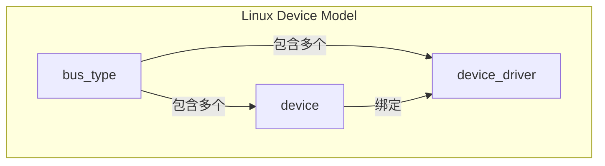
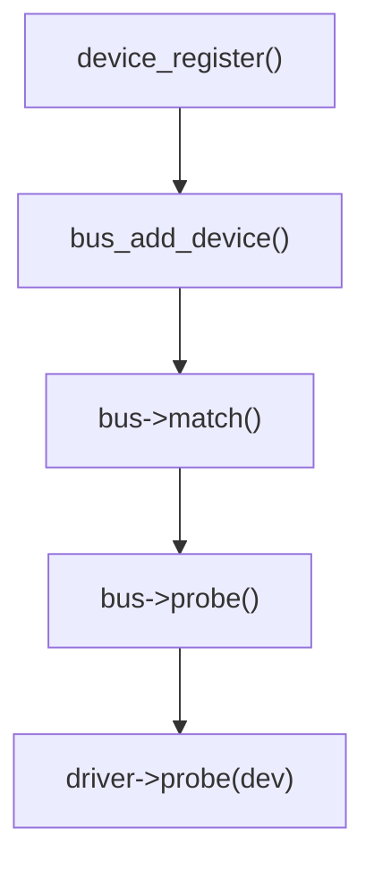
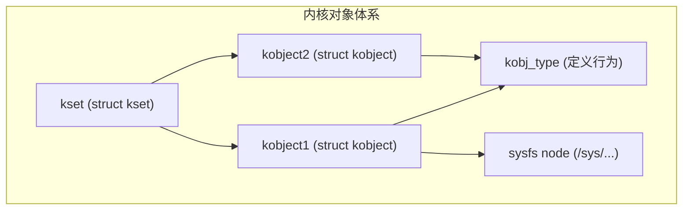
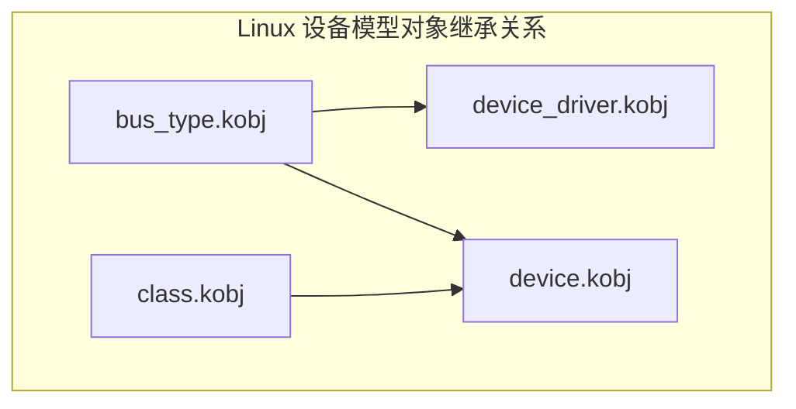
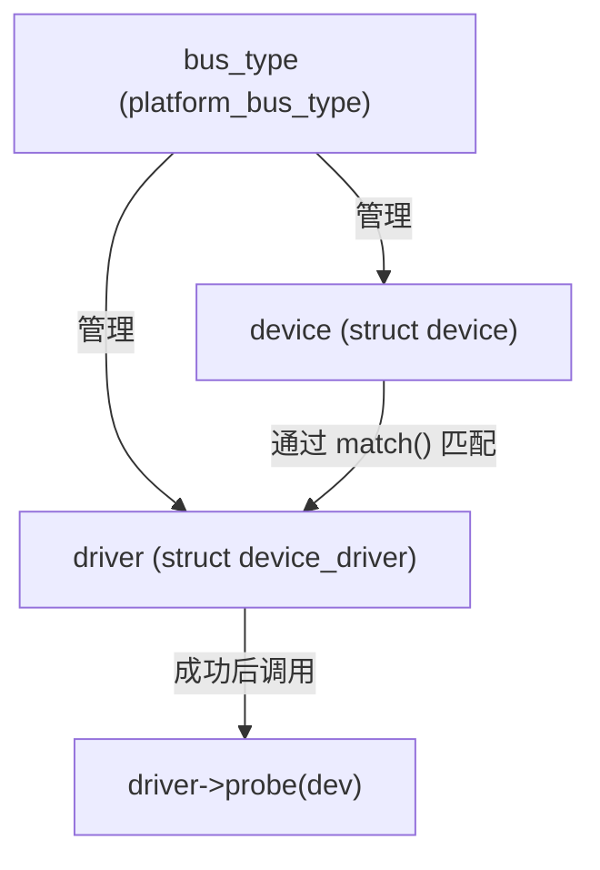
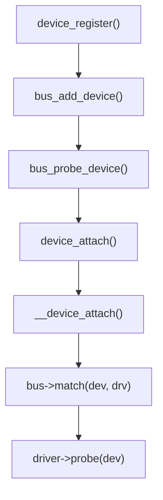
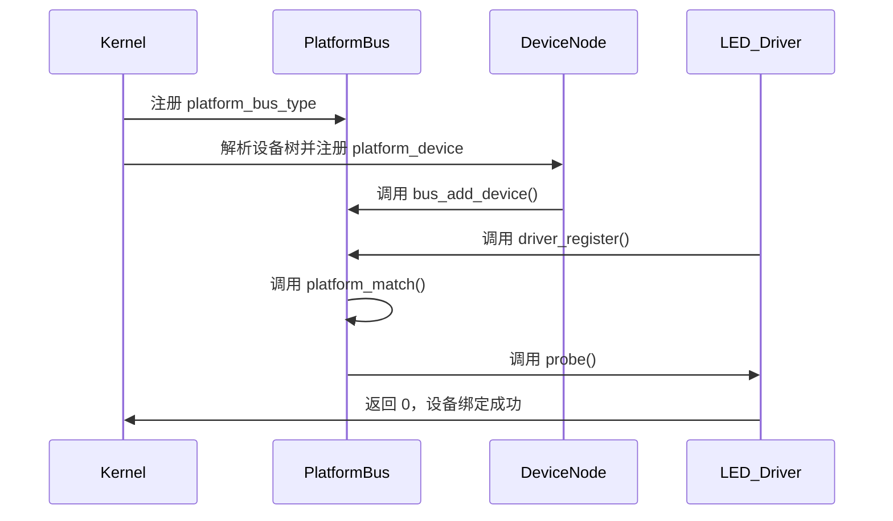
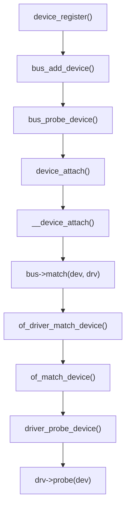
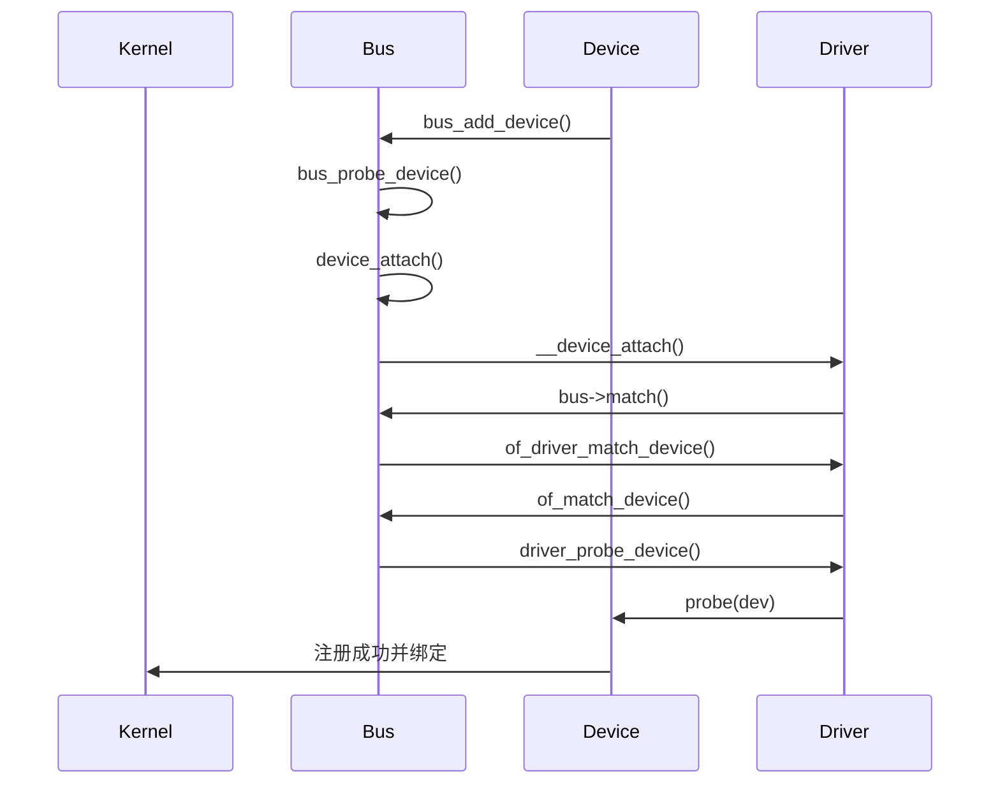

# 第1章_基础与对象模型

## 1.1_Linux_设备模型系统(Device_Model_System)

### 1.1.1_主题引入

Linux 设备模型系统（Linux Device Model）是内核中连接 **硬件设备、驱动程序和用户空间** 的核心机制之一。它在内核中为所有“设备”提供统一的抽象层，使得：

- 各种类型的设备（platform、I2C、SPI、PCI、USB……）都能被统一管理；
- 驱动与设备的绑定、卸载、热插拔事件可被通用处理；
- 用户空间能够通过 sysfs、udev 等机制动态感知设备变化；
- 电源管理（PM）、热插拔、设备层次关系、总线管理都基于同一套数据结构和框架完成。


**核心思想**：

> “一切设备皆对象（struct device），一切驱动皆对象（struct device_driver）。”

这种统一模型不仅让 Linux 支持复杂的设备层次结构，还能让驱动开发者在一致的框架下实现对硬件的管理。

------

### 1.1.2_设计哲学

#### (1)_统一抽象_struct_device_与_struct_device_driver

Linux 设备模型的哲学核心是**面向对象化的分层抽象**：

| 抽象层 | 数据结构               | 作用                                                         |
| ------ | ---------------------- | ------------------------------------------------------------ |
| 设备层 | `struct device`        | 抽象出硬件设备（或逻辑设备）                                 |
| 驱动层 | `struct device_driver` | 抽象出驱动实体                                               |
| 总线层 | `struct bus_type`      | 表示设备与驱动的中间层（负责匹配）                           |
| 类层   | `struct class`         | 将功能相似的设备聚合为用户空间可视的类别（如 /sys/class/leds） |

这种分层架构的目标是**“通用化 + 可扩展”**，例如：

- 设备通过 `device_register()` 注册；
- 驱动通过 `driver_register()` 注册；
- 总线通过 `bus_register()` 注册；
- 匹配流程统一由 `bus->match()` 实现；
- 用户空间通过 sysfs（/sys/devices、/sys/class）访问统一接口。

------

#### (2)_核心设计原则

| 原则              | 含义                                                         |
| ----------------- | ------------------------------------------------------------ |
| 一切设备皆 device | 无论是 platform、i2c、spi、usb 等，最终都封装为 struct device。 |
| 一切驱动皆 driver | 所有驱动都继承自 struct device_driver。                      |
| 统一匹配机制      | 设备与驱动由 bus_type::match 完成匹配。                      |
| 自动化资源管理    | devres、PM、热插拔等基于统一对象模型管理。                   |
| sysfs 映射        | 内核对象与用户空间文件系统一一对应。                         |

------

### 1.1.3_数据结构视角

#### (1)_struct_device

位于 `include/linux/device.h`：

```c
struct device {
    struct device        *parent;
    struct device_private *p;
    struct kobject       kobj;
    const char           *init_name;
    struct bus_type      *bus;
    struct device_driver *driver;
    void                 *platform_data;
    struct dev_pm_info   power;
    ...
};
```

**关键字段解析：**

| 字段            | 含义                                                 |
| --------------- | ---------------------------------------------------- |
| `parent`        | 指向父设备，构成层次结构（如 I2C 控制器 → I2C 设备） |
| `kobj`          | 用于与 sysfs 对应（/sys/devices/...）                |
| `bus`           | 当前设备所属总线（如 platform_bus_type）             |
| `driver`        | 当前绑定的驱动对象                                   |
| `platform_data` | 平台私有数据（用于非 DT 的板级传参）                 |
| `power`         | 电源管理接口（suspend/resume）                       |

------

#### (2)_struct_device_driver

```c
struct device_driver {
    const char      *name;
    struct bus_type *bus;
    struct module   *owner;
    const struct of_device_id *of_match_table;
    int  (*probe)(struct device *dev);
    void (*remove)(struct device *dev);
    ...
};
```

**字段作用：**

| 字段               | 含义                       |
| ------------------ | -------------------------- |
| `name`             | 驱动名称                   |
| `bus`              | 对应的总线类型             |
| `of_match_table`   | 设备树匹配表               |
| `probe` / `remove` | 设备绑定与解绑回调         |
| `owner`            | 模块所有权保护（防止卸载） |

------

#### (3)_struct_bus_type

```c
struct bus_type {
    const char *name;
    int (*match)(struct device *dev, struct device_driver *drv);
    int (*probe)(struct device *dev);
    void (*remove)(struct device *dev);
    ...
};
```

该结构定义了“如何在此总线上完成匹配与注册”的逻辑。

例如：

- `platform_bus_type.match = platform_match()`
- `i2c_bus_type.match = i2c_device_match()`

------

#### (4)_关系图



------

### 1.1.4_开发者视角

#### (1)_设备注册

驱动开发者通常通过以下函数注册设备：

```c
int device_register(struct device *dev);
void device_unregister(struct device *dev);
```

在 platform 总线上通常使用：

```c
platform_device_register(&pdev);
```

设备会出现在 `/sys/devices/` 下，udev 根据其属性创建设备节点。

------

#### (2)_驱动注册

驱动注册同理：

```c
int driver_register(struct device_driver *drv);
void driver_unregister(struct device_driver *drv);
```

或总线封装形式：

```c
platform_driver_register(&my_driver);
platform_driver_unregister(&my_driver);
```

------

#### (3)_匹配流程



当一个新设备注册时，内核会遍历总线上的驱动列表进行匹配。

匹配成功后：

- 调用 `driver->probe(dev)`
- 创建 sysfs 节点
- 通知 uevent → 用户空间创建设备文件

------

### 1.1.5_用户视角

从用户角度看，设备模型体系通过 **sysfs** 提供可见接口：

- `/sys/devices/`：物理设备层次
- `/sys/bus/`：总线及设备驱动信息
- `/sys/class/`：功能分类，如 `/sys/class/leds`
- `/sys/dev/char/`、`/sys/dev/block/`：字符/块设备对应关系

用户空间工具（如 `udevadm info -a -p /sys/class/leds/...`）可直接查看设备与驱动绑定信息。

------

### 1.1.6_示例_Platform_驱动与设备模型关系

```c
// 简化平台驱动示例
static int led_probe(struct platform_device *pdev)
{
    struct device *dev = &pdev->dev;
    dev_info(dev, "LED device probed\n");
    return 0;
}

static const struct of_device_id led_of_match[] = {
    { .compatible = "nxp,imx6ull-led", },
    {}
};

static struct platform_driver led_driver = {
    .driver = {
        .name = "led_driver",
        .of_match_table = led_of_match,
    },
    .probe = led_probe,
};

module_platform_driver(led_driver);
```

该驱动自动展开为：

```c
static int __init led_driver_init(void)
{
    return platform_driver_register(&led_driver);
}
```

驱动注册后：

- `led_driver.driver.bus = &platform_bus_type`
- 匹配通过 `of_match_device()` 完成；
- 匹配成功调用 `led_probe()`；
- 设备出现在 `/sys/devices/platform/led_driver`。

------

### 1.1.7_调试与验证

| 检查项              | 命令                                       | 说明                    |
| ------------------- | ------------------------------------------ | ----------------------- |
| 查看设备树匹配情况  | `cat /sys/bus/platform/devices/*/modalias` | 查看匹配到的 compatible |
| 查看驱动加载情况    | `lsmod` / `dmesg                           | grep led_driver`        |
| 查看 sysfs 绑定关系 | `ls /sys/bus/platform/drivers/led_driver/` | 驱动绑定的设备          |
| 查看设备节点        | `udevadm info -a -p /sys/class/leds/...`   | 设备模型路径分析        |

------

### 1.1.8_小结

| 层次         | 结构体                                    | 关键作用                 |
| ------------ | ----------------------------------------- | ------------------------ |
| 设备层       | `struct device`                           | 描述硬件或逻辑设备       |
| 驱动层       | `struct device_driver`                    | 描述驱动实体及回调       |
| 总线层       | `struct bus_type`                         | 描述设备与驱动的匹配规则 |
| 类层         | `struct class`                            | 将设备暴露给用户空间     |
| 内核接口     | `device_register()` / `driver_register()` | 注册入口                 |
| 用户空间接口 | sysfs + uevent + udev                     | 实现设备可见性与动态管理 |

Linux 设备模型是所有驱动子系统的基础，它并不直接驱动硬件，而是提供了**驱动管理框架**。理解这一层，对后续 GPIO、I2C、SPI、PCI、USB、pinctrl 等子系统的学习具有根本性意义。


------

## 1.2_内核对象(kobject/kset)机制

### 1.2.1_主题引入

在 Linux 设备模型的最底层，存在一组通用的对象管理机制：**kobject（kernel object）**。它是整个设备模型的**最小原子单位**，承担以下任务：

- 维护内核对象（device、driver、bus、class）的基本生命周期；
- 建立对象层次结构（父子关系）；
- 在 sysfs 中自动创建对应的目录与属性文件；
- 统一引用计数、释放、热插拔（uevent）等基础管理功能。

几乎所有内核设备模型对象（`struct device`、`struct device_driver`、`struct bus_type`、`struct class`）都**嵌入了一个 kobject 成员**，作为其“元管理头”。

------

### 1.2.2_设计哲学

Linux 设备模型中，kobject 的设计核心是：

> **将 C 结构体对象的生命周期、层次关系和用户空间可见性统一管理。**

简言之，`kobject` 是内核对象的“身份标识系统”：

| 层次目标 | kobject 功能                              |
| -------- | ----------------------------------------- |
| 生命周期 | 统一引用计数（kref）与释放钩子（release） |
| 层次结构 | parent 指针形成对象树                     |
| 命名空间 | sysfs 中目录与属性命名                    |
| 用户接口 | 支撑 /sys 文件系统                        |
| 通知机制 | uevent 通知用户空间                       |

> 没有 kobject，就没有 sysfs；
> 没有 sysfs，就没有设备模型的可视化与热插拔。

------

### 1.2.3_数据结构视角

#### (1)_struct_kobject

位于 `include/linux/kobject.h`：

```c
struct kobject {
    const char              *name;       // 对象名
    struct list_head        entry;       // 挂入 kset 的链表节点
    struct kobject          *parent;     // 父对象
    struct kset             *kset;       // 所属集合
    struct kobj_type        *ktype;      // 类型信息
    struct kernfs_node      *sd;         // sysfs 对应目录节点
    struct kref             kref;        // 引用计数
};
```

#### (2)_核心子结构

##### 1)_struct_kset

kset 表示一组相关的 kobject 集合：

```c
struct kset {
    struct list_head 			list;     		// 包含的 kobject 链表
    spinlock_t       			list_lock;
    struct kobject    			kobj;    		// 自身也有一个 kobject
    const struct kset_uevent_ops *uevent_ops; 	 // 事件回调
};
```

它是中间层，用于在 sysfs 中形成层级目录（如 `/sys/class/leds/`）。

##### 2)_struct_kobj_type

用于定义对象的行为（类似“类”）：

```c
struct kobj_type {
    void (*release)(struct kobject *kobj);
    const struct sysfs_ops *sysfs_ops;
    struct attribute **default_attrs;
};
```

其中：

- `release()`：当引用计数为 0 时自动调用；
- `sysfs_ops`：定义读写属性文件的回调；
- `default_attrs`：默认导出的属性数组。

------

#### (3)_关系图



------

### 1.2.4_开发者视角

#### (1)_kobject_的生命周期

一个 kobject 的完整生命周期包括：

| 阶段 | 调用接口                                       | 作用                                   |
| ---- | ---------------------------------------------- | -------------------------------------- |
| 创建 | `kobject_init()` 或 `kobject_create_and_add()` | 初始化并添加到 sysfs                   |
| 使用 | `kobject_get()`                                | 引用计数 +1                            |
| 释放 | `kobject_put()`                                | 引用计数 -1；当为 0 时触发 `release()` |
| 销毁 | `release()`                                    | 用户自定义释放动作（通常为 `kfree()`） |

##### 1)_示例

```c
struct kobject *kobj;

kobj = kobject_create_and_add("my_kobj", kernel_kobj);
if (!kobj)
    return -ENOMEM;
```

sysfs 中出现：

```
/sys/kernel/my_kobj/
```

当不再使用：

```c
kobject_put(kobj);
```

------

#### (2)_kset_的使用

`kset` 允许多个 kobject 组织在同一集合中，形成 `/sys/class/xxx/` 目录。

示例：

```c
static struct kset *my_kset;

my_kset = kset_create_and_add("my_devices", NULL, kernel_kobj);
if (!my_kset)
    return -ENOMEM;

struct kobject *kobj = kobject_create_and_add("dev1", &my_kset->kobj);
```

sysfs 目录结构：

```
/sys/kernel/my_devices/dev1/
```

------

#### (3)_sysfs_属性绑定

属性通过 `struct attribute` 和 `sysfs_ops` 实现：

```c
static ssize_t my_show(struct kobject *kobj,
                       struct attribute *attr, char *buf)
{
    return sprintf(buf, "hello world\n");
}

static const struct sysfs_ops my_sysfs_ops = {
    .show = my_show,
};

static struct kobj_type my_ktype = {
    .release = my_release,
    .sysfs_ops = &my_sysfs_ops,
};
```

注册后，在 `/sys/kernel/my_kobj/` 可直接读取属性内容。

------

#### (4)_与设备模型结合

每个设备模型对象都包含一个 kobject：

| 内核对象               | 嵌入位置                            |
| ---------------------- | ----------------------------------- |
| `struct device`        | 成员：`struct kobject kobj;`        |
| `struct device_driver` | 成员：`struct kobject kobj;`        |
| `struct bus_type`      | 成员：`struct kobject subsys.kobj;` |
| `struct class`         | 成员：`struct kobject kobj;`        |

这使得所有设备、驱动、总线都能自动在 `/sys/` 中生成目录与属性。
 因此，kobject/kset 是整个设备模型树的“根节点机制”。

------

### 1.2.5_用户视角

用户空间中看到的 `/sys` 层次正是内核对象树的映射：

| sysfs 路径      | 对应内核结构         |
| --------------- | -------------------- |
| `/sys/devices/` | `struct device`      |
| `/sys/class/`   | `struct class`       |
| `/sys/bus/`     | `struct bus_type`    |
| `/sys/kernel/`  | `kernel_kobj` 根节点 |

当驱动注册设备时，例如：

```c
platform_driver_register()
platform_device_register()
```

kobject 会自动创建 `/sys/devices/platform/.../` 节点。
 udev 通过这些事件触发规则自动创建设备文件。

------

### 1.2.6_可视化_设备模型中的_kobject_继承关系



------

### 1.2.7_调试与验证

| 项目              | 命令                                     | 说明                |
| ----------------- | ---------------------------------------- | ------------------- |
| 查看内核对象树    | `tree /sys/devices`                      | 观察层次结构        |
| 查看 kobject 创建 | `dmesg                                   | grep kobject`       |
| 验证属性文件      | `cat /sys/kernel/my_kobj/...`            | 验证 sysfs 属性读写 |
| 查看引用计数      | 动态调试：`kobject_get()/put()` 打印日志 | 分析生命周期        |
| uevent 验证       | `udevadm monitor --kernel`               | 观察事件触发        |

------

### 1.2.8_小结

| 概念     | 数据结构                                     | 作用                             |
| -------- | -------------------------------------------- | -------------------------------- |
| 内核对象 | `struct kobject`                             | 提供统一的对象标识与生命周期管理 |
| 对象集合 | `struct kset`                                | 聚合同类对象，形成 sysfs 层级    |
| 类型描述 | `struct kobj_type`                           | 定义 release、sysfs 属性行为     |
| 内核接口 | `kobject_create_and_add()` / `kobject_put()` | 管理对象生命周期                 |
| 用户接口 | sysfs + uevent                               | 实现可视化与动态通知             |

------

> **总结：**
>
> - kobject/kset 是设备模型的骨架；
> - 它提供引用计数、命名、目录结构和事件机制；
> - 所有设备、驱动、总线、类都构建在它之上；
> - 理解 kobject，就是理解 Linux 设备模型的根基。


------

## 1.3_bus_type_总线机制与匹配流程详解

### 1.3.1_主题引入

在 Linux 设备模型中，**bus_type（总线类型）** 是连接 `device` 与 `driver` 的核心中介。它定义了**匹配规则**、**注册机制**与**事件传播路径**。

* 从驱动开发角度看，总线机制是 `device` 与 `driver` 结合的逻辑桥梁。
* 只有通过 bus_type 注册的匹配流程，驱动的 `probe()` 才会被调用。


典型总线包括：

| 总线类型 | 对应结构体          | 文件路径                      | 匹配函数             |
| -------- | ------------------- | ----------------------------- | -------------------- |
| platform | `platform_bus_type` | `drivers/base/platform.c`     | `platform_match()`   |
| i2c      | `i2c_bus_type`      | `drivers/i2c/i2c-core-base.c` | `i2c_device_match()` |
| spi      | `spi_bus_type`      | `drivers/spi/spi.c`           | `spi_match_device()` |
| usb      | `usb_bus_type`      | `drivers/usb/core/driver.c`   | `usb_device_match()` |

------

### 1.3.2_设计哲学

#### (1)_统一的抽象层_bus_type

设备模型将所有设备与驱动的连接抽象为统一概念——**总线（bus）**：

> 任何能承载设备与驱动的匹配逻辑的实体都称为总线。

无论是物理总线（如 I2C、SPI、USB）还是虚拟总线（如 platform），都必须提供以下功能：

| 功能       | 对应回调                                                     | 说明                     |
| ---------- | ------------------------------------------------------------ | ------------------------ |
| 匹配       | `int (*match)(struct device *dev, struct device_driver *drv);` | 决定设备与驱动是否兼容   |
| 探测       | `int (*probe)(struct device *dev);`                          | 匹配成功后执行驱动初始化 |
| 移除       | `int (*remove)(struct device *dev);`                         | 驱动卸载时回调           |
| 热插拔事件 | `int (*uevent)(struct device *dev, struct kobj_uevent_env *env);` | 生成 uevent 通知         |
| 属性接口   | `const struct attribute_group **bus_groups;`                 | 导出 sysfs 属性组        |

这种抽象保证了无论什么类型的硬件，匹配逻辑都能遵循同一标准接口。

------

#### (2)_核心关系图



------

### 1.3.3_数据结构视角

#### (1)_struct_bus_type_定义

位于 `include/linux/device/bus.h`：

```c
struct bus_type {
    const char      *name;
    const char      *dev_name;
    struct device   *dev_root;

    struct bus_attribute 		*bus_attrs;
    const struct attribute_group **bus_groups;

    int (*match)(struct device *dev, struct device_driver *drv);
    int (*uevent)(struct device *dev, struct kobj_uevent_env *env);
    int (*probe)(struct device *dev);
    int (*remove)(struct device *dev);
    void (*shutdown)(struct device *dev);

    struct subsys_private *p;  // 私有成员
};
```

**字段说明：**

| 字段               | 作用                                     |
| ------------------ | ---------------------------------------- |
| `name`             | 总线名（如 `"platform"`、`"i2c"`）       |
| `match`            | 匹配函数，决定驱动与设备是否兼容         |
| `probe` / `remove` | 匹配成功后的驱动加载/卸载回调            |
| `uevent`           | 产生热插拔事件（用户空间监听）           |
| `bus_groups`       | 定义 sysfs 属性导出接口                  |
| `p`                | 私有数据（包含 kset、driver/dev 列表等） |

------

#### (2)_struct_subsys_private_内部组成

该结构体由 `bus_register()` 自动分配：

```c
struct subsys_private {
    struct kset subsys;
    struct kset *devices_kset;
    struct kset *drivers_kset;
    struct klist klist_devices;
    struct klist klist_drivers;
};
```

用于管理：

- 所有注册到该总线的设备；
- 所有注册到该总线的驱动；
- 驱动与设备匹配关系。

------

### 1.3.4_开发者视角

#### (1)_总线注册

通过以下接口注册新总线：

```c
int bus_register(struct bus_type *bus);
void bus_unregister(struct bus_type *bus);
```

注册后，会自动在 `/sys/bus/` 下生成对应目录。

例如：

```c
platform_bus_type.name = "platform";
bus_register(&platform_bus_type);
```

生成路径：

```
/sys/bus/platform/
    ├── devices/
    ├── drivers/
```

------

#### (2)_设备注册与绑定流程

##### 1)_注册设备

当调用：

```c
device_register(&dev);
```

或

```c
platform_device_register(&pdev);
```

内核会执行以下步骤：



##### 2)_关键逻辑分析

- `bus_add_device()`：将设备添加到总线设备链表；
- `bus_probe_device()`：尝试在该总线上为设备匹配驱动；
- `bus->match()`：匹配函数；
- 匹配成功 → 调用 `driver->probe(dev)`。

------

#### (3)_驱动注册与匹配流程

当执行：

```c
platform_driver_register(&drv);
```

会间接调用：

```c
driver_register(&drv->driver);
```

驱动注册后，内核执行：

```c
bus_add_driver()
    ↓
driver_attach()
    ↓
bus_for_each_dev()
    ↓
__driver_attach()
    ↓
bus->match(dev, drv)
```

成功后：

- 调用 `driver_probe_device()`
- 进而执行 `drv->probe(dev)`

------

#### (4)_platform_match()_示例解析

位于 `drivers/base/platform.c`：

```c
static int platform_match(struct device *dev, struct device_driver *drv)
{
    struct platform_device *pdev = to_platform_device(dev);
    struct platform_driver *pdrv = to_platform_driver(drv);

    /* ① 设备树匹配 */
    if (of_driver_match_device(dev, drv))
        return 1;

    /* ② ACPI 匹配 */
    if (acpi_driver_match_device(dev, drv))
        return 1;

    /* ③ 名称匹配 */
    return (strcmp(pdev->name, pdrv->driver.name) == 0);
}
```

匹配逻辑优先级：

```
设备树 → ACPI → 名称匹配
```

------

### 1.3.5_用户视角

从用户空间看，bus_type 的存在使设备层次和驱动绑定可视化：

```
/sys/bus/platform/
├── devices/
│   ├── 2000000.gpio/
│   └── 2020000.uart/
└── drivers/
    ├── imx_gpio/
    └── imx_uart/
```

用户可以通过以下命令观察绑定关系：

| 操作             | 命令                                                  | 说明             |
| ---------------- | ----------------------------------------------------- | ---------------- |
| 查看设备绑定驱动 | `ls -l /sys/bus/platform/devices/2000000.gpio/driver` | 指向对应驱动     |
| 查看驱动绑定设备 | `ls -l /sys/bus/platform/drivers/imx_gpio/`           | 列出所有绑定设备 |
| 查看匹配信息     | `cat /sys/bus/platform/devices/2000000.gpio/modalias` | 输出 alias 名称  |
| 触发 uevent      | `echo add > /sys/bus/platform/devices/.../uevent`     | 通知 udev        |

------

### 1.3.6_示例_Platform_设备与驱动匹配全过程

#### (1)_设备树定义

```dts
led@0 {
    compatible = "nxp,imx6ull-led";
    reg = <0x02000000 0x1000>;
};
```

#### (2)_驱动定义

```c
static const struct of_device_id led_of_match[] = {
    { .compatible = "nxp,imx6ull-led" },
    {}
};

static int led_probe(struct platform_device *pdev)
{
    dev_info(&pdev->dev, "LED probe success!\n");
    return 0;
}

static struct platform_driver led_driver = {
    .driver = {
        .name = "led_driver",
        .of_match_table = led_of_match,
    },
    .probe = led_probe,
};

module_platform_driver(led_driver);
```

#### (3)_执行链概览



------

### 1.3.7_调试与验证

| 调试项        | 命令                                                        | 说明              |
| ------------- | ----------------------------------------------------------- | ----------------- |
| 查看总线注册  | `ls /sys/bus/`                                              | 查看所有 bus_type |
| 检查设备绑定  | `ls /sys/bus/platform/drivers/`                             | 驱动列表          |
| 查看 modalias | `cat /sys/bus/platform/devices/xxx/modalias`                | 匹配名            |
| 驱动加载日志  | `dmesg                                                      | grep probe`       |
| 动态解绑驱动  | `echo none > /sys/bus/platform/devices/xxx/driver_override` | 控制匹配行为      |

------

### 1.3.8_小结

| 层次     | 数据结构                        | 关键函数            | 作用                 |
| -------- | ------------------------------- | ------------------- | -------------------- |
| 总线     | `struct bus_type`               | `bus_register()`    | 注册总线管理框架     |
| 设备     | `struct device`                 | `device_register()` | 注册硬件节点         |
| 驱动     | `struct device_driver`          | `driver_register()` | 注册驱动实体         |
| 匹配     | `bus->match()`                  | `platform_match()`  | 判断匹配关系         |
| 探测     | `bus->probe()` / `drv->probe()` | 设备初始化回调      |                      |
| sysfs 层 | `/sys/bus/...`                  | 自动生成            | 可视化层次与绑定关系 |

> **总结：**
>  bus_type 是驱动开发的核心接口之一。
>  它定义了驱动和设备如何相遇、如何通信、如何解绑。
>  理解 `bus_type` 的 match 流程，是理解 Linux 驱动加载机制的关键。


------

## 1.4_device_与_device_driver_的匹配与绑定过程

### 1.4.1_主题引入

在上一章中，我们从总线层（`bus_type`）的角度看到了设备模型的匹配框架。但对驱动开发者而言，真正重要的不是抽象的 `bus_type`，而是：

> **当设备（device）注册后，内核是如何一步步找到对应驱动（device_driver）并触发 probe() 的？**

这一章，我们从设备注册的角度出发，完整剖析：

- 匹配核心函数：`of_driver_match_device()`、`of_match_device()`、`device_attach()`；
- 驱动注册与设备匹配的双向路径；
- 匹配成功后的绑定机制与释放逻辑；
- 实际驱动中的匹配链路验证。

------

### 1.4.2_设计哲学

Linux 内核设备模型的匹配机制遵循“三层逻辑”：

| 层次   | 关键角色        | 核心逻辑                     |
| ------ | --------------- | ---------------------------- |
| 总线层 | `bus_type`      | 定义匹配回调 match()         |
| 驱动层 | `device_driver` | 定义 probe()/remove() 等回调 |
| 设备层 | `device`        | 注册设备、调用 bus 匹配流程  |

该机制的设计哲学是：

> **匹配规则由总线定义，匹配行为由内核框架触发，匹配成功后由驱动执行。**

------

### 1.4.3_数据结构视角

#### (1)_struct_device

回顾第 1 章中提及的结构，这里仅列出与匹配有关的核心字段：

```c
struct device {
    struct device_driver *driver;     // 当前绑定的驱动
    struct bus_type      *bus;        // 所属总线
    struct device_node   *of_node;    // 设备树节点（匹配关键字段）
    void                 *platform_data;
    ...
};
```

其中：

- `bus` 指向所属总线（如 platform_bus_type）；
- `driver` 指向匹配成功后的驱动对象；
- `of_node` 是匹配设备树表的桥梁。

------

#### (2)_struct_device_driver

```c
struct device_driver {
    const struct of_device_id *of_match_table;
    struct bus_type *bus;
    int  (*probe)(struct device *dev);
    void (*remove)(struct device *dev);
};
```

`of_match_table` 是设备树匹配的核心字段。
 它定义了驱动可支持的硬件“签名”：

```c
static const struct of_device_id led_of_match[] = {
    { .compatible = "nxp,imx6ull-led", },
    {}
};
```

------

### 1.4.4_匹配调用链全景图

设备与驱动匹配的完整调用链如下：



可以总结为：

> **注册设备 → 触发总线匹配 → 匹配成功 → 调用驱动 probe()**

------

### 1.4.5_关键函数剖析

#### (1)_device_attach()

位于 `drivers/base/dd.c`：

```c
int device_attach(struct device *dev)
{
    int ret = 0;

    if (dev->driver)
        return device_bind_driver(dev);

    ret = bus_for_each_drv(dev->bus, NULL, dev, __device_attach);
    return ret;
}
```

解释：

- 若设备已绑定驱动，则直接调用 `device_bind_driver()`；
- 否则，遍历总线上的所有驱动，通过 `__device_attach()` 尝试匹配。

------

#### (2)_device_attach()

```c
static int __device_attach(struct device_driver *drv, void *data)
{
    struct device *dev = data;

    if (!driver_match_device(drv, dev))
        return 0;

    return driver_probe_device(drv, dev);
}
```

调用链继续进入：

- `driver_match_device()` → 调用总线定义的 `bus->match()`；
- 匹配成功后 → 调用 `driver_probe_device()`。

------

#### (3)_driver_match_device()

```c
static inline int driver_match_device(struct device_driver *drv,
                                      struct device *dev)
{
    return drv->bus->match ? drv->bus->match(dev, drv) : 1;
}
```

这就是平台总线的匹配入口。
 最终调用 `platform_match()`（上一章讲解）。

------

#### (4)_of_driver_match_device()

位于 `drivers/of/device.c`：

```c
int of_driver_match_device(const struct device *dev,
                           const struct device_driver *drv)
{
    if (!dev->of_node || !drv->of_match_table)
        return 0;

    return of_match_device(drv->of_match_table, dev);
}
```

作用：

- 若设备或驱动无设备树信息，则跳过；
- 否则调用 `of_match_device()` 进行匹配。

------

#### (5)_of_match_device()

```c
const struct of_device_id *of_match_device(
        const struct of_device_id *matches,
        const struct device *dev)
{
    struct device_node *node = dev->of_node;

    while (matches->compatible[0]) {
        if (of_device_is_compatible(node, matches->compatible))
            return matches;
        matches++;
    }
    return NULL;
}
```

说明：

- 遍历驱动支持的 compatible 列表；
- 若匹配到与设备节点中 `compatible` 相同的字符串，则返回该项；
- 否则继续匹配。

------

#### (6)_driver_probe_device()

匹配成功后调用：

```c
int driver_probe_device(struct device_driver *drv, struct device *dev)
{
    if (dev->driver)
        return -EBUSY;

    dev->driver = drv;
    if (drv->probe)
        return drv->probe(dev);
    return 0;
}
```

作用：

1. 建立绑定关系：`dev->driver = drv`;
2. 调用驱动的 `probe()` 完成硬件初始化；
3. sysfs 创建关联节点。

------

### 1.4.6_设备绑定与解绑机制

#### (1)_绑定阶段

绑定发生在 `driver_probe_device()` 中：

```c
dev->driver = drv;
```

随后通过 `kobject_uevent()` 通知用户空间，
 `udev` 根据规则创建设备文件节点。

------

#### (2)_解绑阶段

解绑调用 `device_release_driver()`：

```c
void device_release_driver(struct device *dev)
{
    if (dev->driver && dev->driver->remove)
        dev->driver->remove(dev);
    dev->driver = NULL;
}
```

该函数通常在以下场景触发：

- 模块卸载；
- 设备热拔插；
- 手动写入 `/sys/bus/.../unbind`。

------

### 1.4.7_完整匹配流程可视化



------

### 1.4.8_驱动开发中的应用示例

#### (1)_设备树部分

```dts
led@0 {
    compatible = "nxp,imx6ull-led";
    reg = <0x02000000 0x1000>;
};
```

#### (2)_驱动代码

```c
static const struct of_device_id led_of_match[] = {
    { .compatible = "nxp,imx6ull-led" },
    {}
};
MODULE_DEVICE_TABLE(of, led_of_match);

static int led_probe(struct platform_device *pdev)
{
    dev_info(&pdev->dev, "LED device matched and probed!\n");
    return 0;
}

static struct platform_driver led_driver = {
    .driver = {
        .name = "led_driver",
        .of_match_table = led_of_match,
    },
    .probe = led_probe,
};

module_platform_driver(led_driver);
```

输出日志：

```
[   2.104] led_driver: LED device matched and probed!
```

sysfs：

```
/sys/bus/platform/drivers/led_driver/
└── 2000000.led
```

------

### 1.4.9_调试与验证

| 检查项           | 命令                                                         | 说明             |
| ---------------- | ------------------------------------------------------------ | ---------------- |
| 查看匹配到的驱动 | `ls /sys/bus/platform/drivers/`                              | 验证 driver 名称 |
| 查看绑定设备     | `ls /sys/bus/platform/drivers/led_driver/`                   | 验证 device 出现 |
| 查看 modalias    | `cat /sys/bus/platform/devices/.../modalias`                 | 匹配名验证       |
| 查看 uevent      | `udevadm monitor --kernel`                                   | 驱动绑定事件     |
| 驱动解绑         | `echo 2000000.led > /sys/bus/platform/drivers/led_driver/unbind` | 手动解绑         |

------

### 1.4.10_小结

| 层次     | 函数                                        | 作用               |
| -------- | ------------------------------------------- | ------------------ |
| 设备注册 | `device_register()`                         | 注册到内核设备树   |
| 驱动注册 | `driver_register()`                         | 注册到总线驱动链表 |
| 匹配过程 | `bus->match()` → `of_driver_match_device()` | 检查兼容性         |
| 绑定过程 | `driver_probe_device()` → `drv->probe()`    | 建立驱动绑定       |
| 解绑过程 | `device_release_driver()`                   | 解除驱动绑定       |
| 用户层   | sysfs + uevent                              | 可视化绑定关系     |

------

> **总结：**
>
> - 匹配的实质是 `device` 与 `driver` 在同一总线上由 `bus->match()` 完成；
> - 驱动匹配流程依赖 `of_match_table` 或 `name` 机制；
> - 匹配成功后执行 `probe()`，解绑时执行 `remove()`；
> - sysfs 中 `/sys/bus/.../drivers/...` 目录即为绑定关系的直接映射。


------

