# 第2章_设备树与_Platform_框架

## 2.1_of_device_id_与_of_match_table_匹配机制详解

### 2.1.1_主题引入

Linux 设备模型的匹配机制中，**of_device_id 表（又称 of_match_table）** 是设备树（Device Tree, DT）环境下最核心的匹配结构。它建立了驱动与设备树节点之间的“语言桥梁”。

传统匹配依靠字符串名称（如 `pdev->name == drv->name`），而在使用设备树的内核（Device Tree Enabled Kernel）中，**所有匹配都转移到设备树属性 `compatible` 与驱动的 `of_match_table` 表上完成**。

------

### 2.1.2_设计哲学

Linux 的设备树匹配机制遵循以下原则：

| 原则                             | 说明                                                         |
| -------------------------------- | ------------------------------------------------------------ |
| 一切匹配以 `compatible` 为核心   | 匹配的唯一关键字段是设备树节点中的 `compatible` 字符串       |
| 驱动提供匹配表（of_match_table） | 驱动声明可识别的硬件类型                                     |
| 内核统一匹配接口                 | 所有总线共用 `of_driver_match_device()` 和 `of_match_device()` |
| 匹配结果决定 probe 调用          | 匹配成功后立即触发 `driver->probe()`                         |

> 简言之：**“设备树 compatible → 驱动 of_match_table → 匹配成功 → probe()”**

------

### 2.1.3_数据结构视角

#### (1)_struct_of_device_id

位于 `include/linux/mod_devicetable.h`：

```c
struct of_device_id {
    char name[32];
    char type[32];
    char compatible[128];
    const void *data;
};
```

| 字段         | 含义                                                         |
| ------------ | ------------------------------------------------------------ |
| `name`       | 可选，匹配 `device_node.name`（一般不使用）                  |
| `type`       | 可选，匹配 `device_node.type`（极少使用）                    |
| `compatible` | 主要匹配字段，对应 DTS 中的 `"compatible"` 属性              |
| `data`       | 附加数据指针，可在匹配后被驱动直接取用（常用于区分 SoC 版本或配置） |

------

#### (2)_驱动结构中的关联

驱动在定义时，将匹配表指向 `driver.of_match_table`：

```c
static const struct of_device_id led_of_match[] = {
    { .compatible = "nxp,imx6ull-led", .data = NULL },
    { .compatible = "fsl,imx6ull-led", .data = NULL },
    { }  // 表结束符，必须保留
};
MODULE_DEVICE_TABLE(of, led_of_match);

static struct platform_driver led_driver = {
    .driver = {
        .name = "led_driver",
        .of_match_table = led_of_match,
    },
    .probe = led_probe,
};
```

> `.of_match_table` 必须以空项 `{}` 结尾，否则匹配循环不会终止。

------

#### (3)_MODULE_DEVICE_TABLE_宏展开

`MODULE_DEVICE_TABLE(of, led_of_match);`
 此宏位于 `include/linux/module.h`：

```c
#define MODULE_DEVICE_TABLE(type, name) \
    extern const typeof(name) __mod_##type##__##name##_device_table \
    __attribute__ ((unused, alias(#name)));
```

该宏会：

1. 在 ELF 符号表中生成一个名为
   `__mod_of__led_of_match_device_table` 的符号；
2. 使 `depmod` 工具能扫描出模块支持的 `compatible`；
3. 允许内核模块自动加载（udev 根据 alias 触发）。

------

### 2.1.4_开发者视角

#### (1)_匹配过程分析

匹配核心逻辑在 `drivers/of/device.c`：

```c
int of_driver_match_device(const struct device *dev,
                           const struct device_driver *drv)
{
    if (!dev->of_node || !drv->of_match_table)
        return 0;

    return of_match_device(drv->of_match_table, dev) != NULL;
}
```

继续深入 `of_match_device()`：

```c
const struct of_device_id *of_match_device(
        const struct of_device_id *matches,
        const struct device *dev)
{
    const struct device_node *node = dev->of_node;

    while (matches->compatible[0]) {
        if (of_device_is_compatible(node, matches->compatible))
            return matches;
        matches++;
    }
    return NULL;
}
```

而 `of_device_is_compatible()` 位于 `drivers/of/base.c`：

```c
bool of_device_is_compatible(const struct device_node *device,
                             const char *compat)
{
    const char *cp;
    int index = 0;

    while ((cp = of_get_property(device, "compatible", &len))) {
        if (!strcmp(cp, compat))
            return true;
        index++;
    }
    return false;
}
```

**即：**
 内核逐项遍历 `drv->of_match_table`，
 依次比较 `compatible` 字符串与设备节点属性是否一致。

------

#### (2)_匹配优先级

匹配优先顺序（针对 platform、i2c、spi 等总线均一致）：

| 优先级 | 匹配方式                                    | 来源           |
| ------ | ------------------------------------------- | -------------- |
| ①      | 设备树 `compatible` 与驱动 `of_match_table` | DT 匹配        |
| ②      | ACPI ID 表                                  | x86/ACPI 环境  |
| ③      | 平台名（pdev->name == drv->name）           | 非 DT 兼容平台 |

示例：
 若 DTS 中定义：

```dts
led@0 {
    compatible = "nxp,imx6ull-led";
};
```

驱动声明：

```c
{ .compatible = "nxp,imx6ull-led" }
```

→ 匹配成功。
 若驱动缺少 of_match_table，则退回到 `pdev->name` 名称匹配。

------

#### (3)_多兼容匹配表(SoC_区分)

常见于不同硬件平台共享同一驱动源码时：

```c
static const struct of_device_id uart_of_match[] = {
    { .compatible = "fsl,imx6ul-uart",  .data = &uart_data_imx6ul },
    { .compatible = "fsl,imx6ull-uart", .data = &uart_data_imx6ull },
    {}
};
```

在 probe() 中可直接读取 `.data`：

```c
const struct of_device_id *match;
match = of_match_device(uart_of_match, &pdev->dev);
if (match)
    hw_config = match->data;
```

这样驱动在同一源码中可支持多版本硬件。

------

#### (4)_of_match_ptr()_辅助宏

某些驱动在非设备树环境下也会编译，因此常使用：

```c
.driver = {
    .of_match_table = of_match_ptr(led_of_match),
}
```

`of_match_ptr()` 在非 DT 编译时展开为 `NULL`，保证兼容：

```c
#ifdef CONFIG_OF
#define of_match_ptr(_ptr) (_ptr)
#else
#define of_match_ptr(_ptr) NULL
#endif
```

------

### 2.1.5_用户视角

在用户空间，匹配成功的设备节点会反映到 sysfs：

```
/sys/bus/platform/drivers/led_driver/
└── 2000000.led
```

同时 `modalias` 属性显示 alias 名：

```bash
cat /sys/bus/platform/devices/2000000.led/modalias
of:NnxpCimx6ull-led
```

`udev` 规则中会利用该 alias 触发驱动加载：

```bash
modprobe led_driver
```

------

### 2.1.6_完整匹配过程可视化

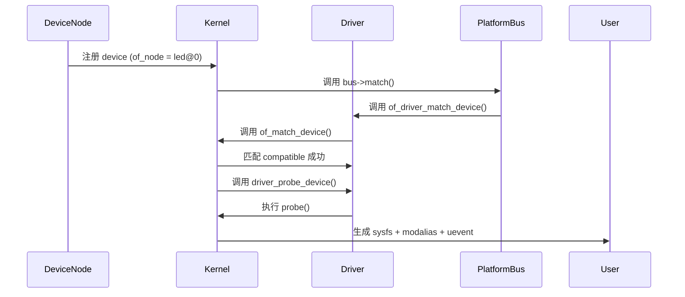

------

### 2.1.7_示例_多_compatible_匹配验证

#### (1)_设备树定义

```dts
led@0 {
    compatible = "nxp,imx6ull-led", "nxp,imx6ul-led";
};
```

#### (2)_驱动定义

```c
static const struct of_device_id led_of_match[] = {
    { .compatible = "nxp,imx6ul-led" },
    { .compatible = "nxp,imx6ull-led" },
    {}
};
```

**匹配结果：**
 内核会按 DTS 中 compatible 列表顺序匹配，
 若第一个失败，会继续尝试下一个。
 最终匹配 `nxp,imx6ull-led`，进入 probe。

------

### 2.1.8_调试与验证

| 检查项              | 命令                                                         | 说明             |
| ------------------- | ------------------------------------------------------------ | ---------------- |
| 查看设备 compatible | `cat /proc/device-tree/.../compatible`                       | DTS 中的字符串   |
| 查看驱动支持表      | `strings drivers/.../*.ko                    | grep compatible` |                  |
| 查看匹配结果        | `dmesg                                       | grep probe`   |                  |
| 验证 alias          | `cat /sys/bus/platform/devices/.../modalias`                 | 匹配标识符       |
| 模块自动加载验证    | `udevadm monitor`                                            | 监听 uevent 触发 |

------

### 2.1.9_小结

| 概念     | 数据结构                   | 核心接口            | 作用            |
| -------- | -------------------------- | ------------------- | --------------- |
| 匹配表   | `struct of_device_id`      | `of_match_device()` | 匹配 compatible |
| 匹配入口 | `of_driver_match_device()` | 总线 match 函数调用 |                 |
| 注册宏   | `MODULE_DEVICE_TABLE()`    | 模块自动加载支持    |                 |
| 宏保护   | `of_match_ptr()`           | 支持非 DT 编译环境  |                 |
| 结果输出 | `/sys/bus/.../modalias`    | 用户空间 alias 可见 |                 |

> **总结：**
>
> - `of_device_id` 是设备树匹配的核心桥梁；
> - 匹配基于字符串相等，不存在模糊匹配；
> - 驱动表项 `.data` 可用于 SoC 变种区分；
> - 驱动加载自动化依赖于 `MODULE_DEVICE_TABLE(of, xxx)`。


---

## 2.2_platform_device_与_platform_driver_框架

### 2.2.1_主题引入

在 Linux 设备模型体系中，`platform_device` 与 `platform_driver` 是最常见的一对设备-驱动结构。
 它们主要服务于**片上外设（SoC on-chip peripherals）**，
 这些外设通常不通过标准总线（如 PCI、USB、I²C）进行枚举，
 因此 Linux 内核需要人为地在 **platform 总线（platform_bus_type）** 上注册并匹配这些设备。

> **核心思想：**
>
> - 通过 `platform_device_register()` 注册设备；
> - 通过 `platform_driver_register()` 注册驱动；
> - platform 总线负责匹配二者；
> - 匹配成功后调用 `driver->probe()`。

------

### 2.2.2_设计哲学

#### (1)_platform_框架的定位

Platform 机制用于统一管理：

- **片上外设（SoC peripherals）**
- **虚拟设备（software-only devices）**
- **非自枚举型设备**

区别于 PCI/USB：

- PCI/USB 设备由硬件总线自动扫描；
- Platform 设备需要 **显式注册**（由 DTS 或手动注册）。

------

#### (2)_三层结构模型

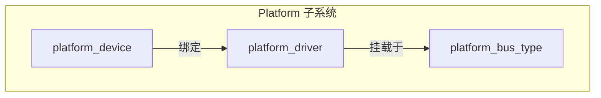

所有 platform 设备/驱动都通过 `platform_bus_type` 连接。

------

### 2.2.3_数据结构视角

#### (1)_struct_platform_device

位于 `include/linux/platform_device.h`：

```c
struct platform_device {
    const char 						*name;
    int 							id;
    struct device  					dev;
    u32 							num_resources;
    struct resource 				*resource;
    const struct platform_device_id   *id_entry;
};
```

| 字段       | 说明                                    |
| ---------- | --------------------------------------- |
| `name`     | 用于匹配驱动（非 DT 模式）              |
| `id`       | 区分多个同名设备（如 `led.0`、`led.1`） |
| `dev`      | 继承自通用设备结构（struct device）     |
| `resource` | 硬件资源表（I/O、IRQ、MEM）             |
| `id_entry` | 匹配表（非 DT 模式下使用）              |

------

#### (2)_struct_platform_driver

```c
struct platform_driver {
    int (*probe)(struct platform_device *);
    int (*remove)(struct platform_device *);
    struct device_driver driver;
    const struct platform_device_id *id_table;
};
```

| 字段               | 说明                               |
| ------------------ | ---------------------------------- |
| `probe` / `remove` | 驱动绑定/解绑时的回调              |
| `driver`           | 基础驱动结构（嵌入 device_driver） |
| `id_table`         | 平台 ID 匹配表（非 DT 环境）       |

------

#### (3)_struct_resource(硬件资源表)

```c
struct resource {
    resource_size_t start;
    resource_size_t end;
    const char *name;
    unsigned long flags;
};
```

常用标志：

| 标志             | 含义               |
| ---------------- | ------------------ |
| `IORESOURCE_MEM` | 内存映射寄存器区域 |
| `IORESOURCE_IRQ` | 中断号             |
| `IORESOURCE_DMA` | DMA 通道           |

------

### 2.2.4_开发者视角

#### (1)_注册设备

两种方式：

##### 1)_静态注册(设备树方式)

在设备树定义：

```dts
led@0 {
    compatible = "nxp,imx6ull-led";
    reg = <0x02000000 0x1000>;
    interrupts = <23>;
};
```

→ 内核解析后自动生成 `platform_device` 并注册。

##### 2)_动态注册(代码方式)

```c
static struct resource led_res[] = {
    [0] = {
        .start = 0x02000000,
        .end   = 0x02000FFF,
        .flags = IORESOURCE_MEM,
    },
};

static struct platform_device led_device = {
    .name = "led_driver",
    .id = -1,
    .num_resources = ARRAY_SIZE(led_res),
    .resource = led_res,
};

platform_device_register(&led_device);
```

------

#### (2)_注册驱动

```c
static int led_probe(struct platform_device *pdev)
{
    dev_info(&pdev->dev, "LED device probed!\n");
    return 0;
}

static int led_remove(struct platform_device *pdev)
{
    dev_info(&pdev->dev, "LED device removed!\n");
    return 0;
}

static const struct of_device_id led_of_match[] = {
    { .compatible = "nxp,imx6ull-led", },
    {}
};
MODULE_DEVICE_TABLE(of, led_of_match);

static struct platform_driver led_driver = {
    .probe = led_probe,
    .remove = led_remove,
    .driver = {
        .name = "led_driver",
        .of_match_table = of_match_ptr(led_of_match),
    },
};
module_platform_driver(led_driver);
```

> 宏 `module_platform_driver()` 等价于：
>
> ```c
> static int __init led_init(void) {
>     return platform_driver_register(&led_driver);
> }
> static void __exit led_exit(void) {
>     platform_driver_unregister(&led_driver);
> }
> module_init(led_init);
> module_exit(led_exit);
> ```

------

#### (3)_匹配机制回顾

当内核注册设备或驱动时，执行路径如下：

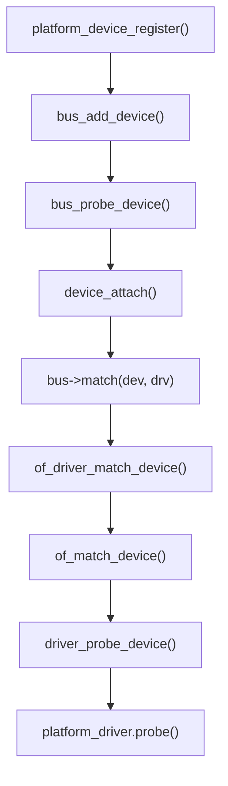

匹配成功后：

- `pdev->dev.driver` 被赋值；
- `probe()` 执行；
- sysfs 中自动创建 `/sys/bus/platform/drivers/xxx/yyy/`。

------

#### (4)_资源解析接口

Platform 框架提供一系列解析函数：

| 函数                                                         | 功能                     |
| ------------------------------------------------------------ | ------------------------ |
| `platform_get_resource(pdev, type, index)`                   | 获取硬件资源（I/O、IRQ） |
| `platform_get_irq(pdev, index)`                              | 获取中断号               |
| `devm_ioremap_resource(dev, res)`                            | 自动映射物理寄存器       |
| `platform_get_drvdata(pdev)` / `platform_set_drvdata(pdev, data)` | 驱动私有数据管理         |

示例：

```c
static int led_probe(struct platform_device *pdev)
{
    struct resource *res;
    void __iomem *base;

    res = platform_get_resource(pdev, IORESOURCE_MEM, 0);
    base = devm_ioremap_resource(&pdev->dev, res);
    if (IS_ERR(base))
        return PTR_ERR(base);

    dev_info(&pdev->dev, "LED mapped at %p\n", base);
    return 0;
}
```

------

### 2.2.5_用户视角

在 sysfs 中，platform 框架对应的层次：

```
/sys/devices/platform/
├── led_driver.0/
│   ├── driver -> ../../bus/platform/drivers/led_driver
│   ├── modalias
│   ├── of_node/
│   └── uevent
```

用户可查看匹配和资源信息：

```bash
cat /sys/devices/platform/led_driver.0/of_node/compatible
# nxp,imx6ull-led

cat /sys/bus/platform/devices/led_driver.0/modalias
# of:NnxpCimx6ull-led
```

------

### 2.2.6_可视化_注册与匹配流程图

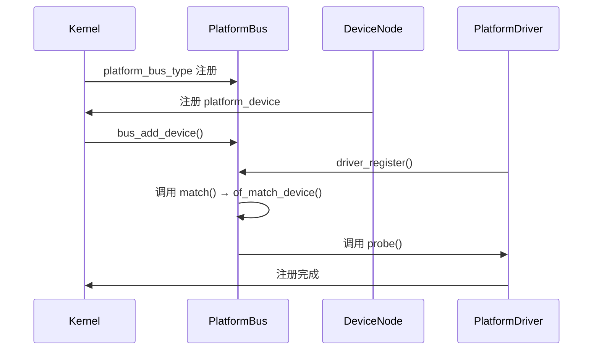

------

### 2.2.7_调试与验证

| 检查项        | 命令                                          | 说明           |
| ------------- | --------------------------------------------- | -------------- |
| 查看设备      | `ls /sys/devices/platform/`                   | 所有注册的设备 |
| 查看驱动      | `ls /sys/bus/platform/drivers/`               | 当前驱动列表   |
| 查看绑定关系  | `ls -l /sys/bus/platform/drivers/led_driver/` | 驱动绑定设备   |
| 查看资源      | `cat /proc/iomem                              | grep LED`      |
| 查看 modalias | `cat /sys/bus/platform/devices/.../modalias`  | 验证匹配名称   |

------

### 2.2.8_小结

| 层次     | 数据结构                 | 核心函数                     | 作用                |
| -------- | ------------------------ | ---------------------------- | ------------------- |
| 设备     | `struct platform_device` | `platform_device_register()` | 注册设备            |
| 驱动     | `struct platform_driver` | `platform_driver_register()` | 注册驱动            |
| 匹配     | `of_match_device()`      | `platform_bus_type.match`    | 检查 compatible     |
| 资源     | `struct resource`        | `platform_get_resource()`    | 获取 I/O 与中断信息 |
| 生命周期 | `probe()` / `remove()`   | 驱动加载与卸载               | 控制资源生命周期    |

> **总结：**
>
> - Platform 框架是 SoC 驱动开发的核心入口；
> - DTS 提供硬件信息，platform_bus_type 完成匹配；
> - 驱动只需定义匹配表 + probe，即可实现自动加载；
> - 对资源管理推荐使用 devm 系列接口，保证内存安全释放。


------

## 2.3_class_与设备分类机制

### 2.3.1_主题引入

Linux 内核设备模型中，`class` 是连接**内核设备体系**与**用户空间设备节点**的重要中间层。
 它定义了一类功能相似设备的集合（如字符设备、LED、I2C、SPI、USB、GPIO 等）。

> **核心功能：**
>
> - 在 `/sys/class/` 下建立统一入口；
> - 通过 `udev` 自动创建 `/dev` 设备节点；
> - 提供统一的属性接口与热插拔通知机制；
> - 使不同驱动共用同一类别管理规则。

示例：

```
/sys/class/leds/
├── led0/
│   ├── brightness
│   └── trigger
```

对应的设备节点自动生成：

```
/dev/led0
```

------

### 2.3.2_设计哲学

#### (1)_class_的存在意义

在设备模型中，设备（`device`）本身与驱动（`driver`）是一一匹配的。
 但是不同设备可能属于相同“功能类别”（如所有 LED 设备都属于 LED 类）。
 此时，class 机制就承担了“功能聚合”的职责。

| 层次           | 角色         | 示例                                  |
| -------------- | ------------ | ------------------------------------- |
| 总线（bus）    | 管理匹配规则 | platform、i2c、spi                    |
| 设备（device） | 描述硬件实例 | imx6ull-led                           |
| 驱动（driver） | 提供控制逻辑 | led_driver                            |
| 类（class）    | 功能聚合层   | `/sys/class/leds`、`/sys/class/input` |

------

#### (2)_关系图

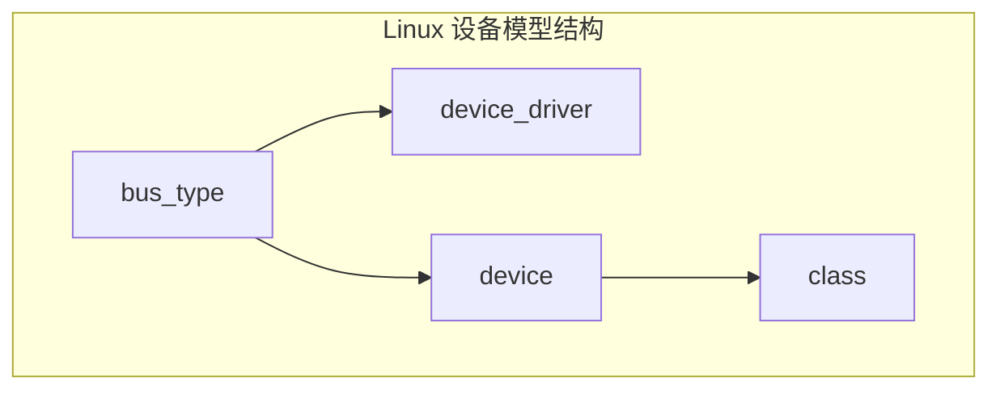

------

### 2.3.3_数据结构视角

#### (1)_struct_class

位于 `include/linux/device/class.h`：

```c
struct class {
    const char              	*name;        	// 类名（如 "leds"）
    struct module           	*owner;       	// 模块引用
    struct kobject           	kobj;        	// sysfs 节点
    struct class_attribute  	*class_attrs; 	// 类属性
    const struct attribute_group **dev_groups; 	// 设备属性组
    int (*dev_uevent)(struct device *dev, struct kobj_uevent_env *env);
    void (*dev_release)(struct device *dev);
};
```

| 字段          | 作用                                      |
| ------------- | ----------------------------------------- |
| `name`        | 决定 `/sys/class/<name>/` 的目录名        |
| `kobj`        | 对应 sysfs 中的节点                       |
| `class_attrs` | 类级别属性（如 /sys/class/leds/version）  |
| `dev_groups`  | 设备属性组，定义每个设备节点的 sysfs 属性 |
| `dev_uevent`  | 用于构建 udev 事件                        |
| `dev_release` | 设备释放回调                              |

------

#### (2)_struct_device_与_class_的关系

`struct device` 中包含：

```c
struct device {
    struct class *class;  // 指向所属 class
    struct device *parent;
    dev_t devt;           // 主次设备号（用于 /dev 节点）
    ...
};
```

当 `device.class != NULL` 时，该设备将出现在 `/sys/class/<class_name>/` 下。
 否则，仅存在于 `/sys/devices/...` 路径中。

------

### 2.3.4_开发者视角

#### (1)_注册_class

驱动中注册类：

```c
static struct class *led_class;

static int __init led_class_init(void)
{
    led_class = class_create(THIS_MODULE, "leds");
    if (IS_ERR(led_class))
        return PTR_ERR(led_class);
    return 0;
}
```

该函数定义于 `drivers/base/class.c`：

```c
struct class *class_create(struct module *owner, const char *name)
{
    struct class *cls;
    cls = kzalloc(sizeof(*cls), GFP_KERNEL);
    cls->name = name;
    return class_register(cls);
}
```

执行后，会在 sysfs 中生成：

```
/sys/class/leds/
```

------

#### (2)_注册设备节点(device_create)

与 class 关联的设备节点通过：

```c
struct device *device_create(struct class *class,
                             struct device *parent,
                             dev_t devt,
                             void *drvdata,
                             const char *fmt, ...);
```

该函数完成以下步骤：

1. 动态分配 `struct device`;
2. 设置 `dev->class = class`;
3. 设置设备号 `dev->devt = devt`;
4. 创建 `/sys/class/<class>/<device>/`;
5. 触发 uevent → udev 自动创建设备文件 `/dev/<device>`。

##### 1)_示例

```c
dev_t devt;
alloc_chrdev_region(&devt, 0, 1, "demo");
device_create(led_class, NULL, devt, NULL, "demo0");
```

效果：

```
/sys/class/leds/demo0
/dev/demo0
```

------

#### (3)_销毁设备与类

```c
device_destroy(led_class, devt);
class_destroy(led_class);
```

销毁顺序必须与创建相反。

------

#### (4)_dev_uevent_与设备节点生成机制

每次 `device_create()` 调用时：

- 内核通过 `kobject_uevent()` 触发 **add** 事件；
- udevd 进程接收该事件；
- 根据 `/lib/udev/rules.d/` 下规则，执行 `mknod /dev/<name>`；
- `/sys/class/...` 与 `/dev/...` 自动建立对应关系。

------

### 2.3.5_用户视角

从用户空间看，`class` 决定了 `/sys/class` 目录层级。
 不同类别的驱动对应不同路径：

| 类别     | sysfs 路径          | 说明         |
| -------- | ------------------- | ------------ |
| LED      | `/sys/class/leds/`  | LED 控制     |
| 网卡     | `/sys/class/net/`   | 网络接口     |
| 块设备   | `/sys/class/block/` | 存储设备     |
| 输入设备 | `/sys/class/input/` | 键盘、触摸屏 |
| 串口     | `/sys/class/tty/`   | UART         |
| 自定义   | `/sys/class/demo/`  | 用户自定义类 |

用户可通过 `cat` 或 `echo` 与驱动交互。

------

### 2.3.6_完整流程可视化

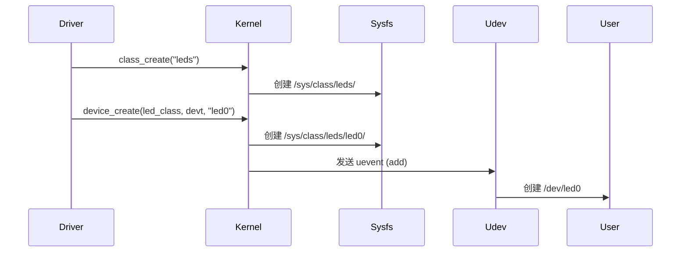

------

### 2.3.7_示例_字符设备与_class_集成

```c
static struct class *demo_class;
static dev_t devt;
static struct cdev demo_cdev;

static int __init demo_init(void)
{
    alloc_chrdev_region(&devt, 0, 1, "demo");
    cdev_init(&demo_cdev, &demo_fops);
    cdev_add(&demo_cdev, devt, 1);

    demo_class = class_create(THIS_MODULE, "demo");
    device_create(demo_class, NULL, devt, NULL, "demo0");

    pr_info("demo device created: /dev/demo0\n");
    return 0;
}

static void __exit demo_exit(void)
{
    device_destroy(demo_class, devt);
    class_destroy(demo_class);
    cdev_del(&demo_cdev);
    unregister_chrdev_region(devt, 1);
}

module_init(demo_init);
module_exit(demo_exit);
MODULE_LICENSE("GPL");
```

**执行结果：**

```
/sys/class/demo/demo0/
└── dev
/dev/demo0
```

------

### 2.3.8_调试与验证

| 检查项          | 命令                                       | 说明                 |
| --------------- | ------------------------------------------ | -------------------- |
| 查看 class 注册 | `ls /sys/class/`                           | 验证类别是否存在     |
| 查看设备节点    | `ls /sys/class/demo/`                      | 确认创建             |
| 查看 /dev 文件  | `ls -l /dev/demo0`                         | 自动节点验证         |
| 查看 uevent     | `udevadm monitor`                          | 监听 add/remove 事件 |
| 查看驱动绑定    | `udevadm info -a -p /sys/class/demo/demo0` | 分析属性             |

------

### 2.3.9_小结

| 层次         | 数据结构                            | 核心函数                               | 作用             |
| ------------ | ----------------------------------- | -------------------------------------- | ---------------- |
| 类注册       | `struct class`                      | `class_create()` / `class_destroy()`   | 创建功能类别目录 |
| 设备节点     | `struct device`                     | `device_create()` / `device_destroy()` | 创建设备实例     |
| 用户空间节点 | `/dev`                              | 由 udev 自动生成                       | 用户可访问接口   |
| 事件系统     | `dev_uevent()` / `kobject_uevent()` | 热插拔通知                             |                  |
| 典型路径     | `/sys/class/<class>/<dev>`          | sysfs 结构入口                         |                  |

> **总结：**
>
> - `class` 是设备模型中面向用户空间的分类接口；
> - 它通过 sysfs 目录与 udev 协作自动生成 `/dev` 节点；
> - 所有字符设备驱动都应通过 class 注册实现用户可见性；
> - 理解 class 机制，是编写高质量 Linux 驱动的关键。


------

## 2.4_device_attribute_与驱动属性文件机制

### 2.4.1_主题引入

Linux 内核的 **sysfs 属性文件机制** 是驱动开发中与用户空间交互的关键接口之一。
 开发者可以通过 `DEVICE_ATTR_*()` 系列宏在 `/sys/` 下创建可读写的文件，
 从而让用户空间以 `cat` / `echo` 方式直接访问内核变量或控制设备行为。

> **典型场景：**
>
> - 控制 LED 亮灭：`echo 1 > /sys/class/leds/led0/brightness`
> - 查询驱动状态：`cat /sys/class/net/eth0/operstate`
> - 调试驱动参数：`cat /sys/devices/.../register_dump`

sysfs 文件机制是 Linux 驱动模型的统一标准，
 其底层依托于 **kobject + sysfs_ops** 框架，
 而驱动层的具体实现则通过 **device_attribute** 完成。

------

### 2.4.2_设计哲学

| 原则           | 说明                                            |
| -------------- | ----------------------------------------------- |
| 一切文件皆属性 | 每个 `/sys/...` 文件都对应一个 `attribute` 对象 |
| 用户直接交互   | 文件读写映射到驱动层的 `show()` / `store()`     |
| 自动注册       | 属性文件与设备生命周期同步创建与销毁            |
| 无缓冲无缓存   | 读写操作直接作用于驱动代码（调试非常高效）      |

> sysfs 的目的不是高性能，而是 **透明、可见、可调试**。

------

### 2.4.3_数据结构视角

#### (1)_struct_device_attribute

位于 `include/linux/device.h`：

```c
struct device_attribute {
    struct attribute attr;
    ssize_t (*show)(struct device *dev,
                    struct device_attribute *attr, char *buf);
    ssize_t (*store)(struct device *dev,
                     struct device_attribute *attr, const char *buf, size_t count);
};
```

| 字段    | 说明                        |
| ------- | --------------------------- |
| `attr`  | 对应 sysfs 文件的名称与权限 |
| `show`  | 文件读回调，对应 `cat`      |
| `store` | 文件写回调，对应 `echo`     |

------

#### (2)_struct_attribute

```c
struct attribute {
    const char *name;
    umode_t mode;    // 文件权限，如 0444、0644
};
```

`umode_t` 是 Linux 文件权限掩码，与普通文件一致：

- `0444`：只读；
- `0644`：可读可写。

------

### 2.4.4_开发者视角

#### (1)_定义属性文件

```c
static ssize_t status_show(struct device *dev,
                           struct device_attribute *attr, char *buf)
{
    return sprintf(buf, "LED status: ON\n");
}

static ssize_t status_store(struct device *dev,
                            struct device_attribute *attr, const char *buf, size_t count)
{
    pr_info("LED write: %.*s", (int)count, buf);
    return count;
}
```

#### (2)_声明属性

使用内核提供的宏族：

| 宏                                     | 功能       | 权限       |
| -------------------------------------- | ---------- | ---------- |
| `DEVICE_ATTR(name, mode, show, store)` | 定义属性   | 自定义权限 |
| `DEVICE_ATTR_RO(name)`                 | 只读属性   | 0444       |
| `DEVICE_ATTR_RW(name)`                 | 可读写属性 | 0644       |
| `DEVICE_ATTR_WO(name)`                 | 只写属性   | 0200       |

##### 1)_示例

```c
static DEVICE_ATTR_RW(status);
```

展开后相当于：

```c
struct device_attribute dev_attr_status =
    __ATTR(status, 0644, status_show, status_store);
```

------

#### (3)_注册属性文件

驱动初始化阶段：

```c
int device_create_file(struct device *dev,
                       const struct device_attribute *attr);
```

用于在 `/sys/...` 下创建属性文件。

##### 1)_示例

```c
device_create_file(&pdev->dev, &dev_attr_status);
```

文件将出现：

```
/sys/devices/platform/led_driver/status
```

删除属性：

```c
device_remove_file(&pdev->dev, &dev_attr_status);
```

------

#### (4)_批量属性文件_attribute_group

如果属性较多，可以用组注册：

```c
static DEVICE_ATTR_RW(status);
static DEVICE_ATTR_RO(version);

static struct attribute *led_attrs[] = {
    &dev_attr_status.attr,
    &dev_attr_version.attr,
    NULL,
};

static const struct attribute_group led_attr_group = {
    .attrs = led_attrs,
};
```

注册接口：

```c
sysfs_create_group(&pdev->dev.kobj, &led_attr_group);
sysfs_remove_group(&pdev->dev.kobj, &led_attr_group);
```

------

#### (5)_show/store_调用时机

| 操作 | 用户命令                   | 调用函数         |
| ---- | -------------------------- | ---------------- |
| 读取 | `cat /sys/.../status`      | `status_show()`  |
| 写入 | `echo 1 > /sys/.../status` | `status_store()` |

两者均由 sysfs 层自动调度：

```c
static const struct sysfs_ops dev_sysfs_ops = {
    .show  = dev_attr_show,
    .store = dev_attr_store,
};
```

最终执行路径：

```
vfs_read() / vfs_write()
   ↓
sysfs_file_ops
   ↓
dev_attr_show() / dev_attr_store()
   ↓
driver-defined show()/store()
```

------

### 2.4.5_用户视角

从用户层面看，sysfs 属性文件的访问就像普通文本文件：

```bash
cat /sys/class/demo/demo0/status
# 输出: LED status: ON

echo OFF > /sys/class/demo/demo0/status
# 驱动端接收到 store() 回调
```

**特点：**

- 无缓存，每次读写都会触发驱动回调；
- 仅允许小数据交互（典型 < 4KB）；
- 非二进制安全（适合配置/调试，而非数据传输）。

------

### 2.4.6_可视化_属性文件交互流程

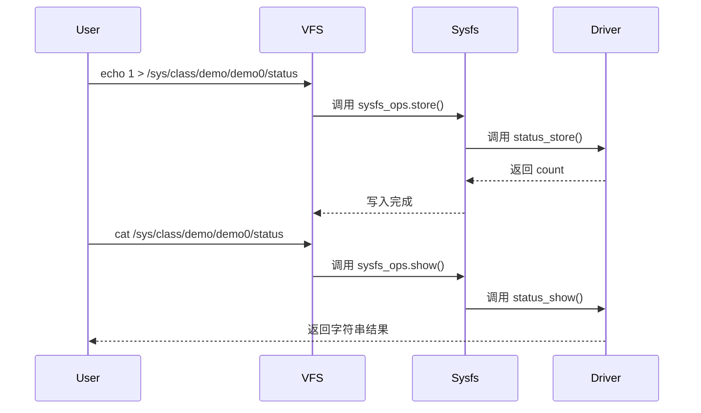

------

### 2.4.7_示例_在_platform_驱动中添加属性文件

```c
static ssize_t status_show(struct device *dev,
                           struct device_attribute *attr, char *buf)
{
    return sprintf(buf, "LED state: %d\n", led_status);
}

static ssize_t status_store(struct device *dev,
                            struct device_attribute *attr,
                            const char *buf, size_t count)
{
    if (buf[0] == '1')
        led_on();
    else
        led_off();
    return count;
}
static DEVICE_ATTR_RW(status);

static int led_probe(struct platform_device *pdev)
{
    device_create_file(&pdev->dev, &dev_attr_status);
    return 0;
}

static int led_remove(struct platform_device *pdev)
{
    device_remove_file(&pdev->dev, &dev_attr_status);
    return 0;
}
```

sysfs:

```
/sys/devices/platform/led_driver/status
```

------

### 2.4.8_调试与验证

| 检查项       | 命令                                    | 说明                 |
| ------------ | --------------------------------------- | -------------------- |
| 查看属性文件 | `ls /sys/class/demo/demo0/`             | 验证属性创建         |
| 读属性       | `cat /sys/class/demo/demo0/status`      | 执行 show()          |
| 写属性       | `echo 1 > /sys/class/demo/demo0/status` | 执行 store()         |
| 删除属性     | `device_remove_file()`                  | 属性消失             |
| 批量属性     | `sysfs_create_group()`                  | 检查多个文件是否出现 |

------

### 2.4.9_小结

| 层次     | 数据结构                             | 核心接口               | 说明         |
| -------- | ------------------------------------ | ---------------------- | ------------ |
| 单属性   | `struct device_attribute`            | `device_create_file()` | 注册单个属性 |
| 属性组   | `struct attribute_group`             | `sysfs_create_group()` | 批量注册     |
| 文件读写 | `show()` / `store()`                 | sysfs_ops              | 用户读写映射 |
| 宏族     | `DEVICE_ATTR_*()`                    | 宏展开自动生成结构体   | 简化开发     |
| 文件位置 | `/sys/class/...`、`/sys/devices/...` | sysfs                  | 驱动可见性   |

> **总结：**
>
> - sysfs 属性文件是驱动与用户空间交互的首选；
> - `DEVICE_ATTR_*()` 宏可快速定义属性；
> - 每次 `cat`/`echo` 都直接调用驱动代码；
> - 适用于调试、配置、监控等轻量级交互场景；
> - 若需要大数据通信，请使用字符设备或 ioctl。


------

## 2.5_devres_资源管理机制(devm_系列)

### 2.5.1_主题引入

在 Linux 驱动中，资源的申请与释放是一项极易出错的工作。
 传统写法需要在 `probe()` 成功路径和失败路径分别处理内存、IO、GPIO、时钟、中断等资源释放：

```c
res = request_mem_region(...);
if (!res)
    return -EBUSY;

irq = request_irq(...);
if (irq < 0)
    goto err_free_region;
...
err_free_region:
release_mem_region(...);
```

这种写法不仅繁琐，还容易在 probe 失败或 remove 时造成资源泄露。
 为解决这一问题，内核引入了 **devres（Device Resource Management）机制**。

> **核心思想：**
>
> - 每个 `struct device` 维护一个“资源栈”；
> - 所有使用 `devm_*()` 申请的资源自动加入该栈；
> - 当设备驱动被移除或 probe 失败时，自动执行回收。

------

### 2.5.2_设计哲学

| 原则             | 说明                                         |
| ---------------- | -------------------------------------------- |
| 资源与设备绑定   | 所有资源生命周期与设备绑定，而非驱动模块     |
| 自动释放         | 当 `device_release_driver()` 调用时自动释放  |
| 无需手动释放     | 开发者不再手动调用 `kfree()`、`iounmap()` 等 |
| probe() 失败安全 | 即使在 probe 阶段出错也能自动回滚全部资源    |

> 简言之：**devres = RAII（Resource Acquisition Is Initialization）的内核化实现。**

------

### 2.5.3_数据结构视角

#### (1)_struct_devres_node

定义于 `drivers/base/devres.c`：

```c
struct devres_node {
    struct list_head entry;
    dr_release_t release;
    const char *name;
};
```

- `entry`：链入设备资源链表；
- `release`：对应资源释放回调；
- `name`：资源类型（用于调试）。

------

#### (2)_struct_devres

每个资源都封装成一个 devres 对象：

```c
struct devres {
    struct devres_node node;
    unsigned long data[];
};
```

`data` 区域用于存储资源实体（如指针、IRQ号、内存映射地址等）。

------

#### (3)_struct_devres_group

用于成组管理多个资源（可批量释放）：

```c
struct devres_group {
    struct list_head list;
    struct devres_node node[2];
};
```

------

#### (4)_struct_device_与_devres_链表

每个 `struct device` 中都维护一个 devres 链表：

```c
struct device {
    ...
    struct list_head devres_head;  // 管理所有 devm 资源
};
```

当驱动卸载或 probe 失败时，调用：

```c
devres_release_all(dev);
```

自动释放链表中所有资源。

------

### 2.5.4_开发者视角

#### (1)_devm_资源生命周期

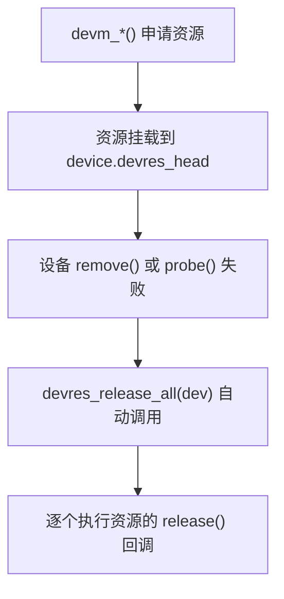

------

#### (2)_常用_devm_系列接口

| 接口                      | 作用                  | 对应传统函数                          |
| ------------------------- | --------------------- | ------------------------------------- |
| `devm_kzalloc()`          | 自动释放的 kmalloc    | `kzalloc()`                           |
| `devm_ioremap_resource()` | 自动 ioremap + 释放   | `ioremap()` + `iounmap()`             |
| `devm_request_irq()`      | 自动释放中断          | `request_irq()` + `free_irq()`        |
| `devm_clk_get()`          | 自动管理时钟资源      | `clk_get()` + `clk_put()`             |
| `devm_gpiod_get()`        | 自动获取 GPIO 描述符  | `gpiod_get()` + `gpiod_put()`         |
| `devm_pinctrl_get()`      | 自动获取 pinctrl 资源 | `pinctrl_get()` + `pinctrl_put()`     |
| `devm_regulator_get()`    | 自动电源管理          | `regulator_get()` + `regulator_put()` |
| `devm_kmalloc_array()`    | 自动释放数组内存      | `kmalloc_array()`                     |

------

#### (3)_devm_kzalloc()_示例

```c
struct my_device {
    void __iomem *base;
    int irq;
};

static int my_probe(struct platform_device *pdev)
{
    struct my_device *md;

    md = devm_kzalloc(&pdev->dev, sizeof(*md), GFP_KERNEL);
    if (!md)
        return -ENOMEM;

    platform_set_drvdata(pdev, md);
    return 0;
}
```

此内存会在驱动卸载时自动释放。

------

#### (4)_devm_ioremap_resource()_示例

```c
static int led_probe(struct platform_device *pdev)
{
    struct resource *res;
    void __iomem *base;

    res = platform_get_resource(pdev, IORESOURCE_MEM, 0);
    base = devm_ioremap_resource(&pdev->dev, res);
    if (IS_ERR(base))
        return PTR_ERR(base);

    // base 会在 remove 时自动 iounmap()
    return 0;
}
```

底层自动注册释放函数：

```c
devres_add(dev, release_ioremap);
```

------

#### (5)_devm_request_irq()_示例

```c
static irqreturn_t led_irq_handler(int irq, void *dev_id)
{
    pr_info("IRQ triggered!\n");
    return IRQ_HANDLED;
}

static int led_probe(struct platform_device *pdev)
{
    int irq = platform_get_irq(pdev, 0);
    int ret;

    ret = devm_request_irq(&pdev->dev, irq, led_irq_handler,
                           0, dev_name(&pdev->dev), NULL);
    if (ret)
        return ret;

    // 不需 free_irq()
    return 0;
}
```

------

#### (6)_devm_机制下的回滚保证

如果在 probe 阶段某一步失败：

```c
static int my_probe(struct platform_device *pdev)
{
    struct clk *clk;
    void __iomem *base;

    clk  = devm_clk_get(&pdev->dev, NULL);
    base = devm_ioremap_resource(&pdev->dev, res);

    if (IS_ERR(base))
        return PTR_ERR(base);  // 自动回滚之前申请的 clk
}
```

> 所有 devm 资源都记录在同一链表，
>  一旦 probe 返回错误，`devres_release_all()` 会逐项释放已登记资源。

------

### 2.5.5_用户视角

从用户角度看，devm 机制不可见；
 但它保证 `/sys/bus/...` 设备卸载后系统状态一致、资源无残留。

举例：

```bash
rmmod led_driver
# → 自动释放：GPIO、中断、内存映射、class 设备节点
```

而开发者无需实现任何 `remove()` 中的清理逻辑（除非有硬件状态复位需求）。

------

### 2.5.6_可视化_devm_管理流程图

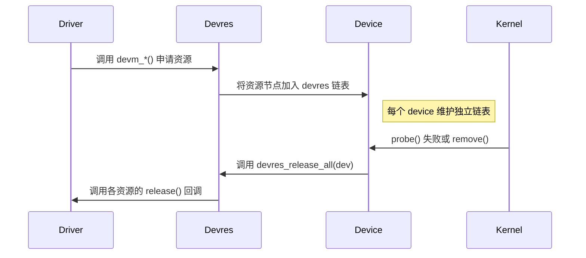

------

### 2.5.7_调试与验证

| 检查项           | 方式                                   | 说明                           |
| ---------------- | -------------------------------------- | ------------------------------ |
| 查看 devres 统计 | `cat /sys/kernel/debug/devres/devices` | 显示各设备 devres 链表         |
| 验证资源释放     | `rmmod <driver>`                       | 观察内核日志是否残留资源       |
| 验证 probe 回滚  | 强制返回 -EINVAL                       | 确认系统无泄露                 |
| 内核调试点       | `drivers/base/devres.c`                | 可设置 printk 验证自动释放路径 |

------

### 2.5.8_小结

| 层次     | 结构体                                   | 关键函数                                | 说明             |
| -------- | ---------------------------------------- | --------------------------------------- | ---------------- |
| 核心机制 | `struct devres`                          | `devres_add()` / `devres_release_all()` | 管理资源链表     |
| 自动资源 | `devm_*()` 系列                          | 各类资源申请                            | 自动注册释放函数 |
| 生命周期 | `device_release_driver()`                | 释放资源链                              | 设备移除时执行   |
| 典型资源 | 内存、GPIO、IRQ、clk、regulator、ioremap | 自动清理                                |                  |
| 回滚机制 | probe 出错自动清理                       | devres 栈反向执行释放                   | 避免泄露         |

> **总结：**
>
> - `devm_*()` 是 Linux 驱动最推荐的资源申请接口；
> - 它与设备绑定，而非驱动模块；
> - 无需显式 free/put 操作；
> - 大幅减少错误与冗余；
> - probe 出错或 remove 时系统自动保持干净状态。


------

## 2.6_driver_core_核心管理机制

### 2.6.1_主题引入

**driver core** 是 Linux 内核中负责管理**设备与驱动之间关系**的核心子系统。
 它位于 `drivers/base/` 目录下，是所有设备模型的统一实现基础。

driver core 的存在，使得：

- 所有设备（`device`）都能在统一框架中注册；
- 所有驱动（`driver`）都能通过统一接口管理；
- 匹配、探测、热插拔、sysfs、PM（电源管理）、devres 等功能都统一调度。

> **一句话概括：**
>
> **driver core = Linux 设备模型的大脑**。

------

### 2.6.2_设计哲学

#### (1)_核心目标

| 目标         | 说明                                                         |
| ------------ | ------------------------------------------------------------ |
| 统一接口     | 提供统一的注册与注销 API：`device_register()`、`driver_register()` |
| 解耦机制     | 设备、驱动、总线独立注册，自动匹配                           |
| 层次可视化   | 通过 sysfs 反映内核对象关系                                  |
| 自动资源管理 | 集成 devres、PM、kobject                                     |
| 可扩展性     | 适配不同总线类型（platform、PCI、USB...）                    |

------

#### (2)_核心目录结构(Linux_6.1+)

```
drivers/base/
├── core.c              # device/driver 注册核心逻辑
├── bus.c               # bus_type 管理
├── dd.c                # driver 与 device 匹配
├── driver.c            # 驱动注册接口
├── platform.c          # platform 框架实现
├── power/              # PM 支持
└── devres.c            # devm 自动资源管理
```

------

### 2.6.3_数据结构视角

#### (1)_核心结构体关系

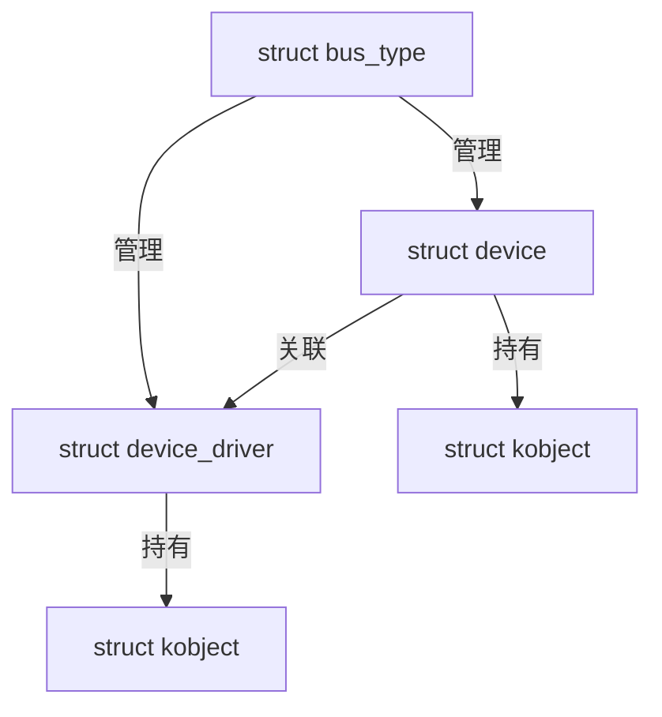

> `bus_type` 是 driver core 的核心容器，统一管理所有 device-driver 关系。

------

#### (2)_核心函数映射表

| 功能       | 接口                                  | 实现文件   |
| ---------- | ------------------------------------- | ---------- |
| 设备注册   | `device_register()`                   | `core.c`   |
| 驱动注册   | `driver_register()`                   | `driver.c` |
| 匹配流程   | `device_attach()` / `driver_attach()` | `dd.c`     |
| 总线管理   | `bus_register()` / `bus_add_device()` | `bus.c`    |
| sysfs 目录 | `device_add()` / `bus_create_file()`  | `core.c`   |
| 资源回收   | `devres_release_all()`                | `devres.c` |

------

### 2.6.4_开发者视角

#### (1)_设备注册流程

```c
int device_register(struct device *dev)
{
    device_initialize(dev);  // 初始化 kobject、devres 链表等
    return device_add(dev);
}
```

##### 1)_device_initialize()

- 设置默认引用计数；
- 初始化 devres；
- 绑定父设备；
- 初始化互斥锁；
- 建立 sysfs 层基础。

##### 2)_device_add()

位于 `drivers/base/core.c`：

```c
int device_add(struct device *dev)
{
    bus_add_device(dev);
    kobject_uevent(&dev->kobj, KOBJ_ADD);
}
```

该函数会触发：

1. 将设备添加到总线；
2. 生成 sysfs 目录 `/sys/devices/...`;
3. 发送 `uevent` 通知用户空间。

------

#### (2)_驱动注册流程

```c
int driver_register(struct device_driver *drv)
{
    bus_add_driver(drv);
    driver_add_groups(drv, drv->groups);
}
```

##### 1)_bus_add_driver()

```c
int bus_add_driver(struct device_driver *drv)
{
    klist_add_tail(&drv->p->knode_bus, &bus->p->klist_drivers);
    driver_attach(drv);
}
```

##### 2)_driver_attach()

会调用 `bus_for_each_dev()` 遍历所有设备，并执行匹配流程：

```
bus_for_each_dev()
    → __driver_attach()
        → driver_match_device()
        → driver_probe_device()
```

匹配成功 → 调用 `probe()`。

------

#### (3)_设备与驱动匹配时机

| 注册顺序               | 匹配触发函数         | 描述                     |
| ---------------------- | -------------------- | ------------------------ |
| 先注册设备，后注册驱动 | `driver_attach()`    | 驱动注册时扫描现有设备   |
| 先注册驱动，后注册设备 | `bus_probe_device()` | 设备注册时扫描已加载驱动 |

> 无论顺序如何，driver core 保证二者能最终匹配。

------

#### (4)_deferred_probe_机制

在复杂的设备依赖关系中（如设备依赖时钟、regulator），
 若 probe 阶段发现依赖尚未准备好，驱动可以返回 `-EPROBE_DEFER`。

driver core 会：

- 暂时搁置该设备；
- 等待依赖加载后重新尝试 probe。

源码位于 `drivers/base/dd.c`：

```c
if (ret == -EPROBE_DEFER) {
    dev_dbg(dev, "Probe deferred\n");
    driver_deferred_probe_add(dev);
}
```

> 这使得驱动能安全启动，而不会因依赖缺失导致失败。

------

### 2.6.5_用户视角

从用户空间角度看，driver core 的行为体现在 sysfs 层：

```
/sys/bus/platform/drivers/
│
├── led_driver/
│   ├── bind
│   ├── unbind
│   ├── led_driver.0 -> ../../devices/platform/led_driver.0
│   └── uevent
│
└── other_driver/
```

- `/sys/bus/.../drivers/<name>/bind`
   → 手动绑定驱动到设备；
- `/sys/bus/.../drivers/<name>/unbind`
   → 手动解绑；
- `uevent` 文件
   → 触发设备事件（add/remove/change）。

------

### 2.6.6_核心执行流程(可视化)

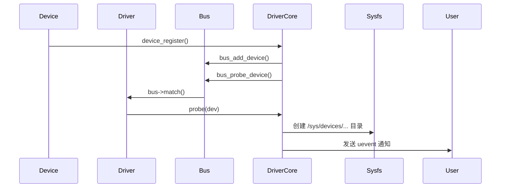

------

### 2.6.7_典型路径追踪(Platform_为例)

| 阶段       | 函数                         | 文件位置     | 描述                   |
| ---------- | ---------------------------- | ------------ | ---------------------- |
| 设备注册   | `platform_device_register()` | `platform.c` | 调用 device_register() |
| 驱动注册   | `platform_driver_register()` | `platform.c` | 调用 driver_register() |
| 匹配过程   | `platform_match()`           | `platform.c` | 检查 compatible/name   |
| 绑定阶段   | `driver_probe_device()`      | `dd.c`       | 执行 probe             |
| 资源管理   | `devm_*()`                   | `devres.c`   | 设备绑定资源           |
| sysfs 建立 | `device_add()`               | `core.c`     | 生成节点               |

------

### 2.6.8_调试与验证

| 检查项                | 命令                                   | 说明              |
| --------------------- | -------------------------------------- | ----------------- |
| 查看 driver core 模块 | `cat /proc/kallsyms                    | grep driver_core` |
| 追踪 probe 调用       | `dmesg                                 | grep probe`       |
| 查看 sysfs 结构       | `tree /sys/devices/`                   | 设备层级可视化    |
| 分析 deferred probe   | `cat /sys/kernel/debug/deferred_probe` | 待处理设备列表    |
| 验证资源自动释放      | `rmmod` + `dmesg`                      | 确保释放顺序正确  |

------

### 2.6.9_小结

| 功能模块   | 核心函数                                | 文件     | 说明                    |
| ---------- | --------------------------------------- | -------- | ----------------------- |
| 设备注册   | `device_register()`                     | core.c   | 注册设备对象            |
| 驱动注册   | `driver_register()`                     | driver.c | 注册驱动对象            |
| 匹配逻辑   | `driver_attach()` / `device_attach()`   | dd.c     | 匹配与探测              |
| 总线管理   | `bus_add_driver()` / `bus_add_device()` | bus.c    | 管理 driver/device 列表 |
| sysfs 映射 | `device_add()`                          | core.c   | 构建 /sys 层次结构      |
| 延迟探测   | `driver_deferred_probe_add()`           | dd.c     | 依赖延迟机制            |

> **总结：**
>
> - driver core 是 Linux 设备模型的逻辑中心；
> - 它统一调度设备、驱动和总线；
> - 确保即使注册顺序不同，也能完成匹配；
> - 提供 sysfs 可视化、uevent 通知、deferred probe、devres 等多种机制；
> - 几乎所有驱动子系统（GPIO、I2C、USB、PCI、platform）都直接依赖 driver core。

