# 第5章_生命周期_依赖与属性体系

## 5.1_设备模型中的引用计数与生命周期管理(get_device_/_put_device_/_kref_机制)

### 5.1.1_主题引入

在 Linux 设备模型中，所有设备对象 (`struct device`) 都由 `driver core` 动态创建和销毁。
 内核必须确保设备对象在**使用中不被提前释放**、在**不再使用时能自动清理内存**。

这项任务由 **引用计数机制 (reference counting)** 完成。
 其核心依赖以下函数族：

| 函数                  | 功能                                       |
| --------------------- | ------------------------------------------ |
| `get_device()`        | 增加设备引用计数                           |
| `put_device()`        | 减少引用计数，若为 0 自动释放              |
| `device_initialize()` | 初始化 kref 与释放回调                     |
| `device_release()`    | 当引用计数归零时调用，用于释放设备对象内存 |

> **一句话概括：**
> “引用计数是设备对象生存周期的唯一裁判。”

------

### 5.1.2_设计哲学

| 原则              | 说明                                                        |
| ----------------- | ----------------------------------------------------------- |
| 自动回收          | 使用计数归零后自动释放对象                                  |
| 不允许悬空        | 引用存在时禁止释放内存                                      |
| 驱动无须手动 free | 内核自动执行 `release()`                                    |
| 分层一致          | `kobject`、`device`、`driver` 均用 `kref` 管理              |
| 零侵入            | 开发者通过 `get_device()` / `put_device()` 即可维护引用关系 |

------

### 5.1.3_数据结构视角_kref_与_device

#### (1)_struct_kref(核心计数结构)

定义于 `include/linux/kref.h`：

```c
struct kref {
    refcount_t refcount;
};
```

它是内核的通用引用计数器，
 所有设备模型对象的生命周期都由它控制。

------

#### (2)_struct_device_中的引用成员

```c
struct device {
    struct kobject 			kobj;     // 包含 kref
    struct device_driver 	*driver;
    void (*release)(struct device *dev);
};
```

`device.kobj.kref` 是设备引用计数的真正计数源，
 `device.release()` 是引用归零时的回调函数。

------

### 5.1.4_device_initialize()_初始化阶段

每个设备在注册前都必须执行：

```c
void device_initialize(struct device *dev)
{
    kobject_init(&dev->kobj, &device_ktype);
    INIT_LIST_HEAD(&dev->dma_pools);
    ...
}
```

其中 `kobject_init()` 会调用：

```c
kref_init(&kobj->kref);
```

即：

> 初始化引用计数为 **1**（自持引用）。

------

### 5.1.5_get_device()_与_put_device()

#### (1)_get_device()

```c
struct device *get_device(struct device *dev)
{
    if (dev)
        get_device_unless_zero(dev);
    return dev;
}
```

内部核心为：

```c
kref_get(&dev->kobj.kref);
```

> 每次获取引用时，计数 +1。

------

#### (2)_put_device()

```c
void put_device(struct device *dev)
{
    if (dev)
        kref_put(&dev->kobj.kref, device_release);
}
```

`kref_put()` 会在计数归零时调用 `device_release()`。

> **结论：**
>
> - 每调用一次 `get_device()`，必须配对调用一次 `put_device()`；
> - 当引用计数为 0，`release()` 负责释放内存。

------

### 5.1.6_device_release()_生命周期终点

`device_release()` 是驱动层必须定义的回调函数，用于释放 `struct device` 占用的资源。
 如果驱动未定义该函数，内核会在注销时报错：

```
Device 'xxx' does not have a release() function, it is broken and must be fixed!
```

------

#### (1)_示例

```c
static void led_device_release(struct device *dev)
{
    pr_info("led_device_release() called for %s\n", dev_name(dev));
    kfree(dev);
}
```

注册阶段：

```c
pdev = kzalloc(sizeof(*pdev), GFP_KERNEL);
pdev->dev.release = led_device_release;
device_initialize(&pdev->dev);
platform_device_add(pdev);
```

当 `put_device(&pdev->dev)` 最终引用计数归零时，
 `led_device_release()` 会被自动调用。

------

### 5.1.7_引用计数的时序流程

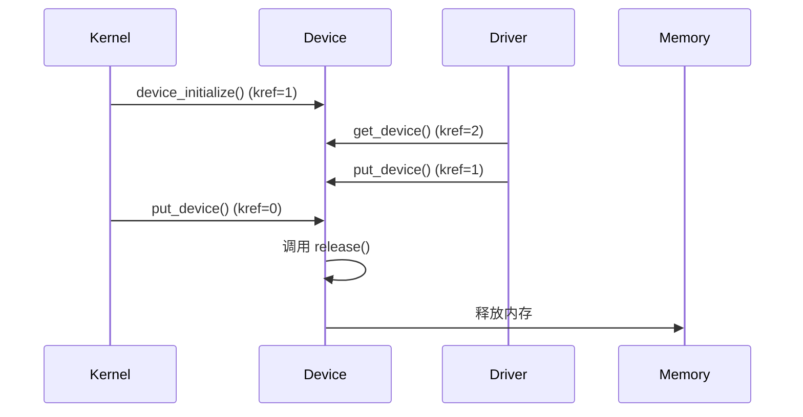

------

### 5.1.8_引用计数与_kobject_的联动关系

`kobject` 与 `device` 的释放逻辑高度统一：

| 对象      | 初始化函数            | 释放函数              |
| --------- | --------------------- | --------------------- |
| `kobject` | `kobject_init()`      | `kobject_release()`   |
| `device`  | `device_initialize()` | `device_release()`    |
| `driver`  | `driver_register()`   | `driver_unregister()` |

它们共享同一个底层计数实现 (`kref`)。
 区别仅在于：

- `kobject` 调用 `.release(struct kobject *)`；
- `device` 调用 `.release(struct device *)`。

------

### 5.1.9_引用计数在_driver_core_各阶段的使用位置

| 阶段                  | 计数变化 | 说明           |
| --------------------- | -------- | -------------- |
| `device_initialize()` | +1       | 初始引用       |
| `device_register()`   | +1       | 注册进系统     |
| `get_device()`        | +1       | 驱动获取引用   |
| `put_device()`        | -1       | 释放引用       |
| `device_unregister()` | -2       | 移除并释放对象 |
| `device_release()`    | 0        | 真正释放内存   |

> 内核通过这种严格计数，确保任何访问 `dev` 的路径都处于安全状态。

------

### 5.1.10_常见错误与调试方法

#### (1)_未定义_release()

错误日志：

```
Device 'led0' does not have a release() function, it is broken and must be fixed!
```

解决：

```c
pdev->dev.release = led_release;
```

------

#### (2)_引用未释放

症状：

- 模块卸载时内存泄漏；
- `rmmod` 卡死。

原因：未调用 `put_device()`。

------

#### (3)_重复释放

症状：

```
kernel BUG at lib/refcount.c:28!
```

原因：多次调用 `put_device()` 或直接 `kfree(dev)`。

------

#### (4)_调试手段

| 调试目标       | 命令 / 方法                              |
| -------------- | ---------------------------------------- |
| 打印引用计数   | `cat /sys/kernel/debug/kobject_refcount` |
| 检查未释放设备 | `ls /sys/devices/platform/`              |
| 跟踪释放函数   | `dmesg                                   |
| 强制释放模块   | `rmmod -f driver`（仅测试）              |

------

### 5.1.11_与_devm_*_自动管理机制的关系

`devm_*` 系列函数（如 `devm_kzalloc()`、`devm_ioremap_resource()`）
 基于 devres 资源管理系统（将在第 21 章详细介绍）。

它们的释放时机：

> 当设备被移除、`device_release()` 调用前，
> 内核自动释放所有 devres 注册的资源。

即：

> `devm_*` 的释放逻辑与引用计数终点对齐。

------

### 5.1.12_可视化_引用计数生命周期图

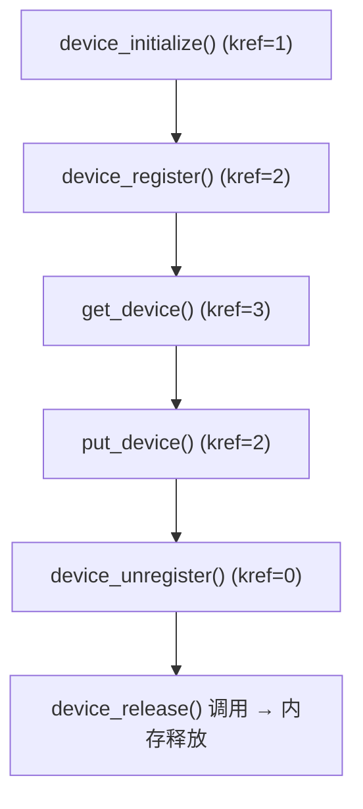

------

### 5.1.13_小结

| 阶段     | 函数                  | 功能         | 计数变化 |
| -------- | --------------------- | ------------ | -------- |
| 初始化   | `device_initialize()` | 初始化引用   | +1       |
| 注册     | `device_register()`   | 注册至系统   | +1       |
| 获取     | `get_device()`        | 获取额外引用 | +1       |
| 释放     | `put_device()`        | 释放引用     | -1       |
| 注销     | `device_unregister()` | 移除对象     | -2       |
| 释放终点 | `device_release()`    | 真正释放资源 | 0        |

> **总结：**
>
> - `get_device()` / `put_device()` 是设备生命周期的核心 API；
> - 引用计数由 `kref` 管理，统一于所有内核对象；
> - `device_release()` 是安全释放的唯一入口；
> - `devm_*` 资源管理与引用计数联动，确保无内存泄漏；
> - 任何未定义 release() 或手动释放 dev-> 内存的行为都是严重错误。


------

## 5.2_设备模型中的资源管理与_devm_*_接口机制

### 5.2.1_主题引入

传统驱动开发中，驱动工程师必须在 `probe()` 中手动分配资源（如内存、IO 区、GPIO、IRQ），
 并在 `remove()` 中手动释放：

```c
static int demo_probe(struct platform_device *pdev)
{
    data = kzalloc(...);
    base = ioremap(...);
    irq  = request_irq(...);
}

static int demo_remove(struct platform_device *pdev)
{
    free_irq(irq, ...);
    iounmap(base);
    kfree(data);
}
```

这种写法容易出错，尤其在 `probe()` 的某一步失败时，必须手动回滚前面分配的资源，极易造成**内存泄漏或访问非法地址**。

为解决此问题，Linux 引入 **devres（Device Resource）子系统**，提供一整套以 `devm_` 为前缀的自动管理接口，例如：

- `devm_kzalloc()`
- `devm_ioremap_resource()`
- `devm_request_irq()`
- `devm_gpiod_get()`

当设备生命周期结束时，devres 子系统会**自动释放所有已注册资源**。

> **一句话概括：**
> “devm_* 接口 = 带生命周期的自动释放机制。”

------

### 5.2.2_设计哲学

| 目标         | 说明                                                         |
| ------------ | ------------------------------------------------------------ |
| 生命周期绑定 | 所有资源随设备释放自动清理                                   |
| 无需回滚     | probe() 任意步骤失败时，内核自动回收                         |
| 结构化注册   | 所有资源通过 devres_list 链接管理                            |
| 模块安全     | 避免 remove() 漏写或异常路径遗忘释放                         |
| 一致接口     | 同步存在 `devm_` 与普通版本函数（如 `kzalloc()` ↔ `devm_kzalloc()`） |

------

### 5.2.3_devres_子系统的核心数据结构

定义于 `include/linux/device.h`：

```c
struct devres {
    struct devres_node node;
    void (*release)(struct device *dev, void *res);
    /* 资源对象紧随其后 */
};
```

每个资源对象在注册时会被封装为 `devres` 节点，
 并挂入设备的 `dev->devres_head` 链表：

```c
struct device {
    ...
    struct list_head devres_head;   // 所有 devm_* 资源节点
    ...
};
```

可视化结构如下：

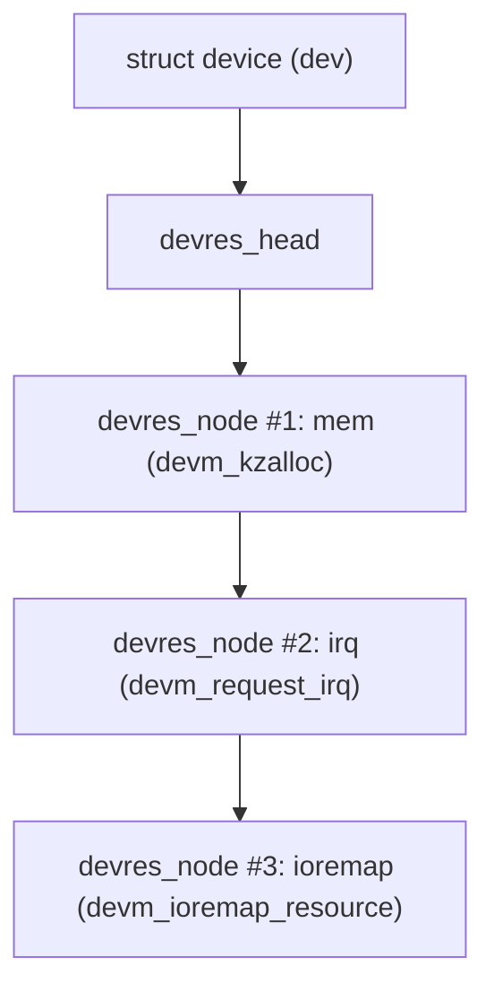

------

### 5.2.4_devm_kzalloc()_最常用的资源申请接口

定义于 `drivers/base/devres.c`：

```c
void *devm_kzalloc(struct device *dev, size_t size, gfp_t gfp)
{
    void *p;

    p = kzalloc(size, gfp);
    if (p)
        devres_add(dev, p);
    return p;
}
```

与普通 `kzalloc()` 区别：

- 自动在 `devres_head` 中注册；
- 无需手动 `kfree()`；
- 当设备释放时，`p` 自动被释放。

------

#### (1)_示例

```c
static int led_probe(struct platform_device *pdev)
{
    struct led_data *data;

    data = devm_kzalloc(&pdev->dev, sizeof(*data), GFP_KERNEL);
    if (!data)
        return -ENOMEM;

    platform_set_drvdata(pdev, data);
    return 0;
}
```

当 `remove()` 调用或设备注销时，`data` 自动释放。

------

### 5.2.5_devres_add()_注册资源节点

```c
void devres_add(struct device *dev, void *res)
{
    struct devres *dr = container_of(res, struct devres, data);
    list_add_tail(&dr->node.entry, &dev->devres_head);
}
```

功能：

- 创建 `devres` 节点；
- 加入 `dev->devres_head`；
- 内核在 remove 阶段统一释放。

------

### 5.2.6_devres_release_all()_自动释放机制

在设备生命周期结束时（如 `device_release()` 前），
 内核会自动调用：

```c
void devres_release_all(struct device *dev)
{
    while (!list_empty(&dev->devres_head)) {
        struct devres *dr = list_first_entry(&dev->devres_head, struct devres, node.entry);
        if (dr->release)
            dr->release(dev, dr->data);
        list_del(&dr->node.entry);
        kfree(dr);
    }
}
```

> **这段代码是整个 devm 系统的灵魂。**

它保证：

- 释放顺序与申请顺序相反（后申请先释放）；
- 即使 probe 中途出错，devres 仍会释放；
- 无需用户手动干预。

------

### 5.2.7_常见_devm_*_接口汇总

| 接口                           | 功能            | 传统版本                  |
| ------------------------------ | --------------- | ------------------------- |
| `devm_kzalloc()`               | 分配内存        | `kzalloc()`               |
| `devm_ioremap_resource()`      | 映射 I/O 寄存器 | `ioremap()`               |
| `devm_request_irq()`           | 注册中断        | `request_irq()`           |
| `devm_gpiod_get()`             | 获取 GPIO 句柄  | `gpiod_get()`             |
| `devm_clk_get()`               | 获取时钟        | `clk_get()`               |
| `devm_regulator_get()`         | 获取电源管理器  | `regulator_get()`         |
| `devm_pinctrl_get()`           | 获取引脚控制器  | `pinctrl_get()`           |
| `devm_snd_soc_register_card()` | 注册音频卡      | `snd_soc_register_card()` |

------

### 5.2.8_可视化_devm_*_生命周期流程

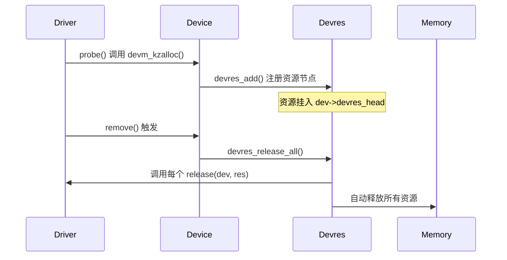

------

### 5.2.9_实际示例_带_GPIO_和_IRQ_的_LED_驱动

```c
static int led_probe(struct platform_device *pdev)
{
    struct led_data *data;
    int ret;

    data = devm_kzalloc(&pdev->dev, sizeof(*data), GFP_KERNEL);
    if (!data)
        return -ENOMEM;

    data->gpio = devm_gpiod_get(&pdev->dev, "led", GPIOD_OUT_LOW);
    if (IS_ERR(data->gpio))
        return PTR_ERR(data->gpio);

    data->irq = devm_request_irq(&pdev->dev, gpio_to_irq(desc_to_gpio(data->gpio)),
                                 led_irq_handler, 0, "led_irq", data);
    if (data->irq < 0)
        return data->irq;

    return 0;
}
```

**特点：**

- probe 中任意一步失败，无需清理；
- remove 不再需要释放；
- 驱动更加简洁、健壮。

------

### 5.2.10_devm_与普通接口的比较

| 项目          | 普通接口         | devm 接口                       |
| ------------- | ---------------- | ------------------------------- |
| 资源释放时机  | 手动释放         | 自动释放（随设备）              |
| 失败回滚      | 需手动实现       | 自动回滚                        |
| 适用范围      | 内核任意上下文   | 仅限有 `struct device` 的上下文 |
| remove() 实现 | 必须释放所有资源 | 可为空                          |
| 内核安全性    | 易出错           | 自动保障                        |

------

### 5.2.11_devm_与设备生命周期联动机制

devm 的释放时机触发于：

```c
device_release()
    → devres_release_all(dev)
    → 调用每个 release(dev, res)
```

与第 20 章引用计数机制协同，保证释放顺序严格一致。

------

### 5.2.12_调试与验证

| 检查项                 | 命令 / 方法                                    |
| ---------------------- | ---------------------------------------------- |
| 检查资源链表           | `cat /sys/kernel/debug/devres`（部分版本支持） |
| 验证释放日志           | `dmesg                                         |
| 观察 remove() 自动回收 | 卸载模块后观察是否有内存泄漏                   |
| 模拟 probe 失败        | 在 probe 中返回错误码验证自动清理              |
| 检查资源创建顺序       | `trace_printk()` 打印 devres_add() 调用顺序    |

------

### 5.2.13_小结

| 项目         | 核心点                  | 说明               |
| ------------ | ----------------------- | ------------------ |
| devres 核心  | `dev->devres_head` 链表 | 管理所有资源节点   |
| 注册函数     | `devres_add()`          | 加入链表           |
| 释放函数     | `devres_release_all()`  | 统一释放资源       |
| 自动化接口   | `devm_*`                | 带生命周期管理功能 |
| 生命周期终点 | `device_release()`      | 触发自动回收       |

> **总结：**
>
> - devm_* 接口构成设备资源自动管理系统；
> - probe() 任意失败路径都无需手动释放；
> - remove() 中可省略资源清理；
> - devm_* 与引用计数机制联动；
> - 设备释放顺序可预测、可控、无泄漏。


------

## 5.3_device_link_与电源依赖关系(Power_Domain_Dependencies)

### 5.3.1_主题引入

在一个完整的 SoC 系统中，多个设备存在依赖关系：

- 设备 **A（从属设备 consumer）** 需要设备 **B（提供设备 supplier）** 的电源或时钟；
- 当系统挂起或关闭时，必须**先挂起 consumer，再挂起 supplier**；
- 唤醒时则反向执行。

这种关系由设备模型中的 **device_link 机制** 管理。
 `device_link_add()` 负责在设备间建立“有向依赖图”，
 并在设备 suspend/resume 时确保执行顺序正确。

> **一句话概括：**
> “device_link 是连接两个设备生命周期的电源依赖通道。”

------

### 5.3.2_设计哲学

| 原则         | 说明                                |
| ------------ | ----------------------------------- |
| 明确依赖     | 明确 consumer/supplier 关系         |
| 自动顺序     | suspend/resume 顺序由 link 自动推导 |
| 生命周期管理 | 链接随设备注册/注销自动调整         |
| 电源一致性   | 确保设备依赖的电源域始终有效        |
| 动态建立     | 链接可在运行时通过驱动动态创建      |

------

### 5.3.3_核心数据结构_struct_device_link

定义于 `include/linux/device.h`：

```c
struct device_link {
    struct device 			*supplier;
    struct device 			*consumer;
    struct list_head 		supplier_link;
    struct list_head 		consumer_link;
    enum device_link_state 	status;
    u32 				   flags;
};
```

可视化结构：


每个链接记录：

- **supplier**：提供电源/时钟的设备；
- **consumer**：依赖该资源的设备；
- **flags**：约束模式，如 `DL_FLAG_PM_RUNTIME`、`DL_FLAG_STATELESS`。

------

### 5.3.4_device_link_add()_建立设备依赖关系

定义于 `drivers/base/core.c`：

```c
struct device_link *device_link_add(struct device *consumer,
                                    struct device *supplier,
                                    u32 flags)
{
    struct device_link *link;

    link = kzalloc(sizeof(*link), GFP_KERNEL);
    link->consumer = consumer;
    link->supplier = supplier;
    link->flags = flags;

    list_add_tail(&link->supplier_link, &supplier->links.consumers);
    list_add_tail(&link->consumer_link, &consumer->links.suppliers);
    return link;
}
```

功能说明：

1. 建立 consumer → supplier 的单向依赖；
2. 挂入双方链表；
3. 在 suspend/resume 时依据该关系自动排序。

------

### 5.3.5_设备依赖关系链表结构

`struct device_links` 内含两个链表：

```c
struct dev_links_info {
    struct list_head suppliers; // 当前设备依赖的上游
    struct list_head consumers; // 当前设备的下游依赖者
};
```

挂载结构如下：

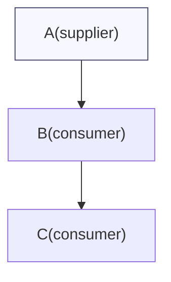

A 设备可同时被多个设备依赖。
 设备树中电源域、复位控制器、时钟控制器等都是典型的 supplier。

------

### 5.3.6_常见_flags_定义与含义

| 宏                            | 含义                            | 使用场景        |
| ----------------------------- | ------------------------------- | --------------- |
| `DL_FLAG_AUTOREMOVE_CONSUMER` | 当 consumer 移除时自动删除 link | 常规外设        |
| `DL_FLAG_PM_RUNTIME`          | 参与 runtime PM 管理            | 时钟/电源域依赖 |
| `DL_FLAG_RPM_ACTIVE`          | 在创建 link 时立即激活 supplier | 设备上电依赖    |
| `DL_FLAG_STATELESS`           | 不参与 suspend/resume 序列      | 临时依赖        |
| `DL_FLAG_AUTOREMOVE_SUPPLIER` | 当 supplier 移除时清理 link     | 热插拔设备      |

------

### 5.3.7_device_link_del()_删除依赖关系

```c
void device_link_del(struct device_link *link)
{
    list_del(&link->consumer_link);
    list_del(&link->supplier_link);
    kfree(link);
}
```

典型调用场景：

- consumer 设备被注销；
- 电源域被释放；
- 模块卸载。

------

### 5.3.8_dev_pm_domain_attach_by_id()_自动建立_link_示例

在驱动中，若设备树指定了电源域：

```dts
gpu: gpu@... {
    power-domains = <&pd_gpu>;
};
```

驱动可通过：

```c
dev_pm_domain_attach_by_id(&pdev->dev, 0);
```

该函数内部会自动调用 `device_link_add()`，
 建立 consumer (GPU) → supplier (Power Domain) 的 link。

------

### 5.3.9_电源域_suspend/resume_顺序控制

在系统进入 suspend 时：

```text
device_suspend()
  → dpm_suspend()
      → device_links_read_lock()
          → 遍历所有 device_link
          → 确保 consumer 先挂起，supplier 后挂起
```

在 resume 时：

- 顺序反向：supplier 先恢复，consumer 后恢复。

> 这样可确保外设依赖的时钟、电源、复位控制器已处于工作状态。

------

### 5.3.10_可视化_suspend/resume_调用依赖顺序

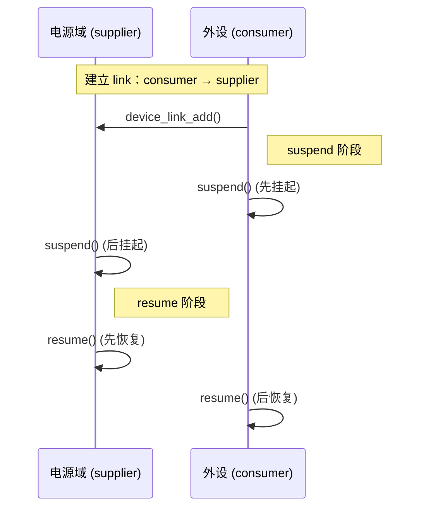

------

### 5.3.11_典型示例_电源域与外设的绑定

设备树：

```dts
usbotg: usb@02184000 {
    compatible = "fsl,imx6ull-usb";
    power-domains = <&pd_usb>;
};
```

驱动代码：

```c
static int usb_probe(struct platform_device *pdev)
{
    int ret;

    ret = dev_pm_domain_attach_by_id(&pdev->dev, 0);
    if (ret)
        return ret;

    pr_info("USB power domain linked\n");
    return 0;
}
```

挂载关系：

```
/sys/devices/platform/pd_usb/
    └── consumers -> /sys/devices/platform/usb@02184000
```

------

### 5.3.12_调试与验证

| 检查项            | 命令 / 说明                                 |
| ----------------- | ------------------------------------------- |
| 查看电源域链接    | `cat /sys/kernel/debug/devices_deps`        |
| 查看 suspend 顺序 | `dmesg                                      |
| 验证 link 建立    | `ls /sys/devices/.../links/consumers`       |
| 模拟电源域断开    | `echo 0 > /sys/devices/.../supplier/remove` |
| 验证回滚          | 确认 consumer 自动停机                      |

------

### 5.3.13_device_link_的通用用途(除电源外)

| 场景       | supplier         | consumer |
| ---------- | ---------------- | -------- |
| 时钟依赖   | clock 控制器     | 外设     |
| 复位控制器 | reset controller | 外设     |
| 电源管理   | regulator        | 子设备   |
| 子系统同步 | GPU → VPU        | 视频管线 |
| 热插拔设备 | PCIe 设备        | 根桥     |

`device_link_add()` 的作用远超电源域控制，
 它是**设备间依赖图（Device Dependency Graph）**的通用描述机制。

------

### 5.3.14_错误与陷阱

| 问题                 | 原因                            | 修正方法                    |
| -------------------- | ------------------------------- | --------------------------- |
| suspend 顺序错误     | 未创建 link 或标志错误          | 检查 flags 与 link 建立时机 |
| link 循环依赖        | A→B→A                           | 避免环形依赖                |
| supplier 先卸载      | 缺失 `AUTOREMOVE_SUPPLIER` 标志 | 增加相应 flag               |
| consumer 未释放 link | 未调用 `device_link_del()`      | 在 remove() 中清理          |

------

### 5.3.15_小结

| 关键函数                       | 功能                  | 调用阶段              |
| ------------------------------ | --------------------- | --------------------- |
| `device_link_add()`            | 建立依赖关系          | 驱动初始化            |
| `device_link_del()`            | 删除依赖关系          | 驱动卸载              |
| `dev_pm_domain_attach_by_id()` | 自动绑定 power domain | probe 阶段            |
| `dev_pm_domain_detach()`       | 解除绑定              | remove 阶段           |
| `devres_release_all()`         | 释放资源              | device_release() 阶段 |

> **总结：**
>
> - device_link 是设备模型中“依赖关系”的核心结构；
> - 它确保 suspend/resume 的正确顺序；
> - dev_pm_domain_* 系列函数基于 device_link 实现；
> - 同时支持电源域、时钟、复位控制器等多类依赖；
> - 正确使用 device_link 是驱动在复杂 SoC 上稳定运行的关键。


---

## 5.4_bus_type_与_class_的深入实现机制(从_bus_register_到_sysfs_呈现)

### 5.4.1_主题引入

在 Linux 设备模型中，所有设备和驱动都必须依附于“总线类型（bus）”或“类（class）”。
 这两个抽象层是内核对象树（kobject hierarchy）的中枢节点：

| 类型         | 作用                               | 示例                         |
| ------------ | ---------------------------------- | ---------------------------- |
| **bus_type** | 表示物理或逻辑总线，连接驱动与设备 | platform、i2c、spi、usb、pci |
| **class**    | 表示设备的功能类别                 | net、input、leds、tty、block |

两者共同决定 `/sys` 的顶层组织结构：

```
/sys/bus/platform/
/sys/bus/i2c/
/sys/class/net/
/sys/class/leds/
```

> **一句话概括：**
>  “bus 是设备匹配的层，class 是用户可见的分类层。”

------

### 5.4.2_设计哲学

| 原则       | 说明                                       |
| ---------- | ------------------------------------------ |
| 分层抽象   | bus 关注匹配机制，class 关注设备功能       |
| 统一接口   | 所有总线都遵循相同的注册与匹配 API         |
| 可扩展性   | 新增总线类型只需定义 `struct bus_type`     |
| sysfs 显示 | 自动创建 `/sys/bus/` 与 `/sys/class/` 目录 |
| 设备独立   | 设备可独立存在于 bus 或 class 下           |

------

### 5.4.3_struct_bus_type_总线类型核心结构

定义于 `include/linux/device/bus.h`：

```c
struct bus_type {
    const char *name;
    struct bus_attribute *bus_attrs;
    struct device_attribute *dev_attrs;
    struct driver_attribute *drv_attrs;

    int (*match)(struct device *dev, struct device_driver *drv);
    int (*uevent)(struct device *dev, struct kobj_uevent_env *env);
    int (*probe)(struct device *dev);
    int (*remove)(struct device *dev);

    struct subsys_private *p;
};
```

------

### 5.4.4_bus_register()_总线注册入口

定义于 `drivers/base/bus.c`：

```c
int bus_register(struct bus_type *bus)
{
    bus->p = kzalloc(sizeof(*bus->p), GFP_KERNEL);
    kset_init(&bus->p->subsys.kset);
    kobject_set_name(&bus->p->subsys.kobj, bus->name);

    subsys_system_register(&bus->p->subsys, bus_attrs);
    return 0;
}
```

注册结果：

```
/sys/bus/<bus_name>/
├── devices/
├── drivers/
├── uevent
```

------

### 5.4.5_struct_class_设备功能分类核心结构

定义于 `include/linux/device/class.h`：

```c
struct class {
    const char *name;
    struct module *owner;
    struct class_attribute *class_attrs;
    struct device_attribute *dev_attrs;
    struct kobject *dev_kobj;
    struct subsys_private *p;
};
```

区别在于：

- `bus_type` 负责设备与驱动的**匹配逻辑**；
- `class` 负责**用户空间展示与节点生成**（如 `/dev`）。

------

### 5.4.6_class_register()_注册功能类入口

```c
int class_register(struct class *cls)
{
    cls->p = kzalloc(sizeof(*cls->p), GFP_KERNEL);
    kobject_set_name(&cls->p->subsys.kobj, cls->name);
    subsys_system_register(&cls->p->subsys, NULL);
    return 0;
}
```

注册结果：

```
/sys/class/<class_name>/
```

当调用 `device_create(cls, ...)` 时，自动生成：

```
/sys/class/<class_name>/<device_name>/
```

------

### 5.4.7_subsys_system_register()_核心封装函数

定义于 `drivers/base/base.h`：

```c
int subsys_system_register(struct bus_type *subsys,
                           const struct attribute_group **groups)
{
    subsys->kobj.kset = bus_kset;
    kset_register(&subsys->kset);
    kobject_add(&subsys->kobj, &bus_kset->kobj, subsys->name);
    sysfs_create_groups(&subsys->kobj, groups);
    return 0;
}
```

它是 **bus_register() 与 class_register() 的通用实现**。
 核心作用：

- 在 `/sys/bus/` 或 `/sys/class/` 下注册一个 kobject；
- 建立对应的 kset；
- 将属性文件注册进 sysfs。

------

### 5.4.8_kset_create_and_add()_创建集合容器

bus 与 class 在 sysfs 中都以 **kset（对象集合）** 的形式存在。
 定义于 `lib/kobject.c`：

```c
struct kset *kset_create_and_add(const char *name,
                                 const struct kset_uevent_ops *u,
                                 struct kobject *parent)
{
    struct kset *kset = kzalloc(sizeof(*kset), GFP_KERNEL);
    kset_init(kset);
    kobject_set_name(&kset->kobj, name);
    kobject_add(&kset->kobj, parent, name);
    return kset;
}
```

系统默认注册的顶层 kset 有：

```
/sys/bus/
/sys/class/
/sys/devices/
```

------

### 5.4.9_可视化_bus/class/kobject_层次关系

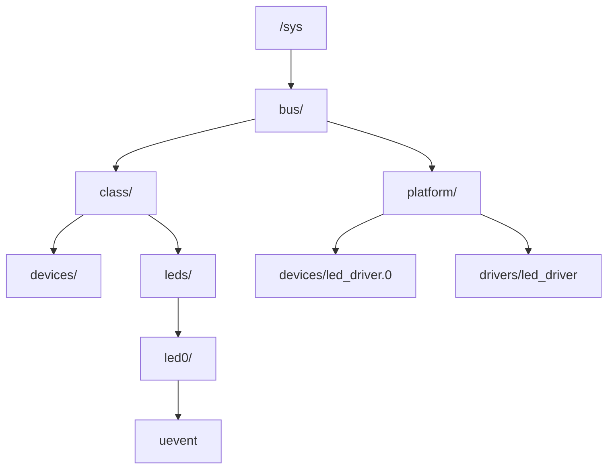

------

### 5.4.10_bus_与_class_的差异总结

| 项目         | bus_type             | class                  |
| ------------ | -------------------- | ---------------------- |
| 定义位置     | `drivers/base/bus.c` | `drivers/base/class.c` |
| 作用         | 匹配设备与驱动       | 分类展示设备           |
| 典型目录     | `/sys/bus/`          | `/sys/class/`          |
| 匹配函数     | `.match()`           | 无匹配逻辑             |
| 典型应用     | platform、i2c、spi   | input、net、leds、tty  |
| 设备节点创建 | 自动                 | 需 `device_create()`   |
| 与驱动绑定   | 是                   | 否                     |

------

### 5.4.11_device_create()_class_层生成节点

定义于 `drivers/base/core.c`：

```c
struct device *device_create(struct class *cls,
                             struct device *parent,
                             dev_t devt,
                             void *drvdata,
                             const char *fmt, ...)
{
    struct device *dev;
    dev = kzalloc(sizeof(*dev), GFP_KERNEL);
    dev->class = cls;
    dev->devt = devt;
    device_initialize(dev);
    dev_set_drvdata(dev, drvdata);
    device_add(dev);
    return dev;
}
```

结果：

```
/sys/class/leds/led0/
└── dev -> ../devices/platform/led_driver.0
```

并在 `/dev/` 下生成对应节点（由 udev 负责）。

------

### 5.4.12_示例_Platform_总线与_LED_类

#### (1)_注册总线

```c
subsys_initcall(platform_bus_init);
```

自动创建：

```
/sys/bus/platform/
```

#### (2)_注册类

```c
static struct class led_class = {
    .name = "leds",
};
module_init(class_register(&led_class));
```

自动创建：

```
/sys/class/leds/
```

#### (3)_注册设备

```c
device_create(&led_class, NULL, MKDEV(240, 0), NULL, "led0");
```

生成节点：

```
/sys/class/leds/led0/
→ /dev/led0
```

------

### 5.4.13_driver_core_中_bus/class_的数据关系

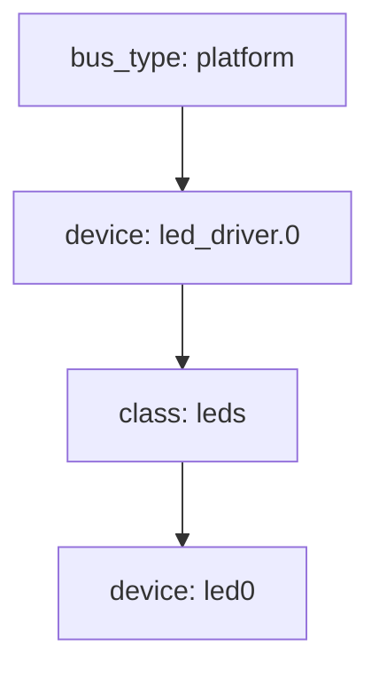

- bus 提供匹配机制（驱动与设备之间）；
- class 提供展示层（功能类别与节点创建）。

------

### 5.4.14_调试与验证

| 检查项           | 命令                                    | 说明                |
| ---------------- | --------------------------------------- | ------------------- |
| 查看 bus 列表    | `ls /sys/bus/`                          | 查看所有总线类型    |
| 查看 class 列表  | `ls /sys/class/`                        | 查看功能分类        |
| 查看设备所属 bus | `readlink /sys/devices/.../subsystem`   | 指向 `/sys/bus/...` |
| 查看 class 链接  | `readlink /sys/class/.../device`        | 指向真实设备路径    |
| 检查匹配函数     | `grep -r "platform_match" drivers/base` | 查找匹配函数实现    |

------

### 5.4.15_小结

| 层级               | 注册函数                   | sysfs 位置                | 主要作用         |
| ------------------ | -------------------------- | ------------------------- | ---------------- |
| 总线（bus_type）   | `bus_register()`           | `/sys/bus/<bus_name>`     | 匹配驱动与设备   |
| 功能类（class）    | `class_register()`         | `/sys/class/<class_name>` | 用户空间展示     |
| 系统子层（subsys） | `subsys_system_register()` | 通用封装                  | 构建 sysfs 层次  |
| 集合对象（kset）   | `kset_create_and_add()`    | `/sys/bus` `/sys/class`   | kobject 集合容器 |
| 设备节点（device） | `device_create()`          | `/sys/class/...`          | 生成 `/dev` 节点 |

> **总结：**
>
> - `bus_type` 决定驱动匹配关系；
> - `class` 决定功能展示与设备节点生成；
> - 二者共同构建 `/sys` 的分层对象模型；
> - 内核通过 `subsys_system_register()` 将它们映射为统一的 kobject 层；
> - 用户空间工具（udev）正是依据这些 sysfs 结构生成 `/dev` 节点。


------

## 5.5_driver_core_与模块系统的交互机制(THIS_MODULE_与引用保护)

### 5.5.1_主题引入

在模块化驱动体系下（即 `.ko` 文件可加载/卸载），内核必须防止以下情况：

> 驱动正在执行 `probe()` 或处理中断时，用户执行了 `rmmod`，导致模块被释放，而代码仍在运行。

为解决此问题，Linux 采用 **模块引用计数机制（module refcount）**，并通过 `THIS_MODULE`、`try_module_get()`、`module_put()` 自动维护引用关系。

> **一句话概括：**
>  “内核通过模块引用计数机制，防止驱动在被使用时被卸载。”

------

### 5.5.2_设计哲学

| 原则     | 说明                             |
| -------- | -------------------------------- |
| 自动保护 | probe() 执行期间模块不可卸载     |
| 计数一致 | 模块被多个设备使用时引用计数累加 |
| 自动回退 | remove() 后自动减少引用计数      |
| 安全并行 | 允许多设备共用同一驱动的安全并发 |
| 核心目标 | 保护执行中代码不被卸载破坏       |

------

### 5.5.3_关键数据结构_struct_module

定义于 `include/linux/module.h`：

```c
struct module {
    refcount_t refcnt;
    const char *name;
    struct module_kobject mkobj;
    ...
};
```

引用计数字段：

```c
refcount_t refcnt;   // 模块被使用的次数
```

模块引用计数由 `/proc/modules` 和 `/sys/module/<name>/refcnt` 共同维护。

------

### 5.5.4_THIS_MODULE_宏

`THIS_MODULE` 是一个特殊的宏，
 在编译阶段由编译器替换为当前编译模块的 `struct module *` 指针。

```c
#define THIS_MODULE (&__this_module)
```

在驱动定义中：

```c
static struct platform_driver led_driver = {
    .probe = led_probe,
    .remove = led_remove,
    .driver = {
        .name = "led_driver",
        .owner = THIS_MODULE,   // <-- 指向当前模块
        .of_match_table = of_match_leds,
    },
};
```

这确保 driver core 能在绑定设备时自动为模块增加引用计数。

------

### 5.5.5_模块加载与引用增加路径

当驱动被注册时：

```c
platform_driver_register(&led_driver);
```

内部会设置：

```
drv->driver.owner = THIS_MODULE;
```

随后在匹配成功并执行 probe() 之前，
 driver core 会调用：

```c
try_module_get(drv->owner);
```

定义于 `include/linux/module.h`：

```c
bool try_module_get(struct module *module)
{
    return module && !module_is_live(module) &&
           refcount_inc_not_zero(&module->refcnt);
}
```

> 成功则引用计数 +1，阻止模块卸载。

------

### 5.5.6_引用计数减少_module_put()

在驱动与设备解绑（remove）或 probe 失败时，
 driver core 调用：

```c
module_put(drv->owner);
```

定义：

```c
void module_put(struct module *module)
{
    refcount_dec(&module->refcnt);
}
```

> 当计数归零时，模块进入可卸载状态。

------

### 5.5.7_执行路径回顾_really_probe()

在第 19 章的 `really_probe()` 中：

```c
static int really_probe(struct device *dev, struct device_driver *drv)
{
    if (!try_module_get(drv->owner))
        return -ENODEV;

    ret = drv->probe(dev);
    if (ret)
        module_put(drv->owner);

    return ret;
}
```

即：

1. `try_module_get()` → 增加模块引用；
2. `drv->probe()` → 驱动初始化；
3. 若 probe 失败 → 回滚 `module_put()`；
4. 若成功 → 模块保持锁定，直到 remove()。

------

### 5.5.8_remove()_调用链中的_module_put()

在设备解绑时：

```c
driver_remove_device(dev)
    → devres_release_all()
    → drv->remove(dev)
    → module_put(drv->owner);
```

当所有设备都 remove 完成后，
 `refcnt` 归零 → 模块可安全卸载。

------

### 5.5.9_模块引用计数的可视化示意

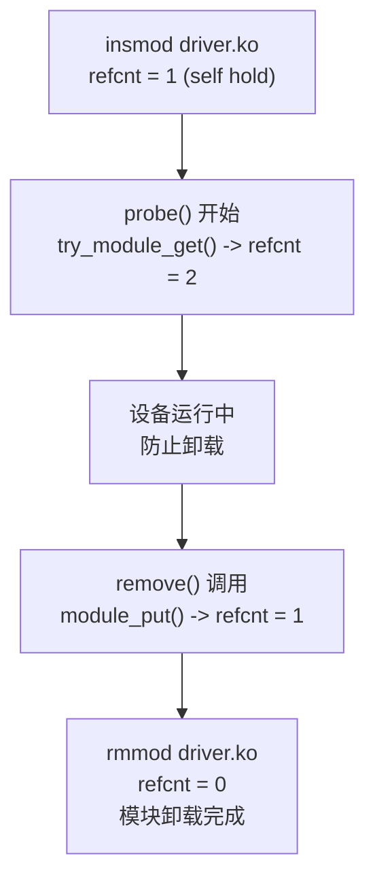

------

### 5.5.10_验证引用计数

| 检查项           | 命令                            | 说明                     |
| ---------------- | ------------------------------- | ------------------------ |
| 查看模块引用计数 | `cat /proc/modules`             | 第三列为 refcount        |
| 模块被使用状态   | `lsmod                          | grep led_driver`         |
| 检查 sysfs 计数  | `/sys/module/led_driver/refcnt` | 实时引用数               |
| 模拟卸载         | `rmmod led_driver`              | 若 refcnt ≠ 0 → 拒绝卸载 |
| 调试日志         | `dmesg                          | grep module_put`         |

------

### 5.5.11_多设备场景下的计数行为

当一个驱动控制多个设备时：

| 设备数量              | 行为                 | 结果                  |
| --------------------- | -------------------- | --------------------- |
| 1 个设备              | probe 后 refcnt=2    | remove 后恢复为 1     |
| N 个设备              | 每 probe 一次计数 +1 | 每 remove 一次计数 -1 |
| 所有 remove 完成      | refcnt=1 → 可卸载    |                       |
| 强制卸载 (`rmmod -f`) | 跳过计数检查（危险） |                       |

------

### 5.5.12_probe/remove_与模块引用关系表

| 阶段            | 函数             | 引用计数变化 |
| --------------- | ---------------- | ------------ |
| 模块加载        | insmod           | +1           |
| 设备匹配成功    | try_module_get() | +1           |
| 设备 probe 失败 | module_put()     | -1           |
| 设备正常 remove | module_put()     | -1           |
| 所有设备解绑    | refcnt=1         |              |
| 用户卸载模块    | refcnt→0         |              |

------

### 5.5.13_错误与调试要点

| 错误                         | 原因                        | 修复建议                          |
| ---------------------------- | --------------------------- | --------------------------------- |
| 模块卸载时报 “Resource busy” | 仍有设备持有引用            | 确认 remove() 执行并释放资源      |
| 模块强制卸载后系统崩溃       | 跳过 refcount 检查          | 禁止使用 `rmmod -f`               |
| probe 后立即卸载模块未报错   | 未设置 `.owner=THIS_MODULE` | 在 `driver.driver.owner` 中补全宏 |
| refcount 无法归零            | 缺失 `module_put()`         | 检查 probe 与 remove 路径平衡性   |

------

### 5.5.14_小结

| 函数                      | 功能               | 调用阶段             |
| ------------------------- | ------------------ | -------------------- |
| `THIS_MODULE`             | 指向当前模块结构体 | 驱动静态定义         |
| `try_module_get()`        | 增加模块引用计数   | probe 之前           |
| `module_put()`            | 减少模块引用计数   | remove 或 probe 失败 |
| `refcount_inc/dec()`      | 内核原子操作       | 底层实现             |
| `lsmod` / `/proc/modules` | 查看引用状态       | 调试工具             |

> **总结：**
>
> - `THIS_MODULE` 是驱动模块与内核对象的连接桥；
> - `try_module_get()` 在 probe 前锁定模块，防止卸载；
> - `module_put()` 在 remove 时解锁；
> - 引用计数保障驱动生命周期安全；
> - 多设备场景中计数按设备维度累加；
> - 任何丢失 `.owner = THIS_MODULE` 的驱动都存在潜在风险。


------

## 5.6_热插拔与设备动态创建机制(Hotplug_&_Dynamic_Device)

### 5.6.1_主题引入

早期 Linux 系统中，所有设备节点都由人工通过 `mknod` 创建。
 但现代 Linux 使用了 **“热插拔机制（Hotplug）”** 与 **`udevd` 守护进程**，
 实现自动检测、动态创建设备节点。

设备插入（或加载驱动）后，内核会：

1. 通过 `kobject_uevent()` 向用户空间发送事件；
2. `udevd` 接收事件，根据 `/lib/udev/rules.d/*.rules` 执行动作；
3. 自动创建 `/dev/<device>` 节点；
4. 在 `/sys/devices/` 下建立 kobject 层级关系。

> **一句话概括：**
>  “内核负责事件，用户空间负责响应。”

------

### 5.6.2_设计哲学

| 原则       | 说明                                 |
| ---------- | ------------------------------------ |
| 事件驱动   | 一切由内核事件触发                   |
| 用户态响应 | 用户空间负责实际节点创建             |
| 自动同步   | `/sys` 与 `/dev` 自动对应            |
| 无需脚本   | devtmpfs + udev 实现全自动           |
| 可扩展     | 支持 USB、PCI、I2C、MMC 等热插拔总线 |

------

### 5.6.3_热插拔事件的触发点

在设备注册（`device_add()`）过程中，内核会调用：

```c
kobject_uevent(&dev->kobj, KOBJ_ADD);
```

在设备移除时调用：

```c
kobject_uevent(&dev->kobj, KOBJ_REMOVE);
```

其它事件类型包括：

| 事件类型                       | 含义         |
| ------------------------------ | ------------ |
| `KOBJ_ADD`                     | 新设备注册   |
| `KOBJ_REMOVE`                  | 设备移除     |
| `KOBJ_CHANGE`                  | 属性更新     |
| `KOBJ_MOVE`                    | 移动到新路径 |
| `KOBJ_ONLINE` / `KOBJ_OFFLINE` | 动态上下线   |

------

### 5.6.4_kobject_uevent()_内部流程

定义于 `lib/kobject_uevent.c`：

```c
int kobject_uevent(struct kobject *kobj, enum kobject_action action)
{
    struct kobj_uevent_env *env;
    char *action_string = action_to_string(action);
    add_uevent_var(env, "ACTION=%s", action_string);
    add_uevent_var(env, "DEVPATH=%s", kobject_get_path(kobj, GFP_KERNEL));
    ...
    broadcast_uevent(env);
}
```

#### (1)_主要逻辑

1. 生成事件描述字符串（如 `"add"`, `"remove"`）；
2. 记录环境变量（ACTION、DEVPATH、SUBSYSTEM、SEQNUM 等）；
3. 向用户空间广播事件（`netlink` 通道）。

------

### 5.6.5_用户空间接收机制_udevd

`udevd` 是运行在用户空间的设备事件守护进程，
 通过 **Netlink socket** 接收来自内核的 `KOBJ_*` 事件。

接收到事件后，udevd 会：

1. 匹配规则文件 `/lib/udev/rules.d/*.rules`；
2. 提取属性（如 `SUBSYSTEM`、`DRIVER`、`DEVTYPE`）；
3. 执行相应动作（如 `mknod`、`chmod`、`symlink`）。

示例日志：

```
udevd[123]: add /devices/platform/led_driver.0 (platform)
udevd[123]: creating device node '/dev/led0'
```

------

### 5.6.6_环境变量(udev_事件内容)

每次 uevent 都包含一组关键环境变量：

| 变量名      | 示例值                           | 说明               |
| ----------- | -------------------------------- | ------------------ |
| `ACTION`    | `add`                            | 事件类型           |
| `DEVPATH`   | `/devices/platform/led_driver.0` | sysfs 设备路径     |
| `SUBSYSTEM` | `platform`                       | 所属子系统         |
| `DRIVER`    | `led_driver`                     | 驱动名称           |
| `DEVNAME`   | `led0`                           | 节点名（udev生成） |
| `SEQNUM`    | `1234`                           | 事件序号           |

------

### 5.6.7_可视化_内核事件到用户空间流程

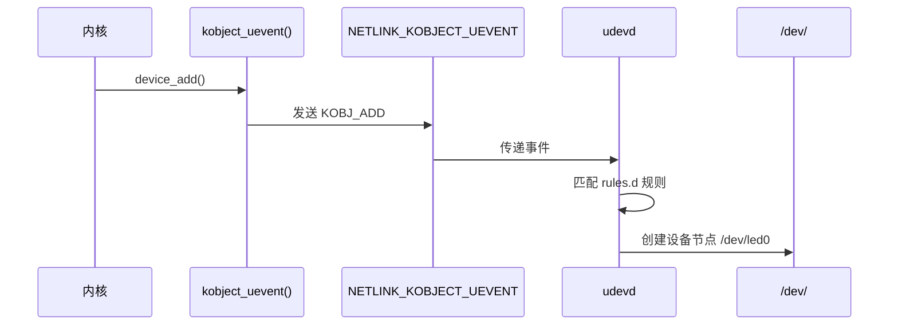

------

### 5.6.8_devtmpfs_设备节点的内核自动挂载系统

#### (1)_机制简介

`devtmpfs` 是内核提供的特殊文件系统，
 在设备注册时由内核自动创建节点，而非依赖 udev。

配置项：

```
CONFIG_DEVTMPFS=y
CONFIG_DEVTMPFS_MOUNT=y
```

挂载位置：

```
/dev
```

#### (2)_作用

- 在极早期（udevd 尚未运行时）即可创建设备节点；
- 使嵌入式系统无需 udev 也能启动；
- udevd 仅补充命名与权限。

------

### 5.6.9_设备节点的自动创建流程(含_devtmpfs)

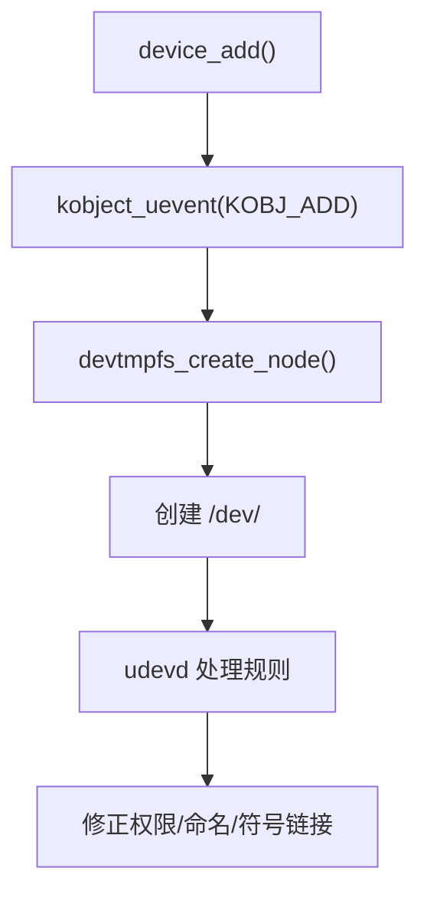

------

### 5.6.10_udev_规则(规则文件示例)

规则文件 `/lib/udev/rules.d/50-udev-default.rules` 示例：

```bash
SUBSYSTEM=="platform", KERNEL=="led*", NAME="led%n", MODE="0664"
SUBSYSTEM=="block", KERNEL=="sd*", GROUP="disk"
SUBSYSTEM=="tty", KERNEL=="ttyS*", GROUP="dialout"
```

字段说明：

| 字段        | 含义                               |
| ----------- | ---------------------------------- |
| `SUBSYSTEM` | 匹配设备子系统（如 platform、usb） |
| `KERNEL`    | 匹配设备名（如 led0、sdX）         |
| `NAME`      | 节点名                             |
| `MODE`      | 权限                               |
| `GROUP`     | 所属组                             |

------

### 5.6.11_手动触发与调试

| 动作            | 命令                                   | 说明                |
| --------------- | -------------------------------------- | ------------------- |
| 模拟设备注册    | `udevadm trigger`                      | 重新触发所有 uevent |
| 查看事件监听    | `udevadm monitor --kernel --udev`      | 实时输出事件        |
| 检查规则匹配    | `udevadm test /sys/devices/...`        | 调试规则逻辑        |
| 查看设备节点    | `ls -l /dev/led0`                      | 验证节点创建        |
| 查看 sysfs 链接 | `readlink /sys/class/leds/led0/device` | 验证关联路径        |

------

### 5.6.12_嵌入式系统下的最小化热插拔支持

在嵌入式系统中若无完整 udev：

1. 启用 `CONFIG_DEVTMPFS_MOUNT`；
2. 由内核自动创建节点；
3. 可选：使用 `mdev`（BusyBox 简化版 udev）管理权限与命名；
4. 内核与根文件系统协同即可完成设备动态检测。

------

### 5.6.13_内核与用户空间协作总结图

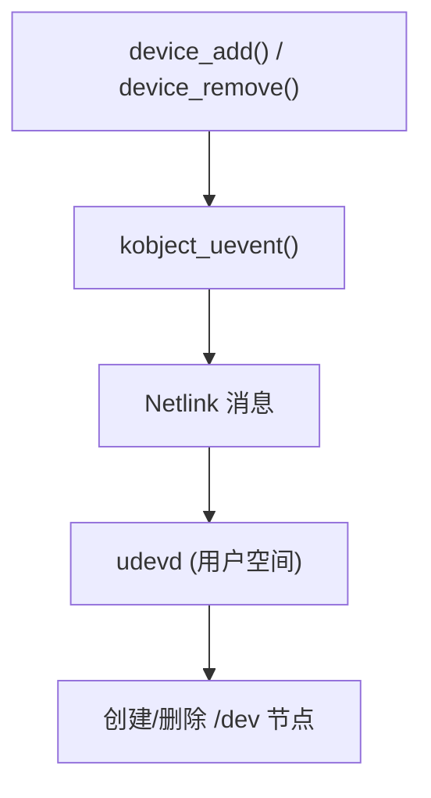

------

### 5.6.14_小结

| 层级       | 组件                        | 功能                 |
| ---------- | --------------------------- | -------------------- |
| 内核       | `kobject_uevent()`          | 发送设备事件         |
| 通道       | `NETLINK_KOBJECT_UEVENT`    | 内核 → 用户空间通信  |
| 守护进程   | `udevd`                     | 解析规则并执行操作   |
| 文件系统   | `devtmpfs`                  | 提供自动节点创建     |
| 用户配置   | `/lib/udev/rules.d/*.rules` | 自定义命名与权限     |
| 嵌入式替代 | `mdev`                      | BusyBox 精简替代方案 |

> **总结：**
>
> - Linux 热插拔机制建立在 kobject 与 Netlink 事件系统之上；
> - 内核仅负责通知，用户空间通过 `udevd` 响应；
> - `devtmpfs` 提供早期自动节点支持；
> - `/sys` 是数据层，`/dev` 是操作层，两者由 udev 关联；
> - 该机制是现代 Linux “即插即用（PnP）” 的基础。


------

## 5.7_device_create()_与_sysfs_属性自动生成机制

### 5.7.1_主题引入

在现代 Linux 驱动中，设备节点的创建和属性暴露已高度自动化。
 驱动只需调用：

```c
device_create(&led_class, NULL, devt, NULL, "led0");
```

即可同时得到：

```
/sys/class/leds/led0/
└── dev -> ../../devices/platform/led_driver.0
/dev/led0
```

这种机制背后涉及 `device_create()`、`device_add()`、`sysfs_create_group()`、`DEVICE_ATTR()` 等一系列驱动核心接口。

> **一句话概括：**
>  “device_create() 是驱动与 sysfs/devtmpfs 之间的桥梁。”

------

### 5.7.2_设计哲学

| 原则           | 说明                           |
| -------------- | ------------------------------ |
| 统一接口       | 统一创建 `/sys` 与 `/dev` 节点 |
| 自动绑定       | 自动关联到所属 class           |
| 权限控制       | 支持读写权限与属性定义         |
| 用户可见       | 属性通过 sysfs 可直接访问      |
| 无需手动 mknod | 由 devtmpfs/udev 自动创建节点  |

------

### 5.7.3_device_create()_原型与核心逻辑

定义于 `drivers/base/core.c`：

```c
struct device *device_create(struct class *class,
                             struct device *parent,
                             dev_t devt,
                             void *drvdata,
                             const char *fmt, ...)
{
    struct device *dev;
    va_list args;

    dev = kzalloc(sizeof(*dev), GFP_KERNEL);
    device_initialize(dev);
    dev->devt  = devt;
    dev->class = class;
    dev->parent = parent;
    dev_set_drvdata(dev, drvdata);

    va_start(args, fmt);
    vsnprintf(dev->kobj.name, sizeof(dev->kobj.name), fmt, args);
    va_end(args);

    device_add(dev);
    return dev;
}
```

------

### 5.7.4_device_add()_与_sysfs_目录生成

`device_add()` 的作用是将设备对象注册到系统中：

```c
int device_add(struct device *dev)
{
    kobject_add(&dev->kobj, dev->parent ? &dev->parent->kobj : NULL, "%s", dev_name(dev));
    device_create_file(dev, &dev_attr_uevent);
    bus_add_device(dev);
    class_device_create_symlinks(dev);
    kobject_uevent(&dev->kobj, KOBJ_ADD);
    return 0;
}
```

结果是：

1. 在 `/sys/class/<class_name>/` 下创建新目录；
2. 自动生成 `/sys/class/<class_name>/<device_name>/dev`；
3. 通知 `udevd` 创建 `/dev/<device_name>`。

------

### 5.7.5_devtmpfs_与_/dev_节点同步

在 `device_add()` 中调用的 `kobject_uevent(KOBJ_ADD)` 会被 devtmpfs 捕获。
 devtmpfs 负责：

- 根据 `devt`（主次设备号）创建 `/dev/<device_name>`；
- 权限、名称可由 udev 后续规则修正；
- 在嵌入式环境中，可无需 udev 独立运行。

------

### 5.7.6_可视化_device_create()_到节点生成流程

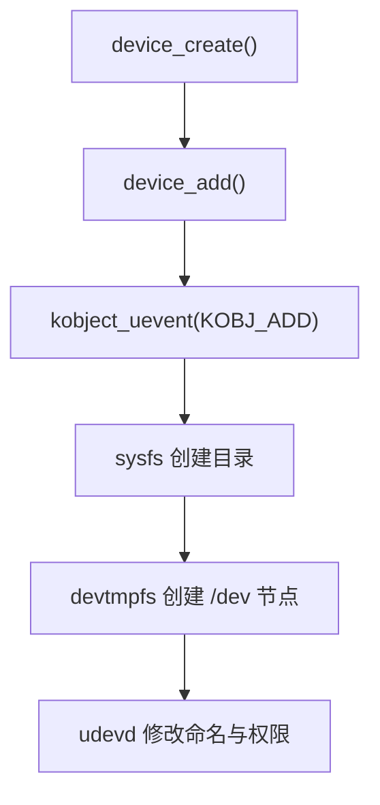

------

### 5.7.7_DEVICE_ATTR()_宏_创建_sysfs_属性文件

驱动通常需要暴露设备参数给用户空间，例如：

```c
static int led_state_value = 0;

static ssize_t led_state_show(struct device *dev,
                              struct device_attribute *attr, char *buf)
{
    return sprintf(buf, "%d\n", led_state_value);
}

static ssize_t led_state_store(struct device *dev,
                               struct device_attribute *attr, const char *buf, size_t count)
{
    led_state = simple_strtoul(buf, NULL, 10);
    return count;
}

static DEVICE_ATTR_RW(led_state);	// .show 和 .store 负责将dev_attr_led_state 和 led_state_value关联起来
```

该宏展开为：

```c
struct device_attribute dev_attr_led_state = {
    .attr = { .name = "led_state", .mode = 0644 },
    .show = led_state_show,
    .store = led_state_store,
};
```

------

### 5.7.8_属性文件的注册与移除

注册属性：

```c
device_create_file(dev, &dev_attr_led_state);
```

移除属性：

```c
device_remove_file(dev, &dev_attr_led_state);
```

最终在 `/sys/class/leds/led0/led_state` 出现该属性文件。

------

### 5.7.9_多属性批量注册(属性组)

如果设备包含多个属性，可统一注册：

```c
static struct attribute *led_attrs[] = {
    &dev_attr_led_state.attr,
    &dev_attr_brightness.attr,
    NULL,
};

ATTRIBUTE_GROUPS(led);

dev_groups = led_groups;
device_register(&dev);
```

等价于：

```
/sys/class/leds/led0/
├── led_state
├── brightness
```

------

### 5.7.10_权限控制机制

| 模式 | 宏定义             | 用户权限   |
| ---- | ------------------ | ---------- |
| 0444 | `DEVICE_ATTR_RO()` | 用户只读   |
| 0644 | `DEVICE_ATTR_RW()` | 用户可读写 |
| 0200 | `DEVICE_ATTR_WO()` | 用户仅写   |

内核读取时调用 `.show()`，
 写入时调用 `.store()`。

------

### 5.7.11_sysfs_访问与驱动联动示例

```bash
# 读取当前 LED 状态
cat /sys/class/leds/led0/led_state
1

# 写入关闭命令
echo 0 > /sys/class/leds/led0/led_state
```

驱动端日志：

```
led_driver: led_state_store() called, new value = 0
```

> sysfs 操作是同步到驱动内部的，是驱动与用户态通信的最常用通道之一。

------

### 5.7.12_驱动中_device_create()_与_cdev_create()_的区别

| 项目         | `device_create()`            | `cdev_add()`                 |
| ------------ | ---------------------------- | ---------------------------- |
| 所属层级     | 设备模型（sysfs/class）      | 字符设备（VFS层）            |
| 负责功能     | 创建 sysfs 与 /dev 节点      | 注册 file_operations         |
| 生成节点方式 | devtmpfs/udev 自动生成       | 依赖 device_create() 的 devt |
| 典型组合     | cdev_add() + device_create() | 配合使用                     |
| 目标目录     | `/sys/class/...`             | `/dev/...`                   |

一般写法：

```c
cdev_add(&led_cdev, devno, 1);
device_create(&led_class, NULL, devno, NULL, "led0");
```

------

### 5.7.13_sysfs_文件系统特性

| 特性         | 描述                       |
| ------------ | -------------------------- |
| 单值文件原则 | 每个文件只表示一个变量     |
| ASCII 编码   | 所有值均以字符串格式读写   |
| 同步机制     | 内核读写与用户空间同步完成 |
| 自动反射     | 属性变更可触发 uevent      |
| 挂载点       | `/sys`                     |

------

### 5.7.14_调试与验证

| 项目           | 命令                                      | 说明             |
| -------------- | ----------------------------------------- | ---------------- |
| 查看设备节点   | `ls /sys/class/leds/led0/`                | 验证目录结构     |
| 检查属性读写   | `cat /sys/class/leds/led0/led_state`      | 读取值           |
| 修改属性       | `echo 1 > /sys/class/leds/led0/led_state` | 写入值           |
| 验证 /dev 节点 | `ls -l /dev/led0`                         | 确认设备存在     |
| 监控事件       | `udevadm monitor`                         | 查看属性变动事件 |
| 调试驱动       | `dmesg                                    | grep led_driver` |

------

### 5.7.15_小结

| 接口                   | 功能                 | 说明          |
| ---------------------- | -------------------- | ------------- |
| `device_create()`      | 创建设备与 /sys 节点 | 由 class 驱动 |
| `device_add()`         | 注册设备至系统       | 调用 uevent   |
| `DEVICE_ATTR()`        | 定义属性文件         | 提供读写接口  |
| `device_create_file()` | 注册单属性           | 可动态增删    |
| `sysfs_create_group()` | 批量注册属性         | 管理多个属性  |
| `devtmpfs`             | 自动创建 /dev 节点   | 由内核处理    |
| `udevd`                | 修改命名与权限       | 用户空间层    |

> **总结：**
>
> - `device_create()` 统一了 sysfs 与 devtmpfs 的创建逻辑；
> - 属性文件通过 `DEVICE_ATTR()` 暴露接口；
> - sysfs 是内核与用户态间标准化交互层；
> - 每个属性文件对应一个 show/store 函数；
> - 驱动开发中建议始终使用 `DEVICE_ATTR_*()` 系列以保持结构规范。


------

## 5.8_sysfs_属性机制的底层原理与实现(kobj_attribute_与属性访问路径)

### 5.8.1_主题引入

当我们执行：

```bash
cat /sys/class/leds/led0/led_state
```

驱动中定义的：

```c
static ssize_t led_state_show(struct device *dev,
                              struct device_attribute *attr, char *buf)
```

就会被自动调用。

但它是如何被 sysfs 找到并执行的？
 为什么 `buf` 能自动被分配？
 又是谁来负责把 `led_state` 文件挂载到 `/sys/class/leds/led0/` 下？

这一切都依赖于 sysfs 的通用接口体系：
 `kobject`、`kobj_type`、`sysfs_ops`、`attribute`、`kobj_attribute`。

------

### 5.8.2_设计哲学

| 原则     | 说明                                              |
| -------- | ------------------------------------------------- |
| 面向对象 | 统一抽象：每个可导出的对象都是一个 `kobject`      |
| 属性驱动 | 所有 sysfs 文件都由属性（`struct attribute`）定义 |
| 动态绑定 | 通过 `sysfs_ops` 动态调用 `.show()` / `.store()`  |
| 自动生成 | 用户态访问自动触发回调，无需 ioctl                |
| 可扩展性 | 任何子系统（bus/class/device/driver）都可扩展属性 |

------

### 5.8.3_核心结构体关系图

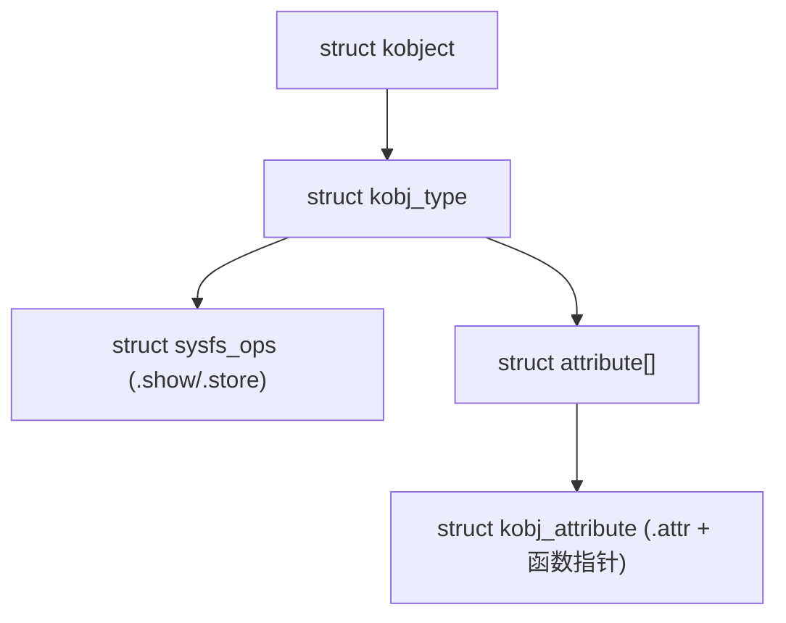

解释：

- `kobject`：sysfs 的核心实体，每个 `/sys/...` 目录都对应一个；
- `kobj_type`：定义该对象有哪些属性、以及如何读写；
- `attribute`：每个属性文件的基础元数据；
- `kobj_attribute`：带有 `.show()` / `.store()` 的扩展结构；
- `sysfs_ops`：属性访问的统一调度接口。

------

### 5.8.4_struct_attribute(属性基础单元)

定义于 `include/linux/sysfs.h`：

```c
struct attribute {
    const char *name;   // 文件名
    umode_t mode;       // 文件权限
};
```

这是 sysfs 层级最基础的对象 —— 对应 `/sys` 中的每个文件。

------

### 5.8.5_struct_kobj_attribute(属性_+_操作)

`kobj_attribute` 扩展了 attribute，使属性具备可读写函数：

```c
struct kobj_attribute {
    struct attribute attr;
    ssize_t (*show)(struct kobject *kobj, struct kobj_attribute *attr, char *buf);
    ssize_t (*store)(struct kobject *kobj, struct kobj_attribute *attr,
                     const char *buf, size_t count);
};
```

注意：

- 这是 sysfs 最通用的接口；
- device 层的 `struct device_attribute` 本质上就是在此基础上封装了一层；
- 所以 `.show()` / `.store()` 的语义来源正是 `kobj_attribute`。

------

### 5.8.6_struct_sysfs_ops_属性访问调度表

```c
struct sysfs_ops {
    ssize_t (*show)(struct kobject *, struct attribute *, char *);
    ssize_t (*store)(struct kobject *, struct attribute *, const char *, size_t);
};
```

每个子系统（bus/class/device/driver）都会定义自己的一套 `sysfs_ops`。
 例如 `device_kobj_type`：

```c
const struct sysfs_ops device_sysfs_ops = {
    .show = device_attr_show,
    .store = device_attr_store,
};
```

当用户访问 sysfs 文件时，sysfs 内部会调用该表中定义的函数。

------

### 5.8.7_device_attr_show()/store()_调用路径

以读操作为例（`cat /sys/class/leds/led0/led_state`）：

```text
sysfs_kf_read()
  ↓
sysfs_attr_show()
  ↓
device_attr_show()
  ↓
dev_attr->show(dev, attr, buf)
  ↓
led_state_show()
```

调用链图：

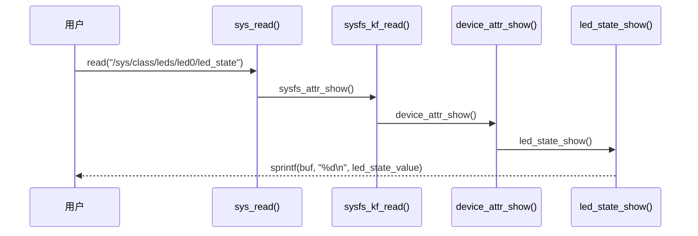

------

### 5.8.8_kobj_type_与_sysfs_ops_绑定

`struct kobj_type` 是 sysfs 的“对象类型定义表”：

```c
struct kobj_type {
    void (*release)(struct kobject *kobj);
    const struct sysfs_ops 	*sysfs_ops;
    struct attribute 		**default_attrs;
};
```

例如：

```c
const struct kobj_type device_ktype = {
    .release 		= device_release,
    .sysfs_ops 		= &device_sysfs_ops,
    .default_attrs 	 = device_default_attrs,
};
```

`sysfs_ops` 指定该类型对象的访问方式。
 所以任何继承自 `kobject` 的对象（device/class/bus）
 都能自动具备统一的文件访问行为。

------

### 5.8.9_sysfs_文件创建函数_sysfs_create_file()

```c
int sysfs_create_file(struct kobject *kobj, const struct attribute *attr)
{
    return sysfs_add_file_mode_ns(kobj, attr, attr->mode, NULL);
}
```

该函数在底层调用 `kernfs_create_file()`，
 最终生成可在 `/sys` 访问的文件节点。
 而文件读写操作通过 `kernfs_fop_read()` / `kernfs_fop_write()` 间接转发到 `.show()` / `.store()`。

------

### 5.8.10_kobject_create_and_add()_对象层注册

```c
struct kobject *kobject_create_and_add(const char *name, struct kobject *parent)
{
    struct kobject *kobj = kzalloc(sizeof(*kobj), GFP_KERNEL);
    kobject_init(kobj, &ktype_default);
    kobject_add(kobj, parent, "%s", name);
    return kobj;
}
```

功能：

1. 创建 `kobject`；
2. 绑定 `kobj_type`；
3. 自动挂载到 `/sys`。

------

### 5.8.11_device_create_file()_内部关系复盘

```c
int device_create_file(struct device *dev,
                       const struct device_attribute *attr)
{
    return sysfs_create_file(&dev->kobj, &attr->attr);
}
```

→ 实际调用链：

```
device_create_file()
  ↓
sysfs_create_file()
  ↓
kernfs_create_file()
```

最终实现 `/sys/class/.../led_state`。

------

### 5.8.12_从宏到最终路径(完整可视化)

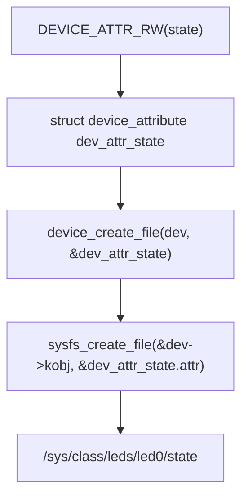

------

### 5.8.13_sysfs_emit()_与_sprintf()_的区别

自 Linux 5.x 起，建议在 `.show()` 中使用：

```c
return sysfs_emit(buf, "%d\n", led_state_value);
```

而不是：

```c
return sprintf(buf, "%d\n", led_state_value);
```

区别：

| 函数           | 功能                      | 安全性   |
| -------------- | ------------------------- | -------- |
| `sprintf()`    | 普通字符串写入            | 可能越界 |
| `sysfs_emit()` | 限定最大长度（PAGE_SIZE） | 推荐使用 |

------

### 5.8.14_sysfs_属性在驱动模型中的统一继承

| 层级   | 属性结构体                | 内部调用             |
| ------ | ------------------------- | -------------------- |
| bus    | `struct bus_attribute`    | `bus_attr_show()`    |
| class  | `struct class_attribute`  | `class_attr_show()`  |
| device | `struct device_attribute` | `device_attr_show()` |
| driver | `struct driver_attribute` | `driver_attr_show()` |

所有这些结构最终都继承 `kobj_attribute`。
 即 sysfs 属性体系是统一继承的类层次结构。

------

### 5.8.15_调试与验证

| 操作            | 命令                                     | 说明              |
| --------------- | ---------------------------------------- | ----------------- |
| 查看 sysfs 节点 | `ls /sys/class/leds/led0/`               | 验证属性生成      |
| 查看文件操作栈  | `cat /sys/kernel/debug/kobject`          | 检查 kobject 结构 |
| 内核日志追踪    | `echo 1 > /sys/kernel/debug/sysfs/trace` | 开启 sysfs trace  |
| 检查类型结构    | `grep -r "kobj_type" drivers/base/`      | 确认对象定义      |
| 内核源码入口    | `lib/kobject.c`, `fs/kernfs/file.c`      | 查看调用链        |

------

### 5.8.16_小结

| 模块                   | 结构体                         | 作用 |
| ---------------------- | ------------------------------ | ---- |
| `kobject`              | sysfs 的核心对象，代表一个节点 |      |
| `kobj_type`            | 定义访问行为与属性集合         |      |
| `attribute`            | 文件元数据（名称/权限）        |      |
| `kobj_attribute`       | 扩展属性 + show/store          |      |
| `sysfs_ops`            | 访问操作函数表                 |      |
| `device_attribute`     | 驱动层封装的属性结构体         |      |
| `device_create_file()` | 向 sysfs 注册属性文件          |      |
| `sysfs_emit()`         | 安全输出接口                   |      |

> **总结：**
>
> - sysfs 是通过 `kobject` + `attribute` + `sysfs_ops` 实现的文件抽象层；
> - 所有属性访问最终落在 `.show()` / `.store()`；
> - 驱动层只需调用 `device_create_file()`；
> - 底层由 kernfs 完成文件节点与内存映射管理；
> - 这就是 Linux 驱动层属性文件得以自动工作的根本机制。


------

## 5.9_class_attribute_与_driver_attribute_的实现与差异

### 5.9.1_主题引入

前几章我们讨论了：

- `device_attribute`（针对具体设备对象）；
- 其文件出现在 `/sys/class/<class_name>/<device_name>/` 下。

但在更高层次的驱动模型中，**类（class）和驱动（driver）自身**也需要暴露属性，例如：

- 某个类的通用控制属性；
- 某个驱动的调试、参数或统计信息。

此时就要使用：

- `class_attribute`；
- `driver_attribute`。

> **一句话概括：**
>  “class_attribute 作用于功能类别，driver_attribute 作用于驱动实体。”

------

### 5.9.2_设计哲学

| 原则         | 说明                                                         |
| ------------ | ------------------------------------------------------------ |
| 分层管理     | 每个层级（device/class/driver/bus）都有独立属性体系          |
| 统一接口     | 全部基于 `kobj_attribute` 与 `sysfs_ops`                     |
| 独立命名空间 | class 属性位于 `/sys/class`，driver 属性位于 `/sys/bus/.../drivers/...` |
| 调试可见性   | 驱动无需绑定设备即可导出调试属性                             |
| 类型封装     | 使用 `CLASS_ATTR_*` 与 `DRIVER_ATTR_*` 宏快速定义            |

------

### 5.9.3_struct_class_attribute

定义于 `include/linux/device/class.h`：

```c
struct class_attribute {
    struct attribute attr;
    ssize_t (*show)(struct class *class, struct class_attribute *attr, char *buf);
    ssize_t (*store)(struct class *class, struct class_attribute *attr, const char *buf, size_t count);
};
```

| 字段       | 含义                           |
| ---------- | ------------------------------ |
| `.attr`    | 属性文件元信息（文件名、权限） |
| `.show()`  | 用户读取时回调                 |
| `.store()` | 用户写入时回调                 |

------

### 5.9.4_struct_driver_attribute

定义于 `include/linux/device/driver.h`：

```c
struct driver_attribute {
    struct attribute attr;
    ssize_t (*show)(struct device_driver *driver, struct driver_attribute *attr, char *buf);
    ssize_t (*store)(struct device_driver *driver, struct driver_attribute *attr, const char *buf, size_t count);
};
```

二者区别仅在于：

- `class_attribute` 操作对象是 `struct class *`;
- `driver_attribute` 操作对象是 `struct device_driver *`。

------

### 5.9.5_注册接口_class_create_file()_与_driver_create_file()

#### (1)_class_属性注册

```c
int class_create_file(struct class *class, const struct class_attribute *attr)
{
    return sysfs_create_file(&class->p->subsys.kobj, &attr->attr);
}
```

创建路径：

```
/sys/class/<class_name>/<attr_name>
```

#### (2)_driver_属性注册

```c
int driver_create_file(struct device_driver *drv, const struct driver_attribute *attr)
{
    return sysfs_create_file(&drv->p->kobj, &attr->attr);
}
```

创建路径：

```
/sys/bus/<bus_name>/drivers/<driver_name>/<attr_name>
```

------

### 5.9.6_属性定义宏

#### (1)_1️⃣_CLASS_ATTR_RW(name)

```c
#define CLASS_ATTR_RW(_name) \
    struct class_attribute class_attr_##_name = __ATTR_RW(_name)
```

展开：

```c
struct class_attribute class_attr_status = {
    .attr = { .name = "status", .mode = 0644 },
    .show = status_show,
    .store = status_store,
};
```

#### (2)_2️⃣_DRIVER_ATTR_RW(name)

```c
#define DRIVER_ATTR_RW(_name) \
    struct driver_attribute driver_attr_##_name = __ATTR_RW(_name)
```

展开：

```c
struct driver_attribute driver_attr_debug = {
    .attr = { .name = "debug", .mode = 0644 },
    .show = debug_show,
    .store = debug_store,
};
```

------

### 5.9.7_示例_class_属性

```c
static ssize_t class_info_show(struct class *cls,
                               struct class_attribute *attr, char *buf)
{
    return sysfs_emit(buf, "LED class: %s\n", cls->name);
}

static CLASS_ATTR_RO(info);

static int __init led_class_init(void)
{
    int ret;
    ret = class_create_file(&led_class, &class_attr_info);
    return ret;
}
```

生成路径：

```
/sys/class/leds/info
```

访问效果：

```
# cat /sys/class/leds/info
LED class: leds
```

------

### 5.9.8_示例_driver_属性

```c
static ssize_t debug_show(struct device_driver *drv,
                          struct driver_attribute *attr, char *buf)
{
    return sysfs_emit(buf, "Driver: %s (debug mode)\n", drv->name);
}

static DRIVER_ATTR_RO(debug);

static int __init led_driver_init(void)
{
    int ret;
    ret = driver_create_file(&led_driver.driver, &driver_attr_debug);
    return ret;
}
```

生成路径：

```
/sys/bus/platform/drivers/led_driver/debug
```

------

### 5.9.9_多层_sysfs_结构对比

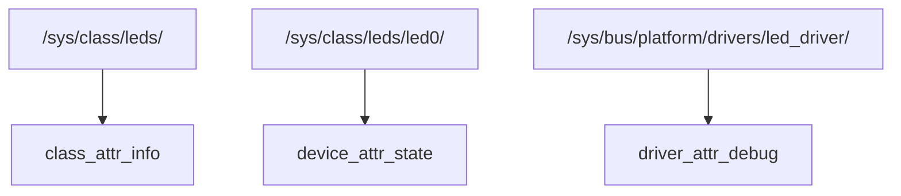

| 层级   | 属性类型           | 宏              | 注册函数               | 文件路径示例                                 |
| ------ | ------------------ | --------------- | ---------------------- | -------------------------------------------- |
| Class  | `class_attribute`  | `CLASS_ATTR_*`  | `class_create_file()`  | `/sys/class/leds/info`                       |
| Device | `device_attribute` | `DEVICE_ATTR_*` | `device_create_file()` | `/sys/class/leds/led0/state`                 |
| Driver | `driver_attribute` | `DRIVER_ATTR_*` | `driver_create_file()` | `/sys/bus/platform/drivers/led_driver/debug` |

------

### 5.9.10_kobject_继承关系

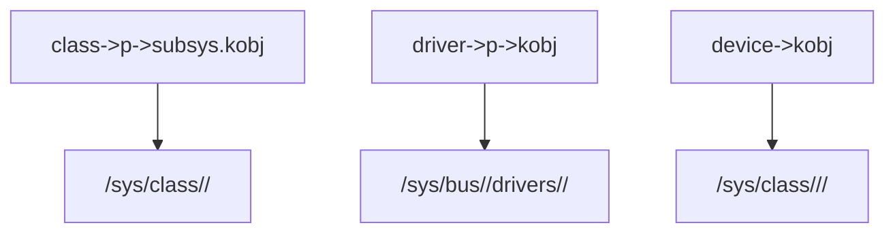

说明：

- 每个层级都持有一个独立的 `struct kobject`；
- `sysfs_create_file()` 最终都是对该层的 kobject 添加文件。

------

### 5.9.11_典型应用场景

| 场景                     | 使用类型           | 示例                                    |
| ------------------------ | ------------------ | --------------------------------------- |
| 类公共参数（如功率模式） | `class_attribute`  | `/sys/class/power_supply/mode`          |
| 单设备属性               | `device_attribute` | `/sys/class/leds/led0/brightness`       |
| 驱动全局调试信息         | `driver_attribute` | `/sys/bus/spi/drivers/spi_master/debug` |
| 驱动统计接口             | `driver_attribute` | `/sys/bus/usb/drivers/usbcore/stats`    |

------

### 5.9.12_删除属性接口

| 操作             | 函数                   |
| ---------------- | ---------------------- |
| 删除 class 属性  | `class_remove_file()`  |
| 删除 driver 属性 | `driver_remove_file()` |
| 删除 device 属性 | `device_remove_file()` |

建议在 `exit` 或 `remove` 阶段配对调用。

------

### 5.9.13_调试与验证

| 检查项       | 命令                                             | 说明              |
| ------------ | ------------------------------------------------ | ----------------- |
| 查看类属性   | `ls /sys/class/leds/`                            | 应出现 info 文件  |
| 查看驱动属性 | `ls /sys/bus/platform/drivers/led_driver/`       | 应出现 debug 文件 |
| 读取内容     | `cat /sys/bus/platform/drivers/led_driver/debug` | 验证回调触发      |
| 写入验证     | `echo value > /sys/.../attr`                     | 触发 `.store()`   |
| 调试日志     | `dmesg                                           | grep led_driver`  |

------

### 5.9.14_小结

| 属性层级    | 定义宏          | 注册函数               | sysfs 路径                          | 对象类型                 |
| ----------- | --------------- | ---------------------- | ----------------------------------- | ------------------------ |
| Class 属性  | `CLASS_ATTR_*`  | `class_create_file()`  | `/sys/class/<class>/attr`           | `struct class *`         |
| Device 属性 | `DEVICE_ATTR_*` | `device_create_file()` | `/sys/class/<class>/<device>/attr`  | `struct device *`        |
| Driver 属性 | `DRIVER_ATTR_*` | `driver_create_file()` | `/sys/bus/<bus>/drivers/<drv>/attr` | `struct device_driver *` |

> **总结：**
>
> - 三者共享同一 sysfs 基础机制；
> - 区别仅在于目标对象不同；
> - `class_attribute` 用于整个类别；
> - `driver_attribute` 用于驱动实体；
> - `device_attribute` 用于单一设备；
> - 全部都通过 `sysfs_create_file()` 在相应 kobject 下注册。


------

## 5.10_bus_attribute_与子系统属性机制(总线级属性注册)

### 5.10.1_主题引入_总线级属性的角色

在前几章中，我们分别学习了：

- **device_attribute**：作用于单个设备对象；
- **class_attribute**：作用于整个设备类别；
- **driver_attribute**：作用于特定驱动模块。

而**bus_attribute** 则属于**总线级别的属性文件**，它的作用对象是 `struct bus_type`，
 即负责管理一类设备与驱动之间匹配的“调度层”。

这种属性文件通常出现在路径：

```
/sys/bus/<bus_name>/
```

例如：

```
/sys/bus/platform/
├── devices/
├── drivers/
└── drivers_probe
```

这些文件并不是普通的 device 属性，而是通过 **bus_attribute** 注册的。
 它们提供了**针对整条总线的全局配置与调试接口**。

------

### 5.10.2_struct_bus_attribute_定义与成员说明

定义位置：`include/linux/device/bus.h`

```c
struct bus_attribute {
	struct attribute attr;  // 基础属性（文件名、权限）
	ssize_t (*show)(struct bus_type *bus, struct bus_attribute *attr, char *buf);
	ssize_t (*store)(struct bus_type *bus, struct bus_attribute *attr,
	                 const char *buf, size_t count);
};
```

| 成员      | 类型             | 说明                      |
| --------- | ---------------- | ------------------------- |
| `attr`    | struct attribute | 文件名与权限描述          |
| `show()`  | 函数指针         | 用户读取时的回调 (`cat`)  |
| `store()` | 函数指针         | 用户写入时的回调 (`echo`) |

------

### 5.10.3_总线属性注册函数_bus_create_file()

定义位置：`drivers/base/bus.c`

```c
int bus_create_file(struct bus_type *bus, const struct bus_attribute *attr)
{
	return sysfs_create_file(&bus->p->subsys.kobj, &attr->attr);
}
```

解释：

- `bus->p` 指向内部的 `struct subsys_private`；
- `subsys_private` 中的 `kobject` 负责在 sysfs 中维护 `/sys/bus/<bus_name>/`；
- 所以最终通过 `sysfs_create_file()` 创建对应文件。

------

### 5.10.4_删除接口_bus_remove_file()

```c
void bus_remove_file(struct bus_type *bus, const struct bus_attribute *attr)
{
	sysfs_remove_file(&bus->p->subsys.kobj, &attr->attr);
}
```

该函数在总线注销（`bus_unregister()`）或模块卸载时调用，用于清除文件节点。

------

### 5.10.5_bus_attribute_宏定义(简化声明)

```c
#define BUS_ATTR_RW(_name) \
	struct bus_attribute bus_attr_##_name = __ATTR_RW(_name)

#define BUS_ATTR_RO(_name) \
	struct bus_attribute bus_attr_##_name = __ATTR_RO(_name)

#define BUS_ATTR_WO(_name) \
	struct bus_attribute bus_attr_##_name = __ATTR_WO(_name)
```

与之前的 `DEVICE_ATTR_RW()`、`CLASS_ATTR_RW()` 等一致，只是作用对象不同。

------

### 5.10.6_sysfs_路径关系可视化

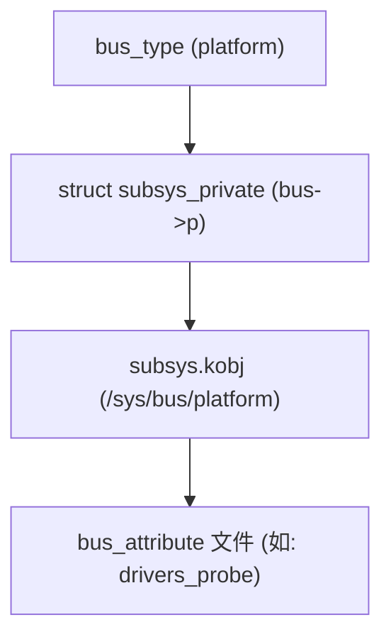

可以看到：

- 总线属性文件挂载在 `bus->p->subsys.kobj`；
- 所以所有 `bus_create_file()` 创建的文件都位于 `/sys/bus/<bus_name>/`；
- 而非 `/sys/bus/<bus_name>/drivers/` 或 `/sys/bus/<bus_name>/devices/`。

------

### 5.10.7_示例_为_platform_总线添加属性文件

下面通过示例演示如何为 platform 总线添加自定义属性：

```c
#include <linux/init.h>
#include <linux/module.h>
#include <linux/device.h>

static ssize_t version_show(struct bus_type *bus,
                            struct bus_attribute *attr, char *buf)
{
    return sysfs_emit(buf, "Platform Bus Version: 1.0\n");
}

static BUS_ATTR_RO(version);

static int __init bus_demo_init(void)
{
    int ret;
    ret = bus_create_file(&platform_bus_type, &bus_attr_version);
    if (ret)
        pr_err("Failed to create bus attribute\n");
    return ret;
}

static void __exit bus_demo_exit(void)
{
    bus_remove_file(&platform_bus_type, &bus_attr_version);
}

module_init(bus_demo_init);
module_exit(bus_demo_exit);
MODULE_LICENSE("GPL");
```

加载模块后，你将看到：

```
/sys/bus/platform/version
```

执行命令：

```bash
cat /sys/bus/platform/version
Platform Bus Version: 1.0
```

------

### 5.10.8_bus_属性的_show()/store()_调用流程

```text
sysfs_kf_read()
  ↓
sysfs_attr_show()
  ↓
bus_attr_show()
  ↓
attr->show(bus, attr, buf)
```

函数定义（drivers/base/bus.c）：

```c
static ssize_t bus_attr_show(struct kobject *kobj, struct attribute *attr, char *buf)
{
    struct bus_attribute *battr = to_bus_attr(attr);
    struct bus_type *bus = to_bus(kobj);
    if (battr->show)
        return battr->show(bus, battr, buf);
    return -EIO;
}
```

> 可见 sysfs 自动根据访问路径解析出 bus 对象 → 再找到对应 bus_attribute → 调用 show/store。

------

### 5.10.9_subsys_private_与_bus_attribute_的关系

要理解 `bus_attribute` 的文件为何能自动出现在 `/sys/bus/<bus_name>/` 下，
 关键在于结构体 `struct subsys_private` —— 它是所有 **bus/class** 对象在 sysfs 层级中的统一容器。

定义位置：`drivers/base/base.h`

```c
struct subsys_private {
	struct kset subsys;          // 表示 /sys/bus/<name> 目录的集合
	struct kset *devices_kset;   // /sys/bus/<name>/devices
	struct kset *drivers_kset;   // /sys/bus/<name>/drivers
	struct kobject *devices_kobj; // 对应 devices 子目录
	struct kobject *drivers_kobj; // 对应 drivers 子目录
	struct bus_type *bus;        // 回指 bus_type
	struct class *class;         // 若该 subsys 属于 class，则此字段有效
};
```

✅ **关系说明：**

| 对象                  | 说明                                  |
| --------------------- | ------------------------------------- |
| `bus_type`            | 描述一条总线（如 platform、i2c、spi） |
| `subsys_private`      | 总线在 sysfs 中的私有封装结构         |
| `bus->p`              | 指向该结构体的实例                    |
| `bus->p->subsys.kobj` | 对应 `/sys/bus/<bus_name>/` 目录      |

所以当我们调用：

```c
bus_create_file(&platform_bus_type, &bus_attr_version);
```

实际上等价于：

```c
sysfs_create_file(&platform_bus_type.p->subsys.kobj, &bus_attr_version.attr);
```

> 这解释了为何不需要开发者手动指定 sysfs 路径。
>  只要 bus 已注册，`bus_create_file()` 就能自动在正确路径创建文件。

------

### 5.10.10_subsys_system_register()_与_bus_register()_的关系

当我们调用 `bus_register()` 注册一条总线时，
 内部会自动执行 `subsys_system_register()`，用于创建 sysfs 层级结构。

**源码流程（drivers/base/bus.c）**

```c
int bus_register(struct bus_type *bus)
{
	int retval;
	struct subsys_private *priv;

	priv = kzalloc(sizeof(*priv), GFP_KERNEL);
	bus->p = priv;
	priv->bus = bus;

	retval = kset_register(&priv->subsys);          // 创建 /sys/bus/<bus_name>/
	priv->devices_kset = kset_create_and_add("devices", NULL, &priv->subsys.kobj);
	priv->drivers_kset = kset_create_and_add("drivers", NULL, &priv->subsys.kobj);

	retval = bus_create_file(bus, &bus_attr_uevent); // 创建默认属性 uevent
	...
}
```

**可视化流程图**

```mermaid
flowchart TD
    A["bus_register()"] --> B["kset_register(&priv->subsys)"]
    B --> C["/sys/bus/<bus_name>/"]
    C --> D["bus_create_file(&bus_attr_uevent)"]
    D --> E["/sys/bus/<bus_name>/uevent"]
```

说明：

- 每条总线在注册时都会自动创建 `/sys/bus/<bus_name>/`；
- 同时自动添加两个子目录：
  - `/sys/bus/<bus_name>/devices/`
  - `/sys/bus/<bus_name>/drivers/`
- 默认的 `uevent` 文件也是通过 `bus_create_file()` 自动添加的。

------

### 5.10.11_sysfs_层级结构可视化

以 platform 总线为例，加载系统后：

```
/sys/bus/platform/
├── devices/
│   ├── soc
│   ├── leds
│   └── ...
├── drivers/
│   ├── led_driver
│   └── ...
├── drivers_probe
├── drivers_autoprobe
└── uevent
```

这些文件来源如下：

| 文件                       | 来源函数                           | 说明                 |
| -------------------------- | ---------------------------------- | -------------------- |
| `uevent`                   | `bus_create_file()` (核心默认属性) | 控制 uevent 广播     |
| `drivers_probe`            | `bus_attr_drivers_probe`           | 允许手动触发驱动匹配 |
| `drivers_autoprobe`        | `bus_attr_drivers_autoprobe`       | 控制自动匹配行为     |
| 自定义属性（如 `version`） | `bus_create_file()` (用户定义)     | 自定义信息或调试接口 |

------

✅ **结构体层级总览图**

```mermaid
graph TD
    A["struct bus_type (platform)"] --> B["struct subsys_private (bus->p)"]
    B --> C["subsys.kobj → /sys/bus/platform"]
    C --> D["devices_kset → /sys/bus/platform/devices"]
    C --> E["drivers_kset → /sys/bus/platform/drivers"]
    C --> F["bus_attribute 文件 → uevent, drivers_probe, version"]
```

------

### 5.10.12_调试与验证

| 操作目标          | 命令示例                                           | 说明                             |
| ----------------- | -------------------------------------------------- | -------------------------------- |
| 查看 bus 文件结构 | `ls /sys/bus/platform/`                            | 列出所有总线属性文件             |
| 读取默认属性      | `cat /sys/bus/platform/uevent`                     | 显示自动生成文件内容             |
| 读取自定义属性    | `cat /sys/bus/platform/version`                    | 输出 `Platform Bus Version: 1.0` |
| 追踪属性注册      | `grep -rn bus_create_file drivers/base/bus.c`      | 确认属性创建逻辑                 |
| 查看注册流程      | `grep -rn subsys_system_register drivers/base/`    | 确认 sysfs 初始化调用链          |
| 内核调试          | `echo 1 > /sys/bus/platform/drivers_autoprobe`     | 启用/禁用自动探测                |
| 删除属性验证      | `rmmod bus_demo.ko` 后再次 `ls /sys/bus/platform/` | 验证属性文件是否消失             |

------

### 5.10.13_小结_bus_attribute_的语义与应用场景

| 属性类型     | 结构体              | 注册函数                | sysfs 路径                 | 应用场景                   |
| ------------ | ------------------- | ----------------------- | -------------------------- | -------------------------- |
| 设备属性     | `device_attribute`  | `device_create_file()`  | `/sys/class/.../device`    | 设备实例参数               |
| 类属性       | `class_attribute`   | `class_create_file()`   | `/sys/class/...`           | 类别全局属性               |
| 驱动属性     | `driver_attribute`  | `driver_create_file()`  | `/sys/bus/.../drivers/...` | 驱动模块级参数             |
| **总线属性** | **`bus_attribute`** | **`bus_create_file()`** | **`/sys/bus/<bus_name>/`** | **总线全局控制或调试接口** |

> **总结要点：**
>
> - 总线属性文件（bus_attribute）作用于整个总线；
> - 文件挂载于 `/sys/bus/<bus_name>/`；
> - 内部通过 `bus->p->subsys.kobj` 实现；
> - 总线注册时会自动创建默认属性（如 `uevent`、`drivers_probe`）；
> - 用户可通过 `bus_create_file()` 自定义属性实现调试与配置。

