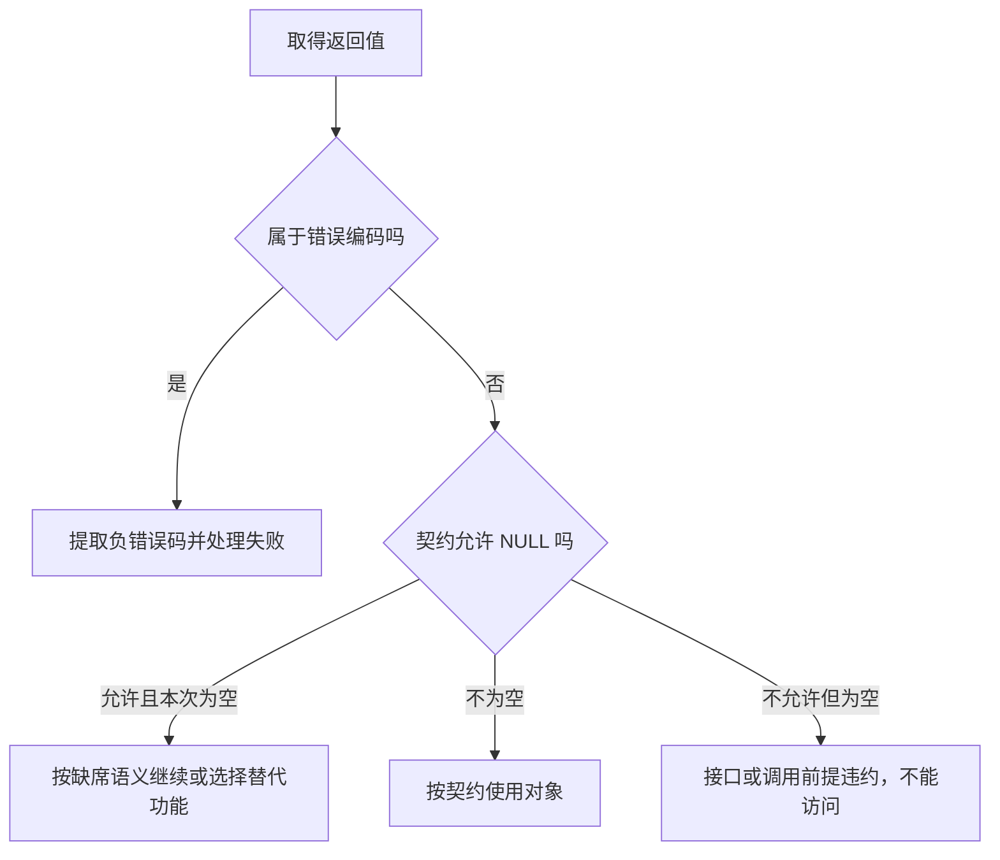

# 第2章\_错误值的编码与判定

[上一章](错误指针机制简介.md)已经把成功对象与失败原因分开。现在还有一个疑问：一个变量的类型明明是指针，检查函数如何知道它装的是错误码？本章先建立有限位宽整数模型，再解释接口的适用范围。我们只观察值，不尝试访问错误指针对应的地址。

## 2.1\_从负数走到无符号数的顶端

先用一个容易算的小模型：8 位无符号数有 256 种表示，范围为 0～255。把 -1 转成这一宽度的无符号整数，结果是 255；把 -2 转换，结果是 254。整数到无符号整数的转换按模 256 处理，不是把负号直接删掉。

扩大到 w 位，负错误码 -e 对应的无符号数值是 `2^w - e`。Linux 6.12.20 的 `MAX_ERRNO` 是错误编码范围上限，值为 4095；检测阈值对应 -4095。因此被识别的数值是最上面的 **4095 个值**，包括 -4095 和 -1，排除 -4096 与 0。

| 整数输入 | 32 位无符号表示 | 64 位无符号表示 | 是否落入错误区间 |
| --- | --- | --- | --- |
| -4096 | `0xfffff000` | `0xfffffffffffff000` | 否 |
| -4095 | `0xfffff001` | `0xfffffffffffff001` | 是 |
| -22 | `0xffffffea` | `0xffffffffffffffea` | 是 |
| -1 | `0xffffffff` | `0xffffffffffffffff` | 是 |
| 0 | `0x00000000` | `0x0000000000000000` | 否 |

这张表比较的是编码宽度，不是两种体系结构的完整内存地图。不能从它推出“其余值都是内核地址”，也不能推断整片顶端页一定没有映射。4095 是协议边界，不表示内核已经为每个数字都定义了错误名称。

## 2.2\_亲自检查阈值两侧

下面的 C11 程序只做整数运算，显式选择 32 或 64 位，不依赖宿主的指针大小。stdint.h 提供固定宽度整数及 UINT32_MAX/UINT64_MAX 上界；mask 是 w 个二进制 1，用按位与取出 w 位表示。inttypes.h 的 PRIx64 为 uint64_t 提供十六进制打印格式，显示宽度为 width / 4。64 位掩码直接使用最大值，不能通过左移 64 位构造。

保存为 `encoding_model.c`，或取用[材料文件](../../../../labs/kernel/error_pointer/materials/encoding_model.c)：

```c
/* 只模拟整数编码，不创建或解引用任何指针。 */
#include <assert.h>
#include <inttypes.h>
#include <stdint.h>
#include <stdio.h>

int main(void)
{
    const int errors[] = { -4096, -4095, -517, -22, -1, 0, 22 };
    const unsigned int widths[] = { 32, 64 };
    size_t sample, index;

    for (sample = 0; sample < sizeof(widths) / sizeof(widths[0]); ++sample) {
        unsigned int width = widths[sample];
        /* 不执行 1ULL << 64，避免移位数等于类型宽度。 */
        uint64_t mask = width == 32 ? UINT32_MAX : UINT64_MAX;
        uint64_t threshold = (uint64_t)(int64_t)-4095 & mask;
        int error;

        printf("width=%u\n", width);
        for (index = 0; index < sizeof(errors) / sizeof(errors[0]); ++index) {
            uint64_t encoded = (uint64_t)(int64_t)errors[index] & mask;
            printf("input=%5d value=0x%0*" PRIx64 " error=%d\n",
                   errors[index], (int)(width / 4), encoded,
                   encoded >= threshold);
        }
        for (error = -4095; error < 0; ++error) {
            uint64_t encoded = (uint64_t)(int64_t)error & mask;
            /* 差值只有 0 到 4094，不把超范围无符号数强转成有符号数。 */
            int64_t decoded = -(int64_t)(mask - encoded) - 1;
            assert(encoded >= threshold);
            assert(decoded == error);
        }
    }
    return 0;
}
```

```bash
cc -std=c11 -Wall -Wextra -Werror -pedantic encoding_model.c -o encoding_model
./encoding_model
```

负数先转换到 int64_t，再转换为 uint64_t，按无符号转换规则得到 64 位模数表示；32 位模型随后取低 32 位。还原时先算 mask-encoded，再取负并减一，避免依赖超范围无符号数转有符号数的实现定义结果。整个过程没有把整数当作可访问指针。

每种宽度各输出七个输入，`error` 一列依次是 `0、1、1、1、1、0、0`。先预测 -517 的编码，再运行核对；它的 32 位结果是 `0xfffffdfb`。程序末尾的断言对每种宽度逐个验证 4095 个允许值，而不是只验证刚才挑出的几个例子。

如果把输入改为正的 22，程序得到一个很小的正数，检查为假。这与常见错误 `ERR_PTR(EINVAL)` 的问题相同：接口不替你补负号，失败会被误当成非错误值。把 -4096 传给编码函数也不会自动修正范围；它只是产生一个检测函数不识别的值。

## 2.3\_整数模型怎样落到内核接口

固定版本的定义位于 `include/linux/err.h`。`IS_ERR_VALUE` 是宏；`ERR_PTR`、`PTR_ERR`、`IS_ERR` 等核心接口是静态内联函数，不能笼统称为全部是宏。它们没有背后的错误对象分配器，也没有名为 `lib/err.c` 的指针转换实现文件。

在目标内核采用的编译器和数据模型下，`ERR_PTR` 把 `long` 转成指针，`PTR_ERR` 转回 `long`，`IS_ERR` 按无符号表示与阈值比较。应用代码应把编码当成不透明约定，使用接口而不是手写高地址常量。普通 ISO C 不保证这种整数与指针互转在任意平台都具有 Linux 所需的语义；尤其不能把 Windows 的 64 位指针与 32 位 long 模型当作 Linux 64 位内核模型来测试。

`unlikely` 是分支倾向提示，不会在运行时验证错误是否罕见，也不会消除比较与分支。静态内联有利于编译器合并调用，但具体指令取决于目标、优化和上下文；“无额外对象分配”可以由实现证明，“永远零开销”则不能。

源码入口见[固定版本阅读索引](../../../../research/source_reading/error_pointer/navigation/P01_Linux_6.12_错误指针源码阅读索引.md#1.2_按问题进入源码)，对应唯一实现见[区间识别](../../../../research/source_reading/error_pointer/source_explanations/P01_err.h_错误值编码与检查.md#1.3_区间识别与空值组合)。这里的整数模型既不验证页表，也不验证目标编译器的全部指针规则。

## 2.4\_检查为假\_只排除了一种表示

设想一个已经释放的对象地址。它的数值通常仍和释放前一样，`IS_ERR` 没有读取分配器状态，不可能因为释放动作自动改变判断。空指针、未初始化指针、偏移错误的地址也不是它要全面识别的对象。未初始化值本身不可拿来做合法的检查实验。

因此，`IS_ERR(ptr) == false` 的结论只到“不是约定的错误编码”为止。要访问对象，还需要接口保证返回非空对象、对象仍存活、当前路径拥有访问权。页故障或内核崩溃是误用后可能出现的后果，不是错误指针提供的安全保证。

`IS_ERR_OR_NULL` 把错误编码与 NULL 合并为真，只适合后续动作确实可以合并的场景。例如清理一个可能未取得的句柄时，可以先排除两者。但若 NULL 表示可选资源缺席，而错误指针表示申请失败，合并后直接退出就可能跳过仍需执行的初始化。



图中的第二次判断来自具体接口契约，不是要求所有指针都固定写两次判断。已经承诺“对象或错误指针”的接口，成功分支的对象保证由该接口负责。

## 2.5\_两个便利接口的隐藏前提

`PTR_ERR_OR_ZERO` 是“错误编码转错误码，其余值转 0”的便利函数。它对 NULL 返回 0，所以不能拿它替代 `kzalloc` 的失败检查；也不能在完整初始化尚未结束时，取得第一个资源便立刻用它返回成功。

`ERR_CAST` 表达“把已确认的错误值传给另一种指针返回类型”。它保留表示，不把一种成功对象转换成另一种结构体，也不执行检查。下面是自定义包装函数的局部片段，`get_channel` 已约定返回通道对象或错误指针：

```c
channel = get_channel();
if (IS_ERR(channel))
    return ERR_CAST(channel);  /* 当前包装函数也返回对象或错误指针。 */
/* 成功时必须真正建立另一类对象，不能强转 channel 冒充它。 */
```

如果包装函数返回整数，则应使用 `PTR_ERR`；若成功获得了需要手动释放的对象，还得先保存它或完成使用与释放，不能通过 `PTR_ERR_OR_ZERO` 把唯一句柄丢掉。接口选择跟着返回类型和所有权走，不跟着代码行数走。

## 2.6\_回顾与练习

错误编码把 -4095～-1 映到无符号表示顶端。检测函数识别值的类别，既不探测内存，也不自动完成控制流和生命周期操作。

1. 为什么 -4096 检测为假，却不能写成“有效对象指针”？
2. 一个必须成功分配内存的函数写 `return PTR_ERR_OR_ZERO(buffer)`，其中 buffer 来自非零大小的 `kzalloc`。分配失败时它返回什么？
3. 能否用 `ERR_CAST` 把成功的 `struct device *` 当成 `struct platform_device *`？
4. 把上限改为 8191，哪些内容要共同检查？只改检查宏是否足够？

**解答：** 第一题只排除了错误编码，未建立任何对象。第二题 NULL 得到 0，恰好把失败说成成功，应按该分配接口的 NULL 契约返回负的内存不足错误。第三题不能，包含关系或类型转换另有专门规则，错误值转型不证明对象布局。第四题必须同时检查编码与还原、体系结构可用值约定、所有调用方的范围假设和语言桥接；单改阈值会让原本不同类别的值被重新解释，不是一个局部优化。

下一篇：[资源失败与驱动回滚](P03_资源失败与驱动回滚.md)。返回[专题大纲](大纲.md)。
