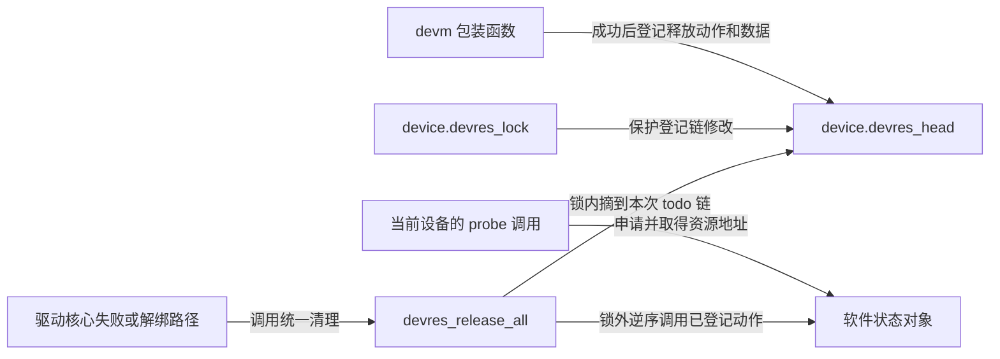
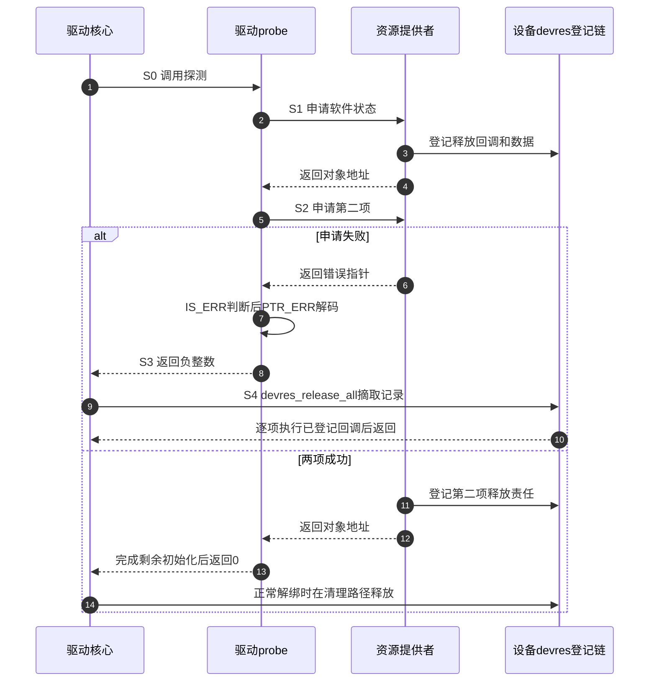

# 第3章\_资源失败与驱动回滚

[上一章](P02_错误值的编码与判定.md)说明了检查一个返回值能证明什么。现在把查找换成真实驱动的初始化：先分配一块软件状态，再取得一个可选控制信号，最后让设备投入服务。如果第二步失败，错误码可以告诉上层原因，但第一步的内存不会因此自行消失。

本章要分别回答两个问题：本次调用返回了什么，以及之前成功取得的资源由谁撤销。先理解一次普通调用的局部结果，再把它放进驱动核心的探测过程；暂不展开 GPIO 电气控制、时钟树和设备匹配算法。

## 3.1\_可选资源需要三个分支

GPIO（General Purpose Input/Output，通用输入输出）是可被软件配置和读写的信号线。驱动拿到的是描述符对象，不是直接把引脚电压装进指针。假设某个设备可以有复位信号，也允许硬件完全不配置它；这时“没有配置复位线”与“配置了，但对应控制器尚未就绪”不能混为一谈。

在固定版本启用 GPIO 框架的路径中，`devm_gpiod_get_optional` 返回描述符、NULL 或错误指针。NULL 表示没有给该功能分配 GPIO；其他申请错误仍保留为错误指针。这里 `devm_` 表示资源受设备管理，`optional` 表示缺席的接口语义，两个词描述的是不同维度。

下面是驱动探测函数中的片段。`GPIOD_ASIS` 表示取得描述符时保持现有方向设置；片段只保存句柄，不操作硬件。`dev_err_probe` 是报告探测失败并返回整数错误码的帮助函数。

```c
state->reset = devm_gpiod_get_optional(dev, "reset", GPIOD_ASIS);
if (IS_ERR(state->reset))
    return dev_err_probe(dev, PTR_ERR(state->reset), "get reset line\n");

if (!state->reset)
    dev_info(dev, "reset line absent, using no-reset mode\n");

/* NULL 分支也必须继续执行剩下的软件初始化。 */
```

如果改成 `if (IS_ERR_OR_NULL(state->reset)) return PTR_ERR(state->reset)`，NULL 会变成整数 0，函数提前宣告探测成功，后面的初始化却没做。这不是检查不够强，而是合并了两种本来要求不同控制流的状态。

同名后缀也不代表跨子系统通用规则。时钟（clock）为设备提供运行节拍；固定版本的可选时钟接口把未找到生产者的 `-ENOENT` 转成 NULL。稳压器（regulator）管理供电约束与引用；可选稳压器缺席通常以 `-ENODEV` 错误指针表示，不因名字带 optional 就返回 NULL。只有设备本身确实允许无此供电句柄时，调用者才把这一特定错误当成缺席；仍需传播其他错误。

## 3.2\_取得句柄与启用功能是两步

取得时钟句柄并不自动让时钟开始输出，取得稳压器句柄也不等于供电已经成功使能。后续的启用接口常返回整数状态，失败时不能再拿 `IS_ERR` 检查。若启用成功，就产生新的配对责任，例如稍后停用，而不仅是归还句柄。

引脚控制（pinctrl）决定引脚复用及配置。取得控制器句柄、查找命名配置状态和选择该状态同样是不同动作：前两步可以返回对象或错误指针，状态选择返回整数。两线串行总线 I²C（Inter-Integrated Circuit）中的客户端对象代表某个总线地址上的设备；创建软件对象也不证明物理器件已经响应。

| 当前操作与固定版本接口 | 返回契约与下一步责任 |
| --- | --- |
| `devm_kzalloc`，非零大小内存分配 | 对象或 NULL；失败判断 `!ptr`，成功的设备管理内存不能再任意 `kfree` |
| `devm_gpiod_get` / `devm_gpiod_get_optional` | 必需接口失败为错误指针；可选接口另允许缺席为 NULL；成功句柄的释放已登记 |
| `devm_clk_get` / `devm_clk_get_optional` | 检查错误编码；可选缺席语义及未启用时钟支持的桩函数需按配置判断；取得句柄不等于执行 `clk_prepare_enable` |
| `devm_regulator_get_optional` | 对象或错误指针；不可照搬 GPIO 的空值分支；`regulator_enable` 的整数结果另查 |
| `devm_pinctrl_get`、`pinctrl_lookup_state`、`pinctrl_select_state` | 依次为句柄、配置对象、整数操作结果；每一步单独检查 |
| `i2c_new_client_device` / `devm_i2c_new_dummy_device` | 前者创建客户端，后者创建受管理的占位客户端；返回错误指针表示失败；不是一个叫 `devm_i2c_new_device` 的通用接口 |

这张表整理的是已经区分的动作，不是“照着名称猜错误码”的捷径。未启用 GPIO 框架时，可选获取的头文件桩函数可直接返回 NULL；这只能说明软件配置下没有句柄，不能证明板上没有那根线。时钟支持关闭的路径也有不同桩行为。移植时需要同时查接口说明和目标配置。

## 3.3\_devres保存的是释放责任

手工方案并不难理解：第一项成功后申请第二项，第二项失败就逆序释放第一项。资源多起来，每个失败出口都要正确对应此前完成的步骤，漏一个会泄漏，重复一个可能二次释放。

设备资源管理 **devres（device resource management）** 把这份责任登记在设备上。`struct device` 是设备模型中的对象；它的 `devres_head` 链表连接登记记录，`devres_lock` 保护记录链的修改。记录包含释放回调和它需要的数据。内存对象与“怎样释放它”的记录相关，但返回给调用者的资源地址不等于链表节点地址。



返回值的检查不在这张链表里：`IS_ERR` 不知道当前设备是谁，也不查询 `devres_head`。某个 `devm_` 调用失败，可以只清理它自己尚未完成的申请，然后把状态还给驱动；驱动如果选择恢复并继续，之前登记的资源仍在。只有实际走入相应的框架清理路径，登记动作才会执行。

例如 GPIO 包装函数先取得描述符，再为释放记录分配内存。如果第二步失败，它先归还刚取得的描述符，再返回内存不足的错误指针；它不能把“半个成功对象”留给调用者。相反，`devm_kzalloc` 失败返回 NULL，但成功时同样会登记释放。这两个例子足以说明：**资源管理不依赖所有接口采用同一种失败表示**。

## 3.4\_沿一次失败走完S0到S4

驱动的 `probe` 是设备匹配后尝试建立运行状态的回调，约定成功返回 0、失败返回负整数。一次调用中的返回值、设备绑定状态、资源登记链是三组相关但独立的状态，不能用“一个错误对象在各层流动”概括。

这里选“软件状态成功，第二项申请失败”作为一个周期。表中 S0～S4 只标记本次推演的阶段，不是内核枚举常量。

| 阶段 | 谁修改了什么，下一步由谁读取 |
| --- | --- |
| S0 开始探测 | 驱动核心选定设备并调用 probe；本次驱动还没有取得自己的资源 |
| S1 第一项成功 | devm 分配软件状态，释放记录进入该设备的 `devres_head`；probe 的局部变量保存对象地址 |
| S2 第二项失败 | 提供者返回错误指针，只交出失败值，没有把失败对象加入成功资源集合；probe 在本地检查并解码 |
| S3 返回失败 | probe 把负整数交给调用它的驱动核心；该返回动作没有直接遍历资源链 |
| S4 框架清理 | 核心走失败路径，devres 把记录摘至本次清理用的局部链，锁外逆序执行释放动作；调用栈完成本次失败尝试 |



这里没有一个后台线程因看到错误指针而自动接管清理，也没有错误广播。当前探测路径通过函数返回传递状态，通过明确调用释放函数完成同步清理。记录链的锁解决其内部结构访问，不替驱动证明异步工作已经停止。若驱动已启动工作队列、定时器或硬件传输，必须安排停机与等待，使释放对象前不再有人访问。

devres 也不能撤销任何外部效果。已经发送给设备的命令、已经写出的数据，只有明确的恢复动作才能处理。把软件资源逆序释放称作“数据库式全有或全无事务”会掩盖这些差别。

## 3.5\_延迟探测与错误码的版本边界

依赖资源的提供者可能稍后才出现。`EPROBE_DEFER` 是内核内部表示“本次探测需推迟”的错误码，固定版本取值 517；资源接口可返回对应错误指针，probe 必须解码为 `-EPROBE_DEFER`。本次探测仍未成功，已登记资源仍需按失败路径处理，不能保留半初始化对象等下一次直接续跑。

固定版本 `drivers/base/dd.c` 的 `really_probe` 会把来自 probe 的错误在内部转换为正数，用以区分其他核心错误；驱动核心随后同时识别正、负的延迟探测状态。因此 **驱动回调的负整数契约** 和 **内部包装层的返回约定** 必须分开。不能据此让驱动自己返回正的 517，也不能说所有层始终原样传播。注册驱动成功也不代表每个匹配设备都已探测成功。

`dev_err_probe` 返回传入的错误码，并按原因选择日志路径。在本次固定源码中，延迟探测记录原因并走调试日志，内存不足分支不再重复打印，其他分支输出错误。是否看见日志还取决于配置、等级和实际路径；错误指针本身不会生成日志或 sysfs 属性。

本节的版本入口见[源码索引](../../../../research/source_reading/error_pointer/navigation/P01_Linux_6.12_错误指针源码阅读索引.md#1.2_按问题进入源码)和[返回与清理模块导读](../../../../research/source_reading/error_pointer/navigation/P02_返回值与清理路径导读.md#2.3_跟随驱动失败而不混用返回类型)。延迟重试的调度细节不属于编码机制；本章只要求保留错误原因并遵守完整重试的资源边界。

## 3.6\_回顾与练习

我们已经能独立画出两条线：返回值告诉调用者这次取得了什么，资源登记告诉框架将来需要释放什么。下一章用一个没有真实硬件的完整模块，把这两条线放进同一次实验。

1. 可选 GPIO 返回 NULL 后是否应该立即返回成功？如果还有设备注册工作未做呢？
2. 第一项 devm 内存成功，第二项错误指针失败，但驱动选择了替代方案继续运行。第一项会立刻被回收吗？
3. 取得时钟句柄后启用失败，为什么不能简单地再用 `IS_ERR(clk)` 判断这次结果？
4. 一段代码把所有资源错误都改成 `-EINVAL`，会损失什么？

**解答：** 第一题应进入无复位功能的剩余初始化，NULL 只说明该资源缺席。第二题不会因返回了一个错误值就立即清理，释放取决于明确清理路径。第三题 clk 描述上一次获取结果，启用动作有自己的整数返回值，应判断它；若启用成功还需登记或手动执行停用责任。第四题会丢失具体原因，尤其把延迟探测变成普通参数失败，使框架无法按原有原因处理；日志也会指向错误方向。

上一篇：[错误值的编码与判定](P02_错误值的编码与判定.md)。

下一篇：[观察返回值与释放顺序](P04_观察返回值与释放顺序.md)。返回[专题大纲](大纲.md)。
