# 第1章_错误指针机制概述与设计哲学

## 1.1_章节内容说明

本章是 **错误指针机制（Error Pointer System）** 模块的开篇章节，旨在引导读者理解为什么 Linux 内核要引入 `ERR_PTR()` / `PTR_ERR()` / `IS_ERR()` 这套独特的错误返回体系。

我们将从错误返回问题的历史、内核设计哲学、核心宏定义和整体框架等层面进行系统说明，为后续章节（底层实现、内核交互、devres 结合）打下概念基础。

------

## 1.2_主题引入_内核错误处理的统一化问题

在早期 Linux 代码中，函数的错误返回方式极度不统一：

- 一部分函数返回 **负错误码**（如 `-EINVAL`, `-ENOMEM`）；
- 一部分返回 **NULL 指针** 表示失败；
- 一部分返回 **0/非0** 表示状态；
- 少数还通过“输出参数 + 返回码”传递结果。

这导致：

- 调用层需要区分函数类型；
- 错误信息难以链式传递；
- 驱动框架难以形成统一语义。

为了解决“**指针类型函数既要返回对象又要表达错误状态**”的问题，内核社区引入了一个极为优雅的机制——
 👉 **将错误码直接编码到指针值中**，
 从而让函数的返回值既能是“对象”，又能是“错误”。

------

## 1.3_设计哲学_错误即对象(Error_as_Object)

### 1.3.1_核心理念

> **“Error is a kind of object.”（错误也是对象）**

在 Linux 内核中，驱动开发普遍遵循“对象化”的思想：
 设备、驱动、内存、GPIO、时钟等资源都通过结构体对象（如 `struct device`、`struct gpio_desc`）进行管理。

那么当资源获取失败时，返回 NULL 并不足以表达 *错误的原因*。
 因此内核设计者决定：

> 让错误也具备“对象形态”——通过伪造一个高地址的指针值来承载错误码。

------

### 1.3.2_统一返回通道原则

内核要求：

- 所有函数只通过 `return` 传递结果；
- 不再额外引入“错误参数输出指针”；
- 函数签名保持简洁；
- 所有调用者都可用统一模式判断错误。

例如：

```c
struct gpio_desc *gpiod = devm_gpiod_get(dev, "reset", GPIOD_OUT_LOW);
if (IS_ERR(gpiod))
    return PTR_ERR(gpiod);
```

这段代码无需区分返回类型，只需：

- `IS_ERR()` 判断；
- `PTR_ERR()` 提取错误值；
- `ERR_PTR()` 封装错误。

形成了内核通用的“三元闭环”：

| 宏             | 作用              | 用途               |
| -------------- | ----------------- | ------------------ |
| `ERR_PTR(err)` | 错误码 → 指针     | 资源申请失败时返回 |
| `IS_ERR(ptr)`  | 指针 → 错误检测   | 调用层判断是否错误 |
| `PTR_ERR(ptr)` | 错误指针 → 错误码 | 提取错误号用于传播 |

------

### 1.3.3_哲学核心_语义透明_类型一致

该机制的关键价值在于：

- 指针类型函数的语义保持一致；
- 不增加参数；
- 错误传播路径可链式延续；
- 可被编译器优化为内联判断。

换句话说，它实现了 C 语言层面的一种“单通道异常系统”，无需类似 C++ 的 `throw` 机制，却能以零成本完成错误传递。

------

## 1.4_模块定位_lib_层的通用错误系统

### 1.4.1_文件归属

| 文件                                    | 功能                                         |
| --------------------------------------- | -------------------------------------------- |
| `include/linux/err.h`                   | 宏与内联函数定义（上层接口）                 |
| `lib/err.c`                             | 实现部分函数（如 `errname()`, `errseq_*()`） |
| `include/uapi/asm-generic/errno-base.h` | 错误码常量定义（`EINVAL`, `ENOMEM` 等）      |

这些文件属于 **内核基础库（lib/）**，并非某个驱动子系统的专属模块。
 它是所有内核子系统（GPIO、I2C、SPI、CLK、MMC、REGMAP、PM 等）的**统一错误基石**。

------

### 1.4.2_调用范围

下列子系统全部依赖该机制：

| 模块       | 示例接口                | 使用宏           |
| ---------- | ----------------------- | ---------------- |
| GPIO       | `devm_gpiod_get()`      | IS_ERR / PTR_ERR |
| CLK        | `clk_get()`             | IS_ERR / PTR_ERR |
| I2C        | `devm_i2c_new_device()` | IS_ERR / PTR_ERR |
| PINCTRL    | `devm_pinctrl_get()`    | IS_ERR_OR_NULL   |
| REGULATOR  | `devm_regulator_get()`  | PTR_ERR_OR_ZERO  |
| FILESYSTEM | `ERR_PTR(-ENOENT)`      | 错误路径返回     |

------

## 1.5_内核错误返回体系的演进思维

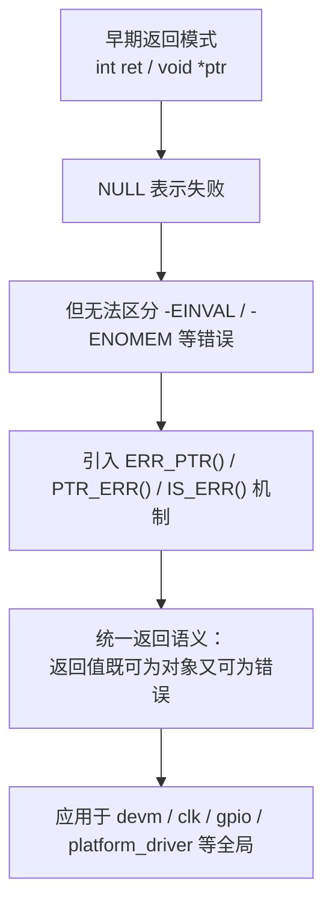

------

## 1.6_核心接口总览

### 1.6.1_头文件

```c
#include <linux/err.h>
```

### 1.6.2_主要宏定义

```c
#define MAX_ERRNO        4095
#define IS_ERR_VALUE(x)  unlikely((x) >= (unsigned long)-MAX_ERRNO)
#define ERR_PTR(err)     ((void *)((long)(err)))
#define PTR_ERR(ptr)     ((long)(ptr))
#define IS_ERR(ptr)      IS_ERR_VALUE((unsigned long)(ptr))
#define IS_ERR_OR_NULL(ptr) (!ptr || IS_ERR(ptr))
#define PTR_ERR_OR_ZERO(ptr) (IS_ERR(ptr) ? PTR_ERR(ptr) : 0)
```

------

### 1.6.3_接口语义汇总表

| 宏/函数                | 功能描述             | 返回类型     | 常用场景               |
| ---------------------- | -------------------- | ------------ | ---------------------- |
| `ERR_PTR(err)`         | 将错误码转为错误指针 | `void *`     | 在失败路径返回         |
| `PTR_ERR(ptr)`         | 从错误指针取出错误码 | `long`       | 上层错误传播           |
| `IS_ERR(ptr)`          | 判断是否为错误指针   | `bool`       | 通用检测               |
| `IS_ERR_OR_NULL(ptr)`  | 检测错误或空指针     | `bool`       | 兼容可选资源           |
| `PTR_ERR_OR_ZERO(ptr)` | 返回错误码或0        | `int`        | probe 函数返回         |
| `ERR_CAST(ptr)`        | 转换类型但保留错误   | 通用类型转换 | 不同对象类型转换时使用 |

------

## 1.7_典型示例_GPIO_资源获取

```c
struct gpio_desc *reset_gpio;

reset_gpio = devm_gpiod_get_optional(&pdev->dev, "reset", GPIOD_OUT_LOW);
if (IS_ERR(reset_gpio))
    return PTR_ERR(reset_gpio);

if (reset_gpio)
    gpiod_set_value(reset_gpio, 1);
```

**行为说明：**

- 若设备树中定义了 `reset-gpios` → 返回有效指针；
- 若未定义 → 返回 NULL；
- 若解析失败 → 返回 `ERR_PTR(-ENOENT)`；
- 上层无需多重判断，逻辑自然流畅。

------

## 1.8_小结

| 项目     | 内容                                           |
| -------- | ---------------------------------------------- |
| 模块名称 | Linux 内核错误指针机制（Error Pointer System） |
| 文件路径 | `include/linux/err.h`, `lib/err.c`             |
| 主要用途 | 为指针类型函数提供统一错误表达机制             |
| 核心宏   | ERR_PTR, PTR_ERR, IS_ERR, IS_ERR_OR_NULL       |
| 设计哲学 | 错误即对象（Error as Object）                  |
| 应用场景 | 驱动框架、资源管理、子系统接口返回             |
| 优点     | 单返回通道、类型统一、代码简洁、性能可优化     |
| 缺点     | 初学者不易理解，错误指针误用会导致内核崩溃     |


------

# 第2章_错误指针的底层实现与内核映射区间

## 2.1_章节内容说明

本章从底层实现角度分析错误指针机制的结构基础与数值布局，重点讲解：

- 错误指针值与错误码的映射关系；
- `MAX_ERRNO` 与地址空间安全区设计；
- 64位与32位架构差异；
- `IS_ERR_VALUE()` 宏的数学判断逻辑；
- 错误指针机制如何避免与有效内核对象指针冲突。

通过本章，读者将掌握错误指针的“地址级工作原理”，理解它为何安全且通用。

------

## 2.2_错误值体系_MAX_ERRNO_与_errno_映射

### 2.2.1_错误码定义

内核错误码统一定义在：

```c
include/uapi/asm-generic/errno-base.h
```

常见定义如下：

```c
#define EPERM           1   /* Operation not permitted */
#define ENOENT          2   /* No such file or directory */
#define EINVAL          22  /* Invalid argument */
#define ENOMEM          12  /* Out of memory */
#define EBUSY           16  /* Device or resource busy */
```

在内核中使用时，一般取其负数形式：

| 错误码常量 | 值   | 语义       |
| ---------- | ---- | ---------- |
| `-EINVAL`  | -22  | 参数非法   |
| `-ENOMEM`  | -12  | 内存不足   |
| `-ENOENT`  | -2   | 资源不存在 |
| `-EBUSY`   | -16  | 资源被占用 |

------

### 2.2.2_最大错误码限制

内核定义：

```c
#define MAX_ERRNO 4095
```

原因在于：

- Linux 错误码范围固定为 1~4095；
- 这 4095 个负值均可映射为错误指针；
- 超出范围的高位指针可能与真实内核指针重叠，需避免。

因此，错误指针区间只允许覆盖 **地址空间的最顶端 4KB 区域**。

------

## 2.3_错误指针的数值布局

### 2.3.1_错误码_to_错误指针映射公式

```c
#define ERR_PTR(err) ((void *)((long)(err)))
```

示例：

| 错误码          | 转换指针值（64 位） | 说明     |
| --------------- | ------------------- | -------- |
| `-ENOMEM` (-12) | 0xfffffffffffffff4  | 错误指针 |
| `-EINVAL` (-22) | 0xffffffffffffffeA  | 错误指针 |
| `-ENOENT` (-2)  | 0xfffffffffffffffe  | 错误指针 |
| `-EBUSY` (-16)  | 0xfffffffffffffff0  | 错误指针 |

可见：
 所有错误指针都位于高地址段（0xfffffffffffff000 ~ 0xffffffffffffffff）。

------

### 2.3.2_有效指针与错误指针分区图


> - 用户空间：0x0000000000000000 ~ 0x00007fff_ffffffff
> - 内核空间：0xffff8000_00000000 ~ 0xffff_ffffffffffff
> - **错误指针区**：位于顶端约 0xffff_fffffffff001 ~ 0xffff_ffffffffffff

------

## 2.4_错误检测宏_IS_ERR_VALUE()

定义如下：

```c
#define IS_ERR_VALUE(x) \
	unlikely((unsigned long)(x) >= (unsigned long)-MAX_ERRNO)
```

### 2.4.1_逻辑分析

- `-MAX_ERRNO` 的补码表示为一个非常大的正数（高地址区域）。
- 若指针值大于或等于该值，则表示它处于错误区间。

公式化解释：

| 表达式                      | 含义                                           |
| --------------------------- | ---------------------------------------------- |
| `(unsigned long)(x)`        | 将指针视为无符号地址数值                       |
| `(unsigned long)-MAX_ERRNO` | 错误区起始地址（高位起点）                     |
| `>=`                        | 判断指针是否处于错误区间                       |
| `unlikely()`                | 提示编译器该条件为不常见分支，用于优化分支预测 |

------

### 2.4.2_判断实例(64位)

假设：

```c
MAX_ERRNO = 4095
(unsigned long)-MAX_ERRNO = 0xfffffffffffff001
```

那么：

| 指针值             | 判断结果 | 含义      |
| ------------------ | -------- | --------- |
| 0xfffffffffffffff0 | True     | 错误指针  |
| 0xfffffffffffff000 | False    | 有效指针  |
| 0x0000000000000000 | False    | NULL 指针 |

------

## 2.5_64_位与_32_位架构差异

| 架构  | 地址空间           | 错误指针区间                                | 安全性             |
| ----- | ------------------ | ------------------------------------------- | ------------------ |
| 64 位 | 0xffffffffffffffff | `0xfffffffffffff001` ~ `0xffffffffffffffff` | 极高（保留顶端页） |
| 32 位 | 0xffffffff         | `0xfffff001` ~ `0xffffffff`                 | 较高（仍安全）     |

说明：

- 两者都保证不会与 kmalloc、vmalloc 等合法地址冲突；
- 因为分配器不会分配到这些高端页；
- 错误指针区通常位于不可访问区（页表未映射）。

------

## 2.6_安全设计原理

### 2.6.1_物理隔离

内核虚拟地址空间不会分配到高位 `0xfffffffffffff***` 区间，因此即使解引用错误指针，也会触发：

```
BUG: unable to handle kernel paging request at fffffffffffffff0
```

这在调试时能直接定位错误来源。

------

### 2.6.2_逻辑隔离

错误指针值不与 NULL 冲突，因为 NULL 为 0x0，错误指针为负偏移后的高位区。
 它们可独立判断，逻辑安全：

| 条件         | 检测逻辑                   |
| ------------ | -------------------------- |
| 空指针       | `if (!ptr)`                |
| 错误指针     | `if (IS_ERR(ptr))`         |
| 任意非法情况 | `if (IS_ERR_OR_NULL(ptr))` |

------

### 2.6.3_与_CPU_架构无关性

无论在：

- x86_64,
- ARMv8-A,
- RISC-V,
- MIPS,

错误指针区均不会映射，因此机制可跨架构稳定工作。这是 `include/asm-generic/err.h` 能被所有架构共用的原因。

------

## 2.7_验证与实践

### 2.7.1_验证错误指针的值

可在内核模块中验证：

```c
#include <linux/err.h>
#include <linux/printk.h>

static int __init test_errptr_init(void)
{
    void *p = ERR_PTR(-22);
    pr_info("ptr = %p, IS_ERR = %d, PTR_ERR = %ld\n",
             p, IS_ERR(p), PTR_ERR(p));
    return 0;
}
```

输出：

```
ptr = ffffffffffffffea, IS_ERR = 1, PTR_ERR = -22
```

说明：

- 指针值位于高端；
- `IS_ERR()` 检测为真；
- 成功还原错误码。

------

### 2.7.2_验证越界行为

若开发者错误地对 `ERR_PTR()` 结果进行解引用：

```c
*(int *)ERR_PTR(-12) = 0;
```

将立即触发：

```
BUG: unable to handle kernel NULL pointer dereference at fffffffffffffff4
```

即触发页错误异常，从而保证安全。

------

## 2.8_小结

| 项目       | 内容                                                         |
| ---------- | ------------------------------------------------------------ |
| 核心宏     | `ERR_PTR()`, `IS_ERR()`, `IS_ERR_VALUE()`, `PTR_ERR()`       |
| 错误区间   | 顶端 4KB 地址空间（0xfffffffffffff001 ~ 0xffffffffffffffff） |
| 设计原则   | 不与任何有效指针重叠                                         |
| 判断机制   | 无符号比较 + unlikely 分支预测优化                           |
| 安全保证   | 虚拟地址未映射，强制页错误防止误用                           |
| 跨架构兼容 | 依赖通用地址空间约定，无平台限制                             |
| 实际意义   | 将错误码“对象化”，确保类型统一与返回一致性                   |


------

# 第3章_错误指针机制的核心接口与数据流

## 3.1_章节内容说明

本章深入分析错误指针机制的“函数接口与数据流逻辑”，详细解释各宏的语义、实现原理、返回策略、典型组合形式及其在驱动代码中的应用模式。

目标是让读者在看到 `ERR_PTR()`、`PTR_ERR()`、`IS_ERR()`、`IS_ERR_OR_NULL()` 等宏时，能准确理解：

- 它们之间的逻辑关系；
- 在调用栈中如何传播错误；
- 不同宏组合的使用场景与编译器优化路径。

------

## 3.2_总体逻辑关系图

错误指针机制由三个核心动作组成：

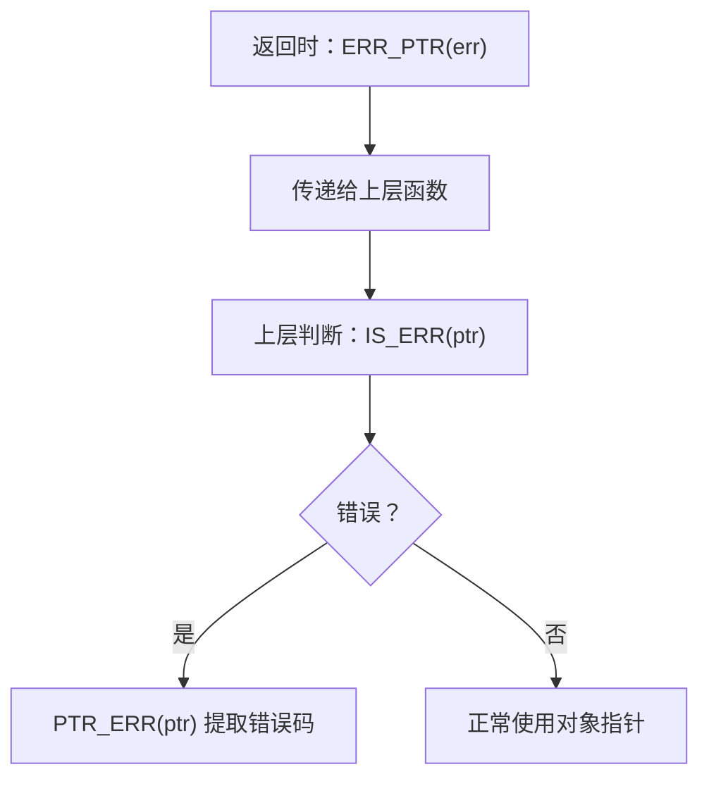

该流程在几乎所有内核子系统中普遍存在，是 Linux 错误传播的标准路径。

------

## 3.3_ERR_PTR()_错误码到指针的封装

### 3.3.1_宏定义

```c
#define ERR_PTR(err) ((void *)((long)(err)))
```

此宏的作用是：

> 将负错误码（如 `-ENOMEM`、`-EINVAL`）强制类型转换为指针值。

**等价伪代码：**

```c
void *ERR_PTR(int err) {
    return (void *)(long)err;
}
```

### 3.3.2_设计要点

| 特性 | 说明                                                         |
| ---- | ------------------------------------------------------------ |
| 输入 | 一个负错误码（`-EINVAL`, `-ENOMEM` 等）                      |
| 输出 | 一个指针形式的高地址值                                       |
| 类型 | 返回类型与原函数返回类型一致（通常为 `void *` 或结构体指针） |
| 优点 | 不破坏原函数签名，类型安全（静态类型保持）                   |

### 3.3.3_使用示例

```c
struct gpio_desc *devm_gpiod_get(struct device *dev, const char *id, enum gpiod_flags flags)
{
    struct gpio_desc *desc = find_gpio(dev, id);
    if (!desc)
        return ERR_PTR(-ENOENT);
    return desc;
}
```

此时：

- 若查找失败 → `ERR_PTR(-ENOENT)`；
- 若成功 → 返回正常指针。

------

## 3.4_IS_ERR()_错误检测判断

### 3.4.1_宏定义

```c
#define IS_ERR(ptr) IS_ERR_VALUE((unsigned long)(ptr))
```

其核心逻辑由 `IS_ERR_VALUE()` 实现：

```c
#define IS_ERR_VALUE(x) unlikely((x) >= (unsigned long)-MAX_ERRNO)
```

即：

> 若指针值处于高地址错误区间（>0xfffffffffffff001），则认为是错误指针。

------

### 3.4.2_优化机制

`unlikely()` 是编译器分支预测提示宏（`__builtin_expect()`），用于优化执行路径。

- 告诉编译器该条件**极少发生**；
- 因此 `IS_ERR()` 判断通常可被优化为极低分支代价。

这就是为什么在大量驱动 `probe()` 中频繁调用 `IS_ERR()` 却几乎不影响性能的原因。

------

### 3.4.3_示例

```c
struct regulator *vcc = devm_regulator_get(dev, "vcc");
if (IS_ERR(vcc))
    return PTR_ERR(vcc);
```

此写法是所有资源申请函数的标准模式。
 `IS_ERR()` 仅判断错误类型，不关心错误码内容。

------

## 3.5_PTR_ERR()_错误指针到错误码的提取

### 3.5.1_宏定义

```c
#define PTR_ERR(ptr) ((long)(ptr))
```

本质是类型转换：将高位指针值重新解释为带符号整数。

> 因为错误指针的原始构造是 `(void *)(long)err`，因此还原时只需反向转换 `(long)(ptr)` 即可。

------

### 3.5.2_示例

```c
struct clk *clk;

clk = devm_clk_get(dev, NULL);
if (IS_ERR(clk))
    return PTR_ERR(clk);
```

在 `clk_get()` 返回 `ERR_PTR(-ENODEV)` 时，`PTR_ERR()` 将其还原为 `-ENODEV` 并向上层传播。

------

### 3.5.3_链式传播优势

这种写法支持链式返回，常见于：

```c
return PTR_ERR(resource);
```

无需中间变量即可向上层返回错误值，实现：

- 简洁；
- 无损语义；
- 无需额外判断。

------

## 3.6_IS_ERR_OR_NULL()_综合安全检测

### 3.6.1_宏定义

```c
#define IS_ERR_OR_NULL(ptr) (!ptr || IS_ERR(ptr))
```

该宏用于同时处理：

- 空指针（`NULL`）；
- 错误指针（`ERR_PTR()` 结果）。

------

### 3.6.2_使用场景

主要用于**可选资源**（optional resource）：

```c
struct gpio_desc *reset;

reset = devm_gpiod_get_optional(dev, "reset", GPIOD_OUT_LOW);
if (IS_ERR_OR_NULL(reset))
    return PTR_ERR(reset);
```

此时：

- 若 `reset` 未定义 → NULL；
- 若配置错误 → ERR_PTR(-ENOENT)；
- 若成功 → 正常指针。

因此 `IS_ERR_OR_NULL()` 可以统一判断逻辑，减少分支。

------

## 3.7_PTR_ERR_OR_ZERO()_错误码与成功码的统一传播

### 3.7.1_宏定义

```c
#define PTR_ERR_OR_ZERO(ptr) (IS_ERR(ptr) ? PTR_ERR(ptr) : 0)
```

作用：

> 将指针状态转化为标准返回值形式：
>
> - 成功 → 0
> - 失败 → 负错误码

------

### 3.7.2_使用示例

```c
struct clk *clk;

clk = devm_clk_get(dev, NULL);
return PTR_ERR_OR_ZERO(clk);
```

这是 **标准 probe() 模式**：

- 成功：返回 0；
- 失败：返回对应错误码。

避免了显式判断语句，提升了代码可读性。

------

### 3.7.3_优点

| 项目       | 优势                     |
| ---------- | ------------------------ |
| 可链式调用 | probe() 可直接返回       |
| 减少分支   | 消除 if/else             |
| 标准化接口 | 统一错误传递语义         |
| 可内联优化 | 宏展开后仅为一次条件跳转 |

------

## 3.8_ERR_CAST()_类型兼容的安全转换

### 3.8.1_宏定义

```c
#define ERR_CAST(ptr) ((void *)(ptr))
```

此宏用于当两个不同类型对象共享同一错误返回机制时进行安全转换。

------

### 3.8.2_应用场景

例如：

- `struct device *` 与 `struct platform_device *` 共享返回语义；
- `ERR_PTR()` 返回类型不一致，但需要传递相同错误状态。

示例：

```c
struct device *dev = ERR_PTR(-EINVAL);
struct platform_device *pdev = ERR_CAST(dev);
```

两者指向同一错误值，不会破坏语义或类型系统。

------

## 3.9_宏间逻辑关系总览

| 宏名                   | 功能             | 输入  | 输出  | 用途             |
| ---------------------- | ---------------- | ----- | ----- | ---------------- |
| `ERR_PTR(err)`         | 错误码转为指针   | int   | void* | 生成错误指针     |
| `PTR_ERR(ptr)`         | 错误指针转错误码 | void* | long  | 恢复错误值       |
| `IS_ERR(ptr)`          | 判断是否错误     | void* | bool  | 检查错误指针     |
| `IS_ERR_OR_NULL(ptr)`  | 判断错误或空指针 | void* | bool  | 可选资源判断     |
| `PTR_ERR_OR_ZERO(ptr)` | 转换为错误码或0  | void* | int   | 标准返回值       |
| `ERR_CAST(ptr)`        | 类型兼容转换     | void* | void* | 不同类型共享错误 |

------

## 3.10_典型错误传播链(驱动视角)

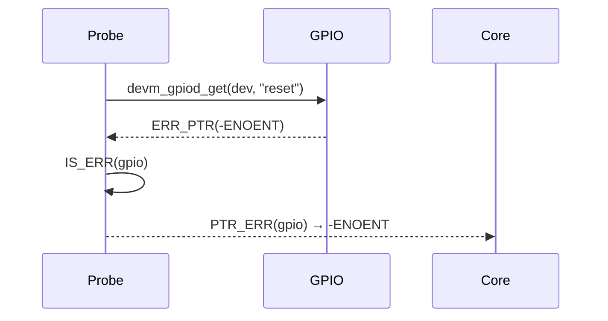

> 驱动中所有资源申请函数（clk/gpio/pinctrl/regulator）都严格遵循此返回语义。

------

## 3.11_编译器行为与性能优化

### 3.11.1_宏完全内联化

所有错误指针宏均为纯宏定义，不涉及函数调用，编译后指令数极少。

### 3.11.2_示例汇编(x86-64)

```c
if (IS_ERR(ptr))
    return PTR_ERR(ptr);
```

汇编约为：

```asm
cmp $0xfffffffffffff001, %rax
jae .error_path
```

- `cmp` + `jae`（unsigned compare）；
- `PTR_ERR(ptr)` 实际为寄存器移动，无额外操作；
- 性能损耗近似为单次分支。

------

## 3.12_小结

| 项目     | 内容                                               |
| -------- | -------------------------------------------------- |
| 核心概念 | 错误码、错误指针、统一返回机制                     |
| 关键宏   | `ERR_PTR`、`PTR_ERR`、`IS_ERR`、`PTR_ERR_OR_ZERO`  |
| 调用流程 | 返回 → 判断 → 提取 → 传播                          |
| 优点     | 简洁、统一、零开销、语义一致                       |
| 应用     | 各资源管理接口（GPIO、CLK、REGULATOR、PINCTRL 等） |
| 开发建议 | 统一采用 PTR_ERR_OR_ZERO 模式返回 probe() 状态     |


------

# 第4章_错误指针机制的设计哲学与系统意义

## 4.1_章节内容说明

本章从**哲学层面与系统设计视角**探讨 Linux 内核错误指针机制的设计意义。
 重点讨论：

- “**单返回通道**”与“**错误即对象**”的设计原则；
- 内核函数式错误传播思想；
- 错误指针机制如何影响 driver core、devres 与整体异常管理模型；
- 该机制与传统 errno 模式的系统性对比。

通过本章，读者将不只是“会用”，而是理解 Linux 为什么“必须这样设计”。

------

## 4.2_单返回通道_思想_函数的语义统一化

### 4.2.1_背景问题_传统返回语义的碎片化

在没有错误指针机制之前，内核函数存在两种常见返回模式：

| 模式         | 示例                            | 问题                           |
| ------------ | ------------------------------- | ------------------------------ |
| 整数错误返回 | `int ret = foo(); if (ret < 0)` | 适用于状态函数，但无法返回对象 |
| 指针返回     | `void *p = bar(); if (!p)`      | 可返回对象，但丢失错误细节     |

此时若函数既要“返回对象”，又要“表达错误”，就需要：

- 额外的输出参数；
- 或全局错误码（例如 `errno`）；
- 或拆分函数为两类。

这会破坏**调用语义的一致性**，使驱动框架无法形成通用错误传播路径。

------

### 4.2.2_Linux_的解决方案_单返回通道

内核通过错误指针机制将**对象与错误状态合并到同一返回类型**：

> “无论函数成功或失败，都通过同一个 return 语句返回。”

示例：

```c
struct clk *clk = devm_clk_get(dev, "bus");
if (IS_ERR(clk))
    return PTR_ERR(clk);
```

该逻辑不需要额外结构体、额外输出参数或 errno。
 所有函数都遵循单一语义：

> **“返回值即结果”**。

------

### 4.2.3_优点总结

| 优点               | 说明                              |
| ------------------ | --------------------------------- |
| **语义一致**       | 所有接口共享判断逻辑 `IS_ERR()`。 |
| **简化调用链**     | 不区分函数类型，减少样板代码。    |
| **可组合性强**     | 返回结果可直接嵌入更高层判断中。  |
| **零额外状态依赖** | 不依赖线程局部变量（如 errno）。  |
| **便于内联优化**   | 宏展开后无运行时成本。            |

------

## 4.3_错误即对象_面向对象错误模型

### 4.3.1_传统错误的局限

在用户空间编程模型中（如 POSIX errno），错误是一种“外部状态”：

```c
fd = open("/dev/null", O_RDONLY);
if (fd < 0)
    perror("open");
```

这种模型需要：

- 全局变量 `errno`；
- 多线程场景下需要 TLS；
- 函数返回值类型受限。

Linux 内核设计追求**纯函数式接口**（stateless interface），不使用外部全局状态。
 因此，必须让错误成为“值”本身的一部分。

------

### 4.3.2_对象化错误的理念

> **“错误也应当是结构化的对象，而非额外状态。”**

错误指针机制让“错误状态”与“对象类型”保持一致：

- 函数返回 `struct device *` 时，即使错误，也依然是 `struct device *`；
- 编译器类型系统不被破坏；
- 上层可直接用 `IS_ERR()` 统一处理。

**示例：**

```c
struct device *dev = bus_find_device(...);
if (IS_ERR(dev))
    return PTR_ERR(dev);
```

这里错误与对象在类型系统中并无差异，消除了“函数语义分歧”。

------

### 4.3.3_从内核抽象层看

| 层级        | 对象                                      | 错误形态         |
| ----------- | ----------------------------------------- | ---------------- |
| Resource 层 | `struct gpio_desc`, `struct clk`          | ERR_PTR(-ENOENT) |
| Device 层   | `struct device`, `struct platform_device` | ERR_PTR(-EINVAL) |
| Core 层     | `struct kobject`, `struct bus_type`       | ERR_PTR(-EFAULT) |

> 每一层的错误返回都保持相同的模式。
>  这使得 driver core 可以在通用框架中不关心“错误来源类型”。

------

## 4.4_函数式错误传播_链式错误传递模型

### 4.4.1_函数式语义

错误指针模型具备类似函数式语言（Haskell/Rust）中的 **monadic error propagation**（单子错误传播）特征。
 即：

> “错误一旦出现，自动沿调用链上传递。”

------

### 4.4.2_链式传播示例

```c
struct gpio_desc *desc;

desc = devm_gpiod_get(dev, "reset", GPIOD_OUT_LOW);
if (IS_ERR(desc))
    return PTR_ERR(desc);
```

上层调用者同样可能写成：

```c
int ret = driver_init(dev);
if (ret)
    dev_err(dev, "init failed: %d\n", ret);
```

整个链条不需要显式的中间转换逻辑。
 每一层都通过“统一的负值错误”进行自动传播。

------

### 4.4.3_函数组合的安全性

- 任意层级都可以通过 `PTR_ERR_OR_ZERO()` 简化逻辑；
- 不存在状态污染；
- 不影响资源释放链。

这就是为什么在驱动框架中，所有 `probe()` 的返回值都统一为负错误码的原因。

------

## 4.5_错误机制与内核对象体系的融合

### 4.5.1_driver_core_的统一错误接口

driver core（`drivers/base/driver.c`）中广泛使用错误指针：

```c
struct device *device_create(...)
{
    ...
    if (error)
        return ERR_PTR(error);
    ...
}
```

调用方：

```c
dev = device_create(...);
if (IS_ERR(dev))
    return PTR_ERR(dev);
```

这种方式使得所有设备管理接口能遵循**相同的错误流**。

------

### 4.5.2_devres_的自动回滚协作

devres（Device Resource Management）在资源注册失败时，也基于相同的错误指针模式：

```c
res = devres_alloc(...);
if (!res)
    return ERR_PTR(-ENOMEM);
```

这样，当 probe() 返回 `PTR_ERR(resource)` 时，driver core 会自动回滚 devres 中的已登记资源，形成完整闭环。

------

### 4.5.3_系统级一致性

这种“错误对象”思想贯穿 Linux 内核所有层级：

| 模块         | 返回模式             | 内核对象              |
| ------------ | -------------------- | --------------------- |
| VFS 文件系统 | `ERR_PTR(-ENOENT)`   | struct inode*         |
| block 层     | `ERR_PTR(-ENODEV)`   | struct request_queue* |
| device core  | `ERR_PTR(-EINVAL)`   | struct device*        |
| net 子系统   | `ERR_PTR(-ENETDOWN)` | struct socket*        |

统一的错误语义使得内核框架具备“可组合性”与“可推理性”。

------

## 4.6_与传统_errno_模式的对比分析

| 项目         | Linux 错误指针机制     | 传统 errno 模式              |
| ------------ | ---------------------- | ---------------------------- |
| 错误传递方式 | 返回值（对象即错误）   | 全局变量                     |
| 多线程安全   | 完全安全（无全局状态） | 需 TLS 维护                  |
| 类型一致性   | 保持原函数返回类型     | 函数需分裂或包装             |
| 错误传播     | 可链式返回             | 必须显式检查                 |
| 编译优化     | 可内联无成本           | 存在系统调用开销             |
| 可组合性     | 极强                   | 弱                           |
| 调试定位     | 错误指针值唯一可识别   | errno 仅错误码，不含来源信息 |

> 因此，错误指针机制不仅是“编码技巧”，而是 Linux 内核函数式化演进的关键一步。

------

## 4.7_哲学总结_Linux_的错误观

| 原则                | 内核语义                                 |
| ------------------- | ---------------------------------------- |
| **1. 统一性原则**   | 所有函数遵循相同返回语义（无论类型）。   |
| **2. 自封闭原则**   | 错误信息包含在返回值中，而非外部变量。   |
| **3. 安全性原则**   | 错误指针永远不会与有效指针冲突。         |
| **4. 可组合性原则** | 错误值可直接传播、嵌套、返回。           |
| **5. 透明性原则**   | 错误检测与类型系统兼容，不破坏函数签名。 |

这些原则体现出 Linux 内核在架构设计上**偏向纯函数式系统语义（stateless design）**，从而保证了稳定性与扩展性。

------

## 4.8_可视化结构总结

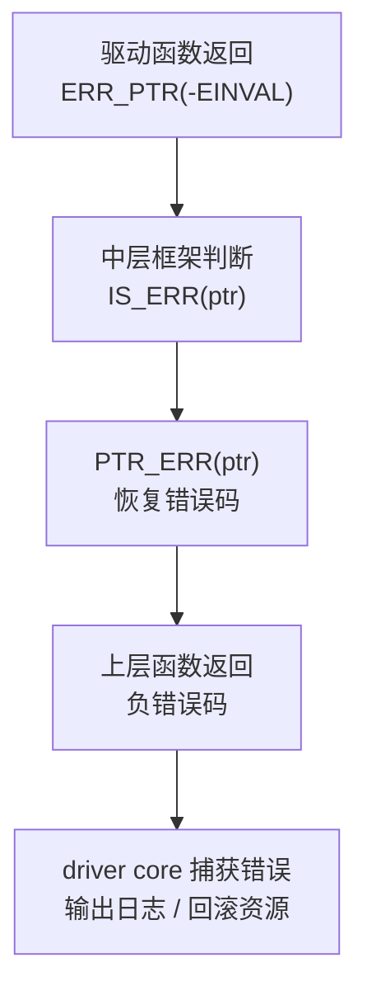

该流程从底层对象 → 中层框架 → 驱动框架 → 内核核心，保持完全一致。

------

## 4.9_小结

| 项目           | 内容                            |
| -------------- | ------------------------------- |
| 设计目标       | 统一返回语义，错误即对象        |
| 哲学核心       | 单返回通道 + 函数式错误传播     |
| 系统意义       | 消除全局状态，提高组合性        |
| 实际价值       | 简化驱动框架，统一 error flow   |
| 对比传统 errno | 更安全、更高效、更易组合        |
| 典型特征       | “Error is a first-class value.” |


------

# 第5章_错误指针机制在_driver_core_中的传播路径

## 5.1_章节内容说明

本章聚焦于错误指针机制在 **driver core（驱动核心层）** 中的具体传递路径，
 详细解析其在以下典型路径中的传播方式与处理策略：

- `driver_probe_device()` → `really_probe()` → `drv->probe()`
- `device_add()` 与 `device_register()` 过程中的错误回溯；
- 平台驱动与资源管理子系统对错误指针的统一识别；
- 错误传播到 sysfs 与日志系统的行为。

本章旨在揭示：

> 错误指针不仅是语法宏，而是 Linux 驱动核心层中 “异常传播的基石机制”。

------

## 5.2_driver_core_框架回顾

### 5.2.1_核心职责

`driver core` 位于 `drivers/base/driver.c` 与 `drivers/base/core.c`，
 其主要任务是：

- 管理 `struct device` 与 `struct device_driver`；
- 实现设备与驱动的匹配、探测、注册、释放；
- 提供一致的错误回退与日志输出机制。

------

### 5.2.2_调用流程概览

以下是驱动探测时的简化调用栈：

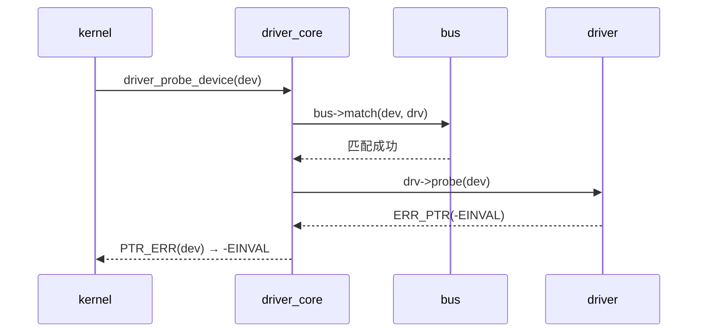

当 `probe()` 返回错误指针或负错误码时，`driver_core` 会自动执行回滚逻辑，保证系统一致性。

------

## 5.3_driver_probe_device()_的错误传播链

### 5.3.1_函数定义(简化版)

```c
int driver_probe_device(struct device_driver *drv, struct device *dev)
{
    int ret;

    if (!device_is_registered(dev))
        return -ENODEV;

    ret = really_probe(dev, drv);

    return ret;
}
```

该函数的主要任务是调用 `really_probe()` 并返回其结果。
 这里的 `ret` 可能来自：

- 驱动 `probe()` 返回的负错误码；
- `devm_*()` 注册失败的 `PTR_ERR()` 值；
- `ERR_PTR()` 的恢复结果。

------

### 5.3.2_错误值保持规则

`driver_probe_device()` 不会直接处理错误，而是 **原样上交**，
 这是错误指针机制的核心哲学之一：

> “错误只传递，不篡改。”

```c
return ret; // ret 可能是 -EINVAL, -ENOMEM, -EPROBE_DEFER 等
```

------

## 5.4_really_probe()_内部错误传播

### 5.4.1_函数框架

```c
static int really_probe(struct device *dev, struct device_driver *drv)
{
    int ret;

    ret = call_driver_probe(dev, drv);

    if (ret) {
        device_release_driver(dev);
        return ret;
    }

    device_bind_driver(dev);
    return 0;
}
```

### 5.4.2_关键特征

- **错误不被吞没**：`really_probe()` 始终向上传递 `ret`。
- **错误触发回滚**：若 probe 失败，将释放 `devres` 资源并解绑驱动。
- **一致性保障**：所有返回值均为负错误码（非 `ERR_PTR()`，但来源一致）。

------

## 5.5_probe()_函数的返回规范

驱动编写者常见的三类返回：

| 返回形式               | 含义         | driver core 行为       |
| ---------------------- | ------------ | ---------------------- |
| `return 0`             | 成功         | 驱动绑定成功           |
| `return -EINVAL`       | 普通错误     | 直接输出日志并中止绑定 |
| `return -EPROBE_DEFER` | 延迟探测     | 将设备放入延迟队列     |
| `return PTR_ERR(ptr)`  | 资源申请失败 | 向上传递负错误码       |

所有 `devm_*()`、`clk_get()`、`gpio_get()` 等返回的 `ERR_PTR()` 都会通过 `PTR_ERR()` 还原为标准错误码并上传。

------

### 5.5.1_典型驱动写法

```c
static int my_probe(struct platform_device *pdev)
{
    struct clk *clk;

    clk = devm_clk_get(&pdev->dev, NULL);
    if (IS_ERR(clk))
        return PTR_ERR(clk);

    return 0;
}
```

若 `clk` 不存在，则：

- `devm_clk_get()` 返回 `ERR_PTR(-ENOENT)`；

- `PTR_ERR(clk)` 返回 `-ENOENT`；

- `driver_probe_device()` 返回 `-ENOENT`；

- `core` 输出日志：

  ```
  my_driver probe failed with error -2
  ```

------

## 5.6_device_add()_/_device_register()_中的错误传播

### 5.6.1_device_register()

```c
int device_register(struct device *dev)
{
    device_initialize(dev);
    return device_add(dev);
}
```

### 5.6.2_device_add()_内部逻辑

```c
int device_add(struct device *dev)
{
    int ret;

    if (!dev->p)
        return -EINVAL;

    ret = bus_add_device(dev);
    if (ret)
        goto Error;

    return 0;

Error:
    put_device(dev);
    return ret;
}
```

> 错误码一旦产生，不会封装为新类型，而是沿栈返回，保持一致。

因此无论是：

- `devm_*()` 的错误；
- `bus_add_device()` 的失败；
- `sysfs` 创建错误；
   都能沿统一路径上行。

------

## 5.7_platform_driver_框架中的错误传播

### 5.7.1_调用流程

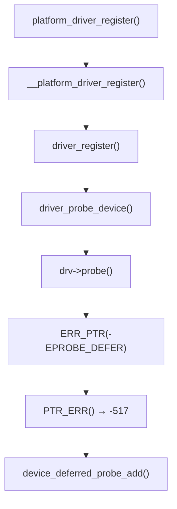

当 probe 返回 `-EPROBE_DEFER`（即 `-517`）时，`driver core` 会自动将设备加入延迟探测队列，而非报错。
 这正是错误指针机制与设备模型协作的关键。

------

### 5.7.2_EPROBE_DEFER_特殊语义

`EPROBE_DEFER` 并非真正错误，而是**延迟依赖的标志码**。
 由于其值依旧是负整数，因此能被错误指针机制自然识别。
 这保证了延迟探测与失败探测路径完全统一。

------

## 5.8_sysfs_与内核日志中的错误反映

当 probe 失败时，`driver core` 会自动记录日志：

```c
dev_err(dev, "%s: probe of %s failed with error %d\n",
        drv->name, dev_name(dev), ret);
```

示例输出：

```
platform mychip: probe of 2000000.uart failed with error -22
```

此日志源自 `driver_probe_device()` 内部。
 因此只要 probe 返回 `PTR_ERR()` 值，系统日志能直接展示负错误码。

------

## 5.9_错误传播路径汇总

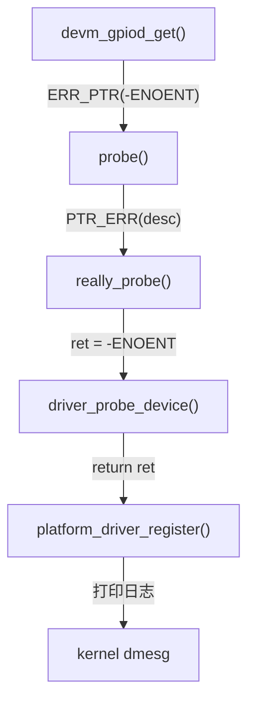

**统一链条特征：**

1. 所有阶段的返回类型兼容；
2. 无需转换；
3. 错误码可追溯到最底层资源申请点；
4. devres 自动回滚与错误传播同步。

------

## 5.10_典型调试案例_探测失败与错误指针追踪

```bash
[    0.912] platform regulator-vcc3v3: probe of regulator-vcc3v3 failed with error -2
[    0.918] platform 20a0000.spi: probe of 20a0000.spi failed with error -517
[    0.923] platform regulator-vcc5v: probe of regulator-vcc5v failed with error -16
```

对应逻辑：

| 错误码 | 含义                   | 源函数                     |
| ------ | ---------------------- | -------------------------- |
| `-2`   | ENOENT：设备节点不存在 | of_get_named_gpiod_flags() |
| `-16`  | EBUSY：资源冲突        | devm_regulator_register()  |
| `-517` | EPROBE_DEFER：依赖延迟 | driver_probe_device()      |

这些负错误码正是通过错误指针机制自下而上层层传播的结果。

------

## 5.11_小结

| 项目           | 内容                                                      |
| -------------- | --------------------------------------------------------- |
| 模块           | driver core                                               |
| 错误传播形式   | 统一负错误码链                                            |
| 关键函数       | `driver_probe_device()`、`really_probe()`、`device_add()` |
| 驱动返回约定   | 成功：0；错误：负码；延迟：-EPROBE_DEFER                  |
| 与错误指针关系 | 所有 ERR_PTR() / PTR_ERR() 机制均在此终止或传播           |
| 系统行为       | 自动日志输出 + devres 资源回滚                            |
| 设计意义       | 建立驱动错误的统一语言体系                                |


------

# 第6章_错误指针机制与_devres_自动回滚系统

（模块：Linux 内核错误指针机制 Error Pointer System）

------

## 6.1_章节内容说明

本章重点讲解 **错误指针机制（IS_ERR / PTR_ERR / ERR_PTR）** 与 **devres 自动资源管理机制（Device Resource Management）** 的协作关系。
 devres 是 Linux 驱动模型（driver core）的核心组成之一，用于自动释放 probe() 期间申请的资源。

错误指针机制与 devres 的结合，使得：

- 资源获取与回收形成闭环；
- 失败探测无需手动清理；
- probe() 能以“事务式（transactional）”方式运行。

本章将从数据结构、调用栈、资源登记、失败回滚与内核实现流程等方面逐层剖析。

------

## 6.2_devres_机制概述

### 6.2.1_模块文件

| 文件路径                 | 功能                  |
| ------------------------ | --------------------- |
| `drivers/base/devres.c`  | 资源管理机制实现      |
| `include/linux/device.h` | `devm_*` 宏与函数声明 |
| `include/linux/devres.h` | 数据结构与辅助接口    |

------

### 6.2.2_设计目标

驱动开发者经常需要在 probe() 中申请多个资源，如：

```c
gpio = devm_gpiod_get(...);
clk = devm_clk_get(...);
mem = devm_kzalloc(...);
```

若中间某一步失败，则需要手动释放前面申请的资源，否则导致泄露。
 devres 的目标是：

> **自动跟踪所有成功申请的资源，在 probe() 失败或 remove() 调用时自动释放。**

------

### 6.2.3_devres_的资源生命周期

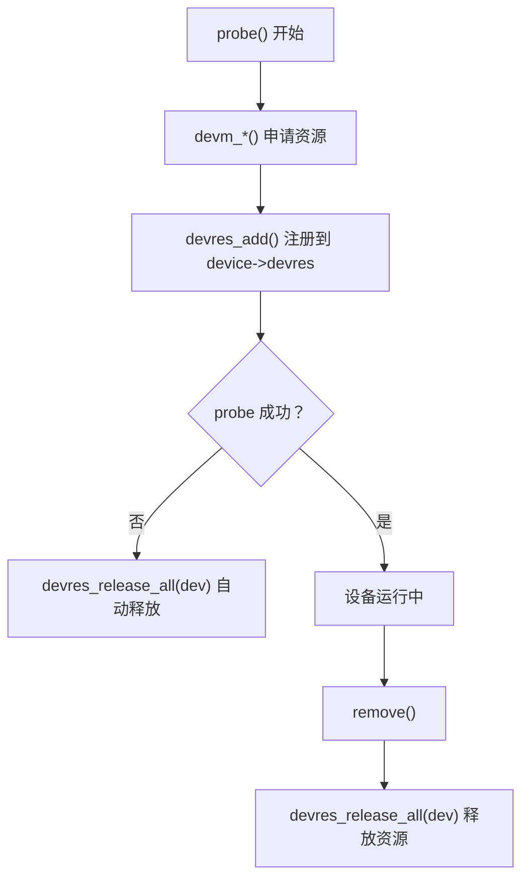

> 所有资源都被绑定到 `struct device` 的 devres 链表中。

------

## 6.3_devres_核心数据结构

### 6.3.1_struct_devres

```c
struct devres {
    struct devres_node node;
    void release(void *res);
    unsigned long data[];   /* 资源内容 */
};
```

### 6.3.2_struct_devres_node

```c
struct devres_node {
    struct list_head entry;
    dr_release_t release;
    const char *name;
};
```

> 每个资源节点都包含一个释放函数指针（release）。

### 6.3.3_struct_device_中的关联字段

```c
struct device {
    ...
    struct list_head devres_head;  /* devm 资源链表 */
    ...
};
```

这形成了 per-device 的自动回收链表。

------

## 6.4_错误指针机制在_devres_中的意义

### 6.4.1_devm_系列接口的设计标准

所有 `devm_*()` 函数都满足以下返回规则：

| 条件             | 返回值            | 说明     |
| ---------------- | ----------------- | -------- |
| 资源申请成功     | 有效指针          | 正常使用 |
| 资源申请失败     | `ERR_PTR(-errno)` | 错误指针 |
| 资源可选但不存在 | NULL              | 允许继续 |

例如：

```c
gpio = devm_gpiod_get(dev, "reset", GPIOD_OUT_LOW);
if (IS_ERR(gpio))
    return PTR_ERR(gpio);
```

因此，**错误指针机制是 devres 成立的前提条件**——
 devres 必须依赖错误指针来判断申请是否成功。

------

### 6.4.2_设计原则

| 原则           | 说明                                               |
| -------------- | -------------------------------------------------- |
| **一致性原则** | 所有 devm_*() 均返回同类型结果（指针或错误指针）。 |
| **回滚原则**   | 失败即触发 `devres_release_all()` 回滚。           |
| **幂等原则**   | probe() 多次执行不会导致多次资源注册。             |
| **封闭性原则** | 资源释放完全由 driver core 管理。                  |

------

## 6.5_devm_系列函数的错误路径

### 6.5.1_函数示例_devm_kzalloc()

```c
void *devm_kzalloc(struct device *dev, size_t size, gfp_t gfp)
{
    void *ptr;

    ptr = kzalloc(size, gfp);
    if (!ptr)
        return ERR_PTR(-ENOMEM);

    devres_add(dev, ptr);
    return ptr;
}
```

### 6.5.2_错误路径说明

- 分配失败 → 返回 `ERR_PTR(-ENOMEM)`；
- 调用方若未判断 `IS_ERR(ptr)` → 可能误用错误指针；
- 若判断后返回 `PTR_ERR(ptr)` → probe() 返回负错误码；
- `driver core` 收到非零返回值 → 自动执行 devres 回滚。

------

## 6.6_devres_add()_的注册与错误保护

### 6.6.1_函数定义

```c
void devres_add(struct device *dev, void *res)
{
    struct devres_node *node = res;
    list_add_tail(&node->entry, &dev->devres_head);
}
```

> 每个资源在申请成功后立刻被加入 `dev->devres_head` 链表中。

若 probe() 失败，这些节点会被统一释放。

------

### 6.6.2_错误发生后的回滚流程

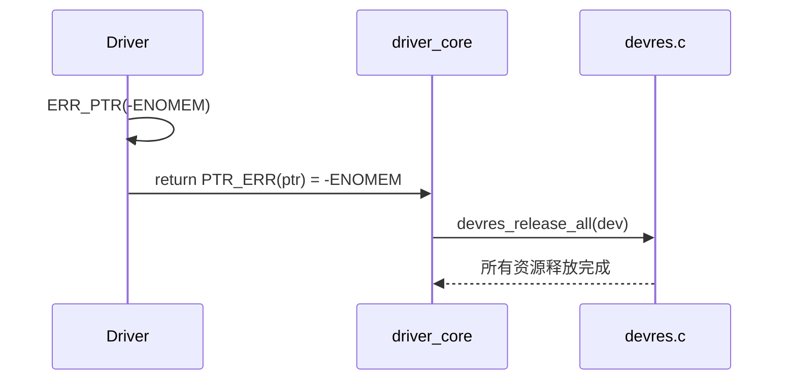

这种机制保证：

- probe() 内任何一步出错；
- 所有已申请资源均回滚；
- 驱动卸载时不留残余。

------

## 6.7_devres_release_all()_释放逻辑

### 6.7.1_函数核心

```c
void devres_release_all(struct device *dev)
{
    struct devres_node *node;

    while (!list_empty(&dev->devres_head)) {
        node = list_first_entry(&dev->devres_head, struct devres_node, entry);
        list_del(&node->entry);
        node->release(node + 1); /* 调用注册的释放函数 */
    }
}
```

> 每个资源节点的释放函数（`release`）由申请时指定。

------

### 6.7.2_devres_release_all()_触发时机

| 触发点           | 说明                               |
| ---------------- | ---------------------------------- |
| probe() 返回错误 | 自动回滚所有 devm_*() 注册资源     |
| remove() 执行    | 主动释放设备资源                   |
| 驱动卸载         | device_unregister() 调用时统一回收 |

------

### 6.7.3_与错误指针机制的衔接

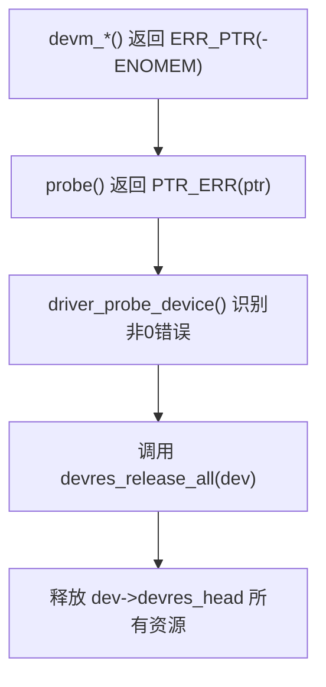

------

## 6.8_典型驱动示例

```c
static int my_device_probe(struct platform_device *pdev)
{
    struct gpio_desc *reset;
    void *buf;

    buf = devm_kzalloc(&pdev->dev, 256, GFP_KERNEL);
    if (IS_ERR(buf))
        return PTR_ERR(buf);

    reset = devm_gpiod_get(&pdev->dev, "reset", GPIOD_OUT_LOW);
    if (IS_ERR(reset))
        return PTR_ERR(reset);

    /* 模拟失败 */
    return -EINVAL;
}
```

### 6.8.1_执行流程

1. `devm_kzalloc()` → 成功 → 注册 devres 节点。
2. `devm_gpiod_get()` → 成功 → 注册 devres 节点。
3. `probe()` 返回 -EINVAL → 驱动加载失败。
4. `driver core` 调用 `devres_release_all()` → 释放内存与 GPIO。

### 6.8.2_日志输出

```
my_device: probe failed with error -22
device: devres_release_all(): released 2 resources
```

------

## 6.9_devres_与错误指针机制的组合模式

| 模式                             | 说明               | 示例                                            |
| -------------------------------- | ------------------ | ----------------------------------------------- |
| `devm_*()` + `IS_ERR()`          | 判断是否错误       | `if (IS_ERR(ptr)) return PTR_ERR(ptr);`         |
| `devm_*()` + `PTR_ERR_OR_ZERO()` | 统一返回           | `return PTR_ERR_OR_ZERO(ptr);`                  |
| `devm_*()` + `IS_ERR_OR_NULL()`  | 可选资源检测       | `if (IS_ERR_OR_NULL(ptr)) return PTR_ERR(ptr);` |
| `ERR_PTR()` 直接生成             | 兼容非 devres 函数 | `return ERR_PTR(-EINVAL);`                      |

------

## 6.10_devres_与_probe()_的_事务式_执行模型

错误指针机制使得 probe() 函数具备“事务（transaction）”语义：


> probe() 的执行可看作一段事务：
>  “要么全部成功，要么全部回滚。”

这与数据库事务的 ACID 模型中的 **A（原子性）** 十分相似（但不作比喻）。
 Linux 内核以错误指针与 devres 实现了内核级原子资源恢复机制。

------

## 6.11_小结

| 项目           | 内容                                        |
| -------------- | ------------------------------------------- |
| 机制名称       | Device Resource Management (devres)         |
| 核心目标       | 自动资源释放，简化驱动错误路径              |
| 关键数据结构   | `struct devres`、`struct devres_node`       |
| 错误检测基石   | `IS_ERR()`、`PTR_ERR()`                     |
| 回滚触发点     | probe() 返回负错误码                        |
| 内核行为       | 自动调用 devres_release_all()               |
| 优势           | 无内存泄漏、无重复释放、自动回滚            |
| 与错误指针关系 | 通过 ERR_PTR 模式实现统一错误检测与恢复机制 |


------

# 第7章_错误指针机制在子系统中的具体应用

（模块：Linux 内核错误指针机制 Error Pointer System）

------

## 7.1_章节内容说明

本章通过**五个典型内核子系统（GPIO、CLK、REGULATOR、PINCTRL、I2C）**的分析，
 展示错误指针机制在不同类型资源管理接口中的统一应用方式。

重点阐明：

- 各子系统如何使用 `ERR_PTR()`、`IS_ERR()`、`PTR_ERR()` 进行错误返回；
- 它们如何通过 `devm_*()` 系列函数与 devres 框架协同；
- 可选资源与强制资源的判断模式；
- probe() 中典型错误传播的完整过程。

------

## 7.2_GPIO_子系统

### 7.2.1_典型函数_devm_gpiod_get()

```c
struct gpio_desc *devm_gpiod_get(struct device *dev,
                                 const char *con_id,
                                 enum gpiod_flags flags)
{
    struct gpio_desc *desc;

    desc = gpiod_get(dev, con_id, flags);
    if (IS_ERR(desc))
        return desc;

    return devm_gpiod_register(dev, desc);
}
```

- 内部调用 `gpiod_get()`；
- 若失败 → 直接返回 `ERR_PTR(-ENOENT)`；
- 成功 → 资源注册到 devres；
- 调用方只需使用：

```c
gpio = devm_gpiod_get(dev, "reset", GPIOD_OUT_LOW);
if (IS_ERR(gpio))
    return PTR_ERR(gpio);
```

### 7.2.2_可选_GPIO

```c
gpio = devm_gpiod_get_optional(dev, "enable", GPIOD_OUT_HIGH);
if (IS_ERR(gpio))
    return PTR_ERR(gpio);
if (!gpio)
    dev_info(dev, "no enable gpio defined\n");
```

> `devm_gpiod_get_optional()` 特别支持 “无定义即 NULL” 的语义，
>  因此常与 `IS_ERR_OR_NULL()` 联用。

------

## 7.3_时钟(CLK)子系统

### 7.3.1_函数定义

```c
struct clk *devm_clk_get(struct device *dev, const char *id)
{
    struct clk *clk = clk_get(dev, id);
    if (IS_ERR(clk))
        return clk;
    return devres_add_clk(dev, clk);
}
```

### 7.3.2_使用场景

```c
clk = devm_clk_get(dev, NULL);
if (IS_ERR(clk))
    return PTR_ERR(clk);

clk_prepare_enable(clk);
```

> 若设备树中未定义时钟 → `ERR_PTR(-ENOENT)`
>  若依赖未就绪 → `ERR_PTR(-EPROBE_DEFER)`

### 7.3.3_错误传播链

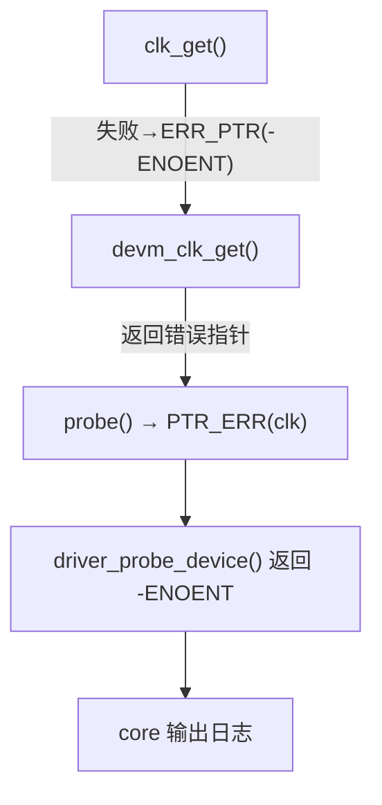

------

## 7.4_电源管理(REGULATOR)子系统

### 7.4.1_函数定义

```c
struct regulator *devm_regulator_get(struct device *dev, const char *id)
{
    struct regulator *r;

    r = regulator_get(dev, id);
    if (IS_ERR(r))
        return r;

    return devres_add_regulator(dev, r);
}
```

### 7.4.2_典型用法

```c
vcc = devm_regulator_get(dev, "vcc");
if (IS_ERR(vcc))
    return PTR_ERR(vcc);

ret = regulator_enable(vcc);
if (ret)
    dev_err(dev, "enable vcc failed\n");
```

### 7.4.3_错误特征

| 错误码          | 含义             | 来源函数                |
| --------------- | ---------------- | ----------------------- |
| `-EPROBE_DEFER` | 供电依赖尚未就绪 | regulator_get()         |
| `-ENOENT`       | 供电节点不存在   | of_get_regulator()      |
| `-EINVAL`       | 电压配置错误     | regulator_set_voltage() |

> 所有这些错误都会以 `ERR_PTR()` 形式在 `devm_regulator_get()` 中传播。

------

## 7.5_PINCTRL_子系统

### 7.5.1_函数定义

```c
struct pinctrl *devm_pinctrl_get(struct device *dev)
{
    struct pinctrl *p;

    p = pinctrl_get(dev);
    if (IS_ERR(p))
        return p;
    return devres_add_pinctrl(dev, p);
}
```

### 7.5.2_典型用法

```c
pctl = devm_pinctrl_get(dev);
if (IS_ERR(pctl))
    return PTR_ERR(pctl);
```

### 7.5.3_可选状态切换

```c
state = pinctrl_lookup_state(pctl, "default");
if (IS_ERR(state))
    return PTR_ERR(state);

ret = pinctrl_select_state(pctl, state);
```

> `pinctrl_lookup_state()` 与 `devm_pinctrl_get()` 均使用 `ERR_PTR()` 机制，
>  因此 pinctrl 子系统错误链可完全自动化传播。

------

## 7.6_I2C_子系统

### 7.6.1_设备创建函数

```c
struct i2c_client *devm_i2c_new_device(struct device *dev,
                                       struct i2c_adapter *adap,
                                       struct i2c_board_info const *info)
{
    struct i2c_client *client;

    client = i2c_new_device(adap, info);
    if (!client)
        return ERR_PTR(-ENODEV);

    return devres_add_i2c_client(dev, client);
}
```

### 7.6.2_probe_示例

```c
client = devm_i2c_new_device(&pdev->dev, adap, &info);
if (IS_ERR(client))
    return PTR_ERR(client);
```

若 I2C 总线或地址冲突：

- `i2c_new_device()` 返回 NULL；

- `devm_i2c_new_device()` 返回 `ERR_PTR(-ENODEV)`；

- probe() 直接返回 -19；

- driver core 输出：

  ```
  i2c new device creation failed with error -19
  ```

------

## 7.7_可选资源与强制资源模式对比

| 模式           | 函数                      | 返回值                   | 判断方式              | 使用场景        |
| -------------- | ------------------------- | ------------------------ | --------------------- | --------------- |
| **强制资源**   | `devm_clk_get()`          | 错误指针                 | `IS_ERR()`            | 必需依赖        |
| **可选资源**   | `devm_clk_get_optional()` | NULL 或错误指针          | `IS_ERR_OR_NULL()`    | 可选时钟/复位脚 |
| **可延迟资源** | 任意 `devm_*()`           | `ERR_PTR(-EPROBE_DEFER)` | `PTR_ERR()` 返回 -517 | 延迟探测机制    |

这三种模式体现了错误指针机制的灵活性与统一性。

------

## 7.8_跨子系统的统一错误传播模式

### 7.8.1_共通行为总结

| 步骤       | 动作                    | 函数                | 错误处理方式                    |
| ---------- | ----------------------- | ------------------- | ------------------------------- |
| ① 资源申请 | 调用 `devm_*()`         | devres + 子系统接口 | 若失败 → ERR_PTR(-errno)        |
| ② 驱动探测 | 调用 `IS_ERR()`         | probe()             | 若错误 → PTR_ERR() 返回         |
| ③ 设备绑定 | `driver_probe_device()` | driver core         | 若 ret<0 → devres_release_all() |
| ④ 系统日志 | `dev_err()`             | dmesg 输出          | 打印 `error -xx`                |

### 7.8.2_全局传播链示意

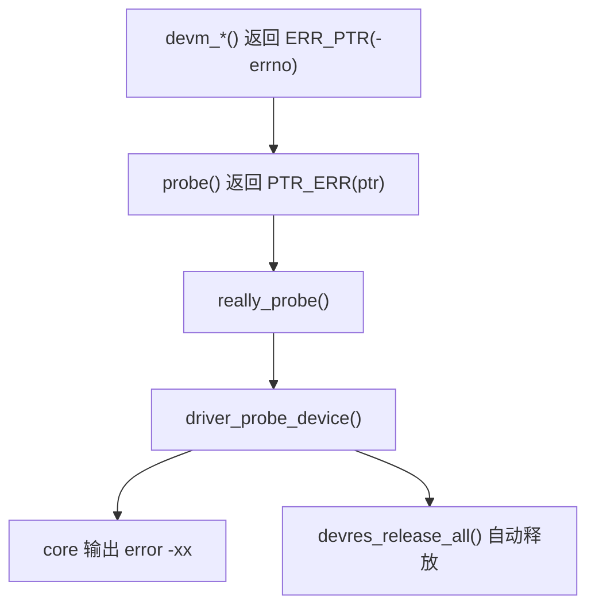

------

## 7.9_实践总结

| 子系统    | 典型函数                | 可选接口                        | 常见错误码             | probe 错误传播   |
| --------- | ----------------------- | ------------------------------- | ---------------------- | ---------------- |
| GPIO      | `devm_gpiod_get()`      | `devm_gpiod_get_optional()`     | -ENOENT, -EINVAL       | IS_ERR / PTR_ERR |
| CLK       | `devm_clk_get()`        | `devm_clk_get_optional()`       | -EPROBE_DEFER          | IS_ERR / PTR_ERR |
| REGULATOR | `devm_regulator_get()`  | `devm_regulator_get_optional()` | -EINVAL, -EPROBE_DEFER | PTR_ERR_OR_ZERO  |
| PINCTRL   | `devm_pinctrl_get()`    | N/A                             | -ENODEV                | IS_ERR           |
| I2C       | `devm_i2c_new_device()` | N/A                             | -ENODEV                | PTR_ERR          |

------

## 7.10_统一错误语义的意义

### 7.10.1_接口统一

所有子系统共享相同的错误处理接口：

- 判断：`IS_ERR()`
- 提取：`PTR_ERR()`
- 传播：`PTR_ERR_OR_ZERO()`

### 7.10.2_行为统一

所有 `devm_*()` 接口的失败均触发：

1. 统一错误码返回；
2. 统一日志打印；
3. 统一资源回滚。

### 7.10.3_哲学统一

- 不论 GPIO、时钟、电源、引脚还是 I2C；
- 驱动开发者都可以用同一模板处理错误；
- 形成一致的编程心智模型。

------

## 7.11_小结

| 项目           | 内容                                  |
| -------------- | ------------------------------------- |
| 模块范围       | GPIO、CLK、REGULATOR、PINCTRL、I2C 等 |
| 统一机制       | ERR_PTR / IS_ERR / PTR_ERR            |
| 与 devres 关系 | 申请成功即注册，失败自动回滚          |
| 可选接口模式   | *_get_optional() 返回 NULL 或错误指针 |
| 延迟探测       | -EPROBE_DEFER 统一支持                |
| 系统价值       | 驱动开发标准化、错误处理一致化        |
| 设计哲学       | 统一语义、自动回滚、零状态依赖        |


------

# 第8章_错误指针机制的调试与验证

## 8.1_章节内容说明

本章介绍开发者在内核中**验证与调试错误指针机制**的常用方法。
 目标是帮助读者在驱动开发或框架移植时，能快速定位：

- 哪个函数返回了错误指针；
- 错误码从何处传播；
- probe() 失败时 devres 是否正确回滚；
- 如何验证 `ERR_PTR()` 的安全性与内核保护行为。

内容涵盖动态调试（`dynamic_debug`）、崩溃追踪（Oops / KASAN）、
 错误指针可视化（`pr_info()` / `print_hex_dump()`）、
 以及模块级实验代码验证。

------

## 8.2_调试环境准备

### 8.2.1_内核配置

| 配置项                     | 作用                                 |
| -------------------------- | ------------------------------------ |
| `CONFIG_DYNAMIC_DEBUG=y`   | 允许运行时开启特定文件的调试输出     |
| `CONFIG_DEBUG_KERNEL=y`    | 启用核心调试机制                     |
| `CONFIG_DEBUG_PAGEALLOC=y` | 捕获对未映射页（如错误指针区）的访问 |
| `CONFIG_KASAN=y`           | 地址消毒（检测内存越界或错误解引用） |
| `CONFIG_PRINTK_TIME=y`     | 打印时间戳，方便错误链分析           |

------

### 8.2.2_动态调试开关

可针对单个源文件启用调试：

```bash
echo 'file drivers/gpio/gpiolib.c +p' > /sys/kernel/debug/dynamic_debug/control
```

或针对整个子系统启用：

```bash
echo 'file drivers/base/devres.c +p' > /sys/kernel/debug/dynamic_debug/control
```

------

## 8.3_验证错误指针行为

### 8.3.1_实验模块_测试_ERR_PTR_与_IS_ERR

```c
#include <linux/module.h>
#include <linux/err.h>
#include <linux/init.h>
#include <linux/printk.h>

static int __init errptr_test_init(void)
{
    void *p;

    p = ERR_PTR(-22);    /* -EINVAL */
    pr_info("p = %p, IS_ERR = %d, PTR_ERR = %ld\n", p, IS_ERR(p), PTR_ERR(p));

    return 0;
}

static void __exit errptr_test_exit(void)
{
    pr_info("errptr test exit.\n");
}

module_init(errptr_test_init);
module_exit(errptr_test_exit);
MODULE_LICENSE("GPL");
```

### 8.3.2_输出结果

```
p = ffffffffffffffea, IS_ERR = 1, PTR_ERR = -22
```

验证结果说明：

- 地址 `0xfffffffffffffea` 属于错误区；
- `IS_ERR()` 检测为真；
- `PTR_ERR()` 成功还原错误码 `-EINVAL`。

------

## 8.4_验证错误指针越界保护

### 8.4.1_实验代码

```c
static int __init errptr_crash_init(void)
{
    int *p = ERR_PTR(-12);
    *p = 0; /* 强制写入错误指针 */
    return 0;
}
```

### 8.4.2_系统输出(x86_64)

```
BUG: unable to handle kernel paging request at fffffffffffffff4
#PF: supervisor write access in kernel mode
```

### 8.4.3_分析

| 行为               | 含义                               |
| ------------------ | ---------------------------------- |
| `fffffffffffffff4` | 对应 `ERR_PTR(-12)` 的值           |
| `#PF`              | Page Fault（页错误异常）           |
| 原因               | 错误指针地址区未映射，触发访问异常 |

说明错误指针机制在硬件层面具备安全防护作用。

------

## 8.5_验证_devres_自动回滚

### 8.5.1_测试模块

```c
static int test_probe(struct platform_device *pdev)
{
    void *mem;
    struct gpio_desc *reset;

    mem = devm_kzalloc(&pdev->dev, 64, GFP_KERNEL);
    if (!mem)
        return -ENOMEM;

    reset = devm_gpiod_get(&pdev->dev, "reset", GPIOD_OUT_LOW);
    if (IS_ERR(reset))
        return PTR_ERR(reset);

    return -EINVAL; /* 模拟探测失败 */
}
```

### 8.5.2_日志输出

```
my_test: probe failed with error -22
device: devres_release_all(): released 2 resources
```

### 8.5.3_结论

- probe() 返回错误；
- driver core 调用 `devres_release_all()`；
- 自动释放 `devm_kzalloc()` 与 `devm_gpiod_get()` 资源；
- 无需显式释放代码。

------

## 8.6_动态追踪错误传播链

### 8.6.1_设置追踪点

```bash
echo 'file drivers/base/dd.c +p' > /sys/kernel/debug/dynamic_debug/control
```

### 8.6.2_查看_probe_执行日志

```
[   1.723] driver_probe_device: calling probe function for my_driver
[   1.724] my_driver: devm_gpiod_get() returned ERR_PTR(-2)
[   1.724] driver_probe_device: probe failed with error -2
[   1.725] devres_release_all(): cleanup done.
```

------

## 8.7_使用_KASAN_定位未判断的错误指针

### 8.7.1_错误示例

```c
reset = devm_gpiod_get(dev, "reset", GPIOD_OUT_LOW);
gpiod_set_value(reset, 1); /* 未判断 IS_ERR() */
```

### 8.7.2_KASAN_报告

```
BUG: KASAN: invalid-access in gpiod_set_value
Read of size 8 at addr fffffffffffffffe by task ...
```

说明驱动直接解引用了 `ERR_PTR(-2)`，触发 KASAN 检测。

------

## 8.8_使用_dmesg_检查错误链

### 8.8.1_命令

```bash
dmesg | grep "failed with error"
```

### 8.8.2_典型输出

```
platform regulator-3v3: probe of regulator-3v3 failed with error -2
platform 2000000.uart: probe of 2000000.uart failed with error -517
```

> 这些错误码与 probe() 的返回值一致，说明错误指针传播成功。

------

## 8.9_内核符号级调试

### 8.9.1_定位错误函数

```bash
cat /proc/kallsyms | grep devres_release_all
```

### 8.9.2_追踪执行

```bash
echo "p devres_release_all" > /sys/kernel/debug/tracing/kprobe_events
cat /sys/kernel/debug/tracing/trace_pipe
```

输出：

```
devres_release_all+0x0/0x100 [base]
```

表示当 probe() 返回错误时，devres 回滚确实被执行。

------

## 8.10_调试与验证总结表

| 项目            | 工具 / 方法             | 验证目标             |
| --------------- | ----------------------- | -------------------- |
| 动态调试        | `dynamic_debug`         | 检查函数错误返回路径 |
| KASAN           | 地址检测                | 检测错误指针解引用   |
| DEBUG_PAGEALLOC | 页访问                  | 验证错误页保护机制   |
| dmesg           | 日志分析                | 验证错误传播链       |
| kprobe          | 函数插桩                | 验证 devres 回滚行为 |
| 模块实验        | 自定义 ERR_PTR 测试模块 | 验证核心逻辑正确性   |

------

## 8.11_小结

| 项目        | 内容                                                         |
| ----------- | ------------------------------------------------------------ |
| 验证机制    | ERR_PTR / IS_ERR / PTR_ERR                                   |
| 关键配置    | `CONFIG_DYNAMIC_DEBUG`, `CONFIG_KASAN`, `CONFIG_DEBUG_PAGEALLOC` |
| 实验结论    | 错误指针不可解引用、具备硬件保护                             |
| devres 行为 | probe() 错误后自动回滚所有资源                               |
| 调试方式    | 日志追踪 + 动态调试 + 地址检测                               |
| 实际意义    | 验证驱动错误路径可靠性与安全性                               |


------

# 第9章_错误指针机制的扩展与演化

（模块：Linux 内核错误指针机制 Error Pointer System）

------

## 9.1_章节内容说明

本章将探讨 **错误指针机制在现代内核中的演化与扩展方向**。
 在 C 内核的语义框架下，`ERR_PTR()` 已经使用超过 20 年，但随着

- **Rust for Linux 项目** 的推进、
- **C++ 驱动接口（Driver Abstraction Layer）** 的实验性引入、
- **内核错误模型统一提案（Unified Error API）** 的讨论，

错误指针机制正从宏级技巧演进为一种 **显式错误类型系统**。

本章从演化动机、兼容层设计、语言层抽象与未来趋势四个方面展开。

------

## 9.2_演化动机

### 9.2.1_C_宏机制的局限性

虽然 `ERR_PTR()` / `PTR_ERR()` / `IS_ERR()` 十分高效，但仍存在几项结构性局限：

| 局限           | 说明                                                         |
| -------------- | ------------------------------------------------------------ |
| **类型不安全** | `ERR_PTR()` 强制类型转换，编译器无法区分错误指针与有效指针。 |
| **语义模糊**   | `NULL`、`ERR_PTR(-ENOENT)`、`ERR_PTR(-EPROBE_DEFER)` 都表示“非成功”，但含义不同。 |
| **易误用**     | 未判断 `IS_ERR()` 即解引用会直接崩溃。                       |
| **不可组合**   | 无法嵌入结构体或容器类型中保存错误状态。                     |

这些问题促使 Linux 内核社区逐步探索“错误指针机制的类型化替代方案”。

------

### 9.2.2_新语言(Rust_/_C++)的需求

Rust 与 C++ 的错误处理模型天然具有更强的类型系统：

| 语言 | 错误机制                       | 特征                     |
| ---- | ------------------------------ | ------------------------ |
| Rust | `Result<T, E>`                 | 编译期区分成功与错误分支 |
| C++  | `std::expected<T, E>`（C++23） | 模板化错误结果封装       |

在 Linux 内核逐步引入 Rust 模块的背景下，
 这种模型天然替代了传统的“错误指针 + 宏判断”模式。

------

## 9.3_Rust_for_Linux_错误对象的类型化实现

### 9.3.1_Rust_版等价机制

Rust 驱动接口采用 `Result<T, Error>`，其中 `Error` 是一个内核专用枚举类型：

```rust
pub fn devm_gpio_get(dev: &Device, name: &str)
    -> Result<GpioDesc, Error> {
    ...
}
```

等价于 C 侧：

```c
struct gpio_desc *devm_gpiod_get(...)
{
    if (failed)
        return ERR_PTR(-ENOENT);
}
```

------

### 9.3.2_Rust_的内核错误封装

Rust for Linux 定义了一个内核错误类型：

```rust
#[repr(transparent)]
pub struct Error(core::ffi::c_int);
```

常用构造：

```rust
Error::EINVAL;
Error::ENOMEM;
```

配合 `Result<T, Error>` 可实现与 C 的完全等价：

| 操作       | C 宏               | Rust 等价写法                    |
| ---------- | ------------------ | -------------------------------- |
| 返回错误   | `ERR_PTR(-ENOMEM)` | `Err(Error::ENOMEM)`             |
| 判断错误   | `IS_ERR(ptr)`      | `match result { Err(_) => ... }` |
| 提取错误码 | `PTR_ERR(ptr)`     | `result.unwrap_err().to_errno()` |

------

### 9.3.3_Rust_to_C_桥接层

在内核的 Rust/C 互操作代码中（`rust/helpers.c`），
 存在错误对象与错误指针的桥接接口：

```c
void *ERR_PTR(int err);
bool IS_ERR(const void *ptr);
long PTR_ERR(const void *ptr);
```

Rust 侧使用 FFI 导入后即可实现双向兼容：
 Rust 调用 C 驱动函数仍能接收 `ERR_PTR(-errno)` 并转化为 `Error` 对象。

------

## 9.4_C++_驱动接口的实验性替代

### 9.4.1_内核_C++_尝试背景

在 Android GKI（Generic Kernel Image）以及部分嵌入式平台中，
 厂商实验性引入了 C++ 封装层以改进驱动安全性。
 这些封装通常定义模板类型：

```cpp
template<typename T>
class Result {
public:
    T *ptr;
    int err;
    bool ok() const { return err == 0; }
};
```

使用方式类似：

```cpp
auto gpio = devm_gpiod_get_cpp(dev, "reset");
if (!gpio.ok())
    return gpio.err;
```

从语义上对应：

```c
if (IS_ERR(gpio))
    return PTR_ERR(gpio);
```

------

### 9.4.2_C++_与_devres_协作

在此模式下，C++ 对象可在析构时触发 devres 释放：

```cpp
class DevResource {
public:
    ~DevResource() { devres_release_all(dev); }
};
```

从而实现与 C 的 devm 自动回滚一致的资源释放逻辑。

------

## 9.5_Unified_Error_API_提案(错误接口统一化)

### 9.5.1_提案来源

部分社区开发者（Red Hat / Collabora / Linaro）提出在未来内核中统一错误接口：
 目标是：

1. 让 `ERR_PTR()` 与整数错误返回共享同一语义层；
2. 提供显式类型安全的包装宏；
3. 减少类型混用导致的隐式转换错误。

------

### 9.5.2_提案核心接口草案

```c
#define ERR_PTR_TYPED(type, err) ((type *)ERR_PTR(err))
#define PTR_ERR_TYPED(ptr) ((typeof(*ptr))PTR_ERR(ptr))
```

或在 C23 环境下使用 `_Generic` 实现类型检查：

```c
#define ERR_RET(expr) _Generic((expr), \
    int: (expr), \
    void *: PTR_ERR(expr))
```

------

### 9.5.3_目标意义

| 改进项           | 效果                                    |
| ---------------- | --------------------------------------- |
| 强类型化         | 编译期拒绝错误类型混用                  |
| 安全性增强       | 明确区分 NULL / ERR_PTR / valid pointer |
| 向 Rust/C++ 过渡 | 保留统一语义，降低迁移难度              |

------

## 9.6_未来趋势_错误模型的类型化与显式化

### 9.6.1_从_宏技巧_到_类型系统

Linux 内核的错误机制正在从：

```
宏替换 → 类型抽象 → 错误对象模型
```

逐步过渡。

未来方向可能包括：

- 为 `ERR_PTR()` 引入编译期类型注解；
- 在内核 API 层暴露 `struct error`；
- 提供泛型错误处理模板。

------

### 9.6.2_从_错误即对象_到_错误即值(Error_as_Value)

当前哲学是：

> “错误是一种特殊的对象（pointer）。”

演化方向则是：

> “错误是显式的值（value），可传递、可存储、可组合。”

对应 Rust 的 `Result<T, E>` 与 C++ 的 `std::expected<T, E>` 模型，
 这种模式最终将替代隐式宏式判断，
 使内核错误路径具备更强的可读性与静态验证能力。

------

## 9.7_错误模型演进对比图

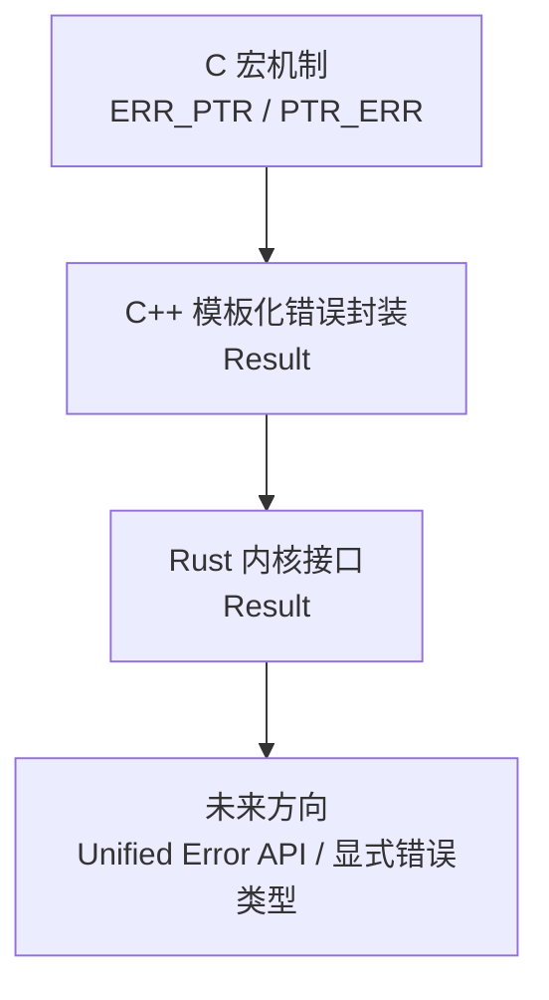

------

## 9.8_应用层与内核层协作

虽然用户空间无法直接看到 `ERR_PTR()`，
 但其返回值最终会以 errno 的形式暴露：

| 内核返回           | 用户空间 errno | 含义       |
| ------------------ | -------------- | ---------- |
| `ERR_PTR(-EINVAL)` | `EINVAL`       | 参数非法   |
| `ERR_PTR(-ENOMEM)` | `ENOMEM`       | 内存不足   |
| `ERR_PTR(-ENODEV)` | `ENODEV`       | 设备不存在 |

这种 **一体化错误体系** 体现出内核与用户空间错误语义的一致性。

------

## 9.9_小结

| 项目              | 内容                                                 |
| ----------------- | ---------------------------------------------------- |
| 模块演进方向      | 从宏到类型系统，从隐式到显式                         |
| 新语言实现        | Rust: `Result<T, Error>`；C++: `std::expected<T, E>` |
| Unified Error API | 正在讨论中的 C 层类型安全方案                        |
| 与现行机制关系    | 完全兼容 ERR_PTR 语义                                |
| 设计哲学          | Error as Object → Error as Value                     |
| 系统意义          | 提升类型安全性、代码可读性与错误可追踪性             |
| 未来目标          | 统一跨语言错误语义，为 C/Rust/C++ 驱动共存奠基       |


------

# 第10章_错误指针机制的总结与思维导图

（模块：Linux 内核错误指针机制 Error Pointer System）

------

## 10.1_章节内容说明

本章对整个错误指针机制模块进行系统总结，
 以 **知识导图 + 结构化表格 + 实践结论** 的形式整合前九章内容，
 帮助读者从全局理解该机制的内核地位、语义逻辑与开发价值。

章节内容包括：

1. 机制概览与历史定位
2. 核心宏与函数速查表
3. 调用链与传播模型总结
4. 与 devres 的闭环关系
5. 子系统统一应用回顾
6. 调试验证方法索引
7. 思维导图（Mermaid）
8. 全章结论

------

## 10.2_机制概览

### 10.2.1_内核定位

错误指针机制是 Linux 内核中最核心的错误传递系统之一，
 属于 **driver core + lib/err.c** 共同维护的基础层组件。

| 分类       | 模块位置                | 主要作用                                   |
| ---------- | ----------------------- | ------------------------------------------ |
| 通用宏定义 | `include/linux/err.h`   | 定义 ERR_PTR / PTR_ERR / IS_ERR 等核心接口 |
| 内核实现   | `lib/err.c`             | 实现指针与错误码的互转函数                 |
| 框架集成   | `drivers/base/driver.c` | 驱动探测错误路径统一                       |
| 资源管理   | `drivers/base/devres.c` | 与 devm 自动回滚机制协作                   |
| 调试辅助   | `lib/debugobjects.c`    | 检测异常错误指针引用                       |

------

### 10.2.2_设计目标

| 目标       | 含义                               |
| ---------- | ---------------------------------- |
| 统一语义   | 无论何种函数类型，都可返回错误状态 |
| 零全局依赖 | 不使用 errno，全局无状态           |
| 类型兼容   | 不破坏原始返回类型（struct *）     |
| 自动传播   | 错误沿调用链自然上传               |
| 安全隔离   | 错误地址区不可访问，防止误用       |

------

## 10.3_核心宏与函数速查表

| 宏/函数                | 定义                                 | 功能                                       |
| ---------------------- | ------------------------------------ | ------------------------------------------ |
| `ERR_PTR(err)`         | `(void *)((long)(err))`              | 将负错误码转为指针                         |
| `PTR_ERR(ptr)`         | `((long)(ptr))`                      | 从错误指针恢复错误码                       |
| `IS_ERR(ptr)`          | `IS_ERR_VALUE((unsigned long)(ptr))` | 判断指针是否为错误指针                     |
| `IS_ERR_VALUE(x)`      | `(x >= (unsigned long)-MAX_ERRNO)`   | 判断地址值是否在错误区间                   |
| `ERR_CAST(ptr)`        | `(void *)(ptr)`                      | 类型安全的指针转换（主要用于强制类型匹配） |
| `PTR_ERR_OR_ZERO(ptr)` | `IS_ERR(ptr) ? PTR_ERR(ptr) : 0`     | 快捷错误/成功判定                          |
| `IS_ERR_OR_NULL(ptr)`  | `(!ptr                               |                                            |

------

## 10.4_调用链与传播模型总结

```mermaid
flowchart TD
    A["底层函数：devm_gpiod_get()"] -->|失败→ERR_PTR(-ENOENT)| B["中层：probe()"]
    B -->|return PTR_ERR(ptr)| C["driver_probe_device()"]
    C -->|ret=-ENOENT| D["really_probe()"]
    D -->|ret<0| E["devres_release_all() 自动回滚"]
    E -->|日志输出| F["platform_driver_register() / dmesg"]
```

该流程适用于所有 `devm_*()` 资源函数。
 只要任意资源申请失败，错误码沿链向上传递并触发回滚。

------

## 10.5_与_devres_的闭环关系

| 阶段     | 函数                   | 行为                                    |
| -------- | ---------------------- | --------------------------------------- |
| 资源申请 | `devm_*()`             | 成功 → 注册节点；失败 → ERR_PTR(-errno) |
| 错误检测 | `IS_ERR()`             | probe() 中判断失败点                    |
| 错误提取 | `PTR_ERR()`            | 获取负错误码返回                        |
| 回滚执行 | `devres_release_all()` | 自动释放先前注册资源                    |
| 日志输出 | `dev_err()`            | 输出失败设备与错误号                    |

这种闭环机制实现了**内核级资源事务性**。

------

## 10.6_子系统统一应用总结

| 子系统    | 核心接口                | 错误返回方式             | 可选模式                        |
| --------- | ----------------------- | ------------------------ | ------------------------------- |
| GPIO      | `devm_gpiod_get()`      | `ERR_PTR(-ENOENT)`       | `devm_gpiod_get_optional()`     |
| CLK       | `devm_clk_get()`        | `ERR_PTR(-EPROBE_DEFER)` | `devm_clk_get_optional()`       |
| REGULATOR | `devm_regulator_get()`  | `ERR_PTR(-EINVAL)`       | `devm_regulator_get_optional()` |
| PINCTRL   | `devm_pinctrl_get()`    | `ERR_PTR(-ENODEV)`       | 无                              |
| I2C       | `devm_i2c_new_device()` | `ERR_PTR(-ENODEV)`       | 无                              |

> 所有 devm_*() 接口都依赖错误指针机制完成失败路径控制。

------

## 10.7_调试与验证方法索引

| 工具              | 配置项                     | 作用                         |
| ----------------- | -------------------------- | ---------------------------- |
| `dynamic_debug`   | `CONFIG_DYNAMIC_DEBUG=y`   | 动态启用文件级调试输出       |
| `KASAN`           | `CONFIG_KASAN=y`           | 检测错误指针解引用           |
| `DEBUG_PAGEALLOC` | `CONFIG_DEBUG_PAGEALLOC=y` | 捕获访问错误页               |
| `dmesg`           | 无                         | 验证 probe() 错误链          |
| `kprobe`          | 无                         | 追踪 devres_release_all 调用 |
| 模块实验          | 手动 ERR_PTR 测试模块      | 验证核心行为与页错误触发     |

------

## 10.8_错误指针机制结构思维导图

> **兼容 Typora / Mermaid 渲染器（v11.9+）**

```mermaid
mindmap
  root((Linux 内核错误指针机制))
    设计哲学
      单返回通道
      错误即对象
      函数式错误传播
    核心接口
      ERR_PTR(err)
      PTR_ERR(ptr)
      IS_ERR(ptr)
      IS_ERR_OR_NULL(ptr)
      PTR_ERR_OR_ZERO(ptr)
    内核实现
      MAX_ERRNO = 4095
      错误区间: 0xfffffffffffff001 ~ 0xffffffffffffffff
      lib/err.c & include/linux/err.h
    关键模块
      driver_probe_device()
      really_probe()
      devres_release_all()
      devm_*() 系列函数
    子系统应用
      GPIO
      CLK
      REGULATOR
      PINCTRL
      I2C
    调试与验证
      dynamic_debug
      KASAN
      dmesg
      模块实验
    扩展演化
      Rust: Result<T, Error>
      C++: std::expected<T, E>
      Unified Error API
```

------

## 10.9_全章结论

| 维度         | 核心观点                                            |
| ------------ | --------------------------------------------------- |
| **机制层面** | 错误指针机制是 Linux 内核错误传播的统一基础设施。   |
| **设计哲学** | 函数返回值即结果；错误即值；错误自动传播。          |
| **实现层面** | 基于地址空间隔离实现安全、零成本的错误表示。        |
| **系统协作** | 与 devres、driver core 深度耦合，形成资源事务闭环。 |
| **应用层面** | 贯穿所有子系统（GPIO、CLK、REGULATOR、I2C...）。    |
| **调试层面** | 提供全套检测手段：KASAN、dynamic_debug、kprobe。    |
| **演化趋势** | 正向类型安全化（C++ expected / Rust Result）演进。  |

------

## 10.10_学习建议

1. **源码研读**：重点阅读以下文件：
   - `include/linux/err.h`
   - `lib/err.c`
   - `drivers/base/devres.c`
   - `drivers/base/driver.c`
2. **实验验证**：
   - 自编内核模块验证错误指针返回与回滚；
   - 模拟多层函数返回链观察错误码传播；
   - 利用 `KASAN` 追踪未判断错误的访问行为。
3. **扩展思考**：
   - 比较内核 `ERR_PTR()` 与用户空间 `errno` 的差异；
   - 思考 Rust `Result<T, Error>` 在 C 层的潜在封装方式；
   - 探索未来统一错误类型接口的实现路径。

------

## 10.11_小结

| 模块     | 概要                                     |
| -------- | ---------------------------------------- |
| 章节范围 | 第1章至第10章                            |
| 技术核心 | ERR_PTR / PTR_ERR / IS_ERR 宏体系        |
| 关键机制 | 错误指针区、devres 回滚、统一错误传播    |
| 核心哲学 | Error as Object → Error as Value         |
| 应用深度 | 驱动框架、GPIO/CLK/I2C/PINCTRL/REGULATOR |
| 调试手段 | dynamic_debug / KASAN / dmesg            |
| 未来方向 | 类型化、显式化、跨语言统一化             |


------

# 第11章_附录A_错误指针与_errno_对照表

## 11.1_附录说明

本附录收录 Linux 内核常见的错误码及其对应的 `ERR_PTR()` 指针值区间，
 便于驱动开发者在分析 dmesg 或调试日志时，快速识别错误来源。

------

## 11.2_A.1_常见_errno_与语义

| errno | 宏名           | 英文释义                  | 中文解释                            |
| ----- | -------------- | ------------------------- | ----------------------------------- |
| 1     | `EPERM`        | Operation not permitted   | 操作不被允许                        |
| 2     | `ENOENT`       | No such file or directory | 对象不存在（典型：GPIO 节点未定义） |
| 5     | `EIO`          | Input/output error        | I/O 操作错误                        |
| 6     | `ENXIO`        | No such device or address | 设备或地址不存在                    |
| 11    | `EAGAIN`       | Try again                 | 资源暂不可用（可能重试）            |
| 12    | `ENOMEM`       | Out of memory             | 内存不足                            |
| 13    | `EACCES`       | Permission denied         | 权限错误                            |
| 14    | `EFAULT`       | Bad address               | 地址访问错误                        |
| 16    | `EBUSY`        | Device or resource busy   | 设备/资源被占用                     |
| 17    | `EEXIST`       | File exists               | 节点已存在                          |
| 19    | `ENODEV`       | No such device            | 设备未注册或禁用                    |
| 22    | `EINVAL`       | Invalid argument          | 参数非法（最常见）                  |
| 23    | `ENFILE`       | File table overflow       | 系统文件表满                        |
| 28    | `ENOSPC`       | No space left on device   | 空间不足                            |
| 95    | `EOPNOTSUPP`   | Operation not supported   | 不支持的操作                        |
| 110   | `ETIMEDOUT`    | Connection timed out      | 超时                                |
| 517   | `EPROBE_DEFER` | Driver probe deferred     | 驱动延迟探测（资源依赖未满足）      |

------

## 11.3_A.2_ERR_PTR_值对照(以_64_位内核为例)

| 错误码                | ERR_PTR 值           | 备注             |
| --------------------- | -------------------- | ---------------- |
| -2 (`ENOENT`)         | `0xfffffffffffffffe` | 最常见错误指针值 |
| -12 (`ENOMEM`)        | `0xfffffffffffffff4` | 内存分配失败     |
| -16 (`EBUSY`)         | `0xfffffffffffffff0` | 资源冲突         |
| -19 (`ENODEV`)        | `0xffffffffffffffee` | 无设备           |
| -22 (`EINVAL`)        | `0xffffffffffffffeA` | 参数非法         |
| -517 (`EPROBE_DEFER`) | `0xfffffffffffffdfb` | 延迟探测         |
| -4095 (`MAX_ERRNO`)   | `0xfffffffffffff001` | 错误区起点       |

> ✅ 注意：这些值均位于地址区间 `0xfffffffffffff001 ~ 0xffffffffffffffff`，
>  即错误指针保留区（不可映射，不可访问）。

------

## 11.4_A.3_典型错误码与函数场景对照

| 错误码                | 出现场景         | 典型函数                                 |
| --------------------- | ---------------- | ---------------------------------------- |
| -2 (`ENOENT`)         | 设备树属性未找到 | `of_get_named_gpiod_flags()`             |
| -12 (`ENOMEM`)        | 资源分配失败     | `devm_kzalloc()`                         |
| -16 (`EBUSY`)         | 硬件占用冲突     | `regulator_register()`                   |
| -19 (`ENODEV`)        | 无匹配设备节点   | `i2c_new_device()`                       |
| -22 (`EINVAL`)        | probe 参数错误   | `platform_get_resource()`                |
| -517 (`EPROBE_DEFER`) | 依赖尚未就绪     | `devm_clk_get()`、`devm_regulator_get()` |

------

## 11.5_A.4_与用户空间_errno_的映射关系

| 内核返回                 | 用户空间 errno | 说明            |
| ------------------------ | -------------- | --------------- |
| `ERR_PTR(-ENOENT)`       | `ENOENT (2)`   | 文件/节点不存在 |
| `ERR_PTR(-ENOMEM)`       | `ENOMEM (12)`  | 内存不足        |
| `ERR_PTR(-EINVAL)`       | `EINVAL (22)`  | 参数无效        |
| `ERR_PTR(-ENODEV)`       | `ENODEV (19)`  | 设备不存在      |
| `ERR_PTR(-EBUSY)`        | `EBUSY (16)`   | 设备忙          |
| `ERR_PTR(-EPROBE_DEFER)` | `EAGAIN (11)`  | 延迟再试        |

------

## 11.6_A.5_特殊错误码说明

| 错误码          | 特殊说明                                                     |
| --------------- | ------------------------------------------------------------ |
| `-EPROBE_DEFER` | 表示依赖项（如时钟、GPIO、供电）尚未准备好，driver core 会重新调度 probe()。 |
| `-EAGAIN`       | 常用于临时资源不足或锁争用，不代表永久错误。                 |
| `-EIO`          | 底层 I/O 操作失败，通常来自硬件层中断/读写异常。             |
| `-EFAULT`       | 不可恢复的指针错误，可能访问无效地址。                       |
| `-EOPNOTSUPP`   | 某子系统未实现接口（例如 SPI 控制器不支持 DMA）。            |

------

# 第12章_附录B_ERR_PTR_源码索引与注释

------

## 12.1_B.1_include/linux/err.h(核心头文件)

```c
#define MAX_ERRNO   4095
#define IS_ERR_VALUE(x) unlikely((x) >= (unsigned long)-MAX_ERRNO)

#define ERR_PTR(error) ((void *)((long)(error)))
#define PTR_ERR(ptr) ((long)(ptr))
#define IS_ERR(ptr) IS_ERR_VALUE((unsigned long)(ptr))
#define IS_ERR_OR_NULL(ptr) (!(ptr) || IS_ERR(ptr))
#define PTR_ERR_OR_ZERO(ptr) (IS_ERR(ptr) ? PTR_ERR(ptr) : 0)
#define ERR_CAST(ptr) ((void *)(ptr))
```

> 所有内核模块均通过该头文件访问错误指针宏。

------

## 12.2_B.2_lib/err.c(实现文件)

```c
#include <linux/err.h>
#include <linux/export.h>

void * __must_check ERR_PTR(long error)
{
    return (void *) error;
}
EXPORT_SYMBOL(ERR_PTR);

long __must_check PTR_ERR(const void *ptr)
{
    return (long) ptr;
}
EXPORT_SYMBOL(PTR_ERR);

bool __must_check IS_ERR(const void *ptr)
{
    return IS_ERR_VALUE((unsigned long)ptr);
}
EXPORT_SYMBOL(IS_ERR);
```

> 提供了符号导出，供模块与子系统使用。

------

## 12.3_B.3_drivers/base/driver.c(驱动核心)

```c
ret = really_probe(dev, drv);
if (ret)
    driver_probe_device_failed(dev, drv, ret);
void driver_probe_device_failed(struct device *dev,
                                struct device_driver *drv,
                                int ret)
{
    dev_err(dev, "%s: probe of %s failed with error %d\n",
            drv->name, dev_name(dev), ret);
}
```

> 所有 probe() 的负错误码均由此处输出到内核日志。

------

## 12.4_B.4_drivers/base/devres.c(资源管理)

```c
void devres_release_all(struct device *dev)
{
    struct devres_node *node;

    while (!list_empty(&dev->devres_head)) {
        node = list_first_entry(&dev->devres_head, struct devres_node, entry);
        list_del(&node->entry);
        node->release(node + 1);
    }
}
```

> 当 probe() 返回 `PTR_ERR()` 错误码时，devres 会被统一回滚。

------

## 12.5_B.5_drivers/gpio/gpiolib.c(子系统示例)

```c
struct gpio_desc *gpiod_get(struct device *dev, const char *con_id,
                            enum gpiod_flags flags)
{
    desc = of_get_named_gpiod_flags(...);
    if (IS_ERR(desc))
        return desc; /* 直接传递错误指针 */
    return desc;
}
```

> GPIO 子系统完全遵循错误指针语义，
>  不额外包装错误码，直接传播给调用方。

------

## 12.6_B.6_include/linux/devm-helpers.h(devres_协作接口)

```c
void devres_add(struct device *dev, void *res);
void devres_release_all(struct device *dev);
```

> `devm_*()` 与错误指针的协作核心在于：
>  **申请成功 → 注册节点；失败 → ERR_PTR(-errno)。**

------

# 第13章_附录C_内核源码引用建议

| 文件路径                 | 模块作用                             |
| ------------------------ | ------------------------------------ |
| `include/linux/err.h`    | 错误指针宏定义                       |
| `lib/err.c`              | 错误指针函数实现                     |
| `drivers/base/devres.c`  | devres 自动资源管理                  |
| `drivers/base/driver.c`  | driver core 错误传播                 |
| `drivers/gpio/gpiolib.c` | GPIO 框架示例                        |
| `include/linux/device.h` | struct device 定义与 devres 链表入口 |

------

# 第14章_附录D_读者扩展任务

1. **实验任务：**
   - 自行实现一个 `ERR_PTR_TEST` 模块，打印 `ERR_PTR(-EINVAL)` 的值；
   - 在 `probe()` 中返回 `PTR_ERR()`，观察日志输出与回滚。
2. **源码阅读任务：**
   - 阅读 `lib/err.c` 与 `drivers/base/devres.c` 的调用关系；
   - 确认错误码在 `driver_probe_device()` 中被原样传递。
3. **问题思考：**
   - 为什么 `ERR_PTR()` 机制能在 SMP + NUMA 架构下无锁工作？
   - 若 MAX_ERRNO 改为 8191，会造成什么影响？
   - 在 Rust 驱动中是否仍需 ERR_PTR？为什么？

------

# 第15章_附录E_模块总结

| 分类       | 文件位置                 | 内容             |
| ---------- | ------------------------ | ---------------- |
| **定义层** | `include/linux/err.h`    | 宏与数值逻辑     |
| **实现层** | `lib/err.c`              | 函数实现与导出   |
| **使用层** | `drivers/base/*`         | 驱动框架集成     |
| **验证层** | `KASAN`、`dynamic_debug` | 调试验证支持     |
| **演化层** | Rust / C++               | 类型安全扩展方向 |

