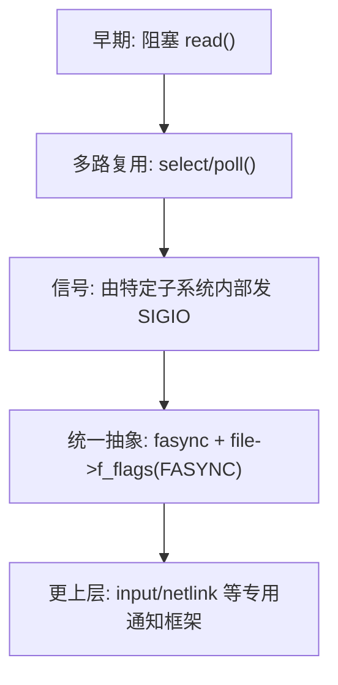
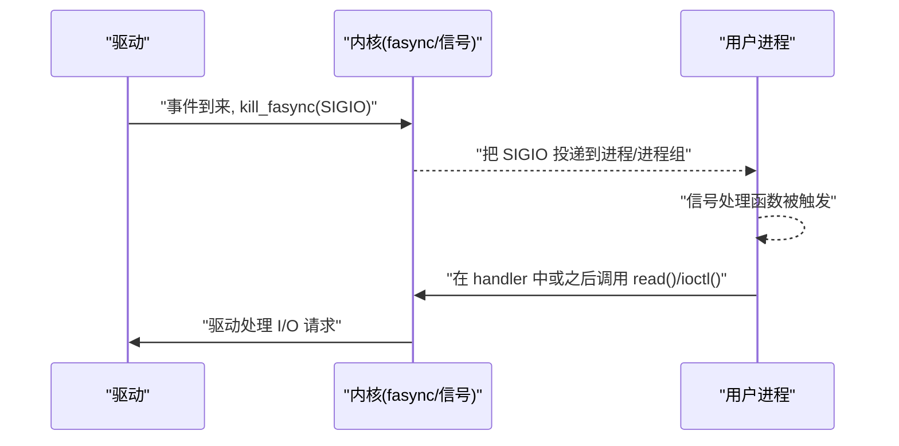
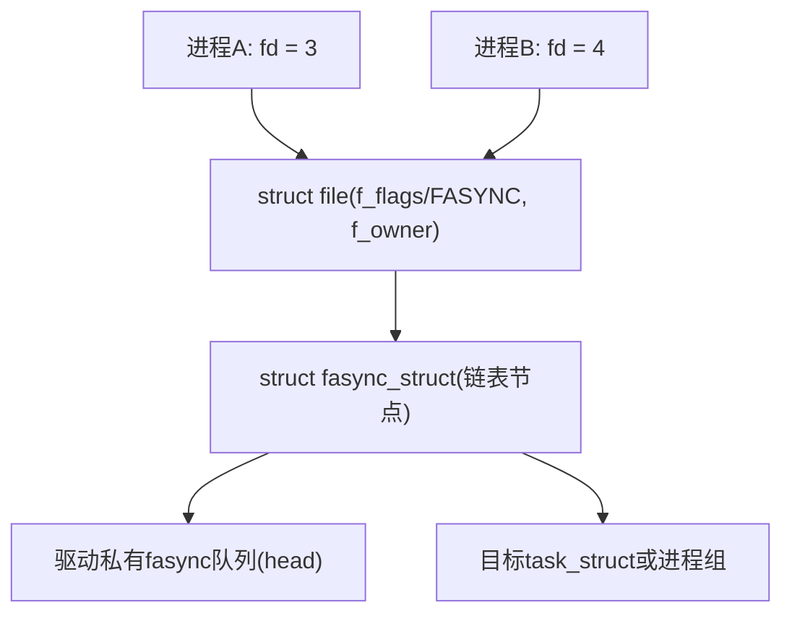
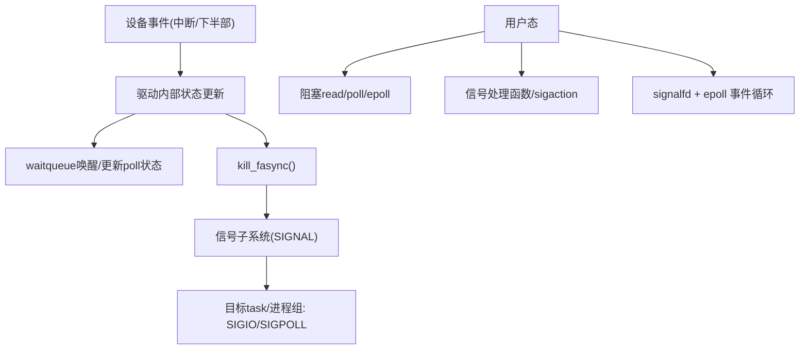

# 第3章\_fasync\_机制的历史与设计动机

> **章节内容说明**
>  本章从“历史背景 + 设计目标 + 约束条件 + 与其他机制对比 + 现代工程价值”五个角度，把 fasync 放回到 Linux I/O 与信号整体生态里看它“为什么会长成这样、能干什么、不能干什么”。
>  本章不急着给 API 使用细节，重点是把“这东西本来要解决的那类问题”讲清楚，为后面第 4～10 章的细节做铺垫。

------

## 3.1\_fasync\_的历史演进与使用场景

这一节主要回答三个问题：

1. **历史背景：** 在没有 fasync 的年代，I/O 通知是怎么做的？
2. **机制演进：** Linux 为什么会在 select/poll 之外，再搞一个 fasync + SIGIO？
3. **典型场景：** fasync 最初和主要被哪些设备类型使用，它天然适合哪类驱动？

### 3.1.1\_没有\_fasync\_时的\_I/O\_通知手段

从“历史”视角看 I/O 通知演进，可以非常粗略地划成几层：

- **阻塞 I/O**：
  - 用户调用 `read()` / `write()`，线程直接阻塞在系统调用里，直到设备就绪或超时/信号打断。
  - 驱动侧基本只负责在就绪时唤醒等待队列，完全没有“主动通知”用户进程的概念。
- **多路复用：select/poll**：
  - 用户可以在一个线程里等待多个 fd 的事件，可读/可写/异常。
  - 这是一个**“用户主动轮询、内核进行事件筛选”**的模型：用户先调用 `select/poll`，内核才知道“哪些 fd 目前是关心的”。
- **信号通知（SIGIO等）**：
  - 传统 UNIX 中，某些 I/O 事件可以通过 `SIGIO` 等信号通知进程。
  - 但在早期，驱动层对这些信号的控制较粗糙，更多是文件系统层或 TTY 子系统内部的实现细节。

在这一阶段，驱动开发者**缺少一个统一的、可复用的“驱动主动通知用户态”机制**：
 如果你是一个普通字符设备驱动作者，只能：

- 提供阻塞 `read()` + `waitqueue`；
- 或者实现 `.poll()`，让用户走 `select/poll`。

**驱动本身**很难简单地说一句：“我这边收到一个事件了，帮我给拥有这个 fd 的进程发个 SIGIO 吧”。

### 3.1.2\_Linux\_中引入\_fasync\_的动机(历史层面)

fasync 机制可以看成 Linux 为了“**把信号通知能力下沉到驱动层，并统一抽象出来**”而做的一次封装：

- 在 VFS 层面引入 `file->f_flags` 中的 `FASYNC` 标志；
- 在 `struct file_operations` 里增加 `.fasync` 回调；
- 提供统一的辅助函数 `fasync_helper()` 和 `kill_fasync()`：
  - 前者用于在驱动侧维护 `struct fasync_struct` 链表；
  - 后者用于在“事件发生时”真正向目标任务/进程组发信号。

从结果上看，fasync 做了两件事情：

1. **把“哪些进程对这个文件的异步通知感兴趣”这件事抽象成一个内核维护的链表（`struct fasync_struct`）**。
2. **把“如何给这些进程发信号”这件事封装成 `kill_fasync()`，驱动只需在恰当时机调用。**

用简单的演进图可以概括：



这里要强调两个关键点：

- **fasync 不是“替代 select/poll”，而是补充**：
   它主要解决“设备一旦有事件就可以主动把信号推给用户”的需求，而不需要用户一直在 `select/poll` 里等。
- **fasync 的设计非常“VFS 化”**：
   它不是某个具体设备类型（如 TTY）的专属能力，而是一个通过 `file_operations` 插到 VFS 里的通用机制。

### 3.1.3\_典型使用场景与设备类型

从历史和实际代码分布看，fasync 主要活跃在下面几类设备中：

1. **TTY/串口等终端类设备**
   - 典型需求：上位机程序需要在收到串口数据时立刻被“打断”，以便处理控制命令。
   - 如果只用 select/poll，需要线程一直阻塞在那；而用 fasync + SIGIO，可以让进程在处理其他逻辑时被异步信号打断。
2. **网络 socket（部分场景）**
   - 虽然现代网络编程几乎都是 epoll，但历史上 `SIGIO` 也用于网络 I/O 通知。
   - 内核中针对 socket 也有对应的 fasync 支持。
3. **普通字符设备（GPIO、按键、简单外设）**
   - 一些**低频事件型**设备（例如 GPIO 按键、少量外部中断源），非常适合用 fasync：
     - 事件数量不大；
     - 每次事件处理逻辑相对较重（用户态需要立刻做点事情）；
     - 用户态使用信号模型比较自然（例如嵌入到已有的信号框架里）。
4. **部分老的、或者历史包袱较重的驱动**
   - 例如早期驱动为了兼容已有用户空间程序，继续保留 fasync 支持，即便后来又补充了 poll/epoll 支持。

可以简单用一个“场景分类”表来记忆 fasync 的典型位置：

| 设备类型/场景                | 事件频率 | 用户态典型模式            | fasync 使用情况                  |
| ---------------------------- | -------- | ------------------------- | -------------------------------- |
| 串口/TTY 控制通道            | 中低     | 控制命令、交互式终端      | 早期常用，现代部分保留           |
| 简单 GPIO 按键 / 外部事件    | 低       | 偶发事件，立刻处理        | 很适合用 fasync，示例代码常见    |
| 高速数据采集（ADC、视频流）  | 高       | 连续流数据 + 缓冲管理     | fasync 不合适，更多用 poll/epoll |
| 网络 socket                  | 中高     | 事件循环（epoll 主流）    | 历史上用过 fasync，现代较少      |
| 复杂子系统（input、netlink） | 中高     | 专用框架 + 自己的通知模型 | 一般不直接暴露 fasync 给驱动作者 |

后面第 7 章和第 8 章会基于 GPIO 中断和流式设备分别展开更细的实践，这里只给出一个宏观视角：**fasync 更适合“事件稀疏、每个事件意义较重”的设备，不适合高频流数据。**

------

## 3.2\_让驱动主动叫醒用户\_的设计目标

3.1 讲的是“从哪儿来的”和“最常去哪儿”，这一节转向 fasync 的**核心设计目标**：

> **给驱动一个统一、可靠的入口，使其在设备事件到来时可以主动触达用户进程，而不依赖用户“正好在某个系统调用里等待”。**

### 3.2.1\_被动等待\_vs\_主动通知

先对比两种典型模式：

1. **被动等待（poll/阻塞 read 等）**
   - 模型：
     - 用户进程：`while (1) { poll(...); read(...); }`
     - 驱动：在事件到来时唤醒等待队列，`poll` 返回就绪。
   - 特点：
     - 线程必须显式处于“等待调用”里；
     - 如果用户此时在干别的事情（计算、等待其他锁等），设备的事件不会主动打断它，而是等下一次进程自己再调用 `read/poll` 时才能感知。
2. **主动通知（fasync + SIGIO）**
   - 模型：
     - 驱动：事件发生时调用 `kill_fasync()`；
     - 内核：把 SIGIO/自定义信号推送到目标任务（或任务组）；
     - 用户：在信号处理函数中得知“有某个 fd 就绪了”，然后再选择是否 `read()`。
   - 特点：
     - **驱动是“主动的”：** 不用管用户现在在干嘛，只要事件发生，就发信号；
     - **用户可以采用“信号驱动”的控制逻辑：** 主循环干自己的事，被 SIGIO 打断时再处理 I/O。

可以用一个简单的时序图表示两种模式的差异（这里只画 fasync 模式）：



在这个模型下，**“谁驱动谁”发生了变化**：

- poll 模式是：“用户驱动内核”——用户主动发起等待；
- fasync 模式则是：“设备事件驱动用户”——驱动触发信号，用户被打断。

### 3.2.2\_fasync\_设计目标拆解

从内核设计者角度看，fasync 要实现的目标可以拆成几条具体要求：

1. **统一的驱动接口**
   - 所有支持异步通知的文件类型（字符设备、socket、管道等），尽量通过统一接口暴露出来：
     - VFS 层统一处理 `O_ASYNC/FASYNC` 标志；
     - 每个文件类型（file_operations 的实现）可以选择是否实现 `.fasync` 回调。
2. **与 fd/进程/进程组语义兼容**
   - 用户空间已经有 `fcntl(F_SETOWN)`、`F_SETSIG` 这样的接口用来指定“哪个任务（或任务组）应该收到信号”。
   - fasync 必须在这个既有框架下工作，不能另造一套所有权机制。
   - 这直接导致 fasync 的设计里必须考虑：
     - 单进程 vs 进程组；
     - 同一个 fd 被 `fork()` 到多个进程的情况；
     - 同一设备多次 open、多个 fd 对应一个设备的情况。
3. **与文件描述符语义对齐**
   - fasync 不直接面向“设备”，而是面向“打开的文件描述符”：
     - 只有在某个 `struct file` 上设置了 `FASYNC`，才会为它维护 fasync 链表节点；
     - `close()` 或 `release()` 时要正确地把对应节点从 fasync 链表里删除。
   - 这保证了 fasync 能自然融入 VFS 体系，而不是和 VFS 并行的一套私有机制。
4. **对驱动作者来说足够简单**
   - 驱动作者只需要处理几个点：
     - 在 `.open()` / `.release()` / `.fasync` 中维护 `struct fasync_struct *`；
     - 在事件到来时调用 `kill_fasync()`。
   - 至于“信号如何排队、如何路由到具体进程”，都交给内核通用的信号子系统。

这一点在 `file_operations` 的接口设计里体现得非常明显：驱动只需要挂一个 `.fasync`，其签名统一为：

```c
static int demo_fasync(int fd, struct file *filp, int on)
{
	int ret;

	/* 使用 fasync_helper 维护 fasync 链表 */
	ret = fasync_helper(fd, filp, on, &demo_fasync_queue);
	if (ret < 0)
		return ret;

	return 0;
}
```

> 说明：
>
> - `demo_fasync_queue` 是驱动维护的 `struct fasync_struct *` 指针，用来记录所有对该设备“打开 FASYNC”的文件。
> - `fasync_helper()` 负责在 `on` 为非 0 时把当前 `filp` 加入队列，在 `on` 为 0 时从队列移除。
> - 驱动在设备事件发生时只要调用 `kill_fasync(&demo_fasync_queue, SIGIO, POLL_IN);` 即可。

这里暂时不展开 `fasync_helper()`、`kill_fasync()` 的内部细节，第 4 章会从数据结构和调用路径的角度详细展开。此处只要记住设计目标：**给驱动一个统一的入口，让它能主动叫醒用户。**

### 3.2.3\_与用户态编程模型的匹配

从用户态的视角看，fasync + SIGIO 实际上服务的是一类特定编程模型：

- 进程有自己的主循环（例如事件处理、状态机、UI、网络逻辑）；
- 不希望为了某个设备的 I/O 再额外开一个阻塞线程去 `poll`；
- 习惯或已经使用信号机制来处理各种异步事件（定时器信号、子进程退出信号等）。

在这种场景下，fasync 提供了一个非常自然的扩展点：

- 通过 `fcntl(F_SETOWN/F_SETSIG/F_SETFL)` 设置好异步通知参数；
- 收到 SIGIO 时在 handler 里看一下是哪个 fd 出事，再做相应处理；
- 主循环可以保持自己的节奏。

当然，这种模式也带来了信号编程的经典问题（可重入、复杂控制流等），本书会在第 9 章专门讨论“用户态怎么写”的细节。此处只强调一点：**fasync 的设计目标不是“提升吞吐”，而是“把设备事件和用户态控制逻辑连接起来”。**


------

## 3.3\_设计约束\_兼容文件描述符\_信号\_进程/进程组

这一节回答的问题是：

1. **是什么**：fasync 在内核里到底是绑在“文件”上，还是绑在“设备”上，还是绑在“进程/进程组”上？
2. **干什么**：为什么一定要和 `F_SETOWN`、`F_SETSIG`、fd 这些既有语义对齐？
3. **怎么实现**：内核是如何在 `struct file`、`struct fasync_struct` 和任务结构之间做映射的？

### 3.3.1\_三个对象\_文件\_信号\_进程/进程组

fasync 涉及三类内核对象，它们的关系可以概括为：

- **文件（struct file）**
  - 唯一标识一个打开的文件描述符（在某个进程的 fd 表里）。
  - 挂着 `f_flags`（包括 `FASYNC` 标志），以及指向具体 `file_operations`。
  - 每个支持 fasync 的文件类型，会在 `.fasync` 中维护一个 `struct fasync_struct` 链表。
- **异步通知状态（struct fasync_struct）**
  - 描述“哪些文件、属于哪些进程（或进程组）、使用哪个信号号码来收 SIGIO 类通知”。
  - 通常以链表形式挂在驱动私有的指针上（例如 `driver->fasync_queue`）。
- **任务（task_struct） / 进程组**
  - 表示真正接收信号的主体（`task_struct` 或其进程组）。
  - 所有权由 `fcntl(F_SETOWN/F_SETSIG)` 决定，并存储在 `struct file` 的 `f_owner` 成员中（内部是 `struct fown_struct`）。

可以画一个简化数据关系图（概念层面）：



关键点：**fasync 是以“文件（struct file）”为粒度，间接映射到“任务/进程组”**。
 这保证：

- 从 VFS 看：它只是 `file->f_flags` 和 `.fasync` 回调的一种常规扩展；
- 从信号子系统看：它只是通过通用的 `f_owner` / `fown_struct` 把信号投递给进程或进程组。

### 3.3.2\_F\_SETOWN\_/\_F\_SETSIG\_与\_fasync\_的耦合

用户态通过 `fcntl()` 配置异步通知时，会操作几类属性：

- `F_SETOWN`
  - 设置“谁是这个文件描述符异步通知的所有者”：
    - 可以是一个正数（单个进程 pid）；
    - 可以是一个负数（进程组 id）。
  - 内核会把这个信息填进 `file->f_owner`（`struct fown_struct`）里。
- `F_SETSIG`
  - 设置“异步通知使用哪个信号号码”，默认是 `SIGIO`；
  - 可以改成其他实时信号（例如 `SIGRTMIN+n`），方便在复杂应用中进行区分。
- `F_SETFL` + `O_ASYNC`/`FASYNC`
  - 通过设置 `FASYNC` 标志，触发 VFS 调用 `.fasync` 回调；
  - `.fasync` 回调里调用 `fasync_helper()`，根据 `on` 参数决定把当前 `file` 加入或移出 fasync 链表。

因此，fasync 实际上被上层约束为：

- **必须和 fcntl 家族接口配合工作**；
- **必须尊重“fd → file → owner（task/pgid）”这种既有映射关系**；
- **不能引入一套平行的“自定义 owner 机制”**，否则用户态会非常混乱。

从“设计约束”的角度看，fasync 被强制要求兼容：

- 既有的 UNIX fd 语义；
- 既有的信号所有权语义；
- 既有的进程/进程组模型。

### 3.3.3\_多个\_fd\_fork/dup\_与\_fasync\_链表

因为 fasync 是以 `struct file` 为粒度维护的，所以会出现一些有代表性的场景：

1. **同一个设备被多次 open：多个 struct file**
   - 每次 `open()` 都会创建一个新的 `struct file`；
   - 用户态对不同 fd 分别设置 `F_SETOWN/FASYNC`，可以形成多个异步通知 owner；
   - 驱动侧 `fasync_queue` 链表里会有多个 `struct fasync_struct` 节点，对应不同 `file`。
2. **fork 之后的 fd 继承**
   - `fork()` 时，子进程继承父进程的 fd 表，但内核会增加 `struct file` 的引用计数，而不是复制新的 `struct file` 对象；
   - 这意味着：父子进程共享同一个 `struct file`、同一个 `f_owner`；
   - 如果父进程设置了 FASYNC，则子进程同样受影响；
   - 行为如何具体表现，取决于实际 owner 设为单个 pid 还是进程组。
3. **dup/dup2 复制 fd**
   - `dup()` 会为当前 `struct file` 增加一个新 fd 号，但仍指向同一个 `struct file`；
   - 所有异步通知相关的状态（f_owner、FASYNC）在 `struct file` 级别上共享；
   - 对任意一个 dup 出来的 fd 做 `F_SETOWN`，会修改同一个 `f_owner`。

对于驱动开发者来说，这些细节直接约束了 `.fasync` 的实现与资源管理策略：

- **不能假设“一个设备只有一个异步通知 owner”**；
   实际上，驱动的 `fasync_queue` 可能挂着多个 `struct fasync_struct`，分别对应不同 `struct file`。
- **不能在 close() 时误删其他 fd 的 fasync 状态**；
   必须依赖 `fasync_helper()` 按 `file*` 精确删除。

### 3.3.4\_close()/release()\_与\_悬挂\_fasync\_struct\_问题

另一个重要约束是：**生命周期必须严谨匹配 `struct file` 的释放**。

- 当 `close()` 发生时，VFS 会调用对应的 `.release()` 回调；
- 驱动一般在 `.release()` 里调用 `demo_fasync(-1, filp, 0)`：
  - `on = 0` 表示删除对应 `file` 的 fasync 节点；
  - 内部调用 `fasync_helper(fd, filp, 0, &queue)`，把链表中的这个节点摘掉，并在必要时释放内存。

如果 `.release()` 中没有正确地清理 fasync 状态，就会出现：

- fasync 链表仍保存着指向已经无效 `struct file` 的节点；
- 后续 `kill_fasync()` 可能尝试给已经关闭的文件（或对应进程）发信号，导致各种难以排查的异常；
- 在竞态场景下（第 10 章会专门讲），甚至可能产生 UAF（use-after-free）风险。

从设计角度看，**fasync 自身的数据结构选择了“挂在驱动私有指针上 + 节点里持有 file/owner 信息”的形式**，这就要求：驱动必须在 `open/release/fasync` 中严格遵守协议，才能避免“悬空节点”。

------

## 3.4\_相对\_select/poll/epoll\_的优势与局限

这一节从**对比**视角看 fasync：

> 在已经有 `select/poll/epoll` 的前提下，fasync 还能做什么、不能做什么，合适在哪些场景里使用。

### 3.4.1\_通知模式对比\_轮询\_vs\_驱动触发

可以先用一张表对比四种常见通知模式：

| 机制           | 用户态模型                         | 内核侧触发点                      | 优势                               | 局限                                |
| -------------- | ---------------------------------- | --------------------------------- | ---------------------------------- | ----------------------------------- |
| 阻塞 I/O       | `read()` 阻塞直到就绪              | 设备就绪时唤醒 `read()`           | 简单、直观                         | 无法多路复用、一个线程盯一个 fd     |
| select/poll    | 在一组 fd 上等待事件               | 设备就绪时更新 `poll` 状态        | 统一等待多个 fd                    | 每次调用开销较大，fd 数多时效率较低 |
| epoll          | 基于事件源注册/删除 + 等待事件集合 | 设备就绪时触发 epoll 回调         | 大量 fd 时效率高，事件可复用       | 仅在 Linux 中存在，API 相对复杂     |
| fasync + SIGIO | 通过信号异步感知设备事件           | 设备就绪时 `kill_fasync()` 发信号 | 设备主动打断进程，方便嵌入控制逻辑 | 信号语义复杂，可重入性/调试难度较高 |

**本质差异**在于：

- select/poll/epoll：**用户先请求等待**，内核在事件到来时让这个等待返回；
- fasync：**驱动先触发事件**，内核把信号投递给目标任务，用户在任意控制流中被打断。

### 3.4.2\_fasync\_的优势

从工程角度看，fasync 主要有以下优势：

1. **进程可以保持自己的控制流，不必专门阻塞在 poll/epoll 上**
   - 对于已经有复杂主循环（例如 GUI、游戏逻辑、调度器）的程序，引入一个“信号驱动的 I/O 通知”不会破坏原有框架；
   - 只需要在信号处理逻辑里插入设备事件处理。
2. **与历史代码和 UNIX 信号生态兼容性好**
   - 很多老的应用程序已经使用 SIGIO 作为 I/O 通知手段；
   - 保留和理解 fasync 有利于维护这类系统。
3. **可以和 `signalfd` / `epoll` 组合形成“现代风格”事件循环**（第 9 章详细展开）
   - 驱动仍使用 fasync+SIGIO 通知；
   - 用户态用 `signalfd` 把信号流转成“伪 fd”；
   - 再把这个 fd 挂到 `epoll` 上，实现统一的事件循环。
4. **驱动代码中调用点非常清晰**
   - 一般只有“事件真实发生”的路径会调用 `kill_fasync()`；
   - 对于代码阅读和调试来说：很容易定位“是什么时间点发出了信号”。

### 3.4.3\_fasync\_的局限和典型问题

与 select/poll/epoll 对比，fasync 的局限也很明确：

1. **信号语义复杂，可重入性要求高**
   - 信号处理函数可能在**任意执行点**打断当前线程；
   - 若 handler 中做复杂工作，极易产生死锁、竞态、可重入错误；
   - 这与 epoll 的“显式事件循环”模式相比，错误更隐蔽，调试更困难。
2. **事件聚合和节流能力有限**
   - 设备高频产生事件时，`kill_fasync()` 可能导致信号风暴；
   - 即便内核在信号队列中做合并，用户态的处理开销依然可能很大；
   - 与 epoll 中的“就绪标志 + 一次处理多事件”模型相比，在高频场景下缺少结构性优势。
3. **事件路由复杂**
   - 多线程、多进程共享 fd 时，异步通知的 owner 是谁，行为是否符合预期，往往不直观；
   - 需要非常清楚 `F_SETOWN` 的语义以及进程/进程组的关系。
4. **与纯 fd 事件循环框架不完全一致**
   - select/poll/epoll 的世界里，“所有事件都是 fd 上的就绪状态”；
   - fasync 把一部分事件放到了“信号通道”上，对架构设计来说是另一种维度；
   - 不慎混用时容易出现“不知道这个设备是通过信号通知还是通过 poll 通知”的困惑。

总的来说，可以用一句精确描述：

> **fasync 在“控制逻辑驱动的低频事件”里有价值，在“高吞吐、多 fd 的统一 I/O 处理”场景中则不如 epoll 适配度高。**

### 3.4.4\_fasync\_与\_select/poll/epoll\_的组合使用

内核并不限制“只能用 fasync 或 poll 二选一”，驱动通常会：

- 同时实现 `.read()` / `.poll()` / `.fasync`；
- 提供多种通知路径，由用户态选择使用哪一种。

常见组合模式有：

1. **控制流走 SIGIO，数据流走 read/poll**
   - 信号用于“告诉用户有事件了”；
   - 实际的数据读取仍然通过 `read()` 或 `poll + read` 完成。
2. **在单进程环境用 fasync，在多进程/多路复用环境用 epoll**
   - 同一驱动支持两种上层使用方式，兼顾旧应用和新框架。

后面第 6 章会从驱动视角具体讲“如何在 `.read()`/`.poll()` 与 `.fasync` 之间保持状态一致性”，避免出现“poll 认为就绪，但信号没发”或“信号发了但 poll 状态未更新”的异常。

------

## 3.5\_为什么在现代项目里仍然值得理解和掌握\_fasync

虽然在新的用户空间项目中，很多人直接以 epoll/io_uring 为首选，但从**驱动开发者**的视角，理解 fasync 仍然有几个现实价值：

### 3.5.1\_兼容与维护\_大量存量代码仍在使用

- 主线内核与各大厂商 BSP 中，仍有大量驱动实现了 `.fasync`；
- 某些老设备或老应用程序依赖 `SIGIO` 行为：
  - 例如部分串口工具、监控程序、老式守护进程；
- 当你需要排查“**已经设置 FASYNC 却收不到 SIGIO**”这类问题时：
  - 不理解 fasync 的内部机制，很难高效定位问题；
  - 第 11 章会围绕这种典型故障做完整的排错流程。

### 3.5.2\_完整理解\_通知机制生态

在 Linux 里，围绕“通知”的机制包括：

- waitqueue + 阻塞 I/O；
- select/poll/epoll；
- signal（包括 `SIGIO`、`SIGPOLL` 等）；
- input 子系统 event 模型；
- netlink、kobject_uevent、sysfs 轮询；
- io_uring / AIO 等。

fasync 位于“**驱动层 + 信号层的交界**”，它是唯一一个**明确把“驱动事件”直接映射到“信号”**的通用机制。
 理解它的历史与实现，会大幅提升对整个通知生态的整体视图，这对：

- 设计新框架（例如自定义事件子系统）；
- 评估“在某个工程里该用什么通知机制”；

都有直接帮助，这也是第 12 章的主题。

### 3.5.3\_与\_signalfd/epoll\_的桥接价值

现代工程中，一个合理的折中做法是：

1. 驱动层仍使用 fasync + `SIGIO`；
2. 用户层通过 `signalfd` 把信号收敛为一个 fd；
3. 再把这个 fd 加入 `epoll` 统一管理。

这样可以同时获得：

- 驱动层简单清晰的 `kill_fasync()` 调用点；
- 用户层统一的“事件 = epoll 上的就绪 fd”模型。

要正确实现这一流程，必须理解：

- fasync 如何决定向谁发信号；
- `F_SETSIG` 设置的信号号如何映射到 `signalfd`；
- 什么时候应该清理 fasync 状态，避免退出过程中出现“退出后仍收信号”的情况。

这些内容会在第 9 章系统展开，本章只给出“为什么要理解它”的动机。

### 3.5.4\_面试\_调试与设计能力的体现

在很多内核/驱动相关岗位中，面试会考察候选人对以下问题的理解深度：

- “select/poll/epoll 与 signal/SIGIO 的区别与适用场景是什么？”
- “驱动如何向用户态主动发信号？用户态如何接收？”
- “当 fd 被多个进程共享时，SIGIO 的路由规则是什么？”

能从 fasync 的角度给出清晰、结构化的回答，实际上体现的是：

- 对 VFS、信号子系统、任务模型之间边界的理解；
- 对“机制定位”而不是“记 API”的掌握方式。

这类能力对于做复杂驱动、子系统设计和性能调优都是基础。

------

## 3.6\_本章小结\_fasync\_机制在整体生态里的角色定位

本章主要从**历史 + 设计动机 + 约束 + 对比 + 现代价值**五个方面说明了 fasync 的位置，可以用一张“定位图”做总结：



综合本章内容，可以把 fasync 的角色归纳为：

1. **从历史演进看**
   - fasync 是在“阻塞 I/O + select/poll + 信号”基础上，引入的一个**驱动到信号的桥接机制**；
   - 将“异步通知”从特定子系统的内部实现，抽象为 VFS 级别可复用的通用能力。
2. **从设计目标看**
   - 目标是“让驱动能主动叫醒用户”，而不是被动等待用户发起等待；
   - 必须兼容既有的 `F_SETOWN`、`F_SETSIG`、fd 模型，以及进程/进程组语义。
3. **从约束与实现看**
   - fasync 的数据结构（`struct fasync_struct`）以 `struct file` 为粒度挂链表；
   - 需要驱动在 `.open()` / `.release()` / `.fasync` 中严谨维护状态；
   - 必须考虑多 fd、多进程、多进程组以及 close() 竞态等问题。
4. **从与 select/poll/epoll 的对比看**
   - fasync 适合低频但逻辑重要的事件型设备；
   - 不适合高频、大量 fd 的高吞吐场景；
   - 可以与 poll/epoll 组合使用，构成多层通知模型。
5. **从现代工程价值看**
   - 大量存量驱动仍使用 fasync，需要维护和调试；
   - 理解 fasync 可以统一“通知机制”的知识地图，有助于架构决策；
   - 与 `signalfd`/`epoll` 组合可以获得合理的现代事件循环模式。

本章到此为止，核心是把 fasync 放回到整个 Linux I/O 与信号体系中，明确它不是一个“孤立 API”，而是“**驱动事件 → 信号**”这条路径上的关键机制。

从下一章（第 4 章）开始，我们会从**内核实现视角**深入到数据结构和控制路径：

- `file->f_flags` 中 `FASYNC` 标志如何传播；
- `struct fasync_struct` 的具体结构与链表组织方式；
- `fasync_helper()`、`.fasync` 回调和 `kill_fasync()` 在源码中的调用关系。