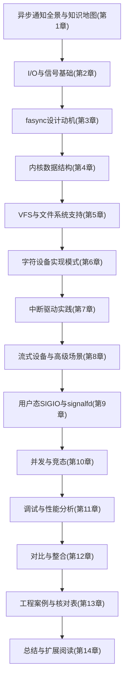
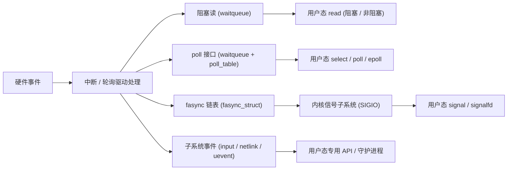
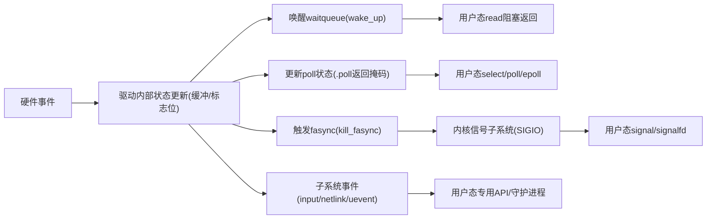
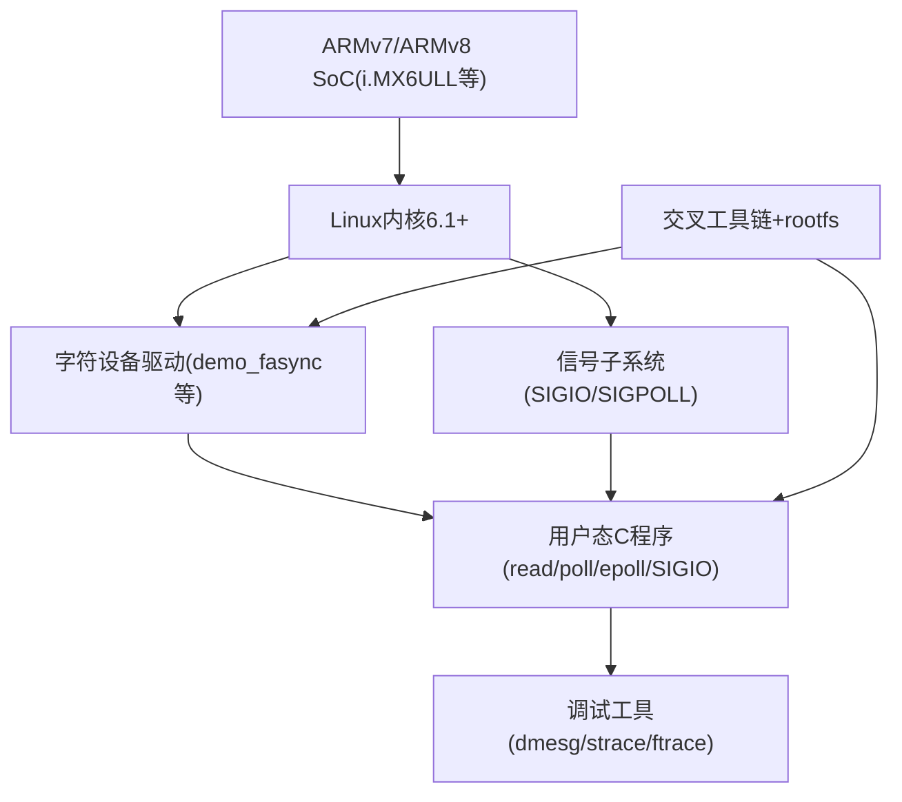
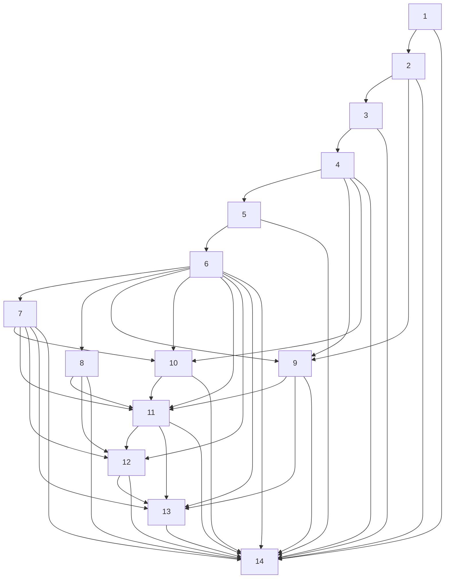

# 第1章_异步通知全景与知识地图

> 本章是全书的“总览章”，目标是把 Linux 驱动中的异步通知（尤其是 fasync / SIGIO）放入整个内核 I/O 与通知生态中，给出知识地图和学习路径。
>  本章按你约定的 8 段结构展开：引入 → 数据结构 → 开发者 → 用户/平台 → 可视化 → 示例代码 → 调试与验证 → 小结。

------

## 1.1_本书主题与目标

### 1.1.1_引入_为什么要单独写一册_异步通知

在 Linux 驱动开发中，“通知”相关的机制很多：

- 阻塞 / 非阻塞 I/O（read/write 阻塞与 `-EAGAIN`）
- `select/poll/epoll` 等事件等待接口
- 信号（`SIGIO` / `SIGPOLL`）
- 各种子系统自带的通知（input 事件、netlink、uevent 等）

其中，**fasync + SIGIO 这条线**具备几个特点：

1. **触发点在驱动**：由驱动在合适的时间点调用 `kill_fasync()` 主动触发。
2. **传输通道是信号**：通过内核信号子系统把事件送到进程或进程组。
3. **与 fd 绑定**：面向“文件描述符”，和 VFS / `struct file` 深度绑定。

这些特性决定了：
 如果你只把 fasync 当成“顺便了解一下的老接口”，往往会停留在概念层；
 但如果你打算写**系统级驱动**、**高可靠事件系统**、或者要维护**老驱动 + 新框架混合**的工程，那么体系化理解 fasync 及其在整个通知生态里的位置是有必要的。

本书的出发点是：

- 把 fasync 从零散的 API 印象，提升到**机制级理解**；
- 把 fasync 放进 **“I/O 等待 + 信号 + 子系统通知”** 的整体框架；
- 给出一套可以直接落地到项目中的**驱动模板 + 用户态模板 + 调试方法**。

------

### 1.1.2_数据结构视角_本书围绕的核心内核对象

从数据结构视角，本书会围绕以下几个内核抽象展开：

1. **`struct file` 与 `file->f_flags`**
   - `FASYNC` 位用于标记“此文件启用异步通知”。
   - 通过 `fcntl(F_SETFL)` 设置，驱动侧在 `.fasync` 回调中感知。
2. **`struct fasync_struct` 链表**
   - 描述一个“对某个 fd 开启异步通知的订阅者”。
   - 内核维护一条 fasync 链表，以支持多个进程/进程组对同一设备的订阅。
3. **`struct file_operations` 中的 `.fasync` 回调**
   - 驱动入口点：VFS 在 `F_SETFL` / `FASYNC` 变化时调用。
   - 驱动通过 `fasync_helper()` 把 `struct file` 加入/移出 fasync 链表。
4. **信号相关结构：`task_struct` / 信号队列**
   - `F_SETOWN` / `F_SETSIG` 决定信号发往哪个任务/进程组，以及使用哪个信号号。
   - `kill_fasync()` 最终调用信号发送路径。
5. **等待队列 / poll 等配套数据结构**
   - 实际工程中，fasync 很少单独使用，通常与 `wait_queue_head_t`、`poll_table` 等组合。
   - 本书会在后续章节把这些结构统一放到一个“事件管理”视角下讲解。

> 目标：读完本书，你对“一个 fasync 通路”涉及的数据结构应该有**完整的结构图**，而不是零散印象。

------

### 1.1.3_开发者视角_希望你最终能够做到什么

从驱动开发者的角度，本书的目标可以拆成几条明确的能力：

1. **能够独立实现一个支持异步通知的字符设备驱动**
   - 支持 `read()` 阻塞/非阻塞；
   - 支持 `poll()` / `epoll()`；
   - 同时支持 fasync + `SIGIO`，三者状态一致。
2. **能够安全地在中断上下文或下半部中触发 `kill_fasync()`**
   - 明确哪些上下文可以调用；
   - 明确需要什么锁、什么内存可见性保证；
   - 避免重复通知、错过通知和“信号风暴”。
3. **能够把现有轮询式驱动改造为 fasync 型驱动**
   - 识别“事件产生点”；
   - 正确地维护 fasync 链表和 `FASYNC` 标志；
   - 不破坏原有 `read/poll` 的语义。
4. **能够在实际工程中做出合理的选型决策**
   - 在 fasync、`poll/epoll`、input 子系统、netlink 等方案之间做取舍；
   - 明确“什么时候不用 fasync”。
5. **能够在 debug 时快速定位异步通知相关问题**
   - 收不到 SIGIO、信号号不对、进程不对、收多了/少了等。

对于 devm 接口：

- 本书会反复强调：**fasync 自身没有 devm 版本**，但 fasync 相关状态（例如设备结构体、本征资源）的生命周期会受 devm 管理影响；
- 每个驱动示例都会给出“非 devm 版本 + devm 风格重构思路”的对比。

------

### 1.1.4_用户_/_平台视角_假定读者基础与目标平台

从“读者和平台”的角度，本书默认几个前提，避免反复解释基础内容：

1. **读者基础假定**
   - 已熟悉基本的 Linux C 编程（用户态）；
   - 已有一定的驱动基础：会写最小字符设备，会用 `cdev`、`file_operations`；
   - 对中断、waitqueue、`poll()`、`epoll()` 至少在概念层面有了解；
   - 了解基本的交叉编译和在 ARM 平台上部署驱动与应用（与你当前背景契合）。
2. **平台与内核版本假定**
   - 默认平台：i.MX6ULL 这类 ARMv7/ARMv8 嵌入式 SoC；
   - 默认内核版本：**6.1+ LTS** 的主线风格接口（避免太老版本的特殊差异）；
   - 默认交叉构建环境：基于 Buildroot / Yocto / 手工交叉 toolchain 均可，本书示例在语义上不依赖特定构建系统。
3. **子系统与工程环境**
   - 本书以字符设备和简单中断型设备为主线；
   - 与 input 子系统、网络子系统的联系，只在需要对比时做接口级说明，不展开长篇实现细节。

若你在阅读中发现基础不足，可以回退到你之前的“设备模型 + platform_driver + input 子系统”笔记复习，本书不再重讲那部分知识。

------

### 1.1.5_可视化_本书知识地图(Mermaid_结构图)

下面这张图给出本书的知识结构关系，方便你在脑子里建立“地图而不是线性目录”：



阅读建议：

- 如果你只是想快速上手 fasync 驱动，可以重点看：第 4 / 5 / 6 / 7 / 9 / 13 章；
- 如果你要写系统化文档或做培训，可以按图中顺序，从第 1 章顺序看完。

------

### 1.1.6_示例代码_全书统一采用的最小_fasync_模板骨架

本书所有驱动示例会围绕一个统一的“最小 fasync 骨架”演化。
 下面这段代码只做“长相展示”，具体语义会在后续章节详细展开：

```c
/* demo_fasync.h */

#ifndef _DEMO_FASYNC_H_
#define _DEMO_FASYNC_H_

#include <linux/fs.h>
#include <linux/fasync.h>

#define DEMO_FASYNC_EVENTS_MASK		POLL_IN	/* 示例：有数据可读 */

struct demo_fasync_dev {
	struct fasync_struct	*fasync_queue;	/* fasync 链表头 */
	/* 这里还会有锁、缓冲区、硬件资源等成员，后续章节逐步补充 */
};

int demo_fasync(int fd, struct file *filp, int on);
void demo_fasync_kick(struct demo_fasync_dev *ddev, int band);

#endif /* _DEMO_FASYNC_H_ */
/* demo_fasync.c */

#include "demo_fasync.h"

int demo_fasync(int fd, struct file *filp, int on)
{
	struct demo_fasync_dev *ddev = filp->private_data;
	int ret;

	/* 使用 fasync_helper 维护 fasync 链表 */
	ret = fasync_helper(fd, filp, on, &ddev->fasync_queue);
	if (ret < 0)
		return ret;

	return 0;
}

/*
 * 当设备有新事件时（例如中断到来），驱动调用该函数触发异步通知。
 * 注意：band 字段用于区分事件类型，通常与 POLL_IN 等掩码关联。
 */
void demo_fasync_kick(struct demo_fasync_dev *ddev, int band)
{
	/* 这里后续会结合锁、上下文限制等进行完善 */
	if (ddev->fasync_queue)
		kill_fasync(&ddev->fasync_queue, band, POLL_IN);
}
```

后续章节中，你会看到：

- 非 devm 版本：`struct demo_fasync_dev` 手动分配与释放；
- devm 风格思路：用 `devm_kzalloc()` 管理设备结构体生命周期，fasync 状态随设备结构一起回收（但 fasync 本身没有 devm 版本）。

------

### 1.1.7_调试与验证视角_本书会如何组织这部分内容

本书会在每个“机制章节”之后给出一段专门的“调试与验证”小节，围绕以下几个方面：

1. **用户态排查路径**
   - 用 `strace` 看 `fcntl`、`sigaction`、`read`、`poll` 行为；
   - 用 `/proc/PID/status` 看进程的信号配置和 pending 状态。
2. **内核态排查路径**
   - 在 `.fasync` 和 `kill_fasync()` 处打 `pr_debug()` / `trace_printk()`；
   - 用 ftrace 跟踪调用路径；
   - 结合中断统计、工作队列执行次数来推断事件产生频率。
3. **典型错误场景的“最小复现”**
   - 设置了 `FASYNC` 却一直收不到 `SIGIO`；
   - 收到的信号号与预期不一致；
   - 一个进程收到了另一个进程的事件；
   - 信号风暴导致用户态事件处理线程占满 CPU。

在章节结构上，这些内容不会集中在一本“调试大章节”里，而是**每个关键机制章节都有对应的调试小节**，最后再在第 11 章做整体总结。

------

### 1.1.8_小结_本书希望解决的核心问题

本节作为总引言，可以压缩为几个关键句：

1. 本书以 **fasync + SIGIO** 为主线，把它放入整个 Linux 通知机制体系中系统化讲解。
2. 本书从 **数据结构（`struct file` / `struct fasync_struct` / 信号队列）** 出发，面向驱动开发者与用户态应用设计者，给出端到端的实现模式。
3. 本书默认你已有基本驱动与 Linux C 基础，以 i.MX6ULL + Linux 6.1+ 为代表平台进行说明。
4. 本书会给出完整的 **驱动模板 + 用户态模板 + 调试路径 + 工程核对表**，支持你在实际项目中独立实现和维护异步通知驱动。
5. devm 与非 devm 相关内容会在各驱动示例中对比呈现，而不会单独抽离成孤立章节。

到这里，第 1 章的总体目标与全书定位已经确立。
 接下来会进入 **1.2 Linux 中的多种“通知机制”概览**，把 fasync 放到更大的通知生态里对比说明。


------

## 1.2_Linux_中的多种_通知机制_概览

### 1.2.1_引入_通知机制在_I/O_子系统中的位置

在 Linux 中，“用户态得知设备发生了什么”的手段不止一种。常见路径可以粗分为两类：

1. **轮询型**：
   - 用户态主动调用 `read()`/`ioctl()`/自定义接口；
   - 要么阻塞等待，要么带 `O_NONBLOCK` 返回 `-EAGAIN`，由用户态循环重试。
2. **事件驱动型**：
   - 由内核在条件满足时，显式“告知”用户态；
   - 典型方式：`select()`/`poll()`/`epoll()`、信号（`SIGIO`）、子系统事件（input 事件、netlink、uevent 等）。

本节目标是：

- 把 **阻塞 / 非阻塞 / select / poll / epoll / fasync / 子系统事件** 放在同一张图里；

- 明确：**fasync 只是事件通知中的一条支路**，不是孤立存在；

- 为后续章节回答一个核心问题：

  > “在特定场景下，为什么选 / 不选 fasync？”

------

### 1.2.2_数据结构视角_不同通知机制依赖的核心对象

从内核实现角度，每一类通知机制都围绕特定数据结构展开：

1. **阻塞 I/O**
   - 核心对象：`wait_queue_head_t`
   - `read()` 在没有数据时，把当前任务挂入等待队列，睡眠；
   - 数据到来时，驱动调用 `wake_up()` / `wake_up_interruptible()` 唤醒等待队列上的任务。
2. **非阻塞 I/O**
   - 核心对象：`file->f_flags` 中的 `O_NONBLOCK` 标志；
   - 无额外数据结构，行为完全由驱动的 `.read()` / `.write()` 决定是否返回 `-EAGAIN`。
3. **select/poll/epoll**
   - select/poll：
     - 核心对象：`poll_table_struct`、每个文件对应的 `->poll()` 回调；
     - `.poll()` 通常会把 `poll_table` 关联到驱动内的 `wait_queue_head_t` 上（`poll_wait()`）。
   - epoll：
     - 核心对象：`struct eventpoll`、红黑树/链表组织的 fd 集合，以及 epoll 自己的等待队列；
     - 底层仍依赖各 fd 的 `.poll()` 接口。
4. **fasync + SIGIO**
   - 核心对象：
     - `struct fasync_struct` 链表（每个节点对应一个订阅异步通知的 `file`）；
     - `file->f_flags` 中的 `FASYNC` 标志；
     - 信号队列、`task_struct` 中的信号相关字段。
   - 触发时由驱动调用 `kill_fasync()`，通过信号子系统把事件送出。
5. **子系统级事件（以 input 为例）**
   - 核心对象：
     - input：`struct input_dev`、事件缓冲环形队列；
     - 用户态：`/dev/input/eventX` + `evdev` 层；
   - 通知机制：
     - 内核：使用 `input_event()` 上报，`evdev` 自己内部管理缓冲和 `poll`；
     - 用户态：使用 `read()`/`poll()`/`epoll()` 从 `eventX` 读事件。
6. **netlink、uevent 等**
   - 核心对象：`struct sock` / `struct netlink_sock` / `kobject_uevent_env` 等；
   - 通知方式：
     - netlink：用户态通过 socket 收消息；
     - uevent：用户态通过 `udevd` 等进程接收内核广播事件。

> 数据结构层面的差异，决定了各机制的扩展性、可组合性和适用场景。

------

### 1.2.3_开发者视角_实现成本与侵入性对比

从驱动开发者的角度，可以用“实现成本”和“对现有代码侵入程度”来衡量：

1. **仅使用阻塞/非阻塞 `read()`**
   - 成本最低：实现好 `read()` + 等待队列即可；
   - 改造侵入性小：通常只在数据到来时 `wake_up()` 即可；
   - 缺点：用户态必须专门调用 `read()` 才能获知事件。
2. **增加 `poll()` 支持**
   - 在 `file_operations` 中添加 `.poll` 回调；
   - `.poll()` 内部使用 `poll_wait()` 关联等待队列；
   - 改造侵入性：中等，主要是增加 `poll` 路径上的状态维护；
   - 收益：支持 `select`/`poll`/`epoll`，用户态可以统一管理多路 fd。
3. **增加 fasync + SIGIO 支持**
   - 需要：
     - 在 `file_operations` 中添加 `.fasync` 回调；
     - 在数据到来路径中调用 `kill_fasync()`；
     - 支持在 `open`/`release` 中正确处理 fasync 状态。
   - 改造侵入性：高于单纯 `poll`；
   - 收益：
     - 用户态不需要专门 `poll()` 或 `read()` 就能收到“有事件”信号；
     - 在某些架构中便于集成到已有的信号处理框架。
4. **接入 input/netlink 等子系统**
   - 改造成本大：需要引入完整子系统抽象；
   - 适合复杂设备或需要标准化接口的场景（键盘、鼠标、触摸、网络路由事件等）；
   - 收益：复用子系统的成熟框架，简化用户态使用。

从工程实践角度，**大部分简单设备**会做成：

- `read()` + `poll()`；
- 需要信号通知的场景再扩展 fasync；
- 更复杂的再考虑 input/netlink 等子系统化方案。

------

### 1.2.4_用户_/_平台视角_API_使用方式与适用场景

站在用户态使用者和系统整体平台的角度，可以用“开发成本 + 可维护性 + 可观测性”来比较：

1. **阻塞 I/O**
   - 用户态：循环调用 `read()`；
   - 适用：单一设备、逻辑简单；
   - 不适合：需要同时监控多路 fd；需要复杂事件分发。
2. **非阻塞 I/O + 轮询**
   - 用户态：`O_NONBLOCK` + 循环 `read()` 检查是否返回数据；
   - 简单但浪费 CPU，不适合长期运行的高负载系统。
3. **select/poll/epoll**
   - 用户态：
     - select/poll：小规模、多路；
     - epoll：大规模 fd、长生命周期事件循环；
   - 可维护性：高，通用模式，易与多数库/框架集成；
   - 适用：绝大多数现代服务/守护进程。
4. **fasync + SIGIO**
   - 用户态：
     - `fcntl(F_SETOWN)` 指定接收信号的进程/进程组；
     - `fcntl(F_SETFL, FASYNC | ...)` 打开异步通知；
     - 通过 `sigaction` 或 `signalfd` 接收 `SIGIO`；
   - 适用：
     - 已广泛使用信号的程序；
     - 需要快速获知“有事件”但数据处理可以推迟到其他线程。
   - 不适用：
     - 信号使用混乱、线程模型复杂且无统一设计的应用。
5. **子系统事件（input/netlink/uevent）**
   - 用户态：
     - input：通过 `/dev/input/eventX` + `read`/`poll`；
     - netlink：通过 socket 接收；
     - uevent：通过 `udevd` 等服务间接处理。
   - 适用：
     - 已有标准子系统支持的硬件类型；
     - 需要被其他系统组件统一处理的事件。

> 本书在后续章节会逐步展示：同一设备可以同时提供 `poll` 和 fasync，两者不是互斥关系，而是给用户态多种接入方式。

------

### 1.2.5_可视化_通知机制之间的关系图

下面用一张图把几个主要机制之间的关系示意出来（从“事件来源”到“用户态处理”）：



阅读侧重点建议：

- 若你尚未熟练使用 `poll/epoll`，建议先巩固第 2 章相关内容；
- 若你对信号机制不熟，需要结合后面的第 9 章一起阅读。

------

### 1.2.6_示例代码_三种典型使用模式对比

这里给出**用户态**三个最小示例的“骨架”，帮助你在脑中对比模式差异。
 假定已经有一个字符设备 `/dev/demo_async`，驱动已经支持 `read()`、`poll()` 和 fasync。

#### (1)_阻塞_read()_模式

```c
/* demo_block_read.c */

#include <stdio.h>
#include <unistd.h>
#include <fcntl.h>

#define DEMO_READ_BUF_SIZE_BYTES	128

int main(void)
{
	int fd;
	char buf[DEMO_READ_BUF_SIZE_BYTES];
	ssize_t n;

	fd = open("/dev/demo_async", O_RDONLY);
	if (fd < 0) {
		perror("open");
		return 1;
	}

	for (;;) {
		/* 阻塞等待：内核在有数据前不会返回 */
		n = read(fd, buf, sizeof(buf));
		if (n < 0) {
			perror("read");
			break;
		}
		/* 此处处理数据，略 */
	}

	close(fd);
	return 0;
}
```

#### (2)_poll()_模式

```c
/* demo_poll.c */

#include <stdio.h>
#include <unistd.h>
#include <poll.h>
#include <fcntl.h>

#define DEMO_POLL_TIMEOUT_MS	5000
#define DEMO_READ_BUF_SIZE_BYTES	128

int main(void)
{
	int fd;
	struct pollfd pfd;
	char buf[DEMO_READ_BUF_SIZE_BYTES];
	ssize_t n;
	int ret;

	fd = open("/dev/demo_async", O_RDONLY | O_NONBLOCK);
	if (fd < 0) {
		perror("open");
		return 1;
	}

	pfd.fd = fd;
	pfd.events = POLLIN;

	for (;;) {
		/* 统一等待机制：可以合并多个 fd，这里只演示一个 */
		ret = poll(&pfd, 1, DEMO_POLL_TIMEOUT_MS);
		if (ret < 0) {
			perror("poll");
			break;
		} else if (ret == 0) {
			/* 超时，无事件发生，可做其他逻辑 */
			continue;
		}

		if (pfd.revents & POLLIN) {
			n = read(fd, buf, sizeof(buf));
			if (n < 0) {
				perror("read");
				break;
			}
			/* 此处处理数据，略 */
		}
	}

	close(fd);
	return 0;
}
```

#### (3)_fasync_+_SIGIO_模式(只展示最小骨架)

```c
/* demo_sigio.c */

#include <stdio.h>
#include <unistd.h>
#include <fcntl.h>
#include <signal.h>
#include <string.h>

#define DEMO_READ_BUF_SIZE_BYTES	128

static int g_fd = -1;

static void demo_sigio_handler(int signo)
{
	char buf[DEMO_READ_BUF_SIZE_BYTES];
	ssize_t n;

	/* 简化示例：直接在信号处理函数中 read，一般建议更谨慎设计 */
	if (signo != SIGIO)
		return;

	if (g_fd < 0)
		return;

	n = read(g_fd, buf, sizeof(buf));
	if (n < 0) {
		perror("read in SIGIO");
		return;
	}

	/* 此处处理数据，实际工程中应避免在信号处理函数内做复杂操作 */
}

int main(void)
{
	int flags;
	struct sigaction sa;

	g_fd = open("/dev/demo_async", O_RDONLY | O_NONBLOCK);
	if (g_fd < 0) {
		perror("open");
		return 1;
	}

	memset(&sa, 0, sizeof(sa));
	sa.sa_handler = demo_sigio_handler;
	sigemptyset(&sa.sa_mask);

	if (sigaction(SIGIO, &sa, NULL) < 0) {
		perror("sigaction");
		close(g_fd);
		return 1;
	}

	/* 告诉内核：哪个进程应当接收 SIGIO */
	if (fcntl(g_fd, F_SETOWN, getpid()) < 0) {
		perror("F_SETOWN");
		close(g_fd);
		return 1;
	}

	/* 打开 FASYNC 标志 */
	flags = fcntl(g_fd, F_GETFL);
	if (flags < 0) {
		perror("F_GETFL");
		close(g_fd);
		return 1;
	}

	if (fcntl(g_fd, F_SETFL, flags | FASYNC | O_NONBLOCK) < 0) {
		perror("F_SETFL");
		close(g_fd);
		return 1;
	}

	/* 主循环不再主动 poll/read，仅做其他逻辑 */
	for (;;) {
		pause();	/* 等待任意信号，包括 SIGIO */
	}

	close(g_fd);
	return 0;
}
```

后续第 9 章会给出更规范的写法（如使用 `signalfd`，避免在信号处理函数内直接 `read()`）。

------

### 1.2.7_调试与验证_不同机制的观测手段

针对本节涉及的几种机制，调试重点略有不同：

1. **阻塞/非阻塞 I/O**
   - 用 `strace` 确认 `read()` 是否阻塞、是否返回 `-EAGAIN`；
   - 在驱动中打印 `read()` 调用次数，确认用户态循环行为。
2. **`poll`/`epoll`**
   - 用 `strace` 查看 `poll()`/`epoll_wait()` 调用频率和返回值；
   - 在 `.poll()` 中打印 `events`/`revents`，确认用户态看到的事件与驱动内部状态匹配；
   - 检查驱动是否在合适时机 `wake_up()` 对应等待队列。
3. **fasync + SIGIO**
   - 用 `strace` 查看 `fcntl(F_SETOWN)`、`fcntl(F_SETFL)` 的调用顺序和返回值；
   - 用 `/proc/PID/status` 观察进程的信号掩码、pending 状态；
   - 在 `.fasync` 回调和 `kill_fasync()` 附近加调试输出，确认链表变化与通知次数；
   - 用 `ps -o pid,ppid,pgid,sid,tty,stat,command` 等命令确认进程/进程组关系，防止信号发错目标。
4. **子系统事件（input/netlink/uevent）**
   - 对 input：用 `evtest` / 自写小工具观测 `/dev/input/eventX`；
   - 对 netlink：用 `tcpdump -i lo -nn`、`ss -anp` 等辅助排查；
   - 对 uevent：查看 `udevd` 日志、`/sys` 下对应设备的属性变化。

本书后面的调试章节会给出更系统的“检查清单”，这里只做预告。

------

### 1.2.8_小结_通知机制对比的小结表

本节可以压缩为一张概念级对比表（这里写成文字形式，后续排版时可整理为表格）：

- 阻塞 I/O：
  - 特点：简单、实现成本低；
  - 适用：单设备、小型程序；
  - 缺点：不适合多路 I/O 管理。
- 非阻塞 I/O + 轮询：
  - 特点：用户态控制权强；
  - 适用：仅做测试/临时程序；
  - 缺点：浪费 CPU，工程不推荐长期使用。
- select/poll/epoll：
  - 特点：通用、多路 I/O 标准解决方案；
  - 适用：绝大多数服务/守护进程；
  - 缺点：需要驱动实现 `.poll()`，仍由用户态主动调用等待。
- fasync + SIGIO：
  - 特点：驱动主动触发 + 内核信号传递；
  - 适用：已有信号框架、需要“设备事件→进程信号”映射的场景；
  - 缺点：信号编程复杂、与多线程/进程组交互容易出错。
- 子系统事件（input/netlink/uevent 等）：
  - 特点：子系统级标准化、易被其他组件消费；
  - 适用：标准化设备类型、系统级事件通知；
  - 缺点：接入成本高，不适合非常简单的自定义设备。

本书后续章节会在这个对比基础上，重点向下深入 **fasync + SIGIO** 的实现和使用细节，同时不断与 `poll/epoll`、input 等机制做交叉对比。


------

## 1.3_驱动异步通知(fasync)的定位与边界

> 本节的目标是：把 fasync 精确“框”在一个范围里，说明它**做什么、不做什么、适合什么、不适合什么**，给后面所有章节定下边界条件。

------

### 1.3.1_引入_为什么必须先搞清楚_边界

很多资料对 fasync 的描述通常只有一句话：

> “在驱动中调用 `kill_fasync()`，用户态收到 `SIGIO`。”

如果只停留在这一句层面，实际开发时会遇到几个典型问题：

- 在**不适用的设备**上硬套 fasync，结果代码复杂、收益很低；
- 把 fasync 当成“更高级的 poll”，而没有意识到它是“**信号通路**”，导致和线程模型、进程组混在一起出问题；
- 在“适合用子系统（input/netlink 等）”的场景里，误用 fasync 导致后续扩展困难。

因此，在进入具体实现之前，需要回答几个问题：

1. fasync 究竟是在 **通知通路的哪一层生效**？
2. fasync **只改变通知方式**，还是会改变 I/O 语义？
3. fasync 的**适用设备类型**是什么？
4. fasync 与 `poll/epoll`、input、netlink 等的**边界**在哪里？

本节围绕这些问题建立一个“定位与边界”的框架。

------

### 1.3.2_数据结构视角_fasync_的位置_fd_与信号之间的一条支路

从数据结构和内核抽象出发，可以这样定位 fasync：

1. **fasync 绑定在 `struct file` 上**

   - 驱动在 `.fasync` 回调中，使用 `fasync_helper()` 把当前 `filp` 加入某条 `struct fasync_struct` 链表；
   - `file->f_flags` 中的 `FASYNC` 标志位，告诉内核“这个文件描述符启用了异步通知”。

2. **fasync 不改变缓冲区的数据结构**

   - 驱动的数据缓冲仍然是原来的 ring buffer / FIFO / 单值寄存器等；
   - fasync 不替代 `wait_queue_head_t`，也不替代 `.poll()` 内的 `poll_wait()`；
   - fasync 做的事情是：在**有事件时**，基于 fasync 链表 **多发一条“信号通知”**。

3. **fasync 与信号子系统之间的关系**

   - `kill_fasync()` 只负责把“带 band 的 I/O 事件”交给信号层；

   - 由 `F_SETOWN` / `F_SETSIG` 决定最终信号发给谁、用哪个信号号；

   - 因此，fasync 的边界是：

     > “从 `struct file` + `fasync_struct` 链表，到信号子系统入口为止。”

4. **fasync 与 `poll` 的关系：并列而非替代**

   - `poll` 的核心是“把等待队列与 `poll_table` 关联起来”；
   - fasync 的核心是“把 `file` 挂在 fasync 链表上 + 触发信号”；
   - 两者可以**同时存在**，互不否定，驱动只是在事件发生时多做一次 `kill_fasync()`。

> 结论（数据结构视角）：
>  fasync 是 fd → 信号子系统 之间的一个**附加通知分支**，不是事件缓冲的载体，也不会改变 `read/poll` 的基础语义。

------

### 1.3.3_开发者视角_哪类驱动_值得_做_fasync_哪类不必要

从驱动开发者的角度，可以把常见设备粗分一下，看看 fasync 的适用程度：

1. **典型适用：离散事件型、中断驱动设备**
   - 例如：
     - GPIO 按键、外部开关量输入；
     - 某些低频状态改变设备（门磁、继电器反馈、简单传感器“有/无”状态）；
   - 特征：
     - 事件不是连续流，而是“有/无”“变化”的离散事件；
     - 用户态关心的是“**发生了**”这一事实，而不是每个事件的高精度时间戳。
   - fasync 作用：
     - 为用户态提供一个“有事件就发信号”的粗通知，数据读取可延后由其他线程/逻辑处理。
2. **边界适用：中低速流式设备**
   - 如串口、低速数据采集设备；
   - 一般已经有 `read + poll/epoll` 支持，fasync 可以作为**补充**，供特定应用使用；
   - 此时 fasync 更多是“兼容已有程序/历史代码”的手段，而非唯一通路。
3. **不推荐使用：高速连续数据流、复杂协议栈设备**
   - 高速采集卡、高速网卡、视频流等；
   - 特点：
     - 事件频率高，使用信号会导致**信号风暴**；
     - 通常已有成熟的缓冲 + poll/epoll 或专用框架（net、v4l2 等）。
   - 在这些场景下，fasync 通常带不来净收益，反而增加复杂度。
4. **更适合走子系统的场景**
   - 人机输入类设备：input 子系统已经提供了完整事件模型；
   - 网络路由/内核状态通知：netlink 更适合；
   - 设备拓扑变更：uevent/kobject 更合适。
   - 在这些场景中，**直接接入子系统**比自建 fasync 通道更利于长期维护。

> 开发者决策规则（简化）：
>
> - 离散事件 + 中低频 + 简单自定义设备 → 可考虑 fasync；
> - 高速流 + 已有成熟框架 → 首选 poll/epoll 或子系统，不优先 fasync。

------

### 1.3.4_用户_/_平台视角_fasync_的限制条件

从用户态和系统平台的角度看，fasync 有几个天然限制，这些限制决定了它的边界：

1. **必须接受“信号编程”的复杂度**
   - 需要正确处理：
     - reentrancy（信号处理函数的可重入性）；
     - 多线程与信号路由；
     - 进程/进程组与 `F_SETOWN` 的交互；
   - 若应用团队对信号掌握不足，fasync 会增加 bug 概率。
2. **与多线程模型的配合问题**
   - 信号默认是发给进程，再由内核选择某个线程交付；
   - 若应用使用大量线程、线程池，且缺乏统一的信号设计，fasync 很容易表现为“偶发乱入的 SIGIO”。
3. **与容器 / namespace 场景的交互**
   - 容器内仍然是普通进程，但调试信号问题时，需要跨 namespace 观察；
   - 对于追求“纯 epoll + 非阻塞 I/O”风格的容器服务，fasync 通常不在设计优先级之列。
4. **平台兼容性与可移植性**
   - fasync 是 Linux 特有机制；
   - 若应用需要在多类 Unix 系统间移植，依赖 fasync 会降低可移植性。

> 用户/平台层面边界：
>
> - 如果系统整体架构已经统一在 “非阻塞 I/O + epoll + 事件循环” 这一风格上，fasync 多数情况下只作为**兼容型通路**存在，而不是主流方案。

------

### 1.3.5_可视化_fasync_在通知通路中的分支位置

下面用一张更细一点的图示，标出 fasync 在整条通路中的具体分支：



- 上图中，**粗线条通路**是你在大多数驱动里都会实现的 `read + poll`；
- fasync 是从“驱动内部状态更新”分出的一条 **额外信号通知支路**。

------

### 1.3.6_示例代码_同一驱动_有/无_fasync_改造的对比点

下面给出一个极简对比片段，强调“加 fasync 不改变原有 `read/poll` 路径”。

#### (1)_原始版本_只支持_read_+_poll

```c
/* demo_async_dev.h */

#ifndef _DEMO_ASYNC_DEV_H_
#define _DEMO_ASYNC_DEV_H_

#include <linux/wait.h>
#include <linux/poll.h>

#define DEMO_BUF_SIZE_BYTES		256

struct demo_async_dev {
	wait_queue_head_t	wq;		/* 读等待队列 */
	char			buf[DEMO_BUF_SIZE_BYTES];
	size_t			data_len;
	bool			data_ready;
	/* 省略锁、硬件资源等 */
};

#endif /* _DEMO_ASYNC_DEV_H_ */
/* 原始 .poll 与中断处理 */

static unsigned int demo_poll(struct file *filp, poll_table *wait)
{
	struct demo_async_dev *ddev = filp->private_data;
	unsigned int mask = 0;

	poll_wait(filp, &ddev->wq, wait);

	if (ddev->data_ready)
		mask |= POLLIN;

	return mask;
}

/* 中断处理或下半部 */
static void demo_irq_handler_work(struct demo_async_dev *ddev)
{
	/* 更新缓冲区与标志位，略 */

	ddev->data_ready = true;
	wake_up_interruptible(&ddev->wq);
}
```

#### (2)_加入_fasync_后的改造点

```c
/* demo_async_dev.h：添加 fasync 字段 */

struct demo_async_dev {
	wait_queue_head_t	wq;
	char			buf[DEMO_BUF_SIZE_BYTES];
	size_t			data_len;
	bool			data_ready;

	struct fasync_struct	*fasync_queue;	/* 新增：fasync 链表头 */
};
/* .fasync 回调实现 */

static int demo_fasync(int fd, struct file *filp, int on)
{
	struct demo_async_dev *ddev = filp->private_data;
	int ret;

	ret = fasync_helper(fd, filp, on, &ddev->fasync_queue);
	if (ret < 0)
		return ret;

	return 0;
}
/* 中断处理或下半部：在原有 wake_up 基础上补充 kill_fasync */

static void demo_irq_handler_work(struct demo_async_dev *ddev)
{
	/* 更新缓冲区与标志位，略 */

	ddev->data_ready = true;
	wake_up_interruptible(&ddev->wq);

	if (ddev->fasync_queue)
		kill_fasync(&ddev->fasync_queue, SIGIO, POLL_IN);
}
/* file_operations 中的差异 */

static const struct file_operations demo_fops = {
	.owner		= THIS_MODULE,
	.read		= demo_read,
	.poll		= demo_poll,
	.fasync		= demo_fasync,	/* 新增 */
	.open		= demo_open,
	.release	= demo_release,
};
```

关键点：

- 原有 `read + poll` 行为不变；
- 只是在：
  - 结构体中增加 `fasync_queue`；
  - 增加 `.fasync` 回调；
  - 在“事件产生点”多调用一次 `kill_fasync()`；
- 由此增加了一条“信号通知”的分支，属于**增量特性**，而非大改。

------

### 1.3.7_调试与验证视角_如何确认问题在_fasync_边界内

在实际工程中，要判断一个问题是不是 fasync 范围内的 bug，常用思路是：

1. **先验证基础路径：read + poll 是否工作正常**
   - 写一个只使用 `poll` 的用户态测试程序；
   - 确认在预期事件发生时，`poll()` 能正确返回，并且 `read()` 能读到数据；
   - 如果连 `poll` 都不正常，优先修驱动的数据缓冲与等待队列逻辑，而不是 fasync。
2. **再验证 fasync 通路：信号是否被发送与接收**
   - 在驱动的 `.fasync` 与 `kill_fasync()` 处添加调试输出：
     - 看 `.fasync` 是否被调用；
     - 看 fasync 链表是否为空；
     - 看 `kill_fasync()` 是否在预期事件发生时被调用。
   - 在用户态：
     - 使用 `strace` 检查 `fcntl(F_SETOWN)` / `F_SETFL` 调用是否成功；
     - 用 `ps` / `/proc/PID/status` 检查进程的信号状态。
3. **判断问题归属**
   - 如果 `poll` 路径完全正常，而：
     - `.fasync` 没有被调用 → 可能是用户态没设 FASYNC，或 file_operations 未填 `.fasync`；
     - `.fasync` 被调用，但 `kill_fasync()` 不被调用 → 事件产生点逻辑丢了 fasync 通知；
     - `kill_fasync()` 调用了，但用户态不收信号 → 可能是 `F_SETOWN` 配置不对，或者应用的信号处理问题。
   - 通过这种分层检查，可以快速定位问题是不是属于“fasync 边界内”。

------

### 1.3.8_小结_fasync_的_定位与边界_规则

本节可以浓缩为几条用于工程决策的规则：

1. **定位**
   - fasync 是**绑定在 `struct file` 上的一条“fd → 信号子系统”附加通知分支**；
   - 不替代缓冲区、不替代等待队列、不替代 `.poll()`。
2. **适用场景**
   - 离散事件、中低频、简单自定义设备；
   - 需要“有事件就发信号”的粗通知；
   - 用户态接受信号编程复杂度，或已有规范的信号框架。
3. **不适用场景**
   - 高速数据流、复杂协议栈、已有成熟子系统的设备；
   - 应用架构统一在“epoll + 非阻塞 I/O + 事件循环”，且不希望引入信号通路。
4. **组合方式**
   - fasync 通常与 `read + poll` 同时实现；
   - 只要 `read + poll` 设计合理，fasync 可以视为“附加能力”，对原有语义影响有限。
5. **调试边界**
   - 优先验证 `read + poll`；
   - 再看 fasync 链表与 `kill_fasync()` 调用情况；
   - 最后看用户态信号配置与处理逻辑。

后续章节（特别是第 2 章、第 3 章、第 4 章）会在这个“定位与边界”框架下，分别从 I/O 基础、设计动机、数据结构实现三个角度对 fasync 做深入展开，以保证你对这个机制保持清晰的边界感，不会在错误场景里强行使用它。


------

## 1.4_本书的假定前提(内核版本_平台_读者基础)

### 1.4.1_引入_为什么必须先约束前提

异步通知（尤其是 fasync + SIGIO）在不同内核版本、不同 SoC、不同用户态框架下会呈现少量差异。如果不限定前提条件：

- 读者难以判断“代码是否可以直接搬到自己项目中”；
- 文档中无法统一术语和路径（例如中断控制器是 GICv2 还是其他 IP）；
- 部分行为在老内核版本上存在兼容分支，容易干扰你对主线实现的理解。

因此，本书在展开实现细节之前，明确以下约束：

1. **默认目标读者具备的基础能力**；
2. **默认的内核与工具链版本范围**；
3. **参考平台的硬件结构与典型使用方式**；
4. **默认的工程组织方式（交叉编译、rootfs、部署方式等）**。

后续章节所有示例与论述，均在这一组前提下成立。

------

### 1.4.2_数据结构视角_约束的_对象级_含义

从数据结构和代码组织角度，本书的前提约束主要体现在：

1. **内核版本：Linux 6.1+ LTS 系列**
   - 定义：以 6.1 LTS 风格的 `struct file_operations`、`struct fasync_struct`、信号子系统为基准；
   - 含义：
     - 不讨论早期内核中已删除或彻底重构的接口；
     - 所有结构体字段、函数原型以 6.1+ 的头文件为准。
2. **体系结构：ARMv7/ARMv8 嵌入式 SoC（以 i.MX6ULL 为代表）**
   - 这意味着：
     - 中断控制器通常为 GICv2/局部控制器组合；
     - GPIO、中断号、pinctrl 的工作方式符合主线通用框架；
     - SMP、多核调度、cache 一致性模型满足主线假设。
3. **文件系统与驱动组织方式**
   - 默认使用经典的 “字符设备 + `cdev` + `file_operations`” 模式；
   - 驱动代码位置假设为 `drivers/char/` 或 `drivers/misc/` 等常规目录；
   - 设备树中以 platform 设备挂载，匹配 `of_device_id` 或 `platform_device_id`。
4. **信号子系统视角**
   - 假定：
     - 内核启用了标准的 POSIX 信号子系统；
     - 未启用奇特的非主线补丁改变信号语义；
     - 用户态工具链支持 `sigaction`、`signalfd`、`epoll` 等标准接口。

> 换句话说，本书默认你处于“主线风格的现代 Linux 系统”中工作，而不是在极端裁剪的私有 RTOS 兼容层里实现 fasync。

------

### 1.4.3_开发者视角_对你当前能力的假定

作为驱动开发者，本书对你的基础能力假定如下：

1. **C 语言与 Linux C 编程**
   - 能够阅读并编写符合 **K&R 风格 + 制表符缩进（tab=4）** 的内核风格 C 代码；
   - 熟悉 `struct`、函数指针、宏、位操作等。
2. **内核驱动基础**
   - 会编写最小字符设备驱动：
     - 知道 `module_init` / `module_exit`；
     - 知道 `cdev_init` / `cdev_add` 或更高层封装（`misc_register` 等）；
     - 知道 `file_operations` 的基本字段，如 `.read`、`.write`、`.poll`、`.open`、`.release`。
   - 对设备树、platform 总线有基本理解即可，本书不在此处重讲。
3. **并发与中断基础**
   - 理解中断上下文与进程上下文的区别；
   - 知道 `spinlock`、`mutex` 的基本使用边界；
   - 能够接受本书在后续章节中对并发与内存可见性的进一步展开。
4. **用户态基础**
   - 能够编写使用 `open`/`read`/`write`/`poll`/`epoll` 的 C 程序；
   - 可跟随示例理解 `sigaction`、`signalfd` 的典型用法；
   - 不要求现阶段完全掌握信号编程，本书会在第 9 章中给出系统讲解。

------

### 1.4.4_用户_/_平台视角_系统环境与部署方式假定

从系统整体（平台）角度，本书默认你处于下列环境：

1. **交叉编译与部署环境**
   - 使用类 Buildroot / Yocto / 自建工具链的交叉编译环境；
   - 驱动通过 `modules` 方式编译，生成 `.ko` 模块，使用 `insmod` / `modprobe` 加载；
   - 用户态程序通过交叉工具链编译后，复制到目标根文件系统运行。
2. **目标系统运行方式**
   - 使用标准 Linux init 或轻量化 init（busybox 等），不依赖复杂 systemd 特性来理解 fasync 行为；
   - 设备节点一般由 `mdev`/`udev` 或手工 `mknod` 创建。
3. **调试渠道**
   - 可使用串口终端、netconsole 或 SSH 登录目标板；
   - 能够使用 `dmesg` 查看内核日志、使用 `strace` 观察用户态系统调用；
   - 有权限加载/卸载自定义内核模块。

> 若你的实际环境与上述假定存在差异，本书示例仍然在“语义层面”有效，但具体路径（例如设备节点由谁创建）可能略有不同。

------

### 1.4.5_可视化_本书的环境假定关系图

用一张图把“硬件 → 内核 → 驱动 → 用户态 → 调试工具”的关系标出来，便于你对照自己当前工程环境：



------

### 1.4.6_示例代码_统一的头文件与宏风格

为了让本书中所有示例代码风格统一，这里先给出一个“全局配置头文件”示例，后续章节可以直接引用：

```c
/* demo_async_config.h
 *
 * 全书示例公共配置：统一常量命名和单位标识
 */

#ifndef _DEMO_ASYNC_CONFIG_H_
#define _DEMO_ASYNC_CONFIG_H_

#define DEMO_DEFAULT_BUF_SIZE_BYTES		256
#define DEMO_DEFAULT_POLL_TIMEOUT_MS		5000
#define DEMO_SIGNAL_EVENT_MASK			POLL_IN
#define DEMO_SIGNAL_TYPE_SIGIO			SIGIO

#endif /* _DEMO_ASYNC_CONFIG_H_ */
```

后续所有示例中，涉及**缓冲区大小**、**超时时间**、**事件掩码**、**信号类型**时，统一从这个头文件或对应模块内的宏中取值，避免直接散布裸数字。

------

### 1.4.7_调试与验证视角_检查你的环境是否满足前提

在正式开始后面的章节之前，你可以按以下步骤快速验证自己的环境是否符合本书假定：

1. **内核版本**
   - 在目标板上执行：`uname -r`
   - 若主版本号 ≥ 6.1，可直接按本书内容进行；若略低（如 5.x），大多数结构也仍然兼容，但需要自己对照头文件。
2. **交叉工具链**
   - 确认你可以完成一次“最小模块编译 + 加载 + 卸载”的流程；
   - 若这一流程尚不熟练，建议在阅读本书的同时复习基础驱动开发流程。
3. **用户态调试工具**
   - 确认 `strace`、`dmesg`、`ps` 等工具可用；
   - 对缺失的工具，可在 Buildroot/包管理配置中补齐。

------

### 1.4.8_小结_前提约束在后续章节中的作用

本节的小结可以归纳为几点：

1. **内核与平台**：本书默认基于 Linux 6.1+ 内核，ARM 嵌入式 SoC（如 i.MX6ULL）平台，使用主线风格的中断、GPIO 和字符设备模型。
2. **读者基础**：假定你具备基本驱动开发、C 语言、简单并发与用户态编程能力，但不要求你已经掌握信号编程。
3. **工程环境**：假定你使用交叉编译 + rootfs 方式部署，拥有内核模块加载和用户态调试工具的权限。
4. **代码风格**：统一采用 Linux 内核 K&R 风格，使用具备单位含义的宏/常量，避免裸数字。

在这一前提下，本书后续章节中的所有示例与讨论均可以视为“在真实工程环境中可直接套用或改造”的模板。

------

## 1.5_学习路线建议与章节依赖关系图

### 1.5.1_引入_避免线性_从头读到尾_的低效方式

本书围绕异步通知展开，章节之间存在强依赖关系，但读者的背景不完全一致。如果简单按 1 → 2 → 3 → … 的线性顺序阅读：

- 已经掌握 I/O 与信号基础的读者会在前几章感到冗余；
- 对基础不熟的读者如果直接跳到驱动实现章节，则会缺乏必要的抽象支撑。

因此，本节给出：

1. 针对不同读者基础的**推荐阅读路径**；
2. 各章节之间的**依赖关系图**，类似于“先决条件图”；
3. 针对“开发驱动”和“调试现有系统”两类任务的路线规划。

------

### 1.5.2_数据结构视角_知识依赖的_图结构_而非线性列表

从知识结构上看，本书中涉及的概念可以粗略划分为几类节点：

1. **I/O 与信号基础节点**
   - 阻塞/非阻塞 I/O；
   - `poll`/`epoll`；
   - POSIX 信号基本语义。
2. **fasync 内核实现节点**
   - `struct fasync_struct`；
   - `.fasync` 回调、`fasync_helper()`、`kill_fasync()`；
   - 与 `struct file`、信号队列的交互。
3. **驱动实践节点**
   - 字符设备实现模式；
   - 中断驱动设备的事件上报；
   - 并发与竞态处理。
4. **用户态实践节点**
   - `SIGIO` 与 `signalfd`；
   - 多线程应用中的信号路由；
   - 事件循环设计。
5. **调试与工程化节点**
   - `strace`/`dmesg`/`ftrace` 的使用；
   - 性能分析、信号风暴治理；
   - 与 input/netlink 等机制的对比。

这些节点构成的是一个有向图，而非简单线性序列。后续章节安排就是在这个图上沿若干主路径展开。

------

### 1.5.3_开发者视角_三种典型阅读路径

从驱动开发任务的角度，本书建议三种典型阅读路径：

1. **路径 A：从零写一个 fasync 驱动（推荐主线）**
   - 适用：你已经熟悉基本字符设备驱动，目标是从无到有实现 fasync。
   - 顺序：
     1. 第 1 章：整体概览与边界（当前章节）
     2. 第 2 章：I/O 与信号机制基础
     3. 第 3 章：fasync 的历史与设计动机
     4. 第 4 章：内核视角的 fasync 数据结构与控制路径
     5. 第 5 章：VFS 与文件系统中的异步通知支持
     6. 第 6 章：字符设备中实现异步通知的基础模式
     7. 第 7 章：中断驱动设备的异步通知实践
     8. 第 9 章：用户态 SIGIO 与 signalfd
     9. 第 10 章：并发、竞态与内存可见性问题
     10. 第 11~13 章：调试、对比、工程核对表（按需阅读）
2. **路径 B：先会用，再回头理解**
   - 适用：你当前项目急需“先能收 SIGIO 用起来”，对原理的要求可以稍后补课。
   - 顺序：
     1. 第 1 章：整体概览（快速浏览）
     2. 第 6 章：最小 fasync 字符设备模板
     3. 第 7 章：中断驱动实践（按你的设备类型重点看）
     4. 第 9 章：用户态示例（SIGIO + signalfd）
     5. 出现问题后，回头查阅：
        - 第 4 章：数据结构细节；
        - 第 10~11 章：并发与调试。
3. **路径 C：以“调试现有 fasync 驱动”为目的**
   - 适用：你接手已有代码，需要定位异步通知相关的 bug，而不是从头设计。
   - 顺序：
     1. 第 1 章：概览与定位（当前）
     2. 第 4 章：fasync 数据结构与控制路径（重点）
     3. 第 9 章：用户态观察与信号处理
     4. 第 10 章：并发与竞态
     5. 第 11 章：调试与性能分析
     6. 若需要修改代码，再回到第 6~7 章看模板。

------

### 1.5.4_用户_/_平台视角_根据工程阶段选择章节

从系统工程角度看，一个项目在不同阶段可能需要不同的知识组合：

1. **原型阶段**
   - 优先：第 6 章（最小驱动） + 第 9 章（最小用户态 demo）；
   - 目的是先验证功能闭环：硬件事件能否触发 SIGIO。
2. **集成阶段**
   - 需要：第 4~5 章（理解 fasync 如何与 VFS、信号交互） + 第 7 章（中断实践）；
   - 目的是确保驱动与系统其他部分（其它驱动、服务）协同正常。
3. **维护与优化阶段**
   - 重点：第 10 章（并发）、第 11 章（调试与性能）、第 12 章（对比与整合）；
   - 目的是解决偶发 bug、性能瓶颈或架构重构需求。

------

### 1.5.5_可视化_章节依赖关系图

用一张简化依赖图表示“先读什么才能看懂什么”，节点为章节号（省略“第 X 章”字样）：



说明：

- 节点 `"1"` 对应第 1 章，`"2"` 对应第 2 章，以此类推；
- 边 `"6" --> "7"` 表示：第 7 章（中断实践）依赖第 6 章（字符设备基础模式）；
- 第 14 章是总总结，依赖所有前面章节。

------

### 1.5.6_示例代码_选择不同阅读路径的_入口样例

为了让你在实际工程中快速落地，这里给出三个“入口级”样例的文件命名建议，对应 1.5.3 中的三条路径：

```c
/*
 * 路径 A：从零写驱动
 * 建议先创建：
 *   drivers/char/demo_fasync_base.c     // 第6章相关
 *   samples/demo_async/demo_sigio_base.c // 第9章相关
 */

/*
 * 路径 B：先会用，再理解
 * 可直接复制：
 *   samples/demo_async/demo_sigio_min.c
 * 并在阅读第6/7章时逐步替换为更完整版本。
 */

/*
 * 路径 C：调试现有驱动
 * 建议先写一个只使用 poll 的用户态工具：
 *   samples/demo_async/demo_poll_debug.c
 * 用于确认问题是否发生在 fasync 之前的路径上。
 */
```

这些文件名只是建议，目的是在你的工程仓库中用文件命名把“学习路径”固化下来，避免混淆不同目的的示例。

------

### 1.5.7_调试与验证视角_如何评估自己当前适合哪条路径

你可以通过以下几个问题评估自己应该采用哪条阅读路径：

1. 是否已经写过完整的字符驱动，并成功在目标板上运行？
2. 是否熟悉 `poll`/`epoll` 的用户态编程？
3. 是否在现有项目中已经遇到“收不到 SIGIO”或“信号风暴”这类问题？
4. 当前时间压力是否允许你先从原理章节开始？还是必须先有一个能跑的 demo？

根据你的回答选定路径后，在实际阅读过程中如果感觉“前置知识不足”或者“冗余”，可以自由调整顺序，这不会破坏整体结构。

------

### 1.5.8_小结_第_1_章的定位与后续章节关系

至此，第 1 章完成了三个核心任务：

1. **建立全局视图**：说明异步通知在 Linux I/O 与通知机制中的位置，给出与 `read`/`poll`、input、netlink 等的关系。
2. **明确 fasync 的边界与适用范围**：从数据结构、驱动实现、用户态使用和平台环境多个角度限定 fasync 做什么、不做什么。
3. **给出了阅读与实践路线**：根据不同目标（从零写驱动、先用后懂、调试现有系统）提供了不同的章节组合建议，并画出章节依赖图。

后续章节将按本章给出的结构展开：

- 第 2 章：从 I/O 与信号基础出发；
- 第 3 章：讨论 fasync 的设计动机与历史定位；
- 第 4 章：正式进入 `struct fasync_struct` 等数据结构和控制路径。

------

