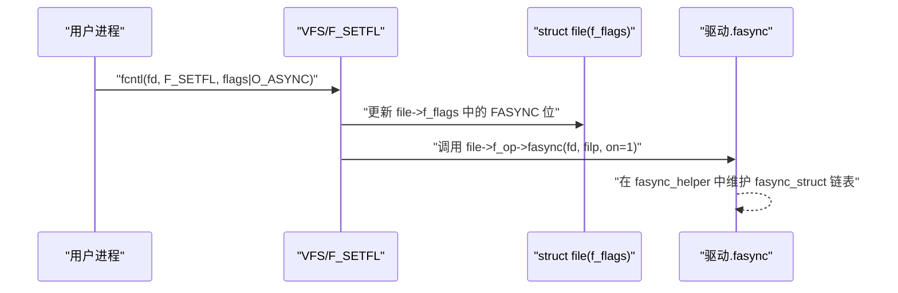
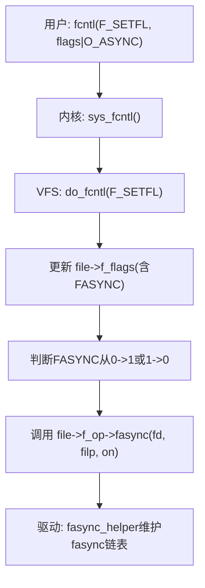
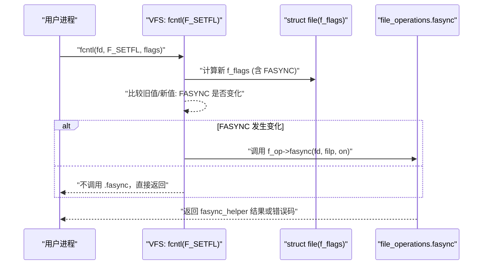
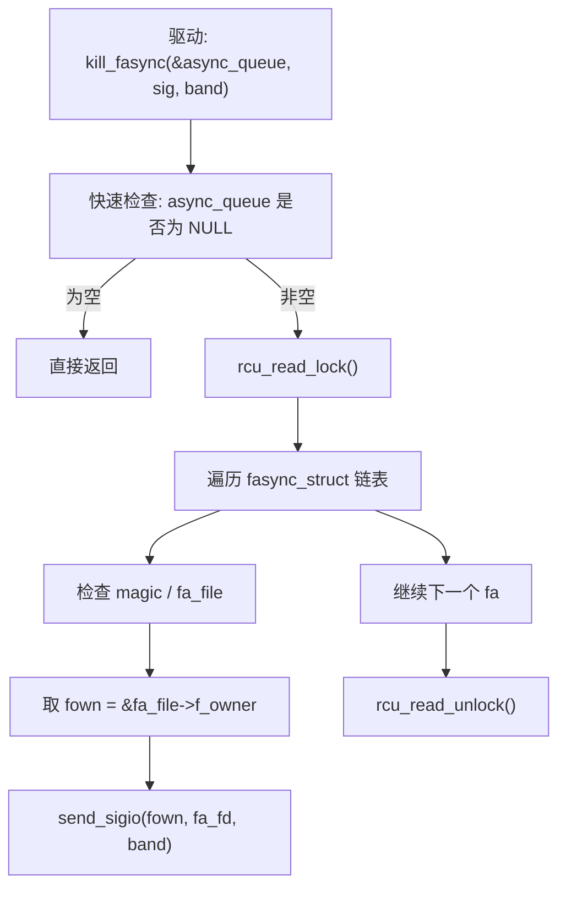
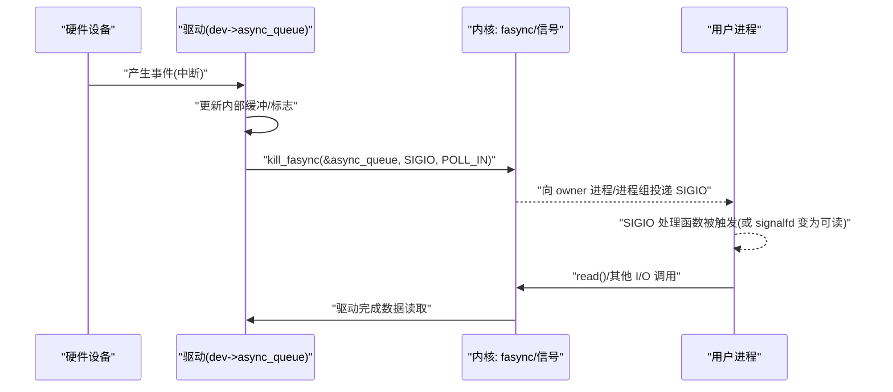
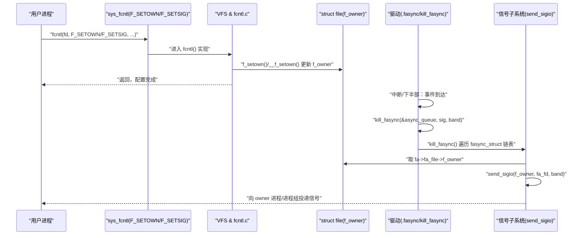
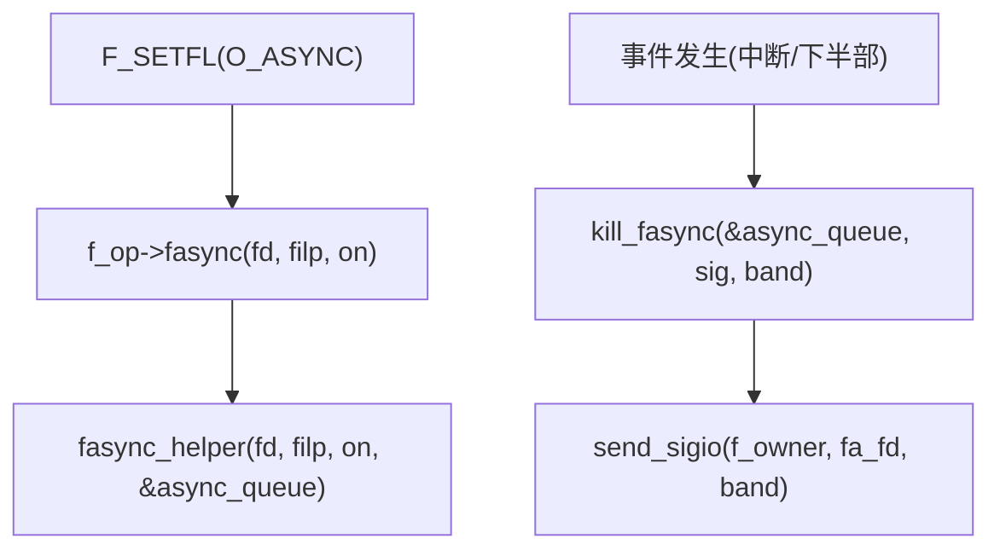
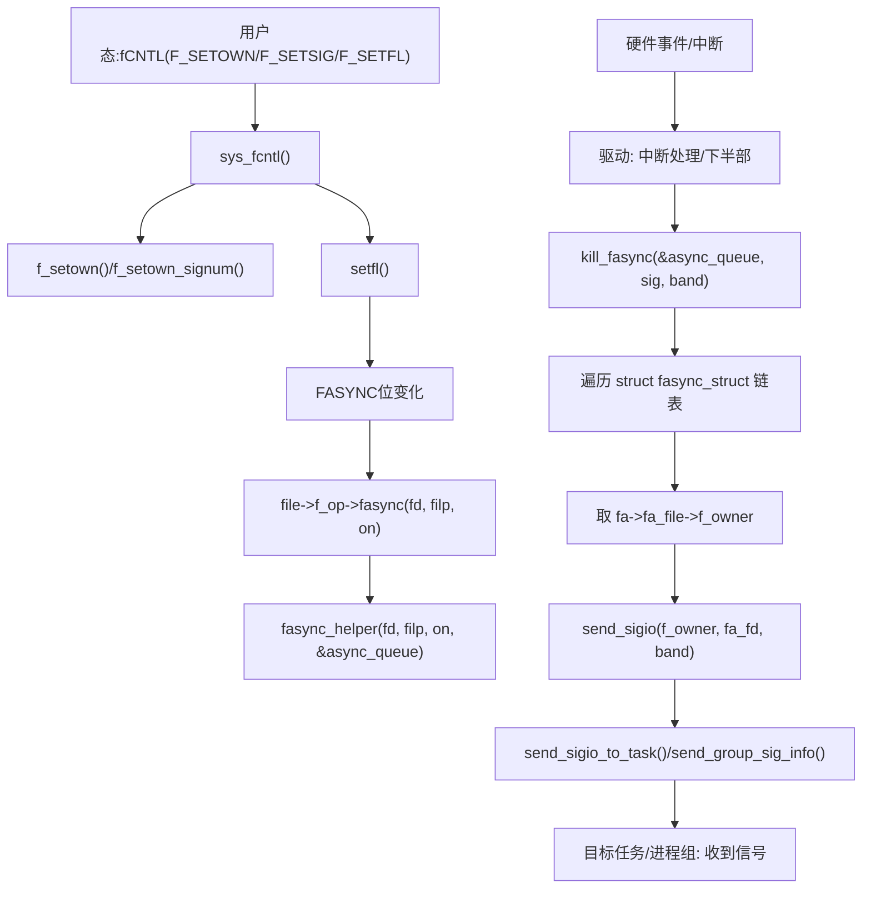

# 第4章_内核视角_核心数据结构与控制路径

> **章节内容说明**
>  本章从内核实现视角拆解 fasync：
>
> - 4.1 先看入口：`file->f_flags` 里的 `FASYNC` 标志是怎样承上启下的；
> - 4.2 展开 `struct fasync_struct` 的链表组织结构；
> - 4.3 分析 `file_operations.fasync` 回调的调用语义；
> - 4.4 解剖 `fasync_helper()` 的增删改逻辑；
> - 4.5 解释 `kill_fasync()` 如何桥接到信号子系统；
> - 4.6～4.7 把这些点串成“从用户态 fcntl 到信号送达”的完整调用关系图。
>    本章回答“**内核里到底是靠哪些字段、哪些函数，把 fasync 这一套串起来的**”。

------

## 4.1_file->f_flags_与_FASYNC_标志位

> **本节目标**
>  从“是什么→怎么存→谁来改→改完之后会触发什么”的角度，把 `file->f_flags` 中 `FASYNC` 位的语义讲清楚，为后面 `.fasync` 回调与 `fasync_helper()` 铺路。

------

### 4.1.1_引入_为什么要从_file->f_flags_看起

在前一章我们从历史和设计目标角度知道：

- fasync 是一种**“以文件为粒度的异步通知能力”**；
- 用户态是通过 `fcntl(F_SETFL)` 之类的接口打开或关闭它；
- 驱动侧则通过 `.fasync` 回调和 `kill_fasync()` 真正推动事件。

这三者之间的“控制位”就是 `file->f_flags` 中的 `FASYNC` 标志：

- **用户态**：只看到 `O_ASYNC`/`FASYNC` 这种“标志位”；
- **VFS 层**：在 `fcntl(F_SETFL)` / `open()` 等路径里，负责修改 `file->f_flags`；
- **驱动层**：通过 `.fasync` 回调观察 `FASYNC` 是否被打开/关闭，更新自己的 fasync 链表。

所以，从机制入口看，**一切都绕不开 `file->f_flags`**。如果你想调试“我明明设置了 FASYNC 却收不到 SIGIO”这类问题，第一步就是确认：**这个 `file` 的 `f_flags` 里到底有没有 `FASYNC`**。

------

### 4.1.2_数据结构视角_struct_file_f_flags_与_FASYNC

从内核结构体上看，关键点很少，但非常核心。

#### (1)_struct_file_里的标志位

简化后的 `struct file`（去掉无关字段）：

```c
struct file {
	/* ... */
	unsigned int		f_flags;	/* 打开文件时的标志位集合 */
	const struct file_operations	*f_op;
	void			*private_data;
	/* ... */
};
```

- `f_flags` 存了一组 `O_*` 风格的标志（读写模式、非阻塞、追加、异步等）；
- 它的来源主要有两个：
  - `open()` 的 `flags` 参数；
  - `fcntl(F_SETFL, ...)` 动态修改的标志。

#### (2)_O_ASYNC_/_FASYNC_的含义

从内核视角看，**“O_ASYNC” 是用户态看到的宏，而 “FASYNC” 是内核用在 `f_flags` 中的标志位名称**（在很多架构上值相同，但我们只关心语义）：

- 用户空间头文件里定义了 `O_ASYNC`；
- 内核中同义地使用 `FASYNC` 标志位；
- VFS 在处理 `F_SETFL` 等操作时，会负责把 `O_ASYNC` 解析为是否设置 `FASYNC`。

这一点很重要：**驱动作者在内核代码里只会看到/使用 `FASYNC`，不会直接和 `O_ASYNC` 打交道**；
 而用户态代码使用的是 `O_ASYNC`。

可以抽象理解为：

```text
用户态：O_ASYNC
       |
       v
内核 VFS：解析/检查，最终落在 file->f_flags 里的 FASYNC 位
       |
       v
驱动：通过 .fasync / fasync_helper 维护 fasync_struct
```

#### (3)_FASYNC_的作用边界

`FASYNC` **只是一个标志位本身，什么都不做**，它本身不负责发信号、不负责维护链表。
 它只承担两类职责：

1. **让 VFS 知道“某个文件希望异步通知”**：
   - 在 `F_SETFL` 被调用时，VFS 会比较新旧 `f_flags`，发现 `FASYNC` 位从 0 → 1 或 1 → 0；
   - 然后调用该文件对应的 `file_operations.fasync` 回调，将这种“状态变化”通知给驱动。
2. **让驱动知道“当前这个 file 的 FASYNC 状态”**：
   - 驱动在 `.fasync` 中会收到 `fd`, `file *`, `on`（是否打开 FASYNC）这三个信息；
   - 内部可以根据 `on` 与 `file->f_flags` 判断当前是否需要把这个 `file` 挂入 fasync 链表。

因此，从数据结构角度看，`FASYNC` 是一个**非常纯粹的“状态位”**：

- 挂在 `struct file` 上；
- 不直接参与任何逻辑；
- 仅作为 VFS 与驱动之间的“事件触发点”。

------

### 4.1.3_开发者视角_内核中谁来修改_f_flags_和_FASYNC

从驱动开发者的视角，两个问题最关键：

1. **什么时候 `file->f_flags` 会被改动？**
2. **改动之后，驱动的 `.fasync` 是在哪儿被调用的？**

#### (1)_open()_路径中的_f_flags_初始化

在 `sys_openat()` 等系统调用路径中，大致流程是：

- 用户传入 `flags`：例如 `O_RDWR | O_NONBLOCK`；
- VFS 会根据 `flags` 初始化 `file->f_flags`；
- 此时通常还不会设置 `FASYNC`，因为大多数情况下用户不会在 `open()` 就带 `O_ASYNC`（即便带了，也会处理，但习惯上更多在 `fcntl()` 时设置）。

驱动在 `.open()` 里能看到已经初始化好的 `f_flags`，但**一般不会在这里直接处理 FASYNC**，因为 fasync 的标准协议是通过 `.fasync` 回调完成，而不是在 `.open()` 里手工改链表。

#### (2)_fcntl(F_SETFL)_路径中的_f_flags_修改

真正与 fasync 密切相关的是 `fcntl(F_SETFL)`：

- 用户调用：

  ```c
  int flags = fcntl(fd, F_GETFL);
  flags |= O_ASYNC;			/* 用户想打开异步通知 */
  fcntl(fd, F_SETFL, flags);
  ```

- VFS 在处理 `F_SETFL` 时会：

  1. 取出旧的 `file->f_flags`；
  2. 根据用户传入的新 flags 计算新的 `f_flags`；
  3. 比较新旧值，判断 `FASYNC` 是否发生变化；
  4. 如果变化了，就调用 `file->f_op->fasync` 回调。

这意味着：

- **驱动不需要（也不应该）在任意地方乱改 `file->f_flags`**，它只应该在 `.fasync` 中响应 VFS 已经决定好的状态变化；
- **驱动的 `.fasync` 实际上是“f_flags 中 FASYNC 位变化的回调”**，而不是“我想要异步就自己随便设置一个标志”。

#### (3)_驱动内部是否需要直接访问_f_flags

通常而言，驱动在 `.fasync` 中只依赖 `fasync_helper()` 的 `on` 参数来维护链表，不需要自己读 `file->f_flags`。但有时你可能会在：

- `.open()`：判断是否带 `O_NONBLOCK` / `O_SYNC` 等；
- `.read()`：根据 `O_NONBLOCK` 决定是否立即返回 `-EAGAIN`；

这时会看到类似这样的写法：

```c
static ssize_t demo_read(struct file *filp, char __user *buf,
			 size_t count, loff_t *ppos)
{
	/* 非阻塞模式下，如果当前没有数据，直接返回 -EAGAIN */
	if (filp->f_flags & O_NONBLOCK) {
		if (!demo_data_ready())
			return -EAGAIN;
	}

	/* ... 正常读取数据 ... */

	return copied;
}
```

对于 `FASYNC` 而言，**一般不会在 `.read()` 里直接判断 `FASYNC` 位**，因为异步通知的工作流是：

- 事件发生 → 驱动调用 `kill_fasync()`；
- 用户因为收到信号而决定何时来 `read()`。

`FASYNC` 更像是“驱动是否需要维护 `fasync_struct` 链表”的开关，而不是“read 行为的模式开关”。

------

### 4.1.4_用户/平台视角_如何通过用户态控制_FASYNC

从用户/平台角度看，如何一步步把 `file->f_flags` 中的 `FASYNC` 打开？

典型流程是：

1. **打开设备**

   ```c
   int fd = open("/dev/demo_async", O_RDONLY | O_NONBLOCK);
   ```

   - 此时 `file->f_flags` 中可能已经包含 `O_NONBLOCK`；
   - `FASYNC` 还未设置。

2. **设置异步通知所有者（必须先做）**

   ```c
   /* 让当前进程成为异步通知 owner */
   if (fcntl(fd, F_SETOWN, getpid()) == -1) {
       perror("fcntl(F_SETOWN)");
       /* error handling */
   }
   ```

3. **可选：选择使用哪个信号（不设则默认 SIGIO）**

   ```c
   const int demo_sig = SIGIO;	/* 或者某个实时信号 */
   if (fcntl(fd, F_SETSIG, demo_sig) == -1) {
       perror("fcntl(F_SETSIG)");
   }
   ```

4. **开启 `O_ASYNC` ⇒ 内核设置 `FASYNC` ⇒ 调用 `.fasync`**

   ```c
   int flags = fcntl(fd, F_GETFL);
   if (flags == -1) {
       perror("fcntl(F_GETFL)");
       /* error handling */
   }

   flags |= O_ASYNC;	/* 用户态视角：打开异步通知 */
   if (fcntl(fd, F_SETFL, flags) == -1) {
       perror("fcntl(F_SETFL)");
       /* error handling */
   }
   ```

这一步调用会触发下面这条链：



对用户态来说，可以用 `/proc/PID/fdinfo` 观察部分状态，或通过 `strace` 看到 F_SETFL 调用是否成功。

------

### 4.1.5_可视化_从_O_ASYNC_到_file->f_flags.FASYNC_的路径

用一个简单的流程图整体看一下控制路径（略去细节）：



后面 4.3、4.4 会把“`file->f_op->fasync` 和 `fasync_helper()`”展开成更细的调用关系图，这里先建立整体轮廓：**fasync 的真正“激活动作”是由 `F_SETFL` 中的 FASYNC 位变化触发的。**

------

### 4.1.6_示例代码_用户态_+_内核态如何围绕_FASYNC_协作

这一小节给出一组“能跑通”的最小示例片段，用于把 `file->f_flags` 与 `FASYNC` 的角色串起来。

#### (1)_用户态_设置_FASYNC_并注册_SIGIO_处理函数

> 这里先用传统 `signal()` 写法，后面第 9 章会改成更可靠的 `sigaction`/`signalfd`。

```c
/* demo_user_fasync.c */

#include <stdio.h>
#include <stdlib.h>
#include <unistd.h>
#include <fcntl.h>
#include <signal.h>
#include <errno.h>
#include <string.h>

static volatile sig_atomic_t g_sigio_count = 0;

static void demo_sigio_handler(int signo)
{
	/* 这里只做计数，避免复杂逻辑 */
	if (signo == SIGIO) {
		g_sigio_count++;
	}
}

int main(void)
{
	const char *dev_path = "/dev/demo_async";
	int fd;
	int flags;

	if (signal(SIGIO, demo_sigio_handler) == SIG_ERR) {
		perror("signal(SIGIO)");
		return EXIT_FAILURE;
	}

	fd = open(dev_path, O_RDONLY | O_NONBLOCK);
	if (fd < 0) {
		perror("open");
		return EXIT_FAILURE;
	}

	if (fcntl(fd, F_SETOWN, getpid()) == -1) {
		perror("fcntl(F_SETOWN)");
		close(fd);
		return EXIT_FAILURE;
	}

	flags = fcntl(fd, F_GETFL);
	if (flags == -1) {
		perror("fcntl(F_GETFL)");
		close(fd);
		return EXIT_FAILURE;
	}

	flags |= O_ASYNC;

	if (fcntl(fd, F_SETFL, flags) == -1) {
		perror("fcntl(F_SETFL)");
		close(fd);
		return EXIT_FAILURE;
	}

	printf("等待 SIGIO 中，按 Ctrl+C 退出\n");

	for (;;) {
		printf("当前收到 SIGIO 次数: %d\n", g_sigio_count);
		sleep(1);
	}

	close(fd);
	return EXIT_SUCCESS;
}
```

> 说明：
>
> - `O_NONBLOCK` 决定 read 行为；
> - `O_ASYNC` 决定 VFS 是否在 `file->f_flags` 中设置 `FASYNC`，从而触发 `.fasync`。
> - 这段用户态代码只负责“正确地把 `FASYNC` 打开”，它并不知道内核里面发生了什么。

#### (2)_内核态_最小的.fasync_回调骨架(预告)

完整的驱动我们在第 6 章再写，此处只给出与 `FASYNC` 相关的最精简骨架，目的是说明 **`.fasync` 回调就是围绕这个标志变化来工作的**：

```c
/* demo_async_drv.c: 只展示与 fasync 相关的核心片段 */

static struct fasync_struct *demo_fasync_queue;

static int demo_fasync(int fd, struct file *filp, int on)
{
	int ret;

	/* 调用内核提供的 fasync_helper 维护 fasync 链表 */
	ret = fasync_helper(fd, filp, on, &demo_fasync_queue);
	if (ret < 0)
		return ret;

	return 0;
}

static int demo_open(struct inode *inode, struct file *filp)
{
	/* 此处可根据 filp->f_flags 判断 O_NONBLOCK 等，但通常不处理 FASYNC */

	return 0;
}

static int demo_release(struct inode *inode, struct file *filp)
{
	/* 关闭时确保从 fasync 队列中摘掉该 file */
	demo_fasync(-1, filp, 0);

	return 0;
}

static const struct file_operations demo_fops = {
	.owner		= THIS_MODULE,
	.open		= demo_open,
	.release	= demo_release,
	.fasync		= demo_fasync,
	/* .read / .poll 等稍后章节补齐 */
};
```

这段代码与 `file->f_flags` 的关系是：

- 当用户调用 `fcntl(F_SETFL, flags|O_ASYNC)` 时，VFS 发现 `FASYNC` 位变化；
- VFS 调用 `demo_fasync(fd, filp, on=1)`；
- `demo_fasync` 只负责调用 `fasync_helper` 更新 `demo_fasync_queue`；
- `file->f_flags` 中 `FASYNC` 是 VFS 维护的状态，驱动不主动去改它。

------

### 4.1.7_调试与验证_如何确认_FASYNC_确实被设置

从本节学习后的“实战检查单”可以这样设计：

1. **确认用户态的 `fcntl(F_SETFL)` 是否成功**

   - 使用 `strace`：

     ```sh
     strace -e fcntl ./demo_user_fasync
     ```

   - 观察是否有成功返回的 `fcntl(fd, F_SETFL, ...)` 调用。

2. **查看 `/proc/PID/fdinfo` 中的 flags**

   - Linux 在 `/proc/<pid>/fdinfo/<fd>` 中会展示该 fd 的标志；
   - 虽然显示形式不是直接写 `FASYNC`，但可以验证 `O_ASYNC` 是否存在。

3. **在驱动 `.fasync` 中临时 printk 调试**

   - 为验证 `.fasync` 是否被调用，可以暂时加一点日志（调试完记得删）：

     ```c
     static int demo_fasync(int fd, struct file *filp, int on)
     {
     	pr_info("demo_fasync: fd=%d, on=%d, f_flags=0x%x\n",
     		fd, on, filp->f_flags);

     	return fasync_helper(fd, filp, on, &demo_fasync_queue);
     }
     ```

   - 当你在用户态设置 `O_ASYNC` 时，应看到 `on=1` 的日志输出；

   - 在 close() 或取消 O_ASYNC 时，应看到 `on=0`。

4. **检查 `.release()` 是否正确清理**

   - 在 `.release()` 里调用 `demo_fasync(-1, filp, 0)` 是标准写法；
   - 如果遗漏这一句，`demo_fasync_queue` 可能残留悬挂节点，后续 `kill_fasync()` 会行为异常。

通过这几步，你可以在实际工程中**快速判断问题是出在“用户态没设置好 FASYNC”、还是“VFS 没调 fasync”、还是“驱动没正确维护队列”**。

------

### 4.1.8_小结_file->f_flags/FASYNC_在_fasync_机制中的角色

本小节可以用几点关键结论收尾：

1. **`file->f_flags` 是 fasync 的“开关载体”**
   - `FASYNC` 位表示“这个 `struct file` 是否启用了异步通知”；
   - 它本身不负责发信号，只是作为 VFS 调用 `.fasync` 的触发条件。
2. **用户态通过 `O_ASYNC` 间接控制 `FASYNC`**
   - `fcntl(F_SETFL, flags|O_ASYNC)` ⇒ VFS 修改 `file->f_flags` 中 `FASYNC`；
   - VFS 比较新旧状态 ⇒ 调用 `file->f_op->fasync(fd, filp, on)`。
3. **驱动的 `.fasync` 是“FASYNC 位变化回调”**
   - 典型实现就是调用 `fasync_helper()` 维护 `struct fasync_struct *queue`；
   - `.release()` 中必须调用一次 `fasync(..., on=0)` 清理状态，避免悬空节点。
4. **`FASYNC` 与 `.read()` / `.poll()` 的关系是“间接关联”**
   - 驱动一般不会在 `.read()` 里直接根据 `FASYNC` 改行为；
   - 而是在事件发生时，根据 fasync 队列调用 `kill_fasync()`，从而触发信号。
5. **调试时的关键观察点**
   - 用户态：`strace` 看 `F_SETFL` 是否成功；
   - 内核：`.fasync` 是否被调用、`on` 参数是否正确、`filp->f_flags` 是否包含 `FASYNC`。

掌握这些细节之后，你已经从“概念上知道有 FASYNC”升级到“可以看源码和调试 fasync 状态”的水平。后续小节会在此基础上进一步深入：

- 4.2：`struct fasync_struct` 的链表组织与字段语义；
- 4.3：`file_operations.fasync` 的调用路径和行为约束；
- 4.4：`fasync_helper()` 内部如何增删链表；
- 4.5：`kill_fasync()` 如何真正走到信号子系统。


------

## 4.2_struct_fasync_struct_数据结构与链表组织

> **本节目标**
>
> - 把 `struct fasync_struct` 这几个字段的含义讲清楚；
> - 说明“为什么要用单链表 + RCU + 自己的锁”；
> - 让你能看懂内核里各种 `xxx->fasync` / `fasync_readers` / `fasync_writers` 这类成员到底在干嘛。

------

### 4.2.1_为什么需要单独的_struct_fasync_struct

上一节看到：

- “是否启用异步通知”这个状态，挂在 `file->f_flags` 里的 `FASYNC` 位；
- 但**谁来收信号**、**有多少个 file 正在对这个设备启用 FASYNC**、**如何并发地管理这些订阅者**，仅靠 `f_flags` 不够。

因此内核引入了一个专门用于 fasync 的数据结构：`struct fasync_struct`，用来维护“谁订阅了这个设备的异步通知”。

典型情况：

- 一个设备（或一个方向，例如“可读端”、“可写端”）维护一个头指针：
   `struct fasync_struct *async_queue;`
- 每一个启用了 FASYNC 的 `struct file`，对应链表中的一个节点；
- 当设备有事件时，驱动通过 `kill_fasync(&async_queue, sig, band)` 一次性把信号发给所有节点对应的 owner。

------

### 4.2.2_struct_fasync_struct_字段拆解

在内核头文件 `include/linux/fs.h` 中，`struct fasync_struct` 大致定义如下（略去宏与声明，只保留核心字段，基于 3.x/4.x/5.x 系列的通用形式）：([docs.huihoo.com](https://docs.huihoo.com/doxygen/linux/kernel/3.7/structfasync__struct.html?utm_source=chatgpt.com))

```c
struct fasync_struct {
	spinlock_t		fa_lock;	/* 保护本节点内部状态 */
	int			magic;		/* 调试用 magic 值 */
	int			fa_fd;		/* 对应的用户态 fd 号 */
	struct fasync_struct	*fa_next;	/* 单向链表指针 */
	struct file		*fa_file;	/* 关联的 struct file */
	struct rcu_head		fa_rcu;		/* RCU 释放用 */
};
```

逐字段说一下语义：

- `fa_lock`
  - 用于保护本节点的并发访问（主要是内部状态变化）；
  - 与维护整个链表时使用的上层锁一起，构成完整的并发保护（后面并发章节再展开）。
- `magic`
  - 调试用魔数，通常设置为 `FASYNC_MAGIC`；
  - 用于在调试/BUG 检查时确认这个结构体确实是有效的 fasync 节点。
- `fa_fd`
  - 记录用户态看到的 fd 号；
  - 主要用于调试和统计，严格语义不是核心（因为真正的“身份”是 `fa_file`）。
- `fa_next`
  - 将多个 fasync 节点串成单向链表；
  - 头指针一般由驱动或内核某个子系统结构体维护（例如 pipe、tty、socket 等）。([docs.kernel.org](https://docs.kernel.org/6.3/filesystems/splice.html?utm_source=chatgpt.com))
- `fa_file`
  - 指向对应 `struct file`；
  - 通过它可以进一步找到 `f_owner`（fs 层的 `struct fown_struct`），从而知道应该把信号发给哪个 `task_struct` 或进程组。
- `fa_rcu`
  - 用于在 RCU 回收路径上释放这个节点；
  - 允许 `kill_fasync()` 之类的调用在 RCU 读侧安全地遍历链表，即使节点被删除后也不会马上释放。

可以把 `struct fasync_struct` 理解成**“某个 file 在 fasync 体系中的注册记录”**：

- 谁：`fa_file` 对应的 `file`（进而对应 owner）；
- 在哪：挂在哪条链上（设备私有指针）；
- fd 是多少：`fa_fd`（便于调试）；
- 如何安全增删：`fa_lock` + RCU + 上层锁。

------

### 4.2.3_链表组织_每个设备/方向维护一个头指针

内核大量对象里都有 `struct fasync_struct *` 字段，例如：

- `struct tty_struct { struct fasync_struct *fasync; ... }`：TTY 设备的异步通知队列；([内核.org](https://www.kernel.org/doc/html/v6.3/driver-api/tty/tty_struct.html?utm_source=chatgpt.com))
- `struct pipe_inode_info { struct fasync_struct *fasync_readers; struct fasync_struct *fasync_writers; ... }`：管道分别维护读端和写端的 fasync 队列；([docs.kernel.org](https://docs.kernel.org/6.3/filesystems/splice.html?utm_source=chatgpt.com))
- `struct socket { struct fasync_struct *fasync_list; ... }`：socket 的异步通知队列。([ii4gsp](https://ii4gsp.tistory.com/291?utm_source=chatgpt.com))

对于你自己写的字符设备驱动，最常见模式是：

```c
struct demo_dev {
	/* 设备状态、寄存器映射等 */
	struct fasync_struct	*async_queue;	/* 本设备的 fasync 链表头 */
	/* 其他成员 */
};
```

- 每个 `demo_dev` 对应一个 fasync 队列 `async_queue`；

- 每个打开了 `FASYNC` 的 `struct file`，对应其中的一个 `struct fasync_struct` 节点；

- 当某个硬件事件发生时，这个 `demo_dev` 就调用：

  ```c
  kill_fasync(&dev->async_queue, SIGIO, POLL_IN);
  ```

  内核会遍历整个链表，对链上的所有节点对应的 owner 投递信号。

**注意：**

- 链表是**单向**的（`fa_next`），遍历成本是 `O(N)`；
- 通常用于“订阅数量有限”的设备（例如几个进程打开同一个字符设备），不会像 epoll 那样支撑成千上万 fd。

------

### 4.2.4_开发者视角_在驱动中如何持有_struct_fasync_struct_*

对驱动开发者而言，最关键的是“**这个指针放在哪**”以及“**如何用**”。

标准实践：

1. **每个“设备实例”维护一个指针**

   ```c
   struct demo_dev {
   	/* ... 设备特定状态 ... */
   	struct fasync_struct	*async_queue; /* fasync 链表头 */
   };
   ```

2. **在 `.fasync` 回调中，使用 `fasync_helper()` 维护这条链表**

   ```c
   static int demo_fasync(int fd, struct file *filp, int on)
   {
   	struct demo_dev *dev = filp->private_data;

   	/* 根据 on 的值，将 filp 加入或移出 dev->async_queue */
   	return fasync_helper(fd, filp, on, &dev->async_queue);
   }
   ```

3. **在 `.release()` 中确保清除该 file 对应的节点**

   ```c
   static int demo_release(struct inode *inode, struct file *filp)
   {
   	struct demo_dev *dev = filp->private_data;

   	/* on = 0 表示从 fasync 队列中删除该 file 对应的节点 */
   	demo_fasync(-1, filp, 0);

   	return 0;
   }
   ```

4. **在“事件发生”的路径里调用 `kill_fasync()`**

   ```c
   /* 例如在中断处理或下半部里 */
   static void demo_hw_event(struct demo_dev *dev)
   {
   	/* ... 更新设备状态、缓存数据等 ... */

   	/* 通知所有订阅了异步通知的 file 对应的进程 */
   	if (dev->async_queue)
   		kill_fasync(&dev->async_queue, SIGIO, POLL_IN);
   }
   ```

其中 `dev->async_queue` 只是一个“链表头指针”，具体节点由 `fasync_helper()` 分配/插入/删除。

------

### 4.2.5_并发视角_锁_RCU_与调用上下文

`struct fasync_struct` 本身就带了 `fa_lock` 和 `fa_rcu`，这直接透露出两个事实：

1. **fasync 链表的访问是并发的**
   - 可能在以下上下文中被访问：
     - 进程上下文（`fcntl(F_SETFL)` 设置/取消 FASYNC 时调用 `.fasync` → `fasync_helper()`）；
     - 进程上下文（`close()` / `.release()` 清理 fasync 节点）；
     - 中断上下文或软中断上下文（`kill_fasync()` 被调用时遍历链表）。([Android Git Repositories](https://android.googlesource.com/kernel/msm/%2B/android-6.0.1_r0.94/include/linux/fs.h?utm_source=chatgpt.com))
   - 这就要求增删节点时要有合适的同步原语（`fa_lock` + 上层锁 + RCU）。
2. **`kill_fasync()` 明确声明“可在中断中调用”**
   - 内核接口注释中会强调 `kill_fasync()` 可以在中断上下文调用；([Android Git Repositories](https://android.googlesource.com/kernel/msm/%2B/android-6.0.1_r0.94/include/linux/fs.h?utm_source=chatgpt.com))
   - 因此它不能持有可能会睡眠的锁；
   - 链表遍历往往采用 RCU 或者其他轻量读侧同步机制。

从驱动角度出发，你只需要记住几条“使用规范”：

- **在 `.fasync` / `.release` 里调用 `fasync_helper()` 时，确保不会在中断上下文调用这个路径**（这是 VFS 保证的：`F_SETFL` / `close()` 均在进程上下文中）；
- **`kill_fasync()` 可以在中断上下文调用，不要在它周围拿会睡眠的锁（例如 mutex）**，否则会触发 `BUG()` 或“睡眠在原子上下文”的警告；
- `fasync_struct` 的内部锁由内核封装，你一般不用自己直接操作，只要遵守 `fasync_helper()` / `kill_fasync()` 的使用协议即可。

等到第 10 章讲并发与竞态时，再从“锁/RCU/内存屏障”的角度详细分析 fasync 相关场景，这里只需要先建立一个粗略印象：

> **fasync 链表允许在“配置阶段”和“通知阶段”分别位于不同上下文中，增删在进程上下文，通知可以在中断上下文。**

------

### 4.2.6_小结_struct_fasync_struct_的角色

这一节可以用几句话总结：

1. `struct fasync_struct` 是“**某个 file 在 fasync 系统中的注册节点**”；
2. 它通过 `fa_next` 串成单链表，头指针一般挂在“设备实例”结构里（如 `demo_dev::async_queue`）；
3. 每个节点记录 `fa_file`、`fa_fd`，并通过 RCU 与自有锁保证并发安全；
4. 驱动开发者基本只通过 `fasync_helper()` 和 `kill_fasync()` 间接操作它，很少需要直接读取字段；
5. 了解这个结构有利于：
   - 看懂内核中 `tty_struct::fasync` 等字段；
   - 排查“close 后仍然收到 SIGIO”等典型问题；
   - 在高并发场景下正确评估 fasync 链表的成本与风险。


------

## 4.3_struct_file_operations_中的.fasync_回调

> **本节目标**
>
> - 说明 `.fasync` 回调在 `file_operations` 里的位置和原型；
> - 理清“它是谁调用、什么时候调用、参数含义是什么”；
> - 给出一个“最小但规范”的 `.fasync` 实现模板，并列举常见误用。

------

### 4.3.1_.fasync_在_file_operations_里的位置与作用

在 `include/linux/fs.h` 中，`struct file_operations` 里有一个成员：([Android Git Repositories](https://android.googlesource.com/kernel/msm/%2B/android-6.0.1_r0.94/include/linux/fs.h?utm_source=chatgpt.com))

```c
struct file_operations {
	/* ... */
	int (*open) (struct inode *, struct file *);
	int (*flush) (struct file *, fl_owner_t id);
	int (*release) (struct inode *, struct file *);
	int (*fsync) (struct file *, loff_t, loff_t, int datasync);
	int (*fasync) (int, struct file *, int);
	/* ... */
};
```

其中：

- `.fasync` 的原型为：

  ```c
  int (*fasync)(int fd, struct file *filp, int on);
  ```

- 它的存在用途可以一句话概括：

  > **当 `file->f_flags` 的 `FASYNC` 位发生变化时，VFS 会调用 `.fasync` 回调，让驱动有机会维护自己的 fasync 链表。**

因此 `.fasync` 不是给用户态直接调用的接口，而是 VFS 在处理 `fcntl(F_SETFL)` / `O_ASYNC` 时触发的**“通知回调”**。

------

### 4.3.2_调用路径概览_谁在什么时机调用.fasync

结合 4.1 的内容，可以把调用路径简化为：



关键点：

- `.fasync` 只在 **FASYNC 位发生变化** 时调用：
  - 当从关闭 → 打开时：`on = 1`（或其他非 0 值）；
  - 当从打开 → 关闭时：`on = 0`。
- `.fasync` 一般不会在 `open()` 时被自动调用，除非在 `open()` 时就带 `O_ASYNC` 并触发相关逻辑；
- `.release()` 中调用 `.fasync(..., on=0)` 是**驱动自己的补充手段**，用于清理链表，不是 VFS 自动帮你做的。

------

### 4.3.3_.fasync_参数语义

`.fasync` 的三个参数分别为：

1. `int fd`
   - 用户态的 fd 号；
   - 主要用于调试，可以记录到 `struct fasync_struct::fa_fd`；
   - 对驱动内部逻辑影响不大（真正的关键是 `filp`）。
2. `struct file *filp`
   - 此次操作对应的 `struct file`；
   - 驱动可以通过 `filp->private_data` 找到自己的设备结构体；
   - 也是 `fasync_helper()` 中用于识别链表节点的关键字段。
3. `int on`
   - 是否启用 FASYNC：
     - `on != 0`：将该 `file` 加入 fasync 队列；
     - `on == 0`：从 fasync 队列中删除该 `file` 对应的节点；
   - VFS 由“新旧 f_flags 中 FASYNC 位的差异”来决定 `on` 的值。

因此，从驱动视角看 `.fasync` 就是三件事：

- 拿到设备实例（`dev = filp->private_data;`）；
- 根据 `on` 调用 `fasync_helper(fd, filp, on, &dev->async_queue);`；
- 返回 `fasync_helper()` 的结果（通常 0 或错误码）。

------

### 4.3.4_标准.fasync_写法_最小可用模板

以下给出一个**可直接改名复用**的模板（后面第 6 章会在此基础上补齐完整驱动）：

```c
/* demo_async_drv.c: 标准的 .fasync 模板 */

struct demo_dev {
	/* ... 其他成员 ... */
	struct fasync_struct	*async_queue;	/* fasync 链表头 */
};

/* fasync 回调：由 VFS 在 FASYNC 状态变化时调用 */
static int demo_fasync(int fd, struct file *filp, int on)
{
	struct demo_dev *dev = filp->private_data;
	int ret;

	/* 使用 fasync_helper 维护 dev->async_queue 链表 */
	ret = fasync_helper(fd, filp, on, &dev->async_queue);
	if (ret < 0)
		return ret;

	return 0;
}

/* open：仅作为上下文，便于看关系 */
static int demo_open(struct inode *inode, struct file *filp)
{
	struct demo_dev *dev;

	/* 根据 inode 找到设备实例，这里略过细节 */
	dev = container_of(inode->i_cdev, struct demo_dev, cdev);
	filp->private_data = dev;

	return 0;
}

/* release：记得清理 fasync 队列中的该 file 节点 */
static int demo_release(struct inode *inode, struct file *filp)
{
	/* 将当前 filp 对应的 fasync 节点从链表中移除 */
	demo_fasync(-1, filp, 0);

	return 0;
}

static const struct file_operations demo_fops = {
	.owner		= THIS_MODULE,
	.open		= demo_open,
	.release	= demo_release,
	.fasync		= demo_fasync,
	/* .read / .poll 等后续章节补齐 */
};
```

要点说明：

1. `.fasync` 中**一定**要使用设备实例的 `async_queue`，而不是一个全局静态变量，除非你的设备本身就是“单例”（例如只注册了一个设备节点且不支持多实例）；
2. `.release` 中调用 `.fasync(..., on=0)` 是**惯用写法**，即使用户没显式清掉 `O_ASYNC`，close 时也能确保链表上不再有对应节点；
3. `fd` 在 release 阶段无关紧要，可以传 `-1`，`fasync_helper()` 只需要 `filp` 来匹配并移除节点。

------

### 4.3.5_典型错误模式与坑

实际驱动中与 `.fasync` 相关的坑非常集中，列几个典型的：

#### (1)_使用全局_struct_fasync_struct_*_管理多个设备实例

错误示例：

```c
static struct fasync_struct *demo_async_queue;	/* 全局 */

static int demo_fasync(int fd, struct file *filp, int on)
{
	return fasync_helper(fd, filp, on, &demo_async_queue);
}
```

问题：

- 如果你有多块相同类型的设备，每块设备应有独立 fasync 链表；
- 使用全局指针会导致：
  - 任意一块设备的事件都会给所有打开过任意一块设备且 FASYNC 打开的进程发信号；
  - 设备之间的“订阅”混在一起，极难维护和调试。

**正确做法**：把 `struct fasync_struct *` 放到设备实例结构里（如 `struct demo_dev`），在 `.open()` 时通过 `filp->private_data` 关联起来。

#### (2)_在.release()_中忘记清理_fasync_状态

错误示例：

```c
static int demo_release(struct inode *inode, struct file *filp)
{
	/* 忘记调用 demo_fasync(-1, filp, 0); */

	return 0;
}
```

可能后果：

- `dev->async_queue` 中还留着指向已经关闭的 `struct file` 的节点；
- 后续 `kill_fasync()` 可能给已经退出/重用的进程发信号；
- 在极端情况下（尤其是竞态/并发复杂时），可能导致 UAF 或莫名其妙的 crash。

**正确做法**：在 `.release()` 中一定加上：

```c
demo_fasync(-1, filp, 0);
```

#### (3)_在.fasync_中自行改_file->f_flags

错误示例：

```c
static int demo_fasync(int fd, struct file *filp, int on)
{
	if (on)
		filp->f_flags |= FASYNC;
	else
		filp->f_flags &= ~FASYNC;

	/* 再手动搞一些链表…… */

	return 0;
}
```

问题：

- `file->f_flags` 本应由 VFS 维护（`F_SETFL` 调用路径）；
- 驱动在 `.fasync` 里再改 `f_flags` 容易破坏 VFS 对“旧值/新值”的判断逻辑，制造奇怪的边界行为；
- 正确协议是：**VFS 已经算好新旧 `f_flags` 并传入 `on`，驱动只管按 `on` 来维护自己的链表**。

**正确做法**：不要在 `.fasync` 里碰 `filp->f_flags`，只使用 `fasync_helper()` 和 `on` 参数。

#### (4)_在中断上下文直接调用.fasync_/_fasync_helper()

- `.fasync` 回调是 VFS 在**进程上下文**调用的，代码路径允许睡眠；
- `fasync_helper()` 内部可能会进行分配、释放等操作，也默认在进程上下文使用；
- 因此在中断上下文只应调用 `kill_fasync()`，不要调用 `.fasync` 或 `fasync_helper()`。

------

### 4.3.6_小结.fasync_在驱动中的定位

本节可以用几句话总结 `.fasync` 的角色：

1. `.fasync` 是 `file_operations` 中的**“FASYNC 状态变化回调”**；
2. 它由 VFS 在 `fcntl(F_SETFL)` 等路径中调用，参数 `on` 已经帮你处理好“旧/新”差异；
3. 驱动的标准写法是：
   - 在 `.fasync` 里调用 `fasync_helper(fd, filp, on, &dev->async_queue);`；
   - 在 `.release` 中调用一次 `.fasync(..., on=0)` 清理链表节点；
4. 不要直接在 `.fasync` 里改 `file->f_flags`，也不要把 `struct fasync_struct *` 写成全局变量（除非明确只有一个设备实例）；
5. 中断上下文只使用 `kill_fasync()`，不调用 `.fasync` / `fasync_helper()`。

掌握了 `.fasync` 的位置和使用协议之后，下一步就是深入 `fasync_helper()` 与 `kill_fasync()` 本身，理解：

- `fasync_helper()` 如何插入/删除 `struct fasync_struct` 节点；
- `kill_fasync()` 如何遍历链表，并最终把信号送到目标进程/进程组。


------

## 4.4_fasync_helper()_的工作流程与使用约定

> **本节目标**
>
> - 明确 `fasync_helper()` 的函数原型、返回值语义；
> - 从逻辑上拆解“添加 / 删除 fasync 节点”的步骤；
> - 给出驱动中正确调用 `fasync_helper()` 的模式与调试要点。

------

### 4.4.1_接口原型与定位

在内核 `fs/fcntl.c` 中，`fasync_helper()` 的原型大致为：

```c
int fasync_helper(int fd, struct file *filp, int on,
		  struct fasync_struct **fapp);
```

官方注释要点（翻译、整理后）：

- `fasync_helper()` 被几乎所有字符设备驱动用来建立 fasync 队列，也被文件租约（file lease）代码使用；
- 返回值语义：
  - `< 0`：出错（例如内存分配失败，返回 `-ENOMEM` 等）；
  - `== 0`：没有发生任何改变（既没有添加新节点，也没有删除节点）；
  - `> 0`：确实添加或删除了节点。

结合前面 `.fasync` 回调的说明，可以总结为：

> **`fasync_helper()` 是 VFS 与驱动之间的“fasync 链表维护工具”，驱动只需把 `.fasync` 中的参数原样转进去，并提供自己的 `struct fasync_struct \*` 头指针地址。**

------

### 4.4.2_工作流程概览_添加与删除节点

从最近内核版本的实现来看，`fasync_helper()` 内部逻辑可抽象为：

```c
int fasync_helper(int fd, struct file *filp, int on,
		  struct fasync_struct **fapp)
{
	if (!on)
		/* on == 0: 删除该 file 对应的 fasync 节点 */
		return fasync_remove_entry(filp, fapp);

	/* on != 0: 添加或更新该 file 对应的 fasync 节点 */
	return fasync_add_entry(fd, filp, fapp);
}
```

再结合早期版本（例如 2.4）中内联逻辑，可以把“添加 / 删除”的本质过程概括为：

1. **删除路径（on == 0）**
   - 遍历 `*fapp` 指向的链表，找到 `fa->fa_file == filp` 的节点；
   - 如果找到：
     - 将其从链表中摘除：`*fp = fa->fa_next`；
     - 释放对应的 `struct fasync_struct`；
     - 返回 `1`（表示确实删了东西）；
   - 如果没找到：
     - 不做任何修改，返回 `0`。
2. **添加路径（on != 0）**
   - 分配一个新的 `struct fasync_struct` 节点（若分配失败，立刻返回 `-ENOMEM`）；
   - 遍历链表，查找是否已有 `fa->fa_file == filp` 的节点：
     - 若已有：
       - 更新该节点的 `fa_fd`（记录新的 fd 值）；
       - 释放刚才分配的“新节点”；
       - 返回 `0`（表示链表结构本身没有变化，只是更新了信息）；
     - 若没有：
       - 初始化新节点：`magic`、`fa_file`、`fa_fd`、`fa_next` 等；
       - 把新节点插入链表（通常是头插法：`new->fa_next = *fapp; *fapp = new;`）；
       - 返回 `1`（表示链表发生了结构变化）。
3. **并发保护**
   - 在老版本中用 `write_lock_irq(&fasync_lock)` 之类的全局锁；
   - 在新版本中，添加/删除路径使用 `fasync_lock` + RCU 机制；
   - 驱动作者不需要操心这些锁，只要通过 `fasync_helper()` 接口调用即可。

总结成一句话：

> **`fasync_helper()` 的职责是：根据 `on` 值，在 `\*fapp` 链表中增删“以 `filp` 为键”的节点，必要时更新 fd，并对并发和内存管理负责。**

------

### 4.4.3_返回值语义与错误处理

`fasync_helper()` 的返回值在驱动中的典型处理方式：

```c
static int demo_fasync(int fd, struct file *filp, int on)
{
	struct demo_dev *dev = filp->private_data;
	int ret;

	ret = fasync_helper(fd, filp, on, &dev->async_queue);
	if (ret < 0)
		return ret;	/* 返回错误码，例如 -ENOMEM */

	/* ret == 0 或 ret > 0 在多数驱动中不需要区别对待 */
	return 0;
}
```

说明：

- **负值（错误）**：
  - 当前最典型原因是内存分配失败（`kmem_cache_alloc` 返回 NULL）；
  - 在这种情况下，`.fasync` 通常应该把错误码上交（让 `fcntl(F_SETFL)` 失败）；
  - 用户态会看到 `fcntl` 返回 `-1`，`errno` 为 `ENOMEM` 等。
- **0 / 正值（非错误）**：
  - **0**：链表结构没有变化（例如已有节点，只是更新了 `fa_fd`）；
  - **>0**：确实添加或删除了节点（结构变化）。
  - 大部分驱动不依赖这一细分，只要知道“没有错误”即可。
  - 如果你需要在链表变化时做额外处理，可以根据 `ret > 0` 做区别对待。

从工程实践角度看，推荐：

- `.fasync` 内部：
  - 原样返回 `fasync_helper()` 的负值错误；
  - 正数/零一律归零返回，保持简单。

------

### 4.4.4_驱动中的标准调用模式

结合前面 4.3 的 `.fasync` 模板，这里再强调一下 `fasync_helper()` 的**标准使用模式**：

```c
/* 设备实例 */
struct demo_dev {
	/* ... 其他成员 ... */
	struct fasync_struct	*async_queue;
};

/* .fasync 回调 */
static int demo_fasync(int fd, struct file *filp, int on)
{
	struct demo_dev *dev = filp->private_data;
	int ret;

	ret = fasync_helper(fd, filp, on, &dev->async_queue);
	if (ret < 0)
		return ret;

	return 0;
}

/* .release 回调 */
static int demo_release(struct inode *inode, struct file *filp)
{
	/* on = 0，清理该 file 对应的 fasync 节点 */
	demo_fasync(-1, filp, 0);

	return 0;
}
```

要点：

1. `dev->async_queue` 必须是**设备实例的成员**；
2. `.fasync` 中只做一件事：**把参数转交给 `fasync_helper()`**；
3. `.release` 中显式清理（`on=0`），以防用户没有先取消 `O_ASYNC` 就关闭 fd；
4. 不要自己在 `.fasync` 中手写链表逻辑，除非你非常清楚内核中 fasync 加锁和 RCU 的细节。

------

### 4.4.5_调试与常见问题

在调试 fasync 时，`fasync_helper()` 是重要观察点，可以采用如下方式排查：

1. **确认 `.fasync` 是否被调用**

   - 在 `.fasync` 里短期加 `pr_info()` 日志（调试完记得删）：

     ```c
     pr_info("demo_fasync: fd=%d, on=%d\n", fd, on);
     ```

   - 若用户态调用 `fcntl(F_SETFL, flags|O_ASYNC)`，却看不到 `on=1` 的日志，则问题在 VFS/用户态路径，而非 `fasync_helper()`。

2. **确认链表是否变化**

   - 临时打印 `dev->async_queue` 是否从 NULL 变为非 NULL；
   - 在 `.release` 调用后检查是否回到 NULL（单打开者场景）；
   - 对多进程/多 fd 场景，可在 `demo_fasync()` 中打印 `ret` 的值，用于判断是否添加了新节点。

3. **注意：不要在中断上下文调用 `fasync_helper()`**

   - 增删节点只能在 `.fasync` / `.release` 这些进程上下文中完成；
   - 中断中只调用 `kill_fasync()`，不做链表结构修改。

------

## 4.5_kill_fasync()_与信号子系统的衔接逻辑

> **本节目标**
>
> - 理清 `kill_fasync()` 的函数原型、参数语义；
> - 说明它如何遍历 `struct fasync_struct` 链表，并最终调用 `send_sigio()` 进入信号子系统；
> - 给出“在中断 / 下半部中正确调用 `kill_fasync()`”的实践模式。

------

### 4.5.1_接口原型与角色

在内核中，`kill_fasync()` 的原型为：

```c
void kill_fasync(struct fasync_struct **fp, int sig, int band);
```

官方注释与文档中对它的定位可以概括为：

- `kill_fasync()` 用于在数据到达或状态变化时，向所有“对该事件感兴趣”的进程发送信号；
- `sig` 通常为 `SIGIO`，也可以是通过 `F_SETSIG` 设置的其他信号；
- `band` 通常为 `POLL_IN`，表示“可读事件”，也可用于其他含义（例如网络中的紧急数据）。

从机制视角看：

> **`kill_fasync()` 是“驱动事件 → 信号子系统”的唯一入口**。
>  驱动不需要直接调用 `send_sigio()` 或其他信号 API，只需要把自己的 fasync 队列头指针和信号类型交给 `kill_fasync()`。

------

### 4.5.2_内部逻辑_遍历链表并调用_send_sigio()

在较新的内核实现中，`kill_fasync()` 内部大致是：

```c
void kill_fasync(struct fasync_struct **fp, int sig, int band)
{
	/* 快速路径：大多数情况下链表为空，直接返回 */
	if (*fp) {
		rcu_read_lock();
		kill_fasync_rcu(rcu_dereference(*fp), sig, band);
		rcu_read_unlock();
	}
}
```

而 `kill_fasync_rcu()` 则负责：

- 在持有 RCU 读锁的情况下遍历 `struct fasync_struct` 链表：
   `while (fa) { ... fa = rcu_dereference(fa->fa_next); }`；
- 对每个节点：
  1. 检查 `fa->magic` 是否为 `FASYNC_MAGIC`（防止结构损坏）；
  2. 通过 `fa->fa_file` 找到对应的 `struct fown_struct *fown = &fa->fa_file->f_owner;`；
  3. 若 `sig == SIGURG` 且没有设置排队信号，则跳过（特殊规则）；
  4. 调用 `send_sigio(fown, fa->fa_fd, band);`，由 `send_sigio()` 把信号投递到对应任务或进程组。

简化为一张流程图：



重要点：

- `kill_fasync()` 本身使用 RCU 读锁，不会睡眠；
- 对每个节点还会用 `fa->fa_lock` 做短时间的自旋锁保护（`spin_lock_irqsave/spin_unlock_irqrestore`）；
- 因此 **它可以在中断上下文调用**，不会触发睡眠相关警告。

------

### 4.5.3_参数_sig_与_band_的语义

`kill_fasync()` 的两个关键参数：

1. `int sig`
   - 通常为 `SIGIO`；
   - 若用户通过 `fcntl(F_SETSIG, new_sig)` 设置了其他信号，则实际送达的会是那个信号；
   - 内核在内部会结合 `fown_struct` 中记录的 signum 进行处理。
2. `int band`
   - 与 `poll()` / `select()` 中的 “事件类型” 对应，一般使用标准 `POLL_*` 常量：
     - `POLL_IN`：可读；
     - `POLL_OUT`：可写；
     - `POLL_ERR`：错误；
     - `POLL_PRI`：紧急数据（例如网络的 out-of-band 数据）等；
   - 它会影响用户态 `siginfo_t` 结构中的 `si_band` 字段，便于应用区分“哪种类型的 I/O 事件”。

在简单的字符设备场景下，最常见的组合是：

```c
kill_fasync(&dev->async_queue, SIGIO, POLL_IN);
```

- 表示“**有新的可读数据**”，让用户在信号处理函数里调用 `read()`。

------

### 4.5.4_调用时机与上下文约束

从驱动开发者的角度，`kill_fasync()` 有几个关键使用规则：

1. **可以在中断上下文或软中断上下文调用**

   - 内核实现使用 RCU 读锁和自旋锁，不会睡眠；
   - 官方和大量示例都在中断处理程序中调用 `kill_fasync()`（例如 GPIO 中断、串口中断等）。

2. **不需要在调用前检查 `async_queue` 是否为 NULL，但“最好检查”**

   - 内部已经有一个快速 `if (*fp)` 判断；

   - 大多数驱动仍然习惯写成：

     ```c
     if (dev->async_queue)
     	kill_fasync(&dev->async_queue, SIGIO, POLL_IN);
     ```

   - 目的是可读性更好，也避免在明显“没人订阅”的情况下进入函数。

3. **必须保证链表已经稳定建立**

   - 调用 `kill_fasync()` 前，应该确保 `.fasync` 已经被调用过，并且 `fasync_helper()` 已经把对应 `file` 加入链表；
   - 通常只要用户正确设置 `O_ASYNC`，这一点由 VFS 和 `fasync_helper()` 保证。

4. **不要在 `kill_fasync()` 附近拿会睡眠的锁**

   - 中断上下文中持有 mutex/睡眠锁会直接触发 BUG；
   - 若你在某个中断下半部中需要较重的处理逻辑，应先把事件推给 workqueue/tasklet，再在合适的点调用 `kill_fasync()`。

------

### 4.5.5_驱动中的典型写法与完整事件链

把前面几章的内容串起来，一个典型的“中断驱动 + fasync”流程可以写成：

#### (1)_驱动侧关键代码片段

```c
/* 设备结构体 */
struct demo_dev {
	/* ... 硬件寄存器、缓冲区等 ... */
	struct fasync_struct	*async_queue;	/* fasync 链表头 */
	/* ... 其他状态 ... */
};

/* fasync 回调：维护 async_queue */
static int demo_fasync(int fd, struct file *filp, int on)
{
	struct demo_dev *dev = filp->private_data;
	int ret;

	ret = fasync_helper(fd, filp, on, &dev->async_queue);
	if (ret < 0)
		return ret;

	return 0;
}

/* release：关闭 fd 时清理该 file 对应的 fasync 节点 */
static int demo_release(struct inode *inode, struct file *filp)
{
	demo_fasync(-1, filp, 0);
	return 0;
}

/* 中断处理（或中断下半部）：有新数据到达 */
static irqreturn_t demo_irq_handler(int irq, void *dev_id)
{
	struct demo_dev *dev = dev_id;

	/* 1. 读取硬件状态，缓存数据 ... */
	/* 2. 更新内部 data_ready 标志等 ... */

	/* 3. 通知所有异步订阅者：有可读数据 */
	if (dev->async_queue)
		kill_fasync(&dev->async_queue, SIGIO, POLL_IN);

	return IRQ_HANDLED;
}
```

#### (2)_用户态关键配置

```c
/* 用户态伪代码流程 */
int fd = open("/dev/demo_async", O_RDONLY | O_NONBLOCK);

/* 设置 F_SETOWN / F_SETSIG / F_SETFL(O_ASYNC) */
fcntl(fd, F_SETOWN, getpid());
fcntl(fd, F_SETSIG, SIGIO);

int flags = fcntl(fd, F_GETFL);
fcntl(fd, F_SETFL, flags | O_ASYNC);

/* 注册 SIGIO 处理函数，在 handler 中或之后调用 read() */
```

#### (3)_完整事件链回顾



------

### 4.5.6_小结_kill_fasync()_的位置与约束

本节的关键结论可以归纳为：

1. **`kill_fasync()` 是驱动与信号子系统之间的桥**
   - 驱动不直接操作 `task_struct` 或 `send_sigio()`，只通过 `kill_fasync()` 完成通知；
   - 内部通过 `struct fasync_struct` 链表找到所有订阅者，并调用 `send_sigio()`。
2. **它适合在中断/下半部上下文调用，不会睡眠**
   - 使用 RCU 读锁 + 自旋锁，适应中断上下文；
   - 但调用点附近不应持有会睡眠的锁。
3. **`sig` 与 `band` 决定信号类型与事件类型**
   - `sig` 通常是 `SIGIO`，但可通过 `F_SETSIG` 自定义；
   - `band` 决定 `si_band` 的值，通常为 `POLL_IN`、`POLL_OUT` 等。
4. **调用前提是 fasync 链已正确建立并在 close 时正确清理**
   - `.fasync` + `fasync_helper()` 负责维护链表；
   - `.release` 中必须调用一次 `.fasync(..., on=0)`，避免悬空节点。

掌握 `fasync_helper()` 与 `kill_fasync()` 的内部工作流程之后，fasync 这条链的“驱动侧路径”就基本完整了：

- 用户态：通过 `F_SETOWN` / `F_SETSIG` / `F_SETFL(O_ASYNC)` 配置所有权与 FASYNC 标志；
- VFS：通过 `.fasync` + `fasync_helper()` 维护 `struct fasync_struct` 链表；
- 驱动：在事件到来时调用 `kill_fasync()`，由内核向目标任务/进程组发信号。

------

我是 GPT-5.1 Thinking 版本。下面继续第 4 章，从 **4.6** 开始，到 **4.7** 收尾，把“owner → 信号路由”这条链讲完整。

------

## 4.6_进程/进程组所有权_F_SETOWN_F_SETSIG_与任务结构

> 本节核心：
>
> - `kill_fasync()` 并不知道“信号发给谁”，它只知道 `file->f_owner`；
> - `file->f_owner` 由用户态经 `fcntl(F_SETOWN/F_SETSIG)` 间接配置；
> - 内核通过 `struct fown_struct`、`send_sigio()` 最终把 SIGIO/自定义信号投递到“进程或进程组（或线程）”。

------

### 4.6.1_引入_为什么_fasync_还需要_owner_这一层

前面几节我们已经看到：

- 驱动在事件发生时只做一件事：
   `kill_fasync(&dev->async_queue, SIGIO, POLL_IN);`
- `kill_fasync()` 遍历 `struct fasync_struct` 链表，对每个节点取出 `fa->fa_file->f_owner`，再调用 `send_sigio()`。

因此，“信号最后发给谁”完全由**每个 file 的 `f_owner` 决定**。

而 `f_owner` 的来源是：

- 用户在用户态对某个 `fd` 调用：
  - `fcntl(fd, F_SETOWN, pid_or_minus_pgid);`
  - 以及可选的 `fcntl(fd, F_SETSIG, signum);`
- 内核在 `fcntl()` 的实现中调用 `f_setown()`、`__f_setown()` 等函数，修改 `filp->f_owner`。

所以，从 fasync 的角度，要搞清楚“owner + signal 是怎么配置的”，必须理解下面几个组件：

- `struct fown_struct`：挂在 `struct file` 里的“所有者”结构；
- `f_setown()` / `__f_setown()` / `f_getown()` / `f_delown()`：内核侧操作 `f_owner` 的辅助函数；
- `fcntl(F_SETOWN/F_SETSIG/...)`：用户态接口与内核实现的联系。

------

### 4.6.2_数据结构视角_struct_fown_struct_的字段

在较老的头文件中，`struct fown_struct` 定义大致如下：

```c
struct fown_struct {
	rwlock_t	lock;	/* 保护 pid, uid, euid 等字段 */
	int		pid;	/* >0: pid; <0: -pgid，SIGIO/SIGURG 发送目标 */
	uid_t		uid, euid;	/* 设置 owner 时的 uid/euid */
	void		*security;	/* LSM 安全钩子相关数据（新版本中存在） */
	int		signum;		/* 要投递的信号号，0 表示默认 SIGIO */
};
```

新版本中布局有所变化（随机化布局、字段可能移动），但核心语义保持一致：

- `pid`
  - **正数**：一个具体的进程（或线程） ID；
  - **负数**：一个进程组 ID 的相反数，表示“发给整个进程组”；
  - 这是 `F_SETOWN` 最直接控制的字段。
- `uid/euid`
  - 设置 owner 时记录调用者的 `uid/euid`；
  - 后续发信号时用来做权限检查（类似 `kill(2)` 的规则）。
- `signum`
  - 要发送的信号号；
  - `0` 表示使用默认 `SIGIO`；
  - 可通过 `F_SETSIG` 设置为实时信号等其他值。
- `lock`
  - 保护 `pid/uid/euid` 等字段，防止并发访问；
  - 在 `send_sigio()` 中会持有这个锁读取 `pid` 并遍历任务列表。

在 `struct file` 中，`f_owner` 是一个内嵌的 `struct fown_struct` 字段：

```c
struct file {
	/* ... */
	struct fown_struct	f_owner;
	/* ... */
};
```

这就把“fd 的 owner 信息”直接绑在了 `struct file` 上，给 fasync、leases 等机制统一使用。

------

### 4.6.3_内核开发者视角_f_setown()_/_f_setown()_调用链

在 `fs/fcntl.c` 中，可以看到一组与 owner 相关的导出函数：

```c
extern void __f_setown(struct file *filp, struct pid *, enum pid_type, int force);
extern int  f_setown(struct file *filp, int who, int force);
extern void f_delown(struct file *filp);
extern pid_t f_getown(struct file *filp);
```

以及 `SYSCALL_DEFINE3(fcntl, ...)` 中对 `F_SETOWN/F_GETOWN` 等命令的处理：

- `F_SETOWN`：
  - 用户传入 `arg`：
    - `arg > 0`：表示一个 **进程 ID**；
    - `arg < 0`：表示一个 **进程组 ID**，实际存到 `f_owner.pid` 时仍是负数。
  - 内核调用 `f_setown(filp, arg, 0)`，内部最终会：
    - 把 `filp->f_owner.pid` 设置为对应值；
    - 更新 `uid/euid`；
    - 钩住 LSM 权限检查。
- `F_GETOWN`：
  - 通过 `f_getown(filp)` 读回 `f_owner.pid`；
  - 若为负数，用户需要自己理解为“进程组 ID”。
- `F_SETSIG` / `F_GETSIG`：
  - 驱动不直接接触，但对 SIGIO 语义非常重要；
  - `F_SETSIG` 通过 `f_owner.signum` 记录新信号号；
  - `F_GETSIG` 返回当前信号号（0 表示默认 SIGIO）。

这些函数是 VFS/内核对 `f_owner` 的唯一合法写入口。**驱动不应该直接修改 `file->f_owner`**，而是只通过 `kill_fasync()` 间接读取。

------

### 4.6.4_用户态视角_F_SETOWN_/_F_SETSIG_的行为规则

从用户态程序（尤其是你将来写的 demo 应用）角度，更关心的是 `fcntl()` 行为。根据 `fcntl(2)` man-page：

1. `F_SETOWN`

   - 作用：设置“**哪个进程或进程组**”会收到与该 `fd` 相关的 `SIGIO` / `SIGURG` 等 I/O 信号；

   - 参数：

     - `arg > 0`：process ID；
     - `arg < 0`：process group ID；

   - 典型用法：

     ```c
     fcntl(fd, F_SETOWN, getpid());
     /* 或: fcntl(fd, F_SETOWN, -getpgrp());  // 全进程组收信号 */
     ```

2. `F_SETSIG`

   - 作用：选择“**用哪个信号来通知 I/O 事件**”；
   - 默认：`0` 表示使用 `SIGIO`；
   - 非 0：可以使用其他（包括实时）信号，使得信号可排队，并通过 `siginfo_t` 携带 `si_fd/si_band` 等信息。

3. `O_ASYNC` / `F_SETFL`

   - 只设置 owner 不够，还必须开 `O_ASYNC`（也就是内核里的 `FASYNC`）：

     ```c
     int flags = fcntl(fd, F_GETFL);
     fcntl(fd, F_SETFL, flags | O_ASYNC);	/* 触发 .fasync / fasync_helper */
     ```

   - 只有 `O_ASYNC` 打开后，内核才会在 I/O 可用时产生 SIGIO 或自定义信号。

4. 权限检查

   - 当内核最终调用 `send_sigio()` 时，会检查设置 owner 时记录的 `uid/euid` 与目标任务的凭据是否匹配：
     - `sigio_perm()` 中做了 UID/EUID 比较以及 LSM 检查；
     - 若检查失败，**信号会被静默丢弃**，不会报错给驱动或应用。

------

### 4.6.5_可视化_从_F_SETOWN_到_send_sigio()_的路径

下面用一个简化的调用序列图表示“配置 owner → 触发事件 → 投递信号”的路径：



------

### 4.6.6_示例代码_典型用户态配置片段

以下是一个**推荐的用户态配置顺序**（后面第 9 章会给完整 demo，这里先给 fasync 侧需要的关键部分）：

```c
#include <signal.h>
#include <fcntl.h>
#include <unistd.h>
#include <stdio.h>
#include <string.h>

static void sigio_handler(int signo, siginfo_t *info, void *ucontext)
{
	int fd = info->si_fd;	/* 需要 F_SETSIG/SA_SIGINFO 才可用 */
	int band = info->si_band;

	printf("SIGIO: fd=%d, band=0x%lx\n", fd, (unsigned long)band);
	/* 实际处理：read()/应用缓冲更新等 */
}

int main(void)
{
	int fd;
	int flags;
	struct sigaction sa;

	fd = open("/dev/demo_async", O_RDONLY | O_NONBLOCK);
	if (fd < 0) {
		perror("open");
		return 1;
	}

	memset(&sa, 0, sizeof(sa));
	sa.sa_sigaction = sigio_handler;
	sa.sa_flags = SA_SIGINFO;
	sigemptyset(&sa.sa_mask);

	if (sigaction(SIGIO, &sa, NULL) < 0) {
		perror("sigaction");
		return 1;
	}

	/* 将本进程设置为 owner */
	if (fcntl(fd, F_SETOWN, getpid()) < 0) {
		perror("F_SETOWN");
		return 1;
	}

	/* 可选：使用 F_SETSIG 改用其它信号，这里仍然用 SIGIO */
	if (fcntl(fd, F_SETSIG, SIGIO) < 0) {
		perror("F_SETSIG");
		return 1;
	}

	/* 开启 O_ASYNC 对应 FASYNC 标志，触发 .fasync 回调 */
	flags = fcntl(fd, F_GETFL);
	if (flags < 0) {
		perror("F_GETFL");
		return 1;
	}
	if (fcntl(fd, F_SETFL, flags | O_ASYNC) < 0) {
		perror("F_SETFL");
		return 1;
	}

	/* 主循环：做其它事情，由 SIGIO 打断 */
	for (;;) {
		pause();	/* 等待信号 */
	}

	close(fd);
	return 0;
}
```

你在后续章节里写的用户态 demo，大体就是在这个骨架上叠加更多控制逻辑。

------

### 4.6.7_调试与验证_owner_相关问题的排查思路

与 `f_owner` 相关的常见问题与排查要点：

1. **设置了 FASYNC 却收不到 SIGIO**
   - 检查：
     - `F_SETOWN` 是否调用成功（`strace` 看看）；
     - `/proc/$PID/status` 中的 `SigBlk`/`SigIgn` 是否屏蔽了 SIGIO；
     - 是否在该 fd 上调用了 `F_SETFL(O_ASYNC)`。
2. **有信号，但信号目标不对（例如整个进程组都被打扰）**
   - 检查 `F_SETOWN` 参数：
     - 是否误用负值（`-getpgrp()`），导致发给进程组；
     - 在多线程进程里是否需要 `F_SETOWN_EX` 精确指向某个线程。
3. **信号被静默丢弃**
   - 检查权限：
     - `F_SETOWN` 调用时的 credentials 与目标进程 UID 是否匹配；
     - LSM（SELinux 等）是否阻止了 `send_sigio()`。
4. **`si_fd` 显示的 fd 已经关闭**
   - 这是 man-page 提到的“dup + close”副作用：
     - `si_fd` 中保存的是调用 `F_SETSIG` 时的 fd 号，而不是当前仍然打开的那个；
     - 对多次 dup/close 的复杂场景，应该借助 `epoll` 或 `select/poll` 重新判定哪个 fd 可读，而不是单靠 `si_fd`。

------

### 4.6.8_小结_fasync_与_owner_的关系

本节可以用一句话概括：

> **fasync 只负责“有事件时遍历 fasync_struct 链表并对每个 `file->f_owner` 调用 send_sigio()”，真正决定“信号发给谁”的是 `F_SETOWN/F_SETSIG` 填写的 `struct fown_struct`。**

对于驱动开发者的结论：

- 驱动**不需要**操作 `f_owner`，只需要保证 `.fasync` 和 `kill_fasync()` 正确；
- “信号目标错了 / 收不到信号”优先从用户态配置与 `f_owner` 排查；
- 后面你在第 9 章实现用户态 demo 时，可以直接围绕 `F_SETOWN/F_SETSIG/F_SETFL(O_ASYNC)` 来调试。

------

## 4.7_结合源码的函数调用关系总览

> 本节目标：
>
> - 把“用户态 → VFS → fasync → 信号子系统”的各个函数串成一张调用关系图；
> - 方便你以后在源码里“顺藤摸瓜”，从任意一点跟到全链路。

------

### 4.7.1_顶层_fcntl()_与_F_SETFL/F_SETOWN/F_SETSIG

在 `fs/fcntl.c` 中，可以看到 `SYSCALL_DEFINE3(fcntl, ...)`：

```c
SYSCALL_DEFINE3(fcntl, unsigned int, fd, unsigned int, cmd, unsigned long, arg)
{
	struct fd f = fdget(fd);
	long err = -EBADF;

	if (!f.file)
		goto out;

	switch (cmd) {
	/* ... */
	case F_SETFL:
		err = setfl(fd, f.file, arg);
		break;
	case F_SETOWN:
		err = f_setown(f.file, arg, 0);
		break;
	case F_SETSIG:
		err = f_setown_signum(f.file, arg);
		break;
	/* ... */
	}
	/* ... */
}
```

其中：

- `F_SETFL` 路径在修改 `file->f_flags` 时，如果 `FASYNC` 位变化，会调用 `f_op->fasync()`（你的驱动实现）；
- `F_SETOWN/F_SETSIG` 则通过 `f_setown()` / `f_setown_signum()` 修改 `file->f_owner`。

------

### 4.7.2_中层_fasync_helper()_与_struct_fasync_struct_链表

在同一个 `fcntl.c` 中，可以看到 fasync 相关实现：

```c
int fasync_helper(int fd, struct file *filp, int on,
		  struct fasync_struct **fapp);

void kill_fasync(struct fasync_struct **fp, int sig, int band);

void send_sigio(struct fown_struct *fown, int fd, int band);
```

- `fasync_helper()`：负责增删 `struct fasync_struct` 节点（4.4 已详细讲过）；
- `kill_fasync()`：负责遍历 fasync 链表，逐个调用 `send_sigio()`；
- `send_sigio()`：负责真正“查找 pid/pgid → 发送信号”。

这三者的调用关系大致可表示为：



------

### 4.7.3_底层_send_sigio()_与任务/进程组

`send_sigio()` 的一个典型实现（Android/3.x 版本）可以概括如下：

```c
void send_sigio(struct fown_struct *fown, int fd, int band)
{
	struct task_struct *p;
	int pid;

	read_lock(&fown->lock);
	pid = fown->pid;
	if (!pid)
		goto out_unlock_fown;

	read_lock(&tasklist_lock);
	if (pid > 0) {
		/* 针对单个进程/线程 */
		p = find_task_by_pid(pid);
		if (p)
			send_sigio_to_task(p, fown, fd, band);
	} else {
		/* 针对进程组：遍历整个 PGID */
		do_each_task_pid(-pid, PIDTYPE_PGID, p) {
			send_sigio_to_task(p, fown, fd, band);
		} while_each_task_pid(-pid, PIDTYPE_PGID, p);
	}
	read_unlock(&tasklist_lock);

out_unlock_fown:
	read_unlock(&fown->lock);
}
```

而 `send_sigio_to_task()` 又会根据 `fown->signum` 决定具体信号号，并构造 `siginfo_t`、调用 `send_group_sig_info()` 等 API：

- 若配置了非 0 的实时信号，则尽可能排队多个事件；
- 若排队失败，则回退到普通 `SIGIO`。

至此，**从 fasync 链表到“具体哪一个 task 收到什么信号”**的路径就清晰了。

------

### 4.7.4_全链路函数调用总览(代码级)

综合本章前面所有内容，可以给出一张“从用户态到信号投递”的函数调用总览图：



结合源码位置：

- `sys_fcntl()` / `f_setown()` / `fasync_helper()` / `kill_fasync()` / `send_sigio()`：都在 `fs/fcntl.c` 中；
- `struct fown_struct`：在 `include/linux/fs.h`；
- `struct fasync_struct`：同样在 `include/linux/fs.h`；
- `struct file`：同样在 `include/linux/fs.h`；

这意味着：**想追任何一个与 fasync 相关的问题时，你只需要在一个源文件（`fs/fcntl.c`）和一个头文件（`include/linux/fs.h`）内来回看，就能覆盖绝大多数逻辑。**

------

### 4.7.5_小结_本章的知识收束点

第 4 章从“单个字段”一路走到“整条调用链”，核心收获可以概括为：

1. `file->f_flags` 中的 `FASYNC` 位，决定“是否启用异步通知”；
2. `struct fasync_struct` 链表，决定“当前设备有哪些 file 订阅了异步通知”；
3. `file_operations.fasync` + `fasync_helper()`，负责“订阅关系的增删维护”；
4. `kill_fasync()` + `send_sigio()` + `struct fown_struct`，负责“事件发生时把信号送到正确的任务/进程组”；
5. `F_SETOWN` / `F_SETSIG` / `F_SETFL(O_ASYNC)` 则是用户态配置这一切的入口。

对后续章节的意义：

- 第 5 章会从 VFS 视角看 fasync 是如何被“插”进 open/close/fcntl 的路径；
- 第 6 章开始，我们就可以写出一个“最小但完整”的字符设备异步通知驱动，把本章的所有概念落到你能实测的代码上；
- 日后你在内核源码中搜索任何一个 fasync 相关符号时，都可以用本章的总览图快速定位上下游函数。

------

