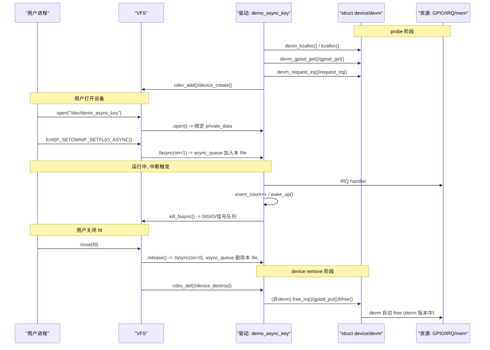

# 第13章_工程实践案例与编码核对表

（章节内容说明）

前 1–12 章主要解决的是 **概念、机制与接口**，你已经有了：

- fasync 的设计动机、数据结构与调用链；
- 字符设备中 `.read/.poll/.fasync` 的实现模式；
- 中断场景下 `kill_fasync()` 的使用约束；
- fasync 与 input/netlink/io_uring 等机制的边界与协作方式。

从本章开始，我们不再“按机制拆开讲”，而是按照真实工程场景组织内容：

- **13.1**：GPIO 中断 + 字符设备 + fasync + 用户态 SIGIO 的 **完整闭环**；
- **13.2**：在一个“多路设备 + signalfd + epoll”的统一事件循环中，如何组合 fasync；
- **13.3**：把一个“轮询版驱动”改造为 “fasync 版驱动”的 **完整迁移过程**；
- **13.4**：同一套逻辑的 devm / 非 devm 版本差异与迁移注意点；
- **13.5**：驱动侧开发核对表（必写项 / 可选项 / 禁用项）；
- **13.6**：用户态应用核对表（配置步骤 / 信号处理 / 退出流程）。

本章的目标是：
 把前面所有抽象内容“压实”为可以直接拿去做实验 / 写项目的 **工程模板和核对表**，让你在写驱动和用户态程序时有清晰的 checklist，而不是每次从零思考。

本批聚焦 **13.1 案例一：GPIO 中断 + fasync + 用户态 SIGIO**。

------

## 13.1_案例一_GPIO_中断_+_fasync_+_用户态_SIGIO

### 13.1.1_引入_从_按键中断_到_用户态_SIGIO_回调

本小节我们针对一个非常具体、可直接在 i.MX6ULL 上落地的场景：

- 硬件：

  - SoC：i.MX6ULL；
  - 一个外接按键连接到 `gpio1_18`（作为中断输入）；
  - 一个 LED 接在 `gpio1_3`（可选，用于调试指示）。

- 设备树节点（延续前文约定）：

  ```dts
  demo_led_key_int@0 {
  	compatible = "nxp,imx6ull-led_key_int";
  	reg = <0x0 0x0>;	/* 无实际寄存器，仅占位 */

  	/* LED 输出引脚: gpio1_3 */
  	led-gpios = <&gpio1 3 GPIO_ACTIVE_LOW>;

  	/* 按键输入引脚: gpio1_18 */
  	key-gpios = <&gpio1 18 GPIO_ACTIVE_LOW>;

  	interrupt-parent = <&gpio1>;
  	interrupts = <18 IRQ_TYPE_EDGE_FALLING>;

  	nxp,debounce-ms = <10>;
  };
  ```

- 驱动目标：

  1. 注册一个字符设备 `/dev/demo_async_key`；
  2. 在 GPIO 外部中断触发时，驱动更新内部事件状态：
     - `event_count++`；
     - 唤醒 `.read` 阻塞与 `.poll` 轮询；
     - 同时通过 fasync 触发 SIGIO。
  3. 用户态应用：
     - 使用 `SIGIO`（或 `SIGRTMIN+n`）作为“异步通知入口”；
     - 在信号处理函数中 `read(fd, ...)` 取出事件计数。

我们会严格按“八段结构”展开：

1. 引入（当前小节）；
2. 数据结构视角；
3. 开发者视角（驱动实现步骤）；
4. 用户/平台视角（应用配置与行为）；
5. 可视化图示；
6. 示例代码（包括 devm / 非 devm 关键差异说明）；
7. 调试与验证步骤；
8. 小结。

------

### 13.1.2_数据结构视角_struct_demo_async_key_dev_如何承载完整状态

对于这个 GPIO 中断 + fasync 案例，一个合理的设备数据结构可以是：

```c
struct demo_async_key_dev {
	struct device		*dev;		/* 平台设备中的 struct device */

	struct gpio_desc	*led_gpiod;	/* LED 输出 GPIO (可选) */
	struct gpio_desc	*key_gpiod;	/* KEY 输入 GPIO */

	int			irq;		/* 按键中断号 */

	wait_queue_head_t	wait;		/* waitqueue: 供 read/poll 使用 */
	spinlock_t		lock;		/* 保护 event_count/async_queue */

	struct fasync_struct	*async_queue;	/* fasync 链表头 */

	unsigned int		event_count;	/* 未消费的事件次数 */
	unsigned int		last_key_state;	/* 最近一次按键电平 (0/1) */

	/* 字符设备相关 */
	dev_t			devt;
	struct cdev		cdev;
	struct class		*cls;
};
```

关键点：

1. **中断相关字段**
   - `key_gpiod` + `irq`：从 DTS 解析 gpio → gpio_desc → irq；
   - `last_key_state`：用于在中断处理函数中记录当前电平（方便用户态调试）。
2. **异步通知相关字段**
   - `wait` + `event_count`：服务 `.read` / `.poll`；
   - `async_queue`：服务 `.fasync` / `kill_fasync()`；
   - `lock`：保护 `event_count` 和 `async_queue`。
3. **字符设备相关字段**
   - `devt` / `cdev` / `cls`：用于在 `/dev` 下创建设备节点。

在 devm 版本中：

- `struct demo_async_key_dev *akdev` 通常用 `devm_kzalloc()` 分配；
- GPIO、IRQ、class/device 等也可使用 devm 系列接口管理；
- 中断退出时无需手动释放资源（devm 自动回滚）。

在非 devm 版本中：

- 需要在 `probe` 的失败路径与 `remove` 中手动 `gpio_free()` / `free_irq()` / `cdev_del()` 等。

------

### 13.1.3_开发者视角_驱动实现的关键步骤(devm_版为主)

以 devm 版本为主线，从驱动作者角度，把实现拆成有明确顺序的步骤。

#### (1)_步骤_1_解析设备树_获取_GPIO_/_中断号_/_去抖参数

- 使用 `devm_gpiod_get()` 或 `devm_gpiod_get_optional()` 获取 `led-gpios` / `key-gpios`；
- 使用 `gpiod_to_irq()` 获取中断号；
- 从 `nxp,debounce-ms` 读取去抖时间，存为 `unsigned int`。

#### (2)_步骤_2_初始化字符设备与_waitqueue

- `alloc_chrdev_region()` 或 `register_chrdev_region()` 固定主次设备号；
- `cdev_init()` + `cdev_add()`；
- `class_create()` + `device_create()` 创建设备节点；
- `init_waitqueue_head(&dev->wait)`；
- `spin_lock_init(&dev->lock)`；
- 令 `event_count = 0`，`async_queue = NULL`。

#### (3)_步骤_3_注册中断处理函数

- `devm_request_irq()` 注册中断：
  - flags 通常为 `IRQF_TRIGGER_FALLING` 或从 DTS 中解析；
  - `irq_handler_t` 中仅做轻量逻辑：
    - 执行简单去抖（基于 jiffies 或已配置的硬件去抖）；
    - 更新 `event_count`；
    - `wake_up_interruptible()`；
    - 如有 `async_queue`，调用 `kill_fasync()`。

#### (4)_步骤_4_实现.read_/.poll_/.fasync

- `.read`：
  - 阻塞等待 `event_count > 0`；
  - 进入临界区读取并清零 `event_count`，复制到用户态；
  - 可选：同时返回 `last_key_state` 等调试信息。
- `.poll`：
  - `poll_wait(filp, &dev->wait, wait)` 注册 waitqueue；
  - 如果 `event_count > 0`，返回 `EPOLLIN | EPOLLRDNORM`；
  - 否则返回 0。
- `.fasync`：
  - 使用 `fasync_helper()` 维护 `dev->async_queue`；
  - 注意加锁保护。

#### (5)_步骤_5.open_/.release_中维护私有数据与_fasync_状态

- `.open`：
  - 将 `file->private_data` 绑定到 `struct demo_async_key_dev`；
- `.release`：
  - 调用 `.fasync(fd, filp, 0)` 清除该 `file` 对应的 fasync 状态；
  - 防止 `async_queue` 中出现悬挂节点。

#### (6)_步骤_6_devm_/_非_devm_版本的差异

- devm 版：
  - `devm_kzalloc` / `devm_gpiod_get` / `devm_request_irq` 等；
  - `remove` 中只做最小清理（cdev/class/device），其余由 devres 自动回滚。
- 非 devm 版：
  - 用 `kzalloc` / `gpio_request` / `request_irq` 等；
  - 在 `probe` 失败路径与 `remove` 中手动释放所有资源（正确顺序尤为重要）。

------

### 13.1.4_用户/平台视角_如何从_SIGIO_看到真实按键事件

从用户态角度，这个案例的工作流可以描述为：

1. 打开设备：

   ```c
   fd = open("/dev/demo_async_key", O_RDONLY | O_NONBLOCK);
   ```

2. 安装 SIGIO 处理函数（推荐 `sigaction` + `SA_SIGINFO`）：

   - 在 handler 中调用 `read(fd, &events, sizeof(events))`；
   - 根据返回的 `events`（事件次数）更新应用内的状态。

3. 配置 fasync：

   ```c
   fcntl(fd, F_SETOWN, getpid());              /* 设置 owner 进程 */
   flags = fcntl(fd, F_GETFL);
   fcntl(fd, F_SETFL, flags | O_ASYNC);        /* 打开 O_ASYNC/FASYNC */
   ```

4. 可选：将 SIGIO 替换为一个 RT 信号或通过 `F_SETSIG` 改成自定义信号号。

5. 程序主循环：

   - 要么简单地 `pause()`；
   - 要么结合其他 FD 做 select/poll/epoll；
   - 要么进一步用 `signalfd` 把 SIGIO 转为 FD（在 13.2 案例中会展开）。

从平台角度：

- 这是一个典型的“**少量设备 + 稀疏事件 + 对时效有要求**”的模式；
- 同一按键若同时接入 input 子系统，还可以被桌面系统识别（本例只做简单异步通知，暂不叠加 input）。

------

### 13.1.5_可视化_从中断到_SIGIO_的路径图

下面用一个流程图把完整路径串起来：

```mermaid
flowchart LR
    "DTS"["DTS: \"demo_led_key_int@0\" 节点"]
    "PDRV"["平台驱动: demo_async_key_driver"]
    "DEV"["demo_async_key_dev\n(wait/event_count/async_queue)"]
    "GPIO"["GPIO 控制器: gpio1"]
    "IRQH"["中断处理: demo_key_irq_handler()"]
    "STATE"["事件状态: event_count++"]
    "WQ"["等待队列: wait_queue_head_t"]
    "FAS"["fasync 链表: async_queue"]
    "UP_SIG"["用户进程: SIGIO 处理函数"]
    "UP_RD"["用户进程: read() 读取事件计数"]

    "DTS" --> "PDRV"
    "PDRV" --> "DEV"
    "PDRV" --> "GPIO"
    "GPIO" --> "IRQH"
    "IRQH" --> "STATE"
    "STATE" --> "WQ"
    "STATE" --> "FAS"
    "WQ" --> "UP_RD"
    "FAS" --> "UP_SIG"
```

阅读要点：

- DTS → 平台驱动 → `demo_async_key_dev` 完成“实例化”；
- GPIO 中断 → 中断处理函数 → `event_count` 状态更新；
- 事件同时通过两个路径向上通知用户态：
  - waitqueue → `.read` / `.poll`；
  - fasync_struct → `kill_fasync` → SIGIO。

------

### 13.1.6_示例代码_devm_版完整驱动_+_用户态_SIGIO_Demo

> 说明：
>
> - 为了篇幅可控，这里给出一份 **自包含且可编译** 的示例驱动代码骨架；
> - devm 版为主，非 devm 差异在 13.4 再系统展开；
> - 所有数值常量使用具名宏（带单位后缀），注释为中文，缩进/风格符合内核规范。

#### (1)_内核驱动_demo_async_key.c(devm_版)

```c
// demo_async_key.c

#include <linux/module.h>
#include <linux/kernel.h>
#include <linux/init.h>
#include <linux/fs.h>
#include <linux/cdev.h>
#include <linux/device.h>
#include <linux/uaccess.h>
#include <linux/gpio/consumer.h>
#include <linux/of_device.h>
#include <linux/of_gpio.h>
#include <linux/interrupt.h>
#include <linux/poll.h>
#include <linux/sched/signal.h>
#include <linux/spinlock.h>
#include <linux/jiffies.h>

#define DEMO_DEVICE_NAME_STR          "demo_async_key"
#define DEMO_CLASS_NAME_STR           "demo_async_class"

#define DEMO_DEBOUNCE_DEFAULT_MS      10U	/* 默认去抖时间, 单位: ms */
#define DEMO_EVENTS_MAX_PER_READ_CNT  1024U	/* 每次 read 返回的最大事件数 */

struct demo_async_key_dev {
	struct device		*dev;

	struct gpio_desc	*led_gpiod;
	struct gpio_desc	*key_gpiod;

	int			irq;

	wait_queue_head_t	wait;
	spinlock_t		lock;

	struct fasync_struct	*async_queue;

	unsigned int		event_count;
	unsigned int		last_key_state;

	unsigned int		debounce_ms;
	unsigned long		last_jiffies;

	dev_t			devt;
	struct cdev		cdev;
	struct class		*cls;
};

static dev_t demo_devt;
static struct class *demo_class;

static bool demo_key_has_event(struct demo_async_key_dev *akdev)
{
	return akdev->event_count > 0U;
}

/* 中断处理函数 */
static irqreturn_t demo_key_irq_handler(int irq, void *dev_id)
{
	struct demo_async_key_dev *akdev = dev_id;
	unsigned long flags;
	unsigned long now_jiffies;
	bool notify = false;
	bool led_toggle = false;

	now_jiffies = jiffies;

	/* 简单基于时间的去抖: 两次触发间隔过小则丢弃 */
	if (akdev->debounce_ms > 0U) {
		unsigned long interval_jiffies;

		interval_jiffies = msecs_to_jiffies(akdev->debounce_ms);
		if (time_before(now_jiffies,
		    akdev->last_jiffies + interval_jiffies))
			return IRQ_HANDLED;
	}

	akdev->last_jiffies = now_jiffies;

	spin_lock_irqsave(&akdev->lock, flags);

	if (akdev->event_count < DEMO_EVENTS_MAX_PER_READ_CNT)
		akdev->event_count++;

	/* 记录当前按键电平, 便于调试 */
	if (akdev->key_gpiod)
		akdev->last_key_state = gpiod_get_value(akdev->key_gpiod);

	/* 唤醒阻塞在 read/poll 的进程 */
	wake_up_interruptible(&akdev->wait);

	if (akdev->async_queue)
		notify = true;

	if (akdev->led_gpiod)
		led_toggle = true;

	spin_unlock_irqrestore(&akdev->lock, flags);

	/* 通过信号通知用户态 */
	if (notify)
		kill_fasync(&akdev->async_queue, SIGIO, POLL_IN);

	/* 可选: 翻转 LED 状态用于可视化调试 */
	if (led_toggle) {
		int level;

		level = gpiod_get_value(akdev->led_gpiod);
		gpiod_set_value(akdev->led_gpiod, !level);
	}

	return IRQ_HANDLED;
}

static ssize_t demo_key_read(struct file *filp, char __user *buf,
			     size_t count, loff_t *ppos)
{
	struct demo_async_key_dev *akdev = filp->private_data;
	unsigned long flags;
	unsigned int events_cnt = 0U;
	int ret;

	if (count < sizeof(events_cnt))
		return -EINVAL;

	/* 阻塞等待事件发生 */
	if (wait_event_interruptible(akdev->wait,
	    demo_key_has_event(akdev)))
		return -ERESTARTSYS;

	spin_lock_irqsave(&akdev->lock, flags);

	if (akdev->event_count > 0U) {
		events_cnt = akdev->event_count;
		akdev->event_count = 0U;
	}

	spin_unlock_irqrestore(&akdev->lock, flags);

	if (events_cnt == 0U)
		return 0;

	ret = copy_to_user(buf, &events_cnt, sizeof(events_cnt));
	if (ret)
		return -EFAULT;

	return sizeof(events_cnt);
}

static __poll_t demo_key_poll(struct file *filp, poll_table *wait)
{
	struct demo_async_key_dev *akdev = filp->private_data;
	__poll_t mask = 0;

	poll_wait(filp, &akdev->wait, wait);

	if (demo_key_has_event(akdev))
		mask |= EPOLLIN | EPOLLRDNORM;

	return mask;
}

static int demo_key_fasync(int fd, struct file *filp, int on)
{
	struct demo_async_key_dev *akdev = filp->private_data;
	unsigned long flags;
	int ret;

	spin_lock_irqsave(&akdev->lock, flags);
	ret = fasync_helper(fd, filp, on, &akdev->async_queue);
	spin_unlock_irqrestore(&akdev->lock, flags);

	return ret;
}

static int demo_key_open(struct inode *inode, struct file *filp)
{
	struct demo_async_key_dev *akdev;

	akdev = container_of(inode->i_cdev, struct demo_async_key_dev, cdev);
	filp->private_data = akdev;

	return 0;
}

static int demo_key_release(struct file *filp)
{
	/* 关闭 fasync 状态, 清除 async_queue 中的本 file 节点 */
	return demo_key_fasync(-1, filp, 0);
}

static const struct file_operations demo_key_fops = {
	.owner		= THIS_MODULE,
	.open		= demo_key_open,
	.release	= demo_key_release,
	.read		= demo_key_read,
	.poll		= demo_key_poll,
	.fasync		= demo_key_fasync,
};

static int demo_key_probe(struct platform_device *pdev)
{
	struct device *dev = &pdev->dev;
	struct demo_async_key_dev *akdev;
	struct device_node *np = dev->of_node;
	u32 debounce;
	int ret;

	if (!np)
		return -EINVAL;

	akdev = devm_kzalloc(dev, sizeof(*akdev), GFP_KERNEL);
	if (!akdev)
		return -ENOMEM;

	akdev->dev = dev;

	/* 获取 LED GPIO (可选) */
	akdev->led_gpiod = devm_gpiod_get_optional(dev, "led", GPIOD_OUT_LOW);
	if (IS_ERR(akdev->led_gpiod)) {
		dev_err(dev, "failed to get led gpio\n");
		return PTR_ERR(akdev->led_gpiod);
	}

	/* 获取按键 GPIO (必需) */
	akdev->key_gpiod = devm_gpiod_get(dev, "key", GPIOD_IN);
	if (IS_ERR(akdev->key_gpiod)) {
		dev_err(dev, "failed to get key gpio\n");
		return PTR_ERR(akdev->key_gpiod);
	}

	akdev->irq = gpiod_to_irq(akdev->key_gpiod);
	if (akdev->irq < 0) {
		dev_err(dev, "failed to get irq from key gpio\n");
		return akdev->irq;
	}

	/* 去抖参数 */
	if (!of_property_read_u32(np, "nxp,debounce-ms", &debounce))
		akdev->debounce_ms = debounce;
	else
		akdev->debounce_ms = DEMO_DEBOUNCE_DEFAULT_MS;

	init_waitqueue_head(&akdev->wait);
	spin_lock_init(&akdev->lock);
	akdev->async_queue = NULL;
	akdev->event_count = 0U;
	akdev->last_key_state = 0U;
	akdev->last_jiffies = 0UL;

	/* 注册字符设备 (这里简单使用一个全局主设备号, 多实例时需拓展) */
	if (!demo_class) {
		ret = alloc_chrdev_region(&demo_devt, 0, 1,
					  DEMO_DEVICE_NAME_STR);
		if (ret) {
			dev_err(dev, "alloc_chrdev_region failed\n");
			return ret;
		}

		demo_class = class_create(THIS_MODULE,
					  DEMO_CLASS_NAME_STR);
		if (IS_ERR(demo_class)) {
			ret = PTR_ERR(demo_class);
			unregister_chrdev_region(demo_devt, 1);
			demo_class = NULL;
			dev_err(dev, "class_create failed\n");
			return ret;
		}
	}

	akdev->devt = demo_devt;

	cdev_init(&akdev->cdev, &demo_key_fops);
	akdev->cdev.owner = THIS_MODULE;

	ret = cdev_add(&akdev->cdev, akdev->devt, 1);
	if (ret) {
		dev_err(dev, "cdev_add failed\n");
		goto err_cdev_add;
	}

	akdev->cls = demo_class;
	device_create(akdev->cls, dev, akdev->devt,
		      NULL, DEMO_DEVICE_NAME_STR);

	platform_set_drvdata(pdev, akdev);

	/* 注册中断 (边沿触发类型由 DTS 提供) */
	ret = devm_request_irq(dev, akdev->irq, demo_key_irq_handler,
			       0, DEMO_DEVICE_NAME_STR, akdev);
	if (ret) {
		dev_err(dev, "request_irq failed: %d\n", ret);
		goto err_irq;
	}

	dev_info(dev, "demo_async_key probed, dev=%d:%d, irq=%d\n",
		 MAJOR(akdev->devt), MINOR(akdev->devt), akdev->irq);

	return 0;

err_irq:
	device_destroy(akdev->cls, akdev->devt);
	cdev_del(&akdev->cdev);
err_cdev_add:
	if (demo_class && atomic_read(&demo_class->refcnt) == 0) {
		class_destroy(demo_class);
		demo_class = NULL;
		unregister_chrdev_region(demo_devt, 1);
	}
	return ret;
}

static int demo_key_remove(struct platform_device *pdev)
{
	struct demo_async_key_dev *akdev = platform_get_drvdata(pdev);

	device_destroy(akdev->cls, akdev->devt);
	cdev_del(&akdev->cdev);

	if (demo_class && atomic_read(&demo_class->refcnt) == 0) {
		class_destroy(demo_class);
		demo_class = NULL;
		unregister_chrdev_region(demo_devt, 1);
	}

	return 0;
}

static const struct of_device_id demo_key_of_match[] = {
	{
		.compatible = "nxp,imx6ull-led_key_int",
	},
	{ /* sentinel */ }
};
MODULE_DEVICE_TABLE(of, demo_key_of_match);

static struct platform_driver demo_key_driver = {
	.probe		= demo_key_probe,
	.remove		= demo_key_remove,
	.driver		= {
		.name		= DEMO_DEVICE_NAME_STR,
		.of_match_table	= demo_key_of_match,
	},
};

module_platform_driver(demo_key_driver);

MODULE_LICENSE("GPL");
MODULE_AUTHOR("demo_author");
MODULE_DESCRIPTION("demo: GPIO async key with fasync + SIGIO");
```

> 非 devm 版的不同之处主要在于：
>
> - 使用 `kzalloc`、`gpio_request_one`、`request_irq` 等；
> - `remove` 中完整释放所有资源；
> - `probe` 失败路径中也要按逆序清理。
>    这些会在 13.4 中专门做 devm / 非 devm 对照表。

------

#### (2)_用户态_SIGIO_示例_demo_sigio_key.c

```c
// demo_sigio_key.c

#include <stdio.h>
#include <stdlib.h>
#include <unistd.h>
#include <signal.h>
#include <string.h>
#include <errno.h>
#include <fcntl.h>
#include <sys/types.h>

#define DEMO_DEVICE_PATH_STR         "/dev/demo_async_key"

static int g_demo_fd = -1;

static void demo_sigio_handler(int sig, siginfo_t *info, void *ucontext)
{
	unsigned int events_cnt = 0U;
	ssize_t n;

	(void)ucontext;

	if (sig != SIGIO)
		return;

	if (!info)
		return;

	if (info->si_fd != g_demo_fd)
		return;

	n = read(g_demo_fd, &events_cnt, sizeof(events_cnt));
	if (n == (ssize_t)sizeof(events_cnt)) {
		printf("[SIGIO] events_cnt=%u\n", events_cnt);
		fflush(stdout);
	}
}

int main(void)
{
	struct sigaction sa;
	int flags;
	int ret;

	g_demo_fd = open(DEMO_DEVICE_PATH_STR, O_RDONLY | O_NONBLOCK);
	if (g_demo_fd < 0) {
		perror("open");
		return EXIT_FAILURE;
	}

	memset(&sa, 0, sizeof(sa));
	sa.sa_sigaction = demo_sigio_handler;
	sa.sa_flags = SA_SIGINFO;
	sigemptyset(&sa.sa_mask);

	if (sigaction(SIGIO, &sa, NULL) < 0) {
		perror("sigaction");
		close(g_demo_fd);
		return EXIT_FAILURE;
	}

	ret = fcntl(g_demo_fd, F_SETOWN, getpid());
	if (ret < 0) {
		perror("fcntl(F_SETOWN)");
		close(g_demo_fd);
		return EXIT_FAILURE;
	}

	flags = fcntl(g_demo_fd, F_GETFL);
	if (flags < 0) {
		perror("fcntl(F_GETFL)");
		close(g_demo_fd);
		return EXIT_FAILURE;
	}

	ret = fcntl(g_demo_fd, F_SETFL, flags | O_ASYNC);
	if (ret < 0) {
		perror("fcntl(F_SETFL, O_ASYNC)");
		close(g_demo_fd);
		return EXIT_FAILURE;
	}

	printf("等待按键中断, 设备路径=%s, pid=%d, fd=%d\n",
	       DEMO_DEVICE_PATH_STR, getpid(), g_demo_fd);

	for (;;) {
		pause();
	}

	close(g_demo_fd);
	return EXIT_SUCCESS;
}
```

这段用户态代码对应的行为是：

- 程序启动后挂起在 `pause()` 上；
- 每次按键产生中断 → 驱动 `event_count++` → `kill_fasync` → SIGIO → handler 中 `read()` 输出 `events_cnt`。

------

### 13.1.7_调试与验证_从_设备不收信号_到_完整闭环_的排查步骤

在这个完整案例上，如果出现“配置了 O_ASYNC 但收不到 SIGIO”或“事件计数异常”等问题，可以按以下顺序排查：

1. **确认设备节点与驱动加载**
   - `dmesg | grep demo_async_key`：观察 probe 日志；
   - `ls -l /dev/demo_async_key`：确认设备节点存在、主次设备号正确。
2. **检查中断是否触发**
   - `cat /proc/interrupts | grep demo_async_key`：按键多次触发，看计数是否递增；
   - 如不递增：检查 DTS 中 `interrupts` / `interrupt-parent` 是否正确，`gpiod_to_irq` 返回值是否正常。
3. **检查 `.read` / `.poll` 行为**
   - 写一个简易 `poll + read` 程序（不使用 SIGIO），验证：
     - 按键触发时 `.poll` 是否返回可读；
     - `read()` 是否能读出非零 `events_cnt`；
     - 多次按键后计数是否累加。
4. **检查 fasync 配置**
   - 用 `strace` 跑 `demo_sigio_key`：
     - 观察是否调用了 `fcntl(F_SETOWN)` 和 `fcntl(F_SETFL, O_ASYNC)`；
   - 查看 `/proc/PID/status` 中的 `SigIgn` / `SigCgt`，确认 SIGIO 未被屏蔽；
   - 对比 `/proc/PID/fdinfo/FD`，确认 fd 上的 `flags` 中含有 `O_ASYNC`。
5. **检查信号路由**
   - 如果程序使用多线程，注意 SIGIO 默认送达“owner 进程中的某个线程”，需要结合 `pthread_sigmask` 与 `sigaction` 设计；
   - 可以临时只用单线程程序验证基础行为。
6. **用 ftrace 观察驱动中的关键路径**
   - 打开 tracepoints：
     - `.fasync` 回调；
     - `kill_fasync` 调用；
     - 中断处理函数；
   - 确认事件发生时：
     - 中断 → handler → `event_count++` 逻辑被执行；
     - `kill_fasync()` 确实被调用。

------

### 13.1.8_小结_一个完整的_GPIO_中断_to_fasync_to_SIGIO_标准样例

通过这个案例，你已经得到一个“可直接投入实验”的标准模板，它具备：

1. **完整的内核态链路**
   - DTS → 平台驱动 → `struct demo_async_key_dev`；
   - GPIO 中断 → 设备状态更新（`event_count`）→ waitqueue 唤醒；
   - fasync 链表 → `kill_fasync` → SIGIO 触发。
2. **同时支持阻塞 `.read` / `.poll` / fasync 的接口**
   - 同一设备节点 `/dev/demo_async_key` 既可以被 `poll/epoll` 使用，又可以被 SIGIO 使用；
   - 事件状态只维护一份，避免重复逻辑。
3. **与 devm / 非 devm 的清晰分工**
   - 本节以 devm 版为主，展示 devres 风格资源管理；
   - 非 devm 版将在 13.4 进行对照与迁移解读。
4. **一套可复用的调试步骤**
   - 从中断计数、`.poll` 行为、fcntl/FASYNC 配置，到信号路由与 ftrace 调试，构成闭环；
   - 这些步骤可直接套用到后续你自己写的 fasync 驱动上。

在后续的 **13.2** 中，我们会把视角从“单设备 + SIGIO”扩展到：

- **多路设备 + signalfd + epoll 统一事件循环**，
- 展示如何把多个 fasync 驱动、多个普通 fd 与 socket 一起放入一个统一的事件循环中，形成更贴近真实服务进程的工程结构。


------

## 13.2_案例二_多路设备_+_signalfd_+_epoll_统一事件循环

### 13.2.1_引入_从_单个_SIGIO_到_多设备_+_socket_的统一事件循环

在 13.1 里，我们完成的是一个“**单设备 + SIGIO + 简单处理函数**”的闭环：

- 只有 `/dev/demo_async_key` 这一个异步设备；
- 用户态直接安装 SIGIO 处理函数，在 handler 里 `read()`；
- 应用主线程可以直接 `pause()` 等待，被 SIGIO 唤醒即可。

但在真实服务进程里，情况往往是：

- 需要同时监听 **多个字符设备**：
  - 比如多个按键设备、多路传感器节点、多块采集卡；
- 还要同时处理 **socket / pipe / timerfd / eventfd** 等其他 fd；
- 希望所有事件都在 **一个统一的 epoll 事件循环** 里处理，方便调度与资源管理；
- 又想复用 **驱动侧已经实现的 fasync**，而不是完全抛弃 SIGIO 模型。

本小节就构造一个更接近真实场景的案例：

> 多个 fasync 驱动 + signalfd + epoll，
>  让所有 fasync 产生的 SIGIO 被 signalfd “收集成一个 fd”，
>  然后和其他设备 fd / socket 一起放进 epoll，形成单一事件循环。

目标是让你看到：

- **驱动侧**：仍然是 13.1 那套 `.read/.poll/.fasync` 模型，无须感知 signalfd/epoll；
- **用户侧**：通过 signalfd 把“多源信号”汇总成一个 fd，统一纳入 epoll。

------

### 13.2.2_数据结构视角_从_每个_fd_一个_SIGIO_到_统一的_signalfd_事件源

先看用户态的“逻辑数据结构”，而不是代码细节。

#### (1)_参与的_fd_类型

假设我们有如下几类 fd：

1. **多个 fasync 设备 fd**：
   - `/dev/demo_async_key0`、`/dev/demo_async_key1`……
   - 每个驱动都像 13.1 那样：
     - 中断 → `event_count++` → `kill_fasync(SIGIO, ...)`；
     - `.read` 返回事件计数。
2. **网络 socket / 管道 / 其他设备 fd**：
   - 如 `listen_fd`（TCP 监听）、`client_fd`（连接）、`/dev/demo_sensor` 等；
   - 全部具有 `.poll` 支持。
3. **统一的 signalfd**：
   - 一个 `signalfd_fd`，绑定若干信号号：
     - 至少包括 `SIGIO`；
     - 也可以叠加其他信号（SIGTERM、SIGINT 等）统一处理。

#### (2)_用户态内部事件描述结构

为了在 epoll 循环中区分不同 fd 的含义，常见做法是：

- 维护一个描述表，将 fd 映射到“角色 + 回调”；
- 或维护一个简单的枚举，用于在事件到来时做 `switch` 分发。

例如可以定义：

```c
enum demo_fd_type {
	DEMO_FD_TYPE_INVALID = 0,
	DEMO_FD_TYPE_SIGNAL,
	DEMO_FD_TYPE_KEY_DEV,
	DEMO_FD_TYPE_SENSOR_DEV,
	DEMO_FD_TYPE_NET_LISTEN,
	DEMO_FD_TYPE_NET_CLIENT,
};

struct demo_fd_ctx {
	int			fd;
	enum demo_fd_type	type;
};
```

再用一个数组或哈希表维护：

```c
#define DEMO_MAX_FD_COUNT       64

static struct demo_fd_ctx g_fd_ctx_tbl[DEMO_MAX_FD_COUNT];
```

这样，当 epoll 返回 `epoll_event` 时，我们就可以根据 `event.data.fd` 或 `event.data.u32` 查到它属于哪个类型，然后调用对应处理函数。

#### (3)_signalfd_的数据结构

signalfd 读出的结构是：

```c
struct signalfd_siginfo {
	__u32  ssi_signo;   /* 信号编号 */
	__s32  ssi_errno;
	__s32  ssi_code;
	__u32  ssi_pid;     /* 发送信号的进程 PID */
	__u32  ssi_uid;
	__s32  ssi_fd;      /* 对于 SIGIO，这里是触发的 fd */
	/* ... 其他字段省略 ... */
};
```

关键字段：

- `ssi_signo`：哪一个信号；
- `ssi_fd`：对于 SIGIO，内核会把 **触发 SIGIO 的那个 fd** 填在这里。

因此我们可以在用户态通过以下逻辑还原：

- “哪一个 fasync 设备触发了这次 SIGIO”；
- 然后针对该 fd 执行 `read(fd, ...)`。

这就形成了从 **“每个设备独立 signal handler”** → **“一个 signalfd + 中心化事件循环”** 的转换。

------

### 13.2.3_开发者视角_驱动侧几乎不用改_重点在用户态事件循环设计

对驱动作者来说，这个案例最关键的点是：

> **驱动侧几乎不需要做任何特殊处理。**

只要：

- 每个设备驱动实现好 `.read/.poll/.fasync`；
- 中断中正确调用 `kill_fasync(&async_queue, SIGIO, POLL_IN)`；
- `.release` 中记得清理 fasync 状态。

那么用户态就可以用两种方式消费事件：

1. 用信号 handler（13.1 的简单方案）；
2. 用 signalfd + epoll 统一管理（13.2 的方案）。

驱动侧唯一需要注意的额外点：

- 如果有多路设备（类似多个 `platform_device` 实例），每个实例都会维护自己的 `async_queue`；
- 在设计 `event_count` 与输出数据结构时，要确保**每个设备实例的状态相互独立**，避免共享全局计数器引起混淆。

也就是说，本节所有“复杂度”都集中在用户态事件循环设计上，而不在驱动。

------

### 13.2.4_用户/平台视角_signalfd_+_epoll_的统一处理流程

从用户/平台视角，完整流程可以概括为以下几步。

#### (1)_步骤_1_创建_signalfd_并屏蔽普通信号

1. 构建一个 `sigset_t`，将 `SIGIO`、`SIGTERM` 等需要通过 signalfd 处理的信号加入集合：

   ```c
   sigset_t mask;

   sigemptyset(&mask);
   sigaddset(&mask, SIGIO);
   sigaddset(&mask, SIGTERM);
   sigaddset(&mask, SIGINT);
   ```

2. 调用 `sigprocmask(SIG_BLOCK, &mask, NULL)` 把这些信号 **从传统 delivery 路径中屏蔽**，否则它们仍会异步打断线程。

3. 调用 `signalfd(-1, &mask, SFD_NONBLOCK | SFD_CLOEXEC)` 创建 signalfd fd：

   - 之后所有 `mask` 中的信号都会以 **可读事件** 的形式出现在这个 fd 上；
   - 我们只需对这个 fd 使用 `read()` 读取 `struct signalfd_siginfo` 即可。

#### (2)_步骤_2_打开各个_fasync_设备_并配置_F_SETOWN_/_O_ASYNC

对每个 `/dev/demo_async_*`：

1. `open()` 得到 fd；
2. 用 `fcntl(F_SETOWN, getpid())` 或 `F_SETOWN_EX` 把 SIGIO 所有权设为本进程或特定线程；
3. 用 `fcntl(F_SETFL, F_GETFL)` + `F_SETFL(FASYNC)` 打开 O_ASYNC；
4. 确保当前线程/进程已经通过 `sigprocmask` 屏蔽了 SIGIO，确保 SIGIO 只通过 signalfd 到达，而不会触发旧式 handler。

#### (3)_步骤_3_把_signalfd_与所有_fd_加入_epoll

1. 调用 `epoll_create1(EPOLL_CLOEXEC)` 创建 epoll 实例；
2. 把 signalfd_fd 以 `EPOLLIN` 方式加入 epoll；
3. 把所有设备 fd、socket fd 等按照角色加入 epoll：
   - 对设备 fd：通常关心 `EPOLLIN`；
   - 对 socket：关心 `EPOLLIN` / `EPOLLOUT`；
   - 可以设置 `EPOLLET`（边沿触发）或保持水平触发。

#### (4)_步骤_4_在_epoll_循环中统一处理事件

主循环形态类似：

1. `epoll_wait()` 阻塞等待事件；
2. 对返回的 `epoll_event` 数组逐个处理：
   - 如果是 signalfd_fd：
     - `read()` 出一个或多个 `signalfd_siginfo`；
     - 对每个 `siginfo`：
       - 如果 `ssi_signo == SIGIO`：
         - 取出 `ssi_fd`；
         - 根据 fd 类型处理，如对 `/dev/demo_async_key0` `read()` 出 `event_count`；
       - 如果是 `SIGTERM` / `SIGINT`：启动优雅退出流程。
   - 如果是普通设备 fd / socket fd：
     - 走正常 `read`/`accept`/业务处理路径。

这种模式的特点是：

- 应用程序只需要一个主线程（也可以结合工作线程池），所有事件统一从 epoll 事件队列中拉取；
- fasync 的“信号驱动”属性被 signalfd 转换成了“fd 可读事件”，与其他 I/O 机制完全一致。

------

### 13.2.5_可视化_多设备_+_signalfd_+_epoll_的整体拓扑

用一个图把驱动侧与用户侧的结构串起来。

```mermaid
flowchart LR
    subgraph "内核: 驱动与信号"
        "DEV0"["驱动0: /dev/demo_async_key0\n(.read/.poll/.fasync)"]
        "DEV1"["驱动1: /dev/demo_async_key1\n(.read/.poll/.fasync)"]
        "SOCK"["内核socket\n(网络栈)"]
        "SIGCORE"["内核信号子系统\n(SIGIO队列)"]

        "DEV0" --> "SIGCORE"
        "DEV1" --> "SIGCORE"
    end

    subgraph "用户态: FD 与事件循环"
        "FD_KEY0"["FD_KEY0: /dev/demo_async_key0"]
        "FD_KEY1"["FD_KEY1: /dev/demo_async_key1"]
        "FD_SOCK"["FD_SOCK: TCP/UDP socket"]
        "FD_SIG"["FD_SIG: signalfd(SIGIO, SIGTERM, ...)"]
        "EPOLL"["epoll 实例"]
        "LOOP"["主事件循环\n(epoll_wait + dispatch)"]
    end

    "DEV0" --> "FD_KEY0"
    "DEV1" --> "FD_KEY1"
    "SOCK" --> "FD_SOCK"
    "SIGCORE" --> "FD_SIG"

    "FD_KEY0" --> "EPOLL"
    "FD_KEY1" --> "EPOLL"
    "FD_SOCK" --> "EPOLL"
    "FD_SIG" --> "EPOLL"
    "EPOLL" --> "LOOP"
```

从这张图可以看到：

- 内核中 fasync 仍然基于“驱动 → 信号子系统”的路径；
- 用户态用 signalfd 把所有 SIGIO 收敛到一个 FD 上；
- epoll 只关心“哪些 FD 有事件”，完全不关心“事件原本是通过 fasync 还是普通 poll 来的”。

------

### 13.2.6_示例代码_多_fasync_设备_+_signalfd_+_epoll_的用户态_demo

下面给出一个可编译的用户态示例，逻辑是：

- 打开多个 `/dev/demo_async_key*`；
- 对每个 fd 配置 F_SETOWN + O_ASYNC；
- 使用 signalfd 捕获所有 SIGIO/SIGTERM；
- 使用 epoll 同时管理 signalfd 和一个假设的 TCP 监听 socket；
- 在事件循环中分别打印按键事件与网络连接事件。

> 为简化，网络 socket 部分只展示接口；你可以在实际工程中替换为真实的 listen/accept 逻辑。

```c
// demo_epoll_signalfd.c

#define _GNU_SOURCE
#include <stdio.h>
#include <stdlib.h>
#include <unistd.h>
#include <signal.h>
#include <string.h>
#include <errno.h>
#include <fcntl.h>
#include <sys/types.h>
#include <sys/signalfd.h>
#include <sys/epoll.h>
#include <sys/socket.h>
#include <netinet/in.h>

#define DEMO_DEVICE_KEY0_PATH_STR        "/dev/demo_async_key0"
#define DEMO_DEVICE_KEY1_PATH_STR        "/dev/demo_async_key1"

#define DEMO_EPOLL_MAX_EVENTS_CNT        16
#define DEMO_LISTEN_BACKLOG_CNT          16
#define DEMO_SERVER_PORT_U16             12345U

enum demo_fd_type {
	DEMO_FD_TYPE_INVALID = 0,
	DEMO_FD_TYPE_SIGNAL,
	DEMO_FD_TYPE_KEY_DEV,
	DEMO_FD_TYPE_NET_LISTEN,
	DEMO_FD_TYPE_NET_CLIENT,
};

struct demo_fd_ctx {
	int			fd;
	enum demo_fd_type	type;
};

static struct demo_fd_ctx g_fd_ctx_tbl[FD_SETSIZE];

static void demo_fd_ctx_init(void)
{
	int i;

	for (i = 0; i < (int)FD_SETSIZE; ++i) {
		g_fd_ctx_tbl[i].fd = -1;
		g_fd_ctx_tbl[i].type = DEMO_FD_TYPE_INVALID;
	}
}

static void demo_fd_ctx_register(int fd, enum demo_fd_type type)
{
	if (fd < 0 || fd >= (int)FD_SETSIZE)
		return;

	g_fd_ctx_tbl[fd].fd = fd;
	g_fd_ctx_tbl[fd].type = type;
}

static enum demo_fd_type demo_fd_ctx_get_type(int fd)
{
	if (fd < 0 || fd >= (int)FD_SETSIZE)
		return DEMO_FD_TYPE_INVALID;

	return g_fd_ctx_tbl[fd].type;
}

static int demo_set_fd_async(int fd)
{
	int flags;
	int ret;

	ret = fcntl(fd, F_SETOWN, getpid());
	if (ret < 0) {
		perror("fcntl(F_SETOWN)");
		return -1;
	}

	flags = fcntl(fd, F_GETFL);
	if (flags < 0) {
		perror("fcntl(F_GETFL)");
		return -1;
	}

	ret = fcntl(fd, F_SETFL, flags | O_ASYNC | O_NONBLOCK);
	if (ret < 0) {
		perror("fcntl(F_SETFL)");
		return -1;
	}

	return 0;
}

static int demo_create_listen_socket(void)
{
	int listen_fd;
	int optval = 1;
	struct sockaddr_in addr;

	listen_fd = socket(AF_INET, SOCK_STREAM | SOCK_NONBLOCK, 0);
	if (listen_fd < 0) {
		perror("socket");
		return -1;
	}

	if (setsockopt(listen_fd, SOL_SOCKET, SO_REUSEADDR,
		       &optval, sizeof(optval)) < 0) {
		perror("setsockopt");
		close(listen_fd);
		return -1;
	}

	memset(&addr, 0, sizeof(addr));
	addr.sin_family = AF_INET;
	addr.sin_addr.s_addr = htonl(INADDR_ANY);
	addr.sin_port = htons(DEMO_SERVER_PORT_U16);

	if (bind(listen_fd, (struct sockaddr *)&addr, sizeof(addr)) < 0) {
		perror("bind");
		close(listen_fd);
		return -1;
	}

	if (listen(listen_fd, DEMO_LISTEN_BACKLOG_CNT) < 0) {
		perror("listen");
		close(listen_fd);
		return -1;
	}

	return listen_fd;
}

int main(void)
{
	int epfd = -1;
	int sfd = -1;
	int key0_fd = -1;
	int key1_fd = -1;
	int listen_fd = -1;
	struct epoll_event ev;
	struct epoll_event events[DEMO_EPOLL_MAX_EVENTS_CNT];
	sigset_t mask;
	int ret;
	int i;
	int quit = 0;

	demo_fd_ctx_init();

	/* 1. 屏蔽 SIGIO/SIGTERM/SIGINT, 统一通过 signalfd 接收 */
	sigemptyset(&mask);
	sigaddset(&mask, SIGIO);
	sigaddset(&mask, SIGTERM);
	sigaddset(&mask, SIGINT);

	if (sigprocmask(SIG_BLOCK, &mask, NULL) < 0) {
		perror("sigprocmask");
		return EXIT_FAILURE;
	}

	sfd = signalfd(-1, &mask, SFD_NONBLOCK | SFD_CLOEXEC);
	if (sfd < 0) {
		perror("signalfd");
		return EXIT_FAILURE;
	}

	demo_fd_ctx_register(sfd, DEMO_FD_TYPE_SIGNAL);

	/* 2. 打开 fasync 设备 */
	key0_fd = open(DEMO_DEVICE_KEY0_PATH_STR, O_RDONLY | O_NONBLOCK);
	if (key0_fd < 0) {
		perror("open key0");
		goto out;
	}
	if (demo_set_fd_async(key0_fd) < 0)
		goto out;
	demo_fd_ctx_register(key0_fd, DEMO_FD_TYPE_KEY_DEV);

	key1_fd = open(DEMO_DEVICE_KEY1_PATH_STR, O_RDONLY | O_NONBLOCK);
	if (key1_fd < 0) {
		perror("open key1");
		goto out;
	}
	if (demo_set_fd_async(key1_fd) < 0)
		goto out;
	demo_fd_ctx_register(key1_fd, DEMO_FD_TYPE_KEY_DEV);

	/* 3. 创建监听 socket (示例) */
	listen_fd = demo_create_listen_socket();
	if (listen_fd < 0)
		goto out;

	demo_fd_ctx_register(listen_fd, DEMO_FD_TYPE_NET_LISTEN);

	/* 4. 创建 epoll 并注册 fd */
	epfd = epoll_create1(EPOLL_CLOEXEC);
	if (epfd < 0) {
		perror("epoll_create1");
		goto out;
	}

	/* 注册 signalfd */
	memset(&ev, 0, sizeof(ev));
	ev.events = EPOLLIN;
	ev.data.fd = sfd;
	if (epoll_ctl(epfd, EPOLL_CTL_ADD, sfd, &ev) < 0) {
		perror("epoll_ctl(signalfd)");
		goto out;
	}

	/* 注册 key0, key1 */
	memset(&ev, 0, sizeof(ev));
	ev.events = EPOLLIN;
	ev.data.fd = key0_fd;
	if (epoll_ctl(epfd, EPOLL_CTL_ADD, key0_fd, &ev) < 0) {
		perror("epoll_ctl(key0)");
		goto out;
	}

	memset(&ev, 0, sizeof(ev));
	ev.events = EPOLLIN;
	ev.data.fd = key1_fd;
	if (epoll_ctl(epfd, EPOLL_CTL_ADD, key1_fd, &ev) < 0) {
		perror("epoll_ctl(key1)");
		goto out;
	}

	/* 注册 listen_fd */
	memset(&ev, 0, sizeof(ev));
	ev.events = EPOLLIN;
	ev.data.fd = listen_fd;
	if (epoll_ctl(epfd, EPOLL_CTL_ADD, listen_fd, &ev) < 0) {
		perror("epoll_ctl(listen)");
		goto out;
	}

	printf("多路设备 + signalfd + epoll 事件循环启动, pid=%d\n",
	       getpid());
	printf("  key0_fd=%d, key1_fd=%d, sfd=%d, listen_fd=%d\n",
	       key0_fd, key1_fd, sfd, listen_fd);

	/* 5. 主事件循环 */
	while (!quit) {
		int nready;

		nready = epoll_wait(epfd, events,
				    DEMO_EPOLL_MAX_EVENTS_CNT, -1);
		if (nready < 0) {
			if (errno == EINTR)
				continue;
			perror("epoll_wait");
			break;
		}

		for (i = 0; i < nready; ++i) {
			int fd = events[i].data.fd;
			enum demo_fd_type type = demo_fd_ctx_get_type(fd);

			if (!(events[i].events & EPOLLIN))
				continue;

			switch (type) {
			case DEMO_FD_TYPE_SIGNAL: {
				struct signalfd_siginfo fdsi;
				ssize_t s;

				s = read(fd, &fdsi, sizeof(fdsi));
				if (s != sizeof(fdsi))
					break;

				if (fdsi.ssi_signo == SIGIO) {
					int src_fd = (int)fdsi.ssi_fd;
					unsigned int events_cnt = 0U;
					ssize_t rn;

					rn = read(src_fd, &events_cnt,
						  sizeof(events_cnt));
					if (rn == (ssize_t)sizeof(events_cnt)) {
						printf("[SIGIO] from fd=%d, "
						       "events_cnt=%u\n",
						       src_fd, events_cnt);
					}
				} else if (fdsi.ssi_signo == SIGTERM
					   || fdsi.ssi_signo == SIGINT) {
					printf("收到终止信号 %d, 准备退出\n",
					       fdsi.ssi_signo);
					quit = 1;
				}
				break;
			}
			case DEMO_FD_TYPE_KEY_DEV: {
				/* 这里也可以直接通过 poll/read 处理 */
				unsigned int events_cnt = 0U;
				ssize_t rn;

				rn = read(fd, &events_cnt,
					  sizeof(events_cnt));
				if (rn == (ssize_t)sizeof(events_cnt)) {
					printf("[POLL] key_fd=%d, "
					       "events_cnt=%u\n",
					       fd, events_cnt);
				}
				break;
			}
			case DEMO_FD_TYPE_NET_LISTEN: {
				int client_fd;

				client_fd = accept(fd, NULL, NULL);
				if (client_fd >= 0) {
					printf("有新连接: client_fd=%d\n",
					       client_fd);
					demo_fd_ctx_register(client_fd,
						       DEMO_FD_TYPE_NET_CLIENT);

					memset(&ev, 0, sizeof(ev));
					ev.events = EPOLLIN;
					ev.data.fd = client_fd;
					if (epoll_ctl(epfd, EPOLL_CTL_ADD,
						      client_fd, &ev) < 0) {
						perror("epoll_ctl(client)");
						close(client_fd);
					}
				}
				break;
			}
			case DEMO_FD_TYPE_NET_CLIENT: {
				char buf[128];
				ssize_t rn;

				memset(buf, 0, sizeof(buf));
				rn = read(fd, buf, sizeof(buf) - 1);
				if (rn > 0) {
					printf("client_fd=%d, 收到数据: %s\n",
					       fd, buf);
				} else if (rn == 0) {
					printf("client_fd=%d 关闭连接\n", fd);
					close(fd);
					demo_fd_ctx_register(fd,
						DEMO_FD_TYPE_INVALID);
				} else {
					if (errno != EAGAIN
					    && errno != EWOULDBLOCK) {
						perror("read(client)");
						close(fd);
						demo_fd_ctx_register(fd,
							DEMO_FD_TYPE_INVALID);
					}
				}
				break;
			}
			default:
				break;
			}
		}
	}

out:
	if (epfd >= 0)
		close(epfd);
	if (listen_fd >= 0)
		close(listen_fd);
	if (key1_fd >= 0)
		close(key1_fd);
	if (key0_fd >= 0)
		close(key0_fd);
	if (sfd >= 0)
		close(sfd);

	return 0;
}
```

要点：

- `sigprocmask` 把 SIGIO、SIGTERM、SIGINT 屏蔽后，全部由 signalfd 接管；
- `signalfd_siginfo.ssi_fd` 告诉我们“哪个设备 fd 触发了此 SIGIO”；
- 同时仍然可以对 key fd 直接使用 `EPOLLIN` 路径（演示二者共存时的可能性）；
- 所有事件最终都在一个 epoll 循环中集中处理。

------

### 13.2.7_调试与验证_如何确认_signalfd_与_epoll_行为正确

在这个更复杂的组合场景里，调试重点包括：

1. **信号屏蔽是否正确**
   - 使用 `strace` 观察：是否调用了 `sigprocmask(SIG_BLOCK, ...)`；
   - 运行时检查：程序是否仍然收到传统 SIGIO handler（如果有，则说明屏蔽不完整）。
2. **signalfd 是否收到了 SIGIO**
   - 临时只注册 signalfd 到 epoll，不注册 key fd；
   - 按键后是否能在 signalfd 分支读到 `ssi_signo == SIGIO` + 正确的 `ssi_fd`；
   - 若 `ssi_fd` 为 0 或异常，检查驱动是否正确配置 F_SETOWN、是否 open 时使用了预期的进程/线程。
3. **事件去重与顺序**
   - 本例中刻意在 signalfd 分支与直接 `EPOLLIN` 分支都为 key fd 读数据，
      可以观察到两条路径对 `event_count` 的影响是否如预期；
   - 实际工程中通常只选一条主路径（例如：
     - 只在 signalfd 分支中处理 SIGIO + `read(fd)`；
     - 或只依赖普通 `EPOLLIN`，不再使用 SIGIO）。
4. **多设备场景下的行为**
   - 同时按 key0 与 key1，确认 signalfd 分支中 `src_fd` 会分别指向对应的 fd；
   - 检查是否出现“一个按键动作被识别为两个 fd”或其他错误路由。
5. **与 socket 事件的共存**
   - 建立多个客户端连接，持续发送数据；
   - 同时触发按键中断，观察 epoll 事件处理顺序是否合理；
   - 在压力下用 `perf/top` 等工具观察 CPU 利用率。

------

### 13.2.8_小结_signalfd_是_fasync_to_统一事件循环_的关键适配器

这一小节的结论可以简要归纳为：

1. **驱动视角**
   - 对于驱动作者来说，不需要为 signalfd 做任何特殊适配；
   - 只要实现好 `.read/.poll/.fasync`，fasync 产生的 SIGIO 会自动进入内核信号队列；
   - 用户态可以自由选择用传统 handler 还是 signalfd 消费这些信号。
2. **用户/平台视角**
   - 对于希望构建“**多设备 + 网络 + 定时器的统一事件循环**”的服务进程：
     - signalfd 提供了一条自然路径，把“信号（包括 SIGIO）”转化为一个普通 fd；
     - epoll/ io_uring 只需关心 fd，可不关心信号细节；
     - 整个进程可以只用一个事件循环管理所有 I/O 源。
3. **工程化建议**
   - 少数简单工具程序可以直接使用 SIGIO handler（13.1 风格）；
   - 服务进程/守护进程推荐使用 signalfd + epoll 结构（13.2 风格）；
   - 若需要同时支持历史 handler 和新事件循环，需要谨慎设计 `sigprocmask` 与信号路由。
4. **与后续内容的衔接**
   - 本节完成了“多设备 + signalfd + epoll”这一工程模式；
   - 在接下来的 13.3 中，我们会换一个视角：从一个“轮询版驱动”出发，
      展示它如何逐步改造为“fasync 版驱动”，以及在用户态如何平滑迁移。


------

## 13.3_案例三_从轮询版驱动改造为_fasync_版驱动的全过程

### 13.3.1_引入_从_用户态傻等_到_驱动主动通知_的演进路径

很多项目一开始写的驱动非常简单：

- 字符设备只提供 `.read`；
- 用户态程序采用“**粗暴轮询**”模式：
  - 死循环 `read()`；
  - 或每隔 `sleep(N)` 搞一次 `read()` / `ioctl()` 看看有没有新数据；
- 没有 `.poll`，也没有 fasync，更没有统一事件循环。

这种写法优点是“能用”，缺点也很明显：

- CPU 空转浪费；
- 对延迟不敏感，事件发生到用户态感知之间存在不确定延 时；
- 很难与 socket 等其他 I/O 合理整合。

本小节的目标是给出一个 **完整的改造流程**，从一个极简“轮询版驱动”出发，分阶段引入：

1. `.poll` + waitqueue；
2. 再引入 `.fasync` + `kill_fasync()`；
3. 用户态从“轮询 read”逐步切换到 “`poll/epoll` + 可选 SIGIO”。

我们不会只给“最终版代码”，而是展示：

- **原始轮询版驱动长什么样**；
- **第一步只加 `.poll` 时需要改什么**；
- **第二步加 fasync 时是哪几处改动**；
- 用户态如何在每一步验证行为并逐步迁移。

------

### 13.3.2_数据结构视角_从_裸全局变量_到_统一事件状态机

我们先构造一个典型的“糟糕但真实”的初稿：
 一个 demo 计数设备 `/dev/demo_counter`，内核中断/定时器每秒递增一次 `g_demo_counter`，用户态通过 `read()` 轮询查看当前值。

#### (1)_原始轮询版的数据结构

极简写法通常是：

```c
static unsigned int g_demo_counter;
```

甚至连设备私有结构都没有，所有状态都是全局变量。这在单一实例、单 CPU、单任务的 demo 中勉强可用，但一旦要支持：

- 多实例设备；
- 多进程同时打开；
- 异步通知；

就会立刻失控。

#### (2)_引入设备私有结构并承载事件状态

改造的第一步，是把“全局计数器”收敛到一个 **设备私有结构** 中，并为后续 `.poll` / fasync 预留字段。例如：

```c
struct demo_counter_dev {
	struct device		*dev;

	/* 计数值: 每秒中断/定时器+1 */
	unsigned int		counter;

	/* 事件状态: 未消费的计数更新次数 */
	unsigned int		event_count;

	/* 等待队列 & fasync 链表 */
	wait_queue_head_t	wait;
	spinlock_t		lock;
	struct fasync_struct	*async_queue;

	/* 字符设备 */
	dev_t			devt;
	struct cdev		cdev;
	struct class		*cls;
};
```

关键点：

- `counter`：设备实际的数据内容（当前计数值）；
- `event_count`：**事件通知层面**的计数（有多少次“有新数据”还没通知/消费完）；
- `wait_queue_head_t + fasync_struct`：后续 `.poll` / fasync 在这里挂钩；
- `lock`：保护 `counter` / `event_count` / `async_queue`。

从这个结构出发，我们可以分两阶段演进，而无需再大改整体结构。

------

### 13.3.3_开发者视角(驱动改造)_从_轮询_read_到_poll_+_fasync

以下用“差异视图”的方式说明每一步需要改什么。为了聚焦 fasync 与 `.poll`，这里示例用非 devm 风格（devm 对资源管理影响较小，13.4 会专门对比）。

#### (1)_阶段_0_原始轮询版驱动(仅.read)

原始驱动大致像这样（只保留关键部分）：

```c
// demo_counter_polling.c (阶段0: 轮询版, 不推荐)

static unsigned int g_demo_counter;

static ssize_t demo_counter_read(struct file *filp, char __user *buf,
				 size_t count, loff_t *ppos)
{
	unsigned int val = g_demo_counter;

	if (count < sizeof(val))
		return -EINVAL;

	if (copy_to_user(buf, &val, sizeof(val)))
		return -EFAULT;

	return sizeof(val);
}

static const struct file_operations demo_counter_fops = {
	.owner		= THIS_MODULE,
	.read		= demo_counter_read,
};
```

中断/定时器中简单 `g_demo_counter++`，用户态无限循环 `read()`：

```c
for (;;) {
	unsigned int val = 0U;
	n = read(fd, &val, sizeof(val));
	if (n == sizeof(val))
		printf("counter=%u\n", val);
	usleep(100 * 1000); /* 100ms */
}
```

缺点：

- 完全靠用户态定时轮询；
- 无法精确感知“有无新事件”；
- 无法与 epoll/统一事件循环整合。

#### (2)_阶段_1_加入_waitqueue_+.poll(但暂不引入_fasync)

**步骤 A：引入设备私有结构**

```c
struct demo_counter_dev {
	struct device		*dev;
	unsigned int		counter;
	unsigned int		event_count;
	wait_queue_head_t	wait;
	spinlock_t		lock;
	struct fasync_struct	*async_queue;	/* 阶段1 可以先不使用 */
	dev_t			devt;
	struct cdev		cdev;
	struct class		*cls;
};

static struct demo_counter_dev *g_demo_dev;
```

**步骤 B：中断/定时器中更新事件状态 + 唤醒 waitqueue**

```c
#define DEMO_COUNTER_EVENT_MAX_CNT    1024U

static void demo_counter_tick(struct demo_counter_dev *ddev)
{
	unsigned long flags;
	bool need_wakeup = false;

	spin_lock_irqsave(&ddev->lock, flags);

	ddev->counter++;

	if (ddev->event_count < DEMO_COUNTER_EVENT_MAX_CNT) {
		ddev->event_count++;
		need_wakeup = true;
	}

	spin_unlock_irqrestore(&ddev->lock, flags);

	if (need_wakeup)
		wake_up_interruptible(&ddev->wait);
}
```

**步骤 C：修改 `.read` 为阻塞式读取“未消费事件”**

```c
static bool demo_counter_has_event(struct demo_counter_dev *ddev)
{
	return ddev->event_count > 0U;
}

static ssize_t demo_counter_read(struct file *filp, char __user *buf,
				 size_t count, loff_t *ppos)
{
	struct demo_counter_dev *ddev = filp->private_data;
	unsigned long flags;
	unsigned int events = 0U;
	unsigned int latest_val = 0U;
	int ret;

	if (count < sizeof(latest_val))
		return -EINVAL;

	/* 等待 event_count > 0 */
	if (wait_event_interruptible(ddev->wait,
	    demo_counter_has_event(ddev)))
		return -ERESTARTSYS;

	spin_lock_irqsave(&ddev->lock, flags);

	if (ddev->event_count > 0U) {
		events = ddev->event_count;
		ddev->event_count = 0U;
		latest_val = ddev->counter;
	}

	spin_unlock_irqrestore(&ddev->lock, flags);

	if (events == 0U)
		return 0;

	/* 简化: 只把最新 counter 值返回给用户态 */
	ret = copy_to_user(buf, &latest_val, sizeof(latest_val));
	if (ret)
		return -EFAULT;

	return sizeof(latest_val);
}
```

**步骤 D：实现 `.poll`，接入 select/poll/epoll**

```c
static __poll_t demo_counter_poll(struct file *filp, poll_table *wait)
{
	struct demo_counter_dev *ddev = filp->private_data;
	__poll_t mask = 0;

	poll_wait(filp, &ddev->wait, wait);

	if (demo_counter_has_event(ddev))
		mask |= EPOLLIN | EPOLLRDNORM;

	return mask;
}
```

**步骤 E：`.open` 中绑定 `private_data`**

```c
static int demo_counter_open(struct inode *inode, struct file *filp)
{
	struct demo_counter_dev *ddev;

	ddev = container_of(inode->i_cdev, struct demo_counter_dev, cdev);
	filp->private_data = ddev;

	return 0;
}
```

**阶段 1 的 file_operations：**

```c
static const struct file_operations demo_counter_fops = {
	.owner		= THIS_MODULE,
	.open		= demo_counter_open,
	.read		= demo_counter_read,
	.poll		= demo_counter_poll,
};
```

此时用户态可以改为：

- 用 `poll/epoll` 等待 fd 可读；
- 然后 `read()` 获取最新计数值，即已从“定时轮询”演进到“事件驱动的阻塞 I/O”。

#### (3)_阶段_2_在.poll_基础上引入_fasync_+_SIGIO

在阶段 1 已经有了 waitqueue + `.poll` 的前提下，增加 fasync 很简单，只需三处改动：

**改动 1：实现 `.fasync` 回调**

```c
static int demo_counter_fasync(int fd, struct file *filp, int on)
{
	struct demo_counter_dev *ddev = filp->private_data;
	unsigned long flags;
	int ret;

	spin_lock_irqsave(&ddev->lock, flags);
	ret = fasync_helper(fd, filp, on, &ddev->async_queue);
	spin_unlock_irqrestore(&ddev->lock, flags);

	return ret;
}
```

**改动 2：`.release` 中关闭 fasync 状态**

```c
static int demo_counter_release(struct file *filp)
{
	return demo_counter_fasync(-1, filp, 0);
}
```

**改动 3：在事件更新路径中调用 `kill_fasync`**

在 `demo_counter_tick()` 中中断/定时器更新状态后，追加：

```c
	if (ddev->async_queue)
		kill_fasync(&ddev->async_queue, SIGIO, POLL_IN);
```

**阶段 2 的 file_operations：**

```c
static const struct file_operations demo_counter_fops = {
	.owner		= THIS_MODULE,
	.open		= demo_counter_open,
	.release	= demo_counter_release,
	.read		= demo_counter_read,
	.poll		= demo_counter_poll,
	.fasync		= demo_counter_fasync,
};
```

到此为止，驱动的**改造过程就结束了**：

- 已从“仅支持轮询 read”演进为“支持阻塞 read + `.poll` + fasync”；
- 用户态可以自由选择：
  - 用 `poll/epoll` 事件循环；
  - 或用 SIGIO/signalfd + epoll（参考 13.2）。

------

### 13.3.4_用户/平台视角_逐步迁移用户态程序的行为

改造驱动只是第一步，更关键的是 **用户态如何逐步迁移**，避免一次性大改出 bug。

一个合理的迁移顺序是：

#### (1)_阶段_A_驱动已支持.poll_用户态先从_死轮询_切换到_poll

- 旧程序：

  ```c
  for (;;) {
  	unsigned int val;
  	read(fd, &val, sizeof(val));
  	usleep(100 * 1000);
  }
  ```

- 新程序（使用 poll）：

  ```c
  struct pollfd pfd;
  int ret;

  pfd.fd = fd;
  pfd.events = POLLIN;

  for (;;) {
  	ret = poll(&pfd, 1, -1);
  	if (ret < 0) {
  		if (errno == EINTR)
  			continue;
  		perror("poll");
  		break;
  	}
  	if (pfd.revents & POLLIN) {
  		unsigned int val = 0U;
  		ssize_t n;

  		n = read(fd, &val, sizeof(val));
  		if (n == (ssize_t)sizeof(val))
  			printf("counter=%u\n", val);
  	}
  }
  ```

先只改用户态，对驱动多路径（`.read`/`.poll`）进行回归测试，确保行为一致。

#### (2)_阶段_B_驱动加入_fasync_后_用户态增加_SIGIO_支持

在 13.1 / 13.2 已经给出 SIGIO 与 signalfd 版本，这里只强调迁移策略：

- 初始混合期可以同时保留 `poll` 与 SIGIO：
  - `poll` 作为主路径；
  - SIGIO handler 只做日志，验证事件次数/顺序；
- 确认行为正确后，可以选择：
  - 完全依赖 `poll/epoll`，不再配置 fasync（适合大量 fd 场景）；
  - 或把 SIGIO 转为 signalfd，纳入统一 epoll 循环（13.2 模式）。

------

### 13.3.5_可视化_轮询版_to.poll_版_to_fasync_版的演进图

用一个简单流程图表示三个阶段的关系。

```mermaid
flowchart TD
    "STAGE0"["阶段0: 轮询版驱动\n- 全局变量 counter\n- 仅实现 .read\n- 用户态 sleep+read 轮询"]
    "STAGE1"["阶段1: 加入 .poll + waitqueue\n- 引入 demo_counter_dev\n- counter/event_count\n- .read 阻塞等待事件\n- .poll 支持 select/poll/epoll"]
    "STAGE2"["阶段2: 加入 fasync + SIGIO\n- 在 dev 中增加 async_queue\n- .fasync + .release\n- 中断/定时器中 kill_fasync\n- 用户态可用 SIGIO/signalfd"]

    "STAGE0" --> "STAGE1"
    "STAGE1" --> "STAGE2"
```

这张图对应的设计原则是：

- **不要直接从阶段 0 跳到阶段 2**；
- 先完成 `.poll` + waitqueue 的状态机，再引入 fasync；
- 每个阶段都能形成自洽的驱动 + 用户态程序组合，便于逐阶段验证。

------

### 13.3.6_示例代码_最小_轮询版_to_poll_版_to_fasync_版_对比模板

这里给出一份压缩版代码，展示三个阶段的差异点。为了避免冗长，只保留核心逻辑，不再重复字符设备注册/平台匹配等框架部分，这些可直接复用 13.1 的做法。

#### (1)_阶段_0_核心差异(仅.read_全局计数)

```c
/* 阶段0: 轮询版 (仅示意关键点) */

static unsigned int g_demo_counter;

static ssize_t demo_counter_read(struct file *filp, char __user *buf,
				 size_t count, loff_t *ppos)
{
	unsigned int val = g_demo_counter;

	if (count < sizeof(val))
		return -EINVAL;

	if (copy_to_user(buf, &val, sizeof(val)))
		return -EFAULT;

	return sizeof(val);
}

static const struct file_operations demo_counter_fops_stage0 = {
	.owner		= THIS_MODULE,
	.read		= demo_counter_read,
};
```

#### (2)_阶段_1_核心差异(.poll_+_waitqueue)

```c
/* 阶段1: 加入 waitqueue + .poll */

#define DEMO_COUNTER_EVENT_MAX_CNT	1024U

struct demo_counter_dev {
	struct device		*dev;
	unsigned int		counter;
	unsigned int		event_count;
	wait_queue_head_t	wait;
	spinlock_t		lock;
};

static struct demo_counter_dev *g_demo_dev;

static bool demo_counter_has_event(struct demo_counter_dev *ddev)
{
	return ddev->event_count > 0U;
}

static void demo_counter_tick_stage1(struct demo_counter_dev *ddev)
{
	unsigned long flags;
	bool need_wakeup = false;

	spin_lock_irqsave(&ddev->lock, flags);

	ddev->counter++;
	if (ddev->event_count < DEMO_COUNTER_EVENT_MAX_CNT) {
		ddev->event_count++;
		need_wakeup = true;
	}

	spin_unlock_irqrestore(&ddev->lock, flags);

	if (need_wakeup)
		wake_up_interruptible(&ddev->wait);
}

static ssize_t demo_counter_read_stage1(struct file *filp,
					char __user *buf,
					size_t count, loff_t *ppos)
{
	struct demo_counter_dev *ddev = filp->private_data;
	unsigned long flags;
	unsigned int latest_val = 0U;
	int ret;

	if (count < sizeof(latest_val))
		return -EINVAL;

	if (wait_event_interruptible(ddev->wait,
	    demo_counter_has_event(ddev)))
		return -ERESTARTSYS;

	spin_lock_irqsave(&ddev->lock, flags);

	if (ddev->event_count > 0U) {
		ddev->event_count = 0U;
		latest_val = ddev->counter;
	}

	spin_unlock_irqrestore(&ddev->lock, flags);

	ret = copy_to_user(buf, &latest_val, sizeof(latest_val));
	if (ret)
		return -EFAULT;

	return sizeof(latest_val);
}

static __poll_t demo_counter_poll_stage1(struct file *filp,
					 poll_table *wait)
{
	struct demo_counter_dev *ddev = filp->private_data;
	__poll_t mask = 0;

	poll_wait(filp, &ddev->wait, wait);

	if (demo_counter_has_event(ddev))
		mask |= EPOLLIN | EPOLLRDNORM;

	return mask;
}

static int demo_counter_open_stage1(struct inode *inode, struct file *filp)
{
	struct demo_counter_dev *ddev;

	ddev = container_of(inode->i_cdev, struct demo_counter_dev, cdev);
	filp->private_data = ddev;

	return 0;
}

static const struct file_operations demo_counter_fops_stage1 = {
	.owner		= THIS_MODULE,
	.open		= demo_counter_open_stage1,
	.read		= demo_counter_read_stage1,
	.poll		= demo_counter_poll_stage1,
};
```

#### (3)_阶段_2_核心差异(在阶段_1_基础上加_fasync)

```c
/* 阶段2: 在阶段1基础上加入 fasync */

struct demo_counter_dev {
	struct device		*dev;
	unsigned int		counter;
	unsigned int		event_count;
	wait_queue_head_t	wait;
	spinlock_t		lock;
	struct fasync_struct	*async_queue;
};

static void demo_counter_tick_stage2(struct demo_counter_dev *ddev)
{
	unsigned long flags;
	bool need_wakeup = false;
	bool need_sigio = false;

	spin_lock_irqsave(&ddev->lock, flags);

	ddev->counter++;
	if (ddev->event_count < DEMO_COUNTER_EVENT_MAX_CNT) {
		ddev->event_count++;
		need_wakeup = true;
	}
	if (ddev->async_queue)
		need_sigio = true;

	spin_unlock_irqrestore(&ddev->lock, flags);

	if (need_wakeup)
		wake_up_interruptible(&ddev->wait);

	if (need_sigio)
		kill_fasync(&ddev->async_queue, SIGIO, POLL_IN);
}

static int demo_counter_fasync(int fd, struct file *filp, int on)
{
	struct demo_counter_dev *ddev = filp->private_data;
	unsigned long flags;
	int ret;

	spin_lock_irqsave(&ddev->lock, flags);
	ret = fasync_helper(fd, filp, on, &ddev->async_queue);
	spin_unlock_irqrestore(&ddev->lock, flags);

	return ret;
}

static int demo_counter_release_stage2(struct file *filp)
{
	return demo_counter_fasync(-1, filp, 0);
}

static const struct file_operations demo_counter_fops_stage2 = {
	.owner		= THIS_MODULE,
	.open		= demo_counter_open_stage1,
	.release	= demo_counter_release_stage2,
	.read		= demo_counter_read_stage1,
	.poll		= demo_counter_poll_stage1,
	.fasync		= demo_counter_fasync,
};
```

通过这三个阶段对照，读者可以清晰看到 **每一步修改集中在哪些位置**，便于在自己的项目中做增量改造。

------

### 13.3.7_调试与验证_多阶段演进中的检查顺序

在实际项目里，从阶段 0 逐步迁移到阶段 2 时，推荐按如下顺序做验证：

1. **阶段 0 → 阶段 1**
   - 驱动侧：
     - 确认 `demo_counter_tick()` 被定期调用，`counter` 单调递增；
     - `event_count` 在有事件时递增，在 `.read` 后被清零。
   - 用户态：
     - 写一个仅使用 `poll` 的 demo：
       - `poll()` 超时为 `-1`，验证在每次 `counter` 变化时都能被唤醒；
       - 多次 `read` 后确认不会“莫名醒来但读不到数据”。
2. **阶段 1 → 阶段 2**
   - 驱动侧：
     - 使用 `ftrace` 或 `pr_debug` 确认：
       - fasync 配置时 `.fasync` 被调用；
       - 事件发生时 `kill_fasync` 被调用，`async_queue` 非空。
   - 用户态：
     - 先用 SIGIO handler，观察：
       - 每次计数更新是否能触发 handler；
       - handler 内的 `read()` 是否得到与 `.poll` 一致的计数值。
     - 再用 signalfd + epoll，验证多 fd 场景下 SIGIO 行为是否正常。
3. **边界条件**
   - 多进程或多线程同时打开 `/dev/demo_counter` 时：
     - 检查 SIGIO 所有权是否按 F_SETOWN 预期路由；
     - 检查 `.release` 中关闭 fasync 时，`async_queue` 是否被正确清理；
     - 确保不存在指向已关闭文件的悬挂 fasync 节点。

------

### 13.3.8_小结_驱动演进的推荐路径与实践经验

本小节从一个极简的“轮询版字符设备”出发，给出了一条可复用的改造路线：

1. **先收敛状态 → 再引入等待机制 → 最后加 fasync**
   - 第一步：用 `struct demo_*_dev` 承载所有设备状态，避免全局变量散落；
   - 第二步：引入 `wait_queue_head_t` + `event_count`，先把 `.read` 改造成阻塞式、可 `poll` 的形态；
   - 第三步：在 `.poll` 基础上添加 `.fasync` 与 `kill_fasync()`，为用户态提供 SIGIO 入口。
2. **驱动与用户态的协同演进**
   - 驱动每完成一个阶段，用户态就改一小步：
     - 阶段 1：从死轮询 → `poll/epoll`；
     - 阶段 2：在 `poll` 稳定后，引入 SIGIO 或 signalfd；
   - 确保每一步都有可运行、可回退的版本，方便对照和排错。
3. **实践经验**
   - 不要一开始就把 fasync 与 io_uring、netlink 等全塞在一起；
   - 先保证 **一套清晰的“事件状态机”：counter/event_count/wait/async_queue**；
   - 再讨论“通知界面”的多样性（`.read` / `.poll` / fasync / signalfd / epoll / io_uring）。
4. **与后续小节的关系**
   - 13.3 解决的是“如何从旧代码（轮询式）演进到现代异步通知风格”的过程问题；
   - 下一节 **13.4** 会专门以“devm 版与非 devm 版”为主线，对资源管理与释放路径进行对比，
      补上 fasync 驱动在 **devres 管理** 维度上的最佳实践和迁移要点。


------

## 13.4_devm_与非_devm_版本的差异与迁移注意点

### 13.4.1_引入_同一个_fasync_驱动_为何要同时准备_devm_/_非_devm_两套写法

在前面几个案例中，我们已经写过：

- **devm 风格** 的 GPIO 中断 + fasync 驱动（13.1 的 `demo_async_key`）；
- **非 devm 风格** 的“阶段对比模板”（13.3 中的 `demo_counter`）。

工程里经常遇到这样的问题：

- **芯片厂/板卡厂的 BSP** 中，老驱动大量采用 **非 devm** 手工 `request_irq` / `gpio_request` / `kzalloc` / `kfree`；

- 新写的驱动希望用 **devres 体系（devm_）** 减少错误释放和失败路径的样板代码；

- 有些资源（如 **全局中断域、clock、regmap**）并不适合 devm，需要明确掌握非 devm 的逻辑；

- 面对有 fasync 的驱动，大家会担心：

  > “devm 会不会跟 `.release` / fasync / 文件生命周期打架？”
  >  “从非 devm 迁移到 devm 版本，错误路径和 remove 里到底能删掉哪些东西？”

本小节的目标就是：

- 从 **数据结构与对象生命周期** 出发，对比 devm 与非 devm 在一个 fasync 字符设备驱动中的不同；
- 给出一套 **迁移 checklist**：如何把一个“纯非 devm”的 fasync 驱动迁移到 devm 风格；
- 指出一些 **不适合 devm** 的典型资源，以及在 fasync 场景下要注意的释放顺序与边界。

------

### 13.4.2_数据结构视角_devm_管的是_device_资源_不是_file/fasync_资源

先把几类对象的生命周期捋清楚（这一点常被混淆）：

1. **struct device / platform_device**
   - 生命周期由 **总线/驱动模型** 管理；
   - `probe()` 中获取资源，`remove()` 中释放资源（或 devm 自动回滚）；
   - devm 管理的就是“挂在 struct device 上的资源”。
2. **struct file / fasync_struct / file_operations**
   - 生命周期由 **VFS 与进程打开/关闭 fd 行为** 管理；
   - `open()` → `release()` 配对；
   - `.fasync` 对应的是“某个 `struct file` 节点是否在 async_queue 中登记”；
   - **与 devm 完全不同层级**（file 不是 devres 管理的资源）。
3. **struct demo_\*_dev（设备私有结构）**
   - 通常挂在 `platform_device` 或 `struct device` 上：
     - devm 版：`devm_kzalloc(dev, sizeof(*ddev), GFP_KERNEL)`；
     - 非 devm 版：`kzalloc` + 在 `remove()` 中 `kfree`。
   - 它是 fasync 驱动中维护事件状态、waitqueue、async_queue 的核心。

从这个视角可以说清一件事：

> devm 仅仅负责 `struct device` 级别的资源（内存、GPIO、irq、clk 等）生命周期自动回滚，
>  **不会也不能**“自动管理每个 `struct file` 的 fasync 状态”。

也就是说：

- devm 不会帮你调用 `.fasync(fd, filp, 0)`；
- **无论 devm 还是非 devm**，你都必须在 `.release` 中手动清理 fasync；
- devm 做的是“当 device 被 remove 时，确保不会留下一堆没有 `free_irq` / `gpio_free` 的残骸”。

------

### 13.4.3_开发者视角_同一个_fasync_驱动的_devm_/_非_devm_差异点

仍然以 13.1 的 `demo_async_key` 为原型，我们对比 devm 与非 devm 两套写法。重点看四块：

- 设备私有结构分配与释放；
- GPIO / IRQ / 其他资源的申请与回收；
- 字符设备 / class / device 节点的管理；
- fasync 状态与释放顺序。

#### (1)_设备私有结构_devm_kzalloc_vs_kzalloc

**devm 版：**

```c
akdev = devm_kzalloc(dev, sizeof(*akdev), GFP_KERNEL);
if (!akdev)
	return -ENOMEM;

platform_set_drvdata(pdev, akdev);
```

**非 devm 版：**

```c
akdev = kzalloc(sizeof(*akdev), GFP_KERNEL);
if (!akdev)
	return -ENOMEM;

platform_set_drvdata(pdev, akdev);
```

`remove()` 中：

```c
/* devm 版: 无需手工 kfree(akdev) */

/* 非 devm 版: 必须在最后 kfree */
kfree(akdev);
```

含义：

- devm 版中，`akdev` 的释放由 devres 在 device 被释放时自动完成；
- 非 devm 版中，必须保证 **错误路径和 `remove()`** 中最终调用 `kfree()`。

**对 fasync 的影响：**

- 只要 `.release` 和 `.fasync` 在 `akdev` 被释放前完成（正常 remove 顺序），
   async_queue 中不会出现野指针。
- devm 在 `remove()` 结束后再释放 `akdev`，比 `.release` 晚，符合生命周期顺序。

#### (2)_GPIO_/_IRQ_等资源_devm_gpiod_get_/_devm_request_irq_vs_手动释放

以 GPIO + IRQ 为例。

**devm 版：**

```c
akdev->key_gpiod = devm_gpiod_get(dev, "key", GPIOD_IN);
if (IS_ERR(akdev->key_gpiod))
	return PTR_ERR(akdev->key_gpiod);

akdev->irq = gpiod_to_irq(akdev->key_gpiod);
if (akdev->irq < 0)
	return akdev->irq;

ret = devm_request_irq(dev, akdev->irq, demo_key_irq_handler,
		       0, DEMO_DEVICE_NAME_STR, akdev);
if (ret)
	return ret;
```

**非 devm 版：**

```c
akdev->key_gpiod = gpiod_get(dev, "key", GPIOD_IN);
if (IS_ERR(akdev->key_gpiod)) {
	ret = PTR_ERR(akdev->key_gpiod);
	akdev->key_gpiod = NULL;
	goto err_key_gpio;
}

akdev->irq = gpiod_to_irq(akdev->key_gpiod);
if (akdev->irq < 0) {
	ret = akdev->irq;
	goto err_to_irq;
}

ret = request_irq(akdev->irq, demo_key_irq_handler,
		  0, DEMO_DEVICE_NAME_STR, akdev);
if (ret)
	goto err_req_irq;

/* ... 正常路径 ... */

return 0;

/* 失败路径与 remove 需完整释放 */

err_req_irq:
	/* 无需 free_irq, 因为 request_irq 失败 */
err_to_irq:
	if (akdev->key_gpiod)
		gpiod_put(akdev->key_gpiod);
	akdev->key_gpiod = NULL;
err_key_gpio:
	return ret;
```

`remove()` 中（非 devm）：

```c
free_irq(akdev->irq, akdev);

if (akdev->key_gpiod) {
	gpiod_put(akdev->key_gpiod);
	akdev->key_gpiod = NULL;
}
```

差异总结：

- devm 减少了大量错误路径和 remove 中的样板代码；
- 但 devm 不适合那些 **不与特定 device 绑定** 的资源（例如全局中断线、共享 clock、global workqueue 等）。

在 fasync 场景下关键一点：

> **无论 devm 或非 devm，IRQ handler 中永远只可以访问仍然有效的 `akdev`。**
>  也就是：
>
> - remove 时必须在 `free_irq`（或 devm 自动 free）之后，不再可能有中断访问 `akdev`；
> - 这与 `.release` / `.fasync` 逻辑相互独立，但在时间上必须先关闭中断、再回收结构体。

#### (3)_字符设备_/_class_/_device_节点_devm_不会帮你管

重要点：**devm 不管理 cdev、class、device 节点**，这些仍然需要手动：

- `alloc_chrdev_region` / `unregister_chrdev_region`；
- `cdev_init` / `cdev_add` / `cdev_del`；
- `class_create` / `class_destroy`；
- `device_create` / `device_destroy`。

devm 只能管理 `struct device` 关联的资源，字符设备框架资源并不自动挂到 devres 上。

因此，无论 devm 还是非 devm：

- 必须在 `probe()` 失败路径和 `remove()` 中，手动确保上述对象被成对释放；
- 特别是 `class` 与 `device` 的销毁顺序：
  - 先 `device_destroy`；
  - 再 `cdev_del`；
  - 最后 `class_destroy` + `unregister_chrdev_region`（多实例时要更细致）。

#### (4)_fasync_状态_devm_完全不介入_靠.release_保证清理

无论 devm / 非 devm：

- async_queue 在 `struct demo_async_*_dev` 中；
- 每个 `struct file` 的 fasync 节点由 `.fasync` / `fasync_helper` 管理；
- `.release` 必须调用 `.fasync(..., on=0)` 把本 `struct file` 从 async_queue 移除；
- devm 不会自动帮你对 async_queue 做任何清理。

因此在迁移时，**关于 fasync 的代码基本不用动**：

- `.fasync` 的实现完全相同；
- `.release` 中清理 fasync 的逻辑也完全相同；
- 只要保证 `akdev` 生命周期覆盖所有打开的 file 生命周期，即不会出现悬挂 async_queue。

------

### 13.4.4_用户/平台视角_devm_与非_devm_对用户态行为的影响(几乎为_0)

从用户/平台角度看：

- **devm 与非 devm 的区别，本质上是驱动内部“资源释放风格”的不同**；
- 只要驱动实现的对外接口（`.open/.release/.read/.poll/.fasync` 等）语义不变，
   用户态观察到的行为应当完全相同；

也就是说：

- 即使你把一个老的非 devm 驱动整体改写为 devm 风格，只要 API 未变，用户态程序不需要修改任何一行。
- 用户态唯一可能感知的差异在于：
  - 驱动在错误路径或 device remove 时，是否仍然会留下“半死不活”的节点（未删除的 `/dev/xxx`、未释放的中断等）；
  - devm 风格通常在这方面更可靠，因此系统整体 **稳定性更高**，而不是行为语义改变。

所以，本小节在用户/平台视角要强调的是：

> devm 与非 devm 是 **驱动内部实现细节**，
>  正确使用 devm 可以降低资源泄漏与释放次序错误对用户态的负面影响，
>  但不应该改变通知机制、fasync、poll 等对外语义。

------

### 13.4.5_可视化_devm_与非_devm_在生命周期上的差异

用一个时序图表示“设备从 probe 到 remove、文件从 open 到 release”过程中，devm / 非 devm 的资源释放顺序。



阅读要点：

- `.release` / `.fasync` 完全在“文件生命周期”这一层，与 devm 无关；
- devm 只在“device remove 阶段”介入，自动释放挂在 struct device 上的资源；
- 对于同一个 fasync 驱动，只要保证 remove 顺序正确，devm 与非 devm 在行为上没有差异。

------

### 13.4.6_示例代码_同一驱动的_devm_/_非_devm_关键对比

这里给出一个压缩对照示例，仅保留 **资源分配/释放部分** 和 **fasync 部分**，方便在迁移时参考。

#### (1)_devm_版骨架(示意)

```c
// demo_async_key_devm.c (只保留关键点)

struct demo_async_key_dev {
	struct device		*dev;
	struct gpio_desc	*key_gpiod;
	int			irq;
	wait_queue_head_t	wait;
	spinlock_t		lock;
	struct fasync_struct	*async_queue;
	dev_t			devt;
	struct cdev		cdev;
	struct class		*cls;
};

static int demo_key_fasync(int fd, struct file *filp, int on)
{
	struct demo_async_key_dev *akdev = filp->private_data;
	unsigned long flags;
	int ret;

	spin_lock_irqsave(&akdev->lock, flags);
	ret = fasync_helper(fd, filp, on, &akdev->async_queue);
	spin_unlock_irqrestore(&akdev->lock, flags);

	return ret;
}

static int demo_key_release(struct file *filp)
{
	return demo_key_fasync(-1, filp, 0);
}

static irqreturn_t demo_key_irq_handler(int irq, void *dev_id)
{
	struct demo_async_key_dev *akdev = dev_id;
	unsigned long flags;
	bool need_wakeup = false;
	bool need_sigio = false;

	spin_lock_irqsave(&akdev->lock, flags);
	/* 更新事件状态 */
	/* ... event_count++ ... */
	if (akdev->async_queue)
		need_sigio = true;
	need_wakeup = true;
	spin_unlock_irqrestore(&akdev->lock, flags);

	if (need_wakeup)
		wake_up_interruptible(&akdev->wait);

	if (need_sigio)
		kill_fasync(&akdev->async_queue, SIGIO, POLL_IN);

	return IRQ_HANDLED;
}

static int demo_key_probe(struct platform_device *pdev)
{
	struct device *dev = &pdev->dev;
	struct demo_async_key_dev *akdev;
	int ret;

	akdev = devm_kzalloc(dev, sizeof(*akdev), GFP_KERNEL);
	if (!akdev)
		return -ENOMEM;

	akdev->dev = dev;
	init_waitqueue_head(&akdev->wait);
	spin_lock_init(&akdev->lock);
	akdev->async_queue = NULL;

	akdev->key_gpiod = devm_gpiod_get(dev, "key", GPIOD_IN);
	if (IS_ERR(akdev->key_gpiod))
		return PTR_ERR(akdev->key_gpiod);

	akdev->irq = gpiod_to_irq(akdev->key_gpiod);
	if (akdev->irq < 0)
		return akdev->irq;

	ret = devm_request_irq(dev, akdev->irq, demo_key_irq_handler,
			       0, "demo_async_key", akdev);
	if (ret)
		return ret;

	/* 字符设备 + class + device_create 仍需手工配对 */
	/* alloc_chrdev_region/cdev_add/class_create/device_create ... */

	platform_set_drvdata(pdev, akdev);
	return 0;
}

static int demo_key_remove(struct platform_device *pdev)
{
	struct demo_async_key_dev *akdev = platform_get_drvdata(pdev);

	/* 仅需手动清理 cdev/class/device */
	device_destroy(akdev->cls, akdev->devt);
	cdev_del(&akdev->cdev);

	/* 若所有实例均删除，再 destroy class/chrdev_region */

	return 0;
}
```

#### (2)_非_devm_版骨架(示意)

```c
// demo_async_key_nodevm.c (只保留关键点)

struct demo_async_key_dev {
	struct device		*dev;
	struct gpio_desc	*key_gpiod;
	int			irq;
	wait_queue_head_t	wait;
	spinlock_t		lock;
	struct fasync_struct	*async_queue;
	dev_t			devt;
	struct cdev		cdev;
	struct class		*cls;
};

static int demo_key_fasync(int fd, struct file *filp, int on)
{
	struct demo_async_key_dev *akdev = filp->private_data;
	unsigned long flags;
	int ret;

	spin_lock_irqsave(&akdev->lock, flags);
	ret = fasync_helper(fd, filp, on, &akdev->async_queue);
	spin_unlock_irqrestore(&akdev->lock, flags);

	return ret;
}

static int demo_key_release(struct file *filp)
{
	return demo_key_fasync(-1, filp, 0);
}

static irqreturn_t demo_key_irq_handler(int irq, void *dev_id)
{
	struct demo_async_key_dev *akdev = dev_id;
	unsigned long flags;
	bool need_wakeup = false;
	bool need_sigio = false;

	spin_lock_irqsave(&akdev->lock, flags);
	/* 更新事件状态 */
	/* ... event_count++ ... */
	if (akdev->async_queue)
		need_sigio = true;
	need_wakeup = true;
	spin_unlock_irqrestore(&akdev->lock, flags);

	if (need_wakeup)
		wake_up_interruptible(&akdev->wait);

	if (need_sigio)
		kill_fasync(&akdev->async_queue, SIGIO, POLL_IN);

	return IRQ_HANDLED;
}

static int demo_key_probe(struct platform_device *pdev)
{
	struct device *dev = &pdev->dev;
	struct demo_async_key_dev *akdev;
	int ret;

	akdev = kzalloc(sizeof(*akdev), GFP_KERNEL);
	if (!akdev)
		return -ENOMEM;

	akdev->dev = dev;
	init_waitqueue_head(&akdev->wait);
	spin_lock_init(&akdev->lock);
	akdev->async_queue = NULL;

	akdev->key_gpiod = gpiod_get(dev, "key", GPIOD_IN);
	if (IS_ERR(akdev->key_gpiod)) {
		ret = PTR_ERR(akdev->key_gpiod);
		akdev->key_gpiod = NULL;
		goto err_key_gpio;
	}

	akdev->irq = gpiod_to_irq(akdev->key_gpiod);
	if (akdev->irq < 0) {
		ret = akdev->irq;
		goto err_to_irq;
	}

	ret = request_irq(akdev->irq, demo_key_irq_handler,
			  0, "demo_async_key", akdev);
	if (ret)
		goto err_req_irq;

	/* 字符设备 + class + device_create (同 devm 版) */

	platform_set_drvdata(pdev, akdev);
	return 0;

err_req_irq:
	if (akdev->key_gpiod) {
		gpiod_put(akdev->key_gpiod);
		akdev->key_gpiod = NULL;
	}
err_to_irq:
err_key_gpio:
	kfree(akdev);
	return ret;
}

static int demo_key_remove(struct platform_device *pdev)
{
	struct demo_async_key_dev *akdev = platform_get_drvdata(pdev);

	device_destroy(akdev->cls, akdev->devt);
	cdev_del(&akdev->cdev);

	if (akdev->key_gpiod) {
		gpiod_put(akdev->key_gpiod);
		akdev->key_gpiod = NULL;
	}

	free_irq(akdev->irq, akdev);

	kfree(akdev);

	return 0;
}
```

从这两个骨架你可以清楚看到：

- fasync 部分代码在两版中完全一致；
- 差异集中在资源申请/释放路径；
- 迁移时可以先保持 fasync 不动，只调整资源管理风格。

------

### 13.4.7_调试与验证_从非_devm_迁移到_devm_时要重点检查什么

当你把一个 fasync 驱动从非 devm 迁移到 devm 风格时，建议按以下 checklist 自查：

1. **确认所有可 devm 化资源都已改写**
   - `kzalloc` → `devm_kzalloc`（设备私有结构）；
   - `gpio_request` / `gpiod_get` → `devm_gpiod_get`；
   - `request_irq` → `devm_request_irq`；
   - `clk_get` → `devm_clk_get`（如适用）；
   - `regmap_init_*` → `devm_regmap_init_*`（如适用）。
2. **确认 devm 不会管理到“不该自动释放”的资源**
   - 全局对象（global workqueue、全局中断域、共享 clock）不要 devm 化；
   - 需要跨多个 device 共享的资源，要有单独的引用计数/生命周期管理逻辑。
3. **确认 remove 与失败路径逻辑只留下“真正需要手工释放”的部分**
   - cdev/class/device 节点仍需自己管理；
   - 多实例驱动中，class / chrdev_region 通常在“最后一个实例 remove”时再销毁；
   - devm 管理的 GPIO/IRQ/clk/mem 不再重复 `free_irq` / `gpiod_put` / `kfree`，否则会 double free。
4. **确认 fasync / async_queue 行为未改变**
   - `.open/.release/.fasync` 逻辑没有被误删或误改；
   - 中断路径中的 `kill_fasync` 调用仍然存在，条件判断（`if (async_queue)`）正确；
   - `remove` 前不主动“清空 async_queue”（这是 `.release` 的职责），只要保证没有 open 的 fd 即可。
5. **验证在 device remove 场景下不会 crash**
   - 手动卸载模块或从 DTS 中禁用节点，看 remove 时是否有：
     - 中断仍然触发 handler；
     - `akdev` 被提前释放导致访问非法内存。
   - 这类问题通常通过检查 `free_irq`（或 devm 自动 free）的时机来避免。

------

### 13.4.8_小结_在_fasync_驱动里使用_devm_的原则与迁移建议

最后把本小节的要点收束成几个工程化结论：

1. **devm 与 fasync 是两个完全不同层级的机制**
   - devm 管理的是 **struct device 级别的资源生命周期**：内存、GPIO、IRQ、clk、regmap 等；
   - fasync 管理的是 **struct file 级别的异步通知状态**：async_queue 链表与 SIGIO 触发；
   - devm 不会也不能代替 `.release` 清理 fasync 状态。
2. **对 fasync 驱动使用 devm 的基本原则**
   - 优先将 “随 device 生命周期存在”的资源改成 devm：
     - `devm_kzalloc`、`devm_gpiod_get`、`devm_request_irq` 等；
   - 保持 `.open/.release/.fasync` 与中断路径（`kill_fasync`）不变；
   - 手工保留字符设备 / class / device 节点的创建与释放逻辑。
3. **迁移路线**
   - 第一步：在不动 fasync 代码的前提下，将资源分配改为 devm 风格；
   - 第二步：梳理 remove 和错误路径，仅保留 cdev/class/device 清理和少量非 devm 资源释放；
   - 第三步：添加针对 remove / 模块卸载 / DTS 禁用场景的回归测试。
4. **何时不要 devm**
   - 当资源不以某个 device 为中心，而是全局或跨 device 共享时；
   - 当释放顺序必须精确控制（早于/晚于某些子系统回调）且 devm 的自动回滚顺序无法满足时；
   - 此时仍然使用非 devm，并在文档中明确标注原因。
5. **与全书其余章节的关系**
   - 本小节补齐的是“**资源管理维度**”上的实践差异；
   - 与 6–7–10–11 章讲的“行为语义与并发问题”构成互补：
     - 前者关注“接口行为正确”；
     - 本节关注“设备创建/销毁时代码不会泄漏或 crash”。
   - 在接下来的 **13.5 驱动侧开发核对表** 中，我们会把 devm/非 devm、`.read/.poll/.fasync`、并发与释放顺序等要求整理成一份可以直接用来审查驱动代码的 checklist。


------

## 13.5_驱动侧开发核对表(必写项/可选项/禁用项)

### 13.5.1_引入_把所有_应该做_变成可以逐条勾选的清单

前面几节我们已经从：

- 单设备案例（13.1）；
- 多设备 + signalfd + epoll 案例（13.2）；
- 轮询版 → `.poll` 版 → fasync 版的演进过程（13.3）；
- devm 与非 devm 资源管理差异（13.4）；

把 fasync 字符设备驱动能踩的坑几乎都走了一遍。

这一小节的目标是：
 **把这些分散在各节的要求压缩成一份可以“写代码时直接对照勾选”的核对表**，帮助你在实现或代码评审时快速判断：

- 哪些是 **必写项**（不写就大概率出事故）；
- 哪些是 **推荐项/可选项**（写了更易维护、更易调试）；
- 哪些属于 **禁用项**（要么不安全，要么严重混淆语义）。

本小节只看“**驱动侧**”，用户态的 checklist 在 13.6 单独给。

------

### 13.5.2_数据结构视角_事件状态机_+_fasync_链路的最小组成

从数据结构角度，一个“合格的 fasync + poll 字符设备”需要至少具备下面这几类字段（以 `struct demo_*_dev` 为例），并且你可以用它来对照自己的驱动。

#### (1)_事件状态机相关字段(必写)

```c
struct demo_xxx_dev {
	/* ... 设备资源: gpio/irq/clk/reg/... ... */

	/* 等待队列: .read/.poll/.ioctl 等用于阻塞等待 */
	wait_queue_head_t	wait;		/* 必写 */

	/* 事件计数 / 状态标志: 用于表示"有无新数据" */
	unsigned int		event_count;	/* 强烈建议使用计数, 非单 bit */
	/* 或者 */
	bool			event_pending;	/* 简单场景可用布尔 */

	/* 用于保护 event_count/wait/async_queue 等共享状态 */
	spinlock_t		lock;		/* 必写 */

	/* fasync 链表头 */
	struct fasync_struct	*async_queue;	/* 使用 fasync 必写 */

	/* 可选: 设备最近一次数据/状态, 用于 read() 返回 */
	unsigned int		latest_val;	/* 按键状态/计数值等 */

	/* ... 字符设备相关: devt/cdev/class 等 ... */
};
```

核对点：

-  是否存在一个统一的“事件状态”字段（`event_count` / `event_pending`），而不是到处散落的局部标志？
-  是否存在 `wait_queue_head_t`，并且只用它做 `.read/.poll` 的等待？
-  是否为 `event_count` / `async_queue` 加了自旋锁（或在上下文更严格时使用其他同步方案）？
-  是否避免直接用“某个硬件寄存器值”作为通知条件，而是在软件层面有一个清晰的事件状态变量？

#### (2)_fasync_链路字段(必写)

- `struct fasync_struct *async_queue;` 必须放在 **设备私有结构** 中，且：
  - 初始化时置为 `NULL`；
  - 只通过 `fasync_helper` 修改；
  - 只通过 `kill_fasync` 使用。

核对点：

-  是否存在唯一的 `async_queue` 字段？
-  是否禁止在多个设备实例间共享一个全局 `async_queue`（多实例必须各自独立）？

------

### 13.5.3_开发者视角_驱动实现过程中的_必写/可选/禁用_条目

这一节按主题拆分 checklist，你可以在写驱动时逐块对照。

#### (1)_file_operations_与基本框架

**必写项**

-  `.open`：
  - 使用 `container_of(inode->i_cdev, struct demo_xxx_dev, cdev)` 拿到设备私有结构；
  - 将其赋给 `file->private_data`。
-  `.release`：
  - 必须调用 `.fasync(-1, filp, 0)` 清除 fasync 状态；
  - 不应在 `.release` 中去做设备级资源释放（那是 `remove`/devm 的职责）。
-  `.read`：
  - 对需要阻塞等待的设备，利用 `wait_event_interruptible()` 等在 `event_count`/`event_pending` 上等待；
  - 在加锁保护下读取并清空事件计数/标志；
  - 一定要处理 `-ERESTARTSYS`，允许上层重启。
-  `.poll`：
  - 调用 `poll_wait(filp, &dev->wait, wait)` 注册等待队列；
  - 根据 `event_count`/`event_pending` 返回 `EPOLLIN | EPOLLRDNORM` 等标志。
-  `.fasync`：
  - 使用 `fasync_helper(fd, filp, on, &dev->async_queue)` 实现；
  - 利用自旋锁保护 `async_queue`。

**推荐项/可选项**

-  在 `.read` 中支持非阻塞模式（`O_NONBLOCK`），在 `没有事件可读` 时返回 `-EAGAIN`；
-  提供 `.unlocked_ioctl` 或 `.compat_ioctl`，用于查询设备状态（如 `GET_COUNTER`、`GET_CONFIG` 等），但不与事件状态混用；
-  对没有读含义的设备，明确禁掉 `.write` 或返回 `-EINVAL`。

**禁用项**

-  在 `.open` 中对 `struct demo_xxx_dev *` 使用 `kzalloc`，而非在 probe 中统一分配（会导致每次 open 一个新 state）；
-  在 `.release` 中直接 `kfree(dev)` 或释放 GPIO/IRQ 等硬件资源（会破坏 device 生命周期）；
-  在 `.read` 中直接访问硬件寄存器而不通过统一的事件状态（容易造成与 `.poll`/fasync 语义不一致）。

------

#### (2)_中断/下半部路径与事件更新

**必写项**

-  中断/下半部中更新事件状态时：
  - 先加锁（`spin_lock_irqsave`）；
  - 更新 `event_count`/`event_pending`；
  - 记录必要的数据（如 `latest_val`）；
  - 根据 `async_queue` 是否非空设置 `need_sigio` 标志；
  - 解锁后再分别执行 `wake_up_interruptible()` 和 `kill_fasync()`。

典型模板：

```c
static void demo_xxx_handle_event(struct demo_xxx_dev *ddev)
{
	unsigned long flags;
	bool need_wakeup = false;
	bool need_sigio = false;

	spin_lock_irqsave(&ddev->lock, flags);

	if (ddev->event_count < DEMO_EVENT_MAX_COUNT_U32) {
		ddev->event_count++;
		need_wakeup = true;
	}

	/* 更新 latest_val 等 */
	/* ... */

	if (ddev->async_queue)
		need_sigio = true;

	spin_unlock_irqrestore(&ddev->lock, flags);

	if (need_wakeup)
		wake_up_interruptible(&ddev->wait);

	if (need_sigio)
		kill_fasync(&ddev->async_queue, SIGIO, POLL_IN);
}
```

**推荐项/可选项**

-  使用事件计数（而非简单 bool）表示“事件数量”，方便在用户态做丢包分析；
-  在高频场景中设置一个上限（`DEMO_EVENT_MAX_COUNT_U32`），超过时只保留“有事件”语义，避免计数溢出；
-  使用下半部（tasklet/workqueue）而非在硬中断中直接做复杂逻辑。

**禁用项**

-  在没有锁的情况下直接更新 `event_count` + `async_queue`；
-  在中断上下文中执行长时间/阻塞操作（如 `msleep`、`mutex_lock` 等）；
-  在错误上下文调用 `kill_fasync()`（如已经 free_irq/禁用中断后仍调用）。

------

#### (3)_fasync_相关细节

**必写项**

-  `.fasync` 中仅调用 `fasync_helper`，不自造链表；
-  `.release` 中调用 `.fasync(-1, filp, 0)`；
-  在事件路径中调用 `kill_fasync(&dev->async_queue, SIGIO, POLL_IN)` 时，确保 `async_queue` 通过锁保护；
-  对于多个设备实例，确保每个实例拥有独立 `async_queue`。

**推荐项/可选项**

-  在驱动文档（注释/文档章节）中明确说明：“本设备支持 fasync/SIGIO，使用步骤为 F_SETOWN/F_SETFL(O_ASYNC)”；
-  提供 `debugfs` 或 `sysfs` 节点显示 `async_queue` 当前是否为空、已注册的进程数量（调试用）。

**禁用项**

-  在 `.open` 中自行往 `async_queue` 填节点，不通过 `.fasync`；
-  在 `.release` 中直接将 `dev->async_queue = NULL;`，而不通过 `fasync_helper` 清理——容易残留在其他 file 节点中；
-  对同一个设备使用两个不同类型的信号号而不通过 `F_SETSIG`，导致用户态难以区分。

------

#### (4)_资源管理(devm_vs_非_devm)

**必写项**

-  无论 devm / 非 devm：
  - probe 完成前，必须保证 `dev->wait`、`dev->lock`、`dev->async_queue=NULL` 已初始化；
  - remove 中必须先撤销 cdev/class/device，再释放/回滚底层资源。

**推荐项/可选项**

-  能 devm 的资源尽量 devm：
  - `devm_kzalloc` / `devm_gpiod_get` / `devm_request_irq` / `devm_clk_get` 等；
-  将“资源申请/释放”和“协议逻辑”分开写，probe/remove 中尽量少夹杂大量逻辑；
-  对非 devm 资源，在错误路径中使用 `goto` + 标签，按申请的逆序释放。

**禁用项**

-  devm 与非 devm 混用同一个资源（比如一部分用 devm_request_irq，一部分又手动 free_irq 同一个 irq）；
-  在 remove 中多次释放同一资源（double free）；
-  依赖 module_exit 时自动卸载所有资源，但实际驱动被编进内核且不会卸载，造成测试缺失。

------

### 13.5.4_用户/平台视角_驱动_checklist_如何映射到_可观测行为

从平台/用户角度，这些 checklist 不直接写代码，但会决定：

- 用户是否能正确收到 SIGIO；
- `.poll`/`.read` 行为是否与预期一致；
- 设备卸载、重载时代码是否崩溃或遗留垃圾节点。

你可以从用户态出发，反推哪些驱动项是缺失的，例如：

- 用户态 `fcntl(F_SETOWN/F_SETFL)` 都成功，但 SIGIO 一直收不到：
  - 很可能 `.fasync` 未实现，或中断中从未调用 `kill_fasync()`；
- `poll` 总是返回可读，而 `read()` 却一直读不到数据：
  - 多半是 `event_count` 未清零、`.poll` 没有参照统一的事件状态；
- 卸载模块后再次 insmod 失败或者内核 Oops：
  - 可能是字符设备 / class / device 节点没有正确销毁，或非 devm 资源未释放。

所以从平台视角：

- 这份驱动 checklist 等价于一份“内核行为契约”：
  - 每条必写项对应用户态可验证的一个行为；
  - 每条禁用项对应一类典型 bug 模式。

------

### 13.5.5_可视化_驱动开发核对表的层级结构图

用一个结构图把 checklist 的大类梳理一下，方便你在自己的笔记里画目录。

```mermaid
flowchart TD
    "ROOT"["驱动侧开发核对表"]
    "FOps"["file_operations 层\n.open/.release/.read/.poll/.fasync"]
    "EVT"["事件状态机层\n(wait/event_count/async_queue)"]
    "IRQ"["中断/下半部层\n事件更新 + kill_fasync"]
    "RES"["资源管理层\n(devm vs 非devm)"]
    "USR"["用户可观测行为\n(SIGIO/poll/read 语义)"]

    "ROOT" --> "FOps"
    "ROOT" --> "EVT"
    "ROOT" --> "IRQ"
    "ROOT" --> "RES"
    "ROOT" --> "USR"
```

看这张图的时候可以这样理解：

- **FOps 层**：对外接口形状；
- **EVT 层**：内部抽象状态机；
- **IRQ 层**：事件产生端；
- **RES 层**：资源生命周期管理；
- **USR 层**：用户最终看到的效果。

核对表就对应在每一层上是否满足“必写/可选/禁用”规范。

------

### 13.5.6_示例代码_内联注释版_最小合格_fasync_驱动骨架

这里给一个高度压缩的“最小合格骨架”，只保留关键结构与函数，并在注释里标注“必写/推荐”。

```c
// demo_fasync_min.c (示例骨架)

#include <linux/module.h>
#include <linux/fs.h>
#include <linux/cdev.h>
#include <linux/device.h>
#include <linux/uaccess.h>
#include <linux/interrupt.h>
#include <linux/gpio/consumer.h>
#include <linux/poll.h>
#include <linux/sched/signal.h>
#include <linux/spinlock.h>

#define DEMO_DEV_NAME_STR           "demo_fasync_min"
#define DEMO_EVENTS_MAX_CNT_U32     1024U

struct demo_fasync_dev {
	struct device		*dev;

	/* 事件状态机: 必写 */
	wait_queue_head_t	wait;		/* 必写: 阻塞 read/poll */
	spinlock_t		lock;		/* 必写: 保护 event/async_queue */
	unsigned int		event_count;	/* 推荐: 计数而非 bool */
	struct fasync_struct	*async_queue;	/* 必写: fasync 链表 */

	/* 示例数据: 最新计数值 */
	unsigned int		latest_val;

	/* 字符设备: 必写 */
	dev_t			devt;
	struct cdev		cdev;
	struct class		*cls;
};

static struct demo_fasync_dev *g_demo;

static bool demo_has_event(struct demo_fasync_dev *ddev)
{
	return ddev->event_count > 0U;
}

/* 事件产生函数: 在中断/下半部调用 */
static void demo_generate_event(struct demo_fasync_dev *ddev)
{
	unsigned long flags;
	bool need_wakeup = false;
	bool need_sigio = false;

	spin_lock_irqsave(&ddev->lock, flags);

	if (ddev->event_count < DEMO_EVENTS_MAX_CNT_U32) {
		ddev->event_count++;
		ddev->latest_val++;
		need_wakeup = true;
	}

	if (ddev->async_queue)
		need_sigio = true;

	spin_unlock_irqrestore(&ddev->lock, flags);

	if (need_wakeup)
		wake_up_interruptible(&ddev->wait);

	if (need_sigio)
		kill_fasync(&ddev->async_queue, SIGIO, POLL_IN);
}

/* .read: 从事件状态机读取数据 */
static ssize_t demo_read(struct file *filp, char __user *buf,
			 size_t count, loff_t *ppos)
{
	struct demo_fasync_dev *ddev = filp->private_data;
	unsigned long flags;
	unsigned int val = 0U;
	int ret;

	if (count < sizeof(val))
		return -EINVAL;

	/* 阻塞等待事件: 必写逻辑 */
	if (wait_event_interruptible(ddev->wait, demo_has_event(ddev)))
		return -ERESTARTSYS;

	spin_lock_irqsave(&ddev->lock, flags);

	if (ddev->event_count > 0U) {
		ddev->event_count = 0U;
		val = ddev->latest_val;
	}

	spin_unlock_irqrestore(&ddev->lock, flags);

	ret = copy_to_user(buf, &val, sizeof(val));
	if (ret)
		return -EFAULT;

	return sizeof(val);
}

/* .poll: 必写, 供 select/poll/epoll 使用 */
static __poll_t demo_poll(struct file *filp, poll_table *wait)
{
	struct demo_fasync_dev *ddev = filp->private_data;
	__poll_t mask = 0;

	poll_wait(filp, &ddev->wait, wait);

	if (demo_has_event(ddev))
		mask |= EPOLLIN | EPOLLRDNORM;

	return mask;
}

/* .fasync: 必写, 维护 async_queue */
static int demo_fasync(int fd, struct file *filp, int on)
{
	struct demo_fasync_dev *ddev = filp->private_data;
	unsigned long flags;
	int ret;

	spin_lock_irqsave(&ddev->lock, flags);
	ret = fasync_helper(fd, filp, on, &ddev->async_queue);
	spin_unlock_irqrestore(&ddev->lock, flags);

	return ret;
}

/* .open: 绑定 private_data */
static int demo_open(struct inode *inode, struct file *filp)
{
	struct demo_fasync_dev *ddev;

	ddev = container_of(inode->i_cdev, struct demo_fasync_dev, cdev);
	filp->private_data = ddev;

	return 0;
}

/* .release: 必写, 清除 fasync */
static int demo_release(struct file *filp)
{
	return demo_fasync(-1, filp, 0);
}

static const struct file_operations demo_fops = {
	.owner		= THIS_MODULE,
	.open		= demo_open,
	.release	= demo_release,
	.read		= demo_read,
	.poll		= demo_poll,
	.fasync		= demo_fasync,
};

/* probe/remove 等略, 可参考前面章节的完整版本 */
```

你可以把这段骨架作为“**最小合格模板**”，写任何 fasync 驱动时先复制，再按设备需求替换事件产生逻辑与数据结构。

------

### 13.5.7_调试与验证_如何用_checklist_做代码评审与回归测试

在实际工作中，这份核对表可以用于两类场景：

1. **实现阶段自查**
   - 写完驱动后，从 13.5.3 的各个小节逐条打勾：
     - FOps 层：`.open/.release/.read/.poll/.fasync` 是否齐全，语义是否一致；
     - EVT + IRQ 层：事件状态机是否统一，锁是否正确，是否存在丢事件/重复通知风险；
     - RES 层：devm/非 devm 使用是否对称；
     - USR 层：是否有明确的行为说明与示例用户态程序。
2. **代码评审 / 重构阶段**
   - 桌面检查代码时，按照 checklist 搜索关键点：
     - 是否存在 “在 `release` 中 `kfree(dev)`” 这种典型反模式；
     - 是否存在 “中断里 `kill_fasync`，但驱动根本没有 `.fasync`” 这种半截功能；
     - 是否有 `event_count` 永不清零，导致 `.poll` 一直触发的问题。

在回归测试时，可以配合以下手段：

- `strace` + `/proc/PID/fdinfo` 验证用户态 F_SETOWN/F_SETFL 是否按预期调用；
- `cat /proc/interrupts` 验证中断计数；
- `ftrace`/`trace_printk` 验证中断路径、`.fasync`、`kill_fasync` 的调用顺序；
- 在 module remove / DTS 禁用 / suspend/resume 场景下反复测试，确保没有崩溃或泄漏。

------

### 13.5.8_小结_把_经验_变成_可操作的核对表

本小节的核心价值在于把前面几章的内容压缩成一份 **可操作的 checklist**：

- 从数据结构视角：
  - 事件状态机（event_count / wait / async_queue）；
  - 设备私有结构统一承载所有状态。
- 从实现视角：
  - file_operations 必写项：`.open/.release/.read/.poll/.fasync`；
  - 中断/下半部事件更新 + 唤醒 + `kill_fasync`；
  - devm / 非 devm 的资源生命周期管理。
- 从用户/平台视角：
  - 每条必写项对应一个可观测行为（是否能收到 SIGIO，poll 是否语义正确）；
  - 每条禁用项对应一类典型 bug 模式（悬挂 async_queue、双重释放、死锁等）。

在后续的 **13.6 用户态应用核对表（配置步骤/信号处理/退出流程）** 中，我们将以同样的方式，为用户态程序给出：

- 如何正确设置 F_SETOWN / F_SETFL / F_SETSIG；
- 如何写 signal handler / signalfd 循环；
- 如何在多线程/多进程场景下避免信号路由混乱；
- 如何设计退出流程，保证驱动 release/fasync 能正确收尾。


------

## 13.6_用户态应用核对表(配置步骤/信号处理/退出流程)

### 13.6.1_引入_驱动已经_会叫人_应用该怎么_听得懂_收得稳_退得干净

前面几节我们从驱动视角把 fasync 相关的工作做完了：

- 驱动能通过 `.read/.poll` 提供同步/阻塞语义；
- 驱动能通过 `.fasync + kill_fasync()` 发出 SIGIO；
- 驱动在 devm/非 devm 资源管理层面也合理处理了中断、GPIO 等生命周期。

但如果用户态写得随意，仍然会遇到一堆典型问题：

- F_SETOWN / F_SETFL 调用顺序错乱，导致压根收不到 SIGIO；
- 多线程程序里，信号打到“错的线程”，主事件循环什么也看不到；
- signal handler 里做了阻塞 I/O 或复杂逻辑，引入难以复现的竞态；
- signalfd + epoll 混用时，忘了 `sigprocmask(SIG_BLOCK)`，导致同一个 SIGIO 既进 handler 又进 signalfd，语义混乱；
- 退出流程只关闭 fd，不处理正在排队的信号 / 正在阻塞的 epoll / signalfd，程序吊在那儿退出不干净。

本小节的目标是从 **用户态应用的角度**，给出一份可以直接对照勾选的核对表：

- 对于 **传统 SIGIO + signal handler 风格**；
- 对于 **signalfd + epoll 统一事件循环风格**；
- 覆盖配置步骤、信号处理模式、多线程/多进程场景、退出流程。

------

### 13.6.2_数据结构视角_用户态的_最小状态机_应该长什么样

用户态虽然不需要像内核那样管理复杂数据结构，但在实践中如果完全靠“全局变量 + 随手写的 handler”，代码很快就不可维护。

下面给出两种风格下常见的 **最小状态集合**，可以用它来对照自己的用户态代码。

#### (1)_传统_SIGIO_+_signal_handler_模式的状态结构

可以定义一个应用侧上下文结构体，例如：

```c
struct app_sigio_ctx {
	int			dev_fd;		/* 设备 fd */
	volatile sig_atomic_t	sigio_pending;	/* 标记: 有未处理 SIGIO */
	unsigned int		last_counter;	/* 最近一次 read 的值 */

	/* 可选: 统计数据 */
	unsigned int		sigio_count;	/* 收到的 SIGIO 次数 */
	unsigned int		read_count;	/* 成功 read 次数 */
};
```

特点：

- `sigio_pending` 必须是 `volatile sig_atomic_t` 类型，用于在 handler 与主线程之间同步；
- 主线程通常在循环中轮询 `sigio_pending` 或在阻塞点前后检查它，以决定是否处理新事件；
- 所有“真正的 I/O”（`read()`、复杂逻辑）都在主线程完成，handler 只做简单标记 + 轻量统计。

#### (2)_signalfd_+_epoll_模式的状态结构

在 signalfd 场景中，推荐维护一个更结构化的“fd 表”，例如：

```c
enum app_fd_type {
	APP_FD_TYPE_INVALID = 0,
	APP_FD_TYPE_DEV,
	APP_FD_TYPE_SIGNAL,
	APP_FD_TYPE_NET,
};

struct app_fd_ctx {
	int			fd;
	enum app_fd_type	type;
};

struct app_signalfd_ctx {
	int			epfd;
	int			dev_fd;
	int			sigfd;
	struct app_fd_ctx	fd_tbl[FD_SETSIZE];
	unsigned int		last_counter;
};
```

特点：

- `sigfd` 统一承载 SIGIO/SIGTERM/SIGINT 等信号；
- `fd_tbl[]` 让 epoll 返回的 `fd` 能快速映射到“这是设备/信号/socket 哪一类”，便于 `switch` 分发；
- `last_counter` 记录最近一次从设备读到的计数值，可用于后续业务逻辑。

核对点（数据结构层）：

-  是否有一个统一的上下文（`app_*_ctx`）来存储 fd、计数值等，而不是全局散乱变量？
-  signal handler 与主线程之间是否仅通过 `sig_atomic_t` 或其他安全机制共享状态？
-  在 signalfd 模式下是否维护了清晰的“fd→类型”映射？

------

### 13.6.3_开发者视角_配置步骤与调用顺序的必选项_/_推荐项_/_禁用项

这一节按两种典型场景分别给出 checklist。

#### (1)_场景一_传统_SIGIO_+_signal_handler_模式

**必选项（不做就很难正常工作）**

-  调用顺序为：
  1. `open("/dev/demo_async_xxx", O_RDONLY | O_NONBLOCK)`；
  2. `fcntl(fd, F_SETOWN, getpid())` 或 `F_SETOWN_EX` 设为当前进程/线程；
  3. 可选：`fcntl(fd, F_SETSIG, SIGIO)` 如果希望使用非默认 SIGIO；
  4. 在 `sigaction()` 中安装 handler，`sa_mask` 中 **至少阻塞 SIGIO 本身**；
  5. `fcntl(fd, F_GETFL)` + `F_SETFL(old_flags | O_ASYNC)` 打开异步标志。
-  `sigaction` 中使用 `sa_sigaction` / `SA_SIGINFO` 时，处理函数签名必须正确；
-  handler 中只做**非常轻量**的操作：
  - 设置 `sigio_pending = 1`；
  - 简单计数、写日志到锁自由缓冲区等；
  - **不在 handler 内调用阻塞 read()、malloc()、printf() 等非异步信号安全函数**。

**推荐项（写了更安全、更易调试）**

-  在 handler 中使用 `siginfo_t->si_fd`（如果内核与 C 库支持）判断是哪个 fd 触发的 SIGIO；
-  对多线程程序，使用 `F_SETOWN_EX` 设为特定线程（`F_OWNER_TID` + `gettid()`），避免信号跑到不负责处理的线程；
-  在主线程中使用 `sigsuspend()` 或 `pselect()` 等等待信号到来，减少空转轮询；
-  在退出前明确调用 `fcntl(fd, F_SETFL, old_flags & ~O_ASYNC)` 关闭异步标志，避免进程退出后信号打到 PID 被重复使用的新进程。

**禁用项（出现就要重构）**

-  在 signal handler 内执行 `read(fd, ...)` + 复杂业务逻辑；
-  在 handler 内使用 `pthread_mutex_lock` 等可能阻塞的同步原语；
-  未调用 F_SETOWN 就直接 F_SETFL(O_ASYNC)，期待内核“自己找到正确的进程”；
-  在多进程共享同一 fd 时既不约定所有权也不指定信号目标，导致 SIGIO 分发随机。

------

#### (2)_场景二_signalfd_+_epoll_统一事件循环模式

**必选项**

-  首先用 `sigemptyset` / `sigaddset` 构造 `sigset_t mask`，把 `SIGIO` 和退出相关信号（`SIGTERM`/`SIGINT` 等）加入；
-  调用 `sigprocmask(SIG_BLOCK, &mask, NULL)`，确保这些信号 **不会进入普通 handler 路径**；
-  使用 `signalfd(-1, &mask, SFD_NONBLOCK | SFD_CLOEXEC)` 创建 `sigfd`；
-  对设备 fd 执行 **正确顺序** 的配置：
  1. `open()` 得到 `dev_fd`；
  2. `fcntl(dev_fd, F_SETOWN, getpid())` 或 `F_SETOWN_EX` 设为当前线程；
  3. `fcntl(dev_fd, F_SETFL, old_flags | O_ASYNC | O_NONBLOCK)`；
-  使用 `epoll_create1(EPOLL_CLOEXEC)` 创建 epoll 实例；
-  把 `sigfd` 和 `dev_fd`（以及其他 socket 等）通过 `epoll_ctl(EPOLL_CTL_ADD)` 加入 epoll；
-  在 epoll 主循环中，**对 `sigfd` 进行 read**，解析 `struct signalfd_siginfo` 中的 `ssi_signo` 和 `ssi_fd`。

**推荐项**

-  保留一个简单的信号处理函数用于处理那些不进 signalfd 的信号（例如 SIGHUP）；
-  将所有 I/O（包括设备读、网络处理）都集中在单个线程的 epoll 循环中，其他线程只做计算或业务逻辑，避免信号路由复杂化；
-  为 `sigfd` 分支增加日志，记录 `ssi_fd` 和 `ssi_signo`，方便排查路由问题。

**禁用项**

-  使用 signalfd 的同时仍然为同一信号安装 handler，却 **没有使用 sigprocmask BLOCK** 这些信号，导致 handler 和 signalfd 同时收到；
-  让多个进程对同一设备 fd 启用 O_ASYNC，却都未设置 F_SETOWN/F_SETOWN_EX，信号目标完全不确定；
-  在 epoll 循环中忘记处理 `sigfd` 的 `EPOLLIN`，只处理设备 fd，导致 SIGIO 在队列中堆积。

------

### 13.6.4_用户/平台视角_多线程_多进程_退出路径的策略核对

除了“能收信号”，用户态在工程里还要考虑：

- 多进程/多线程谁负责处理信号；
- 程序如何优雅退出，确保驱动 `release` 和 fasync 正常收尾。

#### (1)_多线程程序_谁作为_信号线程

建议策略：

-  明确选定一个线程作为“信号线程”（比如主线程）：
  - 仅在该线程上设置 F_SETOWN/F_SETOWN_EX；
  - 在该线程上运行 epoll 或 `sigsuspend` 循环；
  - 其他工作线程不直接访问设备 fd 或只做非阻塞尝试；
-  使用 `pthread_sigmask` 在所有线程上屏蔽目标信号，仅让信号线程通过 `sigwaitinfo`/signalfd 接收；
-  不要在多个线程中对同一个设备 fd 重复调用 F_SETOWN/F_SETFL(O_ASYNC)。

#### (2)_多进程程序_fd_继承与信号所有权

-  如果通过 `fork()` 继承 fd，必须重新评估谁拥有 SIGIO 所有权：
  - 通常建议在子进程中重新调用 F_SETOWN/F_SETFL，根据需要决定是否继续使用异步通知；
-  避免在父、子进程同时对同一设备 fd 设置 O_ASYNC 并各自 F_SETOWN 到不同 PID，这种写法在语义上容易引起混乱；
-  守护进程模型中，如果有多个 worker 进程，推荐只在一个“设备管理进程”中启用 fasync，其他进程通过 IPC 从它获取事件。

#### (3)_退出路径_checklist

**必选项**

-  在“退出路径”中，按顺序执行：
  1. 通知主事件循环退出（例如设置 `stop_flag`，或向 eventfd 写入退出事件）；
  2. 主循环退出来后，关闭 `sigfd` / `dev_fd`；
  3. 如有必要，恢复 fd 的 flag（清掉 O_ASYNC）。
-  对多线程程序，确保在 `pthread_join()` 前已经中断所有阻塞的 `epoll_wait`/`read`：
  - 可以通过向 `eventfd` 写入、给 `sigfd` 注入一个控制信号等方式唤醒 epoll。

**推荐项**

-  在退出前进行一次“收尾 read”：
  - 防止缓冲区中仍有未读事件；
  - 方便在日志中打印最终计数等信息。

**禁用项**

-  直接 `exit()` 或 `pthread_cancel()` 信号线程，而不关闭 fd / 退出事件循环；
-  在退出前关闭设备 fd，但仍保持 O_ASYNC 且未清除所有权（某些旧内核可能在 fd 关闭后仍可能产生信号，打到同 PID 的其他线程/进程）。

------

### 13.6.5_可视化_两种用户态模式的配置与事件流对比

用一个图对比 **SIGIO handler 模式** 与 **signalfd + epoll 模式** 的差异。

```mermaid
flowchart LR
    subgraph "内核"
        "DRV"["驱动: demo_async_xxx\n(.read/.poll/.fasync)"]
        "SIGCORE"["信号子系统\n(SIGIO队列)"]
    end

    subgraph "模式A: 传统 SIGIO"
        "APP_A"["应用A: 主线程 + handler"]
    end

    subgraph "模式B: signalfd + epoll"
        "APP_B"["应用B: epoll 事件循环"]
        "SFD"["signalfd fd"]
        "EP"["epoll 实例"]
    end

    "DRV" --> "SIGCORE"
    "SIGCORE" --> "APP_A"

    "SIGCORE" --> "SFD"
    "SFD" --> "EP"
    "EP" --> "APP_B"
```

阅读要点：

- 模式 A 中，SIGIO 直接投递给应用线程的 handler；
- 模式 B 中，SIGIO 先进入 signalfd，再在 epoll 中以普通 fd 事件的形式出现；
- 驱动视角对两者完全无感，差异全部在用户态。

------

### 13.6.6_示例代码_两个_最小合格_用户态_demo

下面分别给出：

1. **SIGIO + handler** 的最小合格版本（非 signalfd）；
2. **signalfd + epoll** 的最小合格版本（单线程事件循环）。

#### (1)_示例一_SIGIO_+_handler_最小模板

```c
// app_sigio_min.c

#define _GNU_SOURCE
#include <stdio.h>
#include <stdlib.h>
#include <unistd.h>
#include <signal.h>
#include <fcntl.h>
#include <errno.h>
#include <string.h>
#include <sys/types.h>

#define DEMO_DEVICE_PATH_STR      "/dev/demo_async_key"
#define DEMO_SLEEP_INTERVAL_MS    100U

struct app_sigio_ctx {
	int			dev_fd;
	volatile sig_atomic_t	sigio_pending;	/* handler 与主线程共享 */
	unsigned int		last_counter;
	unsigned int		sigio_count;
	unsigned int		read_count;
};

static struct app_sigio_ctx g_ctx;

static void demo_sigio_handler(int signo, siginfo_t *info, void *ucontext)
{
	/* 仅做轻量操作: 标记 + 计数 */
	if (signo == SIGIO) {
		g_ctx.sigio_pending = 1;
		g_ctx.sigio_count++;
	}
}

static int demo_setup_sigio(int fd)
{
	int flags;
	struct sigaction sa;

	memset(&sa, 0, sizeof(sa));
	sa.sa_sigaction = demo_sigio_handler;
	sa.sa_flags = SA_SIGINFO;
	sigemptyset(&sa.sa_mask);
	/* 推荐: handler 执行期间阻塞 SIGIO 本身 */
	sigaddset(&sa.sa_mask, SIGIO);

	if (sigaction(SIGIO, &sa, NULL) < 0) {
		perror("sigaction(SIGIO)");
		return -1;
	}

	if (fcntl(fd, F_SETOWN, getpid()) < 0) {
		perror("fcntl(F_SETOWN)");
		return -1;
	}

	flags = fcntl(fd, F_GETFL);
	if (flags < 0) {
		perror("fcntl(F_GETFL)");
		return -1;
	}

	if (fcntl(fd, F_SETFL, flags | O_ASYNC | O_NONBLOCK) < 0) {
		perror("fcntl(F_SETFL)");
		return -1;
	}

	return 0;
}

int main(void)
{
	int fd;
	unsigned int counter = 0U;

	memset(&g_ctx, 0, sizeof(g_ctx));

	fd = open(DEMO_DEVICE_PATH_STR, O_RDONLY | O_NONBLOCK);
	if (fd < 0) {
		perror("open");
		return EXIT_FAILURE;
	}

	g_ctx.dev_fd = fd;

	if (demo_setup_sigio(fd) < 0) {
		close(fd);
		return EXIT_FAILURE;
	}

	printf("SIGIO 模式启动, pid=%d, fd=%d\n", getpid(), fd);

	for (;;) {
		if (g_ctx.sigio_pending) {
			ssize_t n;

			g_ctx.sigio_pending = 0;

			n = read(fd, &counter, sizeof(counter));
			if (n == (ssize_t)sizeof(counter)) {
				g_ctx.last_counter = counter;
				g_ctx.read_count++;
				printf("收到事件: counter=%u\n", counter);
			} else if (n < 0 && errno != EAGAIN) {
				perror("read");
				break;
			}
		}

		/* 简单示例: 每隔一段时间打印统计信息 */
		usleep(DEMO_SLEEP_INTERVAL_MS * 1000U);
	}

	close(fd);
	printf("退出: sigio_count=%u, read_count=%u, last_counter=%u\n",
	       g_ctx.sigio_count, g_ctx.read_count, g_ctx.last_counter);

	return EXIT_SUCCESS;
}
```

要点：

- handler 只设置 `sigio_pending`，不做阻塞 I/O；
- 主线程在循环中检测 `sigio_pending` 并 `read()`；
- 使用 `O_NONBLOCK` 避免 handler 与主线程偶然重叠时出现意外阻塞。

#### (2)_示例二_signalfd_+_epoll_最小模板

```c
// app_signalfd_epoll_min.c

#define _GNU_SOURCE
#include <stdio.h>
#include <stdlib.h>
#include <unistd.h>
#include <signal.h>
#include <fcntl.h>
#include <errno.h>
#include <string.h>
#include <sys/types.h>
#include <sys/epoll.h>
#include <sys/signalfd.h>

#define DEMO_DEVICE_PATH_STR      "/dev/demo_async_key"
#define DEMO_EPOLL_MAX_EVENTS_CNT 8
#define DEMO_EPOLL_TIMEOUT_MS     1000

enum app_fd_type {
	APP_FD_TYPE_INVALID = 0,
	APP_FD_TYPE_DEV,
	APP_FD_TYPE_SIGNAL,
};

struct app_fd_ctx {
	int			fd;
	enum app_fd_type	type;
};

struct app_ctx {
	int			dev_fd;
	int			sig_fd;
	int			epfd;
	struct app_fd_ctx	fd_tbl[FD_SETSIZE];
	unsigned int		last_counter;
	int			quit;
};

static struct app_ctx g_ctx;

static void app_fd_tbl_init(void)
{
	int i;

	for (i = 0; i < (int)FD_SETSIZE; ++i) {
		g_ctx.fd_tbl[i].fd = -1;
		g_ctx.fd_tbl[i].type = APP_FD_TYPE_INVALID;
	}
}

static void app_fd_tbl_register(int fd, enum app_fd_type type)
{
	if (fd < 0 || fd >= (int)FD_SETSIZE)
		return;

	g_ctx.fd_tbl[fd].fd = fd;
	g_ctx.fd_tbl[fd].type = type;
}

static enum app_fd_type app_fd_tbl_get_type(int fd)
{
	if (fd < 0 || fd >= (int)FD_SETSIZE)
		return APP_FD_TYPE_INVALID;

	return g_ctx.fd_tbl[fd].type;
}

static int app_setup_signalfd(void)
{
	sigset_t mask;

	sigemptyset(&mask);
	sigaddset(&mask, SIGIO);
	sigaddset(&mask, SIGTERM);
	sigaddset(&mask, SIGINT);

	if (sigprocmask(SIG_BLOCK, &mask, NULL) < 0) {
		perror("sigprocmask");
		return -1;
	}

	g_ctx.sig_fd = signalfd(-1, &mask,
				SFD_NONBLOCK | SFD_CLOEXEC);
	if (g_ctx.sig_fd < 0) {
		perror("signalfd");
		return -1;
	}

	app_fd_tbl_register(g_ctx.sig_fd, APP_FD_TYPE_SIGNAL);
	return 0;
}

static int app_setup_dev_fd(const char *path)
{
	int fd;
	int flags;

	fd = open(path, O_RDONLY | O_NONBLOCK);
	if (fd < 0) {
		perror("open");
		return -1;
	}

	if (fcntl(fd, F_SETOWN, getpid()) < 0) {
		perror("fcntl(F_SETOWN)");
		close(fd);
		return -1;
	}

	flags = fcntl(fd, F_GETFL);
	if (flags < 0) {
		perror("fcntl(F_GETFL)");
		close(fd);
		return -1;
	}

	if (fcntl(fd, F_SETFL, flags | O_ASYNC | O_NONBLOCK) < 0) {
		perror("fcntl(F_SETFL)");
		close(fd);
		return -1;
	}

	g_ctx.dev_fd = fd;
	app_fd_tbl_register(fd, APP_FD_TYPE_DEV);

	return 0;
}

static int app_setup_epoll(void)
{
	struct epoll_event ev;

	g_ctx.epfd = epoll_create1(EPOLL_CLOEXEC);
	if (g_ctx.epfd < 0) {
		perror("epoll_create1");
		return -1;
	}

	memset(&ev, 0, sizeof(ev));
	ev.events = EPOLLIN;
	ev.data.fd = g_ctx.sig_fd;
	if (epoll_ctl(g_ctx.epfd, EPOLL_CTL_ADD,
		      g_ctx.sig_fd, &ev) < 0) {
		perror("epoll_ctl(sigfd)");
		return -1;
	}

	memset(&ev, 0, sizeof(ev));
	ev.events = EPOLLIN;
	ev.data.fd = g_ctx.dev_fd;
	if (epoll_ctl(g_ctx.epfd, EPOLL_CTL_ADD,
		      g_ctx.dev_fd, &ev) < 0) {
		perror("epoll_ctl(dev_fd)");
		return -1;
	}

	return 0;
}

static void app_handle_signal_fd(int fd)
{
	struct signalfd_siginfo fdsi;
	ssize_t n;

	memset(&fdsi, 0, sizeof(fdsi));
	n = read(fd, &fdsi, sizeof(fdsi));
	if (n != (ssize_t)sizeof(fdsi))
		return;

	if (fdsi.ssi_signo == SIGIO) {
		int src_fd = (int)fdsi.ssi_fd;
		unsigned int counter = 0U;

		n = read(src_fd, &counter, sizeof(counter));
		if (n == (ssize_t)sizeof(counter)) {
			g_ctx.last_counter = counter;
			printf("[SIGIO] fd=%d, counter=%u\n",
			       src_fd, counter);
		}
	} else if (fdsi.ssi_signo == SIGTERM
		   || fdsi.ssi_signo == SIGINT) {
		printf("收到退出信号 %d\n", fdsi.ssi_signo);
		g_ctx.quit = 1;
	}
}

static void app_handle_dev_fd(int fd)
{
	unsigned int counter = 0U;
	ssize_t n;

	n = read(fd, &counter, sizeof(counter));
	if (n == (ssize_t)sizeof(counter)) {
		g_ctx.last_counter = counter;
		printf("[POLL] dev_fd=%d, counter=%u\n",
		       fd, counter);
	}
}

int main(void)
{
	struct epoll_event events[DEMO_EPOLL_MAX_EVENTS_CNT];
	int ret;
	int i;

	memset(&g_ctx, 0, sizeof(g_ctx));
	app_fd_tbl_init();

	if (app_setup_signalfd() < 0)
		return EXIT_FAILURE;

	if (app_setup_dev_fd(DEMO_DEVICE_PATH_STR) < 0)
		return EXIT_FAILURE;

	if (app_setup_epoll() < 0)
		return EXIT_FAILURE;

	printf("signalfd + epoll 模式启动, pid=%d\n", getpid());
	printf("  dev_fd=%d, sig_fd=%d, epfd=%d\n",
	       g_ctx.dev_fd, g_ctx.sig_fd, g_ctx.epfd);

	while (!g_ctx.quit) {
		ret = epoll_wait(g_ctx.epfd, events,
				 DEMO_EPOLL_MAX_EVENTS_CNT,
				 DEMO_EPOLL_TIMEOUT_MS);
		if (ret < 0) {
			if (errno == EINTR)
				continue;
			perror("epoll_wait");
			break;
		}
		if (ret == 0)
			continue;

		for (i = 0; i < ret; ++i) {
			int fd = events[i].data.fd;
			enum app_fd_type type;

			if (!(events[i].events & EPOLLIN))
				continue;

			type = app_fd_tbl_get_type(fd);
			switch (type) {
			case APP_FD_TYPE_SIGNAL:
				app_handle_signal_fd(fd);
				break;
			case APP_FD_TYPE_DEV:
				app_handle_dev_fd(fd);
				break;
			default:
				break;
			}
		}
	}

	if (g_ctx.epfd >= 0)
		close(g_ctx.epfd);
	if (g_ctx.sig_fd >= 0)
		close(g_ctx.sig_fd);
	if (g_ctx.dev_fd >= 0)
		close(g_ctx.dev_fd);

	printf("退出: last_counter=%u\n", g_ctx.last_counter);

	return EXIT_SUCCESS;
}
```

要点：

- `sigprocmask(SIG_BLOCK)` 确保 SIGIO/SIGTERM/SIGINT 只进入 signalfd；
- epoll 中统一处理设备 fd 与 signalfd；
- `app_fd_tbl` 简单地给 `fd→type` 提供映射，避免一堆 if/else。

------

### 13.6.7_调试与验证_如何用_checklist_排查用户态典型问题

在实际开发中，你可以按以下步骤结合 checklist 做调试：

1. **收不到 SIGIO**
   - 检查 F_SETOWN 是否调用（`strace` 看 fcntl 调用）；
   - 检查 F_SETFL(O_ASYNC) 是否成功；
   - 检查驱动是否真的调用了 `kill_fasync()`（内核端用 `trace_printk` / ftrace）。
2. **SIGIO 收到了，但 `read()` 读不到数据**
   - 可能 `.read` 与 `.poll`/fasync 使用了不同的事件状态条件；
   - 在驱动端确认 `event_count` 是否在中断中递增并在 `.read` 中清零；
   - 在用户端确认是否使用了 `O_NONBLOCK` + 正确处理 `EAGAIN`。
3. **多线程时信号“跑错地方”**
   - 检查是否使用了 `F_SETOWN_EX` 和 `pthread_sigmask`，确保只有一个线程收信号；
   - 检查是否存在多个线程/进程对同一 fd 调用 F_SETOWN/F_SETFL，后调覆盖前调。
4. **signalfd + handler 双重收信号**
   - 检查 `sigprocmask(SIG_BLOCK, &mask, NULL)` 是否在创建 signalfd 前调用；
   - 检查是否仍然对同一信号安装了 handler。
5. **退出不干净、主循环卡死**
   - 确认退出路径中有显式设置 `quit` 标志，并唤醒 epoll/sigsuspend；
   - 确认关闭 fd 前已让主循环退出，避免 `close` 后在 epoll 中仍使用同一个 fd。

------

### 13.6.8_小结_把_能收信号_变成_能稳定工作_能优雅退出_的规范

本小节从用户态视角构建了一份核对表，核心结论可以归纳为：

1. **配置步骤要有固定模式**
   - 对简单程序：`open → F_SETOWN → sigaction → F_SETFL(O_ASYNC)`；
   - 对 signalfd 程序：`sigprocmask(BLOCK) → signalfd → open + F_SETOWN/F_SETFL → epoll`。
2. **信号处理要极简，I/O 放到主循环中**
   - handler 只设置标志/计数，主线程负责 `read()` 和业务逻辑；
   - signalfd 模式下所有操作统一在事件循环里完成，避免 handler 复杂性。
3. **多线程/多进程必须明确所有权与路由策略**
   - 指定唯一“信号线程”/“设备管理进程”；
   - 使用 F_SETOWN_EX + pthread_sigmask 精确控制信号路径。
4. **退出流程是协议的一部分**
   - 正确关闭 O_ASYNC、fd 和事件循环，确保驱动侧的 `.release/.fasync` 能正常收尾；
   - 避免“直接 exit/kill”的粗暴退出方式。

在整个第 13 章里，我们已经从案例与 checklist 两个维度把 “fasync + 用户态 SIGIO/signalfd 模型” 讲完整。
 接下来的 **第 14 章** 将不再扩展新机制，而是：

- 纵览全书知识点结构；
- 对 fasync 与 input/netlink/io_uring 等通知机制做最后的对比与整合；
- 给出源码阅读与扩展阅读建议，为后续更复杂事件框架（实时系统、安全性等）打基础。

------

