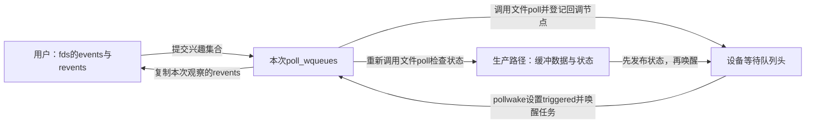
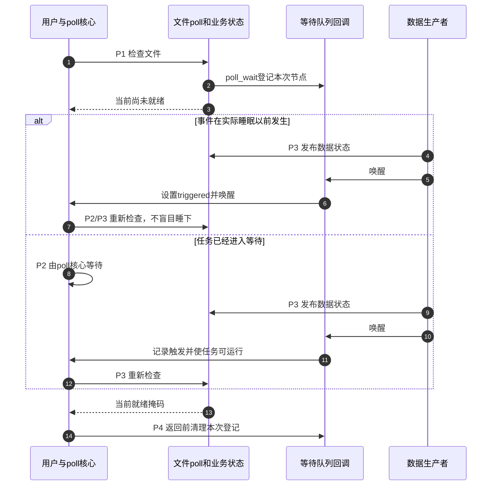

# 第1章\_poll登记与就绪复查

## 1.1\_从等待一个输入到等待多个输入

设一个程序同时处理串口命令和管道消息。若先阻塞读取串口，管道即使已有数据也不能让这次read自动改读管道；若把两个描述符都设成非阻塞并反复read，未就绪时会不断返回EAGAIN。前一种方法把等待绑在一个对象上，后一种用反复系统调用换取及时检查，空闲时也可能消耗CPU。

poll提供的是I/O多路复用（I/O Multiplexing）：一次提交多个文件描述符的兴趣集合，内核检查它们当前是否就绪，必要时等待某些状态变化。文件描述符fd是进程访问已打开文件的整数句柄；就绪意味着某类操作当前具备可进行的条件，不是内核已经替用户传输了数据。

这里不把poll、epoll和io_uring排成三代同一接口。poll和epoll主要报告就绪，io_uring还涉及提交操作与完成通知；epoll怎样减少重复注册和全表扫描，留给后面的章节。先把一次poll的正确性闭合，才能讨论它在什么负载下需要替代。

## 1.2\_登记兴趣并不等于睡眠

用户给出pollfd数组，每项events描述关心什么，返回的revents描述内核这次观察到什么。POLLIN是可读事件位，POLLOUT是可写事件位；它们描述操作条件，不是字节数量。poll返回正数时应逐项检查revents；返回0表示这次等待超时；返回负数是错误，需要查看errno，例如被信号打断时可能是EINTR。timeout为0只查询而不等待，负值表示不设置此超时限。

内核仍会遍历数组和检查文件状态，并不是从此“完全不轮询”。它避免的是用户在没有事件时不停重入内核；等待期间可由文件对象的等待队列通知状态变化，再重新检查。超时、信号和检查错误也是退出原因，硬件中断不是唯一来源。



共享的业务状态是设备缓冲是否非空、是否可写或已经关闭；等待队列只保存通知节点，不替代这些状态。poll_wqueues属于本次调用，poll_table提供登记回调和兴趣掩码。设备可以服务多个打开者，每个调用各有自己的登记节点；共享同一设备等待队列本身不是错误。

## 1.3\_从登记到重新检查的完整周期

先明确四组正交状态：设备业务状态、等待节点是否登记、任务是否可运行，以及此次调用是否已被触发。它们并不共享一个完成位。下面用P0～P4贯穿一次等待：

| 阶段 | 状态与负责者 | 继续条件 |
| --- | --- | --- |
| P0开始 | 内核准备本次poll_wqueues和poll_table | 遍历用户描述符 |
| P1登记并检查 | 文件poll先用poll_wait登记，再检查业务状态 | 已就绪立即汇总，否则可能等待 |
| P2等待 | poll核心管理任务状态与超时，结合triggered决定是否实际睡眠 | 事件、超时、信号等使检查继续 |
| P3发布与通知 | 驱动在锁等协议下发布数据，再唤醒队列；poll回调记录triggered | 被唤醒的任务重新检查，不直接认定可读 |
| P4返回与清理 | 核心返回状态或其他结果，移除本次等待节点并释放所持文件引用 | 用户按revents执行后续I/O |

poll_wait名字容易误导：它本身不把任务睡眠。固定Linux 6.12.20实现先检查poll_table和登记函数是否存在，再调用登记入口；无登记回调时，这次调用不会新增节点。驱动仍需返回当前就绪掩码，不能把“没有登记”理解成“不必检查”。

普通poll的登记路径在fs/select.c中保存file引用、等待队列地址、兴趣掩码和pollwake回调。通知到来后，pollwake可按事件键筛选，随后设置本次调用的triggered并尝试唤醒任务。文件的.poll回调与等待队列里的唤醒回调承担不同任务：前者回答现在是否就绪，后者告诉核心值得再查。



先登记再检查防止“检查为空之后、登记之前发生唯一一次事件”的漏通知窗口；核心还要处理“登记以后但睡眠以前”的窗口。不能只靠改变两行顺序就省略状态可见性和核心等待协议。跨版本稳定的等待思路见[等待与完成量专题](../../synchronization_and_asynchrony/synchronization/waiting_notification/大纲.md)，本次只读证据见[poll与epoll源码阅读索引](../../../../research/source_reading/io_polling/navigation/P01_poll与epoll源码阅读索引.md#1.2_按阶段阅读)。

## 1.4\_驱动和用户各自负责什么

驱动应在设备对象或每次打开的私有对象构造时初始化对应等待队列，且在对象可被其他路径使用前完成。若等待队列放在共享设备对象中，不能每次open都重新初始化，否则已有登记节点可能被破坏。每设备共享队列和每打开私有队列均可成立，关键是对象寿命与事件状态归属一致。

驱动.poll通常先poll_wait，再在与读写/生产路径一致的同步协议下检查缓冲状态，返回可读、可写和异常掩码。它不应在.poll内部自己阻塞等待数据，也不能只因收到一次唤醒就返回POLLIN。状态更新与唤醒之间须遵守可见性和锁协议；等待队列的锁不自动保护驱动的整个数据缓冲。

用户态应检查POLLERR（错误）、POLLHUP（挂断）、POLLNVAL（无效描述符）等返回事件，不要只看POLLIN。关闭或异常时的具体可读行为由文件对象决定；例如管道关闭写端以后仍可能有残留数据，不能看到挂断就无条件丢弃尚可读内容。就绪通知也不替用户保留数据，另一个读者可以先取走它。

## 1.5\_接口的职责边界

| 接口或对象 | 作用 | 不保证 |
| --- | --- | --- |
| poll | 检查描述符集合，必要时等待 | 代替read/write传输数据 |
| 文件.poll | 返回当前就绪状态并配合登记 | 必须睡眠或永远都会被提供 |
| poll_wait | 通过当前登记函数连接等待队列 | 调用点立即睡眠或获得数据资格 |
| wake_up_interruptible | 通知匹配的等待者重新推进 | 每个等待者返回时都有可读数据 |
| wait_queue_head_t | 保存与某个状态来源相关的等待节点 | 规定一队列只能对应一个事件或一个进程 |

固定vfs_poll在文件没有.poll方法时有默认掩码回退，所以“所有文件都必须实现.poll”并不准确；需要报告动态设备状态的驱动不能靠这份默认状态正确表达自己的缓冲协议。epoll是否接受某文件还有自身检查，不从这条回退直接推出结论。

## 1.6\_唤醒以后为何还会读不到

设缓冲里只有一个字节，两个读者都曾收到可读观察。A先读走字节，B随后read时发现空，这是合法竞争，不必然说明驱动把状态更新放在唤醒之后。通知是一次观察，不是给B预留一份数据。

多读者事件循环通常结合非阻塞I/O：read返回EAGAIN（暂时无数据可读）时重新等待；被信号打断、读到EOF（End of File，文件结束，此处read返回0）或遇到真实错误则分别处理。只用阻塞read会让“曾观察到就绪”的线程在状态被其他读者改变后再次阻塞。若协议要求单一消费者，应从对象设计上约束它，而不是假设poll会分配数据。

## 1.7\_用完整C模型观察就绪失效

下面是顺序模型，不调用Linux poll，也不制造C数据竞争。它让两个读者依次观察同一状态，再分别尝试消费，重现“两个可读观察只对应一份数据”。false只模拟暂时无数据，不是完整read错误协议。

```c
#include <assert.h>
#include <stdbool.h>
#include <stdio.h>

struct buffer_model { unsigned int bytes; };

static bool readable(const struct buffer_model *b)
{
    return b->bytes != 0; /* 就绪检查只观察，不预留。 */
}

static bool try_read(struct buffer_model *b)
{
    if (b->bytes == 0)
        return false;
    --b->bytes;
    return true;
}

int main(void)
{
    struct buffer_model b = {1};
    bool a_ready = readable(&b);
    bool b_ready = readable(&b);
    assert(a_ready && b_ready);
    assert(try_read(&b));   /* A先消费唯一字节。 */
    assert(!try_read(&b));  /* B的旧观察没有为它保留数据。 */
    assert(!readable(&b));
    puts("two readiness observations; one successful read");
    return 0;
}
```

保存为readiness_model.c，以`cc -std=c11 -Wall -Wextra -Werror -O2 readiness_model.c -o readiness_model`编译运行。先预测把初始字节数改为2会改变哪条断言，再修改模型；若希望两次成功，必须同时修改消费后的预期，不能把原程序的断言失败误读成poll错误。

回到驱动，验证应分别覆盖登记前已有数据、登记与睡眠间到达、睡眠后到达、多读者争抢、信号、超时和对象关闭。这些是不同路径，模型只解释其中一个竞争反例，不能代替内核或设备测试。

### 1.7.1\_用两个Linux管道观察revents

再把“等待两个输入”接到真正的poll接口。下面建立两根管道，只往右边写一个字节；左边保持打开但没有数据。数组顺序不决定就绪顺序：返回1表示有一项revents非零，不能据此假设数组第0项可读。

pipe2的O_NONBLOCK使两个端点都采用非阻塞方式，O_CLOEXEC使成功exec时关闭它们。此程序不创建并发生产者，timeout为0，所以只验证已有状态的查询，不能验证睡眠与唤醒窗口。它最后关闭左管道的唯一写端，观察POLLHUP以及空管道read返回0的关系。

```c
#define _GNU_SOURCE
#include <poll.h>
#include <unistd.h>
#include <fcntl.h>
#include <errno.h>
#include <stdbool.h>
#include <stdio.h>
#include <stdlib.h>

static void need(bool ok, const char *step)
{
    if (!ok) {
        fprintf(stderr, "unexpected result: %s\n", step);
        exit(EXIT_FAILURE); /* 本实验退出时由进程回收描述符。 */
    }
}

static int query(struct pollfd *fds)
{
    int n;
    do {
        n = poll(fds, 2, 0);
    } while (n < 0 && errno == EINTR);
    if (n < 0) {
        perror("poll");
        exit(EXIT_FAILURE);
    }
    return n;
}

int main(void)
{
    int left[2], right[2];
    if (pipe2(left, O_NONBLOCK | O_CLOEXEC) < 0 ||
        pipe2(right, O_NONBLOCK | O_CLOEXEC) < 0) {
        perror("pipe2");
        return EXIT_FAILURE;
    }
    struct pollfd fds[2] = {
        {.fd = left[0], .events = POLLIN},
        {.fd = right[0], .events = POLLIN}
    };
    need(write(right[1], "R", 1) == 1, "write right");
    need(query(fds) == 1, "one ready entry");
    need(fds[0].revents == 0 && (fds[1].revents & POLLIN),
         "only right is readable");
    char byte;
    need(read(right[0], &byte, 1) == 1 && byte == 'R', "read right");
    need(query(fds) == 0, "both empty with writers alive");

    need(close(left[1]) == 0, "close left writer");
    need(query(fds) == 1 && (fds[0].revents & POLLHUP), "left hangup");
    need(read(left[0], &byte, 1) == 0, "empty pipe at EOF");
    need(close(left[0]) == 0, "close left reader");
    need(close(right[0]) == 0, "close right reader");
    need(close(right[1]) == 0, "close right writer");
    puts("right readable; both empty; left hangup and EOF");
    return 0;
}
```

保存为poll_pipes.c，在Linux中用`cc -std=c11 -Wall -Wextra -Werror -O2 poll_pipes.c -o poll_pipes`编译，再运行`./poll_pipes`。预期输出为`right readable; both empty; left hangup and EOF`。当前未在Linux实际运行，不能把预期当成已取得的日志。

试着在关闭左写端前写入L：此时POLLHUP可以与POLLIN同时出现，read应先拿到L，后续才读到0。原来的“立即EOF”断言便需要改动。这说明挂断是端点状态变化，不是命令应用丢弃缓冲；下一章沿同一管道继续区分“还留着数据”和“是否再次交付通知”。

## 1.8\_现在能证明什么

一次正确poll把“登记谁”“业务状态是什么”“谁负责睡眠”“何时重新检查”连接起来。它允许没有事件时不忙等，但每次调用仍处理传入集合。共享队列不是天然错误，唤醒不是数据预留，用户和驱动都必须依据当前状态行动。

当兴趣集合长期不变而大部分描述符空闲时，重复传入和检查整张集合可能成为成本。下一章从这项具体负载进入epoll的持久登记和就绪集合；不能把它简化成“poll主动问、epoll永远O(1)”。

下一篇：[epoll持久登记与交付](P02_epoll持久登记与交付.md)。返回[阅读大纲](大纲.md)。
