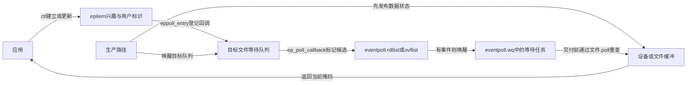
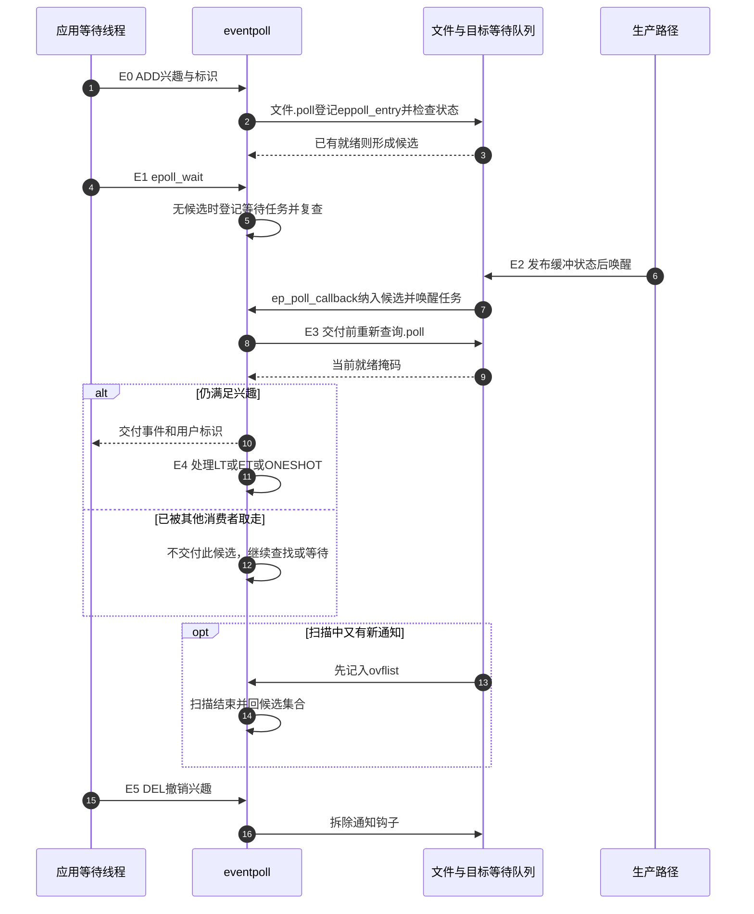

# 第2章\_epoll持久登记与交付

## 2.1\_把不变的兴趣集合留下来

上一章的串口与管道只有两个描述符，重新检查两项并不难。现在让同一事件循环维持许多长连接：连接长期存在，每轮只有少数收到消息。poll每次仍接收数组，逐项检查，还要为本次等待建立和清理登记。连接大部分空闲时，重复处理不变的集合才是这里要解决的问题；不能把poll误写成始终消耗CPU的忙等。

epoll把两件事分开：通过epoll_ctl维护长期的兴趣集合，通过epoll_wait取得本轮可交付的事件。于是变化发生时，可以把相关对象标成候选，下次优先检查候选，而不必从头扫描全部注册对象。换来的代价是内核要保存登记节点，维护回调、候选集合、并发扫描和撤销关系；频繁增删的短连接未必能摊薄这些成本。

先记住两套集合。**兴趣集合** 回答“以后还关心谁”，**就绪候选集合** 回答“谁值得现在再检查”。候选不是已替用户完成的read，也不是不可失效的可读证明。一个对象可以一直在兴趣集合中，却暂时不在候选集合中。

## 2.2\_三个接口分开管理与等待

先把控制操作的名称对应到动作：ADD增加登记，MOD修改已有登记，DEL删除登记。它们分别作为EPOLL_CTL_ADD、EPOLL_CTL_MOD、EPOLL_CTL_DEL参数传给epoll_ctl；epoll_create1先建立承载登记的实例。EPOLL_CLOEXEC中的close-on-exec表示成功执行exec时关闭描述符，避免把无意继承的实例带进新程序。

| 用户接口 | 改变什么 | 应检查什么 |
| --- | --- | --- |
| epoll_create1(EPOLL_CLOEXEC) | 建立epoll实例，返回描述符 | 失败返回-1；CLOEXEC使成功exec时关闭此描述符，不阻止fork继承 |
| epoll_ctl的ADD | 为目标fd增加兴趣、用户数据和回调关系 | 重复同一登记会失败，不能靠重复ADD更新 |
| epoll_ctl的MOD | 更新兴趣与用户数据 | 它会重新查询当前就绪状态，不只是改一份用户侧掩码 |
| epoll_ctl的DEL | 撤销这个登记 | 撤销不等于其他线程已停止使用用户对象 |
| epoll_wait | 向用户数组交付至多maxevents项 | 正数是返回项数，0是超时，-1应检查errno |
| close | 放弃描述符的引用 | 有dup或fork引用时，不等于底层打开文件立即消失 |

struct epoll_event中的events是关注或返回的事件位，data是应用选择的标识，内核会在交付时带回。最小程序可用data.fd；复杂服务器常用连接对象标识，但若使用data.ptr，必须保证指针所指对象在所有使用者退出前仍有效。内核不会替应用延长这块用户内存的寿命。

epoll_wait的timeout以毫秒指定等待上限，0用于立即查询，-1允许无限等待。被信号打断可能返回EINTR；真实程序是否重试取决于退出策略，有绝对截止时间时要重算剩余时间，不能每次重试都重新等待完整时长。下面实验使用0，不以睡眠时间猜测结果。

## 2.3\_先把状态放到具体对象里

以下字段位置对应Linux 6.12.20固定厂商提交，只用它说明实现落点，不把字段名当成跨版本接口：

| 状态 | 保存位置 | 谁写、谁读 |
| --- | --- | --- |
| 设备是否有数据 | 具体管道、socket或驱动缓冲对象 | 生产/消费路径更新；文件.poll读取 |
| 持久兴趣 | eventpoll.rbr组织的epitem，含ffd和event | ctl增加、更新、删除；回调与交付路径读取 |
| 已登记的通知钩子 | eppoll_entry.wait挂在目标等待队列；epi.pwqlist收集这些节点 | 登记路径创建，目标唤醒路径调用，撤销路径拆除 |
| 候选成员资格 | epi.rdllink与eventpoll.rdllist | 回调、初次查询与交付路径协作维护 |
| 扫描期间的新通知 | eventpoll.ovflist和epi.next | 回调暂存，扫描结束合并 |
| 等待交付的任务 | eventpoll.wq | epoll_wait路径登记任务，回调/合并路径唤醒 |

这不是一个从“未就绪”单向走向“就绪”的状态机，而是兴趣、业务数据、候选成员资格和等待任务状态的组合。下面角色图中的两个等待队列不可混成一个：目标队列连接状态生产者与epoll，eventpoll.wq连接epoll与正在等待的任务。



poll与epoll都借助驱动的.poll和poll_wait。区别在于传入的登记回调：普通poll建立本次系统调用的临时等待项；epoll在ADD期间用ep_ptable_queue_proc建立持久eppoll_entry，回调函数为ep_poll_callback。ep_pqueue只是登记过程的包装，不是一个永久的“每fd队列”；永久关系由epitem和eppoll_entry保存。

## 2.4\_从登记到再次等待的一轮过程

下面先给两种交付方式一个工作定义：LT（Level Triggered，水平触发）会把已交付项留给后续复查；ET（Edge Triggered，边沿触发）不因这次交付自动重排。另有ONESHOT（一次性交付后禁用）选项，要求应用显式重新启用。先看它们在周期的哪个位置起作用，再用两字节实验推导使用责任。

| 阶段 | 进入条件与状态改变 | 下一步由谁观察 |
| --- | --- | --- |
| E0 登记 | ADD分配epitem并进入兴趣集合；查询文件.poll，同时连接目标等待队列 | 回调能找到epitem；若此时已就绪，可直接加入候选 |
| E1 等待 | 当前无可交付事件时，等待路径在eventpoll.wq登记任务并在锁内复查候选 | 回调看到等待者时可唤醒；不是检查空以后直接裸睡眠 |
| E2 提名 | 生产者改变业务状态并唤醒；ep_poll_callback按兴趣过滤，将epitem纳入候选 | 等待/扫描路径从候选集合取得对象 |
| E3 复查与交付 | ep_send_events通过ep_item_poll重查文件.poll；只有匹配的当前事件才交付 | 应用拿到观察结果；数据仍未被保留或消费 |
| E4 模式处理 | LT重新纳入后续检查，ET不因本次交付自动重新排入；ONESHOT禁用普通事件 | 下一次等待、目标新通知或MOD继续推进 |
| E5 撤销 | DEL或文件最终清理拆除登记与回调联系 | 应用仍须处理已取回的事件和自己的对象寿命 |

为什么E0除了登记还要立即查询？因为数据可能在ADD之前已经存在；只等未来的一次唤醒，就会忽略已有条件。为什么E3还要查询？因为候选入列之后，另一个读者可能已经取走数据。E0和E3分别堵住“只看未来”和“只信过去”这两个漏洞。



并发扫描还有第三个漏洞：交付过程可能访问用户内存，不能始终持有候选集合的自旋锁。如果直接清空候选然后复制结果，期间到来的通知可能无处保存。固定实现把待扫描项移到临时txlist，并让这段时间的回调进入ovflist；ep_done_scan再合并它们与未处理项。这个分流发生在E3期间，并不意味着另一份独立事件历史。候选可以合并重复通知，epoll从来不是“一次设备中断对应一个返回项”的计数器。

## 2.5\_LT与ET改变的是后续检查责任

LT即水平触发，是默认模式；ET即边沿触发，用EPOLLET选择。名称可以帮助记忆，但这里不是GPIO电平采样或硬件边沿检测。先用同一管道、同一读者比较：写端写入AB，读端收到可读事件后只读A，此后没有任何新写入，也没有关闭。

| 时刻 | 管道数据 | LT | ET |
| --- | --- | --- | --- |
| 写入AB后首次等待 | AB | 可以返回可读 | 可以返回可读 |
| 应用只读A | B | 仍有可读条件 | 同样仍有可读条件 |
| 再次等待且没有新通知 | B | 保留的候选复查后仍可返回 | 不保证因残留B再返回；本例会返回0 |
| 应用自行读B并读到EAGAIN | 空 | 已无普通可读数据 | 已把本轮可读工作处理完 |
| 写端后来写C | C | 新状态可被观察 | 新通知可再次形成候选 |

ET下错误不是“B不存在”，而是应用把本应继续推进的读取工作丢了，却又睡下去等别人提醒。常用约束是把fd设为O_NONBLOCK，收到通知后读取到EAGAIN或EWOULDBLOCK；这样既不漏掉残留数据，也不会在读空时阻塞整个事件循环。EOF和真实错误应结束或转移该连接，而不是作为“暂时没数据”重试。

如果一个热连接一直产出数据，毫无限额地读到空又可能饿死其他连接。可设每轮字节/操作预算，但ET下耗尽预算时要把该连接留在应用的待处理队列，之后继续消费，不能把它视为已经等待新事件。去掉内核的重复交付，不会自动去掉应用的调度责任。

EPOLLONESHOT与LT/ET是不同维度：一次交付后暂时禁用普通事件，处理完成由MOD重新启用。它适合把一轮连接处理交给一个工作者，但不是对连接对象的万能互斥锁；其他fd别名、已交付事件和不遵守协议的线程仍然需要生命周期与同步设计。重新启用前，应先建立下一轮处理者可以安全接手的用户状态。

## 2.6\_完整Linux实验\_留下一个字节

下面程序只依赖Linux的管道和epoll，不创建服务器，也不需要外部输入。每次创建一根新的非阻塞管道，分别用LT、ET运行相同步骤。它保留写端直到实验结束，排除EOF/HUP；无其他线程读写，排除竞争。这样第二次等待的差别只来自交付模式。need用于验证预期，系统调用失败时另行报告errno并以EXIT_FAILURE退出；本实验没有安装信号处理程序。

pipe2的O_NONBLOCK标志使读空时返回暂不可读错误；O_CLOEXEC与前面的close-on-exec用途相同。EPOLLIN是epoll的可读事件位，EPOLLET是选择边沿触发的附加位。struct epoll_event先清零，再分别设置兴趣与用户标识，避免把未初始化字段带进内核。

```c
#define _GNU_SOURCE
#include <sys/epoll.h>
#include <unistd.h>
#include <fcntl.h>
#include <errno.h>
#include <stdbool.h>
#include <stdio.h>
#include <stdlib.h>

static void need(bool ok, const char *step)
{
    if (!ok) {
        fprintf(stderr, "unexpected result: %s\n", step);
        exit(EXIT_FAILURE); /* 进程退出回收本实验的描述符。 */
    }
}

static void failed(const char *step)
{
    perror(step);
    exit(EXIT_FAILURE);
}

static int wait_now(int epfd, struct epoll_event *event)
{
    int n;
    do {
        n = epoll_wait(epfd, event, 1, 0);
    } while (n < 0 && errno == EINTR);
    if (n < 0)
        failed("epoll_wait");
    return n;
}

static void run_case(bool edge)
{
    int pipe_fd[2];
    if (pipe2(pipe_fd, O_NONBLOCK | O_CLOEXEC) < 0)
        failed("pipe2");
    int epfd = epoll_create1(EPOLL_CLOEXEC);
    if (epfd < 0)
        failed("epoll_create1");
    struct epoll_event interest = {0}, event = {0};
    interest.events = EPOLLIN | (edge ? EPOLLET : 0);
    interest.data.fd = pipe_fd[0];
    if (epoll_ctl(epfd, EPOLL_CTL_ADD, pipe_fd[0], &interest) < 0)
        failed("epoll_ctl ADD");

    ssize_t n = write(pipe_fd[1], "AB", 2);
    if (n < 0)
        failed("write AB");
    need(n == 2, "write two bytes");
    need(wait_now(epfd, &event) == 1, "first notification");
    need((event.events & EPOLLIN) != 0, "readable event");
    char byte;
    n = read(pipe_fd[0], &byte, 1);
    if (n < 0)
        failed("read A");
    need(n == 1 && byte == 'A', "consume only A");

    int second = wait_now(epfd, &event);
    need(second == (edge ? 0 : 1), "second notification");
    /* 即使ET没有再次通知，B仍然可以读取。 */
    n = read(pipe_fd[0], &byte, 1);
    if (n < 0)
        failed("read B");
    need(n == 1 && byte == 'B', "remaining byte");
    n = read(pipe_fd[0], &byte, 1);
    need(n == -1 && (errno == EAGAIN || errno == EWOULDBLOCK),
         "drained without blocking");
    printf("%s: second_wait=%d; remaining=B; drained=EAGAIN\n",
           edge ? "ET" : "LT", second);

    if (epoll_ctl(epfd, EPOLL_CTL_DEL, pipe_fd[0], NULL) < 0)
        failed("epoll_ctl DEL");
    if (close(pipe_fd[0]) < 0 || close(pipe_fd[1]) < 0 || close(epfd) < 0)
        failed("close");
}

int main(void)
{
    run_case(false);
    run_case(true);
    return 0;
}
```

保存为epoll_pipe.c，在Linux中执行：

```bash
cc -std=c11 -Wall -Wextra -Werror -O2 epoll_pipe.c -o epoll_pipe
./epoll_pipe
```

预期输出为：

```text
LT: second_wait=1; remaining=B; drained=EAGAIN
ET: second_wait=0; remaining=B; drained=EAGAIN
```

先预测，再运行。然后把首次read改成一次读完AB，同时调整缓冲和相应预期：第二次等待应如何变化？LT会重查并发现已空，ET也没有新事件。最后尝试在第二次等待之前再写一个字节；不要再坚持“ET绝对只通知一次”。这些修改分别检验残留状态和新通知，不能把实验的无并发前提推广到共享socket。

本轮只对源码路径与实验逻辑进行了核对，当前Windows环境未执行这段Linux程序；上述文本是预期结果，不是实测日志。上一章的C顺序模型可以在宿主机验证，不能拿它冒充epoll系统调用实测。

## 2.7\_把实验扩展为服务器时还缺什么

多socket服务器还要处理监听socket的accept循环、每条连接的输入协议和输出积压。监听socket也应非阻塞，在可接受事件后持续accept到EAGAIN；新连接用accept4的SOCK_NONBLOCK等标志，或显式设置自身属性，不能假设它继承监听fd的O_NONBLOCK。每个系统调用的EINTR、资源不足和连接错误都有不同处置，不能把所有负数都理解为“已处理完”。

read得到n个字节，并不保证一次write能写回n个字节。发送缓冲可能只能接收一部分；应用要保存未发送区间和偏移，稍后继续。没有待发送内容时通常不要一直关注EPOLLOUT，否则LT可能反复报告“可以写”而应用无事可做；出现积压再加入写兴趣，全部发完再撤销。这里的背压是接收、处理和发送速率不一致时的容量约束，epoll没有替应用生成无限缓冲。

EPOLLERR与EPOLLHUP需要处理；socket半关闭可按协议关注EPOLLRDHUP。挂断不必然表示缓冲已空，不能不检查残留输入便释放连接。对端关闭、读到0、错误与可读事件可能在同一轮交织，处理顺序应由连接状态机决定。原来那种“read一次后write一次”的回显骨架不足以证明服务器正确。

fd只是表项编号，底层打开文件描述可能由dup和fork共享。epoll登记区分fd与底层文件的组合；关闭一个fd后若还有别名引用，登记可能继续存在。需要确定撤销时机时，在原登记fd仍有效时显式DEL；不要等整数已被复用后把新对象当成旧连接。关闭epoll描述符本身也遵守引用寿命，fork不是“不支持epoll”。复杂事件循环还应防止当前用户事件数组里尚未处理的旧标识访问已释放对象。

## 2.8\_回顾与推理练习

现在可以解释epoll少做了什么：长期保留兴趣与通知联系，以候选集合缩小反复检查范围。也可以解释它仍在做什么：管理节点、接收回调、合并通知、重查当前状态和复制结果。它没有替应用消费数据，也没有把所有事件循环变成恒定成本。

1. ADD时管道已有数据，但以后不再写入。为什么不能只安装回调而不查询？因为旧状态可能没有未来通知；E0查询使已有条件进入候选。
2. E2后另一读者取光数据。E3应返回一次“历史可读”还是跳过？应按当前.poll结果判断；候选只缩小搜索范围。
3. ET处理预算耗尽但尚未EAGAIN，能否无限等待下一次epoll通知？不能；应用仍拥有未完成工作，应保存并继续调度。
4. ONESHOT交付后直接等待，为什么可能再无事件？普通兴趣已被禁用，需要在用户状态准备好之后MOD重新启用。

下一章把这些职责放进同一成本模型，讨论什么时候值得采用epoll，以及怎样比较而不被“O(1)”口号误导。

上一篇：[poll登记与就绪复查](P01_poll登记与就绪复查.md)。下一篇：[从负载选择poll与epoll](P03_poll与epoll的选择.md)。返回[阅读大纲](大纲.md)。
