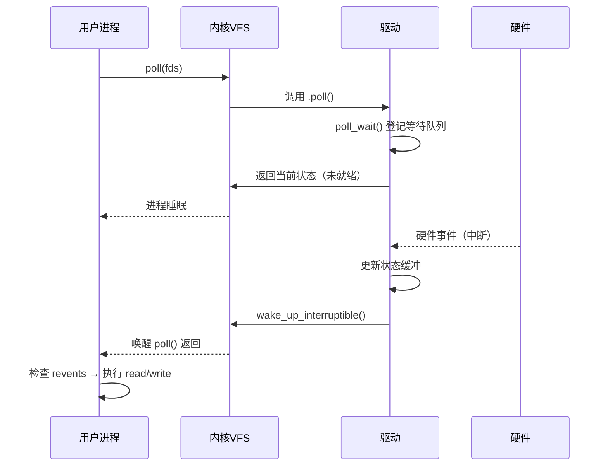
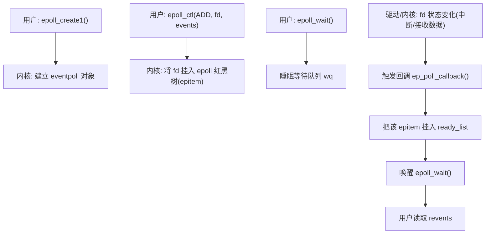
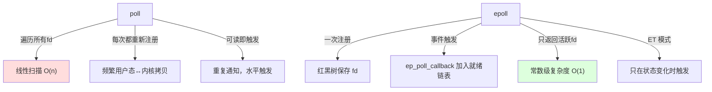

# 第1章_poll_机制_从用户等待到驱动唤醒的完整链路

------

## 1.1_是什么_(历史渊源_发展进程_定位)

### 1.1.1_起源

在 UNIX 早期（20 世纪 80 年代），操作系统的输入输出模型是**同步阻塞式**的。
 也就是说，一个 `read()` 调用如果硬件还没准备好数据，进程就会被挂起。
 这没什么问题，但当一个进程要同时监听多个输入（例如键盘、串口、网络套接字）时，问题出现了：
 系统没有提供“同时等待多个文件描述符就绪”的机制。

最早的解决方案是：

- 在循环中轮询多个文件描述符；
- 每个都调用一次 `read()` 试探是否能读；
- 这叫 **忙轮询（busy waiting）**。

它的代价是巨大的：
 CPU 反复执行无意义的系统调用，功耗高、延迟大、浪费资源。

于是，UNIX System V 引入了 **`poll()`** 接口（POSIX 标准后来吸收），用以：

> 让进程可以高效地等待“若干个文件描述符的事件”发生。

在 Linux 2.x 之后，这套机制逐步扩展到支持 **`select()` → `poll()` → `epoll()`** 三代接口，形成了今日的异步事件通知体系。

------

### 1.1.2_定位

`poll` 是一个**事件就绪通知机制**，属于 **I/O 多路复用（I/O Multiplexing）** 技术。
 它位于 **用户进程与内核 VFS 层之间**，统一协调所有文件对象（socket、pipe、字符设备、终端、驱动文件等）的“就绪状态”。

> 换句话说：
>  `poll()` 并不传输数据，而是一个“高效的等待器”。

------

## 1.2_干什么_(要解决的问题)

`poll()` 要解决的核心问题是：

> 进程如何**高效地等待多个 I/O 事件**，而不是傻等或忙轮询。

------

### 1.2.1_典型痛点

| 旧方法        | 问题                               |
| ------------- | ---------------------------------- |
| 轮询 `read()` | 不断陷入内核检查，浪费 CPU         |
| 阻塞 `read()` | 阻塞在一个 fd 上，无法关注其他输入 |
| 多线程等待    | 线程多、上下文切换频繁             |

------

### 1.2.2_poll_的解决思路

`poll` 的设计理念是：

- 不再轮询设备；
- 而是告诉内核“我对这些事件感兴趣”；
- 内核帮你“监听”，直到某个事件真的发生才叫醒你。

这形成了一个标准事件循环：

```
登记兴趣 → 睡眠等待 → 硬件事件 → 驱动唤醒 → poll 返回
```

这正是现代异步事件驱动模型（epoll、io_uring、libevent、libuv 等）的最初形态。

------

## 1.3_怎么实现_(底层原理与处理逻辑)

整个 `poll` 机制可以拆成三层：用户层、VFS 层、驱动层。
 它的运行流程是一条典型的“登记-等待-唤醒”链。

------

### 1.3.1_用户层_登记兴趣_+_睡眠等待

用户调用：

```c
poll(struct pollfd *fds, nfds_t nfds, int timeout);
```

- 把关心的 fd 和感兴趣事件 (`POLLIN`, `POLLOUT`, `POLLERR` 等) 交给内核；
- 如果当前就绪，立即返回；
- 否则挂入等待队列，进入睡眠。

------

### 1.3.2_内核_VFS_层_派发到各文件的.poll

内核遍历每个 fd，对应的 `struct file_operations` 中有一个 `.poll` 函数：

```c
__poll_t (*poll)(struct file *filp, poll_table *wait);
```

VFS 做两件事：

1. 传入 `poll_table`（内核临时登记表），驱动可以把等待队列挂上去；
2. 收集每个文件当前的状态掩码（是否就绪）。

最终返回的事件掩码会汇总到 `fds[i].revents` 中返回给用户。

------

### 1.3.3_驱动层_等待队列与唤醒机制

驱动侧承担两项责任：

#### (1)_登记等待者

当 `.poll` 被调用时，驱动执行：

> “如果你对我的事件感兴趣，就到我的等待队列里去等着。”

实现上调用 `poll_wait(filp, &my_wq, wait)`
 把这个进程登记到等待队列头 `my_wq`。

#### (2)_状态检查与返回

驱动立即检查当前硬件状态（缓冲区是否非空？可写？出错？），返回对应掩码。

- 若状态已就绪，用户态不需睡眠；
- 若状态未就绪，用户被挂在等待队列里。

#### (3)_唤醒

当设备状态改变（例如中断到达、数据到缓冲区），驱动执行：

```c
wake_up_interruptible(&my_wq);
```

此时，所有在该队列中睡眠的 poll 调用会被唤醒，重新检测状态，发现“已就绪”，从睡眠中返回。

------

### 1.3.4_可视化流程(事件链)



------

## 1.4_怎么用_(开发与应用方法)

### 1.4.1_用户层使用方法

1. 准备 `pollfd` 数组，写入要监听的 fd；
2. 设置 `.events` 位；
3. 调用 `poll()` 等待；
4. 返回后检查 `.revents` 决定哪个 fd 就绪；
5. 调用对应的 `read/write`。

------

### 1.4.2_驱动层实现步骤

1. 在 `open()` 初始化等待队列；
2. `.poll()` 内部调用 `poll_wait()`；
3. 检查缓冲区状态；
4. 返回事件掩码；
5. 在中断或数据到来时 `wake_up_interruptible()`。

------

## 1.5_通用接口/工具方法表与详解

| 层级   | 函数/接口                 | 作用             | 注意点           |
| ------ | ------------------------- | ---------------- | ---------------- |
| 用户态 | `poll()`                  | 等待事件发生     | timeout单位ms    |
| 用户态 | `epoll_*()`               | 扩展版（高性能） | 支持边沿触发     |
| 驱动   | `.poll()`                 | 驱动的事件回调   | 必须实现         |
| 驱动   | `poll_wait()`             | 登记等待者       | 必须先登记再判断 |
| 驱动   | `wake_up_interruptible()` | 唤醒等待者       | 状态更新后调用   |
| 驱动   | `wait_queue_head_t`       | 等待队列头       | 每种事件一个     |

------

## 1.6_对比_/_避坑_/_限制_/_注意点

| 问题点               | 原因                 | 解决方案                       |
| -------------------- | -------------------- | ------------------------------ |
| 唤醒后仍无数据       | 状态更新晚于 wake_up | 先更新状态，再唤醒             |
| poll 未返回          | 忘记 poll_wait       | `.poll()` 内必须调用 poll_wait |
| 多进程错乱           | 同用一个 waitqueue   | 每设备独立队列或加锁           |
| epoll 边沿触发丢事件 | 未持续读到 EAGAIN    | 必须一次性读空缓冲区           |
| 忘记 POLLERR/POLLHUP | 异常不被感知         | `.poll()` 应完整返回状态       |

------

## 1.7_完整示例与讲解(简化版)

### 1.7.1_驱动侧核心逻辑(简略)

```c
static __poll_t my_poll(struct file *filp, poll_table *wait)
{
    struct my_dev *dev = filp->private_data;
    __poll_t mask = 0;

    poll_wait(filp, &dev->r_wait, wait);
    if (!buffer_empty(dev))
        mask |= POLLIN | POLLRDNORM;
    if (buffer_space(dev))
        mask |= POLLOUT | POLLWRNORM;
    return mask;
}
```

### 1.7.2_中断或数据到达路径

```c
irq_handler() {
    fill_buffer();
    wake_up_interruptible(&dev->r_wait);
}
```

### 1.7.3_用户侧示例

```c
struct pollfd fds[1];
fds[0].fd = fd;
fds[0].events = POLLIN;
int ret = poll(fds, 1, 1000);
if (ret > 0 && (fds[0].revents & POLLIN))
    read(fd, buf, sizeof(buf));
```

------

## 1.8_总结

| 维度       | 核心要点                                |
| ---------- | --------------------------------------- |
| 设计目标   | 从“忙轮询”到“事件驱动”                  |
| 工作机制   | 等待队列 + 唤醒机制                     |
| 用户态作用 | 等待就绪事件                            |
| 驱动态作用 | 提供状态 + 负责唤醒                     |
| 最关键顺序 | 先登记 → 再判断 → 状态变化时唤醒        |
| 扩展方向   | epoll（高并发）、io_uring（零拷贝异步） |

------

# 第2章_epoll_机制_高并发事件的高效调度模型

------

## 2.1_章节内容说明

本章作为对上一章 **poll 机制** 的扩展与升级讲解，将从其历史演进开始，解释 **epoll** 为什么诞生、它在内核中的核心设计（事件驱动 + 红黑树管理 + 就绪队列）、以及如何在高并发场景下取代传统 poll/select。
 本章同时覆盖 **水平触发（Level Triggered）** 与 **边沿触发（Edge Triggered）** 模式的区别与实现细节。

------

## 2.2_是什么_(历史渊源_发展进程_定位)

### 2.2.1_从_select_to_poll_to_epoll_的演进

| 时代          | 技术       | 特征                     | 瓶颈                   |
| ------------- | ---------- | ------------------------ | ---------------------- |
| UNIX 早期     | `select()` | fd 集合上限（默认 1024） | 每次拷贝 fd 集合，O(n) |
| System V 时代 | `poll()`   | 解除上限，使用链表       | 每次遍历所有 fd，O(n)  |
| Linux 2.5+    | `epoll()`  | 基于事件注册机制         | O(1) 可扩展到百万连接  |

### 2.2.2_epoll_的定位

`epoll` 是 Linux 特有的 **事件通知机制**，属于第三代 I/O 多路复用技术。
 其核心设计目标是：

> 在高并发场景（成百上千 socket）下，实现 **常数级别** 的事件监听性能。

与 poll 不同，`epoll` 不再每次传入整张 fd 列表，而是将“感兴趣事件”注册进内核，并通过就绪事件队列返回结果。

------

## 2.3_干什么_(要解决的问题)

### 2.3.1_poll_的问题

虽然 `poll` 已经摆脱了 fd 上限，但仍存在两大问题：

1. **线性遍历**
    每次调用 `poll()`，内核都要重新检查所有 fd 的状态。
    当 fd 数量非常多（比如 10 万个 TCP 连接）时，成本为 O(n)。
2. **重复拷贝与重新注册**
    每次都要从用户态传入完整的 fd 数组，频繁触发内核态内存拷贝。

------

### 2.3.2_epoll_的设计目标

epoll 的设计哲学是：

> “事件是持续的，不必每次都重新登记。”

它的三大改进方向：

1. **一次注册，多次等待**：把 fd 注册进内核红黑树，后续仅关注事件变化。
2. **事件驱动，就绪队列**：事件触发后主动推入内核的 ready list。
3. **O(1) 可伸缩性**：避免每次全表扫描。

------

## 2.4_怎么实现_(底层原理与处理逻辑)

### 2.4.1_核心数据结构(简化视角)

| 内核结构               | 作用                                              |
| ---------------------- | ------------------------------------------------- |
| `struct eventpoll`     | epoll 实例，维护红黑树（所有关注的 fd）与就绪链表 |
| `struct epitem`        | 表示一个被关注的 fd                               |
| `struct ep_pqueue`     | 临时收集等待者                                    |
| `wait_queue_head_t wq` | 等待队列头，用于睡眠等待                          |
| `ready_list`           | 链接所有已就绪的 epitem                           |

------

### 2.4.2_三个系统调用的协作

| 调用              | 功能                         | 类比                 |
| ----------------- | ---------------------------- | -------------------- |
| `epoll_create1()` | 创建 epoll 实例              | poll 的初始化        |
| `epoll_ctl()`     | 注册 / 修改 / 删除 关注的 fd | poll_wait 的长期登记 |
| `epoll_wait()`    | 等待已就绪事件               | poll() 调用的核心    |

这三个调用合起来形成 epoll 的“**持久监听**”语义。

------

### 2.4.3_内核机制流程



------

### 2.4.4_推_而非_拉_的模型

poll 是**拉模式**（每次轮询所有 fd），
 epoll 是**推模式**（事件发生时自动推送到就绪队列）。
 因此：

- poll 是一次性任务；
- epoll 是注册式任务。

------

### 2.4.5_Level_Triggered_vs_Edge_Triggered

| 模式               | 含义                          | 行为       | 应用                 |
| ------------------ | ----------------------------- | ---------- | -------------------- |
| **LT（水平触发）** | 只要状态是“就绪”就不断返回    | 像 poll    | 安全、易写           |
| **ET（边沿触发）** | 只有状态从“未就绪→就绪”时返回 | 只触发一次 | 高性能、要求严格逻辑 |

在 ET 模式下，应用必须**循环读取直到返回 EAGAIN**，否则会丢失后续事件。

------

## 2.5_怎么用_(使用方法与步骤)

### 2.5.1_用户侧典型流程

```c
int epfd = epoll_create1(0);

// 注册事件
struct epoll_event ev;
ev.events = EPOLLIN | EPOLLET;  // 监听可读 + 边沿触发
ev.data.fd = sockfd;
epoll_ctl(epfd, EPOLL_CTL_ADD, sockfd, &ev);

// 事件等待循环
struct epoll_event events[64];
int n = epoll_wait(epfd, events, 64, -1);

for (int i = 0; i < n; i++) {
    if (events[i].events & EPOLLIN)
        handle_read(events[i].data.fd);
}
```

------

### 2.5.2_驱动侧的角色

驱动层不直接关心 epoll，而是仍旧提供 `.poll()` 接口。
 内核 epoll 机制在内部调用 `.poll()` 并维护事件关系。
 驱动通过 `wake_up()` → `.poll()` → epoll 回调 → 用户态。

因此：

> 驱动开发者无需直接实现 epoll，只需确保 `.poll()` 与 waitqueue 正确工作。

------

## 2.6_通用接口或工具方法表

| 接口                                                         | 功能            | 参数                         | 说明           |
| ------------------------------------------------------------ | --------------- | ---------------------------- | -------------- |
| `epoll_create1(int flags)`                                   | 创建 epoll 实例 | `flags` 可选 `EPOLL_CLOEXEC` | 返回 epfd      |
| `epoll_ctl(int epfd, int op, int fd, struct epoll_event *event)` | 管理关注的 fd   | `op`: ADD/MOD/DEL            | 注册/修改/删除 |
| `epoll_wait(int epfd, struct epoll_event *events, int maxevents, int timeout)` | 等待事件        | `timeout` ms                 | 返回就绪数     |
| `EPOLLIN/EPOLLOUT/EPOLLERR/...`                              | 事件掩码        | —                            | 与 poll 一致   |
| `EPOLLET/EPOLLONESHOT`                                       | 特殊触发模式    | —                            | 边沿/一次性    |

------

## 2.7_区别_/_避坑_/_限制_/_注意点

| 类型                | 说明                               | 处理方法              |
| ------------------- | ---------------------------------- | --------------------- |
| **触发模式错误**    | 使用 ET 模式但未循环读取           | 必须读到 EAGAIN       |
| **重复注册**        | 同一 fd 多次 ADD                   | 先 DEL 再 ADD         |
| **内核内存泄漏**    | 忘记 close epfd                    | 程序退出前关闭        |
| **fd 关闭顺序错误** | 先关闭 fd 后 DEL                   | 会导致 stale entry    |
| **跨进程共享限制**  | epoll 不支持 fork 后多进程共享监听 | 使用多线程或 IPC 协调 |

------

## 2.8_完整示例与讲解

### 2.8.1_示例_多_socket_并发服务器框架骨架

```c
int epfd = epoll_create1(0);
struct epoll_event ev, evs[128];

// 监听服务器 socket
ev.events = EPOLLIN;
ev.data.fd = listenfd;
epoll_ctl(epfd, EPOLL_CTL_ADD, listenfd, &ev);

while (1) {
    int n = epoll_wait(epfd, evs, 128, -1);
    for (int i = 0; i < n; ++i) {
        int fd = evs[i].data.fd;
        if (fd == listenfd) {
            int conn = accept(fd, NULL, NULL);
            ev.events = EPOLLIN | EPOLLET;
            ev.data.fd = conn;
            epoll_ctl(epfd, EPOLL_CTL_ADD, conn, &ev);
        } else if (evs[i].events & EPOLLIN) {
            char buf[1024];
            ssize_t len;
            while ((len = read(fd, buf, sizeof(buf))) > 0) {
                write(fd, buf, len);  // echo
            }
            if (len == 0) {  // 客户端关闭
                close(fd);
            } else if (errno != EAGAIN) {
                perror("read");
                close(fd);
            }
        }
    }
}
```

#### (1)_核心解读

- 事件驱动循环无需反复注册；
- 所有 fd 共享一个 epoll 实例；
- 可扩展到数十万并发连接；
- 每次事件仅处理就绪项，性能为 O(1)。

------

## 2.9_小结

| 维度     | 核心要点                                         |
| -------- | ------------------------------------------------ |
| 设计背景 | 为解决 poll 的 O(n) 扫描瓶颈                     |
| 内核机制 | 红黑树登记 + 就绪链表 + 回调唤醒                 |
| 用户接口 | create → ctl → wait 三步组成完整生命周期         |
| 触发模式 | LT（安全） vs ET（高性能）                       |
| 驱动适配 | 驱动只需实现标准 `.poll()` 即可被 epoll 使用     |
| 典型场景 | 高并发 socket 服务器、串口集中监听、事件代理系统 |
| 性能特征 | 常数时间复杂度，极高伸缩性                       |

# 第3章_poll_vs_epoll_从底层机制到场景选择的真正区别

------

## 3.1_先把一句话讲明白

> `poll` 是“遍历式查询机制”，
> `epoll` 是“事件驱动机制”。

也就是说：

- **poll** 每次调用都要“遍历所有 fd，看谁就绪”；
- **epoll** 则只在“事件真的发生”时，内核**主动通知你**。

------

## 3.2_底层原理对比

### 3.2.1_poll_一次性扫描机制

当你调用：

```c
poll(fds, nfds, timeout);
```

内核的处理流程是这样的：

1. 把 `fds[]` 从用户态拷贝进内核；
2. 遍历所有文件描述符；
3. 对每个文件调用其 `.poll()` 函数，检查是否可读/可写；
4. 若没有就绪，进程睡眠；
5. 当被唤醒（某个驱动 wake_up）后，再次**从头遍历**整个 `fds[]`；
6. 把结果拷贝回用户态。

> 每次调用都完整扫描一遍所有 fd。
> fd 多时，开销与数量成正比——**O(n)**。

------

### 3.2.2_epoll_注册_+_回调驱动机制

`epoll` 的核心思想是：

> “先登记兴趣，以后事件来了内核自动告诉你。”

内部原理：

1. 调用 `epoll_ctl(ADD, fd, events)` 时：
   - fd 被加入内核的 **红黑树 (rbtree)**；
   - 同时建立一个回调函数 `ep_poll_callback()`，挂在该 fd 的等待队列上。
     → 当这个 fd 有事件时，驱动调用 `wake_up()` → 触发回调。
2. 当事件真的发生时：
   - `ep_poll_callback()` 会把这个 fd 对应的 `epitem` 挂入 epoll 的 **ready_list**（就绪链表）。
   - 此时内核就知道“哪个 fd 真正有事件了”。
3. 调用 `epoll_wait()`：
   - 不再遍历所有 fd；
   - 只扫描 ready_list；
   - 返回已经“确定就绪”的那些。

> **没有无意义的扫描，没有重复拷贝。**
> 每次只处理真正“活跃”的 fd —— **O(1)**。

------

### 3.2.3_底层结构对比

| 层级     | poll                                 | epoll                                                 |
| -------- | ------------------------------------ | ----------------------------------------------------- |
| 数据结构 | 动态数组（每次传入）                 | 红黑树（长期注册） + 链表（就绪队列）                 |
| 注册方式 | 每次 poll() 都重新传入               | 一次 epoll_ctl() 永久登记                             |
| 事件检测 | 遍历所有 fd 调 .poll()               | 事件回调 ep_poll_callback()                           |
| 唤醒机制 | 驱动 wake_up() 后，poll 进程全表重扫 | 驱动 wake_up() → ep_poll_callback() → 加入 ready_list |
| 复杂度   | O(n)                                 | O(1)（只与就绪fd数有关）                              |

------

## 3.3_事件触发机制对比

### 3.3.1_poll_被动轮询

每次 `poll()`：

- 要么立即扫描；
- 要么睡眠等待；
- 被唤醒后再次扫描全表。

这叫**水平触发（Level Triggered）**：

> 只要条件满足（可读、可写），每次都会返回。

缺点：

- 频繁触发；
- 重复通知相同事件；
- 大量空耗 CPU。

------

### 3.3.2_epoll_边沿触发_+_水平触发两种模式

| 模式                  | 描述                          | 行为                              |
| --------------------- | ----------------------------- | --------------------------------- |
| LT（Level Triggered） | 默认模式                      | 同 poll 一样，只要条件满足就返回  |
| ET（Edge Triggered）  | 事件从“不满足→满足”才触发一次 | 必须一次性读到 EAGAIN，否则丢事件 |

所以 epoll 可以：

- 模拟 poll 的行为（LT 模式）；
- 也可以用更高效的“边沿触发”模式（ET），减少重复 wakeup。

------

## 3.4_内核开销与性能模型对比

| 项               | poll               | epoll                       |
| ---------------- | ------------------ | --------------------------- |
| 用户态到内核拷贝 | 每次都拷贝所有 fds | 只拷贝变化的事件            |
| 状态检查次数     | 每次都扫描全表     | 仅在事件发生时              |
| 复杂度           | O(n)               | O(1) ~ O(活跃fd数)          |
| 典型性能表现     | 1000 fd 以内还行   | 1万~百万 fd 场景依然稳定    |
| 内核内存占用     | 无需额外结构       | 红黑树 + 就绪链表有额外开销 |
| 唤醒粒度         | 粗（所有）         | 细（单个事件）              |

结论：

- fd 少 → poll 够用；
- fd 多（成千上万连接）→ epoll 优势压倒性明显。

------

## 3.5_使用场景对比

| 场景                            | 推荐机制    | 原因                           |
| ------------------------------- | ----------- | ------------------------------ |
| 设备驱动测试、简单通信          | poll        | 实现简单，无注册生命周期       |
| 多串口监听、多个文件混合等待    | poll        | fd 数量有限，逻辑清晰          |
| 网络服务器（TCP/UDP）、百万连接 | epoll       | 高并发、高吞吐、可边沿触发     |
| 边沿事件（GPIO 边沿、中断触发） | epoll（ET） | 减少重复触发                   |
| 短期 I/O 等待                   | poll        | 代码简单，无需 create/ctl 过程 |
| 长期运行的 reactor/eventloop    | epoll       | 注册一次，事件循环高效         |

------

## 3.6_驱动与内核交互层面差异

这里是很多人忽视的核心：

- **poll 和 epoll 的内核接口对驱动来说是一样的！**
  驱动仍然只实现 `.poll()` 和 `poll_wait()`。

区别在于：

- 对于 `poll()`：VFS 每次遍历所有文件去调用 `.poll()`；
- 对于 `epoll()`：`.poll()` 只在注册阶段和状态变化时被触发，内核维护回调挂钩。

也就是说：

> epoll 的高性能是由 **VFS 层的事件回调与就绪队列机制** 提供的，
> 驱动只需遵循标准 poll 协议（waitqueue + wake_up）。

------

## 3.7_思维导图总结



------

## 3.8_一句话总结

| 对比维度   | poll           | epoll                |
| ---------- | -------------- | -------------------- |
| 机制       | 每次全量扫描   | 事件驱动             |
| 注册       | 每次调用传入   | 一次登记永久有效     |
| 性能复杂度 | O(n)           | O(1)                 |
| 唤醒模型   | 被动轮询       | 主动回调             |
| 触发模式   | 水平触发       | 水平 + 边沿触发      |
| 典型场景   | 低并发设备等待 | 高并发 socket 服务器 |

> **poll** = “不断地问设备有没有事”；
> **epoll** = “设备有事时主动通知我”。

