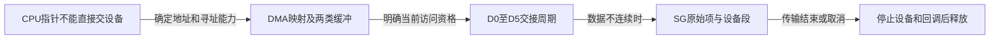

# 第1章\_Linux\_DMA\_一致性专题大纲

## 1.1\_阅读入口

从设备收到命令以后怎样找到缓冲开始，沿同一帧接收走到安全释放。先具备[MMIO送达与完成的区别](../mmio/P01_MMIO_访问顺序与屏障.md#1.4.1_用完整C模型分开送达和完成)，再进入本章的地址和所有权问题。

| 阅读位置 | 当前问题 | 下一步 |
| --- | --- | --- |
| [地址与API职责](P01_DMA_映射同步与门铃顺序.md#1.1_DMA_API_同时解决四个问题) | CPU虚拟地址、物理地址和DMA地址为何不能混用？ | 按能力建立映射 |
| [两类映射](P01_DMA_映射同步与门铃顺序.md#1.3_两类主要映射模型) | 长期描述符和交替使用的数据缓冲为何不同？ | 明确交接和顺序 |
| [所有权周期](P01_DMA_映射同步与门铃顺序.md#1.5_streaming_映射的所有权状态机) | 映射有效是否就能访问？ | 处理失败、完成和复用 |
| [SG完整C模型](P01_DMA_映射同步与门铃顺序.md#1.7.1_用C核对两套计数) | 合并后为什么仍保存原项数？ | 编程硬件与解除映射各用其数 |
| [停止与释放](P01_DMA_映射同步与门铃顺序.md#1.11_停止与释放) | 取消返回是否已经可以free？ | 核对硬件与回调不再访问 |

先从[streaming所有权周期](P01_DMA_映射同步与门铃顺序.md#1.5_streaming_映射的所有权状态机)区分映射有效性、访问资格与设备执行状态，沿D0～D5核对失败、完成、收回和复用。MMIO的安全读回只确认适用场景的命令送达，不能代替这里设备已停止访问缓冲的证据。

硬件缓存协议参见[缓存一致性专题](../../../foundations/computer_architecture/cache_coherence/大纲.md)，本专题只维护 Linux DMA API 与所有权转换。
