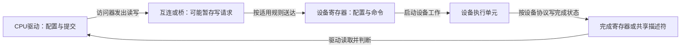
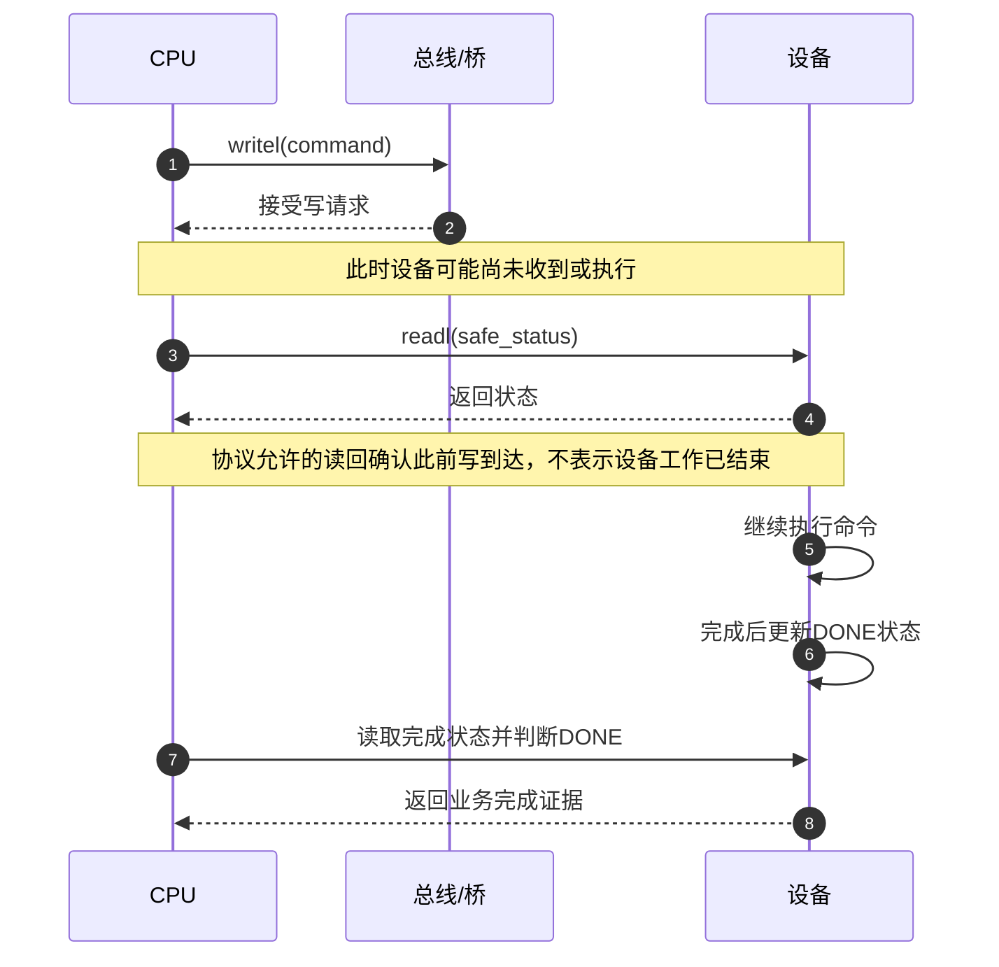

# 第1章\_MMIO\_访问顺序与屏障

## 1.1\_先区分三种顺序问题

设一个设备有配置寄存器、启动寄存器和完成状态寄存器。驱动要先写配置，再启动工作，最后确认工作结束。若把这些地址当作普通变量，编译器可能合并访问；即使指令顺序正确，总线也可能先接收写请求、稍后才把它送到设备；即使设备已收到启动命令，计算或传输还可能没结束。三个问题出现在不同位置，补一条屏障并不能把它们一并解决。

MMIO是内存映射输入输出（Memory-Mapped I/O）：CPU地址空间中的一段地址被解释为设备访问，而不是普通内存读写。本章默认已经理解[CPU内存顺序的参与者与方向](../../synchronization_and_asynchrony/synchronization/memory_ordering/P03_Linux_SMP屏障与顺序域.md#3.1_先按同步域分类)，现在把观察者换成设备。先讨论默认I/O属性映射，例如ioremap得到的地址；写合并等非默认映射必须另查平台规则。

驱动里的“顺序”至少有三层，不能用一个 `wmb()` 笼统解释：



| 问题 | 典型对象 | 常用工具 |
| --- | --- | --- |
| 防止编译器合并或删除一次访问 | 普通共享变量 | `READ_ONCE()`、`WRITE_ONCE()` |
| 多个 CPU 之间建立 happens-before | 普通内存 | `smp_load_acquire()`、`smp_store_release()`、`smp_mb()` 等 |
| 约束普通内存和 MMIO 的观察顺序 | 设备寄存器、DMA 描述符 | `readl()`、`writel()`、`*_relaxed()` 与架构规定的屏障 |
| 确认 posted write 已到达设备 | 设备寄存器 | 读取同一设备的安全寄存器，或使用设备规定的确认方法 |

`smp_*()` 只承诺 SMP CPU 之间的内存顺序，不能自动替代设备 I/O 访问器。反过来，MMIO 访问器也不是保护软件临界区的锁。

## 1.2\_为什么必须使用访问器

MMIO 地址应通过 `ioremap()` 等接口获得，并使用 `readb/readw/readl/readq`、`writeb/writew/writel/writeq` 或其架构支持的变体访问。不要把 `__iomem` 指针当普通内存指针直接解引用，因为：

- 不同体系结构的设备端序和访问指令不同；
- 编译器无法仅凭普通指针理解设备访问的副作用；
- 某些平台需要在访问器中加入架构相关的顺序约束；
- `sparse` 可利用 `__iomem` 检查地址空间误用。

## 1.3\_普通访问器与\_relaxed\_访问器

先固定比较条件：同一个外设、默认I/O属性映射。Linux对readX/writeX给出可移植保证，不必让每位驱动作者从某款处理器的指令重新猜测；非默认映射才需要额外核对架构边界。readl/writel是32位访问器，不能因本机unsigned long宽度变化就改变寄存器访问宽度。

| 接口 | 可以依赖的方向 | 不能据此推导 |
| --- | --- | --- |
| 同一CPU线程的readl/writel | 对同一外设的访问按程序顺序到达 | 任意两个不同外设全局有序，或写返回已完成设备工作 |
| writel与此前普通内存写 | 先前本线程发出或传播到本线程的内存写，先于该外设写；可用于一致性DMA缓冲填充后敲门铃 | streaming DMA可省略映射/同步 |
| readl与后续普通内存读 | 先完成外设读取，再进行后续普通内存读取；可用于读完成寄存器后消费一致性DMA结果 | 寄存器返回任意值都表示设备已完成 |
| 同锁跨CPU的writel | 前一持锁者的写先于后一取得同锁者向同一外设的写到达 | 解锁时所有posted write已经到达 |
| 同一CPU线程的relaxed访问 | 默认映射下仍保证同一外设访问之间的顺序 | 同时具有普通版本对锁、普通内存和延迟循环的顺序保证 |

只有在驱动已经通过设备协议或额外屏障建立所需顺序时，才应为了性能选择 `*_relaxed()`。

例如只是读取与DMA数据无关的独立计数器，relaxed可能合适；若读取的是“DMA已完成”状态，随后马上读结果缓冲，就不能未经证明删掉普通内存的读顺序。普通readX还保证读取先于后续delay循环：在设备要求两次写至少间隔一段时间时，应先按协议读回第一写，再开始延迟，不能把“CPU延迟了”直接当成“设备已间隔了”。

这些结论按[版本化证据入口](../../../../research/source_reading/memory_ordering/navigation/P09_LKMM公理_锁关系与验证边界.md#9.5_官方文档证据)中的固定Linux 6.12.20 memory-barriers.txt之KERNEL I/O BARRIER EFFECTS核对；不能外推到ioremap_wc等非默认属性。

## 1.4\_posted\_write\_与完成确认

许多总线允许 MMIO 写成为 posted write：CPU 完成 `writel()` 只表示写请求已被体系结构或总线接受，不一定表示设备已经执行该写操作。因此，“访问有序”和“写已完成”是两件事。



需要确认写完成时，常见办法是随后读取同一设备上一个不会产生副作用的寄存器。究竟读哪个寄存器必须由设备手册决定；不能随意读取 clear-on-read、FIFO 或会触发动作的寄存器。

这个读回动作常被称为flush，但不是刷新CPU缓存。它利用设备和总线允许的读写顺序，让驱动能够确认此前写已送达。安全读取哪个地址、设备复位时该读取是否仍有效，都要查设备协议；某些PCI复位场景需要用配置空间读取，不能照搬另一个设备的状态寄存器。

### 1.4.1\_用完整C模型分开送达和完成

下面的单线程教学模型刻意把三个存储位置分开：桥的pending记录待送请求，设备的running表示命令已经送达且正在执行，done表示业务完成。它不是总线模拟器，不执行Linux访问器，也不证明真实硬件时序。

```c
#include <assert.h>
#include <stdbool.h>
#include <stdio.h>

struct device_model {
    bool pending; /* 桥中尚未送达的启动请求。 */
    bool running; /* 设备已收到命令，工作仍在进行。 */
    bool done;    /* 设备发布的业务完成状态。 */
};

static void post_start(struct device_model *d)
{
    assert(!d->pending && !d->running && !d->done);
    d->pending = true;
}

static void deliver(struct device_model *d)
{
    if (d->pending) {
        d->pending = false;
        d->running = true;
    }
}

static bool safe_status_read(struct device_model *d)
{
    deliver(d); /* 模型约定：读响应前先送达此前的写。 */
    return d->done;
}

static void finish_work(struct device_model *d)
{
    assert(d->running);
    d->running = false;
    d->done = true;
}

int main(void)
{
    struct device_model d = {0};
    post_start(&d);                         /* I0：写已被桥接收。 */
    assert(d.pending && !d.running);
    assert(!safe_status_read(&d));          /* I1：送达，但尚未完成。 */
    assert(!d.pending && d.running);
    finish_work(&d);                        /* I2：设备完成业务。 */
    assert(safe_status_read(&d));           /* I3：驱动取得完成证据。 */
    puts("accepted -> delivered -> completed -> observed");
    return 0;
}
```

保存为mmio_delivery_model.c，用`cc -std=c11 -Wall -Wextra -Werror -O2 mmio_delivery_model.c -o mmio_delivery_model`编译并执行。输出应为accepted → delivered → completed → observed四阶段对应的英文行。第一次安全读返回false，正好说明读回已经做到送达确认，却没有凭空替设备完成工作。

练习：移除finish_work，预测第二次读取是否变成true。它仍是false；多读几次不能在这个模型中代替设备推进。再把首次读取放到post_start之前，此次读回就不可能确认一条尚未发出的写。这里读回的因果位置，与访问器名字同样重要。

## 1.5\_典型模式

现在把模型中分开的阶段放回驱动片段。下列代码只表达访问协议，不是完整可加载驱动：假设资源已经正确申请并映射，regs是设备寄存器映射，错误处理和移除时的寿命管理另由驱动负责。寄存器偏移和位值必须由实际设备手册提供。

### 1.5.1\_同一设备的配置与启动

REG_CFG0、REG_CFG1是两个配置寄存器偏移，REG_CTRL是控制寄存器偏移，CTRL_GO是启动位值。它们是示意常量，不是本章替某块板卡规定的真实地址。

```c
/* 寄存器顺序由设备协议规定；非 relaxed 访问器表达常规 MMIO 顺序。 */
writel(cfg0, regs + REG_CFG0);
writel(cfg1, regs + REG_CFG1);
writel(CTRL_GO, regs + REG_CTRL);
```

不能一看到连续寄存器写就机械插入 `wmb()`。先判断访问器本身的架构语义、设备协议是否要求额外屏障，以及最后是否需要读取寄存器来确认 posted write 完成。

### 1.5.2\_DMA\_描述符与门铃

REG_DOORBELL表示设备门铃寄存器偏移，写入new_tail通知设备有新描述符可处理；设备是否只在门铃之后读取描述符，必须是已确认的协议前提。

```c
/* 填充设备即将读取的描述符。 */
desc->addr = dma_addr;
desc->len = len;

/* 前提：描述符为一致性DMA内存，门铃使用默认I/O映射。 */
writel(new_tail, regs + REG_DOORBELL);
```

DMA 映射或同步负责缓冲区所有权与缓存维护，屏障负责先后次序，门铃负责提交工作。三者不能相互替代。完整规则参见 [DMA 映射同步与门铃顺序](../dma/P01_DMA_映射同步与门铃顺序.md)。

在上述明确前提下，普通writel已经承担内存写先于门铃的顺序，不需要仅为了这一条边机械再加dma_wmb。若设备不是等门铃，而是主动轮询内存中的OWN所有权位，则“字段先于OWN”是另一条边，可能需要dma_wmb；若缓冲使用streaming映射，又有独立的所有权与同步要求。不能删除一条示例屏障后，顺手删除其他协议真正需要的屏障。

### 1.5.3\_设备完成后消费\_DMA\_结果

如果设备用一致性内存中的状态位发布完成，驱动应按设备协议使用 `dma_rmb()` 等原语，保证先观察完成标志，再读取设备此前写入的数据。非一致性 streaming DMA 还必须在 CPU 重新取得所有权时调用相应的 `dma_sync_*_for_cpu()`。

## 1.6\_锁与\_MMIO\_写顺序

先把两种问题分开。默认I/O映射下，两CPU依次持同一自旋锁，用普通writeX向同一外设写寄存器，Linux提供与取得锁顺序一致的到达顺序。驱动可以依赖这一契约；架构怎样用mmiowb等机制兑现它是实现层问题，不能让可移植驱动猜着补屏障。

但“前一写在后一写之前到达”不等于“第一次解锁返回时前一写已经到达”。若退出临界区之前就必须确认设备收到关闭中断之类的命令，仍要按设备协议完成安全读回或其他确认。换成relaxed访问器也不能继续套用普通writeX的跨锁保证。锁负责软件互斥，访问器负责其承诺的顺序，读回与完成协议各自提供不同证据。

## 1.7\_常见错误

| 错误模型 | 修正 |
| --- | --- |
| `writel()` 返回就代表设备工作已完成 | 安全读回可确认适用场景的写到达；业务完成仍须判断设备规定的状态 |
| `*_relaxed()` 等于“没有任何语义的裸访问” | 它仍是合法 MMIO 访问器，只是削弱了部分顺序保证 |
| 所有门铃前都无条件使用 `wmb()` | 按 DMA API、体系结构和设备协议选择 `dma_wmb()`、`wmb()` 或访问器组合 |
| `wmb()` 会刷新 CPU cache | 屏障约束顺序；缓存维护和 DMA 所有权转换由 DMA API 负责 |
| `rmb()` 能让 streaming DMA 缓冲自动可见 | 非一致性 DMA 仍需正确的 `dma_sync_*_for_cpu()` |
| `smp_wmb()` 可以代替 MMIO 访问器 | `smp_*()` 面向 CPU 间普通内存顺序，不提供设备寄存器访问语义 |
| 为性能把所有中断路径都改成 relaxed | 是否 relaxed 取决于所需顺序，而不是调用上下文 |

## 1.8\_核对表

- MMIO 地址是否保持 `__iomem` 类型并使用正确宽度的访问器？
- 顺序关系发生在 CPU—CPU、CPU—内存还是 CPU—设备之间？
- 需要的是“有序”“确认posted write送达”，还是“设备工作已完成”？
- 寄存器是否具有 read-to-clear、FIFO 或其他读取副作用？
- DMA 缓冲是否按映射类型和方向完成所有权转换？
- 使用 `*_relaxed()` 时，缺少的顺序由哪里补足？
- 跨CPU持锁访问是否满足普通writeX与默认映射契约，是否另有解锁前必须送达的要求？

MMIO 顺序不提供临界区互斥；共享软件状态的保护应转入[锁机制专题](../../synchronization_and_asynchrony/synchronization/locks/大纲.md)。
