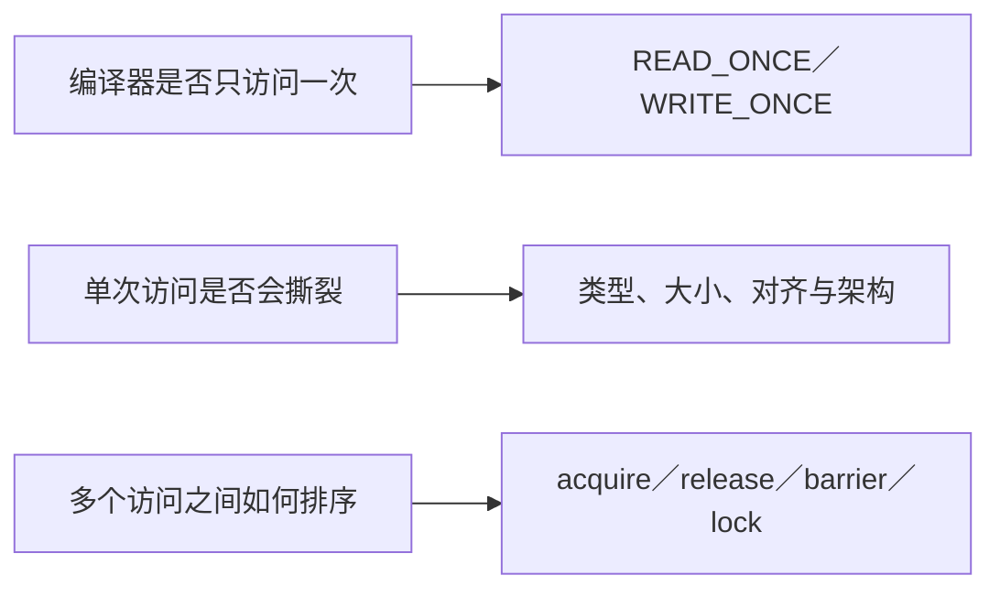
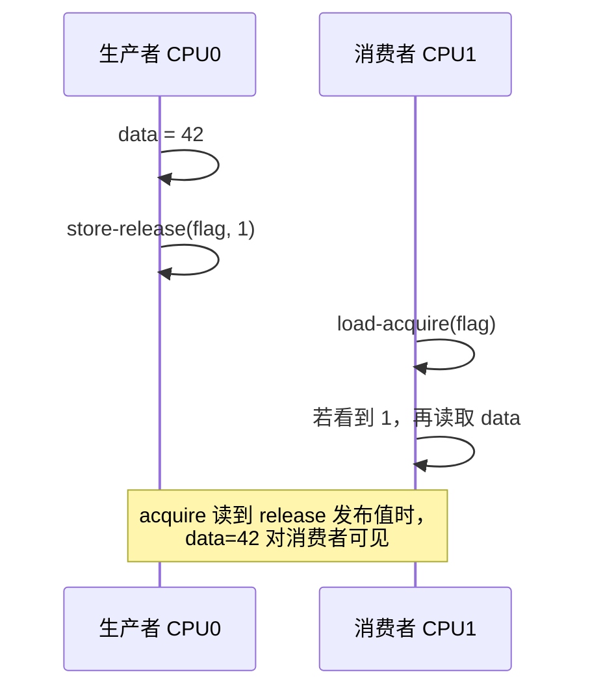
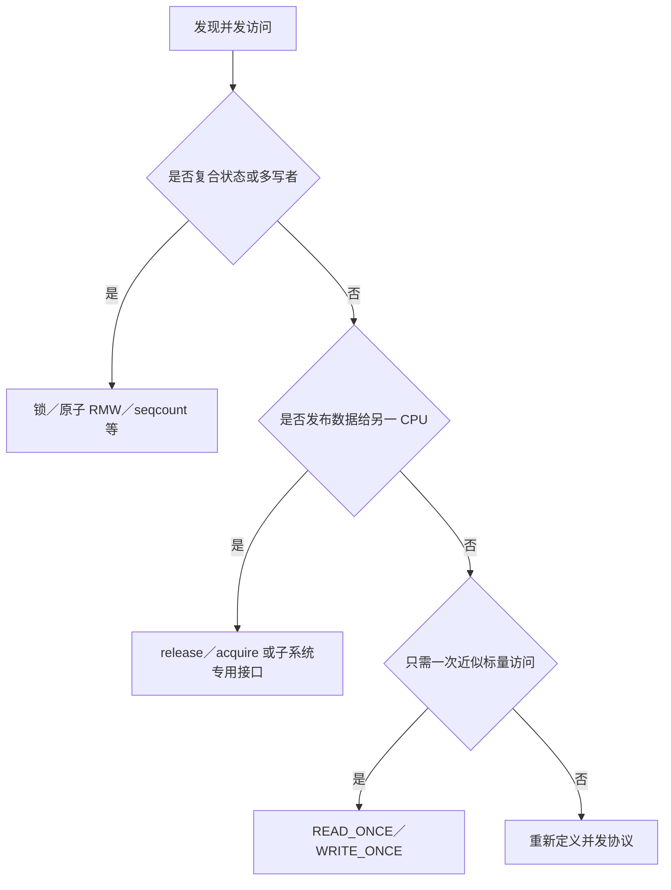

# 第1章\_READ\_WRITE\_ONCE\_与\_SMP\_内存顺序原语

## 1.1\_先拆开三个问题



这三个问题互不等价：

- `READ_ONCE()/WRITE_ONCE()` 主要约束编译器对某次访问的合并、拆分、重复读取和消除。
- 一次访问是否具有硬件原子性，仍取决于对象大小、自然对齐和体系结构支持。
- 两个 CPU 之间的 happens-before 需要锁、release/acquire、内存屏障或其他成对同步协议。

因此不能把 ONCE 宏称为“无锁同步”或“让其他 CPU 立即可见”的工具。

## 1.2\_编译器\_CPU\_与缓存一致性

C 源码顺序不直接等于其他 CPU 的观察顺序：

1. 编译器可在单线程可观察行为不变时重排、合并或删除访问；
2. CPU 可借助 store buffer、乱序执行和推测执行改变访问对外显现的先后；
3. 缓存一致性协议维护同一缓存行最终一致，并不保证不同地址按源码顺序被观察；
4. Linux 内存模型规定内核原语之间可依赖的顺序，而不是要求程序员猜具体微架构时序。



## 1.3\_READ\_ONCE\_与\_WRITE\_ONCE

```c
u32 state = READ_ONCE(dev->state);
WRITE_ONCE(dev->state, NEW_STATE);
```

它们适合表达“这个共享标量确实可能并发变化，请生成一次受约束的访问”。典型用途包括轮询标志、统计快照和无锁协议中的单次字段访问。

它们不提供：

- 复合读改写的原子性，例如 `WRITE_ONCE(x, READ_ONCE(x) + 1)`；
- 多字段一致快照；
- 写者之间的互斥；
- acquire/release 或全屏障语义；
- 任意大小、任意对齐对象都不撕裂的保证。

对于并发计数使用 `atomic_t`、`refcount_t` 或锁；对于多字段快照使用锁或 seqcount；对于对象发布使用 release/acquire 或 RCU 发布接口。

## 1.4\_编译器屏障与\_CPU\_屏障

| 原语 | 主要约束 | 不保证 |
| --- | --- | --- |
| `barrier()` | 编译器不能让相关访问跨越该点 | 不发出硬件内存屏障 |
| `smp_rmb()` | SMP CPU 之间的读—读顺序 | MMIO 完成、DMA 缓存维护 |
| `smp_wmb()` | SMP CPU 之间的写—写顺序 | 设备寄存器访问语义 |
| `smp_mb()` | SMP CPU 之间的双向内存顺序 | 自动形成业务协议、自动互斥 |
| `dma_rmb()/dma_wmb()` | 共享 DMA 内存中的设备/CPU 顺序 | streaming DMA 所有权转换 |
| `mb()/rmb()/wmb()` | 架构定义的更广硬件顺序 | posted MMIO write 已到达设备 |

在 `CONFIG_SMP=n` 时，部分 `smp_*()` 可以退化为编译器屏障，因为不存在另一个 CPU；这也是代码应表达“同步域”而不是机械使用最强 `mb()` 的原因。

## 1.5\_release\_与\_acquire

生产者—消费者发布通常不需要全屏障：

```c
/* 生产者 */
WRITE_ONCE(obj->payload, 42);
smp_store_release(&obj->ready, 1);

/* 消费者 */
if (smp_load_acquire(&obj->ready))
    use(READ_ONCE(obj->payload));
```

当 acquire 读取到 release 写入的值或其 release sequence 所允许的值时，生产者在 release 之前的访问先于消费者在 acquire 之后的访问。release 不约束其后的访问，acquire 不约束其前的访问，所以二者不是各自独立的“全屏障”。

锁也通常提供这种单向语义：成功加锁是 acquire，解锁是 release。不能据此写成“每个 lock/unlock 都分别等价于 `smp_mb()`”。少数需要跨临界区建立更强顺序的算法应使用内核提供的专门原语，而不是自行推断。

## 1.6\_控制依赖与地址依赖

仅凭 C 语言的 `if` 不应随意构造无锁内存序。编译器可能进行推测、值推导或控制流变换。必须使用 Linux 内存模型明确支持的原语和模式。

RCU 的 `rcu_dereference()` 会处理单次取指针、编译器约束、地址依赖和检查语义；不要用裸 `READ_ONCE()` 替代它。详见 [RCU 内存序与使用边界](../synchronization/rcu/P25_RCU_内存序_误用与选择边界.md)。

## 1.7\_常见模式

### 1.7.1\_锁保护复合状态

```c
spin_lock(&obj->lock);
obj->a = new_a;
obj->b = new_b;
spin_unlock(&obj->lock);
```

锁既串行化写者，也建立锁参与者之间的内存顺序。锁内字段通常不需要再机械套 ONCE 或 SMP 屏障。

### 1.7.2\_只读取近似统计值

```c
u64 snapshot = READ_ONCE(stats->packets);
```

这只表示取得一次允许并发变化的标量快照，不表示与其他字段属于同一时刻。

### 1.7.3\_无锁标志发布

只有协议确实是一写或已解决多写竞争时，才使用 release/acquire 标志。若多个写者同时更新对象，仍需锁、原子 RMW 或其他写者协调。

## 1.8\_与\_MMIO\_和\_DMA\_的边界

- CPU—CPU 普通内存顺序：使用 `smp_*()`、锁、原子操作等。
- CPU—设备寄存器：使用 MMIO accessor，并按设备协议处理 posted write 和 relaxed 访问。
- CPU—DMA 缓冲区：使用 DMA API 处理设备地址、所有权和缓存维护，再用合适的 DMA/内存屏障处理描述符顺序。

继续阅读 [MMIO 访问顺序](../io_model/mmio/P01_MMIO_访问顺序与屏障.md)和 [DMA 映射同步与门铃顺序](../io_model/dma/P01_DMA_映射同步与门铃顺序.md)。

## 1.9\_错误模型核对表

| 错误模型 | 正确理解 |
| --- | --- |
| `READ_ONCE()` 是 acquire load | 它主要是单次访问约束；需要 acquire 时使用相应原语 |
| `WRITE_ONCE()` 会立即刷新其他 CPU cache | 可见性传播由硬件和同步协议共同决定，ONCE 不建立 happens-before |
| 缓存一致性等于内存顺序 | 一致性不保证不同地址的观察顺序 |
| 加锁和解锁各自都是全屏障 | 常规锁语义是 acquire/release |
| `volatile` 可以实现线程同步 | 内核并发使用明确的 ONCE、锁、原子和屏障原语 |
| `smp_wmb()` 可以给设备排序 | 它面向 CPU 间普通内存顺序，设备访问使用对应 API |
| 屏障能刷新 DMA 缓冲区 | streaming DMA 的缓存维护和所有权由 DMA API 负责 |

## 1.10\_选择流程



选择原语之前，先写出参与者、被保护状态、允许的并发、发布点和生命周期；屏障应是协议推导的结果，而不是发现竞态后的装饰。
