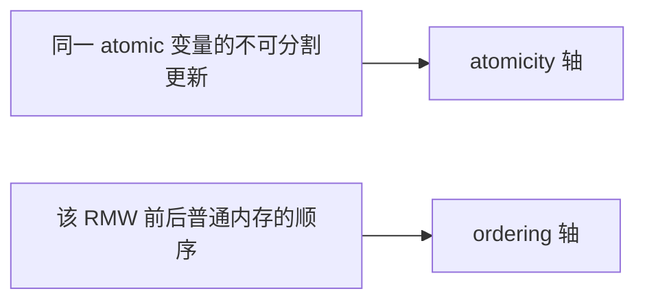
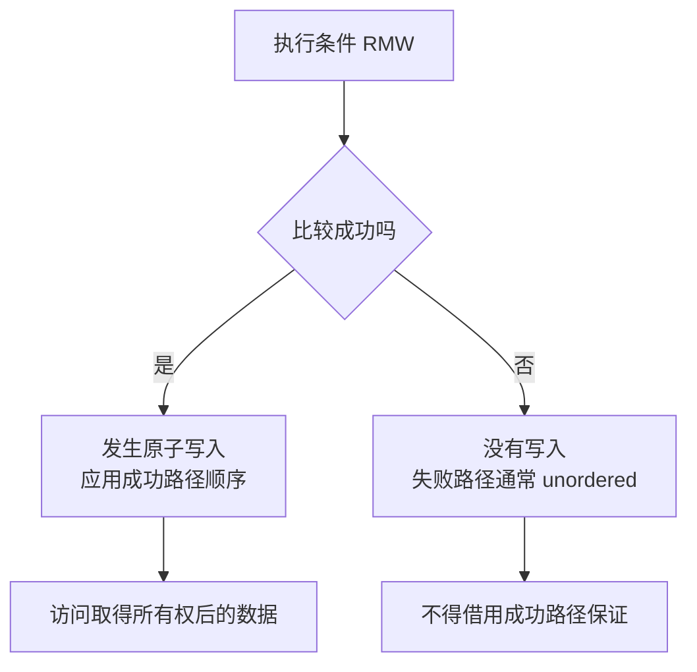

# 第6章\_原子RMW\_顺序后缀与条件成功

## 6.1\_原子更新和其他地址的顺序是两条轴

```c
atomic_inc(&counter);
```

原子 RMW 首先保证针对 `counter` 的读取、计算和写回在竞争者之间不可分割，不暴露中间状态、不丢失更新。但它与 `data`、`flag` 等其他地址怎样排序，取决于具体 API 变体。



“它是 atomic_t，所以周围代码都有序”是常见错误。

## 6.2\_非\_RMW\_操作不需要为读取包装\_atomic\_t

Linux `Documentation/atomic_t.txt` 指出，`atomic_read()`、`atomic_set()` 这类非 RMW 操作通常分别基于 ONCE、acquire/release 等基本访问实现。若代码只读写一个值，从不做原子 RMW，往往不需要仅为“看起来原子”而使用 `atomic_t`；应直接选择表达所需访问和顺序的原语。

但 `atomic_set()` 必须与并发 RMW 保持同一 atomic 对象的不可分割契约，不能让一个锁实现的 RMW 被普通 Store 插入并产生不可能中间结果。这是 atomic API 实现者的责任，不是调用方手加屏障能修补的。

## 6.3\_RMW\_接口族表达什么

| 形式 | 示例 | 返回内容 | 默认顺序概念 |
| --- | --- | --- | --- |
| 无返回值更新 | `atomic_inc()` | 无 | 通常不因返回值提供完整顺序 |
| 返回新值 | `atomic_inc_return()` | 修改后值 | 无后缀版本通常 fully ordered |
| 返回旧值 | `atomic_fetch_add()` | 修改前值 | 无后缀版本通常 fully ordered |
| 交换 | `xchg()` | 旧值 | 按 API 契约 |
| 条件交换 | `cmpxchg()` / `try_cmpxchg()` | 成败/旧值 | 成功与失败路径不同 |

准确结论以目标 API 文档为准，不能从函数包含 `atomic` 字样一概推出全屏障。

## 6.4\_顺序后缀怎样选择

| 后缀 | 对其他地址的顺序 | 典型角色 |
| --- | --- | --- |
| `_relaxed` | 不增加跨地址顺序 | 只竞争计数/状态所有权，外围已有同步 |
| `_acquire` | RMW 的读取侧作为 acquire | 成功取得状态后读取受其发布的数据 |
| `_release` | RMW 的写入侧作为 release | 在放出状态前发布此前更新 |
| 无后缀 fully ordered 变体 | 原子事件前后提供更强双向顺序 | 需要两侧排序且 API 明确保证 |

使用 relaxed 的理由必须能指出顺序来自哪里，例如对象只在锁内访问、计数值只用于统计、或另一条 release/acquire 已建立协议。只因为 relaxed “更快”不足以证明正确。

## 6.5\_条件操作失败路径为什么最危险

```c
old = atomic_cmpxchg_acquire(&state, FREE, OWNED);
if (old == FREE)
    use_owned_data();
```

成功时当前 CPU 完成状态转换，acquire 可以排列随后对受保护数据的访问。失败时没有执行发布写，Linux atomic 规则通常不为失败路径提供同等顺序；调用方若在失败后依据返回值访问其他数据，必须单独证明顺序。



循环 CAS 还要区分每次失败重试与最终成功；不能把函数整体当成一次 acquire/release 事件。

## 6.6\_示例一\_引用计数不是普通计数器

引用计数要求防溢出、防从零复活和最后一个 put 的释放语义，Linux 提供 `refcount_t` 而不是让调用方随意组合 `atomic_t`。即使 atomic RMW 能保证数字不丢更新，也不自动保证对象生命周期状态机安全。

最后一次 decrement 通常需要把此前对象使用有序到 release 路径，并在确认归零后执行销毁前的 acquire/屏障要求；这些细节由 refcount/kref API 封装。对象生命期场景优先使用对应权威接口，而不是根据本章手拼后缀。

## 6.7\_示例二\_状态所有权的\_acquire/release\_RMW

```c
/* 尝试从 FREE 原子转换为 OWNED。 */
if (atomic_cmpxchg_acquire(&state, FREE, OWNED) == FREE) {
    use_resource();

    /* 归还前完成对资源的修改。 */
    atomic_set_release(&state, FREE);
}
```

这段模式还依赖：所有竞争者都通过同一状态协议取得资源；`FREE` 不与其他代际混淆；失败路径不会访问资源；销毁路径不会在状态可再次取得时释放对象。

原子顺序只连接状态所有权和数据访问，不替协议回答状态机完整性。

## 6.8\_before\_after\_atomic\_屏障只补缺的一侧

`smp_mb__before_atomic()` / `smp_mb__after_atomic()` 用于原子操作本身没有提供所需一侧顺序，而协议明确要求在它之前或之后补强的场景：

```text
此前普通访问 → before_atomic → atomic event
atomic event → after_atomic → 此后普通访问
```

若原子操作已是 fully ordered，再机械叠加可能重复；若目标根本不是原子 RMW，使用这些接口则表达错域。调用前必须核对该 atomic 变体的现有保证和 LKMM 模式。

## 6.9\_原子变量也会形成缓存行热点

正确性上不可分割，不代表性能上可扩展。多 CPU 高频 RMW 同一 `atomic_t` 会争夺同一缓存行并按最新值串行化。Store Buffer 无法消除最终所有权转移。

如果业务允许局部近似值或低频汇总，应考虑 per-CPU counter、分片和批处理；完整因果见[缓存行所有权竞争与伪共享](../../foundations/computer_architecture/cache_coherence/P03_缓存行所有权竞争与伪共享.md)。

## 6.10\_验证顺序

1. 先证明需要原子 RMW，而不只是单次访问；
2. 写出成功和失败状态转换；
3. 分别列出成功/失败路径访问的其他地址；
4. 选择 relaxed/acquire/release/fully ordered 变体；
5. 用 LKMM Litmus 表达错误结果；
6. 检查缓存行竞争和重试前进性；
7. 若是引用计数或锁，改用专用 API。

## 6.11\_本章验收

1. 能区分原子更新轴和跨地址顺序轴。
2. 能说明非 RMW 的 `atomic_read/set` 为什么不自动需要 `atomic_t`。
3. 能按返回值和后缀判断 RMW 的顺序意图。
4. 能单独审查条件原子操作的失败路径。
5. 能解释 before/after atomic 屏障补的是哪一侧。
6. 能识别 atomic 热点以及引用计数应使用专用 API。

上一篇：[数据依赖、控制依赖与 RCU 取得](P05_数据依赖_控制依赖与RCU取得.md)。

下一篇：[锁、调度、中断与隐式顺序](P07_锁_调度_中断与隐式顺序.md)。
