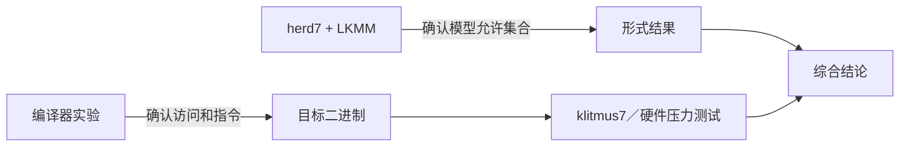

# 第9章\_Litmus\_形式验证与硬件实验

## 9.1\_一项结论需要三种互补验证



- 反汇编确认编译器实际生成什么；
- herd7 穷举 LKMM 中的小型执行；
- klitmus7 或硬件测试观察目标内核/CPU 上实际出现的结果。

任何一层都不能单独代表另外两层。

## 9.2\_Linux\_6.12\_模型文件怎样准备

本仓库保存的版本化模型位于：

```text
research/source_reading/linux/tools/memory-model/
├── linux-kernel.cfg
├── linux-kernel.def
├── linux-kernel.bell
├── linux-kernel.cat
└── lock.cat
```

模型来自 NXP Linux 6.12.20 基线。上游 README 要求外部安装 herdtools7，并提示当前模型至少使用 herd7/klitmus7 7.52；工具未来版本不绝对保证兼容，因此实验记录必须同时保存 Linux 模型版本和 herd7 版本。

## 9.3\_最小\_Litmus\_文件怎样写

```text
C MP-demo

{}

P0(int *data, int *flag)
{
    WRITE_ONCE(*data, 1);
    WRITE_ONCE(*flag, 1);
}

P1(int *data, int *flag)
{
    int r0 = READ_ONCE(*flag);
    int r1 = READ_ONCE(*data);
}

exists (1:r0=1 /\ 1:r1=0)
```

组成部分：

1. `C name` 指定测试和 Linux C-like 方言；
2. `{}` 给出初始状态，省略位置通常按模型默认初始化；
3. `Pn()` 表示参与者；
4. 使用模型认识的 ONCE、屏障、原子、锁或 RCU 原语；
5. `exists` 写出要询问的结果。

Litmus 语法不是完整 C：不支持任意函数、循环、动态分配和预处理器。真实代码必须先缩成最小事件协议。

## 9.4\_运行\_herd7

在保存的模型目录执行：

```bash
cd research/source_reading/linux/tools/memory-model
herd7 -conf linux-kernel.cfg \
  ../../../../../labs/kernel/memory_ordering/P02_LKMM_Litmus_消息传递与屏障/tests/MP+poonceonces.litmus
```

或使用实验目录的 `make check` 批量运行。输出重点：

```text
Test ... Allowed
States ...
Witnesses
Positive: ... Negative: ...
Condition exists (...)
Observation ... Sometimes|Never ...
```

`Positive > 0`/`Sometimes` 表示存在满足关注条件的模型执行；`Positive = 0`/`Never` 表示该模型禁止。完整状态列表用于确认测试没有写错寄存器或条件。

## 9.5\_必须运行成对反例

只运行“正确版本”容易把语法、模型选择或结果条件写错。每个结论至少包含：

| 模式 | 无序测试 | 加序测试 | 预期变化 |
| --- | --- | --- | --- |
| MP | 两端 ONCE | release/acquire | 坏结果 Sometimes → Never |
| MP | 两端 ONCE | wmb/rmb 配对 | 坏结果 Sometimes → Never |
| SB | Store/Load ONCE | 两边 `smp_mb()` | 0/0 Sometimes → Never |
| IRIW | reader 连续两读 | reader 两读间 `smp_mb()` | 相反观察 Sometimes → Never |

无序测试验证模型确实能表达要修的缺口；有序测试验证新增原语确实关闭该缺口。

## 9.6\_怎样解释一次\_Sometimes

以 MP 无序结果为例：

1. P1 的 flag Load 从 P0 的新 flag Store 读取；
2. P1 的 data Load 从 data 初始写读取；
3. 两次写、两次读各自有程序顺序；
4. 没有 release/acquire 或屏障把 Wdata 连接到 Rdata；
5. 同址一致性允许每个 Load 所选来源；
6. 因此坏结果存在。

解释必须落到事件关系，而不是只写“弱内存会乱序”。

## 9.7\_从\_Litmus\_转换到内核硬件测试

`klitmus7` 可以把支持的 Litmus 转成内核模块：

```bash
klitmus7 -o generated tests/SB+fencembonceonces.litmus
cd generated
make
sudo sh run.sh
```

硬件执行会给出各结果的次数分布。运行前必须：

- 只在可恢复测试机/虚拟机或明确授权环境加载模块；
- 核对生成模块面向当前内核构建；
- 保存内核版本、配置、CPU、herdtools7 和编译器版本；
- 阅读生成代码，确认 CPU 绑定、迭代次数和退出路径；
- 清理已加载模块和生成产物。

本仓库不会在 Windows 编辑环境中假装完成内核模块运行；实验 README 会明确区分已验证的静态结构和待在 Linux 目标机执行的步骤。

## 9.8\_硬件未观察到为什么不能推翻模型

若模型说 `Sometimes`，硬件测试未出现，可能因为：

- 当前 CPU 比 LKMM 最低保证更强；
- 结果概率很低，迭代不足；
- 测试调度/同步框架意外加入顺序；
- 两线程未真正并行或未跨合适核心；
- 编译器生成的访问与假设不同；
- cache 拓扑和负载不利于触发。

因此结论只能写“在该配置和样本中未观察到”，不能改写成 `Never`。

## 9.9\_模型禁止但硬件出现时怎样排查

1. 检查 Litmus 和硬件代码是否真是同一事件协议；
2. 检查 C 代码是否存在 plain data race、撕裂或越界；
3. 检查编译器是否保留 ONCE/atomic 访问；
4. 检查目标内存类型是否为普通可缓存内存；
5. 检查模型版本、工具版本和命令行配置；
6. 检查 CPU/内核是否存在已知缺陷；
7. 将最小复现、汇编、结果分布和版本信息提交给对应维护者。

不要通过继续添加随机屏障掩盖模型与观察不一致。

## 9.10\_实验局限必须写进结论

LKMM Litmus 当前不完整模拟：

- 任意编译器优化；
- 多访问宽度和撕裂；
- 通用异常/中断交错；
- MMIO、DMA 和设备缓存；
- 动态内存分配与完整对象生命周期；
- 所有可能的原子 API 细节。

所以形式结果要与 P02 的反汇编、体系结构手册、子系统契约和真实对象状态机共同审查。

## 9.11\_实验记录模板

```text
测试文件：
关注结果：
预期模型结果及推理：
Linux 模型版本：
herd7/klitmus7 版本：
完整命令：
完整输出路径：
硬件/内核/编译器：
迭代数和结果分布：
与预期差异：
结论的适用边界：
清理结果：
```

## 9.12\_本章验收

1. 能写出包含初始状态、参与者和 `exists` 的 Litmus。
2. 能解释 `Sometimes/Never`，而不是只抄输出。
3. 能设计无序/有序成对测试。
4. 能区分 herd7 模型验证与 klitmus7 硬件观察。
5. 能解释硬件未观察到允许结果为什么不是证明。
6. 能记录版本、输出、结果分布和模型边界。

上一篇：[LKMM 事件、关系与一致性判定](P08_LKMM事件_关系与一致性判定.md)。

下一篇：[子系统边界、误用诊断与选型](P10_子系统边界_误用诊断与选型.md)。
