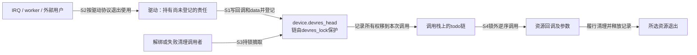
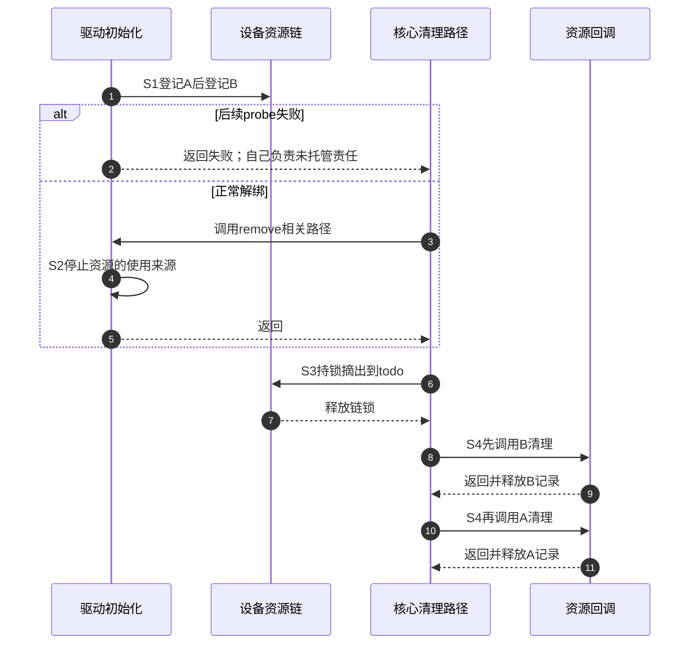

# 第1章\_从失败回滚到设备资源账本

一个驱动先分配私有结构，再建立寄存器映射，最后注册中断。如果第三步失败，前两步必须撤销；若全部成功，解绑时仍须撤销这些资源。逐级`goto`回滚能正确表达这个责任，但每增加一项，失败标签与正常退出就都要重新核对。漏掉某一路会泄漏，重复走两路则可能二次释放。问题不在`goto`本身，而在同一清理依赖分散在多条出口后容易失配。

本章从这种重复责任推导设备资源管理（Device Resource Management，devres）。它把“以后做什么清理、清理谁”记入设备的资源账本；常用包装以`devm_`命名。先学会解释账本，再查API，才不会把“自动清理”误读成“任意错误直接返回都安全”。先修只需C指针、结构体、函数回调和分配释放；引用计数与驱动框架细节在遇到边界时链接回相应专题。

## 1.1\_从两条退出路径提取同一份责任

设A是保存控制状态的内存，B是要在清理时读取A的资源。正确的手工方案先取得A，再取得B；如果B取得失败，只释放A；如果二者成功，退出时先清理B，再释放A。这里真正需要保存的是 **哪些步骤成功了、相应清理函数是什么、参数仍有效到何时**。

devres把成功责任登记为记录。A先登记，B后登记，收尾逆序执行B、A，正好满足这个依赖。这不证明任何登记顺序都正确：如果先登记一个需要访问A的回调，后来才登记A的释放，那么逆序时A反而先消失。使用者仍要按资源依赖安排登记、停止异步使用者并检查所有返回值。

记录本身也要占内存，也可能分配失败。普通action登记失败不会替调用者清理已经取得的资源；`devm_add_action_or_reset()`在这个失败分支立即调用action，避免责任丢失。此时回调没有留在账本里，调用者不能因收到错误又重复清理同一资源。

## 1.2\_设备外壳与绑定资源有不同期限

`struct device`是框架对象，devres账本存放在它里面，但这不意味着账本中每项资源都等到device引用归零才清理。正常驱动解绑先经过驱动remove路径，再由核心清理该设备的受管理资源；驱动probe失败也有明确的清理路径。额外`get_device()`能保住设备外壳，不能据此让旧用户继续使用已经解绑的寄存器映射或驱动私有内存。

同样，PM（电源管理）的暂停/恢复不等于解绑。给解绑登记一次关时钟action，不会自动完成每次暂停/恢复的配对；反过来，action也并非只能释放“句柄”。它完全可以负责关停动作，只要执行时机、运行上下文、参数期限和重复调用规则符合整个协议。具体`devm_*`包装托管什么，要读该接口契约，不能仅凭前缀决定。

尚有工作线程worker、定时器回调或外部用户借用资源时，账本不会自动统计他们。硬件中断请求（Interrupt Request，IRQ）也可能触发访问资源的处理函数。需要先关入口、停止来源、等待必要活动退出，再允许释放走到相关记录；若寿命需要超出解绑，应采用独立持有的对象和明确的资源断开协议。继续阅读可对照[kref框架层次](../kref/P11_kref_refcount_t_kobject_的边界.md#11.5_分层对照_裸_kref_driver_core_和私有引用)。

## 1.3\_账本状态怎样推进到实际回调

这是几组相关状态：设备是否绑定、资源是否仍可用、记录是否登记、异步使用者是否退出。devres核心只管理其中的记录与回调，不是一个包办所有业务的单一状态机。下面用S0～S4跟踪A/B成功登记后解绑的一轮过程。首次进入版本证据时先读[固定源码索引](../../../../research/source_reading/devres/navigation/P01_Linux_6.12_devres源码阅读索引.md#1.1_固定版本与阅读任务)。

| 阶段 | 触发与写入者 | 状态位置和变化 | 后续读取者与退出条件 |
| --- | --- | --- | --- |
| S0取得 | 驱动或资源包装获得A/B | 实际资源已存在，尚未登记的责任仍在调用者手里 | 登记成功才进入S1；登记失败按契约原地回滚 |
| S1登记 | 包装函数写好回调和参数，追加记录 | `devres.node.release`与`data[]`保存清理内容，`dev->devres_head`连接记录；修改链时持`devres_lock` | 设备核心或显式分组释放路径读取记录 |
| S2关停 | 驱动退出路径按资源依赖停止新来源与活动 | 驱动自己的业务门、IRQ、worker等状态；不由devres链锁代管 | 所有可能使用待释放资源的路径满足退出条件 |
| S3摘出 | 核心在`devres_lock`下选择记录 | 记录从设备链移动到本次清理调用栈上的`todo`链 | 链锁释放后，当前清理执行者获得待回调记录 |
| S4清理 | 当前清理执行者逆序调用release | B回调、B记录释放，再A回调、A记录释放；action记录经包装调用`action(data)` | 所选记录处理完毕，函数返回；不是等待未来device引用归零 |





图中没有devres专属后台线程或“通知资源自己释放”的过程，回调由当前清理调用路径直接执行。锁外调用避免一直占有账本自旋锁，却不意味着任何回调都能随意睡眠：还须满足当前调用者上下文和其他已持锁约束。链锁保证基础账本操作，不能使驱动并发登记与解绑自动成为正确业务协议；高频数据访问的同步仍由驱动负责。

## 1.4\_阶段失败为什么需要分组

有时一个中间层函数想取得B、C，失败后撤销它们并返回，让调用者保留更早的A继续工作。等待整个设备解绑太晚，手工释放又容易漏项，于是需要在同一账本中划定一段。组ID是`void *`标识；传NULL创建时，核心生成标识并返回。保存这个返回值，后面明确指定该组，比随意用NULL选择“最近未关闭组”更容易审查。

四个动作不能混淆：open放入开始标记；close放入结束标记，之后登记的资源在组外；remove只拿走组标记，资源留在设备账本；release选择范围并真正逆序执行资源回调。关闭不是提交后免于释放，移除分组也不是回滚。合法嵌套组由内核的范围算法一并处理，调用者仍须使用有效ID和匹配的开闭顺序。

例如账本是`A, open, B, close, C`。release这个组先清理B，后来全设备清理C、A；remove这个组则一个资源都不清理，后来仍依次清理C、B、A。若没有close，组范围一直延伸到当前链尾，release会连同C一起清理。这是下面实验要观察的区别。

## 1.5\_运行完整C模型观察六条路径

模型只保留一组、数组记录和资源存活标志，不模拟内核链表、自旋锁、分配器或并发。它故意把资源对象与账本记录分开：资源已取得，记录仍然可能创建失败。完整文件为[devres_groups.c](../../../../labs/kernel/object_lifetime/materials/devres_groups.c)。

代码中的released字符串是观察日志：`CB`表示先清理C再清理B，`BCA`、`CBA`与`BA`也按从左到右记录实际回调顺序。它不承担资源保护，`resource.live`才是模型用于检查是否重复清理的状态。

```c
/* 单线程教学模型：一个平面分组、固定记录数组，不模拟内核链表或锁。 */
#include <assert.h>
#include <stdbool.h>
#include <stdio.h>
#include <string.h>

struct resource {
    char name;
    bool live;
};
struct record {
    struct resource *data;
    bool active;
};
struct ledger {
    struct record records[8];
    unsigned int count;
    unsigned int first;
    unsigned int end;
    bool group;
    bool closed;
    char released[9];
    unsigned int released_count;
};

static void cleanup(struct ledger *book, struct resource *item)
{
    assert(item->live && book->released_count < 8);
    item->live = false;
    book->released[book->released_count++] = item->name;
    book->released[book->released_count] = '\0';
}

static bool add_action(struct ledger *book, struct resource *item,
                       bool fail_record, bool reset_on_failure)
{
    assert(item->live);
    if (fail_record) {
        if (reset_on_failure)
            cleanup(book, item); /* 记录没建立，直接履行清理责任。 */
        return false;
    }
    assert(book->count < 8);
    book->records[book->count++] = (struct record){item, true};
    return true;
}

static void open_group(struct ledger *book)
{
    assert(!book->group); /* 本模型不支持嵌套；内核支持合法嵌套。 */
    book->first = book->count;
    book->group = true;
    book->closed = false;
}

static void close_group(struct ledger *book)
{
    assert(book->group && !book->closed);
    book->end = book->count;
    book->closed = true; /* 划定边界，不执行任何资源回调。 */
}

static void remove_group(struct ledger *book)
{
    assert(book->group);
    book->group = false; /* 仅删除分组资格，记录仍属于设备账本。 */
}

static void release_range(struct ledger *book, unsigned int first,
                          unsigned int end)
{
    while (end > first) {
        struct record *entry = &book->records[--end];
        if (entry->active) {
            entry->active = false; /* 先摘下，再执行清理。 */
            cleanup(book, entry->data);
        }
    }
}

static void release_group(struct ledger *book)
{
    assert(book->group);
    release_range(book, book->first, book->closed ? book->end : book->count);
    book->group = false;
}

static void release_all(struct ledger *book)
{
    release_range(book, 0, book->count);
    book->group = false;
}

static void group_case(unsigned int scene)
{
    struct ledger book = {0};
    struct resource a = {'A', true}, b = {'B', true}, c = {'C', true};
    assert(add_action(&book, &a, false, false));
    open_group(&book);
    assert(add_action(&book, &b, false, false));
    if (scene != 0)
        close_group(&book);
    assert(add_action(&book, &c, false, false));
    if (scene == 2)
        remove_group(&book);
    else if (scene != 3)
        release_group(&book);
    assert(strcmp(book.released, scene == 0 ? "CB" : scene == 1 ? "B" : "") == 0);
    assert(a.live && b.live == (scene >= 2) && c.live == (scene != 0));
    printf("group=%u before-detach=%s ", scene, book.released);
    release_all(&book);
    assert(!a.live && !b.live && !c.live);
    assert(strcmp(book.released, scene == 1 ? "BCA" : "CBA") == 0);
    printf("all=%s\n", book.released);
    release_all(&book); /* 已摘记录不能被第二次回收。 */
    assert(book.released_count == 3);
}

static void failure_case(bool reset_on_failure)
{
    struct ledger book = {0};
    struct resource a = {'A', true}, b = {'B', true};
    assert(add_action(&book, &a, false, false));
    assert(!add_action(&book, &b, true, reset_on_failure));
    assert(b.live == !reset_on_failure && book.count == 1);
    if (!reset_on_failure)
        cleanup(&book, &b); /* 普通add失败后责任仍由调用者承担。 */
    release_all(&book);
    assert(!a.live && !b.live && strcmp(book.released, "BA") == 0);
    printf("reset=%u registered=1 all=%s\n", reset_on_failure, book.released);
}

int main(void)
{
    for (unsigned int scene = 0; scene < 4; ++scene)
        group_case(scene);
    failure_case(false);
    failure_case(true);
    return 0;
}
```

在材料目录执行：

```bash
cc -std=c11 -Wall -Wextra -Werror -O2 devres_groups.c -o devres_groups
./devres_groups
```

先预测，再对照输出：

```text
group=0 before-detach=CB all=CBA
group=1 before-detach=B all=BCA
group=2 before-detach= all=CBA
group=3 before-detach= all=CBA
reset=0 registered=1 all=BA
reset=1 registered=1 all=BA
```

第0条未关闭组，B/C都在范围内；第1条先关闭，再登记C，只提前清理B；第2条移除标记；第3条保留关闭组直到全量清理。后两条最终顺序相同，但责任执行者不同：普通add失败由调用者清理B，reset变体在失败返回以前已清理B。`registered=1`表示B从未进入账本，随后全量清理只处理A。

这些断言说明模型中的分组选择和责任配对，不是Linux运行验证；不能据此声称真实IRQ、内存可见性或驱动退出已安全。固定源码的具体字段与范围选择在[模块导读](../../../../research/source_reading/devres/navigation/P02_记录与分组清理导读.md#2.2_同一周期内比较分组范围)逐项对照。

## 1.6\_练习与下一步

1. 在第1条路径关闭组后再登记D，预测组释放与全设备释放的顺序，并修改模型核对。关键是D是否位于结束标记之前。
2. 假设B的回调要读取A，分别把A登记到B之前、之后。哪种顺序满足依赖？给出实际访问发生时A的存活状态，不能只回答“逆序”。
3. 普通add失败以后直接返回，为什么B不会被全设备清理？把调用者cleanup暂时去掉，观察哪条断言暴露遗漏；恢复它再继续。
4. 一个打开的文件仍持device引用，驱动却已解绑。能否继续读取devm内存？应分别画出外壳引用和资源账本的终点。

本章建立了资源登记、原地回滚、选择范围和逆序执行。下一步查[核心API](devres_API说明.md#2.1_核心机制_/_分组接口)，把模型动作对应实际返回值；然后逐族区分获取句柄、启停状态、映射与注册。需要组合外壳和私有对象时再进入[生命周期集成](../integration/大纲.md)，不能用一个“设备生命周期”概括全部期限。
