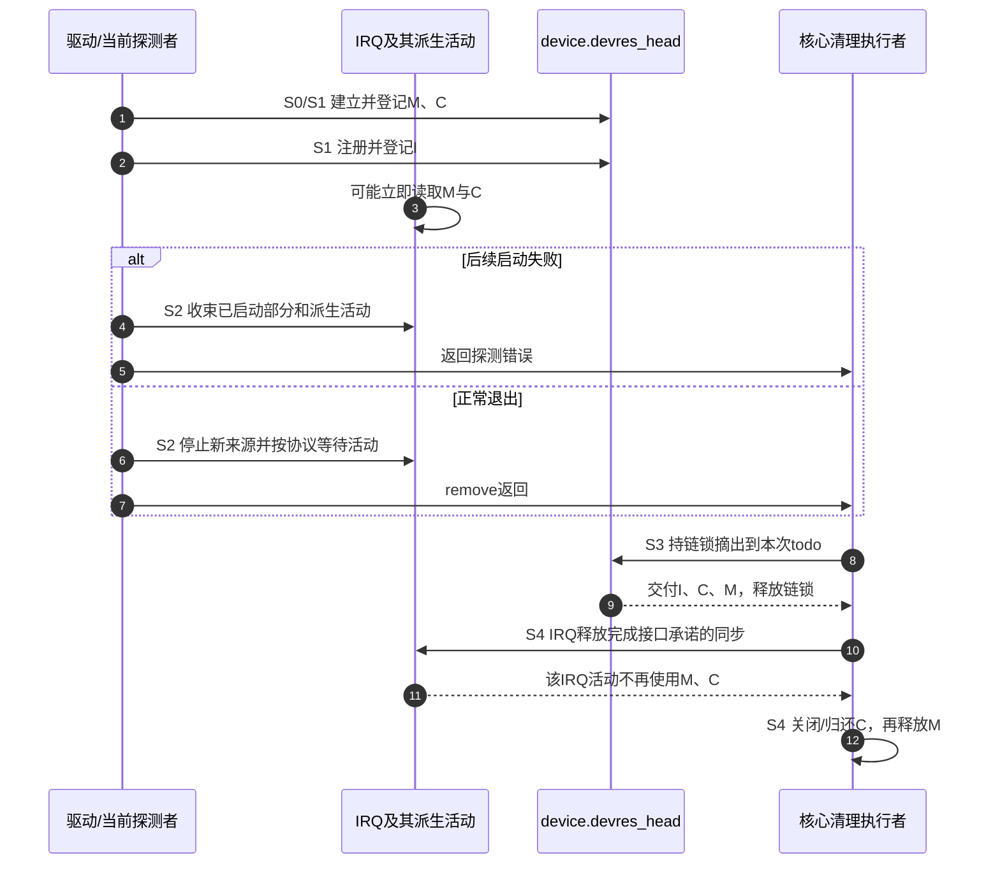

# 第2章\_托管资源与使用者退出

从[P01资源账本](P01_从失败回滚到设备资源账本.md#1.1_从两条退出路径提取同一份责任)继续：记录已经知道怎样释放资源，为什么仍要单独证明所有使用者已经退出？本章只追踪这条依赖，用完整C模型观察允许handler进入和结束资源之间的窗口。

## 2.1\_定义

内存还活着、时钟已经启用、中断入口已经注册、硬件正在产生事件，是四个可分别变化的事实。devres链保存清理记录，不把这四件事合成一个“设备可用”布尔值。我们需要同时跟踪功能状态、谁可以进入访问路径，以及记录现在归谁处理。

原有关于执行者的问题保留如下：

> 也就是说，每次采用devm接口申请的资源，都会被挂到对应的资源回滚处理任务队列。然后当probe()失败的时候，就讲对应的资源回滚处理任务队列将资源释放。也就是说devm机制有一个守护进程，专门处理devm管理的资源。
>
> 但是由于只是资源回收，并不涉及资源复位操作，所以remove()接口还需要手动复位资源的状态为默认状态。

这里有两处需要修正。第一，devres是内核记录链，不是用户态守护进程，也不是自动提交的工作队列。调用清理函数的当前执行路径取得待清理记录，然后逐个调用回调；回调自身是否等待其他活动，要看其契约。第二，回调可以承担关闭运行状态的工作，不能从“托管”这个分类直接断言它绝不关时钟或电源。

失败的获取并不总会留下记录；optional接口还可能合法返回空值。普通action登记失败时，责任尚在调用者；`_or_reset`失败时则立即执行传入动作。相关固定实现分别见[普通登记](../../../../research/source_reading/devres/source_explanations/drivers/base/devres.c.md#1.1_普通action登记成功才转交责任)与[失败即时执行](../../../../research/source_reading/devres/source_explanations/include/linux/device.h.md#1.1_reset包装失败直接执行)。

## 2.2\_职责边界(必须区分的两类操作)

先沿“取得与最终清理”这一轴分类，再沿“日常运行与暂停恢复”这一轴分类。两轴彼此独立：句柄可以由devm取得，运行状态可以由驱动反复改变，也可以由某个带enabled后缀的包装在单个绑定周期内取得并最终撤销。

| 具体动作 | 成功后成立的责任 | 没有由此自动成立的保证 |
| --- | --- | --- |
| `devm_kzalloc` | 最终释放这块内存 | 所有持有其地址的任务已经退出 |
| `devm_clk_get` | 最终归还时钟句柄 | 时钟已准备、使能或将在退出时disable |
| `devm_clk_get_enabled` | 准备使能成功，并登记关闭和归还 | 每次运行时电源管理转换都自动配对 |
| `devm_request_threaded_irq` | 注册成功后登记IRQ释放 | 本设备事件源、DMA与handler派生worker全部停止 |
| 自定义action | 成功登记后执行指定函数和数据 | 任意清理函数都能用于当前上下文，或数据自动得到保活 |

PM指Power Management（电源管理）。反复的suspend/resume与最终解绑不是同一周期；最终关闭记录不能未经协调地再消费一次已经由暂停路径消费的责任。时钟包装怎样把exit和clk保存在同一条记录，见[实现说明](../../../../research/source_reading/devres/source_explanations/drivers/clk/clk-devres.c.md#1.2_退出动作先于句柄归还)。

供电、pinctrl、复位、PHY也要这样逐项核对，接口细节统一查[API参考](devres_API说明.md#2.6_时钟%28Common_Clock_Framework%29)。`dma_request_chan`本身不是devm接口，不能列入“调用即自动登记”的集合。

## 2.3\_时序与控制流

在本章场景中，登记顺序为内存M、带启用责任的时钟C、IRQ入口I。成功期间handler使用M和C，所以退出顺序必须允许I先结束。本表回到同一组S0～S4。

| 阶段 | 状态位置、写入者与后续读取者 | 进入或退出条件 |
| --- | --- | --- |
| S0取得 | 驱动/包装取得资源，尚未登记的责任在调用者 | 每一步成功后才可建立对应责任 |
| S1登记 | 包装写记录的release与data，持设备链锁追加到devres_head | 记录成功交付；handler可能在IRQ注册后立即进入 |
| S2停止使用 | 驱动关闭业务来源，处理硬件事件源与派生活动；状态位于驱动和子系统各自结构 | 满足各项资源退出所需前提，不能只看一个stopping标志 |
| S3摘出 | 清理执行者持devres_lock把记录转移到本次调用的todo链 | 账本锁释放，取得本次清理列表 |
| S4清理 | 当前执行者逆序调用I、C、M回调，各子系统消费自己的责任 | I完成所承诺的撤销/同步后才继续C和M |



正常解绑可以经过驱动remove再到devres清理；probe失败不会因为需要回滚就自动调用该驱动的remove。因此，若失败前已经启动了不由记录覆盖的活动，失败分支必须自行收束。固定版本路径见[记录与清理导读](../../../../research/source_reading/devres/navigation/P02_记录与分组清理导读.md#2.1_从记录地址追踪S0到S4)。该版本platform_driver的remove为void返回值，也不应继续复制旧的int模板。

还有一个容易遗漏的窗口：停止本设备产生新中断，不等于所有处理函数已经退出。共享线、已开始的处理函数或另一路排队任务可能仍在执行。要在关闭它们依赖的时钟以前，通过相应同步建立“以后不再使用”的证据；devres链锁不会保护每一次寄存器访问。

## 2.4\_与旧机制的差异要点

显式实现把I、C、M的清理写在失败标签和退出函数中；托管实现把同样的依赖顺序编码为记录登记顺序和回调。两者都得证明I结束前C与M有效。把`clk_disable_unprepare`移进remove，却留下托管IRQ稍后才释放，会破坏这个证明：晚到的handler可以在“时钟已停、IRQ未撤”的窗口进入。

反之，也不能宣称“全部留给devres就一定安全”。如果I的处理函数排队了worker，释放IRQ并不自动取消那项worker；若worker需要先关业务门再同步取消，这仍是驱动退出协议的一部分。选择托管减少的是重复记录清理步骤的代码，增加的是每条记录及其管理成本，并没有取消业务协议。

## 2.5\_代码框架(最小充分示例)

下面用完整C程序枚举退出轨迹。它是教学状态模型：布尔值代表资源与运行状态，数组代表三条清理责任，`deliver_interrupt`由主线程主动调用，表示我们刻意把事件放进某个窗口。它不创建真实IRQ、不模拟Linux锁，也不会故意访问失效内存。无效访问只增加计数，便于安全地检查反例。

场景0～3分别在内存、时钟、IRQ、启动阶段失败；场景4正常工作后退出。场景5在时钟准备前放入一次handler，场景6在时钟提前关闭后、IRQ撤销前放入一次handler。先预测两条反例会在哪个条件上失败，再运行程序。

```c
/* 教学状态模型：显式插入事件，不模拟Linux IRQ、锁或真实分配器。 */
#include <assert.h>
#include <stdbool.h>
#include <stdio.h>

enum resource_kind { memory_record, clock_record, irq_record };

struct model {
    enum resource_kind records[3];
    unsigned int count;
    bool memory_live;
    bool clock_on;
    bool irq_registered;
    bool source_running;
    unsigned int invalid_access;
    unsigned int order_errors;
    unsigned int accepted;
};

static void record_resource(struct model *state, enum resource_kind resource)
{
    assert(state->count < 3);
    state->records[state->count++] = resource;
}

static void deliver_interrupt(struct model *state)
{
    /* 已撤销的入口不再接受调用；已登记不意味着所需状态已准备好。 */
    if (!state->irq_registered)
        return;
    if (!state->memory_live || !state->clock_on) {
        ++state->invalid_access;
        return; /* 只记录反例，不真的访问失效内存或硬件。 */
    }
    ++state->accepted;
}

static void release_records(struct model *state)
{
    while (state->count != 0) {
        switch (state->records[--state->count]) {
        case irq_record:
            /* 本模型要求先停止本设备事件源；不声称free_irq会替代该动作。 */
            if (state->source_running)
                ++state->order_errors;
            state->irq_registered = false;
            putchar('I');
            break;
        case clock_record:
            if (state->irq_registered)
                ++state->order_errors;
            state->clock_on = false;
            putchar('C');
            break;
        case memory_record:
            if (state->irq_registered)
                ++state->order_errors;
            state->memory_live = false;
            putchar('M');
            break;
        }
    }
}

static void run_case(unsigned int scenario)
{
    struct model state = {0};
    printf("case %u release=", scenario);
    if (scenario == 0) /* 内存取得失败，尚无已登记责任。 */
        goto finish;
    state.memory_live = true;
    record_resource(&state, memory_record);
    if (scenario == 1) /* 时钟取得或准备失败。 */
        goto finish;

    if (scenario == 5) {
        /* 反例一：时钟尚未准备，就允许handler被调用。 */
        state.irq_registered = true;
        deliver_interrupt(&state);
        state.irq_registered = false;
    }
    state.clock_on = true;
    record_resource(&state, clock_record);
    if (scenario == 2) /* IRQ登记失败，时钟责任仍已成立。 */
        goto finish;
    state.irq_registered = true;
    record_resource(&state, irq_record);
    deliver_interrupt(&state); /* 允许登记后立即到来的事件。 */
    if (scenario == 3) /* 启动失败的本模型保证事件源没有运行。 */
        goto finish;
    state.source_running = true;
    deliver_interrupt(&state);
    state.source_running = false; /* 先停止本设备源；实际驱动还要排空活动。 */
    if (scenario == 6) {
        /* 反例二：入口尚在就关时钟，已有或迟到的handler仍可能进入。 */
        state.clock_on = false;
        deliver_interrupt(&state);
        state.clock_on = true; /* 恢复模型，随后按正确顺序收束。 */
    }

finish:
    release_records(&state);
    deliver_interrupt(&state); /* 入口撤销后应拒绝，不读取已结束的资源。 */
    assert(!state.memory_live && !state.clock_on && !state.irq_registered);
    assert(!state.source_running && state.count == 0);
    assert(state.order_errors == 0);
    assert(state.invalid_access == (scenario >= 5 ? 1U : 0U));
    assert(state.accepted == (scenario < 3 ? 0U : scenario == 3 ? 1U : 2U));
    printf(" accepted=%u invalid=%u\n", state.accepted, state.invalid_access);
}

int main(void)
{
    for (unsigned int scenario = 0; scenario < 7; ++scenario)
        run_case(scenario);
    puts("7 explicit event traces passed; no kernel or hardware execution");
    return 0;
}
```

源码可直接取用[devres_shutdown.c](../../../../labs/kernel/object_lifetime/materials/devres_shutdown.c)。在仓库根目录的C开发环境中执行：

```bash
cc -std=c11 -Wall -Wextra -Werror -O2 \
  labs/kernel/object_lifetime/materials/devres_shutdown.c -o /tmp/devres_shutdown
/tmp/devres_shutdown
```

预期输出如下；M表示结束内存责任，C表示结束时钟责任，I表示撤销中断入口责任。

```text
case 0 release= accepted=0 invalid=0
case 1 release=M accepted=0 invalid=0
case 2 release=CM accepted=0 invalid=0
case 3 release=ICM accepted=1 invalid=0
case 4 release=ICM accepted=2 invalid=0
case 5 release=ICM accepted=2 invalid=1
case 6 release=ICM accepted=2 invalid=1
7 explicit event traces passed; no kernel or hardware execution
```

第一行没有清理字符，因为没有成功取得的资源。第二、三行的不同前缀来自成功阶段不同，不是“所有失败都做同样清理”。最后两行虽然最终清理顺序也是ICM，却已经在生命周期中间发生了非法使用窗口：最终没有泄漏不能证明运行过程正确。

本模型故意限定“启动失败不留下运行中的事件源”。真实启动函数如果部分成功后失败，应在错误返回前撤销已启动部分，或把该责任可靠地交给后续回滚路径。不能拿模型的这个前提替真实硬件作保证。

## 2.6\_分阶段初始化的回滚(可选增强)

假如M属于整个绑定期，而C与I属于可以尝试后撤销的阶段，可以在取得M后open组，把C与I放入该范围。阶段失败时release组真正清理I、C；保留阶段成果但不再需要组标记时remove组只拿走标记。close只是限定结束位置，不表示从此无法回滚。

分组改变的是“本次选哪些记录”，不改变使用者退出要求。即使只释放一个阶段，也要先让使用C与I的路径停止。完整分组程序已经在[资源账本实验](P01_从失败回滚到设备资源账本.md#1.5_运行完整C模型观察六条路径)中给出，本节沿用其结果，不另写一份省略错误出口的驱动。

## 2.7\_何时不使用\_devm

先画实际使用终点。若旧文件实例必须在解绑后保留私有外壳，外壳就需要独立拥有协议；它可以保存“硬件已移除”的状态，但不能继续借用已随解绑结束的寄存器映射。跨设备共享也须明确实际拥有者，不能仅把一个托管地址复制给别人就认为寿命自动延长。

只有“想提前释放”并不必然排除devm：许多资源族有配套托管释放接口，action和分组也能按契约提前结束。应比较该接口是否覆盖真实需求、记录是否同时撤销以及使用者是否已退出。没有适当设备拥有者，或者资源本身遵循另一套独立生命期时，再选择显式管理。

## 2.8\_验证与排查

按三个递进问题修改上面的程序：

1. 只把IRQ记录放到时钟记录之前，保持handler依赖不变。退出时哪个断言应先报错？这检验你是否理解“登记顺序编码退出依赖”。
2. 新增一个由handler启动、仍需时钟的worker状态。应在哪个退出阶段等待它？仅把irq_registered置false能否证明worker退出？先画时间线，再增添断言。
3. 让启动失败时source_running仍为true。需要给失败出口增加什么步骤，才能继续保证最终状态？这检验部分成功后的回滚责任。

第一题的预期是先处理C时仍看到IRQ已注册，order_errors增加；第二题要为worker的存储、创建入口与完成证据建立独立协议，模型目前没有实现；第三题需在交出清理责任前停止部分启动的来源，不能仅把断言删掉。

七条顺序轨迹是对因果模型的检验，不是并发压力测试。真实驱动仍需在适用配置下构建，并在可恢复的目标上核对探测失败、解绑、回调同步及硬件状态。本批没有执行这些目标运行验证，也不能根据VM已开启就把它们记为通过。

## 2.9\_结论

到这里可以证明的是：每条成功登记的责任有明确的消费路径，回滚集合由已成功阶段决定，而释放顺序必须服从仍在运行的使用者。尚不能从这些结论推导应用路径、权限和设备策略已经准备好。

下一步转向[用户态设备策略](../../../system_software/P01_设备事件与用户态策略.md#1.1_定义与分层位置)。进入之前保留两个问题：事件到达管理器与规则处理结束是否相同？节点已经存在与应用可以成功使用设备是否相同？回答它们需要继续追踪发布、事件与用户态策略，而不是再换一种资源分配API。
