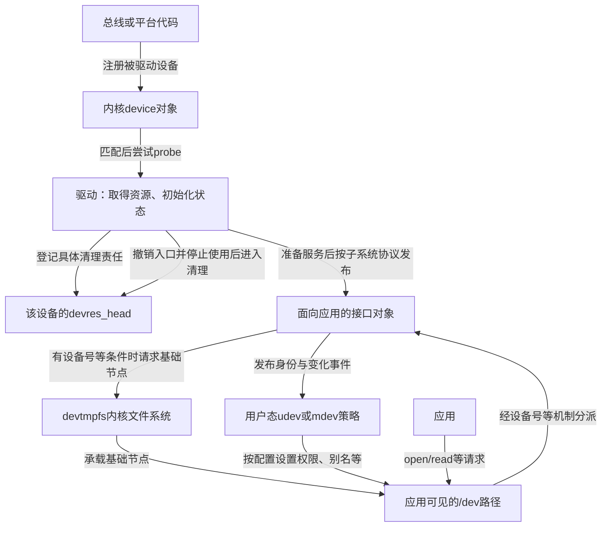
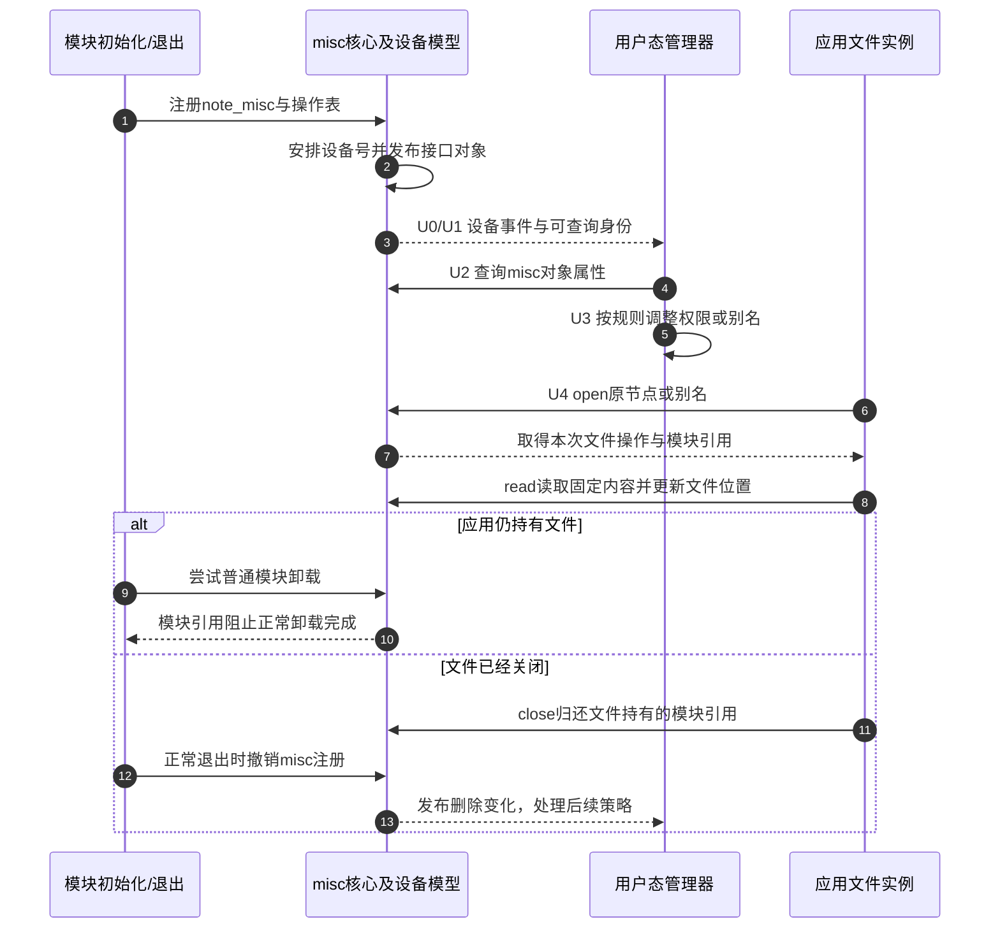
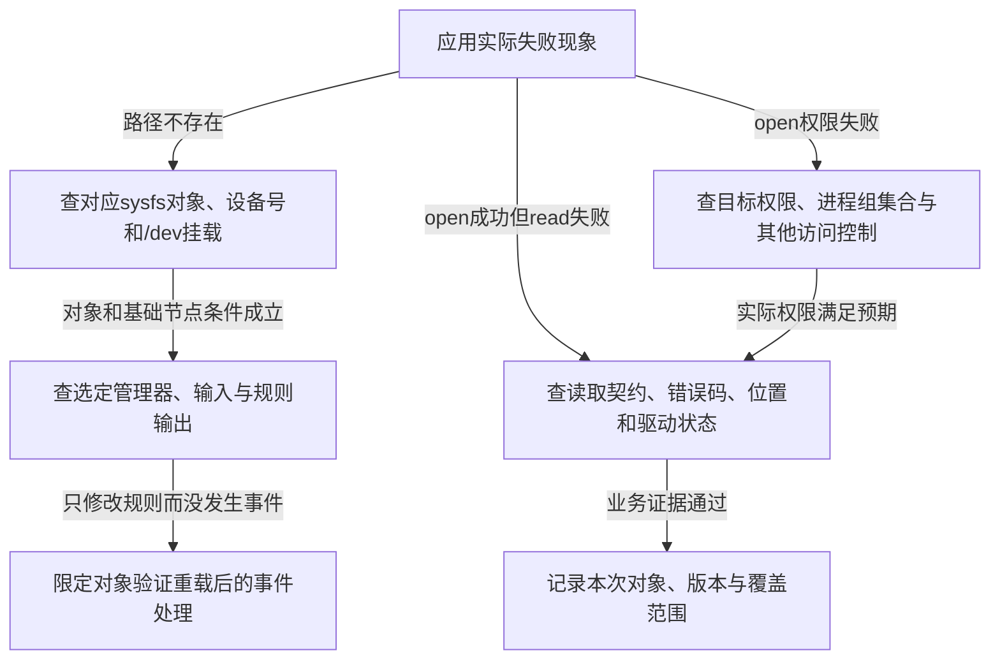

# 第3章\_驱动资源与用户态访问的协作

在[资源账本](P01_从失败回滚到设备资源账本.md#1.1_从两条退出路径提取同一份责任)中，我们已经知道：成功登记一条清理记录，才能把对应的退出责任交给设备核心。现在把视野扩大到整条访问路径。驱动已经能访问寄存器，为什么应用仍可能打不开设备？`/dev` 下已经有名字，为什么又不能据此断言驱动准备完成？

本章先建立这些对象所在的层次；[P02](P02_托管资源与使用者退出.md#2.3_时序与控制流)用一条中断访问路径检验内核清理顺序。内核接口以仓库固定NXP Linux 6.12.20为边界，首次进入版本证据请读[源码索引](../../../../research/source_reading/devres/navigation/P01_Linux_6.12_devres源码阅读索引.md#1.1_固定版本与阅读任务)。用户态管理器另有版本和配置，不能从内核版本推定其规则语法。

## 3.1\_为什么要同时理解这四个概念

假设驱动要为一颗外设准备寄存器映射、时钟和中断处理函数，再向应用提供字符设备接口。这里有两个相互关联、却不能互相代办的问题。

第一个问题发生在内核：如果申请中断失败，先前取得的时钟由谁归还？如果应用还在请求数据，资源清理能否马上开始？显式申请/释放与devm接口属于这条线。第二个问题发生在访问入口：设备发布了什么身份，系统如何把它组织成路径，哪个用户有权限打开？udev和mdev属于用户态设备策略这条线。

“旧机制”只是旧笔记对非devm接口的称呼，并不表示显式资源管理已经淘汰。一个驱动可以同时使用托管资源与独立拥有的对象。真正的比较依据是 **谁持有责任、责任何时结束**，而不是接口名字是否带有devm。

## 3.2\_一张图看全链路(从硬件到\_/dev)

先分清两个可能不同的device：被总线枚举、等待驱动绑定的设备，以及驱动为应用注册的接口设备。驱动可能在probe中创建后者，但不能把所有设备的add事件都画成probe成功后的产物。



图中的devtmpfs是内核用于承载设备节点的文件系统；它与保存驱动资源记录的devres不是同一机制。是否配置、是否挂载到应用看到的`/dev`、注册对象是否有设备号，都会影响节点的可见性。用户态策略与基础节点创建也不是同一个完成点。

固定版本`device_add`在适用的设备号条件下调用devtmpfs建节点入口，发出add事件，然后才走到总线探测入口。因此“看到了设备add事件”不能普遍证明该设备的驱动已probe成功。反过来，不提供字符或块接口的设备也不必拥有`/dev`节点。完整对象发布路线见[从发布到设备节点](../../device_model/class_sysfs/P03_从发布到设备节点.md)。

## 3.3\_四个关键词的最小定义

沿图中的位置读下面四个名字：前两个改变内核清理责任的归属，后两个处理用户空间的设备策略。名字相近并不意味着它们共享同一份状态。

### 3.3.1\_devm(内核)

devm是device-managed接口家族的惯用前缀，devres是保存、选择和执行资源清理记录的机制。成功的具体接口可能登记内存释放、句柄归还、状态关闭或接口注销。它不是一个“把所有资源都变成安全”的开关：失败返回值、提前退出方法和真正清理的内容，要查[相应接口](devres_API说明.md#第2章_devm_接口_作用与区别%28按子系统%29)。

### 3.3.2\_旧机制(非\_devm)

显式管理把清理责任留在调用者或另一个明确的拥有者手里。例如成功`kzalloc`后，最终需要某条路径执行`kfree`；这条路径可以是失败回滚、独立对象的最后引用回调，也可以是某个阶段的退出。集中编写逆序清理通常比在每个分支复制一遍更容易审查，但责任不会因为采用了`goto`就自动正确。

### 3.3.3\_udev(用户态)

udev在用户空间处理设备事件和规则策略。常见实现为systemd-udevd；eudev是另一实现，不能把两者的所有版本当成同一个程序。sysfs是把内核对象关系与属性呈现给用户空间的文件系统，通常挂载在`/sys`；这些属性、已发布的身份与事件是策略输入，权限、属主和稳定别名等是常见输出。它不能替驱动停止一个仍在使用寄存器的中断处理函数。

### 3.3.4\_mdev(用户态\_BusyBox)

mdev是BusyBox提供的设备管理程序。它可用于精简系统的设备扫描与事件处理；实际运行方式取决于BusyBox功能配置和系统启动脚本。`mdev -s`的扫描与热插拔事件的持续接收是不同工作，执行过一次扫描不证明以后插入设备会得到处理。具体规则和接入方式留到[用户态篇](../../../system_software/P01_设备事件与用户态策略.md#1.1_定义与分层位置)，不能仅凭“占用小”推断本机已经部署好。

## 3.4\_两组核心对比(先给结论)

现在可以把同一层的选择并列起来。先比较同一条退出责任由谁保存，再比较同一类用户态策略由谁执行；跨层的机制不放进一张性能排名表。

### 3.4.1\_devm\_vs\_旧机制(内核资源管理)

| 比较问题 | 托管责任 | 显式责任 |
| --- | --- | --- |
| 成功后把清理信息留在哪里 | 具体接口写入设备资源记录 | 驱动或独立对象保存拥有关系 |
| 后续步骤失败 | 核心处理已登记部分；驱动仍收束未登记与活动部分 | 驱动沿已成功阶段逐项回滚 |
| 正常退出 | 满足停止使用条件后，由对应清理路径消费记录 | 拥有者按实际依赖执行清理 |
| 代价 | 记录分配与管理成本，清理期限受拥有设备约束 | 更多责任追踪代码，需要覆盖每条出口 |
| 选择前提 | 资源期限与设备清理周期相容 | 资源独立存活或明确采用另一套拥有协议 |

这不是“托管默认安全、手动默认危险”的排名。托管减少重复出口，却不减少资源之间真实存在的先后依赖；显式管理保留独立控制权，也就保留证明每条出口正确的义务。

### 3.4.2\_udev\_vs\_mdev(用户态设备管理)

两者是同一层上的策略实现选择。选型要核对现有根文件系统、规则表达能力、事件接收方式、启动组织和诊断工具，而不是预设“桌面一定udev、嵌入式一定mdev”。也不要让两个管理器同时争改同一组设备的权限、名字或脚本动作；系统应明确这些输出由谁负责。

## 3.5\_跨层职责边界\_devm\_vs(udev/mdev)

一次`open`失败至少可能来自三个位置：路径还不存在、访问权限不满足、请求到达驱动后被拒绝。第一种要看对象发布与节点可见性，第二种看实际权限及访问身份，第三种看驱动状态和具体返回错误。把驱动中的普通分配改成devm，并不能直接修复前两类问题；把节点改成全员可写，也不能使一个已经停止的设备重新具备服务能力。

反方向也一样：删除一个路径只限制从该路径发起的新查找，不替已经打开的文件实例完成关闭。旧使用者与绑定期资源怎样分离，继续读[生命周期集成](../integration/大纲.md)。

## 3.6\_一页速用模板(实操起点)

本节用退出顺序代替一个省略错误检查的“大而全probe”。先把handler会读取的东西列出来：私有内存、寄存器映射、让这些寄存器可访问的运行条件。它们必须在允许handler执行之前成立，且必须保持到handler不再使用它们之后。

这里IRQ（Interrupt Request，中断请求）对应设备通知CPU处理事件的路径，handler就是该路径调用的处理函数。对“中断处理需要时钟开启”的本章设备，可以先建立内存和映射，再准备时钟，随后注册IRQ，最后允许本设备产生事件。清理时停止新事件源，按协议处理活动，再撤销IRQ，最后关时钟、结束映射与内存。共享IRQ、排队worker和DMA会增加额外退出条件，不能只套这几个名字。

原有问题保留如下：

> 在讲解“1.6.1 `devm` 风格的 `probe()/remove()`”中，这里的回滚和资源清除是通过remove接口完成的，而你上文提到的会自动管理和清除资源是指：在没有remove接口的时候或者remove清除不完整的时候，devm机制也会自动接手隐式清除操作吗？

正常解绑的核心路径会处理已登记记录，这不以驱动逐项手写释放为前提。但“接手”容易让人误以为核心会检查remove漏掉什么，再智能补齐。它实际只执行记录里已经写好的动作；漏登记的关闭、仍在运行的任务以及错误的依赖顺序不会被推理出来。[P02](P02_托管资源与使用者退出.md#2.3_时序与控制流)把这几个时间点放进同一轮流程。

用户态规则示例集中在[用户态篇](../../../system_software/P01_设备事件与用户态策略.md#1.1_定义与分层位置)查询。规则中的子系统名必须来自真实设备身份，“字符设备”这一访问类型不等于一个通用的`SUBSYSTEM=="char"`匹配值。

## 3.7\_调试与评审\_Checklist

先核对同一张责任表：每个成功步骤写出取得了什么、谁清理、何时清理，以及哪些执行者还可能使用。对失败分支问“哪些步骤已经成功”，对正常退出问“哪些使用者还没退出”，对用户态问题问“实际失败停在路径、权限还是驱动”。

模块反复装卸和故障注入只应在可恢复的实验环境中开展；检查器没有报告，还需要配置、覆盖路径和检查器有效性的证据。不要为了证明时钟需要关闭，就在真实设备上删掉清理步骤再把硬件异常当作必然输出。先用[P02的C模型](P02_托管资源与使用者退出.md#2.5_代码框架%28最小充分示例%29)建立不会触碰硬件的反例。

## 3.8\_本书使用方式与约定

先读[P02退出依赖](P02_托管资源与使用者退出.md#2.3_时序与控制流)，再读[用户态篇](../../../system_software/P01_设备事件与用户态策略.md#1.1_定义与分层位置)的用户态事件与策略，最后把两层合起来定位问题。本篇沿用S0取得、S1登记、S2停止使用、S3摘出记录、S4执行清理的阶段名；它们组织的是同一轮责任转移，不代表真实驱动只有一个状态变量。

“状态”也不是devm能否处理的分界线。`devm_clk_get`只取得句柄，而`devm_clk_get_enabled`还准备使能并登记对应逆操作；自定义action也可以关闭状态。正确问题始终是：**这个具体接口成功登记了什么？**

前面已分别建立S0～S4资源退出和U0～U4用户态策略。本章把它们放到一个可操作的案例中，但不再用省略错误检查的硬件驱动拼接“完整流程”。先复用[完整misc问候设备](../../../driver_model/misc/readme.md#1.3_完整程序与返回契约)建立接口与路径的关系，再说明换成真实外设后还要补哪些退出证据。该模块的代码、构建与读取契约是本章先修，不在这里维护第二份驱动。

## 3.9\_角色与接口边界

实验设备名为note_misc，内容固定，不访问GPIO、时钟或其他硬件。模块内的miscdevice保存服务名字、操作表和默认模式；misc核心注册一个misc类设备，用户态管理器再依据真实身份应用规则。它不是platform设备，不能把“模块初始化成功”写成“某个硬件probe成功”。

默认模式0600来自示例中的mode字段，说明内核也参与基础节点的名称和权限输入；用户态规则可以施加后续策略。因此“节点名字和权限完全不在内核控制范围”是错误划分。另一方面，这个模块没有devm资源，不影响我们观察设备发布和权限：devres不是创建字符节点的必选前置。

## 3.10\_端到端流程与两条结束线



这是本实验模块的正常模块引用路径，不是任意设备解绑的通用保证。真实硬件可以在文件仍打开时被移除；它需要独立的对象寿命和“硬件已不可用”的访问协议。不能把本图的模块卸载受阻推论成devm内存也会等待所有旧文件关闭，详见[生命周期集成](../integration/大纲.md)。

## 3.11\_驱动侧准备与失败定位

按misc教材构建、加载note_misc，再检查`/sys/class/misc/note_misc`及其中的dev属性。模块注册失败时，先记录模块返回错误和内核日志；没有已发布的note_misc对象，用户态就没有这个对象可匹配。若对象存在但节点不可见，继续检查设备号、devtmpfs挂载或实际节点管理，而不是换一个分配API。

从本实验迁移到硬件驱动时，再加入映射、时钟、IRQ与业务门。硬件资源必须先满足访问前提，才能对外发布相应业务；失败后分别撤销已经发布的接口和已经取得的资源。IRQ与时钟的顺序沿[七轨迹模型](P02_托管资源与使用者退出.md#2.5_代码框架%28最小充分示例%29)检查，不能把本章无硬件模块的退出函数直接复制过去。

## 3.12\_共同的用户态目标

本例要求实际节点由root拥有、users组可读，权限0640；规则不会为设备增加写操作。目标系统必须存在users组，实验应用进程必须实际属于该组。若你的系统使用另一受控组，应同时改规则和预期结果，不以给所有人写权限代替身份配置。

只让选定的管理器负责这组对象。先记录未应用实验规则时的权限与路径，保留规则原文件，实验结束恢复。下面列出两种配置选择，不要求在同一运行系统中叠加部署。

## 3.13\_端到端示例A\_udev策略

确认`udevadm info --attribute-walk --name=/dev/note_misc`或对应sysfs查询显示实际SUBSYSTEM为misc、KERNEL为note_misc，再安装这份完整规则：

```text
# /etc/udev/rules.d/99-note-misc.rules
# users组必须存在；这是只读问候服务，不新增驱动写操作。
SUBSYSTEM=="misc", KERNEL=="note_misc", MODE="0640", GROUP="users", SYMLINK+="note/greeting"
```

它纠正了旧模板把任意字符设备都匹配成char子系统的错误。/dev/note/greeting是别名，不改变设备号，也不改变file_operations。多个名字指向同一设备，并不让两次独立open共享文件位置。

按[规则观察步骤](../../../system_software/P01_设备事件与用户态策略.md#1.3.6_调试命令)重载并仅对所选对象预览、重放；将过滤条件改为misc和note_misc。或者在隔离实验中先安装规则，再进行模块注册。不能把整机无筛选trigger作为每次文档实验的默认动作。

## 3.14\_端到端示例B\_mdev策略

在已经选择并正确接入mdev的实验系统中，把下列行放到能实际匹配的位置；前面若有已终止搜索的宽泛规则，后面的行不会自动生效。

```text
# /etc/mdev.conf的实验条目：只为这个节点设置权限。
^note_misc$  root:users  0640
```

本方案仅承诺原节点权限，不承诺创建udev方案的note/greeting链接。若业务依赖相同别名，需要另行完成创建、删除、重建与同名冲突协议，不能引用一个尚未提供的post脚本假装实现完成。已有[重命名与链接方向](../../../system_software/P01_设备事件与用户态策略.md#1.6.2_mdev_方案)说明为什么mdev的>path不能无条件视为等价替换。

由该实验系统已经选定的持续事件路径处理模块注册/撤销，并验证下一次启动的初始扫描。不要为运行本例直接覆盖生产系统的hotplug设置，也不要在已有管理器旁启动第二个守护进程。

## 3.15\_从现象选择排查入口



排查时同时保留成功证据。例如节点存在已经排除了“所有节点都未创建”，但没有排除别名指向错误设备；open成功已经通过了一次权限与分派检查，但read仍可能因协议、位置或驱动状态失败。不要用后一条失败推翻前面已经观测到的所有状态。

## 3.16\_用实际读取补齐策略检查

使用已有的完整C测试[misc_probe.c](../../../../labs/kernel/driver_entries/materials/misc_probe.c)，它检查分段读取、文件结束与重新打开的位置。先按教材构建匹配目标架构的程序；下面在目标环境已有C编译器的前提下执行，非root应用身份用于检验组权限。

```bash
cc -std=c11 -Wall -Wextra -Werror -O2 \
  labs/kernel/driver_entries/materials/misc_probe.c -o /tmp/misc_probe
# 节点类型、权限和设备号需检查真实目标，不能只看符号链接自身。
stat -L -c '%F %a %U %G %t:%T' /dev/note_misc
id
/tmp/misc_probe
```

元数据命令要求目标stat支持这些选项；先核对本机帮助。C程序的预期读取长度为5、11、0、16，分别对应前缀、余下内容、文件结束，以及第二次open后的完整内容。这里列的是期望，不是本批目标实测日志。

udev方案还应对别名执行`stat -L`，比较原节点与别名的设备号；mdev最小方案只检查原节点。原来的“test -e再用grep找权限片段”不能证明对象是字符设备，也不能防止把链接权限误当作目标权限，因此这里分别验证类型、身份、权限和读取结果。

## 3.17\_退出与回归不只看节点消失

按正常顺序关闭测试程序的文件，再卸载模块，观察sysfs对象及所选管理器负责的路径。不要强制卸载以跳过模块引用保证。随后重复加载，确认新一次注册的设备号和策略结果，而不是假定上次动态次号永远不变。

对于后来替换成真实硬件的版本，应再分别覆盖probe阶段失败、部分启动后的回滚、解绑与旧文件访问、运行时PM循环，以及IRQ/worker等使用者退出。动态检查器只有在适用配置、有效运行与相关路径覆盖下才能提供有限证据，不能把“无告警”写成一切生命周期正确。

恢复时还原本次修改的规则，重载或按该系统既有机制恢复策略，再核对实际结果。只删除实验模块不会自动恢复你改过的用户态配置。保留原始失败日志及恢复后的检查，才能区分规则、内核状态和测试环境各自的变化。

## 3.18\_回顾与继续阅读

先回答三道迁移题：把别名改了会不会改变devres清理时机？把规则改成0666会不会为没有write回调的服务增加写能力？普通模块卸载因打开文件受阻，能否证明硬件解绑也会等待该文件？

三个问题的答案都不能靠名字推出。别名改变路径组织，模式影响访问检查，文件操作决定服务能力；模块引用与硬件资源期限又属于不同协议。下一步进入[生命周期集成](../integration/大纲.md)，把设备外壳、绑定期、私有对象和旧用户放到同一张责任图里。

本例复用已存在的完整模块与C测试，核对了源码和访问契约；本批没有在目标加载模块、执行规则、读设备或做卸载/恢复试验。读者实验应记录实际内核构建身份、用户态版本、配置、输入与输出，不能把本章预期写成测试报告。

## 3.19\_按资源责任进入接口参考

接口原型、返回形式与清理动作已在[devres API参考](devres_API说明.md#第2章_devm_接口_作用与区别%28按子系统%29)按固定Linux 6.12.20逐族核对。这里按需要解决的问题导航，不维护第二份逐接口说明。

| 需要解决的问题 | 查询入口 |
| --- | --- |
| action登记失败与分阶段回滚 | [核心机制与分组](devres_API说明.md#2.1_核心机制_/_分组接口) |
| 内存、数组、字符串与复制 | [内存与字符串](devres_API说明.md#2.2_内存与字符串) |
| 基础映射、区域占用与平台资源 | [I/O映射](devres_API说明.md#2.3_I/O_资源与寄存器映射) |
| GPIO描述符、可选缺席与索引 | [GPIO](devres_API说明.md#2.4_GPIO%28gpiod_消费者%29) |
| 普通/线程化IRQ与提前释放 | [IRQ](devres_API说明.md#2.5_IRQ) |
| 单个/批量时钟与带启用包装 | [时钟](devres_API说明.md#2.6_时钟%28Common_Clock_Framework%29) |
| 供电句柄、optional与启用责任 | [Regulator](devres_API说明.md#2.7_电源%28Regulator%29) |
| 独占、共享与可选复位 | [Reset](devres_API说明.md#2.8_Reset_控制) |
| DMA通道的显式退出协议 | [DMA](devres_API说明.md#2.9_DMA_引擎) |
| PHY获取与独立初始化/供电 | [PHY](devres_API说明.md#2.10_PHY) |
| pinctrl句柄与状态选择 | [pinctrl](devres_API说明.md#2.11_pinctrl) |
| 资源描述与IRQ号查询 | [platform查询](devres_API说明.md#2.12_平台辅助_中断号/资源获取%28非_devm_但常与_devm_组合%29) |
| LED与thermal注册的不同返回值 | [注册接口](devres_API说明.md#2.13_注册类%28示例%29) |

使用参考页前，先回答资源期限、成功责任、失败责任、异步使用终点和提前清理方式五个问题。PM周期与最终退出分开；需要独立寿命的对象应有独立拥有者。这样查询得到的函数名才能放回一个可证明的生命周期中。
