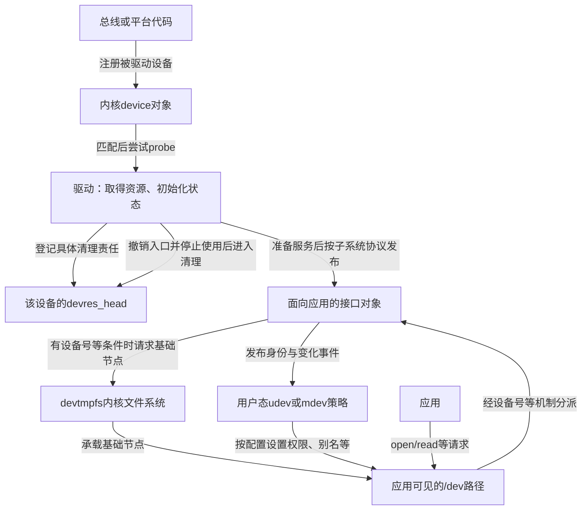
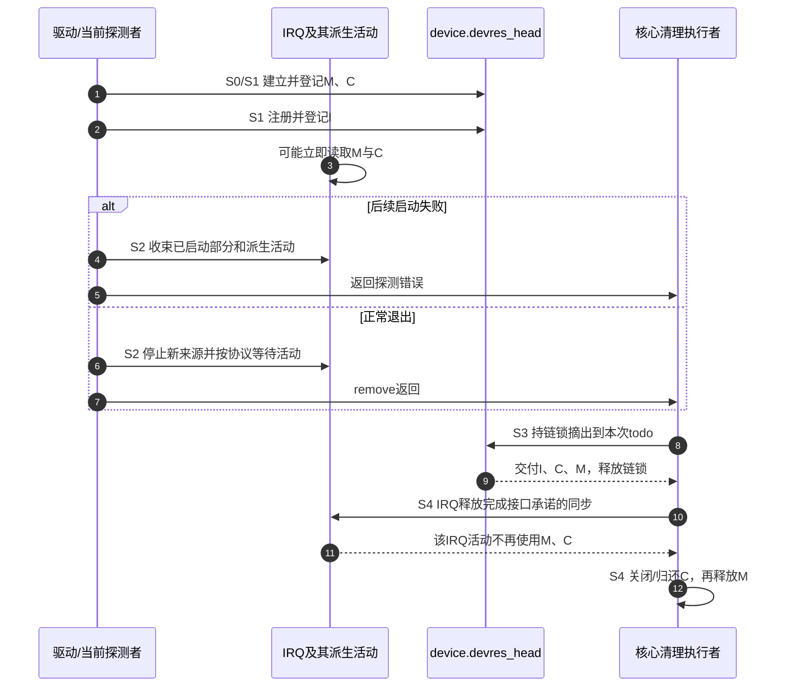
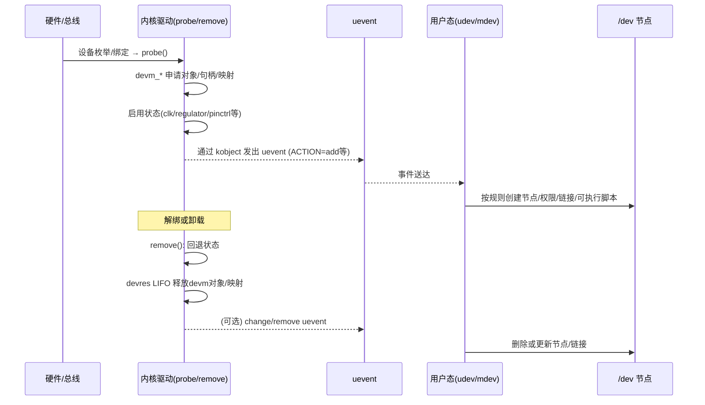
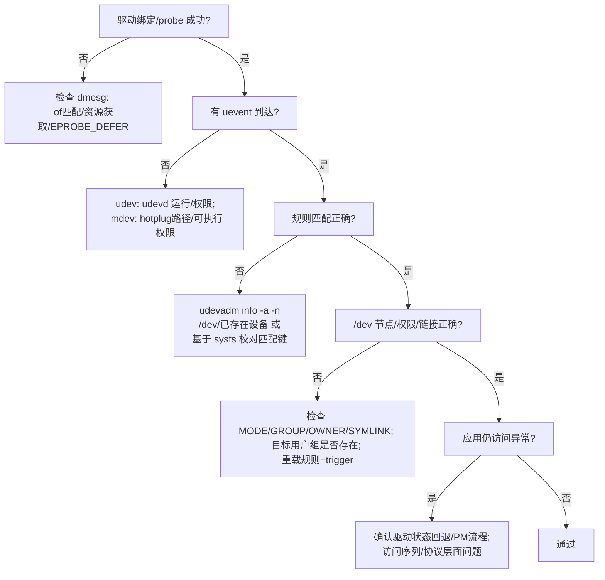

# 第1章\_内核资源管理与用户态设备管理的全景与对比

在[资源账本](P01_从失败回滚到设备资源账本.md#1.1_从两条退出路径提取同一份责任)中，我们已经知道：成功登记一条清理记录，才能把对应的退出责任交给设备核心。现在把视野扩大到整条访问路径。驱动已经能访问寄存器，为什么应用仍可能打不开设备？`/dev` 下已经有名字，为什么又不能据此断言驱动准备完成？

本章先建立这些对象所在的层次；第2章用一条中断访问路径检验内核清理顺序。内核接口以仓库固定NXP Linux 6.12.20为边界，首次进入版本证据请读[源码索引](../../../../research/source_reading/devres/navigation/P01_Linux_6.12_devres源码阅读索引.md#1.1_固定版本与阅读任务)。用户态管理器另有版本和配置，不能从内核版本推定其规则语法。

## 1.1\_为什么要同时理解这四个概念

假设驱动要为一颗外设准备寄存器映射、时钟和中断处理函数，再向应用提供字符设备接口。这里有两个相互关联、却不能互相代办的问题。

第一个问题发生在内核：如果申请中断失败，先前取得的时钟由谁归还？如果应用还在请求数据，资源清理能否马上开始？显式申请/释放与devm接口属于这条线。第二个问题发生在访问入口：设备发布了什么身份，系统如何把它组织成路径，哪个用户有权限打开？udev和mdev属于用户态设备策略这条线。

“旧机制”只是旧笔记对非devm接口的称呼，并不表示显式资源管理已经淘汰。一个驱动可以同时使用托管资源与独立拥有的对象。真正的比较依据是 **谁持有责任、责任何时结束**，而不是接口名字是否带有devm。

## 1.2\_一张图看全链路(从硬件到\_/dev)

先分清两个可能不同的device：被总线枚举、等待驱动绑定的设备，以及驱动为应用注册的接口设备。驱动可能在probe中创建后者，但不能把所有设备的add事件都画成probe成功后的产物。



图中的devtmpfs是内核用于承载设备节点的文件系统；它与保存驱动资源记录的devres不是同一机制。是否配置、是否挂载到应用看到的`/dev`、注册对象是否有设备号，都会影响节点的可见性。用户态策略与基础节点创建也不是同一个完成点。

固定版本`device_add`在适用的设备号条件下调用devtmpfs建节点入口，发出add事件，然后才走到总线探测入口。因此“看到了设备add事件”不能普遍证明该设备的驱动已probe成功。反过来，不提供字符或块接口的设备也不必拥有`/dev`节点。完整对象发布路线见[从发布到设备节点](../../device_model/class_sysfs/P03_从发布到设备节点.md)。

## 1.3\_四个关键词的最小定义

沿图中的位置读下面四个名字：前两个改变内核清理责任的归属，后两个处理用户空间的设备策略。名字相近并不意味着它们共享同一份状态。

### 1.3.1\_devm(内核)

devm是device-managed接口家族的惯用前缀，devres是保存、选择和执行资源清理记录的机制。成功的具体接口可能登记内存释放、句柄归还、状态关闭或接口注销。它不是一个“把所有资源都变成安全”的开关：失败返回值、提前退出方法和真正清理的内容，要查[相应接口](devres_API说明.md#第2章_devm_接口_作用与区别%28按子系统%29)。

### 1.3.2\_旧机制(非\_devm)

显式管理把清理责任留在调用者或另一个明确的拥有者手里。例如成功`kzalloc`后，最终需要某条路径执行`kfree`；这条路径可以是失败回滚、独立对象的最后引用回调，也可以是某个阶段的退出。集中编写逆序清理通常比在每个分支复制一遍更容易审查，但责任不会因为采用了`goto`就自动正确。

### 1.3.3\_udev(用户态)

udev在用户空间处理设备事件和规则策略。常见实现为systemd-udevd；eudev是另一实现，不能把两者的所有版本当成同一个程序。sysfs是把内核对象关系与属性呈现给用户空间的文件系统，通常挂载在`/sys`；这些属性、已发布的身份与事件是策略输入，权限、属主和稳定别名等是常见输出。它不能替驱动停止一个仍在使用寄存器的中断处理函数。

### 1.3.4\_mdev(用户态\_BusyBox)

mdev是BusyBox提供的设备管理程序。它可用于精简系统的设备扫描与事件处理；实际运行方式取决于BusyBox功能配置和系统启动脚本。`mdev -s`的扫描与热插拔事件的持续接收是不同工作，执行过一次扫描不证明以后插入设备会得到处理。具体规则和接入方式留到第3章，不能仅凭“占用小”推断本机已经部署好。

## 1.4\_两组核心对比(先给结论)

现在可以把同一层的选择并列起来。先比较同一条退出责任由谁保存，再比较同一类用户态策略由谁执行；跨层的机制不放进一张性能排名表。

### 1.4.1\_devm\_vs\_旧机制(内核资源管理)

| 比较问题 | 托管责任 | 显式责任 |
| --- | --- | --- |
| 成功后把清理信息留在哪里 | 具体接口写入设备资源记录 | 驱动或独立对象保存拥有关系 |
| 后续步骤失败 | 核心处理已登记部分；驱动仍收束未登记与活动部分 | 驱动沿已成功阶段逐项回滚 |
| 正常退出 | 满足停止使用条件后，由对应清理路径消费记录 | 拥有者按实际依赖执行清理 |
| 代价 | 记录分配与管理成本，清理期限受拥有设备约束 | 更多责任追踪代码，需要覆盖每条出口 |
| 选择前提 | 资源期限与设备清理周期相容 | 资源独立存活或明确采用另一套拥有协议 |

这不是“托管默认安全、手动默认危险”的排名。托管减少重复出口，却不减少资源之间真实存在的先后依赖；显式管理保留独立控制权，也就保留证明每条出口正确的义务。

### 1.4.2\_udev\_vs\_mdev(用户态设备管理)

两者是同一层上的策略实现选择。选型要核对现有根文件系统、规则表达能力、事件接收方式、启动组织和诊断工具，而不是预设“桌面一定udev、嵌入式一定mdev”。也不要让两个管理器同时争改同一组设备的权限、名字或脚本动作；系统应明确这些输出由谁负责。

## 1.5\_跨层职责边界\_devm\_vs(udev/mdev)

一次`open`失败至少可能来自三个位置：路径还不存在、访问权限不满足、请求到达驱动后被拒绝。第一种要看对象发布与节点可见性，第二种看实际权限及访问身份，第三种看驱动状态和具体返回错误。把驱动中的普通分配改成devm，并不能直接修复前两类问题；把节点改成全员可写，也不能使一个已经停止的设备重新具备服务能力。

反方向也一样：删除一个路径只限制从该路径发起的新查找，不替已经打开的文件实例完成关闭。旧使用者与绑定期资源怎样分离，继续读[生命周期集成](../integration/大纲.md)。

## 1.6\_一页速用模板(实操起点)

本节用退出顺序代替一个省略错误检查的“大而全probe”。先把handler会读取的东西列出来：私有内存、寄存器映射、让这些寄存器可访问的运行条件。它们必须在允许handler执行之前成立，且必须保持到handler不再使用它们之后。

这里IRQ（Interrupt Request，中断请求）对应设备通知CPU处理事件的路径，handler就是该路径调用的处理函数。对“中断处理需要时钟开启”的本章设备，可以先建立内存和映射，再准备时钟，随后注册IRQ，最后允许本设备产生事件。清理时停止新事件源，按协议处理活动，再撤销IRQ，最后关时钟、结束映射与内存。共享IRQ、排队worker和DMA会增加额外退出条件，不能只套这几个名字。

原有问题保留如下：

> 在讲解“1.6.1 `devm` 风格的 `probe()/remove()`”中，这里的回滚和资源清除是通过remove接口完成的，而你上文提到的会自动管理和清除资源是指：在没有remove接口的时候或者remove清除不完整的时候，devm机制也会自动接手隐式清除操作吗？

正常解绑的核心路径会处理已登记记录，这不以驱动逐项手写释放为前提。但“接手”容易让人误以为核心会检查remove漏掉什么，再智能补齐。它实际只执行记录里已经写好的动作；漏登记的关闭、仍在运行的任务以及错误的依赖顺序不会被推理出来。第2章把这几个时间点放进同一轮流程。

用户态规则示例集中在第3章查询。规则中的子系统名必须来自真实设备身份，“字符设备”这一访问类型不等于一个通用的`SUBSYSTEM=="char"`匹配值。

## 1.7\_调试与评审\_Checklist

先核对同一张责任表：每个成功步骤写出取得了什么、谁清理、何时清理，以及哪些执行者还可能使用。对失败分支问“哪些步骤已经成功”，对正常退出问“哪些使用者还没退出”，对用户态问题问“实际失败停在路径、权限还是驱动”。

模块反复装卸和故障注入只应在可恢复的实验环境中开展；检查器没有报告，还需要配置、覆盖路径和检查器有效性的证据。不要为了证明时钟需要关闭，就在真实设备上删掉清理步骤再把硬件异常当作必然输出。先用下一章不会触碰硬件的C模型建立反例。

## 1.8\_本书使用方式与约定

先读第2章的退出依赖，再读第3章的用户态事件与策略，最后把两层合起来定位问题。本篇沿用S0取得、S1登记、S2停止使用、S3摘出记录、S4执行清理的阶段名；它们组织的是同一轮责任转移，不代表真实驱动只有一个状态变量。

“状态”也不是devm能否处理的分界线。`devm_clk_get`只取得句柄，而`devm_clk_get_enabled`还准备使能并登记对应逆操作；自定义action也可以关闭状态。正确问题始终是：**这个具体接口成功登记了什么？**

# 第2章\_devm\_与旧机制(非\_devm)\_定义\_流程\_边界\_示例

## 2.1\_定义

内存还活着、时钟已经启用、中断入口已经注册、硬件正在产生事件，是四个可分别变化的事实。devres链保存清理记录，不把这四件事合成一个“设备可用”布尔值。我们需要同时跟踪功能状态、谁可以进入访问路径，以及记录现在归谁处理。

原有关于执行者的问题保留如下：

> 也就是说，每次采用devm接口申请的资源，都会被挂到对应的资源回滚处理任务队列。然后当probe()失败的时候，就讲对应的资源回滚处理任务队列将资源释放。也就是说devm机制有一个守护进程，专门处理devm管理的资源。
>
> 但是由于只是资源回收，并不涉及资源复位操作，所以remove()接口还需要手动复位资源的状态为默认状态。

这里有两处需要修正。第一，devres是内核记录链，不是用户态守护进程，也不是自动提交的工作队列。调用清理函数的当前执行路径取得待清理记录，然后逐个调用回调；回调自身是否等待其他活动，要看其契约。第二，回调可以承担关闭运行状态的工作，不能从“托管”这个分类直接断言它绝不关时钟或电源。

失败的获取并不总会留下记录；optional接口还可能合法返回空值。普通action登记失败时，责任尚在调用者；`_or_reset`失败时则立即执行传入动作。相关固定实现分别见[普通登记](../../../../research/source_reading/devres/source_explanations/drivers/base/devres.c.md#1.1_普通action登记成功才转交责任)与[失败即时执行](../../../../research/source_reading/devres/source_explanations/include/linux/device.h.md#1.1_reset包装失败直接执行)。

## 2.2\_职责边界(必须区分的两类操作)

先沿“取得与最终清理”这一轴分类，再沿“日常运行与暂停恢复”这一轴分类。两轴彼此独立：句柄可以由devm取得，运行状态可以由驱动反复改变，也可以由某个带enabled后缀的包装在单个绑定周期内取得并最终撤销。

| 具体动作 | 成功后成立的责任 | 没有由此自动成立的保证 |
| --- | --- | --- |
| `devm_kzalloc` | 最终释放这块内存 | 所有持有其地址的任务已经退出 |
| `devm_clk_get` | 最终归还时钟句柄 | 时钟已准备、使能或将在退出时disable |
| `devm_clk_get_enabled` | 准备使能成功，并登记关闭和归还 | 每次运行时电源管理转换都自动配对 |
| `devm_request_threaded_irq` | 注册成功后登记IRQ释放 | 本设备事件源、DMA与handler派生worker全部停止 |
| 自定义action | 成功登记后执行指定函数和数据 | 任意清理函数都能用于当前上下文，或数据自动得到保活 |

PM指Power Management（电源管理）。反复的suspend/resume与最终解绑不是同一周期；最终关闭记录不能未经协调地再消费一次已经由暂停路径消费的责任。时钟包装怎样把exit和clk保存在同一条记录，见[实现说明](../../../../research/source_reading/devres/source_explanations/drivers/clk/clk-devres.c.md#1.2_退出动作先于句柄归还)。

供电、pinctrl、复位、PHY也要这样逐项核对，接口细节统一查[API参考](devres_API说明.md#2.6_时钟%28Common_Clock_Framework%29)。`dma_request_chan`本身不是devm接口，不能列入“调用即自动登记”的集合。

## 2.3\_时序与控制流

在本章场景中，登记顺序为内存M、带启用责任的时钟C、IRQ入口I。成功期间handler使用M和C，所以退出顺序必须允许I先结束。本表回到同一组S0～S4。

| 阶段 | 状态位置、写入者与后续读取者 | 进入或退出条件 |
| --- | --- | --- |
| S0取得 | 驱动/包装取得资源，尚未登记的责任在调用者 | 每一步成功后才可建立对应责任 |
| S1登记 | 包装写记录的release与data，持设备链锁追加到devres_head | 记录成功交付；handler可能在IRQ注册后立即进入 |
| S2停止使用 | 驱动关闭业务来源，处理硬件事件源与派生活动；状态位于驱动和子系统各自结构 | 满足各项资源退出所需前提，不能只看一个stopping标志 |
| S3摘出 | 清理执行者持devres_lock把记录转移到本次调用的todo链 | 账本锁释放，取得本次清理列表 |
| S4清理 | 当前执行者逆序调用I、C、M回调，各子系统消费自己的责任 | I完成所承诺的撤销/同步后才继续C和M |



正常解绑可以经过驱动remove再到devres清理；probe失败不会因为需要回滚就自动调用该驱动的remove。因此，若失败前已经启动了不由记录覆盖的活动，失败分支必须自行收束。固定版本路径见[记录与清理导读](../../../../research/source_reading/devres/navigation/P02_记录与分组清理导读.md#2.1_从记录地址追踪S0到S4)。该版本platform_driver的remove为void返回值，也不应继续复制旧的int模板。

还有一个容易遗漏的窗口：停止本设备产生新中断，不等于所有处理函数已经退出。共享线、已开始的处理函数或另一路排队任务可能仍在执行。要在关闭它们依赖的时钟以前，通过相应同步建立“以后不再使用”的证据；devres链锁不会保护每一次寄存器访问。

## 2.4\_与旧机制的差异要点

显式实现把I、C、M的清理写在失败标签和退出函数中；托管实现把同样的依赖顺序编码为记录登记顺序和回调。两者都得证明I结束前C与M有效。把`clk_disable_unprepare`移进remove，却留下托管IRQ稍后才释放，会破坏这个证明：晚到的handler可以在“时钟已停、IRQ未撤”的窗口进入。

反之，也不能宣称“全部留给devres就一定安全”。如果I的处理函数排队了worker，释放IRQ并不自动取消那项worker；若worker需要先关业务门再同步取消，这仍是驱动退出协议的一部分。选择托管减少的是重复记录清理步骤的代码，增加的是每条记录及其管理成本，并没有取消业务协议。

## 2.5\_代码框架(最小充分示例)

下面用完整C程序枚举退出轨迹。它是教学状态模型：布尔值代表资源与运行状态，数组代表三条清理责任，`deliver_interrupt`由主线程主动调用，表示我们刻意把事件放进某个窗口。它不创建真实IRQ、不模拟Linux锁，也不会故意访问失效内存。无效访问只增加计数，便于安全地检查反例。

场景0～3分别在内存、时钟、IRQ、启动阶段失败；场景4正常工作后退出。场景5在时钟准备前放入一次handler，场景6在时钟提前关闭后、IRQ撤销前放入一次handler。先预测两条反例会在哪个条件上失败，再运行程序。

```c
/* 教学状态模型：显式插入事件，不模拟Linux IRQ、锁或真实分配器。 */
#include <assert.h>
#include <stdbool.h>
#include <stdio.h>

enum resource_kind { memory_record, clock_record, irq_record };

struct model {
    enum resource_kind records[3];
    unsigned int count;
    bool memory_live;
    bool clock_on;
    bool irq_registered;
    bool source_running;
    unsigned int invalid_access;
    unsigned int order_errors;
    unsigned int accepted;
};

static void record_resource(struct model *state, enum resource_kind resource)
{
    assert(state->count < 3);
    state->records[state->count++] = resource;
}

static void deliver_interrupt(struct model *state)
{
    /* 已撤销的入口不再接受调用；已登记不意味着所需状态已准备好。 */
    if (!state->irq_registered)
        return;
    if (!state->memory_live || !state->clock_on) {
        ++state->invalid_access;
        return; /* 只记录反例，不真的访问失效内存或硬件。 */
    }
    ++state->accepted;
}

static void release_records(struct model *state)
{
    while (state->count != 0) {
        switch (state->records[--state->count]) {
        case irq_record:
            /* 本模型要求先停止本设备事件源；不声称free_irq会替代该动作。 */
            if (state->source_running)
                ++state->order_errors;
            state->irq_registered = false;
            putchar('I');
            break;
        case clock_record:
            if (state->irq_registered)
                ++state->order_errors;
            state->clock_on = false;
            putchar('C');
            break;
        case memory_record:
            if (state->irq_registered)
                ++state->order_errors;
            state->memory_live = false;
            putchar('M');
            break;
        }
    }
}

static void run_case(unsigned int scenario)
{
    struct model state = {0};
    printf("case %u release=", scenario);
    if (scenario == 0) /* 内存取得失败，尚无已登记责任。 */
        goto finish;
    state.memory_live = true;
    record_resource(&state, memory_record);
    if (scenario == 1) /* 时钟取得或准备失败。 */
        goto finish;

    if (scenario == 5) {
        /* 反例一：时钟尚未准备，就允许handler被调用。 */
        state.irq_registered = true;
        deliver_interrupt(&state);
        state.irq_registered = false;
    }
    state.clock_on = true;
    record_resource(&state, clock_record);
    if (scenario == 2) /* IRQ登记失败，时钟责任仍已成立。 */
        goto finish;
    state.irq_registered = true;
    record_resource(&state, irq_record);
    deliver_interrupt(&state); /* 允许登记后立即到来的事件。 */
    if (scenario == 3) /* 启动失败的本模型保证事件源没有运行。 */
        goto finish;
    state.source_running = true;
    deliver_interrupt(&state);
    state.source_running = false; /* 先停止本设备源；实际驱动还要排空活动。 */
    if (scenario == 6) {
        /* 反例二：入口尚在就关时钟，已有或迟到的handler仍可能进入。 */
        state.clock_on = false;
        deliver_interrupt(&state);
        state.clock_on = true; /* 恢复模型，随后按正确顺序收束。 */
    }

finish:
    release_records(&state);
    deliver_interrupt(&state); /* 入口撤销后应拒绝，不读取已结束的资源。 */
    assert(!state.memory_live && !state.clock_on && !state.irq_registered);
    assert(!state.source_running && state.count == 0);
    assert(state.order_errors == 0);
    assert(state.invalid_access == (scenario >= 5 ? 1U : 0U));
    assert(state.accepted == (scenario < 3 ? 0U : scenario == 3 ? 1U : 2U));
    printf(" accepted=%u invalid=%u\n", state.accepted, state.invalid_access);
}

int main(void)
{
    for (unsigned int scenario = 0; scenario < 7; ++scenario)
        run_case(scenario);
    puts("7 explicit event traces passed; no kernel or hardware execution");
    return 0;
}
```

源码可直接取用[devres_shutdown.c](../../../../labs/kernel/object_lifetime/materials/devres_shutdown.c)。在仓库根目录的C开发环境中执行：

```bash
cc -std=c11 -Wall -Wextra -Werror -O2 \
  labs/kernel/object_lifetime/materials/devres_shutdown.c -o /tmp/devres_shutdown
/tmp/devres_shutdown
```

预期输出如下；M表示结束内存责任，C表示结束时钟责任，I表示撤销中断入口责任。

```text
case 0 release= accepted=0 invalid=0
case 1 release=M accepted=0 invalid=0
case 2 release=CM accepted=0 invalid=0
case 3 release=ICM accepted=1 invalid=0
case 4 release=ICM accepted=2 invalid=0
case 5 release=ICM accepted=2 invalid=1
case 6 release=ICM accepted=2 invalid=1
7 explicit event traces passed; no kernel or hardware execution
```

第一行没有清理字符，因为没有成功取得的资源。第二、三行的不同前缀来自成功阶段不同，不是“所有失败都做同样清理”。最后两行虽然最终清理顺序也是ICM，却已经在生命周期中间发生了非法使用窗口：最终没有泄漏不能证明运行过程正确。

本模型故意限定“启动失败不留下运行中的事件源”。真实启动函数如果部分成功后失败，应在错误返回前撤销已启动部分，或把该责任可靠地交给后续回滚路径。不能拿模型的这个前提替真实硬件作保证。

## 2.6\_分阶段初始化的回滚(可选增强)

假如M属于整个绑定期，而C与I属于可以尝试后撤销的阶段，可以在取得M后open组，把C与I放入该范围。阶段失败时release组真正清理I、C；保留阶段成果但不再需要组标记时remove组只拿走标记。close只是限定结束位置，不表示从此无法回滚。

分组改变的是“本次选哪些记录”，不改变使用者退出要求。即使只释放一个阶段，也要先让使用C与I的路径停止。完整分组程序已经在[资源账本实验](P01_从失败回滚到设备资源账本.md#1.5_运行完整C模型观察六条路径)中给出，本节沿用其结果，不另写一份省略错误出口的驱动。

## 2.7\_何时不使用\_devm

先画实际使用终点。若旧文件实例必须在解绑后保留私有外壳，外壳就需要独立拥有协议；它可以保存“硬件已移除”的状态，但不能继续借用已随解绑结束的寄存器映射。跨设备共享也须明确实际拥有者，不能仅把一个托管地址复制给别人就认为寿命自动延长。

只有“想提前释放”并不必然排除devm：许多资源族有配套托管释放接口，action和分组也能按契约提前结束。应比较该接口是否覆盖真实需求、记录是否同时撤销以及使用者是否已退出。没有适当设备拥有者，或者资源本身遵循另一套独立生命期时，再选择显式管理。

## 2.8\_验证与排查

按三个递进问题修改上面的程序：

1. 只把IRQ记录放到时钟记录之前，保持handler依赖不变。退出时哪个断言应先报错？这检验你是否理解“登记顺序编码退出依赖”。
2. 新增一个由handler启动、仍需时钟的worker状态。应在哪个退出阶段等待它？仅把irq_registered置false能否证明worker退出？先画时间线，再增添断言。
3. 让启动失败时source_running仍为true。需要给失败出口增加什么步骤，才能继续保证最终状态？这检验部分成功后的回滚责任。

第一题的预期是先处理C时仍看到IRQ已注册，order_errors增加；第二题要为worker的存储、创建入口与完成证据建立独立协议，模型目前没有实现；第三题需在交出清理责任前停止部分启动的来源，不能仅把断言删掉。

七条顺序轨迹是对因果模型的检验，不是并发压力测试。真实驱动仍需在适用配置下构建，并在可恢复的目标上核对探测失败、解绑、回调同步及硬件状态。本批没有执行这些目标运行验证，也不能根据VM已开启就把它们记为通过。

## 2.9\_结论

到这里可以证明的是：每条成功登记的责任有明确的消费路径，回滚集合由已成功阶段决定，而释放顺序必须服从仍在运行的使用者。尚不能从这些结论推导应用路径、权限和设备策略已经准备好。

下一章转向用户态。进入之前保留两个问题：事件到达管理器与规则处理结束是否相同？节点已经存在与应用可以成功使用设备是否相同？回答它们需要继续追踪发布、事件与用户态策略，而不是再换一种资源分配API。

# 第3章\_用户态设备管理\_udev\_与\_mdev\_的通路\_规则与差异

> 目标：给出 `udev` 与 `mdev` 的严格定义、事件通路、规则语法、调试方法与差异；确保从内核 uevent 到 `/dev` 节点生成的各环节均可定位与验证。本章不使用比喻。

------

## 3.1\_定义与分层位置

- **`udev`（systemd-udevd/eudev）**
   用户空间守护进程，监听内核通过 netlink 发送的 **uevent**；依据规则文件创建/删除 **`/dev/\*` 节点**，设置 **权限/属主/组**，创建 **符号链接**，执行 **用户脚本**。
- **`mdev`（BusyBox）**
   用户空间程序，可通过 `/proc/sys/kernel/hotplug` 在热插拔时被内核直接调用，或在启动时执行 `mdev -s` 完成冷插拔扫描；依据 `/etc/mdev.conf` 创建/删除 **`/dev/\*` 节点**，设置权限/属主/组，执行脚本。
- **与内核层的边界**
   `udev`/`mdev` 处理 **uevent → /dev 节点与策略**。它们不管理内核驱动内的资源；与本书第2章的 `devm`/旧机制互不重叠。

------

## 3.2\_全通路流程(内核\_to\_用户态\_to\_/dev)

1. 设备被枚举或状态变化，内核 **kobject** 产生 **uevent**（`ACTION=add/remove/change` 等，携带 `SUBSYSTEM`、`KERNEL` 名、若干 `ATTR{}` 与 `ENV{}`）。
2. `udev`（守护进程）或 `mdev`（由 hotplug 调用或手动扫描）接收事件。
3. 规则匹配：
   - `udev`：匹配 `/etc/udev/rules.d/*.rules`（按文件名排序）。
   - `mdev`：匹配 `/etc/mdev.conf` 正则行。
4. 动作执行：创建/删除节点（mknod）、设置权限/属主/组、创建符号链接、执行脚本。
5. 应用通过 `/dev/*` 访问设备；属性通过 `/sys` 暴露。

------

## 3.3\_udev\_规则与工具

### 3.3.1\_规则文件与优先级

- 目录：`/etc/udev/rules.d/`；文件按 **字典序** 解析，前面的规则先匹配。
- 语法：一行若干 **匹配键** 与 **动作键**，使用逗号分隔。

### 3.3.2\_常用匹配键

- `KERNEL==`：匹配内核设备名（如 `ttyUSB*`、`sda*`）。
- `SUBSYSTEM==`：匹配子系统（如 `tty`、`block`、`gpio`、`net`）。
- `DRIVER==`：匹配驱动名。
- `ATTR{file}==`：匹配 sysfs 属性（相对设备路径）。
- `ATTRS{file}==`：匹配父级设备属性（向上遍历）。
- `ENV{var}==`：匹配环境变量。
- `ACTION==`：匹配 `add`/`remove`/`change`。

### 3.3.3\_常用动作键

- `MODE=`、`OWNER=`、`GROUP=`：设置权限与属主/组（如 `0660`、`root`、`dialout`）。
- `NAME=`：重命名设备节点（慎用，通常保持内核名）。
- `SYMLINK+=`：创建符号链接（推荐用于稳定别名）。
- `RUN+=`：执行脚本或命令（在 `add`/`remove` 时机）。

### 3.3.4\_变量占位

- `%k`：内核名（如 `ttyUSB0`）。
- `%p`：sysfs 设备路径。
- `%E{VAR}`：环境变量。
- 其他变量见 `man udev`。

### 3.3.5\_规则示例

**串口：统一权限与别名**

```text
# /etc/udev/rules.d/99-serial.rules
SUBSYSTEM=="tty", KERNEL=="ttyUSB*", MODE="0660", GROUP="dialout", SYMLINK+="serial/%k"
```

**按 USB VID:PID + 序列号建立稳定名**

```text
SUBSYSTEM=="tty", ATTRS{idVendor}=="0403", ATTRS{idProduct}=="6001", \
  ATTRS{serial}=="A1B2C3D4", SYMLINK+="serial/ftdi-A1B2C3D4"
```

**GPIO chardev：设置组与权限**

```text
# /dev/gpiochipN 归属 gpio 组
KERNEL=="gpiochip*", SUBSYSTEM=="gpio", MODE="0660", GROUP="gpio"
```

### 3.3.6\_调试命令

- 监听事件：
   `udevadm monitor --kernel --udev`
- 查询设备属性与规则匹配依据：
   `udevadm info -a -p $(udevadm info -q path -n /dev/ttyUSB0)`
- 触发冷插拔重放：
   `udevadm trigger`
- 等待规则执行完成：
   `udevadm settle`
- 重载规则：
   `udevadm control --reload-rules`

------

## 3.4\_mdev\_配置与运行方式

### 3.4.1\_启动与触发

- 热插拔：
   `echo /sbin/mdev > /proc/sys/kernel/hotplug`
   内核在设备事件时直接执行 `/sbin/mdev`。
- 冷插拔扫描（启动或必要时）：
   `mdev -s`

### 3.4.2\_配置文件\_/etc/mdev.conf\_语法

- 基本行格式：
   `正则  用户:组  权限  [@|$|*脚本或命令]`
  - `@`：`add` 事件时执行
  - `$`：`remove` 事件时执行
  - `*`：任意事件时执行

**示例：串口与 GPIO 权限**

```text
^ttyUSB[0-9]+$    root:dialout  0660
^gpiochip[0-9]+$  root:gpio     0660   @/usr/sbin/post-add.sh $MDEV
```

### 3.4.3\_初始化脚本片段(BusyBox\_系)

```sh
# /etc/init.d/S10mdev
echo /sbin/mdev > /proc/sys/kernel/hotplug
mdev -s   # 冷插拔扫描
```

### 3.4.4\_环境变量

- `mdev` 触发脚本时常用变量：`$MDEV`（内核名），`$SUBSYSTEM`，`$ACTION` 等，便于脚本内区分场景。

------

## 3.5\_udev\_与\_mdev\_对比

| 维度       | `udev`                                | `mdev`                            |
| ---------- | ------------------------------------- | --------------------------------- |
| 运行模式   | 守护进程（netlink 监听）              | 内核调用可执行文件 / 手动扫描     |
| 规则表达力 | 高：匹配键丰富、可组合                | 中：基于正则，动作有限            |
| 体积与依赖 | 大，依赖 systemd/eudev                | 小，依赖 BusyBox                  |
| 调试工具   | `udevadm monitor/info/trigger/settle` | 通过 `dmesg`、脚本日志、`mdev -s` |
| 适用场景   | 服务器/桌面/完整发行版                | 极简 rootfs/启动时间敏感          |
| 冷插拔     | `udevadm trigger/settle`              | `mdev -s`                         |
| 并存策略   | 与 `mdev` 二选一                      | 与 `udev` 二选一                  |

------

## 3.6\_端到端示例(同一硬件\_两种方案)

目标：USB 转串口 `ttyUSB*`，要求：

- `/dev/serial/%k` 符号链接；
- 权限 `0660`，属组 `dialout`。

### 3.6.1\_udev\_方案

```text
# /etc/udev/rules.d/99-serial.rules
SUBSYSTEM=="tty", KERNEL=="ttyUSB*", MODE="0660", GROUP="dialout", SYMLINK+="serial/%k"
```

验证步骤：

1. `udevadm control --reload-rules`
2. 插拔设备或 `udevadm trigger`
3. `udevadm monitor` 观察事件，`ls -l /dev/serial/ttyUSB*` 核对权限与链接

### 3.6.2\_mdev\_方案

```text
# /etc/mdev.conf
^ttyUSB[0-9]+$    root:dialout  0660
```

验证步骤：

1. `echo /sbin/mdev > /proc/sys/kernel/hotplug`
2. `mdev -s` 或重新插拔
3. `ls -l /dev/ttyUSB*` 核对权限；如需符号链接，使用 `@/path/script.sh $MDEV` 在脚本中创建

------

## 3.7\_故障定位流程

1. **确认驱动是否 `probe()` 成功**
   - `dmesg` 检查绑定日志；若失败，此阶段无需看 `udev/mdev`。
2. **确认事件是否到达用户态**
   - `udev`：`udevadm monitor --kernel --udev` 是否看到 `add/remove`；
   - `mdev`：检查 `dmesg` 中 hotplug 调用，必要时为 `/sbin/mdev` 加 wrapper 打印环境变量。
3. **确认规则是否匹配**
   - `udev`：`udevadm info -a -n /dev/xxx` 查看 `KERNEL/SUBSYSTEM/ATTRS`，逐项比对规则；
   - `mdev`：核对正则表达式与内核名是否匹配。
4. **确认权限与用户组**
   - 目标组（如 `dialout`/`gpio`）是否存在；应用用户是否在该组内。
5. **确认只启用一个设备管理器**
   - 不要同时运行 `udev` 与 `mdev`，避免竞争。
6. **冷插拔流程是否执行**
   - `udev`：`udevadm trigger ; udevadm settle`；
   - `mdev`：`mdev -s`。

------

## 3.8\_常见问题与修正

| 问题               | 现象                              | 原因                          | 修正                                                         |
| ------------------ | --------------------------------- | ----------------------------- | ------------------------------------------------------------ |
| 规则不生效（udev） | `/dev` 未创建/权限不对            | 匹配键错误或规则未重载        | 用 `udevadm info -a -n` 校对；`udevadm control --reload-rules` |
| 事件未到达（udev） | `udevadm monitor` 没有 add/remove | udev 未运行/权限问题          | 启动/检查 `systemd-udevd`；确认 netlink 权限                 |
| mdev 未建节点      | `/dev` 无目标设备                 | 未设置 hotplug 或未 `mdev -s` | `echo /sbin/mdev > /proc/sys/kernel/hotplug`；执行 `mdev -s` |
| 权限错误           | 非 root 无法访问                  | 组未创建或用户未加组          | 创建组并将用户加入；重新登录生效                             |
| 并存冲突           | 节点抖动/权限不一致               | 同时启用 udev 与 mdev         | 只保留一个方案                                               |
| 符号链接不稳定     | 链接名变化                        | 仅使用 `%k`，缺少硬件唯一属性 | 使用 VID:PID + `ATTRS{serial}` 等稳定属性                    |

------

## 3.9\_与第2章的接口关系说明(边界复核)

- `udev/mdev` 决定 `/dev` 节点的**存在、权限、命名、脚本**；
- `devm`/旧机制决定驱动内资源的**申请/释放**；
- `/dev` 节点是否出现与 `devm` 无关联；驱动资源是否释放与 `udev/mdev` 无关联；
- 运行状态（时钟、电源、pinctrl）由驱动在 `remove()`/PM 回退，`udev/mdev` 不参与。

------

## 3.10\_评审与交付清单

-  仅启用 `udev` 或 `mdev` 之一。
-  关键设备的规则覆盖：权限、属组、稳定命名（符号链接）。
-  规则基于 **可验证属性**（`udevadm info -a -n` 输出项）。
-  冷插拔流程在启动脚本或 systemd 单元中明确执行（`udevadm trigger/settle` 或 `mdev -s`）。
-  文档化用户组与权限要求（将应用用户加入相应组）。
-  集成测试：插拔测试、系统启动后的 `/dev` 全量性检查、权限校验。

------

### 3.10.1\_本章小结

- `udev` 与 `mdev` 都是用户态设备管理器，均基于内核 uevent，作用是 `/dev` 节点及其策略。
- `udev` 特点是表达力高、工具完善；`mdev` 特点是轻量、易集成。
- 选择时根据系统体量与维护成本决定，二者不得并存。
- 调试应按 **驱动成功 → 事件到达 → 规则匹配 → 节点与权限** 的顺序进行。

> 下一章（第4章）将给出 `devm` 与（`udev/mdev`）的协作流程、端到端案例与排障思路图，确保从 `probe()` 到 `/dev` 的整条链路可验证与可回归。

我是 **GPT-5**。

# 第4章\_devm\_与(udev/mdev)的协作\_端到端范例与排障

> 目标：给出从 `probe()` 到 `/dev` 的**完整技术路径**与**验证方法**，明确各阶段输入/输出、接口与失败处理；提供 `udev` 版与 `mdev` 版各一套可直接落地的示例与排障流程。本章不使用比喻。

------

## 4.1\_角色与接口边界(复核)

- **驱动内核侧**：
  - **资源对象/句柄/映射** → 使用 `devm_*`（或旧机制）申请；解绑/失败时释放；
  - **运行状态**（clk/regulator/pinctrl/任务等） → 在 `remove()`/PM 显式回退；
  - `/dev` 节点的名字、权限、链接不在内核侧控制范围。
- **用户态设备管理器**：
  - **`udev` or `mdev` 二选一**；
  - 依据 **uevent** 与规则创建/删除 `/dev/*`，设置权限/组、建立符号链接、可执行脚本；
  - 不干预驱动内的资源申请/释放。

------

## 4.2\_端到端流程(时序)



------

## 4.3\_驱动侧实现要点(统一模板)

1. **对象/映射使用 `devm_\*`**：`devm_platform_ioremap_resource(_byname)`、`devm_gpiod_get*`、`devm_request_threaded_irq`、`devm_clk_get(_bulk)`、`devm_regulator_get(_bulk)`、`devm_pinctrl_get` 等。
2. **状态显式启用/关闭**：
   - 启用：`clk_prepare_enable()`、`regulator_enable()`、`pinctrl_select_state(default)`；
   - 关闭：在 `remove()`/PM 对称执行 `clk_disable_unprepare()`、`regulator_disable()`、`pinctrl_select_state(sleep)`。
3. **失败路径**：核心清理已登记的devm责任，驱动仍须处理未托管资源和已启动的使用者；必要时用`devres_open_group()/release_group()`做阶段回滚。remove_group只移除分组标记，不释放资源。
4. **禁止重复释放**：`remove()` 不再对 `devm_*` 对象做 `*_put/free/unmap`。
5. **导出对象的生命周期**：跨设备/全局共享对象不要用 `devm_*`；使用旧机制并制定集中释放函数。

------

## 4.4\_用户态实现要点(udev\_与\_mdev\_二选一)

- **`udev`**：
  - 规则放在 `/etc/udev/rules.d/NN-name.rules`；
  - 通过 `udevadm monitor/info/trigger/settle` 调试；
  - 规则匹配键：`KERNEL`、`SUBSYSTEM`、`ATTR{}`/`ATTRS{}`、`ENV{}`、`ACTION`；
  - 动作键：`MODE`、`GROUP`、`OWNER`、`SYMLINK+=`、`RUN+=`。
- **`mdev`**：
  - 启用 `echo /sbin/mdev > /proc/sys/kernel/hotplug`；冷插拔 `mdev -s`；
  - 规则在 `/etc/mdev.conf`，基础行：`正则  用户:组  权限  [@|$|*脚本]`；
  - 调试通过脚本日志、`dmesg`、`mdev -s`。

------

## 4.5\_端到端示例\_A(udev\_方案)

### 4.5.1\_驱动关键片段

```c
/* probe() */
priv = devm_kzalloc(dev, sizeof(*priv), GFP_KERNEL);
priv->base = devm_platform_ioremap_resource(pdev, 0);
priv->irq  = platform_get_irq(pdev, 0);
ret = devm_request_threaded_irq(dev, priv->irq, foo_isr, foo_thread,
                                IRQF_ONESHOT, dev_name(dev), priv);

priv->clk = devm_clk_get(dev, NULL);
ret = clk_prepare_enable(priv->clk);

priv->vdd = devm_regulator_get(dev, "vdd");
ret = regulator_enable(priv->vdd);

priv->gpio_led = devm_gpiod_get(dev, "led", GPIOD_OUT_LOW);
/* 省略错误检查与其它初始化 */
return 0;

/* remove() */
regulator_disable(priv->vdd);
clk_disable_unprepare(priv->clk);
return 0;
```

### 4.5.2\_udev\_规则(GPIO\_chardev\_+\_自定义字符设备)

```c
# /etc/udev/rules.d/99-foo.rules
KERNEL=="gpiochip*", SUBSYSTEM=="gpio", MODE="0660", GROUP="gpio"

SUBSYSTEM=="char", KERNEL=="foo*", MODE="0660", GROUP="users", SYMLINK+="leaf/foo0"
```

### 4.5.3\_验证流程

1. `udevadm control --reload-rules`
2. 触发：插拔或 `udevadm trigger`
3. 观测：`udevadm monitor --kernel --udev` 有 `add`；`ls -l /dev/gpiochip* /dev/leaf/foo0`
4. 权限：确认 `gpio`、`users` 组存在，应用用户加入相应组。

------

## 4.6\_端到端示例\_B(mdev\_方案)

### 4.6.1\_启动脚本

```sh
# /etc/init.d/S10mdev
echo /sbin/mdev > /proc/sys/kernel/hotplug
mdev -s
```

### 4.6.2\_/etc/mdev.conf

```text
^gpiochip[0-9]+$  root:gpio   0660
^foo[0-9]+$       root:users  0660   @/usr/bin/foo-post.sh $MDEV
```

### 4.6.3\_验证流程

1. 执行 `S10mdev` 或重启；
2. `mdev -s`（如需要）；
3. `ls -l /dev/gpiochip* /dev/foo*`；查看 `/usr/bin/foo-post.sh` 的日志输出（可打印 `$MDEV`、`$SUBSYSTEM`、`$ACTION`）。

------

## 4.7\_排障决策树(从驱动到用户态)



------

## 4.8\_CI/回归建议(可脚本化)

1. **驱动健壮性**
   - 失败注入：在 `probe()` 关键点返回错误，确认 `devm` 自动回滚；
   - 模块压力：循环 `rmmod/insmod` N 次，启用 KASAN/kmemleak，监控泄漏与重复映射；
   - PM 回归：suspend/resume 循环，确认状态配对无遗漏。
2. **用户态规则健壮性**
   - `udev`：
     - 规则语法校验与 `udevadm control --reload-rules`；
     - `udevadm test` 针对特定 `sys` 路径回放；
     - 触发 `udevadm trigger ; udevadm settle` 后检查 `/dev` 全量性与权限。
   - `mdev`：
     - 启动脚本存在性与 hotplug 路径检查；
     - `mdev -s` 后节点与权限核对；
     - 脚本日志收集。
3. **自动化示例（片段）**

```sh
# 检查 /dev 节点与权限
assert_dev() { test -e "$1" && stat -c '%a %G' "$1" | grep -q "$2 $3"; }

udevadm control --reload-rules
udevadm trigger; udevadm settle
assert_dev /dev/gpiochip0 660 gpio
```

------

## 4.9\_典型错误与修正

| 问题                       | 根因                                        | 修正                                               |
| -------------------------- | ------------------------------------------- | -------------------------------------------------- |
| `/dev` 节点未出现          | 驱动未 probe 成功 / 事件未到达 / 规则不匹配 | 依 4.7 决策树逐步验证；先驱动，后事件，再规则      |
| 权限不正确                 | 目标组不存在或未添加用户                    | 创建组并将应用用户加入，重新登录生效               |
| 规则偶发失效               | 未重载规则或未触发                          | `udevadm control --reload-rules ; udevadm trigger` |
| 同时使用 udev 与 mdev      | 竞争导致节点抖动                            | 二选一                                             |
| 卸载后重新加载异常         | 未回退状态（clk/regulator/pinctrl）         | 在 `remove()/PM` 配对回退                          |
| 跨设备共享对象被 devm 释放 | 生命周期不匹配                              | 改用旧机制，集中释放                               |

------

## 4.10\_交付文档与配置清单

- 驱动：`probe/remove` 时序、`devm` 使用点、状态启停清单；
- 用户态：`udev` 或 `mdev` 选型、规则文件、目标用户组与权限约定、冷插拔执行点；
- 测试：插拔/重启/PM/压力测试脚本与期望输出；
- 维护：内核版本、设备树约束、依赖的系统服务说明。

------

### 4.10.1\_本章小结

- `devm` 与（`udev/mdev`）在不同层面工作：一个负责驱动内对象/映射的申请与释放，一个负责 `/dev` 节点与策略。
- 端到端路径需同时正确：驱动成功、事件到达、规则匹配、节点/权限正确。
- 排障按顺序推进，避免交叉干扰；回归测试覆盖 `probe` 失败回滚、卸载/重载、冷/热插拔与 PM。

> 下一章（附录 A/B/C）将提供：`devm` 常用接口速查（逐接口）、`udev rules` 与 `mdev.conf` 速查模板、评审清单与故障速断表，便于日常查阅与团队同步。

我是 **GPT-5**。

# 第5章\_(附录\_A)\_devm\_常用接口速查(Linux\_6.1\_基线)

> 目标：按子系统分类，提供**逐接口**的速查信息：**功能 → 头文件 → 原型 → 返回/错误 → 释放语义/生命周期 → 要点/差异**。不包含比喻。

------

## 5.1\_核心机制与分组

### 5.1.1\_devm\_add\_action

- 功能：为无 `devm_*` 版本的资源注册受设备生命周期管理的释放回调。
- 头文件：`<linux/device.h>`
- 原型：`int devm_add_action(struct device *dev, void (*action)(void *), void *data);`
- 返回/错误：`0`；失败常见 `-ENOMEM`。
- 释放语义：解绑/注销或 `probe()` 早退时按 LIFO 同步执行 `action(data)`。
- 要点：回调内应可在解绑路径同步执行；仅封装“对象/句柄”的释放，不替代运行状态回退。

### 5.1.2\_devm\_add\_action\_or\_reset

- 功能：同上；若注册失败，**立即**执行一次 `action(data)`。
- 原型：`int devm_add_action_or_reset(struct device *dev, void (*action)(void *), void *data);`
- 要点：优先使用此版本以避免半初始化。

### 5.1.3\_devres\_open\_group\_/\_devres\_close\_group\_/\_devres\_remove\_group

- 功能：阶段化回滚。
- 头文件：`<linux/device.h>`
- 原型：
  - `void *devres_open_group(struct device *dev, void *id, gfp_t gfp);`
  - `void devres_close_group(struct device *dev, void *id);`
  - `void devres_remove_group(struct device *dev, void *id);`
  - `int devres_release_group(struct device *dev, void *id);`
- 要点：`open_group` 后登记的 `devm_*` 资源归入该组；失败时release_group执行组内清理；close_group只限定范围，remove_group只去掉标记并保留资源。

------

## 5.2\_内存与字符串

### 5.2.1\_devm\_kzalloc

本接口的功能、原型、返回值、管理责任和误用边界统一查[对应API条目](devres_API说明.md#2.2.1_devm_kzalloc)。这里不再维护第二份同义接口表。

### 5.2.2\_devm\_kcalloc

本接口的功能、原型、返回值、管理责任和误用边界统一查[对应API条目](devres_API说明.md#2.2.2_devm_kcalloc)。这里不再维护第二份同义接口表。

### 5.2.3\_devm\_kmemdup

本接口的功能、原型、返回值、管理责任和误用边界统一查[对应API条目](devres_API说明.md#2.2.3_devm_kmemdup)。这里不再维护第二份同义接口表。

### 5.2.4\_devm\_kstrdup

本接口的功能、原型、返回值、管理责任和误用边界统一查[对应API条目](devres_API说明.md#2.2.4_devm_kstrdup)。这里不再维护第二份同义接口表。

## 5.3\_I/O\_资源与寄存器映射

### 5.3.1\_devm\_ioremap

本接口的功能、原型、返回值、管理责任和误用边界统一查[对应API条目](devres_API说明.md#2.3.1_devm_ioremap)。这里不再维护第二份同义接口表。

### 5.3.2\_devm\_ioremap\_resource

本接口的功能、原型、返回值、管理责任和误用边界统一查[对应API条目](devres_API说明.md#2.3.2_devm_ioremap_resource)。这里不再维护第二份同义接口表。

### 5.3.3\_devm\_platform\_ioremap\_resource

本接口的功能、原型、返回值、管理责任和误用边界统一查[对应API条目](devres_API说明.md#2.3.3_devm_platform_ioremap_resource)。这里不再维护第二份同义接口表。

### 5.3.4\_devm\_platform\_ioremap\_resource\_byname

本接口的功能、原型、返回值、管理责任和误用边界统一查[对应API条目](devres_API说明.md#2.3.4_devm_platform_ioremap_resource_byname)。这里不再维护第二份同义接口表。

## 5.4\_GPIO(消费者\_gpiod)

### 5.4.1\_devm\_gpiod\_get

本接口的功能、原型、返回值、管理责任和误用边界统一查[对应API条目](devres_API说明.md#2.4.1_devm_gpiod_get)。这里不再维护第二份同义接口表。

### 5.4.2\_devm\_gpiod\_get\_optional

本接口的功能、原型、返回值、管理责任和误用边界统一查[对应API条目](devres_API说明.md#2.4.2_devm_gpiod_get_optional)。这里不再维护第二份同义接口表。

### 5.4.3\_devm\_gpiod\_get\_index

本接口的功能、原型、返回值、管理责任和误用边界统一查[对应API条目](devres_API说明.md#2.4.3_devm_gpiod_get_index)。这里不再维护第二份同义接口表。

## 5.5\_IRQ

### 5.5.1\_devm\_request\_irq

本接口的功能、原型、返回值、管理责任和误用边界统一查[对应API条目](devres_API说明.md#2.5.1_devm_request_irq)。这里不再维护第二份同义接口表。

### 5.5.2\_devm\_request\_threaded\_irq

本接口的功能、原型、返回值、管理责任和误用边界统一查[对应API条目](devres_API说明.md#2.5.2_devm_request_threaded_irq)。这里不再维护第二份同义接口表。

### 5.5.3\_devm\_free\_irq

本接口的功能、原型、返回值、管理责任和误用边界统一查[对应API条目](devres_API说明.md#2.5.3_devm_free_irq)。这里不再维护第二份同义接口表。

## 5.6\_时钟(Common\_Clock\_Framework)

### 5.6.1\_devm\_clk\_get

接口参数、返回值与退出责任见[对应查询条目](devres_API说明.md#2.6.1_devm_clk_get)。

### 5.6.2\_devm\_clk\_bulk\_get

接口参数、返回值与退出责任见[对应查询条目](devres_API说明.md#2.6.2_devm_clk_bulk_get)。

## 5.7\_电源(Regulator)

### 5.7.1\_devm\_regulator\_get

接口参数、返回值与退出责任见[对应查询条目](devres_API说明.md#2.7.1_devm_regulator_get)。

### 5.7.2\_devm\_regulator\_get\_optional

接口参数、返回值与退出责任见[对应查询条目](devres_API说明.md#2.7.2_devm_regulator_get_optional)。

### 5.7.3\_devm\_regulator\_bulk\_get

接口参数、返回值与退出责任见[对应查询条目](devres_API说明.md#2.7.3_devm_regulator_bulk_get)。

### 5.7.4\_devm\_regulator\_put

接口参数、返回值与退出责任见[对应查询条目](devres_API说明.md#2.7.4_devm_regulator_put%28少用%29)。

## 5.8\_Reset\_控制

### 5.8.1\_devm\_reset\_control\_get

接口参数、返回值与退出责任见[对应查询条目](devres_API说明.md#2.8.1_devm_reset_control_get)。

### 5.8.2\_devm\_reset\_control\_get\_exclusive

接口参数、返回值与退出责任见[对应查询条目](devres_API说明.md#2.8.2_devm_reset_control_get_exclusive)。

### 5.8.3\_devm\_reset\_control\_get\_shared

接口参数、返回值与退出责任见[对应查询条目](devres_API说明.md#2.8.3_devm_reset_control_get_shared)。

### 5.8.4\_devm\_reset\_control\_get\_optional

接口参数、返回值与退出责任见[对应查询条目](devres_API说明.md#2.8.4_devm_reset_control_get_optional)。

## 5.9\_DMA\_引擎

### 5.9.1\_dma\_request\_chan与显式管理

接口参数、返回值与退出责任见[对应查询条目](devres_API说明.md#2.9.1_dma_request_chan与显式管理)。

## 5.10\_PHY

### 5.10.1\_devm\_phy\_get

接口参数、返回值与退出责任见[对应查询条目](devres_API说明.md#2.10.1_devm_phy_get)。

## 5.11\_pinctrl

### 5.11.1\_devm\_pinctrl\_get

接口参数、返回值与退出责任见[对应查询条目](devres_API说明.md#2.11.1_devm_pinctrl_get)。

## 5.12\_注册类接口(示例)

### 5.12.1\_devm\_led\_classdev\_register

接口参数、返回值与退出责任见[对应查询条目](devres_API说明.md#2.13.1_devm_led_classdev_register)。

### 5.12.2\_devm\_thermal\_of\_zone\_register

接口参数、返回值与退出责任见[对应查询条目](devres_API说明.md#2.13.2_devm_thermal_of_zone_register)。

## 5.13\_全局要求与错误模式复核

统一核对[全局责任边界](devres_API说明.md#2.14_全局注意事项%28统一要求%29)：获取是否包含启用、失败前已有何种责任、哪些异步使用者必须先退出、提前释放是否同时处理记录。不要把devm一概等同于“只有句柄”或“任意错误直接返回”；时钟enabled、供电get_enable与action都可能登记状态退出。

PM循环、解绑清理与独立外壳寿命分别按各自协议处理。附录是查询入口，完整机制从[资源账本教材](P01_从失败回滚到设备资源账本.md#1.1_从两条退出路径提取同一份责任)开始。
