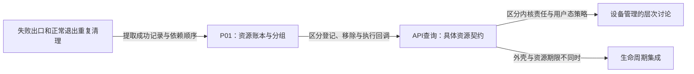

# 第1章\_devres资源管理阅读大纲

## 1.1\_从退出责任进入资源接口

起点是C对象、回调与分配释放。先问驱动失败后谁撤销已经成功的步骤，再把这个责任落到设备资源记录，最后按具体子系统查询获取、启停与释放契约。

| 阅读入口 | 前置结论 | 解决的问题与下一步 |
| --- | --- | --- |
| [P01从失败回滚到设备资源账本](P01_从失败回滚到设备资源账本.md#1.1_从两条退出路径提取同一份责任) | 指针、结构体、回调 | 一轮S0～S4及六条C路径；下一步查实际接口返回值 |
| [API查询](devres_API说明.md#2.1_核心机制_/_分组接口) | 已知登记责任与范围 | 查询核心分组及各资源族，按实际返回表示处理失败 |
| [内核与用户态设备管理讨论](devres_旧机制_udev_mdev的讨论.md) | 已区分资源账本与设备外壳 | 区分驱动资源、设备事件和用户态策略 |
| [生命周期集成](../integration/大纲.md) | 对象引用与资源期限各自成立 | 组合框架、私有对象和资源退出 |

源码问题从[固定索引](../../../../research/source_reading/devres/navigation/P01_Linux_6.12_devres源码阅读索引.md#1.1_固定版本与阅读任务)进入；本目录不复制kref或用户态设备管理的完整机制。人工评审进度统一见[评审地图](../../../../atlas/maps/knowledge_review_map.md)。
