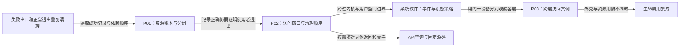

# 第1章\_devres资源管理阅读大纲

## 1.1\_从退出责任进入资源接口

起点是C对象、回调与分配释放。先问驱动失败后谁撤销已经成功的步骤，再把这个责任落到设备资源记录，最后按具体子系统查询获取、启停与释放契约。

| 阅读入口 | 前置结论 | 解决的问题与下一步 |
| --- | --- | --- |
| [P01从失败回滚到设备资源账本](P01_从失败回滚到设备资源账本.md#1.1_从两条退出路径提取同一份责任) | 指针、结构体、回调 | 一轮S0～S4及六条C路径；下一步查实际接口返回值 |
| [P02托管资源与使用者退出](P02_托管资源与使用者退出.md#2.3_时序与控制流) | S0～S4清理记录 | 以七条C轨迹证明进入与清理窗口，下一步连接用户态访问 |
| [用户态设备策略](../../../system_software/P01_设备事件与用户态策略.md#1.1_定义与分层位置) | 内核对象与访问路径 | U0～U4、两种规则实现与限定观察，下一步回到P03跨层案例 |
| [API查询](devres_API说明.md#2.1_核心机制_/_分组接口) | 已知登记责任与范围 | 查询核心分组，再比较[内存](devres_API说明.md#2.2_内存与字符串)、[映射](devres_API说明.md#2.3_I/O_资源与寄存器映射)、GPIO和IRQ的返回表示与清理责任，再查[句柄启停](devres_API说明.md#2.6_时钟%28Common_Clock_Framework%29)和[注册类](devres_API说明.md#2.13_注册类%28示例%29) |
| [P03驱动资源与用户态访问的协作](P03_驱动资源与用户态访问的协作.md#3.9_角色与接口边界) | S0～S4退出与U0～U4策略各自成立 | 复用完整misc服务分别验证接口、权限与C读取；再问旧文件和解绑后的独立寿命 |
| [生命周期集成](../integration/大纲.md) | 对象引用与资源期限各自成立 | 组合框架、私有对象和资源退出 |

源码问题从[固定索引](../../../../research/source_reading/devres/navigation/P01_Linux_6.12_devres源码阅读索引.md#1.1_固定版本与阅读任务)进入；本目录不复制kref；用户态完整机制独立归入系统软件。人工评审进度统一见[评审地图](../../../../atlas/maps/knowledge_review_map.md)。
