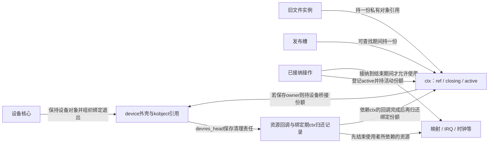
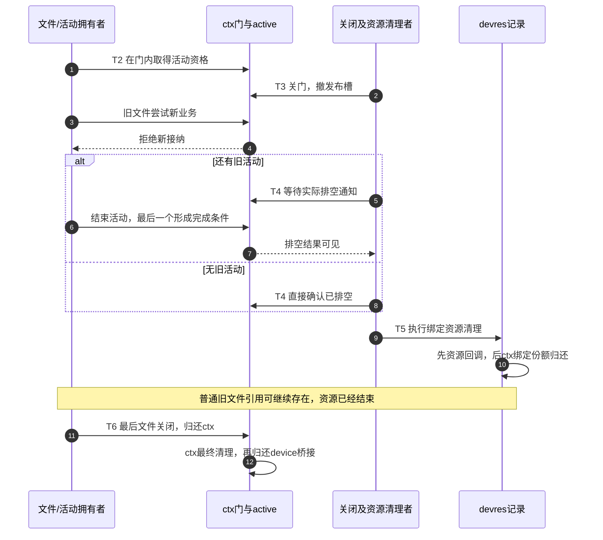

# 第1章\_kobject\_device\_devres\_kref\_生命周期集成

应用已经打开设备，驱动却开始解绑。应用拿着的文件指针仍有效，设备对象也还有引用，此时还能访问寄存器吗？如果不能，旧文件最后关闭时又该释放什么？

本章承接[kref的框架边界](../kref/P11_kref_refcount_t_kobject_的边界.md#11.1_本章导读_先分清对象层次)、[业务接纳](../kref/P30_状态观察与活动接纳模板.md#30.1_LIVE不是一张永久通行证)和[devres退出依赖](../devres/P02_托管资源与使用者退出.md#2.3_时序与控制流)。我们只组合已经建立的机制：允许纯软件会话晚于解绑存在，同时证明没有旧操作越过硬件资源的使用终点。

## 1.1\_必须分开的四条生命线

设备外壳、驱动绑定、绑定资源、私有会话是四个不同的拥有对象。它们之间可以有引用或借用关系，但不是一个计数归零后一起消失的大对象。

| 讨论对象 | 本例状态放在哪里 | 写入者、读取者与结束条件 |
| --- | --- | --- |
| device外壳 | `struct device`内嵌kobject及框架引用 | 通过设备接口取得/归还；最后归还进入设备release体系 |
| driver binding | 设备核心的绑定关系及驱动自己的业务门 | 核心组织probe/remove，驱动决定何时停止接纳；remove不是外壳最终析构 |
| devres资源 | `dev->devres_head`记录及各子系统资源 | 包装登记，清理路径摘出并调用回调；通常在失败或解绑阶段结束 |
| 独立私有对象 | 应用设计的`ctx->ref`、closing、active、owner等字段 | 文件、活动、发布槽和绑定期分别持份额；最后一份归还才回收软件外壳 |

这里的ctx字段是本章应用协议，不是每个Linux驱动自动拥有的字段。active记录已经接纳、仍会使用绑定资源的活动；普通引用可能仅表示一个闲置文件还开着，两者不能互换。下图沿用前章的中断请求（Interrupt Request，IRQ）资源：这里关心处理函数及其数据指针何时不再被使用，不重新展开中断控制器。



这不是单一状态机：引用、业务接纳、活动数量、资源是否存在分别变化。一个合法状态可以是“设备外壳活着、私有对象活着、绑定已结束、硬件资源已释放”。下面的目标就是让这个状态可解释、可安全退出。

## 1.2\_kobject\_与\_device\_引用

设备内嵌kobject，但设备调用者应使用get_device/put_device，保留设备框架规定的最终清理链。不要绕过它直接对dev.kobj.kref传入自创的kfree回调。固定源码从[kref索引](../../../../research/source_reading/kref/navigation/P01_Linux_6.12_kref源码阅读索引.md#1.2_按问题进入已落地证据)进入[设备公开取得与归还](../../../../research/source_reading/kref/source_explanations/drivers/base/core.c.md#1.2_设备取得与归还进入kobject)。

下面是接口片段，不是任意裸指针验证器。调用前必须已经由现有引用或框架调用上下文保证dev地址有效。

```c
/* 前提：dev是当前受保护的合法设备对象，而不是缓存里的可疑裸地址。 */
struct device *held = get_device(dev);
if (!held)
    return -ENODEV; /* 仅处理空输入，不能据此检验悬空地址。 */

/* 只进行符合设备对象自身同步和状态契约的操作。 */
put_device(held);
```

最后设备引用进入[device release分派](../../../../research/source_reading/kref/source_explanations/drivers/base/core.c.md#1.4_最终release按对象类型选择)。有效release负责承载对象的最终清理；device_unregister已经包含它应归还的初始化份额，不能随后再补一次同份额put或直接free。

引用保障存储寿命，不代表所有字段都可无锁读写。它也不保障驱动仍绑定、drvdata仍属于你、IRQ和映射仍有效，或者设备还接受I/O。device外壳上的一个地址字段没有自动为它指向的对象新增引用。

## 1.3\_probe\_remove\_与\_release

总线设备通常先存在，再尝试匹配驱动。probe为一次绑定准备资源和服务；probe失败沿核心回滚路径清理，但不把驱动remove当成失败出口。成功绑定以后，remove负责执行本驱动的停止与撤销协议，设备对象可以在它返回后继续存在并匹配其他驱动。

device release则属于最后设备份额的归还。更外层的注册拥有者何时归还设备份额，与绑定期何时结束也是两项责任：普通unbind可以保留已注册device，unregister还会撤下设备并归还相应份额。下面模型为观察最后回收，在解绑后再模拟注册拥有者的归还，不把这一步写成所有unbind都会自动执行。

固定核心路径通过[设备引用与资源退出导读](../../../../research/source_reading/kref/navigation/P08_device引用与资源退出导读.md#8.3_设备引用不保留驱动受管资源)查证；使用的是NXP Linux 6.12.20固定提交，不使用本地实验HEAD补结论。

## 1.4\_devres\_何时释放

对于常见绑定期资源，成功获取后保存清理记录，probe失败或解绑清理会消费这些记录。正常解绑的核心通常在remove完成后继续devres清理，而不是等待device的最后引用才动手。资源也可能通过匹配的托管释放接口或分组提前结束，例如devm_kfree、devm_free_irq或devres_release_group；不能发明一个所有资源族通用的devm_release接口。

还有一个集成细节：如果IRQ回调、action或其他清理记录使用ctx，ctx就必须跨过它们的最后访问。不能在remove末尾随意put掉绑定期份额，又让核心稍后用ctx执行清理。

一种可审查的设计是：先创建独立ctx并持有绑定期份额；在所有依赖ctx的后续资源记录之前，登记归还这份引用的action。后续IRQ、时钟和映射等回调先执行，最后才执行ctx的归还。使用action_or_reset时，登记失败会立即消费该份额，失败分支不能再put一次。该设计要求回调依赖顺序确实符合逆序；若做不到，应重新安排清理协议，而不是靠“通常还会有一个文件引用”碰运气。

这个设计不是把ctx用devm_kzalloc分配再给它加kref。ctx的存储必须有独立最终拥有者，否则devres仍可无视其私有计数直接释放存储。devres只持有并归还其中一份责任，不能另有一条普通free与私有release竞争。

## 1.5\_为什么异步路径不能只\_get\_device

设worker先拿到了设备引用，随后被调度出去。remove完成并释放映射，worker再运行时，设备外壳还活着，但映射已经结束。这个交错不需要引用计数出错，错的是把“指向设备的存储有效”当成“本次硬件操作获准执行”。

对短操作，可以在合适的门锁下检查状态并完成全部受保护访问；关闭者取得同一把锁后就不会与它交错结束资源。对必须放锁执行的长操作，则在同一串行化窗口内检查closing并登记active，成功才获得活动资格。结束时归还活动，最后一个活动发布排空条件；关闭者停止接纳后等这一条件，而不是等待所有闲置文件消失。

先关闭生产入口，再按实际依赖同步已接纳工作。cancel_work_sync并不能让一个仍能重新排队的生产者消失；timer与worker相互重启时还要处理重新武装关系；synchronize_irq只等待它承诺覆盖的中断活动，不等于停掉硬件来源或等待所有派生worker。DMA也必须先满足停止/同步契约，不能在通道或缓冲区仍被使用时释放它们。具体调用选择沿各子系统契约，不能把几个带sync的函数排成固定万能顺序。

等待排空时不能持有完成者需要的锁。状态写入、active减少、完成通知和等待方观察必须由共同协议连接；一个普通bool赋值不会自动唤醒睡眠中的关闭者。若通知发在回调函数真正返回之前，还需证明其尾部和模块代码不被提前释放。

## 1.6\_驱动私有对象与\_kref

本例选择拥有型发布槽：发布槽自己持一份ctx引用；open在有效的查找保护窗口取得文件份额；已接纳操作额外持活动份额；绑定期保留前述最后清理记录中的一份。关闭时先关业务门，再撤发布槽并归还槽位份额；已经取得文件引用但尚未开始业务的调用，仍必须重新通过接纳检查。

如果ctx保存device指针并在较晚的纯软件收尾中使用它，ctx还要持device桥接份额，最后ctx release再归还。若只需要一段不可变描述，也可以复制所需信息来解除这种依赖。两套计数之间有什么关系由应用明确建立，不能因为ctx里有owner字段就自动认为它持有owner。

私有最终release只消费尚属自身的责任；不能重复释放已由devres结束的映射和IRQ。条件增加也不是无锁查找的万能补丁：kref_get_unless_zero要求地址本身仍受保护，必须先说明发布槽锁、RCU或其他有效窗口。具体框架与私有桥接的完整程序见[P11组合示例](../kref/P11_kref_refcount_t_kobject_的边界.md#11.5.4_一个典型的分层结构)。

## 1.7\_文件描述符和\_mmap\_带来的长生命周期

对同一struct file执行dup或经fork共享描述符，不会凭空多出一个新的驱动open实例。按本例策略，每个独立打开文件实例持一份私有对象引用；最后一次文件release归还它。解绑后旧实例可以继续持有纯软件状态，但新业务接纳返回设备已断开，不能继续使用旧的映射指针。

mmap还多一层：用户CPU访问已建立的映射通常不会每次重新调用文件read/ioctl。因此仅设置disconnected并让这些文件操作返回-ENODEV，不足以阻止用户继续访问已映射的MMIO或DMA页。驱动必须按实际映射种类设计撤销、fault与后备存储寿命，或者在接口契约中限制不支持的映射；没有这套协议就不能提前释放后备资源。纯软件页映射的独立寿命见[只读映射与后备页](../../../driver_model/file_operations/P03_只读映射与后备页寿命.md)。

remove不应把用户何时关闭文件作为可以无限等待的前提。它需要等的是确实会触碰待释放资源的活动，并保证解绑后的旧实例不能重新取得这种资格。真实硬件不可逆失效时还要有错误返回与访问容错，不能承诺“所有已接纳操作总能正常完成”。

## 1.8\_devres\_与手工资源的混用

| 对象或责任 | 本例选择的拥有者 | 退出时必须证明 |
| --- | --- | --- |
| 绑定期映射与IRQ | 相应devres记录 | 使用者与派生活动已满足退出条件 |
| 私有ctx存储 | ctx的独立kref | 最后归还才free，devres只归还绑定份额 |
| ctx保存的device指针 | ctx的一份桥接引用 | ctx最后使用owner之后归还，不代替资源保活 |
| 发布槽 | 一份ctx引用 | 撤下与查找取得正确同步，实际撤下一次才归还一次 |
| 文件实例 | 一份ctx引用 | 关闭后只能做允许的纯软件收尾 |
| 已接纳活动 | active记录及一份ctx引用 | 结束活动并发布必要排空证据后归还 |

成功责任只能被消费一次。devm内存使用配套托管提前释放接口会同时处理记录；直接普通free则可能让记录日后再次清理。独立ctx使用kzalloc/kfree是本例的存储选择，不意味着所有使用者都必须手写底层资源退出。引用份额、资源记录和直接拥有者可以协作，只要各自管理的是清楚的一份责任。

## 1.9\_完整停机状态机

用T0～T6组织这次组合周期，避免把设备框架、devres和私有状态误画成同一个单变量状态机。它们分别回指已学的kref接纳阶段和devres退出阶段。

| 阶段 | 触发、状态地址与写入者 | 谁读取，退出条件是什么 |
| --- | --- | --- |
| T0建立 | 绑定者创建ctx、建立owner桥接与绑定份额，依序建立资源记录 | 发布以前，各失败出口只能归还实际取得的份额 |
| T1发布 | 发布者在索引协议内写registry，追加槽位份额 | open在有效地址窗口取得文件份额 |
| T2接纳 | 使用者在门协议内检查closing，再写active及活动份额 | 关闭者能观察到仍在使用资源的活动 |
| T3关门 | 关闭者写closing，撤registry并归还槽位份额 | 新open和旧文件的新业务都被拒绝 |
| T4排空 | 完成者减少active；为零时形成drained结果 | 等待方通过实际同步获得结论；无活动时由关闭者直接形成结果 |
| T5退出绑定 | 清理者结束资源，最后归还记录持有的绑定份额 | 不再存在依赖ctx的资源回调；旧文件仍可保留软件ctx |
| T6最终归还 | 最后文件或其他合法拥有者归还ctx，release再归还owner桥接 | ctx存储回收；设备外壳还要看自身其他份额是否都已结束 |



下面是完整C11顺序模型。函数调用代表已经正确串行化的一步，没有模拟Linux锁、真实等待或devres分配。设备外壳用栈对象模拟逻辑释放，私有ctx则真正分配和回收。模型明确假设创建成功已建立所有记录；action分配失败如何回滚仍由[devres核心模型](../devres/P01_从失败回滚到设备资源账本.md#1.5_运行完整C模型观察六条路径)单独验证，不能把本模型成功分支冒充所有内核失败出口。

因此模型的最终回调断言只适用于这里已经发布、再经过关闭的对象。真实驱动还要允许未发布对象沿初始化失败路径合法回收，不能强制所有release都先经过closing或drained。应按已取得的责任分别审查，不能把本例断言当作通用内核实现。

```c
/* C11顺序模型：不调用Linux devres、kref、锁或真实设备接口。 */
#include <assert.h>
#include <stdbool.h>
#include <stdio.h>
#include <stdlib.h>

struct device_model {
    unsigned int refs;
    bool resources_live, released;
};
struct context {
    struct device_model *owner;
    unsigned int refs, active;
    bool closing, drained;
};
static struct context *registry;
static unsigned int context_releases;

static void device_put(struct device_model *dev)
{
    assert(dev->refs && !dev->released);
    if (--dev->refs == 0)
        dev->released = true; /* 外壳用栈存储，只模拟其逻辑回收。 */
}
static void context_get(struct context *ctx)
{
    assert(ctx && ctx->refs);
    ++ctx->refs;
}
static void context_put(struct context *ctx)
{
    assert(ctx && ctx->refs);
    if (--ctx->refs != 0)
        return;
    assert(ctx->closing && ctx->drained && !ctx->active);
    assert(registry != ctx && !ctx->owner->resources_live);
    device_put(ctx->owner); /* 先结束桥接责任，此后不再访问owner。 */
    ++context_releases;
    free(ctx);
}
static struct context *create_binding(struct device_model *dev, bool fail)
{
    if (fail)
        return NULL; /* 注入创建前失败，尚无桥接或登记责任。 */
    struct context *ctx = calloc(1, sizeof(*ctx));
    if (!ctx)
        return NULL;
    ctx->refs = 1; /* 绑定期份额：假定已经交给最后执行的清理记录。 */
    ctx->owner = dev;
    ++dev->refs;
    dev->resources_live = true;
    assert(!registry);
    context_get(ctx); /* 拥有型发布槽持有一份。 */
    registry = ctx;
    return ctx;
}
static struct context *open_session(void)
{
    if (!registry || registry->closing)
        return NULL;
    context_get(registry);
    return registry; /* 模拟一个独立打开文件实例的份额。 */
}
static bool begin_operation(struct context *ctx)
{
    assert(ctx && ctx->refs);
    if (ctx->closing)
        return false;
    assert(ctx->owner->resources_live);
    ++ctx->active;
    context_get(ctx);
    return true;
}
static void close_gate(struct context *ctx)
{
    assert(registry == ctx);
    ctx->closing = true;
    registry = NULL;
    context_put(ctx); /* 撤下发布槽的份额，绑定期份额仍在。 */
    ctx->drained = (ctx->active == 0);
}
static void finish_operation(struct context *ctx)
{
    assert(ctx->active && ctx->owner->resources_live);
    --ctx->active;
    if (ctx->closing && !ctx->active)
        ctx->drained = true; /* 只模拟汇聚条件，不实现通知和等待。 */
    context_put(ctx);
}
static void finish_binding(struct context *ctx)
{
    assert(ctx->closing && ctx->drained && !ctx->active);
    ctx->owner->resources_live = false; /* 模拟IRQ、时钟、映射等先退出。 */
    context_put(ctx); /* 最后才消费绑定期记录中的私有对象份额。 */
}
int main(void)
{
    for (unsigned int scenario = 0; scenario < 6; ++scenario) {
        struct device_model dev = { .refs = 1 };
        struct context *ctx, *file = NULL;
        unsigned int active = scenario == 4 ? 2U : scenario == 3 ? 1U : 0U;
        context_releases = 0;
        ctx = create_binding(&dev, scenario == 0);
        if (scenario == 0) {
            assert(!ctx && !registry && dev.refs == 1);
            device_put(&dev);
        } else {
            assert(ctx);
            if (scenario >= 2) {
                file = open_session();
                assert(file == ctx);
            }
            for (unsigned int i = 0; i < active; ++i)
                assert(begin_operation(file));
            bool old_live_snapshot = !ctx->closing;
            close_gate(ctx);
            assert(open_session() == NULL && !begin_operation(ctx));
            assert(ctx->drained == (active == 0));
            while (active) {
                finish_operation(ctx);
                --active;
                assert(ctx->drained == (active == 0));
            }
            finish_binding(ctx); /* 无旧文件时，ctx可在这里最终回收。 */
            ctx = NULL;
            device_put(&dev); /* 再模拟框架归还自己的设备份额。 */
            if (file) {
                assert(!dev.resources_live && !dev.released && dev.refs == 1);
                assert(context_releases == 0 && !begin_operation(file));
                if (scenario == 5)
                    assert(old_live_snapshot && file->closing);
                context_put(file); /* 旧文件只归还软件对象，不再操作硬件。 */
            }
            assert(context_releases == 1);
        }
        assert(!registry && dev.released && dev.refs == 0);
        printf("case %u: context_release=%u device_released=1\n",
               scenario, context_releases);
    }
    puts("6 binding/session traces passed; no Linux or concurrent execution");
    return 0;
}
```

在仓库根目录用C开发环境运行[同名材料](../../../../labs/kernel/object_lifetime/materials/binding_lifetime.c)：

```bash
cc -std=c11 -Wall -Wextra -Werror -O2 \
  labs/kernel/object_lifetime/materials/binding_lifetime.c -o /tmp/binding_lifetime
/tmp/binding_lifetime
```

六条轨迹分别是创建前失败、无旧文件、旧文件晚关闭、一个旧活动、两个旧活动，以及LIVE快照失效。场景0没有ctx析构，其余各有一次；每条结尾设备逻辑释放成立。程序最终打印：

```text
6 binding/session traces passed; no Linux or concurrent execution
```

先观察场景2：T5后resources_live已经为false，设备外壳仍有ctx持有的一份桥接，旧文件再次begin却失败。再观察场景4：第一个活动结束不能形成drained；第二个结束后才可进入T5。两个现象分别说明存储与业务资格不同，以及局部完成必须汇聚成全局排空。

这些顺序轨迹本批已严格编译并执行。它们没有测试真实中断、锁、内存序、唤醒、虚拟内存区域（Virtual Memory Area，VMA）的映射撤销或硬件，模型中的drained赋值也不是真实completion。内核实现需要继续兑现这些通信义务。

## 1.10\_常见错误

| 错误推理 | 遗漏的具体责任 |
| --- | --- |
| get_device成功，所以drvdata和映射仍有效 | 外壳引用不拥有指针指向的私有资源 |
| ctx引用非零，所以可以继续I/O | 缺少门内接纳与活动登记 |
| remove已经put了ctx，后面的资源清理自然安全 | 清理记录的数据指针仍可能引用ctx |
| flush了一次，所以未来不会有工作 | 生产者和重新排队路径尚未关门 |
| 旧fd都返回ENODEV，所以mmap也安全 | 映射访问可以绕过这些文件操作 |
| 文件最后关闭必须发生在remove之前 | 把软件会话寿命绑到资源退出，可能无限等待用户 |
| devm分配加一个kref就能延长存储 | devres的free不会读取这套私有计数 |

## 1.11\_核对表

先做三个修改实验：把finish_binding中的ctx归还提前到资源退出之前，哪类场景会立即暴露问题？去掉T3的closing检查但保留ctx引用，旧文件会跨过哪条资源边界？让第一个活动结束就设置drained，第二个活动会失去哪项保证？

第一题在无旧文件时可能让ctx最终回收早于资源清理，模型的最终回调断言会指出资源仍活着；第二题把存储保活误当业务接纳，资源有效性检查将失败；第三题会允许关闭者在另一个活动未退出时结束资源。不要删掉断言让实验“通过”，应修复责任或通信顺序。

最后为真实驱动填写同样的T0～T6表：每个状态写在哪个地址、谁保护它、谁增加或消费份额、谁停止入口、谁发布排空、谁等待、哪条回调最后还会触碰ctx。设备框架与私有回调的完整例子可回到[P11](../kref/P11_kref_refcount_t_kobject_的边界.md)，DMA与映射继续分别进入[DMA专题](../../io_model/dma/大纲.md)和对应文件操作材料。能够回答这些问题，才有条件把多个“单独正确”的机制组合起来。
