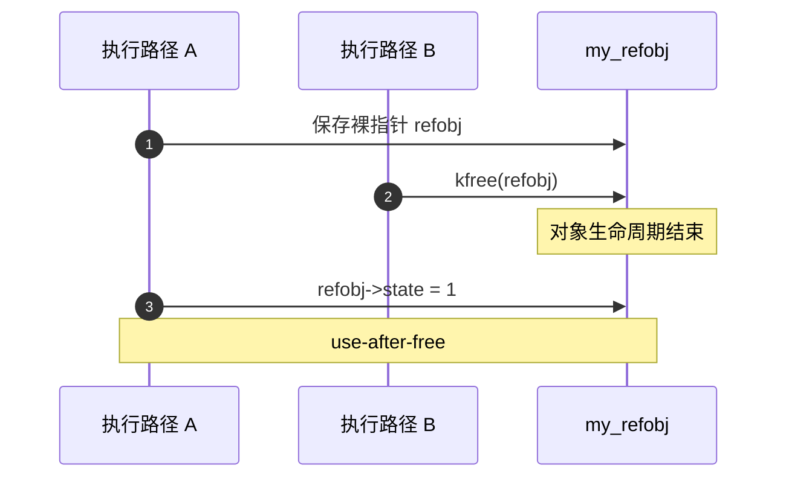
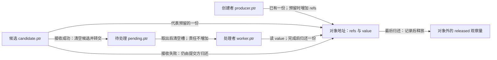
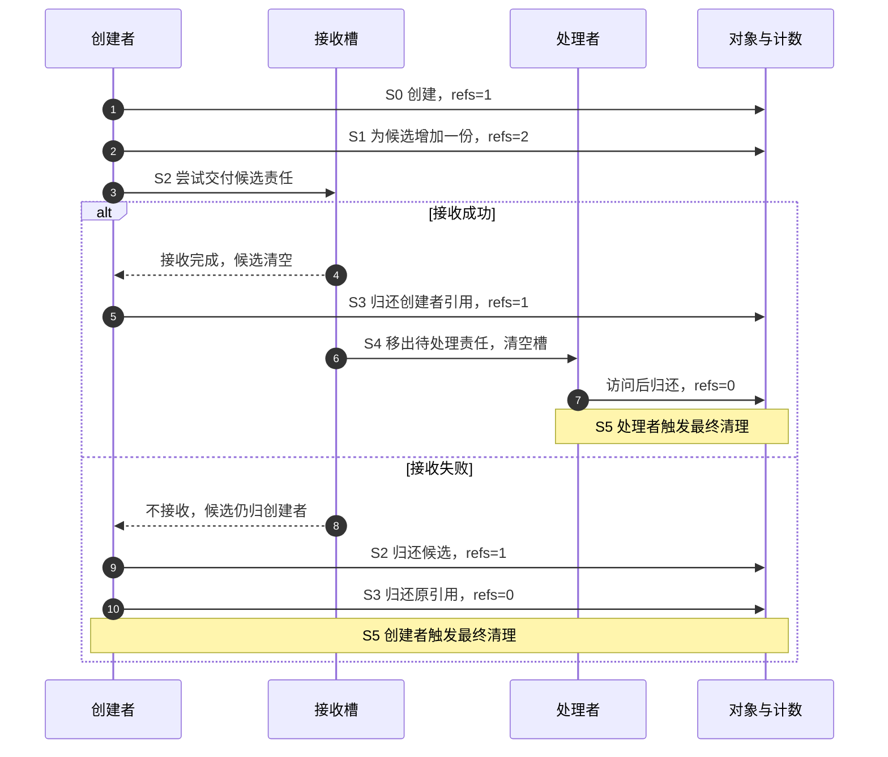
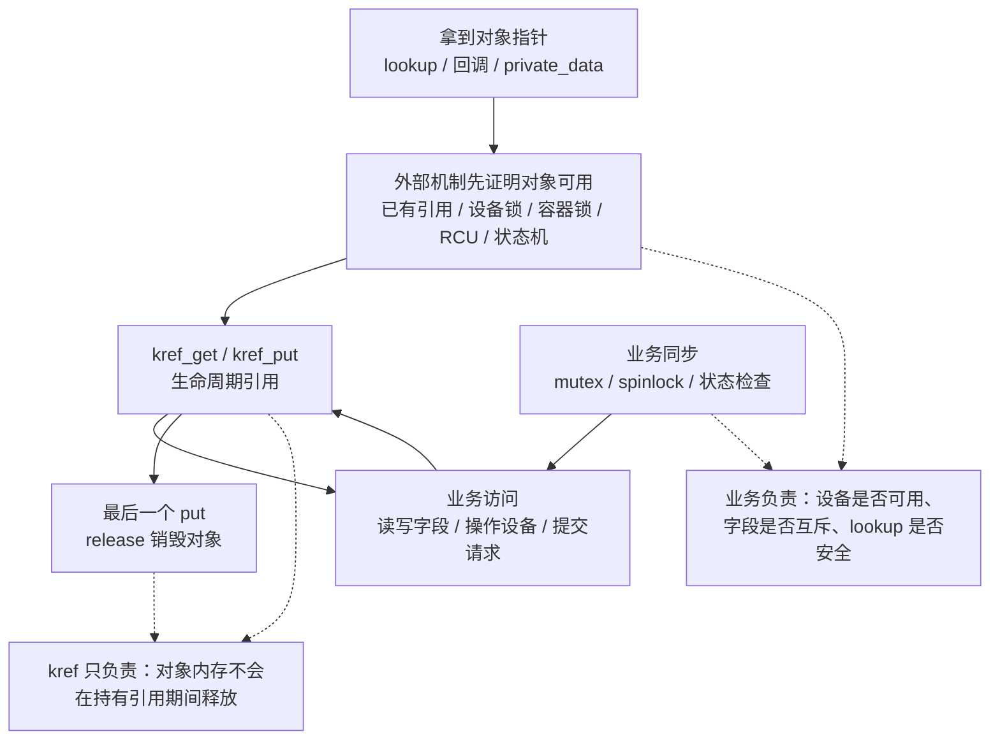

# 第1章\_kref\_要解决什么问题

## 1.1\_本章主线

前面的数据结构让我们能够把对象放入链表、哈希表或树，再找到它。现在留下一个问题：**从容器中找到一个地址之后，谁保证那块内存仍属于这个对象？** 本章从 C 指针和 `malloc/free` 的基础出发，先建立使用期限与归还责任，再讨论 Linux 的 `kref`；不用记住后面所有接口才能理解这里的问题。

设创建者分配一个请求，先在当前函数中计算，再交给一个稍后运行的处理者。同步调用时，创建者等函数返回后才释放请求，调用栈已经给出了明确的先后关系。改成异步处理后，提交函数返回并不表示处理结束：创建者可能先退出，处理者以后才访问请求。原先“返回以后就能释放”的规则因此失效。

可以让创建者一直等待处理完成。这在必须同步取得结果的场景中很合适，但会把创建者的结束时间绑在处理者身上；有多个独立使用者时，等待协议还要准确收集每一方的结束。引用计数选择另一种分工：每一份独立使用权都承担一份归还责任，最后归还者触发回收。`kref` 是 Linux 给自定义内核对象使用的这类生命周期工具。

这个工具不替我们决定字段怎样互斥、容器怎样更新、设备是否在线，也不自动阻止回调重入或锁顺序错误。后半章继续划清这些边界；眼前先解决一件事：**对象何时可以结束，而不是谁可以同时修改它。**

------

## 1.2\_裸指针共享为什么危险

`struct my_refobj *refobj` 保存一个地址。复制这个变量不会通知分配器“又多了一个使用者”，也不会使 `free()` 或 `kfree()` 自动推迟。所谓裸指针，是指仅有地址、没有随之兑现的所有权保证；并不是说 C 指针天生不可共享。

先把原来正确的同步过程和异步变化放在一起看：

| 时刻 | 同步调用，有外层保活 | 只复制地址，未建立独立保活 |
| --- | --- | --- |
| T0 | 创建者分配对象 | 创建者分配对象 |
| T1 | 被调用函数借用对象，创建者尚未返回 | 创建者把地址放入待处理槽 |
| T2 | 被调用函数结束，停止访问 | 创建者释放对象，处理者尚未读取 |
| T3 | 创建者释放对象 | 处理者读出旧地址并访问字段 |

左边的指针传递没有问题，因为最后一次使用先于释放。右边失败的原因不是“调用了另一个函数”，而是 **原来的保护期限已经结束，新的使用期限却没有被任何协议覆盖**。

在内核中，如果执行路径 A 正要写 `refobj->state`，执行路径 B 同时 `kfree(refobj)`，仅给字段写操作加一个与 B 无关的锁也不够：B 没有参与这把锁的协议，仍可先释放整块对象。我们要协调的是释放与所有有效使用者，而不只是两个字段访问。

------

## 1.3\_use-after-free\_的本质

释放后使用称为 **use-after-free（UAF）**。它不是指保存地址的变量消失了，而是原对象已经结束，代码仍试图通过旧地址访问它。在 C 语言中，这类访问没有合法语义，不能把一次“似乎还读到了原值”当作安全证据。

内核释放后的内存可能回到 slab 对象分配器，也可能再次分配给其他对象；调试配置可能填充用于发现误用的 poison 标记，或者由内核地址检查器 KASAN 标记访问非法。这些情况解释了为什么错误可能表现为立即告警、随机崩溃，也可能表现为悄悄写坏另一对象的数据。是否出现某一种表现取决于分配与调试配置，错误本身不以告警为成立条件。



这是一条错误时序的说明图，本章实验不会故意执行这次非法访问。要消除它，A 必须在原有保活保证消失之前获得独立引用，或者始终在另一个有效持有者提供的借用期限内完成访问。

------

## 1.4\_kref\_解决的不是\_有没有指针\_而是\_有没有引用

这里的“持有一个引用”是一份协议责任：当前路径可以在约定的范围内继续使用对象，并且必须在结束时恰好归还这一份责任。对象内部的计数汇总尚未归还的份额；它不知道保存了多少个地址变量，也不知道这些变量属于哪个线程。

| 动作 | 是否新增归还责任 | 原因 |
| --- | --- | --- |
| 在同一持有者内令 `alias = refobj` | 否 | 只是另一种访问已有对象的写法 |
| 同步调用 helper，返回前不保留地址 | 通常否 | 调用者的有效引用覆盖整段借用 |
| 交给可在调用者退出后运行的 worker | 需要独立责任，或转交原责任 | 使用期限已经脱离原调用栈 |
| 放入全局表或队列 | 由容器协议明确 | 有的容器拥有引用，有的只索引由其他机制保活的对象 |
| 同一路径分别持有两项需要独立归还的权利 | 是，两份 | 计数不等于线程数量 |

“长期使用”因此不是某个毫秒门槛，而是 **使用权能否跨越现有保护期限**。一次很快的异步回调也需要闭合责任；一个持续很久但严格处于持有者保护内的同步调用，可以只借用。借用者不能把地址悄悄保存到全局变量，然后在借用结束后继续访问。

已有有效引用时，持有者可以在自己归还之前为另一方增加一份；只捡到一个可能已经失效的地址时，却不能先去增加其内部计数再试图证明它有效。后者连计数所在的内存都未获保护，是后文 lookup（按入口查找对象）必须解决的窗口。

------

## 1.5\_为什么引用计数可以解决生命周期问题

先在抽象模型中规定：对象创建时有一份责任；增加独立持有会增加一份；结束持有会归还一份；责任转交只换持有者，不增加总数。只要所有真实使用期限都被覆盖，计数归零就表示没有合法持有者仍需使用它。最后一方于是可以触发销毁。

这不是单一的“计数状态机”。至少有两组相互约束的状态：对象中的计数，以及创建者、候选交付槽、待处理槽和处理者各自持有哪些责任。队列是否接收又是另一项状态。Linux 的 `kref` 不替我们保存持有者名单，**名单与计数一致** 是使用者协议要维持的不变量。



在同一个周期中，谁写什么状态可以逐项说明：

| 阶段 | 触发与写入者 | 状态变化与后续读取者 |
| --- | --- | --- |
| S0 创建 | 创建者成功分配 | 对象 `refs=1`，`producer.ptr` 指向它；创建者可同步借用 |
| S1 预留 | 创建者尚持有效引用 | `refs:1→2`，候选槽取得新责任；原有引用仍有效 |
| S2 交付 | 接收方接受或拒绝 | 接受时候选槽清空、待处理槽接收，计数仍为 2；拒绝时提交者归还候选，计数回到 1 |
| S3 创建者结束 | 创建者清空自身槽并归还 | 成功分支剩 1；拒绝分支降到 0 并直接进入 S5 |
| S4 处理 | worker 取走待处理槽责任 | 待处理槽清空，worker 读对象，完成后归还最后一份 |
| S5 回收 | 使计数降到 0 的路径 | 执行最终清理；任何路径都不能继续通过旧地址取引用 |

S3 与 S4 也可以交换：处理者很快结束时，创建者仍持有最后一份。重要的是引用先于交付成立，而不是强制谁最后运行。



真实并发实现还必须使队列发布和读取有同步保证；给计数加一并不会自动把对象字段、槽内容和通知一起安全地发布。这里先把责任顺序建立起来，再在后续锁与 RCU 章节落实通信机制。RCU 是读侧临界区与延迟回收协议，不是随意读写共享字段的通行证。

对应 Linux 时，`kref_init()` 建立初始引用，`kref_get()` 从已有有效持有增加一份，`kref_put()` 归还一份并在归零时调用 `release` 回调。`kref_init()` 必须在分配成功后调用。`release` 是最终清理的入口；简单对象可以在里面 `kfree()`，复杂对象可能继续安排延迟销毁，不能把所有回调都等同于立即释放内存。结构与源码关系留给[下一章](P02_源码入口与结构定义.md)。

------

## 1.6\_kref\_的核心问题不是加减\_而是所有权

下面用同一组责任槽运行 S0～S5，再改变交付与结束顺序，检查计数能否始终对应尚未归还的份额。

### 1.6.1\_运行完整的责任交接模型

下面的 C11 程序把上面的周期落实为可执行步骤，文件为[reference_ownership.c](../../../../labs/kernel/object_lifetime/materials/reference_ownership.c)。`owner.ptr` 非空代表一份归还责任；只有 `share()` 可以复制一份责任，`move()` 只转交，`drop()` 清空槽并归还。普通结构赋值不能用来复制 `owner`，C 的类型系统不会替我们执行这条限制。

这个程序是 **串行所有权模型**：没有内核工作队列，也没有原子操作；`submit()` 的布尔参数控制接收与拒绝。它验证责任如何闭合，不验证并发内存序、真实调度或 `refcount_t` 的饱和保护。为便于观察，两条主路径都按创建者先退出、处理者后执行的顺序运行。标准库宏 `UINT_MAX` 表示无符号整数上限，用于拒绝计数溢出；`EXIT_FAILURE` 和 `EXIT_SUCCESS` 分别表示进程失败和成功退出。

```c
#include <assert.h>
#include <limits.h>
#include <stdbool.h>
#include <stdio.h>
#include <stdlib.h>

struct object {
    unsigned int refs;
    int value;
};

/* 一个非空槽代表一份归还责任，禁止用结构赋值复制持有者。 */
struct owner { struct object *ptr; };
static unsigned int released;

static bool create(struct owner *dst)
{
    assert(!dst->ptr);
    struct object *obj = malloc(sizeof(*obj));
    if (!obj)
        return false;
    *obj = (struct object){ .refs = 1, .value = 42 };
    dst->ptr = obj;
    return true;
}

static void share(struct owner *dst, const struct owner *src)
{
    assert(!dst->ptr && src->ptr);
    assert(src->ptr->refs > 0 && src->ptr->refs < UINT_MAX);
    ++src->ptr->refs;
    dst->ptr = src->ptr;
}

static void move(struct owner *dst, struct owner *src)
{
    assert(!dst->ptr && src->ptr);
    dst->ptr = src->ptr;
    src->ptr = NULL; /* 责任转交，计数不变。 */
}

static void drop(struct owner *slot)
{
    assert(slot->ptr && slot->ptr->refs > 0);
    struct object *obj = slot->ptr;
    slot->ptr = NULL; /* 先结束本槽使用权，再执行可能的释放。 */
    if (--obj->refs == 0) {
        ++released; /* 观察量位于对象外，释放后不再读取对象。 */
        free(obj);
    }
}

static int borrow(const struct object *obj)
{
    return obj->value; /* 调用期间由调用者的现有引用保活。 */
}

/* 成功才接收候选引用；拒绝时候选仍归调用者。没有真实工作队列。 */
static bool submit(struct owner *pending, struct owner *candidate,
                   bool accept)
{
    assert(!pending->ptr && candidate->ptr);
    if (!accept)
        return false;
    move(pending, candidate);
    return true;
}

static void consume(struct owner *pending)
{
    struct owner worker = {0};
    move(&worker, pending);
    assert(borrow(worker.ptr) == 42);
    drop(&worker);
}

int main(void)
{
    /* 两次运行分别观察提交成功与失败，均须恰好释放一次。 */
    for (unsigned int accept = 0; accept < 2; ++accept) {
        struct owner producer = {0}, candidate = {0}, pending = {0};
        if (!create(&producer)) {
            fputs("allocation failed\n", stderr);
            return EXIT_FAILURE;
        }
        assert(borrow(producer.ptr) == 42 && producer.ptr->refs == 1);
        share(&candidate, &producer);
        assert(producer.ptr->refs == 2);
        bool queued = submit(&pending, &candidate, accept != 0);
        if (!queued)
            drop(&candidate); /* 发布失败，归还预留的那一份。 */
        drop(&producer);
        if (queued) {
            assert(pending.ptr->refs == 1);
            consume(&pending);
        }
        assert(!producer.ptr && !candidate.ptr && !pending.ptr);
        assert(released == accept + 1);
        printf("accept=%u released=%u\n", accept, released);
    }
    return EXIT_SUCCESS;
}
```

在程序所在目录运行，保持断言开启：

```bash
cc -std=c11 -Wall -Wextra -Werror -O2 reference_ownership.c -o reference_ownership
./reference_ownership
```

预期输出：

```text
accept=0 released=1
accept=1 released=2
```

`released` 是累计值，且放在对象之外。第一行说明拒绝时由创建者回收；第二行说明成功时由最后的处理者回收。我们没有在 `free()` 后读取对象计数，也没有用“这次没崩溃”证明安全。

对照代码观察三处动作：`borrow()` 只读取值，调用前后责任数仍为 1；`share()` 把总数变为 2；成功 `submit()` 和 `consume()` 内的 `move()` 只更换责任所在槽。失败分支不会把责任交给任何 worker，因此必须由提交方归还预留份额。

### 1.6.2\_改变交付方式再检查不变量

1. 成功提交以后，先 `consume(&pending)`，再 `drop(&producer)`，最后回收者是谁？计数是否还能闭合？
2. 如果创建者提交后不再需要对象，能否直接把 `producer` 交给 `submit()`，省掉 `share()`？拒绝时又由谁负责？
3. 把成功交付后的 `candidate` 当作仍持有责任再 `drop()`，模型会怎样？如果漏掉拒绝时的 `drop(&candidate)`，又会怎样？
4. 同步 helper 返回前不保存地址，却为每个指针别名都 `share()`，这是必要保证还是额外成本？

第一题仍然正确：worker 把 2 减到 1，创建者最后归还触发回收；但是不能把只适用于原顺序的“待处理槽此时剩 1”断言照搬。第二题可以，成功时创建者槽已清空，不能再归还；失败时槽仍归创建者，必须自行结束使用并归还。第三题的重复归还会在本模型被空槽断言拒绝，遗漏归还则使计数无法到零；真实裸指针程序未必能在错误发生处立即告警。第四题只要借用期限可靠便不需要新增责任，额外 get/put 会增加计数更新成本，并扩大必须逐路径配对的范围。

现在可以审查最初那组问题：谁应该 get、谁应该 put，队列或全局表是否拥有一份，交付失败由谁清理，lookup 期间谁保护地址，release 调用时哪些外部结构还活着。**多 get 少 put 会泄漏，少 get 多 put 会提前结束对象，归还后继续访问会 UAF；交付后才给接收者补引用以及无保护 lookup 后直接 get，都不能补回已经失去的寿命保证。** 这些错误不是多写几处加减就能修复，需要把每条路径的归还责任画清楚。

------

## 1.7\_kref\_不解决并发互斥问题

这是第二个必须明确的边界。

`kref` 只能保证：

```text
对象内存还没有被释放
```

这里说的“对象”，首先指自己定义并嵌入 `struct kref` 的对象，例如 `my_refobj`、request、session、cache entry 这类子系统内部对象。

如果讨论的是 driver core 里的 `struct device`、`struct class`、`struct bus_type`，就不能把下面的 `my_refobj + kref + my_refobj_release` 模板直接套上去。它们属于基于 `kobject` 和设备模型封装好的框架对象，有自己的 `get_device()/put_device()`、`device_release()`、class/type release 分发规则。

也就是说：

```text
裸 kref：讲自定义对象如何引用计数。
device/class/bus：讲 driver core 如何分层管理框架对象。
```

它不能保证：

```text
对象字段不会被别人同时修改
对象状态不会被并发改变
对象链表节点不会被并发删除
对象内部缓存不会被并发破坏
设备当前仍然可访问
当前路径拥有设备的独占访问权
lookup 拿到的裸指针一定还有效
```

这点在设备相关代码里尤其重要。

`kref` 不是“设备安全代理”，也不是“设备完整托管器”。它不负责决定：

```text
设备是否 online
设备是否已经 remove
设备是否允许新请求
当前路径是否持有设备锁
多个线程是否可以同时操作设备寄存器或私有字段
```

这些都属于外层对象或框架自己的规则，通常由设备锁、对象锁、容器锁、RCU、状态机或设备模型自身的引用规则来保证。

可以把分工画成这样：



所以更准确的使用前提是：

```text
不是拿到裸指针之后，靠 kref_get() 让一切变安全；
而是外部规则已经证明对象有效之后，才能 kref_get() 延长生命周期。
```

例如：

```c
struct my_refobj {
	struct kref ref;
	int state;
};
```

下面代码即使持有引用，也不一定是并发安全的：

```c
kref_get(&refobj->ref);

refobj->state++;

kref_put(&refobj->ref, my_refobj_release);
```

`kref_get()` 只能说明：

```text
refobj 在当前引用释放前不会被 kfree
```

但它不说明：

```text
refobj->state++ 是互斥的
```

如果多个 CPU 同时执行：

```c
refobj->state++;
```

仍然会产生数据竞争。

正确设计通常需要：

```c
struct my_refobj {
	struct kref ref;
	struct mutex lock;
	int state;
};
```

然后：

```c
kref_get(&refobj->ref);

mutex_lock(&refobj->lock);
refobj->state++;
mutex_unlock(&refobj->lock);

kref_put(&refobj->ref, my_refobj_release);
```

这里分工是：

```text
kref 保护对象生命周期
mutex 保护对象字段一致性
```

这两个问题不能混在一起。

如果换成自己封装的设备私有对象，也可以这样理解：

```text
kref 保证私有对象内存不会提前释放；
设备锁保证私有对象状态和寄存器访问不会并发冲突；
状态机保证设备当前是否 online、是否允许请求；
lookup 保护保证从全局结构拿到私有对象时不是悬挂指针。
```

------

## 1.8\_生命周期保护和字段保护的区别

可以把对象分成两个层次看：

```text
对象是否还活着
对象内部数据是否一致
```

`kref` 只管第一层：

```text
对象是否还活着
```

锁、RCU、atomic 等机制管第二层：

```text
对象内部数据是否一致
```

例如：

```text
kref 解决：refobj 会不会在我使用时被 free
mutex 解决：refobj->state 会不会被并发乱改
spinlock 解决：中断/软中断/多 CPU 下的短临界区保护
RCU 解决：读侧无锁查找与延迟释放
atomic 解决：单个变量的原子更新
```

所以不能说：

```text
用了 kref 就线程安全了
```

更准确的说法是：

```text
用了 kref，只是让对象生命周期具备了引用所有权协议。
```

对象内部是否线程安全，还要看字段访问规则。

------

## 1.9\_kref\_适合什么场景

`kref` 适合这种对象：

```text
对象不是只在一个函数栈内使用
对象会被多个模块保存
对象会被多个线程访问
对象会被异步回调使用
对象会被放进 list/hash/xarray/idr 等容器
对象会被 workqueue、timer、completion、设备回调延迟使用
```

典型场景包括：

```text
设备私有对象
连接对象
请求对象
会话对象
缓存对象
异步 IO 上下文
驱动内部资源对象
文件或 inode 相关私有对象
```

例如驱动里常见的结构：

```c
struct my_request {
	struct kref ref;
	struct list_head node;
	struct completion done;
	int status;
	void *buffer;
};
```

这个请求对象可能同时被：

```text
提交线程持有
硬件完成中断路径持有
超时 timer 持有
取消路径持有
debugfs 查询路径持有
```

如果没有明确引用规则，就很容易出现：

```text
取消路径释放了 request
中断完成路径又访问 request
```

这就是典型生命周期 bug。

------

## 1.10\_为什么\_多个地方能拿到对象\_时必须有生命周期协议

只要对象能从多个地方被拿到，就会出现一个问题：

```text
谁能决定释放对象？
```

如果没有引用计数，通常会变成这种危险模型：

```text
A 觉得自己用完了，于是 free
B 其实还在用，于是 UAF
```

而 `kref` 把释放条件改成：

```text
不是某一个路径觉得自己用完了就释放，
而是所有持有引用的路径都 put 之后才释放。
```

也就是：

```text
释放权不属于某一个使用者
释放权属于最后一个 put
```

这就是引用计数的核心价值。

它把对象释放从：

```text
某个路径主观决定
```

变成：

```text
所有权计数客观归零
```

------

## 1.11\_kref\_不能替代对象状态机

还有一个常见误区：

```text
对象 refcount > 0，所以对象一定可用。
```

这不一定对。

`refcount > 0` 只能说明：

```text
对象内存还活着
```

但对象可能处于：

```text
initializing
running
stopping
dead
error
removed
```

等状态。

例如某个驱动内部私有对象还活着，但它代表的硬件已经拔出：

```c
struct my_refobj {
	struct kref ref;
	struct mutex lock;
	bool online;
};
```

访问时可能需要：

```c
kref_get(&refobj->ref);

mutex_lock(&refobj->lock);
if (!refobj->online) {
	mutex_unlock(&refobj->lock);
	kref_put(&refobj->ref, my_refobj_release);
	return -ENODEV;
}

/* 硬件在线，执行操作 */
mutex_unlock(&refobj->lock);

kref_put(&refobj->ref, my_refobj_release);
```

这里：

```text
kref 保证 my_refobj 私有对象没被释放
online 状态判断保证硬件当前是否可操作
mutex 保证 online 状态检查和修改一致
```

所以对象生命周期和对象业务状态仍然是两个问题。

------

## 1.12\_kref\_不能单独解决\_lookup\_问题

假设有一个全局链表：

```c
static LIST_HEAD(refobj_list);
static DEFINE_MUTEX(refobj_list_lock);
```

对象挂在链表里：

```c
struct my_refobj {
	struct kref ref;
	struct list_head node;
	int id;
};
```

错误查找模型：

```c
struct my_refobj *my_refobj_lookup(int id)
{
	struct my_refobj *refobj;

	list_for_each_entry(refobj, &refobj_list, node) {
		if (refobj->id == id) {
			kref_get(&refobj->ref);
			return refobj;
		}
	}

	return NULL;
}
```

这段代码的问题是：

```text
如果没有锁保护 refobj_list，
查找过程中 refobj 可能已经被别的路径删除并释放。
```

也就是说：

```c
kref_get(&refobj->ref);
```

本身也需要一个前提：

```text
refobj 指向的内存此刻仍然是有效对象。
```

如果 `refobj` 已经是悬挂指针，`kref_get()` 就是在已经释放的内存上加引用，毫无意义，甚至更危险。

正确方向是：

```text
lookup 路径要被 mutex/spinlock/RCU 等机制保护
在对象仍然可达且未释放期间完成 get
```

也就是说：

```text
kref 保护对象拿到引用之后的生命周期
锁/RCU 保护从容器里找到对象并取得引用的过程
```

这一点是后面学习 `kref_get_unless_zero()` 和 RCU 组合时的重点。

------

## 1.13\_kref\_的三个核心角色

一个完整的 `kref` 设计里，通常有三个角色。

### 1.13.1\_角色一\_对象本身

对象内部嵌入 `struct kref`：

```c
struct my_refobj {
	struct kref ref;
	/* real fields */
};
```

这说明：

```text
引用计数是对象生命周期的一部分
```

`kref` 不是外部分配的管理器。

它跟对象同生共死。

------

### 1.13.2\_角色二\_持有者

持有者是所有需要长期使用对象的执行路径。

例如：

```text
创建者
调用者
队列
workqueue
timer
回调函数
全局容器
子系统模块
```

持有者的规则是：

```text
开始持有对象时 get
不再持有对象时 put
```

如果是所有权转移，则要明确：

```text
当前引用交给谁
转移后当前路径不能继续访问
```

------

### 1.13.3\_角色三\_release\_回调

release 是最后引用释放点。

```c
static void my_refobj_release(struct kref *ref)
{
	struct my_refobj *refobj = container_of(ref, struct my_refobj, ref);

	kfree(refobj);
}
```

它表示：

```text
没有任何持有者了
对象可以销毁
```

release 不是普通清理函数。

它是对象生命周期的终点。

------

## 1.14\_为什么不能把\_kref\_当成普通计数器

普通计数器可以随便读：

```c
if (count == 0)
	...
```

但 `kref` 不能这样用。

即使你能读出当前引用数，也不能据此写出可靠逻辑：

```c
if (kref_read(&refobj->ref) == 1) {
	/* 我是不是最后一个？ */
}
```

这种判断在并发环境下通常是不可靠的。

因为在你读完之后，其他 CPU 可能马上：

```text
get
put
release
```

`kref` 的可靠语义不在于“读当前值然后判断”，而在于这些操作：

```text
kref_get()
kref_put()
kref_get_unless_zero()
```

它们把引用变化和必要的原子语义封装起来。

所以使用 `kref` 时不要围绕：

```text
当前计数是多少？
```

来设计，而要围绕：

```text
我是否拥有一个引用？
我什么时候释放这个引用？
最后一个 put 时如何销毁对象？
```

来设计。

------

## 1.15\_kref\_的正确思维模型

可以把 `kref` 思维模型总结成下面这张表：

| 问题                              | kref 是否解决 | 说明                            |
| --------------------------------- | ------------- | ------------------------------- |
| 对象会不会在我使用时被释放        | 是            | 只要当前路径持有有效引用        |
| 对象字段是否并发安全              | 否            | 需要 mutex/spinlock/atomic 等   |
| 对象能否从全局表安全查找          | 否            | 需要锁、RCU 或其他查找保护      |
| 最后一个使用者退出时释放对象      | 是            | `kref_put()` 归零后调用 release |
| 对象业务状态是否可用              | 否            | 需要状态机和锁保护              |
| put 后还能不能访问对象            | 否            | put 后对象可能已经释放          |
| refcount 当前值能不能作为可靠判断 | 通常不能      | 并发下瞬时值意义有限            |

最关键的一句是：

```text
kref 只回答“对象还活着吗”，不回答“对象状态正确吗”。
```

------

## 1.16\_一个完整的错误模型

下面是一个典型错误：

```c
struct my_refobj {
	struct kref ref;
	int state;
};

static void my_refobj_release(struct kref *ref)
{
	struct my_refobj *refobj = container_of(ref, struct my_refobj, ref);

	kfree(refobj);
}

void start_worker(struct my_refobj *refobj)
{
	queue_work(system_wq, &refobj->work);
	kref_get(&refobj->ref);
}
```

这段代码的意图是：

```text
把 refobj 交给 worker 使用，所以给 worker 增加一个引用
```

但是顺序错了。

错误点在这里：

```c
queue_work(system_wq, &refobj->work);
kref_get(&refobj->ref);
```

对象先交出去，后 get。

如果 worker 很快运行，或者另一个路径释放对象，就可能出现：

```text
refobj 已经被释放
当前路径才执行 kref_get
```

这时 `kref_get()` 已经晚了。

正确顺序应该是：

```c
kref_get(&refobj->ref);
queue_work(system_wq, &refobj->work);
```

也就是：

```text
先保证 worker 拥有引用
再把对象交给 worker
```

这就是 kref 的第一条核心规则：

```text
非临时拷贝指针之前，必须先 get。
```

------

## 1.17\_临时使用\_和\_长期持有\_的区别

不是所有函数调用都需要 `kref_get()`。

例如：

```c
static void my_refobj_do_something(struct my_refobj *refobj)
{
	refobj->state = 1;
}
```

如果调用者已经持有引用，并且这个函数只是同步调用、不会保存指针、不会异步使用指针，那么通常不需要在函数内部再次 `kref_get()`。

例如：

```c
void caller(struct my_refobj *refobj)
{
	/* caller 已经持有 refobj 的引用 */

	my_refobj_do_something(refobj);

	/* caller 仍然持有引用 */
}
```

这种属于临时借用。

但是如果函数内部要保存指针：

```c
static struct my_refobj *global_refobj;

void remember_refobj(struct my_refobj *refobj)
{
	global_refobj = refobj;
}
```

那么就不是临时借用，而是长期持有。

这时必须设计引用规则：

```c
void remember_refobj(struct my_refobj *refobj)
{
	kref_get(&refobj->ref);
	global_refobj = refobj;
}
```

后续替换或清理 `global_refobj` 时，也必须：

```c
kref_put(&global_refobj->ref, my_refobj_release);
```

所以判断是否需要 get 的关键不是函数层级，而是：

```text
是否把指针保存到当前调用栈之外？
是否异步使用？
是否跨越当前持有者的生命周期？
```

------

## 1.18\_kref\_和\_handoff

还有一种情况容易误判：

```text
我当前已经持有一个引用，现在我要把这个引用直接交给别人。
```

这叫 handoff，也就是引用所有权转移。

例如：

```c
/* 当前路径持有 refobj 的一个引用 */
enqueue_refobj(refobj);

/* 从这里开始，当前路径不再访问 refobj */
```

如果 `enqueue_refobj()` 的语义是：

```text
队列接管当前引用
```

那么这里不需要：

```c
kref_get(&refobj->ref);
enqueue_refobj(refobj);
kref_put(&refobj->ref, my_refobj_release);
```

这种 get 后马上 put 的写法可能是多余的。

更清晰的写法是：

```c
enqueue_refobj(refobj);
/* ownership moved to queue, do not touch refobj after this point */
```

但这个模型有一个严格要求：

```text
handoff 之后，当前路径不能再访问 refobj。
```

否则就变成：

```text
引用已经交出去了，但当前路径还在裸指针访问对象
```

这又会回到 UAF 风险。

所以 handoff 代码必须写清楚注释。

例如：

```c
/*
 * Transfer our reference to the queue.
 * Do not touch refobj after enqueue_refobj().
 */
enqueue_refobj(refobj);
```

这种注释不是废话，而是生命周期协议的一部分。

------

## 1.19\_kref\_设计最重要的几个问题

写一个使用 `kref` 的内核对象时，不应该先问：

```text
我要在哪里 ++？
我要在哪里 --？
```

而应该先问：

```text
对象在哪里创建？
创建后初始引用属于谁？
对象会被哪些路径保存？
哪些路径只是临时借用？
哪些路径需要长期持有？
对象是否会进入全局 list/hash/xarray/idr？
从全局结构 lookup 时如何防止对象被释放？
对象何时从全局结构移除？
最后一个 put 时 release 做哪些清理？
release 里是否需要锁？
内存是直接 kfree，还是 kfree_rcu？
```

这才是 kref 的真正设计问题。

如果这些问题答不出来，代码即使用了 `kref`，也只是形式上用了引用计数。

------

## 1.20\_本章小结

本章的核心结论是：

```text
kref 不是“计数器 API”，而是 Linux 内核对象生命周期协议。
```

它解决的问题是：

```text
多个执行路径共享同一个对象时，
如何保证对象在最后一个使用者退出之前不会被释放。
```

它不解决的问题是：

```text
字段并发访问
状态机一致性
全局容器查找保护
锁顺序
RCU grace period
业务可用性判断
设备独占访问和设备安全托管
```

所以 `kref` 的正确使用方式是：

```text
生命周期用 kref
字段一致性用锁
查找路径用锁或 RCU
业务可用性用状态机
设备访问安全由设备自己的锁和状态规则决定
释放路径用 release 回调
```

记住本章最重要的一句话：

```text
有指针，不代表有引用；
有引用，才代表对象在当前使用期间不能被释放。
```

下一章开始再进入源码入口：

```c
include/linux/kref.h
include/linux/refcount.h
```

并正式分析：

```c
struct kref
kref_init()
kref_get()
kref_put()
container_of()
```

但在看源码之前，必须先把本章这个问题域建立起来。否则后面看到的就只是 `refcount_inc()` 和 `refcount_dec_and_test()`，而不是 Linux 内核对象生命周期管理模型。

------

专题导航：[kref 引用计数机制章节大纲](大纲.md)。

上一篇：无，本篇是专题起点。

下一篇：[源码入口与结构定义](P02_源码入口与结构定义.md)。
