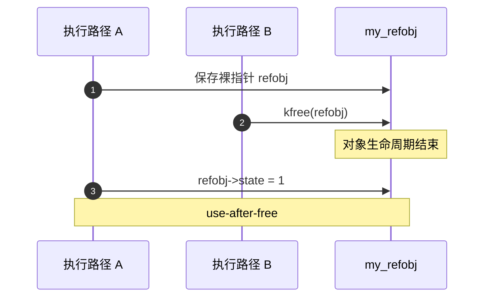
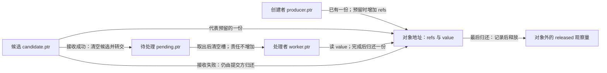
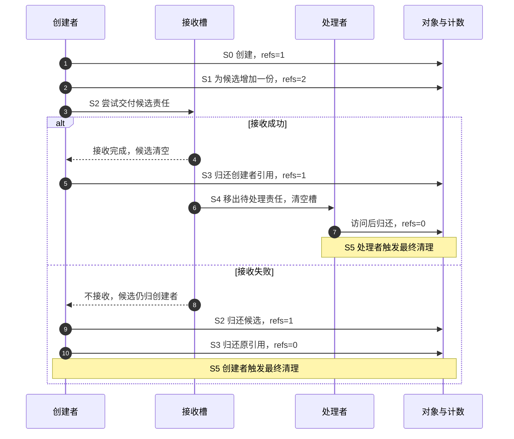
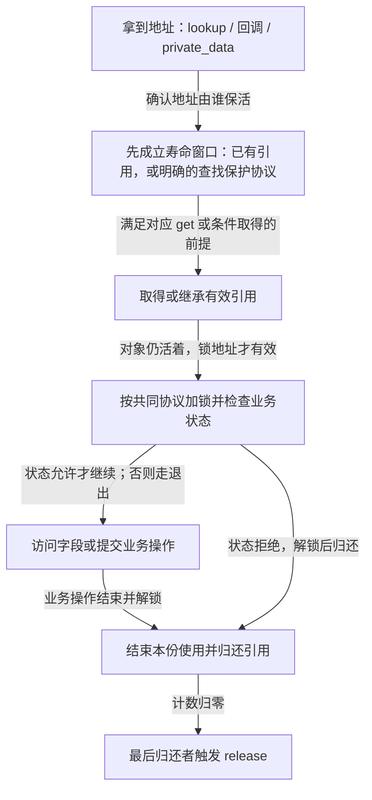
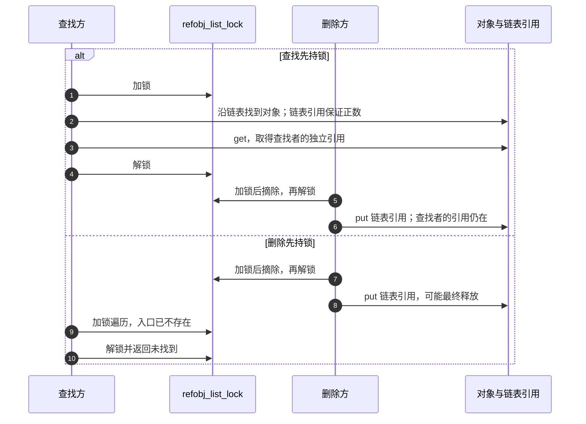

# 第1章\_kref\_要解决什么问题

## 1.1\_本章主线

前面的数据结构让我们能够把对象放入链表、哈希表或树，再找到它。现在留下一个问题：**从容器中找到一个地址之后，谁保证那块内存仍属于这个对象？** 本章从 C 指针和 `malloc/free` 的基础出发，先建立使用期限与归还责任，再讨论 Linux 的 `kref`；不用记住后面所有接口才能理解这里的问题。

设创建者分配一个请求，先在当前函数中计算，再交给一个稍后运行的处理者。同步调用时，创建者等函数返回后才释放请求，调用栈已经给出了明确的先后关系。改成异步处理后，提交函数返回并不表示处理结束：创建者可能先退出，处理者以后才访问请求。原先“返回以后就能释放”的规则因此失效。

可以让创建者一直等待处理完成。这在必须同步取得结果的场景中很合适，但会把创建者的结束时间绑在处理者身上；有多个独立使用者时，等待协议还要准确收集每一方的结束。引用计数选择另一种分工：每一份独立使用权都承担一份归还责任，最后归还者触发回收。`kref` 是 Linux 给自定义内核对象使用的这类生命周期工具。

这个工具不替我们决定字段怎样互斥、容器怎样更新、设备是否在线，也不自动阻止回调重入或锁顺序错误。后半章继续划清这些边界；眼前先解决一件事：**对象何时可以结束，而不是谁可以同时修改它。**

------

## 1.2\_裸指针共享为什么危险

`struct my_refobj *refobj` 保存一个地址。复制这个变量不会通知分配器“又多了一个使用者”，也不会使 `free()` 或 `kfree()` 自动推迟。所谓裸指针，是指仅有地址、没有随之兑现的所有权保证；并不是说 C 指针天生不可共享。

先把原来正确的同步过程和异步变化放在一起看：

| 时刻 | 同步调用，有外层保活 | 只复制地址，未建立独立保活 |
| --- | --- | --- |
| T0 | 创建者分配对象 | 创建者分配对象 |
| T1 | 被调用函数借用对象，创建者尚未返回 | 创建者把地址放入待处理槽 |
| T2 | 被调用函数结束，停止访问 | 创建者释放对象，处理者尚未读取 |
| T3 | 创建者释放对象 | 处理者读出旧地址并访问字段 |

左边的指针传递没有问题，因为最后一次使用先于释放。右边失败的原因不是“调用了另一个函数”，而是 **原来的保护期限已经结束，新的使用期限却没有被任何协议覆盖**。

在内核中，如果执行路径 A 正要写 `refobj->state`，执行路径 B 同时 `kfree(refobj)`，仅给字段写操作加一个与 B 无关的锁也不够：B 没有参与这把锁的协议，仍可先释放整块对象。我们要协调的是释放与所有有效使用者，而不只是两个字段访问。

------

## 1.3\_use-after-free\_的本质

释放后使用称为 **use-after-free（UAF）**。它不是指保存地址的变量消失了，而是原对象已经结束，代码仍试图通过旧地址访问它。在 C 语言中，这类访问没有合法语义，不能把一次“似乎还读到了原值”当作安全证据。

内核释放后的内存可能回到 slab 对象分配器，也可能再次分配给其他对象；调试配置可能填充用于发现误用的 poison 标记，或者由内核地址检查器 KASAN 标记访问非法。这些情况解释了为什么错误可能表现为立即告警、随机崩溃，也可能表现为悄悄写坏另一对象的数据。是否出现某一种表现取决于分配与调试配置，错误本身不以告警为成立条件。



这是一条错误时序的说明图，本章实验不会故意执行这次非法访问。要消除它，A 必须在原有保活保证消失之前获得独立引用，或者始终在另一个有效持有者提供的借用期限内完成访问。

------

## 1.4\_kref\_解决的不是\_有没有指针\_而是\_有没有引用

这里的“持有一个引用”是一份协议责任：当前路径可以在约定的范围内继续使用对象，并且必须在结束时恰好归还这一份责任。对象内部的计数汇总尚未归还的份额；它不知道保存了多少个地址变量，也不知道这些变量属于哪个线程。

| 动作 | 是否新增归还责任 | 原因 |
| --- | --- | --- |
| 在同一持有者内令 `alias = refobj` | 否 | 只是另一种访问已有对象的写法 |
| 同步调用 helper，返回前不保留地址 | 通常否 | 调用者的有效引用覆盖整段借用 |
| 交给可在调用者退出后运行的 worker | 需要独立责任，或转交原责任 | 使用期限已经脱离原调用栈 |
| 放入全局表或队列 | 由容器协议明确 | 有的容器拥有引用，有的只索引由其他机制保活的对象 |
| 同一路径分别持有两项需要独立归还的权利 | 是，两份 | 计数不等于线程数量 |

“长期使用”因此不是某个毫秒门槛，而是 **使用权能否跨越现有保护期限**。一次很快的异步回调也需要闭合责任；一个持续很久但严格处于持有者保护内的同步调用，可以只借用。借用者不能把地址悄悄保存到全局变量，然后在借用结束后继续访问。

已有有效引用时，持有者可以在自己归还之前为另一方增加一份；只捡到一个可能已经失效的地址时，却不能先去增加其内部计数再试图证明它有效。后者连计数所在的内存都未获保护，是后文 lookup（按入口查找对象）必须解决的窗口。

------

## 1.5\_为什么引用计数可以解决生命周期问题

先在抽象模型中规定：对象创建时有一份责任；增加独立持有会增加一份；结束持有会归还一份；责任转交只换持有者，不增加总数。只要所有真实使用期限都被覆盖，计数归零就表示没有合法持有者仍需使用它。最后一方于是可以触发销毁。

这不是单一的“计数状态机”。至少有两组相互约束的状态：对象中的计数，以及创建者、候选交付槽、待处理槽和处理者各自持有哪些责任。队列是否接收又是另一项状态。Linux 的 `kref` 不替我们保存持有者名单，**名单与计数一致** 是使用者协议要维持的不变量。



在同一个周期中，谁写什么状态可以逐项说明：

| 阶段 | 触发与写入者 | 状态变化与后续读取者 |
| --- | --- | --- |
| S0 创建 | 创建者成功分配 | 对象 `refs=1`，`producer.ptr` 指向它；创建者可同步借用 |
| S1 预留 | 创建者尚持有效引用 | `refs:1→2`，候选槽取得新责任；原有引用仍有效 |
| S2 交付 | 接收方接受或拒绝 | 接受时候选槽清空、待处理槽接收，计数仍为 2；拒绝时提交者归还候选，计数回到 1 |
| S3 创建者结束 | 创建者清空自身槽并归还 | 成功分支剩 1；拒绝分支降到 0 并直接进入 S5 |
| S4 处理 | worker 取走待处理槽责任 | 待处理槽清空，worker 读对象，完成后归还最后一份 |
| S5 回收 | 使计数降到 0 的路径 | 执行最终清理；任何路径都不能继续通过旧地址取引用 |

S3 与 S4 也可以交换：处理者很快结束时，创建者仍持有最后一份。重要的是引用先于交付成立，而不是强制谁最后运行。



真实并发实现还必须使队列发布和读取有同步保证；给计数加一并不会自动把对象字段、槽内容和通知一起安全地发布。这里先把责任顺序建立起来，再在后续锁与 RCU 章节落实通信机制。RCU 是读侧临界区与延迟回收协议，不是随意读写共享字段的通行证。

对应 Linux 时，`kref_init()` 建立初始引用，`kref_get()` 从已有有效持有增加一份，`kref_put()` 归还一份并在归零时调用 `release` 回调。`kref_init()` 必须在分配成功后调用。`release` 是最终清理的入口；简单对象可以在里面 `kfree()`，复杂对象可能继续安排延迟销毁，不能把所有回调都等同于立即释放内存。结构与源码关系留给[下一章](P02_源码入口与结构定义.md)。

------

## 1.6\_kref\_的核心问题不是加减\_而是所有权

下面用同一组责任槽运行 S0～S5，再改变交付与结束顺序，检查计数能否始终对应尚未归还的份额。

### 1.6.1\_运行完整的责任交接模型

下面的 C11 程序把上面的周期落实为可执行步骤，文件为[reference_ownership.c](../../../../labs/kernel/object_lifetime/materials/reference_ownership.c)。`owner.ptr` 非空代表一份归还责任；只有 `share()` 可以复制一份责任，`move()` 只转交，`drop()` 清空槽并归还。普通结构赋值不能用来复制 `owner`，C 的类型系统不会替我们执行这条限制。

这个程序是 **串行所有权模型**：没有内核工作队列，也没有原子操作；`submit()` 的布尔参数控制接收与拒绝。它验证责任如何闭合，不验证并发内存序、真实调度或 `refcount_t` 的饱和保护。为便于观察，两条主路径都按创建者先退出、处理者后执行的顺序运行。标准库宏 `UINT_MAX` 表示无符号整数上限，用于拒绝计数溢出；`EXIT_FAILURE` 和 `EXIT_SUCCESS` 分别表示进程失败和成功退出。

```c
#include <assert.h>
#include <limits.h>
#include <stdbool.h>
#include <stdio.h>
#include <stdlib.h>

struct object {
    unsigned int refs;
    int value;
};

/* 一个非空槽代表一份归还责任，禁止用结构赋值复制持有者。 */
struct owner { struct object *ptr; };
static unsigned int released;

static bool create(struct owner *dst)
{
    assert(!dst->ptr);
    struct object *obj = malloc(sizeof(*obj));
    if (!obj)
        return false;
    *obj = (struct object){ .refs = 1, .value = 42 };
    dst->ptr = obj;
    return true;
}

static void share(struct owner *dst, const struct owner *src)
{
    assert(!dst->ptr && src->ptr);
    assert(src->ptr->refs > 0 && src->ptr->refs < UINT_MAX);
    ++src->ptr->refs;
    dst->ptr = src->ptr;
}

static void move(struct owner *dst, struct owner *src)
{
    assert(!dst->ptr && src->ptr);
    dst->ptr = src->ptr;
    src->ptr = NULL; /* 责任转交，计数不变。 */
}

static void drop(struct owner *slot)
{
    assert(slot->ptr && slot->ptr->refs > 0);
    struct object *obj = slot->ptr;
    slot->ptr = NULL; /* 先结束本槽使用权，再执行可能的释放。 */
    if (--obj->refs == 0) {
        ++released; /* 观察量位于对象外，释放后不再读取对象。 */
        free(obj);
    }
}

static int borrow(const struct object *obj)
{
    return obj->value; /* 调用期间由调用者的现有引用保活。 */
}

/* 成功才接收候选引用；拒绝时候选仍归调用者。没有真实工作队列。 */
static bool submit(struct owner *pending, struct owner *candidate,
                   bool accept)
{
    assert(!pending->ptr && candidate->ptr);
    if (!accept)
        return false;
    move(pending, candidate);
    return true;
}

static void consume(struct owner *pending)
{
    struct owner worker = {0};
    move(&worker, pending);
    assert(borrow(worker.ptr) == 42);
    drop(&worker);
}

int main(void)
{
    /* 两次运行分别观察提交成功与失败，均须恰好释放一次。 */
    for (unsigned int accept = 0; accept < 2; ++accept) {
        struct owner producer = {0}, candidate = {0}, pending = {0};
        if (!create(&producer)) {
            fputs("allocation failed\n", stderr);
            return EXIT_FAILURE;
        }
        assert(borrow(producer.ptr) == 42 && producer.ptr->refs == 1);
        share(&candidate, &producer);
        assert(producer.ptr->refs == 2);
        bool queued = submit(&pending, &candidate, accept != 0);
        if (!queued)
            drop(&candidate); /* 发布失败，归还预留的那一份。 */
        drop(&producer);
        if (queued) {
            assert(pending.ptr->refs == 1);
            consume(&pending);
        }
        assert(!producer.ptr && !candidate.ptr && !pending.ptr);
        assert(released == accept + 1);
        printf("accept=%u released=%u\n", accept, released);
    }
    return EXIT_SUCCESS;
}
```

在程序所在目录运行，保持断言开启：

```bash
cc -std=c11 -Wall -Wextra -Werror -O2 reference_ownership.c -o reference_ownership
./reference_ownership
```

预期输出：

```text
accept=0 released=1
accept=1 released=2
```

`released` 是累计值，且放在对象之外。第一行说明拒绝时由创建者回收；第二行说明成功时由最后的处理者回收。我们没有在 `free()` 后读取对象计数，也没有用“这次没崩溃”证明安全。

对照代码观察三处动作：`borrow()` 只读取值，调用前后责任数仍为 1；`share()` 把总数变为 2；成功 `submit()` 和 `consume()` 内的 `move()` 只更换责任所在槽。失败分支不会把责任交给任何 worker，因此必须由提交方归还预留份额。

### 1.6.2\_改变交付方式再检查不变量

1. 成功提交以后，先 `consume(&pending)`，再 `drop(&producer)`，最后回收者是谁？计数是否还能闭合？
2. 如果创建者提交后不再需要对象，能否直接把 `producer` 交给 `submit()`，省掉 `share()`？拒绝时又由谁负责？
3. 把成功交付后的 `candidate` 当作仍持有责任再 `drop()`，模型会怎样？如果漏掉拒绝时的 `drop(&candidate)`，又会怎样？
4. 同步 helper 返回前不保存地址，却为每个指针别名都 `share()`，这是必要保证还是额外成本？

第一题仍然正确：worker 把 2 减到 1，创建者最后归还触发回收；但是不能把只适用于原顺序的“待处理槽此时剩 1”断言照搬。第二题可以，成功时创建者槽已清空，不能再归还；失败时槽仍归创建者，必须自行结束使用并归还。第三题的重复归还会在本模型被空槽断言拒绝，遗漏归还则使计数无法到零；真实裸指针程序未必能在错误发生处立即告警。第四题只要借用期限可靠便不需要新增责任，额外 get/put 会增加计数更新成本，并扩大必须逐路径配对的范围。

现在可以审查最初那组问题：谁应该 get、谁应该 put，队列或全局表是否拥有一份，交付失败由谁清理，lookup 期间谁保护地址，release 调用时哪些外部结构还活着。**多 get 少 put 会泄漏，少 get 多 put 会提前结束对象，归还后继续访问会 UAF；交付后才给接收者补引用以及无保护 lookup 后直接 get，都不能补回已经失去的寿命保证。** 这些错误不是多写几处加减就能修复，需要把每条路径的归还责任画清楚。

------

## 1.7\_kref\_不解决并发互斥问题

前六节已经解决“谁还需要对象”。现在假设两个处理者各自持有有效引用，同时修改 `state`。对象不会因为其中一方结束而提前释放，但两个修改仍可能相互干扰。要看清差别，可以先把一次 `state++` 拆成读旧值、计算、写回三个概念动作：

| 时刻 | 处理者 A，持一份引用 | 处理者 B，持一份引用 |
| --- | --- | --- |
| T0 | 读到 state=0 | 读到 state=0 |
| T1 | 在寄存器中得到 1 | 在寄存器中得到 1 |
| T2 | 写回 1 | 写回 1 |

这条时间线说明了丢失更新的来源；真正无同步的 C 数据竞争不能被当作只会出现这一个结果。两份引用只覆盖对象寿命，没有串行化字段的读改写。

给对象增加互斥锁，并要求所有冲突访问走同一把锁，才能让第二位处理者在第一位写回之后再读。下面是 **已有有效引用且可睡眠的进程上下文** 中的字段操作片段，不是完整模块：

```c
mutex_lock(&refobj->lock);
refobj->state++;
mutex_unlock(&refobj->lock);
```

这里不必为了同步调用再加一对 get/put。进入锁操作前必须已经保活整个对象，因为锁本身也嵌在对象内；不能对可能已经释放的 `refobj->lock` 加锁来挽救寿命。



本专题的直接对象是自行定义并嵌入 `struct kref` 的请求、会话、缓存项或设备私有对象。Linux 设备核心框架（driver core）中的 `struct device`、`struct class`、`struct bus_type` 则有分层管理规则；不能给这些框架对象套一份私有 `kref + kfree` 模板。设备使用 `get_device()/put_device()` 等框架接口，最终释放还涉及设备类型或类的 release 分发。`kobject` 是框架的基础对象机制，它与裸 kref 的边界留到[P11](P11_kref_refcount_t_kobject_的边界.md)。这里仅要求先分清正在管理的是哪一层对象。

因此，私有 kref 不负责替设备判断是否已移除、是否允许新请求、谁有独占访问权，也不负责容器节点、内部缓存和寄存器访问的并发一致性。锁、业务状态、查找保护及设备框架各有自己的协议；把它们列在一张图里，并不表示任选一个就能满足全部条件。

------

## 1.8\_生命周期保护和字段保护的区别

把“对象活着”和“数据一致”分开，还不足以直接选出同步原语。必须进一步说明保护哪组动作，以及谁遵守相同规则：

| 工具或协议 | 解决的具体问题 | 仍须补足的条件 |
| --- | --- | --- |
| 有效 kref 引用 | 本份使用期限内，引用协议不允许最终释放对象 | 不自动锁住字段，也不能凭一个地址取得引用 |
| mutex 互斥锁 | 串行化同一锁下的字段访问或状态事务 | 只能在允许睡眠的上下文使用，所有冲突方必须配合 |
| spinlock 自旋锁 | 保护适合短临界区的共享更新 | 是否需要屏蔽本地中断取决于参与上下文，不能把普通加锁等同于中断安全 |
| RCU 读侧与回收协议 | 让受保护读者沿发布的结构读取，并推迟旧对象回收 | 需要正确发布、删除和延迟释放；写者互斥及可变字段一致性要另定 |
| atomic 原子操作 | 对规定变量完成不可分割更新 | 不自动把多个字段或整项业务变成一个事务 |

后两行尤其容易误解：RCU 并不自动让任意字段读写一致，某个字段用了原子加法也不表示“读状态、操作硬件、记录结果”整体受到保护。需要对一组字段取得一致快照时，还可能采用序列计数等协议；具体选择由读写参与者和重试条件决定，不由 kref 替它决定。

保持有效引用之后，我们有了继续制定字段规则的基础。若读者连“所有修改这项状态的路径是否使用同一把锁”都答不出，就不能宣布对象线程安全。

------

## 1.9\_kref\_适合什么场景

适合引用计数的问题通常具有多个独立使用期限：请求交给异步工作，连接被多个会话保存，缓存项在移出索引后仍供已取得引用的读者使用，或驱动私有对象同时被用户入口和完成回调持有。它们可以出现在 list、hash、xarray、idr 等容器里，但 **放入容器这个动作本身不会自动获得引用**。

以原来的请求对象为例，里面可能同时包含引用字段、链表节点、完成通知、结果状态和数据缓冲区。提交线程、硬件完成中断、超时定时器、取消路径以及 debugfs 调试查询都可能接触它。每一项职责必须分别决定是否独立持有，不能按这张名单机械地初始化为五个引用。

例如，取消与硬件完成如果都可能发生，就要指定谁有权完成请求，以及谁撤销另一条路径。仅由取消方归还自己的引用，并不表示中断再也不会到达；仅由完成通知唤醒等待者，也不表示所有 timer 和回调已经退出。`completion` 是等待/完成通信工具，本身不是对象持有者；是等待方或完成方的协议承担引用。

反过来，若对象只在一个同步函数及其 helper 内使用，栈对象或明确的创建/销毁作用域通常更直接。若框架已经提供引用接口，就优先遵循框架规则。独立引用会增加计数更新、跨路径配对和错误清理成本；不要为了“更安全”再套一层无人解释的计数。

------

## 1.10\_为什么\_多个地方能拿到对象\_时必须有生命周期协议

不使用引用计数也能有正确的生命周期协议。例如所有使用都在同一把锁的临界区内完成，销毁者取锁后关闭入口并释放；或者由拥有者停止新请求、等待所有使用者退出后统一回收。只要覆盖了所有参与者，这些方案同样成立。

引用计数的价值是把独立使用期限汇总为可执行的退出条件：A 用完归还 A 的份额，B 用完归还 B 的份额，最后的归还触发 release。调用者无需知道究竟是 A 还是 B 最晚结束。但这份“全局结论”只涵盖 **已经正确登记的责任**，不会发现偷偷保存的裸指针。

读者因此要同时审查安全性与能否结束：少登记一份，可能提前释放；漏归还一份，可能永远不释放；对象互相持引用形成环，也不会自动降到零。容器拥有的引用何时撤下、取消路径怎样完成退出，都必须在应用协议里有答案。

------

## 1.11\_kref\_不能替代对象状态机

对象内存存在时，业务仍可能处于初始化、运行、停止中、已失效、错误或设备已移除等状态。计数轴回答“哪些责任仍未归还”，业务状态轴回答“允许做什么”；它们可以独立变化。例如旧文件描述符仍保留私有对象，但设备已经拒绝新请求。

用 `online` 布尔字段表示“软件允许进入操作”时，检查必须与软件停止路径使用同一个同步协议。下表在已有引用的前提下，比较两种时序：

| 阶段 | 有效协议 | 缺口 |
| --- | --- | --- |
| 进入 | 操作者持锁检查 online | 无锁读到 online=true |
| 操作 | 协议要求保护的动作在同一临界区完成 | 检查后解锁，停止路径开始拆除硬件资源 |
| 停止 | 停止者取得同一把锁后改为 offline，拒绝新操作 | 操作者依据旧读值继续访问已拆资源 |

下面仅是第一列的进程上下文片段，`-ENODEV` 表示设备不可用；调用者持有引用并负责最终归还：

```c
mutex_lock(&refobj->lock);
if (!refobj->online) {
    mutex_unlock(&refobj->lock);
    return -ENODEV;
}
/* 在共同的停止协议下完成本次受保护操作。 */
mutex_unlock(&refobj->lock);
```

这个片段不能单凭一个布尔值保证物理硬件永远在线。真实热拔插、在途直接内存访问 DMA（Direct Memory Access，由设备访问内存）和中断、异步输入输出 I/O（Input/Output） 还可能要求框架保活、停止提交、等待完成和硬件隔离；若操作必须越过锁的期限，还要建立独立的在途操作协议。这里证明的是“软件检查与软件状态转移不穿插”，不是“检测值等于永久硬件事实”。

------

## 1.12\_kref\_不能单独解决\_lookup\_问题

原来的全局链表例子保留如下角色：每个对象有链表成员 `struct list_head node` 和整数标识 `int id`，全局链表头 `refobj_list` 用于查找，互斥锁对象 `refobj_list_lock` 负责查找与摘除。仅遍历得到地址后调用 get，仍可能发生“读到地址 → 删除方摘除并释放 → 查找方访问内部计数”的 UAF。

先选定一种容易证明的协议：**链表中的每个对象由链表拥有一份引用，插入、查找取引用和摘除共用同一把锁。** 查找方持锁完成匹配和 get，得到独立引用后才解锁。删除方持锁摘除，解锁后归还链表的那份引用。于是查找与删除有两个可解释的顺序：



这里能直接 get，不只因为“拿了锁”，还因为 **在锁保护下可达的对象拥有链表引用**。另一种设计可能让归零后的析构路径才摘除节点，这时就要重新证明计数与删除顺序，不能复制当前结论。

RCU 查找还要分两件事：读侧窗口保证访问的内存尚未被回收，而 `kref_get_unless_zero()` 只在计数非零时增加并返回成功。调用者必须检查返回值；RCU 本身不会保证计数仍为正，条件增加也不会凭空保护已经失效的计数地址。锁查找与条件取得在[P08](P08_lookup_场景与_kref_get_unless_zero%28%29.md)细化，RCU 的回收及对象身份边界在[P10](P10_kref_与_RCU.md)展开。

------

## 1.13\_kref\_的三个核心角色

回看责任图，计数、持有者和最终清理分别落在三个位置。它们并非一个自动追踪所有指针的外部管理器。

### 1.13.1\_角色一\_对象本身

自定义对象把 `struct kref ref` 嵌在内部，与业务字段一起分配。计数是对象生命周期的一部分，读取计数也需要对象地址有效。完整实例中的 `struct note_request` 还嵌入一个工作项 `work`；它们是同一分配对象的不同成员，不是两块独立可释放的内存。

### 1.13.2\_角色二\_持有者

创建者、调用者、队列、定时器或其他子系统路径可以按协议持有引用。初始引用来自初始化，新份额来自有效持有下的 get，接收交接也可以继承旧份额。退出时归还自己的那份；不能因为有一个地址变量，就替别人的份额 put。

若同一路径另有一份有效引用，交出一份后仍可依靠保留的那份访问。若交出的是自己唯一的一份，则不能再访问。这比“handoff 后任何情况都不能访问”的口号精确，且与责任求和一致。

### 1.13.3\_角色三\_release\_回调

最后一份归还时，`kref_put()` 调用提供的 `release` 函数。参数是嵌入成员的地址，不一定是整个分配块的首地址；因此示例通过 `container_of()` 根据成员位置找到外层对象，再清理并释放。不能把 `kfree` 直接当作这个回调。

`release` 是引用归零后清理的入口。简单对象可以立即释放，复杂对象可能清理子对象，或者安排 RCU 延迟回收；允许做什么还取决于最后归还发生的上下文和锁状态。回调不能假定自己一定在创建线程运行，也不能假定一定允许睡眠。[P06](P06_release_回调与复杂销毁模式.md)继续讨论复杂销毁，本章的完整模块只采用可立即释放的简单对象。

------

## 1.14\_为什么不能把\_kref\_当成普通计数器

`kref_read()` 提供计数快照，却不会为调用者新增引用、关闭入口或取得字段独占权。先考虑一个容易说错的情况：**自己仍持有一份有效引用时，其他守约持有者不能把计数减到零并释放对象。** 不能拿“别人可能随时 put 到零”解释此时的风险。

真正的问题是，读到 1 并不能推出“下一步只有我能访问字段”。同一引用可能覆盖同步借用，另一个受保护入口也可能允许新持有者取得引用；如果协议没有排除这些路径，快照与后续写操作之间就没有独占保证。反过来，如果应用另有机制关闭所有新增入口、排除借用，并已建立同步，那么能否原地修改应由那套机制证明，不能只由数字 1 证明。

另一种情况是自己已经 put，看到函数返回 0，误以为“对象还在，可以再访问”。返回 0 只表示 **这次归还没有触发 release**；剩余持有者可能紧接着归还最后一份。除非自己另有有效保活依据，当前路径必须停止访问。

因此需要明确三个问题：此刻我凭哪份责任访问；取得新责任时已有何种保活窗口；归还后还剩什么属于我的保证。普通原子计数读数和 kref 操作都不能替代这些答案。

------

## 1.15\_kref\_的正确思维模型

把结论收束成审查表，可以避免在每个场景重新混合不同保证：

| 问题 | 引用协议能证明什么 | 还需要什么 |
| --- | --- | --- |
| 使用中会不会最终释放 | 自己持有有效引用期间不会 | 所有使用者守约，无非法 free/put |
| 字段是否一致 | 没有额外保证 | 对相应字段及上下文有效的同步 |
| 全局入口能否安全取对象 | 取得引用后延长寿命 | lookup 到取得之间的保护 |
| 谁触发最终清理 | 最后归还者调用 release | release 的上下文和依赖满足要求 |
| 业务能否继续 | 对象仍可保存错误或停止状态 | 业务状态机、设备框架和在途操作规则 |
| put 后是否还能访问 | 归还的那份不再提供保证 | 另有有效引用或其他明确的保活依据 |
| 读到计数 1 是否独占 | 只得到一个瞬时观察 | 排除新增、借用及并发访问的独立协议 |

`kref` 不是可以拿一个任意地址去询问“它还活着吗”的探测器；它让已经正确建立的使用期限与最后回收建立联系。

------

## 1.16\_一个完整的错误模型

原来的错误是把对象先交给 worker，再给 worker 补引用。为避免用一句“可能提前释放”跳过推导，明确初始责任：创建者拥有唯一一份，worker 的代码约定完成时归还自己的那份。若顺序写反，接收者其实没有获得那一份。

| 时刻 | 创建者 | worker | 计数与问题 |
| --- | --- | --- | --- |
| T0 | 初始化一份 | 尚未运行 | 1，只属于创建者 |
| T1 | 先 queue_work | 开始读对象 | 仍为 1，尚未预留 worker 责任 |
| T2 | 尚未补 get | 按约定 put | 错误地归还了未交付的份额，降为 0 |
| T3 | 尝试 get | 已返回 | 对已释放地址操作 |

这一反例的关键是 **worker 归还了一份尚不存在的责任**。若它本来已有独立引用，创建者仍持原引用时就不能沿用这条“必被释放”的推导。

### 1.16.1\_运行一次真实工作交付

下面的完整模块只创建一个新对象、投递一次、没有重排或外部生产者。它落实 S0～S5：初始化创建者引用，投递前预留，成功后两方各归还一次，卸载前等待私有队列完成。文件为[note_kref_work.c](../../../../labs/kernel/object_lifetime/materials/note_kref_work.c)，配套 [Makefile](../../../../labs/kernel/object_lifetime/materials/Makefile)。若尚未完成内核模块的构建课程，可先阅读过程，稍后按[构建入口](../../../../engineering/build/kernel_modules/P01_从C文件到匹配目标内核的模块.md)准备目标环境。

`work_struct` 保存交给工作队列的工作项，`INIT_WORK()` 为它关联回调；私有有序队列由 `alloc_ordered_workqueue()` 创建。`queue_work()` 返回是否成功排入，`destroy_workqueue()` 在本例无新生产者的前提下等已提交工作结束再销毁队列。成功 queue 的发布契约使本次投递前初始化的 `value` 能被回调看到；后续并发修改仍需单独同步。它们提供执行与等待，不替业务对象增加 kref。

代码中的 `GFP_KERNEL` 是允许睡眠的内核分配标志，本例初始化在进程上下文；`-ENOMEM` 表示分配失败，`-EIO` 是这里对意外投递拒绝选择的错误返回。模块入口、日志和许可证声明沿前置模块课程使用，不把这些构建声明当作引用协议的一部分。

```c
// SPDX-License-Identifier: GPL-2.0
#include <linux/errno.h>
#include <linux/kref.h>
#include <linux/module.h>
#include <linux/slab.h>
#include <linux/workqueue.h>

struct note_request {
    int value; /* 将 ref 放在非首成员位置，回调必须按成员偏移还原。 */
    struct kref ref;
    struct work_struct work;
};

static struct workqueue_struct *note_wq;

static void note_release(struct kref *ref)
{
    struct note_request *request = container_of(ref, struct note_request, ref);
    pr_info("note_kref: release\n");
    kfree(request);
}

static void note_worker(struct work_struct *work)
{
    struct note_request *request = container_of(work, struct note_request, work);
    pr_info("note_kref: value=%d\n", request->value);
    kref_put(&request->ref, note_release);
    /* 归还后不再访问 request，包括嵌入的 work。 */
}

static int __init note_init(void)
{
    struct note_request *request;

    note_wq = alloc_ordered_workqueue("note_kref", 0);
    if (!note_wq)
        return -ENOMEM;
    request = kzalloc(sizeof(*request), GFP_KERNEL);
    if (!request) {
        destroy_workqueue(note_wq);
        return -ENOMEM;
    }

    kref_init(&request->ref); /* 初始引用属于创建者。 */
    request->value = 42;
    INIT_WORK(&request->work, note_worker);
    kref_get(&request->ref); /* 在发布前为一次 worker 执行预留引用。 */
    if (!queue_work(note_wq, &request->work)) {
        /* 本例全新且仅提交一次；拒绝分支防御性归还两份责任。 */
        kref_put(&request->ref, note_release);
        kref_put(&request->ref, note_release);
        destroy_workqueue(note_wq);
        return -EIO;
    }
    kref_put(&request->ref, note_release); /* 创建者结束，之后不再碰对象。 */
    return 0;
}

static void __exit note_exit(void)
{
    /* 队列只由本模块提交一次，无重排；等回调退出后才卸载代码。 */
    destroy_workqueue(note_wq);
}

module_init(note_init);
module_exit(note_exit);
MODULE_LICENSE("GPL");
MODULE_DESCRIPTION("一次工作交付的引用责任实验");
```

在源码匹配、配置和构建产物准备完成的独立实验环境中，采用标准外部模块命令；`KERNEL_BUILD` 指向目标内核构建目录，交叉编译参数沿构建课程设置：

```bash
make -C "$KERNEL_BUILD" M="$PWD" modules
sudo insmod ./note_kref_work.ko
sudo rmmod note_kref_work
sudo dmesg | tail -n 20
```

一次成功加载应出现 `note_kref: value=42`，最终恰有一条本次模块的 `note_kref: release`；其他内核日志可能夹在中间。处理者可能早于创建者归还，也可能晚于它，二者都合法。对象最后由谁归还不影响结果，卸载时私有队列确保回调代码不再运行。这是预期观察步骤，**本轮未实际装载或卸载目标模块**。

### 1.16.2\_失败和退出还剩哪些责任

工作队列分配失败时，没有对象；对象分配失败时，销毁已创建队列。投递若拒绝，本次预留没有被 worker 接收，需归还预留及创建者两份。当前例子的工作项是全新且仅投递一次，通常应成功；拒绝路径是防御性处理，不是宣称 `queue_work()` 对新工作会随机分配失败。

对于重复提交的一般程序，false 可能表示工作已在等待等情形，**不能据此取消或归还以前那次提交已拥有的责任**。每次“预留新份额”必须与本次是否成功产生执行责任配对；重排、取消和复用还要建立单独状态机。本例刻意不具备这些入口，不可直接扩展为通用队列封装。

同样，`destroy_workqueue()` 不自动阻止其他代码未来再投递，也不自动释放业务对象。本例只有初始化的一次提交，worker 不重排，才有封闭的生产者集合；更完整驱动要先关闭用户入口、定时器和中断等生产者。固定版本的[工作队列源码总索引](../../../../research/source_reading/workqueue/navigation/P01_Linux_6.12_工作队列源码总阅读索引.md#1.6_建议阅读顺序)以及[生命周期模块导读](../../../../research/source_reading/workqueue/navigation/P04_Linux_6.12_flush取消与生命周期模块源码概念导读.md#4.5_destroy与对象生命期)承担后续实现阅读，不在此复制 worker 和队列内部算法。

------

## 1.17\_临时使用\_和\_长期持有\_的区别

回访前面的 `borrow()`：调用者持有引用，helper 同步返回且不保存地址，整个借用期限都在调用者保护内，因此无需重复 get。若 helper 修改字段，则另外遵守字段同步；“无需新增引用”并不表示“无需锁”。

把地址保存为 `global_refobj` 则改变了责任边界。仅执行 `global_refobj = refobj`，没有声明谁保活、谁替换和谁最终归还。即使赋值前 get，也仍要处理旧值以及并发读取。以“槽拥有一份引用、槽的读写共用一把锁”为例，一次替换至少包含：

1. 来自有效持有者的新对象在发布前预留槽引用；允许清空时新值可以是空。
2. 持槽锁保存旧值、发布新值；查询者必须在同一锁下读到非空对象并取得自己的引用，才能带出锁外。
3. 解锁后归还旧槽引用；这样即使旧对象的 release 有额外清理，也不把它无意中放进槽锁内。
4. 关闭槽时按同一协议置空并归还旧值，再处理外部入口的结束。

旧值和新值恰好相同时，一次预留和一次旧槽归还可以相抵，但读者仍须检查具体接口约定。这里保留原全局保存场景，同时明确它不是“get 后写全局变量”两行就完成的线程安全模板。

------

## 1.18\_kref\_和\_handoff

handoff 是 **引用所有权转移**。创建者已经不再需要对象时，可以直接让队列接收现有引用，省去额外的 get/put；前面 C 模型的 `submit(&pending, &producer, accept)` 就表达这种契约。

必须同时写清成功和失败：成功时队列接管原责任，创建者槽清空；失败时未转交，创建者仍拥有并负责归还。若接口选择“无论成功失败都消费传入引用”，那是另一种契约，调用方不能照搬前一种失败清理。接口名称本身无法告诉我们是哪一种。

可以在调用点这样记录约定，而不是仅写一句“已经入队”：

```c
/* 成功转交本路径唯一的引用，之后不再访问对象。
 * 拒绝则仍由本路径归还；具体分支由接收接口的返回值决定。
 */
```

若调用者还要继续使用，就保留自己的一份并为队列预留新份额，采用 1.16 的模型。选择直接交接还是共享，依据的是两个使用期限是否同时存在，不是哪个写法 get/put 更少。

------

## 1.19\_kref\_设计最重要的几个问题

审查一个对象时，可沿完整生命周期填写下面的账本，而不是先到处寻找加一减一的位置：

| 阶段 | 必须说清的问题 |
| --- | --- |
| 创建 | 谁分配对象，失败怎样返回，初始引用归谁？ |
| 保存 | 哪些路径只是借用，哪些有独立期限，容器是否拥有引用？ |
| 取得 | 从全局 list/hash/xarray/idr 找到地址时，谁保护查找窗口并保证取得条件？ |
| 交接 | 接收成功和失败分别由谁归还，是否可能重复提交、取消或重排？ |
| 业务访问 | 哪组字段用什么同步，设备是否允许请求，在途操作是否需要独立保护？ |
| 关闭 | 何时移除全局入口、停止生产者、等待借用者或异步路径退出？ |
| 归零 | 最后一份可能在哪些上下文归还，release 是否需要锁，会不会反向依赖当前锁？ |
| 回收 | 能否直接释放，是否须 RCU 延迟回收，子对象及模块代码是否仍有效？ |

如果对象间互相拥有引用，还要画出可能的环以及谁负责打断。正确性依赖完整的责任图，代码中出现 `struct kref` 并不能证明图已经闭合。

------

## 1.20\_本章小结

本章从同一请求的同步调用进入异步交付，建立了三种不同动作：借用沿用已有保护，共享增加独立责任，交接只转移已有责任。C 模型让这三者可观察，内核模块进一步展示投递前预留、失败归还以及回调退出先于模块卸载。

现在能够证明的是：在所有参与者遵守引用协议、没有绕过它非法释放的前提下，一份有效引用覆盖自己的使用期限，最后归还触发最终清理。仍然不能由此推出字段一致、lookup 自动安全、设备在线、锁顺序正确或 RCU 宽限期已经结束。每一项都需要相应的状态和通信协议。

用三个问题自测：已有引用下读到计数 1，为什么还不能直接宣称独占？同一工作项提交失败，为什么不能替早先一次执行归还引用？对象已从容器摘除，为什么仍可能有合法使用者？答案分别落在新增/借用入口、逐次责任配对和已取得引用的独立期限，而不在一句“引用计数线程安全”里。

下一章把这些责任映射到 `include/linux/kref.h` 和 `include/linux/refcount.h`：内嵌的 `struct kref` 怎样保存计数，get/put 怎样转交给底层操作，release 怎样通过 `container_of()` 回到外层对象。先有这份责任模型，源码中的加减才有可检验的意义。

------

专题导航：[kref 引用计数机制章节大纲](大纲.md)。

上一篇：无，本篇是专题起点。

下一篇：[源码入口与结构定义](P02_源码入口与结构定义.md)。
