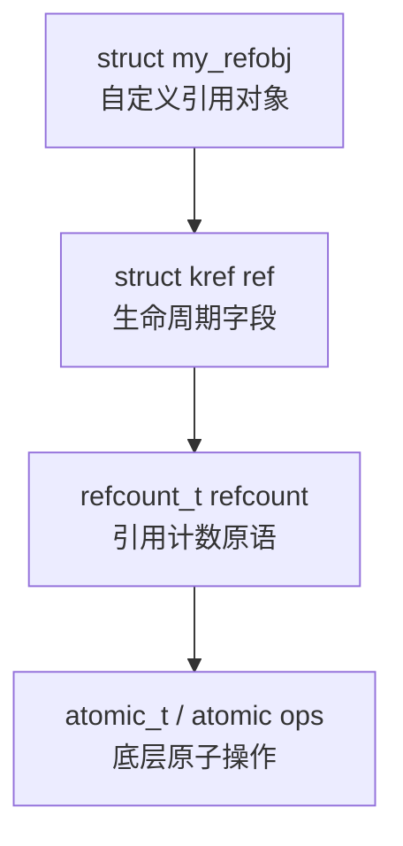
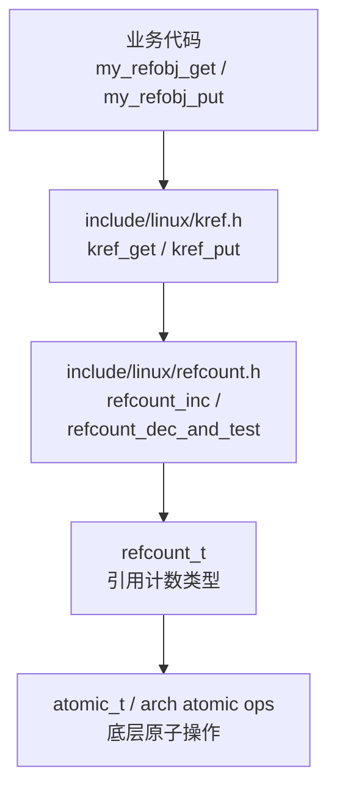
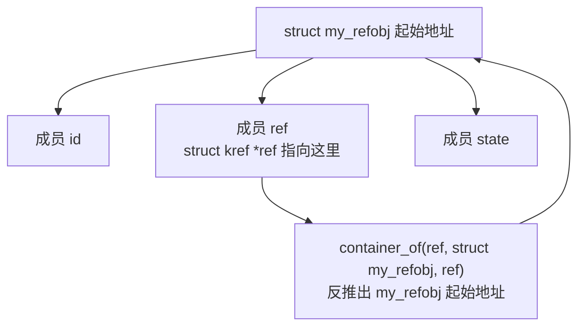
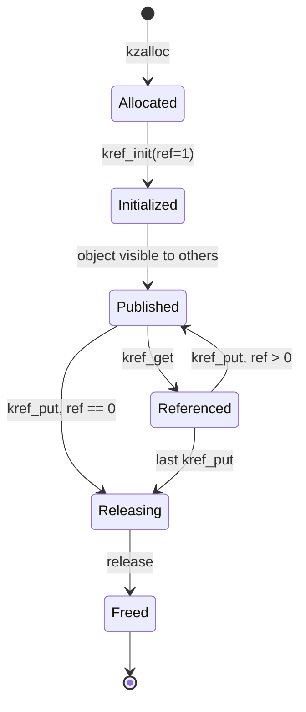

# 第2章_源码入口与结构定义

## 2.1_本章主线

第 1 章已经明确：

```text
kref 解决的是对象生命周期问题，不是字段并发保护问题。
```

第 2 章开始进入源码。

但这一章仍然不是急着背 API，而是先看清楚 `kref` 在源码里的位置和结构设计。

本章核心问题是：

```text
为什么 kref 要嵌入自定义引用对象内部？
为什么 kref 内部用 refcount_t？
为什么 release 回调拿到的是 struct kref *，而不是自定义引用对象指针？
为什么 kref 必须和 container_of() 配合？
为什么 kref 不是单独分配的生命周期管理器？
```

一句话概括本章：

```text
kref 是嵌入式生命周期字段，不是外置对象管理器。
```

------

## 2.2_源码阅读入口

Linux kernel 6.12 下，阅读 `kref` 主要从两个入口开始：

* [include/linux/kref.h](../../../../research/source_reading/linux/include/linux/kref.h)
* [include/linux/refcount.h](../../../../research/source_reading/linux/include/linux/refcount.h)

更底层还会涉及：

* [include/linux/refcount_types.h](../../../../research/source_reading/linux/include/linux/refcount_types.h)
* [include/linux/atomic/atomic-instrumented.h](../../../../research/source_reading/linux/include/linux/atomic/atomic-instrumented.h)
* arch/\*/include/asm/atomic\*.h

但本章不深入到体系结构 atomic 实现。

当前阶段只需要建立这条层次关系：

```text
自定义引用对象
  |
  +-- struct kref
        |
        +-- refcount_t
              |
              +-- atomic_t / 原子计数实现
```

也就是说，`kref` 不是直接操作裸 `int`，也不是直接暴露 `atomic_t`。

现代内核中的大致关系是：

```c
struct my_refobj {
	struct kref ref;
	/* real object fields */
};
```

而 `struct kref` 内部包了一层 `refcount_t`：

```c
struct kref {
	refcount_t refcount;
};
```

`refcount_t` 再负责更底层的引用计数安全语义。

------

## 2.3_kref.h_的位置

`kref.h` 位于：[include/linux/kref.h](../../../../research/source_reading/linux/include/linux/kref.h)

这说明它是一个通用内核头文件。

它不属于某个具体子系统，比如：

```text
drivers/
fs/
mm/
net/
block/
```

而是供整个内核复用的基础工具。

从定位上看，它属于：

```text
Core API
Data structures and low-level utilities
```

这也符合它的角色：

```text
kref 不描述设备
kref 不描述文件
kref 不描述内存区
kref 不描述网络连接
kref 只描述“对象还有多少持有者”
```

所以任何内核对象只要需要引用计数，都可以把 `struct kref` 嵌进去。

------

## 2.4_struct_kref_的本质

源码里 `struct kref` 非常小。

[include/linux/kref.h](../../../../research/source_reading/linux/include/linux/kref.h)，核心结构可以理解为：

```c
struct kref {
	refcount_t refcount;
};
```

[include/linux/refcount_types.h](../../../../research/source_reading/linux/include/linux/refcount_types.h)

```c
/**
 * typedef refcount_t - 专门用于引用计数的 atomic_t 变体
 * @refs: atomic_t 计数器字段
 *
 * 计数器会在 REFCOUNT_SATURATED 处饱和，并且一旦到达该值，
 * 就不会再发生变化。这样可以避免计数器回绕，从而导致“虚假的”
 * use-after-free 错误。
 */
typedef struct refcount_struct {
	atomic_t refs;
} refcount_t;
```

这说明 `kref` 本身没有复杂状态。

它不保存：

```text
对象类型
对象大小
对象地址
release 函数
所属子系统
锁
链表节点
状态机
```

它只保存一个东西：

```text
引用计数
```

但这里要注意：

```text
kref 简单，不代表它语义简单。
```

它的数据结构很小，但它承担的是对象生命周期协议。

也就是说：

```text
结构上只是一个 refcount_t；
语义上代表“这个对象还有多少有效持有者”。
```

------

## 2.5_为什么不是_atomic_t

早期很多代码习惯直接用：

```c
atomic_t refcnt;
```

然后写：

```c
atomic_inc(&refobj->refcnt);
if (atomic_dec_and_test(&refobj->refcnt))
	kfree(refobj);
```

现在不这么做，单纯是因为这个东西太低层了，引用的文件太多了，以后要引入新的结构定义，修改的位置太多。

所以做了重新包装，在语义上保证类型适配，在实现上方便迭代。

------

## 2.6_kref_和_refcount_t_的关系

可以把关系画成这样：



自定义引用对象不直接暴露底层 atomic。

业务代码通常只操作：

```c
kref_init(&refobj->ref);
kref_get(&refobj->ref);
kref_put(&refobj->ref, my_refobj_release);
```

而不是直接操作：

```c
refcount_inc(&refobj->ref.refcount);
refcount_dec_and_test(&refobj->ref.refcount);
```

虽然 `kref` 内部确实调用了 `refcount_*` 接口，但业务代码最好不要绕过 `kref`。

因为一旦绕过，生命周期协议就容易混乱。

关键源码讲解放到后面的独立小节：[2.13 kref/refcount_t 关键源码讲解](#213-krefrefcount_t-关键源码讲解)。

------

## 2.7_kref_为什么嵌入自定义引用对象内部

`kref` 的标准用法不是单独创建一个“引用计数管理器”，而是把 `struct kref` 作为成员嵌入到自定义引用对象内部：

```c
struct my_refobj {
	struct kref ref;
	int state;
	void *data;
};
```

但要注意：

```text
仅仅在结构体中包含 struct kref ref，并不代表生命周期管理已经完成。
```

完整的 kref 使用方式必须同时包含：

```c
struct my_refobj {
	struct kref ref;
	int state;
	void *data;
};

static void my_refobj_release(struct kref *ref)
{
	struct my_refobj *refobj = container_of(ref, struct my_refobj, ref);

	/* 释放 refobj 拥有的资源 */
	kfree(refobj->data);
	kfree(refobj);
}

static struct my_refobj *my_refobj_get(struct my_refobj *refobj)
{
	if (refobj)
		kref_get(&refobj->ref);

	return refobj;
}

static void my_refobj_put(struct my_refobj *refobj)
{
	if (refobj)
		kref_put(&refobj->ref, my_refobj_release);
}
```

也就是说，标准 kref 模型是：

```text
对象内部嵌入 kref；
对象创建时 kref_init；
对象类型定义 release；
对象接口封装 get/put；
每个长期持有者 get；
每个持有结束者 put；
最后一个 put 触发 release。
```

所以 `kref` 不应该写成：

```c
struct my_refobj {
	struct kref *ref;	// 这里错误使用指针来拆分kref
	int state;
	void *data;
};
```

这种写法把引用计数和自定义引用对象拆开了，会引入额外生命周期问题：

```text
谁分配 ref？
谁释放 ref？
ref 比 refobj 先释放怎么办？
refobj 比 ref 先释放怎么办？
```

引用计数本来就是为了解决对象生命周期问题，如果再把 `kref` 独立分配，就等于又制造了一个新的生命周期对象。

也不应该写成：

```c
struct kref_manager {
	struct kref ref;
	struct my_refobj *refobj;
};
```

因为引用计数描述的不是“管理器”的生命周期，而是自定义引用对象本身的生命周期。

```text
引用计数描述的是自定义引用对象本身能否继续存活。
```

对象存在时，`kref` 必须存在。

对象释放时，`kref` 也应该一起消失。

所以 `kref` 应该是自定义引用对象的一部分，而不是自定义引用对象外部的附属管理器。

这和 Linux 内核中很多嵌入式结构是同一种思想：

```c
struct my_refobj {
	struct list_head node;
	struct rb_node rb;
	struct work_struct work;
	struct kref ref;
	int state;
	void *data;
};
```

这些成员都不是外部分配的“管理器”，而是对象参与某种内核机制时嵌入进去的结构成员：

```text
list_head     让对象挂入链表
rb_node       让对象挂入红黑树
work_struct   让对象进入 workqueue
kref          让对象拥有引用计数生命周期
```

因此，`kref` 的设计风格是典型的 Linux 内核嵌入式对象模型。

不过需要区分三个概念：

```text
kref 是对象内部的计数字段；
release 是对象类型的析构函数；
get/put 是对象类型对外暴露的生命周期接口。
```

普通 kref 对象通常不会把 `release` 函数指针放进结构体里：

```c
struct my_refobj {
	struct kref ref;
	void (*release)(struct kref *ref);  /* 普通 kref 对象一般不这样设计 */
};
```

因为 `release` 通常属于对象类型，而不是每个对象实例。

也就是说：

```text
所有 my_refobj 对象都应该走 my_refobj_release()；
外部代码应该调用 my_refobj_get() / my_refobj_put()；
而不是到处直接操作 refobj->ref。
```

所以本节的关键结论是：

```text
kref 嵌入自定义引用对象内部，是因为引用计数描述的是自定义引用对象本身的生命周期。

但是，嵌入 kref 只是对象生命周期管理的结构基础。
真正完整的 kref 使用，必须配套 kref_init、get、put、release。

没有 get/put/release 封装的 struct kref ref，只是一个计数字段，不是完整的生命周期管理方案。
```

------

## 2.8_嵌入式结构的好处

把 `struct kref` 嵌入自定义引用对象，有几个直接好处。

### 2.8.1_不需要额外分配

对象分配一次即可：

```c
refobj = kzalloc(sizeof(*refobj), GFP_KERNEL);
```

不需要再分配：

```c
refobj->ref = kmalloc(sizeof(struct kref), GFP_KERNEL);
```

避免了额外内存管理问题。

------

### 2.8.2_生命周期天然一致

因为 `kref` 在对象内部，所以：

```text
对象活着，kref 一定活着
对象释放，kref 一起释放
```

如果 `kref` 是外部对象，就会产生新的生命周期问题：

```text
自定义引用对象释放了，kref 还在？
kref 释放了，自定义引用对象还在？
二者谁先释放？
release 怎么找回对象？
```

这些问题都没有必要制造出来。

------

### 2.8.3_release_可以通过_container_of_找回对象

因为 `kref` 是对象成员，所以 release 回调拿到 `struct kref *` 后，可以反推出外层对象：

```c
static void my_refobj_release(struct kref *ref)
{
	struct my_refobj *refobj = container_of(ref, struct my_refobj, ref);

	kfree(refobj);
}
```

这就是 Linux 内核常见的嵌入式对象模式。

------

## 2.9_container_of_是理解_kref_的关键

`kref_put()` 的 release 回调类型大致是：

```c
void (*release)(struct kref *kref)
```

也就是说，release 收到的不是：

```c
struct my_refobj *refobj
```

而是：

```c
struct kref *ref
```

所以 release 里必须用：

```c
container_of(ref, struct my_refobj, ref)
```

把外层对象找回来。

标准模板：

```c
struct my_refobj {
	struct kref ref;
	int state;
};

static void my_refobj_release(struct kref *ref)
{
	struct my_refobj *refobj;

	refobj = container_of(ref, struct my_refobj, ref);

	kfree(refobj);
}
```

这段代码的含义是：

```text
ref 是 struct my_refobj 里的成员 ref 的地址；
根据成员地址、外层类型、成员名，反推出 struct my_refobj 的起始地址。
```

也就是：

```text
struct kref *  -->  struct my_refobj *
```

------

## 2.10_为什么_release_不直接接收自定义引用对象指针

可能会疑惑：

```c
static void my_refobj_release(struct my_refobj *refobj)
{
	kfree(refobj);
}
```

这样不是更直接吗？

问题是：

```text
kref 是通用机制，它不知道外层对象类型。
```

`kref_put()` 只能处理：

```c
struct kref *kref
```

它不可能知道这个 `kref` 被嵌入在：

```c
struct my_private_refobj
struct my_request
struct my_session
struct my_cache
struct my_inode_private
```

哪一种对象里。

所以 release 回调必须是通用签名：

```c
void (*release)(struct kref *kref)
```

别听上面的废话，一句话总结：

> `kref`调用的是`kref`的接口，它的体系里面本身不具备成员`.release()`函数接口，所以要单独定义。
>
> `kref`调用`release()`函数的调用的是参数里的`callback()`函数参数，该引入的参数只能是它自己，也就是`this`指针。那么你只能通过`this`指针再通过`container_of()`反向获取自定义结构体`my_refobj`对象的地址。
>
> 所以你想要传入`my_refobj`结构体，根本没有这个接口给你适配。

------

## 2.11_kref_不是单独分配的对象

错误设计：

```c
struct my_refobj {
	struct kref *ref;
	int state;
};
```

这种写法会带来额外复杂度。

例如：

```c
refobj = kzalloc(sizeof(*refobj), GFP_KERNEL);
refobj->ref = kzalloc(sizeof(*refobj->ref), GFP_KERNEL);
```

然后释放时要考虑：

```text
先释放 refobj 还是先释放 refobj->ref？
release 收到 struct kref * 后怎么找 refobj？
refobj 已经释放时 ref 是否还有效？
ref 已经释放时 refobj 是否还有效？
```

这会让生命周期管理本身又多出一个生命周期问题。

正确做法是：

```c
struct my_refobj {
	struct kref ref;
	int state;
};
```

然后：

```c
refobj = kzalloc(sizeof(*refobj), GFP_KERNEL);
kref_init(&refobj->ref);
```

释放时：

```c
static void my_refobj_release(struct kref *ref)
{
	struct my_refobj *refobj = container_of(ref, struct my_refobj, ref);
	// 释放 my_refobj 资源
	kfree(refobj);
}
```

这才是 `kref` 预期使用模型。

------

## 2.12_kref_init()_的初始引用

**参考源码**：[kref_init()](#1-kref_init)

动态对象创建后，通常这样初始化：

```c
struct my_refobj *refobj;

refobj = kzalloc(sizeof(*refobj), GFP_KERNEL);
if (!refobj)
	return NULL;

kref_init(&refobj->ref);
```

`kref_init()` 的语义是：

```text
初始化引用计数为 1。
```

这个初始引用不是凭空来的。

它表示：

```text
创建者当前持有这个对象。
```

所以对象创建后，创建者必须最终负责释放这个引用：

```c
kref_put(&refobj->ref, my_refobj_release);
```

也就是说：

```text
kref_init() 不是“设置为可用”
而是“创建了第一个持有者”
```

这个理解很重要。

如果创建者忘记 put，就会泄漏。

如果创建者提前 put，而对象还交给别人但没有 get，就会 UAF。

------

## 2.13_kref/refcount_t_关键源码讲解

### 2.13.1_源码

#### (1)_kref_init()

[include/linux/kref.h](../../../../research/source_reading/linux/include/linux/kref.h)

```c
/**
 * kref_init - initialize object.
 * @kref: object in question.
 */
static inline void kref_init(struct kref *kref)
{
	refcount_set(&kref->refcount, 1);
}
```

#### (2)_refcount_set()

[include/linux/refcount.h](../../../../research/source_reading/linux/include/linux/refcount.h)

```C
/**
 * refcount_set - set a refcount's value
 * @r: the refcount
 * @n: value to which the refcount will be set
 */
static inline void refcount_set(refcount_t *r, int n)
{
	atomic_set(&r->refs, n);
}
```

#### (3)_kref_get()

[include/linux/kref.h](../../../../research/source_reading/linux/include/linux/kref.h)

```C
/**
 * kref_get - increment refcount for object.
 * @kref: object.
 */
static inline void kref_get(struct kref *kref)
{
	refcount_inc(&kref->refcount);
}
```

#### (4)_refcount_inc()

[include/linux/refcount.h](../../../../research/source_reading/linux/include/linux/refcount.h)

```C
static inline __signed_wrap
void __refcount_add(int i, refcount_t *r, int *oldp)
{
	int old = atomic_fetch_add_relaxed(i, &r->refs);

	if (oldp)
		*oldp = old;

	if (unlikely(!old))
		refcount_warn_saturate(r, REFCOUNT_ADD_UAF);
	else if (unlikely(old < 0 || old + i < 0))
		refcount_warn_saturate(r, REFCOUNT_ADD_OVF);
}

static inline void __refcount_inc(refcount_t *r, int *oldp)
{
	__refcount_add(1, r, oldp);
}

/**
 * refcount_inc - 增加引用计数
 * @r: 要增加的引用计数对象
 *
 * 类似于 atomic_inc()，但当计数达到 REFCOUNT_SATURATED 时会进入饱和状态，
 * 并触发 WARN 告警。
 *
 * 不提供任何内存序保证。这里假定调用者已经持有该对象的一个有效引用。
 *
 * 如果引用计数为 0，将触发 WARN 告警，因为这表示可能存在 use-after-free
 * 问题。
 */
static inline void refcount_inc(refcount_t *r)
{
	__refcount_inc(r, NULL);
}
```

##### 1)_signed_wrap_小结

`__signed_wrap` 是 Linux 内核提供给编译器看的属性宏，不参与 `refcount_t` 的业务逻辑计算。它的作用是告诉编译器：当前函数内部可能会**有意使用有符号整数的补码回绕行为**，不要把 signed overflow 当成普通未定义行为进行激进优化，也不要让 signed-integer-overflow sanitizer 在这里误报或插桩破坏逻辑。

在 `__refcount_add()` 中，代码会检查：

```c
old < 0 || old + i < 0
```

其中 `old + i < 0` 用来判断引用计数加法是否从正常正数区间溢出到了负数异常区间。标准 C 语言中，有符号整数溢出是 undefined behavior，编译器可能假设它永远不会发生，从而优化掉这类判断。`__signed_wrap` 的意义就是保护这种检测逻辑，让它按内核期望的二进制补码回绕语义工作。

所以可以总结为：

`refcount_t` 的负值/饱和区间是引用计数自身的安全设计，用来表示异常状态；`__signed_wrap` 则是为了保证这种异常检测逻辑不会被编译器优化或 sanitizer 破坏。它解决的是编译器语义问题，服务的是 `refcount_t` 防溢出、防 use-after-free 的业务安全需求。

#### (5)_kref_put()

[include/linux/kref.h](../../../../research/source_reading/linux/include/linux/kref.h)

```c
static inline __must_check __signed_wrap
bool __refcount_sub_and_test(int i, refcount_t *r, int *oldp)
{
	/*
	 * 原子地执行：
	 *
	 *     old = r->refs;
	 *     r->refs -= i;
	 *
	 * 注意：
	 * atomic_fetch_sub_release() 返回的是“减之前的旧值”，
	 * 不是减之后的新值。
	 *
	 * release 语义保证：
	 * 当前 CPU 在此之前对对象的 load/store，
	 * 不能被重排到引用计数递减之后。
	 */
	int old = atomic_fetch_sub_release(i, &r->refs);

	/*
	 * 如果调用者需要旧值，就把减之前的引用计数保存出去。
	 */
	if (oldp)
		*oldp = old;

	/*
	 * 正常的最后一次释放路径：
	 *
	 * old > 0:
	 *     说明递减前引用计数仍然是有效的正数。
	 *
	 * old == i:
	 *     说明本次减 i 之后，引用计数刚好变成 0。
	 *
	 * 例如：
	 *     old = 1, i = 1  =>  new = 0
	 *     old = 2, i = 2  =>  new = 0
	 *
	 * 返回 true 表示：
	 *     当前路径释放了最后一个引用，
	 *     调用者可以执行 release/free 逻辑。
	 */
	if (old > 0 && old == i) {
		/*
		 * 在“成功减到 0”的路径上补 acquire 语义。
		 *
		 * 配合前面的 release 递减操作，形成 release-acquire 关系，
		 * 保证后续的对象释放动作不会被重排到确认 refcount 为 0 之前。
		 *
		 * 也就是说：
		 *     必须先确认这是最后一个引用，
		 *     然后才能执行 release()/free()。
		 */
		smp_acquire__after_ctrl_dep();

		return true;
	}

	/*
	 * 异常路径检测：
	 *
	 * old <= 0:
	 *     说明递减之前引用计数已经是 0 或负数。
	 *     这通常表示对象已经被释放，或者引用计数已经损坏，
	 *     现在又继续 put/dec，属于 UAF/double put 类问题。
	 *
	 * old - i < 0:
	 *     说明本次递减把引用计数减穿了。
	 *     例如 old = 1, i = 2，结果变成 -1。
	 *
	 * 这两种情况都说明引用计数释放次数超过持有次数，
	 * 因此触发 REFCOUNT_SUB_UAF 告警，并把 refcount 饱和，
	 * 防止继续下溢或回绕。
	 */
	if (unlikely(old <= 0 || old - i < 0))
		refcount_warn_saturate(r, REFCOUNT_SUB_UAF);

	/*
	 * 返回 false 有两种可能：
	 *
	 * 1. 正常情况：
	 *    引用计数递减后仍然大于 0，对象还有其他持有者。
	 *
	 * 2. 异常情况：
	 *    已经检测到 UAF/下溢并报警，不能走正常释放路径。
	 */
	return false;
}

static inline __must_check bool __refcount_dec_and_test(refcount_t *r, int *oldp)
{
	return __refcount_sub_and_test(1, r, oldp);
}

/**
 * refcount_dec_and_test - 递减引用计数，并测试它是否为 0。
 * @r: 引用计数。
 *
 * 类似于 atomic_dec_and_test()，它会在下溢时发出 WARN，
 * 并且当引用计数已经饱和到 REFCOUNT_SATURATED 时，不再继续递减。
 *
 * 提供 release 内存序，保证之前的 load 和 store 都在此之前完成；
 * 并且在成功时提供 acquire 内存序，保证 free() 必须发生在此之后。
 *
 * Return: 如果递减后的引用计数为 0，则返回 true；否则返回 false。
 */
static inline __must_check bool refcount_dec_and_test(refcount_t *r)
{
	return __refcount_dec_and_test(r, NULL);
}

/**
 * kref_put - 递减对象的引用计数。
 * @kref: 对象。
 * @release: 指向清理函数的指针，当对象的最后一个引用被释放时，
 *           该函数会负责清理对象。
 *           这个指针是必需的，并且不允许直接传入 kfree
 *           作为该函数。
 *
 * 递减引用计数，如果引用计数变为 0，则调用 release()。
 * 如果对象被移除，则返回 1；否则返回 0。注意，如果该函数
 * 返回 0，你仍然不能保证 kref 仍然留在内存中。
 * 只有当你想判断 kref 现在是否已经消失，而不是仍然存在时，
 * 才应该使用该返回值。
 */
static inline int kref_put(struct kref *kref, void (*release)(struct kref *kref))
{
	if (refcount_dec_and_test(&kref->refcount)) {
		release(kref);
		return 1;
	}
	return 0;
}
```

##### 1)_must_check_小结

`__must_check` 用来修饰函数，表示**调用者必须检查该函数的返回值**。它通常对应编译器属性：

```c
__attribute__((__warn_unused_result__))
```

作用是：如果调用者调用了该函数，却丢弃返回值，编译器会给出警告。

在引用计数接口中，例如：

```c
refcount_dec_and_test(&refobj->refcount)
```

返回值表示：

```c
true  -> 引用计数已经减到 0，当前路径需要释放对象
false -> 引用计数还没有归零，不能释放对象
```

因此这类函数不能只调用不判断：

```c
refcount_dec_and_test(&refobj->refcount);   // 错误：忽略返回值
```

正确用法是：

```c
if (refcount_dec_and_test(&refobj->refcount))
	release(refobj);
```

一句话总结：

`__must_check` 表示返回值具有关键语义，不能被忽略；在 refcount 场景中，它防止调用者忘记处理“引用计数归零后需要释放对象”的逻辑。

#### (6)_kref_read()

[include/linux/kref.h](../../../../research/source_reading/linux/include/linux/kref.h)

```c
/**
 * refcount_read - get a refcount's value
 * @r: the refcount
 *
 * Return: the refcount's value
 */
static inline unsigned int refcount_read(const refcount_t *r)
{
	return atomic_read(&r->refs);
}

static inline unsigned int kref_read(const struct kref *kref)
{
	return refcount_read(&kref->refcount);
}
```


------

## 2.14_静态初始化_KREF_INIT(n)

除了动态初始化，还有静态初始化形式：

[include/linux/refcount.h](../../../../research/source_reading/linux/include/linux/refcount.h)

```c
#define REFCOUNT_INIT(n)        \
    {                           \
        .refs = ATOMIC_INIT(n), \
    }

#define KREF_INIT(n)                  \
    {                                 \
        .refcount = REFCOUNT_INIT(n), \
    }
```

宏展开为：

```c
#define KREF_INIT(n)                  \
    {                                 \
        .refcount.refs = n, 		 \
    }
```

典型含义是：

```c
struct kref ref = KREF_INIT(1);
```

或者某个静态对象里：

```c
static struct my_refobj global_refobj = {
	.ref = KREF_INIT(1),
};
```

它的作用是：

```text
在编译期或静态对象初始化时设置引用计数初始值。
```

但工程上更常见的是动态对象：

```c
refobj = kzalloc(...);
kref_init(&refobj->ref);
```

因为需要 `kref` 的对象往往是动态生命周期对象。

静态对象也可以有引用计数，但要非常清楚：

```text
它是否真的会被释放？
release 是否真的 kfree？
静态对象是否允许 refcount 归零？
```

否则就会出现语义不一致。

------

## 2.15_kref_get()_的源码层次

[kref_get()](#3-kref_get)

`kref_get()` 的逻辑可以理解为：

```c
static inline void kref_get(struct kref *kref)
{
	refcount_inc(&kref->refcount);
}
```

也就是说：

```text
kref_get()
  -> refcount_inc()
      -> 底层原子引用计数增加
```

但使用它必须满足一个前提：

```text
调用 kref_get() 时，调用者已经确定对象是有效的。
```

这句话非常重要。

`kref_get()` 不是“从无到有抢救对象”。

它不是：

```text
我捡到一个裸指针，然后靠 kref_get() 让它复活。
```

正确语义是：

```text
我已经在某种保护下持有有效对象，现在我要增加一个长期引用。
```

例如：

```c
kref_get(&refobj->ref);
pass_to_worker(refobj);
```

这里调用者本来就持有 `refobj` 的有效引用。

所以可以给 worker 再增加一个引用。

------

## 2.16_kref_put()_的源码层次

`kref_put()` 的逻辑可以理解为：

```c
static inline int kref_put(struct kref *kref,
			   void (*release)(struct kref *kref))
{
	if (refcount_dec_and_test(&kref->refcount)) {
		release(kref);
		return 1;
	}

	return 0;
}
```

它做两件事：

```text
1. 引用计数减一
2. 如果减到 0，调用 release
```

返回值语义是：

```text
返回 1：本次 put 释放了最后一个引用，并调用了 release
返回 0：本次 put 后仍然不是最后一个引用
```

但要注意：

```text
kref_put() 返回 0，不代表对象之后一定还活着。
```

因为其他 CPU 可能马上执行最后一个 `put`。

所以：

```c
if (!kref_put(&refobj->ref, my_refobj_release)) {
	/* refobj 还活着？ */
}
```

不能这样理解。

`kref_put()` 后，当前路径已经不再持有引用。

因此一般原则是：

```text
put 之后不要再访问 refobj。
```

除非你还有另一个明确持有的引用，或者有额外锁/协议保证。

------

## 2.17_kref_read()_为什么不能作为生命周期判断

[kref_read()](#(6)_kref_read())

`kref_read()` 可以读当前计数：

```c
unsigned int n = kref_read(&refobj->ref);
```

但它不应该作为核心生命周期判断依据。

错误理解：

```c
if (kref_read(&refobj->ref) > 0)
	refobj->state = 1;
```

这不可靠。

因为：

```text
读到 >0 的瞬间，对象可能还活着；
但下一瞬间，别的 CPU 可能 put 到 0 并 release。
```

所以 `kref_read()` 更适合：

```text
debug
trace
统计
诊断
警告信息
```

而不适合：

```text
用来决定对象是否可以安全访问
```

安全访问对象的依据应该是：

```text
当前路径是否持有有效引用
lookup + get 是否在锁/RCU 保护下完成
业务状态是否在锁保护下检查
```

------

## 2.18_kref_源码关系总览

可以用下面这张图理解：



业务代码通常只接触最上层：

```c
kref_get(&refobj->ref);
kref_put(&refobj->ref, my_refobj_release);
```

`kref` 内部再调用 `refcount`。

这样分层的好处是：

```text
自定义引用对象生命周期语义集中在 kref
引用计数安全语义集中在 refcount_t
底层原子操作由 atomic/arch 实现
```

------

## 2.19_标准自定义引用对象模板

一个最小对象模板如下：

```c
#include <linux/kref.h>
#include <linux/slab.h>

struct my_refobj {
	struct kref ref;
	int state;
};

static void my_refobj_release(struct kref *ref)
{
	struct my_refobj *refobj;

	refobj = container_of(ref, struct my_refobj, ref);

	kfree(refobj);
}

static struct my_refobj *my_refobj_alloc(void)
{
	struct my_refobj *refobj;

	refobj = kzalloc(sizeof(*refobj), GFP_KERNEL);
	if (!refobj)
		return NULL;

	kref_init(&refobj->ref);
	refobj->state = 0;

	return refobj;
}

static struct my_refobj *my_refobj_get(struct my_refobj *refobj)
{
	kref_get(&refobj->ref);
	return refobj;
}

static void my_refobj_put(struct my_refobj *refobj)
{
	kref_put(&refobj->ref, my_refobj_release);
}
```

这个模板里有几个关键点。

### 2.19.1_struct_kref_ref_嵌入对象内部

```c
struct my_refobj {
	struct kref ref;
	int state;
};
```

这说明引用计数属于对象生命周期。

------

### 2.19.2_alloc_后立即_kref_init

```c
kref_init(&refobj->ref);
```

这表示创建者获得初始引用。

------

### 2.19.3_release_用_container_of_找回对象

```c
refobj = container_of(ref, struct my_refobj, ref);
```

因为 release 收到的是 `struct kref *`。

------

### 2.19.4_release_是最终销毁点

```c
kfree(refobj);
```

只有最后一个引用释放时，才会进入这里。

------

### 2.19.5_对外最好封装_get/put

```c
static struct my_refobj *my_refobj_get(struct my_refobj *refobj)
{
	kref_get(&refobj->ref);
	return refobj;
}

static void my_refobj_put(struct my_refobj *refobj)
{
	kref_put(&refobj->ref, my_refobj_release);
}
```

这样可以把生命周期规则收敛到对象自己的接口里。

------

## 2.20_为什么建议封装_my_refobj_get/my_refobj_put

虽然可以直接写：

```c
kref_get(&refobj->ref);
kref_put(&refobj->ref, my_refobj_release);
```

但工程上更推荐封装：

```c
my_refobj_get(refobj);
my_refobj_put(refobj);
```

原因是：

```text
隐藏 release 函数
统一对象生命周期出口
方便后续加 WARN_ON
方便后续加 trace
方便后续处理 NULL
方便后续加调试统计
减少调用点传错 release 的风险
```

例如：

```c
static void my_refobj_put(struct my_refobj *refobj)
{
	if (!refobj)
		return;

	kref_put(&refobj->ref, my_refobj_release);
}
```

或者：

```c
static struct my_refobj *my_refobj_get(struct my_refobj *refobj)
{
	WARN_ON(!refobj);

	kref_get(&refobj->ref);
	return refobj;
}
```

这样比到处裸写 `kref_put()` 更容易维护。

------

## 2.21_kref_和自定义引用对象内存布局

假设对象定义为：

```c
struct my_refobj {
	int id;
	struct kref ref;
	int state;
};
```

内存布局可以抽象成：

```text
+-----------------------------+
| struct my_refobj               |
+-----------------------------+
| id                          |
+-----------------------------+
| ref                         |
|   +---------------------+   |
|   | refcount_t refcount |   |
|   +---------------------+   |
+-----------------------------+
| state                       |
+-----------------------------+
```

当 release 收到：

```c
struct kref *ref
```

它拿到的是中间这个成员的地址。

`container_of()` 根据：

```text
外层类型：struct my_refobj
成员名：ref
成员地址：ref
```

反推出整个对象起始地址。

图示：



所以 `container_of()` 不是魔法。

它依赖的是：

```text
struct kref 是自定义引用对象的内嵌成员
```

如果 `kref` 是单独分配的，这种模式就不成立。

------

## 2.22_kref_和_list_head/rb_node_的相似性

`kref` 的嵌入方式和 `list_head`、`rb_node` 很像。

例如链表对象：

```c
struct my_refobj {
	struct list_head node;
	int id;
};
```

链表遍历时拿到的是：

```c
struct list_head *node
```

然后通过：

```c
container_of(node, struct my_refobj, node)
```

找回外层对象。

红黑树对象：

```c
struct my_refobj {
	struct rb_node rb;
	int key;
};
```

红黑树节点拿到的是：

```c
struct rb_node *rb
```

然后通过：

```c
container_of(rb, struct my_refobj, rb)
```

找回外层对象。

`kref` 也是类似：

```c
struct my_refobj {
	struct kref ref;
};
```

release 拿到：

```c
struct kref *ref
```

然后通过：

```c
container_of(ref, struct my_refobj, ref)
```

找回外层对象。

所以 Linux 内核的通用机制通常不是面向“对象基类”的，而是面向“嵌入式成员”的。

------

## 2.23_kref_不是_C++_shared_ptr

容易把 `kref` 类比成 C++ 的 `shared_ptr`，但二者差别很大。

`shared_ptr` 通常是：

```text
外部控制块 + 指针包装对象
```

而 `kref` 是：

```text
对象内部嵌入引用计数字段
```

`shared_ptr` 的使用者拿到的是智能指针对象。

`kref` 的使用者拿到的仍然是普通 C 指针：

```c
struct my_refobj *refobj;
```

所以 `kref` 不会自动帮你：

```text
离开作用域自动 put
拷贝时自动 get
赋值时自动处理旧引用
异常路径自动释放
```

内核 C 代码必须手工保证：

```text
每一个 get 都有对应 put
每一个 handoff 都有明确边界
每一个 error path 都正确释放
```

所以 `kref` 比 `shared_ptr` 更轻量，但也更依赖代码纪律。

------

## 2.24_kref_不保存_release_函数

`kref` 本身不保存 `release` 函数。

Linux 内核中的 `struct kref` 是一个很薄的引用计数对象，它的核心成员就是引用计数本身：

```c
struct kref {
	refcount_t refcount;
};
```

也就是说，`kref` 没有类似下面这样的成员：

```c
struct kref {
	refcount_t refcount;
	void (*release)(struct kref *ref);  /* 实际上没有这个成员 */
};
```

所以不能这样使用：

```c
refobj->ref.release = my_refobj_release;    /* 错误：kref 没有 release 成员 */
```

正确方式是：在 `kref_put()` 时，把 release 函数作为参数传入：

```c
kref_put(&refobj->ref, my_refobj_release);
```

工程代码中通常不会让外部到处直接调用 `kref_put()`，而是封装成对象自己的 `put` 接口：

```c
struct my_refobj {
	struct kref ref;
	int state;
	void *data;
};

static void my_refobj_release(struct kref *ref)
{
	struct my_refobj *refobj = container_of(ref, struct my_refobj, ref);

	kfree(refobj->data);
	kfree(refobj);
}

void my_refobj_put(struct my_refobj *refobj)
{
	if (refobj)
		kref_put(&refobj->ref, my_refobj_release);
}
```

这里的职责关系是：

```text
kref：
    只负责引用计数。

my_refobj_release：
    负责 my_refobj 对象的最终销毁。

my_refobj_put：
    负责把 my_refobj 的引用释放规则封装起来。
```

所以，`release` 不属于 `struct kref`，而属于外层自定义引用对象类型。

也就是说：

```text
kref 是计数字段；
release 是对象类型的析构函数；
put 是对象类型对外暴露的释放引用接口。
```

从 C 语言实现能力上说，当然可以把函数指针放进 `struct kref` 里。但 Linux 的 `kref` 没有这样设计。原因不是“做不到”，而是抽象层次上不应该这样做。

`kref` 是一个底层引用计数原语，不是完整对象模型。它不知道自己嵌入在哪个自定义引用对象里，也不知道外层对象应该如何销毁。

例如：

```c
struct my_refobj {
	struct kref ref;
	void *data;
};
```

真正知道释放方式的是 `struct my_refobj` 这个对象类型，而不是 `struct kref` 本身。

`my_refobj` 释放时可能需要：

```c
kfree(refobj->data);
kfree(refobj);
```

另一个对象释放时可能需要：

```c
vfree(refobj->buffer);
put_device(refobj->dev);
kfree(refobj);
```

这里的 `put_device(refobj->dev)` 表示释放 `my_refobj` 持有的 device 引用。`struct device` 本身仍然按 driver core 的 `get_device()/put_device()`、`kobject` 和 device model release 分发规则销毁。

这些释放逻辑都属于外层对象，不属于 `kref`。

因此，`kref_put()` 的设计是：

```c
kref_put(&refobj->ref, my_refobj_release);
```

当引用计数减到 0 时，`kref_put()` 调用传入的 `my_refobj_release()`。`my_refobj_release()` 再通过 `container_of()` 从 `struct kref *` 找回外层对象：

```c
static void my_refobj_release(struct kref *ref)
{
	struct my_refobj *refobj = container_of(ref, struct my_refobj, ref);

	kfree(refobj);
}
```

这正好符合 Linux 内核的嵌入式对象模型：

```text
struct kref 不理解外层对象；
外层对象通过 container_of() 解释 kref；
release 函数属于外层对象类型。
```

需要特别注意：虽然 `kref_put()` 每次都要求传入 release 函数，但这并不表示同一个对象可以随便传不同的 release。

下面这种写法是危险的：

```c
kref_put(&refobj->ref, release_a);
kref_put(&refobj->ref, release_b);
```

因为只有最后一次 `put` 才会真正触发 release。这样对象最终由哪个 release 释放，就取决于哪个调用点刚好执行了最后一次 `put`。

这会导致对象销毁路径不稳定。

正常工程写法应该是：

```c
void my_refobj_put(struct my_refobj *refobj)
{
	kref_put(&refobj->ref, my_refobj_release);
}
```

然后所有地方统一调用：

```c
my_refobj_put(refobj);
```

而不是到处裸写：

```c
kref_put(&refobj->ref, my_refobj_release);
```

这样可以保证：

```text
同一种对象，只有一种统一的 release 路径。
```

`kref` 不保存 release 的意义可以总结为：

```text
1. kref 保持轻量，只保存引用计数。
2. kref 只是底层引用计数原语，不是对象模型。
3. release 属于外层自定义引用对象类型，不属于 kref 本身。
4. 对象释放逻辑由 my_refobj_release() 定义。
5. 对象引用释放接口由 my_refobj_put() 封装。
6. 同一种对象应该统一走同一个 release 路径。
```

如果需要更完整的对象模型，比如类型、父子关系、统一 release、sysfs 表示等，那应该使用 `kobject` 这类更高层机制，而不是让 `kref` 自己保存 `.release` 成员。

最终结论：

```text
kref 本身不具备 .release 成员。

release 函数不是 kref 的属性，而是外层对象类型的析构函数。

kref_put() 只是“在引用计数减到 0 时，调用传入的 release 函数”。

所以，标准工程模型是：

对象内部嵌入 kref；
对象类型定义 release；
对象接口封装 get/put；
最后一个 put 触发 release。
```

------

## 2.25_kref_put_不能直接传_kfree

错误写法：

```c
kref_put(&refobj->ref, kfree);
```

这个模型不成立。

原因有两个。

第一，函数签名不匹配。

`kref_put()` 需要的是：

```c
void (*release)(struct kref *kref)
```

而 `kfree()` 接收的是：

```c
void *ptr
```

第二，即使强转，也会释放错地址。

因为 `kref_put()` 传给 release 的是：

```c
&refobj->ref
```

不是：

```c
refobj
```

如果直接把 `struct kref *` 当成对象起始地址释放，释放的就不是对象起始地址。

正确做法必须是：

```c
static void my_refobj_release(struct kref *ref)
{
	struct my_refobj *refobj = container_of(ref, struct my_refobj, ref);

	kfree(refobj);
}
```

release 的职责就是：

```text
从 kref 成员找回外层对象，然后释放真正的对象。
```

------

## 2.26_kref_字段位置没有固定要求

`struct kref` 不一定必须放在结构体第一个成员。

可以这样：

```c
struct my_refobj {
	struct kref ref;
	int state;
};
```

也可以这样：

```c
struct my_refobj {
	int id;
	struct kref ref;
	int state;
};
```

还可以这样：

```c
struct my_refobj {
	int id;
	int state;
	struct kref ref;
};
```

只要 release 里 `container_of()` 的成员名正确：

```c
container_of(ref, struct my_refobj, ref)
```

都可以找回外层对象。

但是工程上通常建议：

```text
生命周期字段放在结构体靠前位置
锁、状态、链表节点组织清楚
```

例如：

```c
struct my_refobj {
	struct kref ref;
	struct mutex lock;
	struct list_head node;

	int state;
	void *data;
};
```

这样读代码时更容易看出：

```text
这个对象有引用计数
这个对象有自己的锁
这个对象会挂入链表
```

------

## 2.27_一个对象可以有多个嵌入式机制

实际内核对象经常同时嵌入多个基础结构：

```c
struct my_refobj {
	struct kref ref;
	struct mutex lock;
	struct list_head node;
	struct rb_node rb;
	struct work_struct work;

	int id;
	int state;
};
```

每个字段负责不同机制：

| 字段                      | 作用             |
| ------------------------- | ---------------- |
| `struct kref ref`         | 生命周期引用计数 |
| `struct mutex lock`       | 对象字段互斥     |
| `struct list_head node`   | 挂入链表         |
| `struct rb_node rb`       | 挂入红黑树       |
| `struct work_struct work` | 投递到 workqueue |
| `state`                   | 业务状态         |

不要把这些职责混在一起。

特别是：

```text
list_head 只说明对象在链表里
rb_node 只说明对象在树里
work_struct 只说明对象可被异步执行
kref 只说明对象生命周期由引用计数保护
mutex 只说明字段访问需要互斥
```

这些机制组合起来，才构成完整对象模型。

------

## 2.28_kref_和对象创建流程

标准创建流程可以拆成几个阶段：

```text
1. 分配内存
2. 初始化普通字段
3. 初始化锁
4. 初始化链表节点
5. 初始化 kref
6. 发布对象
```

例如：

```c
static struct my_refobj *my_refobj_create(int id)
{
	struct my_refobj *refobj;

	refobj = kzalloc(sizeof(*refobj), GFP_KERNEL);
	if (!refobj)
		return NULL;

	kref_init(&refobj->ref);
	mutex_init(&refobj->lock);
	INIT_LIST_HEAD(&refobj->node);

	refobj->id = id;
	refobj->state = my_refobj_INIT;

	return refobj;
}
```

注意顺序上的原则：

```text
对象发布给其他执行路径之前，kref 必须已经初始化。
```

错误模型：

```c
refobj = kzalloc(sizeof(*refobj), GFP_KERNEL);
global_refobj = refobj;
kref_init(&refobj->ref);
```

这里如果 `global_refobj` 一发布，别的 CPU 就可能拿到对象，而此时 `kref` 还没初始化。

正确方向：

```c
refobj = kzalloc(sizeof(*refobj), GFP_KERNEL);
kref_init(&refobj->ref);
mutex_init(&refobj->lock);
refobj->state = my_refobj_INIT;

global_refobj = refobj;
```

发布前必须完成对象基础初始化。

------

## 2.29_kref_和对象发布

“发布对象”是生命周期设计里的重要节点。

发布意味着：

```text
对象可以被其他执行路径找到。
```

例如：

```text
加入全局链表
插入 hash 表
放入 xarray
绑定到 file->private_data
注册到设备模型
提交给 workqueue
交给 timer
传给另一个线程
```

发布之前：

```text
通常只有创建者持有对象
```

发布之后：

```text
其他执行路径可能拿到对象
```

所以发布动作通常需要配合引用规则。

例如放入全局链表：

```c
mutex_lock(&refobj_list_lock);
list_add(&refobj->node, &refobj_list);
mutex_unlock(&refobj_list_lock);
```

这时要设计清楚：

```text
链表本身是否持有一个引用？
还是链表只是可查找索引，不单独持有引用？
```

这不是 `kref` 自动决定的。

这是对象生命周期协议的一部分。

------

## 2.30_容器持有引用是显式设计选择

这是很多内核对象设计中的关键点。

假设对象挂在全局链表：

```c
struct my_refobj {
	struct kref ref;
	struct list_head node;
	int id;
};
```

有两种设计。

### 2.30.1_设计_A_容器持有引用

对象加入链表时，链表拥有一个引用。

```c
kref_get(&refobj->ref);

mutex_lock(&refobj_list_lock);
list_add(&refobj->node, &refobj_list);
mutex_unlock(&refobj_list_lock);
```

对象从链表删除时，释放链表引用：

```c
mutex_lock(&refobj_list_lock);
list_del(&refobj->node);
mutex_unlock(&refobj_list_lock);

kref_put(&refobj->ref, my_refobj_release);
```

这个模型的特点是：

```text
只要对象还在链表中，链表引用保证对象不会释放。
```

------

### 2.30.2_设计_B_容器不持有引用

链表只是索引，不单独持有引用。

```c
mutex_lock(&refobj_list_lock);
list_add(&refobj->node, &refobj_list);
mutex_unlock(&refobj_list_lock);
```

这种模型要求更严格：

```text
对象释放前必须先从链表删除
lookup + get 必须在锁保护下完成
```

否则链表里可能留下悬挂指针。

两种设计都可以，但必须明确。

不能模糊成：

```text
好像链表持有对象
好像调用者持有对象
好像 release 会处理
```

这种“好像”就是生命周期 bug 的来源。

------

## 2.31_kref_和_release_的关系

`kref_put()` 归零时调用 release。

release 是对象销毁点。

典型 release：

```c
static void my_refobj_release(struct kref *ref)
{
	struct my_refobj *refobj = container_of(ref, struct my_refobj, ref);

	kfree(refobj);
}
```

但真实对象往往需要更多清理：

```c
static void my_refobj_release(struct kref *ref)
{
	struct my_refobj *refobj = container_of(ref, struct my_refobj, ref);

	cancel_work_sync(&refobj->work);
	kfree(refobj->buffer);
	kfree(refobj);
}
```

或者：

```c
static void my_refobj_release(struct kref *ref)
{
	struct my_refobj *refobj = container_of(ref, struct my_refobj, ref);

	WARN_ON(!list_empty(&refobj->node));
	kfree(refobj);
}
```

release 要表达的是：

```text
最后一个引用已经消失，可以销毁对象本体和子资源。
```

但 release 里到底能做什么，要看对象设计。

特别是：

```text
如果对象还在全局容器里，release 里必须处理脱链，或者 release 前必须保证已经脱链。
如果对象有 RCU 读者，release 不能直接 kfree，需要 kfree_rcu 或 synchronize_rcu。
如果对象有 work/timer，必须保证异步路径不再访问。
```

这些内容后面章节会展开。

------

## 2.32_kref_不知道对象是否在容器中

`struct kref` 不记录对象是否挂在链表里。

它不知道：

```text
对象是否在 list 中
对象是否在 hash 中
对象是否在 xarray 中
对象是否被 RCU 读者看到
对象是否被 workqueue 持有
```

所以 release 不可能自动完成所有动作。

这些都要由自定义引用对象自己设计。

例如：

```c
struct my_refobj {
	struct kref ref;
	struct mutex lock;
	struct list_head node;
	bool in_list;
};
```

这里 `in_list` 是业务状态。

`kref` 不会帮你判断。

所以对象销毁流程通常需要明确：

```text
先禁止新引用
再从全局结构删除
再等待已有路径退出
最后 put 到 release
```

或者使用其他约定。

------

## 2.33_kref_的初始化不能重复做

对象创建时调用一次：

```c
kref_init(&refobj->ref);
```

这表示创建初始引用。

不应该在对象生命周期中途重新调用：

```c
kref_init(&refobj->ref);
```

错误模型：

```c
void reset_refobj(struct my_refobj *refobj)
{
	kref_init(&refobj->ref);
}
```

这会破坏已有引用关系。

如果此时还有其他持有者，那么重新初始化计数会导致：

```text
已有引用被覆盖
后续 put 数量和计数不匹配
可能泄漏
可能提前释放
```

所以 `kref_init()` 只应该出现在：

```text
对象刚分配，还没有发布，还没有被其他路径持有
```

这个阶段。

不能把它当成普通 reset 函数。

------

## 2.34_kref_对象的基本状态

虽然源码里没有显式状态机，但从语义上可以画成：



这张图里有几个重点：

```text
kref_init 之后 refcount = 1
kref_get 增加持有者
kref_put 减少持有者
最后一个 put 进入 release
release 之后对象不可再访问
```

源码里只有计数，但工程上必须按状态机理解。

------

## 2.35_kref_字段本身不能脱离对象访问

因为 `struct kref` 是对象内部字段，所以：

```c
&refobj->ref
```

这个地址只有在 `refobj` 仍然有效时才有效。

这意味着：

```text
你不能在对象可能已经释放的情况下访问 refobj->ref。
```

错误模型：

```c
refobj = lookup_without_lock(id);
kref_get(&refobj->ref);
```

如果 `lookup_without_lock()` 返回的是已经释放对象的悬挂指针，那么：

```c
&refobj->ref
```

也是悬挂地址。

所以不是说：

```text
只要我调用 kref_get，就安全。
```

而是：

```text
你必须先保证 refobj->ref 所在内存还是有效的，然后才能 get。
```

这就是后面 lookup 章节的核心问题。

------

## 2.36_kref_的源码接口很小_但约束很多

`kref.h` 的接口并不复杂：

```c
KREF_INIT(n)
kref_init()
kref_read()
kref_get()
kref_put()
kref_get_unless_zero()
kref_put_mutex()
kref_put_lock()
```

但每个接口背后都有使用前提。

例如：

| API                      | 表面作用                       | 关键前提                     |
| ------------------------ | ------------------------------ | ---------------------------- |
| `kref_init()`            | 初始化为 1                     | 对象尚未发布，不能重复初始化 |
| `kref_get()`             | 引用加 1                       | 当前已经有有效对象/有效引用  |
| `kref_put()`             | 引用减 1                       | 当前路径确实持有一个引用     |
| `kref_read()`            | 读取计数                       | 不能作为并发生命周期判断     |
| `kref_get_unless_zero()` | 非 0 时加引用                  | 查找路径仍需锁/RCU保护       |
| `kref_put_mutex()`       | put 到 0 时持 mutex release    | release 必须处理锁语义       |
| `kref_put_lock()`        | put 到 0 时持 spinlock release | release 必须处理锁语义       |

所以 kref 简单，但不能随便用。

------

## 2.37_本章核心模板

以后看到一个内核对象，如果它使用 `kref`，优先找这几个位置。

### 2.37.1_对象定义

```c
struct my_refobj {
	struct kref ref;
	/* other fields */
};
```

看 `kref` 嵌在哪里。

------

### 2.37.2_初始化位置

```c
kref_init(&refobj->ref);
```

看对象什么时候获得初始引用。

------

### 2.37.3_get_封装

```c
static struct my_refobj *my_refobj_get(struct my_refobj *refobj)
{
	kref_get(&refobj->ref);
	return refobj;
}
```

看哪些路径会增加引用。

------

### 2.37.4_put_封装

```c
static void my_refobj_put(struct my_refobj *refobj)
{
	kref_put(&refobj->ref, my_refobj_release);
}
```

看哪些路径会释放引用。

------

### 2.37.5_release_函数

```c
static void my_refobj_release(struct kref *ref)
{
	struct my_refobj *refobj = container_of(ref, struct my_refobj, ref);

	kfree(refobj);
}
```

看最后引用释放时对象如何销毁。

------

### 2.37.6_lookup_路径

```c
refobj = lookup(id);
my_refobj_get(refobj);
```

重点检查 lookup 是否有锁/RCU 保护。

------

### 2.37.7_handoff_路径

```c
queue_work(...);
```

重点检查交给异步路径之前是否已经有引用，或者是否明确转移当前引用。

------

## 2.38_阅读源码时的检查清单

看一个 `kref` 对象时，不要只看 `kref_get()` 和 `kref_put()` 数量。

要按下面顺序检查：

```text
1. struct kref 嵌入在哪个对象里？
2. 对象在哪里分配？
3. kref_init 在哪里调用？
4. 初始引用属于谁？
5. 对象在哪里发布给其他路径？
6. 哪些路径会 kref_get？
7. 哪些路径会 kref_put？
8. put 后是否继续访问对象？
9. release 里是否 container_of 找回对象？
10. release 是否释放了完整资源？
11. 对象如果在全局结构中，释放前是否脱链？
12. lookup + get 是否受锁/RCU保护？
13. 异步 work/timer/callback 是否持有引用？
14. error path 是否 put 掉已获得的引用？
```

这套检查清单比单纯看 API 更重要。

------

## 2.39_本章小结

本章建立了 `kref` 的源码入口和结构模型：

```text
include/linux/kref.h
include/linux/refcount.h
```

核心结构是：

```c
struct kref {
	refcount_t refcount;
};
```

但不要被它的简单结构迷惑。

它的真正含义是：

```text
对象内部嵌入一个生命周期引用计数字段。
```

几个关键结论：

```text
1. kref 是自定义引用对象的一部分，不是外部分配的管理器。
2. kref 内部使用 refcount_t，不是裸 atomic_t。
3. kref_init() 初始化为 1，表示创建者持有初始引用。
4. kref_get() 增加引用，但前提是对象当前有效。
5. kref_put() 释放引用，归零时调用 release。
6. release 收到的是 struct kref *，必须用 container_of() 找回自定义引用对象。
7. kref 不知道对象是否在链表、hash、xarray、RCU 容器中。
8. kref 不保护对象字段，也不保护 lookup 路径。
```

本章最重要的一句话：

```text
struct kref 只是一个字段，但它必须被当成对象生命周期协议的入口。
```

下一章进入：

```text
第 3 章：kref 生命周期状态机
```

重点会从源码结构转向完整生命周期：

```text
allocated
  -> kref_init(ref=1)
  -> kref_get/refcount++
  -> kref_put/refcount--
  -> last put
  -> release
  -> free
```
