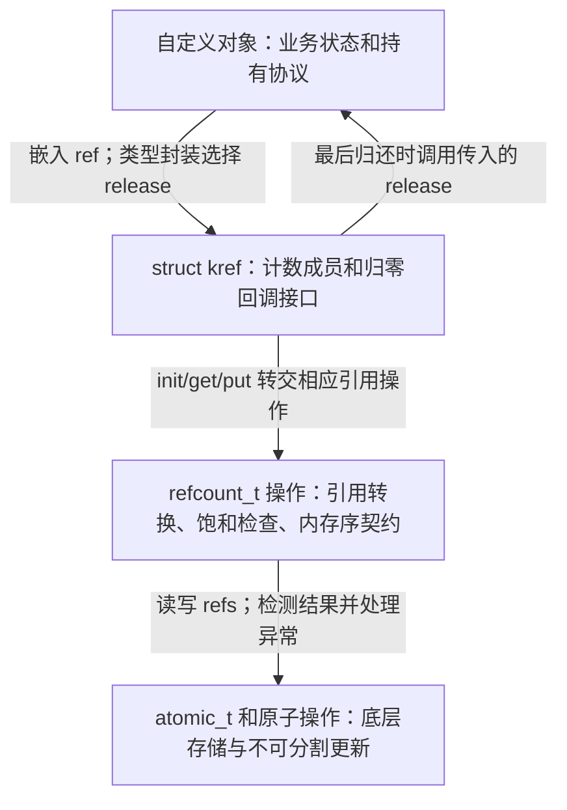
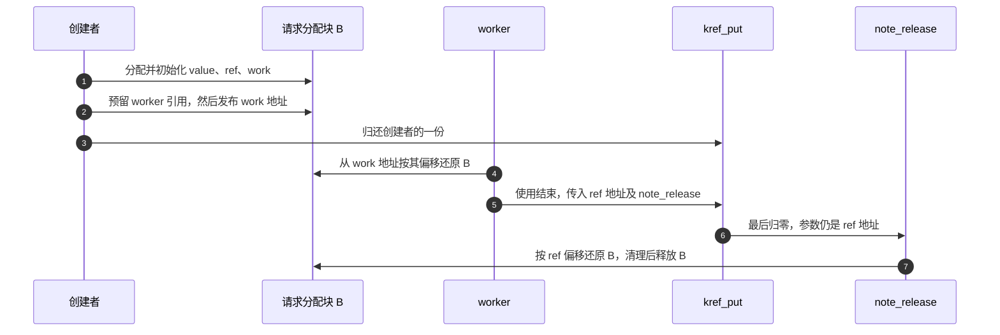
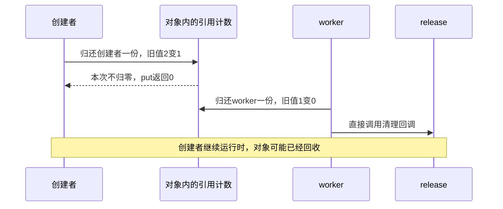
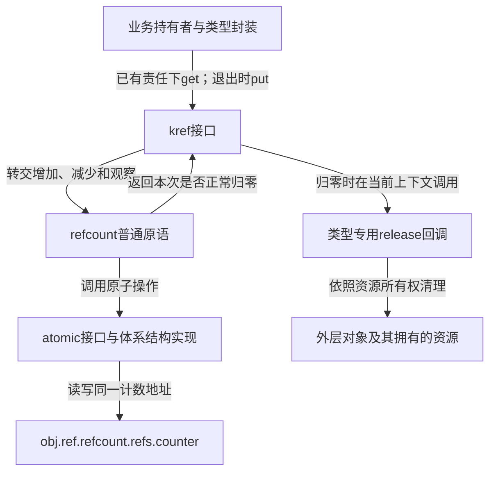
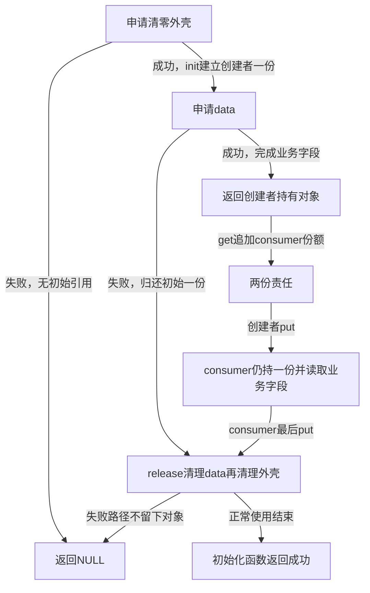
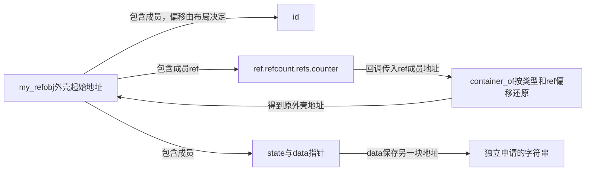
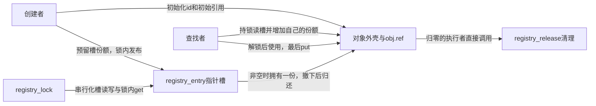
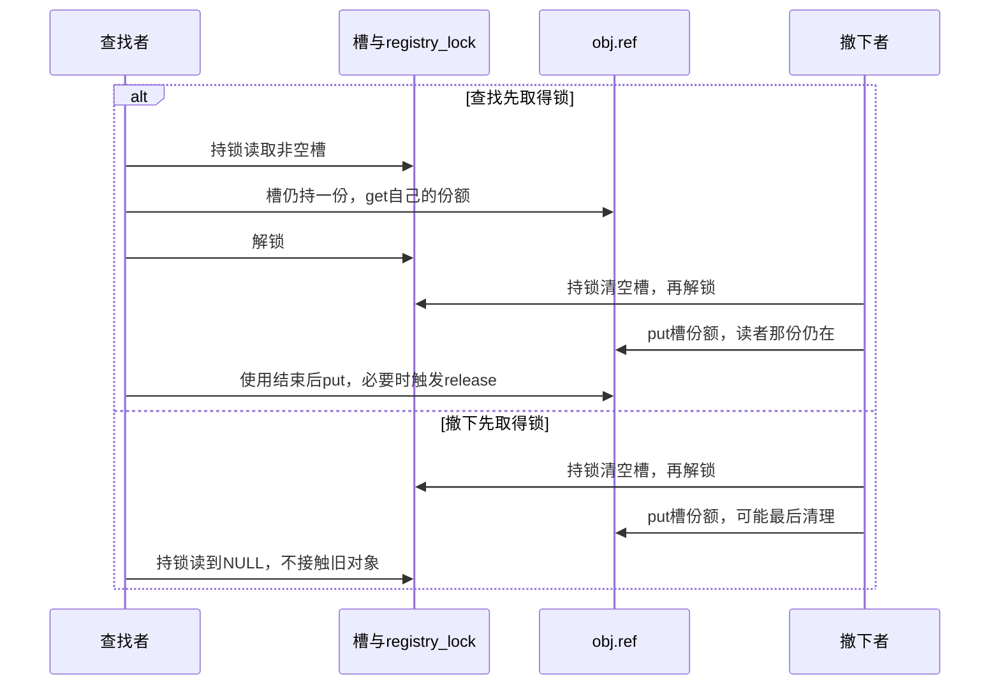
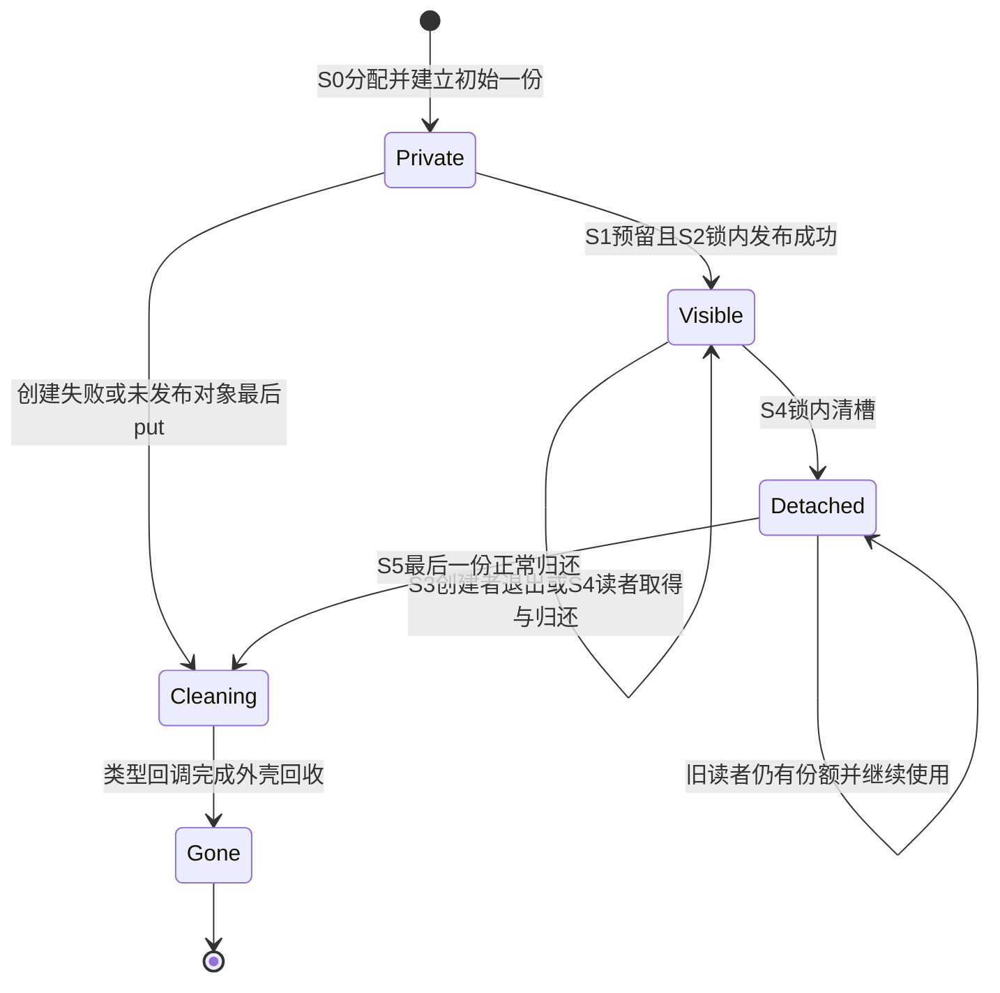

# 第2章\_源码入口与结构定义

## 2.1\_本章主线

[第 1 章的责任模型](P01_kref_要解决什么问题.md#1.5_为什么引用计数可以解决生命周期问题)已经建立共享、借用与交接，并用一次工作交付解释归零清理。现在的问题是：内核怎样把这些责任放进对象，怎样从计数成员回到应当清理的整个对象？

本章沿“源码位置 → 计数层次 → 嵌入成员 → 回调找回外层对象 → 创建和发布”阅读。先区分 `kref`、`refcount_t` 和底层原子操作各自承担什么，再讨论结构布局和接口；前章模块的并发调度与目标运行仍未由前端检查证明。

这里有四个需要带着读的问题：计数为什么嵌在对象里；为什么不是任意整数加减；release 为什么收到 `struct kref *` 而非业务指针；是谁把回调与对象类型配对。理解这些以后，初始化/get/put 才不会只是三条要背的语句。

------

## 2.2\_源码阅读入口

版本化证据从[源码总阅读索引](../../../../research/source_reading/kref/navigation/P01_Linux_6.12_kref源码阅读索引.md#1.2_按问题进入已落地证据)进入，普通路径在模块导读与唯一实现标题之间对应。

本章的具体实现边界是 NXP 官方 `linux-imx` 发布标签 `lf-6.12.20-2.0.0` 对应的 Linux 6.12.20，固定提交为 `dfaf2136deb2af2e60b994421281ba42f1c087e0`，见[源码基线](../../../../research/source_reading/linux/SOURCE_BASELINE.md#1.1_当前来源)。本地工作树后续实验提交不是证据。

| 相对源码位置 | 此处的阅读任务 |
| --- | --- |
| [include/linux/kref.h](../../../../research/source_reading/linux/include/linux/kref.h) | 看嵌入结构和 init/get/put 到 refcount 操作的转交，特别是归零时调用传入 release |
| [include/linux/refcount_types.h](../../../../research/source_reading/linux/include/linux/refcount_types.h) | 看引用计数类型怎样持有 atomic_t 字段 |
| [include/linux/refcount.h](../../../../research/source_reading/linux/include/linux/refcount.h) | 看引用操作的前提、溢出/下溢检测及内存序契约 |
| [lib/refcount.c](../../../../research/source_reading/linux/lib/refcount.c) | 看告警与饱和处理，以及不在头文件内实现的辅助操作 |
| [Documentation/core-api/kref.rst](../../../../research/source_reading/linux/Documentation/core-api/kref.rst) | 先读所有权规则，再用源码核对，不能只看函数名称猜前提 |

层次为“业务对象含 kref，kref 含 refcount_t，refcount_t 含 atomic_t”。继续往下才会遇到[原子操作检测包装](../../../../research/source_reading/linux/include/linux/atomic/atomic-instrumented.h)及 `arch/*/include/asm/atomic*.h` 的体系结构实现。这里不以公共头文件推出 ARM、ARM64、x86 等平台会执行相同指令，也不在尚未建立引用契约时跳入汇编。

------

## 2.3\_kref.h\_的位置

`include/linux/` 中的 `kref.h` 提供通用内核接口；使用者可以来自 `drivers/`、`fs/`、`mm/`、`net/` 或 `block/`。这个位置说明它不替某个设备、文件或连接保存业务规则，而是供不同子系统复用生命周期工具。

它只管理引用份额与归零回调，不知道对象是否在链表、属于哪种硬件或有多少字段。因此自定义对象可以嵌入 kref；已有设备、文件等框架对象则先遵循各自封装好的接口，不因为“这是通用工具”就另加一个竞争的释放入口。

------

## 2.4\_struct\_kref\_的本质

固定版本的字段名 `refcount` 表示引用计数，而不是持有者名单。

固定[计数成员定义](../../../../research/source_reading/kref/source_explanations/include/linux/kref.h.md#1.1_计数成员)仅保存 refcount_t，不保存回调或业务类型。

底层类型位于 `include/linux/refcount_types.h`，定义及明确标识的中文阅读注释集中在实现入口。

固定[refcount_t 存储定义](../../../../research/source_reading/kref/source_explanations/include/linux/refcount_types.h.md#1.1_原子存储字段)包含 atomic_t refs，安全规则由对应引用操作实现。

kref 没有保存对象类型、大小、业务地址、release 函数、所属子系统、锁、链表节点或状态机。这些信息仍由外层对象及其调用协议提供。特别是 release 不储存在这一个成员里，而是在调用 put 时传入；后文需要解释为什么所有归还路径必须使用与对象匹配的回调。

“结构只有一个字段”与“协议很简单”不是同一结论。这个字段汇总所有尚未归还的责任；对象可能同时拥有很多地址别名，也可能一个执行路径拥有多份责任，因此不能把字段值直接翻译成线程数或指针数。

------

## 2.5\_为什么不是\_atomic\_t

普通原子整数能把一次加减变成不可分割的更新，这已经解决了并发读改写丢失更新的问题。但“每次加减都准确执行”仍不能证明“计数表示的生命周期一直合法”。位宽有限会回绕，归零后错误增加仍是错误，多归还一次也不能因为动作是原子的就变成合法。

例如一个有限位宽计数器从最大值继续加一后回到零，再加一变为 1。此时真实尚未归还的责任可能很多；随后一次减一却得到零。如果销毁仅取决于这个零，就可能提前释放。**原子性保护一次更新不被拆开，引用语义还必须限制哪些更新可以发生，以及异常后是否允许回收。**

### 2.5.1\_用八位模型观察回绕的代价

为看见数字而不等待数十亿次操作，下面的[count_wrap.c](../../../../labs/kernel/object_lifetime/materials/count_wrap.c)采用八位无符号计数作教学模型。普通计数从 255 加一按无符号转换回到 0。另一种计数只允许正常值到 127，超过时标记为饱和并拒绝根据它释放；饱和意味着不再把该数解释为准确责任总数。

`owners` 是程序单独维护的真实责任账本，初始为 1，再增加 256 份后归还一份。模型不分配对象，也不实际释放任何内存，`guarded_release` 只是“是否会允许回收”的判断。两套计数都在同一串行事件上更新，不把普通 C 加法冒充内核原子指令。

```c
#include <assert.h>
#include <stdbool.h>
#include <stdint.h>
#include <stdio.h>

/* 缩小到八位的串行教学模型，不是 Linux refcount_t 的实现。 */
struct guarded_count {
    uint8_t value;
    bool saturated;
};

static void add_guarded(struct guarded_count *count)
{
    if (count->saturated)
        return;
    if (count->value == 127) {
        count->saturated = true;
        count->value = 192; /* 教学标记，进入后不再作为真实责任数。 */
        return;
    }
    assert(count->value > 0);
    ++count->value;
}

static bool drop_guarded(struct guarded_count *count)
{
    if (count->saturated)
        return false;
    assert(count->value > 0);
    return --count->value == 0;
}

int main(void)
{
    unsigned int owners = 1;
    uint8_t wrapping = 1;
    struct guarded_count guarded = { .value = 1, .saturated = false };

    for (unsigned int i = 0; i < 256; ++i) {
        ++owners;
        wrapping = (uint8_t)(wrapping + 1u);
        add_guarded(&guarded);
    }
    --owners;
    wrapping = (uint8_t)(wrapping - 1u);
    bool guarded_release = drop_guarded(&guarded);
    assert(owners == 256 && wrapping == 0 && !guarded_release);
    printf("owners=%u wrapping=%u guarded_release=%d\n",
           owners, (unsigned int)wrapping, guarded_release);

    while (owners) {
        --owners;
        assert(!drop_guarded(&guarded));
    }
    assert(guarded.saturated && guarded.value == 192);
    puts("all owners left; saturated model still refuses release");
    return 0;
}
```

```bash
cc -std=c11 -Wall -Wextra -Werror -O2 count_wrap.c -o count_wrap
./count_wrap
```

预期输出为：

```text
owners=256 wrapping=0 guarded_release=0
all owners left; saturated model still refuses release
```

第一行说明普通计数已经呈现危险的零，真实责任却还有 256 份；守护计数拒绝回收。第二行继续归还完所有真实责任，守护计数仍不允许释放，展示了代价：**失去准确计数以后，保守地保留对象可能形成泄漏，而不是猜测它已经无人使用。**

这个模型刻意用一个额外布尔状态，并在溢出前直接进入饱和；Linux 的实际实现没有照搬这两点，也不使用八位计数。模型只证明回绕为何危险、保守回收为何可能泄漏，不能用它证明 Linux 的并发饱和算法或告警覆盖。

### 2.5.2\_固定实现增加了哪些契约

在所核对的版本中，`refcount_t` 使用 `atomic_t` 保存位，`refcount.h` 将正常上限定义为 `INT_MAX`，饱和值 `REFCOUNT_SATURATED` 定义为 `INT_MIN / 2`。固定实现的注释把该值画在 32 位表示的 `0xc0000000`。这里的数值是异常处理区中的标记，不是“还剩这么多真实使用者”。

一次增加或减少先走原子操作，检测到溢出、下溢或从零增加等异常后，再由 `refcount_warn_saturate()` 写入饱和值并告警。它没有在每个操作上都先用比较交换循环计算饱和值，所以并发窗口中可能临时出现未经收敛的异常数；源码头注释专门讨论饱和区、并发任务规模和批量操作的约束。不能把它描述成“内存中的值从此每一瞬间都固定不动”，也不能把异常后泄漏说成业务逻辑已修复。

对正确的正常路径，引用原语还规定了内存序：普通增加不额外提供发布排序，取得对象时必须已经通过锁或适当的发布/读取协议建立可见性；减少提供 release 顺序，归零成功的减并检测路径再提供 acquire 顺序，使最后的清理处于规定的先后关系。此处先识别契约差异，后续再结合具体实现解释 acquire/release，不能据此声称 get 是任意对象的发布屏障。

| 情况 | 普通原子更新不足以回答什么 | 引用原语与调用者分别负责什么 |
| --- | --- | --- |
| 多方同时更新 | 新旧责任是否正确配对 | 原子更新防止丢失；应用仍须准确登记/归还 |
| 计数回绕或异常归还 | 得到零是否仍可信 | 检测后饱和/告警，可能保守泄漏；应用修复错误路径 |
| 从零再次增加 | 原地址是否仍有效 | 普通 get 不负责复活对象，条件取得也需要有效内存窗口 |
| 读取业务字段 | 增加计数是否发布全部字段 | 采用获取对象的同步协议，不能依赖普通 inc 的额外排序 |

封装确实让调用方更容易依循统一接口和实现演进，但 **不是仅为了少改几个类型名**。另一方面，防护也不提供万能检测：已被释放并重新分配的地址可能根本不是原对象；只凭计数 API 不能恢复其身份或修复查找窗口。

### 2.5.3\_检查正常边界再回到对象

把程序中的增加次数改成 126，并按新轨迹调整原先针对 256 次增加的断言：初始 1 加到 127，还没有进入饱和；归还所有责任后应当只在最后一份归还时允许回收。再增加一次会进入本模型的保守状态。两种情况应分别检查，不能只观察“异常时不会释放”。

进一步思考：把所有操作换成原子操作，八位普通计数的回绕会消失吗？不会，原子性没有扩大位宽。把模型的饱和布尔值删掉，再直接赋 192 能否保留同样保证？不能，后续加减规则也必须识别并维持异常状态。这两问分别检查我们是否混淆了操作不可分割、数值范围和生命周期契约。

------

## 2.6\_kref\_和\_refcount\_t\_的关系

现在再看层次图，每条边都有具体职责，而不只是名字嵌套：


```mermaid
flowchart TD
    object["自定义对象：业务状态和持有协议"]
    kref["struct kref：计数成员和归零回调接口"]
    refcount["refcount_t 操作：引用转换、饱和检查、内存序契约"]
    atomic["atomic_t 和原子操作：底层存储与不可分割更新"]
    object -->|"嵌入 ref；类型封装选择 release"| kref
    kref -->|"init/get/put 转交相应引用操作"| refcount
    refcount -->|"读写 refs；检测结果并处理异常"| atomic
    kref -->|"最后归还时调用传入的 release"| object
```

业务对象如果选择 kref 作为生命周期接口，就保持这条责任路径一致。只调用底层 `refcount_dec_and_test()` 却漏掉对象清理，会把正确归零与必要析构分开；绕过引用原语直接原子更新，又会丢失它提供的异常与顺序契约。直接使用 refcount_t 的其他对象可以另有完整设计，不能推成“内核一律不准直接使用 refcount_t”。

本章后面的[关键源码讲解](#2.13_kref/refcount_t_关键源码讲解)继续核对函数层次；眼前还留下结构问题：计数嵌入以后，回调怎样找到整个对象，以及为什么一个计数字段不足以构成完整的创建/退出协议。下一节由这个问题进入嵌入式对象。

------

## 2.7\_kref\_为什么嵌入自定义引用对象内部

前面知道了计数表达什么，现在要决定它放在哪里。对上一章的请求，创建者和 worker 使用的是同一个分配对象；它们对 `request->ref` 操作，在最后归还时清理该请求。把计数成员与请求放在同一分配块，便不必另外解决“请求与计数谁先消失”。

这也是链表节点、红黑树节点和工作项常见的组织方式：`list_head` 让对象参与链表，`rb_node` 让对象参与树，`work_struct` 让对象参与异步执行，`kref` 让对象参与引用协议。它们各自承载不同状态，嵌在一起并不表示一种机制会自动维护另一种机制。

不过，结构内写了 `struct kref ref` 只是存储位置已经存在。完整协议还需要分配成功后的初始化、初始责任的拥有者、取得/归还规则，以及与外层类型配对的 release。若对象还拥有独立分配的 `data` 缓冲区，release 要按所有权先清理该资源，再释放外层对象；如果 `data` 只是借用，则不能因为对象归零就擅自释放它。

通常会定义 `my_refobj_get()` 和 `my_refobj_put()` 这类类型接口，使外部调用者不用每次自行选择回调。这样的 wrapper 是否接受 NULL 必须约定一致；即使选择空值时无操作，非空参数仍须满足有效引用的前提。它们不会替悬挂地址恢复寿命。

要分清三件事：kref 是计数成员，release 是该类型选择的最终清理函数，get/put 是该类型对外提供的生命周期接口。普通单一类型不需要给每个实例再保存同一个 release 函数指针；具有多种清理策略的框架可以另有分发层，但那不是 kref 字段自动保存的功能。

------

## 2.8\_嵌入式结构的好处

嵌入带来的收益可以沿一次分配、一次成员传递和一次最终清理逐项检查，不能把它压成“更高效”而不说省掉了哪一步。

### 2.8.1\_不需要额外分配

对只包含内联字段的 `note_request`，一次分配同时获得业务字段、计数与工作项。若改为 `struct kref *ref` 并单独分配，还需要第二次分配及失败清理，并决定谁保存二者的关联。这增加的是内存分配和所有权分支，而不是多写一个指针那么简单。

这里的“一次”只针对外层与这些内联成员。对象拥有的可变长缓冲区仍可能另行分配；嵌入 kref 不会自动把所有业务资源合成一块内存。

### 2.8.2\_生命周期天然一致

同一分配块尚存时，内部成员的存储也尚存；释放整个块之后，旧成员地址同样失效。这省去了独立计数块早于业务对象消失的协调问题。它并不意味着“内存还在就已经正确初始化”，也不阻止有人错误复制整个活动对象、清零计数或绕过协议直接释放。

因此“天然一致”说的是 **存储的包含关系**，仍需引用协议保证释放时机。复制结构体的字节，不会让已交给 worker 的成员地址改指向副本，也不会自动转交原来的引用责任。

### 2.8.3\_release\_可以通过\_container\_of\_找回对象

只要回调知道真实外层类型和成员名，就能从 `&request->ref` 还原 `request`。这项地址换算不依赖 ref 放在开头，不需要对象另外登记到一个全局“计数到对象”表。

它也没有发现类型的魔法：回调必须与被归还的对象类型匹配，传入地址必须来自仍有效的那个成员。下一节沿同一请求观察这一点。

------

## 2.9\_container\_of\_是理解\_kref\_的关键

`kref_put()` 收到计数成员地址和 `void (*release)(struct kref *)` 回调，归零时把这个成员地址交给回调。回调要释放的却是分配器返回的整个请求地址，两者不一定相同。

上一章[完整工作模块](P01_kref_要解决什么问题.md#1.16.1_运行一次真实工作交付)现在把 `int value` 放在 `ref` 前面；对象定义与材料文件保持一致。于是 ref 的成员偏移必然非零，直接把 `struct kref *` 强制转换成请求指针就不会得到分配块的起点。正确关系是：

```text
对象起点 B
  + offsetof(struct note_request, ref) = &request->ref
  + offsetof(struct note_request, work) = &request->work

release 收到 &request->ref，减去 ref 的真实偏移回到 B。
worker 收到 &request->work，减去 work 的真实偏移也回到 B。
```

`offsetof` 由编译器按实际结构布局给出成员偏移，包含所需的对齐填充；不能简单把前面字段的 `sizeof` 相加，也不能把宿主实验打印的某个数字固定写进 ARM 驱动。


```mermaid
sequenceDiagram
    autonumber
    participant C as 创建者
    participant O as 请求分配块 B
    participant W as worker
    participant K as kref_put
    participant R as note_release
    C->>O: 分配并初始化 value、ref、work
    C->>O: 预留 worker 引用，然后发布 work 地址
    C->>K: 归还创建者的一份
    W->>O: 从 work 地址按其偏移还原 B
    W->>K: 使用结束，传入 ref 地址及 note_release
    K->>R: 最后归零，参数仍是 ref 地址
    R->>O: 按 ref 偏移还原 B，清理后释放 B
```

图中画创建者先结束的一条合法顺序；若 worker 先结束，就由创建者的最后 put 调用同一个回调。执行先后改变最后归还者，不改变回调与外层类型的配对。

固定 GNU C 宏的实现已在[源码总索引](../../../../research/source_reading/rbtree/navigation/P01_Linux_6.12_rbtree源码阅读索引.md#1.2_按问题选择源码入口)、[成员布局模块](../../../../research/source_reading/rbtree/navigation/P07_节点布局与编码状态导读.md#7.4_从嵌入成员回到所有者)及[container_of 唯一实现](../../../../research/source_reading/rbtree/source_explanations/include/linux/container_of.h.md#1.1_一次还原中的求值与类型检查)展开，这里复用其通用地址契约。尽管证据组织在 rbtree 研究专题，它操作的是通用成员地址，并不调用树算法。

需要动手观察地址时，运行已存在的[双成员 C 实验](../../data_structures/红黑树_rb-tree/P09_Linux_6.12_内核_rbtree_嵌入式节点与使用者接口.md#%281%29_两个嵌入成员还原同一个任务)，再回到这里的 ref/work 两个成员。该实验还显示：同类型的两个成员写错名字可能通过类型检查；普通 container_of 会丢失 const 限定，保留只读限定需使用对应入口。类型检查不是运行时对象身份验证，更不能证明旧地址还活着。

------

## 2.10\_为什么\_release\_不直接接收自定义引用对象指针

通用 kref 层只接收 `struct kref *`，不保存业务类型和业务对象指针。它可能嵌在私有设备对象、请求、会话、缓存或 inode 私有对象中；具体调用方选定了哪一种，kref 层并不知道。因此当前接口把计数成员地址交给由类型封装选定的回调，再由回调恢复类型。

如果直接把接收 `struct my_refobj *` 的函数强制转换成 kref 所需的回调类型，既没有改变实际传入的地址，也没有建立兼容的函数类型调用；即使 ref 偶然位于第一个成员，也不能拿这个巧合消除接口契约问题。正确适配是写一个参数类型为 `struct kref *` 的回调，在函数体中按真实成员还原。

原阅读批注按原文保留：

别听上面的废话，一句话总结：

> `kref`调用的是`kref`的接口，它的体系里面本身不具备成员`.release()`函数接口，所以要单独定义。
>
> `kref`调用`release()`函数的调用的是参数里的`callback()`函数参数，该引入的参数只能是它自己，也就是`this`指针。那么你只能通过`this`指针再通过`container_of()`反向获取自定义结构体`my_refobj`对象的地址。
>
> 所以你想要传入`my_refobj`结构体，根本没有这个接口给你适配。

批注里的 `this` 是对“传入当前计数成员地址”的类比，C 接口没有隐含的 this 参数；实际调用参数是 kref_put 收到的 `struct kref *`。`container_of()` 也不从这个地址猜测类型，回调代码必须明确写出正确的外层类型和成员名。这使批注强调的“按既定回调接口适配”与上面的地址图对应起来。

------

## 2.11\_kref\_不是单独分配的对象

本专题采用计数与业务对象同一分配块的常规模式。仅把成员换成 `struct kref *ref`，再分别分配业务对象与计数，不能继续声称二者具有天然相同的存储寿命：第二次分配失败如何清理第一次，哪一方先释放，回调怎样找到业务对象，都多了一组必须回答的问题。

独立控制块不是在所有设计中都不可能成立。比如另一套所有权模型确实需要控制信息比业务负载活得更久，就可以让控制块本身成为被计数的对象，并明确负载指针的取得、失效和回收协议。但那是两个生命周期及其关联，不能未经设计就把本章嵌入模板改成指针，也不能把 kref 自动等同于 C++ 的共享指针控制块。

对当前请求没有这种额外需求，保留一个内联 `struct kref ref` 能少一组分配、关联与退出分支。这里选择嵌入的理由是它满足当前约束并减少需要证明的状态，而不是 C 语法禁止计数成员出现在控制块里。

------

## 2.12\_kref\_init()\_的初始引用

[后续源码单元](#%281%29_kref_init%28%29)将核对 kref_init 如何设置初值；先把它放回完整创建过程。上一章模块先确认 `kzalloc()` 成功，再初始化 kref 为 1，随后填业务值并初始化工作项，完成后才发布给队列。创建者的初始引用覆盖这段尚未公开的准备过程。

初始值 1 表示创建者现在承担一份最终归还责任，不表示业务已经 online、对象已经入容器，或任何读者都可以取走它。创建者可以最后 put，也可以按明确契约交接这份引用；若还要继续使用，就为接收方另建份额。

若对象还有独立分配的 data 缓冲区，需要选择一致的失败清理方式：可以先准备所有资源，成功后再建立并发布引用协议；也可以先把成员置于 release 能处理的有效初态，建立初始引用，后续资源准备失败时沿 put 统一清理。后一种方式要求 release 对尚未取得的资源有明确处理，不能调用尚未初始化的锁或释放未定义指针。

对应到本章账本，分配失败没有对象引用需要归还；初始化成功以后，无论后续发布成功还是失败，创建者的份额都必须有去向。漏掉它会泄漏，提前归还但没有覆盖接收者的使用期限会 UAF。在已经发布的对象上再次 init 成 1 更会丢掉其他持有者的责任，不能把初始化当成“计数不对时重新设置”。

试着检查同一个模块：将 ref 放到最后一个成员，两个 container_of 调用需要换成硬编码偏移吗？不需要，成员名没有改变时编译器重新计算布局。直接把 release 参数转成请求指针是否仍正确？不是。若追加缓冲区分配失败，哪个阶段的资源已经归对象所有、由哪一条退出路径清理？这要求回到创建顺序逐项列账，而不是只检查有没有调用 kref_init。

------

## 2.13\_kref/refcount\_t\_关键源码讲解

前面的请求已经把角色、成员地址和归还责任对应起来。这里沿 S0～S5 看固定实现怎样兑现这些结论；函数体集中到[源码总阅读索引](../../../../research/source_reading/kref/navigation/P01_Linux_6.12_kref源码阅读索引.md#1.2_按问题进入已落地证据)及其唯一实现标题，正文保留每一步需要回答的问题，不再与 P05 各维护一份相同函数。

### 2.13.1\_源码

先读[普通引用模块的状态账本](../../../../research/source_reading/kref/navigation/P02_普通引用与归零回调导读.md#2.2_把S0到S5落到状态地址)，确认计数地址是对象内的 `ref.refcount.refs`，外部队列槽和业务状态不由这些函数更新。再按下面六步对照实现。

#### (1)\_kref\_init()

S0 初始化进入[kref_init 唯一实现](../../../../research/source_reading/kref/source_explanations/include/linux/kref.h.md#1.2_建立初始引用)。它把内部计数 **设为** 1，而不是向已有值增加 1，也不替对象完成分配或发布。回看模块的失败分支：只有分配成功以后才有可初始化的成员地址。

#### (2)\_refcount\_set()

[refcount_set 与读取实现](../../../../research/source_reading/kref/source_explanations/include/linux/refcount.h.md#1.1_设置与观察)把值写入内部原子存储。它没有先判断对象是否已经公开，故“初始化只能用于正确阶段”是调用者义务，不是 helper 自动保证。

#### (3)\_kref\_get()

S1 的[kref_get 实现](../../../../research/source_reading/kref/source_explanations/include/linux/kref.h.md#1.3_为独立使用追加引用)转交普通引用增加，没有成功布尔值。已有持有者须在自己的保护期限结束前预留接收者份额；S2 发布的地址和字段可见性依靠外层协议，不能只凭此调用证明。

#### (4)\_refcount\_inc()

普通增加沿[refcount_inc → __refcount_inc → __refcount_add](../../../../research/source_reading/kref/source_explanations/include/linux/refcount.h.md#1.2_普通增加与异常检测)进入实际计数存储。检查时拿到的是 **增加前的旧值**，原子增加已经发生；可选 oldp 仅在非空时返回该旧值，普通 kref 路径传 NULL。

旧值为零会报告从零增加；旧值已为负或加法跨入负区会报告溢出。异常路径再把计数收敛到饱和；它不能证明先前的指针仍属于原对象，也不能把失败责任自动补回来。若只画 get→inc 的箭头而省略这一检查顺序，就容易误读成“helper 拒绝一切非法写入以后才增加”。

##### 1)\_signed\_wrap\_小结

固定版本的[__signed_wrap 定义](../../../../research/source_reading/kref/source_explanations/include/linux/compiler_types.h.md#1.1_检查器属性与构建选项分工)在 `CONFIG_UBSAN_SIGNED_WRAP` 打开时展开为针对有符号溢出检查的 `no_sanitize` 属性；配置未打开时为空。它不会在运行时算计数，也不单独把标准 C 的有符号溢出变成合法回绕。

真实编译还依赖[顶层 Makefile 的选项](../../../../research/source_reading/kref/source_explanations/Makefile.md#1.1_优化选项与函数属性分开核对)。`old + i < 0` 这类检测必须连同内核构建语义解释；将函数复制到默认宿主编译命令，仅保留这个属性，并没有复现相同前提。负值异常区属于引用计数设计，插桩抑制与编译语义属于另外两个层次。

#### (5)\_kref\_put()

S3/S4 的[kref_put 唯一实现](../../../../research/source_reading/kref/source_explanations/include/linux/kref.h.md#1.4_最后归还调用清理)消费[refcount_dec_and_test 的判定](../../../../research/source_reading/kref/source_explanations/include/linux/refcount.h.md#1.3_旧值决定归零与异常分支)。单份归还旧值为 2 时剩 1、返回 false；旧值为 1 时正常归零、返回 true，随后同步调用传入 release，进入 S5。这个结果来自本次原子减少取得的旧值，不能换成“先减，再单独读取当前计数是否为零”。

下层通用 helper 接受减量 i；旧值必须为正且等于 i 才走正常归零。例如旧值 2、减量 2 在通用接口中可归零，但普通 kref 固定只减 1。旧值非正或过量减少会进入[饱和告警](../../../../research/source_reading/kref/source_explanations/lib/refcount.c.md#1.1_告警之前先收敛到饱和)，返回 false；负值也可能已是饱和状态，不能仅凭它断言内存已经 free。

减少提供 release 顺序，正常归零分支再补 acquire 顺序，然后调用清理。这里说明访问的先后约束，不是说所有硬件访问在物理时间上都已经彻底完成。release 得到的仍是原成员地址，kref 层不替它转成业务指针。

`kref_put()` 返回 1 表示本次已经调用 release；回调若另排延迟清理，就不能把 1 解释成物理内存必定当场释放。返回 0 表示本次未调用回调，既不保证自己仍持有引用，也不能排除异常饱和分支。

##### 1)\_must\_check\_小结

[__must_check 唯一实现](../../../../research/source_reading/kref/source_explanations/include/linux/compiler_attributes.h.md#1.1_返回值诊断不是自动清理)将返回值责任交给编译诊断。检查有效时，丢弃底层 `refcount_dec_and_test()` 的结果会产生告警；真正的清理由正确消费结果的调用方执行，属性本身不会 free，也不证明 if 分支中的清理正确。

普通 kref_put 内部已经检查该 bool 并调用 release，所以它自己的返回值没有这个属性，可以在不需要额外统计时直接调用。宿主验证区分了丢弃底层判定、消费判定和直接 kref_put 三种情况；本次 GCC 仅做语法检查时没有报出这个诊断，编译为目标文件才出现预期 unused-result 错误。不能把某一种检查模式没有告警当成“属性不存在”。

#### (6)\_kref\_read()

[kref_read 实现](../../../../research/source_reading/kref/source_explanations/include/linux/kref.h.md#1.5_读取快照不新增责任)把[refcount_read](../../../../research/source_reading/kref/source_explanations/include/linux/refcount.h.md#1.1_设置与观察)的瞬时值返回给观察者。const 不阻止其他执行路径变化，返回的无符号数也可能是异常位模式；调用前必须已能合法访问成员，观察后不能据此复活或独占对象。

把这六步连起来后，读者应能解释同一请求的两种正常结束顺序，以及引用已失配时为何必须停止把计数当作准确账本。下一个静态初始化单元再处理初始值来自编译期的情况，它不能倒过来改变上述归还责任。

------

## 2.14\_静态初始化\_KREF\_INIT(n)

前面用 `kref_init()` 在已经分配的对象里建立初始一份。现在换一个很小的场景：模块自带一个固定配置对象，从加载到卸载都使用同一块存储。它不需要先分配再初始化，却仍希望用引用责任约束“什么时候停止服务”。定义对象时可以写 `KREF_INIT(1)`。先分清两件事：**计数如何取得初值**，以及 **承载计数的内存什么时候消失**。

### 2.14.1\_初始化器沿着成员层次填值

从[固定源码索引](../../../../research/source_reading/kref/navigation/P01_Linux_6.12_kref源码阅读索引.md#1.2_按问题进入已落地证据)进入 [KREF_INIT](../../../../research/source_reading/kref/source_explanations/include/linux/kref.h.md#1.6_定义对象时建立计数)，再沿 REFCOUNT_INIT 和 ATOMIC_INIT 往内看。它们依次为 kref、refcount_t、atomic_t 三层结构提供初始化器；最里面的整数在 `ref.refcount.refs.counter`。完整展开集中在[逐层构造初始值](../../../../research/source_reading/kref/source_explanations/include/linux/refcount.h.md#1.4_逐层构造初始值)，不能把中间的 refs 当成 int 而漏掉 atomic_t 那层花括号。

```c
/* 两者都在定义时建立初值，存储期由定义位置和 static 决定。 */
static struct kref module_ref = KREF_INIT(1);
/* 在函数体内这样定义，则 ref 是自动存储对象。 */
struct kref ref = KREF_INIT(1);
```

第二行形式能用在函数体内，并不意味着“引用计数让栈内存活得更久”。函数退出后自动对象的存储期结束，即使计数还有十份也无济于事。反过来，模块静态对象计数到零后，其字节也不会自动消失。**计数描述使用责任，C 的存储期决定存储何时存在；两者需要外层协议衔接。**

宏生成的是花括号初始化器，不是返回值表达式；不要写 `ref = KREF_INIT(1);`。动态分配之后，应在尚未发布的新对象上调用 `kref_init(&obj->ref)`。即使另外构造复合字面量能让赋值通过编译，也不能用它覆盖正在被别人使用的计数。

初值 1 必须有具体主人。本例把它交给模块本身；如果填 3，就必须解释哪三份责任已经建立、分别由谁归还，宏不会凭空创建三位持有者。填 0 也不会得到可普通 get 的活对象。对于静态存储定义，初值还须满足 C 的常量初始化规则；宏本身并不把任意运行时值变成常量。

### 2.14.2\_运行一个不释放静态内存的完整模块

下面只观察一个同步周期：模块初始持一份，初始化函数临时增加一份再归还，卸载时归还模块那份。没有查找表、异步工作或外部调用者，因此能在卸载函数里明确知道不会再出现新使用者。上一章已经讲过队列发布；本例刻意把发布环节留空，以观察计数与静态存储各自的职责。

配套文件为 [note_kref_static.c](../../../../labs/kernel/object_lifetime/materials/note_kref_static.c)，与下面完整程序一致：

```c
// SPDX-License-Identifier: GPL-2.0
#include <linux/kref.h>
#include <linux/module.h>

struct note_static_object {
    int value;
    struct kref ref;
};

/* 初始一份属于模块；静态存储不由 kfree 管理。 */
static struct note_static_object note_object = {
    .value = 42,
    .ref = KREF_INIT(1),
};
static unsigned int release_calls;

static void note_static_release(struct kref *ref)
{
    struct note_static_object *object =
        container_of(ref, struct note_static_object, ref);
    pr_info("note_static: final value=%d\n", object->value);
    ++release_calls; /* 对象外的完成记录；回调不释放静态对象。 */
}

static int __init note_static_init(void)
{
    kref_get(&note_object.ref); /* 在未归还的初始引用下增加临时独立份额。 */
    kref_put(&note_object.ref, note_static_release);
    return 0; /* 模块仍持初始一份。 */
}

static void __exit note_static_exit(void)
{
    /* 没有发布入口、异步 work 或外部使用者，可以归还最后一份。 */
    kref_put(&note_object.ref, note_static_release);
    pr_info("note_static: release_calls=%u\n", release_calls);
}

module_init(note_static_init);
module_exit(note_static_exit);
MODULE_LICENSE("GPL");
MODULE_DESCRIPTION("静态存储与引用归零分工实验");
```

`release_calls` 保存在被计数对象之外，用来记录清理回调发生过几次。回调从 ref 还原外层对象并打印业务值，然后返回；它没有调用 `kfree()`，因为对象不是从堆里分配的。以后若静态对象持有动态申请的缓冲区，可以在回调里释放那块缓冲区，但依然不能把静态外壳交给 kfree。

| 时刻 | 责任与计数 | 存储及回调 |
| --- | --- | --- |
| 模块准备完成 | 模块拥有初始一份，值为 1 | 模块数据区已有 note_object，未调用 release |
| 初始化函数临时使用 | 模块一份加临时一份，值为 2 | 仍是原地址，无分配或复制 |
| 临时使用结束 | 归还临时一份，值回到 1 | put 不触发最后清理 |
| 卸载函数归还 | 模块最后一份结束，值到 0 | 同步调用 release，打印 42，记录一次 |
| 卸载函数返回 | 本生命周期不再接纳使用 | 后续由模块卸载流程回收模块存储 |

这里的地址在回调返回后尚未立刻消失，但不能据此再普通 get。这轮生命周期已经结束；若要支持静态对象反复启停，必须另有协议排除全部旧使用者、停止新入口并重新建立状态。本例没有实现重启协议，不借“静态内存还在”掩盖责任断裂。

在与目标内核版本及配置匹配的构建环境中，进入材料目录后执行。`KERNEL_BUILD` 是已经配置和准备好的目标内核构建目录，不是随便找到的一份头文件：

```bash
make -C "$KERNEL_BUILD" M="$PWD" ARCH=arm CROSS_COMPILE="$CROSS_COMPILE" modules
```

把生成的模块放到匹配的目标 Linux 上，在该目录观察一次装卸；构建环境准备沿用[上一章完整模块](P01_kref_要解决什么问题.md#1.16.1_运行一次真实工作交付)。

```bash
sudo insmod ./note_kref_static.ko
sudo rmmod note_kref_static
dmesg | tail -n 20
```

预期加载后临时 put 不触发最终打印；正常卸载打印 `note_static: final value=42` 和 `note_static: release_calls=1`。这两条日志检验的是本例调用顺序，不是所有静态对象的通用卸载保证。有外部用户、定时器或工作项时，卸载前还必须关闭入口并等它们退出；kref 不会自动替模块做这件事。

本轮已通过 ARM 前端语法检查；宿主 C 夹具用固定初始化宏和普通引用函数、明确的顺序原子替身检查 1→2→1→0 与一次回调。未在目标机执行模块构建链接或装卸，上述日志是待观察预期，不能写成实测。

### 2.14.3\_预测与修改

先不运行，预测删除初始化函数里的 get、却保留两次 put 会发生什么。第一处 put 就结束初始责任，卸载处再减零计数已经是错误；“反正不 kfree”并不能使多归还合法。

再把初值改成 2，其余保持不变，预测卸载是否调用 release。最后会剩 1，不调用；缺少的是第二份初始责任的主人及归还位置，不是把日志再打一次就能修好。修改回到初值 1 后，尝试只给回调添加动态缓冲区清理，并在纸上列出申请失败时哪些字段可清理；不要实际把静态外壳传给 kfree。

最后解释为什么局部 `struct kref ref = KREF_INIT(1)` 不能直接交给跨函数异步工作。即使接收方以后会 put，发送者函数返回时该局部对象的存储期也已经结束。现在已经能选择定义时初始化或新动态对象上的 init；下一节继续检查运行中的 get 究竟承诺什么。

------

## 2.15\_kref\_get()\_的源码层次

上一节已经区分“存储仍在”和“这轮生命周期仍有引用”。现在把普通 get 放回一次交付：创建者尚持初始一份，想让 worker 在自己退出后继续使用对象，于是先追加 worker 那份，再通过队列交付。顺序不能倒过来；接收方若先运行并结束使用，预留责任必须已经存在。

[固定 get 实现](../../../../research/source_reading/kref/source_explanations/include/linux/kref.h.md#1.3_为独立使用追加引用)调用 refcount_inc，再在同一个计数地址做原子增加。普通 get 没有“抢救失效对象”的步骤，也不返回“取得成功/失败”。调用之前要有两个证明：这段内存仍可安全访问，并且生命周期仍有受保护的正引用。仅有静态地址或延迟回收窗口，不能满足第二项。

最直接的证明是调用者自己尚持一份。另一种是容器拥有一份，并且查找与撤下都受同一把锁保护：锁内找到仍在容器里的对象，容器那份还没归还，可以追加一份再解锁。这里起作用的是 **锁加容器持有协议**；若锁只保护链表指针，而另一路可以在锁外将计数减零，就不能只凭“我已加锁”普通 get。

```c
/* 创建者仍持一份；成功交付后 worker 负责归还新增的一份。 */
kref_get(&refobj->ref);
pass_to_worker(refobj);
```

这是责任顺序示意，pass_to_worker 必须另有成功/失败与发布契约。真实队列还可能拒绝新投递；[上一章完整模块](P01_kref_要解决什么问题.md#1.16.1_运行一次真实工作交付)已经展示预留、拒绝归还和两种结束顺序。不要从两行示意复制出忽略 queue_work 返回值的长期引用泄漏。

如果目前只能证明地址暂时可读，却不能证明计数仍为正，就需要后续的条件取得协议。条件接口也要求地址有效，不能对已经释放的裸指针试运气；[查找章节](P08_lookup_场景与_kref_get_unless_zero%28%29.md)会把这两个条件分别建立。

------

## 2.16\_kref\_put()\_的源码层次

一次 put 归还调用者负责的一份。下层原子减返回本次操作的旧值；正常情况下旧值为 1 的那次操作把计数变成零，随后 kref_put 在同一个执行上下文调用传入的 release。其他归还者不需要逐个向清理线程报告，大家修改的是同一个计数地址，最后归还者直接消费自己的原子结果。固定证据见[put 与回调](../../../../research/source_reading/kref/source_explanations/include/linux/kref.h.md#1.4_最后归还调用清理)。

把创建者和 worker 各持一份的状态放在一起看：


```mermaid
sequenceDiagram
    participant C as 创建者
    participant R as 对象内的引用计数
    participant W as worker
    participant F as release
    C->>R: 归还创建者一份，旧值2变1
    R-->>C: 本次不归零，put返回0
    W->>R: 归还worker一份，旧值1变0
    W->>F: 直接调用清理回调
    Note over C,F: 创建者继续运行时，对象可能已经回收
```

返回 0 只是“本次没有调用 release”，不承诺返回时对象还在，更不替创建者保留一份。两个 CPU 上，worker 甚至可以在创建者的 put 尚未返回时完成最终清理。返回 1 则表示本次已调用回调；回调若安排延迟释放，也不能把它解释为物理内存必定立即消失。异常饱和路径也可能返回 0，不能把 0 一律换算成某个正计数。

```c
/* 日志不读取 refobj；这里观察的是这次调用是否触发了回调。 */
if (kref_put(&refobj->ref, my_refobj_release))
    pr_debug("release callback invoked\n");
```

通常把 put 放在当前使用期的最后一步。若同一路径另有一份独立引用，或有确实阻止清理的外部协议，之后的访问必须明确依赖那份保护；不能依赖刚刚归还的份额。业务字段的并发修改还须单独同步，延长寿命不会让字段访问自动互斥。

------

## 2.17\_kref\_read()\_为什么不能作为生命周期判断

read 只返回一个数，不改变任何持有责任。调用者必须先有可安全读取计数地址的窗口；否则连“读出来看看”这一步都已经无效。假设观察者在一个仍持引用的调用者保护下读到 1，然后这段借用结束，原持有者 put 并清理。观察者手上的局部整数仍为 1，可对象已经不在。数值不会收到“对象已释放”的自动更新通知。

因此 `if (kref_read(&refobj->ref) > 0) kref_get(&refobj->ref);` 不能替代保护：检查与增加之间可能归零。即便换成条件增加，也仍要先证明计数地址在操作期间有效；锁和 RCU 等协议负责的具体窗口会在查找章节展开。固定[读取实现](../../../../research/source_reading/kref/source_explanations/include/linux/kref.h.md#1.5_读取快照不新增责任)没有这些外部保护动作。

### 2.17.1\_运行快照与持有的对照程序

下面用普通 C 顺序安排参与者动作，不创建真实线程，也不故意解引用已释放地址。第一轮只保存数值，第二轮在原持有者退出前追加独立责任。材料为 [reference_snapshot.c](../../../../labs/kernel/object_lifetime/materials/reference_snapshot.c)，完整内容如下：

```c
#include <assert.h>
#include <stdbool.h>
#include <stdio.h>
#include <stdlib.h>

/* 顺序责任模型：refs 不是原子变量，不用于真实并发。 */
struct object {
    unsigned int refs;
    int value;
};
static unsigned int released;

static void put(struct object *obj)
{
    assert(obj->refs > 0);
    if (--obj->refs == 0) {
        ++released; /* 只在对象外保存回收记录。 */
        free(obj);
    }
}

static bool run(bool hold)
{
    struct object *obj = malloc(sizeof(*obj));
    if (!obj)
        return false;
    *obj = (struct object){ .refs = 1, .value = 42 };
    unsigned int before = released;

    /* 此时原持有者尚未退出，观察者暂时借用这个地址。 */
    if (hold)
        ++obj->refs; /* 在已有一份的保护下为观察者追加独立责任。 */
    unsigned int saved = obj->refs;

    put(obj); /* 原持有者先结束；之后不能再依赖它保活。 */
    bool original_released = released != before;
    assert(original_released == !hold);
    printf("hold=%u saved=%u original_released=%u\n",
           hold ? 1u : 0u, saved, original_released ? 1u : 0u);

    if (hold) {
        /* 能读字段的依据是尚未归还的观察者责任，不是 saved。 */
        assert(obj->refs == 1 && obj->value == 42);
        put(obj);
    }
    /* 无持有分支从第一次 put 后就不再读取、比较或传递旧 obj。 */
    assert(released == before + 1);
    return true;
}

int main(void)
{
    if (!run(false) || !run(true)) {
        fputs("allocation failed\n", stderr);
        return EXIT_FAILURE;
    }
    assert(released == 2);
    return EXIT_SUCCESS;
}
```

进入材料目录，用 C 编译器编译并运行，保留断言：

```bash
cc -std=c11 -Wall -Wextra -Werror -O2 reference_snapshot.c -o reference_snapshot
./reference_snapshot
```

预期输出为：

```text
hold=0 saved=1 original_released=1
hold=1 saved=2 original_released=0
```

第一行最关键：saved 仍为 1，而对象外的回收记录已经变化。程序只打印保存在栈上的整数和外部记录，没有为了“证明已经释放”去读悬空对象。第二行原持有者退出后，观察者仍有自己的份额，所以能够读取 value 并最终归还；不是因为 saved 比第一轮大就自动获得权限。

这个程序是责任时序模型，不是内核 kref 的替身实现；计数是普通 unsigned int，没有并发原子性、饱和或内存序保证。它验证两个明确的动作顺序，使读者能预测为什么“观察”不等于“取得”。如果分配失败，程序报告失败并退出；不在空指针上继续测试。

### 2.17.2\_把观察用在正确位置

已有引用保护下，read 可以用于 debug、trace、统计或辅助告警。例如在归还自己的份额 **之前** 打印计数，帮助找漏 put 的路径。日志只能描述读取的那个瞬间，跨多个时刻的值需要结合责任转移才能解释；若未建立存活窗口，给它套上 pr_debug 或 WARN_ON 也不会变安全。

读到 1 也不是业务字段独占许可。一份引用可能被多个同步借用者共享，容器可能在自己的持有协议下允许别人再取得新引用；kref 不知道这些访问者。只有外层协议能另外证明没有其他访问与未来进入，才可能把某个计数观察纳入决策，不能用裸 read==1 自动替代锁。

练习一：将程序第二轮的 saved 移到增引用之前，预测打印值。它会变成 1，但原持有者退出仍不清理，因为真正新增的责任还在；这再次说明保存值不决定权限。练习二：两轮都不增加引用，却只把 saved 人为改成 2，能否进入读取 value 的分支？不能，改局部整数不改变责任；不要实际执行该错误解引用。练习三：自己仍持一份却读到计数大于 1，能据此判断其他人已经完成业务了吗？不能，计数只累计尚未归还的份额，不记录业务进度。

------

## 2.18\_kref\_源码关系总览

现在可以把调用方向与状态地址分开连起来。下图的存储节点不是函数调用，而是实际由原语读写的同一对象成员：


```mermaid
flowchart TD
    A["业务持有者与类型封装"] -->|"已有责任下get；退出时put"| B["kref接口"]
    B -->|"转交增加、减少和观察"| C["refcount普通原语"]
    C -->|"调用原子操作"| D["atomic接口与体系结构实现"]
    D -->|"读写同一计数地址"| E["obj.ref.refcount.refs.counter"]
    C -->|"返回本次是否正常归零"| B
    B -->|"归零时在当前上下文调用"| F["类型专用release回调"]
    F -->|"依照资源所有权清理"| G["外层对象及其拥有的资源"]
```

业务封装选择正确对象成员与回调，并定义谁取得、谁转交、谁归还；kref 连接计数归零与回调；refcount 原语处理引用计数特有的异常与顺序规则；atomic 层提供相应原子操作。层次更多不代表责任自动完成：对象发布、字段同步、退出等待都仍需外层协议。

源码从[总索引](../../../../research/source_reading/kref/navigation/P01_Linux_6.12_kref源码阅读索引.md#1.2_按问题进入已落地证据)进入，先按状态模块读 S0～S5，再看唯一实现；具体架构指令不能只凭这张通用图推断。现在能解释普通 init/get/put/read 各自改变与不改变什么，下一节把这些认识放回完整对象模板。

------

## 2.19\_标准自定义引用对象模板

前面分别研究了存储、计数和调用前提，现在把它们组合成一个真正会创建、失败、共享并退出的对象。my_refobj 有业务编号 id、状态 state、嵌入计数 ref，以及自己拥有的一份字符串 data。字符串需要另外申请，因此“外壳申请成功但附属资源失败”成为必须处理的新路径。

下面是完整 [note_kref_object.c](../../../../labs/kernel/object_lifetime/materials/note_kref_object.c)。本例在模块初始化函数内同步完成所有使用，不向队列、设备文件或其他模块发布；这样先观察类型接口如何封装责任，后面再引入异步调用和容器。

```c
// SPDX-License-Identifier: GPL-2.0
#include <linux/kref.h>
#include <linux/module.h>
#include <linux/slab.h>

struct my_refobj {
    int id;
    struct kref ref;
    int state;
    char *data;
};
static unsigned int release_calls;

static void my_refobj_release(struct kref *ref)
{
    struct my_refobj *refobj = container_of(ref, struct my_refobj, ref);

    kfree(refobj->data); /* kzalloc 使尚未申请成功的 data 为 NULL。 */
    ++release_calls; /* 完成记录放在即将释放的对象之外。 */
    kfree(refobj);
}

static void my_refobj_put(struct my_refobj *refobj)
{
    if (refobj) /* 本封装允许归还空槽，非空时仍须持有一份。 */
        kref_put(&refobj->ref, my_refobj_release);
}

static struct my_refobj *my_refobj_alloc(int id)
{
    struct my_refobj *refobj = kzalloc(sizeof(*refobj), GFP_KERNEL);
    if (!refobj)
        return NULL;

    kref_init(&refobj->ref); /* 创建者先持初始一份，尚未发布。 */
    refobj->id = id;
    refobj->data = kstrdup("note", GFP_KERNEL);
    if (!refobj->data) {
        my_refobj_put(refobj); /* 失败也经相同的清理出口。 */
        return NULL;
    }
    refobj->state = 1;
    return refobj; /* 成功才将完整可用对象交给调用者。 */
}

static struct my_refobj *my_refobj_get(struct my_refobj *refobj)
{
    /* 前提：非空且当前路径已有有效引用；不做查找或有效性探测。 */
    kref_get(&refobj->ref);
    return refobj;
}

static int __init note_object_init(void)
{
    struct my_refobj *creator = my_refobj_alloc(7);
    struct my_refobj *consumer;

    if (!creator)
        return -ENOMEM;
    consumer = my_refobj_get(creator);
    my_refobj_put(creator);
    creator = NULL; /* 结束此槽的使用，其他别名不会被自动清空。 */

    pr_info("note_object: id=%d state=%d data=%s\n",
            consumer->id, consumer->state, consumer->data);
    my_refobj_put(consumer);
    consumer = NULL;
    return 0;
}

static void __exit note_object_exit(void)
{
    /* 本例所有使用在 init 内同步完成，没有外部用户。 */
    pr_info("note_object: release_calls=%u\n", release_calls);
}

module_init(note_object_init);
module_exit(note_object_exit);
MODULE_LICENSE("GPL");
MODULE_DESCRIPTION("类型封装与部分初始化清理实验");
```

kstrdup 为字符串申请独立内存并复制内容，失败返回 NULL；它不是只借用字符串常量地址。本例 data 因而由对象负责释放。业务值在成功返回之前准备好，调用者拿到非空结果就能看到完整的 id/state/data；得到 NULL 时不接收任何残余归还责任。


```mermaid
flowchart TD
    A["申请清零外壳"] -->|"失败，无初始引用"| N["返回NULL"]
    A -->|"成功，init建立创建者一份"| B["申请data"]
    B -->|"失败，归还初始一份"| R["release清理data再清理外壳"]
    R -->|"失败路径不留下对象"| N
    R -->|"正常使用结束"| Z["初始化函数返回成功"]
    B -->|"成功，完成业务字段"| C["返回创建者持有对象"]
    C -->|"get追加consumer份额"| D["两份责任"]
    D -->|"创建者put"| E["consumer仍持一份并读取业务字段"]
    E -->|"consumer最后put"| R
```

进入材料目录，按上一节匹配的 KERNEL_BUILD 与工具链构建，目标机只装卸本模块：

```bash
make -C "$KERNEL_BUILD" M="$PWD" ARCH=arm CROSS_COMPILE="$CROSS_COMPILE" modules
sudo insmod ./note_kref_object.ko
sudo rmmod note_kref_object
dmesg | tail -n 20
```

正常加载预期打印 `note_object: id=7 state=1 data=note`，卸载打印 `note_object: release_calls=1`。最终清理实际在初始化函数最后一次 put 时完成；卸载只是读取对象外的完成记录。本轮 ARM 前端与宿主受控分配检查通过，目标完整构建链接和装卸未执行，不能把这两条预期日志写成目标实测。

### 2.19.1\_struct\_kref\_ref\_嵌入对象内部

ref 位于 id 之后，data 指针与它同属一个外壳；计数要保活的是整个 my_refobj。data 指向另一块存储，资源所有权来自对象协议，不是来自“它恰好是一个指针字段”。如果将来改为借用外部缓冲区，就必须同步改变清理职责，不能仍照抄 kfree(data)。

### 2.19.2\_alloc\_后立即\_kref\_init

外壳分配失败时还没有计数，直接返回 NULL。成功后先 init 建立创建者一份，随后申请 data。此时对象仍未发布，业务状态可以逐步建立。由于清零外壳保证 data 最初为 NULL，而本版本 kfree(NULL) 不释放任何块，后面的失败路径可以安全地使用同一个 release。这个结论依赖回调能处理尚未完成的状态，不是“调用 init 后任何复杂对象都能随时 release”。

### 2.19.3\_release\_用\_container\_of\_找回对象

回调只收到 ref 地址，按已知 my_refobj 类型和 ref 成员还原外壳。ref 不在第一个成员位置，直接把 ref 强转成 my_refobj 指针会取错地址；具体原理与固定宏入口沿用[成员地址讲解](#2.9_container_of_是理解_kref_的关键)。回调由类型 put 封装选定，kref 不会从内存中猜测外层类型。

### 2.19.4\_release\_是最终销毁点

正常归零后先释放拥有的 data，再释放外壳。顺序不能颠倒：释放外壳后再从它读取 data 指针，已没有合法的对象存储可访问。完成记录在对象之外，所以最后 free 后仍能观察回调次数。申请 data 失败时，data 为 NULL，只回收外壳；正常成功时回收两块。原子计数不替回调区分“资源由我拥有”还是“借来的”，这必须由类型约定保证。

### 2.19.5\_对外最好封装\_get/put

get 的输入必须是非空且已有引用保护的对象；返回同一地址只是便于在调用点建立新责任槽。put 在本例允许 NULL，便于把空槽当作无事可做；对非空输入仍要求调用者负责归还一份。creator=NULL 只清空当前局部槽，不会清除其他别名，也不能修复别处的多 put。

先预测三个出口：第一次申请失败、第二次申请失败、正常成功，各释放几块并调用几次 release？答案分别为 0 块/0 次、1 块/1 次、2 块/1 次。再思考如果 data 改为借用调用者缓冲区，应删除哪项回收，并由谁保证缓冲区使用期？不能只改字段赋值而保留原清理函数。最后把 consumer 那次 get 错删掉，在纸上指出第一次非法访问的位置；创建者 put 后访问 consumer 字段就已失去保护，不要实际运行该错误解引用。

------

## 2.20\_为什么建议封装\_my\_refobj\_get/my\_refobj\_put

直接调用 kref_get/put 在语法上没有问题，但每个调用点都必须记住 ref 成员与匹配的 release。类型封装把这两项决定集中起来，后续增加日志、trace、统计或诊断时也有明确入口。它没有新增有效性检查，更不会自动决定哪位调用者有 put 权限。

先明确空指针政策，而不是临时堆一个告警。本例规定 put(NULL) 无动作、get 只接受非空的合法持有对象。若某个接口的契约确实允许 get 收到 NULL，就必须设计失败返回并让调用者处理；只有 `WARN_ON(!refobj);` 随后继续执行 `kref_get(&refobj->ref)` 会在告警之后继续解引用空指针。告警不会替你 return。

封装便于加入 WARN_ON 辅助检查，却不能以“没有告警”证明任意非空地址有效。一个已经释放但数值非零的指针仍可能悬空；这种错误必须靠责任交付和保护窗口消除。相同地，trace 和计数快照要在自己的份额归还之前采集，不能为了记录最后状态在 put 之后读取对象。

选择封装时应让每个接口的职责可说清：alloc 成功交付初始一份，get 在已有保护下复制一份责任，put 消耗一份，release 只由最后归还调用。业务可用状态的变化另走业务接口，不隐藏在“顺便增加引用”的函数里。

------

## 2.21\_kref\_和自定义引用对象内存布局

用刚才完整模块的布局继续观察。id、ref、state、data 指针均在同一块外壳里；data 指向另一块拥有的存储。编译器可能为成员对齐加入填充，所以不能用“前面有一个 int”就手算 ref 必定偏移几个字节。


```mermaid
flowchart LR
    A["my_refobj外壳起始地址"] -->|"包含成员，偏移由布局决定"| I["id"]
    A -->|"包含成员ref"| R["ref.refcount.refs.counter"]
    A -->|"包含成员"| S["state与data指针"]
    S -->|"data保存另一块地址"| D["独立申请的字符串"]
    R -->|"回调传入ref成员地址"| C["container_of按类型和ref偏移还原"]
    C -->|"得到原外壳地址"| A
```

还原需要的三项是成员地址、外层类型和成员名。它不遍历堆，也不读取一个通用“对象头”。前面[嵌入地址实验](#2.9_container_of_是理解_kref_的关键)已经比较非首成员与不同对象身份，这里据此判断释放入口：先还原外壳，才能取 data 字段，最后再回收外壳。

若把 ref 改为指向独立分配计数块的指针，原成员还原公式就不成立；要采用独立控制块，必须另存目标对象关系并定义两块存储的退出顺序。那是一种不同设计，不能只把嵌入字段改成指针后继续沿用原 release。

------

## 2.22\_kref\_和\_list\_head/rb\_node\_的相似性

链表、红黑树和引用计数都可以通过内嵌成员接入业务对象。它们相似的是 **从通用成员地址还原业务对象的方式**，不是状态或清理规则相同。下面只是声明布局，若真正使用链表或树，还须分别完成其初始化、插入和删除协议：

```c
/* 三种机制各自的存储，不因为同属一块对象就互相代办责任。 */
struct indexed_object {
    int id;
    struct list_head node;
    struct rb_node rb;
    struct kref ref;
};
```

| 通用路径拿到什么 | 已知哪个成员 | 可以还原什么 | 仍须另外回答什么 |
| --- | --- | --- | --- |
| 链表遍历的 list_head 地址 | node | indexed_object 外壳 | 是否仍在表中，谁保护遍历与摘除 |
| 树遍历的 rb_node 地址 | rb | 同一个类型的外壳 | 树序与节点退出是否满足协议 |
| release 收到的 kref 地址 | ref | 需要清理的外壳 | 对象拥有哪些资源，何时可以回收 |

例如得到节点指针后可用 `container_of(node, struct indexed_object, node)`；树节点用成员 rb，引用回调用成员 ref。每次都必须传实际属于该成员的地址，不能因为三个参数都是“某种指针”就交换使用。红黑树通用嵌入机制的连续讲解见[节点与使用者接口](../../data_structures/红黑树_rb-tree/P09_Linux_6.12_内核_rbtree_嵌入式节点与使用者接口.md#9.2_嵌入式节点设计_为什么内核不做泛型容器)。

把对象加入 list 或 rb 树不会自动 get，摘除节点也不会自动 put；容器是否拥有一份，要由本对象协议决定。反过来，最后 put 也不会自动从所有容器摘除节点。因此选择嵌入多个通用成员时，既要建立地址关系，也要明确结构成员退出与对象最终清理的先后。

这类 Linux 接口通过嵌入式成员复用机制，不要求业务对象继承一个统一基类。下一节再与 C++ 的管理型指针比较，区分“同样谈所有权”与“自动执行哪些动作”。

------

## 2.23\_kref\_不是\_C++\_shared\_ptr

前面所有示例都拿普通 C 指针访问对象。把 `consumer = creator` 写出来，只复制地址；只有显式 get 才追加一份责任。熟悉 C++ 的读者容易把这一步与 `std::shared_ptr` 的拷贝混在一起：两者都能表达共享所有权，但触发管理动作的地方不同。

shared_ptr 是管理型指针对象。拷贝同一所有权组中的管理型指针会共享所有权，移动转交原来的那份，析构或 reset 归还对应份额；get() 取出的裸指针并不因此获得独立所有权。构造、析构和修改的接口契约见 [C++ 工作草案 shared_ptr](https://eel.is/c++draft/util.smartptr.shared)。这里使用 C++17 已具备的接口，不要求读者跟随草案的新接口扩展。

### 2.23.1\_用完整程序观察自动归还

保留同一个业务值 42，把“创建、复制责任、转交、原持有者退出、最后使用者退出”交给 C++ 管理型指针。程序为 [shared_ownership.cpp](../../../../labs/kernel/object_lifetime/materials/shared_ownership.cpp)：

```cpp
#include <cassert>
#include <iostream>
#include <memory>
#include <stdexcept>
#include <utility>

static unsigned int destroyed;

struct record {
    int value = 42;
    ~record() { ++destroyed; } // 完成记录不在待销毁对象里面。
};

int main()
{
    try {
        auto first = std::make_shared<record>();
        record *borrowed = first.get(); // 借用裸指针，不增加所有者。
        assert(first.use_count() == 1 && borrowed->value == 42);

        auto second = first; // 拷贝管理型指针，共享同一份所有权记录。
        assert(first.use_count() == 2 && second.get() == borrowed);
        std::cout << "after_copy=" << first.use_count() << '\n';

        auto third = std::move(second); // 转移这份所有权，second 变空。
        assert(!second && third.use_count() == 2);
        first.reset(); // 归还 first 那份；third 仍保活对象。
        assert(third.use_count() == 1 && borrowed->value == 42);
        std::cout << "after_reset=" << third.use_count() << '\n';

        throw std::runtime_error("finish"); // 展开作用域时析构 third。
    } catch (const std::runtime_error &) {
        // 不再读取 borrowed；只观察对象之外的析构次数。
        assert(destroyed == 1);
        std::cout << "destroyed=" << destroyed << '\n';
    }
    assert(destroyed == 1);
}
```

进入材料目录执行：

```bash
c++ -std=c++17 -Wall -Wextra -Werror -O2 shared_ownership.cpp -o shared_ownership
./shared_ownership
```

本轮宿主运行输出为 `after_copy=2`、`after_reset=1`、`destroyed=1`。第一行来自 second 的拷贝，而不是 borrowed 的存在；移动后 second 为空，third 接收原份额，没有凭空多出第三份。reset 归还 first 那份后，third 仍保活对象，所以这里还能使用 borrowed。异常离开 try 中的作用域时，third 的析构归还最后一份，record 析构更新外部记录。catch 只检查这个记录，不再碰旧地址。

换成前面的 C/kref 模板，复制指针不会调用 get，函数退出也不会替局部指针调用 put。每个成功、失败、提前返回和 handoff 出口都要按责任协议归还；类型封装让出口集中，却没有获得 C++ 析构语义。此处程序仅演示顺序生命周期，不验证线程安全。

### 2.23.2\_控制状态与业务状态分开比较

shared_ptr 的管理对象通常关联所有权控制状态，业务对象本身不必嵌入 kref。控制状态在逻辑上独立，并不等于“一定多做一次独立分配”：本次宿主 libstdc++ 14.2.0 的 make_shared 路径使用同一控制对象中的存储构造业务对象。不要把一种示意布局当成所有实现的分配承诺，也不要把同块分配误认为计数直接成为业务类型的成员。

在 C/kref 一侧，普通指针很简单，但所有权动作、失败处理和类型清理必须手工安排；在 C++ 一侧，管理型对象承担自动归还及相应状态管理。不能只凭“一个嵌入字段”宣布 kref 在任何负载都更快：共享计数访问频率、控制状态布局、分配方式和需要的能力都会改变成本。Linux 内核 C 场景沿其 kref 契约实现，C++ 应用按所需所有权语义选择，不移植一个没有资源归还协议的表面类比。

两边都没有替业务对象字段提供任意并发访问许可。use_count 的单次读值与前节 kref_read 一样不能自动变成字段独占权；本程序的精确计数断言只适用于指定的单线程过程。管理型指针也不会自动打破持有环路，涉及环路时还须另外设计非拥有关系。

练习：把 `auto second = first` 改成 `auto *second = first.get()`，先在纸上说明哪些后续语句不再成立。它变成裸借用者，不能 reset，也不会因离开作用域自动归还；若 first 先结束且无其他持有者，不能再经 second 使用对象。再解释把 third 移动到更外层作用域后为何 catch 中 destroyed 可能仍为 0：归还时机跟随管理型对象寿命，不跟随这段业务代码的异常名称。

------

## 2.24\_kref\_不保存\_release\_函数

C++ 对照让“谁保存清理策略”成为一个具体问题。回到固定 [kref 类型定义](../../../../research/source_reading/kref/source_explanations/include/linux/kref.h.md#1.1_计数成员)，它只有引用原语成员，不含业务类型、owner 表或 release 函数指针。`refobj->ref.release = my_refobj_release` 因而不是可用接口。

每次 put 都传入本次调用的清理函数。非最后归还不使用它；最后归还直接调用当次参数。这能从[唯一 put 实现](../../../../research/source_reading/kref/source_explanations/include/linux/kref.h.md#1.4_最后归还调用清理)推出来，而不必猜测 kref 暗中记住第一次回调。

| 两份责任的归还顺序 | 本次最后回调 |
| --- | --- |
| A 传 release_a 先归还，B 传 release_b 后归还 | release_b |
| B 传 release_b 先归还，A 传 release_a 后归还 | release_a |

如果两个回调对资源所有权有不同理解，最终清理就会随结束顺序变化：一个只释放外壳，另一个先释放 data，就可能在部分顺序下泄漏资源。问题不是函数地址必须在语法上相同，而是同一对象必须有一致且完整的销毁协议。最直接的工程做法是让所有调用点经过同一个类型 put 封装，选定匹配的 release；完整例子沿用[对象模块](#2.19_标准自定义引用对象模板)。

不同对象类型可以有不同清理步骤。例如一类拥有 kmalloc 系列的 data 与外壳，另一类拥有 vmalloc 缓冲区及一份 device 引用，分别使用对应的 kfree、vfree 和 put_device 协议。put_device 归还的是本对象持有的 device 责任，并不让 kref 直接销毁 driver core 的内部对象；具体框架关系见[P11 边界](P11_kref_refcount_t_kobject_的边界.md)。

给 C 结构另加函数指针在语言上当然可行，但那会成为另一层类型设计，不能因此改写现有 kref 的接口事实。需要内核对象层次和 sysfs 等框架能力时再研究 kobject；不是每个自定义对象都应为了保存一个回调而升级到该框架。

------

## 2.25\_kref\_put\_不能直接传\_kfree

这里有两个独立检查。第一是调用类型：kref_put 要求 `void (*)(struct kref *)`，本固定版本 kfree 的函数参数为 `const void *`；C 允许某些对象指针转换，并不表示这两种函数指针类型兼容。强制转换不会建立正确的回调契约。

第二是实际地址：put 传给回调的是 ref 成员地址，kfree 需要对应分配块的起始地址。在完整对象模板中 ref 位于 id 后面，二者确实不同。ref 恰在首成员时地址可能重合，也不能据此省略类型还原、忽略其他拥有资源或释放静态外壳。

正确回调由 container_of 还原类型，再按资源清单清理。前面完整模块的 data 与外壳先后释放已经可验证，这里不再给出只 free 外壳却漏掉 data 的另一套不完整模板。固定 kfree 的参数与 NULL 分支证据见[源码基线](../../../../research/source_reading/linux/SOURCE_BASELINE.md#1.51_对象模板与部分初始化清理证据)。

------

## 2.26\_kref\_字段位置没有固定要求

ref 可以在首部、中间或末尾；前提不是“看起来像内核对象头”，而是 release 传给 container_of 的外层类型、成员名以及实际成员地址相匹配。[完整对象](#2.19_标准自定义引用对象模板)故意把 id 放在前面，已有地址实验还比较了不同成员偏移，不需要为每种摆放再写一套 get/put。

成员相邻有助于阅读，但不构成通用性能保证。工程中可以把生命周期、锁和容器成员按职责组织，也可能因冷热字段或缓存布局做不同安排；应根据实际访问和测量选择，不能仅为了“引用字段必须靠前”打乱既有布局。改变字段顺序后仍要核对分配大小、嵌入还原以及外部可见的布局约束，不能随意改动 ABI 数据结构。

------

## 2.27\_一个对象可以有多个嵌入式机制

现在把前面分别出现的机制放回一个业务对象。以下只是字段声明，说明各自占有独立状态；它不是已经完成初始化和发布的可用对象：

```c
struct my_refobj {
    struct kref ref;
    struct mutex lock;
    struct list_head node;
    struct rb_node rb;
    struct work_struct work;
    int id;
    int state;
};
```

| 字段 | 保存的状态或承担的接口 | 仅仅存在这个字段不能说明什么 |
| --- | --- | --- |
| ref | 引用份额的计数状态 | 所有调用者都遵守了归还协议 |
| lock | 互斥锁状态 | 业务字段已经在所有路径正确加锁 |
| node | 链表连接状态 | 节点此刻必然在某条表里 |
| rb | 红黑树连接与编码状态 | 节点此刻必然在树里或仍有合法父节点 |
| work | 工作项回调与排队状态 | 此刻已排队、已经执行或引用已自动建立 |
| state | 本对象的业务状态 | 引用仍为正就必然可继续业务操作 |

同一外壳可以同时存在“仍在容器中”“尚有两份责任”“工作已排队”“业务正在关闭”等不同状态。它们不是一个字段能表达的单一状态机，必须由外层流程约束组合：例如停止新查找、摘除容器入口、等待已有工作退出、归还各自责任，再允许最后清理。具体顺序取决于谁持有哪份引用，不能把这行文字当作适用于所有驱动的固定卸载顺序。

对象创建时也要分别初始化各机制；kref_init 不初始化 mutex、链表或 work。下一节沿创建与发布把这些准备动作放回时间线，避免把“字段都写在结构体里”误当成“对象已经可以交给别人”。

------

## 2.28\_kref\_和对象创建流程

上一节区分了对象内的多组状态。创建阶段的任务，是在其他路径接触对象之前，建立它们共同依赖的不变量。需要的顺序由依赖决定：先取得存储，建立初始引用及可清理的字段，完成锁、容器节点、工作项等实际使用机制的初始化，再通过选定的同步协议发布。kref_init 不代办其他初始化，也不能把失败后无法清理的半成品变成完整对象。

[完整对象模块](#2.19_标准自定义引用对象模板)先建立初始引用再申请 data，因为其 release 明确支持 data 为 NULL。另一种对象如果回调只能处理全部资源已就绪的状态，就要改变初始化/失败回滚安排；不能单从代码排列背诵“所有对象都先初始化锁再初始化引用”。

必须保持的界线是：**让接收者能够使用对象的发布动作，应发生在所需字段和责任都准备好之后。** 在普通全局指针里先写入地址、随后 init，会让另一路拿到计数尚未建立的对象；把 init 移到普通赋值前面仍未自动解决跨 CPU 可见性与并发访问。下一节用同一把 mutex 保护发布、查找和撤下，明确谁与谁同步。

------

## 2.29\_kref\_和对象发布

发布指把对象或入口交给另外的执行路径，使它能够找到或使用对象。加入全局链表、hash 表或 xarray，设置由另一条文件操作路径使用的 private_data，注册到设备模型，投递 work、交给 timer 或另一线程，都可能承担这种交付；具体接口各有自己的可见性和退出契约。

本节先取最小容器：一个可为空的全局槽 registry_entry。它不是复杂索引，只保存一个对象指针。所有读写槽的路径使用 registry_lock；发布成功后槽拥有一份引用，查找在锁内追加自己的份额，撤下先把槽改为空，再归还槽的份额。对象 id 初始化后不再修改，所以没有另一个并发业务写入问题。

这里的 mutex 同时约束“查到的还是不是槽里的对象”及初始化写入的可见性；引用计数负责把使用期限延长到查找解锁之后。它们合作完成一个协议，不能互相替代。角色关系为：


```mermaid
flowchart LR
    C["创建者"] -->|"初始化id和初始引用"| O["对象外壳与obj.ref"]
    C -->|"预留槽份额，锁内发布"| S["registry_entry指针槽"]
    L["registry_lock"] -->|"串行化槽读写与锁内get"| S
    U["查找者"] -->|"持锁读槽并增加自己的份额"| O
    S -->|"非空时拥有一份，撤下后归还"| O
    U -->|"解锁后使用，最后put"| O
    O -->|"归零的执行者直接调用"| F["registry_release清理"]
```

注意图中的槽与对象是两个地址。查找者先在锁内读取全局槽，再更新该对象的计数；并没有把自己的指针或持有者身份存进 kref。谁负责归还，仍由调用路径记录。

------

## 2.30\_容器持有引用是显式设计选择

同一个查找结构可以采用不同所有权协议。先独立建立“容器持一份”，再看不持份额时必须补什么条件；不能因为两者都使用 list 或 hash 就认为其 get/put 位置相同。

### 2.30.1\_设计\_A\_容器持有引用

完整 [note_kref_registry.c](../../../../labs/kernel/object_lifetime/materials/note_kref_registry.c)把发布、拒绝、查找与撤下放在一起。测试入口顺序调用这些函数，便于观察责任变化；本模块没有导出查找接口，也没有创建并发线程。

```c
// SPDX-License-Identifier: GPL-2.0
#include <linux/kref.h>
#include <linux/module.h>
#include <linux/mutex.h>
#include <linux/slab.h>

struct registry_object {
    int id;
    struct kref ref;
};

static DEFINE_MUTEX(registry_lock);
static struct registry_object *registry_entry;
static unsigned int release_calls;

static void registry_release(struct kref *ref)
{
    struct registry_object *obj = container_of(ref, struct registry_object, ref);
    ++release_calls; /* 本实验没有并发回调，记录在对象之外。 */
    kfree(obj);
}

static void registry_put(struct registry_object *obj)
{
    if (obj)
        kref_put(&obj->ref, registry_release);
}

static struct registry_object *registry_create(int id)
{
    struct registry_object *obj = kzalloc(sizeof(*obj), GFP_KERNEL);
    if (!obj)
        return NULL;
    obj->id = id;
    kref_init(&obj->ref);
    return obj;
}

/* 调用者持有一份；只允许向空槽发布，成功后槽拥有新增的一份。 */
static int registry_publish(struct registry_object *obj)
{
    int result = 0;
    kref_get(&obj->ref);
    mutex_lock(&registry_lock);
    if (registry_entry)
        result = -EEXIST;
    else
        registry_entry = obj;
    mutex_unlock(&registry_lock);
    if (result)
        registry_put(obj); /* 拒绝后归还预留，调用者原份额不变。 */
    return result;
}

static struct registry_object *registry_lookup(void)
{
    struct registry_object *obj;
    mutex_lock(&registry_lock);
    obj = registry_entry;
    if (obj)
        kref_get(&obj->ref); /* 锁内槽仍持一份，普通 get 有正引用保证。 */
    mutex_unlock(&registry_lock);
    return obj;
}

static void registry_remove(void)
{
    struct registry_object *obj;
    mutex_lock(&registry_lock);
    obj = registry_entry;
    registry_entry = NULL;
    mutex_unlock(&registry_lock);
    registry_put(obj); /* 撤下入口后归还槽那份；release 不再取槽锁。 */
}

static int __init note_registry_init(void)
{
    struct registry_object *creator = registry_create(7);
    struct registry_object *reader;
    int result;
    if (!creator)
        return -ENOMEM;
    result = registry_publish(creator);
    registry_put(creator);
    if (result)
        return result;

    reader = registry_lookup();
    registry_remove();
    if (!reader)
        return -ENOENT;
    pr_info("note_registry: detached reader id=%d\n", reader->id);
    registry_put(reader);
    return 0;
}

static void __exit note_registry_exit(void)
{
    /* 所有操作在 init 中同步完成，没有导出入口或外部使用者。 */
    pr_info("note_registry: release_calls=%u\n", release_calls);
}

module_init(note_registry_init);
module_exit(note_registry_exit);
MODULE_LICENSE("GPL");
MODULE_DESCRIPTION("容器持有引用与锁内取得实验");
```

发布在已有创建者份额下先 get：空槽接收成功就拥有新增那份；已有对象时返回 EEXIST 并归还预留，创建者原份额不变。查找持锁期间，非空槽那份尚未归还，所以普通 get 有正引用保证。撤下持锁清空槽，解锁后归还槽份额；这时新查找只能看到空槽，已经取得引用的旧读者可以继续使用。release 不再取槽锁，避免把类型清理和索引操作纠缠在一起。

将上一章的 S0～S5 对应到这条路径，分别跟踪三个状态：槽是否可见、各方仍负几份责任、外壳是否存在。

| 阶段 | 写入者与状态地址 | 下一方如何继续 |
| --- | --- | --- |
| S0 创建 | 创建者填 id，在 obj.ref 建立初始一份 | 外壳未通过槽发布 |
| S1 预留 | 创建者在 obj.ref 增加槽份额 | 当前有创建者与候选槽两份 |
| S2 交付 | 创建者持 registry_lock 写 registry_entry | 同锁查找看见完整对象；拒绝则归还候选份额 |
| S3 创建者退出 | 创建者 put 自己那份 | 非空槽独立保活，创建者不能再靠原份额访问 |
| S4 查找与退出 | 查找者锁内 get；撤下者锁内清槽、锁外 put | 旧读者的份额可越过撤下；它完成后再 put |
| S5 最后清理 | 正常归零的执行者调用 registry_release | 回收外壳，外部 release_calls 记录一次 |

S4 内“取得”与“撤下”的先后由槽锁决定，存在两个合法结果：


```mermaid
sequenceDiagram
    participant U as 查找者
    participant S as 槽与registry_lock
    participant O as obj.ref
    participant D as 撤下者
    alt 查找先取得锁
        U->>S: 持锁读取非空槽
        U->>O: 槽仍持一份，get自己的份额
        U->>S: 解锁
        D->>S: 持锁清空槽，再解锁
        D->>O: put槽份额，读者那份仍在
        U->>O: 使用结束后put，必要时触发release
    else 撤下先取得锁
        D->>S: 持锁清空槽，再解锁
        D->>O: put槽份额，可能最后清理
        U->>S: 持锁读到NULL，不接触旧对象
    end
```

在材料目录使用既定 KERNEL_BUILD 与工具链构建；随后在匹配的目标 Linux 装卸该模块：

```bash
make -C "$KERNEL_BUILD" M="$PWD" ARCH=arm CROSS_COMPILE="$CROSS_COMPILE" modules
```

将生成的 note_kref_registry.ko 放到匹配的目标机，进入文件所在目录执行：

```bash
sudo insmod ./note_kref_registry.ko
sudo rmmod note_kref_registry
dmesg | tail -n 20
```

正常预期为 `note_registry: detached reader id=7` 和 `note_registry: release_calls=1`。第一条发生在槽已撤下之后，但 reader 自己仍持一份，因此合法。卸载只观察对象外记录；不能拿这个同步模块当成已有外部使用者的通用卸载模板。

本轮 ARM 前端通过；顺序 C 夹具检查分配失败、模块正常路径、发布拒绝、撤下先于查找，以及两个读者以两种次序结束。目标构建链接、装卸和真实线程竞争未执行，日志仍是目标待观察结果。

练习：让两个读者都先取得，然后撤下槽。计数依次是槽加两读者的 3、撤下后的 2、首个读者退出后的 1、最后退出后的 0。再把撤下放在全部查找之前：两次查找都应得到 NULL，而不是尝试对旧对象 get。最后分析满槽发布失败为什么只归还预留一份；若再多 put 一次，就会偷走调用者仍拥有的初始责任。

### 2.30.2\_设计\_B\_容器不持有引用

另一种设计让容器只做索引，引用由业务使用者持有。它省掉容器那份，却必须把最终归零、索引撤下与查找取得的竞争重新接好。不能只删掉上面 publish/remove 的 get/put 就说重构完成。

最容易漏掉的是“内存仍在，但计数已经零”的窗口：查找者拿着索引锁看见节点；最后持有者若能在锁外 put 到零，release 再来等待同一把锁以摘节点，查找者此时虽然还拿着锁、地址尚未释放，却已不能普通 get。锁只推迟了摘除与回收，没有阻止归零。

可以让归零与普通查找取得由同一协议串行化，确保仍可查找时有正引用；也可以在保证地址有效的查找窗口内使用条件取得，失败就拒绝交付，让最终清理继续撤下索引。涉及 RCU 时还需另外建立读侧存储保护。具体接口和锁交接留到 lookup 与锁组合章节，不在这里给出一段缺少最终 put 规则的所谓完整模板。

A 与 B 都可能成立，选择依据是入口的所有权：若注册存在本身就应保活对象，A 直接表达这个要求；若索引仅反映外部已有对象，B 可以避免无意义的注册持有，但要承担更复杂的取得/退出协调。计数省一份不是充分的选择理由。

------

## 2.31\_kref\_和\_release\_的关系

release 在最后 put 的调用上下文执行，并不自动转到可睡眠的专用线程。完整对象模块的回调只清理自己拥有的资源，单槽模块则已在最终释放前安排索引退出。引入 work、timer 或 RCU 之后，仍要先回答：最后 put 可能从哪条路径发生，那里允许做什么，会等待谁？

不能把 `cancel_work_sync(&refobj->work)` 无条件塞进通用 release。假设 worker 最后归还自己的引用，进入 release；release 再同步等待这个 work 完成，而 work 必须等 release 返回才能结束。两者在同一条调用链形成自等待。另一类风险是最后 put 发生在不可睡眠上下文，却调用需要等待的清理步骤。

通常应在仍有管理者责任、且允许等待的关闭路径中阻止新投递，再按 work/timer 的契约取消或等完成；被取消且不会运行的工作原本持有的那份责任，也必须明确由谁归还。不同协议可以采用延迟清理，但不能只加一个等待函数就认为所有异步资源都安全。源码从[工作队列总索引](../../../../research/source_reading/workqueue/navigation/P01_Linux_6.12_工作队列源码总阅读索引.md)进入，具体等待路径见[cancel 实现](../../../../research/source_reading/workqueue/source_explanations/P03_Linux_6.12_worker_flush与取消源码实现.md#3.5_cancel_work_sync撤销与等待)。

同样，“有 RCU 读者，所以 release 必须 kfree_rcu”并不总成立。可以最后 put 后延迟回收，也可以先经过宽限期再归还发布引用，或者让版本根与被引用子对象分开退出；应按[RCU 与 kref 的对象拓扑](../../synchronization_and_asynchrony/synchronization/rcu/P21_RCU_kref与复合对象生命周期.md#21.1_先按分配与所有权拓扑选模板)选择。关键是尚未取得长期引用的读者不能接触已回收存储。

若回调中保留 `WARN_ON(!list_empty(...))` 之类检查，它只报告预期被破坏，不自动摘链，也不阻止后续错误清理。警告后是否继续、谁负责恢复，必须由明确设计决定；不能拿诊断当成同步步骤。

------

## 2.32\_kref\_不知道对象是否在容器中

计数成员没有 list/hash/xarray、RCU 或 work 的登记表。单槽例子的可见性保存在 registry_entry，串行关系保存在 registry_lock，使用责任保存在 obj.ref；它们是三处不同状态。扩展为多节点容器时，若另加 in_list 这样的业务标记，谁写入、谁读取以及它和真实链接何时一起变化，都要受同一协议约束。

单独把 in_list 清零，不会摘掉真实节点；真实摘除也不会自动改变计数。单槽例子选择“锁内清入口、锁外归还容器份额”，旧读者依自己份额继续，这就不要求管理者在撤下函数中同步等到所有读者结束。若模块或设备关闭还必须等待全部代码退出，那是需要另加等待条件的外层任务。不要把某一条关闭顺序记成 kref 的隐藏功能。

------

## 2.33\_kref\_的初始化不能重复做

沿单槽例子取一个具体错误：槽持一份、两个读者各持一份，总计 3。若“重置业务状态”时调用 kref_init，将计数直接覆盖为 1，第一个读者 put 就可能调用 release；槽和另一个读者仍保留旧指针与真实责任。被覆盖的不是统计精度，而是另外两位参与者的存活保证。

因此不能在活对象中用 init 修复不认识的计数。业务 reset 应只改变业务状态，并遵守字段同步；引用责任要按原协议逐份退出。若完全结束旧生命周期后复用同一存储，必须先证明旧入口、旧读者及延迟回调全部消失，再建立新一轮状态，这不是一个裸 kref_init 能独立证明的条件。前面的静态模块也不提供重启协议。

------

## 2.34\_kref\_对象的基本状态

不要把 Allocated、Published 和 Referenced 画成互斥标签：已发布对象当然也能同时被多个读者持有，撤下后也可能继续存活。单槽例子至少有三组状态：存储存在与否、槽可见与否、责任归属及份额。2.30 的 S0～S5 表和时序图描述的是这些状态如何协同推进。


```mermaid
stateDiagram-v2
    [*] --> Private: S0分配并建立初始一份
    Private --> Visible: S1预留且S2锁内发布成功
    Private --> Cleaning: 创建失败或未发布对象最后put
    Visible --> Visible: S3创建者退出或S4读者取得与归还
    Visible --> Detached: S4锁内清槽
    Detached --> Detached: 旧读者仍有份额并继续使用
    Detached --> Cleaning: S5最后一份正常归还
    Cleaning --> Gone: 类型回调完成外壳回收
    Gone --> [*]
```

图只画本节“容器持一份且直接回收外壳”的协议。可见状态不允许外壳已回收，撤下状态则可包含一个或多个旧读者。静态对象或延迟释放会改变 Cleaning 到 Gone 的步骤，不能把此图外推为所有 kref 对象的固定状态机。下一章将以同一套责任区分继续展开失败、转交和业务关闭。

------

## 2.35\_kref\_字段本身不能脱离对象访问

计数与外壳一起存储，旧的 `&refobj->ref` 不是独立存活的控制块。对象地址若已失效，对成员计数做原子操作也不会因此安全；原子性并不包含分配器的对象身份检查。

单槽 lookup 把“读取入口”和“在正引用保证下 get”放在同一把锁里，直到取得独立份额才解锁。这正是不能写成 `lookup_without_lock(id)` 后再补一行 get 的原因。其他查找结构可以采用不同协议，但都要先证明计数地址有效，再满足普通或条件取得各自的计数前提。

------

## 2.36\_kref\_的源码接口很小\_但约束很多

把本章已经验证的普通接口与后续将展开的条件/锁组合分开，能避免把“知道函数名”当成“掌握全部调用条件”。

| 接口 | 当前可确定的责任 | 调用前还需证明 |
| --- | --- | --- |
| KREF_INIT(n) | 定义时提供初值 | 存储期、C 初始化约束、初始 n 份的归属 |
| kref_init | 新一轮未发布对象建立一份 | 不是覆盖仍有旧持有者的活计数 |
| kref_get | 在已有正引用保证下追加 | 地址有效且归零不能越过这个取得窗口 |
| kref_put | 归还一份，正常归零时调用当次回调 | 当前路径负责该份额，回调适合可能的执行上下文 |
| kref_read | 观察瞬时值 | 读取地址有效，结果不自动赋予使用或独占权 |
| kref_get_unless_zero | 条件取得并返回结果 | 地址保护、结果处理和查找协议，后续展开 |
| kref_put_mutex / kref_put_lock | 将最后归还与锁结合 | 锁交接及回调退出责任，后续展开 |

普通实现入口在[源码总索引](../../../../research/source_reading/kref/navigation/P01_Linux_6.12_kref源码阅读索引.md#1.2_按问题进入已落地证据)。条件接口名称里的 unless_zero 不免除存储保护，锁组合也不替调用者设计对象业务状态。

------

## 2.37\_本章核心模板

本章已经有完整的动态对象、静态对象与单槽容器模块，下面把它们作为源码阅读任务的坐标，不再复制另一份缺少失败路径的模板。

### 2.37.1\_对象定义

先找 ref 所属外壳，再分清哪些指针指向拥有资源、哪些只是借用。完整对象中的 data 与单槽中的 registry_entry 虽然都保存地址，责任完全不同；字段名不能替代所有权说明。

### 2.37.2\_初始化位置

定位新对象建立初始一份的地方，并检查此前和此后的失败出口。完整对象的第二次申请失败已有初始份额，所以走 put；第一次申请失败还没有对象，不能 put 一个未初始化计数。

### 2.37.3\_get\_封装

顺着每次增加反向追问正引用由谁保证。单槽普通 lookup 依赖容器在锁内持有的一份；已有持有者交付工作则依赖自己的那份。封装只集中动作，不能凭名字创建保护窗口。

### 2.37.4\_put\_封装

给每个归还点标注消耗的责任：创建者、预留接收者、容器或读者。发布拒绝与成功接收的出口不能同时归还同一份；归还后还访问对象时必须指出另外的保护来源。

### 2.37.5\_release\_函数

核对还原成员、资源清理顺序和可能的执行上下文。拥有 data 先清理再释放外壳；静态外壳不 kfree；有等待或延迟回收时继续检查调用者能否满足其上下文要求。

### 2.37.6\_lookup\_路径

把从容器读地址到取得一份画成连续窗口，找出哪个动作可能归零或回收。单槽同锁协议已经闭合；无容器份额、RCU 和条件取得需要进一步证据，不能仅在伪代码后写“这里有锁”就跳过。

### 2.37.7\_handoff\_路径

区分新增一份再交付和直接转移现有份额，并检查拒绝时谁归还。回到[P01 完整工作模块](P01_kref_要解决什么问题.md#1.16.1_运行一次真实工作交付)，预留在投递前，失败由创建者收回，成功由 worker 负责；调换这几个动作即可形成具体反例。

------

## 2.38\_阅读源码时的检查清单

实际检查仍按一轮对象生命期推进，不能只比较 get 和 put 的源码行数。

| 阅读阶段 | 需要核对的问题 |
| --- | --- |
| 定义与创建 | kref 嵌入哪里，外壳在哪里分配，何时 init，初始份额归谁，哪些子资源由它拥有？ |
| 发布与取得 | 从什么入口被看到，初始化如何可见，容器是否持有，lookup 到 get 之间谁阻止归零与回收？ |
| 责任传播 | 哪些调用新增份额，哪些直接转交，work/timer/callback 是否有责任，拒绝时由谁回收预留？ |
| 退出与失败 | 每条失败路径已经建立哪些责任，哪些路径 put，put 后是否仍访问，业务关闭与入口撤下怎样同步？ |
| 最后清理 | container_of 的类型/成员是否匹配，容器是否仍可达，资源是否清理完整，回调上下文能否等待，是否还有 RCU 保护步骤？ |

用单槽模块自测：槽已清空但 reader 仍读 id，为什么不是错误？因为它在锁内取得的一份尚未归还。若把 lookup 内的 get 删去，撤下后的同一次字段读取为何失效？它只拿到了地址，没有取得越过锁外使用期的责任。两种解释都要落到具体字段和动作，不能只答“有引用所以安全”。

------

## 2.39\_本章小结

源码层次从 kref 的计数成员进入 refcount 原语，再到原子存储及其操作；版本相关函数体集中于独立实现入口。嵌入结构决定成员地址怎样还原，引用协议决定谁可以在什么时候使用那块地址，这两件事缺一不可。

现在应能完成一轮推导：新对象的创建者建立初始一份，成功发布前准备字段与接收者责任；独立使用者取得并最终归还自己的份额；正常最后归还在当前上下文调用匹配的类型清理。refcount 的异常处理不会修复错误所有权，read 快照不产生引用，普通指针复制也不等于 get。

静态模块说明“归零”和“存储回收”不是同一个动作；完整对象模块覆盖半初始化失败与子资源清理；快照和 C++ 对照区分观察、手工持有与管理型对象的自动动作；单槽模块进一步显示发布状态、责任份额与外壳存在可以分别变化。kref 不记录容器位置，也不自动保护业务字段或查找入口。

下一章将把这些阶段组织成完整生命周期判断，尤其追踪业务退出、错误回滚、引用转交和最后清理的不同顺序。读者现在已有一个可以逐步操作的对象模型，后续状态机应解释它的变化，而不是重新背一遍接口名。

------

专题导航：[kref 引用计数机制章节大纲](大纲.md)。

上一篇：[kref 要解决什么问题](P01_kref_要解决什么问题.md)。

下一篇：[kref 生命周期状态机](P03_kref_生命周期状态机.md)。
