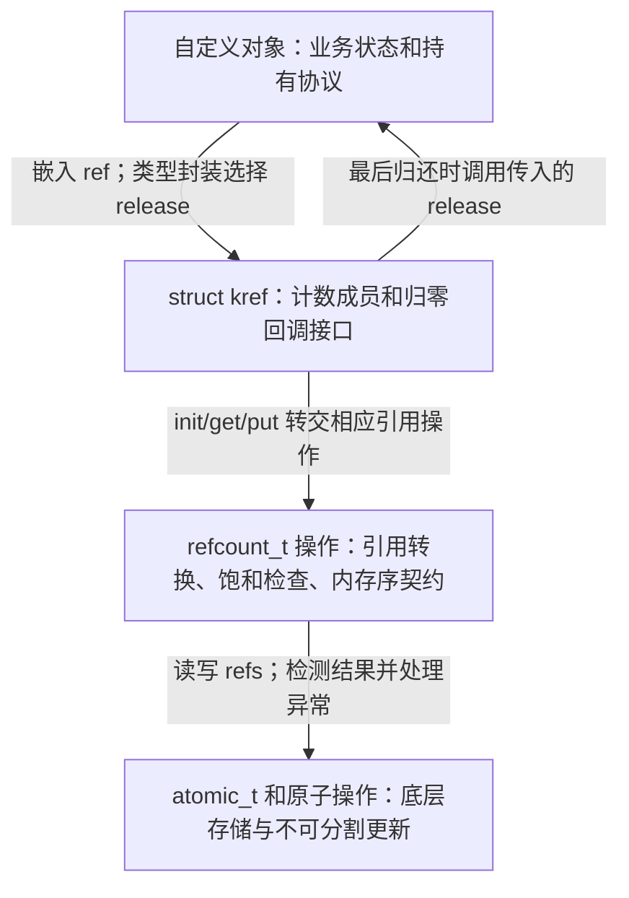
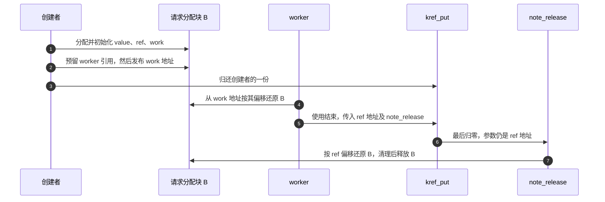
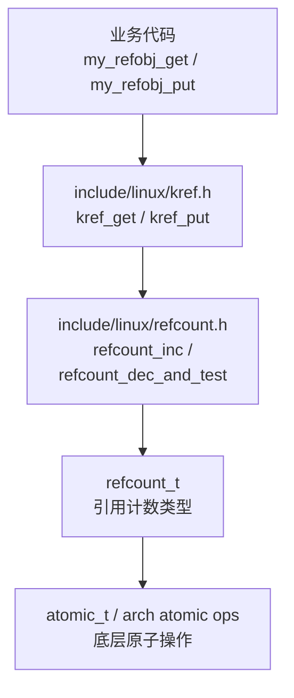
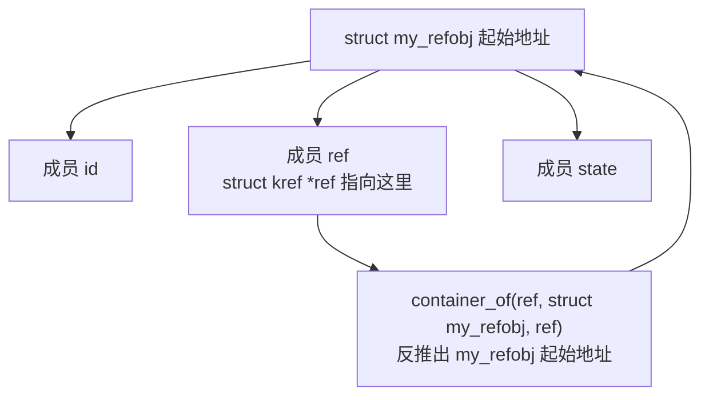
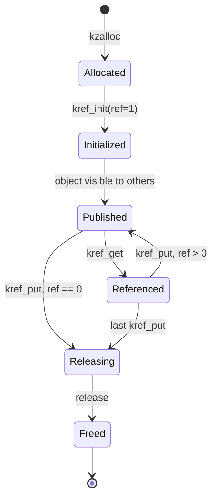

# 第2章\_源码入口与结构定义

## 2.1\_本章主线

[第 1 章的责任模型](P01_kref_要解决什么问题.md#1.5_为什么引用计数可以解决生命周期问题)已经建立共享、借用与交接，并用一次工作交付解释归零清理。现在的问题是：内核怎样把这些责任放进对象，怎样从计数成员回到应当清理的整个对象？

本章沿“源码位置 → 计数层次 → 嵌入成员 → 回调找回外层对象 → 创建和发布”阅读。先区分 `kref`、`refcount_t` 和底层原子操作各自承担什么，再讨论结构布局和接口；前章模块的并发调度与目标运行仍未由前端检查证明。

这里有四个需要带着读的问题：计数为什么嵌在对象里；为什么不是任意整数加减；release 为什么收到 `struct kref *` 而非业务指针；是谁把回调与对象类型配对。理解这些以后，初始化/get/put 才不会只是三条要背的语句。

------

## 2.2\_源码阅读入口

本章的具体实现边界是 NXP 官方 `linux-imx` 发布标签 `lf-6.12.20-2.0.0` 对应的 Linux 6.12.20，固定提交为 `dfaf2136deb2af2e60b994421281ba42f1c087e0`，见[源码基线](../../../../research/source_reading/linux/SOURCE_BASELINE.md#1.1_当前来源)。本地工作树后续实验提交不是证据。

| 相对源码位置 | 此处的阅读任务 |
| --- | --- |
| [include/linux/kref.h](../../../../research/source_reading/linux/include/linux/kref.h) | 看嵌入结构和 init/get/put 到 refcount 操作的转交，特别是归零时调用传入 release |
| [include/linux/refcount_types.h](../../../../research/source_reading/linux/include/linux/refcount_types.h) | 看引用计数类型怎样持有 atomic_t 字段 |
| [include/linux/refcount.h](../../../../research/source_reading/linux/include/linux/refcount.h) | 看引用操作的前提、溢出/下溢检测及内存序契约 |
| [lib/refcount.c](../../../../research/source_reading/linux/lib/refcount.c) | 看告警与饱和处理，以及不在头文件内实现的辅助操作 |
| [Documentation/core-api/kref.rst](../../../../research/source_reading/linux/Documentation/core-api/kref.rst) | 先读所有权规则，再用源码核对，不能只看函数名称猜前提 |

层次为“业务对象含 kref，kref 含 refcount_t，refcount_t 含 atomic_t”。继续往下才会遇到[原子操作检测包装](../../../../research/source_reading/linux/include/linux/atomic/atomic-instrumented.h)及 `arch/*/include/asm/atomic*.h` 的体系结构实现。这里不以公共头文件推出 ARM、ARM64、x86 等平台会执行相同指令，也不在尚未建立引用契约时跳入汇编。

------

## 2.3\_kref.h\_的位置

`include/linux/` 中的 `kref.h` 提供通用内核接口；使用者可以来自 `drivers/`、`fs/`、`mm/`、`net/` 或 `block/`。这个位置说明它不替某个设备、文件或连接保存业务规则，而是供不同子系统复用生命周期工具。

它只管理引用份额与归零回调，不知道对象是否在链表、属于哪种硬件或有多少字段。因此自定义对象可以嵌入 kref；已有设备、文件等框架对象则先遵循各自封装好的接口，不因为“这是通用工具”就另加一个竞争的释放入口。

------

## 2.4\_struct\_kref\_的本质

固定版本的 `struct kref` 定义如下；字段名 `refcount` 表示引用计数，而不是持有者名单：

```c
struct kref {
	refcount_t refcount;
};
```

底层类型位于 `include/linux/refcount_types.h`。下面的中文说明是仓库阅读注释；定义本身保持固定源码形态：

```c
/**
 * @brief 仓库阅读说明：用 atomic_t 存储引用计数。
 * @details 引用操作另在 refcount.h 中限定有效转换并处理异常，
 *          不是靠这个结构定义本身检测所有生命周期错误。
 */
typedef struct refcount_struct {
	atomic_t refs;
} refcount_t;
```

kref 没有保存对象类型、大小、业务地址、release 函数、所属子系统、锁、链表节点或状态机。这些信息仍由外层对象及其调用协议提供。特别是 release 不储存在这一个成员里，而是在调用 put 时传入；后文需要解释为什么所有归还路径必须使用与对象匹配的回调。

“结构只有一个字段”与“协议很简单”不是同一结论。这个字段汇总所有尚未归还的责任；对象可能同时拥有很多地址别名，也可能一个执行路径拥有多份责任，因此不能把字段值直接翻译成线程数或指针数。

------

## 2.5\_为什么不是\_atomic\_t

普通原子整数能把一次加减变成不可分割的更新，这已经解决了并发读改写丢失更新的问题。但“每次加减都准确执行”仍不能证明“计数表示的生命周期一直合法”。位宽有限会回绕，归零后错误增加仍是错误，多归还一次也不能因为动作是原子的就变成合法。

例如一个有限位宽计数器从最大值继续加一后回到零，再加一变为 1。此时真实尚未归还的责任可能很多；随后一次减一却得到零。如果销毁仅取决于这个零，就可能提前释放。**原子性保护一次更新不被拆开，引用语义还必须限制哪些更新可以发生，以及异常后是否允许回收。**

### 2.5.1\_用八位模型观察回绕的代价

为看见数字而不等待数十亿次操作，下面的[count_wrap.c](../../../../labs/kernel/object_lifetime/materials/count_wrap.c)采用八位无符号计数作教学模型。普通计数从 255 加一按无符号转换回到 0。另一种计数只允许正常值到 127，超过时标记为饱和并拒绝根据它释放；饱和意味着不再把该数解释为准确责任总数。

`owners` 是程序单独维护的真实责任账本，初始为 1，再增加 256 份后归还一份。模型不分配对象，也不实际释放任何内存，`guarded_release` 只是“是否会允许回收”的判断。两套计数都在同一串行事件上更新，不把普通 C 加法冒充内核原子指令。

```c
#include <assert.h>
#include <stdbool.h>
#include <stdint.h>
#include <stdio.h>

/* 缩小到八位的串行教学模型，不是 Linux refcount_t 的实现。 */
struct guarded_count {
    uint8_t value;
    bool saturated;
};

static void add_guarded(struct guarded_count *count)
{
    if (count->saturated)
        return;
    if (count->value == 127) {
        count->saturated = true;
        count->value = 192; /* 教学标记，进入后不再作为真实责任数。 */
        return;
    }
    assert(count->value > 0);
    ++count->value;
}

static bool drop_guarded(struct guarded_count *count)
{
    if (count->saturated)
        return false;
    assert(count->value > 0);
    return --count->value == 0;
}

int main(void)
{
    unsigned int owners = 1;
    uint8_t wrapping = 1;
    struct guarded_count guarded = { .value = 1, .saturated = false };

    for (unsigned int i = 0; i < 256; ++i) {
        ++owners;
        wrapping = (uint8_t)(wrapping + 1u);
        add_guarded(&guarded);
    }
    --owners;
    wrapping = (uint8_t)(wrapping - 1u);
    bool guarded_release = drop_guarded(&guarded);
    assert(owners == 256 && wrapping == 0 && !guarded_release);
    printf("owners=%u wrapping=%u guarded_release=%d\n",
           owners, (unsigned int)wrapping, guarded_release);

    while (owners) {
        --owners;
        assert(!drop_guarded(&guarded));
    }
    assert(guarded.saturated && guarded.value == 192);
    puts("all owners left; saturated model still refuses release");
    return 0;
}
```

```bash
cc -std=c11 -Wall -Wextra -Werror -O2 count_wrap.c -o count_wrap
./count_wrap
```

预期输出为：

```text
owners=256 wrapping=0 guarded_release=0
all owners left; saturated model still refuses release
```

第一行说明普通计数已经呈现危险的零，真实责任却还有 256 份；守护计数拒绝回收。第二行继续归还完所有真实责任，守护计数仍不允许释放，展示了代价：**失去准确计数以后，保守地保留对象可能形成泄漏，而不是猜测它已经无人使用。**

这个模型刻意用一个额外布尔状态，并在溢出前直接进入饱和；Linux 的实际实现没有照搬这两点，也不使用八位计数。模型只证明回绕为何危险、保守回收为何可能泄漏，不能用它证明 Linux 的并发饱和算法或告警覆盖。

### 2.5.2\_固定实现增加了哪些契约

在所核对的版本中，`refcount_t` 使用 `atomic_t` 保存位，`refcount.h` 将正常上限定义为 `INT_MAX`，饱和值 `REFCOUNT_SATURATED` 定义为 `INT_MIN / 2`。固定实现的注释把该值画在 32 位表示的 `0xc0000000`。这里的数值是异常处理区中的标记，不是“还剩这么多真实使用者”。

一次增加或减少先走原子操作，检测到溢出、下溢或从零增加等异常后，再由 `refcount_warn_saturate()` 写入饱和值并告警。它没有在每个操作上都先用比较交换循环计算饱和值，所以并发窗口中可能临时出现未经收敛的异常数；源码头注释专门讨论饱和区、并发任务规模和批量操作的约束。不能把它描述成“内存中的值从此每一瞬间都固定不动”，也不能把异常后泄漏说成业务逻辑已修复。

对正确的正常路径，引用原语还规定了内存序：普通增加不额外提供发布排序，取得对象时必须已经通过锁或适当的发布/读取协议建立可见性；减少提供 release 顺序，归零成功的减并检测路径再提供 acquire 顺序，使最后的清理处于规定的先后关系。此处先识别契约差异，后续再结合具体实现解释 acquire/release，不能据此声称 get 是任意对象的发布屏障。

| 情况 | 普通原子更新不足以回答什么 | 引用原语与调用者分别负责什么 |
| --- | --- | --- |
| 多方同时更新 | 新旧责任是否正确配对 | 原子更新防止丢失；应用仍须准确登记/归还 |
| 计数回绕或异常归还 | 得到零是否仍可信 | 检测后饱和/告警，可能保守泄漏；应用修复错误路径 |
| 从零再次增加 | 原地址是否仍有效 | 普通 get 不负责复活对象，条件取得也需要有效内存窗口 |
| 读取业务字段 | 增加计数是否发布全部字段 | 采用获取对象的同步协议，不能依赖普通 inc 的额外排序 |

封装确实让调用方更容易依循统一接口和实现演进，但 **不是仅为了少改几个类型名**。另一方面，防护也不提供万能检测：已被释放并重新分配的地址可能根本不是原对象；只凭计数 API 不能恢复其身份或修复查找窗口。

### 2.5.3\_检查正常边界再回到对象

把程序中的增加次数改成 126，并按新轨迹调整原先针对 256 次增加的断言：初始 1 加到 127，还没有进入饱和；归还所有责任后应当只在最后一份归还时允许回收。再增加一次会进入本模型的保守状态。两种情况应分别检查，不能只观察“异常时不会释放”。

进一步思考：把所有操作换成原子操作，八位普通计数的回绕会消失吗？不会，原子性没有扩大位宽。把模型的饱和布尔值删掉，再直接赋 192 能否保留同样保证？不能，后续加减规则也必须识别并维持异常状态。这两问分别检查我们是否混淆了操作不可分割、数值范围和生命周期契约。

------

## 2.6\_kref\_和\_refcount\_t\_的关系

现在再看层次图，每条边都有具体职责，而不只是名字嵌套：


```mermaid
flowchart TD
    object["自定义对象：业务状态和持有协议"]
    kref["struct kref：计数成员和归零回调接口"]
    refcount["refcount_t 操作：引用转换、饱和检查、内存序契约"]
    atomic["atomic_t 和原子操作：底层存储与不可分割更新"]
    object -->|"嵌入 ref；类型封装选择 release"| kref
    kref -->|"init/get/put 转交相应引用操作"| refcount
    refcount -->|"读写 refs；检测结果并处理异常"| atomic
    kref -->|"最后归还时调用传入的 release"| object
```

业务对象如果选择 kref 作为生命周期接口，就保持这条责任路径一致。只调用底层 `refcount_dec_and_test()` 却漏掉对象清理，会把正确归零与必要析构分开；绕过引用原语直接原子更新，又会丢失它提供的异常与顺序契约。直接使用 refcount_t 的其他对象可以另有完整设计，不能推成“内核一律不准直接使用 refcount_t”。

本章后面的[关键源码讲解](#2.13_kref/refcount_t_关键源码讲解)继续核对函数层次；眼前还留下结构问题：计数嵌入以后，回调怎样找到整个对象，以及为什么一个计数字段不足以构成完整的创建/退出协议。下一节由这个问题进入嵌入式对象。

------

## 2.7\_kref\_为什么嵌入自定义引用对象内部

前面知道了计数表达什么，现在要决定它放在哪里。对上一章的请求，创建者和 worker 使用的是同一个分配对象；它们对 `request->ref` 操作，在最后归还时清理该请求。把计数成员与请求放在同一分配块，便不必另外解决“请求与计数谁先消失”。

这也是链表节点、红黑树节点和工作项常见的组织方式：`list_head` 让对象参与链表，`rb_node` 让对象参与树，`work_struct` 让对象参与异步执行，`kref` 让对象参与引用协议。它们各自承载不同状态，嵌在一起并不表示一种机制会自动维护另一种机制。

不过，结构内写了 `struct kref ref` 只是存储位置已经存在。完整协议还需要分配成功后的初始化、初始责任的拥有者、取得/归还规则，以及与外层类型配对的 release。若对象还拥有独立分配的 `data` 缓冲区，release 要按所有权先清理该资源，再释放外层对象；如果 `data` 只是借用，则不能因为对象归零就擅自释放它。

通常会定义 `my_refobj_get()` 和 `my_refobj_put()` 这类类型接口，使外部调用者不用每次自行选择回调。这样的 wrapper 是否接受 NULL 必须约定一致；即使选择空值时无操作，非空参数仍须满足有效引用的前提。它们不会替悬挂地址恢复寿命。

要分清三件事：kref 是计数成员，release 是该类型选择的最终清理函数，get/put 是该类型对外提供的生命周期接口。普通单一类型不需要给每个实例再保存同一个 release 函数指针；具有多种清理策略的框架可以另有分发层，但那不是 kref 字段自动保存的功能。

------

## 2.8\_嵌入式结构的好处

嵌入带来的收益可以沿一次分配、一次成员传递和一次最终清理逐项检查，不能把它压成“更高效”而不说省掉了哪一步。

### 2.8.1\_不需要额外分配

对只包含内联字段的 `note_request`，一次分配同时获得业务字段、计数与工作项。若改为 `struct kref *ref` 并单独分配，还需要第二次分配及失败清理，并决定谁保存二者的关联。这增加的是内存分配和所有权分支，而不是多写一个指针那么简单。

这里的“一次”只针对外层与这些内联成员。对象拥有的可变长缓冲区仍可能另行分配；嵌入 kref 不会自动把所有业务资源合成一块内存。

### 2.8.2\_生命周期天然一致

同一分配块尚存时，内部成员的存储也尚存；释放整个块之后，旧成员地址同样失效。这省去了独立计数块早于业务对象消失的协调问题。它并不意味着“内存还在就已经正确初始化”，也不阻止有人错误复制整个活动对象、清零计数或绕过协议直接释放。

因此“天然一致”说的是 **存储的包含关系**，仍需引用协议保证释放时机。复制结构体的字节，不会让已交给 worker 的成员地址改指向副本，也不会自动转交原来的引用责任。

### 2.8.3\_release\_可以通过\_container\_of\_找回对象

只要回调知道真实外层类型和成员名，就能从 `&request->ref` 还原 `request`。这项地址换算不依赖 ref 放在开头，不需要对象另外登记到一个全局“计数到对象”表。

它也没有发现类型的魔法：回调必须与被归还的对象类型匹配，传入地址必须来自仍有效的那个成员。下一节沿同一请求观察这一点。

------

## 2.9\_container\_of\_是理解\_kref\_的关键

`kref_put()` 收到计数成员地址和 `void (*release)(struct kref *)` 回调，归零时把这个成员地址交给回调。回调要释放的却是分配器返回的整个请求地址，两者不一定相同。

上一章[完整工作模块](P01_kref_要解决什么问题.md#1.16.1_运行一次真实工作交付)现在把 `int value` 放在 `ref` 前面；对象定义与材料文件保持一致。于是 ref 的成员偏移必然非零，直接把 `struct kref *` 强制转换成请求指针就不会得到分配块的起点。正确关系是：

```text
对象起点 B
  + offsetof(struct note_request, ref) = &request->ref
  + offsetof(struct note_request, work) = &request->work

release 收到 &request->ref，减去 ref 的真实偏移回到 B。
worker 收到 &request->work，减去 work 的真实偏移也回到 B。
```

`offsetof` 由编译器按实际结构布局给出成员偏移，包含所需的对齐填充；不能简单把前面字段的 `sizeof` 相加，也不能把宿主实验打印的某个数字固定写进 ARM 驱动。


```mermaid
sequenceDiagram
    autonumber
    participant C as 创建者
    participant O as 请求分配块 B
    participant W as worker
    participant K as kref_put
    participant R as note_release
    C->>O: 分配并初始化 value、ref、work
    C->>O: 预留 worker 引用，然后发布 work 地址
    C->>K: 归还创建者的一份
    W->>O: 从 work 地址按其偏移还原 B
    W->>K: 使用结束，传入 ref 地址及 note_release
    K->>R: 最后归零，参数仍是 ref 地址
    R->>O: 按 ref 偏移还原 B，清理后释放 B
```

图中画创建者先结束的一条合法顺序；若 worker 先结束，就由创建者的最后 put 调用同一个回调。执行先后改变最后归还者，不改变回调与外层类型的配对。

固定 GNU C 宏的实现已在[源码总索引](../../../../research/source_reading/rbtree/navigation/P01_Linux_6.12_rbtree源码阅读索引.md#1.2_按问题选择源码入口)、[成员布局模块](../../../../research/source_reading/rbtree/navigation/P07_节点布局与编码状态导读.md#7.4_从嵌入成员回到所有者)及[container_of 唯一实现](../../../../research/source_reading/rbtree/source_explanations/include/linux/container_of.h.md#1.1_一次还原中的求值与类型检查)展开，这里复用其通用地址契约。尽管证据组织在 rbtree 研究专题，它操作的是通用成员地址，并不调用树算法。

需要动手观察地址时，运行已存在的[双成员 C 实验](../../data_structures/红黑树_rb-tree/P09_Linux_6.12_内核_rbtree_嵌入式节点与使用者接口.md#%281%29_两个嵌入成员还原同一个任务)，再回到这里的 ref/work 两个成员。该实验还显示：同类型的两个成员写错名字可能通过类型检查；普通 container_of 会丢失 const 限定，保留只读限定需使用对应入口。类型检查不是运行时对象身份验证，更不能证明旧地址还活着。

------

## 2.10\_为什么\_release\_不直接接收自定义引用对象指针

通用 kref 层只接收 `struct kref *`，不保存业务类型和业务对象指针。它可能嵌在私有设备对象、请求、会话、缓存或 inode 私有对象中；具体调用方选定了哪一种，kref 层并不知道。因此当前接口把计数成员地址交给由类型封装选定的回调，再由回调恢复类型。

如果直接把接收 `struct my_refobj *` 的函数强制转换成 kref 所需的回调类型，既没有改变实际传入的地址，也没有建立兼容的函数类型调用；即使 ref 偶然位于第一个成员，也不能拿这个巧合消除接口契约问题。正确适配是写一个参数类型为 `struct kref *` 的回调，在函数体中按真实成员还原。

原阅读批注按原文保留：

别听上面的废话，一句话总结：

> `kref`调用的是`kref`的接口，它的体系里面本身不具备成员`.release()`函数接口，所以要单独定义。
>
> `kref`调用`release()`函数的调用的是参数里的`callback()`函数参数，该引入的参数只能是它自己，也就是`this`指针。那么你只能通过`this`指针再通过`container_of()`反向获取自定义结构体`my_refobj`对象的地址。
>
> 所以你想要传入`my_refobj`结构体，根本没有这个接口给你适配。

批注里的 `this` 是对“传入当前计数成员地址”的类比，C 接口没有隐含的 this 参数；实际调用参数是 kref_put 收到的 `struct kref *`。`container_of()` 也不从这个地址猜测类型，回调代码必须明确写出正确的外层类型和成员名。这使批注强调的“按既定回调接口适配”与上面的地址图对应起来。

------

## 2.11\_kref\_不是单独分配的对象

本专题采用计数与业务对象同一分配块的常规模式。仅把成员换成 `struct kref *ref`，再分别分配业务对象与计数，不能继续声称二者具有天然相同的存储寿命：第二次分配失败如何清理第一次，哪一方先释放，回调怎样找到业务对象，都多了一组必须回答的问题。

独立控制块不是在所有设计中都不可能成立。比如另一套所有权模型确实需要控制信息比业务负载活得更久，就可以让控制块本身成为被计数的对象，并明确负载指针的取得、失效和回收协议。但那是两个生命周期及其关联，不能未经设计就把本章嵌入模板改成指针，也不能把 kref 自动等同于 C++ 的共享指针控制块。

对当前请求没有这种额外需求，保留一个内联 `struct kref ref` 能少一组分配、关联与退出分支。这里选择嵌入的理由是它满足当前约束并减少需要证明的状态，而不是 C 语法禁止计数成员出现在控制块里。

------

## 2.12\_kref\_init()\_的初始引用

[后续源码单元](#%281%29_kref_init%28%29)将核对 kref_init 如何设置初值；先把它放回完整创建过程。上一章模块先确认 `kzalloc()` 成功，再初始化 kref 为 1，随后填业务值并初始化工作项，完成后才发布给队列。创建者的初始引用覆盖这段尚未公开的准备过程。

初始值 1 表示创建者现在承担一份最终归还责任，不表示业务已经 online、对象已经入容器，或任何读者都可以取走它。创建者可以最后 put，也可以按明确契约交接这份引用；若还要继续使用，就为接收方另建份额。

若对象还有独立分配的 data 缓冲区，需要选择一致的失败清理方式：可以先准备所有资源，成功后再建立并发布引用协议；也可以先把成员置于 release 能处理的有效初态，建立初始引用，后续资源准备失败时沿 put 统一清理。后一种方式要求 release 对尚未取得的资源有明确处理，不能调用尚未初始化的锁或释放未定义指针。

对应到本章账本，分配失败没有对象引用需要归还；初始化成功以后，无论后续发布成功还是失败，创建者的份额都必须有去向。漏掉它会泄漏，提前归还但没有覆盖接收者的使用期限会 UAF。在已经发布的对象上再次 init 成 1 更会丢掉其他持有者的责任，不能把初始化当成“计数不对时重新设置”。

试着检查同一个模块：将 ref 放到最后一个成员，两个 container_of 调用需要换成硬编码偏移吗？不需要，成员名没有改变时编译器重新计算布局。直接把 release 参数转成请求指针是否仍正确？不是。若追加缓冲区分配失败，哪个阶段的资源已经归对象所有、由哪一条退出路径清理？这要求回到创建顺序逐项列账，而不是只检查有没有调用 kref_init。

------

## 2.13\_kref/refcount\_t\_关键源码讲解

### 2.13.1\_源码

#### (1)\_kref\_init()

[include/linux/kref.h](../../../../research/source_reading/linux/include/linux/kref.h)

```c
/**
 * kref_init - initialize object.
 * @kref: object in question.
 */
static inline void kref_init(struct kref *kref)
{
	refcount_set(&kref->refcount, 1);
}
```

#### (2)\_refcount\_set()

[include/linux/refcount.h](../../../../research/source_reading/linux/include/linux/refcount.h)

```C
/**
 * refcount_set - set a refcount's value
 * @r: the refcount
 * @n: value to which the refcount will be set
 */
static inline void refcount_set(refcount_t *r, int n)
{
	atomic_set(&r->refs, n);
}
```

#### (3)\_kref\_get()

[include/linux/kref.h](../../../../research/source_reading/linux/include/linux/kref.h)

```C
/**
 * kref_get - increment refcount for object.
 * @kref: object.
 */
static inline void kref_get(struct kref *kref)
{
	refcount_inc(&kref->refcount);
}
```

#### (4)\_refcount\_inc()

[include/linux/refcount.h](../../../../research/source_reading/linux/include/linux/refcount.h)

```C
static inline __signed_wrap
void __refcount_add(int i, refcount_t *r, int *oldp)
{
	int old = atomic_fetch_add_relaxed(i, &r->refs);

	if (oldp)
		*oldp = old;

	if (unlikely(!old))
		refcount_warn_saturate(r, REFCOUNT_ADD_UAF);
	else if (unlikely(old < 0 || old + i < 0))
		refcount_warn_saturate(r, REFCOUNT_ADD_OVF);
}

static inline void __refcount_inc(refcount_t *r, int *oldp)
{
	__refcount_add(1, r, oldp);
}

/**
 * refcount_inc - 增加引用计数
 * @r: 要增加的引用计数对象
 *
 * 类似于 atomic_inc()，但当计数达到 REFCOUNT_SATURATED 时会进入饱和状态，
 * 并触发 WARN 告警。
 *
 * 不提供任何内存序保证。这里假定调用者已经持有该对象的一个有效引用。
 *
 * 如果引用计数为 0，将触发 WARN 告警，因为这表示可能存在 use-after-free
 * 问题。
 */
static inline void refcount_inc(refcount_t *r)
{
	__refcount_inc(r, NULL);
}
```

##### 1)\_signed\_wrap\_小结

`__signed_wrap` 是 Linux 内核提供给编译器看的属性宏，不参与 `refcount_t` 的业务逻辑计算。它的作用是告诉编译器：当前函数内部可能会**有意使用有符号整数的补码回绕行为**，不要把 signed overflow 当成普通未定义行为进行激进优化，也不要让 signed-integer-overflow sanitizer 在这里误报或插桩破坏逻辑。

在 `__refcount_add()` 中，代码会检查：

```c
old < 0 || old + i < 0
```

其中 `old + i < 0` 用来判断引用计数加法是否从正常正数区间溢出到了负数异常区间。标准 C 语言中，有符号整数溢出是 undefined behavior，编译器可能假设它永远不会发生，从而优化掉这类判断。`__signed_wrap` 的意义就是保护这种检测逻辑，让它按内核期望的二进制补码回绕语义工作。

所以可以总结为：

`refcount_t` 的负值/饱和区间是引用计数自身的安全设计，用来表示异常状态；`__signed_wrap` 则是为了保证这种异常检测逻辑不会被编译器优化或 sanitizer 破坏。它解决的是编译器语义问题，服务的是 `refcount_t` 防溢出、防 use-after-free 的业务安全需求。

#### (5)\_kref\_put()

[include/linux/kref.h](../../../../research/source_reading/linux/include/linux/kref.h)

```c
static inline __must_check __signed_wrap
bool __refcount_sub_and_test(int i, refcount_t *r, int *oldp)
{
	/*
	 * 原子地执行：
	 *
	 *     old = r->refs;
	 *     r->refs -= i;
	 *
	 * 注意：
	 * atomic_fetch_sub_release() 返回的是“减之前的旧值”，
	 * 不是减之后的新值。
	 *
	 * release 语义保证：
	 * 当前 CPU 在此之前对对象的 load/store，
	 * 不能被重排到引用计数递减之后。
	 */
	int old = atomic_fetch_sub_release(i, &r->refs);

	/*
	 * 如果调用者需要旧值，就把减之前的引用计数保存出去。
	 */
	if (oldp)
		*oldp = old;

	/*
	 * 正常的最后一次释放路径：
	 *
	 * old > 0:
	 *     说明递减前引用计数仍然是有效的正数。
	 *
	 * old == i:
	 *     说明本次减 i 之后，引用计数刚好变成 0。
	 *
	 * 例如：
	 *     old = 1, i = 1  =>  new = 0
	 *     old = 2, i = 2  =>  new = 0
	 *
	 * 返回 true 表示：
	 *     当前路径释放了最后一个引用，
	 *     调用者可以执行 release/free 逻辑。
	 */
	if (old > 0 && old == i) {
		/*
		 * 在“成功减到 0”的路径上补 acquire 语义。
		 *
		 * 配合前面的 release 递减操作，形成 release-acquire 关系，
		 * 保证后续的对象释放动作不会被重排到确认 refcount 为 0 之前。
		 *
		 * 也就是说：
		 *     必须先确认这是最后一个引用，
		 *     然后才能执行 release()/free()。
		 */
		smp_acquire__after_ctrl_dep();

		return true;
	}

	/*
	 * 异常路径检测：
	 *
	 * old <= 0:
	 *     说明递减之前引用计数已经是 0 或负数。
	 *     这通常表示对象已经被释放，或者引用计数已经损坏，
	 *     现在又继续 put/dec，属于 UAF/double put 类问题。
	 *
	 * old - i < 0:
	 *     说明本次递减把引用计数减穿了。
	 *     例如 old = 1, i = 2，结果变成 -1。
	 *
	 * 这两种情况都说明引用计数释放次数超过持有次数，
	 * 因此触发 REFCOUNT_SUB_UAF 告警，并把 refcount 饱和，
	 * 防止继续下溢或回绕。
	 */
	if (unlikely(old <= 0 || old - i < 0))
		refcount_warn_saturate(r, REFCOUNT_SUB_UAF);

	/*
	 * 返回 false 有两种可能：
	 *
	 * 1. 正常情况：
	 *    引用计数递减后仍然大于 0，对象还有其他持有者。
	 *
	 * 2. 异常情况：
	 *    已经检测到 UAF/下溢并报警，不能走正常释放路径。
	 */
	return false;
}

static inline __must_check bool __refcount_dec_and_test(refcount_t *r, int *oldp)
{
	return __refcount_sub_and_test(1, r, oldp);
}

/**
 * refcount_dec_and_test - 递减引用计数，并测试它是否为 0。
 * @r: 引用计数。
 *
 * 类似于 atomic_dec_and_test()，它会在下溢时发出 WARN，
 * 并且当引用计数已经饱和到 REFCOUNT_SATURATED 时，不再继续递减。
 *
 * 提供 release 内存序，保证之前的 load 和 store 都在此之前完成；
 * 并且在成功时提供 acquire 内存序，保证 free() 必须发生在此之后。
 *
 * Return: 如果递减后的引用计数为 0，则返回 true；否则返回 false。
 */
static inline __must_check bool refcount_dec_and_test(refcount_t *r)
{
	return __refcount_dec_and_test(r, NULL);
}

/**
 * kref_put - 递减对象的引用计数。
 * @kref: 对象。
 * @release: 指向清理函数的指针，当对象的最后一个引用被释放时，
 *           该函数会负责清理对象。
 *           这个指针是必需的，并且不允许直接传入 kfree
 *           作为该函数。
 *
 * 递减引用计数，如果引用计数变为 0，则调用 release()。
 * 如果对象被移除，则返回 1；否则返回 0。注意，如果该函数
 * 返回 0，你仍然不能保证 kref 仍然留在内存中。
 * 只有当你想判断 kref 现在是否已经消失，而不是仍然存在时，
 * 才应该使用该返回值。
 */
static inline int kref_put(struct kref *kref, void (*release)(struct kref *kref))
{
	if (refcount_dec_and_test(&kref->refcount)) {
		release(kref);
		return 1;
	}
	return 0;
}
```

##### 1)\_must\_check\_小结

`__must_check` 用来修饰函数，表示**调用者必须检查该函数的返回值**。它通常对应编译器属性：

```c
__attribute__((__warn_unused_result__))
```

作用是：如果调用者调用了该函数，却丢弃返回值，编译器会给出警告。

在引用计数接口中，例如：

```c
refcount_dec_and_test(&refobj->refcount)
```

返回值表示：

```c
true  -> 引用计数已经减到 0，当前路径需要释放对象
false -> 引用计数还没有归零，不能释放对象
```

因此这类函数不能只调用不判断：

```c
refcount_dec_and_test(&refobj->refcount);   // 错误：忽略返回值
```

正确用法是：

```c
if (refcount_dec_and_test(&refobj->refcount))
	release(refobj);
```

一句话总结：

`__must_check` 表示返回值具有关键语义，不能被忽略；在 refcount 场景中，它防止调用者忘记处理“引用计数归零后需要释放对象”的逻辑。

#### (6)\_kref\_read()

[include/linux/kref.h](../../../../research/source_reading/linux/include/linux/kref.h)

```c
/**
 * refcount_read - get a refcount's value
 * @r: the refcount
 *
 * Return: the refcount's value
 */
static inline unsigned int refcount_read(const refcount_t *r)
{
	return atomic_read(&r->refs);
}

static inline unsigned int kref_read(const struct kref *kref)
{
	return refcount_read(&kref->refcount);
}
```


------

## 2.14\_静态初始化\_KREF\_INIT(n)

除了动态初始化，还有静态初始化形式：

[include/linux/refcount.h](../../../../research/source_reading/linux/include/linux/refcount.h)

```c
#define REFCOUNT_INIT(n)        \
    {                           \
        .refs = ATOMIC_INIT(n), \
    }

#define KREF_INIT(n)                  \
    {                                 \
        .refcount = REFCOUNT_INIT(n), \
    }
```

宏展开为：

```c
#define KREF_INIT(n)                  \
    {                                 \
        .refcount.refs = n, 		 \
    }
```

典型含义是：

```c
struct kref ref = KREF_INIT(1);
```

或者某个静态对象里：

```c
static struct my_refobj global_refobj = {
	.ref = KREF_INIT(1),
};
```

它的作用是：

```text
在编译期或静态对象初始化时设置引用计数初始值。
```

但工程上更常见的是动态对象：

```c
refobj = kzalloc(...);
kref_init(&refobj->ref);
```

因为需要 `kref` 的对象往往是动态生命周期对象。

静态对象也可以有引用计数，但要非常清楚：

```text
它是否真的会被释放？
release 是否真的 kfree？
静态对象是否允许 refcount 归零？
```

否则就会出现语义不一致。

------

## 2.15\_kref\_get()\_的源码层次

[kref_get()](#3-kref_get)

`kref_get()` 的逻辑可以理解为：

```c
static inline void kref_get(struct kref *kref)
{
	refcount_inc(&kref->refcount);
}
```

也就是说：

```text
kref_get()
  -> refcount_inc()
      -> 底层原子引用计数增加
```

但使用它必须满足一个前提：

```text
调用 kref_get() 时，调用者已经确定对象是有效的。
```

这句话非常重要。

`kref_get()` 不是“从无到有抢救对象”。

它不是：

```text
我捡到一个裸指针，然后靠 kref_get() 让它复活。
```

正确语义是：

```text
我已经在某种保护下持有有效对象，现在我要增加一个长期引用。
```

例如：

```c
kref_get(&refobj->ref);
pass_to_worker(refobj);
```

这里调用者本来就持有 `refobj` 的有效引用。

所以可以给 worker 再增加一个引用。

------

## 2.16\_kref\_put()\_的源码层次

`kref_put()` 的逻辑可以理解为：

```c
static inline int kref_put(struct kref *kref,
			   void (*release)(struct kref *kref))
{
	if (refcount_dec_and_test(&kref->refcount)) {
		release(kref);
		return 1;
	}

	return 0;
}
```

它做两件事：

```text
1. 引用计数减一
2. 如果减到 0，调用 release
```

返回值语义是：

```text
返回 1：本次 put 释放了最后一个引用，并调用了 release
返回 0：本次 put 后仍然不是最后一个引用
```

但要注意：

```text
kref_put() 返回 0，不代表对象之后一定还活着。
```

因为其他 CPU 可能马上执行最后一个 `put`。

所以：

```c
if (!kref_put(&refobj->ref, my_refobj_release)) {
	/* refobj 还活着？ */
}
```

不能这样理解。

`kref_put()` 后，当前路径已经不再持有引用。

因此一般原则是：

```text
put 之后不要再访问 refobj。
```

除非你还有另一个明确持有的引用，或者有额外锁/协议保证。

------

## 2.17\_kref\_read()\_为什么不能作为生命周期判断

[kref_read()](#(6)_kref_read())

`kref_read()` 可以读当前计数：

```c
unsigned int n = kref_read(&refobj->ref);
```

但它不应该作为核心生命周期判断依据。

错误理解：

```c
if (kref_read(&refobj->ref) > 0)
	refobj->state = 1;
```

这不可靠。

因为：

```text
读到 >0 的瞬间，对象可能还活着；
但下一瞬间，别的 CPU 可能 put 到 0 并 release。
```

所以 `kref_read()` 更适合：

```text
debug
trace
统计
诊断
警告信息
```

而不适合：

```text
用来决定对象是否可以安全访问
```

安全访问对象的依据应该是：

```text
当前路径是否持有有效引用
lookup + get 是否在锁/RCU 保护下完成
业务状态是否在锁保护下检查
```

------

## 2.18\_kref\_源码关系总览

可以用下面这张图理解：


```mermaid
graph TD
	A["业务代码<br/>my_refobj_get / my_refobj_put"]
	B["include/linux/kref.h<br/>kref_get / kref_put"]
	C["include/linux/refcount.h<br/>refcount_inc / <br/>refcount_dec_and_test"]
	D["refcount_t<br/>引用计数类型"]
	E["atomic_t / arch atomic ops<br/>底层原子操作"]

	A --> B
	B --> C
	C --> D
	D --> E
```

业务代码通常只接触最上层：

```c
kref_get(&refobj->ref);
kref_put(&refobj->ref, my_refobj_release);
```

`kref` 内部再调用 `refcount`。

这样分层的好处是：

```text
自定义引用对象生命周期语义集中在 kref
引用计数安全语义集中在 refcount_t
底层原子操作由 atomic/arch 实现
```

------

## 2.19\_标准自定义引用对象模板

一个最小对象模板如下：

```c
#include <linux/kref.h>
#include <linux/slab.h>

struct my_refobj {
	struct kref ref;
	int state;
};

static void my_refobj_release(struct kref *ref)
{
	struct my_refobj *refobj;

	refobj = container_of(ref, struct my_refobj, ref);

	kfree(refobj);
}

static struct my_refobj *my_refobj_alloc(void)
{
	struct my_refobj *refobj;

	refobj = kzalloc(sizeof(*refobj), GFP_KERNEL);
	if (!refobj)
		return NULL;

	kref_init(&refobj->ref);
	refobj->state = 0;

	return refobj;
}

static struct my_refobj *my_refobj_get(struct my_refobj *refobj)
{
	kref_get(&refobj->ref);
	return refobj;
}

static void my_refobj_put(struct my_refobj *refobj)
{
	kref_put(&refobj->ref, my_refobj_release);
}
```

这个模板里有几个关键点。

### 2.19.1\_struct\_kref\_ref\_嵌入对象内部

```c
struct my_refobj {
	struct kref ref;
	int state;
};
```

这说明引用计数属于对象生命周期。

------

### 2.19.2\_alloc\_后立即\_kref\_init

```c
kref_init(&refobj->ref);
```

这表示创建者获得初始引用。

------

### 2.19.3\_release\_用\_container\_of\_找回对象

```c
refobj = container_of(ref, struct my_refobj, ref);
```

因为 release 收到的是 `struct kref *`。

------

### 2.19.4\_release\_是最终销毁点

```c
kfree(refobj);
```

只有最后一个引用释放时，才会进入这里。

------

### 2.19.5\_对外最好封装\_get/put

```c
static struct my_refobj *my_refobj_get(struct my_refobj *refobj)
{
	kref_get(&refobj->ref);
	return refobj;
}

static void my_refobj_put(struct my_refobj *refobj)
{
	kref_put(&refobj->ref, my_refobj_release);
}
```

这样可以把生命周期规则收敛到对象自己的接口里。

------

## 2.20\_为什么建议封装\_my\_refobj\_get/my\_refobj\_put

虽然可以直接写：

```c
kref_get(&refobj->ref);
kref_put(&refobj->ref, my_refobj_release);
```

但工程上更推荐封装：

```c
my_refobj_get(refobj);
my_refobj_put(refobj);
```

原因是：

```text
隐藏 release 函数
统一对象生命周期出口
方便后续加 WARN_ON
方便后续加 trace
方便后续处理 NULL
方便后续加调试统计
减少调用点传错 release 的风险
```

例如：

```c
static void my_refobj_put(struct my_refobj *refobj)
{
	if (!refobj)
		return;

	kref_put(&refobj->ref, my_refobj_release);
}
```

或者：

```c
static struct my_refobj *my_refobj_get(struct my_refobj *refobj)
{
	WARN_ON(!refobj);

	kref_get(&refobj->ref);
	return refobj;
}
```

这样比到处裸写 `kref_put()` 更容易维护。

------

## 2.21\_kref\_和自定义引用对象内存布局

假设对象定义为：

```c
struct my_refobj {
	int id;
	struct kref ref;
	int state;
};
```

内存布局可以抽象成：

```text
+-----------------------------+
| struct my_refobj               |
+-----------------------------+
| id                          |
+-----------------------------+
| ref                         |
|   +---------------------+   |
|   | refcount_t refcount |   |
|   +---------------------+   |
+-----------------------------+
| state                       |
+-----------------------------+
```

当 release 收到：

```c
struct kref *ref
```

它拿到的是中间这个成员的地址。

`container_of()` 根据：

```text
外层类型：struct my_refobj
成员名：ref
成员地址：ref
```

反推出整个对象起始地址。

图示：


```mermaid
graph TD
	A["struct my_refobj 起始地址"]
	B["成员 id"]
	C["成员 ref<br/>struct kref *ref 指向这里"]
	D["成员 state"]
	E["container_of(ref, struct my_refobj, ref)<br/>反推出 my_refobj 起始地址"]

	A --> B
	A --> C
	A --> D
	C --> E
	E --> A
```

所以 `container_of()` 不是魔法。

它依赖的是：

```text
struct kref 是自定义引用对象的内嵌成员
```

如果 `kref` 是单独分配的，这种模式就不成立。

------

## 2.22\_kref\_和\_list\_head/rb\_node\_的相似性

`kref` 的嵌入方式和 `list_head`、`rb_node` 很像。

例如链表对象：

```c
struct my_refobj {
	struct list_head node;
	int id;
};
```

链表遍历时拿到的是：

```c
struct list_head *node
```

然后通过：

```c
container_of(node, struct my_refobj, node)
```

找回外层对象。

红黑树对象：

```c
struct my_refobj {
	struct rb_node rb;
	int key;
};
```

红黑树节点拿到的是：

```c
struct rb_node *rb
```

然后通过：

```c
container_of(rb, struct my_refobj, rb)
```

找回外层对象。

`kref` 也是类似：

```c
struct my_refobj {
	struct kref ref;
};
```

release 拿到：

```c
struct kref *ref
```

然后通过：

```c
container_of(ref, struct my_refobj, ref)
```

找回外层对象。

所以 Linux 内核的通用机制通常不是面向“对象基类”的，而是面向“嵌入式成员”的。

------

## 2.23\_kref\_不是\_C++\_shared\_ptr

容易把 `kref` 类比成 C++ 的 `shared_ptr`，但二者差别很大。

`shared_ptr` 通常是：

```text
外部控制块 + 指针包装对象
```

而 `kref` 是：

```text
对象内部嵌入引用计数字段
```

`shared_ptr` 的使用者拿到的是智能指针对象。

`kref` 的使用者拿到的仍然是普通 C 指针：

```c
struct my_refobj *refobj;
```

所以 `kref` 不会自动帮你：

```text
离开作用域自动 put
拷贝时自动 get
赋值时自动处理旧引用
异常路径自动释放
```

内核 C 代码必须手工保证：

```text
每一个 get 都有对应 put
每一个 handoff 都有明确边界
每一个 error path 都正确释放
```

所以 `kref` 比 `shared_ptr` 更轻量，但也更依赖代码纪律。

------

## 2.24\_kref\_不保存\_release\_函数

`kref` 本身不保存 `release` 函数。

Linux 内核中的 `struct kref` 是一个很薄的引用计数对象，它的核心成员就是引用计数本身：

```c
struct kref {
	refcount_t refcount;
};
```

也就是说，`kref` 没有类似下面这样的成员：

```c
struct kref {
	refcount_t refcount;
	void (*release)(struct kref *ref);  /* 实际上没有这个成员 */
};
```

所以不能这样使用：

```c
refobj->ref.release = my_refobj_release;    /* 错误：kref 没有 release 成员 */
```

正确方式是：在 `kref_put()` 时，把 release 函数作为参数传入：

```c
kref_put(&refobj->ref, my_refobj_release);
```

工程代码中通常不会让外部到处直接调用 `kref_put()`，而是封装成对象自己的 `put` 接口：

```c
struct my_refobj {
	struct kref ref;
	int state;
	void *data;
};

static void my_refobj_release(struct kref *ref)
{
	struct my_refobj *refobj = container_of(ref, struct my_refobj, ref);

	kfree(refobj->data);
	kfree(refobj);
}

void my_refobj_put(struct my_refobj *refobj)
{
	if (refobj)
		kref_put(&refobj->ref, my_refobj_release);
}
```

这里的职责关系是：

```text
kref：
    只负责引用计数。

my_refobj_release：
    负责 my_refobj 对象的最终销毁。

my_refobj_put：
    负责把 my_refobj 的引用释放规则封装起来。
```

所以，`release` 不属于 `struct kref`，而属于外层自定义引用对象类型。

也就是说：

```text
kref 是计数字段；
release 是对象类型的析构函数；
put 是对象类型对外暴露的释放引用接口。
```

从 C 语言实现能力上说，当然可以把函数指针放进 `struct kref` 里。但 Linux 的 `kref` 没有这样设计。原因不是“做不到”，而是抽象层次上不应该这样做。

`kref` 是一个底层引用计数原语，不是完整对象模型。它不知道自己嵌入在哪个自定义引用对象里，也不知道外层对象应该如何销毁。

例如：

```c
struct my_refobj {
	struct kref ref;
	void *data;
};
```

真正知道释放方式的是 `struct my_refobj` 这个对象类型，而不是 `struct kref` 本身。

`my_refobj` 释放时可能需要：

```c
kfree(refobj->data);
kfree(refobj);
```

另一个对象释放时可能需要：

```c
vfree(refobj->buffer);
put_device(refobj->dev);
kfree(refobj);
```

这里的 `put_device(refobj->dev)` 表示释放 `my_refobj` 持有的 device 引用。`struct device` 本身仍然按 driver core 的 `get_device()/put_device()`、`kobject` 和 device model release 分发规则销毁。

这些释放逻辑都属于外层对象，不属于 `kref`。

因此，`kref_put()` 的设计是：

```c
kref_put(&refobj->ref, my_refobj_release);
```

当引用计数减到 0 时，`kref_put()` 调用传入的 `my_refobj_release()`。`my_refobj_release()` 再通过 `container_of()` 从 `struct kref *` 找回外层对象：

```c
static void my_refobj_release(struct kref *ref)
{
	struct my_refobj *refobj = container_of(ref, struct my_refobj, ref);

	kfree(refobj);
}
```

这正好符合 Linux 内核的嵌入式对象模型：

```text
struct kref 不理解外层对象；
外层对象通过 container_of() 解释 kref；
release 函数属于外层对象类型。
```

需要特别注意：虽然 `kref_put()` 每次都要求传入 release 函数，但这并不表示同一个对象可以随便传不同的 release。

下面这种写法是危险的：

```c
kref_put(&refobj->ref, release_a);
kref_put(&refobj->ref, release_b);
```

因为只有最后一次 `put` 才会真正触发 release。这样对象最终由哪个 release 释放，就取决于哪个调用点刚好执行了最后一次 `put`。

这会导致对象销毁路径不稳定。

正常工程写法应该是：

```c
void my_refobj_put(struct my_refobj *refobj)
{
	kref_put(&refobj->ref, my_refobj_release);
}
```

然后所有地方统一调用：

```c
my_refobj_put(refobj);
```

而不是到处裸写：

```c
kref_put(&refobj->ref, my_refobj_release);
```

这样可以保证：

```text
同一种对象，只有一种统一的 release 路径。
```

`kref` 不保存 release 的意义可以总结为：

```text
1. kref 保持轻量，只保存引用计数。
2. kref 只是底层引用计数原语，不是对象模型。
3. release 属于外层自定义引用对象类型，不属于 kref 本身。
4. 对象释放逻辑由 my_refobj_release() 定义。
5. 对象引用释放接口由 my_refobj_put() 封装。
6. 同一种对象应该统一走同一个 release 路径。
```

如果需要更完整的对象模型，比如类型、父子关系、统一 release、sysfs 表示等，那应该使用 `kobject` 这类更高层机制，而不是让 `kref` 自己保存 `.release` 成员。

最终结论：

```text
kref 本身不具备 .release 成员。

release 函数不是 kref 的属性，而是外层对象类型的析构函数。

kref_put() 只是“在引用计数减到 0 时，调用传入的 release 函数”。

所以，标准工程模型是：

对象内部嵌入 kref；
对象类型定义 release；
对象接口封装 get/put；
最后一个 put 触发 release。
```

------

## 2.25\_kref\_put\_不能直接传\_kfree

错误写法：

```c
kref_put(&refobj->ref, kfree);
```

这个模型不成立。

原因有两个。

第一，函数签名不匹配。

`kref_put()` 需要的是：

```c
void (*release)(struct kref *kref)
```

而 `kfree()` 接收的是：

```c
void *ptr
```

第二，即使强转，也会释放错地址。

因为 `kref_put()` 传给 release 的是：

```c
&refobj->ref
```

不是：

```c
refobj
```

如果直接把 `struct kref *` 当成对象起始地址释放，释放的就不是对象起始地址。

正确做法必须是：

```c
static void my_refobj_release(struct kref *ref)
{
	struct my_refobj *refobj = container_of(ref, struct my_refobj, ref);

	kfree(refobj);
}
```

release 的职责就是：

```text
从 kref 成员找回外层对象，然后释放真正的对象。
```

------

## 2.26\_kref\_字段位置没有固定要求

`struct kref` 不一定必须放在结构体第一个成员。

可以这样：

```c
struct my_refobj {
	struct kref ref;
	int state;
};
```

也可以这样：

```c
struct my_refobj {
	int id;
	struct kref ref;
	int state;
};
```

还可以这样：

```c
struct my_refobj {
	int id;
	int state;
	struct kref ref;
};
```

只要 release 里 `container_of()` 的成员名正确：

```c
container_of(ref, struct my_refobj, ref)
```

都可以找回外层对象。

但是工程上通常建议：

```text
生命周期字段放在结构体靠前位置
锁、状态、链表节点组织清楚
```

例如：

```c
struct my_refobj {
	struct kref ref;
	struct mutex lock;
	struct list_head node;

	int state;
	void *data;
};
```

这样读代码时更容易看出：

```text
这个对象有引用计数
这个对象有自己的锁
这个对象会挂入链表
```

------

## 2.27\_一个对象可以有多个嵌入式机制

实际内核对象经常同时嵌入多个基础结构：

```c
struct my_refobj {
	struct kref ref;
	struct mutex lock;
	struct list_head node;
	struct rb_node rb;
	struct work_struct work;

	int id;
	int state;
};
```

每个字段负责不同机制：

| 字段                      | 作用             |
| ------------------------- | ---------------- |
| `struct kref ref`         | 生命周期引用计数 |
| `struct mutex lock`       | 对象字段互斥     |
| `struct list_head node`   | 挂入链表         |
| `struct rb_node rb`       | 挂入红黑树       |
| `struct work_struct work` | 投递到 workqueue |
| `state`                   | 业务状态         |

不要把这些职责混在一起。

特别是：

```text
list_head 只说明对象在链表里
rb_node 只说明对象在树里
work_struct 只说明对象可被异步执行
kref 只说明对象生命周期由引用计数保护
mutex 只说明字段访问需要互斥
```

这些机制组合起来，才构成完整对象模型。

------

## 2.28\_kref\_和对象创建流程

标准创建流程可以拆成几个阶段：

```text
1. 分配内存
2. 初始化普通字段
3. 初始化锁
4. 初始化链表节点
5. 初始化 kref
6. 发布对象
```

例如：

```c
static struct my_refobj *my_refobj_create(int id)
{
	struct my_refobj *refobj;

	refobj = kzalloc(sizeof(*refobj), GFP_KERNEL);
	if (!refobj)
		return NULL;

	kref_init(&refobj->ref);
	mutex_init(&refobj->lock);
	INIT_LIST_HEAD(&refobj->node);

	refobj->id = id;
	refobj->state = my_refobj_INIT;

	return refobj;
}
```

注意顺序上的原则：

```text
对象发布给其他执行路径之前，kref 必须已经初始化。
```

错误模型：

```c
refobj = kzalloc(sizeof(*refobj), GFP_KERNEL);
global_refobj = refobj;
kref_init(&refobj->ref);
```

这里如果 `global_refobj` 一发布，别的 CPU 就可能拿到对象，而此时 `kref` 还没初始化。

正确方向：

```c
refobj = kzalloc(sizeof(*refobj), GFP_KERNEL);
kref_init(&refobj->ref);
mutex_init(&refobj->lock);
refobj->state = my_refobj_INIT;

global_refobj = refobj;
```

发布前必须完成对象基础初始化。

------

## 2.29\_kref\_和对象发布

“发布对象”是生命周期设计里的重要节点。

发布意味着：

```text
对象可以被其他执行路径找到。
```

例如：

```text
加入全局链表
插入 hash 表
放入 xarray
绑定到 file->private_data
注册到设备模型
提交给 workqueue
交给 timer
传给另一个线程
```

发布之前：

```text
通常只有创建者持有对象
```

发布之后：

```text
其他执行路径可能拿到对象
```

所以发布动作通常需要配合引用规则。

例如放入全局链表：

```c
mutex_lock(&refobj_list_lock);
list_add(&refobj->node, &refobj_list);
mutex_unlock(&refobj_list_lock);
```

这时要设计清楚：

```text
链表本身是否持有一个引用？
还是链表只是可查找索引，不单独持有引用？
```

这不是 `kref` 自动决定的。

这是对象生命周期协议的一部分。

------

## 2.30\_容器持有引用是显式设计选择

这是很多内核对象设计中的关键点。

假设对象挂在全局链表：

```c
struct my_refobj {
	struct kref ref;
	struct list_head node;
	int id;
};
```

有两种设计。

### 2.30.1\_设计\_A\_容器持有引用

对象加入链表时，链表拥有一个引用。

```c
kref_get(&refobj->ref);

mutex_lock(&refobj_list_lock);
list_add(&refobj->node, &refobj_list);
mutex_unlock(&refobj_list_lock);
```

对象从链表删除时，释放链表引用：

```c
mutex_lock(&refobj_list_lock);
list_del(&refobj->node);
mutex_unlock(&refobj_list_lock);

kref_put(&refobj->ref, my_refobj_release);
```

这个模型的特点是：

```text
只要对象还在链表中，链表引用保证对象不会释放。
```

------

### 2.30.2\_设计\_B\_容器不持有引用

链表只是索引，不单独持有引用。

```c
mutex_lock(&refobj_list_lock);
list_add(&refobj->node, &refobj_list);
mutex_unlock(&refobj_list_lock);
```

这种模型要求更严格：

```text
对象释放前必须先从链表删除
lookup + get 必须在锁保护下完成
```

否则链表里可能留下悬挂指针。

两种设计都可以，但必须明确。

不能模糊成：

```text
好像链表持有对象
好像调用者持有对象
好像 release 会处理
```

这种“好像”就是生命周期 bug 的来源。

------

## 2.31\_kref\_和\_release\_的关系

`kref_put()` 归零时调用 release。

release 是对象销毁点。

典型 release：

```c
static void my_refobj_release(struct kref *ref)
{
	struct my_refobj *refobj = container_of(ref, struct my_refobj, ref);

	kfree(refobj);
}
```

但真实对象往往需要更多清理：

```c
static void my_refobj_release(struct kref *ref)
{
	struct my_refobj *refobj = container_of(ref, struct my_refobj, ref);

	cancel_work_sync(&refobj->work);
	kfree(refobj->buffer);
	kfree(refobj);
}
```

或者：

```c
static void my_refobj_release(struct kref *ref)
{
	struct my_refobj *refobj = container_of(ref, struct my_refobj, ref);

	WARN_ON(!list_empty(&refobj->node));
	kfree(refobj);
}
```

release 要表达的是：

```text
最后一个引用已经消失，可以销毁对象本体和子资源。
```

但 release 里到底能做什么，要看对象设计。

特别是：

```text
如果对象还在全局容器里，release 里必须处理脱链，或者 release 前必须保证已经脱链。
如果对象有 RCU 读者，release 不能直接 kfree，需要 kfree_rcu 或 synchronize_rcu。
如果对象有 work/timer，必须保证异步路径不再访问。
```

这些内容后面章节会展开。

------

## 2.32\_kref\_不知道对象是否在容器中

`struct kref` 不记录对象是否挂在链表里。

它不知道：

```text
对象是否在 list 中
对象是否在 hash 中
对象是否在 xarray 中
对象是否被 RCU 读者看到
对象是否被 workqueue 持有
```

所以 release 不可能自动完成所有动作。

这些都要由自定义引用对象自己设计。

例如：

```c
struct my_refobj {
	struct kref ref;
	struct mutex lock;
	struct list_head node;
	bool in_list;
};
```

这里 `in_list` 是业务状态。

`kref` 不会帮你判断。

所以对象销毁流程通常需要明确：

```text
先禁止新引用
再从全局结构删除
再等待已有路径退出
最后 put 到 release
```

或者使用其他约定。

------

## 2.33\_kref\_的初始化不能重复做

对象创建时调用一次：

```c
kref_init(&refobj->ref);
```

这表示创建初始引用。

不应该在对象生命周期中途重新调用：

```c
kref_init(&refobj->ref);
```

错误模型：

```c
void reset_refobj(struct my_refobj *refobj)
{
	kref_init(&refobj->ref);
}
```

这会破坏已有引用关系。

如果此时还有其他持有者，那么重新初始化计数会导致：

```text
已有引用被覆盖
后续 put 数量和计数不匹配
可能泄漏
可能提前释放
```

所以 `kref_init()` 只应该出现在：

```text
对象刚分配，还没有发布，还没有被其他路径持有
```

这个阶段。

不能把它当成普通 reset 函数。

------

## 2.34\_kref\_对象的基本状态

虽然源码里没有显式状态机，但从语义上可以画成：


```mermaid
stateDiagram-v2
	[*] --> Allocated: kzalloc
	Allocated --> Initialized: kref_init(ref=1)
	Initialized --> Published: object visible to others
	Published --> Referenced: kref_get
	Referenced --> Published: kref_put, ref > 0
	Published --> Releasing: kref_put, ref == 0
	Referenced --> Releasing: last kref_put
	Releasing --> Freed: release
	Freed --> [*]
```

这张图里有几个重点：

```text
kref_init 之后 refcount = 1
kref_get 增加持有者
kref_put 减少持有者
最后一个 put 进入 release
release 之后对象不可再访问
```

源码里只有计数，但工程上必须按状态机理解。

------

## 2.35\_kref\_字段本身不能脱离对象访问

因为 `struct kref` 是对象内部字段，所以：

```c
&refobj->ref
```

这个地址只有在 `refobj` 仍然有效时才有效。

这意味着：

```text
你不能在对象可能已经释放的情况下访问 refobj->ref。
```

错误模型：

```c
refobj = lookup_without_lock(id);
kref_get(&refobj->ref);
```

如果 `lookup_without_lock()` 返回的是已经释放对象的悬挂指针，那么：

```c
&refobj->ref
```

也是悬挂地址。

所以不是说：

```text
只要我调用 kref_get，就安全。
```

而是：

```text
你必须先保证 refobj->ref 所在内存还是有效的，然后才能 get。
```

这就是后面 lookup 章节的核心问题。

------

## 2.36\_kref\_的源码接口很小\_但约束很多

`kref.h` 的接口并不复杂：

```c
KREF_INIT(n)
kref_init()
kref_read()
kref_get()
kref_put()
kref_get_unless_zero()
kref_put_mutex()
kref_put_lock()
```

但每个接口背后都有使用前提。

例如：

| API                      | 表面作用                       | 关键前提                     |
| ------------------------ | ------------------------------ | ---------------------------- |
| `kref_init()`            | 初始化为 1                     | 对象尚未发布，不能重复初始化 |
| `kref_get()`             | 引用加 1                       | 当前已经有有效对象/有效引用  |
| `kref_put()`             | 引用减 1                       | 当前路径确实持有一个引用     |
| `kref_read()`            | 读取计数                       | 不能作为并发生命周期判断     |
| `kref_get_unless_zero()` | 非 0 时加引用                  | 查找路径仍需锁/RCU保护       |
| `kref_put_mutex()`       | put 到 0 时持 mutex release    | release 必须处理锁语义       |
| `kref_put_lock()`        | put 到 0 时持 spinlock release | release 必须处理锁语义       |

所以 kref 简单，但不能随便用。

------

## 2.37\_本章核心模板

以后看到一个内核对象，如果它使用 `kref`，优先找这几个位置。

### 2.37.1\_对象定义

```c
struct my_refobj {
	struct kref ref;
	/* other fields */
};
```

看 `kref` 嵌在哪里。

------

### 2.37.2\_初始化位置

```c
kref_init(&refobj->ref);
```

看对象什么时候获得初始引用。

------

### 2.37.3\_get\_封装

```c
static struct my_refobj *my_refobj_get(struct my_refobj *refobj)
{
	kref_get(&refobj->ref);
	return refobj;
}
```

看哪些路径会增加引用。

------

### 2.37.4\_put\_封装

```c
static void my_refobj_put(struct my_refobj *refobj)
{
	kref_put(&refobj->ref, my_refobj_release);
}
```

看哪些路径会释放引用。

------

### 2.37.5\_release\_函数

```c
static void my_refobj_release(struct kref *ref)
{
	struct my_refobj *refobj = container_of(ref, struct my_refobj, ref);

	kfree(refobj);
}
```

看最后引用释放时对象如何销毁。

------

### 2.37.6\_lookup\_路径

```c
refobj = lookup(id);
my_refobj_get(refobj);
```

重点检查 lookup 是否有锁/RCU 保护。

------

### 2.37.7\_handoff\_路径

```c
queue_work(...);
```

重点检查交给异步路径之前是否已经有引用，或者是否明确转移当前引用。

------

## 2.38\_阅读源码时的检查清单

看一个 `kref` 对象时，不要只看 `kref_get()` 和 `kref_put()` 数量。

要按下面顺序检查：

```text
1. struct kref 嵌入在哪个对象里？
2. 对象在哪里分配？
3. kref_init 在哪里调用？
4. 初始引用属于谁？
5. 对象在哪里发布给其他路径？
6. 哪些路径会 kref_get？
7. 哪些路径会 kref_put？
8. put 后是否继续访问对象？
9. release 里是否 container_of 找回对象？
10. release 是否释放了完整资源？
11. 对象如果在全局结构中，释放前是否脱链？
12. lookup + get 是否受锁/RCU保护？
13. 异步 work/timer/callback 是否持有引用？
14. error path 是否 put 掉已获得的引用？
```

这套检查清单比单纯看 API 更重要。

------

## 2.39\_本章小结

本章建立了 `kref` 的源码入口和结构模型：

```text
include/linux/kref.h
include/linux/refcount.h
```

核心结构是：

```c
struct kref {
	refcount_t refcount;
};
```

但不要被它的简单结构迷惑。

它的真正含义是：

```text
对象内部嵌入一个生命周期引用计数字段。
```

几个关键结论：

```text
1. kref 是自定义引用对象的一部分，不是外部分配的管理器。
2. kref 内部使用 refcount_t，不是裸 atomic_t。
3. kref_init() 初始化为 1，表示创建者持有初始引用。
4. kref_get() 增加引用，但前提是对象当前有效。
5. kref_put() 释放引用，归零时调用 release。
6. release 收到的是 struct kref *，必须用 container_of() 找回自定义引用对象。
7. kref 不知道对象是否在链表、hash、xarray、RCU 容器中。
8. kref 不保护对象字段，也不保护 lookup 路径。
```

本章最重要的一句话：

```text
struct kref 只是一个字段，但它必须被当成对象生命周期协议的入口。
```

下一章进入：

```text
第 3 章：kref 生命周期状态机
```

重点会从源码结构转向完整生命周期：

```text
allocated
  -> kref_init(ref=1)
  -> kref_get/refcount++
  -> kref_put/refcount--
  -> last put
  -> release
  -> free
```

------

专题导航：[kref 引用计数机制章节大纲](大纲.md)。

上一篇：[kref 要解决什么问题](P01_kref_要解决什么问题.md)。

下一篇：[kref 生命周期状态机](P03_kref_生命周期状态机.md)。
