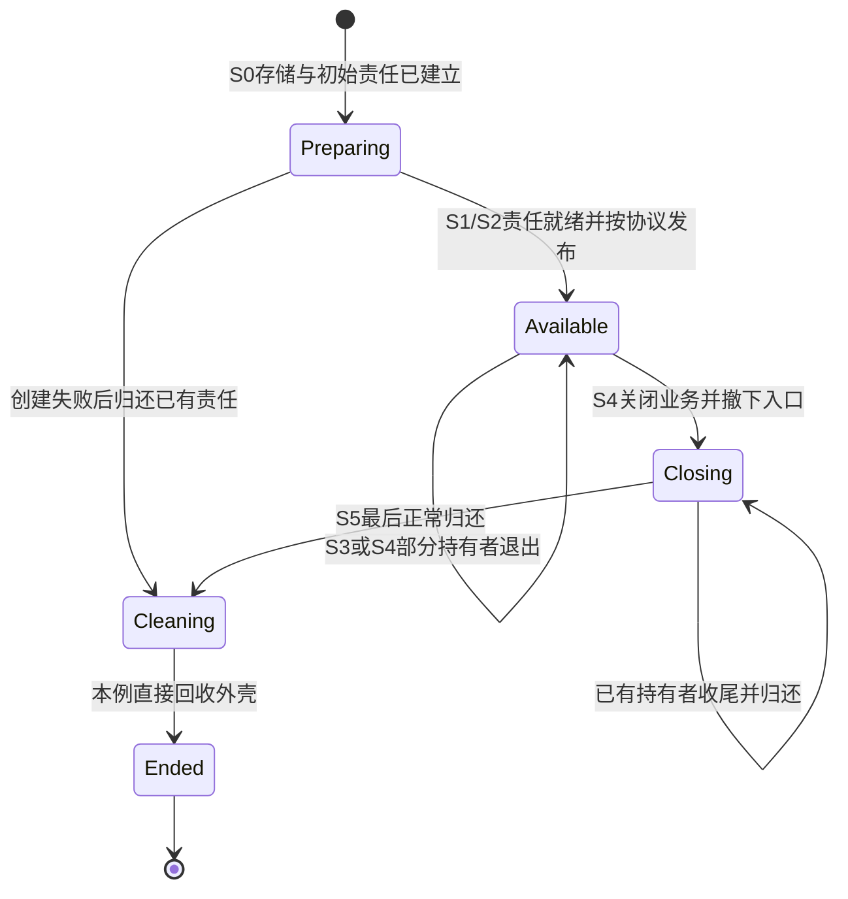
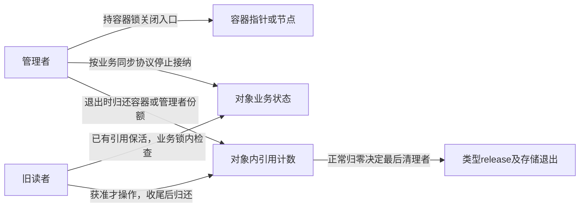
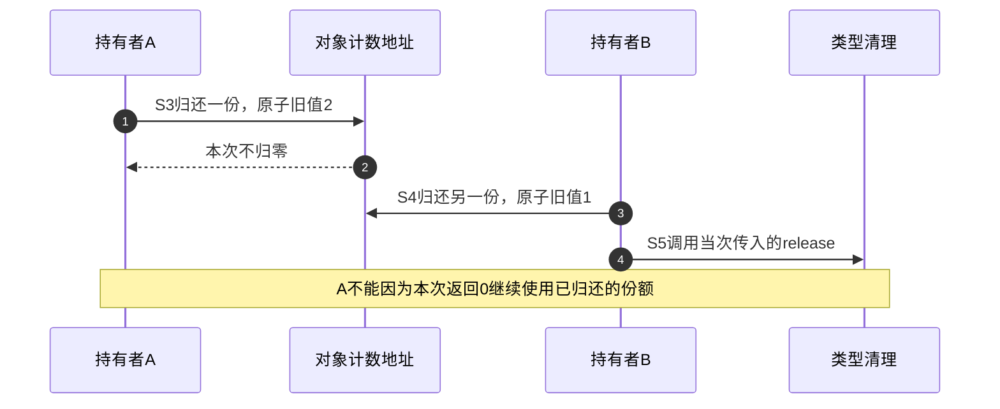
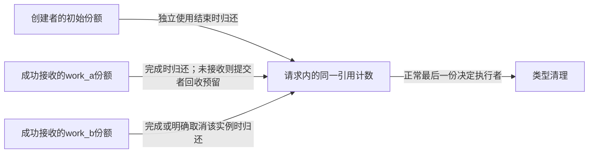
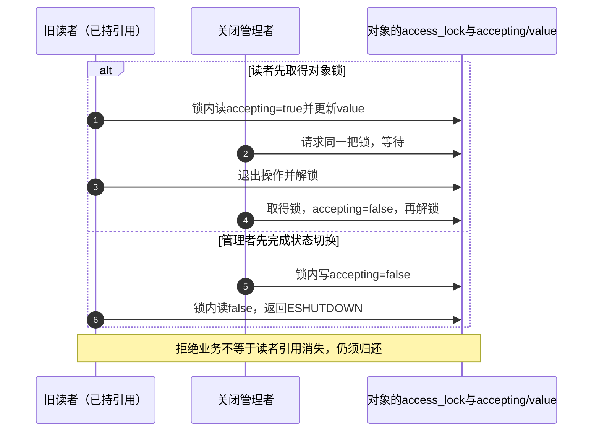
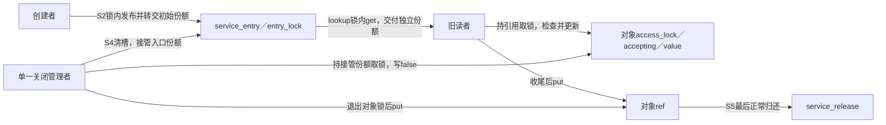
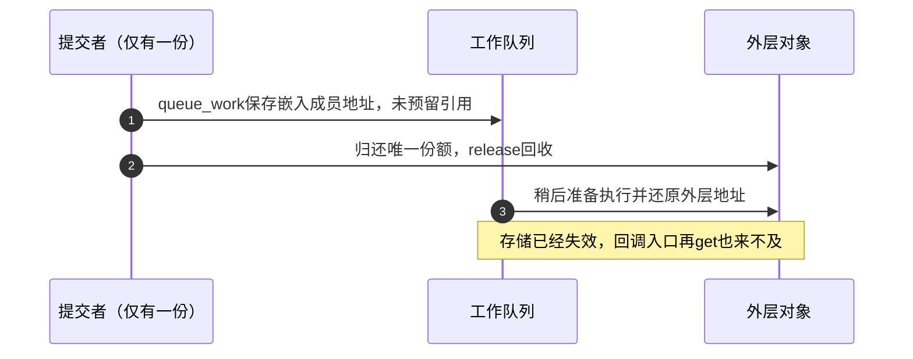
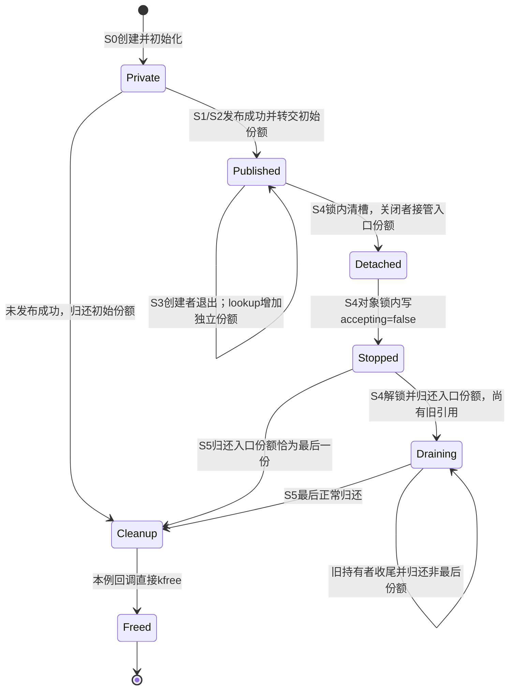

# 第3章\_kref\_生命周期状态机

## 3.1\_本章主线

上一章的单槽容器已经给出一个重要现象：入口撤下后，旧读者仍可依自己的引用使用对象。现在再增加一个问题：设备或服务已经开始关闭时，这位仍持有引用的读者，还能继续发起新的业务操作吗？

存储不消失，只是使用对象字段的必要条件。业务是否接纳操作、入口是否还允许查找、各方是否仍负有归还责任，都可能独立变化。本章用这些状态组织生命周期，随后再检查失败、转交和最后清理的不同顺序。前章已经讲明普通 API 的参数与源码，这里不重新用接口名称代替运行过程。

默认沿用“容器持一份、查找取得独立引用”的模型，并明确在哪些地方改变假设。首先回答对象何时存在、初始引用归谁；接着看持有、业务关闭与存储退出怎样协作；最后用错误路径检验这些规则。只要能为每个状态找到存储位置、写入者和后续读者，就能把图落回代码。

------

## 3.2\_最小生命周期状态机

先限定普通正确路径：新对象建立初始一份，各方按协议增加或转交责任，最后正常归还触发类型清理。计数本身不保存发布状态和业务状态，因此这不是一个整数就能描述的完整对象状态机，而是几组状态共同组成的协议。

| 状态轴 | 上一章具体落点 | 本章先要分清什么 |
| --- | --- | --- |
| 存储与资源 | 分配的对象外壳及拥有的 data 等资源 | 地址是否仍可访问，哪些资源已经清理 |
| 引用责任 | 对象内的 ref，外部各路径的责任约定 | 谁仍负责归还一份，而非简单数指针 |
| 入口可见性 | registry_entry 或容器节点，受容器锁保护 | 新查找能否到达对象 |
| 业务可用性 | 由业务协议维护的 online/stopping 等状态 | 已拿引用的使用者是否仍获准执行某项操作 |

沿用前章 S0～S5：S0 创建并建立初始责任，S1 为新的独立使用预留份额，S2 交付或发布，S3 创建者结束，S4 容器与使用者依各自条件退出，S5 最后归还触发清理。S3 与部分 S4 可以换序；没有发布成功的对象也能直接从创建失败进入清理。后文的数据结构和错误路径都回到这些阶段，而不是各讲一张互不相关的图。



这张图是本章先研究的直接回收协议，并非 kref 里的一个枚举字段。Closing 可以仍有引用和存储；Cleaning 也不必在所有设计中立即进入 Ended，例如静态外壳与延迟回收就有不同安排。release 在最后归还者的上下文被调用，是清理协议入口；不能不看类型回调就断言“函数一返回所有存储必定消失”。

------

## 3.3\_先立边界\_kref\_不是设备锁\_也不是完整安全模型

设读者在服务仍开放时查找对象并取得一份。随后管理者关闭入口、把业务改成不再接纳请求，再归还容器份额。旧读者的计数保护仍有效，但它下一次业务调用应该被拒绝。此时继续保留外壳，是为了让旧读者能读取必要状态、完成错误返回并归还引用，不是承诺硬件永远可访问。

在真实实现中，要把状态检查和被允许的操作放在适当的业务同步范围内。否则读者刚看见 online，管理者就能在它实际操作前关闭服务。业务锁可使“检查并使用”与软件关闭有规定的先后关系；它不能阻止设备物理消失，也不能替具体总线或驱动处理所有硬件故障。引用、业务同步和硬件状态各有边界。

角色和状态流为：



### 3.3.1\_用C模型观察仍持有却被拒绝

下面程序把外部观察者的账本单独保存为 model。storage_exists、visible、accepting 分别表示存储存在、入口可见与业务接纳；owners 的三个比特各代表本例创建者、容器、单个读者的一份责任。真实 kref 不保存这张持有者位图，本例也没有真实分配/free、内核锁或原子并发。

每个函数在指定顺序中完成一个协议步骤。这样可以先预测两种先后：旧读者在关闭之前执行一次操作，或者关闭先发生；两者最后都应完成一次清理。完整材料为 [lifetime_protocol.c](../../../../labs/kernel/object_lifetime/materials/lifetime_protocol.c)：

```c
#include <assert.h>
#include <stdbool.h>
#include <stdio.h>

enum owner {
    OWNER_CREATOR = 1u,
    OWNER_CONTAINER = 2u,
    OWNER_READER = 4u
};

/* 观察者保存的协议模型，不是业务对象，更不是内核 kref 的字段。 */
struct model {
    bool storage_exists;
    bool visible;
    bool accepting;
    unsigned int owners;
    unsigned int releases;
};

static void take(struct model *m, unsigned int owner)
{
    assert(m->storage_exists && m->owners && !(m->owners & owner));
    m->owners |= owner; /* 外部账本记录新增的一份责任。 */
}

static void drop(struct model *m, unsigned int owner)
{
    assert(m->storage_exists && (m->owners & owner));
    m->owners &= ~owner;
    if (!m->owners) {
        assert(!m->visible && !m->accepting);
        m->storage_exists = false;
        ++m->releases; /* 模型记录直接回收，没有真实 free。 */
    }
}

static bool lookup(struct model *m)
{
    if (!m->visible)
        return false;
    assert(m->owners & OWNER_CONTAINER);
    take(m, OWNER_READER);
    return true;
}

static bool read_value(const struct model *m, int *value)
{
    assert(m->storage_exists && (m->owners & OWNER_READER));
    if (!m->accepting)
        return false;
    *value = 42;
    return true;
}

static void close_entry(struct model *m)
{
    assert(m->visible && (m->owners & OWNER_CONTAINER));
    m->visible = false;
    m->accepting = false;
    drop(m, OWNER_CONTAINER);
}

int main(void)
{
    for (unsigned int close_first = 0; close_first < 2; ++close_first) {
        /* 从已完成初始引用建立的 S0 开始，模型不模拟分配器。 */
        struct model m = { .storage_exists = true, .owners = OWNER_CREATOR };
        take(&m, OWNER_CONTAINER);
        m.visible = m.accepting = true;
        drop(&m, OWNER_CREATOR);
        assert(lookup(&m));
        int value = -1;
        if (!close_first)
            assert(read_value(&m, &value) && value == 42);
        close_entry(&m);
        assert(!lookup(&m));
        assert(m.storage_exists && m.owners == OWNER_READER);
        assert(!read_value(&m, &value)); /* 有引用仍可能被业务拒绝。 */
        drop(&m, OWNER_READER);
        assert(!m.storage_exists && m.releases == 1);
        printf("close_first=%u releases=%u\n", close_first, m.releases);
    }
    return 0;
}
```

进入材料目录编译运行：

```bash
cc -std=c11 -Wall -Wextra -Werror -O2 lifetime_protocol.c -o lifetime_protocol
./lifetime_protocol
```

输出为 `close_first=0 releases=1` 和 `close_first=1 releases=1`。第一轮在关闭前读取成功，关闭后再读被拒绝；第二轮从未获准执行读取。两轮的旧读者在关闭之后都仍持一份，因此模型里的 storage_exists 保持真，直到它最后 drop 才转为假。最终检查读取的是观察模型的元数据，不是在真实 free 后读对象。

程序中的 close_entry 把多个变化按顺序执行，不能由此证明真实系统里这些写入天然不可分割。映射回内核时，必须依据具体锁顺序或发布协议，把入口撤下、业务状态转换与读者检查接起来；上一章完整单槽模块已经给出入口与引用的实际锁窗口，本模型新增的是业务轴。

### 3.3.2\_把反例转换成设计问题

先预测将 accepting 置为 false、暂不撤下 visible 的效果：新 lookup 仍可能成功取得引用，但业务调用会被拒绝。这不一定立即造成内存错误，却可能违背“关闭后不再接纳新句柄”的产品要求。只有明确区别查找入口与业务许可，才能判断需关闭哪条路径。

再预测撤下 visible、却忘记把 accepting 关闭：新查找失败，旧持有者仍可操作。对于允许旧请求做完的协议，这可能正是需求；对于立即拒绝后续操作的协议，就缺了业务关闭步骤。引用计数无法替你选择这两种语义。

最后解释为什么本例不能先 drop 读者，再依旧指针检查业务是否关闭。那会把“判断该不该用”放到自己的存储保护之外。正确顺序是仍持引用时检查与处理，最后归还；模型只是让这个依赖可见，不是用断言替代真实保护。

------

## 3.4\_创建与初始引用阶段

知道状态轴以后，回到最早的 S0。我们需要依次建立可访问存储、可清理初态与初始归还责任；这三项在代码中相邻，却不是同一个动作。

### 3.4.1\_对象分配阶段\_allocated

动态外壳分配成功，只表示获得一块存储。清零分配不会自动初始化 mutex、链表、工作项或引用协议；使用了哪些机制，就要分别准备哪些状态。失败返回则连计数地址都不存在，不能继续调用 init。

前章[完整对象模块](P02_源码入口与结构定义.md#2.19_标准自定义引用对象模板)示范外壳与 data 的两次申请及不同失败出口，[单槽模块](P02_源码入口与结构定义.md#2.30.1_设计_A_容器持有引用)给出完成准备后的锁内发布。不要把 `global_refobj = refobj` 单独当成跨 CPU 的正确交付：初始化在源码里写在前面，还需要匹配接收方的可见性与查找同步协议。

### 3.4.2\_kref\_init\_阶段\_创建初始引用

从[固定源码索引](../../../../research/source_reading/kref/navigation/P01_Linux_6.12_kref源码阅读索引.md#1.2_按问题进入已落地证据)定位初始化实现。固定 [kref_init](../../../../research/source_reading/kref/source_explanations/include/linux/kref.h.md#1.2_建立初始引用)把计数设置为 1，不会登记创建者的身份。初始一份归创建者，是外层创建接口的契约：成功返回对象时把这份责任交给调用者，失败时按已经建立的资源和责任清理。

因此不能只检查“分配函数里有没有 init”。还要追踪成功返回之后由谁消费初始份额，以及后续申请失败发生在 init 之前还是之后。创建接口若成功交付一份，调用者要最终 put 或明确转交；计数器不会发现它被遗忘。

### 3.4.3\_为什么初始值是\_1\_不是\_0

对本章普通新对象协议，创建者从构造到交付需要一段确定的保活期限，初始一份正好表达这个责任。若先设零再调用普通 get，就已经违背普通增加需要正引用的前提；“内存刚申请所以一定能加”混淆了存储存在与引用状态。

这不表示世界上不能存在“零计数但字节尚在”的对象。前章静态与延迟回收已经说明这种组合可能出现；只是该组合不能作为普通 get 的新生命周期起点。init 建立新对象协议，不能用于复活仍有旧入口或旧观察者的状态。

### 3.4.4\_初始化引用属于谁

下面三个情形都从创建者先获得初始一份开始，差别在随后是否转交。转交不增加份额总数，但必须改变谁有权归还及继续使用。

#### (1)\_情况一\_属于创建者

创建成功后当前路径处理业务，最后 put；中途失败也由它清理已经接收的份额。若给别人追加了独立责任，它仍要归还自己的初始一份，不能误以为“已经交出去一个指针，创建者就不用管了”。前章完整动态对象里的 creator 与 consumer 正好形成对照。

#### (2)\_情况二\_创建后立即交给容器

可以约定发布成功时把初始一份直接转交容器，创建者从此不再持有；失败时责任仍留给创建者处理。也可以采用前章单槽模块的做法：先 get 为容器预留独立份额，成功后创建者另行 put。两种路径都能成立，不能同时把同一初始份额记在两个人名下。

| 发布结果 | 直接转交初始份额 | 另增容器份额 |
| --- | --- | --- |
| 成功 | 容器接收初始一份，创建者不再使用 | 容器接收预留一份，创建者仍须处置原份额 |
| 拒绝 | 初始责任仍归创建者 | 收回预留，原份额仍归创建者 |

#### (3)\_情况三\_创建后立即\_handoff\_给异步路径

同样可以把初始一份交给 worker，但转交成功后创建者不得再依这份责任访问对象；worker 负责最终归还。必须说明提交失败或重复投递时谁持有责任，不能只写 queue_work 后就声称工作队列已经接收。前章一次工作模块选择先预留再投递，并完整处理返回结果；专门 handoff 章节会比较直接转交与新增份额。

实际交付还要满足“接收方可能在提交函数返回前运行”的时序。若要在成功返回后继续访问，创建者应提前保留自己的独立份额；不能等 worker 已运行才补 get。这里讨论的是责任与交付契约，workqueue API 不自动替每个嵌入对象增加引用。

------

## 3.5\_增加引用阶段\_kref\_get

S0 已经给创建者初始责任。进入 S1 时，问题不是“需要多保存一个地址吗”，而是“新的使用期是否可能越过当前保护的结束”。同步借用能由调用者保活时不必每次 get；独立使用期则要新增一份，或明确接管已有份额。

### 3.5.1\_kref\_get\_阶段\_增加持有者

get 追加一份归还责任，同一执行路径也可以拥有多份，因此计数增加不必等于线程数量增加。上一章创建者为 worker 预留后，自己保留初始一份；worker 可能先运行、先结束，创建者那份仍覆盖它尚未完成的访问。

投递片段的顺序是先在合法持有下预留，再让接收方可见。若投递拒绝，新增份额仍由提交者负责回收；成功才按契约交给接收方。对照[P01 完整模块](P01_kref_要解决什么问题.md#1.16.1_运行一次真实工作交付)的 queue_work 结果分支，不要把 get 和投递两行从失败出口中剪出来当成完整协议。

### 3.5.2\_kref\_get\_的前提

普通 get 同时要求成员地址有效、计数仍有受保护的正引用。当前自己持有一份是直接证明；新对象尚未发布且创建者初始一份仍在，也满足这个条件。容器锁则必须结合“可查找期间容器或相关路径持有正引用”的协议，不能只看调用点有没有 lock。

RCU 读侧保护不是普通 get 的普遍正引用证明。某些查找模型先用读侧窗口保住存储，再通过条件取得检查计数是否仍非零；还可能需要对象身份或键值复核。后续查找章节会逐项建立这些条件，这里不能把“RCU + get_unless_zero”列成适用于任何结构的一张通行证。

已有裸指针也不提供上述任一保证。先从可能已撤下的入口拿旧地址，再普通 get，错误已经发生在取得责任之前；引用原语不能替分配器确认这个地址仍属于原对象。

### 3.5.3\_kref\_get\_不是复活对象

正常最后归还已经触发 release 时，不能靠普通 get 把这轮生命周期拉回来。即使外壳因为静态存储或延迟清理仍存在，业务资源也可能正在撤销，旧入口和持有者的协议已经结束。

条件取得在有效地址窗口内可以拒绝零计数，但同样不是对悬空指针的探测器。重新使用同一存储需要彻底结束旧协议并建立新的对象身份及状态；它不是本章 get 路径，也不能通过读到零再 init 来补救。

------

## 3.6\_释放引用阶段\_kref\_put

S3/S4 的 put 消耗的是一份明确责任，不一定是当前线程在这个对象上的全部责任。先给每个出口标明消耗哪一份，才能判断之后还有没有独立保护；不能从函数返回值反向猜测自己仍有所有权。

### 3.6.1\_kref\_put\_阶段\_释放持有者

创建者、容器和读者各自退出时归还自己的份额。单槽模块中，创建者先归还不影响容器继续可见，容器撤下并归还也不影响已取得引用的读者；最后退出者不同，匹配的类型清理协议相同。

普通 put 会在当前执行上下文调用 release。如果本次正好最后归还，回调可能当场释放外壳；即使不是最后，另一 CPU 也可能在本次函数返回前完成最后清理。因此常规代码把所需字段读取和业务收尾放在自己那份 put 之前。

### 3.6.2\_kref\_put\_的两个结果

先看没有饱和或错误归还的正常路径。结果绑定到本次原子减少的旧值，并不靠另读一次当前计数判断。

#### (1)\_结果一\_不是最后一个引用

例如本次把 3 减为 2，说明这一原子步骤完成时还有其他份额；本次不调用 release。它不承诺返回时还有 2，不使刚归还的份额重新出现。其他持有者仍可立即退出。

#### (2)\_结果二\_最后一个引用

本次把 1 减到 0，取得正常最后清理资格，在同一调用路径调用 release。直接回收外壳、延迟回收或只关闭静态对象资源，取决于类型回调。这里确定的是“最后正常归还触发了清理”，不是对所有类型宣布“现在已经 kfree”。



异常饱和、从零继续减等情况并不属于上述合法两步轨迹；固定底层也可能返回 false，不能借此断言对象还有正份额。异常边界已在 P02 的引用原语单元解释。

### 3.6.3\_kref\_put\_返回值的正确理解

返回 1 表示本次调用过 release，返回 0 表示没有。若在对象之外记录统计，可以使用这个结果；若在返回 0 的分支继续读取 refobj 字段，就把观察结果误当成了新持有权。

沿用前章 [reference_snapshot 程序](P02_源码入口与结构定义.md#2.17.1_运行快照与持有的对照程序)：没有额外持有时，saved 仍为正而外部回收记录已改变；额外持有时，合法访问来自未归还的份额。尝试把打印值改成 put 返回值，也不会改变这份归属判断。

如果当前路径确实还有另一份引用，或有明确阻止回收的协议，后续访问可以依赖那个来源。必须在代码和责任表中指出它；“通常这里不会恰好最后一个”不能成为正确性依据。

------

## 3.7\_销毁阶段\_release

S5 把分散参与者的退出汇聚成一次类型清理。计数归零只是触发条件，资源清单、执行上下文和何时真正回收存储仍由外层类型负责。

### 3.7.1\_release\_阶段\_对象销毁点

以[P02 完整对象模块](P02_源码入口与结构定义.md#2.19_标准自定义引用对象模板)为基准：回调从 ref 还原外壳，先释放拥有的 data，再释放外壳，外部计数记录一次清理。只借用的资源不能在这里擅自释放；回调要处理哪些半初始化状态，也由创建失败协议确定。

进入正常 release 时，这个 kref 所代表的持有责任已经归零；不表示世界上不存在任何裸地址观察者。若查找采用 RCU 或其他延迟回收方式，还要按其保护窗口安排存储退出。回调也没有自动获得业务锁、取消 work 或完成宽限期的能力。

调试检查同样有前提。原先常见的 `WARN_ON(!list_empty(&refobj->node))` 只有在对象约定“未挂入状态是已初始化的自环，摘除后也恢复自环”时，才是在检查约定。固定 list_empty 检查 next 是否指向本节点；list_del 把链接写成毒化指针，list_del_init 则摘除后重新初始化。两种已摘除状态的观察结果不同：

| 节点状态 | list_empty(node) 的顺序观察 | 可解释的结论 |
| --- | --- | --- |
| 已初始化且尚未挂入 | 真 | 符合本协议的空闲自环表示 |
| 作为成员挂在另一个表头下 | 假 | 当前拓扑不是空闲自环 |
| 经 list_del 摘除并毒化 | 假 | 已摘除，但没有恢复自环，不能据此说还在表里 |
| 经 list_del_init 摘除 | 真 | 回到自环表示 |

源码边界见[链表判定证据](../../../../research/source_reading/linux/SOURCE_BASELINE.md#1.55_清理诊断与链表状态表示)。这仍不是无锁成员资格判定器，检查时要有允许读取链接的保护，也要保证节点初始化和拓扑未被破坏。WARN 只是诊断，后续执行是否继续必须另行决定；它既不自动摘链，也不修复已经错误的引用责任。

### 3.7.2\_release\_不是继续分发对象的地方

在回调中把对象重新写到全局入口，再普通 get，是试图在已经结束的引用周期里重新扩散责任。清理可能已释放子资源，其他退出路径也可能已经作出“此对象不再接纳使用”的判断；只是看到字节还在，不能撤销这些协议步骤。

回调可以安排需要的延迟清理，但那是清理流程继续，并不表示对象又恢复为普通业务使用状态。若系统需要对象池或重复启停，必须在另一个完整协议下确认旧引用、入口与回调全部退出，不能把 reuse 伪装成 release 里的普通 get。

### 3.7.3\_release\_的最终释放方式不一定是\_kfree

释放方法要与资源来源和退出约束配对。下面各项说明其调用场景，不是可以互相替换的同义接口。

#### (1)\_普通动态对象

对匹配 kmalloc 系列分配的外壳，类型清理最后使用 kfree。必须传回正确分配块的起始地址，并先完成仍需读取外壳字段的子资源清理；静态外壳不能照此释放。

#### (2)\_slab\_cache\_对象

来自特定 kmem_cache 的对象，按对应 cache 的分配/释放协议归还，常见调用为 `kmem_cache_free(my_cachep, refobj)`。还要保证缓存自身的退出晚于在途对象归还；对象引用并不自动保活任意外部分配器管理结构。

#### (3)\_RCU\_延迟释放对象

若最后 put 时仍可能有受 RCU 保护的短读者访问对象存储，可以按具体拓扑延迟释放，例如满足 rcu 成员与分配条件的 kfree_rcu。也可能先经历宽限期再归还发布引用，使最终 put 时该层短读者已退出。沿[P21 三种对象拓扑](../../synchronization_and_asynchrony/synchronization/rcu/P21_RCU_kref与复合对象生命周期.md#21.1_先按分配与所有权拓扑选模板)选择，不将“用过 RCU”压成固定一种回调模板。

#### (4)\_包含子资源的对象

对象可能拥有动态 name、一份 device 引用和自己的外壳。清理依次释放拥有的 name，put_device 归还自己持有的 device 份额，再回收外壳；这不会接管 driver core 的最终析构。若资源只是借用，必须由真正拥有者保证其期限，不能随外壳一并释放。

本节的判断可以回到已经验证的完整模板：data 申请失败时只释放外壳，正常时先 data 后外壳，静态模板不释放外壳本身。再为每一种新增资源补上取得来源、清理上下文和完成条件，release 才是可执行的协议，而不是一串看起来像清理的 API。

------

## 3.8\_生命周期中的所有权归属

前面把每次 get/put 的边界说清，仍不足以审查一个同时有队列、超时和用户等待的请求。现在要把“这份引用是谁的”写成可逐行核对的账本，使每个正常、失败和取消出口都有唯一归还者。

### 3.8.1\_生命周期中的所有权扩散

创建者已有一份，若 work_a 与 work_b 都需要独立使用，就分别在发布前预留。只有两次交付都成功、且三方尚未归还时，才是创建者加两个工作实例共 3 份；若 worker 提前运行，日志未必有机会看到 3。责任在逻辑上成立，不要求所有参与者恰好停在同一瞬间供人读取。



创建者、A、B 以不同顺序退出，只改变最后清理者，不改变各自恰好归还一份的要求。用前章完整工作模块推演第二个工作实例时，必须把第二次预留与拒绝回滚一起补齐；不能只复制两行 get/queue 就认为所有错误路径已覆盖。

### 3.8.2\_生命周期中的所有权表

设一个请求包含嵌入 ref、timeout_work、队列 node 和业务 status。创建路径、请求队列、超时处理、硬件完成、用户等待与错误回滚可能分别需要它。表中记录的是这些使用期的责任，不能从结构里有几个字段直接推导引用数。

#### (1)\_所有权表要区分\_get\_put\_转移

先分清三种动作：新增一份、归还一份、转交已有一份。转交只改变负责人，不增加总数；借用则连负责人都不改变，只在已有保护期限内使用地址。每行至少写出取得方式、覆盖区间以及失败/取消出口，而不只写一个 API 名。

#### (2)\_创建者引用

创建接口成功交付初始份额，创建者负责完成提交或回滚。成功时可以直接将这份责任交给队列，也可以先新增队列份额，再结束自己的使用。提交失败时不要凭“已经调用过入队函数”就认为责任转出，必须遵循其成功/失败契约。

若多个准备步骤可能失败，应按已取得的资源和责任逆序退出；已有完整对象模板展示了初始引用建立前后不同的清理方式。没有成功获得的资源不应盲目释放，已经获得的份额也不能随一个 return 被遗忘。

#### (3)\_请求队列引用

队列持有模型保证请求仍在可查找队列中时有一份保活。链表的 list_add/list_del 不自动操作 kref；队列份额由调用者显式新增或接管。摘除后可以归还队列份额，也可以把它转给完成路径，二者只能选定一致协议。

如果完成路径另加了一份，摘除时还要有人归还队列那份；如果直接接管，则不能在摘除后由队列和完成者各 put 一次。前章单槽模型就是“容器持有、查找另取”的完整例子，可以先用它核对自己的队列协议，再增加多个节点。

#### (4)\_超时\_work\_引用

workqueue 管理工作执行，不认识外层请求的引用责任。若回调使用嵌入 work 还原请求，请求必须从提交前就被保活到工作使用结束；等回调入口才 get 太晚，队列此前已经持有嵌入成员地址。

常规策略是提交前预留，成功接受后由对应工作实例归还，拒绝时由提交者收回本次预留。若同一个 work 已在排队，本次 queue_work 返回 false，并不使先前成功投递的那份责任消失；只能收回本次没有交出去的份额。

另一种合法设计可由管理者始终持有对象，并在放弃那份之前严格停止投递、等待所有工作退出，但它需要完整外部期限保证。不能一面没有工作引用，一面又在创建者退出时省掉等待。

#### (5)\_硬件完成路径引用

完成可能由硬中断、线程化中断、下半部或轮询线程报告。它们允许的操作上下文不同，但对请求责任有同一个问题：从队列找到并摘除对象以后，凭哪份引用继续处理？

| 完成处理策略 | 锁内动作与责任变化 | 锁外清理 |
| --- | --- | --- |
| 另取完成份额 | 在队列正引用保证下 get，再摘除 | 分别归还队列份额和完成份额，不能只写一次 put 就遗忘其中之一 |
| 接管队列份额 | 摘除并把原队列责任转给完成路径 | 完成者最后归还一次，队列不再另 put |

找不到请求时没有份额可处理，退出路径必须区分这个分支。若最后 put 可发生在中断环境，类型回调还要满足对应上下文；引用取得方式不自动使可睡眠清理合法。

#### (6)\_用户等待路径引用

用户路径经句柄、id 或文件/session 找到请求时，要先明确返回的是独立份额还是短借用。等待可能越过查找保护窗口，因此通常需要自己的引用，或者有其他足够长且明确的外层保活。容器锁普通 get 要有正引用保证，RCU 条件取得也有存储和身份前提。

这份责任覆盖等待、读取结果及必要收尾，不证明请求成功，也不证明硬件会完成。业务 status 的写读与唤醒还须遵守等待协议；给请求加引用不会自动消除 status 数据竞争或漏唤醒。等待结束、超时或用户主动放弃，都要处置已经取得的份额。

#### (7)\_所有权表要补充失败路径和取消路径

取消最容易造成重复归还，因为“没有运行”“已经运行完”“正在运行且取消者等它结束”都可能出现在表面相近的出口。先限定一个可完整推演的协议：仅提交一个工作实例，不自重排，取消前停止新提交，管理者在取消过程中持有自己的份额。

在此范围内，成功取消 pending 实例后，它不会再负责执行和归还，由取消者接管那一份；取消返回 false 时，实例可能已经完成、正在执行并随后完成，也可能提交从未成功，不能因此额外 put。真实接口还可能涉及一个正在执行实例及另一个已排队实例，不能把“取消了某个 pending 实例”说成这个回调从未运行过。

下面的完整 [work_ticket.c](../../../../labs/kernel/object_lifetime/materials/work_ticket.c)使用外部账本模拟这份协议。ticket 表示本次提交预留或被接收的一份，state 表示它处于预留、排队、执行、完成或取消哪个阶段；它不是 Linux work_struct 的实现。模型取消函数若遇到 RUNNING，会显式安排执行者结束来代表等待结果，没有真实线程或内核等待。

```c
#include <assert.h>
#include <stdbool.h>
#include <stdio.h>

enum work_state {
    IDLE,       /* 尚未预留 */
    RESERVED,   /* 已预留，尚未交付 */
    PENDING,    /* 接收成功，等待执行 */
    RUNNING,    /* 执行者正在使用 */
    DONE,       /* 执行结束，已归还工作份额 */
    CANCELED,   /* 待执行实例被取消，取消者接管归还 */
    REJECTED   /* 提交拒绝，预留已经收回 */
};
struct ledger {
    unsigned int refs;
    bool creator;
    bool ticket;
    enum work_state state;
    unsigned int runs;
    unsigned int releases;
};

/* 外部观察账本，不是真实 work_struct，也不分配或释放业务对象。 */
static void check(const struct ledger *book)
{
    assert(book->refs == (book->creator ? 1u : 0u) + (book->ticket ? 1u : 0u));
    assert(book->releases == (book->refs ? 0u : 1u));
}

static void put_one(struct ledger *book, bool *owner)
{
    assert(*owner && book->refs);
    *owner = false;
    if (--book->refs == 0)
        ++book->releases;
    check(book);
}

static void reserve(struct ledger *book)
{
    assert(book->creator && !book->ticket && book->state == IDLE);
    book->ticket = true;
    ++book->refs;
    book->state = RESERVED;
    check(book);
}

static void submit(struct ledger *book, bool accept)
{
    assert(book->state == RESERVED && book->ticket);
    book->state = accept ? PENDING : REJECTED;
    if (!accept)
        put_one(book, &book->ticket); /* 提交者收回本次未交出的预留。 */
}

static void start_work(struct ledger *book)
{
    assert(book->state == PENDING && book->ticket);
    book->state = RUNNING;
    ++book->runs;
}

static void finish_work(struct ledger *book)
{
    assert(book->state == RUNNING);
    book->state = DONE;
    put_one(book, &book->ticket); /* 执行者归还这一实例的责任。 */
}

static bool cancel_sync_model(struct ledger *book)
{
    assert(book->creator); /* 管理者在取消过程中保留自己的份额。 */
    if (book->state == PENDING) {
        book->state = CANCELED;
        return true; /* 待执行实例被取消；函数本身不代替调用者 put。 */
    }
    if (book->state == RUNNING)
        finish_work(book); /* 显式安排执行者结束，代替真实等待。 */
    return false;
}

int main(void)
{
    for (unsigned int path = 0; path < 6; ++path) {
        struct ledger book = { .refs = 1, .creator = true, .state = IDLE };
        reserve(&book);
        submit(&book, path != 0);
        bool canceled = false;
        if (path == 4) {
            put_one(&book, &book.creator); /* 创建者先退出，之后不再取消。 */
            start_work(&book);
            finish_work(&book);
        } else if (path == 5) {
            start_work(&book);
            finish_work(&book);
            put_one(&book, &book.creator);
        } else {
            if (path == 2 || path == 3)
                start_work(&book);
            if (path == 2)
                finish_work(&book);
            canceled = cancel_sync_model(&book);
            if (canceled)
                put_one(&book, &book.ticket); /* 只接管明确取消的那一实例。 */
            put_one(&book, &book.creator);
        }
        assert(canceled == (path == 1));
        assert(book.runs == (path >= 2 ? 1u : 0u));
        assert(book.releases == 1 && book.refs == 0);
        printf("path=%u canceled=%u runs=%u releases=%u\n",
               path, canceled ? 1u : 0u, book.runs, book.releases);
    }
    return 0;
}
```

进入材料目录运行：

```bash
cc -std=c11 -Wall -Wextra -Werror -O2 work_ticket.c -o work_ticket
./work_ticket
```

每条输出最后都是 releases=1；各路径应与下表对应，而不能只检查程序没有崩溃：

| path | 安排的执行顺序 | canceled | runs | ticket 最后由谁归还 |
| --- | --- | --- | --- | --- |
| 0 | 提交拒绝，再检查取消 | 0 | 0 | 提交者收回预留 |
| 1 | 已排队，执行前取消 | 1 | 0 | 取消者接管被取消实例 |
| 2 | 工作先完成，再取消 | 0 | 1 | 工作执行者已经归还 |
| 3 | 工作开始，取消时等待它结束 | 0 | 1 | 工作执行者在完成时归还 |
| 4 | 创建者先退出，工作后完成 | 0 | 1 | 工作执行者成为最后归还者 |
| 5 | 工作先完成，创建者后退出 | 0 | 1 | 工作归还 ticket，创建者归还最后的原份额 |

路径 4/5 没有调用取消，表中的 0 只是模型记录的“未取消”。路径 0 与 2/3 都出现取消结果 false，背后的工作执行和责任去向却不同。这正是不能只看布尔值补一个 put 的原因。模型中的 check 核对责任总数，不模拟真实原子、分配器或工作队列；六条轨迹通过，不等于内核竞态已经实测。

将本模型推广到延迟工作、重新投递或多个生产者时，要先增加实例身份及对应份额的账本，并遵循各自取消接口。具体内核等待路径见[工作队列总索引](../../../../research/source_reading/workqueue/navigation/P01_Linux_6.12_工作队列源码总阅读索引.md)与[cancel 模块](../../../../research/source_reading/workqueue/navigation/P04_Linux_6.12_flush取消与生命周期模块源码概念导读.md#4.4_cancel调用链)。

#### (8)\_重构后的所有权表

| 持有者或阶段 | 取得与覆盖区间 | 正常退出 | 拒绝、失败或取消 |
| --- | --- | --- | --- |
| 创建者 | 接收初始一份，覆盖准备到交付或回滚 | 结束使用后归还，或明确转交 | 仍未转出的责任由自己收尾 |
| 请求队列 | 新增或接管一份，覆盖可查找期 | 摘除后归还或转给完成者 | 入队拒绝不冒充已接收；撤销需决定谁接管 |
| 超时工作实例 | 提交前预留，成功后覆盖排队和执行 | 该实例完成时归还 | 拒绝收回本次预留；明确取消的实例由取消者接管 |
| 硬件完成路径 | 锁内合法取得或接管队列份额 | 完成处理后归还 | 未找到对象就没有处理份额；错误处理中仍只归还自己的责任 |
| 用户等待路径 | 受保护查找取得，或明确外层保活 | 等待与结果读取结束 | 超时、放弃也归还已取得份额 |
| 错误/取消管理者 | 使用已有份额，异步转交时另建责任 | 清理完成后退出 | 区分待执行、已执行与正在执行，避免和回调归还同一份 |

#### (9)\_所有权表的检查规则

每行都要回答为什么需要保活、取得时凭什么安全、覆盖哪段时间、正常和异常由谁归还。只有 get 没有退出会泄漏；只有 put 没有初始取得或转交来源会偷走别人的份额；异步路径没有独立责任也没有完整外层等待保证，会留下使用已回收对象的窗口。

再给每个交付边界问一句：接收方能否在提交返回前运行？若能，责任和需要的状态必须先准备好。最后检查失败是否真正没有接收，取消是否只取消了其中某个实例，而不是用函数名猜测对象已经完全停止。

#### (10)\_本节总结

责任表描述的是对象被保活的时间区间与归还者。代码中的 list_add、queue_work、等待和取消只是可能改变负责人或退出条件的事件，不会自动生成外层对象的 kref 规则。

先把六条工作票据路径推演通，再回到真实驱动，把重排、多个生产者、硬件完成与业务关闭加入同一张表。每新增一个参与者，都补它的状态地址、接收条件和退出责任，而不是只在表里加一个名字。

------

## 3.9\_错误路径与\_handoff

错误返回和转交都要回答一个问题：函数离开时，原来属于调用者的责任是否已经交出去？返回错误码本身不决定所有权，必须由接口契约说明。

### 3.9.1\_生命周期和错误路径

创建成功后 step1 或 step2 失败，初始一份不会因 return 自动归还。可以把尚未转出的责任汇集到一个清理出口：

```c
/* 调用片段：两个步骤都只借用对象，不接管引用。 */
refobj = my_refobj_create();
if (!refobj)
    return -ENOMEM;
ret = step1(refobj);
if (!ret)
    ret = step2(refobj);
my_refobj_put(refobj);
return ret;
```

这是对步骤契约明确后的共同出口。若 step1 成功时已经把责任转出，就不能照抄；若两个步骤另有子资源，也须处理各自的回滚。goto err_put 与共同尾部都是组织方式，正确性来自每条路径恰好处置自己仍拥有的份额。

### 3.9.2\_get\_成功后\_后续失败必须\_put

为接收者预留一份后，若接口明确拒绝接收，就由提交者归还预留。不要把“失败了”理解成需要把对象所有引用都清零：当前路径的初始份额、前一次已成功的工作份额、其他读者份额都可能仍合法存在。

work_ticket 的拒绝路径恰好展示这一点：预留使总数从 1 到 2，拒绝只收回 ticket 回到 1，随后创建者结束才到 0。把拒绝分支多加一次 put，会提前消耗创建者后续仍要归还的责任。

### 3.9.3\_handoff\_成功与失败的引用语义

同样一行 enqueue 调用可以设计出不同所有权协议，调用者必须先读契约，再写清理分支。

#### (1)\_设计一\_调用者先\_get\_enqueue\_成功后队列持有新引用

提交者保留原份额，另增一份作为候选。成功后队列接收候选；拒绝后提交者收回候选，原份额继续覆盖自己的后续代码。前章完整工作模块与本节 ticket 模型采用这个方向。

#### (2)\_设计二\_enqueue\_接管当前引用

可以明确约定“成功接管，失败仍归调用者”。调用点应把这项契约写成中文注释并兑现所有出口：

```c
/* 成功接管当前这一份；失败不接管，仍由当前路径归还。 */
ret = enqueue_refobj_take_ref(refobj);
if (ret)
    my_refobj_put(refobj);
/* 成功后不能再依被转出的份额访问，失败后也已经归还。 */
return ret;
```

这是一份责任的完整分支示意，不假定所有 enqueue 都采用同样约定。也有接口无论成功失败都消费输入责任；若使用那类接口，调用方再按上例失败 put 就会重复归还。名字和注释要能让读者确定边界，仍须以实际实现与契约为准。

------

## 3.10\_put/release\_后的安全边界

归还与清理是责任边界，不是“业务代码已经差不多结束”的模糊位置。最后几行日志、取消和状态更新也必须位于合法的存储与同步窗口内。

### 3.10.1\_put\_后继续访问是生命周期大忌

若日志需要不可变 id，可以在仍持引用时复制数值，put 后只使用这份局部值：

```c
/* id 在本对象发布后不再改变；可变字段还需要其同步协议。 */
int id = refobj->id;
my_refobj_put(refobj);
pr_info("refobj id=%d\n", id);
```

不能在 put 后再求值 refobj->id。即使返回 0，其他持有者也可能已经完成最后清理；调试日志同样是一次对象访问，不因“不修改内容”就获得例外。若复制的是另一个指针，还必须分别证明它指向的数据寿命，复制地址不等于复制所需内容。

### 3.10.2\_release\_内部不能假设外部锁状态

普通 put 不自动取得业务锁，release 中的锁状态取决于每个调用者实际持有什么。调用点已经持有同一把非递归锁时，回调再取它可能自锁；调用者没有持锁时，回调又不能假定锁已保护字段。

同理，计数归零不自动证明工作停止、timer 退出或 RCU 宽限期完成。引用协议可以把这些事件安排在最终 put 前，也可以让回调采用合适的延迟清理；必须写出具体先后。后续 put_mutex/put_lock 有明确的锁交接规则，不能只从名字推成“随便带锁释放”。

### 3.10.3\_refcount\_归零之后对象处于什么状态

正常归零结束本轮可用的引用责任，随后由类型清理决定资源与存储如何退出。字节可能暂存，不能据此普通 get、重新发布或当成正常业务对象使用；kref_read==0 再 init 会绕过旧入口、旧读者和清理过程的全部协调。

若需复用存储，应另行证明旧周期已完全结束并建立新身份与状态。对本章的普通使用者，可靠的做法是把最后归还当成当前责任的终点，随后只观察对象外的完成结果。

------

## 3.11\_生命周期状态\_发布与撤销

现在已有责任表，可以回到本章开头的问题：用户仍持有请求的引用，管理者却要停止服务。直接等待计数归零可能要等到用户关闭句柄；直接释放则会使用户手中的地址失效。需要先改变“允许做什么”，再让已有责任逐步退出。

### 3.11.1\_对象生命周期和对象业务状态

先把服务缩小为一个内存计数器。对象包含 value、accepting、access_lock 和 ref：ref 负责保留外壳，accepting 决定是否接收一次递增，access_lock 将检查与递增串成完整操作。读者通过受保护的 lookup 已经取得一份，才进入对象内部的锁。

假如读者只在锁内检查 accepting，解锁后才递增，管理者可能在两步之间关闭服务；这样“检查时还开着”无法证明真正执行时仍获准。我们选择让 **检查与整个短操作处于同一次持锁区间**。关闭者也取这把锁，把 accepting 改为 false：先进入的操作完成后它才能改状态，后进入的操作看见 false 后拒绝。这里关闭的是软件服务，不能用一个布尔值和互斥锁保证已经拔出的硬件仍能响应。



ESHUTDOWN 是本例用来表示服务已关闭的错误码。失败时不更新 value，也不写调用者的结果槽。读者的引用覆盖取锁、检查、解锁和收尾；它不能在检查失败时直接 return 而遗忘 put。3.16 给出完整程序，先按这张图预测它的两次输出。

### 3.11.2\_对象发布和对象销毁的对称关系

发布改变查找入口，关闭业务改变 accepting，归还责任改变 ref。这三个动作有不同的存储位置，不能用一个“销毁”标签代替。

沿用前章的单槽容器时，service_entry 由 entry_lock 保护，槽内有对象就持有一份。lookup 在锁内读取槽并新增引用；撤下者在同一把锁内把槽设为 NULL，同时接管原入口那一份。此后新查找失败，撤下者依接管的份额继续访问对象内部的 access_lock，将业务关闭，退出对象锁后才归还原入口份额。

这里有一个有意保留的窗口：槽已撤下，但 accepting 尚未改为 false。已取得引用的旧读者仍可能抢先完成一次操作；从未取得引用的新查找已经失败。这不违背本例约定，因为“业务停止”的生效点是对象锁内的 false 写入，完整 shutdown 返回前该步骤一定完成。若产品要求撤下入口的同一瞬间就禁止业务，必须另行设计共同锁或固定锁顺序，不能假装两个地址天然同时改变。

换成全局链表时，原 add/remove 的职责仍在：锁内 list_add 发布节点，锁内 list_del_init 摘除并恢复未挂接的自环；链表持有或接管引用的动作由调用者完成，链表函数不代做。本章单槽只是省去按 id 搜索和拓扑维护，入口的归属、锁内 lookup/get、撤下后归还的要求不变。关于自环诊断的前提回看[清理阶段](#3.7.1_release_阶段_对象销毁点)。

------

## 3.12\_生命周期完整流程示例

把刚才的状态地址放进一次完整生命周期。为展示前节的直接转交，这里让发布成功时入口接管初始引用；与前章“预留一份给容器”的方案相比，它减少一次 get/put，但发布成功后创建者就不能继续借自己的旧份额访问。

### 3.12.1\_生命周期完整流程示例

本例只有一个发布管理者，关闭期间不重新发布，不包含工作队列、设备 I/O 或回调自重排。服务操作是锁内的一次计数更新，本实验仅进行少量有限操作，不把 int 计数器当成可无限递增的生产接口。这些限制让我们先验证关闭与引用退出的组合，再讨论扩大协议所需的额外状态。

| 阶段 | 触发与写入者 | 状态地址和变化 | 后续谁读取及退出条件 |
| --- | --- | --- | --- |
| S0 | 创建者完成分配和初始化 | 对象 ref=1、accepting=true、value=0，初始化 access_lock | 初始份额覆盖发布或失败归还 |
| S1 | 创建者准备转交 | 不增计数，约定成功消费现有一份 | 失败时份额仍属于调用者 |
| S2 | 发布者持 entry_lock 写入槽 | service_entry 从 NULL 到对象，初始份额归入口 | lookup 同锁读槽并在槽正引用下 get |
| S3 | 创建者结束原责任 | 本地 creator 置 NULL，不额外 put 已转交份额 | 后续操作必须重新 lookup 取得独立责任 |
| S4 | 管理者和各读者退出 | 管理者先清槽，接管入口份额；再持 access_lock 写 accepting=false，解锁后 put；读者结束或拒绝后 put | 新查找失败，旧读者可收尾但不能通过新的业务检查 |
| S5 | 正常最后归还者 | ref 从 1 到 0，类型回调回收外壳 | 只观察对象外 release_calls，不再访问对象 |

S4 包含几个可交错的动作，不是一次全局原子转换。对象锁所在内存也是对象的一部分，关闭者必须先有保活依据，才能取它；“我要取锁了”本身不能阻止内存已在此前被释放。



完整实现放在 3.16。这里没有自动维护的“引用属于谁”字段；阶段表是设计者必须兑现的约定。若把槽换成链表并转交初始份额，成功 add 后同样不能又由创建者 put 一次，除非此前明确新增了另一份。

### 3.12.2\_生命周期时间线示例

让 A、B 都先找到对象，按下面的顺序走一遍。计数列是 **此处指定串行观察点** 的值，不承诺任意并发日志能稳定读到同一数值。

| 时刻与阶段 | 动作 | 本次安排下计数 | 可见性与业务 |
| --- | --- | --- | --- |
| T0/S0 | 创建 | 1 | 私有、接收开关已初始化 |
| T1/S1～S3 | 发布成功并转交初始份额 | 1 | 入口持有，创建者不再持有 |
| T2/S2 | A 锁内 lookup/get | 2 | A 可依份额进入业务检查 |
| T3/S2 | B 锁内 lookup/get | 3 | B 也有独立责任 |
| T4/S4 | 管理者清槽并接管入口份额 | 3 | 新查找失败，旧操作仍可能先取得对象锁 |
| T5/S4 | 管理者锁内写 false，解锁后归还 | 2 | 新的业务检查拒绝；A/B 的存储仍在 |
| T6/S4 | A 收尾并归还 | 1 | B 仍要处置自己的责任 |
| T7/S5 | B 最后归还 | 0 | 同一次 put 内调用 release，本例直接回收 |

最后回调不是等一个独立“下一时刻”才自动执行的后台任务；普通 put 的正常归零路径直接调用它。若类型回调安排延迟回收，则须另外标出完成条件，本例没有采用那种策略。

### 3.12.3\_kref\_让\_不可被新找到\_和\_可以被旧引用使用\_同时成立

现在可以精确解释“旧引用仍能使用”：它可以安全进入对象的软件收尾协议，并不意味着服务必须接受新操作。设备移除后，旧 file/private_data 可以保留状态与错误信息到 close，但不能仅凭 kref 保证硬件还在、DMA 已结束或中断已退出。那些资源各自需要停止和排空条件。

直接在撤下入口时 kfree，会让 A/B 的下一次检查连读取 accepting 都成为悬空访问。相反，一直等所有句柄消失才标记业务关闭，又可能让服务在等待期间继续接收请求。把入口关闭、业务停止和存储回收分开，才能允许旧持有者得到明确错误并有序归还。

------

## 3.13\_并发视角下的生命周期

状态表给出了一个容易观察的顺序，真实代码还必须说明换序后哪些结论仍成立。分析并发不是把表里的箭头任意打乱：每个动作受自己的锁、引用和接口契约约束。

### 3.13.1\_对象生命周期不是单线程线性流程

用户读写、中断完成、超时工作、remove 和 debugfs 查询都可能持有或短借同一个对象。3.8 的责任表说明各自怎么获得保活；3.12 的关系图说明本例具体状态地址。增加参与者时，应把其获取、通知与退出箭头补到同一套阶段，而不是在对象四周只画几个无含义的方框。

在单槽模型中，lookup 与清槽由 entry_lock 排序：lookup 先完成，则带走自己的份额；清槽先完成，则 lookup 返回 NULL。两条路径都不允许“锁内取地址，解锁后才 get”。对象业务操作与停止由另一把 access_lock 排序；拿到引用并不强制自己先于停止动作。

本例让关闭者依次使用两把锁，退出第一把后再取第二把，不嵌套锁。它靠接管的引用跨越中间窗口。普通字段仍通过互斥锁读写，引用计数的原子性不替这些字段提供同步。

### 3.13.2\_kref\_的状态机不能替代锁状态机

考虑读者已经取得引用，但尚未进入 access_lock 的情况。此时内存不能回收，关闭者仍可先写 false；读者随后持锁读到 false，必须返回关闭错误并最终 put。这既不是“get 失败”，也不是引用计数不同步，而是两套状态表达不同的事实。

短操作在锁内完成的代价是并发操作串行化，关闭也要等待当前操作退出。若操作会异步延续，不能把提交请求的那几行持锁代码等同于整个操作已经结束；需要活动请求计数、完成通知或其他明确的排空协议。若有 work，继续使用 3.8 的实例票据，并从仍持有管理者份额的停止阶段完成取消/等待，不能让 worker 自己的最后 put 回调同步等待同一个 work 退出。

本例也不把第二个并发 shutdown 调用当成等待屏障：它可能看到槽已空，先于第一个关闭者写 false 返回。需要多关闭者共同等待时，必须增加共享的关闭完成状态及等待协议。当前选择单一管理者，是明确的应用条件，而非由 kref 自带的串行化能力。

------

## 3.14\_常见生命周期\_bug

用已有完整程序制造反例时，先预测哪一份责任或哪一个状态窗口被破坏；不要真正运行访问已释放内存的代码来“证明”错误。下面给出的计数变化都是对指定安排的推演。

### 3.14.1\_生命周期\_bug\_之一\_少\_get

提交者只有一份且没有外层排空保证，却把嵌入 work 交给队列后立即 put。队列保存了地址，没有因此自动取得外层对象引用。可能出现如下顺序：



正确的预留策略见[完整工作模块](P01_kref_要解决什么问题.md#1.16.1_运行一次真实工作交付)：发布前 get，接收成功由该实例归还，拒绝由提交者收回预留。只补 get 而不看 queue_work 返回值，会在拒绝分支制造下一种泄漏。若选外层管理者保活，则必须保留停止投递和等待所有工作结束的完整协议。

### 3.14.2\_生命周期\_bug\_之二\_少\_put

ticket 从 1 预留到 2，工作完成却不归还，创建者再 put 后计数停在 1。没有后续合法归还者，存储泄漏。提交拒绝后忘记收回预留同样如此，不能只检查成功回调有没有 put。

仅从这个少 put 错误可以推出泄漏，不能推出系统“绝不会 UAF”；同一程序可能同时有别的多 put 或无保护查找。审查每条路径的账目，才能确定当前修复覆盖了什么。

### 3.14.3\_生命周期\_bug\_之三\_多\_put

A、B 各有一份，总数 2。A 错误地归还两次：第一次到 1，第二次到 0，回调已经回收，而 B 仍以为自己拥有一份。第二次递减时计数仍为正，未必触发下溢告警；B 后续访问可能先在计数器本身就碰到已回收存储。

因此不能靠“refcount 会告警”替代责任证明。一条路径若确实先后取得两份，可以归还两次；若只取得一份，则不能因为分支上又出现一次 close 就再 put。同一份责任的两个别名也不是两份引用。

### 3.14.4\_生命周期\_bug\_之四\_重复初始化

A/B/C 三方仍各持一份时重新 init，把存储计数从 3 覆盖成 1，外部责任却没有变化。A 的下一次 put 就可能提前触发清理，B/C 留下悬空地址。业务 reset 应修改自己的业务字段，不应重置仍在使用的引用计数。

“新对象初始化”是指一个已经满足初始化前提的新生命周期，不要求这段物理内存从未被分配过。对象池可以在旧周期彻底结束后建立新周期，但必须解决旧指针、身份复用和同步；不能用重新 init 掩盖仍在外部流通的旧责任。

### 3.14.5\_生命周期\_bug\_之五\_release\_后复用对象

release 不 kfree 而交还对象池，可以是一种明确的存储策略。危险之处是把“计数为零”当成旧访问都已从世界上消失，然后立刻重新 init、重新发布，仍允许旧裸指针按原身份进入。

需要复用时，至少分开旧责任终结、旧查找路径退出、存储进入空闲池、新身份建立和重新发布；是否需要宽限期、代际号或池锁取决于实际协议。本章直接释放模型不承担这些保证，静态对象模型也只证明存储未 kfree，不授予复活权。

------

## 3.15\_生命周期边界与注释

接口名字只能提示意图，注释应该补上看不见的所有权契约和状态窗口。它不能代替代码兑现，却能使调用者知道成功和失败时分别该做什么。

### 3.15.1\_生命周期边界\_get\_前和\_put\_后

普通 get 前要证明地址有效且正引用受到保护；put 后不能继续依刚归还的那一份访问。若当前路径确实另持一份，则后续访问依据那份，而不是依据 put 的返回值。

#### (1)\_get\_前错误

无保护 lookup 返回地址，随后才 get，关闭者可以在两者之间清槽、归还最后份额并回收。即使把 get 换成条件 get，计数器地址本身也可能已经失效。锁或 RCU 的名字不等于完整保护协议，必须说明它们具体保护哪个窗口及何种对象身份。

#### (2)\_put\_后错误

归还最后的责任后再写 state=DEAD，属于在可能已回收的地址上写状态。停止状态应在受保护的关闭阶段完成；清理完成的通知应放在寿命足够长的外部状态中。先复制 id 数值再打印可以成立，复制内部指针后继续解引用则仍需证明其目标寿命。

### 3.15.2\_生命周期状态机和代码注释

为本例写一份足够具体的中文责任说明：

```c
/*
 * 创建成功向调用者交付初始一份；发布成功接管，失败仍归调用者。
 * service_entry 非空时拥有一份；lookup 在 entry_lock 内读取并 get。
 * 读者持有独立份额后，才能进入 access_lock 检查 accepting 并操作。
 * 单一关闭者清槽并接管入口份额，再锁内停止业务，解锁后归还。
 * 关闭期间禁止重新发布；旧读者得到拒绝后仍须归还自己的份额。
 * 最后归还调用 service_release；回调不取上述锁，也不等待当前工作。
 */
```

若扩展成 workqueue，请再写明每个成功工作实例的份额以及拒绝、取消的归还者；不能保留“工作必须 get”一句就掩盖实例重排。若换成链表，补充节点归属和锁内摘除方式。注释应随着真实状态协议更新，不是给所有 struct kref 粘同一段模板。

------

## 3.16\_一个完整的生命周期模板

下面将 3.11～3.13 的单槽服务落实为完整内核 C 模块 [note_kref_shutdown.c](../../../../labs/kernel/object_lifetime/materials/note_kref_shutdown.c)。它复用前章已建立的分配、kref、容器锁和类型回调，只增加业务锁与关闭开关。没有 work 成员，也没有假设存在却未定义的 pass_to_worker；异步交付仍阅读前面的完整工作模块。

```c
// SPDX-License-Identifier: GPL-2.0
#include <linux/kref.h>
#include <linux/module.h>
#include <linux/mutex.h>
#include <linux/slab.h>

struct service_object {
    int value;
    bool accepting;
    struct mutex access_lock;
    struct kref ref;
};

static DEFINE_MUTEX(entry_lock);
static struct service_object *service_entry;
static unsigned int release_calls;

static void service_release(struct kref *ref)
{
    struct service_object *obj = container_of(ref, struct service_object, ref);
    ++release_calls; /* 本模块仅同步演示，外部计数不作为并发统计接口。 */
    kfree(obj);
}

static void service_put(struct service_object *obj)
{
    if (obj)
        kref_put(&obj->ref, service_release);
}

static struct service_object *service_create(void)
{
    struct service_object *obj = kzalloc(sizeof(*obj), GFP_KERNEL);
    if (!obj)
        return NULL;
    obj->value = 0;
    obj->accepting = true;
    mutex_init(&obj->access_lock);
    kref_init(&obj->ref);
    return obj;
}

/* 成功接管调用者现有的一份，失败不接管；仅发布全新且未发布的对象。 */
static int service_publish_take(struct service_object *obj)
{
    int result = 0;
    mutex_lock(&entry_lock);
    if (service_entry)
        result = -EEXIST;
    else
        service_entry = obj;
    mutex_unlock(&entry_lock);
    return result;
}

static struct service_object *service_lookup(void)
{
    struct service_object *obj;
    mutex_lock(&entry_lock);
    obj = service_entry;
    if (obj)
        kref_get(&obj->ref); /* 可见期间入口拥有正引用。 */
    mutex_unlock(&entry_lock);
    return obj;
}

/* 调用者已有独立引用；检查与整个操作必须在同一保护窗口中。 */
static int service_step(struct service_object *obj, int *result_value)
{
    int result = 0;
    mutex_lock(&obj->access_lock);
    if (!obj->accepting)
        result = -ESHUTDOWN;
    else
        *result_value = ++obj->value;
    mutex_unlock(&obj->access_lock);
    return result;
}

/* 单一管理者负责关闭，关闭期间不重新发布；不支持并发关闭者充当屏障。 */
static void service_shutdown(void)
{
    struct service_object *obj;
    mutex_lock(&entry_lock);
    obj = service_entry;
    service_entry = NULL;
    mutex_unlock(&entry_lock);
    if (!obj)
        return;
    /* 原入口份额暂归管理者，保护下面访问对象内部的锁。 */
    mutex_lock(&obj->access_lock);
    obj->accepting = false;
    mutex_unlock(&obj->access_lock);
    service_put(obj); /* 锁已退出；最后回调不会销毁仍被本路径使用的锁。 */
}

static int __init note_shutdown_init(void)
{
    struct service_object *creator = service_create();
    struct service_object *reader;
    int result, before_value = -1, after_value = -1;
    if (!creator)
        return -ENOMEM;
    result = service_publish_take(creator);
    if (result) {
        service_put(creator); /* 发布拒绝，初始份额仍在当前路径。 */
        return result;
    }
    creator = NULL; /* 责任已转交，不再依初始份额访问。 */
    reader = service_lookup();
    if (!reader) {
        service_shutdown();
        return -ENOENT;
    }
    result = service_step(reader, &before_value);
    pr_info("note_shutdown: before result=%d value=%d\n", result, before_value);
    service_shutdown();
    result = service_step(reader, &after_value);
    pr_info("note_shutdown: after result=%d value=%d\n", result, after_value);
    service_put(reader);
    return 0;
}

static void __exit note_shutdown_exit(void)
{
    /* 没有导出入口、工作或外部读者，所有责任在 init 返回前结束。 */
    pr_info("note_shutdown: release_calls=%u\n", release_calls);
}

module_init(note_shutdown_init);
module_exit(note_shutdown_exit);
MODULE_LICENSE("GPL");
MODULE_DESCRIPTION("业务关闭与引用退出分层实验");
```

材料 Makefile 已登记本模块；在 Linux 的材料目录中，将 KDIR 设置为与运行内核匹配且已准备好的模块构建树，再构建和观察：

```bash
make -C "$KDIR" M="$PWD" modules
sudo insmod ./note_kref_shutdown.ko
sudo rmmod note_kref_shutdown
sudo dmesg | tail -n 12
```

这些是目标操作步骤，本轮实际完成的宿主和 ARM 前端检查及未执行项见材料说明。目标环境加载时，先预测正常结果：第一次返回 0，value=1；关闭后返回 -ESHUTDOWN，after_value 仍为 -1；卸载报告 release_calls=1。失败操作保留 -1，正好说明它没有写输出槽。错误码的负整数打印值由目标头文件决定，不应靠死记数字判断协议。

注意 publish_take 成功后 creator=NULL 只是清除本地别名，真正的责任转交来自接口契约。lookup 返回的 reader 则持独立份额，覆盖两次操作与关闭后的错误观察。shutdown 放下入口份额时不能回收对象，因为 reader 尚未归还；最后 service_put(reader) 才执行本例的回收。

动手时按三个层次推进：

1. **预测**：把第一次 service_step 移到 shutdown 后，两次结果分别是什么？为什么最终仍只清理一次？两次都被拒绝，输出槽不变，但拒绝不消费 reader 的引用。
2. **修改**：增加第二次 lookup，让 A/B 在关闭后以两种顺序 put。先归还者不清理，后归还者清理；检查时只能使用尚持份额的对象或外部统计，不能读取已释放对象验证“零”。
3. **设计**：若希望两个关闭者都等到停止完成后才返回，需要把完成状态放在哪里、由谁持有到最后一个等待者退出？不要只把 entry==NULL 当作已完成；先画出第一个关闭者清槽后尚未取得对象锁的窗口，再设计等待与寿命协议。

主程序故意同步执行便于观察；单线程成功不能证明真实并发。并发扩展还要验证两把锁的顺序、所有入口的接入、代码卸载期限以及外部状态的同步。release_calls 在本模块只作同步统计，不能原样推广为无锁并发统计。

------

## 3.17\_本章核心状态机

沿 S0～S5 回收结论。下面仍是 **本章容器持有、单一关闭者、直接回收** 的协议投影，不是 kref 内置的业务状态机：



Published 不能直接因为“别的路径都退出”而归零：入口还拥有一份。Detached 也不会立即回收：关闭者接管了入口责任，正在修改停止状态。直到入口责任与读者责任都被正确处置，最后清理才成立。未发布成功的对象无需经过业务关闭阶段，因为它没有向外建立可访问入口。

一旦换成不持引用的索引、RCU 延迟清理或对象池，图中的保证和退出边都要重建。不能把一张画得完整的图当作所有生命周期设计共用的定律。

------

## 3.18\_本章小结

本章把一个引用计数扩展为几组协作状态：对象存储、引用责任、查找入口与业务许可。入口撤下可以先于旧引用退出，旧引用保留又可以和业务拒绝同时成立。关闭管理者凭仍持有的份额访问对象内部锁，将状态改变完成后再归还；正常最后 put 调用类型清理，具体存储退出策略由类型决定。

回看完整程序，你应该能沿同一组 S0～S5 回答：初始份额交给谁，lookup 在哪里获得正引用保证，清槽后谁继续保活，业务关闭在哪个地址生效，旧读者怎样得到拒绝并退出，最后清理为何不会先于这些责任结束。失败和取消也要进入同一张责任表，不能只给成功路径配平。

下一章把这些因果关系收束为三条使用规则。阅读前先保留两道检查：普通 get 之前的保护从何而来；归还之后是否还剩下另一份明确责任。长期使用既可以新增引用，也可以接管已有份额，甚至依严格外层期限借用；指针复制、锁和 RCU 都不能脱离具体协议单独回答这两个问题。

------

专题导航：[kref 引用计数机制章节大纲](大纲.md)。

上一篇：[源码入口与结构定义](P02_源码入口与结构定义.md)。

下一篇：[kref 三条核心规则](P04_kref_三条核心规则.md#4.1_本章主线_三条规则是生命周期纪律)。
