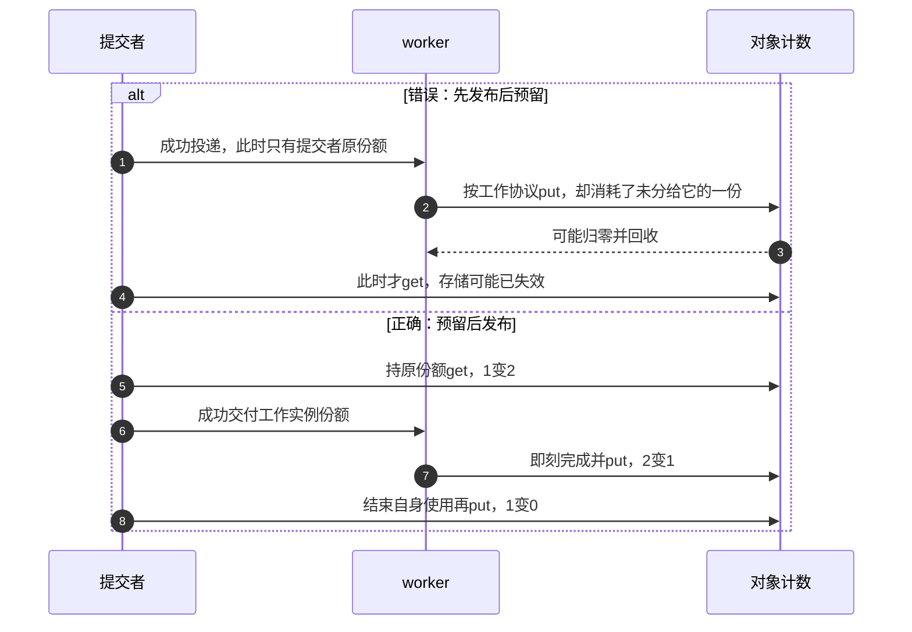
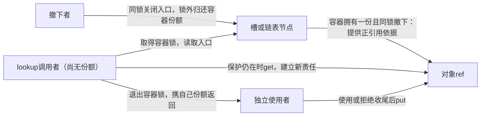

# 第4章\_kref\_三条核心规则

## 4.1\_本章主线\_三条规则是生命周期纪律

前章已经分清入口、业务许可、引用责任和存储退出。现在把同一套模型用于读代码：看到一次传参、一次 return 或一次 lookup，怎样判断有没有足够的寿命保证？本章仍以已建立的容器和工作实例为背景，不重新设计一套对象系统。

三条规则分别管 **建立独立责任、处置已有责任、从查找保护转入独立持有**。常见口诀是“交付前 get、用完 put、lookup/get 受保护”，但口诀不能抹去前章已经成立的短借用和直接转交。借用者不归还借来的份额，转交者不再归还已转出的份额；需要另建一份时，才在交付前 get。

固定版本的 Documentation/core-api/kref.rst 在规则之后也专门说明直接转交可以省掉一对 get/put。版本化阅读从[源码总索引](../../../../research/source_reading/kref/navigation/P01_Linux_6.12_kref源码阅读索引.md#1.2_按问题进入已落地证据)进入，再看[三条规则的调用者协议](../../../../research/source_reading/kref/navigation/P02_普通引用与归零回调导读.md#2.10_三条规则与两类查找协议)。这里学习的是规则成立的因果关系，不把“调用了某 API”当作证明结束。

------

## 4.2\_规则\_1\_非临时拷贝指针之前\_必须先\_get

标题中的 get 针对这种情形：原持有者还需要自己的份额，另一个接收者也将独立使用并负责归还。为了让两方都能按各自时间结束，应在接收者可能开始执行前把计数由 1 增到 2。

如果先发布，接收者运行后按协议 put，却没有为它准备份额，它就会消耗原持有者的那一份，甚至提前回收。错误不只是“两行顺序不美观”，而是接收方开始按两方协议行动时，实际账上还只有一份。

若原持有者已经完成全部使用，可以约定接收方成功时直接接管这一份，计数保持 1；失败时仍归提交者，或者由另一个明确约定消费。此时不能在成功后为了凑“每个函数都 put”再归还一次。第一条规则真正要求的是 **交付生效前，接收方已有明确的寿命依据**。

------

## 4.3\_什么是\_非临时拷贝指针

判断依据是使用期限及责任契约，不是指针写到了栈、全局还是结构体的哪一行。全局保存可能是非拥有索引；同步函数也可能把指针藏进异步回调，不能只凭函数名或存储位置判断。

### 4.3.1\_临时借用

调用者持有引用，同步 dump 只在调用期间读取，不保存指针，也不归还调用者的份额，这就是借用。若读取的是发布后不变的 id，寿命保证通常已足够；若读取可变 state，还须遵守字段自己的锁或读取协议。

```c
/* 调用片段：调用者在整个调用期间持有引用，id 发布后保持不变。 */
static void dump_id(const struct my_refobj *refobj)
{
    pr_info("id=%d\n", refobj->id);
    /* 只借用，不能在这里 put 调用者的那一份。 */
}
```

“函数返回前使用完”也必须包含它调用的子路径。如果 dump 把 refobj 保存在全局诊断任务里，后来才读取，就已经越过这份借用期限。

### 4.3.2\_非临时持有

对象放入请求队列、工作、timer 或其他线程手中，通常需要跨过原调用者的使用期。可以新增一份、转交已有一份，或者证明有更长的外部保活期限；无论选哪种，都必须说明后续退出者。

原 remember/forget 思路的核心——保存一份供以后使用并在清理时归还——仍然成立。但两行 global=obj 加一个 get 不是完整共享容器：还缺发布锁、替换旧对象时的责任处理，以及读者安全取得。前章[完整单槽容器](P02_源码入口与结构定义.md#2.30.1_设计_A_容器持有引用)明确拒绝占用槽的发布，并处理预留回滚；用它分析全局保存，可以避免覆盖旧指针造成泄漏。

如果全局索引刻意不拥有引用，则不能直接套用“可见即为正引用”的查找策略。4.12 将比较这两个选择。

------

## 4.4\_为什么\_before\_很重要

在“提交者保留原份额、工作实例另持一份”协议中，接收者可能在提交函数返回前执行完。用同一个对象比较两种顺序：



正确分支也允许提交者先退出、worker 后退出，前章票据程序已经检查了两种安排。计数先准备好，谁先结束就不再决定是否会偷走别人的责任。

特殊外部同步可能阻止接收者在补 get 之前运行，但这意味着另有必须维持的发布协议。没有必要把正确性依赖隐藏在看似普通的异步接口外；本教材的常规模式保持先预留、后发布，拒绝时回滚。

------

## 4.5\_规则\_1\_的最小错误模型

对一个新工作实例，以下是有明确适用条件的调用片段；EBUSY 在这里是提交包装层选用的“未接受本次工作”错误码，queue_work 自身返回布尔接收结果：

```c
/* 调用者已有一份；接收成功才转出本次新预留的工作份额。 */
kref_get(&refobj->ref);
if (!queue_work(private_wq, &refobj->work)) {
    my_refobj_put(refobj); /* 只回收本次未接收的预留。 */
    return -EBUSY;
}
return 0; /* 原调用者的份额仍由其自身使用期限决定何时归还。 */
```

这段不是完整模块，也不表明 queue_work 负责管理 kref。完整定义、分配失败、worker 回调和卸载等待见[P01 工作实例](P01_kref_要解决什么问题.md#1.16.1_运行一次真实工作交付)。若同一 work 已在排队而本次返回 false，先前实例的那一份仍有原归还者，本次只能收回新预留。

timer 的启动、重排和取消契约与 queue_work 不完全相同，不能仅把函数名替换就沿用同一返回值判断。先确定一次接收对应哪个实例，再为它配平责任。

------

## 4.6\_规则\_2\_使用完指针必须\_put

这里的“使用完”指一份 **自己仍拥有且没有转交** 的责任结束。初始引用也要有最终去向，不能只统计 get 的次数；借用结束没有自己的份额可 put，转交成功则由接收方以后归还。

若工作预留使总数由 1 到 2，成功回调忘记归还，提交者退出后计数停在 1，类型回调无法被正常最后归还触发。若提交从未成功却忘记收回预留，也会留下同样的孤立份额。两者的出口不同，靠“回调里有一个 put”只能检查前一种。

------

## 4.7\_put\_不是\_可选清理动作

put 是结束一份责任的操作，不能像释放可选日志缓冲一样凭“似乎不用了”随意加减。先写责任的来源，再看各分支把它归还还是转交。

### 4.7.1\_少\_put

在函数入口新增一份后，某个错误 return 绕过清理，就会留下仍记在计数里却无人负责的份额。这个引用可能不是本函数的输入份额，因此清理尾应只消费新增的那一份，不改变调用者原有责任。

### 4.7.2\_多\_put

A/B 各一份时 A 连续 put 两次，第二次可以正常地把 1 减到 0，B 仍在使用却已遭提前回收；不保证先出现 underflow 告警。相反，同一函数确实取得两份时可以归还两次，次数必须依据责任来源判断，不能依据“通常一个线程一份”。

将一个指针赋给另一个局部变量没有新增责任。若这两个变量各走一次 cleanup，实际上就把一个责任当成了两个。

------

## 4.8\_错误路径也必须\_put

仍持有输入份额的调用者为了临时处理新增一份，step1/step2 都只借用它；在这个契约下，共同清理尾可以覆盖两次失败和成功：

```c
/* 调用片段：输入引用保持不变，两个步骤均不接管新增份额。 */
kref_get(&refobj->ref);
ret = step1(refobj);
if (ret)
    goto out_put;
ret = step2(refobj);
out_put:
my_refobj_put(refobj);
return ret;
```

如果步骤成功时消费输入责任，必须改写控制流，不能继续无条件走上述 put。若步骤还分配资源，按实际取得情况清理其资源，再结束相应引用。goto 是组织出口的工具，不会自动知道所有权已在某个调用里转移。

------

## 4.9\_put\_后不能继续访问

返回 0 说明本次普通 put 没有调用 release，不证明返回时对象还在：别的持有者可以紧接着完成最后归还。当前路径若没有另一份明确责任，就不能在 put 后读写对象，调试打印也没有例外。

若只需要不可变 id，在仍持有时复制数值，归还后打印局部值。可变 state 要先在其同步窗口中取得快照；复制内部指针不保留它指向的内存。前章[计数快照对照](P02_源码入口与结构定义.md#2.17.1_运行快照与持有的对照程序)展示了观察值与真正保活的区别。

------

## 4.10\_规则\_3\_没有现成有效引用时\_lookup\_+\_get\_必须被保护

自己已有引用时可以依它新增一份；从容器首次取得时却没有这个前提。读出地址到完成取得之间，必须防止存储失效，并为选用的 get 形式提供对应保证。

普通 get 还要求计数不能在此窗口归零。入口自己持有一份且同锁撤下，是一种容易证明的方案：查找者持锁期间入口不能撤下并归还，因而仍有正引用。保护不是只把 get 那一行围起来，而是覆盖从容器读出地址直到自己取得份额的全过程。

对于非拥有索引，锁可能只保证节点未被摘除、内存尚未释放，却不阻止其他路径已在锁外将计数减到零。此时不能因为“查找也加锁了”就普通 get；需要使归零也参与同一串行化协议，或在存储有效窗口内用条件取得处理零值。后者在 4.14 只建立边界，后续章节再展开。

------

## 4.11\_裸指针\_有效引用\_临界区

这三个概念有不同职责：

| 已得到什么 | 可以推出什么 | 还不能推出什么 |
| --- | --- | --- |
| 裸地址 | 保存了一个指针值 | 不证明存储、身份、引用或业务许可 |
| 自己的一份有效引用 | 正确协议下，使用期内对象外壳被保留 | 不代替字段锁、设备状态及子资源寿命 |
| 查找保护窗口 | 根据实际协议，某些撤下/回收动作受约束 | 不自动代表计数为正，也不自动向调用者交付一份 |

list_first_entry 只是按节点地址还原对象，不负责空表判断、并发保护或新增引用。实际查找应先在保护窗口内确认有元素，再判断能否取得，不能把成功算出一个 C 指针视为所有步骤都完成。



图中的正引用依据来自“容器拥有一份”这个设计选择。删除这项假设，必须重新检查规则 3，不能只留下锁名和箭头。

------

## 4.12\_mutex/list\_lookup\_的最小模型

把前章单槽换成 list，节点搜索放在相同的容器锁内，命中 id 后在解锁前 get，调用者得到自己的份额。id 在发布后不变，所有节点增删遵守同锁规则；容器持有的引用覆盖节点可见期。只有这些条件齐备，下面的查找片段才成立：

```c
/* 容器持引用、id 不变，增删与查找均使用 refobj_list_lock。 */
static struct my_refobj *lookup_get(int id)
{
    struct my_refobj *obj;
    mutex_lock(&refobj_list_lock);
    list_for_each_entry(obj, &refobj_list, node) {
        if (obj->id == id) {
            kref_get(&obj->ref);
            mutex_unlock(&refobj_list_lock);
            return obj;
        }
    }
    mutex_unlock(&refobj_list_lock);
    return NULL;
}
```

片段侧重“搜索中何处取得”，完整分配、发布拒绝、清槽和读者归还仍由[P02 单槽模块](P02_源码入口与结构定义.md#2.30.1_设计_A_容器持有引用)贯通。空槽/未命中返回 NULL，没有引用交付，调用者不能继续解引用。

固定 kref.rst 还演示另一种设计：查找和所有普通 put 都取同一把锁，归零回调在该锁下摘除节点。它依靠最后减少和查找串行化，不能把其结论搬到“只有回调才取锁”的写法。比较如下：

| 设计 | 可见时为什么能取得 | 代价与适用条件 |
| --- | --- | --- |
| 容器拥有一份 | 同锁查找时容器份额尚未被撤下者归还 | 容器必须主动撤下并归还，否则无人使用也会继续存活；普通持有者退出不必都走容器锁 |
| 索引不持引用，普通归零与查找串行化 | 归零者在同一锁下减少并完成不可再查找的转换 | 普通 put 路径也承担该锁的成本；回调须遵守锁状态和上下文 |
| 索引不持引用，仅清理回调取锁 | 查找锁暂时保住节点/外壳，但计数可能已在锁外到零 | 普通 get 的正引用依据不足，需要条件取得及明确存储保护 |

不能将第一行称为唯一正确设计，也不能省略第二行对 put 的约束后说两种写法一样。先选协议，再选择代码模板。

------

## 4.13\_为什么不能查出来后再加锁

查找已在锁外完成，随后拿到容器锁，不会把此前可能失效的指针恢复成有效对象。错误窗口可以精确安排为：

```mermaid
sequenceDiagram
    autonumber
    participant L as 查找者
    participant M as 撤下者
    participant E as 容器入口及锁
    participant O as 对象
    L->>E: 无保护读出对象地址
    M->>E: 持锁撤下入口
    M->>O: 归还最后份额并回收
    L->>E: 此时才取得容器锁
    L->>O: 沿旧地址get，已经太晚
```



把加锁移到 lookup 之前，并在取得引用后再解锁，才覆盖了缺口。在正确的容器持引用模型中，两个合法结果是“先查到并取得独立引用”或“先撤下、查找返回空”；没有“锁内拿裸地址、锁外赌对象还在”的第三条正常路径。

------

## 4.14\_kref\_get\_unless\_zero\_不能单独解决\_lookup

条件取得在正常引用状态下只在非零时增加，零时返回失败。它可以处理“存储仍受保护，计数却已经归零”的窗口，不能保护一次已经指向失效存储的访问。

第三种索引设计中，查找者先拿容器锁；最后 put 可以在锁外到零，但清理回调要等同一把锁才能摘除和回收。此时查找者看到的是地址仍有效、计数已为零的对象：条件取得返回失败，查找应按未取得处理，不能返回裸指针让调用者继续使用。

RCU 也要证明成员存储在整个取得窗口保持有效，且清理遵循对应的延迟回收协议；有些复用设计还需核对对象身份，不能只套一个 rcu_read_lock。详情见[P08 条件查找](P08_lookup_场景与_kref_get_unless_zero%28%29.md)及[P10 RCU 边界](P10_kref_与_RCU.md)。本节不承诺条件取得自动完成身份验证、业务检查或所有内存序要求。

------

## 4.15\_三条规则和状态机的对应关系

沿前章同一组阶段读代码，可以避免把三条规则割裂成机械检查：

| 规则 | 对应阶段 | 此时要核对的因果关系 |
| --- | --- | --- |
| 交付前建立责任 | S1 准备、S2 接收 | 接收者可以立即行动，份额或其他寿命依据必须已成立；拒绝归还未转出的预留 |
| 结束时处置责任 | S3/S4 退出、S5 最后清理 | 初始、新增或接管的份额各有归还者；转出的不重复归还，借来的不归还 |
| 查找中安全取得 | S2 新读者加入，与 S4 撤下交错 | 地址、正引用或条件取得窗口连续有效，成功后才依自己的份额离开保护 |

三条规则覆盖的是责任进出。前章 accepting=false 拒绝业务并没有违反任何引用规则，字段同步和业务许可仍有各自职责。

------

## 4.16\_三条规则的最小代码模板

本节把模板放回能实际运行的程序，而不是再造一组缺字段、缺创建和失败处理的片段。下面复用最初的责任槽 C 模型，此次重点比较借用、share 与 move 的契约。

### 4.16.1\_传递给异步路径

[reference_ownership.c](../../../../labs/kernel/object_lifetime/materials/reference_ownership.c)中的一个非空 owner 槽代表一份责任，普通指针别名不算新槽。share 新增，move 转交，submit 成功才接收候选；它没有真实线程和工作队列，只按指定顺序模拟交付。UINT_MAX 是 unsigned int 的最大值，断言在新增之前限制模型计数；EXIT_SUCCESS/EXIT_FAILURE 是程序成功/失败退出的标准常量，不是引用状态。

```c
#include <assert.h>
#include <limits.h>
#include <stdbool.h>
#include <stdio.h>
#include <stdlib.h>

struct object {
    unsigned int refs;
    int value;
};

/* 一个非空槽代表一份归还责任，禁止用结构赋值复制持有者。 */
struct owner { struct object *ptr; };
static unsigned int released;

static bool create(struct owner *dst)
{
    assert(!dst->ptr);
    struct object *obj = malloc(sizeof(*obj));
    if (!obj)
        return false;
    *obj = (struct object){ .refs = 1, .value = 42 };
    dst->ptr = obj;
    return true;
}

static void share(struct owner *dst, const struct owner *src)
{
    assert(!dst->ptr && src->ptr);
    assert(src->ptr->refs > 0 && src->ptr->refs < UINT_MAX);
    ++src->ptr->refs;
    dst->ptr = src->ptr;
}

static void move(struct owner *dst, struct owner *src)
{
    assert(!dst->ptr && src->ptr);
    dst->ptr = src->ptr;
    src->ptr = NULL; /* 责任转交，计数不变。 */
}

static void drop(struct owner *slot)
{
    assert(slot->ptr && slot->ptr->refs > 0);
    struct object *obj = slot->ptr;
    slot->ptr = NULL; /* 先结束本槽使用权，再执行可能的释放。 */
    if (--obj->refs == 0) {
        ++released; /* 观察量位于对象外，释放后不再读取对象。 */
        free(obj);
    }
}

static int borrow(const struct object *obj)
{
    return obj->value; /* 调用期间由调用者的现有引用保活。 */
}

/* 成功才接收候选引用；拒绝时候选仍归调用者。没有真实工作队列。 */
static bool submit(struct owner *pending, struct owner *candidate,
                   bool accept)
{
    assert(!pending->ptr && candidate->ptr);
    if (!accept)
        return false;
    move(pending, candidate);
    return true;
}

static void consume(struct owner *pending)
{
    struct owner worker = {0};
    move(&worker, pending);
    assert(borrow(worker.ptr) == 42);
    drop(&worker);
}

int main(void)
{
    /* 两次运行分别观察提交成功与失败，均须恰好释放一次。 */
    for (unsigned int accept = 0; accept < 2; ++accept) {
        struct owner producer = {0}, candidate = {0}, pending = {0};
        if (!create(&producer)) {
            fputs("allocation failed\n", stderr);
            return EXIT_FAILURE;
        }
        assert(borrow(producer.ptr) == 42 && producer.ptr->refs == 1);
        share(&candidate, &producer);
        assert(producer.ptr->refs == 2);
        bool queued = submit(&pending, &candidate, accept != 0);
        if (!queued)
            drop(&candidate); /* 发布失败，归还预留的那一份。 */
        drop(&producer);
        if (queued) {
            assert(pending.ptr->refs == 1);
            consume(&pending);
        }
        assert(!producer.ptr && !candidate.ptr && !pending.ptr);
        assert(released == accept + 1);
        printf("accept=%u released=%u\n", accept, released);
    }
    return EXIT_SUCCESS;
}
```

在材料目录编译运行，保持断言开启：

```bash
cc -std=c11 -Wall -Wextra -Werror -O2 reference_ownership.c -o reference_ownership
./reference_ownership
```

拒绝轮输出 accept=0 released=1，接收轮输出 accept=1 released=2；released 是对象外累计回收数，两轮各清理一次。拒绝不是“什么都没发生”：此前 share 已把计数加到 2，因此 candidate 仍须归还。

### 4.16.2\_使用完释放

先做一个安全修改：成功提交后立即 consume，再 drop producer，代表接收者先结束。此时 consume 归还工作份额后原持有者仍在，最终仍每轮只释放一次。失败轮保持 candidate 的回滚；不要为了换序删除它。

再试直接转交：省去 share，把 producer 直接作为 submit 的 candidate；成功后不要 drop 已清空的 producer，失败才 drop 它。计数始终只有一份，但成功与失败仍各有唯一归还者。这说明“没有 get 就一定错”不是规则的正确读法。现有责任槽夹具已覆盖两种策略、两种退出顺序和拒绝路径。

最后预测反例而不执行失效访问：若复制 owner 结构体而不是调用 share，两槽看似非空，计数却没有增加，随后各 drop 会消耗同一份两次。模型不允许用结构赋值复制拥有者，普通 C 编译器不会自动替你维持这个约定。

### 4.16.3\_lookup\_后取得引用

上面的 C 模型只从已有 owner 得到对象，不包含保护查找；不能拿它通过的结果证明规则 3 已经实现。查找实验继续运行前章完整单槽模块及[关闭模块](P03_kref_生命周期状态机.md#3.16_一个完整的生命周期模板)：分别安排“lookup 后撤下”和“先撤下再 lookup”，预测前者可保留旧引用、后者返回空。

进一步问自己：如果只把入口改成不持引用，却不改变 lookup/get，原证明哪一步消失？答案是“持锁看到入口，就有入口那一份保证计数为正”。对应修复不只是新增一个 if，还要选定 4.12 表中的归零串行化或条件取得协议。

------

## 4.17\_本章检查清单

用清单时应写下实际调用点和责任去向，单独勾选“有 get”“有锁”不足以结束审查。

### 4.17.1\_规则\_1\_检查\_交出去之前是否\_get

对象交给线程、队列、工作、timer、全局保存或其他长于调用栈的使用者时，接收者依据什么继续访问？若新增一份，是否在它可能执行前准备，拒绝时谁回收？若直接转交，成功与失败是否分别消费责任？若借用，外层保证何时结束、如何确保使用者先退出？

### 4.17.2\_规则\_2\_检查\_用完是否\_put

从初始份额开始，把每次新增和接管接到正常、错误与取消出口；指出哪些函数只借用，哪些成功时转出。最后一次使用、归还和日志的顺序是否正确？同一份是否可能在两个 cleanup 分支被重复处置？回调的锁状态和执行上下文是否满足类型清理要求？

### 4.17.3\_规则\_3\_检查\_lookup\_+\_get\_是否被保护

入口来自哪一个槽或节点，谁在何处撤下，谁在何处可能到零和回收？普通 get 的正引用依据是什么？条件取得期间计数成员地址为何有效，失败是否停止使用？若用 RCU，旧读者窗口与存储复用身份如何保证？引用取得后，字段锁和业务状态是否仍被正确检查？

------

## 4.18\_三条规则的常见错误对应表

| 具体错误及前提 | 缺失的保证 | 可能后果 |
| --- | --- | --- |
| 接收者按独立引用归还，提交者却在发布后才 get | 接收生效前未准备份额 | 接收者消耗原份额，补 get 时存储可能已失效 |
| 新增一份后错误 return，既未转交也未归还 | 本路径责任无出口 | 泄漏 |
| 归还唯一持有份额后写对象字段 | 后续访问没有寿命依据 | UAF |
| 无保护 lookup 后直接 get | 地址和正引用窗口未建立 | 在失效计数器上操作 |
| 条件取得失败仍返回并使用裸指针 | 没有成功获得引用 | 越过保护窗口后失去保活 |
| 已发布对象仍有读者时重新 init | 计数与外部责任失配 | 提前回收或其他生命周期破坏 |
| 只拥有一份却归还两次 | 第二次归还没有责任来源 | 提前清理，不保证先告警 |
| 全局索引不持引用，又没有有效的外部退出协议 | 长期地址无存储/查找保证 | 悬挂地址或不安全取得 |

------

## 4.19\_本章不展开的内容

本章建立规则的适用条件和可检查边界，后续各篇增加具体约束：复杂回调资源见[P06](P06_release_回调与复杂销毁模式.md)，多种交付/取消见[P07](P07_handoff_所有权转移模型.md)，条件取得见[P08](P08_lookup_场景与_kref_get_unless_zero%28%29.md)，锁交接见[P09](P09_kref_与锁的组合.md)，RCU 存储退出见[P10](P10_kref_与_RCU.md)。这几篇承担进一步推演，不能反过来把其所有字段和变体作为理解本章的前提。

下一篇先回到接口，把这里的 get/put 前提落到固定实现和返回契约。普通接口正文与源码模块分别承担应用和特定版本阅读职责，不因出现相同术语就互相替代。

------

## 4.20\_本章小结

三条规则是对同一对象责任周期的三个观察角度，必须带着协议条件使用。

### 4.20.1\_规则\_1

独立接收者开始前就应有寿命依据。需要追加份额时先 get，再交付；成功直接接管旧份额时不必多增多减；拒绝必须按实际契约处理仍在手里的责任。

### 4.20.2\_规则\_2

每一份最终由它的归还者 put，包含初始、新增和接管的份额。借用者不消费借来的责任，转交者不重复消费已经转出的责任。归还后只依仍明确拥有的其他份额或独立值继续行动。

### 4.20.3\_规则\_3

没有现成引用时，在有效查找窗口内完成取得。普通 get 需要正引用依据，条件取得需要地址有效并处理失败；容器锁、RCU 和返回值都不能单独代表整套协议。

能为一个真实调用点说清“凭什么进入、谁持有、何时交出、怎样退出”，才能把口诀变成可以复核的代码。

------

专题导航：[kref 引用计数机制章节大纲](大纲.md)。

上一篇：[kref 生命周期状态机](P03_kref_生命周期状态机.md)。

下一篇：[基础 API 源码逐行讲解](P05_基础_API_源码逐行讲解.md)。
