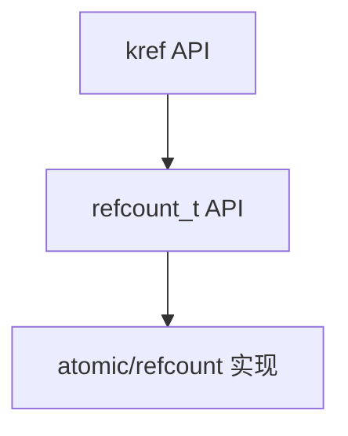

# 第5章_基础_API_源码逐行讲解

## 5.1_本章主线

前面几章已经讲过：

```text
kref 是对象生命周期协议；
struct kref 嵌入自定义引用对象内部；
kref_init/get/put/release 构成生命周期状态机；
三条核心规则约束 get、put、lookup。
```

本章开始补完 `kref` 的基础 API。

但本章不再重复：

```text
struct kref 为什么嵌入对象内部
release 为什么要 container_of
kref 为什么不是锁
put 后为什么不能访问对象
lookup 为什么不能裸 get
```

这些已经在前 1-4 章讲过。

本章只回答 API 层面的几个问题：

```text
每个 API 的源码形态是什么？
它调用了 refcount_t 的哪个接口？
它的使用前提是什么？
它的返回值能不能忽略？
它适合普通路径，还是 lookup/锁组合路径？
```

本章主线是：

```text
kref API 很少，但每个 API 都有明确的生命周期语义和使用前提。
```

------

## 5.2_kref_API_总览

`include/linux/kref.h` 里主要有这些接口：

```c
KREF_INIT(n)
kref_init()
kref_read()
kref_get()
kref_put()
kref_get_unless_zero()
kref_put_mutex()
kref_put_lock()
```

可以先按用途分组：

| API                      | 用途                              | 普通路径/特殊路径   |
| ------------------------ | --------------------------------- | ------------------- |
| `KREF_INIT(n)`           | 静态初始化                        | 初始化路径          |
| `kref_init()`            | 动态初始化为 1                    | 初始化路径          |
| `kref_read()`            | 读取当前引用计数                  | 调试/观察路径       |
| `kref_get()`             | 增加引用                          | 普通持有路径        |
| `kref_put()`             | 释放引用，归零时 release          | 普通释放路径        |
| `kref_get_unless_zero()` | 非 0 时尝试增加引用               | lookup/RCU/特殊路径 |
| `kref_put_mutex()`       | put 到 0 时持 mutex 调 release    | 锁组合路径          |
| `kref_put_lock()`        | put 到 0 时持 spinlock 调 release | 锁组合路径          |

从使用频率看，最常用的是：

```c
kref_init()
kref_get()
kref_put()
```

从错误风险看，最需要小心的是：

```c
kref_get_unless_zero()
kref_put_mutex()
kref_put_lock()
```

因为它们通常出现在 lookup、删除、最后释放、锁组合这类复杂路径中。

本章后面按职责重新归纳为几组：

| 分组 | API | 关注点 |
| --- | --- | --- |
| 初始化类 | `KREF_INIT(n)`、`kref_init()` | 初始引用从哪里来 |
| 观察类 | `kref_read()` | 只能观察，不能做生命周期判断 |
| 普通引用类 | `kref_get()`、`kref_put()` | 已有有效对象上的 get/put |
| 条件取得引用 | `kref_get_unless_zero()` | 返回值必须检查，仍需外部保护 |
| 锁组合释放 | `kref_put_mutex()`、`kref_put_lock()` | 最后 put 与锁语义配套 |
| 工程封装 | `my_refobj_get()`、`my_refobj_put()`、`lookup_get()` | 把引用规则收进对象接口 |

------

## 5.3_kref_API_与_refcount_t_的映射

虽然第 2 章已经讲过结构模型，这里为了读 API 源码，需要保留最小上下文。

源码形态可以理解为：

```c
struct kref {
	refcount_t refcount;
};
```

也就是说，`kref` 的 API 本质上是对 `refcount_t` 的封装：

```text
kref_init              -> refcount_set
kref_read              -> refcount_read
kref_get               -> refcount_inc
kref_put               -> refcount_dec_and_test
kref_get_unless_zero   -> refcount_inc_not_zero
kref_put_mutex         -> refcount_dec_and_mutex_lock
kref_put_lock          -> refcount_dec_and_lock
```

可以画成：



本章看源码时，要始终记住：

```text
kref 层表达对象生命周期语义；
refcount_t 层提供引用计数安全原语；
底层 atomic 层提供原子操作能力。
```

------

## 5.4_初始化类_API

初始化类 API 只解决一个问题：对象生命周期从哪个引用开始。静态对象用 `KREF_INIT(n)`，动态对象用 `kref_init()`。

### 5.4.1_KREF_INIT(n)

`KREF_INIT(n)` 用于静态初始化。

源码形态可以理解为：

```c
#define KREF_INIT(n)	{ .refcount = REFCOUNT_INIT(n), }
```

它的作用是：

```text
在定义对象时，直接给 kref 一个初始引用计数值。
```

例如：

```c
static struct my_refobj global_refobj = {
	.ref = KREF_INIT(1),
};
```

或者：

```c
struct kref ref = KREF_INIT(1);
```

这里的 `n` 不是随便填的。

如果填 1：

```text
表示这个静态对象一开始就有 1 个引用。
```

如果填其他值，就必须能解释：

```text
这 n 个引用分别属于谁。
```

否则引用计数没有所有权含义。


### 5.4.2_KREF_INIT(n)_的使用前提

`KREF_INIT(n)` 适合：

```text
静态对象
全局对象
编译期初始化对象
不需要 kzalloc 后再 kref_init 的对象
```

但要注意：

```text
静态对象是否真的需要 kfree？
refcount 归零后 release 做什么？
静态对象是否允许归零？
```

例如：

```c
static struct my_refobj global_refobj = {
	.ref = KREF_INIT(1),
};
```

如果 release 写成：

```c
static void my_refobj_release(struct kref *ref)
{
	struct my_refobj *refobj = container_of(ref, struct my_refobj, ref);

	kfree(refobj);        /* 对静态对象是错的 */
}
```

这就会出问题。

所以静态初始化时要特别明确：

```text
对象是不是动态分配的？
release 是否真的释放内存？
```

动态对象一般不用 `KREF_INIT()`，而是用：

```c
kref_init(&refobj->ref);
```


### 5.4.3_kref_init()

`kref_init()` 用于动态对象初始化。

源码形态可以理解为：

```c
static inline void kref_init(struct kref *kref)
{
	refcount_set(&kref->refcount, 1);
}
```

逐行看：

```c
static inline void kref_init(struct kref *kref)
```

说明它是内联函数，参数是对象内部的 `struct kref *`。

```c
refcount_set(&kref->refcount, 1);
```

把内部的 `refcount_t` 设置为 1。

这里不是加 1，而是直接设置为 1。

语义是：

```text
对象刚初始化完成，创建者获得初始引用。
```


### 5.4.4_kref_init()_的使用前提

`kref_init()` 的前提非常严格：

```text
对象刚创建；
对象还没有发布；
对象还没有被其他路径看到；
对象还没有已有引用关系。
```

典型正确写法：

```c
struct my_refobj *my_refobj_alloc(void)
{
	struct my_refobj *refobj;

	refobj = kzalloc(sizeof(*refobj), GFP_KERNEL);
	if (!refobj)
		return NULL;

	kref_init(&refobj->ref);

	return refobj;
}
```

错误写法：

```c
void my_refobj_reset(struct my_refobj *refobj)
{
	kref_init(&refobj->ref);      /* 错：不能重置已有对象的引用计数 */
}
```

为什么错？

因为 `kref_init()` 是直接设置计数，不是“重新整理引用关系”。

如果对象当前有多个持有者：

```text
refcount = 3
```

突然调用：

```c
kref_init(&refobj->ref);
```

就会把引用计数强行改成 1。

这会破坏所有已有持有者的引用语义。

所以规则是：

```text
kref_init() 只用于新对象初始化，不用于旧对象 reset。
```

------

## 5.5_观察类_API_kref_read()

观察类 API 只适合调试和诊断，不能拿来决定生命周期。

### 5.5.1_kref_read()

`kref_read()` 用于读取当前引用计数。

源码形态可以理解为：

```c
static inline unsigned int kref_read(const struct kref *kref)
{
	return refcount_read(&kref->refcount);
}
```

逐行看：

```c
static inline unsigned int kref_read(const struct kref *kref)
```

参数是 `const struct kref *`，说明它不会修改引用计数。

```c
return refcount_read(&kref->refcount);
```

返回底层 `refcount_t` 当前值。


### 5.5.2_kref_read()_的正确用途

`kref_read()` 可以用于：

```text
debug
trace
统计
WARN_ON 辅助判断
打印当前引用计数
排查泄漏
```

例如：

```c
pr_debug("refobj ref=%u\n", kref_read(&refobj->ref));
```

或者：

```c
WARN_ON(kref_read(&refobj->ref) == 0);
```

但它不适合做生命周期控制判断。

错误写法：

```c
if (kref_read(&refobj->ref) > 0)
	kref_get(&refobj->ref);
```

问题是：

```text
读到大于 0 和随后 get 不是一个原子过程。
```

在两者之间，其他 CPU 可能已经 put 到 0 并 release。

所以 `kref_read()` 不能替代：

```c
kref_get_unless_zero()
```

也不能替代 lookup 保护。

------

## 5.6_普通引用_API_kref_get()_和_kref_put()

普通路径只围绕两个动作：已有有效对象上增加引用，当前持有者退出时释放引用。

### 5.6.1_kref_get()

`kref_get()` 用于增加引用。

源码形态可以理解为：

```c
static inline void kref_get(struct kref *kref)
{
	refcount_inc(&kref->refcount);
}
```

逐行看：

```c
static inline void kref_get(struct kref *kref)
```

参数是要增加引用的 `struct kref *`。

```c
refcount_inc(&kref->refcount);
```

调用 `refcount_inc()` 增加底层引用计数。

这里没有返回值。

也就是说：

```text
普通 kref_get() 默认调用者已经满足使用前提。
```

它不负责告诉你“取得引用是否成功”。


### 5.6.2_kref_get()_的使用前提

`kref_get()` 的前提是：

```text
调用者已经能证明对象当前有效。
```

常见情况是：

```text
当前路径已经持有一个引用；
当前路径在对象集合锁保护下；
对象尚未发布给并发路径；
其他机制保证对象不会在 get 期间释放。
```

典型正确写法：

```c
static struct my_refobj *my_refobj_get(struct my_refobj *refobj)
{
	kref_get(&refobj->ref);
	return refobj;
}
```

然后：

```c
kref_get(&refobj->ref);
queue_work(system_wq, &refobj->work);
```

这里调用者已经持有 `refobj` 的有效引用，所以可以为 worker 增加一个引用。

错误写法：

```c
refobj = lookup_without_lock(id);
kref_get(&refobj->ref);        /* 错：refobj 可能已经无效 */
```

这个问题不在 `kref_get()`，而在调用者没有证明 `refobj` 有效。

所以 `kref_get()` 可以总结为：

```text
它是“已有有效对象上的引用增加”，不是“从裸指针抢救对象”。
```


### 5.6.3_kref_get()_为什么没有返回值

`kref_get()` 没有返回值，因为它不是尝试性接口。

它的设计语义是：

```text
只要你调用 kref_get，就表示你已经保证对象有效；
因此增加引用应该成功。
```

如果你不能保证对象有效，就不应该用普通 `kref_get()`。

lookup 场景应该考虑：

```c
kref_get_unless_zero()
```

并且配合锁或 RCU。

所以：

```text
kref_get() 没有失败分支；
失败处理应该发生在调用 kref_get() 之前的查找/保护逻辑里。
```


### 5.6.4_kref_put()

`kref_put()` 用于释放引用。

源码形态可以理解为：

```c
static inline int kref_put(struct kref *kref,
			   void (*release)(struct kref *kref))
{
	if (refcount_dec_and_test(&kref->refcount)) {
		release(kref);
		return 1;
	}

	return 0;
}
```

逐行看。

函数签名：

```c
static inline int kref_put(struct kref *kref,
			   void (*release)(struct kref *kref))
```

它需要两个参数：

```text
kref：要释放的引用计数对象
release：引用归零时调用的销毁函数
```

然后：

```c
if (refcount_dec_and_test(&kref->refcount)) {
```

底层引用计数减 1，并测试是否归零。

如果归零：

```c
release(kref);
return 1;
```

调用 release，并返回 1。

如果没有归零：

```c
return 0;
```

说明本次 put 不是最后一个引用。


### 5.6.5_kref_put()_的_release_参数

`release` 的类型是：

```c
void (*release)(struct kref *kref)
```

所以 release 函数通常写成：

```c
static void my_refobj_release(struct kref *ref)
{
	struct my_refobj *refobj;

	refobj = container_of(ref, struct my_refobj, ref);

	kfree(refobj);
}
```

`kref_put()` 不能直接传 `kfree`：

```c
kref_put(&refobj->ref, kfree);      /* 错 */
```

原因前面讲过，这里只保留 API 层结论：

```text
kref_put 传给 release 的是 struct kref *；
kfree 需要的是对象起始地址；
必须先 container_of 找回外层对象。
```

工程上建议封装：

```c
static void my_refobj_put(struct my_refobj *refobj)
{
	kref_put(&refobj->ref, my_refobj_release);
}
```

这样可以避免调用点传错 release。


### 5.6.6_kref_put()_的返回值

`kref_put()` 返回值含义：

```text
返回 1：本次 put 释放了最后一个引用，release 已经被调用。
返回 0：本次 put 没有释放最后一个引用。
```

它可以用于某些统计或特殊路径：

```c
if (kref_put(&refobj->ref, my_refobj_release))
	pr_debug("refobj released\n");
```

但不能这样用：

```c
if (!kref_put(&refobj->ref, my_refobj_release)) {
	refobj->state = 0;      /* 错 */
}
```

因为返回 0 只说明：

```text
本次 put 没有触发 release。
```

不说明：

```text
当前路径仍然持有引用；
对象之后不会被其他路径释放。
```

`kref_put()` 的调用本身已经表示：

```text
当前路径释放了一个引用。
```

所以普通代码应遵守：

```text
put 后不再访问对象。
```


### 5.6.7_kref_put()_的使用前提

`kref_put()` 的前提是：

```text
当前路径确实持有一个引用。
```

不能因为手里有指针就 put。

错误模型：

```c
void random_path(struct my_refobj *refobj)
{
	my_refobj_put(refobj);       /* 错：如果当前路径没有引用，就是多 put */
}
```

正确判断是：

```text
这个路径的引用是从哪里来的？
kref_init？
kref_get？
lookup_get？
handoff 接收？
```

如果答不上来，就不能 put。

每个 `put` 都必须对应一个实际归属。


### 5.6.8_kref_put()_和_refcount_dec_and_test()

`kref_put()` 底层依赖：

```c
refcount_dec_and_test()
```

它完成两个动作：

```text
引用计数减 1；
判断减完后是否为 0。
```

这两个动作必须是一个原子意义上的整体。

否则会出现并发问题：

```text
两个 CPU 同时 put；
都以为自己不是最后一个；
或者都以为自己是最后一个；
release 可能漏掉或重复。
```

`refcount_dec_and_test()` 的语义保证：

```text
只有真正把引用计数从 1 减到 0 的那个路径会得到 true。
```

所以只有一个路径会调用 release。

这就是 `kref_put()` 能作为最后释放触发点的基础。

------

## 5.7_条件取得引用_kref_get_unless_zero()

`kref_get_unless_zero()` 是 lookup/RCU 等路径里的尝试性 get，它的重点是返回值和外部保护前提。

### 5.7.1_kref_get_unless_zero()

`kref_get_unless_zero()` 是尝试性 get。

源码形态可以理解为：

```c
static inline __must_check int kref_get_unless_zero(struct kref *kref)
{
	return refcount_inc_not_zero(&kref->refcount);
}
```

逐行看：

```c
static inline __must_check int kref_get_unless_zero(struct kref *kref)
```

返回值带 `__must_check`，表示调用者必须检查结果。

然后：

```c
return refcount_inc_not_zero(&kref->refcount);
```

只有当引用计数不是 0 时，才增加引用。

返回值含义：

```text
返回非 0：成功取得引用。
返回 0：没有取得引用，对象不可再获得。
```


### 5.7.2_kref_get_unless_zero()_的使用场景

它主要用于这种场景：

```text
当前路径不是已经持有对象引用；
而是从某个可见结构中查到对象；
对象可能正在释放；
需要尝试取得引用。
```

典型模型：

```c
if (!kref_get_unless_zero(&refobj->ref))
	return NULL;
```

成功后：

```text
当前路径获得一个引用，可以在随后使用对象。
```

失败后：

```text
当前路径没有获得引用，不能使用对象。
```

所以返回值不能忽略。

错误写法：

```c
kref_get_unless_zero(&refobj->ref);

/* 错：没有检查返回值 */
use_refobj(refobj);
```

正确写法：

```c
if (!kref_get_unless_zero(&refobj->ref))
	return NULL;

use_refobj(refobj);
my_refobj_put(refobj);
```


### 5.7.3_kref_get_unless_zero()_不解决裸指针有效性

本章只保留这个关键边界。

`kref_get_unless_zero()` 能解决的是：

```text
refcount 非 0 时才加引用。
```

它不能解决：

```text
refobj 指针本身是否还指向有效内存。
```

错误写法：

```c
refobj = lookup_without_lock(id);

if (!kref_get_unless_zero(&refobj->ref))
	return NULL;
```

如果 `lookup_without_lock()` 返回的是悬挂指针，那么访问：

```c
&refobj->ref
```

本身就已经不安全。

所以正确模型仍然是：

```text
lookup + kref_get_unless_zero 必须处在锁或 RCU 等有效保护下。
```

这个 API 的详细使用会在第 8 章展开。

本章只记住一句：

```text
get_unless_zero 是“尝试取得引用”的工具，不是“证明裸指针有效”的工具。
```


### 5.7.4_must_check_的意义

`kref_get_unless_zero()` 带有：

```c
__must_check
```

这表示：

```text
调用者必须检查返回值。
```

因为它可能失败。

如果忽略返回值：

```c
kref_get_unless_zero(&refobj->ref);
```

编译器可能给出警告。

为什么这个返回值必须检查？

因为失败意味着：

```text
当前路径没有获得引用。
```

如果没有获得引用还继续使用对象，就违反了生命周期规则。

所以这类代码必须写成：

```c
if (!kref_get_unless_zero(&refobj->ref))
	return NULL;
```

而不是：

```c
kref_get_unless_zero(&refobj->ref);
return refobj;
```

------

## 5.8_锁组合释放_API

`kref_put_mutex()` 和 `kref_put_lock()` 都不是为了保护 refcount 本身，而是为了处理“最后 put + release + 集合关系”这类复合路径。

### 5.8.1_kref_put_mutex()

`kref_put_mutex()` 是普通 `kref_put()` 的锁组合版本。

源码形态可以理解为：

```c
static inline int kref_put_mutex(struct kref *kref,
				 void (*release)(struct kref *kref),
				 struct mutex *lock)
{
	if (refcount_dec_and_mutex_lock(&kref->refcount, lock)) {
		release(kref);
		return 1;
	}

	return 0;
}
```

它的语义是：

```text
引用计数减 1；
如果减到 0，则获取 mutex；
在持有 mutex 的状态下调用 release；
然后返回 1。
```

如果不是最后一个引用：

```text
不调用 release；
通常也不会持锁进入 release；
返回 0。
```

这个 API 不是为了保护引用计数本身。

引用计数本身由 `refcount_t` 原子语义保护。

它真正服务的是复合场景：

```text
最后一个 put
从全局结构删除
release 销毁对象
```

这些操作可能需要在同一把 mutex 下完成。


### 5.8.2_kref_put_mutex()_的典型用途

假设对象挂在某个由 mutex 保护的集合中：

```c
static DEFINE_MUTEX(refobj_list_lock);
static LIST_HEAD(refobj_list);
```

对象释放时需要和这个集合关系配合。

`kref_put_mutex()` 可以用于：

```c
if (kref_put_mutex(&refobj->ref, my_refobj_release, &refobj_list_lock))
	return;
```

这里的含义不是：

```text
mutex 保护 refcount。
```

而是：

```text
如果当前 put 是最后一个引用，
则在持有 refobj_list_lock 的情况下执行 release。
```

这对 release 有额外要求：

```text
release 被调用时 lock 已经持有。
```

所以 release 必须知道这个事实。

例如 release 里可能要：

```c
static void my_refobj_release(struct kref *ref)
{
	struct my_refobj *refobj = container_of(ref, struct my_refobj, ref);

	list_del(&refobj->node);
	mutex_unlock(&refobj_list_lock);

	kfree(refobj);
}
```

这里只是展示语义，实际写法要特别小心锁平衡。

第 9 章会专门展开 `kref_put_mutex()` 的正确模板。

本章只先记住：

```text
kref_put_mutex() 会在最后引用释放时持 mutex 调 release。
```


### 5.8.3_kref_put_lock()

`kref_put_lock()` 是 spinlock 版本。

源码形态可以理解为：

```c
static inline int kref_put_lock(struct kref *kref,
				void (*release)(struct kref *kref),
				spinlock_t *lock)
{
	if (refcount_dec_and_lock(&kref->refcount, lock)) {
		release(kref);
		return 1;
	}

	return 0;
}
```

它的语义是：

```text
引用计数减 1；
如果减到 0，则获取 spinlock；
在持有 spinlock 的状态下调用 release；
然后返回 1。
```

这通常用于：

```text
不能睡眠的上下文
spinlock 保护的集合
短临界区删除
最后 put 和脱链需要组合的路径
```

但它比 `kref_put_mutex()` 更需要谨慎。

因为 release 在 spinlock 持有状态下运行。

这意味着 release 里不能做可能睡眠的操作，例如：

```text
mutex_lock
schedule
可能睡眠的内存分配
等待 completion
cancel_work_sync
某些阻塞式资源释放
```

所以使用 `kref_put_lock()` 时必须检查：

```text
release 是否会睡眠？
release 是否会调用可能睡眠的函数？
release 是否会再拿其他锁？
锁顺序是否安全？
```

详细模型放到第 9 章。


### 5.8.4_kref_put_mutex/kref_put_lock_的共同边界

这两个 API 的共同点：

```text
它们都不是为了保护 refcount 自身；
它们是为了保护“最后 put + release”这个复合过程。
```

区别是：

| API                | 使用锁           | release 上下文                                              |
| ------------------ | ---------------- | ----------------------------------------------------------- |
| `kref_put_mutex()` | `struct mutex *` | release 在 mutex 持有状态下执行，可能允许睡眠取决于具体设计 |
| `kref_put_lock()`  | `spinlock_t *`   | release 在 spinlock 持有状态下执行，不能睡眠                |

使用这两个 API 时，release 函数必须和锁语义配套。

不能把普通 release 直接拿来用，而不检查里面做了什么。

例如普通 release：

```c
static void my_refobj_release(struct kref *ref)
{
	struct my_refobj *refobj = container_of(ref, struct my_refobj, ref);

	cancel_work_sync(&refobj->work);
	kfree(refobj);
}
```

如果它被 `kref_put_lock()` 调用，就可能出问题。

因为 `cancel_work_sync()` 可能睡眠，不能在 spinlock 持有状态下调用。

------

## 5.9_API_使用前提总表

| API                      | 做什么                         | 使用前提                         | 返回值             |
| ------------------------ | ------------------------------ | -------------------------------- | ------------------ |
| `KREF_INIT(n)`           | 静态初始化                     | 能解释 n 个引用的归属            | 无                 |
| `kref_init()`            | 设置初始引用为 1               | 新对象，未发布，未被其他路径持有 | 无                 |
| `kref_read()`            | 读取计数                       | 仅用于观察，不作为安全判断       | 当前计数           |
| `kref_get()`             | 增加引用                       | 对象已被证明有效                 | 无                 |
| `kref_put()`             | 释放引用，归零 release         | 当前路径确实持有引用             | 1 表示本次 release |
| `kref_get_unless_zero()` | 非 0 时尝试 get                | refobj 指针本身仍需锁/RCU保护       | 必须检查           |
| `kref_put_mutex()`       | 最后 put 时持 mutex release    | release 知道锁语义               | 1 表示本次 release |
| `kref_put_lock()`        | 最后 put 时持 spinlock release | release 不得睡眠                 | 1 表示本次 release |

------

## 5.10_API_封装模板

工程代码里通常不建议到处裸写 kref API，而是让对象类型自己提供 get/put/lookup_get 封装。

### 5.10.1_裸_kref_私有对象的_API_封装模板

工程上不要到处裸写：

```c
kref_get(&refobj->ref);
kref_put(&refobj->ref, my_refobj_release);
```

更推荐封装：

```c
struct my_refobj {
	struct kref ref;
	int state;
};

static void my_refobj_release(struct kref *ref)
{
	struct my_refobj *refobj;

	refobj = container_of(ref, struct my_refobj, ref);

	kfree(refobj);
}

static void my_refobj_init(struct my_refobj *refobj)
{
	kref_init(&refobj->ref);
}

static struct my_refobj *my_refobj_get(struct my_refobj *refobj)
{
	kref_get(&refobj->ref);
	return refobj;
}

static void my_refobj_put(struct my_refobj *refobj)
{
	kref_put(&refobj->ref, my_refobj_release);
}
```

这样做的好处是：

```text
release 函数集中在一个地方；
调用点不容易传错 release；
以后可以加 trace/WARN_ON/debug；
对象生命周期接口更清楚。
```

例如可以扩展：

```c
static struct my_refobj *my_refobj_get(struct my_refobj *refobj)
{
	WARN_ON(!refobj);

	kref_get(&refobj->ref);
	return refobj;
}
```

或者：

```c
static void my_refobj_put(struct my_refobj *refobj)
{
	if (!refobj)
		return;

	kref_put(&refobj->ref, my_refobj_release);
}
```

是否允许 `NULL`，由具体工程风格决定。


### 5.10.2_lookup_场景的封装模板

如果对象需要从容器中查找，建议封装成：

```c
static struct my_refobj *my_refobj_lookup_get(int id)
{
	struct my_refobj *refobj;

	mutex_lock(&refobj_list_lock);

	list_for_each_entry(refobj, &refobj_list, node) {
		if (refobj->id == id) {
			kref_get(&refobj->ref);
			mutex_unlock(&refobj_list_lock);
			return refobj;
		}
	}

	mutex_unlock(&refobj_list_lock);
	return NULL;
}
```

调用者只看到：

```c
refobj = my_refobj_lookup_get(id);
if (!refobj)
	return -ENOENT;

/* 使用 refobj */

my_refobj_put(refobj);
```

这比让调用者自己写：

```c
refobj = lookup(id);
kref_get(&refobj->ref);
```

更安全。

因为查找和取得引用的保护规则被封装在对象内部。

第 8 章会展开更复杂的 `kref_get_unless_zero()`、RCU、hash/xarray 模型。

------

## 5.11_API_和核心规则的对应关系

第 4 章的三条规则，可以直接映射到本章 API。

| 规则                    | 常用 API                                | 说明                         |
| ----------------------- | --------------------------------------- | ---------------------------- |
| 非临时拷贝前先 get      | `kref_get()`                            | 给新持有者增加引用           |
| 使用完必须 put          | `kref_put()`                            | 释放当前持有者引用           |
| lookup + get 必须被保护 | `kref_get()` / `kref_get_unless_zero()` | 在保护下把裸指针变成有效引用 |
| 最后 put 和锁组合       | `kref_put_mutex()` / `kref_put_lock()`  | 处理最后释放与集合关系       |
| 调试观察                | `kref_read()`                           | 只能观察，不能当生命周期判断 |

可以这样理解：

```text
普通共享路径：kref_get + kref_put
lookup 路径：锁/RCU + kref_get 或 kref_get_unless_zero
删除释放路径：kref_put 或 kref_put_mutex/kref_put_lock
调试路径：kref_read
初始化路径：KREF_INIT/kref_init
```

------

## 5.12_refcount_t_与_kref_的边界

这一组内容只保留 API 使用者需要知道的底层边界：refcount_t 保证引用计数安全，但不把自定义引用对象变成并发安全对象。

### 5.12.1_refcount_t_内存序只讲到够用

`kref` 底层使用 `refcount_t`，而 `refcount_t` 不是普通整数。

对 `kref` 使用者来说，不需要在本章展开所有内存序细节。

只需要先掌握几个够用结论：

```text
1. 引用计数增减是原子化的。
2. refcount_t 会防护某些溢出、下溢、UAF 型误用。
3. 最后一个 put 到 release/free 之间有必要的顺序保证。
4. 这些顺序保证不能替代业务锁。
```

尤其最后一点很重要。

不能因为 `kref_put()` 底层有内存序语义，就认为：

```text
对象字段访问天然同步。
```

字段一致性仍然由：

```text
mutex
spinlock
RCU
atomic
状态机
```

负责。

本章只需要知道：

```text
kref 的 refcount_t 保证引用计数作为生命周期触发点是可靠的；
但它不把对象变成并发安全对象。
```


### 5.12.2_不要绕过_kref_直接操作_refcount

因为 `struct kref` 内部就是 `refcount_t`，所以技术上你可能能写：

```c
refcount_inc(&refobj->ref.refcount);
refcount_dec_and_test(&refobj->ref.refcount);
```

但不建议业务代码这么做。

原因是：

```text
绕过 kref 会破坏对象生命周期接口的一致性；
调用点可能跳过 release；
调用点可能绕过 my_refobj_get/my_refobj_put 封装；
代码审查时更难判断引用归属。
```

正确做法是：

```c
my_refobj_get(refobj);
my_refobj_put(refobj);
```

或者至少：

```c
kref_get(&refobj->ref);
kref_put(&refobj->ref, my_refobj_release);
```

不要混用：

```c
kref_get(&refobj->ref);
refcount_dec_and_test(&refobj->ref.refcount);
```

这种代码会让生命周期协议失去统一入口。

------

## 5.13_常见_API_误用清单

### 5.13.1_误用_1_把_kref_init_当_reset

```c
kref_init(&refobj->ref);      /* 错：旧对象不能这样重置 */
```

正确理解：

```text
kref_init 只用于新对象初始化。
```


### 5.13.2_误用_2_用_kref_read_判断对象是否可_get

```c
if (kref_read(&refobj->ref) > 0)
	kref_get(&refobj->ref);      /* 错 */
```

正确方向：

```text
使用锁/RCU 保护 lookup；
必要时使用 kref_get_unless_zero()。
```


### 5.13.3_误用_3_忽略_kref_get_unless_zero_返回值

```c
kref_get_unless_zero(&refobj->ref);
return refobj;                /* 错 */
```

正确：

```c
if (!kref_get_unless_zero(&refobj->ref))
	return NULL;

return refobj;
```


### 5.13.4_误用_4_put_后继续使用返回值判断对象安全

```c
if (!kref_put(&refobj->ref, my_refobj_release))
	refobj->state = 1;          /* 错 */
```

正确：

```text
需要访问的字段在 put 前完成；
put 后不再使用 refobj。
```


### 5.13.5_误用_5_普通_release_用在_kref_put_lock

```c
kref_put_lock(&refobj->ref, my_refobj_release, &lock);
```

但 `my_refobj_release()` 里：

```c
cancel_work_sync(&refobj->work);     /* 可能睡眠 */
```

这就可能出问题。

正确方向：

```text
确认 release 在 spinlock 持有状态下不会睡眠；
或者不要使用 kref_put_lock。
```

------

## 5.14_本章_API_速记

可以把 API 压缩成下面几句话：

```text
KREF_INIT(n)：静态对象初始化引用计数。
kref_init()：动态对象创建初始引用，值为 1。
kref_read()：读当前计数，只适合观察。
kref_get()：已有有效对象上增加引用。
kref_put()：释放当前引用，归零时 release。
kref_get_unless_zero()：非 0 时尝试取得引用，返回值必须检查。
kref_put_mutex()：最后 put 时持 mutex 调 release。
kref_put_lock()：最后 put 时持 spinlock 调 release。
```

再压缩一点：

```text
init 建立初始引用；
get 增加持有者；
put 释放持有者；
unless_zero 用于尝试取得引用；
put_mutex/put_lock 用于最后释放与锁组合。
```

------

## 5.15_本章小结

本章补完了 `kref` 基础 API 的源码形态和使用前提。

核心接口关系是：

```text
kref_init              -> refcount_set(..., 1)
kref_read              -> refcount_read()
kref_get               -> refcount_inc()
kref_put               -> refcount_dec_and_test()
kref_get_unless_zero   -> refcount_inc_not_zero()
kref_put_mutex         -> refcount_dec_and_mutex_lock()
kref_put_lock          -> refcount_dec_and_lock()
```

最重要的几个结论：

```text
1. kref_init() 只用于新对象初始化，不能用于 reset。
2. kref_read() 只能观察，不能作为生命周期判断。
3. kref_get() 没有返回值，因为它要求调用者已经证明对象有效。
4. kref_put() 返回 1 只表示本次触发 release，返回 0 也不能继续访问对象。
5. kref_get_unless_zero() 返回值必须检查，但它不证明裸指针有效。
6. kref_put_mutex()/kref_put_lock() 是最后 put 与锁组合的特殊接口。
7. release 是否能在持锁状态下运行，必须由调用者和 release 共同保证。
8. 业务代码最好封装 my_refobj_get()/my_refobj_put()，不要到处裸操作 kref。
```

本章最关键的一句话是：

```text
kref API 的表面动作是 refcount 加减，真正约束是每个 API 的使用前提。
```

下一章进入：

```text
第 6 章：release 回调与复杂销毁模式
```

重点不再讲基础模板，而是展开：

```text
release 里释放哪些子资源；
release 前是否必须脱链；
release 是否能睡眠；
release 和 work/timer/callback 如何收尾；
release 和 RCU 延迟释放如何配合。
```
