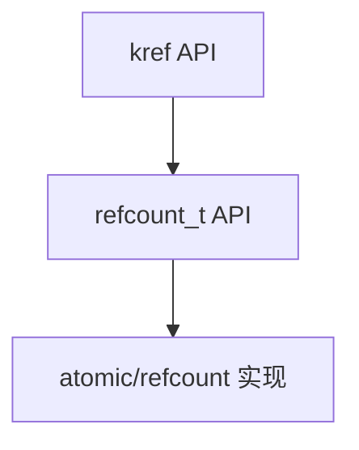

# 第5章\_基础\_API\_源码逐行讲解

## 5.1\_本章主线

普通 init/get/put/read 及条件取得的版本化函数体已集中到[源码总索引](../../../../research/source_reading/kref/navigation/P01_Linux_6.12_kref源码阅读索引.md#1.2_按问题进入已落地证据)及其唯一实现；本章保留调用者的参数、前提和应用判断。条件取得已核对比较重试与返回边界，锁组合仍按后续批次独立核对。

前面几章已经讲过：

```text
kref 是对象生命周期协议；
struct kref 嵌入自定义引用对象内部；
kref_init/get/put/release 构成生命周期状态机；
三条核心规则约束 get、put、lookup。
```

本章开始补完 `kref` 的基础 API。

但本章不再重复：

```text
struct kref 为什么嵌入对象内部
release 为什么要 container_of
kref 为什么不是锁
put 后为什么不能访问对象
lookup 为什么不能裸 get
```

这些已经在前 1-4 章讲过。

本章只回答 API 层面的几个问题：

```text
每个 API 的源码形态是什么？
它调用了 refcount_t 的哪个接口？
它的使用前提是什么？
它的返回值能不能忽略？
它适合普通路径，还是 lookup/锁组合路径？
```

本章主线是：

```text
kref API 很少，但每个 API 都有明确的生命周期语义和使用前提。
```

------

## 5.2\_kref\_API\_总览

`include/linux/kref.h` 里主要有这些接口：

```c
KREF_INIT(n)
kref_init()
kref_read()
kref_get()
kref_put()
kref_get_unless_zero()
kref_put_mutex()
kref_put_lock()
```

可以先按用途分组：

| API                      | 用途                              | 普通路径/特殊路径   |
| ------------------------ | --------------------------------- | ------------------- |
| `KREF_INIT(n)`           | 静态初始化                        | 初始化路径          |
| `kref_init()`            | 动态初始化为 1                    | 初始化路径          |
| `kref_read()`            | 读取当前引用计数                  | 调试/观察路径       |
| `kref_get()`             | 增加引用                          | 普通持有路径        |
| `kref_put()`             | 释放引用，归零时 release          | 普通释放路径        |
| `kref_get_unless_zero()` | 非 0 时尝试增加引用               | lookup/RCU/特殊路径 |
| `kref_put_mutex()`       | put 到 0 时持 mutex 调 release    | 锁组合路径          |
| `kref_put_lock()`        | put 到 0 时持 spinlock 调 release | 锁组合路径          |

从使用频率看，最常用的是：

```c
kref_init()
kref_get()
kref_put()
```

从错误风险看，最需要小心的是：

```c
kref_get_unless_zero()
kref_put_mutex()
kref_put_lock()
```

因为它们通常出现在 lookup、删除、最后释放、锁组合这类复杂路径中。

本章后面按职责重新归纳为几组：

| 分组 | API | 关注点 |
| --- | --- | --- |
| 初始化类 | `KREF_INIT(n)`、`kref_init()` | 初始引用从哪里来 |
| 观察类 | `kref_read()` | 只能观察，不能做生命周期判断 |
| 普通引用类 | `kref_get()`、`kref_put()` | 已有有效对象上的 get/put |
| 条件取得引用 | `kref_get_unless_zero()` | 返回值必须检查，仍需外部保护 |
| 锁组合释放 | `kref_put_mutex()`、`kref_put_lock()` | 最后 put 与锁语义配套 |
| 工程封装 | `my_refobj_get()`、`my_refobj_put()`、`lookup_get()` | 把引用规则收进对象接口 |

------

## 5.3\_kref\_API\_与\_refcount\_t\_的映射

虽然第 2 章已经讲过结构模型，这里为了读 API 源码，需要保留最小上下文。

源码形态可以理解为：

固定[计数成员定义](../../../../research/source_reading/kref/source_explanations/include/linux/kref.h.md#1.1_计数成员)仅保存 refcount_t，不保存回调或业务类型。

也就是说，`kref` 的 API 本质上是对 `refcount_t` 的封装：

```text
kref_init              -> refcount_set
kref_read              -> refcount_read
kref_get               -> refcount_inc
kref_put               -> refcount_dec_and_test
kref_get_unless_zero   -> refcount_inc_not_zero
kref_put_mutex         -> refcount_dec_and_mutex_lock
kref_put_lock          -> refcount_dec_and_lock
```

可以画成：


```mermaid
graph TD
	A["kref API"]
	B["refcount_t API"]
	C["atomic/refcount 实现"]

	A --> B
	B --> C
```

本章看源码时，要始终记住：

```text
kref 层表达对象生命周期语义；
refcount_t 层提供引用计数安全原语；
底层 atomic 层提供原子操作能力。
```

------

## 5.4\_初始化类\_API

初始化类 API 只解决一个问题：对象生命周期从哪个引用开始。静态对象用 `KREF_INIT(n)`，动态对象用 `kref_init()`。

### 5.4.1\_KREF\_INIT(n)

定义对象时使用 KREF_INIT 提供初始计数；固定宏体及三层展开见[唯一实现](../../../../research/source_reading/kref/source_explanations/include/linux/kref.h.md#1.6_定义对象时建立计数)。这里关注调用者应建立的责任。

```c
/* 静态对象的初始一份由模块持有，最终归还时不能 kfree 静态外壳。 */
static struct my_refobj global_refobj = {
    .ref = KREF_INIT(1),
};
```

示意中的 my_refobj 沿用本专题外层对象类型；可构建的完整定义见[P02 静态模块](P02_源码入口与结构定义.md#2.14.2_运行一个不释放静态内存的完整模块)。n 为 1 时要能指出初始持有者；其他正数也须逐份说明责任，不能把较大的初值当作“多留一点比较安全”。零不能成为普通 get 的活引用来源。

### 5.4.2\_KREF\_INIT(n)\_的使用前提

初始化形式和存储寿命分开判断。宏也可以用于函数内自动对象的定义，但不会让它越过作用域继续存在。静态存储要求符合常量初始化规则；函数内自动对象可在定义时用运行时整数填值。裸宏不是赋值右侧表达式，也不是已经发布对象的复活操作。

静态对象的最后 put 仍会同步调用 release。回调可以关闭资源、释放外壳所拥有的动态缓冲区或记录结束，但不能 `kfree(&global_refobj)`：这块存储并非动态分配器交给调用者的块。静态对象本身由其所属存储机制管理；例如模块静态数据在安全卸载模块时回收。

动态对象通常先成功分配、初始化业务字段，再用 `kref_init(&refobj->ref)` 建立初始一份，最后按外层同步协议发布。静态对象也要在归零前关闭入口并保证全部使用结束；计数为零后字节仍在，不等于可以再次取得引用。完整状态与归零观察见[P02 实验](P02_源码入口与结构定义.md#2.14.2_运行一个不释放静态内存的完整模块)。


### 5.4.3\_kref\_init()

普通初始化参数是对象内部的 struct kref 指针，把内部值设置为 1，创建者承担初始责任；不是向已有计数加一。固定函数签名、实现语句及调用上下文集中在[kref_init](../../../../research/source_reading/kref/source_explanations/include/linux/kref.h.md#1.2_建立初始引用)，下一小节从调用者角度检查初始化阶段。

### 5.4.4\_kref\_init()\_的使用前提

`kref_init()` 的前提非常严格：

```text
对象刚创建；
对象还没有发布；
对象还没有被其他路径看到；
对象还没有已有引用关系。
```

典型正确写法：

```c
struct my_refobj *my_refobj_alloc(void)
{
	struct my_refobj *refobj;

	refobj = kzalloc(sizeof(*refobj), GFP_KERNEL);
	if (!refobj)
		return NULL;

	kref_init(&refobj->ref);

	return refobj;
}
```

错误写法：

```c
void my_refobj_reset(struct my_refobj *refobj)
{
	kref_init(&refobj->ref);      /* 错：不能重置已有对象的引用计数 */
}
```

为什么错？

因为 `kref_init()` 是直接设置计数，不是“重新整理引用关系”。

如果对象当前有多个持有者：

```c
refcount = 3
```

突然调用：

```c
kref_init(&refobj->ref);
```

就会把引用计数强行改成 1。

这会破坏所有已有持有者的引用语义。

所以规则是：

```text
kref_init() 只用于新对象初始化，不用于旧对象 reset。
```

------

## 5.5\_观察类\_API\_kref\_read()

观察不会新增归还责任。[P02 快照实验](P02_源码入口与结构定义.md#2.17.1_运行快照与持有的对照程序)已经显示：保存在局部变量里的正数可以与对象已回收同时成立。本节只检查调用点如何使用这条边界。

### 5.5.1\_kref\_read()

接口接受 const struct kref 指针，返回下层当前无符号值，不修改计数也不取得引用。固定实现见[kref_read](../../../../research/source_reading/kref/source_explanations/include/linux/kref.h.md#1.5_读取快照不新增责任)。const 限制通过这个参数的修改，不阻止别的 CPU 更新；读取前仍要证明成员地址可访问。

### 5.5.2\_kref\_read()\_的正确用途

可以在已有引用或明确保护窗口内，把 read 用于调试日志、trace、泄漏线索和辅助告警。下面两条是调用片段：执行它们时当前路径仍持合法份额，尚未 put。

```c
/* 只记录瞬时计数，不改变当前持有责任。 */
pr_debug("refobj ref=%u\n", kref_read(&refobj->ref));
WARN_ON(kref_read(&refobj->ref) == 0);
```

告警只能辅助暴露协议被破坏的现象；如果地址本就悬空，WARN_ON 里的读取一样非法。两次读取也不构成同一份原子快照，日志值和随后的判断可能不同。

`if (kref_read(&refobj->ref) > 0) kref_get(&refobj->ref);` 把“观察大于零”和“增加”分成两步，中间可能有人完成最后归还。条件取得接口可在自己的原子操作里判定非零，但它仍要求计数地址有效，不能取代 lookup 保护。读到 1 也不自动获得业务字段独占权；同步借用者和允许新进入的容器都可能仍存在。

------

## 5.6\_普通引用\_API\_kref\_get()\_和\_kref\_put()

普通路径的输入是已有存活保证与明确责任，输出是责任增加或归还。接口不能从一个地址推断调用者属于哪个持有者；这份账本由外层代码建立。

### 5.6.1\_kref\_get()

普通 get 接受内部 kref 指针，转交引用增加且不返回成功标志。调用者先满足有效地址与正引用前提，再为独立使用追加份额；固定语句见[kref_get](../../../../research/source_reading/kref/source_explanations/include/linux/kref.h.md#1.3_为独立使用追加引用)。异常告警不是业务可依赖的失败分支。

### 5.6.2\_kref\_get()\_的使用前提

最直接的情形是当前路径尚持一份，或者新对象已经初始化且尚未发布，创建者仍持初始份额。集合锁也可能支持普通 get，但必须同时有“容器在成员可查找期间持一份，撤下及归还受同一协议控制”的证明；锁名本身不能保证计数为正。静态存储或延迟回收只证明地址尚在时，也不能据此普通 get 一个零计数对象。

```c
/* 调用者必须已证明地址与正引用；返回指针只是便于类型封装。 */
static struct my_refobj *my_refobj_get(struct my_refobj *refobj)
{
    kref_get(&refobj->ref);
    return refobj;
}
```

包装器不检查指针真假，也不自行保护查找。`lookup_without_lock(id)` 后直接调用它，仍可能在已结束的生命周期上增加。交付 worker 时要在发布之前预留，并按投递结果决定新增份额归谁；完整错误分支沿用[P01 工作模块](P01_kref_要解决什么问题.md#1.16.1_运行一次真实工作交付)，不能只复制 get 与 queue_work 两行并忽略重复投递或拒绝的返回值。

### 5.6.3\_kref\_get()\_为什么没有返回值

它不是尝试性取得接口；调用者承诺前提成立，函数增加一份并返回。固定 refcount 层仍可能检测零值增加或溢出并进入异常处理，这不表示 get 会用返回码帮业务恢复。饱和可能保守地泄漏，不能因此把错误调用当作成功建立了可用对象。

查找时若只建立了计数地址的保护窗口，还需条件取得并检查结果；外层锁或 RCU 的职责不能因换了 API 消失。普通 get 的无返回值是在强调调用前证明，而不是声明任何非空地址都能成功使用。

### 5.6.4\_kref\_put()

参数是要归还的内部 kref 指针和对象类型选择的 release 回调。固定实现见[kref_put](../../../../research/source_reading/kref/source_explanations/include/linux/kref.h.md#1.4_最后归还调用清理)：下层减并检测返回真才同步调用回调并返回 1，否则返回 0。正常非归零和异常饱和都可能进入后一分支。

### 5.6.5\_kref\_put()\_的\_release\_参数

回调类型为 `void (*release)(struct kref *kref)`。对本例由动态分配器取得的 my_refobj 外壳，可以这样封装；若它还拥有其他资源，应先按所有权清理：

```c
/* 此封装仅适用于动态分配、且无其他待清理资源的 my_refobj。 */
static void my_refobj_release(struct kref *ref)
{
    struct my_refobj *refobj = container_of(ref, struct my_refobj, ref);
    kfree(refobj);
}

static void my_refobj_put(struct my_refobj *refobj)
{
    kref_put(&refobj->ref, my_refobj_release);
}
```

不能直接把 kfree 作为回调。除了函数指针参数类型不同，kref 传入的是成员地址，而释放函数需要匹配分配器的对象起始地址；ref 位于首成员时地址偶合也不能成为普遍契约。静态外壳更不能照抄此清理方式，见[静态模块](P02_源码入口与结构定义.md#2.14.2_运行一个不释放静态内存的完整模块)。类型封装把正确回调与对象类型绑定，减少调用点选错清理策略的机会。

### 5.6.6\_kref\_put()\_的返回值

返回 1 表示本次已调用 release；返回 0 表示本次未调用。它适合在对象外记录事件，例如：

```c
/* 不在这个分支里读取已经归还责任的 refobj。 */
if (kref_put(&refobj->ref, my_refobj_release))
    pr_debug("release callback invoked\n");
```

`if (!kref_put(...)) refobj->state = 0;` 不能从返回 0 推导安全：本 CPU 归还后，另一个持有者可以立即完成最后 put，甚至早于本 CPU 从函数返回。返回 1 也不必然等于立即物理回收，回调可以按另外的协议延迟释放。若还要访问对象，必须指出另一份未归还的责任或确实阻止清理的保护；并发字段更新另行同步。

### 5.6.7\_kref\_put()\_的使用前提

当前路径必须对这份归还负责，来源可以是初始化的初始份额、先前增加、成功 lookup_get，或一次明确 handoff。仅仅接到借用指针不产生 put 权限；把指针复制到局部变量也不会多出一份责任。

检查函数出口时，为每个 put 写下它消耗哪一份，以及拒绝、提前失败、成功交付各由谁归还。例如预留 worker 份额后投递失败，由创建者收回预留；成功后由 worker 消耗那份。每个出口总能对上责任，比只数源码里 get 和 put 的行数更可靠。

### 5.6.8\_kref\_put()\_和\_refcount\_dec\_and\_test()

这里需要的是“本次原子减少是否完成最后一步”，不是“减少之后再观察某个时刻是不是零”。假设错误实现将原子减与独立读取拆开，两个 CPU 各持一份：

| 顺序 | CPU A | CPU B | 共享计数 |
| --- | --- | --- | --- |
| 1 | 原子减一 | 尚未执行 | 2→1 |
| 2 | 暂停 | 原子减一 | 1→0 |
| 3 | 独立读取，看到 0 | 暂停 | 0 |
| 4 | 准备清理 | 独立读取，也看到 0 | 0 |

两者都可能宣称“我是最后一个”，从而重复清理。若把判断放在减少之前，交错也可能使两者都错过最后清理资格。固定[减并检测实现](../../../../research/source_reading/kref/source_explanations/include/linux/refcount.h.md#1.3_旧值决定归零与异常分支)将结果绑定到自己的原子操作旧值：正常单份减少只有旧值为 1 的那次返回真，所以只由那条路径调用回调。此结论仍以责任合法、对象未被复用或随意重置为前提，不修复多 put 或悬空地址。

------

## 5.7\_条件取得引用\_kref\_get\_unless\_zero()

前章已经指出一种关键窗口：非拥有索引的查找锁可以保住存储，却不一定阻止其他路径在锁外把计数减到零。我们不能在此窗口盲目普通 get，也不能先 read 判断再分开增加；需要让“仍为非零”与“取得一份”在同一次原子更新条件中成立。

### 5.7.1\_kref\_get\_unless\_zero()

接口接受地址仍受保护的 struct kref 指针，返回尝试结果。正常计数非零时成功增加一份，零值时不增加并返回 0；不是先归零再把对象复活。唯一函数体见[kref 条件入口](../../../../research/source_reading/kref/source_explanations/include/linux/kref.h.md#1.7_有效地址上的条件取得)，函数协作见[条件模块](../../../../research/source_reading/kref/navigation/P03_条件取得与查找窗口导读.md#3.2_从观察到自己持有)。

取得过程中，最初读到的非零值只是尝试依据。固定下层使用比较交换：只有共享计数仍等于自己刚观察的值，才改成该值加一；否则取回新的值再判断。这使其他路径可以继续增减，不要求每次失败都重新从容器搜索，但对象的地址保护窗口必须始终存在。

“返回非零就成功取得”是正常有效协议下的调用契约。固定 refcount 的异常负值或溢出路径可能先进入饱和告警再返回非零；不能把返回值当成计数器健康检查，更不能以饱和泄漏替代对象身份、地址和业务前提。

### 5.7.2\_kref\_get\_unless\_zero()\_的使用场景

先不用内核对象，取一块始终有效的计数存储，观察四条路径：初始为零、正数不受干扰、观察后变零、观察后变成另一个正数。下面完整 [conditional_take.c](../../../../labs/kernel/object_lifetime/materials/conditional_take.c)使用 C11 原子比较交换；在第一次观察与更新之间显式安排另一个动作，便于稳定重现窗口。

NONE 表示无干扰，DROP_LAST 表示安排最后一份先归还到零，ADD_OWNER 表示安排其他路径把 1 增到 2。它们是测试选择，不是内核里的字段。atomic_uint 是 C11 原子无符号整数类型，UINT_MAX 是该整数的最大值；本模型只用小的正常数值，不实现 Linux 的有符号饱和算法。

```c
#include <assert.h>
#include <limits.h>
#include <stdbool.h>
#include <stdatomic.h>
#include <stdio.h>

enum interference { NONE, DROP_LAST, ADD_OWNER };

/* refs 本身始终在有效存储中；这里只模拟零/正数，不模拟内核饱和。 */
static bool try_take(atomic_uint *refs, enum interference event,
                     unsigned int *attempts)
{
    unsigned int old = atomic_load_explicit(refs, memory_order_relaxed);
    *attempts = 0;
    while (old != 0) {
        assert(old < UINT_MAX);
        if (*attempts == 0 && event != NONE) {
            /* 在第一次观察与比较之间，显式安排另一条路径先改变计数。 */
            atomic_store_explicit(refs, event == DROP_LAST ? 0u : 2u,
                                  memory_order_relaxed);
        }
        ++*attempts;
        if (atomic_compare_exchange_strong_explicit(refs, &old, old + 1,
                memory_order_relaxed, memory_order_relaxed))
            return true;
        /* 比较失败已把 old 更新为当前值，下一轮必须重新检查它是否为零。 */
    }
    return false;
}

int main(void)
{
    const unsigned int initial[] = {0, 1, 1, 1};
    const enum interference events[] = {NONE, NONE, DROP_LAST, ADD_OWNER};
    const unsigned int expected_count[] = {0, 2, 0, 3};
    const unsigned int expected_attempts[] = {0, 1, 1, 2};
    const bool expected_result[] = {false, true, false, true};
    for (unsigned int path = 0; path < 4; ++path) {
        atomic_uint refs;
        atomic_init(&refs, initial[path]);
        unsigned int attempts;
        bool taken = try_take(&refs, events[path], &attempts);
        unsigned int count = atomic_load_explicit(&refs, memory_order_relaxed);
        assert(taken == expected_result[path]);
        assert(count == expected_count[path]);
        assert(attempts == expected_attempts[path]);
        printf("path=%u taken=%u count=%u attempts=%u\n",
               path, taken ? 1u : 0u, count, attempts);
    }
    return 0;
}
```

在材料目录运行：

```bash
cc -std=c11 -Wall -Wextra -Werror -O2 conditional_take.c -o conditional_take
./conditional_take
```

| path | 读出后安排什么 | taken | 最终 count | 比较次数 | 原因 |
| --- | --- | --- | --- | --- | --- |
| 0 | 初始就是 0 | 0 | 0 | 0 | 零检查直接退出 |
| 1 | 初始 1，无干扰 | 1 | 2 | 1 | 比较命中，建立新份额 |
| 2 | 先读到 1，再变为 0 | 0 | 0 | 1 | 比较失败取回 0，下一轮退出 |
| 3 | 先读到 1，再变为 2 | 1 | 3 | 2 | 第一次失败取回 2，第二次从 2 增到 3 |

path 2 解释为什么“读到过正数”不是取得；path 3 解释为什么一次比较失败不等于引用已归零。比较失败更新 old 是循环能继续前进的关键；若一直沿用第一次观察值，会在计数改变后不停失败。真实并发竞争还可能使重试次数更多，本模型没有证明时间上界。

程序使用 relaxed 顺序，因为这里只研究计数条件，不用成功取得去发布业务数据。对象没有被分配或回收，计数存储始终有效；四条确定性轨迹不证明 UAF 已被解决，也不证明内核的原子指令或内存序。回到真实 lookup，成功才交付新责任，失败没有这份责任可 put，必须按未取得返回并退出原保护窗口。

可以先预测两个修改：将 path 3 的干扰值设为 4，成功后应为 5，仍需两次比较；将 path 2 的初值改为 0，干扰钩子不会执行，因为程序根本不进入比较。不要通过真的释放 refs 存储来“扩展”实验，那会破坏正在验证的前提。

### 5.7.3\_kref\_get\_unless\_zero()\_不解决裸指针有效性

上面的原子变量始终存在，因此比较交换可以合法访问它。内核对象中的 ref 不享有这种天然保证：如果 lookup 之后对象已经被回收，即使尝试“只在非零时增加”，第一步读取计数也已越界。

因此要先判断容器协议。在容器持有正引用且同锁撤下的方案里，锁内普通 get 通常已经足够；条件取得主要处理存储有效但零值仍可能出现的方案。若采用 RCU，需要对应的存储保留与身份协议，不只是把调用放进一对读侧 API。[P04 查找比较](P04_kref_三条核心规则.md#4.12_mutex/list_lookup_的最小模型)可用于选择入口，[P08](P08_lookup_场景与_kref_get_unless_zero%28%29.md)继续展开场景。

成功取得也不等于业务获准，前章 shutdown 后的旧读者已经展示这点。其后读取可变字段仍须遵守业务同步；固定条件链不是通用 acquire 发布读取接口，不能由“原子取得”推出所有初始化和字段变化都自动可见。

### 5.7.4\_must\_check\_的意义

__must_check 在受支持编译器中为忽略结果提供诊断，具体属性见[唯一讲解](../../../../research/source_reading/kref/source_explanations/include/linux/compiler_attributes.h.md#1.1_返回值诊断不是自动清理)。警告可能受工具链和构建选项影响；编译通过不等于调用者处理了失败，更不表示编译器会替你补 put。

在已经建立存储保护的窗口里，调用点至少要区分成功和失败，同时退出原保护。本例采用容器 mutex，非空候选已经在锁内找到，且回收须经同一把锁：

```c
/* 调用片段：持 refobj_list_lock 且已找到非空候选，锁内地址有效。 */
int taken = kref_get_unless_zero(&refobj->ref);
mutex_unlock(&refobj_list_lock);
return taken ? refobj : NULL;
```

成功由新份额覆盖解锁后的返回；失败没有取得责任，退出锁后只返回 NULL，不再解引用原候选。未命中的分支还须在外层函数中直接解锁返回空，RCU 包装器则按自己的读侧出口组织。类型、属性与返回值只是线索，最终必须看每条路径实际怎么结束。

------

## 5.8\_锁组合释放\_API

`kref_put_mutex()` 和 `kref_put_lock()` 都不是为了保护 refcount 本身，而是为了处理“最后 put + release + 集合关系”这类复合路径。

### 5.8.1\_kref\_put\_mutex()

`kref_put_mutex()` 是普通 `kref_put()` 的锁组合版本。

源码形态可以理解为：

```c
static inline int kref_put_mutex(struct kref *kref,
				 void (*release)(struct kref *kref),
				 struct mutex *lock)
{
	if (refcount_dec_and_mutex_lock(&kref->refcount, lock)) {
		release(kref);
		return 1;
	}

	return 0;
}
```

它的语义是：

```text
引用计数减 1；
如果减到 0，则获取 mutex；
在持有 mutex 的状态下调用 release；
然后返回 1。
```

如果不是最后一个引用：

```text
不调用 release；
通常也不会持锁进入 release；
返回 0。
```

这个 API 不是为了保护引用计数本身。

引用计数本身由 `refcount_t` 原子语义保护。

它真正服务的是复合场景：

```text
最后一个 put
从全局结构删除
release 销毁对象
```

这些操作可能需要在同一把 mutex 下完成。


### 5.8.2\_kref\_put\_mutex()\_的典型用途

假设对象挂在某个由 mutex 保护的集合中：

```c
static DEFINE_MUTEX(refobj_list_lock);
static LIST_HEAD(refobj_list);
```

对象释放时需要和这个集合关系配合。

`kref_put_mutex()` 可以用于：

```c
if (kref_put_mutex(&refobj->ref, my_refobj_release, &refobj_list_lock))
	return;
```

这里的含义不是：

```text
mutex 保护 refcount。
```

而是：

```text
如果当前 put 是最后一个引用，
则在持有 refobj_list_lock 的情况下执行 release。
```

这对 release 有额外要求：

```text
release 被调用时 lock 已经持有。
```

所以 release 必须知道这个事实。

例如 release 里可能要：

```c
static void my_refobj_release(struct kref *ref)
{
	struct my_refobj *refobj = container_of(ref, struct my_refobj, ref);

	list_del(&refobj->node);
	mutex_unlock(&refobj_list_lock);

	kfree(refobj);
}
```

这里只是展示语义，实际写法要特别小心锁平衡。

第 9 章会专门展开 `kref_put_mutex()` 的正确模板。

本章只先记住：

```text
kref_put_mutex() 会在最后引用释放时持 mutex 调 release。
```


### 5.8.3\_kref\_put\_lock()

`kref_put_lock()` 是 spinlock 版本。

源码形态可以理解为：

```c
static inline int kref_put_lock(struct kref *kref,
				void (*release)(struct kref *kref),
				spinlock_t *lock)
{
	if (refcount_dec_and_lock(&kref->refcount, lock)) {
		release(kref);
		return 1;
	}

	return 0;
}
```

它的语义是：

```text
引用计数减 1；
如果减到 0，则获取 spinlock；
在持有 spinlock 的状态下调用 release；
然后返回 1。
```

这通常用于：

```text
不能睡眠的上下文
spinlock 保护的集合
短临界区删除
最后 put 和脱链需要组合的路径
```

但它比 `kref_put_mutex()` 更需要谨慎。

因为 release 在 spinlock 持有状态下运行。

这意味着 release 里不能做可能睡眠的操作，例如：

```text
mutex_lock
schedule
可能睡眠的内存分配
等待 completion
cancel_work_sync
某些阻塞式资源释放
```

所以使用 `kref_put_lock()` 时必须检查：

```text
release 是否会睡眠？
release 是否会调用可能睡眠的函数？
release 是否会再拿其他锁？
锁顺序是否安全？
```

详细模型放到第 9 章。


### 5.8.4\_kref\_put\_mutex/kref\_put\_lock\_的共同边界

这两个 API 的共同点：

```text
它们都不是为了保护 refcount 自身；
它们是为了保护“最后 put + release”这个复合过程。
```

区别是：

| API                | 使用锁           | release 上下文                                              |
| ------------------ | ---------------- | ----------------------------------------------------------- |
| `kref_put_mutex()` | `struct mutex *` | release 在 mutex 持有状态下执行，可能允许睡眠取决于具体设计 |
| `kref_put_lock()`  | `spinlock_t *`   | release 在 spinlock 持有状态下执行，不能睡眠                |

使用这两个 API 时，release 函数必须和锁语义配套。

不能把普通 release 直接拿来用，而不检查里面做了什么。

例如普通 release：

```c
static void my_refobj_release(struct kref *ref)
{
	struct my_refobj *refobj = container_of(ref, struct my_refobj, ref);

	cancel_work_sync(&refobj->work);
	kfree(refobj);
}
```

如果它被 `kref_put_lock()` 调用，就可能出问题。

因为 `cancel_work_sync()` 可能睡眠，不能在 spinlock 持有状态下调用。

------

## 5.9\_API\_使用前提总表

| API                      | 做什么                         | 使用前提                         | 返回值             |
| ------------------------ | ------------------------------ | -------------------------------- | ------------------ |
| `KREF_INIT(n)`           | 静态初始化                     | 能解释 n 个引用的归属            | 无                 |
| `kref_init()`            | 设置初始引用为 1               | 新对象，未发布，未被其他路径持有 | 无                 |
| `kref_read()`            | 读取计数                       | 仅用于观察，不作为安全判断       | 当前计数           |
| `kref_get()`             | 增加引用                       | 对象已被证明有效                 | 无                 |
| `kref_put()`             | 释放引用，归零 release         | 当前路径确实持有引用             | 1 表示本次 release |
| `kref_get_unless_zero()` | 非 0 时尝试 get                | refobj 指针本身仍需锁/RCU保护       | 必须检查           |
| `kref_put_mutex()`       | 最后 put 时持 mutex release    | release 知道锁语义               | 1 表示本次 release |
| `kref_put_lock()`        | 最后 put 时持 spinlock release | release 不得睡眠                 | 1 表示本次 release |

------

## 5.10\_API\_封装模板

工程代码里通常不建议到处裸写 kref API，而是让对象类型自己提供 get/put/lookup_get 封装。

### 5.10.1\_裸\_kref\_私有对象的\_API\_封装模板

工程上不要到处裸写：

```c
kref_get(&refobj->ref);
kref_put(&refobj->ref, my_refobj_release);
```

更推荐封装：

```c
struct my_refobj {
	struct kref ref;
	int state;
};

static void my_refobj_release(struct kref *ref)
{
	struct my_refobj *refobj;

	refobj = container_of(ref, struct my_refobj, ref);

	kfree(refobj);
}

static void my_refobj_init(struct my_refobj *refobj)
{
	kref_init(&refobj->ref);
}

static struct my_refobj *my_refobj_get(struct my_refobj *refobj)
{
	kref_get(&refobj->ref);
	return refobj;
}

static void my_refobj_put(struct my_refobj *refobj)
{
	kref_put(&refobj->ref, my_refobj_release);
}
```

这样做的好处是：

```text
release 函数集中在一个地方；
调用点不容易传错 release；
以后可以加 trace/WARN_ON/debug；
对象生命周期接口更清楚。
```

例如可以扩展：

```c
static struct my_refobj *my_refobj_get(struct my_refobj *refobj)
{
	WARN_ON(!refobj);

	kref_get(&refobj->ref);
	return refobj;
}
```

或者：

```c
static void my_refobj_put(struct my_refobj *refobj)
{
	if (!refobj)
		return;

	kref_put(&refobj->ref, my_refobj_release);
}
```

是否允许 `NULL`，由具体工程风格决定。


### 5.10.2\_lookup\_场景的封装模板

如果对象需要从容器中查找，建议封装成：

```c
static struct my_refobj *my_refobj_lookup_get(int id)
{
	struct my_refobj *refobj;

	mutex_lock(&refobj_list_lock);

	list_for_each_entry(refobj, &refobj_list, node) {
		if (refobj->id == id) {
			kref_get(&refobj->ref);
			mutex_unlock(&refobj_list_lock);
			return refobj;
		}
	}

	mutex_unlock(&refobj_list_lock);
	return NULL;
}
```

调用者只看到：

```c
refobj = my_refobj_lookup_get(id);
if (!refobj)
	return -ENOENT;

/* 使用 refobj */

my_refobj_put(refobj);
```

这比让调用者自己写：

```c
refobj = lookup(id);
kref_get(&refobj->ref);
```

更安全。

因为查找和取得引用的保护规则被封装在对象内部。

第 8 章会展开更复杂的 `kref_get_unless_zero()`、RCU、hash/xarray 模型。

------

## 5.11\_API\_和核心规则的对应关系

第 4 章的三条规则，可以直接映射到本章 API。

| 规则                    | 常用 API                                | 说明                         |
| ----------------------- | --------------------------------------- | ---------------------------- |
| 非临时拷贝前先 get      | `kref_get()`                            | 给新持有者增加引用           |
| 使用完必须 put          | `kref_put()`                            | 释放当前持有者引用           |
| lookup + get 必须被保护 | `kref_get()` / `kref_get_unless_zero()` | 在保护下把裸指针变成有效引用 |
| 最后 put 和锁组合       | `kref_put_mutex()` / `kref_put_lock()`  | 处理最后释放与集合关系       |
| 调试观察                | `kref_read()`                           | 只能观察，不能当生命周期判断 |

可以这样理解：

```text
普通共享路径：kref_get + kref_put
lookup 路径：锁/RCU + kref_get 或 kref_get_unless_zero
删除释放路径：kref_put 或 kref_put_mutex/kref_put_lock
调试路径：kref_read
初始化路径：KREF_INIT/kref_init
```

------

## 5.12\_refcount\_t\_与\_kref\_的边界

这一组内容只保留 API 使用者需要知道的底层边界：refcount_t 保证引用计数安全，但不把自定义引用对象变成并发安全对象。

### 5.12.1\_refcount\_t\_内存序只讲到够用

`kref` 底层使用 `refcount_t`，而 `refcount_t` 不是普通整数。

对 `kref` 使用者来说，不需要在本章展开所有内存序细节。

只需要先掌握几个够用结论：

```text
1. 引用计数增减是原子化的。
2. refcount_t 会防护某些溢出、下溢、UAF 型误用。
3. 最后一个 put 到 release/free 之间有必要的顺序保证。
4. 这些顺序保证不能替代业务锁。
```

尤其最后一点很重要。

不能因为 `kref_put()` 底层有内存序语义，就认为：

```text
对象字段访问天然同步。
```

字段一致性仍然由：

```text
mutex
spinlock
RCU
atomic
状态机
```

负责。

本章只需要知道：

```text
kref 的 refcount_t 保证引用计数作为生命周期触发点是可靠的；
但它不把对象变成并发安全对象。
```


### 5.12.2\_不要绕过\_kref\_直接操作\_refcount

因为 `struct kref` 内部就是 `refcount_t`，所以技术上你可能能写：

```c
refcount_inc(&refobj->ref.refcount);
refcount_dec_and_test(&refobj->ref.refcount);
```

但不建议业务代码这么做。

原因是：

```text
绕过 kref 会破坏对象生命周期接口的一致性；
调用点可能跳过 release；
调用点可能绕过 my_refobj_get/my_refobj_put 封装；
代码审查时更难判断引用归属。
```

正确做法是：

```c
my_refobj_get(refobj);
my_refobj_put(refobj);
```

或者至少：

```c
kref_get(&refobj->ref);
kref_put(&refobj->ref, my_refobj_release);
```

不要混用：

```c
kref_get(&refobj->ref);
refcount_dec_and_test(&refobj->ref.refcount);
```

这种代码会让生命周期协议失去统一入口。

------

## 5.13\_常见\_API\_误用清单

### 5.13.1\_误用\_1\_把\_kref\_init\_当\_reset

```c
kref_init(&refobj->ref);      /* 错：旧对象不能这样重置 */
```

正确理解：

```text
kref_init 只用于新对象初始化。
```


### 5.13.2\_误用\_2\_用\_kref\_read\_判断对象是否可\_get

```c
if (kref_read(&refobj->ref) > 0)
	kref_get(&refobj->ref);      /* 错 */
```

正确方向：

```text
使用锁/RCU 保护 lookup；
必要时使用 kref_get_unless_zero()。
```


### 5.13.3\_误用\_3\_忽略\_kref\_get\_unless\_zero\_返回值

```c
kref_get_unless_zero(&refobj->ref);
return refobj;                /* 错 */
```

正确：

```c
if (!kref_get_unless_zero(&refobj->ref))
	return NULL;

return refobj;
```


### 5.13.4\_误用\_4\_put\_后继续使用返回值判断对象安全

```c
if (!kref_put(&refobj->ref, my_refobj_release))
	refobj->state = 1;          /* 错 */
```

正确：

```text
需要访问的字段在 put 前完成；
put 后不再使用 refobj。
```


### 5.13.5\_误用\_5\_普通\_release\_用在\_kref\_put\_lock

```c
kref_put_lock(&refobj->ref, my_refobj_release, &lock);
```

但 `my_refobj_release()` 里：

```c
cancel_work_sync(&refobj->work);     /* 可能睡眠 */
```

这就可能出问题。

正确方向：

```text
确认 release 在 spinlock 持有状态下不会睡眠；
或者不要使用 kref_put_lock。
```

------

## 5.14\_本章\_API\_速记

可以把 API 压缩成下面几句话：

```text
KREF_INIT(n)：静态对象初始化引用计数。
kref_init()：动态对象创建初始引用，值为 1。
kref_read()：读当前计数，只适合观察。
kref_get()：已有有效对象上增加引用。
kref_put()：释放当前引用，归零时 release。
kref_get_unless_zero()：非 0 时尝试取得引用，返回值必须检查。
kref_put_mutex()：最后 put 时持 mutex 调 release。
kref_put_lock()：最后 put 时持 spinlock 调 release。
```

再压缩一点：

```text
init 建立初始引用；
get 增加持有者；
put 释放持有者；
unless_zero 用于尝试取得引用；
put_mutex/put_lock 用于最后释放与锁组合。
```

------

## 5.15\_本章小结

本章补完了 `kref` 基础 API 的源码形态和使用前提。

核心接口关系是：

```text
kref_init              -> refcount_set(..., 1)
kref_read              -> refcount_read()
kref_get               -> refcount_inc()
kref_put               -> refcount_dec_and_test()
kref_get_unless_zero   -> refcount_inc_not_zero()
kref_put_mutex         -> refcount_dec_and_mutex_lock()
kref_put_lock          -> refcount_dec_and_lock()
```

最重要的几个结论：

```text
1. kref_init() 只用于新对象初始化，不能用于 reset。
2. kref_read() 只能观察，不能作为生命周期判断。
3. kref_get() 没有返回值，因为它要求调用者已经证明对象有效。
4. kref_put() 返回 1 只表示本次触发 release，返回 0 也不能继续访问对象。
5. kref_get_unless_zero() 返回值必须检查，但它不证明裸指针有效。
6. kref_put_mutex()/kref_put_lock() 是最后 put 与锁组合的特殊接口。
7. release 是否能在持锁状态下运行，必须由调用者和 release 共同保证。
8. 业务代码最好封装 my_refobj_get()/my_refobj_put()，不要到处裸操作 kref。
```

本章最关键的一句话是：

```text
kref API 的表面动作是 refcount 加减，真正约束是每个 API 的使用前提。
```

下一章进入：

```text
第 6 章：release 回调与复杂销毁模式
```

重点不再讲基础模板，而是展开：

```text
release 里释放哪些子资源；
release 前是否必须脱链；
release 是否能睡眠；
release 和 work/timer/callback 如何收尾；
release 和 RCU 延迟释放如何配合。
```

------

专题导航：[kref 引用计数机制章节大纲](大纲.md)。

上一篇：[kref 三条核心规则](P04_kref_三条核心规则.md#4.20_本章小结)。

下一篇：[release 回调与复杂销毁模式](P06_release_回调与复杂销毁模式.md)。
