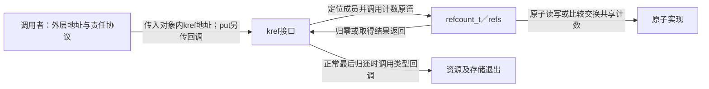
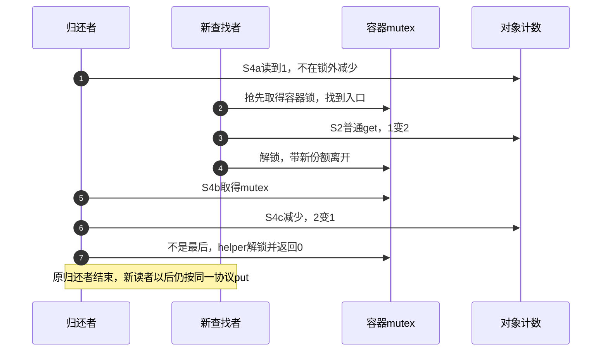
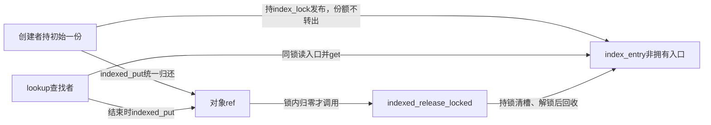

# 第5章\_基础\_API\_源码逐行讲解

## 5.1\_本章主线

前四章已经能为一份引用写出取得、交付和归还责任。现在进一步检查调用点：同样是对象指针，为什么有时可以普通 get，有时只能条件取得；同样是 put，为什么有的回调不带锁，有的却必须接管一把锁？答案藏在每个接口的前提、返回值和状态副作用中。

本章以调用者的选择为主线，普通计数、初始化与类型嵌入沿用前章结论。条件取得和锁组合各有完整实验，分别观察“比较失败以后怎么办”和“最后候选取锁后为何还要重查”。版本化函数体统一从[源码总索引](../../../../research/source_reading/kref/navigation/P01_Linux_6.12_kref源码阅读索引.md#1.2_按问题进入已落地证据)进入唯一实现，正文不另维护一套上游函数副本。

学完这一章，应能在写下 API 名之前说明：参数指向的存储为何有效，当前路径负责哪一份，失败时有没有获得责任，最后回调由谁执行，以及锁最终由谁归还。

------

## 5.2\_kref\_API\_总览

先沿一个对象从定义到退出的过程回查接口，再按用途分组。KREF_INIT 是初始化器宏，其余列出的名称是函数；下面不把初始化写法和对象存储期绑成“静态/动态”的一一对应。

| 当前问题 | 接口 | 要保留的前提 |
| --- | --- | --- |
| 定义对象时怎样写初值 | KREF_INIT(n) | n 对应真实初始责任，符合所处存储期的初始化规则 |
| 私有创建阶段怎样建立初始一份 | kref_init | 设置为 1，不是向旧计数增加一份 |
| 怎样观察当前数值 | kref_read | 先保护计数地址，观察本身不新增引用 |
| 已有正引用保证时怎样新增一份 | kref_get | 不能从不受保护的裸指针开始 |
| 一份责任结束时怎样归还 | kref_put | 类型回调与资源归属、上下文匹配 |
| 地址有效但可能已归零时怎样尝试取得 | kref_get_unless_zero | 检查失败，保留完整查找窗口 |
| 最终减少怎样与容器锁串行化 | kref_put_mutex、kref_put_lock | 可能最后时先取锁再减少，回调接管锁退出 |

前三种分别是初始化和观察，普通 get/put 处理已有责任下的增减；条件取得与锁组合处理额外的查找/归零约束。工程封装再把这些动作绑定到对象类型，例如 create、get、put、lookup_get。分组的目的在于选择协议，不是让所有对象把每个接口都用一遍。

------

## 5.3\_kref\_API\_与\_refcount\_t\_的映射

对象内部的 ref 保存一个 refcount_t，后者再保存原子计数。kref 不在成员里保存回调；归还者把类型回调作为本次参数传入。具体字段见[计数成员](../../../../research/source_reading/kref/source_explanations/include/linux/kref.h.md#1.1_计数成员)。

| kref 层入口 | 当前固定版本下层动作 |
| --- | --- |
| kref_init | refcount_set，将值设为 1 |
| kref_read | refcount_read，返回快照 |
| kref_get | refcount_inc，普通增加 |
| kref_put | refcount_dec_and_test，真时调用参数 release |
| kref_get_unless_zero | refcount_inc_not_zero，向上返回尝试结果 |
| kref_put_mutex | refcount_dec_and_mutex_lock，真时持锁调用 release |
| kref_put_lock | refcount_dec_and_lock，真时持锁调用 release |


```mermaid
flowchart LR
    U["调用者：外层地址与责任协议"] -->|"传入对象内kref地址；put另传回调"| K["kref接口"]
    K -->|"定位成员并调用计数原语"| R["refcount_t／refs"]
    R -->|"原子读写或比较交换共享计数"| A["原子实现"]
    R -->|"归零或取得结果返回"| K
    K -->|"正常最后归还时调用类型回调"| F["资源及存储退出"]
```

这条链只说明分工。底层原子保证相应计数更新，refcount 增加引用计数相关的检查与顺序契约，kref 将正常归零接到类型回调；它们都不自动知道对象正被哪些用户持有，也不替调用者维护业务字段和发布入口。

------

## 5.4\_初始化类\_API

初始化类 API 决定初始责任如何建立：定义时可使用初始化器，私有准备阶段可调用设置函数；对象存储期及清理策略另行判断。

### 5.4.1\_KREF\_INIT(n)

定义对象时使用 KREF_INIT 提供初始计数；固定宏体及三层展开见[唯一实现](../../../../research/source_reading/kref/source_explanations/include/linux/kref.h.md#1.6_定义对象时建立计数)。这里关注调用者应建立的责任。

```c
/* 静态对象的初始一份由模块持有，最终归还时不能 kfree 静态外壳。 */
static struct my_refobj global_refobj = {
    .ref = KREF_INIT(1),
};
```

示意中的 my_refobj 沿用本专题外层对象类型；可构建的完整定义见[P02 静态模块](P02_源码入口与结构定义.md#2.14.2_运行一个不释放静态内存的完整模块)。n 为 1 时要能指出初始持有者；其他正数也须逐份说明责任，不能把较大的初值当作“多留一点比较安全”。零不能成为普通 get 的活引用来源。

### 5.4.2\_KREF\_INIT(n)\_的使用前提

初始化形式和存储寿命分开判断。宏也可以用于函数内自动对象的定义，但不会让它越过作用域继续存在。静态存储要求符合常量初始化规则；函数内自动对象可在定义时用运行时整数填值。裸宏不是赋值右侧表达式，也不是已经发布对象的复活操作。

静态对象的最后 put 仍会同步调用 release。回调可以关闭资源、释放外壳所拥有的动态缓冲区或记录结束，但不能 `kfree(&global_refobj)`：这块存储并非动态分配器交给调用者的块。静态对象本身由其所属存储机制管理；例如模块静态数据在安全卸载模块时回收。

动态对象通常先成功分配、初始化业务字段，再用 `kref_init(&refobj->ref)` 建立初始一份，最后按外层同步协议发布。静态对象也要在归零前关闭入口并保证全部使用结束；计数为零后字节仍在，不等于可以再次取得引用。完整状态与归零观察见[P02 实验](P02_源码入口与结构定义.md#2.14.2_运行一个不释放静态内存的完整模块)。


### 5.4.3\_kref\_init()

普通初始化参数是对象内部的 struct kref 指针，把内部值设置为 1，创建者承担初始责任；不是向已有计数加一。固定函数签名、实现语句及调用上下文集中在[kref_init](../../../../research/source_reading/kref/source_explanations/include/linux/kref.h.md#1.2_建立初始引用)，下一小节从调用者角度检查初始化阶段。

### 5.4.4\_kref\_init()\_的使用前提

初始化发生在一个新生命周期的私有准备阶段：存储已经取得，旧周期已经结束，没有并发使用者还按旧责任访问，也尚未把这个新对象发布出去。它既可以用于新分配的外壳，也不因外壳具有静态存储期就自动不适用；关键是初始化权限和生命周期边界。

以[P02 完整对象模块](P02_源码入口与结构定义.md#2.19_标准自定义引用对象模板)为例，外壳分配成功后先 init 建立初始一份，再申请 data；第二步失败时可通过类型 put 清理部分初始化对象。这个安排要求回调能够处理 data 尚未成功的状态。另一种创建协议可以在全部资源准备好之后才 init，失败时直接按已取得资源逆序清理。二者不能混用到某条分支既没有引用却调用 put，或已经有初始份额却遗忘归还。

原来的 reset 反例仍然成立：A/B/C 各持一份时重新 init 把数值从 3 覆盖成 1，三份外部责任没有消失，下一次正常 put 就可能过早回收。业务 reset 应处理业务状态；若要复用对象池内存，应先证明旧访问、旧入口和旧身份均已退出，再建立新周期。

------

## 5.5\_观察类\_API\_kref\_read()

观察不会新增归还责任。[P02 快照实验](P02_源码入口与结构定义.md#2.17.1_运行快照与持有的对照程序)已经显示：保存在局部变量里的正数可以与对象已回收同时成立。本节只检查调用点如何使用这条边界。

### 5.5.1\_kref\_read()

接口接受 const struct kref 指针，返回下层当前无符号值，不修改计数也不取得引用。固定实现见[kref_read](../../../../research/source_reading/kref/source_explanations/include/linux/kref.h.md#1.5_读取快照不新增责任)。const 限制通过这个参数的修改，不阻止别的 CPU 更新；读取前仍要证明成员地址可访问。

### 5.5.2\_kref\_read()\_的正确用途

可以在已有引用或明确保护窗口内，把 read 用于调试日志、trace、泄漏线索和辅助告警。下面两条是调用片段：执行它们时当前路径仍持合法份额，尚未 put。

```c
/* 只记录瞬时计数，不改变当前持有责任。 */
pr_debug("refobj ref=%u\n", kref_read(&refobj->ref));
WARN_ON(kref_read(&refobj->ref) == 0);
```

告警只能辅助暴露协议被破坏的现象；如果地址本就悬空，WARN_ON 里的读取一样非法。两次读取也不构成同一份原子快照，日志值和随后的判断可能不同。

`if (kref_read(&refobj->ref) > 0) kref_get(&refobj->ref);` 把“观察大于零”和“增加”分成两步，中间可能有人完成最后归还。条件取得接口可在自己的原子操作里判定非零，但它仍要求计数地址有效，不能取代 lookup 保护。读到 1 也不自动获得业务字段独占权；同步借用者和允许新进入的容器都可能仍存在。

------

## 5.6\_普通引用\_API\_kref\_get()\_和\_kref\_put()

普通路径的输入是已有存活保证与明确责任，输出是责任增加或归还。接口不能从一个地址推断调用者属于哪个持有者；这份账本由外层代码建立。

### 5.6.1\_kref\_get()

普通 get 接受内部 kref 指针，转交引用增加且不返回成功标志。调用者先满足有效地址与正引用前提，再为独立使用追加份额；固定语句见[kref_get](../../../../research/source_reading/kref/source_explanations/include/linux/kref.h.md#1.3_为独立使用追加引用)。异常告警不是业务可依赖的失败分支。

### 5.6.2\_kref\_get()\_的使用前提

最直接的情形是当前路径尚持一份，或者新对象已经初始化且尚未发布，创建者仍持初始份额。集合锁也可能支持普通 get，但必须同时有“容器在成员可查找期间持一份，撤下及归还受同一协议控制”的证明；另一种方案让所有最终归零也与查找使用同一把锁，正如本章锁组合实例。锁名本身不能保证计数为正。静态存储或延迟回收只证明地址尚在时，也不能据此普通 get 一个零计数对象。

```c
/* 调用者必须已证明地址与正引用；返回指针只是便于类型封装。 */
static struct my_refobj *my_refobj_get(struct my_refobj *refobj)
{
    kref_get(&refobj->ref);
    return refobj;
}
```

包装器不检查指针真假，也不自行保护查找。`lookup_without_lock(id)` 后直接调用它，仍可能在已结束的生命周期上增加。交付 worker 时要在发布之前预留，并按投递结果决定新增份额归谁；完整错误分支沿用[P01 工作模块](P01_kref_要解决什么问题.md#1.16.1_运行一次真实工作交付)，不能只复制 get 与 queue_work 两行并忽略重复投递或拒绝的返回值。

### 5.6.3\_kref\_get()\_为什么没有返回值

它不是尝试性取得接口；调用者承诺前提成立，函数增加一份并返回。固定 refcount 层仍可能检测零值增加或溢出并进入异常处理，这不表示 get 会用返回码帮业务恢复。饱和可能保守地泄漏，不能因此把错误调用当作成功建立了可用对象。

查找时若只建立了计数地址的保护窗口，还需条件取得并检查结果；外层锁或 RCU 的职责不能因换了 API 消失。普通 get 的无返回值是在强调调用前证明，而不是声明任何非空地址都能成功使用。

### 5.6.4\_kref\_put()

参数是要归还的内部 kref 指针和对象类型选择的 release 回调。固定实现见[kref_put](../../../../research/source_reading/kref/source_explanations/include/linux/kref.h.md#1.4_最后归还调用清理)：下层减并检测返回真才同步调用回调并返回 1，否则返回 0。正常非归零和异常饱和都可能进入后一分支。

### 5.6.5\_kref\_put()\_的\_release\_参数

回调类型为 `void (*release)(struct kref *kref)`。对本例由动态分配器取得的 my_refobj 外壳，可以这样封装；若它还拥有其他资源，应先按所有权清理：

```c
/* 此封装仅适用于动态分配、且无其他待清理资源的 my_refobj。 */
static void my_refobj_release(struct kref *ref)
{
    struct my_refobj *refobj = container_of(ref, struct my_refobj, ref);
    kfree(refobj);
}

static void my_refobj_put(struct my_refobj *refobj)
{
    kref_put(&refobj->ref, my_refobj_release);
}
```

不能直接把 kfree 作为回调。除了函数指针参数类型不同，kref 传入的是成员地址，而释放函数需要匹配分配器的对象起始地址；ref 位于首成员时地址偶合也不能成为普遍契约。静态外壳更不能照抄此清理方式，见[静态模块](P02_源码入口与结构定义.md#2.14.2_运行一个不释放静态内存的完整模块)。类型封装把正确回调与对象类型绑定，减少调用点选错清理策略的机会。

### 5.6.6\_kref\_put()\_的返回值

返回 1 表示本次已调用 release；返回 0 表示本次未调用。它适合在对象外记录事件，例如：

```c
/* 不在这个分支里读取已经归还责任的 refobj。 */
if (kref_put(&refobj->ref, my_refobj_release))
    pr_debug("release callback invoked\n");
```

`if (!kref_put(...)) refobj->state = 0;` 不能从返回 0 推导安全：本 CPU 归还后，另一个持有者可以立即完成最后 put，甚至早于本 CPU 从函数返回。返回 1 也不必然等于立即物理回收，回调可以按另外的协议延迟释放。若还要访问对象，必须指出另一份未归还的责任或确实阻止清理的保护；并发字段更新另行同步。

### 5.6.7\_kref\_put()\_的使用前提

当前路径必须对这份归还负责，来源可以是初始化的初始份额、先前增加、成功 lookup_get，或一次明确 handoff。仅仅接到借用指针不产生 put 权限；把指针复制到局部变量也不会多出一份责任。

检查函数出口时，为每个 put 写下它消耗哪一份，以及拒绝、提前失败、成功交付各由谁归还。例如预留 worker 份额后投递失败，由创建者收回预留；成功后由 worker 消耗那份。每个出口总能对上责任，比只数源码里 get 和 put 的行数更可靠。

### 5.6.8\_kref\_put()\_和\_refcount\_dec\_and\_test()

这里需要的是“本次原子减少是否完成最后一步”，不是“减少之后再观察某个时刻是不是零”。假设错误实现将原子减与独立读取拆开，两个 CPU 各持一份：

| 顺序 | CPU A | CPU B | 共享计数 |
| --- | --- | --- | --- |
| 1 | 原子减一 | 尚未执行 | 2→1 |
| 2 | 暂停 | 原子减一 | 1→0 |
| 3 | 独立读取，看到 0 | 暂停 | 0 |
| 4 | 准备清理 | 独立读取，也看到 0 | 0 |

两者都可能宣称“我是最后一个”，从而重复清理。若把判断放在减少之前，交错也可能使两者都错过最后清理资格。固定[减并检测实现](../../../../research/source_reading/kref/source_explanations/include/linux/refcount.h.md#1.3_旧值决定归零与异常分支)将结果绑定到自己的原子操作旧值：正常单份减少只有旧值为 1 的那次返回真，所以只由那条路径调用回调。此结论仍以责任合法、对象未被复用或随意重置为前提，不修复多 put 或悬空地址。

------

## 5.7\_条件取得引用\_kref\_get\_unless\_zero()

前章已经指出一种关键窗口：非拥有索引的查找锁可以保住存储，却不一定阻止其他路径在锁外把计数减到零。我们不能在此窗口盲目普通 get，也不能先 read 判断再分开增加；需要让“仍为非零”与“取得一份”在同一次原子更新条件中成立。

### 5.7.1\_kref\_get\_unless\_zero()

接口接受地址仍受保护的 struct kref 指针，返回尝试结果。正常计数非零时成功增加一份，零值时不增加并返回 0；不是先归零再把对象复活。唯一函数体见[kref 条件入口](../../../../research/source_reading/kref/source_explanations/include/linux/kref.h.md#1.7_有效地址上的条件取得)，函数协作见[条件模块](../../../../research/source_reading/kref/navigation/P03_条件取得与查找窗口导读.md#3.2_从观察到自己持有)。

取得过程中，最初读到的非零值只是尝试依据。固定下层使用比较交换：只有共享计数仍等于自己刚观察的值，才改成该值加一；否则取回新的值再判断。这使其他路径可以继续增减，不要求每次失败都重新从容器搜索，但对象的地址保护窗口必须始终存在。

“返回非零就成功取得”是正常有效协议下的调用契约。固定 refcount 的异常负值或溢出路径可能先进入饱和告警再返回非零；不能把返回值当成计数器健康检查，更不能以饱和泄漏替代对象身份、地址和业务前提。

### 5.7.2\_kref\_get\_unless\_zero()\_的使用场景

先不用内核对象，取一块始终有效的计数存储，观察四条路径：初始为零、正数不受干扰、观察后变零、观察后变成另一个正数。下面完整 [conditional_take.c](../../../../labs/kernel/object_lifetime/materials/conditional_take.c)使用 C11 原子比较交换；在第一次观察与更新之间显式安排另一个动作，便于稳定重现窗口。

NONE 表示无干扰，DROP_LAST 表示安排最后一份先归还到零，ADD_OWNER 表示安排其他路径把 1 增到 2。它们是测试选择，不是内核里的字段。atomic_uint 是 C11 原子无符号整数类型，UINT_MAX 是该整数的最大值；本模型只用小的正常数值，不实现 Linux 的有符号饱和算法。

```c
#include <assert.h>
#include <limits.h>
#include <stdbool.h>
#include <stdatomic.h>
#include <stdio.h>

enum interference { NONE, DROP_LAST, ADD_OWNER };

/* refs 本身始终在有效存储中；这里只模拟零/正数，不模拟内核饱和。 */
static bool try_take(atomic_uint *refs, enum interference event,
                     unsigned int *attempts)
{
    unsigned int old = atomic_load_explicit(refs, memory_order_relaxed);
    *attempts = 0;
    while (old != 0) {
        assert(old < UINT_MAX);
        if (*attempts == 0 && event != NONE) {
            /* 在第一次观察与比较之间，显式安排另一条路径先改变计数。 */
            atomic_store_explicit(refs, event == DROP_LAST ? 0u : 2u,
                                  memory_order_relaxed);
        }
        ++*attempts;
        if (atomic_compare_exchange_strong_explicit(refs, &old, old + 1,
                memory_order_relaxed, memory_order_relaxed))
            return true;
        /* 比较失败已把 old 更新为当前值，下一轮必须重新检查它是否为零。 */
    }
    return false;
}

int main(void)
{
    const unsigned int initial[] = {0, 1, 1, 1};
    const enum interference events[] = {NONE, NONE, DROP_LAST, ADD_OWNER};
    const unsigned int expected_count[] = {0, 2, 0, 3};
    const unsigned int expected_attempts[] = {0, 1, 1, 2};
    const bool expected_result[] = {false, true, false, true};
    for (unsigned int path = 0; path < 4; ++path) {
        atomic_uint refs;
        atomic_init(&refs, initial[path]);
        unsigned int attempts;
        bool taken = try_take(&refs, events[path], &attempts);
        unsigned int count = atomic_load_explicit(&refs, memory_order_relaxed);
        assert(taken == expected_result[path]);
        assert(count == expected_count[path]);
        assert(attempts == expected_attempts[path]);
        printf("path=%u taken=%u count=%u attempts=%u\n",
               path, taken ? 1u : 0u, count, attempts);
    }
    return 0;
}
```

在材料目录运行：

```bash
cc -std=c11 -Wall -Wextra -Werror -O2 conditional_take.c -o conditional_take
./conditional_take
```

| path | 读出后安排什么 | taken | 最终 count | 比较次数 | 原因 |
| --- | --- | --- | --- | --- | --- |
| 0 | 初始就是 0 | 0 | 0 | 0 | 零检查直接退出 |
| 1 | 初始 1，无干扰 | 1 | 2 | 1 | 比较命中，建立新份额 |
| 2 | 先读到 1，再变为 0 | 0 | 0 | 1 | 比较失败取回 0，下一轮退出 |
| 3 | 先读到 1，再变为 2 | 1 | 3 | 2 | 第一次失败取回 2，第二次从 2 增到 3 |

path 2 解释为什么“读到过正数”不是取得；path 3 解释为什么一次比较失败不等于引用已归零。比较失败更新 old 是循环能继续前进的关键；若一直沿用第一次观察值，会在计数改变后不停失败。真实并发竞争还可能使重试次数更多，本模型没有证明时间上界。

程序使用 relaxed 顺序，因为这里只研究计数条件，不用成功取得去发布业务数据。对象没有被分配或回收，计数存储始终有效；四条确定性轨迹不证明 UAF 已被解决，也不证明内核的原子指令或内存序。回到真实 lookup，成功才交付新责任，失败没有这份责任可 put，必须按未取得返回并退出原保护窗口。

可以先预测两个修改：将 path 3 的干扰值设为 4，成功后应为 5，仍需两次比较；将 path 2 的初值改为 0，干扰钩子不会执行，因为程序根本不进入比较。不要通过真的释放 refs 存储来“扩展”实验，那会破坏正在验证的前提。

### 5.7.3\_kref\_get\_unless\_zero()\_不解决裸指针有效性

上面的原子变量始终存在，因此比较交换可以合法访问它。内核对象中的 ref 不享有这种天然保证：如果 lookup 之后对象已经被回收，即使尝试“只在非零时增加”，第一步读取计数也已越界。

因此要先判断容器协议。在容器持有正引用且同锁撤下的方案里，锁内普通 get 通常已经足够；条件取得主要处理存储有效但零值仍可能出现的方案。若采用 RCU，需要对应的存储保留与身份协议，不只是把调用放进一对读侧 API。[P04 查找比较](P04_kref_三条核心规则.md#4.12_mutex/list_lookup_的最小模型)可用于选择入口，[P08](P08_lookup_场景与_kref_get_unless_zero%28%29.md)继续展开场景。

成功取得也不等于业务获准，前章 shutdown 后的旧读者已经展示这点。其后读取可变字段仍须遵守业务同步；固定条件链不是通用 acquire 发布读取接口，不能由“原子取得”推出所有初始化和字段变化都自动可见。

### 5.7.4\_must\_check\_的意义

__must_check 在受支持编译器中为忽略结果提供诊断，具体属性见[唯一讲解](../../../../research/source_reading/kref/source_explanations/include/linux/compiler_attributes.h.md#1.1_返回值诊断不是自动清理)。警告可能受工具链和构建选项影响；编译通过不等于调用者处理了失败，更不表示编译器会替你补 put。

在已经建立存储保护的窗口里，调用点至少要区分成功和失败，同时退出原保护。本例采用容器 mutex，非空候选已经在锁内找到，且回收须经同一把锁：

```c
/* 调用片段：持 refobj_list_lock 且已找到非空候选，锁内地址有效。 */
int taken = kref_get_unless_zero(&refobj->ref);
mutex_unlock(&refobj_list_lock);
return taken ? refobj : NULL;
```

成功由新份额覆盖解锁后的返回；失败没有取得责任，退出锁后只返回 NULL，不再解引用原候选。未命中的分支还须在外层函数中直接解锁返回空，RCU 包装器则按自己的读侧出口组织。类型、属性与返回值只是线索，最终必须看每条路径实际怎么结束。

------

## 5.8\_锁组合释放\_API

条件取得容许“地址还在，计数已经归零”，并让查找者失败。若希望非拥有索引中的查找者仍能在容器锁内普通 get，可以选择另一条协议：所有最终归零都先取得这把锁。这样锁内仍可见时就不会同时出现零计数，查找与最后撤下在同一条顺序线上。

最直接的方案是每次 put 都先取集合锁。它容易理解，却让明明还有很多持有者的普通退出也经过这把锁。两个锁组合接口把“明显不是最后一份”的减少留在快路径，只在可能最后时进入锁内；增加了慢路径重查和锁交接的责任。固定入口见[唯一 kref 实现](../../../../research/source_reading/kref/source_explanations/include/linux/kref.h.md#1.8_归零时把锁交给回调)，完整版本状态见[锁交接模块](../../../../research/source_reading/kref/navigation/P04_最后归还与锁交接导读.md#4.2_把最后减少留在锁内)。

### 5.8.1\_kref\_put\_mutex()

它接受内部 kref、类型 release 和对象外的 mutex 指针。调用者拥有一份待归还责任，进入时 **没有持有这把将被 helper 获取的锁**，并且允许当前路径使用 mutex。流程并非“先归零，再加锁”：

| 当前路径 | 计数与锁动作 | 返回时由谁负责锁 |
| --- | --- | --- |
| 正常非最后快路径 | 比较确认不是 1，原子减一后返回 0 | 本次未获取锁 |
| 可能最后，锁内仍为最后 | 快路径观察为 1 时暂不减；取得 mutex 后从 1 减到 0，持锁调用 release，返回 1 | 回调接管并按协议解锁，kref 不自动补 unlock |
| 等锁期间增加了引用 | 先保留最后候选份额；获锁后减少却仍非零，返回 0 | 下层 helper 自行解锁，无回调 |

第三行是慢路径不可省的原因：查找者可能抢先拿到集合锁，普通 get 将 1 变成 2，再解锁。原归还者随后取锁时，仍应归还自己那一份，但已经不再是最后清理者。


```mermaid
sequenceDiagram
    autonumber
    participant P as 归还者
    participant R as 新查找者
    participant L as 容器mutex
    participant C as 对象计数
    P->>C: S4a读到1，不在锁外减少
    R->>L: 抢先取得容器锁，找到入口
    R->>C: S2普通get，1变2
    R->>L: 解锁，带新份额离开
    P->>L: S4b取得mutex
    P->>C: S4c减少，2变1
    P->>L: 不是最后，helper解锁并返回0
    Note over P,R: 原归还者结束，新读者以后仍按同一协议put
```

这解释了两个容易混淆的结果：返回 0 不等于本次从未获取锁，返回 1 也不等于调用者现在应该再次解锁。返回值只说明本次是否走了 release，锁由实际分支和回调契约处置。异常零值或饱和快路径也可返回 0，不能把它当健康诊断。

### 5.8.2\_kref\_put\_mutex()\_的典型用途

下面完整 [note_kref_locked.c](../../../../labs/kernel/object_lifetime/materials/note_kref_locked.c)将单槽改成 **非拥有索引**。创建者保留初始一份，发布只让对象可被找到；索引本身不加引用。与前章主动清槽后 put 的模型相比，此处最后持有者自动在归零锁下清槽。


```mermaid
flowchart LR
    C["创建者持初始一份"] -->|"持index_lock发布，份额不转出"| E["index_entry非拥有入口"]
    R["lookup查找者"] -->|"同锁读入口并get"| E
    C -->|"indexed_put统一归还"| K["对象ref"]
    R -->|"结束时indexed_put"| K
    K -->|"锁内归零才调用"| F["indexed_release_locked"]
    F -->|"持锁清槽、解锁后回收"| E
```

```c
// SPDX-License-Identifier: GPL-2.0
#include <linux/kref.h>
#include <linux/module.h>
#include <linux/mutex.h>
#include <linux/slab.h>

struct indexed_object {
    int value;
    struct kref ref;
};

static DEFINE_MUTEX(index_lock);
static struct indexed_object *index_entry; /* 非拥有索引，不额外持引用。 */
static unsigned int release_calls;

/* 只供 kref_put_mutex 调用：进入时已持 index_lock，必须接管解锁。 */
static void indexed_release_locked(struct kref *ref)
{
    struct indexed_object *obj = container_of(ref, struct indexed_object, ref);
    if (index_entry == obj)
        index_entry = NULL;
    mutex_unlock(&index_lock);
    ++release_calls; /* 本模块只同步运行，统计保存在对象之外。 */
    kfree(obj);
}

/* 调用者负责一份，且没有持 index_lock；所有归还路径统一使用此接口。 */
static void indexed_put(struct indexed_object *obj)
{
    if (obj)
        kref_put_mutex(&obj->ref, indexed_release_locked, &index_lock);
}

static struct indexed_object *indexed_create(void)
{
    struct indexed_object *obj = kzalloc(sizeof(*obj), GFP_KERNEL);
    if (!obj)
        return NULL;
    obj->value = 42;
    kref_init(&obj->ref);
    return obj;
}

/* 成功只发布非拥有入口，创建者仍保留原份额；只接受尚未发布的新对象。 */
static int indexed_publish(struct indexed_object *obj)
{
    int result = 0;
    mutex_lock(&index_lock);
    if (index_entry)
        result = -EEXIST;
    else
        index_entry = obj;
    mutex_unlock(&index_lock);
    return result;
}

static struct indexed_object *indexed_lookup(void)
{
    struct indexed_object *obj;
    mutex_lock(&index_lock);
    obj = index_entry;
    if (obj)
        kref_get(&obj->ref); /* 最后归零也必须经同锁，锁内可见时仍为正。 */
    mutex_unlock(&index_lock);
    return obj;
}

static int __init note_locked_init(void)
{
    struct indexed_object *creator = indexed_create();
    struct indexed_object *reader;
    int result;
    if (!creator)
        return -ENOMEM;
    result = indexed_publish(creator);
    if (result) {
        indexed_put(creator); /* 私有失败对象也走统一回调，不清除别人的入口。 */
        return result;
    }
    reader = indexed_lookup();
    indexed_put(creator);
    if (!reader)
        return -ENOENT;
    pr_info("note_locked: reader value=%d\n", reader->value);
    indexed_put(reader); /* 最后归零在锁内，回调清入口、解锁并回收。 */
    return 0;
}

static void __exit note_locked_exit(void)
{
    /* 没有导出入口或异步参与者，所有责任已在 init 内结束。 */
    pr_info("note_locked: release_calls=%u\n", release_calls);
}

module_init(note_locked_init);
module_exit(note_locked_exit);
MODULE_LICENSE("GPL");
MODULE_DESCRIPTION("非拥有索引与最后归还锁交接实验");
```

材料 Makefile 已登记；在匹配运行内核的 Linux 构建环境中，从材料目录执行下列目标步骤。KDIR 指向已准备好的匹配内核构建树，本轮未执行目标装卸：

```bash
make -C "$KDIR" M="$PWD" modules
sudo insmod ./note_kref_locked.ko
sudo rmmod note_kref_locked
sudo dmesg | tail -n 12
```

正常预期是 reader value=42 和 release_calls=1。创建、发布之后计数仍为 1；lookup 到 2；创建者归还走非最后快路径到 1；读者归还走锁内归零，回调清入口、解锁、回收。这条生命周期不需要额外的 remove 来归还索引引用，因为索引从未拥有一份。

所有归还都经 indexed_put，包括发布失败的私有对象。回调只在 index_entry 恰为当前对象时清槽，因而满槽拒绝后清理新对象不会误删原对象入口。不能为了“普通清理更简单”让某一条路径改用锁外 kref_put：它可能把最后一份减到零，却尚未按锁协议撤下，破坏 lookup 普通 get 的前提。

练习先预测再改：让 lookup 得到第二个读者，再交换两个读者的退出顺序，最后一次才清理；若让一个查找者在原最后归还者拿锁前新增引用，原 put 应返回 0 并自行解锁。后者的确定性控制夹具已安排这个窗口，但没有真实等待线程。统计变量只适用于本同步示例，不能直接推广为无锁并发统计。

### 5.8.3\_kref\_put\_lock()

spinlock 版本具有同样的快路径、锁内重查和回调接锁结构；区别来自锁允许的执行上下文。固定实现调用普通 spin_lock，**没有关闭并保存本地中断状态**。若查找也会由同 CPU 硬中断执行，不能把这个接口当成自动 irqsave 的方案，否则可能在中断等待被中断路径持有的锁。

在本基线非 PREEMPT_RT 配置下，回调持 spinlock 的区间不能做会睡眠的操作，例如等待 completion、mutex_lock、可能睡眠的分配或 cancel_work_sync。回调可先完成受保护摘除并解锁，再做允许的清理，但解锁不改变它原本由哪种上下文调用：硬中断中的后半段仍不能睡眠。PREEMPT_RT 的锁语义另有配置边界，不从当前工作树外推。

如果选择 spinlock，先确认所有查找、最终减少和回调退出使用一致的锁/IRQ 契约，再讨论是否节省等待成本。不能因为名字比 mutex 更轻就把同一个 release 无修改地搬过来。

### 5.8.4\_kref\_put\_mutex/kref\_put\_lock\_的共同边界

两者服务于“最后归零、集合不可见和回调锁所有权”的组合。原子计数仍由 refcount 层实现，容器锁用于串行化归零与查找，而不是给所有计数操作再机械套锁。

| 选择 | 保证与代价 | 应检查什么 |
| --- | --- | --- |
| 容器拥有引用，先撤下再归还 | 撤下操作明确，其他持有者可普通 put；容器会延长存活 | 必须有主动撤下与容器份额出口 |
| 非拥有索引，每次 put 都同锁 | 正引用证明直接；每次退出都经过容器锁 | 回调和解锁顺序完整 |
| 非拥有索引，使用锁组合 helper | 正常非最后退出绕开容器锁；可能最后时取锁重查 | 全部最后归还路径一致，回调接管锁，调用上下文合法 |

继续使用第一种方案的理由可以是容器本来就负责注册/注销，无需为了少一份引用增加回调锁交接。后两种适合索引需要随最后持有者退出而自动撤下的场景；是否值得优化普通 put 的锁成本取决于实际负载，本文没有性能测量。

回调中同步等待当前 worker 自己结束会自等待，普通 put 也不能使这种做法合法；持 spinlock 等待还会增加上下文问题。工作、timer、硬件操作的停止通常应在管理者仍持份额时完成明确的停止/排空阶段，或采用适合类型的延迟清理。锁组合接口不替调用者安排这些生命周期。

------

## 5.9\_API\_使用前提总表

这张表用于回查，保证来自前文具体协议；不能单独按 API 名判定一次访问安全。

| API | 动作 | 调用前提 | 返回/退出边界 |
| --- | --- | --- | --- |
| KREF_INIT(n) | 定义时提供初始化器 | 解释初始份额，存储期与初始化形式分开 | 不是赋值或复活接口 |
| kref_init | 设置初始计数为 1 | 新生命周期未向并发使用者发布 | 不重建旧责任 |
| kref_read | 取得瞬时值 | 计数地址可访问 | 不新增引用、不授予字段独占 |
| kref_get | 普通新增一份 | 地址有效且正引用有保证 | 无尝试失败码；异常告警不代替前提 |
| kref_put | 归还一份，正常最后时回调 | 当前路径负责该份额、清理契约匹配 | 1 表示本次回调，0 不保活 |
| kref_get_unless_zero | 正常非零时尝试新增 | 整个尝试期间地址有效，失败有出口 | 必须检查；异常饱和不能当健康成功 |
| kref_put_mutex | 可能最后时先取锁，再减少判断 | 调用者未持同锁，允许 mutex，回调接管解锁 | 慢路径非最后由 helper 解锁；归零由回调处理 |
| kref_put_lock | 同上，使用普通 spinlock | 统一锁/IRQ 协议，持锁区间与调用上下文合法 | 不执行 irqsave，不自动替回调解锁 |

------

## 5.10\_API\_封装模板

把 get/put 集中到对象接口，主要是集中类型、回调和责任契约，使调用者不必在每次归还时重新选择清理函数。包装函数不会自动发现悬空地址，也不会因为返回了同一个指针就证明查找安全。

### 5.10.1\_裸\_kref\_私有对象的\_API\_封装模板

继续沿用[P02 完整对象程序](P02_源码入口与结构定义.md#2.19_标准自定义引用对象模板)。它的四个入口各承担一个明确职责：

| 封装 | 输入及输出责任 | 需要读实现确认的边界 |
| --- | --- | --- |
| my_refobj_alloc | 成功交付初始一份，失败返回 NULL | 外壳与 data 的部分初始化失败都完成清理 |
| my_refobj_get | 从调用者已有有效份额新增一份并返回对象 | 要求非空及存活，不探测任意指针真假 |
| my_refobj_put | 消费调用者负责的一份 | 本例允许 NULL 作为空槽，不意味着非空地址都可归还 |
| my_refobj_release | 最后归还时回收 data 和外壳 | 参数是 ref 成员地址，按类型还原且匹配分配器 |

这样集中回调后，增加 trace 或诊断也有共同入口。但原来“先 WARN_ON(!refobj)，随后继续解引用”的写法不能作为空指针保护：告警通常不替程序 return，后面的 kref_get 仍会访问无效地址。若接口约定非空，就由调用者先处理分配/查找失败；若选择允许空值，则包装器必须明确返回行为，并要求调用者兑现该契约。

这里不再复制另一套缺分配与错误路径的类型模板。完整程序中的创建者把 consumer 取得后才放弃自身份额，consumer 最后归还；NULL put 是本对象封装的便利规则，不是原生 kref_put 支持 NULL。修改封装前，检查它的全部实际调用者，不以添加一个告警代替新的错误控制流。

### 5.10.2\_lookup\_场景的封装模板

lookup_get 应把搜索、保护窗口与取得放在内部，成功返回独立份额，未命中或条件取得失败返回明确的无对象结果。调用者于是按“成功使用并归还、失败不解引用”处理，不在容器保护外另补 get。

这仍要求内部选择正确协议：容器持有引用时可在同锁可见期普通 get；非拥有索引需把最终归零串行化，或在地址有效窗口内条件取得。完整普通容器见[P02](P02_源码入口与结构定义.md#2.30.1_设计_A_容器持有引用)，非拥有索引见本章[锁交接模块](#5.8.2_kref_put_mutex%28%29_的典型用途)。函数名叫 lookup_get 只是给调用者的承诺，实际锁和责任才使这个承诺成立。

小练习：若从包装器中把 get 移到解锁之后，调用者虽然看不到代码变化，接口是否仍可靠？撤下者可以在间隙回收，因而返回类型没变也不能维持原契约。审查封装需要读完整路径，不能只检查命名。

------

## 5.11\_API\_和核心规则的对应关系

前章规则落实到接口时，保留借用、直接转交和外部保护条件：

| 当前责任变化 | 常见实现 | 必须额外说明什么 |
| --- | --- | --- |
| 新增独立份额 | 已有正引用保证下 kref_get | 新份额应在接收方可能执行前准备 |
| 转交已有份额 | 成功消费责任的对象接口 | 不一定出现 get/put，失败语义须明确 |
| 归还自己仍负责的份额 | 类型 put 包装 | 借用者不归还，转出的不重复归还 |
| 从查找窗口取得份额 | 普通或条件 get | 地址、正引用/零值失败、身份及保护退出 |
| 最终减少与索引协作 | 普通 put 的外层锁协议或锁组合 helper | 谁取锁、谁解锁、回调在哪种上下文 |
| 观察 | kref_read | 不改变责任，不据此开始不受保护的使用 |

选择哪一行由对象的使用协议决定。先把全部操作都改成条件 get 或锁组合 put，再尝试解释为什么安全，通常只是把原来的窗口藏到了新函数名后面。

------

## 5.12\_refcount\_t\_与\_kref\_的边界

引用原语提供限定条件下的原子操作、顺序和异常防护，不是任意生命周期错误的恢复器。把它放在正确地址上且维护正确责任关系，才有讨论其保证的基础。

### 5.12.1\_refcount\_t\_内存序只讲到够用

固定普通增加采用 relaxed 原子动作，依赖调用者已经建立存活和发布前提；条件增加也不提供通用 acquire 发布读取保证。普通减少采用 release 语义，正常最后归零的路径再建立清理前的 acquire 顺序，具体见[减并检测](../../../../research/source_reading/kref/source_explanations/include/linux/refcount.h.md#1.3_旧值决定归零与异常分支)。不同 helper 的精确契约须分别读取，不能只因它们都叫 refcount 就宣称等同于完整内存屏障。

这些顺序用于引用退出与后续清理的协调，不修复此前业务字段的数据竞争。两个仍持引用的 CPU 同时修改普通 state，最后再调用一次 put，不会倒过来使前面的并发写合法。字段可以用 mutex、spinlock、符合契约的原子操作或 RCU 协议管理，但“有一个状态机名字”并不是同步实现。

饱和防护可以在某些越界增减中保守地保留内存，代价是泄漏；如果参数地址已经被释放，访问计数器本身就可能非法。也不能把没有 WARN 日志当作责任配平的证明。这里只建立选接口所需的边界，不推断 ARM 以外架构指令或未执行的并发验证结果。

### 5.12.2\_不要绕过\_kref\_直接操作\_refcount

在自定义 kref 对象中直接调用内部 refcount_dec_and_test，然后忽略真值，会把计数减到零却漏掉类型回调。直接增加虽然可能改变相同数字，也可能绕过类型接口承担的跟踪和协议约束，维护者更难找出完整责任链。

因此对象使用者应沿本类型 get/put，类型内部集中选择正确回调和锁策略。这个建议不等于 refcount_t 不能独立使用；本来就设计为直接管理 refcount_t 的另一套对象系统可以有自己的完整回收协议。问题在于同一个对象体系内混用两套入口，却没有统一最后清理和责任约定。

------

## 5.13\_常见\_API\_误用清单

把下面反例与本章完整程序对应，指出缺失的前提或退出动作。无需主动运行悬空访问；能重建导致错误的顺序，才知道修复应落在哪一行。

### 5.13.1\_误用\_1\_把\_kref\_init\_当\_reset

业务还在使用时 init 覆盖计数，会使实际份额和记录失配。重新启用服务应处理业务状态；内存复用的新周期须先结束旧责任和访问，不能靠 init 宣布它们已经消失。

### 5.13.2\_误用\_2\_用\_kref\_read\_判断对象是否可\_get

read>0 再 get 有两个时间点，其他路径可在中间归零。若已有正引用保证，直接普通 get；若只有地址保护，则按合适协议条件取得并处理失败；如果地址保护也没有，先修复查找窗口，不是在表达式里多加一个判断。

### 5.13.3\_误用\_3\_忽略\_kref\_get\_unless\_zero\_返回值

零值失败不交付一份，不能按成功返回给调用者。成功、失败和未命中都要沿包装器完整控制流退出原保护；本章 5.7 的例子在分支返回前先解锁，不把“检查了 if”误当作整个错误路径已经处理。

### 5.13.4\_误用\_4\_put\_后继续使用返回值判断对象安全

put 返回 0 后别的持有者可能已经完成回收；返回 1 也可能只是调用了安排延迟清理的回调。二者都不为当前路径新增使用权。先复制必要独立值，或保留另一份明确责任，不能靠返回值再次访问已放弃的那一份。

### 5.13.5\_误用\_5\_普通\_release\_用在\_kref\_put\_lock

若回调仍持普通 spinlock 就执行 cancel_work_sync 或其他可能睡眠的等待，在本基线配置下不合法；若它还在等待当前正在执行自身的 worker，即使没有 spinlock 也有自等待问题。不能只把 put 换成另一种 API 就认为清理顺序正确。

检查回调是否先完成受保护摘除、谁解锁、解锁后原调用上下文是否允许后续清理，并核对等待对象与当前执行者的关系。完整锁交接沿本章 5.8，异步票据与管理者停止阶段回到前章；不是所有普通 release 都可直接套到锁组合入口。

------

## 5.14\_本章\_API\_速记

将八个入口压缩成便于回查的短句时，仍保留各自边界：

- KREF_INIT(n) 在定义时给初值，初始化形式不等于存储寿命。
- kref_init 建立初始一份，不是重置现有责任。
- kref_read 观察当前值，不取得使用权。
- kref_get 从已有正引用保证中新增一份。
- kref_put 归还一份，正常最后时调用本次类型回调。
- kref_get_unless_zero 在地址有效窗口内尝试非零取得，检查失败；异常饱和不作健康证明。
- kref_put_mutex 可能最后时先取 mutex 再减少，回调接管解锁。
- kref_put_lock 使用普通 spinlock 的同类流程，不自动执行 irqsave。

读到接口时先回想其完整过程，再用这些短句定位章节；短句不能替代保护窗口、责任表和回调契约。

------

## 5.15\_本章小结

本章从调用者问题进入固定接口链：初始化与存储分开，快照与持有分开，普通取得与条件尝试分开，最后归还与回调锁交接分开。条件模型显示一次非零观察可能在比较时失效；完整非拥有索引模块则显示最后候选取锁后仍可能不再是最后。

回访实验时可以用三道问题检验理解：条件比较第一次失败后，old 为什么必须更新；索引锁等待期间新增一份后，谁归还原份额、谁解锁；类型包装器接受 NULL 后，为什么仍不能接受任意非空指针？它们分别要求比较循环、慢路径状态和地址契约的具体理由，不是背出一个 API 名。

到这里，普通与条件引用、初始化器和两个锁组合的固定实现已有对应唯一入口。模型与宿主控制测试只验证已声明的路径，没有提供真实目标并发或所有资源清理证据。下一章继续处理类型回调：外壳之外的子资源归谁，入口在何时关闭，工作/timer/回调怎样退出，何时需要延迟回收，以及这些动作允许在哪种上下文中执行。

------

专题导航：[kref 引用计数机制章节大纲](大纲.md)。

上一篇：[kref 三条核心规则](P04_kref_三条核心规则.md#4.20_本章小结)。

下一篇：[release 回调与复杂销毁模式](P06_release_回调与复杂销毁模式.md)。
