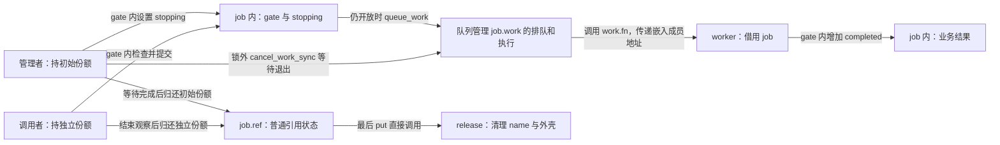
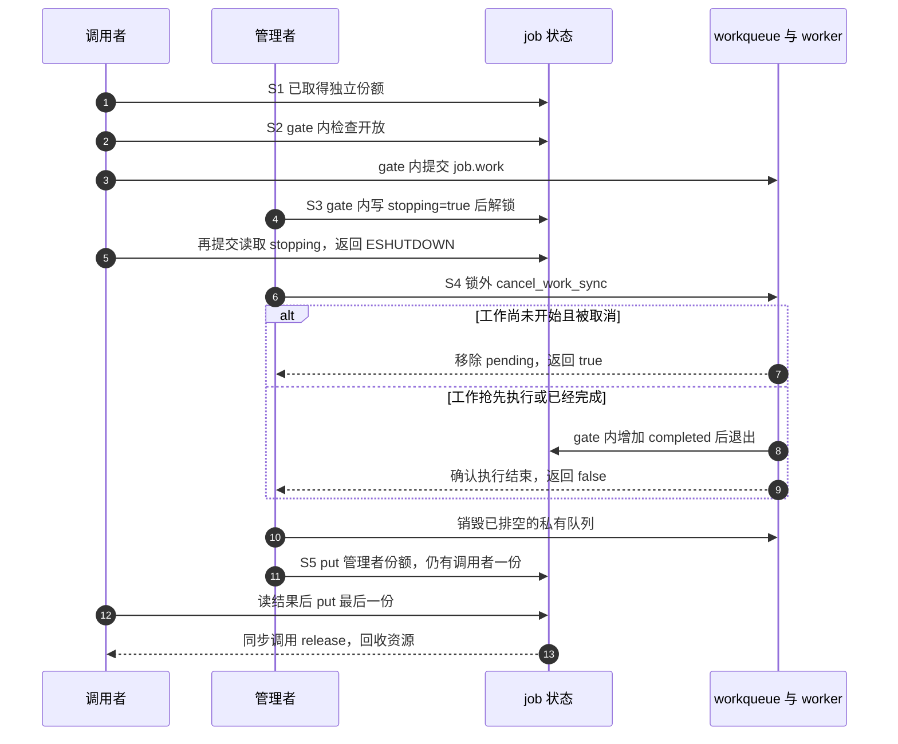
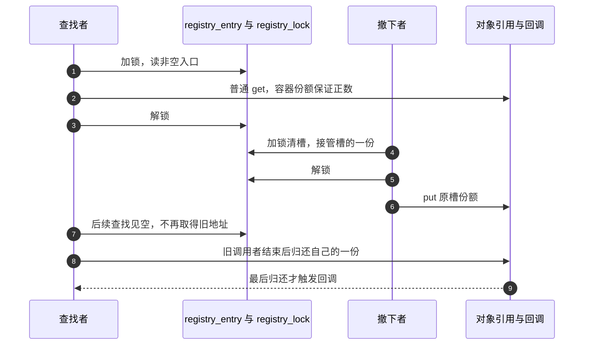
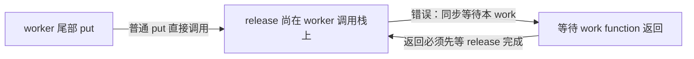
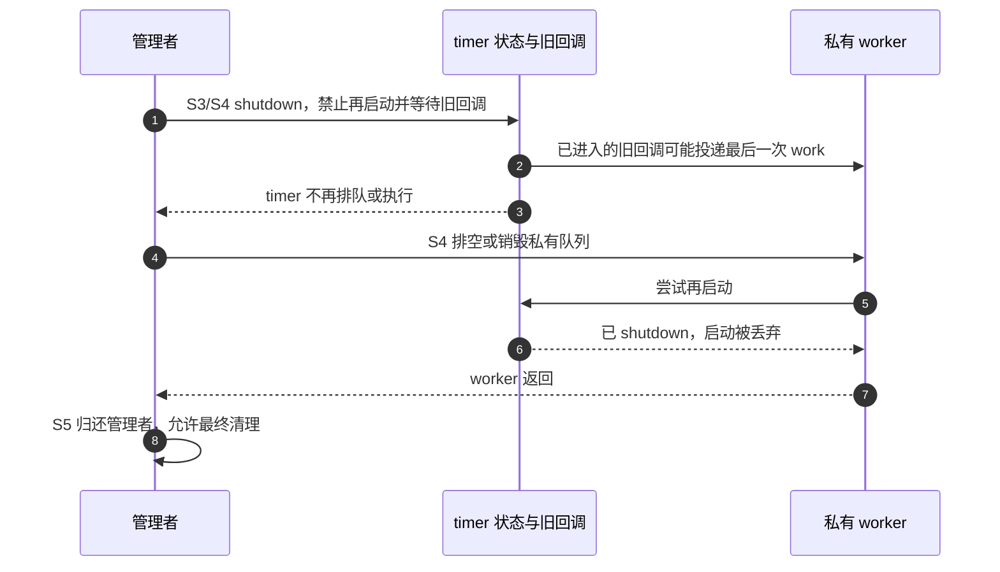
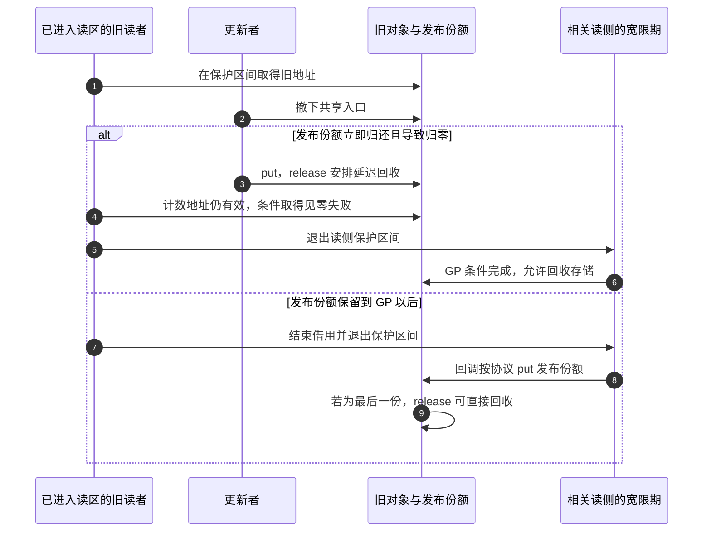

# 第6章\_release\_回调与复杂销毁模式

## 6.1\_本章主线

上一章已经能判断一次 get 是否成立、一次 put 是否触发回调，以及回调是否接过调用者的锁。现在给对象加上一项实际工作：它接受请求，把一项计算交给 worker，关闭时取消尚未开始的工作，等待已经开始的工作退出。此时只有一句“最后 put 后 kfree”还不够：**谁让 worker 停下来，等待期间又由谁保留对象？**

先保留一个有用的最小结论：普通 kref 的正常最后归还，在当前调用栈上调用类型指定的 release。然后补它未负责的部分。kref 不知道对象里的 work、timer、注册关系和子资源；若这些访问者没有纳入引用或借用协议，计数归零不会自动让它们消失。

本章讨论 **内嵌裸 kref 的私有对象**。后面的 `owned_job` 有自己的名称、工作和关闭协议，不是 `struct device`、`struct class` 或 `struct bus_type`。私有对象持有一个 device 引用时，应按该框架的接口归还；不能把私有对象的 release 当作 driver core 的 release 分发，也不能直接释放 device 的外壳。框架边界留给后续专章。

我们先完成一个没有全局查找入口、没有硬件、只有一个关闭管理者的实例，再逐项加入可见性、执行上下文、timer、注册回调和 RCU 的约束。读完本章，应能沿一次关闭过程指出：哪个动作禁止新访问，哪个动作等待旧访问，哪个动作归还责任，哪个动作最终回收存储。它们可能相邻，但不是同一件事。

## 6.2\_先看完整模板\_release\_只是最后一站

第 1 章已经用“每次成功交付拥有一份”的方式保留工作对象。现在换一个确有用途的设计：一个管理者长期拥有对象，worker 只在管理者规定的活动期里借用它。关闭者可以睡眠，也负责等待所有借用结束。这样不用给每次工作都追加引用，但管理者不能提早退出，也不能在自己的 worker 里同步等待自己。

先预测下面两种顺序。若关闭时工作还在队列中，它被取消，计算次数为 0；若 worker 已经抢先执行，关闭者等它完成，计算次数为 1。**两种结果都可以正确关闭**，因为本例约定关闭可以丢弃尚未开始的工作，并没有保证每个已接受请求都必须完成。若业务要求请求必达，应另选等待完成而不丢弃请求的协议。

### 6.2.1\_状态保存在谁那里

这里有三组相互约束的状态，不是一个计数就能表达的单一状态机：

- `job->ref.refcount.refs.counter` 保存管理者和独立调用者的份额；worker 不占其中一份。
- `job->stopping` 由关闭者在 `job->gate` 下写入，提交者在同一锁下读取。检查通过与 `queue_work()` 必须位于同一个锁窗口，否则关闭者可能在二者之间排空队列，提交者随后又排入旧对象。
- `job->work` 的排队/执行状态由 workqueue 管理；`job->completed` 是本例业务结果，由 worker 在 `gate` 下修改，关闭等待完成后才由仍持引用的观察者读取。结果字段不是“work 已经退出”的同步标志。



这张图中，停止状态通过共享字段和 mutex 传播，执行结束通过 workqueue 的同步取消返回传给管理者。kref 没有轮询 `completed`，也不会发送“请停止工作”的通知。同步取消内部的等待协议可沿[工作队列源码总索引](../../../../research/source_reading/workqueue/navigation/P01_Linux_6.12_工作队列源码总阅读索引.md#1.6_建议阅读顺序)进入；本章只组合它已提供的接口保证。

### 6.2.2\_运行一个由管理者等待借用退出的模块

下面是完整的 [note_kref_owned_work.c](../../../../labs/kernel/object_lifetime/materials/note_kref_owned_work.c)。成功创建才建立初始引用；三个资源申请中的任何一步失败，都沿已经取得的资源逆序清理，不对尚未初始化的 kref 执行 put。`kzalloc` 取得清零的外壳，`kstrdup` 复制并拥有名称，`INIT_WORK` 将嵌入工作项连接到回调；`GFP_KERNEL` 沿用前章可睡眠创建路径的分配约束。错误常量中，ENOMEM 表示资源申请失败，EBUSY 表示本次未追加工作，ESHUTDOWN 表示入口关闭，EIO 用于报告本例预期之外的结果。

```c
// SPDX-License-Identifier: GPL-2.0
#include <linux/errno.h>
#include <linux/kref.h>
#include <linux/module.h>
#include <linux/mutex.h>
#include <linux/slab.h>
#include <linux/workqueue.h>

struct owned_job {
    char *name;
    struct kref ref;
    struct mutex gate;
    struct work_struct work;
    struct workqueue_struct *queue;
    bool stopping;
    unsigned int completed;
};

static unsigned int release_calls; /* 本模块的初始化过程串行读取统计。 */

static void owned_release(struct kref *ref)
{
    struct owned_job *job = container_of(ref, struct owned_job, ref);
    ++release_calls;
    kfree(job->name);
    kfree(job);
}

static void owned_put(struct owned_job *job)
{
    kref_put(&job->ref, owned_release);
}

static void owned_worker(struct work_struct *work)
{
    struct owned_job *job = container_of(work, struct owned_job, work);
    /* 借用由管理者保持到 cancel 返回；worker 没有自己的一份可 put。 */
    mutex_lock(&job->gate);
    ++job->completed;
    mutex_unlock(&job->gate);
}

static struct owned_job *owned_create(void)
{
    struct owned_job *job = kzalloc(sizeof(*job), GFP_KERNEL);
    if (!job)
        return NULL;
    job->name = kstrdup("managed-work", GFP_KERNEL);
    if (!job->name)
        goto free_job;
    job->queue = alloc_ordered_workqueue("note_owned", 0);
    if (!job->queue)
        goto free_name;
    mutex_init(&job->gate);
    INIT_WORK(&job->work, owned_worker);
    kref_init(&job->ref); /* 所有资源就绪后，才建立管理者的初始份额。 */
    return job;

free_name:
    kfree(job->name);
free_job:
    kfree(job);
    return NULL;
}

/* 调用者持独立引用。停止检查与实际排队必须处于同一个锁窗口。 */
static int owned_request(struct owned_job *job)
{
    int result;
    mutex_lock(&job->gate);
    if (job->stopping)
        result = -ESHUTDOWN;
    else
        result = queue_work(job->queue, &job->work) ? 0 : -EBUSY;
    mutex_unlock(&job->gate);
    return result;
}

/* 仅管理者调用一次；消耗初始份额。必须可睡眠且不能从本 work 调用。 */
static void owned_close(struct owned_job *job)
{
    struct workqueue_struct *queue;
    mutex_lock(&job->gate);
    job->stopping = true;
    queue = job->queue;
    mutex_unlock(&job->gate);

    /* 先关入口，再在锁外等 worker；无重排和其他生产者。 */
    cancel_work_sync(&job->work);
    destroy_workqueue(queue);
    mutex_lock(&job->gate);
    job->queue = NULL;
    mutex_unlock(&job->gate);
    owned_put(job); /* 此后关闭者不再访问 job。 */
}

static int __init note_owned_init(void)
{
    struct owned_job *job = owned_create();
    int submitted, after_close;
    if (!job)
        return -ENOMEM;

    kref_get(&job->ref); /* 模拟一个调用者，关闭后仍须归还这一份。 */
    submitted = owned_request(job);
    owned_close(job); /* 此后只凭调用者份额保留对象。 */
    after_close = owned_request(job);
    /* 已无 worker 写 completed；调用者的一份保护 name 和外壳。 */
    pr_info("note_owned: %s submit=%d closed=%d completed=%u\n",
            job->name, submitted, after_close, job->completed);
    owned_put(job);
    return submitted ? submitted : after_close == -ESHUTDOWN ? 0 : -EIO;
}

static void __exit note_owned_exit(void)
{
    pr_info("note_owned: release=%u\n", release_calls);
}

module_init(note_owned_init);
module_exit(note_owned_exit);
MODULE_LICENSE("GPL");
MODULE_DESCRIPTION("管理者保活并等待借用工作退出的完整实验");
```

`owned_request()` 的调用者必须已经有引用。它返回 0 只表示本次排队被接收，`-EBUSY` 表示这次没有追加一次执行，`-ESHUTDOWN` 表示已关闭；三者都不转交调用者自己的份额。worker 始终借用管理者保护的存储，所以没有“取消成功需要补 put”的票据。本例不能与每次工作持一份的模型混用。

`owned_close()` 只由初始份额的管理者调用一次。它先关闭提交窗口，再退出 `gate`，随后同步取消工作、销毁私有队列，最后归还管理者份额。如果仍持 `gate` 等待，worker 正需要该锁来结束计算，就会形成“关闭者等 worker，worker 等关闭者解锁”的循环；把等待放在锁外正是为了解开这条依赖。

模块中没有导出接口或其他生产者；worker 不重新投递。它的完整关闭发生在初始化返回前，卸载时只输出对象外的统计。把这些函数接到实际驱动时，还要建立外部调用者和模块代码的进入/退出协议，不能只复制这个 `module_exit()`。

在与运行内核匹配、已经准备好的可写构建环境中执行：

```bash
# KDIR 由当前构建环境设置，指向匹配目标内核的构建目录。
make -C "$KDIR" M="$PWD/labs/kernel/object_lifetime/materials" modules
sudo insmod labs/kernel/object_lifetime/materials/note_kref_owned_work.ko
sudo rmmod note_kref_owned_work
dmesg | tail -n 12
```

观察 `note_owned` 日志：`submit=0`，`closed=-108`（该固定内核的 `ESHUTDOWN`），`completed` 为 0 或 1，卸载输出 `release=1`。前两项说明提交与关闭后的入口行为，最后一项说明这个同步演示只回收一次；一次日志没有覆盖所有实际竞态。若编译或装载失败，先保留错误并核对构建目录、架构和运行版本，不能把宿主检查当作已成功装载。

本轮已完成 ARM 前端语法检查和宿主九组控制路径检查，含三处分配失败、两种模块顺序、关闭窗口中的再提交拒绝、重复工作及管理者最后退出。宿主的锁、原子和队列是显式顺序替身，没有真实线程；目标构建链接、装卸、调度竞争和内存序未验证。命令是读者复现实验的步骤，不是本轮执行报告。

### 6.2.3\_沿一轮关闭追踪到最后清理

本章用 S0～S5 标记这个具体对象的一轮过程；它细化的是本例的管理协议，不是内核字段中另存的一套枚举。

| 阶段 | 触发与写入 | 谁继续持有或读取 | 退出条件 |
| --- | --- | --- | --- |
| S0 准备 | 创建者取得外壳、name、queue，初始化 gate/work/ref | 管理者持初始一份 | 成功返回；失败只清理已取得资源 |
| S1 取得调用者份额 | 管理者在有效正引用保护下 get | 调用者取得第二份 | 责任交付完成 |
| S2 接受工作 | 调用者在 gate 下检查 stopping，向队列发布 work | worker 借用对象；管理者仍持初始一份 | 拒绝，或一次工作进入队列 |
| S3 关闭提交 | 管理者在 gate 下写 stopping=true | 后来的提交者在同锁下读到关闭并拒绝 | 退出 gate，此后无新的成功提交 |
| S4 排空借用 | 管理者在锁外 cancel；必要时等 worker 返回；销毁 queue 并置空 | worker 在等待完成前仍由管理者保活 | 已无排队或执行，私有队列退出 |
| S5 归还与清理 | 管理者 put，独立调用者结束后也 put | 最后归还者直接进入 release | name 和外壳各释放一次 |



在这个单次投递演示里，取消返回 true/false 可对应图中两支；一般 work 重排场景不能只凭这个布尔值重建整段执行历史。真正承担对象安全保证的是 **先封闭全部生产者，再等待没有旧执行者**，不是把 true 读成“安全”、false 读成“失败”。固定版本的[同步取消实现](../../../../research/source_reading/workqueue/source_explanations/P03_Linux_6.12_worker_flush与取消源码实现.md#3.5_cancel_work_sync撤销与等待)明确写出不存在竞争投递这一前提。

试着在纸上改两处代码：第一，把 `owned_put(job)` 从 S5 移到 S4 等待之前，且让管理者成为唯一持有者；此时尚在执行的 worker 会拿到已回收对象。第二，让 `owned_request()` 解锁后才排队；此时它可能在 S4 返回后重新发布 work。前者缺的是存储保留，后者缺的是关闭和发布的串行化，单独增加一个停止标志不能同时修复两者。

## 6.3\_release\_的责任域和非责任域

回到完整程序，release 只有三件事：从嵌入成员找回对象、释放拥有的名称、释放外壳。简短是前面协议成立的结果，而不是把复杂问题藏在“都已经停了”这句话后面：S3 给出不再接受工作的证据，S4 给出借用者已经退出的证据，S5 才让管理者离开。若省掉任一证明，回调再短也可能释放得太早。

它与第 1 章的持票 worker 有意不同。持票模型允许创建者在交付后先退出，代价是接收、拒绝、完成、取消都要明确归还对应份额；本章模型让 worker 不做 get/put，代价是单一管理者必须活到排空结束且能合法等待。需要独立异步活动继续存在时选择前者；明确由上层关闭者统一收敛的活动可以选择后者。不要为了减少一对原子操作，就删除上层并不存在的等待保证。

也不能把本例扩成“所有对象进入 release 以前一定已经不可见”的定理。上一章的非拥有索引由[最后回调接锁撤下入口](P05_基础_API_源码逐行讲解.md#5.8.2_kref_put_mutex%28%29_的典型用途)，它同样正确；本例则根本没有全局查找入口。哪些动作放在 release，取决于入口与计数的连接方式、执行上下文以及谁等待谁。

一般应把必须主动启动的业务关闭交给仍持有效责任的管理者，把最后资源归还交给 release。若一个注册关系自己拥有一份，却期望 release 先注销它，计数就会因为那一份始终不能归零；反过来，若注册回调没有任何保活依据，归零后仍能进来的回调会访问已释放存储。两种错误一边造成无法退出，一边造成过早退出，不能用同一条“在 release 加 unregister”同时修好。

release 可以选择延迟最终存储回收，也可以按已证明的协议完成脱链；它不能把归零对象重新当作有业务引用的对象发布。诊断能帮助发现违约，不能建立原来没有的同步。后续小节按这三个问题展开：外部入口怎样撤销、最后回调处于什么上下文、延迟访问者怎样退出。

## 6.4\_release\_的触发条件和基本释放范围

现在区分触发条件和清理清单。触发由引用协议提供；清单由对象的资源取得方式提供。两者都需要正确，但不能互相替代。

### 6.4.1\_release\_的触发条件

在正常、未损坏且每份责任恰好归还一次的 kref 周期里，最终归还将计数从 1 减到 0，随后调用本次 put 指定的回调。锁组合还会按上一章的协议交出锁。计数异常进入饱和告警等分支时，不能继续套用这条正常结论；[普通源码导读](../../../../research/source_reading/kref/navigation/P02_普通引用与归零回调导读.md#2.4_正常退出与异常收敛)将两种情况分开。

“没有剩余引用”不等于“世界上没有任何裸指针”。本例依 S4 证明 worker 已不再借用；RCU 对象则可能仍有旧读者处于受保护的借用区间，因而还不能回收其存储。release 自己也正通过裸地址做清理。正确要求是：**不能再把零计数身份当作活的业务引用继续取得；仍可能访问的地址必须有另一项尚未结束的存储保护依据。**

因此，禁止在普通 release 中用 get 或重新 init 把同一个已归零身份“救活”。如果释放策略需要把清理工作交给另一个执行者，传递的是明确保留存储的清理责任，要另行证明交付、失败和执行上下文；不是悄悄恢复旧业务对象的引用。对象池重新构造一个新身份也需要旧访问者已退出的独立前提。

### 6.4.2\_release\_负责释放什么

`owned_job` 的资源不是同时退出的。私有队列会执行借用对象的代码，必须先在 S4 停止和销毁；名称仍可被独立调用者观察，所以保留到 S5。外壳最后回收，因为前面所有成员地址都落在它里面。

这也说明“先释放子资源，再释放外壳”只有在依赖关系允许时才完整。若子资源的退出会回调父对象，就要把父对象保留到该回调结束；若独立调用者在关闭后仍允许读取某个缓冲区，就不能提前释放它。不能把所有指针放进一个统一的 kfree 列表，也不能把依赖关系全凭字段声明顺序决定。

| 本例资源 | 取得点 | 使用窗口 | 对应退出动作 |
| --- | --- | --- | --- |
| job 外壳 | `kzalloc` 成功 | 创建、提交、worker、关闭及独立调用者 | release 最后 `kfree(job)` |
| name | `kstrdup` 成功 | 对象创建后直到最后观察者退出 | release 先 `kfree(job->name)` |
| queue | 创建私有有序队列成功 | 允许提交直到同步取消返回 | S4 `destroy_workqueue`，随后成员置空 |
| 调用者份额 | 正常 get | 关闭后的拒绝与结果观察仍有效 | 调用者自行 put，不由关闭者代还 |

创建失败发生在 S0，尚未取得的资源没有退出动作；成功创建后的关闭发生在 S3～S5，管理者不能跳过等待直接执行与失败标签相同的 kfree。两个路径都“释放内存”，成立前提却不同。

### 6.4.3\_release\_只释放对象\_拥有\_的资源

字段类型本身不足以决定归属。`const char *name` 可能指向静态字符串，也可能指向另一个拥有者管理的内存；`char *name` 也不会自动宣布对象获得释放权。把它写进结构，只保存了一个地址。

| 取得与保存方式 | 对象实际承担的责任 | 退出时的方向 |
| --- | --- | --- |
| 借用静态字符串 | 不拥有该字符串存储 | 不对字符串 kfree |
| 私有 `kstrdup` / `kmalloc` 成功 | 拥有这一块分配 | 无使用者后按分配配对 kfree |
| 明确取得 file 的一份引用 | 归还当前对象持有的文件引用 | 按 file 契约执行 fput，不直接 kfree file |
| 明确取得 device 的一份引用 | 归还当前对象持有的设备引用 | 按 device 契约执行 put_device，不替换设备最终回调 |
| 只借用另一对象的成员地址 | 在对方承诺的有效窗口内使用 | 结束借用；不能凭地址擅自 put 或 free 对方 |

表中的“归还引用”不承诺被引用对象立即销毁，也不承诺任何上下文都能执行整个清理链。应分别核对该类型的空值约定、最后归还行为、回调与睡眠约束，不能把它们套用本例只清理 kmalloc 内存的回调。

练习：把完整程序的 `name` 改为借用字符串常量，要一起改变哪些地方？至少要改创建时的取得方式、申请失败出口和 release 的资源清单；若只改赋值却保留 `kfree(job->name)`，就把原本不拥有的存储当成了私有分配。再把名称改为借用另一个动态对象的成员：这一次除了清理清单，还必须增加对那个拥有者寿命的证明。


## 6.5\_外部可见性\_脱链应该由谁负责

完整工作模块只有持引用的调用者，没有全局索引。现在加入一个查询入口：读者先在表中找到地址，再取得自己的引用。多出的难题并非“在哪里写 list_del”这么简单，而是 **从发现地址到取得份额之间，谁保证对象还活着？** 撤下入口与最终回调的先后必须围绕这个窗口安排。

### 6.5.1\_release\_前必须明确对象是否已经脱链

先在纸上执行一个错误顺序：表中保存对象地址；最后持有者 put 后直接释放外壳；查找者随后从表中读出原地址，访问其中的 kref。此时即使用条件取得也太迟，因为它首先要读一个已经失效的计数成员。问题发生在“能否访问计数地址”这一层，不能由“计数为零就不增加”补救。

但“表里有地址”也不自动表示表拥有引用。需要查清两个独立约定：表是否保留一份，查找与最终撤下是否使用同一项保护。上一章已有两个完整程序可作对照：拥有一份的 `registry_entry`，以及不拥有一份的 `index_entry`。本节比较它们关闭同一个查找窗口的不同方法，不另造一份没有创建、失败和归还路径的链表片段。

对于 list、hash、xarray 或 idr，容器名称本身不回答所有权问题。应先确定“谁拥有这一份”，再决定具体摘除接口；换用更方便的容器不会自动修好回收协议。还有第三种情况是 RCU 读者已经取到旧地址，即便索引被撤下，它仍可能在保护区间内访问，存储回收还需等待对应读侧结束。

### 6.5.2\_release\_前脱链模型

先回访[P02 完整容器模块](P02_源码入口与结构定义.md#2.30.1_设计_A_容器持有引用)。`registry_entry` 非空时拥有一份；`registry_lock` 保护槽的读、发布和清空。查找者在该锁内见到非空槽，凭容器那一份保证普通 get 时仍为正数，取得自己的份额后才离开锁。

撤下者执行反向交接：锁内清槽，同时把槽原有的责任接到自己手里；解锁后归还这一份。这样，即使这次 put 最终回收，也已经没有新查找者能通过该槽取得旧对象。此前取得份额的读者继续持有，最后由它们自行归还；“入口消失”与“已有使用者消失”因此可以发生在不同时间。

这个设计适合注册关系本身就应使对象存活的场景。代价是必须有明确的移除动作；如果管理者永远不移除，容器那一份也不会凭空消失。release 不能承担首次移除并归还同一容器份额，否则要等零才能移除、又要移除才能到零，形成责任循环。



若用链表而非单槽，清理时的 `list_empty()` 只是一项约定检查。它检查节点是否自环，不是通用“已不在任何容器”的证明。只有节点先正确初始化，且摘除使用恢复自环的 `list_del_init()` 等约定时，这个断言才与“已摘下”对应；普通 `list_del()` 的毒化状态不能这样判读。具体表示已在[P03 清理诊断](P03_kref_生命周期状态机.md#3.7.1_release_阶段_对象销毁点)建立，检查不替代锁和所有权。

### 6.5.3\_release\_内脱链模型

再回访[P05 非拥有索引模块](P05_基础_API_源码逐行讲解.md#5.8.2_kref_put_mutex%28%29_的典型用途)。`index_entry` 不保留引用，对象可以因为真实使用者都退出而自动到达最终回调。为使锁内普通查找仍有正数保证，所有最终减少都通过同一 `index_lock` 的组合接口：可能只剩一份时先保留它，取锁后再减少判断；真正到零时回调已经接到锁，清槽、解锁、释放外壳。

这不是“先在锁外归零，然后回调再取锁”。如果改成后一种顺序，查找者可能已经持索引锁，看见还没被撤下但计数已零的对象；普通 get 就没有正引用依据。该顺序可以另行设计成条件取得协议：回调等索引锁期间保留存储，查找者在锁内尝试 `kref_get_unless_zero()`，失败则解锁并拒绝。它与普通查找协议有不同的前提，不能只替换最后 put 那一行。

| 关系 | 查找窗口的正数/地址依据 | 撤下由谁完成 | 不能省略的代价 |
| --- | --- | --- | --- |
| 容器拥有一份 | 非空入口自己的份额，查找与清槽同锁 | 管理者先清槽，再归还容器份额 | 必须有主动移除者 |
| 非拥有索引，最终减少与查找同锁 | 锁内见到未撤入口时，最终减少尚未越过同锁 | 归零回调在接到的锁下撤下 | 所有归还路径遵守同一最终减少协议 |
| 非拥有索引，普通 put 可在锁外归零 | 锁阻止回调释放存储，但不保证计数为正 | 回调取锁撤下 | 查找必须条件取得并处理失败 |

表中最后一项的地址保护只覆盖索引锁窗口；失败后不能解锁再访问对象，也不能把它推广成任意无锁查找。对应的[条件模块](../../../../research/source_reading/kref/navigation/P03_条件取得与查找窗口导读.md#3.2_从观察到自己持有)与[最终减少模块](../../../../research/source_reading/kref/navigation/P04_最后归还与锁交接导读.md#4.2_把最后减少留在锁内)分别保存固定版本的状态与函数协作，后续查找和锁组合章节再扩大场景。

练习：一个非拥有索引原来全部使用锁组合 put，后来某条错误出口改用普通 put。为什么回调中仍然执行“加锁、清槽”也不能保持原有普通 lookup 正确？尝试安排查找者先拿到锁，再由另一持有者在锁外归零；你会发现被破坏的是查找的正数依据，而不是清槽这个动作是否存在。

## 6.6\_release\_的执行上下文和锁语义

目前知道该清理什么、入口怎样撤下，还欠一项证明：这些清理动作在 **最后归还者当时的执行条件** 下能否运行。进程/中断属于执行环境，spinlock/mutex 属于此刻的持锁状态，两组约束会叠加；不能只看到“驱动函数”或“worker”这个名字就批准睡眠。

### 6.6.1\_release\_能否睡眠取决于最后\_put\_上下文

本章完整工作模块刻意把关闭安排在初始化函数的可睡眠过程，且退出 `gate` 后才等待普通工作队列。若把同一个等待动作搬到硬中断、软中断、持普通自旋锁或禁止调度的临界区，就破坏了执行条件。这里的普通自旋锁按当前非 PREEMPT_RT 基线理解，不把其实现细节直接外推到 RT 配置。

可睡眠也不表示一定能等到结果。例如管理者拿着 `gate` 调用同步取消，worker 必须取得 `gate` 才能返回，即使管理者是普通进程，也会形成锁等待循环。分析需要先过两个独立问题：当前环境是否允许阻塞；被等待者能否在我们保留的锁和责任条件下继续前进。

| 最后归还可能来自 | release 继承的主要约束 | 本章如何安排 |
| --- | --- | --- |
| 普通可睡眠路径且无冲突锁 | 可以选择睡眠操作，但仍须排除等待循环 | 关闭者在 S4 等待，S5 回调只回收剩余存储 |
| 同一对象的 worker 尾部 | 尚未从这个 work 的函数返回 | 回调不能同步取消或等待这个 work 自己 |
| 硬中断、软中断、禁调度区间 | 不允许任意阻塞 | 回调必须适配，或把清理责任交给已证明可用的执行者 |
| 持锁的最终归还 | 锁与其他上下文限制同时存在 | 明确回调是否负责解锁，以及之后仍有哪些限制 |
| RCU 保护或回调路径 | 必须遵守对应 RCU 类型/回调的执行契约 | 不能把“延迟”当成自动获得睡眠资格 |

不要用 `kref_read()==1` 猜本次是否最后一次，再只给“看起来会最后”的调用者检查上下文；快照会变化。设计时应覆盖所有可以归还最后一份的路径。否则一次平常总是非最后的错误出口，也可能在另一参与者先退出时突然执行整个 release。

### 6.6.2\_普通\_kref\_put\_下的\_release\_上下文

普通 `kref_put()` 没有启动清理线程，也没有替调用者释放外部锁。回调就在这一次 put 的调用栈中发生；归还以后调用者不再凭已经交还的份额访问对象。[普通实现](../../../../research/source_reading/kref/source_explanations/include/linux/kref.h.md#1.4_最后归还调用清理)中直接调用回调的语句体现了这个边界。

以第 1 章的持票工作为例：worker 在最后一行 put，可能立即进入 release。即使这时计数已经为零，work function 仍未返回；若 release 同步等待该 work，必须等到自己的调用栈先退出，而调用栈又等 release 返回。**“引用已归还”和“执行函数已返回”不是同一个事件。** 本章管理者模型通过保持初始份额到同步等待以后，避免把排空工作留给归零回调。



若确实只有非睡眠路径可能最后归还，而资源必须在可睡眠路径退出，需要设计一次 **清理责任转交**：归零回调保持外壳有效，将退休对象交给已就绪的清理执行者，后者完成资源退出再回收。这个新协议要处理接收失败、执行者自身寿命、重复投递和模块卸载；不能在回调里再次 get 旧计数，也不能以“放进某个 workqueue”几个字省略责任。

RCU 延迟回收解决的则是旧读者可能仍在访问存储的问题。它不与工作队列等价，也不保证 RCU 回调可以阻塞。若既有读者宽限期要求又有睡眠清理要求，就有两项独立的完成条件，必须安排先后或责任交接；[RCU 复合对象的回调边界](../../synchronization_and_asynchrony/synchronization/rcu/P21_RCU_kref与复合对象生命周期.md#21.1_先按分配与所有权拓扑选模板)给出相关拓扑，而非给所有 release 统一套 `kfree_rcu`。

### 6.6.3\_release\_在持\_mutex\_状态下执行

`kref_put_mutex()` 正常归零进入回调时，指定 mutex 已持有，回调接管解锁责任；返回后包装器不会再帮它 unlock。相反，没有触发回调的路径可能根本未取锁，也可能取锁重查发现别人加入后已经自行解锁。因此调用者不能不分返回分支再补一次解锁。

P05 完整程序中的 `indexed_release_locked()` 正好表达这个契约：它在持 `index_lock` 时清理属于当前对象的槽，随后解锁，再释放外壳；拒绝发布的新对象不能误清另一个对象占据的槽。这里的名称和注释都告诉维护者“已经持锁进入”，所以不要在函数开头再次锁同一把 mutex。

把 mutex 成员放在即将释放的对象里还会多出存储问题：必须先结束对该 mutex 的使用，再释放承载它的外壳。完整索引程序选择对象外的锁，让锁的寿命不依赖某一个被索引对象，但它仍要保证模块中的锁在所有调用结束前存在。

用三个问题检查这一调用点：回调接的是哪一把锁，谁负责解锁，解锁以后其他路径还能通过什么入口接触对象？名字中有 `_locked` 只是提示，不能替代这三项约定。固定调用链见[归零锁交接](../../../../research/source_reading/kref/source_explanations/include/linux/kref.h.md#1.8_归零时把锁交给回调)。

### 6.6.4\_release\_在持\_spinlock\_状态下执行

`kref_put_lock()` 同样在归零时把指定 spinlock 交给回调。当前普通非 RT 语境下，持该锁不能调用可能睡眠的清理动作；回调通常先完成受锁保护的短小撤下操作，再按调用协议解锁。它还要避免任何会再次取得同一锁的间接函数。

但“先 unlock，再做复杂清理”仍不是通用修复。如果最后归还来自中断，释放 spinlock 后仍在那个中断里；如果调用者事先关闭本地中断，普通 `spin_unlock()` 也不会替它恢复原状态。`kref_put_lock()` 的固定实现使用普通 spin lock 组合，不包含 irqsave/irqrestore 配对，调用者必须另证中断重入和状态恢复。

因此，为 spinlock 版本选择 release 时，应先列清所有最终归还来源，再选择这些来源共同允许的动作；需要阻塞的资源退出通常前移到仍持管理责任的可睡眠关闭阶段，或走完整的清理责任转交协议。不能把 mutex 版本的等待代码原样搬来，也不能凭一次无告警测试就认为 IRQ 或 RT 分支得到验证。

至此可回答开篇实例为什么把 `cancel_work_sync()` 放在 S4：那里管理者有一份、无 `gate` 锁、允许睡眠且不是该 work 自身。将它放进 release 会丢失这些由调用协议建立的前提。下一节继续增加异步来源，重点检查反复启动、重新排队和注册解除会怎样改变退出责任。


## 6.7\_异步路径\_work\_timer\_callback\_的引用闭环

上一节解决了回调在哪个上下文运行，现在让对象面对多个异步来源。每条来源都要回答两个问题：它进入时靠哪份责任或借用窗口保活，关闭后谁保证它不再重新进入。work、timer 和注册回调都是“以后执行”，但接收规则不同，不能共享一句“提交前 get，结束时 put”就认为完成了设计。

### 6.7.1\_release\_和\_workqueue\_的收尾关系

回访[P01 完整工作模块](P01_kref_要解决什么问题.md#1.16.1_运行一次真实工作交付)：创建者先保留自己的份额，再为一次成功工作预留一份，queue_work 接收后由 worker 在最后对象访问之后归还；若该次提交未被接收，只归还此次预留，不能替已有工作归还它的一份。这个例子只交付一次，不自行重排。

再对照本章 `owned_job`：worker 没有独立份额，始终借用管理者的一份；管理者关闭入口、等执行退出，再归还。两种模型里的 queue_work 可以相同，但引用协议不同，所以取消返回后该不该补 put 也不能只从 API 名字判断。

| 路径 | 一次成功工作独立持有 | 管理者统一保留、worker 借用 |
| --- | --- | --- |
| 正常执行完成 | worker 在最后对象访问后归还这次工作份额 | worker 不 put，管理者等待它返回 |
| 本次排队拒绝 | 退回本次预留；原有工作的责任保持 | 没有新增份额可退 |
| 尚未执行的唯一实例被取消 | 在无重排、取消者仍保活的前提下，由取消者接管其份额 | 仍无工作份额可退，只确认借用已结束 |
| 执行已经开始 | 等执行路径按协议完成归还，不因返回 false 盲目再 put | 等它返回后才能让管理者退出 |

[P03 工作票据模型](P03_kref_生命周期状态机.md#%287%29_所有权表要补充失败路径和取消路径)可重新运行六种顺序。若允许 running 期间再排一次或允许回调自行投递，必须为每次成功接收明确责任，不能把那个“一次 pending 实例”的取消模板直接扩大；最先要做的是封闭生产者，再判断哪些实例完成、哪些被取消。

### 6.7.2\_release\_中\_cancel\_work\_sync\_的风险

“work 持有的一份已经归还”只说明引用动作发生，不能推出 work function 已经返回。若该 put 在 worker 尾部触发 release，release 里同步取消本 work 就会等待自己的外层调用栈。即使移除这种直接自等待，仍要查是否持有 worker 需要的锁，以及普通工作队列的同步等待是否位于可睡眠上下文。

另一方面，若 worker 仅借用而没有独立份额，又没有管理者等待，release 可能在它读对象时出现。此时增加一个 cancel 调用也要先证明：回调自身不会通过其他路径最后 put，生产者已被封闭，当前上下文可等待，而且对象在等待期间仍保留。可以设计满足这些条件的类型，但不宜把缺失的所有权分析藏进通用 release 模板。

本章默认采用容易复核的 S3/S4 分工：管理者有一份时主动关闭和排空，release 只收尾剩余资源。模块代码寿命还要额外保留到 work function 真正退出；对象内存提前在 worker 尾部回收，与模块可以立刻卸载是两件事。

### 6.7.3\_release\_和\_timer\_的收尾关系

定时器登记的是“这个 timer 下次何时执行”，不是一个按每次启动调用追加记录的请求队列。设管理者持一份，第一次启动前 get，计数变为 2；尚未到期又 get 并 mod_timer，计数变为 3。第二次只是调整同一个 pending timer 的到期时间，最后只发生一次回调，归还一份后剩 2；管理者再归还仍剩 1。泄漏来自 **把两次改期误当成两次独立接收**。

在这里，pending 指 timer 仍登记在待执行队列中，running 指回调已进入但尚未返回。回调开始后可能已经不 pending；甚至某条路径又为这个正在执行的 timer 安排下一次到期，使“正在执行”和“还有下一次”同时成立。因此单看 timer_pending 为假不能释放对象，单看 mod_timer 返回值也不能完整计算活动实例的引用账本。

以下完整 [timer_ownership.c](../../../../labs/kernel/object_lifetime/materials/timer_ownership.c) 用对象外账本安排四条顺序。先预测第一个反例最后剩多少份，再看管理者模式如何避开重复 get。这里没有实际时间流逝；`model_delete_sync` 显式完成 running 状态，只表示真实同步操作返回后的结果。

```c
// SPDX-License-Identifier: GPL-2.0
#include <assert.h>
#include <stdbool.h>
#include <stdio.h>

/* 对象外的顺序观察账本，不是 struct timer_list 或真实引用计数器。 */
struct timer_model {
    bool pending;
    bool running;
    bool shutdown;
    bool work_pending;
    unsigned int refs;
    unsigned int callbacks;
};

static int model_mod(struct timer_model *timer)
{
    if (timer->shutdown)
        return 0; /* 固定接口在 shutdown 后丢弃启动，也返回零。 */
    int was_pending = timer->pending;
    timer->pending = true; /* 改期仍然只有一个 pending，不新增票据。 */
    return was_pending;
}

static void model_begin(struct timer_model *timer)
{
    assert(timer->pending && !timer->running);
    timer->pending = false;
    timer->running = true;
    ++timer->callbacks;
}

static void model_end(struct timer_model *timer)
{
    assert(timer->running);
    timer->running = false;
}

static int model_delete_sync(struct timer_model *timer, bool shutdown)
{
    if (shutdown)
        timer->shutdown = true;
    /* 显式完成已执行实例，表示等待之后的结果，不实现线程等待。 */
    if (timer->running)
        model_end(timer);
    int was_pending = timer->pending;
    timer->pending = false;
    return was_pending;
}

static void model_work(struct timer_model *timer)
{
    assert(timer->work_pending);
    timer->work_pending = false;
    (void)model_mod(timer); /* 借用 worker 尝试重新启动 timer。 */
}

static void owner_exit(struct timer_model *timer)
{
    assert(!timer->pending && !timer->running && !timer->work_pending);
    assert(timer->refs == 1);
    --timer->refs;
}

int main(void)
{
    struct timer_model bad = { .refs = 1 };
    ++bad.refs; assert(model_mod(&bad) == 0);
    ++bad.refs; assert(model_mod(&bad) == 1);
    model_begin(&bad); model_end(&bad); --bad.refs; /* 仅一次回调归还。 */
    --bad.refs; /* 管理者退出，错误地留下无人认领的一份。 */
    assert(bad.refs == 1 && bad.callbacks == 1);
    puts("two gets, one callback: leaked responsibility=1");

    struct timer_model owned = { .refs = 1 };
    assert(model_mod(&owned) == 0 && model_mod(&owned) == 1);
    model_begin(&owned);
    assert(!owned.pending && owned.running); /* pending 为假并非已退出。 */
    assert(model_delete_sync(&owned, true) == 0);
    owner_exit(&owned);
    assert(owned.refs == 0 && owned.callbacks == 1);
    puts("owner retained through running callback: refs=0");

    struct timer_model reopened = { .refs = 1 };
    assert(model_mod(&reopened) == 0);
    assert(model_delete_sync(&reopened, false) == 1);
    assert(model_mod(&reopened) == 0 && reopened.pending);
    assert(model_delete_sync(&reopened, true) == 1);
    owner_exit(&reopened);
    puts("delete allowed a later restart; shutdown closed it");

    struct timer_model cycle = { .refs = 1, .work_pending = true };
    assert(model_delete_sync(&cycle, true) == 0);
    model_work(&cycle);
    assert(!cycle.pending && !cycle.work_pending);
    assert(model_mod(&cycle) == 0 && !cycle.pending);
    owner_exit(&cycle);
    puts("worker rearm after shutdown: discarded, refs=0");
    return 0;
}
```

在材料所在目录编译运行：

```bash
cc -std=c11 -Wall -Wextra -Werror -O2 timer_ownership.c -o timer_ownership
./timer_ownership
```

不要为这个实验定义 NDEBUG，因为程序使用 assert 检查并执行待观察的模型步骤。四行输出依次给出：两次 get 只有一次回调时遗留一份；管理者保留到旧回调退出后归零；普通删除后仍能重新启动；最终关闭以后 worker 的再启动被丢弃。模型没有真实分配，第一行的泄漏是责任账本残留，不是在实验里故意遗失一块堆内存。

第三、四条还揭示 API 返回值陷阱：正常 inactive timer 的 mod_timer 返回 0 可以表示启动成功；已 shutdown 的 timer 返回 0 却表示启动被丢弃。它不是 queue_work 的接收布尔值。固定版本的[定时器退出源码索引入口](../../../../research/source_reading/kref/navigation/P01_Linux_6.12_kref源码阅读索引.md#1.2_按问题进入已落地证据)连接[改期与关闭模块](../../../../research/source_reading/kref/navigation/P05_定时器重启与退出导读.md#5.2_从排队到最终关闭)，再到[唯一改期实现](../../../../research/source_reading/kref/source_explanations/kernel/time/timer.c.md#1.1_改期不等于追加一次回调)。

并非 timer 永远不能独立持引用。单次启动、无改期/重排、管理者取消期间仍有自己的份额时，可以为唯一实例建立票据：回调执行则回调归还，被同步删除的 pending 实例则由取消者接管。若需要反复改期、回调重启或 timer/work 相互启动，要么扩展活动实例与票据的同步状态，要么选管理者保留到整个活动期结束的模型。本章选择后者，不把一次性票据模板假装成通用 timer 方案。

### 6.7.4\_release\_不应该负责模糊的\_timer\_语义

原示例使用 del_timer_sync。固定 Linux 6.12.20 中它只是[旧名包装](../../../../research/source_reading/kref/source_explanations/include/linux/timer.h.md#1.2_旧名转到同步删除)，新代码使用 timer_delete_sync；但换名字不会自动解决重新启动。

timer_delete_sync 在调用者防止重启的前提下撤销 pending 并等待回调结束。它没有永久封闭 timer；另一参与者以后调用 mod_timer 仍可启动。timer_shutdown_sync 则在同一个 base 锁下清空 callback 函数指针，并等待已经进入的回调退出，使之后的启动请求被丢弃。它用于最终退出，不适合之后还需要同一个 timer 正常工作的临时暂停；再次初始化一个身份不是继续使用已关闭身份的旁路。

现在把 timer 与 work 接成循环：timer 到期投递 work，work 结束再次启动 timer。只删 timer 后等 work，work 可能又启动 timer；只等 work 后删 timer，timer 又可能派生一个新 work。管理者应先停止其他外部生产者，保持自己的份额，再最终关闭 timer，随后排空这组私有 work，最后才归还。已在执行的 timer callback 仍可能投递最后一个 work，所以等待 work 必须安排在 timer 关闭并退出之后；此后的 work 再启动 timer 会被拒绝。



固定[同步退出实现](../../../../research/source_reading/kref/source_explanations/kernel/time/timer.c.md#1.2_等待执行与关闭重启)支持这一顺序，但不接管 kref 责任，也不使裸指针自动保活。所有调用 timer API 的路径仍须有有效地址；管理者在全部退出前不能 put 掉最后一份，剩余清理也不能依赖 timer 再触发一次才能结束。不要在本 timer 回调中同步等自己，也不要持有妨碍它退出的锁。当前普通非 RT timer 回调的软中断约束不能直接扩大成所有定时设施和配置都相同。

### 6.7.5\_release\_和\_callback\_的关系

注册回调又多一层差异：`unregister` 不是所有子系统共享同一含义的通用内核函数。应读取选定 API 的契约，明确它是只阻止以后进入，还是同时等待已经进入的回调返回。没有确定子系统时，不应给一个未定义的 unregister_callback 编造同步保证。

先建立两种可成立的协议。第一种由注册关系拥有一份，回调借用这段注册有效期；注册失败要归还预留，注销必须完成“入口关闭且旧回调退出”，才能归还注册关系那一份。第二种允许注销只关闭新入口，但每次已接收回调提前取得独立份额；注销归还注册关系后，旧回调仍各自保活，结束时归还。第二种还必须保证“判断允许进入—取得份额”与注销同一保护，不能先取出一个无保护裸指针再 get。

若 API 只做前半段，而回调又纯借用注册关系，注销后立即 put 就可能让回调访问已释放对象。补救应是补齐等待旧回调的阶段，或重设每次回调的取得协议，不是把 registered 布尔值清为 false 就当作退出证明。一次“未发生错误”测试也不能替代对 API 的这一项证据核对。

### 6.7.6\_release\_不能替代\_unregister

对注册关系拥有一份的模型，时间顺序必须主动发起：管理者关闭入口，处理旧回调，归还注册份额；其他持有者都退出后才可能到 release。让 release 负责首次注销并归还那同一份，会造成它永远等不到触发条件。

对不拥有引用的索引或注册关系，回调内撤下并非一律禁止，但必须像 6.5 节那样另证地址保护、取得与归零的串行化以及回调上下文。不能因为表面上“对象还注册着”就断定计数绝不可能为零，也不能看到零就推断外部再没有旧借用者。

把三种异步来源一起复核：work 的接收实例、timer 的改期/执行状态、注册关系的进入/注销语义各有自己的账本。kref 只消费已经定义好的责任，不替它们生成账本。现在已能把最后归还之前的活动退出说清；下一节处理另一种情况——业务引用已经结束，但旧读者的存储保护还没有结束。


## 6.8\_RCU\_边界\_生命周期结束不等于内存立刻回收

前面的管理者通过等待让借用者先退出，再允许计数归零。RCU 组合还允许另一种排序：先结束业务引用，但把存储保留到相关旧读者都跨过读侧保护区间。这里的宽限期（grace period，GP）用于确认此前可能取得旧地址的相关读者已经结束保护；它不是一个按毫秒猜测的固定延时。

本节只讨论怎样安排回收责任，不在 kref 章节重新建立 RCU 的全套实现。第一次采用这类组合前，应先阅读[RCU 与复合对象的三种拓扑](../../synchronization_and_asynchrony/synchronization/rcu/P21_RCU_kref与复合对象生命周期.md#21.1_先按分配与所有权拓扑选模板)。当前要带走的边界是：**引用数和宽限期是两项独立条件，模块必须明确谁等待哪一项、谁最后释放。**

### 6.8.1\_release\_和\_RCU\_的边界

设共享入口指向一个配置对象，一名旧读者已经在 RCU 读区内取到地址，更新者随后撤下入口。旧读者并不会因为入口被改掉就自动丢失自己手里的地址；如果还要读取字段或尝试取得独立引用，存储必须继续有效。条件取得可以拒绝零计数，但执行这个尝试本身仍需要一块能安全读取的计数器。

由此得到两种不同且都能成立的排序。第一种在撤下时立即归还发布份额；如果这是最后一份，release 安排 RCU 延迟回收，存储继续保护旧读者。第二种把发布份额保留到宽限期之后才归还；那时相关旧读者已经退出，release 可以按剩余独立引用的情况直接回收，不必机械再等一次同样目的的宽限期。

| 同一分配对象的协议 | 撤下入口以后 | 最后 release 的存储动作 | 地址保护从哪里来 |
| --- | --- | --- | --- |
| 发布份额立即归还 | 可能先归零，再等待旧读者 | 安排合适的 RCU 延迟回收 | 已安排的读侧存储保护，计数可能已零 |
| 发布份额跨过 GP | 先等待旧读者，再 put 发布份额 | 无其他借用要求时可以直接回收 | GP 以前保留的发布引用，此后是剩余独立引用 |

两种模型都要求先正确撤下旧入口，并且只有一个最终释放协议。不能一条退出路径立即归还并直接 free，另一条路径又独立安排同一块内存的 RCU 回调；也不能在有些路径提前放掉发布引用后，仍使用“它跨 GP 保证正数”的普通 get 论证。



图中为突出排序，选取“旧读者没有取得额外长期引用”的分支。若读者成功取得独立份额，两种模型都还要等那一份归还；它可以把对象带出读区，但必须遵守业务许可、字段并发和自己的退出责任。RCU 没有读取 kref 等待它归零，kref 也没有暗中通知 RCU；连接两者的是更新者和类型回调的协议。

### 6.8.2\_kref\_归零和内存真正释放不是永远同一时刻

现在可以准确改写“归零后不能使用”这句话：归零后不能把旧身份重新取得为活的业务引用；但已经有独立存储保护依据的旧读者、清理回调或退休执行者，仍可能按各自契约访问允许的部分。正因如此，归零与 free 才会分离。保护地址也不自动允许读者使用已经提前退出的子资源。

对独立分配的复合对象，还不能只在根上放一个 rcu_head 就认为所有叶子都能一起释放。例如旧配置根和新配置根共享一个数据块，两代根各拥有该块的一份，后台任务又持一份。旧根跨过自己的 GP 后只归还自己拥有的那一份；新根和后台任务仍能保留数据块，最后数据块按自己的 release 回收。根的 GP 不是所有分配块的一键销毁信号。

因此，选择 `kfree`、`kmem_cache_free` 或 `kfree_rcu` 以前，先画清每块分配及其拥有关系：哪些旧读者借用这块地址，哪些独立引用保留它，哪个阶段结束哪项保护。分配器配对和延迟时机都要正确，不能按“代码中出现 RCU”统一替换所有 free。

后续[第 10 章](P10_kref_与_RCU.md)会把单对象查找窗口展开；[复合快照](../../synchronization_and_asynchrony/synchronization/rcu/P21_RCU_kref与复合对象生命周期.md#21.4_模型_C_一个_RCU_版本根拥有多个_kref_数据块)负责根与块的独立责任。这里的比较已经足够说明：release 可能安排下一阶段，但它仍必须明确交给谁以及存储何时真正结束。

## 6.9\_release\_的禁区\_检查和状态边界

有了完整退出过程，再检查回调才有依据。诊断要指出“哪项已建立的协议被破坏”，而不是在末尾堆几个布尔值就宣布对象安全。

### 6.9.1\_release\_里不能重新发布对象

假设回调把 kref 重新 init 为 1，再把同一个对象插回索引。计数看起来重新为正，但原退出协议可能已经安排了一个延迟 free，旧读者也可能仍在结束自己的借用。新的查找者会把旧身份当作新对象使用，随后却被原先的退休路径释放。问题不是数值不够大，而是两套生命周期同时控制同一块存储。

对象池可以复用内存，但要先完成旧身份的全部引用、借用和退休动作，然后把存储交回池管理；再次分配时建立新身份、初始化成员并重新发布。两次对象生命周期碰巧使用同一地址，不代表可以跳过前一次退出。具体池若另有允许原地复用的严格协议，需要单独证明，不能从裸 kref 推出。

清理责任转交与业务重新发布也不同。前者只让退休执行者完成已经决定的退出，不能对外恢复旧对象的业务许可；后者重新允许任意读者取得身份，会破坏先前的关闭证明。

### 6.9.2\_release\_中的调试检查

回到完整工作模块：真正证明 worker 已退出的是 S3 封闭投递和 S4 的同步返回。即使在 release 增加 `WARN_ON(job->queue != NULL)`，它也只是检查程序是否按约定清空成员；单独提前把 queue 写为 NULL，不会销毁队列或让 worker 退出。

| 常见检查 | 在什么前提下有用 | 不能由“未告警”推出什么 |
| --- | --- | --- |
| `list_empty(node)` | 节点初始化/摘除都使用约定的自环表示，检查时地址有效 | 不能证明任意毒化节点已正确脱链，也不能代替容器锁 |
| `timer_pending(timer)` | 调用者满足 timer 状态观察的串行化要求 | 为假仍可能有运行中的回调，未来也可能被重启 |
| `registered == false` | 注册状态与实际注销操作按同一协议维护 | 不能证明旧 callback 已退出 |
| `running == false` | 明确写入者、保护方式和“运行”的定义 | 不能把无保护读取当作线程完成同步 |
| 某资源成员为 NULL | 清理动作与置空严格配对，没有隐藏拥有者 | 不能证明只改了字段而未真正归还的资源已退出 |

`WARN_ON` 不是等待接口，也不会自动修复错误；触发后继续走原代码可能仍会访问无效存储。它未触发也只说明这次执行到了该检查并得到一个值，不能证明所有生命周期交错。对于调试配置、执行覆盖和检查器有效性，还要按实际设施分别判断，不能把几次无告警作为销毁协议的主要依据。

### 6.9.3\_release\_和对象状态

如果类型使用 INIT、RUNNING、STOPPING、DEAD 等业务枚举，应先给每次写入一个具体完成条件。例如本章 S3 的 stopping=true 只表示不再接受新投递，S4 等待返回才表示异步借用已经退出。若都压成一个 DEAD 值，并在写值时尚未等待，就会把“已经要求停下”误认为“真的停下了”。

引用数、业务许可、排队状态和存储退休可以组成多组正交状态；无需为了形式让一个枚举包办全部状态。确实需要汇总状态时，也应说明谁在什么锁下把各项完成证据汇聚成它，以及等待者怎样得知变化。enum 常量的名称不能代替通信路径。

release 可以核对某个终态与本类型前提一致，但不应第一次在这里请求关硬件、关中断或停止线程，然后假设这些动作同步完成。最后引用消失不表示设备已经不再 DMA、不表示 IRQ 不再进入；实际驱动还要按对应硬件/子系统协议完成这些退出，本章纯软件模块没有验证它们。

### 6.9.4\_release\_不应承担过多业务逻辑

“短回调”是便于审查的设计结果，不是按行数判断正确性的规范。一段短代码若等待自身照样错误，一段长清理若拥有完整的上下文、资源配对和依赖证明也不因长度自动错误。

实用的拆分方法是把会决定业务如何停止、需要向其他参与者发送关闭请求、可能等待远端或硬件响应的动作，交给仍持管理责任的关闭阶段；把所有责任结束以后才能做的资源回收留在 release。若关闭动作可能失败，还需要在放掉管理责任以前明确保留什么状态、由谁继续处理，不能失败后照常 free。

本章 `owned_close()` 之所以清楚，是它只有一个管理者、一个提交入口、一项 work，没有未知注销语义或外部设备；扩展系统时必须逐项增加相应退出证明。函数名叫 close/remove/destroy 并不会使其自动拥有这些保证。

## 6.10\_推荐销毁阶段和完整示例

现在用全章结论回看 6.2 的完整程序。资源退出的先后来自依赖关系，不能把 stop、unregister、unlink、drain、put、release 当作所有对象一律照抄的固定列表。

### 6.10.1\_复杂对象销毁的推荐阶段

对于本章管理者模式，沿 S0～S5 可得到清晰顺序：S0 准备资源，S1 建立调用者责任，S2 允许活动；S3 封闭所有生产入口；S4 在仍保留管理者份额时等待借用退出；S5 归还管理者并由最后持有者清理。新增入口、注册或硬件活动时，应插入它实际依赖的阶段，而不是只多写一个停止标志。

例如容器拥有一份时，撤下入口要先于归还那一份；非拥有索引的锁组合允许最终回调撤下；timer/work 相互启动时，最终关闭 timer 要先于工作队列完全退出；RCU 发布份额是否跨 GP 则由选定的分配拓扑决定。它们都在回答同一个问题：下一步执行以前，哪些访问者已经失去进入机会，哪些已经取得地址的参与者仍有保护？

若一个关闭函数只保证 S3 返回，接口文档就不能承诺 S4 已完成。调用者若需要“返回后没有旧回调”，必须有明确的等待结果；靠函数叫 unregister_sync 或 destroy 也要回到实际 API 契约核对。

### 6.10.2\_一个复杂\_release\_示例

本章的完整实现是[管理者等待借用退出模块](#6.2.2_运行一个由管理者等待借用退出的模块)，不再追加一份缺少创建、注册和失败路径的“综合模板”。它已经覆盖真正影响清理次序的几项资源：名称、私有队列、嵌入 work、管理者与独立调用者份额。

先不改代码，按两次实验各写一份结果预测：工作被取消时 `completed=0`，抢先执行时 `completed=1`，两者关闭后都返回 ESHUTDOWN，调用者结束后都清理一次。再解释为何名称尚可读取：S4 只销毁活动所需的队列，名称仍由最后一份对象引用保护，直到 S5 的 release。

然后做三个小修改练习：

1. 将创建时的名称换成另一段私有字符串。预测所有成功/失败清理路径是否仍配对，再运行完整模块。
2. 让调用者在调用 close 以前先归还自己的份额，并删掉 close 以后对 job 的全部访问。此时管理者可能成为最后一份，release 可在 close 的最后 put 内同步发生；关闭者仍不能在 put 以后读取 job。
3. 保留独立调用者，在关闭后再申请一次业务操作。应沿 gate 内 stopping 检查得到拒绝，而不是因为仍持引用就允许重新创建队列或再次投递。

原始程序与控制路径已完成此前声明的适用检查，这些修改是读者练习，未把练习版本另称为已运行。测试时应记录修改点、返回值和执行环境；真实调度下的两种结果不能要求每次按固定顺序出现。

### 6.10.3\_release\_过度复杂的反例

设某次重构把所有动作搬进 release：取得对象锁写 stopping，调用未知注销函数，同步删除 timer，同步取消 work，取得索引锁脱链，再释放内存。不要只评价它“复杂”，应给出能具体发生的失败路径。

- 若注册关系仍拥有一份，根本进不了 release，注销永远不会开始。
- 若 worker 的最后 put 进入该回调，同步取消同一个 work 会等待自己的调用栈。
- 若最后归还在中断或持自旋锁的区间里，mutex/同步等待没有所需上下文。
- 若注销只阻止新进入而未等待旧 callback，后面的 free 仍可能越过旧借用者。
- 若查找者和回调以相反顺序取得对象锁/索引锁，还可能形成另一个锁等待环。

修复顺序应先确定本类型的引用、入口和借用关系，再选择哪个持有者负责关闭及等待；只把几个调用挪进另一个叫 destroy 的函数，不会自动建立这些前提。原回调的某个动作也可能在特定协议下合法，应按证据分析，不能按函数名做绝对禁令。

## 6.11\_命名\_注释和检查清单

最后把已经证明的协议写进接口附近，帮助以后修改代码的人保留前提。注释应陈述实际保证，不能替实现许愿。

### 6.11.1\_release\_函数命名建议

`owned_release` 表明类型和最终清理职责；`indexed_release_locked` 进一步提醒调用者按持锁契约进入。若名称使用 `_rcu`，还应说明它是“kref 回调安排 RCU 退休”还是“已经由 RCU 调用的回调”，二者参数和执行阶段不同。`_atomic` 最多提示预期的非睡眠约束，不能让里面的等待代码自动合法。

命名保持类型一致，普通 put 包装器集中选择适配的 release。锁组合回调要写清哪把锁、由谁解锁；普通回调不能因为名字相似就与它交换使用。这样阅读调用点时，维护者可以先看见契约，再检查其实现。

### 6.11.2\_release\_注释应该写什么

为当前 `owned_release` 写一段有效注释，应像下面这样回指真实动作，而不是写“对象已经完全安全”：

```c
/*
 * 类型协议：管理者拥有初始份额，worker 只借用，不单独 put。
 * owned_close 先在 gate 下关闭投递，再在锁外等待 work 返回并销毁队列。
 * 管理者此后归还初始份额；其他调用者仍须自行归还。
 * 本回调清理 name 和外壳，不负责排空工作，也不接管任何外部锁。
 */
```

其他类型按自己的事实补充：进入时是否持某把锁、回调是否必须解锁、需要哪些上下文、哪些成员是借用或引用、存储立即回收还是交给下一阶段、此前退出动作失败时由谁处理。不要把本例“没有全局入口”的事实改写成所有对象“必须已脱链”的通用断言。

### 6.11.3\_release\_的最小检查清单

以下五组问题用于回访本章实例或审查自己的类型。每个回答都应能落到一段路径和一个明确的责任人，不能只写“已处理”。

#### (1)\_资源归属

列出每块分配、每份外部对象引用和每个借用地址。创建失败时哪些已经取得，哪些尚未取得？退出动作与取得方式是否配对？独立调用者是否还允许在关闭后访问某个成员，因而不能提前释放它？

#### (2)\_外部可见性

容器或注册关系是否拥有一份？查找从读地址到取得份额由什么保护？撤下以后已经拿到地址的旧读者是否仍有有效窗口？如果最终回调负责清槽，所有归还路径是否保持查找所依赖的归零协议？

#### (3)\_异步路径

每次 work 接收、timer 改期和 callback 进入对应哪份责任或借用？谁封闭重新进入，谁等待已经开始的执行？取消返回值能证明哪一项状态，不能证明哪一项？关闭者是否可能等待自己，或持有被等待者需要的锁？

#### (4)\_上下文

把所有可能最后 put 的路径列出来，包含失败出口、中断、worker 尾部和 RCU 回调。release 在这些路径下是否都合法？若接管锁，是否确实解锁，解锁以后还剩哪些中断/调度限制？若转交清理责任，执行者和对象存储怎样保留到完成？

#### (5)\_最终释放

每块内存是否只有一个最终出口，且配对正确的分配器？相关旧借用结束与独立引用归零如何汇合？检查本身是否在有效地址和正确同步下执行？未告警是否被错误地当成所有路径都安全的证明？

## 6.12\_本章小结

本章从一个 manager 保留对象、worker 借用的完整实例出发，把销毁拆成可解释的因果链：先封闭投递，保持管理责任等待旧执行者退出，再归还引用，最后清理拥有资源。拿掉封闭窗口会重新产生工作，提早归还可能让旧 worker 访问失效对象，持锁等待则可能让 worker 永远无法退出。每一项限制都有对应的失败路径。

随后增加索引、锁组合、timer、注册关系和 RCU，看到“入口撤下”“活动结束”“引用归零”“存储回收”可以是不同事件。它们的顺序由所有权和借用拓扑决定；有的索引在 release 内撤下，有的对象在 GP 后才归还发布份额，有的归零后还必须等待旧读者。release 的主要职责是完成已选定的最终清理协议，而不是猜测所有子系统已经停止。

用三个问题检查理解：

1. timer_pending 为假，为什么仍不能直接 free？因为 callback 可能正在运行，或另一路尚可重启；必须获得实际退出和封闭证据。
2. 最后 put 调用了 release，为什么不能从这点推出内存已回收？因为回调可能合法地交付延迟清理；归还者仍不得凭已交还的份额继续访问。
3. 管理者能否代替关闭后仍持有对象的调用者 put？不能，除非接口明确转交那一份；关闭业务不等于接管别人的责任。

下一章把焦点放回第三个问题：[handoff 所有权转移模型](P07_handoff_所有权转移模型.md#7.1_本章定位)将逐条说明成功、拒绝和交付以后由谁负责归还，避免把指针传递误当成责任已经自动转移。

专题导航：[kref 引用计数机制章节大纲](大纲.md)。

上一篇：[基础 API 源码逐行讲解](P05_基础_API_源码逐行讲解.md#5.15_本章小结)。

下一篇：[handoff 所有权转移模型](P07_handoff_所有权转移模型.md#7.1_本章定位)。
