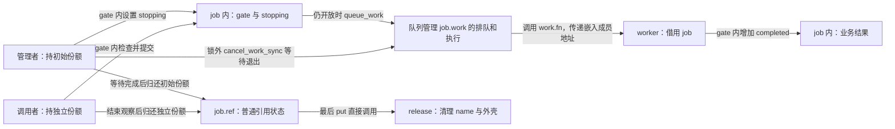
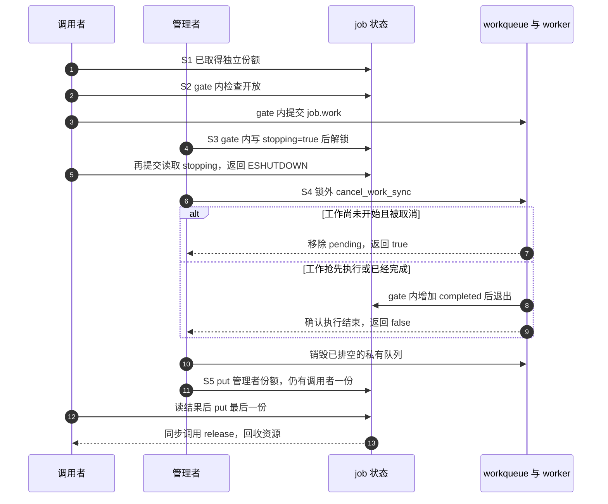
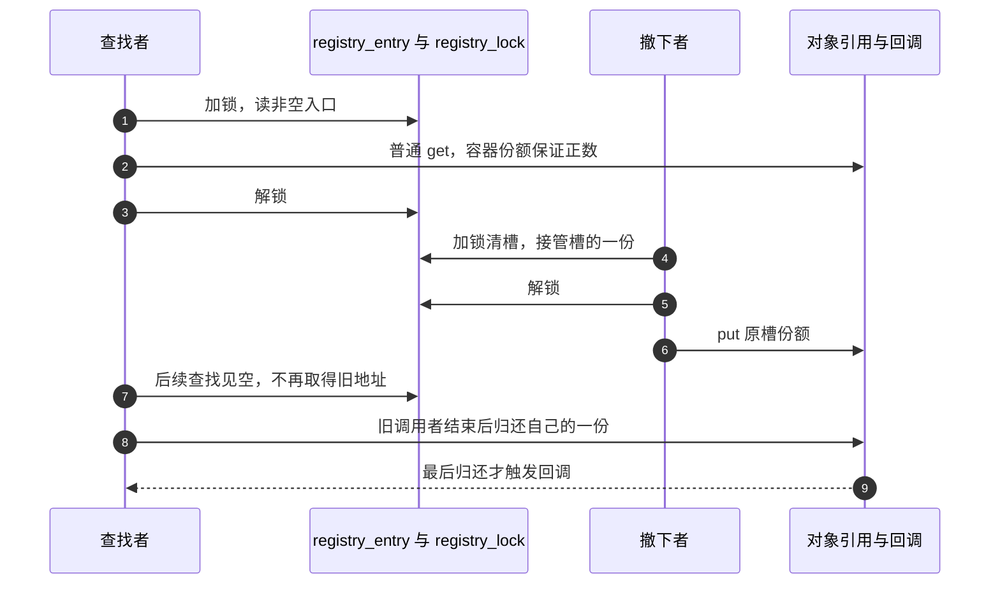
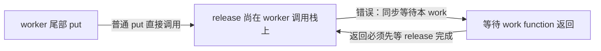

# 第6章\_release\_回调与复杂销毁模式

## 6.1\_本章主线

上一章已经能判断一次 get 是否成立、一次 put 是否触发回调，以及回调是否接过调用者的锁。现在给对象加上一项实际工作：它接受请求，把一项计算交给 worker，关闭时取消尚未开始的工作，等待已经开始的工作退出。此时只有一句“最后 put 后 kfree”还不够：**谁让 worker 停下来，等待期间又由谁保留对象？**

先保留一个有用的最小结论：普通 kref 的正常最后归还，在当前调用栈上调用类型指定的 release。然后补它未负责的部分。kref 不知道对象里的 work、timer、注册关系和子资源；若这些访问者没有纳入引用或借用协议，计数归零不会自动让它们消失。

本章讨论 **内嵌裸 kref 的私有对象**。后面的 `owned_job` 有自己的名称、工作和关闭协议，不是 `struct device`、`struct class` 或 `struct bus_type`。私有对象持有一个 device 引用时，应按该框架的接口归还；不能把私有对象的 release 当作 driver core 的 release 分发，也不能直接释放 device 的外壳。框架边界留给后续专章。

我们先完成一个没有全局查找入口、没有硬件、只有一个关闭管理者的实例，再逐项加入可见性、执行上下文、timer、注册回调和 RCU 的约束。读完本章，应能沿一次关闭过程指出：哪个动作禁止新访问，哪个动作等待旧访问，哪个动作归还责任，哪个动作最终回收存储。它们可能相邻，但不是同一件事。

## 6.2\_先看完整模板\_release\_只是最后一站

第 1 章已经用“每次成功交付拥有一份”的方式保留工作对象。现在换一个确有用途的设计：一个管理者长期拥有对象，worker 只在管理者规定的活动期里借用它。关闭者可以睡眠，也负责等待所有借用结束。这样不用给每次工作都追加引用，但管理者不能提早退出，也不能在自己的 worker 里同步等待自己。

先预测下面两种顺序。若关闭时工作还在队列中，它被取消，计算次数为 0；若 worker 已经抢先执行，关闭者等它完成，计算次数为 1。**两种结果都可以正确关闭**，因为本例约定关闭可以丢弃尚未开始的工作，并没有保证每个已接受请求都必须完成。若业务要求请求必达，应另选等待完成而不丢弃请求的协议。

### 6.2.1\_状态保存在谁那里

这里有三组相互约束的状态，不是一个计数就能表达的单一状态机：

- `job->ref.refcount.refs.counter` 保存管理者和独立调用者的份额；worker 不占其中一份。
- `job->stopping` 由关闭者在 `job->gate` 下写入，提交者在同一锁下读取。检查通过与 `queue_work()` 必须位于同一个锁窗口，否则关闭者可能在二者之间排空队列，提交者随后又排入旧对象。
- `job->work` 的排队/执行状态由 workqueue 管理；`job->completed` 是本例业务结果，由 worker 在 `gate` 下修改，关闭等待完成后才由仍持引用的观察者读取。结果字段不是“work 已经退出”的同步标志。



这张图中，停止状态通过共享字段和 mutex 传播，执行结束通过 workqueue 的同步取消返回传给管理者。kref 没有轮询 `completed`，也不会发送“请停止工作”的通知。同步取消内部的等待协议可沿[工作队列源码总索引](../../../../research/source_reading/workqueue/navigation/P01_Linux_6.12_工作队列源码总阅读索引.md#1.6_建议阅读顺序)进入；本章只组合它已提供的接口保证。

### 6.2.2\_运行一个由管理者等待借用退出的模块

下面是完整的 [note_kref_owned_work.c](../../../../labs/kernel/object_lifetime/materials/note_kref_owned_work.c)。成功创建才建立初始引用；三个资源申请中的任何一步失败，都沿已经取得的资源逆序清理，不对尚未初始化的 kref 执行 put。`kzalloc` 取得清零的外壳，`kstrdup` 复制并拥有名称，`INIT_WORK` 将嵌入工作项连接到回调；`GFP_KERNEL` 沿用前章可睡眠创建路径的分配约束。错误常量中，ENOMEM 表示资源申请失败，EBUSY 表示本次未追加工作，ESHUTDOWN 表示入口关闭，EIO 用于报告本例预期之外的结果。

```c
// SPDX-License-Identifier: GPL-2.0
#include <linux/errno.h>
#include <linux/kref.h>
#include <linux/module.h>
#include <linux/mutex.h>
#include <linux/slab.h>
#include <linux/workqueue.h>

struct owned_job {
    char *name;
    struct kref ref;
    struct mutex gate;
    struct work_struct work;
    struct workqueue_struct *queue;
    bool stopping;
    unsigned int completed;
};

static unsigned int release_calls; /* 本模块的初始化过程串行读取统计。 */

static void owned_release(struct kref *ref)
{
    struct owned_job *job = container_of(ref, struct owned_job, ref);
    ++release_calls;
    kfree(job->name);
    kfree(job);
}

static void owned_put(struct owned_job *job)
{
    kref_put(&job->ref, owned_release);
}

static void owned_worker(struct work_struct *work)
{
    struct owned_job *job = container_of(work, struct owned_job, work);
    /* 借用由管理者保持到 cancel 返回；worker 没有自己的一份可 put。 */
    mutex_lock(&job->gate);
    ++job->completed;
    mutex_unlock(&job->gate);
}

static struct owned_job *owned_create(void)
{
    struct owned_job *job = kzalloc(sizeof(*job), GFP_KERNEL);
    if (!job)
        return NULL;
    job->name = kstrdup("managed-work", GFP_KERNEL);
    if (!job->name)
        goto free_job;
    job->queue = alloc_ordered_workqueue("note_owned", 0);
    if (!job->queue)
        goto free_name;
    mutex_init(&job->gate);
    INIT_WORK(&job->work, owned_worker);
    kref_init(&job->ref); /* 所有资源就绪后，才建立管理者的初始份额。 */
    return job;

free_name:
    kfree(job->name);
free_job:
    kfree(job);
    return NULL;
}

/* 调用者持独立引用。停止检查与实际排队必须处于同一个锁窗口。 */
static int owned_request(struct owned_job *job)
{
    int result;
    mutex_lock(&job->gate);
    if (job->stopping)
        result = -ESHUTDOWN;
    else
        result = queue_work(job->queue, &job->work) ? 0 : -EBUSY;
    mutex_unlock(&job->gate);
    return result;
}

/* 仅管理者调用一次；消耗初始份额。必须可睡眠且不能从本 work 调用。 */
static void owned_close(struct owned_job *job)
{
    struct workqueue_struct *queue;
    mutex_lock(&job->gate);
    job->stopping = true;
    queue = job->queue;
    mutex_unlock(&job->gate);

    /* 先关入口，再在锁外等 worker；无重排和其他生产者。 */
    cancel_work_sync(&job->work);
    destroy_workqueue(queue);
    mutex_lock(&job->gate);
    job->queue = NULL;
    mutex_unlock(&job->gate);
    owned_put(job); /* 此后关闭者不再访问 job。 */
}

static int __init note_owned_init(void)
{
    struct owned_job *job = owned_create();
    int submitted, after_close;
    if (!job)
        return -ENOMEM;

    kref_get(&job->ref); /* 模拟一个调用者，关闭后仍须归还这一份。 */
    submitted = owned_request(job);
    owned_close(job); /* 此后只凭调用者份额保留对象。 */
    after_close = owned_request(job);
    /* 已无 worker 写 completed；调用者的一份保护 name 和外壳。 */
    pr_info("note_owned: %s submit=%d closed=%d completed=%u\n",
            job->name, submitted, after_close, job->completed);
    owned_put(job);
    return submitted ? submitted : after_close == -ESHUTDOWN ? 0 : -EIO;
}

static void __exit note_owned_exit(void)
{
    pr_info("note_owned: release=%u\n", release_calls);
}

module_init(note_owned_init);
module_exit(note_owned_exit);
MODULE_LICENSE("GPL");
MODULE_DESCRIPTION("管理者保活并等待借用工作退出的完整实验");
```

`owned_request()` 的调用者必须已经有引用。它返回 0 只表示本次排队被接收，`-EBUSY` 表示这次没有追加一次执行，`-ESHUTDOWN` 表示已关闭；三者都不转交调用者自己的份额。worker 始终借用管理者保护的存储，所以没有“取消成功需要补 put”的票据。本例不能与每次工作持一份的模型混用。

`owned_close()` 只由初始份额的管理者调用一次。它先关闭提交窗口，再退出 `gate`，随后同步取消工作、销毁私有队列，最后归还管理者份额。如果仍持 `gate` 等待，worker 正需要该锁来结束计算，就会形成“关闭者等 worker，worker 等关闭者解锁”的循环；把等待放在锁外正是为了解开这条依赖。

模块中没有导出接口或其他生产者；worker 不重新投递。它的完整关闭发生在初始化返回前，卸载时只输出对象外的统计。把这些函数接到实际驱动时，还要建立外部调用者和模块代码的进入/退出协议，不能只复制这个 `module_exit()`。

在与运行内核匹配、已经准备好的可写构建环境中执行：

```bash
# KDIR 由当前构建环境设置，指向匹配目标内核的构建目录。
make -C "$KDIR" M="$PWD/labs/kernel/object_lifetime/materials" modules
sudo insmod labs/kernel/object_lifetime/materials/note_kref_owned_work.ko
sudo rmmod note_kref_owned_work
dmesg | tail -n 12
```

观察 `note_owned` 日志：`submit=0`，`closed=-108`（该固定内核的 `ESHUTDOWN`），`completed` 为 0 或 1，卸载输出 `release=1`。前两项说明提交与关闭后的入口行为，最后一项说明这个同步演示只回收一次；一次日志没有覆盖所有实际竞态。若编译或装载失败，先保留错误并核对构建目录、架构和运行版本，不能把宿主检查当作已成功装载。

本轮已完成 ARM 前端语法检查和宿主九组控制路径检查，含三处分配失败、两种模块顺序、关闭窗口中的再提交拒绝、重复工作及管理者最后退出。宿主的锁、原子和队列是显式顺序替身，没有真实线程；目标构建链接、装卸、调度竞争和内存序未验证。命令是读者复现实验的步骤，不是本轮执行报告。

### 6.2.3\_沿一轮关闭追踪到最后清理

本章用 S0～S5 标记这个具体对象的一轮过程；它细化的是本例的管理协议，不是内核字段中另存的一套枚举。

| 阶段 | 触发与写入 | 谁继续持有或读取 | 退出条件 |
| --- | --- | --- | --- |
| S0 准备 | 创建者取得外壳、name、queue，初始化 gate/work/ref | 管理者持初始一份 | 成功返回；失败只清理已取得资源 |
| S1 取得调用者份额 | 管理者在有效正引用保护下 get | 调用者取得第二份 | 责任交付完成 |
| S2 接受工作 | 调用者在 gate 下检查 stopping，向队列发布 work | worker 借用对象；管理者仍持初始一份 | 拒绝，或一次工作进入队列 |
| S3 关闭提交 | 管理者在 gate 下写 stopping=true | 后来的提交者在同锁下读到关闭并拒绝 | 退出 gate，此后无新的成功提交 |
| S4 排空借用 | 管理者在锁外 cancel；必要时等 worker 返回；销毁 queue 并置空 | worker 在等待完成前仍由管理者保活 | 已无排队或执行，私有队列退出 |
| S5 归还与清理 | 管理者 put，独立调用者结束后也 put | 最后归还者直接进入 release | name 和外壳各释放一次 |



在这个单次投递演示里，取消返回 true/false 可对应图中两支；一般 work 重排场景不能只凭这个布尔值重建整段执行历史。真正承担对象安全保证的是 **先封闭全部生产者，再等待没有旧执行者**，不是把 true 读成“安全”、false 读成“失败”。固定版本的[同步取消实现](../../../../research/source_reading/workqueue/source_explanations/P03_Linux_6.12_worker_flush与取消源码实现.md#3.5_cancel_work_sync撤销与等待)明确写出不存在竞争投递这一前提。

试着在纸上改两处代码：第一，把 `owned_put(job)` 从 S5 移到 S4 等待之前，且让管理者成为唯一持有者；此时尚在执行的 worker 会拿到已回收对象。第二，让 `owned_request()` 解锁后才排队；此时它可能在 S4 返回后重新发布 work。前者缺的是存储保留，后者缺的是关闭和发布的串行化，单独增加一个停止标志不能同时修复两者。

## 6.3\_release\_的责任域和非责任域

回到完整程序，release 只有三件事：从嵌入成员找回对象、释放拥有的名称、释放外壳。简短是前面协议成立的结果，而不是把复杂问题藏在“都已经停了”这句话后面：S3 给出不再接受工作的证据，S4 给出借用者已经退出的证据，S5 才让管理者离开。若省掉任一证明，回调再短也可能释放得太早。

它与第 1 章的持票 worker 有意不同。持票模型允许创建者在交付后先退出，代价是接收、拒绝、完成、取消都要明确归还对应份额；本章模型让 worker 不做 get/put，代价是单一管理者必须活到排空结束且能合法等待。需要独立异步活动继续存在时选择前者；明确由上层关闭者统一收敛的活动可以选择后者。不要为了减少一对原子操作，就删除上层并不存在的等待保证。

也不能把本例扩成“所有对象进入 release 以前一定已经不可见”的定理。上一章的非拥有索引由[最后回调接锁撤下入口](P05_基础_API_源码逐行讲解.md#5.8.2_kref_put_mutex%28%29_的典型用途)，它同样正确；本例则根本没有全局查找入口。哪些动作放在 release，取决于入口与计数的连接方式、执行上下文以及谁等待谁。

一般应把必须主动启动的业务关闭交给仍持有效责任的管理者，把最后资源归还交给 release。若一个注册关系自己拥有一份，却期望 release 先注销它，计数就会因为那一份始终不能归零；反过来，若注册回调没有任何保活依据，归零后仍能进来的回调会访问已释放存储。两种错误一边造成无法退出，一边造成过早退出，不能用同一条“在 release 加 unregister”同时修好。

release 可以选择延迟最终存储回收，也可以按已证明的协议完成脱链；它不能把归零对象重新当作有业务引用的对象发布。诊断能帮助发现违约，不能建立原来没有的同步。后续小节按这三个问题展开：外部入口怎样撤销、最后回调处于什么上下文、延迟访问者怎样退出。

## 6.4\_release\_的触发条件和基本释放范围

现在区分触发条件和清理清单。触发由引用协议提供；清单由对象的资源取得方式提供。两者都需要正确，但不能互相替代。

### 6.4.1\_release\_的触发条件

在正常、未损坏且每份责任恰好归还一次的 kref 周期里，最终归还将计数从 1 减到 0，随后调用本次 put 指定的回调。锁组合还会按上一章的协议交出锁。计数异常进入饱和告警等分支时，不能继续套用这条正常结论；[普通源码导读](../../../../research/source_reading/kref/navigation/P02_普通引用与归零回调导读.md#2.4_正常退出与异常收敛)将两种情况分开。

“没有剩余引用”不等于“世界上没有任何裸指针”。本例依 S4 证明 worker 已不再借用；RCU 对象则可能仍有旧读者处于受保护的借用区间，因而还不能回收其存储。release 自己也正通过裸地址做清理。正确要求是：**不能再把零计数身份当作活的业务引用继续取得；仍可能访问的地址必须有另一项尚未结束的存储保护依据。**

因此，禁止在普通 release 中用 get 或重新 init 把同一个已归零身份“救活”。如果释放策略需要把清理工作交给另一个执行者，传递的是明确保留存储的清理责任，要另行证明交付、失败和执行上下文；不是悄悄恢复旧业务对象的引用。对象池重新构造一个新身份也需要旧访问者已退出的独立前提。

### 6.4.2\_release\_负责释放什么

`owned_job` 的资源不是同时退出的。私有队列会执行借用对象的代码，必须先在 S4 停止和销毁；名称仍可被独立调用者观察，所以保留到 S5。外壳最后回收，因为前面所有成员地址都落在它里面。

这也说明“先释放子资源，再释放外壳”只有在依赖关系允许时才完整。若子资源的退出会回调父对象，就要把父对象保留到该回调结束；若独立调用者在关闭后仍允许读取某个缓冲区，就不能提前释放它。不能把所有指针放进一个统一的 kfree 列表，也不能把依赖关系全凭字段声明顺序决定。

| 本例资源 | 取得点 | 使用窗口 | 对应退出动作 |
| --- | --- | --- | --- |
| job 外壳 | `kzalloc` 成功 | 创建、提交、worker、关闭及独立调用者 | release 最后 `kfree(job)` |
| name | `kstrdup` 成功 | 对象创建后直到最后观察者退出 | release 先 `kfree(job->name)` |
| queue | 创建私有有序队列成功 | 允许提交直到同步取消返回 | S4 `destroy_workqueue`，随后成员置空 |
| 调用者份额 | 正常 get | 关闭后的拒绝与结果观察仍有效 | 调用者自行 put，不由关闭者代还 |

创建失败发生在 S0，尚未取得的资源没有退出动作；成功创建后的关闭发生在 S3～S5，管理者不能跳过等待直接执行与失败标签相同的 kfree。两个路径都“释放内存”，成立前提却不同。

### 6.4.3\_release\_只释放对象\_拥有\_的资源

字段类型本身不足以决定归属。`const char *name` 可能指向静态字符串，也可能指向另一个拥有者管理的内存；`char *name` 也不会自动宣布对象获得释放权。把它写进结构，只保存了一个地址。

| 取得与保存方式 | 对象实际承担的责任 | 退出时的方向 |
| --- | --- | --- |
| 借用静态字符串 | 不拥有该字符串存储 | 不对字符串 kfree |
| 私有 `kstrdup` / `kmalloc` 成功 | 拥有这一块分配 | 无使用者后按分配配对 kfree |
| 明确取得 file 的一份引用 | 归还当前对象持有的文件引用 | 按 file 契约执行 fput，不直接 kfree file |
| 明确取得 device 的一份引用 | 归还当前对象持有的设备引用 | 按 device 契约执行 put_device，不替换设备最终回调 |
| 只借用另一对象的成员地址 | 在对方承诺的有效窗口内使用 | 结束借用；不能凭地址擅自 put 或 free 对方 |

表中的“归还引用”不承诺被引用对象立即销毁，也不承诺任何上下文都能执行整个清理链。应分别核对该类型的空值约定、最后归还行为、回调与睡眠约束，不能把它们套用本例只清理 kmalloc 内存的回调。

练习：把完整程序的 `name` 改为借用字符串常量，要一起改变哪些地方？至少要改创建时的取得方式、申请失败出口和 release 的资源清单；若只改赋值却保留 `kfree(job->name)`，就把原本不拥有的存储当成了私有分配。再把名称改为借用另一个动态对象的成员：这一次除了清理清单，还必须增加对那个拥有者寿命的证明。


## 6.5\_外部可见性\_脱链应该由谁负责

完整工作模块只有持引用的调用者，没有全局索引。现在加入一个查询入口：读者先在表中找到地址，再取得自己的引用。多出的难题并非“在哪里写 list_del”这么简单，而是 **从发现地址到取得份额之间，谁保证对象还活着？** 撤下入口与最终回调的先后必须围绕这个窗口安排。

### 6.5.1\_release\_前必须明确对象是否已经脱链

先在纸上执行一个错误顺序：表中保存对象地址；最后持有者 put 后直接释放外壳；查找者随后从表中读出原地址，访问其中的 kref。此时即使用条件取得也太迟，因为它首先要读一个已经失效的计数成员。问题发生在“能否访问计数地址”这一层，不能由“计数为零就不增加”补救。

但“表里有地址”也不自动表示表拥有引用。需要查清两个独立约定：表是否保留一份，查找与最终撤下是否使用同一项保护。上一章已有两个完整程序可作对照：拥有一份的 `registry_entry`，以及不拥有一份的 `index_entry`。本节比较它们关闭同一个查找窗口的不同方法，不另造一份没有创建、失败和归还路径的链表片段。

对于 list、hash、xarray 或 idr，容器名称本身不回答所有权问题。应先确定“谁拥有这一份”，再决定具体摘除接口；换用更方便的容器不会自动修好回收协议。还有第三种情况是 RCU 读者已经取到旧地址，即便索引被撤下，它仍可能在保护区间内访问，存储回收还需等待对应读侧结束。

### 6.5.2\_release\_前脱链模型

先回访[P02 完整容器模块](P02_源码入口与结构定义.md#2.30.1_设计_A_容器持有引用)。`registry_entry` 非空时拥有一份；`registry_lock` 保护槽的读、发布和清空。查找者在该锁内见到非空槽，凭容器那一份保证普通 get 时仍为正数，取得自己的份额后才离开锁。

撤下者执行反向交接：锁内清槽，同时把槽原有的责任接到自己手里；解锁后归还这一份。这样，即使这次 put 最终回收，也已经没有新查找者能通过该槽取得旧对象。此前取得份额的读者继续持有，最后由它们自行归还；“入口消失”与“已有使用者消失”因此可以发生在不同时间。

这个设计适合注册关系本身就应使对象存活的场景。代价是必须有明确的移除动作；如果管理者永远不移除，容器那一份也不会凭空消失。release 不能承担首次移除并归还同一容器份额，否则要等零才能移除、又要移除才能到零，形成责任循环。



若用链表而非单槽，清理时的 `list_empty()` 只是一项约定检查。它检查节点是否自环，不是通用“已不在任何容器”的证明。只有节点先正确初始化，且摘除使用恢复自环的 `list_del_init()` 等约定时，这个断言才与“已摘下”对应；普通 `list_del()` 的毒化状态不能这样判读。具体表示已在[P03 清理诊断](P03_kref_生命周期状态机.md#3.7.1_release_阶段_对象销毁点)建立，检查不替代锁和所有权。

### 6.5.3\_release\_内脱链模型

再回访[P05 非拥有索引模块](P05_基础_API_源码逐行讲解.md#5.8.2_kref_put_mutex%28%29_的典型用途)。`index_entry` 不保留引用，对象可以因为真实使用者都退出而自动到达最终回调。为使锁内普通查找仍有正数保证，所有最终减少都通过同一 `index_lock` 的组合接口：可能只剩一份时先保留它，取锁后再减少判断；真正到零时回调已经接到锁，清槽、解锁、释放外壳。

这不是“先在锁外归零，然后回调再取锁”。如果改成后一种顺序，查找者可能已经持索引锁，看见还没被撤下但计数已零的对象；普通 get 就没有正引用依据。该顺序可以另行设计成条件取得协议：回调等索引锁期间保留存储，查找者在锁内尝试 `kref_get_unless_zero()`，失败则解锁并拒绝。它与普通查找协议有不同的前提，不能只替换最后 put 那一行。

| 关系 | 查找窗口的正数/地址依据 | 撤下由谁完成 | 不能省略的代价 |
| --- | --- | --- | --- |
| 容器拥有一份 | 非空入口自己的份额，查找与清槽同锁 | 管理者先清槽，再归还容器份额 | 必须有主动移除者 |
| 非拥有索引，最终减少与查找同锁 | 锁内见到未撤入口时，最终减少尚未越过同锁 | 归零回调在接到的锁下撤下 | 所有归还路径遵守同一最终减少协议 |
| 非拥有索引，普通 put 可在锁外归零 | 锁阻止回调释放存储，但不保证计数为正 | 回调取锁撤下 | 查找必须条件取得并处理失败 |

表中最后一项的地址保护只覆盖索引锁窗口；失败后不能解锁再访问对象，也不能把它推广成任意无锁查找。对应的[条件模块](../../../../research/source_reading/kref/navigation/P03_条件取得与查找窗口导读.md#3.2_从观察到自己持有)与[最终减少模块](../../../../research/source_reading/kref/navigation/P04_最后归还与锁交接导读.md#4.2_把最后减少留在锁内)分别保存固定版本的状态与函数协作，后续查找和锁组合章节再扩大场景。

练习：一个非拥有索引原来全部使用锁组合 put，后来某条错误出口改用普通 put。为什么回调中仍然执行“加锁、清槽”也不能保持原有普通 lookup 正确？尝试安排查找者先拿到锁，再由另一持有者在锁外归零；你会发现被破坏的是查找的正数依据，而不是清槽这个动作是否存在。

## 6.6\_release\_的执行上下文和锁语义

目前知道该清理什么、入口怎样撤下，还欠一项证明：这些清理动作在 **最后归还者当时的执行条件** 下能否运行。进程/中断属于执行环境，spinlock/mutex 属于此刻的持锁状态，两组约束会叠加；不能只看到“驱动函数”或“worker”这个名字就批准睡眠。

### 6.6.1\_release\_能否睡眠取决于最后\_put\_上下文

本章完整工作模块刻意把关闭安排在初始化函数的可睡眠过程，且退出 `gate` 后才等待普通工作队列。若把同一个等待动作搬到硬中断、软中断、持普通自旋锁或禁止调度的临界区，就破坏了执行条件。这里的普通自旋锁按当前非 PREEMPT_RT 基线理解，不把其实现细节直接外推到 RT 配置。

可睡眠也不表示一定能等到结果。例如管理者拿着 `gate` 调用同步取消，worker 必须取得 `gate` 才能返回，即使管理者是普通进程，也会形成锁等待循环。分析需要先过两个独立问题：当前环境是否允许阻塞；被等待者能否在我们保留的锁和责任条件下继续前进。

| 最后归还可能来自 | release 继承的主要约束 | 本章如何安排 |
| --- | --- | --- |
| 普通可睡眠路径且无冲突锁 | 可以选择睡眠操作，但仍须排除等待循环 | 关闭者在 S4 等待，S5 回调只回收剩余存储 |
| 同一对象的 worker 尾部 | 尚未从这个 work 的函数返回 | 回调不能同步取消或等待这个 work 自己 |
| 硬中断、软中断、禁调度区间 | 不允许任意阻塞 | 回调必须适配，或把清理责任交给已证明可用的执行者 |
| 持锁的最终归还 | 锁与其他上下文限制同时存在 | 明确回调是否负责解锁，以及之后仍有哪些限制 |
| RCU 保护或回调路径 | 必须遵守对应 RCU 类型/回调的执行契约 | 不能把“延迟”当成自动获得睡眠资格 |

不要用 `kref_read()==1` 猜本次是否最后一次，再只给“看起来会最后”的调用者检查上下文；快照会变化。设计时应覆盖所有可以归还最后一份的路径。否则一次平常总是非最后的错误出口，也可能在另一参与者先退出时突然执行整个 release。

### 6.6.2\_普通\_kref\_put\_下的\_release\_上下文

普通 `kref_put()` 没有启动清理线程，也没有替调用者释放外部锁。回调就在这一次 put 的调用栈中发生；归还以后调用者不再凭已经交还的份额访问对象。[普通实现](../../../../research/source_reading/kref/source_explanations/include/linux/kref.h.md#1.4_最后归还调用清理)中直接调用回调的语句体现了这个边界。

以第 1 章的持票工作为例：worker 在最后一行 put，可能立即进入 release。即使这时计数已经为零，work function 仍未返回；若 release 同步等待该 work，必须等到自己的调用栈先退出，而调用栈又等 release 返回。**“引用已归还”和“执行函数已返回”不是同一个事件。** 本章管理者模型通过保持初始份额到同步等待以后，避免把排空工作留给归零回调。



若确实只有非睡眠路径可能最后归还，而资源必须在可睡眠路径退出，需要设计一次 **清理责任转交**：归零回调保持外壳有效，将退休对象交给已就绪的清理执行者，后者完成资源退出再回收。这个新协议要处理接收失败、执行者自身寿命、重复投递和模块卸载；不能在回调里再次 get 旧计数，也不能以“放进某个 workqueue”几个字省略责任。

RCU 延迟回收解决的则是旧读者可能仍在访问存储的问题。它不与工作队列等价，也不保证 RCU 回调可以阻塞。若既有读者宽限期要求又有睡眠清理要求，就有两项独立的完成条件，必须安排先后或责任交接；[RCU 复合对象的回调边界](../../synchronization_and_asynchrony/synchronization/rcu/P21_RCU_kref与复合对象生命周期.md#21.1_先按分配与所有权拓扑选模板)给出相关拓扑，而非给所有 release 统一套 `kfree_rcu`。

### 6.6.3\_release\_在持\_mutex\_状态下执行

`kref_put_mutex()` 正常归零进入回调时，指定 mutex 已持有，回调接管解锁责任；返回后包装器不会再帮它 unlock。相反，没有触发回调的路径可能根本未取锁，也可能取锁重查发现别人加入后已经自行解锁。因此调用者不能不分返回分支再补一次解锁。

P05 完整程序中的 `indexed_release_locked()` 正好表达这个契约：它在持 `index_lock` 时清理属于当前对象的槽，随后解锁，再释放外壳；拒绝发布的新对象不能误清另一个对象占据的槽。这里的名称和注释都告诉维护者“已经持锁进入”，所以不要在函数开头再次锁同一把 mutex。

把 mutex 成员放在即将释放的对象里还会多出存储问题：必须先结束对该 mutex 的使用，再释放承载它的外壳。完整索引程序选择对象外的锁，让锁的寿命不依赖某一个被索引对象，但它仍要保证模块中的锁在所有调用结束前存在。

用三个问题检查这一调用点：回调接的是哪一把锁，谁负责解锁，解锁以后其他路径还能通过什么入口接触对象？名字中有 `_locked` 只是提示，不能替代这三项约定。固定调用链见[归零锁交接](../../../../research/source_reading/kref/source_explanations/include/linux/kref.h.md#1.8_归零时把锁交给回调)。

### 6.6.4\_release\_在持\_spinlock\_状态下执行

`kref_put_lock()` 同样在归零时把指定 spinlock 交给回调。当前普通非 RT 语境下，持该锁不能调用可能睡眠的清理动作；回调通常先完成受锁保护的短小撤下操作，再按调用协议解锁。它还要避免任何会再次取得同一锁的间接函数。

但“先 unlock，再做复杂清理”仍不是通用修复。如果最后归还来自中断，释放 spinlock 后仍在那个中断里；如果调用者事先关闭本地中断，普通 `spin_unlock()` 也不会替它恢复原状态。`kref_put_lock()` 的固定实现使用普通 spin lock 组合，不包含 irqsave/irqrestore 配对，调用者必须另证中断重入和状态恢复。

因此，为 spinlock 版本选择 release 时，应先列清所有最终归还来源，再选择这些来源共同允许的动作；需要阻塞的资源退出通常前移到仍持管理责任的可睡眠关闭阶段，或走完整的清理责任转交协议。不能把 mutex 版本的等待代码原样搬来，也不能凭一次无告警测试就认为 IRQ 或 RT 分支得到验证。

至此可回答开篇实例为什么把 `cancel_work_sync()` 放在 S4：那里管理者有一份、无 `gate` 锁、允许睡眠且不是该 work 自身。将它放进 release 会丢失这些由调用协议建立的前提。下一节继续增加异步来源，重点检查反复启动、重新排队和注册解除会怎样改变退出责任。


## 6.7\_异步路径\_work\_timer\_callback\_的引用闭环

异步路径的问题通常不是 release 代码本身，而是 work/timer/callback 是否拥有引用、谁负责取消、谁负责 put 没有定义清楚。

### 6.7.1\_release\_和\_workqueue\_的收尾关系

如果对象里有 `work_struct`：

```c
struct my_refobj {
	struct kref ref;
	struct work_struct work;
};
```

必须明确：

```text
work 是否持有对象引用？
release 时 work 是否还可能运行？
release 是否需要 cancel_work_sync？
```

常见安全模型之一：

```text
投递 work 前 kref_get；
work 函数结束时 kref_put；
release 不需要 cancel_work_sync 保护 work 对对象的访问。
```

示例：

```c
static int my_refobj_queue_work(struct my_refobj *refobj)
{
	kref_get(&refobj->ref);

	if (!queue_work(system_wq, &refobj->work)) {
		my_refobj_put(refobj);
		return -EBUSY;
	}

	return 0;
}

static void my_refobj_workfn(struct work_struct *work)
{
	struct my_refobj *refobj = container_of(work, struct my_refobj, work);

	/* 使用 refobj */

	my_refobj_put(refobj);
}
```

这个模型里，work 自己持有引用。

所以只要 work 还没结束，对象就不会 release。


### 6.7.2\_release\_中\_cancel\_work\_sync\_的风险

有些设计会在 release 里取消 work：

```c
static void my_refobj_release(struct kref *ref)
{
	struct my_refobj *refobj = container_of(ref, struct my_refobj, ref);

	cancel_work_sync(&refobj->work);
	kfree(refobj);
}
```

这要求非常谨慎。

原因有两个。

第一，`cancel_work_sync()` 可能睡眠。

所以 release 必须保证在可睡眠上下文执行。

第二，如果 work 本身持有引用，并且 work 结束时才 put，那么 release 一般不会在 work 还持有引用时发生。

也就是说：

```text
如果 work 持有引用，release 发生时 work 理论上已经不再持有引用。
```

这时 release 里再 `cancel_work_sync()` 的意义需要重新审视。

更危险的是互相等待模型：

```text
work 等待某个引用释放
release 等待 work 结束
```

可能构成死锁。

所以 work 模型要二选一并写清楚：

```text
模型 A：work 持有引用，work 完成后 put，release 不负责等待 work。
模型 B：对象 owner 管理 work 生命周期，release 前已经保证 work 不再运行。
```

不要让 release 和 work 引用关系相互纠缠。


### 6.7.3\_release\_和\_timer\_的收尾关系

timer 比 work 更容易出错，因为 timer 回调可能在软中断上下文运行。

如果对象里有 timer：

```c
struct my_refobj {
	struct kref ref;
	struct timer_list timer;
};
```

必须明确：

```text
timer 回调是否持有引用？
timer 删除发生在哪个阶段？
release 能不能调用 del_timer_sync？
最后 put 可能是否发生在 timer 回调中？
```

一种常见模型：

```text
启动 timer 前增加引用；
timer 回调执行完释放引用；
取消 timer 成功时释放 timer 引用。
```

示例模型：

```c
static void my_refobj_start_timer(struct my_refobj *refobj)
{
	kref_get(&refobj->ref);
	mod_timer(&refobj->timer, jiffies + HZ);
}
```

timer 回调：

```c
static void my_timer_fn(struct timer_list *t)
{
	struct my_refobj *refobj = from_timer(refobj, t, timer);

	/* 使用 refobj */

	my_refobj_put(refobj);
}
```

取消路径必须处理：

```text
如果 timer 被成功取消，那么 timer 回调不会执行；
因此原本给 timer 的引用要由取消路径 put。
```

示意：

```c
static void my_refobj_cancel_timer(struct my_refobj *refobj)
{
	if (del_timer_sync(&refobj->timer))
		my_refobj_put(refobj);
}
```

这里的核心是：

```text
timer 引用必须有唯一释放者：
要么 timer 回调释放；
要么取消成功路径释放。
```

否则会少 put 或多 put。


### 6.7.4\_release\_不应该负责模糊的\_timer\_语义

错误倾向：

```c
static void my_refobj_release(struct kref *ref)
{
	struct my_refobj *refobj = container_of(ref, struct my_refobj, ref);

	del_timer_sync(&refobj->timer);
	kfree(refobj);
}
```

这不是绝对错误，但很容易掩盖生命周期不清晰。

你必须回答：

```text
timer 启动时是否 get？
timer 回调是否 put？
release 发生时 timer 是否可能还持有引用？
del_timer_sync 如果返回 1，是否需要 put timer 引用？
如果 release 在 timer 回调中触发，会不会 del_timer_sync 自己等待自己？
```

如果这些问题答不清楚，就不应该把 timer 收尾简单塞进 release。

更清晰的设计是：

```text
timer 的引用归属在启动、取消、回调路径中闭环；
release 只检查 timer 已经不再活动，或只释放对象本体。
```


### 6.7.5\_release\_和\_callback\_的关系

对象经常注册给某个子系统回调：

```c
register_callback(refobj, my_callback);
```

这时必须定义：

```text
子系统是否持有 refobj 引用？
callback 执行期间对象如何保证不被释放？
unregister_callback 是否等待正在运行的 callback 结束？
```

一种安全模型：

```text
注册前 kref_get，引用属于 callback 注册关系；
unregister 成功后 kref_put；
callback 执行期间由注册关系保证对象存在。
```

示例：

```c
static int my_refobj_register(struct my_refobj *refobj)
{
	int ret;

	kref_get(&refobj->ref);

	ret = register_callback(refobj, my_callback);
	if (ret) {
		my_refobj_put(refobj);
		return ret;
	}

	return 0;
}

static void my_refobj_unregister(struct my_refobj *refobj)
{
	unregister_callback(refobj);
	my_refobj_put(refobj);
}
```

这里必须确认：

```text
unregister_callback 返回后，不会再有新的 callback 进入；
正在运行的 callback 是否已经退出，也必须由子系统语义保证。
```

如果 unregister 只是不再新增 callback，但不等待已有 callback，那么还需要额外同步机制。


### 6.7.6\_release\_不能替代\_unregister

不要把 unregister 全部推到 release 里。

错误倾向：

```c
static void my_refobj_release(struct kref *ref)
{
	struct my_refobj *refobj = container_of(ref, struct my_refobj, ref);

	unregister_callback(refobj);
	kfree(refobj);
}
```

这类代码可能有问题。

因为 release 发生时已经没有合法引用了。

但 callback 注册关系本身通常就应该是一个引用来源。

如果对象还注册在外部子系统中，说明外部子系统可能还能回调它。

这时引用计数怎么能已经归零？

所以更合理的模型通常是：

```text
unregister 阶段撤销外部可见性；
unregister 释放注册关系引用；
最后一个 put 才进入 release。
```

也就是：

```text
release 不负责让对象不可见；
release 只处理对象已经不可见之后的最终销毁。
```

当然某些内核子系统有自己的特殊规则，但通用原则是：

```text
外部注册关系应该在 release 前明确撤销。
```

------

## 6.8\_RCU\_边界\_生命周期结束不等于内存立刻回收

RCU 场景下，kref 生命周期可以结束，但对象内存可能还要撑过 grace period。

### 6.8.1\_release\_和\_RCU\_的边界

如果对象可以被 RCU 读侧看到，那么 release 里不能简单：

```c
kfree(refobj);
```

因为 RCU 读侧可能仍然持有旧裸指针。

典型模型是：

```text
更新侧先从 RCU 可见结构中删除对象；
禁止新读者找到它；
已有 RCU 读者可能仍在临界区中；
等 grace period 后才能释放内存。
```

所以 release 里可能需要：

```c
kfree_rcu(refobj, rcu);
```

而不是：

```c
kfree(refobj);
```

示例结构：

```c
struct my_refobj {
	struct kref ref;
	struct rcu_head rcu;
	struct hlist_node node;
};
```

release：

```c
static void my_refobj_release(struct kref *ref)
{
	struct my_refobj *refobj = container_of(ref, struct my_refobj, ref);

	kfree_rcu(refobj, rcu);
}
```

这里含义是：

```text
kref 生命周期已经结束；
但对象内存要等 RCU grace period 后再真正释放。
```


### 6.8.2\_kref\_归零和内存真正释放不是永远同一时刻

普通裸 kref 对象：

```text
last put -> release -> kfree -> 内存释放
```

RCU 对象：

```text
last put -> release -> kfree_rcu -> grace period 后内存释放
```

所以要区分两个概念：

```text
对象生命周期结束
对象内存真正归还
```

对于普通裸 kref 对象，这两者几乎连在一起。

对于 RCU 对象，它们中间隔着 grace period。

这不是说对象还能被使用。

对象生命周期已经结束。

只是为了保护 RCU 读侧旧指针，内存暂时不能回收。

所以 RCU 场景下要记住：

```text
refcount 到 0 后，对象不能再被 get 或重新发布；
但 struct kref 所在内存必须撑过 RCU grace period。
```

这个细节会在第 10 章专门展开。

------

## 6.9\_release\_的禁区\_检查和状态边界

这一组内容不是孤立错误清单，而是在说明 release 作为生命周期终点时，哪些动作已经太晚，哪些检查适合留下。

### 6.9.1\_release\_里不能重新发布对象

release 中最危险的错误之一是试图“复活对象”。

错误示例：

```c
static void my_refobj_release(struct kref *ref)
{
	struct my_refobj *refobj = container_of(ref, struct my_refobj, ref);

	kref_init(&refobj->ref);
	list_add(&refobj->node, &refobj_list);
}
```

这是错误的生命周期模型。

进入 release 说明：

```text
refcount 已经归零；
对象已经没有合法持有者；
对象正在销毁。
```

此时不能再：

```text
重新初始化 kref
重新加入 list/hash/xarray
重新注册 callback
重新投递 work
重新暴露给 lookup
```

如果需要对象池复用，也应该把“对象生命周期结束”和“内存块复用”分开。

例如：

```text
kref release 结束对象生命周期；
对象池管理内存块；
重新分配时创建一个新的对象生命周期。
```

不能在 release 里把同一个对象原地复活。


### 6.9.2\_release\_中的调试检查

复杂对象的 release 里适合放一些调试检查。

例如：

```c
static void my_refobj_release(struct kref *ref)
{
	struct my_refobj *refobj = container_of(ref, struct my_refobj, ref);

	WARN_ON(!list_empty(&refobj->node));
	WARN_ON(timer_pending(&refobj->timer));
	WARN_ON(refobj->registered);
	WARN_ON(refobj->running);

	kfree(refobj->buf);
	kfree(refobj);
}
```

这些检查的意义是：

```text
release 发生时，对象应该已经完成撤销和收尾。
```

常见检查项：

```text
是否已经从链表删除
是否已经从 hash/xarray 删除
timer 是否还 pending
work 是否还可能运行
callback 是否已经 unregister
状态是否已经进入 stopped/dead
子资源是否仍然持有
```

这些 WARN 不是为了替代正确逻辑，而是为了尽早暴露生命周期协议错误。


### 6.9.3\_release\_和对象状态

有些对象会有状态字段：

```c
enum my_refobj_state {
	my_refobj_INIT,
	my_refobj_RUNNING,
	my_refobj_STOPPING,
	my_refobj_DEAD,
};

struct my_refobj {
	struct kref ref;
	struct mutex lock;
	enum my_refobj_state state;
};
```

release 可以检查状态是否已经进入终态：

```c
static void my_refobj_release(struct kref *ref)
{
	struct my_refobj *refobj = container_of(ref, struct my_refobj, ref);

	WARN_ON(refobj->state != my_refobj_DEAD);

	kfree(refobj);
}
```

但是 release 不应该依赖复杂状态迁移。

例如不要把主要 stop 流程放进 release：

```c
static void my_refobj_release(struct kref *ref)
{
	struct my_refobj *refobj = container_of(ref, struct my_refobj, ref);

	my_refobj_stop_hardware(refobj);       /* 可能太晚，也可能上下文不对 */
	kfree(refobj);
}
```

更清晰的模型是：

```text
remove/stop 路径负责让对象停止工作；
release 只验证对象已经停止，并释放内存和剩余资源。
```

因为 release 发生的时机取决于最后一个引用，不一定是适合停硬件、关中断、等待线程的时机。


### 6.9.4\_release\_不应承担过多业务逻辑

release 的职责应该尽量收敛：

```text
释放对象拥有的资源；
执行最终一致性检查；
释放对象内存。
```

不建议在 release 里做大量业务动作，例如：

```text
重新配置硬件
发送复杂消息
等待远端响应
启动新任务
重新注册对象
执行复杂状态机迁移
```

原因是：

```text
release 的触发点由最后一个 put 决定；
最后一个 put 可能出现在你不期望的上下文；
release 越复杂，越难保证上下文、锁和错误路径正确。
```

更好的分层是：

```text
stop/remove 阶段处理业务停止；
unregister/unlink 阶段撤销外部可见性；
drain 阶段等待异步路径退出；
release 阶段做最终资源释放。
```

------

## 6.10\_推荐销毁阶段和完整示例

回到本章开头的完整模板：复杂对象应该把销毁拆成阶段，而不是把所有动作塞进 release。

### 6.10.1\_复杂对象销毁的推荐阶段

对于复杂对象，推荐把销毁拆成多个阶段，而不是全塞进 release。

典型阶段：

```text
1. stop：阻止对象继续产生新动作。
2. unregister：从外部子系统撤销注册。
3. unlink：从 list/hash/xarray 等全局结构删除。
4. drain：等待或取消 work/timer/callback。
5. put：释放管理者引用。
6. release：最后一个引用归零后释放对象资源。
```

示意流程：

```text
my_refobj_destroy()
   |
   +-- 设置 stopping 状态
   +-- unregister callback
   +-- del_timer_sync / cancel_work_sync
   +-- 从全局结构 unlink
   +-- my_refobj_put(manager ref)
          |
          +-- 若还有用户引用：等待后续 put
          |
          +-- 若最后引用：release
```

这个模型的优点是：

```text
对象先不可见；
异步路径先收敛；
已有引用自然退出；
最后 release 只做最终释放。
```


### 6.10.2\_一个复杂\_release\_示例

下面给一个相对合理的复杂对象模型。

对象：

```c
struct my_refobj {
	struct kref ref;
	struct mutex lock;
	struct list_head node;

	char *name;
	void *buffer;

	bool registered;
	bool stopping;
};
```

销毁前撤销：

```c
static void my_refobj_unregister(struct my_refobj *refobj)
{
	mutex_lock(&refobj->lock);
	refobj->stopping = true;
	mutex_unlock(&refobj->lock);

	if (refobj->registered) {
		unregister_callback(refobj);
		refobj->registered = false;
	}

	mutex_lock(&refobj_list_lock);
	if (!list_empty(&refobj->node))
		list_del_init(&refobj->node);
	mutex_unlock(&refobj_list_lock);

	my_refobj_put(refobj);
}
```

release：

```c
static void my_refobj_release(struct kref *ref)
{
	struct my_refobj *refobj = container_of(ref, struct my_refobj, ref);

	WARN_ON(refobj->registered);
	WARN_ON(!list_empty(&refobj->node));

	kfree(refobj->buffer);
	kfree(refobj->name);
	kfree(refobj);
}
```

这里 release 没有负责：

```text
unregister
unlink
stop
```

它只是检查这些动作已经完成，然后释放资源。

这是一种更容易维护的模型。


### 6.10.3\_release\_过度复杂的反例

反例：

```c
static void my_refobj_release(struct kref *ref)
{
	struct my_refobj *refobj = container_of(ref, struct my_refobj, ref);

	mutex_lock(&refobj->lock);
	refobj->stopping = true;
	mutex_unlock(&refobj->lock);

	unregister_callback(refobj);
	del_timer_sync(&refobj->timer);
	cancel_work_sync(&refobj->work);

	mutex_lock(&refobj_list_lock);
	list_del_init(&refobj->node);
	mutex_unlock(&refobj_list_lock);

	kfree(refobj->buffer);
	kfree(refobj);
}
```

这段代码看起来“完整清理”，但问题很多：

```text
release 可能在不能睡眠的上下文执行；
unregister_callback 是否可能等待未知；
del_timer_sync 是否可能和 timer 回调互等；
cancel_work_sync 是否可能和 work 引用互等；
release 中拿多个锁，锁顺序复杂；
对象到 release 时还 registered/linked，说明前面撤销阶段不清晰。
```

这种 release 不是绝对不能写，但必须有非常严格的上下文和锁证明。

普通工程中更建议把这些动作前移到 destroy/remove 阶段。

------

## 6.11\_命名\_注释和检查清单

最后把 release 的上下文要求写进函数名、注释和检查清单，方便以后代码审查。

### 6.11.1\_release\_函数命名建议

release 函数名最好表达对象类型和上下文。

普通 release：

```c
static void my_refobj_release(struct kref *ref)
```

如果 release 依赖锁状态：

```c
static void my_refobj_release_locked(struct kref *ref)
```

如果 release 使用 RCU 延迟释放：

```c
static void my_refobj_release_rcu(struct kref *ref)
```

如果 release 不能睡眠：

```c
static void my_refobj_release_atomic(struct kref *ref)
```

名字不是语义保证，但能提醒维护者：

```text
这个 release 不是普通 kfree 路径；
它有特殊上下文要求。
```

配合注释更清晰：

```c
/*
 * Called when the last reference is dropped.
 * The object must already be unlinked from refobj_list.
 * May sleep.
 */
static void my_refobj_release(struct kref *ref)
{
	...
}
```

或者：

```c
/*
 * Called with refobj_list_lock held.
 * Must drop refobj_list_lock before returning.
 * Must not sleep before dropping the lock.
 */
static void my_refobj_release_locked(struct kref *ref)
{
	...
}
```


### 6.11.2\_release\_注释应该写什么

复杂对象建议在 release 附近写清楚：

```text
1. release 是否可能睡眠。
2. release 是否要求对象已经脱链。
3. release 是否要求 callback 已经 unregister。
4. release 是否要求 work/timer 已经停止。
5. release 是否在持锁状态下调用。
6. release 是否释放锁。
7. release 最终是 kfree、kmem_cache_free 还是 kfree_rcu。
```

示例：

```c
/*
 * Lifetime:
 * - refobj_list holds the initial manager reference while linked.
 * - lookup obtains references under refobj_list_lock.
 * - work users take their own references before queue_work().
 * - remove unlinks the object, stops external callbacks, and drops
 *   the manager reference.
 *
 * Release:
 * - Called when the last reference is dropped.
 * - object must already be unlinked.
 * - No work or timer may still own a reference.
 * - May sleep.
 */
static void my_refobj_release(struct kref *ref)
{
	...
}
```

这类注释可以直接服务代码审查。


### 6.11.3\_release\_的最小检查清单

写 release 前，先回答下面问题。

#### (1)\_资源归属

```text
哪些字段由对象分配？
哪些字段只是借用？
哪些字段需要 put，而不是 kfree？
哪些字段是静态内存？
```

#### (2)\_外部可见性

```text
对象是否还在 list/hash/xarray/idr？
对象是否还注册在外部子系统？
对象是否还能被 callback 找到？
对象是否还能被 RCU 读侧看到？
```

#### (3)\_异步路径

```text
work 是否可能还在运行？
timer 是否可能还 pending？
callback 是否可能并发进入？
中断路径是否可能使用对象？
```

#### (4)\_上下文

```text
最后一个 put 可能发生在哪里？
release 是否可能睡眠？
release 是否可能在 spinlock 下执行？
release 是否会拿 mutex？
release 是否会调用等待函数？
```

#### (5)\_最终释放

```text
使用 kfree？
使用 kmem_cache_free？
使用 kfree_rcu？
是否需要先释放子资源？
是否有 WARN_ON 检查？
```

------

## 6.12\_本章小结

本章讲的是复杂 release 模式。

核心结论：

```text
release 是对象生命周期的最终收口点，不只是 kfree 包装函数。
```

release 里可以做：

```text
释放对象拥有的子资源；
检查对象是否已经脱链；
检查 work/timer/callback 是否已经收敛；
释放对象本体；
必要时使用 kfree_rcu 延迟释放内存。
```

release 里不应该做：

```text
重新发布对象；
重新初始化 kref；
盲目 unregister 外部关系；
无证明地等待 work/timer；
在 spinlock 下调用可能睡眠的函数；
释放并不属于对象的资源；
承载复杂业务状态机。
```

复杂对象更推荐把销毁拆成阶段：

```text
stop
unregister
unlink
drain
put
release
```

责任域可以压缩成这张表：

| 阶段 | 主要责任 | 不应该混进去的事 |
| --- | --- | --- |
| destroy/remove | 停止业务、撤销注册、脱链、收敛异步入口 | 不应该假装对象已经没有旧引用 |
| kref 引用计数 | 等所有持有者 put，找到最后一个引用释放点 | 不负责设备状态机和字段互斥 |
| release | 最终检查、释放对象拥有的资源、释放对象本体 | 不应该重新发布对象或承担复杂业务停止流程 |

本章最关键的一句话：

```text
release 应该发生在对象已经不可见、异步路径已经有明确引用归属、最后一个引用已经消失之后。
```

下一章进入：

```text
第 7 章：handoff 所有权转移模型
```

重点会从 release 转向另一类高频错误：

```text
对象指针交给 workqueue、timer、队列、callback 后，
这个引用到底归谁？
成功路径谁 put？
失败路径谁 put？
handoff 后当前路径还能不能访问？
```

------

专题导航：[kref 引用计数机制章节大纲](大纲.md)。

上一篇：[基础 API 源码逐行讲解](P05_基础_API_源码逐行讲解.md#5.15_本章小结)。

下一篇：[handoff 所有权转移模型](P07_handoff_所有权转移模型.md)。
