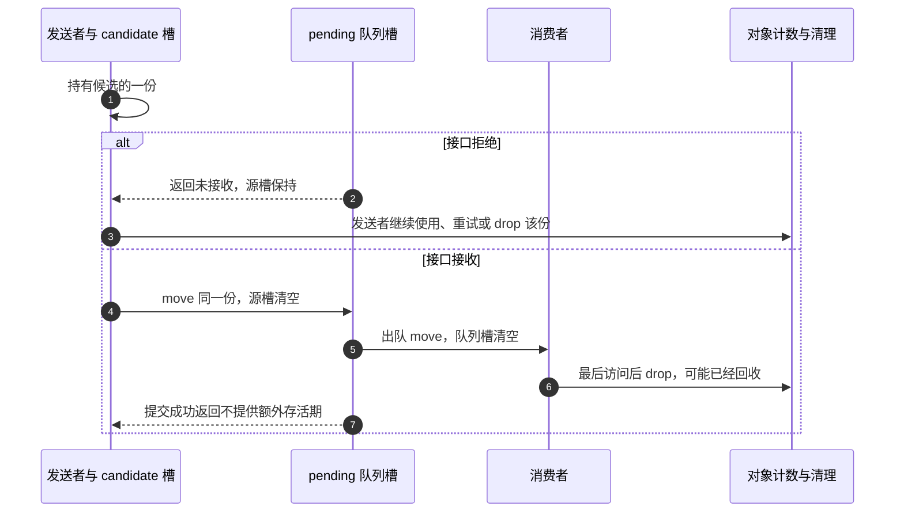

# 第7章\_handoff\_所有权转移模型

## 7.1\_本章定位

上一章已经知道：release 是否能正确清理，取决于此前哪些访问者退出、哪些责任被归还。现在把观察点往前移到交付瞬间。请求对象已经创建，生产者要把它交给队列；若接收者很快完成并归还，生产者还能在提交函数返回后读取结果吗？若队列拒绝，又由谁归还？

这个问题称为 handoff，即把使用机会及相应责任交给另一条路径。**地址传过去了，不等于归还责任已经定义。** 接收者可能只借用，可能取得新的一份，也可能接管生产者手里原有的一份。三种设计都能正确，错在两边各自采用了不同的理解。

本章沿同一个请求经过“创建者 → 候选交付 → 队列 → 消费者”的过程，先用可运行的 C 账本看清责任，再映射到 work、timer、completion 和注册接口。前章的查找窗口、对象资源与执行上下文作为先修保留；handoff 不替代它们，只回答这一份从谁手里交给谁、失败时还在谁手里。

读完应能为一个具体接口写出成功、拒绝、取消和完成各路径的责任变化，并解释接收者在提交函数返回以前就结束时，发送者凭什么还能访问或为什么必须停止访问。

## 7.2\_所有权语义\_先分清\_borrow\_ref\_take

先暂时去掉线程、硬件和队列锁，只保留地址与责任。这样能发现许多并非原子操作问题的错误：同一份由两边各归还一次，或者双方都以为另一边会归还。程序里的计数不会记录每一份属于谁，归属必须由接口和状态保存方式表达。

### 7.2.1\_指针传递不等于引用转移

在 C 中，把 `obj` 赋给接收者字段，只复制一个地址。若它原来代表生产者的一份，复制以后不会自动变成两份；把变量名换成 `worker_obj` 也不会让生产者失去那一份。要么明确接收者借用生产者保护的存储，要么增加一份，要么让生产者把现有责任交出去。

先复用前章已经建立的完整 [reference_ownership.c](../../../../labs/kernel/object_lifetime/materials/reference_ownership.c)，这次观察每个 owner 槽的移动。`owner.ptr` 非空表示该槽有一份须归还，空表示没有；真实 kref 不保存这些槽，下面是让责任可见的顺序教学程序。

```c
#include <assert.h>
#include <limits.h>
#include <stdbool.h>
#include <stdio.h>
#include <stdlib.h>

struct object {
    unsigned int refs;
    int value;
};

/* 一个非空槽代表一份归还责任，禁止用结构赋值复制持有者。 */
struct owner { struct object *ptr; };
static unsigned int released;

static bool create(struct owner *dst)
{
    assert(!dst->ptr);
    struct object *obj = malloc(sizeof(*obj));
    if (!obj)
        return false;
    *obj = (struct object){ .refs = 1, .value = 42 };
    dst->ptr = obj;
    return true;
}

static void share(struct owner *dst, const struct owner *src)
{
    assert(!dst->ptr && src->ptr);
    assert(src->ptr->refs > 0 && src->ptr->refs < UINT_MAX);
    ++src->ptr->refs;
    dst->ptr = src->ptr;
}

static void move(struct owner *dst, struct owner *src)
{
    assert(!dst->ptr && src->ptr);
    dst->ptr = src->ptr;
    src->ptr = NULL; /* 责任转交，计数不变。 */
}

static void drop(struct owner *slot)
{
    assert(slot->ptr && slot->ptr->refs > 0);
    struct object *obj = slot->ptr;
    slot->ptr = NULL; /* 先结束本槽使用权，再执行可能的释放。 */
    if (--obj->refs == 0) {
        ++released; /* 观察量位于对象外，释放后不再读取对象。 */
        free(obj);
    }
}

static int borrow(const struct object *obj)
{
    return obj->value; /* 调用期间由调用者的现有引用保活。 */
}

/* 成功才接收候选引用；拒绝时候选仍归调用者。没有真实工作队列。 */
static bool submit(struct owner *pending, struct owner *candidate,
                   bool accept)
{
    assert(!pending->ptr && candidate->ptr);
    if (!accept)
        return false;
    move(pending, candidate);
    return true;
}

static void consume(struct owner *pending)
{
    struct owner worker = {0};
    move(&worker, pending);
    assert(borrow(worker.ptr) == 42);
    drop(&worker);
}

int main(void)
{
    /* 两次运行分别观察提交成功与失败，均须恰好释放一次。 */
    for (unsigned int accept = 0; accept < 2; ++accept) {
        struct owner producer = {0}, candidate = {0}, pending = {0};
        if (!create(&producer)) {
            fputs("allocation failed\n", stderr);
            return EXIT_FAILURE;
        }
        assert(borrow(producer.ptr) == 42 && producer.ptr->refs == 1);
        share(&candidate, &producer);
        assert(producer.ptr->refs == 2);
        bool queued = submit(&pending, &candidate, accept != 0);
        if (!queued)
            drop(&candidate); /* 发布失败，归还预留的那一份。 */
        drop(&producer);
        if (queued) {
            assert(pending.ptr->refs == 1);
            consume(&pending);
        }
        assert(!producer.ptr && !candidate.ptr && !pending.ptr);
        assert(released == accept + 1);
        printf("accept=%u released=%u\n", accept, released);
    }
    return EXIT_SUCCESS;
}
```

在材料目录编译运行：

```bash
cc -std=c11 -Wall -Wextra -Werror -O2 reference_ownership.c -o reference_ownership
./reference_ownership
```

两次分别输出 `accept=0 released=1`、`accept=1 released=2`。`released` 是两次试验累计的对象外观察量，每次都只回收一个对象；不要在已 free 的对象里读取一个标志来“检查它已经释放”。本模型没有真实线程、原子计数或 Linux 饱和机制，assert 只检查这个受控账本，不证明任意并发程序正确。

从 `share` 与 `move` 的区别开始读：share 增加计数，并把地址写入一个原本为空的独立槽；move 只把地址换到新槽并清空旧槽，计数不变。若使用结构赋值复制一个非空 owner，两个槽都会看似有权 drop，实际却只对应一份；模型明确禁止这样复制。


图中的箭头不是内核消息。它表示程序对具体槽地址的写入与责任变化；真正接入并发队列时，还要用队列锁或既定发布协议保护这些地址转交。

### 7.2.2\_handoff\_的三种语义\_borrow\_get\_take

现在给刚才的动作命名。borrow 是借用：使用者没有接管一份，存储由另一个仍有效的保护窗口提供。get/ref 表示新增独立份额：接收者与原持有者之后各自退出。take/consume 表示转交已有份额：变的是责任人，不一定改变计数。

| 当前接口选择 | 接收者得到什么 | 发送者原来的一份 | 接收者退出时 |
| --- | --- | --- | --- |
| 借用 borrow | 指定窗口内的访问许可，没有独立引用 | 仍由原持有者负责，或由外层借用协议保活 | 结束借用，不代还别人的一份 |
| 追加 get/ref | 一份新建立的独立责任 | 仍由发送者负责 | 归还接收者的份额 |
| 接管 take/consume | 指定的一份既有责任 | 对这一份而言已经交出 | 继续转交或最终归还它 |

表描述成功接收时的语义，**失败是否也消耗引用需要另写契约**。本程序 submit 选择“成功接管、拒绝保持 candidate 不变”；另一个 API 可以约定无论成功失败都消费参数，但调用者必须据此不再归还。名字里有 take 并不能替代失败行为说明。

一个系统也可以把这些动作组合：当前完整程序先 share 得到候选，再把候选 take 给队列，队列又 take 给消费者。整个过程没有矛盾，因为每个接口对哪一份做什么都确定。所谓不能混用，指不能让同一调用的两端对它采用不同解释，而不是禁止系统同时存在多种所有权操作。

### 7.2.3\_borrow\_只借用\_不长期保存

最容易证明的借用是一次同步函数调用：`borrow(obj)` 只读 value，调用者在它返回以前保留自己的份额，函数不保存指针，也不 put。回到调用者时，归还责任从未离开 producer 槽。

但借用并不在定义上禁止跨线程或异步。上一章的[管理者等待 worker](P06_release_回调与复杂销毁模式.md#6.2.2_运行一个由管理者等待借用退出的模块)就是异步借用：管理者封闭入口并等 worker 返回以后才归还，所以借用窗口可以跨越两条执行路径。代价是更强的进入/退出协议，不能像独立持票 worker 那样让管理者随意先退出。

因此“不要长期保存”应理解为 **不能把指针保留到已承诺的借用窗口以外**。若一个同步打印函数私下把地址存进全局变量留待以后使用，它就擅自扩大了窗口；若一个异步接口明确由上层保证并等待全部借用退出，保存到该期限内则可以成立。需要脱离原窗口长期使用时，必须在窗口仍有效且满足取得前提时另取自己的引用。

### 7.2.4\_get/ref\_给接收方一份新引用

生产者还要观察请求，而消费者也要独立执行，这是追加引用的典型理由。完整程序中的 share 把计数从 1 改为 2，使生产者和候选各有一份；成功接收只移动候选那一份，失败则由生产者归还候选。生产者原来的份额始终要单独处理。

预留必须早于允许接收者使用并归还。若先发布，再 get，接收者可能先把它以为已经收到的那一份 put 掉；这会消耗生产者实际仅有的份额并回收，随后生产者再对旧地址 get 就已经太晚。不是只有“生产者自己先 put”才会出问题，错误的接收者退出也能抢先发生。

接口必须明确 get 在哪一层完成。若 `queue_ref` 内部已经追加并在拒绝时回滚，外面再盲目 get 就多造一份；若接口只接管传入的候选，外层才需要先准备。把函数名字和一行 get 并排看不够，要检查真实接收契约。

独立引用使两边可以分别结束，代价是计数更新与两份责任的退出记录；它只保活对象，不保证两边可以无锁写同一个字段，也不保证关闭以后业务仍被许可。

### 7.2.5\_take/consume\_接管调用者当前引用

若生产者创建请求以后不再需要它，已有初始份额就足以交给队列，不必为了“交付”机械追加一次再归还一次。模型中的 move 表达这个动作：源槽清空，目标槽接住，计数保持原值。出队也可把队列这一份直接交给消费者，之后由消费者归还。

为该协议画出一次拒绝与一次接收。交付点是接收者获准使用的那个发布动作，不是提交函数最后执行 return 的时刻；真实消费者可能在发送者返回以前就处理完并释放对象。



当前顺序 C 程序把 consume 安排在提交之后；图中的提前消费是并发接口必须额外考虑的顺序，不声称该程序创建了线程。发送者若只有这一个 candidate，成功后就没有自己的引用可据以访问。失败时则仍可在自己的份额上重试或归还，而不是一律“失败立即 put”；具体选择属于调用者的后续用途。

状态或参数需要提交给消费者时，应在发布以前按协议准备好，或者由接收函数在其保护的状态切换中完成。成功以后再写“已排队”可能同时破坏存活期和字段顺序，不能靠一条内存屏障补回已经交出的责任。

### 7.2.6\_handoff\_后能否访问\_取决于当前路径是否仍持有引用

判断时先问“凭哪项仍有效的保护访问”，不要只问“刚才是不是 take”。例如当前程序成功转交的是 candidate，而 producer 仍有自己的独立份额；生产者在归还 producer 以前仍可按字段同步协议使用对象。相反，若直接把 producer 唯一的一份转走，即使局部变量仍存着同一个地址，也不再提供保护。

借用者则靠被证明的借用窗口，而非自己持有引用。窗口可以由同步调用、管理者等待或其他明确机制提供，超过窗口就不能继续用；这与“只要全局计数似乎仍大于零就能访问”完全不同。计数不是查询谁还替你保活的接口。

在完整程序中做一次纸面变化：去掉 share，将 submit 的源槽直接换成 producer，且成功后删掉对 producer 的 drop；拒绝分支仍保留并归还它，接收分支由队列/消费者最终归还。这会少一次增加和减少，但也失去生产者同时观察的那一份。下一节把这些明确的语义接到真实异步接口，重点检查它们的接收、重排和完成规则是否与我们的假设一致。


## 7.3\_典型\_handoff\_场景\_异步路径\_队列和回调

这一组内容把 handoff 放到常见工程场景里。

阅读时可以先按场景归类：

| 场景 | 关键问题 |
| --- | --- |
| work / delayed_work / timer | 异步路径是否提前持有引用，取消路径谁 put |
| completion | 同步事件不等于生命周期引用 |
| callback | 引用是按注册周期持有，还是按单次回调持有 |
| queue enqueue/dequeue | 入队、出队、失败、重复提交时引用归谁 |
| remove/unlink | 先撤销可见性，再释放集合引用 |

### 7.3.1\_先\_get\_再投递给\_worker

workqueue 是 handoff 最典型的场景。

假设对象里嵌入一个 work：

```c
struct my_obj {
	struct kref ref;
	struct work_struct work;
	spinlock_t lock;
	int state;
};
```

work 回调里可以通过 `container_of()` 找回对象：

```c
static void my_obj_workfn(struct work_struct *work)
{
	struct my_obj *obj;

	obj = container_of(work, struct my_obj, work);

	/*
	 * work 路径持有一份引用。
	 * 所以这里 obj 的内存生命周期是有效的。
	 */

	spin_lock(&obj->lock);
	obj->state = MY_OBJ_RUNNING;
	spin_unlock(&obj->lock);

	/*
	 * work 使用结束，释放 work 路径持有的引用。
	 */
	kref_put(&obj->ref, my_obj_release);
}
```

投递 work 前必须给 work 路径准备引用：

```c
int my_obj_schedule_work(struct my_obj *obj)
{
	kref_get(&obj->ref);

	if (!queue_work(system_wq, &obj->work)) {
		/*
		 * queue_work() 返回 false，表示这个 work 已经在队列中
		 * 或正在运行，没有新增加一个独立执行机会。
		 *
		 * 本次准备给 work 的引用没有被消费，必须回滚。
		 */
		kref_put(&obj->ref, my_obj_release);
		return -EALREADY;
	}

	return 0;
}
```

这里的引用协议是：

```text
queue_work 成功：
    work 路径获得引用；
    workfn 结束时 put。

queue_work 失败：
    本次 get 没有被消费；
    当前路径必须 put 回滚。
```

这一点非常关键。

不是所有“提交 API”成功失败语义都一样。

每个 handoff API 都必须定义：

```text
成功是否消费引用？
失败是否消费引用？
重复投递是否消费引用？
取消是否消费引用？
```

------

### 7.3.2\_错误写法\_投递后再\_get

错误示例：

```c
worker->obj = obj;
queue_work(wq, &worker->work);
kref_get(&obj->ref);
```

这个顺序是错的。

原因是：

```text
queue_work() 成功后，worker 可能马上在另一个 CPU 上运行。
```

可能出现这样的时序：

```text
CPU0: worker->obj = obj
CPU0: queue_work()

CPU1: workfn 开始运行
CPU1: 使用 obj

CPU0: kref_get(&obj->ref)
```

如果 CPU1 开始运行时，当前路径已经把最后一个引用 put 掉，或者对象正在释放，就可能出现 use-after-free。

正确原则：

```text
给异步路径使用对象之前，必须先让异步路径拥有引用。
```

也就是：

```c
kref_get(&obj->ref);

worker->obj = obj;

if (!queue_work(wq, &worker->work))
	kref_put(&obj->ref, my_obj_release);
```

顺序不能反。

------

### 7.3.3\_work\_嵌入对象时的特殊注意点

如果 `work_struct` 嵌入在对象内部：

```c
struct my_obj {
	struct kref ref;
	struct work_struct work;
};
```

那么 work 本身的内存也属于对象内存。

因此只要 work 可能被调度、排队、运行，外部就不能释放对象内存。

这就要求：

```text
每一次成功投递 work，都必须保证对象至少活到 work 回调结束。
```

所以常见规则是：

```text
成功 queue_work() 之前 get；
workfn 结束时 put；
取消或失败路径补齐 put。
```

但是还要注意：

```text
同一个 work_struct 不能当成无限次数独立引用。
```

因为 `queue_work()` 可能返回 false。

返回 false 时，如果你已经提前 `kref_get()`，就必须回滚。

------

### 7.3.4\_delayed\_work\_和\_timer\_的\_handoff

`delayed_work` 和 timer 更容易出错，因为它们不是马上执行。

对象必须撑过下面这段时间：

```text
投递成功
    -> 延迟等待
        -> 回调开始
            -> 回调结束
```

示例：

```c
struct my_obj {
	struct kref ref;
	struct delayed_work timeout_work;
	spinlock_t lock;
	bool done;
};
```

投递 delayed work：

```c
int my_obj_start_timeout(struct my_obj *obj, unsigned long delay)
{
	kref_get(&obj->ref);

	if (!queue_delayed_work(system_wq, &obj->timeout_work, delay)) {
		kref_put(&obj->ref, my_obj_release);
		return -EALREADY;
	}

	return 0;
}
```

回调：

```c
static void my_obj_timeout_workfn(struct work_struct *work)
{
	struct delayed_work *dwork;
	struct my_obj *obj;

	dwork = to_delayed_work(work);
	obj = container_of(dwork, struct my_obj, timeout_work);

	spin_lock(&obj->lock);
	if (!obj->done)
		obj->done = true;
	spin_unlock(&obj->lock);

	kref_put(&obj->ref, my_obj_release);
}
```

取消路径也要定义引用归属。

例如：

```c
void my_obj_cancel_timeout(struct my_obj *obj)
{
	if (cancel_delayed_work_sync(&obj->timeout_work)) {
		/*
		 * 返回 true 表示 work 被取消，回调不会执行。
		 * 因此原本应该由回调 put 的引用，现在由取消路径 put。
		 */
		kref_put(&obj->ref, my_obj_release);
	}
}
```

这里的协议是：

```text
delayed_work 成功投递：
    delayed_work 持有引用。

回调执行：
    回调结束 put。

取消成功：
    回调不会执行；
    取消路径 put。

取消失败：
    work 可能已经运行或已经执行完；
    不能重复 put。
```

timer 也是同理。

只要回调会异步使用对象，就必须保证：

```text
对象活到回调结束。
```

------

### 7.3.5\_completion\_场景里的引用归属

completion 常用于等待异步完成。

例如一个请求对象：

```c
struct my_request {
	struct kref ref;
	struct completion done;
	int status;
};
```

等待方和完成方可能是两个路径：

```text
提交任务的线程等待完成；
中断、worker 或硬件完成路径设置结果。
```

如果完成路径需要访问请求对象，就必须有自己的引用。

一种模型是：

```text
等待方持有一个引用；
完成路径持有一个引用；
两边各自 put。
```

示例：

```c
int my_request_submit(struct my_request *req)
{
	kref_get(&req->ref);        /* 给完成路径准备引用 */

	if (submit_to_hw(req)) {
		kref_put(&req->ref, my_request_release);
		return -EIO;
	}

	return 0;
}
```

完成路径：

```c
void my_request_complete(struct my_request *req, int status)
{
	req->status = status;
	complete(&req->done);

	kref_put(&req->ref, my_request_release);
}
```

等待方：

```c
int my_request_wait(struct my_request *req)
{
	wait_for_completion(&req->done);

	/*
	 * 只要当前路径还持有自己的引用，
	 * wait 返回后仍然可以读取 req。
	 */
	return req->status;
}
```

最后等待方结束时：

```c
kref_put(&req->ref, my_request_release);
```

这里不能误解成：

```text
completion 会保护对象生命周期。
```

completion 只是同步事件。

它不增加引用。

它也不阻止对象释放。

对象生命周期仍然要靠 kref 约定。

------

### 7.3.6\_callback\_场景里的引用归属

callback 场景要区分两种情况。

第一种：同步 callback。

```c
void my_obj_foreach(struct my_obj *obj,
		    void (*fn)(struct my_obj *obj, void *data),
		    void *data)
{
	fn(obj, data);
}
```

如果 callback 在当前调用栈内同步执行，并且不会保存对象，那么 callback 只是 borrow。

引用归属：

```text
调用者持有引用；
callback 临时借用；
callback 不 put。
```

第二种：异步 callback。

```c
register_async_callback(obj, cb);
```

如果 callback 未来某个时间才会被调用，或者可能在另一个线程执行，那么注册方必须明确：

```text
callback 执行时 obj 是否还有效？
谁持有 obj 引用？
取消 callback 时引用谁释放？
callback 执行结束后谁 put？
```

一种常见模型：

```c
int my_obj_register_callback(struct my_obj *obj)
{
	kref_get(&obj->ref);

	if (do_register_callback(obj)) {
		kref_put(&obj->ref, my_obj_release);
		return -EINVAL;
	}

	return 0;
}
```

callback 执行：

```c
static void my_obj_callback(void *data)
{
	struct my_obj *obj = data;

	/*
	 * callback 路径持有引用。
	 */
	do_something(obj);

	kref_put(&obj->ref, my_obj_release);
}
```

如果 callback 可能注册后长期存在，而不是只调用一次，那么引用模型要重新定义。

例如：

```text
注册成功后 callback 系统长期持有引用；
unregister 成功后释放引用；
每次 callback 执行不单独 put。
```

这时就不能在 callback 每次执行完都 put。

所以 callback 必须写清楚：

```text
引用是按“注册周期”持有，
还是按“单次回调”持有。
```

------

### 7.3.7\_队列场景\_enqueue\_成功和失败的归属

队列是 handoff 的重点。

假设有一个请求队列：

```c
struct my_queue {
	struct mutex lock;
	struct list_head list;
};
```

请求对象：

```c
struct my_request {
	struct kref ref;
	struct list_head node;
	int state;
};
```

队列 handoff 有两种设计。

------

#### (1)\_设计一\_enqueue\_成功后队列接管当前引用

这种接口可以命名为：

```c
my_queue_take_request()
```

示例：

```c
// my_queue_take_request()调用前已经执行 kref_get() 获得引用
int my_queue_take_request(struct my_queue *q, struct my_request *req)
{
	mutex_lock(&q->lock);

	if (req->state != REQ_NEW) {
		mutex_unlock(&q->lock);
		return -EINVAL;
	}

	req->state = REQ_QUEUED;
	list_add_tail(&req->node, &q->list);

	mutex_unlock(&q->lock);

	/*
	 * 成功后，队列接管调用者传入的引用。
	 */
	return 0;
}
```

调用者：

```c
ret = my_queue_take_request(q, req);
if (ret) {
	/*
	 * 失败：队列没有接管引用。
	 * 当前路径仍然拥有 req，负责 put。
	 */
	kref_put(&req->ref, my_request_release);
	return ret;
}

/*
 * 成功：队列已经接管引用。
 * 当前路径不能再访问 req。
 */
return 0;
```

这个模型的协议是：

```text
成功：队列消费引用。
失败：队列不消费引用。
```

这类函数命名建议包含：

```text
take
consume
submit
handoff
```

并在注释中明确：

```text
On success, the queue owns the caller's reference.
On failure, the caller still owns the reference.
```

------

#### (2)\_设计二\_enqueue\_内部\_get\_调用者仍持有引用

这种接口可以命名为：

```c
my_queue_ref_request()
```

示例：

```c
int my_queue_ref_request(struct my_queue *q, struct my_request *req)
{
	kref_get(&req->ref);

	mutex_lock(&q->lock);

	if (req->state != REQ_NEW) {
		mutex_unlock(&q->lock);
		kref_put(&req->ref, my_request_release);
		return -EINVAL;
	}

	req->state = REQ_QUEUED;
	list_add_tail(&req->node, &q->list);

	mutex_unlock(&q->lock);

	/*
	 * 成功后，队列持有新引用。
	 * 调用者原来的引用仍然归调用者。
	 */
	return 0;
}
```

调用者：

```c
ret = my_queue_ref_request(q, req);
if (ret)
	return ret;

/*
 * 调用者仍然持有自己的引用。
 * 只要还没 put，就可以继续访问 req。
 */
req->last_submit_jiffies = jiffies;

kref_put(&req->ref, my_request_release);
return 0;
```

这个模型的协议是：

```text
成功：队列持有新引用，调用者仍持有旧引用。
失败：队列不持有引用，调用者仍持有旧引用。
```

这类函数命名建议包含：

```text
get
ref
hold
queue_ref
```

------

### 7.3.8\_dequeue\_时的引用归属

enqueue 定义的是入队归属，dequeue 定义的是出队归属。

如果队列持有引用，那么出队时要决定：

```text
队列引用是直接转移给消费者？
还是队列 put，消费者重新 get？
```

常见做法是：

```text
出队成功后，队列引用转移给消费者。
```

示例：

```c
struct my_request *my_queue_pop(struct my_queue *q)
{
	struct my_request *req;

	mutex_lock(&q->lock);

	if (list_empty(&q->list)) {
		mutex_unlock(&q->lock);
		return NULL;
	}

	req = list_first_entry(&q->list, struct my_request, node);
	list_del_init(&req->node);
	req->state = REQ_RUNNING;

	mutex_unlock(&q->lock);

	/*
	 * 返回成功后，队列引用转移给调用者。
	 * 调用者负责最终 put。
	 */
	return req;
}
```

消费者：

```c
req = my_queue_pop(q);
if (!req)
	return;

process_request(req);

kref_put(&req->ref, my_request_release);
```

这个模型的好处是：

```text
入队时队列持有引用；
出队后消费者持有这个引用；
消费者完成后 put。
```

引用一路移动，不需要多余 get/put。

------

### 7.3.9\_remove/unlink\_场景下的\_handoff

remove/unlink 和 handoff 经常混在一起。

要分清两个动作：

```text
从集合中删除对象；
释放集合持有的引用。
```

如果对象在 list 中：

```c
list_add_tail(&obj->node, &global_list);
```

通常意味着：

```text
global_list 持有 obj 的一个引用。
```

删除时：

```c
mutex_lock(&global_lock);
list_del_init(&obj->node);
mutex_unlock(&global_lock);

kref_put(&obj->ref, my_obj_release);
```

这里的顺序有意义：

```text
先从可查找结构中撤销；
再释放集合引用。
```

原因是：

```text
一旦 put 触发 release，对象内存可能释放。
如果 list 里还挂着它，就留下悬挂指针。
```

所以 remove 路径应写成：

```text
unlink first, put later.
```

也就是：

```text
先让新 lookup 找不到它；
再释放集合持有的引用。
```

------

## 7.4\_接口契约\_成功\_失败\_命名和注释

这一组内容不再展开新场景，而是把前面的场景收束成接口契约。

一个 handoff API 至少要写清楚：

```text
成功是否消费引用；
失败是否消费引用；
重复提交、取消、超时时谁 put；
函数名是否体现 borrow/ref/take；
注释是否说明成功后调用者还能不能访问对象。
```

### 7.4.1\_handoff\_成功/失败路径必须写成表

复杂代码里，单靠读代码很难判断引用归属。

建议为每个 handoff API 写归属表。

例如：

```c
int my_queue_take_request(struct my_queue *q, struct my_request *req);
```

归属表：

| 路径     | 返回值    | 队列是否接管引用 | 调用者是否仍持有引用 | 谁负责 put  |
| -------- | --------- | ---------------- | -------------------- | ----------- |
| 入队成功 | 0         | 是               | 否                   | 队列/消费者 |
| 参数错误 | -EINVAL   | 否               | 是                   | 调用者      |
| 内存不足 | -ENOMEM   | 否               | 是                   | 调用者      |
| 已经入队 | -EALREADY | 否               | 是                   | 调用者      |

另一个接口：

```c
int my_queue_ref_request(struct my_queue *q, struct my_request *req);
```

归属表：

| 路径     | 返回值    | 队列是否获得新引用 | 调用者是否仍持有原引用 | 谁负责 put              |
| -------- | --------- | ------------------ | ---------------------- | ----------------------- |
| 入队成功 | 0         | 是                 | 是                     | 队列和调用者各 put 一次 |
| 参数错误 | -EINVAL   | 否                 | 是                     | 调用者                  |
| 内存不足 | -ENOMEM   | 否                 | 是                     | 调用者                  |
| 已经入队 | -EALREADY | 否                 | 是                     | 调用者                  |

这个表比口头说“这里要注意引用”更有用。

因为它直接回答：

```text
成功谁 put？
失败谁 put？
重复提交谁 put？
```

------

### 7.4.2\_错误路径回滚模型

handoff 最容易漏的是错误路径。

典型错误：

```c
kref_get(&obj->ref);

ret = prepare_async(obj);
if (ret)
	return ret;       /* 错误：少 put */

ret = queue_work(wq, &obj->work);
if (ret)
	return ret;       /* 错误：少 put */
```

正确写法：

```c
kref_get(&obj->ref);

ret = prepare_async(obj);
if (ret)
	goto err_put;

if (!queue_work(wq, &obj->work)) {
	ret = -EALREADY;
	goto err_put;
}

return 0;

err_put:
	kref_put(&obj->ref, my_obj_release);
	return ret;
```

原则是：

```text
只要提前 get，而最终没有成功交给接收方，就必须 put 回滚。
```

可以写成公式：

```text
get 成功 + handoff 失败 = 当前路径 put
get 成功 + handoff 成功 = 接收方 put
```

------

### 7.4.3\_成功路径不应该偷偷留下引用

另一类错误是成功路径忘记释放调用者引用。

例如创建对象并提交：

```c
req = my_request_alloc();
if (!req)
	return -ENOMEM;

ret = my_queue_ref_request(q, req);
if (ret) {
	kref_put(&req->ref, my_request_release);
	return ret;
}

return 0;       /* 可能错误：初始引用还在当前路径手里 */
```

如果 `my_queue_ref_request()` 是内部 get 模型，那么成功后：

```text
队列持有新引用；
当前路径仍然持有 alloc/init 的初始引用。
```

如果当前路径不再需要它，就必须：

```c
kref_put(&req->ref, my_request_release);
return 0;
```

完整写法：

```c
req = my_request_alloc();
if (!req)
	return -ENOMEM;

ret = my_queue_ref_request(q, req);
if (ret) {
	kref_put(&req->ref, my_request_release);
	return ret;
}

/*
 * 当前路径不再需要 req。
 * 释放创建者引用。
 * 队列仍然持有自己的引用。
 */
kref_put(&req->ref, my_request_release);

return 0;
```

如果不想多一次 get/put，可以把接口设计成 take 模型：

```c
req = my_request_alloc();
if (!req)
	return -ENOMEM;

ret = my_queue_take_request(q, req);
if (ret) {
	kref_put(&req->ref, my_request_release);
	return ret;
}

/*
 * 成功后队列接管初始引用。
 * 当前路径不能再访问 req。
 */
return 0;
```

这两种都可以，但不能混写。

------

### 7.4.4\_函数命名要表达引用语义

handoff 代码最好从函数名就能看出引用关系。

不建议使用含糊名字：

```c
my_queue_add(obj);
my_submit(obj);
my_register(obj);
```

这些名字看不出：

```text
函数是否 get？
函数是否 take？
失败是否消费引用？
成功后调用者还能不能访问？
```

建议使用更明确的名字。

#### (1)\_borrow\_语义

```c
my_obj_dump(obj);
my_obj_check(obj);
my_obj_format(obj, buf);
```

含义：

```text
不保存 obj；
不 get；
不 put；
调用者保证 obj 调用期间有效。
```

------

#### (2)\_get/ref\_语义

```c
my_queue_ref_obj(q, obj);
my_worker_get_obj(worker, obj);
my_obj_get_for_async(obj);
```

含义：

```text
函数或接收方会获得一份新引用；
调用者原引用不受影响；
双方各自 put。
```

------

#### (3)\_take/consume\_语义

```c
my_queue_take_obj(q, obj);
my_request_submit_take(req);
my_obj_consume(obj);
```

含义：

```text
成功后接收方接管调用者当前引用；
调用者成功后不能再访问 obj；
失败时通常仍由调用者负责 put，除非文档另有说明。
```

------

### 7.4.5\_注释必须写清楚成功/失败归属

好的 handoff 注释应该直接描述引用归属。

例如：

```c
/**
 * my_queue_take_request - enqueue request and consume caller reference
 * @q: target queue
 * @req: request owned by caller
 *
 * On success, the queue owns the caller's reference to @req.
 * The caller must not access @req after success.
 *
 * On failure, the caller still owns @req and must drop it.
 */
int my_queue_take_request(struct my_queue *q, struct my_request *req);
```

中文可写成：

```text
成功后队列接管调用者传入的引用。
成功返回后调用者不能再访问 req。
失败时队列不接管引用，调用者仍负责 put。
```

另一个例子：

```c
/**
 * my_queue_ref_request - enqueue request with a new queue reference
 * @q: target queue
 * @req: request referenced by caller
 *
 * On success, the queue holds a new reference to @req.
 * The caller keeps its original reference.
 *
 * On failure, no queue reference is kept.
 */
int my_queue_ref_request(struct my_queue *q, struct my_request *req);
```

中文可写成：

```text
成功后队列持有一份新引用。
调用者仍然持有原引用。
失败时队列不持有引用。
```

这种注释比“注意引用计数”有用得多。

------

## 7.5\_组合边界\_状态\_锁\_lookup\_和\_release

这一组内容用来防止 handoff 和其他生命周期问题混在一起。

handoff 只回答“引用交给谁”，但真实代码还要同时处理：

```text
状态字段什么时候改；
集合结构由哪把锁保护；
对象是不是通过 lookup 得到；
最后是否能收敛到 release。
```

这些问题不能互相替代。

### 7.5.1\_handoff\_和状态字段的顺序

如果对象有状态字段：

```c
enum my_req_state {
	REQ_NEW,
	REQ_QUEUED,
	REQ_RUNNING,
	REQ_DONE,
};
```

那么状态修改要和 handoff 顺序匹配。

take 模型下，成功后当前路径不能再访问对象。

所以状态必须在 handoff 前设置：

```c
req->state = REQ_QUEUED;

ret = my_queue_take_request(q, req);
if (ret) {
	req->state = REQ_NEW;
	return ret;
}

/*
 * 成功后不能再访问 req。
 */
return 0;
```

如果状态必须在锁内和入队一起完成，则放到接收方函数内部：

```c
int my_queue_take_request(struct my_queue *q, struct my_request *req)
{
	mutex_lock(&q->lock);

	if (req->state != REQ_NEW) {
		mutex_unlock(&q->lock);
		return -EINVAL;
	}

	req->state = REQ_QUEUED;
	list_add_tail(&req->node, &q->list);

	mutex_unlock(&q->lock);
	return 0;
}
```

调用者成功后不再改状态。

错误写法：

```c
ret = my_queue_take_request(q, req);
if (ret)
	return ret;

req->state = REQ_QUEUED;     /* 错误 */
```

原因：

```text
成功后 req 已经不归当前路径所有。
```

------

### 7.5.2\_handoff\_和锁的关系

handoff 经常发生在锁保护的集合结构里。

例如：

```text
list
hash
xarray
idr
queue
```

锁保护的是：

```text
对象是否在集合中；
对象状态字段是否一致；
入队/出队的结构修改。
```

kref 保护的是：

```text
对象内存生命周期。
```

这两个不能互相替代。

入队示例：

```c
int my_queue_ref_request(struct my_queue *q, struct my_request *req)
{
	kref_get(&req->ref);

	mutex_lock(&q->lock);

	if (req->state != REQ_NEW) {
		mutex_unlock(&q->lock);
		kref_put(&req->ref, my_request_release);
		return -EINVAL;
	}

	req->state = REQ_QUEUED;
	list_add_tail(&req->node, &q->list);

	mutex_unlock(&q->lock);
	return 0;
}
```

这里：

```text
kref_get()：给队列准备生命周期引用；
mutex：保护状态检查和 list 修改；
kref_put()：失败时回滚引用。
```

不要把它理解成：

```text
有 kref，所以 list 操作不需要锁。
```

这是错误的。

kref 不保护 list。

kref 只保证对象内存不被释放。

------

### 7.5.3\_handoff\_和\_lookup\_的关系

handoff 通常发生在已经拿到对象之后。

lookup 解决的是：

```text
如何从集合里找到对象，并安全获得引用。
```

handoff 解决的是：

```text
拿到引用之后，如何交给别人。
```

这两个问题不要混在一起。

例如：

```c
obj = my_obj_lookup_get(id);
if (!obj)
	return -ENOENT;

ret = my_obj_schedule_work(obj);
kref_put(&obj->ref, my_obj_release);
return ret;
```

这里有两个引用动作：

```text
my_obj_lookup_get()：
    从集合中查找对象，并给当前路径一份引用。

my_obj_schedule_work()：
    给 work 路径一份引用。
```

当前路径最后 put 自己从 lookup 得到的引用。

不要写成：

```c
obj = my_obj_lookup_raw(id);
my_obj_schedule_work(obj);
```

除非 `my_obj_lookup_raw()` 的调用期间有锁或其他机制保证对象有效，并且 `my_obj_schedule_work()` 里面的 `kref_get()` 是安全的。

换句话说：

```text
handoff 不能弥补 lookup 阶段的悬挂指针问题。
```

------

### 7.5.4\_handoff\_和\_release\_的关系

handoff 最终必须收敛到 release。

所有引用无论怎么转移，最后都必须满足：

```text
每一份 get 出来的引用都有对应 put；
每一份转移出去的引用最终由接收方 put；
最后一个 put 调用 release。
```

release 不关心对象曾经经过多少次 handoff。

它只关心：

```text
当前已经没有任何持有者。
```

所以 handoff 设计得好不好，可以用 release 是否可达来判断。

如果某条路径 handoff 后没有人 put：

```text
release 永远不执行 -> 泄漏
```

如果某条路径 handoff 后双方都 put：

```text
release 提前执行 -> UAF / underflow
```

如果 handoff 成功后当前路径还访问：

```text
对象可能已经被接收方 put 并 release -> UAF
```

------

## 7.6\_完整模型\_同一请求对象的两种设计

前面的小节分别讲单个场景，这里把它们收束成一个完整请求对象。

同一个业务可以有两种合法设计：

```text
移动引用模型：引用沿着创建者 -> 队列 -> 消费者 -> work 一路转移。
共享引用模型：每个长期持有者各自 get，使用结束各自 put。
```

关键不是哪种更“高级”，而是一个接口只能选择一种语义，并且所有成功/失败路径都按同一语义闭环。

### 7.6.1\_一个完整请求对象\_handoff\_示例

请求对象：

```c
struct my_request {
	struct kref ref;
	struct list_head node;
	struct work_struct work;
	struct completion done;
	spinlock_t lock;
	int status;
	bool completed;
};
```

release：

```c
static void my_request_release(struct kref *ref)
{
	struct my_request *req;

	req = container_of(ref, struct my_request, ref);

	WARN_ON(!list_empty(&req->node));

	kfree(req);
}
```

初始化：

```c
struct my_request *my_request_alloc(void)
{
	struct my_request *req;

	req = kzalloc(sizeof(*req), GFP_KERNEL);
	if (!req)
		return NULL;

	kref_init(&req->ref);
	INIT_LIST_HEAD(&req->node);
	INIT_WORK(&req->work, my_request_workfn);
	init_completion(&req->done);
	spin_lock_init(&req->lock);

	req->status = 0;
	req->completed = false;

	return req;
}
```

提交到队列，使用 take 模型：

```c
int my_request_submit_take(struct my_queue *q, struct my_request *req)
{
	mutex_lock(&q->lock);

	if (!list_empty(&req->node)) {
		mutex_unlock(&q->lock);
		return -EINVAL;
	}

	list_add_tail(&req->node, &q->list);

	mutex_unlock(&q->lock);

	/*
	 * 成功后 q 接管调用者引用。
	 */
	return 0;
}
```

调用者：

```c
int submit_one_request(struct my_queue *q)
{
	struct my_request *req;
	int ret;

	req = my_request_alloc();
	if (!req)
		return -ENOMEM;

	ret = my_request_submit_take(q, req);
	if (ret) {
		kref_put(&req->ref, my_request_release);
		return ret;
	}

	/*
	 * 成功后 req 已经交给队列。
	 * 当前路径不能再访问 req。
	 */
	return 0;
}
```

队列消费者出队：

```c
struct my_request *my_queue_pop(struct my_queue *q)
{
	struct my_request *req;

	mutex_lock(&q->lock);

	if (list_empty(&q->list)) {
		mutex_unlock(&q->lock);
		return NULL;
	}

	req = list_first_entry(&q->list, struct my_request, node);
	list_del_init(&req->node);

	mutex_unlock(&q->lock);

	/*
	 * 队列引用转移给消费者。
	 */
	return req;
}
```

消费者投递 work。

这里使用当前消费者引用转移给 work 的模型：

```c
int my_request_run_async(struct my_request *req)
{
	if (!queue_work(system_wq, &req->work))
		return -EALREADY;

	/*
	 * queue_work 成功后，当前引用交给 work。
	 * 当前路径不能再访问 req。
	 */
	return 0;
}
```

但是这个写法有个前提：

```text
queue_work 成功才消费当前引用；
queue_work 失败不消费当前引用。
```

所以调用者必须这样写：

```c
req = my_queue_pop(q);
if (!req)
	return;

ret = my_request_run_async(req);
if (ret) {
	/*
	 * queue_work 失败，work 没有接管引用。
	 * 当前路径仍然负责 put。
	 */
	kref_put(&req->ref, my_request_release);
	return;
}

/*
 * 成功后 work 接管引用。
 * 当前路径不能再访问 req。
 */
```

work 回调：

```c
static void my_request_workfn(struct work_struct *work)
{
	struct my_request *req;

	req = container_of(work, struct my_request, work);

	spin_lock(&req->lock);
	req->status = 0;
	req->completed = true;
	spin_unlock(&req->lock);

	complete(&req->done);

	/*
	 * work 路径释放它接管的引用。
	 */
	kref_put(&req->ref, my_request_release);
}
```

这套模型的引用流是：

```text
alloc/init：
    创建者持有初始引用。

submit_take 成功：
    初始引用从创建者转移给队列。

pop 成功：
    队列引用转移给消费者。

queue_work 成功：
    消费者引用转移给 work。

workfn 结束：
    work put。
    如果这是最后引用，release。
```

它的特点是：

```text
引用一直在移动；
没有额外 get；
每一步成功后当前路径都不能继续访问对象；
失败路径必须由当前仍持有引用的一方 put。
```

------

### 7.6.2\_同一个场景也可以设计成共享引用模型

上面的例子是 take 模型。

也可以设计成共享引用模型。

提交时队列自己 get：

```c
int my_request_submit_ref(struct my_queue *q, struct my_request *req)
{
	kref_get(&req->ref);

	mutex_lock(&q->lock);

	if (!list_empty(&req->node)) {
		mutex_unlock(&q->lock);
		kref_put(&req->ref, my_request_release);
		return -EINVAL;
	}

	list_add_tail(&req->node, &q->list);

	mutex_unlock(&q->lock);
	return 0;
}
```

调用者：

```c
req = my_request_alloc();
if (!req)
	return -ENOMEM;

ret = my_request_submit_ref(q, req);
if (ret) {
	kref_put(&req->ref, my_request_release);
	return ret;
}

/*
 * 调用者仍然持有初始引用。
 * 如果当前路径不再需要，必须 put。
 */
kref_put(&req->ref, my_request_release);
return 0;
```

引用流：

```text
alloc/init：
    创建者持有初始引用。

submit_ref 成功：
    队列 get 一份新引用。

创建者不再需要：
    创建者 put 初始引用。

队列消费完成：
    队列/消费者 put 队列引用。
```

这个模型的特点是：

```text
更直观；
每个长期持有者各自 get/put；
但多一次 get/put；
成功后调用者是否还能访问，取决于它是否已经 put 掉自己的引用。
```

------

### 7.6.3\_两种模型不要混用

最危险的是把 take 模型和 ref 模型混在一起。

例如函数实际是 take：

```c
int my_queue_take_request(struct my_queue *q, struct my_request *req);
```

调用者却按 ref 模型继续访问：

```c
ret = my_queue_take_request(q, req);
if (ret)
	goto err;

req->status = 0;       /* 错误 */
kref_put(&req->ref, my_request_release);  /* 错误 */
```

或者函数实际是 ref：

```c
int my_queue_ref_request(struct my_queue *q, struct my_request *req);
```

调用者却以为成功后自己不持有引用，忘记 put：

```c
ret = my_queue_ref_request(q, req);
if (ret)
	goto err;

return 0;       /* 错误：调用者初始引用泄漏 */
```

所以一个接口必须只有一种清晰语义。

不要写这种模糊接口：

```c
int my_queue_add_request(struct my_queue *q, struct my_request *req);
```

除非注释明确说明引用归属。

------

## 7.7\_handoff\_检查清单

写 handoff 代码时，可以逐项检查：

```text
1. 当前路径进入函数时是否持有引用？
2. 接收方是否需要长期保存对象？
3. 如果只是同步使用，是否只是 borrow？
4. 如果异步使用，是否先 get 再投递？
5. 如果是 take 模型，成功后当前路径是否停止访问对象？
6. 成功路径引用归谁？
7. 失败路径引用归谁？
8. 重复投递、取消、超时路径引用归谁？
9. 每一个 kref_get() 是否都有对应 put？
10. 每一次成功 handoff 是否有最终 put？
11. release 前对象是否已经从全局结构脱链？
12. 函数名和注释是否说明 take/ref/borrow 语义？
```

最关键的是这几个问题：

```text
谁持有对象？
谁负责 put？
成功后当前路径还能不能访问？
失败后当前路径要不要 put？
```

------

## 7.8\_本章小结

handoff 是 kref 工程使用里最重要的协议之一。

它不是简单的传指针，而是引用所有权的流转。

本章可以压缩成三句话：

```text
borrow：只是临时借用，不 get，不 put，不保存。
ref/get：给接收方一份新引用，双方各自 put。
take/consume：接收方接管当前引用，成功后当前路径不能再访问。
```

再压缩成一条主线：

```text
handoff 的本质是定义“引用从谁手里走到谁手里，以及最后谁 put”。
```

写代码时不要只看：

```text
obj 指针传给了谁
```

而要看：

```text
引用归谁
谁负责 put
失败路径谁回滚
成功后谁还有资格访问对象
```

只有把这些规则写清楚，kref 才能真正保护对象生命周期，而不是变成一堆看似对称、实际归属混乱的 `get/put`。

------

专题导航：[kref 引用计数机制章节大纲](大纲.md)。

上一篇：[release 回调与复杂销毁模式](P06_release_回调与复杂销毁模式.md#6.12_本章小结)。

下一篇：[lookup 场景与 kref_get_unless_zero()](P08_lookup_场景与_kref_get_unless_zero%28%29.md)。
