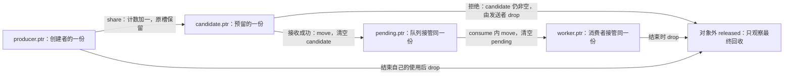
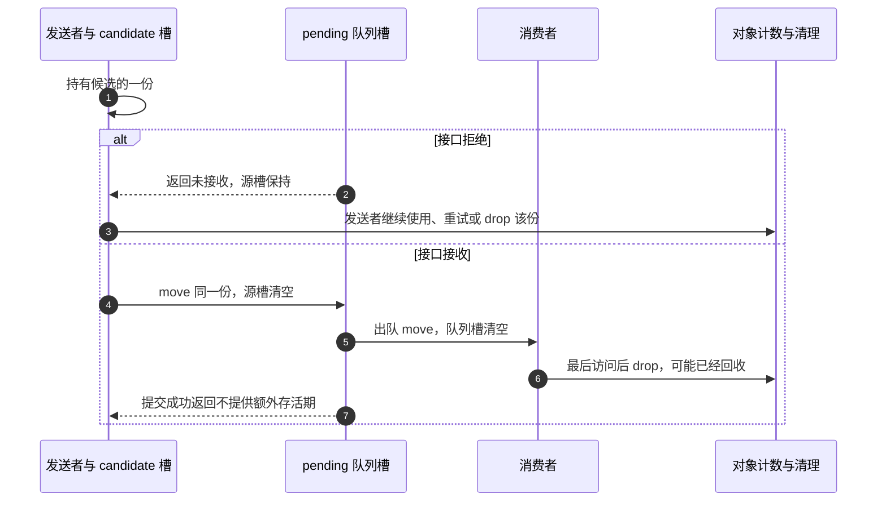
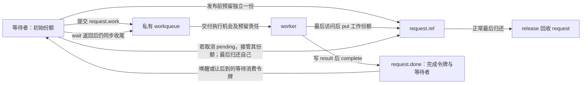
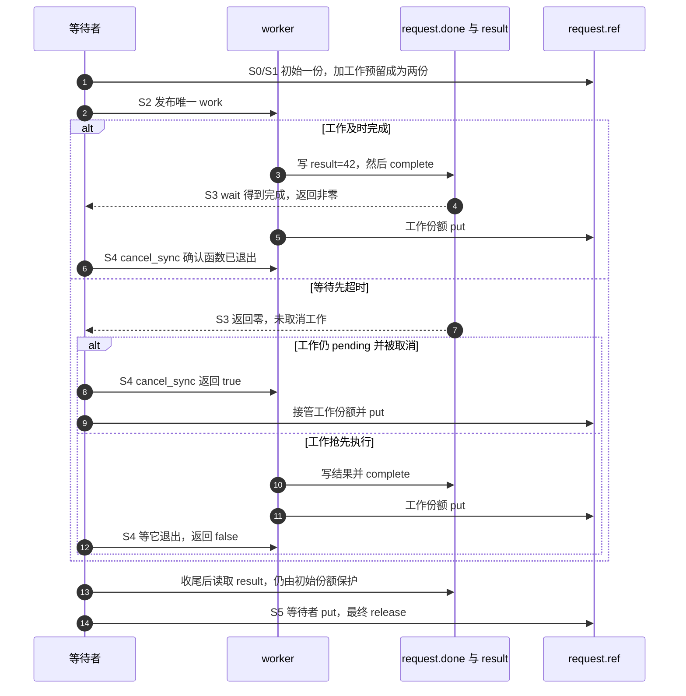
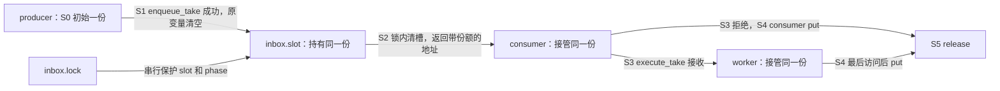
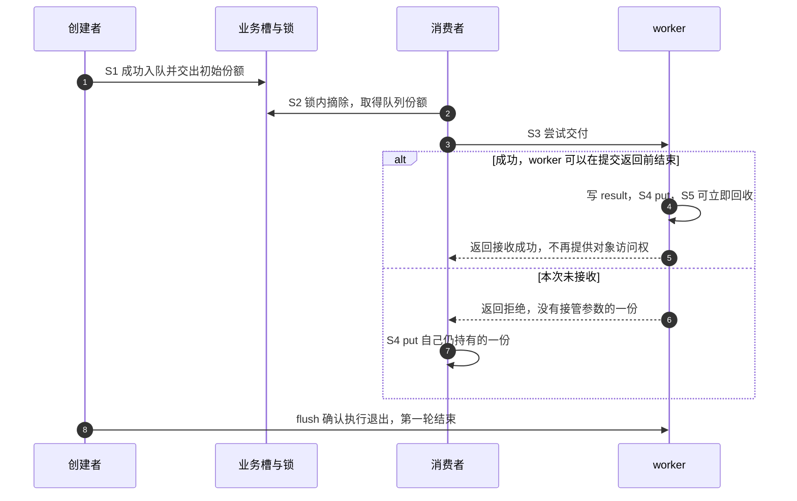

# 第7章\_handoff\_所有权转移模型

## 7.1\_本章定位

上一章已经知道：release 是否能正确清理，取决于此前哪些访问者退出、哪些责任被归还。现在把观察点往前移到交付瞬间。请求对象已经创建，生产者要把它交给队列；若接收者很快完成并归还，生产者还能在提交函数返回后读取结果吗？若队列拒绝，又由谁归还？

这个问题称为 handoff，即把使用机会及相应责任交给另一条路径。**地址传过去了，不等于归还责任已经定义。** 接收者可能只借用，可能取得新的一份，也可能接管生产者手里原有的一份。三种设计都能正确，错在两边各自采用了不同的理解。

本章沿同一个请求经过“创建者 → 候选交付 → 队列 → 消费者”的过程，先用可运行的 C 账本看清责任，再映射到 work、timer、completion 和注册接口。前章的查找窗口、对象资源与执行上下文作为先修保留；handoff 不替代它们，只回答这一份从谁手里交给谁、失败时还在谁手里。

读完应能为一个具体接口写出成功、拒绝、取消和完成各路径的责任变化，并解释接收者在提交函数返回以前就结束时，发送者凭什么还能访问或为什么必须停止访问。

## 7.2\_所有权语义\_先分清\_borrow\_ref\_take

先暂时去掉线程、硬件和队列锁，只保留地址与责任。这样能发现许多并非原子操作问题的错误：同一份由两边各归还一次，或者双方都以为另一边会归还。程序里的计数不会记录每一份属于谁，归属必须由接口和状态保存方式表达。

### 7.2.1\_指针传递不等于引用转移

在 C 中，把 `obj` 赋给接收者字段，只复制一个地址。若它原来代表生产者的一份，复制以后不会自动变成两份；把变量名换成 `worker_obj` 也不会让生产者失去那一份。要么明确接收者借用生产者保护的存储，要么增加一份，要么让生产者把现有责任交出去。

先复用前章已经建立的完整 [reference_ownership.c](../../../../labs/kernel/object_lifetime/materials/reference_ownership.c)，这次观察每个 owner 槽的移动。`owner.ptr` 非空表示该槽有一份须归还，空表示没有；真实 kref 不保存这些槽，下面是让责任可见的顺序教学程序。

```c
#include <assert.h>
#include <limits.h>
#include <stdbool.h>
#include <stdio.h>
#include <stdlib.h>

struct object {
    unsigned int refs;
    int value;
};

/* 一个非空槽代表一份归还责任，禁止用结构赋值复制持有者。 */
struct owner { struct object *ptr; };
static unsigned int released;

static bool create(struct owner *dst)
{
    assert(!dst->ptr);
    struct object *obj = malloc(sizeof(*obj));
    if (!obj)
        return false;
    *obj = (struct object){ .refs = 1, .value = 42 };
    dst->ptr = obj;
    return true;
}

static void share(struct owner *dst, const struct owner *src)
{
    assert(!dst->ptr && src->ptr);
    assert(src->ptr->refs > 0 && src->ptr->refs < UINT_MAX);
    ++src->ptr->refs;
    dst->ptr = src->ptr;
}

static void move(struct owner *dst, struct owner *src)
{
    assert(!dst->ptr && src->ptr);
    dst->ptr = src->ptr;
    src->ptr = NULL; /* 责任转交，计数不变。 */
}

static void drop(struct owner *slot)
{
    assert(slot->ptr && slot->ptr->refs > 0);
    struct object *obj = slot->ptr;
    slot->ptr = NULL; /* 先结束本槽使用权，再执行可能的释放。 */
    if (--obj->refs == 0) {
        ++released; /* 观察量位于对象外，释放后不再读取对象。 */
        free(obj);
    }
}

static int borrow(const struct object *obj)
{
    return obj->value; /* 调用期间由调用者的现有引用保活。 */
}

/* 成功才接收候选引用；拒绝时候选仍归调用者。没有真实工作队列。 */
static bool submit(struct owner *pending, struct owner *candidate,
                   bool accept)
{
    assert(!pending->ptr && candidate->ptr);
    if (!accept)
        return false;
    move(pending, candidate);
    return true;
}

static void consume(struct owner *pending)
{
    struct owner worker = {0};
    move(&worker, pending);
    assert(borrow(worker.ptr) == 42);
    drop(&worker);
}

int main(void)
{
    /* 两次运行分别观察提交成功与失败，均须恰好释放一次。 */
    for (unsigned int accept = 0; accept < 2; ++accept) {
        struct owner producer = {0}, candidate = {0}, pending = {0};
        if (!create(&producer)) {
            fputs("allocation failed\n", stderr);
            return EXIT_FAILURE;
        }
        assert(borrow(producer.ptr) == 42 && producer.ptr->refs == 1);
        share(&candidate, &producer);
        assert(producer.ptr->refs == 2);
        bool queued = submit(&pending, &candidate, accept != 0);
        if (!queued)
            drop(&candidate); /* 发布失败，归还预留的那一份。 */
        drop(&producer);
        if (queued) {
            assert(pending.ptr->refs == 1);
            consume(&pending);
        }
        assert(!producer.ptr && !candidate.ptr && !pending.ptr);
        assert(released == accept + 1);
        printf("accept=%u released=%u\n", accept, released);
    }
    return EXIT_SUCCESS;
}
```

在材料目录编译运行：

```bash
cc -std=c11 -Wall -Wextra -Werror -O2 reference_ownership.c -o reference_ownership
./reference_ownership
```

两次分别输出 `accept=0 released=1`、`accept=1 released=2`。`released` 是两次试验累计的对象外观察量，每次都只回收一个对象；不要在已 free 的对象里读取一个标志来“检查它已经释放”。本模型没有真实线程、原子计数或 Linux 饱和机制，assert 只检查这个受控账本，不证明任意并发程序正确。

从 `share` 与 `move` 的区别开始读：share 增加计数，并把地址写入一个原本为空的独立槽；move 只把地址换到新槽并清空旧槽，计数不变。若使用结构赋值复制一个非空 owner，两个槽都会看似有权 drop，实际却只对应一份；模型明确禁止这样复制。



图中的箭头不是内核消息。它表示程序对具体槽地址的写入与责任变化；真正接入并发队列时，还要用队列锁或既定发布协议保护这些地址转交。

### 7.2.2\_handoff\_的三种语义\_borrow\_get\_take

现在给刚才的动作命名。borrow 是借用：使用者没有接管一份，存储由另一个仍有效的保护窗口提供。get/ref 表示新增独立份额：接收者与原持有者之后各自退出。take/consume 表示转交已有份额：变的是责任人，不一定改变计数。

| 当前接口选择 | 接收者得到什么 | 发送者原来的一份 | 接收者退出时 |
| --- | --- | --- | --- |
| 借用 borrow | 指定窗口内的访问许可，没有独立引用 | 仍由原持有者负责，或由外层借用协议保活 | 结束借用，不代还别人的一份 |
| 追加 get/ref | 一份新建立的独立责任 | 仍由发送者负责 | 归还接收者的份额 |
| 接管 take/consume | 指定的一份既有责任 | 对这一份而言已经交出 | 继续转交或最终归还它 |

表描述成功接收时的语义，**失败是否也消耗引用需要另写契约**。本程序 submit 选择“成功接管、拒绝保持 candidate 不变”；另一个 API 可以约定无论成功失败都消费参数，但调用者必须据此不再归还。名字里有 take 并不能替代失败行为说明。

一个系统也可以把这些动作组合：当前完整程序先 share 得到候选，再把候选 take 给队列，队列又 take 给消费者。整个过程没有矛盾，因为每个接口对哪一份做什么都确定。所谓不能混用，指不能让同一调用的两端对它采用不同解释，而不是禁止系统同时存在多种所有权操作。

### 7.2.3\_borrow\_只借用\_不长期保存

最容易证明的借用是一次同步函数调用：`borrow(obj)` 只读 value，调用者在它返回以前保留自己的份额，函数不保存指针，也不 put。回到调用者时，归还责任从未离开 producer 槽。

但借用并不在定义上禁止跨线程或异步。上一章的[管理者等待 worker](P06_release_回调与复杂销毁模式.md#6.2.2_运行一个由管理者等待借用退出的模块)就是异步借用：管理者封闭入口并等 worker 返回以后才归还，所以借用窗口可以跨越两条执行路径。代价是更强的进入/退出协议，不能像独立持票 worker 那样让管理者随意先退出。

因此“不要长期保存”应理解为 **不能把指针保留到已承诺的借用窗口以外**。若一个同步打印函数私下把地址存进全局变量留待以后使用，它就擅自扩大了窗口；若一个异步接口明确由上层保证并等待全部借用退出，保存到该期限内则可以成立。需要脱离原窗口长期使用时，必须在窗口仍有效且满足取得前提时另取自己的引用。

### 7.2.4\_get/ref\_给接收方一份新引用

生产者还要观察请求，而消费者也要独立执行，这是追加引用的典型理由。完整程序中的 share 把计数从 1 改为 2，使生产者和候选各有一份；成功接收只移动候选那一份，失败则由生产者归还候选。生产者原来的份额始终要单独处理。

预留必须早于允许接收者使用并归还。若先发布，再 get，接收者可能先把它以为已经收到的那一份 put 掉；这会消耗生产者实际仅有的份额并回收，随后生产者再对旧地址 get 就已经太晚。不是只有“生产者自己先 put”才会出问题，错误的接收者退出也能抢先发生。

接口必须明确 get 在哪一层完成。若 `queue_ref` 内部已经追加并在拒绝时回滚，外面再盲目 get 就多造一份；若接口只接管传入的候选，外层才需要先准备。把函数名字和一行 get 并排看不够，要检查真实接收契约。

独立引用使两边可以分别结束，代价是计数更新与两份责任的退出记录；它只保活对象，不保证两边可以无锁写同一个字段，也不保证关闭以后业务仍被许可。

### 7.2.5\_take/consume\_接管调用者当前引用

若生产者创建请求以后不再需要它，已有初始份额就足以交给队列，不必为了“交付”机械追加一次再归还一次。模型中的 move 表达这个动作：源槽清空，目标槽接住，计数保持原值。出队也可把队列这一份直接交给消费者，之后由消费者归还。

为该协议画出一次拒绝与一次接收。交付点是接收者获准使用的那个发布动作，不是提交函数最后执行 return 的时刻；真实消费者可能在发送者返回以前就处理完并释放对象。



当前顺序 C 程序把 consume 安排在提交之后；图中的提前消费是并发接口必须额外考虑的顺序，不声称该程序创建了线程。发送者若只有这一个 candidate，成功后就没有自己的引用可据以访问。失败时则仍可在自己的份额上重试或归还，而不是一律“失败立即 put”；具体选择属于调用者的后续用途。

状态或参数需要提交给消费者时，应在发布以前按协议准备好，或者由接收函数在其保护的状态切换中完成。成功以后再写“已排队”可能同时破坏存活期和字段顺序，不能靠一条内存屏障补回已经交出的责任。

### 7.2.6\_handoff\_后能否访问\_取决于当前路径是否仍持有引用

判断时先问“凭哪项仍有效的保护访问”，不要只问“刚才是不是 take”。例如当前程序成功转交的是 candidate，而 producer 仍有自己的独立份额；生产者在归还 producer 以前仍可按字段同步协议使用对象。相反，若直接把 producer 唯一的一份转走，即使局部变量仍存着同一个地址，也不再提供保护。

借用者则靠被证明的借用窗口，而非自己持有引用。窗口可以由同步调用、管理者等待或其他明确机制提供，超过窗口就不能继续用；这与“只要全局计数似乎仍大于零就能访问”完全不同。计数不是查询谁还替你保活的接口。

在完整程序中做一次纸面变化：去掉 share，将 submit 的源槽直接换成 producer，且成功后删掉对 producer 的 drop；拒绝分支仍保留并归还它，接收分支由队列/消费者最终归还。这会少一次增加和减少，但也失去生产者同时观察的那一份。下一节把这些明确的语义接到真实异步接口，重点检查它们的接收、重排和完成规则是否与我们的假设一致。


## 7.3\_典型\_handoff\_场景\_异步路径\_队列和回调

把上一节的责任槽接到真实接口时，先找 **接收者什么时候取得执行机会**，再核对返回值表示什么。workqueue 接收一次工作、timer 修改下一次到期、completion 记录一个完成事件，都可能返回或改变状态，但它们没有同一套引用约定。本节从工作交付走到等待完成，再回到队列与注册关系。

### 7.3.1\_先\_get\_再投递给\_worker

[P01 完整工作模块](P01_kref_要解决什么问题.md#1.16.1_运行一次真实工作交付)采用接收者独立持有：创建者保留初始一份，发布前为唯一 work 预留一份；本次 queue_work 成功，worker 接管预留，在最后对象访问之后归还；失败只退回本次预留。创建者自己何时结束，与 worker 的那一份分开。

queue_work 返回 false 表示本次没有新增排队，常见原因是 work 已经 pending；不能概括成“只要正在运行就一定返回 false”。running 和 pending 不是同一状态，工作执行期间在符合 workqueue 约束的情况下可以再次排队。这会引入另一个被接收实例，需要另行明确它的责任，不能把一次性模块的取消模板直接套到允许重排的循环中。

固定[工作队列源码总索引](../../../../research/source_reading/workqueue/navigation/P01_Linux_6.12_工作队列源码总阅读索引.md#1.6_建议阅读顺序)连接[投递模块](../../../../research/source_reading/workqueue/navigation/P02_Linux_6.12_工作队列对象与投递模块源码概念导读.md#2.3_从queue_work到insert_work)；[已有执行者的 pool 选择](../../../../research/source_reading/workqueue/source_explanations/P02_Linux_6.12_工作队列投递与激活源码实现.md#2.4_queue_work选择pool并保持非重入)正说明执行和再次排队需要协作。引用份额仍由业务对象定义，workqueue 内部的 pwq 引用不替你保活外层对象。

### 7.3.2\_错误写法\_投递后再\_get

错误顺序是先将 work 暴露给执行者，然后才为它 get。按独立持票协议，worker 会在结束时 put；如果它先运行完，就可能把此刻唯一的初始份额消耗掉。生产者随后补 get，读到的已经可能是释放后的计数地址。即使生产者尚未主动归还，也已经出错。

正确顺序是先拥有候选，再开放接收者执行；如果拒绝，归还候选。如果选择直接 take 初始份额，则在发布之前就已经约定这份将由接收者负责，发送者不再补 get，也不再凭这份访问。两者都要求发布前的责任完整，不能把“动作发生在另一个 CPU 上”当作足够长的缓冲时间。

状态初始化也应在接收者有机会读取以前完成。发布成功的内存可见性保证帮助接收者看到已准备的字段，不能让发布之后才创建的所有权责任追溯生效；屏障与引用解决的是不同问题。

### 7.3.3\_work\_嵌入对象时的特殊注意点

`request->work` 与 `request->ref` 都在同一个外壳里。排队和执行路径需要访问 work 成员，业务回调又从该成员还原 request，所以它们的有效地址不能由一个已经结束的局部变量承诺。

独立持票模式让工作的一份保护到最后对象访问，再 put；这次 put 可能在 work function 返回以前就释放外壳，因此之后不能再访问 request 或 work。本章不把“必须活到回调函数返回”写成禁止尾部最后 put 的绝对规则；但同步等待该 work 真正退出和模块代码卸载仍是另外的任务，release 不能等待自己。

也可以采用[P06 管理者借用](P06_release_回调与复杂销毁模式.md#6.2.2_运行一个由管理者等待借用退出的模块)，由管理者持有直到同步等待结束。它减少每次工作独立引用，但限制管理者退出，不能混用“worker 会 put”与“管理者等完才 put”的两套动作。

### 7.3.4\_delayed\_work\_和\_timer\_的\_handoff

延迟工作在排队到执行之间多了一段定时等待。若仍采用一次成功交付一份的模型，那一份必须覆盖整个延迟期；提前超时、取消或关闭并不让这份自动消失。`queue_delayed_work()` 的接收与拒绝要处理本次预留，真正取消则使用 delayed_work 对应的同步取消接口，不能把内部 work 成员交给普通 cancel_work_sync 冒充完整延迟取消。

在 **只提交一次、没有重新排队、取消者仍持自己的份额** 的边界内，`cancel_delayed_work_sync()` 若取消了尚待执行的那次工作，应由取消者归还那一份；如果已经执行或正在退出，就由执行路径按协议归还，不能看到“没有取消”就补一次 put。引入重复调度或修改延迟后，先重新建立实例和票据的对应关系。

timer 的 mod_timer 则可能只是修改同一个 pending 实例的时间，不能照搬“每次调用都新增一份”。P06 的[定时器模型](P06_release_回调与复杂销毁模式.md#6.7.3_release_和_timer_的收尾关系)已经给出两次 get、一次回调的泄漏反例，并区分普通删除和最终关闭；这里沿用该证据，不另造一份忽略重启的 timer 模板。

### 7.3.5\_completion\_场景里的引用归属

现在让提交者等待结果。completion 是一项内核完成量：对象中保存完成状态和等待者登记，完成方发布事件，等待方等待或消费它。它没有增加 kref，也没有替完成方退出。等待超时只表示这次等待没得到完成结果，不表示 worker、设备或中断路径已经取消。

选择两份引用的完整例子：初始份额属于等待者，发布前预留另一份给唯一 worker。worker 写 result，调用 complete，再 put 自己的一份；等待者无论等到事件还是超时，都保留自己的份额直到同步收尾结束。本例只有一个普通 work，没有重排和其他生产者，适合清楚展示取消者何时接管未执行实例的责任。

下面是完整 [note_kref_completion.c](../../../../labs/kernel/object_lifetime/materials/note_kref_completion.c)：

```c
// SPDX-License-Identifier: GPL-2.0
#include <linux/completion.h>
#include <linux/errno.h>
#include <linux/kref.h>
#include <linux/module.h>
#include <linux/slab.h>
#include <linux/workqueue.h>

struct handoff_request {
    int result;
    struct kref ref;
    struct work_struct work;
    struct completion done;
};

static unsigned int release_calls;

static void handoff_release(struct kref *ref)
{
    struct handoff_request *request = container_of(ref, struct handoff_request, ref);
    ++release_calls; /* 最后归还安排在等待者，观察量位于对象之外。 */
    kfree(request);
}

static void handoff_worker(struct work_struct *work)
{
    struct handoff_request *request = container_of(work, struct handoff_request, work);
    request->result = 42;
    complete(&request->done); /* 发布结果事件，不交还对象引用。 */
    kref_put(&request->ref, handoff_release);
}

static int __init note_handoff_init(void)
{
    struct workqueue_struct *queue;
    struct handoff_request *request;
    unsigned long remaining;
    bool canceled;

    queue = alloc_ordered_workqueue("note_handoff", 0);
    if (!queue)
        return -ENOMEM;
    request = kzalloc(sizeof(*request), GFP_KERNEL);
    if (!request) {
        destroy_workqueue(queue);
        return -ENOMEM;
    }
    kref_init(&request->ref); /* 初始份额属于等待者。 */
    init_completion(&request->done);
    INIT_WORK(&request->work, handoff_worker);
    kref_get(&request->ref); /* 唯一工作实例在发布前预留一份。 */
    if (!queue_work(queue, &request->work)) {
        kref_put(&request->ref, handoff_release); /* 退回未接收的预留。 */
        kref_put(&request->ref, handoff_release); /* 结束等待者责任。 */
        destroy_workqueue(queue);
        return -EIO;
    }

    remaining = wait_for_completion_timeout(&request->done, 1);
    /* 一次投递，无重新排队；等待事件成功也不等于 worker 已返回。 */
    canceled = cancel_work_sync(&request->work);
    if (canceled)
        kref_put(&request->ref, handoff_release); /* 接管未执行实例的一份。 */
    destroy_workqueue(queue); /* 代码卸载前已无 worker 执行。 */
    pr_info("note_handoff: completed_in_time=%d canceled=%d result=%d\n",
            remaining != 0, canceled, request->result);
    kref_put(&request->ref, handoff_release); /* 最后放弃等待者的一份。 */
    return 0;
}

static void __exit note_handoff_exit(void)
{
    pr_info("note_handoff: release=%u\n", release_calls);
}

module_init(note_handoff_init);
module_exit(note_handoff_exit);
MODULE_LICENSE("GPL");
MODULE_DESCRIPTION("完成事件与异步对象引用分别退出的完整实验");
```

先观察状态地址。`request->done.done` 及其等待队列属于完成量；`request->result` 是业务结果；`request->ref` 保留外壳；`request->work` 由工作队列调度。这些字段放在同一结构中，也不会变成同一项状态。等待者的初始份额保护它跨越等待和取消，worker 的那一份在真正完成路径或被取消后的接管路径归还。



为本例定义一轮 S0～S5，便于对照状态和时序：S0 分配并初始化请求和队列，S1 预留 worker 份额，S2 成功发布，S3 等待事件或超时，S4 同步取消/等待退出并结算工作份额，S5 等待者归还最后一份。这里的 S3 只记录等待结果，不冒充“完成方已经停止”。



在准备好且与目标运行内核匹配的可写构建环境中：

```bash
# KDIR 指向匹配目标内核的构建目录；在仓库根目录运行。
make -C "$KDIR" M="$PWD/labs/kernel/object_lifetime/materials" modules
sudo insmod labs/kernel/object_lifetime/materials/note_kref_completion.ko
sudo rmmod note_kref_completion
dmesg | tail -n 12
```

等待上限是一个 jiffy，即内核节拍单位，不能脱离配置把它固定解释成某个毫秒数。可能观察到下面三组结果；早完成和等待中完成在日志上相同：

| completed_in_time | canceled | result | 含义 |
| --- | --- | --- | --- |
| 1 | 0 | 42 | 等待取得完成事件，工作归还自己的一份 |
| 0 | 1 | 0 | 等待超时，未执行的唯一实例被取消，取消者代还工作份额 |
| 0 | 0 | 42 | 等待已超时，但工作在取消完成前执行，仍由工作路径归还 |

卸载日志应为 `release=1`。本例故意在同步收尾以后读 result，这时不再有 worker 写入；它没有把 timeout 当作可并发读取业务字段的许可。无论哪组输出，等待者都保留初始份额到最后；若提前归还又继续访问嵌入的 done/result，就可能越过对象寿命。

本轮 ARM 前端及宿主七组控制检查通过：队列/对象分配失败、拒绝发布、早完成、等待中完成、超时取消和超时后工作完成。宿主完成量、队列、锁/原子和分配是显式替身，未执行目标装卸、实际等待或硬件内存序；上面的命令是目标复现步骤，不是已运行记录。

固定[等待与完成量总索引](../../../../research/source_reading/waiting_notification/navigation/P01_Linux_6.12_等待与完成量源码总阅读索引.md#1.5_建议阅读顺序)进入[完成量模块](../../../../research/source_reading/waiting_notification/navigation/P03_Linux_6.12_completion模块源码概念导读.md#3.2_状态所有权)，再到[等待与令牌消费](../../../../research/source_reading/waiting_notification/source_explanations/P02_Linux_6.12_completion_c令牌与等待源码实现.md#2.4_do_wait_for_common等待与消费)：timeout 返回路径没有替你取消完成者。状态同步与对象保活必须分别设计。

### 7.3.6\_callback\_场景里的引用归属

同步遍历回调可以只借用：上层在整个调用期间保留对象，回调读写允许的字段后返回，不私自保存到窗口以外，也不代还上层的引用。若回调想保留结果对象，必须在窗口仍有效时按允许的接口取得自己的份额。

异步回调要区分“一次接收一次执行”和“注册期间可能多次执行”。前者可以像一次 work 一样预留，拒绝由提交方退回，成功执行由接收者归还；取消时要核对它是否真正阻止了该实例。后者可以由注册关系持一份，多次回调借用，注销在禁止新进入并等旧回调退出以后归还；不能每次回调都 put 注册关系唯一的一份。

也可让每次回调各自取得引用，但“判断允许进入到取得那一份”的窗口必须与注销串行化。[P06 注册退出](P06_release_回调与复杂销毁模式.md#6.7.5_release_和_callback_的关系)已列出这两类契约；具体系统必须核对实际注册 API，不能为一个未定义的 register_async_callback 假设失败、取消或重复调用语义。

### 7.3.7\_队列场景\_enqueue\_成功和失败的归属

普通请求队列同样可以选择追加或转交，只要成功的发布点与拒绝出口明确。接收前先验证请求是否处于可提交状态、队列是否开放；这些状态与实际入队应在同一个队列协议下完成。kref 只负责那一份是否存在，不负责防止同一嵌入节点被重复挂接。

#### (1)\_设计一\_enqueue\_成功后队列接管当前引用

沿 7.2 完整程序的 submit：源槽是一份已经存在的责任，可以来自初始引用，也可以来自先前查找或追加；不要求调用前一定再 get。验证失败则源槽保持，成功发布则队列接管。消费者可能随即出队，所以发送者不能在成功以后才写请求状态或归还已经交出的那一份。

若发送者还要保留观察能力，应在转交以前另行保留一份，并把两份在代码中区分。反过来，若它不再需要请求，直接移交初始份额即可，省下多余的增加/减少；节省成立的原因是责任始终有人接住，不是省略安全步骤。

#### (2)\_设计二\_enqueue\_内部\_get\_调用者仍持有引用

追加式接口由接收函数为队列取得一份。拒绝时退回内部预留，调用者原份额保持；成功时队列与调用者各有一份。调用者结束提交后若不再使用，仍须归还自己的份额，不能因为“已经入队”就假装初始责任消失。

不要把两种接口包装成名字不同但调用者仍猜测的版本。应在接口注释写清内部是否 get、失败是否消费参数，以及成功后接收者是否可能在返回前就结束。下一组小节将把这些条件整理成同一组成功/失败表，完整请求模型再把入队、出队和执行连起来。

### 7.3.8\_dequeue\_时的引用归属

队列拥有的一份可以直接移动给消费者：在队列锁内找到并摘除节点，改变接收状态，随后带着这一份离开锁。7.2 的 consume 把 pending 移到 worker，正是最小的出队责任模型；没有必要先 put 队列的一份，再对可能已经释放的地址重新 get。

如果某个设计确实要建立新的消费者份额，也必须在队列份额或其他明确保护仍有效时先取得，再归还旧份额。计数不必为了跨越函数边界而先降到零；每一份的交接应连续。空队列返回不交付对象，也就没有给本次调用者凭空产生一份可 put 的责任。

### 7.3.9\_remove/unlink\_场景下的\_handoff

摘下结构节点与归还集合份额是两项动作。只有该集合按协议拥有一份，移除者才会在摘下时接管并归还它；把对象挂进 list 的机械动作本身不增加引用。非拥有索引的最终减少与撤下必须走[P06 三种查找协议](P06_release_回调与复杂销毁模式.md#6.5.3_release_内脱链模型)，不能从“它在表里”推出存在一份待归还的集合引用。

对拥有一份的队列，移除者通常先在锁内撤下并接管那一份，再到锁外归还，避免回调在集合尚指向对象时回收；此前已经出队或 lookup_get 的持有者保留自己的责任。此处的 take 发生在“队列 → 移除者”的内部交接中，而不是一次 list_del 自动替你完成引用操作。


## 7.4\_接口契约\_成功\_失败\_命名和注释

已经看过真实接收、等待、取消和完成过程，现在把一项接口的边界写下来。接口契约应从实际分支得到，不是先列一张看起来齐全的错误码表，再要求实现去符合它。下面的规则随后由 7.6 的同一请求模块兑现。

### 7.4.1\_handoff\_成功/失败路径必须写成表

将业务队列限制为一个槽，用 `enqueue_take` 表示成功接管，用 `enqueue_ref` 表示内部追加。它们都不在入队时分配内存，所以本例入队表里没有凭空加入 ENOMEM；内存不足属于更早的创建阶段。

| 接口与结果 | 队列这一份 | 调用者传入的份额 | 之后谁归还 |
| --- | --- | --- | --- |
| enqueue_take 成功 | 接管原份额 | 已交出 | 队列出队后转给消费者，再由执行者或失败接管者归还 |
| enqueue_take 拒绝 | 未取得这次参数份额 | 仍属于调用者 | 调用者可保留、重试或归还 |
| enqueue_ref 成功 | 内部追加并保留一份 | 原份额保留 | 队列一路和调用者一路分别归还 |
| enqueue_ref 拒绝 | 内部预留已退回 | 原份额保留 | 调用者仍自行处理原份额 |

本例拒绝是槽被占用或请求已经不处于 NEW 状态，返回 `-EBUSY`。每个拒绝发生在实际发布以前，不会出现“返回失败但另一个消费者已经拿走了这一份”的隐藏分支。若某 API 确实允许部分接收或失败仍消费，就必须另写状态和返回契约，不能套用本表。

还要把“入队成功”与“以后执行成功”分开。队列已经接管以后，消费者向 workqueue 的交付可能再失败；那时接管的是消费者手里的一份，由消费者按执行接口的失败约定归还，不能回头要求已经离开的生产者处理。

### 7.4.2\_错误路径回滚模型

追加式包装器先 get 候选，然后调用接管式底层接口。接管成功，候选已经属于队列；拒绝，包装器只退回自己刚追加的候选。调用者原份额在两种结果下都存在，因此包装器不能失败时顺便多 put 一次。

回滚还包括业务状态。最容易证明的安排是先在队列锁内检查所有条件，再一起改变请求阶段和槽地址；如果检查失败，阶段保持原样。本章完整模块采用这个办法，不在发布前随意写 QUEUED，再在不知道是否已被别人观察时改回 NEW。

不要根据惯用写法猜返回值。`queue_work()` 用布尔值表示本次接收，0 是未接收；自有 `enqueue_take()` 则约定 0 成功、负数拒绝。应先把底层返回转换为当前接口自己的结果，再处理归属，避免把成功当失败而退回已交付的一份。

### 7.4.3\_成功路径不应该偷偷留下引用

失败回滚全部正确，仍可能在成功路径泄漏。创建者的一份经过 enqueue_ref 后并未消失；如果函数直接返回且没有把这一份交给任何新拥有者，也没有归还，队列最终退出仍会留下它。

若创建者要观察结果，可以明确保留到执行结束后再归还；若只负责产生请求，可以直接采用 enqueue_take，把初始份额交走。在两种情况下，决定是否 put 的依据都是“我当前还负责哪一份”，而不是“上一步返回了成功”。

同样，take 成功后再按 ref 模式 put，会消耗接收方正在使用的那一份。引用数可能只是提前正常到零，没有立即出现下溢告警；一次正常 release 日志并不能证明交付正确。

### 7.4.4\_函数命名要表达引用语义

名字帮助读者提出正确的问题，接口注释和实现负责给出答案。已有系统 API 可能没有 take/ref 后缀，仍必须按它的真实契约使用；自有封装则可以把关键归属直接写进名字，减少调用者猜测。

#### (1)\_borrow\_语义

`request_dump` 或 `request_format` 可以约定只在给定借用窗口中使用，不保存到窗口以外、不代还调用者的引用。若它确实会保存，就不能因为名字像打印函数而继续沿用只借用的文档；应明确新的保活或转交协议。

#### (2)\_get/ref\_语义

`enqueue_ref` 表示队列内部建立独立份额，成功保留、拒绝回滚，调用者原份额不受影响。调用者不再额外为这个同一接收动作 get。若还有另一个独立使用者，需要另列那一份，不能混在同一个隐含“额外保护”里。

#### (3)\_take/consume\_语义

`enqueue_take` 和 `execute_take` 都说明接收参数代表的一份，具体接收时点与拒绝行为仍要写清。本章二者都成功消费、失败保留；其他接口可能无条件消费。不能看到相同后缀就跳过失败路径核对。

### 7.4.5\_注释必须写清楚成功/失败归属

给完整模块里的两种入口写注释，应能直接指导一个不知道实现细节的调用者：

```c
/*
 * enqueue_take：参数指向有效请求，调用者对传入的一份负责。
 * 成功时这一份归队列；失败不消费，调用者仍负责。
 * 成功发布后接收者可能提前执行；本函数不提供额外存活期。
 */

/*
 * enqueue_ref：调用者原份额在成功和失败两种返回下都保持。
 * 成功时队列另有一份；失败时内部预留已经归还。
 * 持引用只保护存储，读写业务结果仍遵守相应完成与同步协议。
 */
```

取消、超时和重复提交若属于接口职责，也要标出它们是否消费以及谁完成尚未结束的工作。把“注意引用计数”换成这些具体承诺，才能在以后改动返回路径时发现协议已经变化。

## 7.5\_组合边界\_状态\_锁\_lookup\_和\_release

责任明确以后，还要保证交付的状态地址和引用地址都有效。下面四项并不增加一种新的 handoff 类型，而是检查这次交付与周围机制的连接是否完整。

### 7.5.1\_handoff\_和状态字段的顺序

完整模块采用 NEW、QUEUED、RUNNING 三个请求阶段：创建时写 NEW；入队锁内检查为 NEW 才能同时写 QUEUED 并发布槽；出队锁内清槽、写 RUNNING。每个请求只执行一次，因此 RUNNING 后即便还持有观察者引用，也不允许重新入队。这是本例的单次请求协议，不是 kref 自动限制。

尚未发布的私有输入可以由创建者准备，已经共享的队列阶段则在指定队列锁下转换。take 成功以后，发送者若只交出了唯一份额，连设置“已提交”这种看似无害的写入也没有存活依据；若还有另一份，仍须遵守阶段字段的同步规则。

### 7.5.2\_handoff\_和锁的关系

`queue->lock` 同时保护槽和请求阶段，使“检查能否入队—写阶段—发布地址”成为一个受保护窗口。`request->ref` 记录独立引用数，保护窗口之外的存储寿命。前者不能让出锁后的裸指针自动存活，后者不能让两个线程无锁修改同一个槽。

本例只让每个请求属于同一个业务队列。若允许不同队列同时接收同一个请求，各队列自己的锁就不能互相保护同一个 phase，必须重新选择共同保护或明确的节点/归属结构，不能直接复制当前函数用于多队列。

在私有工作队列上，worker 写 result，共享模式的创建者等 flush 返回后才读。这里没有使用计数快照猜“别人已经写完”，也没有因自己持一份就省略结果同步。

### 7.5.3\_handoff\_和\_lookup\_的关系

查找先回答如何得到一个有效地址和可用份额，handoff 再决定如何把指定份额交走。如果 lookup_get 已给调用者一份，可以直接 take 给后续队列；若队列 ref 接口内部追加，调用者还要归还 lookup 得到的原份额。

无保护 raw lookup 不能因下一步马上 get 就变安全。必须在查找保护尚有效且满足正引用或条件取得前提时接到独立份额，再离开窗口；只有明确允许的借用型下游，才能在窗口内完成使用而不独立 get。下一章专门逐步展开这一取得窗口。

### 7.5.4\_handoff\_和\_release\_的关系

一次移交不增加总责任，追加会增加，归还才减少。所有已经结束的持有者都归还后，正常最后 put 触发 release；回调不需要知道对象经过了几个队列，但对象的清理协议必须已经覆盖入口、异步借用和资源退出。

“release 可达”只是必要观察，不能单独判断设计好坏。少一份可能让它过早可达，多一份可能让它永远不可达；即使回收次数恰好为 1，也可能在某个旧借用者退出以前执行。验收需要同时看最后清理次数、此前访问是否合法以及退出之后有没有残留责任。

## 7.6\_完整模型\_同一请求对象的两种设计

现在把前面分开的动作接成同一段可构建程序。业务队列使用一个槽，目的是突出责任转交；它不是一个高吞吐队列实现。每个请求从业务槽出队以后只提交一次到私有 workqueue，两个实验轮次完全收束以后才进入下一轮，不导出外部并发接口。

### 7.6.1\_一个完整请求对象\_handoff\_示例

完整 [note_kref_queue.c](../../../../labs/kernel/object_lifetime/materials/note_kref_queue.c)包含创建、两种入队、出队、异步执行、拒绝归还和退出，避免把未定义的队列或完成函数留给读者补齐：

```c
// SPDX-License-Identifier: GPL-2.0
#include <linux/errno.h>
#include <linux/kref.h>
#include <linux/module.h>
#include <linux/mutex.h>
#include <linux/slab.h>
#include <linux/workqueue.h>

enum request_phase { REQUEST_NEW, REQUEST_QUEUED, REQUEST_RUNNING };
struct queued_request {
    int result;
    enum request_phase phase;
    struct kref ref;
    struct work_struct work;
};
struct request_queue {
    struct mutex lock;
    struct queued_request *slot; /* 非空槽拥有一份；只在此队列处理这些请求。 */
};
static struct request_queue inbox;
static struct workqueue_struct *execution_queue;
static unsigned int release_calls; /* 演示每处理完一个对象才开始下一个。 */

static void request_release(struct kref *ref)
{
    struct queued_request *request = container_of(ref, struct queued_request, ref);
    ++release_calls;
    kfree(request);
}

static void request_put(struct queued_request *request)
{
    kref_put(&request->ref, request_release);
}

static void request_worker(struct work_struct *work)
{
    struct queued_request *request = container_of(work, struct queued_request, work);
    request->result = 42;
    request_put(request); /* 归还经队列、消费者转来的同一份。 */
}

static struct queued_request *request_create(void)
{
    struct queued_request *request = kzalloc(sizeof(*request), GFP_KERNEL);
    if (!request)
        return NULL;
    request->phase = REQUEST_NEW;
    kref_init(&request->ref);
    INIT_WORK(&request->work, request_worker);
    return request;
}

/* 成功接管参数所代表的一份；失败不消费。参数必须有效且拥有一份。 */
static int enqueue_take(struct request_queue *queue, struct queued_request *request)
{
    int result = 0;
    mutex_lock(&queue->lock);
    if (queue->slot || request->phase != REQUEST_NEW)
        result = -EBUSY;
    else {
        request->phase = REQUEST_QUEUED;
        queue->slot = request;
    }
    mutex_unlock(&queue->lock);
    return result;
}

/* 两种返回都保留调用者原份额；成功额外保留队列份额，失败退回预留。 */
static int enqueue_ref(struct request_queue *queue, struct queued_request *request)
{
    int result;
    kref_get(&request->ref);
    result = enqueue_take(queue, request);
    if (result)
        request_put(request);
    return result;
}

/* 返回非空时把槽拥有的一份交给消费者，计数不变。 */
static struct queued_request *dequeue_take(struct request_queue *queue)
{
    struct queued_request *request;
    mutex_lock(&queue->lock);
    request = queue->slot;
    if (request) {
        queue->slot = NULL;
        request->phase = REQUEST_RUNNING;
    }
    mutex_unlock(&queue->lock);
    return request;
}

/* 本例每请求只投递一次；成功消费当前份额，拒绝时仍由消费者持有。 */
static int execute_take(struct queued_request *request)
{
    return queue_work(execution_queue, &request->work) ? 0 : -EIO;
}

static int run_one(bool shared)
{
    struct queued_request *producer = request_create(), *consumer;
    int result;
    if (!producer)
        return -ENOMEM;
    result = shared ? enqueue_ref(&inbox, producer) : enqueue_take(&inbox, producer);
    if (result) {
        request_put(producer);
        return result;
    }
    if (!shared)
        producer = NULL; /* 只清本地变量，不再通过对象地址访问。 */
    consumer = dequeue_take(&inbox); /* 本例无其他消费者，成功发布保证非空。 */
    result = execute_take(consumer);
    if (result)
        request_put(consumer); /* 拒绝，消费者仍负责队列转来的一份。 */
    consumer = NULL;
    flush_workqueue(execution_queue); /* 无重排，等待执行后才观察或进入下一轮。 */
    if (producer) {
        pr_info("note_queue: shared result=%d\n", producer->result);
        request_put(producer);
    }
    return result;
}

static int __init note_queue_init(void)
{
    int result;
    mutex_init(&inbox.lock);
    inbox.slot = NULL;
    execution_queue = alloc_ordered_workqueue("note_queue", 0);
    if (!execution_queue)
        return -ENOMEM;
    result = run_one(false);
    if (!result)
        result = run_one(true);
    destroy_workqueue(execution_queue); /* 初始化内收束两轮，不导出并发入口。 */
    return result;
}

static void __exit note_queue_exit(void)
{
    pr_info("note_queue: release=%u\n", release_calls);
}

module_init(note_queue_init);
module_exit(note_queue_exit);
MODULE_LICENSE("GPL");
MODULE_DESCRIPTION("同一请求的队列转交与共享引用对照实验");
```

第一轮 `run_one(false)` 只移动初始份额。创建者成功发布后把自己的局部变量清为 NULL，之后由 dequeue 的返回值把槽的一份接给 consumer，execute_take 再把同一份交给 worker。计数从初始化到工作结束前一直是一份，最终 worker 归还。如果执行交付失败，consumer 没交出去，由它归还。

清空 producer/consumer 只是本程序帮助表达归属的写法；它不能把别处复制的裸指针变安全。这里清的是局部变量，不是在交付以后通过可能已释放的对象访问某个成员。工作被接收后可能很快完成，所以 execute_take 的调用方成功后不再解引用 consumer。

这一轮按 S0～S5 追踪：S0 创建初始份额；S1 在业务锁下发布到槽；S2 出队，把同一份移给消费者；S3 接收到 workqueue 或拒绝；S4 执行/拒绝路径归还；S5 最后清理，flush 返回则另行确认执行函数已退出。代码中 phase 只表达业务队列阶段，S0～S5 是阅读用过程编号。





图中把逻辑角色分开画；当前模块由同一个初始化线程依次扮演创建者和业务队列消费者，work 由内核异步调度，不能把这张图当成已经实现多生产者/多消费者队列。

在与目标运行内核匹配且已准备好的可写构建环境中：

```bash
# KDIR 指向匹配目标内核的构建目录，在仓库根目录执行。
make -C "$KDIR" M="$PWD/labs/kernel/object_lifetime/materials" modules
sudo insmod labs/kernel/object_lifetime/materials/note_kref_queue.ko
sudo rmmod note_kref_queue
dmesg | tail -n 12
```

正常情况下共享轮输出 `shared result=42`，卸载输出 `release=2`，表示两轮各清理一次。第一轮不能为了输出 result 而在 flush 后继续使用原 producer 地址：那一份早已交出，工作可能已经释放它。仅等待 work 退出不会重新创造对象引用。

本轮 ARM 前端和宿主十组控制检查通过，包含创建失败、执行拒绝、提前/稍后执行、满槽拒绝、重复入队和已消费状态。宿主调度、锁、分配及原子为明确替身，提前执行由替身在 queue_work 返回以前运行回调来安排；未完成目标构建链接、装卸、实际线程竞争或内存序验证。

### 7.6.2\_同一个场景也可以设计成共享引用模型

第二轮 `run_one(true)` 使用同一个对象结构、队列和 worker，只在入队处选择 enqueue_ref。包装器先 get，再调用相同的 take 底层；成功后队列一路拥有新份额，producer 仍有初始份额。队列的一份经出队和工作交付移动，worker 最后 put 时，producer 仍保留对象，因而不会回收。

创建者在 flush 之后读取 result，此时已有执行完成证据和自己的存活依据；读完再 put 初始份额，最终清理就在创建者一侧发生。若工作交付失败，consumer 归还队列的一份，producer 仍须归还原份额，此时 result 仍是创建时的零值，run_one 返回错误。

共享模式多了一次 get/put，换来创建者独立保留和观察的能力。直接转交模式少这一对操作，但不能让创建者在交付后继续依赖原引用。二者应按实际使用期限选择，不是一个永远更安全或更高效。

### 7.6.3\_两种模型不要混用

当前程序合法地让 enqueue_ref 内部复用 enqueue_take，因为包装器明确准备了一份新候选，成功转交候选，失败退回候选。错误的是调用方把 enqueue_ref 当成消费原份额而漏 put，或者把 enqueue_take 当成保留原份额而再次 put。

做三项练习来检验这一区别：

1. 预测第二轮把 producer 的 put 提前到 flush 之前会怎样。若之后仍读 producer->result 就可能越过寿命；若同时删除后续对象访问，仍需保留代码退出等待。
2. 在队列已满时分别调用两种入队，检查新请求的 phase 和引用是否保持，以及占槽的旧请求是否被误清。拒绝只能处理本次参数责任。
3. 让 execute_take 故意拒绝，分别追踪 take 轮的一份和 ref 轮的两份。两条路径都应最终回收一次，且拒绝时不能让没有执行的 worker 承担 put。

第 2、3 项对应本轮宿主控制夹具已安排的分支；读者在真实模块中自行注入修改时，应重新构建并记录结果。第一项的错误访问只在纸上推演，不建议为了看到崩溃而把已知失效指针交给运行内核。

## 7.7\_handoff\_检查清单

审查一个新接口时，按同一份责任的旅程回答下面的问题，每项都应能指向真实代码和状态地址。

- **进入条件：** 参数靠已有独立引用、受保护查找还是明确借用窗口有效？接收者能否在窗口结束前接到它需要的保护？
- **发布动作：** 哪一步让接收者可以执行，状态和责任是否已在此前准备？提交返回是否可能晚于接收者的最后访问？
- **成功与拒绝：** 接管原份额、追加候选还是只借用？失败是否消费？重复提交是否只处理本次责任而不误动原有工作？
- **中途退出：** 取消、超时、注销、出队和移除各自证明什么？有没有把计时结束或通知到达误当成执行者已退出？
- **访问与结束：** 发送者以后凭哪份引用或借用继续使用？字段同步另由什么保证？所有取得/转交最终由谁归还，且不会早于最后合法访问？
- **对象之外：** 集合是否真的拥有一份，最后清理是否仍有旧借用者，模块代码与异步执行者是否已经收束？函数名和中文注释是否陈述实际契约？

其中“release 之前必须脱链”不能当成所有对象的一条固定检查结果。应检查当前选择的是拥有集合份额还是非拥有索引，以及它怎样把取得窗口与最终撤下连接；不同协议给出的正确顺序不同。

## 7.8\_本章小结

handoff 的核心是指定责任何时换了拥有者。borrow 在约定窗口内借用而不接管；get/ref 建立独立份额；take 移动已有份额，计数可以不变。它们可以组合成一个完整协议，但同一次调用的双方必须对成功、失败和发布点采用相同理解。

完整完成量模块表明，等待超时以后工作仍可能完成，通知与引用归还分别发生；完整队列模块又让同一请求沿两种协议走到最终清理。正确性来自每一步有连续的存活依据、字段同步和唯一归还责任，不是只看 get/put 行数相等或日志出现一次 release。

现在可以解释“交给别人以后我还能不能用”：先指出自己仍有的那一份或尚未结束的借用窗口，再检查业务许可与字段同步；说不出依据，就不能靠局部变量仍非空继续访问。下一章从更早一步追问：第一次从共享容器找到地址时，还没有自己的一份，要怎样安全地取得它？

专题导航：[kref 引用计数机制章节大纲](大纲.md)。

上一篇：[release 回调与复杂销毁模式](P06_release_回调与复杂销毁模式.md#6.12_本章小结)。

下一篇：[lookup 场景与 kref_get_unless_zero()](P08_lookup_场景与_kref_get_unless_zero%28%29.md)。
