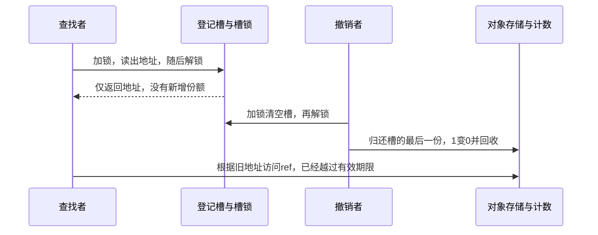
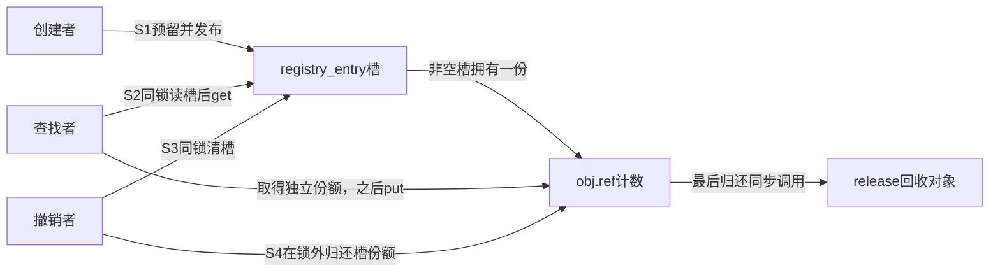
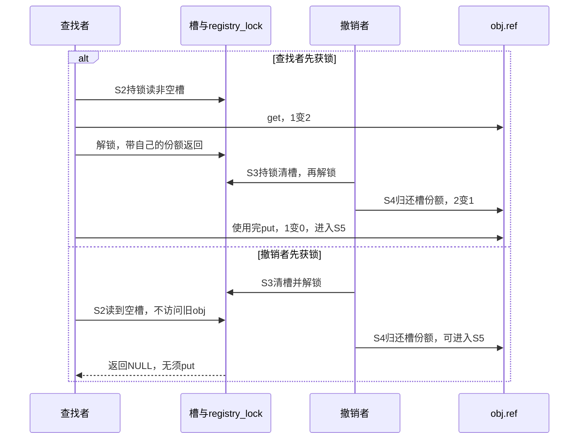
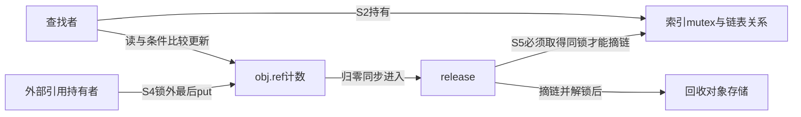
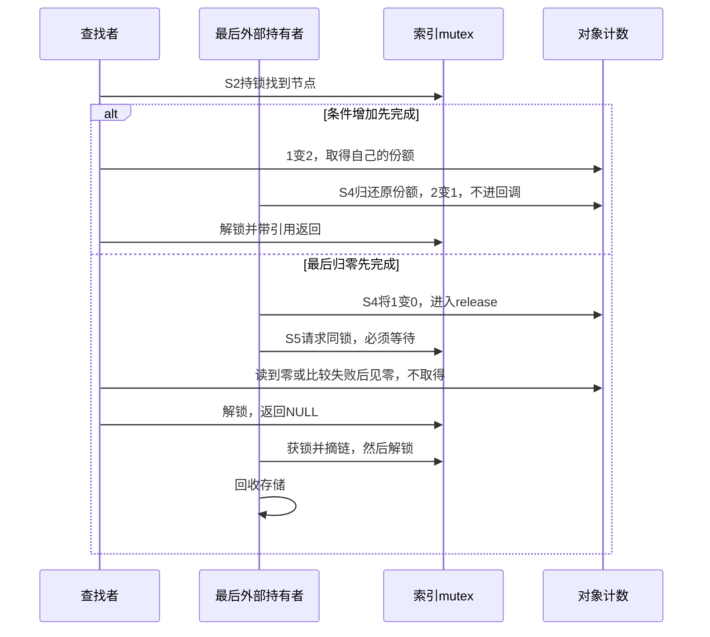

# 第8章\_lookup\_场景与\_kref\_get\_unless\_zero()

## 8.1\_本章定位

上一章把已经拥有的一份引用从创建者交给了队列，再交给消费者。接下来换一个入口：请求只带对象编号，处理者需要到共享登记表中寻找对象。表里保存着地址，可处理者尚未拥有任何一份。**第一次取得自己的引用，该从哪里获得安全保证？**

先回想 P02 的单槽登记模块：登记槽拥有一份，查找在槽锁内追加一份，撤下入口以后旧读者仍可继续访问。本章从这个已成立的小模型出发，解释为何必须把“找到地址”和“取得引用”放在同一个受保护窗口内，再把槽扩展成链表和按编号查询的容器。读者应已理解 P03 的可见性、业务状态与存储寿命，以及 P07 的借用和转交；这里不会把它们重新合并成一个“活着”布尔值。

本章中的 lookup 指 **按入口或编号查找对象**。接口可能只借出临时地址，也可能返回调用者拥有的一份，语义由接口协议决定，不能从单词 lookup 推断。前半章先建立最容易审查的“容器持有一份”协议；只有当该保证不再成立、查找仍可能碰到零计数对象时，才引入条件取得。RCU 的读侧窗口放到后面与 P10 衔接，不把一个临界区函数当作自动回收保护。

## 8.2\_lookup\_的基本边界\_先分清指针\_对象和引用

考虑对象编号 7：创建者已把它放入登记槽，随后归还初始引用。现在计数为 1，这一份属于槽。查找者和撤销者可以在不同 CPU 上执行，查找者想把结果带回锁外处理。

### 8.2.1\_lookup\_为什么是\_kref\_最容易出错的场景

若查找接口只在内部加锁、读槽、解锁，返回后调用者才 get，锁确实保护了“读槽”这个瞬间，却没有保护下一次对对象成员的访问：



这里甚至不需要两次计数更新同时发生。撤销者完全执行完以后，查找者才开始 get，仍然错误。换成条件 get 也必须读取相同的成员地址，不能先验证地址再决定要不要访问它。计数的原子性只规定 **对有效计数存储的操作** 怎样相互排序，不负责让已经释放的分配块重新属于原对象。

若分配器恰好尚未覆盖那块内存，程序可能暂时打印出旧编号；若内存被复用，同一地址又可能装着另一个对象。因此“不崩溃”“编号看起来对”“条件 get 返回成功”均不能替代地址期限的证明。不要为了演示这一点在正常实验里真的访问已释放存储，时序图已经给出了违反前提的确切位置。

### 8.2.2\_裸指针\_有效对象\_有效引用的区别

#### (1)\_裸指针

C 指针变量只保存地址，类型系统没有记下当前路径是否拥有一份 kref。同一个 `struct registry_object *` 可以表示创建者的一份、查找者的一份，也可以只是锁内借出的地址。“裸”在这里表示 **没有随这次返回交付独立引用**，不表示所有裸指针都不可访问：借用窗口内当然可以使用，关键是知道窗口何时结束。

#### (2)\_有效对象

不要把有效压缩成单一状态。查找准备访问 `obj->ref` 时，至少要证明这块存储仍属于该对象、计数字段仍可访问；若准备普通 get，还要证明当前计数为正。前一个条件不蕴含后一个：最后 put 可以已经归零，而清理者正在等待查找者持有的锁，尚不能摘链、回收。8.4 正是为这种窗口准备的。

在本章首先建立的拥有型槽中，这两个证明恰好来自同一协议：查找持槽锁时撤销者不能清槽；槽非空意味着槽的一份还没有被归还，所以对象存储仍在、计数仍正。**不是 mutex 自动保护任意对象，而是所有发布、撤下和归还路径共同赋予这把锁含义。**

对象的业务字段是否可修改是另一个问题。编号在发布前初始化、发布后不变，可以在取得引用后读取；若增加一个可变 `state`，仍须为其读写约定锁或其他同步，kref 不会替字段消除数据竞争。

#### (3)\_有效引用

查找在受保护窗口内成功追加一份以后，才把这份责任交给调用者。窗口可以结束，对象不能因为别的拥有者归还而提前回收；调用者仍须最终 put 或明确转交这份责任。引用没有永久保证“仍登记”“设备仍接受请求”或“字段没有变化”。

| 时刻 | 查找者拥有一份吗 | 为什么现在可访问 | 可以把地址带走吗 |
| --- | --- | --- | --- |
| 锁内刚读出槽 | 否 | 槽持有一份且撤下被同锁排斥 | 尚不能依本次查找带走 |
| 锁内 get 已完成 | 是 | 自己的一份已建立 | 可以按返回契约带走 |
| 锁外且槽已撤下 | 是 | 自己仍未归还 | 可以继续允许的操作，另查业务状态 |
| 归还自己的最后使用份额以后 | 本次责任已结束 | 本次查找不再提供任何保证 | 不得凭旧局部变量继续访问 |

### 8.2.3\_错误模型\_裸\_lookup\_后直接\_get

下面只是一段有意保留的错误接口组合，`find_raw` 表示“内部读槽后就解除保护”，不是可直接调用的内核 API：

```c
/* 错误：返回地址时，保护查找窗口的锁已经释放。 */
obj = find_raw(7);
if (obj)
    kref_get(&obj->ref);
```

修复点不在第二行换函数名，而在接口边界：由查找实现把 get 移到解锁之前，成功后返回带引用结果。另一种可行接口是要求调用者先持锁，`find_locked` 只借出锁内指针，由调用者在同一窗口内决定是否追加一份。两种设计都可以；不能让双方都以为对方负责保护间隙。

请先预测：如果把 get 提前到查找锁内，撤销者先取得锁与查找者先取得锁会分别得到什么？下一节用同一完整模块闭合这两个顺序。

## 8.3\_基础保护模型\_锁保护容器\_kref\_保护生命周期

固定版本接口由[源码总索引](../../../../research/source_reading/kref/navigation/P01_Linux_6.12_kref源码阅读索引.md#1.2_按问题进入已落地证据)进入；普通取得和归零仍沿已有唯一实现核对。本节先保留只有一个槽的登记表，把链表遍历的细节暂时拿开。这样每次增加都能说清新份额属于谁，读者不必一边查链表宏一边猜回收协议。随后增加链表节点，寿命证明保持不变。

### 8.3.1\_正确模型一\_mutex/list\_lookup\_+\_kref\_get()

完整程序来自已引入的 [note_kref_registry.c](../../../../labs/kernel/object_lifetime/materials/note_kref_registry.c)，这里按“首次取得”的问题重新阅读。它没有导出并发入口，所有实验操作在模块初始化中执行；锁展示协议，不能把这次顺序运行称为真实竞争测试。

```c
// SPDX-License-Identifier: GPL-2.0
#include <linux/kref.h>
#include <linux/module.h>
#include <linux/mutex.h>
#include <linux/slab.h>

struct registry_object {
    int id;
    struct kref ref;
};

static DEFINE_MUTEX(registry_lock);
static struct registry_object *registry_entry;
static unsigned int release_calls;

static void registry_release(struct kref *ref)
{
    struct registry_object *obj = container_of(ref, struct registry_object, ref);
    ++release_calls; /* 本实验没有并发回调，记录在对象之外。 */
    kfree(obj);
}

static void registry_put(struct registry_object *obj)
{
    if (obj)
        kref_put(&obj->ref, registry_release);
}

static struct registry_object *registry_create(int id)
{
    struct registry_object *obj = kzalloc(sizeof(*obj), GFP_KERNEL);
    if (!obj)
        return NULL;
    obj->id = id;
    kref_init(&obj->ref);
    return obj;
}

/* 调用者持有一份；只允许向空槽发布，成功后槽拥有新增的一份。 */
static int registry_publish(struct registry_object *obj)
{
    int result = 0;
    kref_get(&obj->ref);
    mutex_lock(&registry_lock);
    if (registry_entry)
        result = -EEXIST;
    else
        registry_entry = obj;
    mutex_unlock(&registry_lock);
    if (result)
        registry_put(obj); /* 拒绝后归还预留，调用者原份额不变。 */
    return result;
}

static struct registry_object *registry_lookup(void)
{
    struct registry_object *obj;
    mutex_lock(&registry_lock);
    obj = registry_entry;
    if (obj)
        kref_get(&obj->ref); /* 锁内槽仍持一份，普通 get 有正引用保证。 */
    mutex_unlock(&registry_lock);
    return obj;
}

static void registry_remove(void)
{
    struct registry_object *obj;
    mutex_lock(&registry_lock);
    obj = registry_entry;
    registry_entry = NULL;
    mutex_unlock(&registry_lock);
    registry_put(obj); /* 撤下入口后归还槽那份；release 不再取槽锁。 */
}

static int __init note_registry_init(void)
{
    struct registry_object *creator = registry_create(7);
    struct registry_object *reader;
    int result;
    if (!creator)
        return -ENOMEM;
    result = registry_publish(creator);
    registry_put(creator);
    if (result)
        return result;

    reader = registry_lookup();
    registry_remove();
    if (!reader)
        return -ENOENT;
    pr_info("note_registry: detached reader id=%d\n", reader->id);
    registry_put(reader);
    return 0;
}

static void __exit note_registry_exit(void)
{
    /* 所有操作在 init 中同步完成，没有导出入口或外部使用者。 */
    pr_info("note_registry: release_calls=%u\n", release_calls);
}

module_init(note_registry_init);
module_exit(note_registry_exit);
MODULE_LICENSE("GPL");
MODULE_DESCRIPTION("容器持有引用与锁内取得实验");
```

仍按统一的 S0～S5 周期查看它。表中计数表示本实验无其他拥有者时的正常数值，不能拿生产系统中的快照数代替责任记录。

| 阶段 | 触发者与写入地址 | 改变前后 | 谁随后读取，何时退出 |
| --- | --- | --- | --- |
| S0 创建 | 创建者写 obj.id 与 obj.ref | 私有对象，初始份额为 1 | 发布前字段已初始化 |
| S1 发布 | 创建者预留一份；持 registry_lock 写 registry_entry | 成功计数 2、槽可见；槽占用则退回预留 | 创建者归还自己的份额后，槽独持 1 |
| S2 取得 | 查找者持同锁读槽，写对象计数 | 非空时 1→2，建立查找者份额 | 解锁后把这一份交给 reader |
| S3 撤下 | 撤销者持锁把槽值移入局部 obj 并清槽 | 可见→不可见；槽的一份暂由撤销者负责 | 新查找读到 NULL；旧 reader 仍持有 |
| S4 归还 | 撤销者解锁后 put 槽的一份 | 2→1；随后 reader 用完再 put | 谁最后归还，谁同步进入回调 |
| S5 回收 | release 更新对象外记录并 kfree | 1→0 后存储退出 | 只读外部记录，不再访问 obj |



锁保护槽地址的读写和交付窗口；原子计数保存共享总数。它没有拥有者数组，谁负责哪一份仍由接口协议规定。锁的释放/取得建立槽与初始化数据的同步关系，计数增减不会另给每个读者发一条“对象还活着”的通知。



第二分支的 put 可以在查找空槽之前或之后发生，两者都安全：查找者已经没有取得旧地址的入口。第一分支则允许对象在“不可再查找”时继续存活，这正是引用与可见性分开的价值。

在配好同版本目标内核构建环境后，从材料目录运行 `make -C "$KDIR" M="$PWD" modules`，其中 KDIR 指向已经配置并准备好目标头文件的构建树，不是任意版本源码目录。将生成模块放到匹配的 Linux 实验环境后执行 `sudo insmod note_kref_registry.ko`，读取日志，再用 `sudo rmmod note_kref_registry` 卸载。正常初始化日志含 `detached reader id=7`，卸载记录 `release_calls=1`。即使登记已撤下，reader 仍可打印编号，因为 S2 已建立自己的份额。

既有验证包括 ARM 前端和显式顺序替身下的成功、空槽、重复发布、重复撤下及分配失败分支；本节复用原程序，不新增另一份实现。目标构建链接、装卸及真实并发尚未执行，不能把上面的预期日志当成本次设备实测。

### 8.3.2\_list\_持有引用的模型

现在把单槽扩展成链表：对象增加一个 `struct list_head node`，表头保存多个节点。节点只是链接，不会自动增加 kref。应用程序仍须在 **每次成功挂入一个拥有型集合时交付一份**，在成功摘下那次成员关系时取回同一份。

与槽不同，链表发布还须拒绝同一节点重复插入、按接口约定处理重复编号；创建时先 `INIT_LIST_HEAD`，不能把全零节点当作合法的自链接空节点。按编号遍历也必须比较 id，不能把“遍历到了一个节点”当作命中。

下面是从完整槽协议迁移到链表时的核心片段，不是一份省去创建和退出的可加载模块。前提是调用者有独立引用、节点只用于这一张表、全部成员变化受同一锁保护、没有未说明的重新发布者：

```c
/* found 初始为 NULL；锁保护链表及其拥有的一份。 */
mutex_lock(&table_lock);
list_for_each_entry(obj, &object_list, node) {
    if (obj->id != id)
        continue;
    kref_get(&obj->ref); /* 找到时集合仍拥有一份，所以计数为正。 */
    found = obj;
    break;
}
mutex_unlock(&table_lock);
/* 非空 found 是本次取得的一份，调用者最终归还或转交。 */
```

普通链表、哈希桶、整数索引都可以采用拥有型协议，但数据结构不会替你实施它。集合维护的是可发现关系，应用维护的是成员引用。换容器以后，锁的覆盖范围、插入失败和重复删除都必须重新核对，不能只替换查找函数名。

### 8.3.3\_remove/unlink\_与\_lookup\_的顺序

拥有型集合的退出顺序是：同锁撤下入口，再归还成员那一份。两个动作之间计数暂时偏高并不危险，因为撤销者接管着待归还责任；反过来先 put 可能直接回收节点，再摘链就要访问失效存储。

还有一个比顺序更隐蔽的错误：`if (!list_empty(...)) list_del_init(...)` 后无条件 put。第一次调用摘链并归还，第二次虽然没有摘链，却仍执行 put，消耗的就可能是调用者或旧读者的一份。**是否归还成员引用必须由这次是否实际移除成员决定。**

```c
/* 片段：调用者持有独立引用；node 属于唯一的 object_list。 */
bool removed = false;
mutex_lock(&table_lock);
if (!list_empty(&obj->node)) {
    list_del_init(&obj->node);
    removed = true;
}
mutex_unlock(&table_lock);
if (removed)
    object_put(obj); /* 只归还本次成功撤下的成员份额。 */
```

该片段的独立调用者引用保证两次 remove 调用时参数都有效；不能第一次已经释放对象，第二次再拿悬挂指针来检验“幂等”。自链接判断也只在本例唯一集合协议下表示成员状态，不提供一般的容器身份验证。若允许再次发布，每次成功发布都要另交一份，每次摘下只归还它自己的那次责任。

完整槽模块通过“锁内取旧槽值并清空”自然实现同样效果：第二次只拿到 NULL，`registry_put(NULL)` 不做事。请做三项练习：先把 lookup 移到 remove 之后，预测为何不再打印编号；再连续 remove 两次，解释为何没有第二次归还；最后仅在纸上把 get 移到解锁之后，补出图中导致失效访问的交错，勿运行错误版本。前两项需同步调整 init 的返回处理，不能把原先刻意检查成功的分支保留成新的预期结果。

到这里证明了“拥有型容器 + 同锁取得”。但有些索引只提供发现关系，不拥有引用，清理者会在最后 put 之后才取锁摘链。此时锁内地址可以仍有效、计数却已经为零。下一节用这一个新约束说明条件取得为什么有必要。

## 8.4\_kref\_get\_unless\_zero()\_防复活\_不防悬挂指针

上一节查找锁内能普通 get，是因为集合的一份尚在。现在考虑另一种设计：链表只是索引，**它不拥有引用**；对象最后一份由外部使用者归还，release 再拿索引锁摘链并回收。这样索引不必另有一条显式归还成员引用的路径，但查找必须面对一个新窗口：最后 put 已经把计数归零，release 正等着索引锁，节点仍在表里。

不要把这两种设计拼起来。拥有型集合“先摘链再归还成员那份”，非拥有索引“最后归零后由回调摘链”；两者的安全依据和 API 选择不同。

### 8.4.1\_kref\_get\_unless\_zero()\_的定位

查找持有索引锁时，回调不能越过这把锁去回收，因此计数地址仍可访问。可最后 put 在锁外执行，查找并不能阻止计数从 1 变成 0。它需要一个不可拆开的决定：**只有当前计数仍非零，才追加自己的一份；否则失败，绝不撤销已开始的清理。** 这就是条件取得的用途。

在正常计数范围内，`kref_get_unless_zero(&obj->ref)` 非零返回表示取得一份，零返回表示没有取得。本接口返回 int，调用者按布尔语义判断；失败后既不能因这次调用而 put，也不能把未拥有的地址带出保护窗口继续访问。

尝试增加不是“先 read 非零，再普通 get”。两步之间可能有最后一次减少。真实条件取得在比较和更新之间不能被插入一次成功的冲突修改；若观察值过时，必须重新判断。P05 已经给出这个机制，下面复用完整 [conditional_take.c](../../../../labs/kernel/object_lifetime/materials/conditional_take.c)，让四条分支在本章问题中重新变得可预测。

```c
#include <assert.h>
#include <limits.h>
#include <stdbool.h>
#include <stdatomic.h>
#include <stdio.h>

enum interference { NONE, DROP_LAST, ADD_OWNER };

/* refs 本身始终在有效存储中；这里只模拟零/正数，不模拟内核饱和。 */
static bool try_take(atomic_uint *refs, enum interference event,
                     unsigned int *attempts)
{
    unsigned int old = atomic_load_explicit(refs, memory_order_relaxed);
    *attempts = 0;
    while (old != 0) {
        assert(old < UINT_MAX);
        if (*attempts == 0 && event != NONE) {
            /* 在第一次观察与比较之间，显式安排另一条路径先改变计数。 */
            atomic_store_explicit(refs, event == DROP_LAST ? 0u : 2u,
                                  memory_order_relaxed);
        }
        ++*attempts;
        if (atomic_compare_exchange_strong_explicit(refs, &old, old + 1,
                memory_order_relaxed, memory_order_relaxed))
            return true;
        /* 比较失败已把 old 更新为当前值，下一轮必须重新检查它是否为零。 */
    }
    return false;
}

int main(void)
{
    const unsigned int initial[] = {0, 1, 1, 1};
    const enum interference events[] = {NONE, NONE, DROP_LAST, ADD_OWNER};
    const unsigned int expected_count[] = {0, 2, 0, 3};
    const unsigned int expected_attempts[] = {0, 1, 1, 2};
    const bool expected_result[] = {false, true, false, true};
    for (unsigned int path = 0; path < 4; ++path) {
        atomic_uint refs;
        atomic_init(&refs, initial[path]);
        unsigned int attempts;
        bool taken = try_take(&refs, events[path], &attempts);
        unsigned int count = atomic_load_explicit(&refs, memory_order_relaxed);
        assert(taken == expected_result[path]);
        assert(count == expected_count[path]);
        assert(attempts == expected_attempts[path]);
        printf("path=%u taken=%u count=%u attempts=%u\n",
               path, taken ? 1u : 0u, count, attempts);
    }
    return 0;
}
```

这是独立 C11 教学模型。`refs` 始终是仍有效的自动变量；模型不分配/释放对象，不实现 Linux 饱和标记，也不启动其他线程。`event` 在观察和比较之间顺序插入一个状态变化，模拟需要处理的交错。`atomic_compare_exchange_strong_explicit` 比较失败会把当前值写回 old，这正是下一轮判断所需的信息。

在材料目录运行：

```bash
cc -std=c11 -Wall -Wextra -Werror -O2 conditional_take.c -o conditional_take
./conditional_take
```

输出应为：

```text
path=0 taken=0 count=0 attempts=0
path=1 taken=1 count=2 attempts=1
path=2 taken=0 count=0 attempts=1
path=3 taken=1 count=3 attempts=2
```

先只比较路径 1 和 2：同样先读到 1，路径 2 在首次比较前被改成 0，所以比较失败、old 更新为 0，循环结束，绝不重试成 1。路径 3 则把计数改成 2，第一次比较同样失败，但下一次可以把 2 改成 3。**比较失败不等于取得最终失败**；只有重新看到零，才走本模型的拒绝分支。

模型中的 assert 检查预期，编译时不要加 NDEBUG。运行结果不证明任意地址有效，也不证明 ARM 上的全部排序行为；这里观察的只是比较、重试与零值退出。

### 8.4.2\_kref\_get\_unless\_zero()\_不解决什么

条件操作的第一步仍然要读取计数。若返回的 obj 已释放，`&obj->ref` 指向的存储就没有本次协议保证，函数根本没有机会先安全地询问“这个地址还能不能读”。改成条件取得，或者先读一次编号、标志位，均不能修复这一点。

即使地址没有失效，成功也只增加寿命责任。对象可能已停止接单；业务字段可能由另一个锁保护；地址复用以后编号可能代表另一代对象。这些分别需要业务状态、字段同步和身份协议。特别是内存已被复用成新对象时，某个非零计数不能证明它还是你最初寻找的那个对象。

本章的正常返回契约也不覆盖引用计数损坏。固定 6.12.20 的条件链遇到异常值或溢出会走饱和诊断，可能仍返回非零；它不是一个“true 代表对象完全健康”的检查器。普通 get 同样有零值/溢出诊断，不能以“有诊断”推导允许从零取得。具体语句沿[源码总索引](../../../../research/source_reading/kref/navigation/P01_Linux_6.12_kref源码阅读索引.md#1.2_按问题进入已落地证据)进入[条件取得实现](../../../../research/source_reading/kref/source_explanations/include/linux/refcount.h.md#1.5_条件增加与失败重试)和[普通增加的异常分支](../../../../research/source_reading/kref/source_explanations/include/linux/refcount.h.md#1.2_普通增加与异常检测)。

### 8.4.3\_kref\_get\_unless\_zero()\_仍然需要锁或\_RCU

把本节非拥有索引的一轮过程接回 S0～S5：S0 创建初始引用，S1 只建立索引关系、不追加索引份额；S2 查找持锁并条件取得；S4 最后归还可能在锁外发生；S5 回调必须先取相同索引锁，摘链后才回收。这里 S2 与 S4/S5 可以交叠，所以它不是“单一 LIVE 状态”能完整描述的对象。





图中查找者没有通知计数“等待我”，也没有给每个拥有者发消息。保护地址的成本由 mutex 的互斥与等待承担；计数竞争由共享原子比较承担。release 中拿这把可睡眠的锁还约束了最后 put 的上下文，不能把这套示例直接搬到中断回调。调用普通 put 时也不能已经持有同一 mutex，否则最后一份触发的回调会递归等待自己。

RCU 可以提供另一种读侧窗口，但必须先有匹配的发布/摘除和延迟回收协议，且窗口覆盖条件取得；仅写 `rcu_read_lock()` 不会让任意对象免于被 kfree。P10 再比较具体回收排序，本节不把两种协议混成可互换的锁函数。

### 8.4.4\_什么时候用\_kref\_get()\_什么时候用\_kref\_get\_unless\_zero()

#### (1)\_可以确认\_refcount\_一定非\_0\_用\_kref\_get()

已有独立引用，或者查找锁内仍有容器拥有的一份，就已经获得正计数保证。此时普通 get 表达“在已有责任基础上增加一份”。P05 的另一种非拥有索引通过 `kref_put_mutex` 把最后减少也纳入同锁，锁内找到成员同样可以证明正数；不要仅按“容器是否拥有”这一个标签选 API。

#### (2)\_可能看到正在退出的对象\_用\_kref\_get\_unless\_zero()

准确条件是 **计数存储仍有效，但最后归零不被当前保护窗口排除**。本节锁外最后减少、回调内取锁摘链就是实例。“正在退出”单独不够精确：一个已停止业务却仍有旧用户份额的对象，计数可以明确为正；选条件 get 也不会自动拒绝其业务。

#### (3)\_判断表

| 已经证明的条件 | 取得选择 | 仍须另外证明什么 |
| --- | --- | --- |
| 调用者已有一份 | 普通 get | 追加用途及归还责任 |
| 拥有型容器的成员在同锁内 | 普通 get | 插入交付一份、摘下才归还 |
| 非拥有索引，最后减少也与查找同锁串行 | 普通 get 可成立 | 所有可能最后归还的路径都遵守该协议 |
| 非拥有索引，最后减少在锁外，回调拿查找锁才回收 | 条件 get | 地址窗口、失败不 put、回调上下文 |
| 正确延迟回收的 RCU 窗口，可能见到零 | 条件 get | 发布可见性、身份及回收排序 |
| 无法证明地址期限 | 两种都不能用 | 先修复外层协议 |

条件 get 可以在拥有型容器里使用，但正常失败本不应发生。若它真的失败，不能安慰自己“已安全处理不存在”：那可能说明本该由容器持有的份额已经被错误消耗，需要调查协议。不额外增加诊断分支也可以，普通 get 的前提本来就由程序设计证明。

### 8.4.5\_mutex\_+\_list\_+\_kref\_get\_unless\_zero()\_模板

下面只展示配对的关键函数；创建、初始引用交付和节点发布须按本节非拥有索引协议完成。这是接口片段，不是另一份完整模块。所有节点变化使用 `index_lock`，发布前完成初始化；索引从不持有一份；全部普通 put 在未持此锁且可睡眠的上下文执行。不要把上一节拥有型 remove 再接到这里，两个退出者会争夺同一个节点。

```c
/* 借助同锁阻止回调摘链回收，但允许计数在锁外归零。 */
static struct indexed_object *lookup_get(int id)
{
    struct indexed_object *obj, *found = NULL;
    mutex_lock(&index_lock);
    list_for_each_entry(obj, &object_index, node) {
        if (obj->id != id)
            continue;
        if (kref_get_unless_zero(&obj->ref))
            found = obj;
        break; /* 本例要求编号唯一，零计数候选不再交付。 */
    }
    mutex_unlock(&index_lock);
    return found;
}

/* 仓库示意回调：最后普通put同步调用；调用者此时不得持index_lock。 */
static void indexed_release(struct kref *ref)
{
    struct indexed_object *obj = container_of(ref, struct indexed_object, ref);
    mutex_lock(&index_lock);
    list_del(&obj->node); /* 唯一摘链者；不归还所谓的索引引用。 */
    mutex_unlock(&index_lock);
    kfree(obj);
}
```

固定 NXP 文档中的该协议由[条件取得模块](../../../../research/source_reading/kref/navigation/P03_条件取得与查找窗口导读.md#3.2_从观察到自己持有)组织，具体 kref 包装只在[唯一实现](../../../../research/source_reading/kref/source_explanations/include/linux/kref.h.md#1.7_有效地址上的条件取得)展开。上面的应用函数名是本章示意，不冒充上游同名函数。

做两个推理练习：如果把 kfree 移到回调拿锁之前，图中哪一步首先失效？如果保持原回调，却让查找失败后也 put，会消耗哪一份？答案分别是查找锁不再保障计数地址，以及失败没有交付任何份额可供归还。最后回看四条 C 输出：能重试成功只说明尚有正计数，并没有给你一个新的业务许可。

下一节保留已经讲清的拥有型协议，把单槽换成哈希桶和整数映射；重点将变成具体容器接口怎样维持同一取得窗口。

## 8.5\_常见容器\_lookup\_模板

查找协议已经成立，为什么还要逐个看容器？因为“锁内查找并 get”只说出了应用需要的窗口，具体函数是否自行加锁、是否暂时解锁分配、何时发布字段，都要按接口兑现。本节继续使用 **容器拥有一份** 的设计，不把 8.4 的非拥有回调摘链协议混进来。

链表要逐个比较编号；哈希表先按编号分桶，再在候选中比较键；XArray 用整数索引定位条目；IDR 在整数范围内分配可用编号并关联指针。它们解决查找或编号问题，均不会自动知道对象里有没有 kref。以下仅讨论普通对象指针、单一登记关系和进程上下文，不把值编码条目、IRQ 使用方式或多索引关系隐含加入示例。

### 8.5.1\_hash\_table\_lookup\_的引用规则

哈希表的桶可能有多个候选，所以命中桶以后仍要比较 id。沿前面单槽协议，把全局入口改成 `DEFINE_HASHTABLE(object_table, 8)`，对象增加初始化好的 `struct hlist_node hnode`；这里 8 是桶索引位数，即 256 个桶。用一把 `table_lock` 保护所有桶，便于先审查整个协议；这不是每桶锁的并发扩展实现。

下面三个函数构成配对片段。`hash_object` 具有 id、hnode、ref，创建时初始化 hnode，编号发布后不变；`hash_put` 归还一份，release 只清理已经摘下的对象。调用 publish/remove 的路径都必须另持独立引用。plain spinlock 只适用于本例没有中断侧操作同一表的约定。

```c
/* 成功让表持有新的一份；拒绝重复节点或编号时退回预留。 */
static int hash_publish(struct hash_object *obj)
{
    struct hash_object *candidate;
    int result = -EEXIST;
    kref_get(&obj->ref);
    spin_lock(&table_lock);
    if (!hlist_unhashed(&obj->hnode))
        goto out_unlock;
    hash_for_each_possible(object_table, candidate, hnode, obj->id) {
        if (candidate->id == obj->id)
            goto out_unlock;
    }
    hash_add(object_table, &obj->hnode, obj->id);
    result = 0;
out_unlock:
    spin_unlock(&table_lock);
    if (result)
        hash_put(obj);
    return result;
}

static struct hash_object *hash_lookup_get(u32 id)
{
    struct hash_object *obj, *found = NULL;
    spin_lock(&table_lock);
    hash_for_each_possible(object_table, obj, hnode, id) {
        if (obj->id == id) {
            kref_get(&obj->ref);
            found = obj;
            break;
        }
    }
    spin_unlock(&table_lock);
    return found;
}

static void hash_remove(struct hash_object *obj)
{
    bool removed = false;
    spin_lock(&table_lock);
    if (!hlist_unhashed(&obj->hnode)) {
        hash_del(&obj->hnode);
        removed = true;
    }
    spin_unlock(&table_lock);
    if (removed)
        hash_put(obj); /* 仅归还本次实际撤下的成员份额。 */
}
```

同一节点只能属于本例这一张表；unhashed 不是跨表身份检查。这里的删除会恢复未挂接状态，因此重复 remove 不再消耗表引用；但参数有效性仍由调用者的独立份额保证。插入拒绝也不能在持 spinlock 时随意执行复杂回调，示例把预留归还放到解锁后。

桶和节点机制沿[哈希表专题](../../data_structures/哈希表_Hash_Table/大纲.md)继续阅读。本节新增的是成员引用和查找窗口，而不是另一套哈希算法。全局锁的代价是所有桶的增删查找都串行；只有实测表明该锁成为瓶颈、且能维护相同寿命和编号规则时，才进一步考虑按桶拆锁。

### 8.5.2\_xarray\_lookup\_的引用规则

XArray 可以按整数索引保存指针。它有内部锁，但不同 API 的锁覆盖范围不一样：`xa_insert` 和 `xa_erase` 自己取得/释放 xa_lock；`xa_load` 的内部读侧窗口在返回前结束，并没有交付对象引用。因此本例 **查找必须在外层 xa_lock 内把 load 和 get 连起来，删除却直接调用自行加锁的 xa_erase**。

下面是完整 [note_kref_xarray.c](../../../../labs/kernel/object_lifetime/materials/note_kref_xarray.c)。它把上一节单槽实验换成整数索引 7，并故意撤下两次。XArray 中只放非空普通对象地址，不放编码值或保留条目；所有对象字段在发布前完成初始化。

```c
// SPDX-License-Identifier: GPL-2.0
#include <linux/errno.h>
#include <linux/kref.h>
#include <linux/module.h>
#include <linux/slab.h>
#include <linux/xarray.h>

struct indexed_object {
    unsigned long id; /* 发布前写入，之后不再改变。 */
    struct kref ref;
};
static DEFINE_XARRAY(object_index);
static unsigned int release_calls; /* 本实验初始化内顺序完成全部操作。 */

static void indexed_release(struct kref *ref)
{
    struct indexed_object *obj = container_of(ref, struct indexed_object, ref);
    ++release_calls;
    kfree(obj);
}

static void indexed_put(struct indexed_object *obj)
{
    if (obj)
        kref_put(&obj->ref, indexed_release);
}

static struct indexed_object *indexed_create(unsigned long id)
{
    struct indexed_object *obj = kzalloc(sizeof(*obj), GFP_KERNEL);
    if (!obj)
        return NULL;
    obj->id = id;
    kref_init(&obj->ref);
    return obj;
}

/* 调用者持有一份；成功让映射拥有新增份额，失败退回预留。 */
static int indexed_publish(struct indexed_object *obj)
{
    int result;
    kref_get(&obj->ref);
    result = xa_insert(&object_index, obj->id, obj, GFP_KERNEL);
    if (result)
        indexed_put(obj);
    return result;
}

static struct indexed_object *indexed_lookup(unsigned long id)
{
    struct indexed_object *obj;
    xa_lock(&object_index);
    obj = xa_load(&object_index, id);
    if (obj)
        kref_get(&obj->ref); /* 映射尚在，同一 xa_lock 排斥删除。 */
    xa_unlock(&object_index);
    return obj;
}

static void indexed_remove(unsigned long id)
{
    /* xa_erase 自行加锁；返回被摘下条目的份额，不再套一层 xa_lock。 */
    struct indexed_object *obj = xa_erase(&object_index, id);
    indexed_put(obj); /* 解锁以后归还；空映射不产生第二次归还。 */
}

static int __init note_index_init(void)
{
    struct indexed_object *creator = indexed_create(7), *reader;
    int result;
    if (!creator)
        return -ENOMEM;
    result = indexed_publish(creator);
    indexed_put(creator);
    if (result) {
        xa_destroy(&object_index); /* 清理索引内部节点，不代替对象 put。 */
        return result;
    }
    reader = indexed_lookup(7);
    indexed_remove(7);
    indexed_remove(7); /* 第二次查无条目，不再消耗引用。 */
    xa_destroy(&object_index); /* 本例映射已空，且没有外部入口。 */
    if (!reader)
        return -ENOENT;
    pr_info("note_index: detached reader id=%lu\n", reader->id);
    indexed_put(reader);
    return 0;
}

static void __exit note_index_exit(void)
{
    pr_info("note_index: release=%u\n", release_calls);
}

module_init(note_index_init);
module_exit(note_index_exit);
MODULE_LICENSE("GPL");
MODULE_DESCRIPTION("XArray拥有型查找与重复撤下实验");
```

沿 S0～S5 数一次责任：创建为 1；发布前预留后为 2；成功发布让新增一份归映射所有；创建者归还后为 1；查找锁内 get 后为 2；第一次删除交回成员份额，锁外 put 后为 1；第二次返回 NULL，没有份额可归还；reader 最后 put 才回收。`xa_destroy` 只清理索引内部资源，不会替应用逐个调用 indexed_put，所以调用它前已经把本例唯一映射摘下。

为什么不能照旧写 `xa_lock; xa_erase; xa_unlock`？外层已经持锁，xa_erase 又尝试取得同一锁，会造成重复加锁。若调用者确实需要一个更大的临界区，固定版本另有要求已持锁的 `__xa_erase`；不能靠函数名前有下划线就猜所有 API 的行为，必须核对契约。

插入可能因相同索引已占用返回 -EBUSY，也可能因内部节点分配失败返回 -ENOMEM。两种失败都退回预留、保留调用者原份额。允许分配的底层插入可暂时释放再取得 xa_lock，这不是随意修改已发布对象字段的窗口；本例发布前字段就已固定，不依赖整个分配过程始终持锁来掩护半成品。

从材料目录按 8.3 的 KDIR 构建模块，在匹配目标加载 `note_kref_xarray.ko`，正常初始化预期打印 `detached reader id=7`，卸载预期 `release=1`。本轮 ARM 前端及宿主六组路径已通过；宿主执行实际应用和固定 xa_insert/xa_load/xa_erase 包装，存储节点、锁、RCU、分配及原子是显式顺序替身。目标构建链接、装卸、真实 XArray 节点分配与并发未执行，预期日志不作为设备实测。

源码阅读先从[总索引](../../../../research/source_reading/kref/navigation/P01_Linux_6.12_kref源码阅读索引.md#1.2_按问题进入已落地证据)进入[整数索引模块](../../../../research/source_reading/kref/navigation/P06_整数索引与拥有型查找导读.md#6.2_把容器动作接到引用周期)，再分别核对[插入包装](../../../../research/source_reading/kref/source_explanations/include/linux/xarray.h.md#1.1_插入包装自行管理锁)、[查询窗口](../../../../research/source_reading/kref/source_explanations/lib/xarray.c.md#1.1_查询内部读侧窗口在返回前结束)与[删除包装](../../../../research/source_reading/kref/source_explanations/lib/xarray.c.md#1.2_删除包装与已持锁入口)。这些结论限于记录的固定 NXP Linux 6.12.20。

### 8.5.3\_idr\_lookup\_的引用规则

IDR 除了关联指针，还能从指定范围分配一个未使用的编号。这多出一个初始化问题：只有分配成功才知道编号，但把对象挂入索引以后其他路径就可能查到它。本例选择一把外层 mutex 保护所有分配、查找和移除，**在分配成功后、解除这把锁之前写完 obj->id**。

以下是从完整登记协议迁移的配对片段。`id_object` 包含 int id 和 kref ref，创建时其他字段初始化完成；`id_put` 归还引用，release 回收已经撤下的对象。`DEFINE_IDR(object_ids)` 与 `DEFINE_MUTEX(id_lock)` 为唯一索引和锁。publish 只接受尚未发布的私有对象且每个对象仅成功发布一次；所有读写方都遵守该 mutex，不混用无锁 RCU 读者。

```c
/* 返回新编号或负错误；调用者原份额始终保留。 */
static int id_publish(struct id_object *obj)
{
    int id;
    kref_get(&obj->ref);
    mutex_lock(&id_lock);
    id = idr_alloc(&object_ids, obj, 0, 0, GFP_KERNEL);
    if (id >= 0)
        obj->id = id; /* 必须在解锁以前完成，查找者才不会先看到半成品。 */
    mutex_unlock(&id_lock);
    if (id < 0)
        id_put(obj);
    return id;
}

static struct id_object *id_lookup_get(int id)
{
    struct id_object *obj;
    mutex_lock(&id_lock);
    obj = idr_find(&object_ids, id);
    if (obj)
        kref_get(&obj->ref);
    mutex_unlock(&id_lock);
    return obj;
}

static void id_remove(int id)
{
    struct id_object *obj;
    mutex_lock(&id_lock);
    obj = idr_remove(&object_ids, id);
    mutex_unlock(&id_lock);
    if (obj)
        id_put(obj); /* 只有返回了旧映射才有成员份额。 */
}
```

idr_alloc 的范围下界包含 0，上界参数 0 在该接口中表示可用至 INT_MAX；不是“只能分配编号零”。0 是成功编号，判断必须用 `id < 0`，不能写成 `if (id)`。内存不足和编号耗尽分别可能返回 -ENOMEM、-ENOSPC。

固定实现的 idr_alloc 将新编号写进自己的局部变量，并不会找到应用的 obj->id 字段。`idr_alloc_u32` 则允许传入一个 u32 编号地址，并在发布指针前写它；若使用该接口须重新约定类型与范围。两种做法都可建立完整协议，不能把其中一个的保证套在另一个函数上。实现见[编号发布](../../../../research/source_reading/kref/source_explanations/lib/idr.c.md#1.1_返回编号与对象字段初始化)及[查询/移除](../../../../research/source_reading/kref/source_explanations/lib/idr.c.md#1.2_查询与移除不管理对象引用)。

编号也会复用。如果另一个对象后来得到同一 id，按 id 删除会作用于当时的映射，不保证还是最早那个对象；需要防止旧请求误操作新对象时，须增加代际或验证映射身份。该问题与普通 get、条件 get 的选择不同。退出时先阻止新操作、撤下并归还所有成员份额，再销毁索引内部资源；不能用 idr_destroy 代替对象回收。本节 IDR 片段已作源码契约核对，不声称运行过完整 IDR 模块。

### 8.5.4\_lookup\_成功\_失败\_正在释放的状态表

先确定本次接口承诺返回一份，再看返回结果。下表的成功指 lookup_get 的正常成功，不适用于只借出指针的 find_locked。

| 场景 | 可见性与计数依据 | 本次结果和责任 |
| --- | --- | --- |
| 拥有型映射仍在，同锁查找 | 条目持有一份，地址有效且计数正 | 追加一份，返回者最终归还 |
| 没有该编号 | 未得到对象地址 | 返回 NULL，不 put |
| 已摘下但旧用户仍持有 | 新查找无入口，计数可以仍正 | 新查找失败，旧用户继续按其协议使用 |
| 非拥有索引仍在，回调等查找锁 | 地址有效，计数可能已零 | 条件取得成功才带走；失败没有份额 |
| RCU 读者保留了被摘除的旧指针 | 依赖完整延迟回收协议，计数可能为零 | 依协议条件取得；不能把逻辑摘除等同旧指针立刻消失 |
| 容器损坏或寿命协议已被破坏 | 地址与引用均无可信保证 | 不把某次返回值当作修复或验证手段 |

请对照完整 XArray 程序预测三件事：把 lookup 移到第一次 remove 后，会得到 NULL；保留原 lookup，再移除两次，reader 的一份仍在；让第二个对象使用相同编号发布，失败者只退预留，不影响表里原对象。前两者检验窗口，第三者检验失败责任，不需要靠制造 UAF 来证明它们。

如果接口只想在锁内读一个不可变编号，也可以直接返回编号副本而不追加引用。若要把对象带到锁外、保存或交给异步路径，才需要明确的一份或另一种完整借用协议。下一节把这些区别写进函数契约，让调用者无需猜测返回值的责任。

## 8.6\_lookup\_API\_契约\_返回裸指针还是返回引用

前面三个容器可以使用相同的拥有型协议，却使用不同的锁接口。调用者不应再把这些内部差别重新猜一遍：一个查询函数必须把 **返回值的访问期限与归还责任** 作为契约交付。可以返回编号副本，可以借出锁内地址，也可以交付独立引用；选哪一种取决于调用者接下来要做什么。

### 8.6.1\_lookup\_raw()\_和\_lookup\_get()\_必须分开

#### (1)\_lookup\_raw()\_只返回临时裸指针

若调用者已经持有表锁，只想检查一个字段或决定是否继续取得，就可以由 `find_locked(id)` 返回临时地址。函数名中的 locked 提醒它依赖调用者锁，但名称不执行加锁。实现中可以加 `lockdep_assert_held` 辅助检查；动态检查未告警也不能替代所有调用路径遵守契约的证据。

借出的指针可在这段受保护窗口内使用，不因返回本身产生一份可 put 的责任。若要让它越过窗口，必须在窗口结束前另行取得，或证明另有覆盖全程的独立保护。把地址抄进一个局部变量、全局数组或 work 参数，都不会延长借用期限。

#### (2)\_lookup\_get()\_返回带引用对象

8.3 的 registry_lookup 和 8.5 的 indexed_lookup 已在实现内部完成查找与 get。它们非空返回时把新增的一份交给调用者；NULL 则没有交付份额。采用 lookup_get 命名能直接提示这一点，但既有接口名称不同也不自动错误，应以实现与明确注释为准。

调用者取得一份以后可以解耦于容器锁的生命周期，稍后归还或按 P07 转交。它仍不能仅凭这份引用推断对象在表中、业务可用或可变字段无需同步。下面所有“可在锁外用”都只表示存储寿命已经有自己的保证。

### 8.6.2\_lookup\_get()\_的标准注释

注释应交代正常返回、失败、同步以及业务许可的边界。下面是本章拥有型 IDR 查询片段的中文接口说明，语义与前面的实现对应：

```c
/**
 * id_lookup_get - 按编号取得一份对象引用
 * @id: 要查找的编号
 *
 * 内部持有 id_lock，命中时在解锁前追加一份引用。
 * 本索引条目本身拥有一份，所以找到条目时计数为正。
 * 返回非 NULL 时调用者负责 id_put，或按明确协议转交该份额。
 * 返回 NULL 时没有取得引用，不应为本次失败调用 id_put。
 * 本接口不承诺对象一直登记，也不自动授予业务请求许可。
 */
static struct id_object *id_lookup_get(int id);
```

若接口使用条件取得，还要说明什么机制保证计数地址有效、什么时候可以见到零，以及零值失败没有交付责任。不要只把注释中的 get 换成 unless_zero 就认为协议完整。

若需要区分“编号不存在”和“业务已关闭”，可设计明确的错误返回或状态输出；那是接口需求，不是 kref 替你区分的状态。当前两个完整实验仅返回对象或 NULL，保留这一简单契约即可。

### 8.6.3\_lookup\_后的调用者规则

先把最普通的同步使用走通：

```c
/* 应用片段：lookup_get 成功交付一份，process 使用期间只借用。 */
obj = lookup_get(id);
if (!obj)
    return -ENOENT;
result = prepare(obj);
if (result)
    goto out_put;
result = process(obj);
out_put:
object_put(obj);
return result;
```

prepare/process 是业务占位，不是内核通用 API。这里约定它们不会消费调用者份额；所有成功取得后的出口汇聚到一次归还。若某个函数实际上接管责任，就必须改写协议，不能继续沿这个模板无条件 put。

#### (1)\_给异步路径新引用

沿 P07 的追加式接口，调用者保留查找所得那一份，接收者在成功时另持一份。发送函数失败时退回自己的预留，所以调用者无论发送成功或失败，都只归还原来的查找份额：

```c
/* request_ref 成功另建异步份额，失败内部退回预留，两种都不消费obj这份。 */
result = request_ref(obj);
object_put(obj);
return result;
```

好处是调用者在自己的 put 之前仍有存储保证；代价是一次额外增减。它并不自动说明可与异步执行者同时读写哪些业务字段。

#### (2)\_把\_lookup\_得到的引用直接转移给异步路径

若调用者随后不再需要对象，可直接交付查找得到的那一份。本段明确使用“成功消费、失败保留”的接管式契约：

```c
result = request_take(obj);
if (result)
    object_put(obj); /* 接收拒绝，本次查找者仍负责原份额。 */
return result; /* 成功后不再凭已转交的份额访问对象。 */
```

成功接收与 worker 完成并不是同一时刻，接收者甚至可能在发送函数返回前归还最后一份。调用者成功后不能再打印 obj->id 来证明“交付完成”；需要日志就提前保存不可变编号副本。若调用者另有第二份，当然仍可依据第二份访问，不应把“这次指定份额转交”写成“这个线程永远不能再碰对象”。

### 8.6.4\_lookup\_函数不要返回\_可能要\_put\_的对象

真正危险的是同一种非空返回有时借用、有时交付一份，却没有让调用者区分。调用者统一 put 会错误消耗别人的份额；统一不 put 又会漏掉真正交付的份额。

优先让一个接口只有一种责任语义：find_locked 返回临时地址，lookup_get 返回一份，复制查询返回一个值。确有多结果需求时，返回类型或输出状态必须清楚编码责任，而不是要求调用者从编号范围、偶然路径或计数快照猜测。C 函数名只是提示，中文注释与实现分支才构成可审查的契约。

## 8.7\_退出\_状态和\_RCU\_边界

成功取得以后对象还在，但系统可能开始关闭它。现在加入一个具体业务约束：登记的设备会停止接收新请求，已经取得引用的读者仍需返回错误并归还，而不能继续假定硬件可用。这要求同时处理可发现性、业务状态和引用，三个状态不能由一个计数替代。

### 8.7.1\_释放路径必须和\_lookup\_路径配套

#### (1)\_正确释放路径

拥有型容器沿 8.3/8.5：同锁摘除成员，取得本次成员份额，解锁后归还。查找若先在锁内完成 get，就有独立的一份；删除若先摘下，后来的查找看不到对象。重复删除必须先确认这次确实取到了旧条目。

非拥有索引则沿 8.4：最后归零后回调取查找锁、摘链并回收，查找用条件取得处理可能见到零的窗口。这不是“先归零再摘链也总可以”的例外口号，而是另一套完整协议，其锁、上下文和唯一摘链者都必须成立。

#### (2)\_错误释放路径

对拥有型集合先 put 成员份额再去访问 node 摘链，最后 put 可能已经释放节点，后面的访问失效；即使还有别的份额暂时撑住，也已破坏“成员在集合中就拥有一份”的约定。某次测试恰好没归零不能证明顺序正确。

还要检查退出的所有入口：错误恢复、超时、取消、正常关闭有没有某条路径绕过同锁、重复归还或直接 kfree。只检查名为 remove 的函数不够，真正需要覆盖的是所有会结束对象存储的路径。

### 8.7.2\_对象状态和\_lookup\_的关系

让对象增加由 table_lock 保护的 `state`。LIVE 表示允许新业务进入，DYING 表示关闭中，DEAD 只用于仍有有效存储时的收尾描述；对象实际释放以后不能再读 state 来判断自己是否有权访问。

如果接口承诺“仅返回在本次取得时允许新用户的对象”，则找到成员、检查 LIVE 和 get 必须在同一业务门内决定。例如拥有型链表的锁内片段：

```c
/* table_lock 同时保护成员关系和 state；found 初始为 NULL。 */
if (obj && obj->state == OBJ_LIVE) {
    kref_get(&obj->ref);
    found = obj;
}
```

即使这个片段正确，解锁以后 state 仍可能变成 DYING。该接口证明的是 **取得决策那个时刻允许进入**，不是永久许可证。若后续每次提交新请求也需要接纳判断，应在提交路径重新持相应门锁检查，或由关闭协议等待所有已经获准的请求完成。P03 的业务关闭模块已经区分过“有引用”与“仍接受请求”。

### 8.7.3\_DYING\_状态通常拒绝新的\_lookup\_引用

本例把停止接纳和摘下入口放在同一个 table_lock 临界区：先设 DYING，再撤下成员关系，解锁后只归还实际取回的那一份。已有引用不会被强制撤销，它们仍使存储存在；已有业务能否继续运行，则由关闭协议单独决定。

| 查找和关闭的顺序 | 查找结果 | 旧使用者的下一步 |
| --- | --- | --- |
| 关闭先取得锁并摘下 | 新查找无结果 | 未取得者不 put |
| 查找先检查 LIVE 并取得 | 返回一份；随后可能关闭 | 使用前遵守业务门，结束归还 |
| 设计允许 DYING 成员暂时留在表中 | 业务条件拒绝，虽然计数仍正 | 状态检查必须与写状态同锁 |

若 DYING 与摘链总在同一临界区完成，后来的普通查找根本看不到 DYING 成员；此时状态字段仍可服务于已有使用者，而不必在正文虚构它总会成为 lookup 拒绝原因。先说明实际协议，再解释状态表，读者才不会把枚举每一项都当作必经可观察阶段。

### 8.7.4\_kref\_get\_unless\_zero()\_和对象状态不能互相替代

一个 DYING 对象可能仍由十个旧用户持有，条件 get 当然可以在健康计数上成功；它不读 state，也不读设备电源或请求队列。反过来，读到一个 LIVE 字段也不能证明计数字段的存储仍安全，尤其不能无保护地先检查 LIVE 再取得引用。

因此判断顺序应从外向内：先进入地址保护窗口，再按同一业务协议检查是否允许接纳，再根据正计数是否已经得到保证选择普通或条件 get。失败退出只归还已经实际取得的责任。引用保护存储的时间范围，门锁保护业务决策的瞬间，两者配合才能说明一次操作为什么成立。

### 8.7.5\_RCU\_lookup\_的提前预告

如果读请求非常密集，大家都围绕同一索引锁串行可能成为代价；RCU 型发布与读取允许读者在约定窗口内观察旧版本，但回收者必须等旧读者不再使用相应存储。这改变的是取得前的地址保护方法，不会自动交付一份长期引用。

对于“摘除后立即归还发布份额、零计数回调延迟真正回收”的一种配套设计，读者在 RCU 窗口内可能看到零，必须条件取得：

```c
/* 协议片段：find_rcu 的拓扑读取、发布及对象延迟回收已配套。 */
rcu_read_lock();
obj = find_rcu(id);
if (obj && !kref_get_unless_zero(&obj->ref))
    obj = NULL;
rcu_read_unlock();
return obj; /* 非空才交付取得的一份。 */
```

这里不能让零计数回调直接 kfree 旧读者仍可能触达的存储。可以由回调安排延迟回收，也存在让发布份额保留到宽限期以后才归还的其他排序；不同排序会改变“读窗口内是否可能见零”的证明。具体选择回到[P06 的 RCU 边界](P06_release_回调与复杂销毁模式.md#6.8.1_release_和_RCU_的边界)与[P10 专章](P10_kref_与_RCU.md)，不能把所有 RCU 用法都限定为同一种 put 顺序。

本段还没有给出完整 RCU 容器、发布/删除 API、身份验证和模块卸载流程，不能直接复制成一个可运行模块。特殊的地址复用协议也不由这个短模板覆盖。它只说明交接点：读窗口先保地址，正常条件取得成功以后自己的一份接续存储寿命。

### 8.7.6\_lookup\_与对象\_复活\_问题

最后一份合法归还已经决定进入清理，随后再做普通 get 不能取消这个决定。以固定版本为例，普通 refcount 增加会在原子修改后检查旧值零并进入饱和诊断；所以“普通 get 不检查零”是不准确的。但诊断也不会回滚一个已经进入的 release，更不会使已经发生的资源清理自动恢复。

条件取得在有效地址上见零就正常失败，避免把这条失败路径伪装成成功的持有。它解决的是合法生命周期内的取得竞态；悬挂地址、重复初始化、异常计数与已复用存储是另外的协议错误，不能靠它恢复。具体旧值检查仍见[普通增加实现](../../../../research/source_reading/kref/source_explanations/include/linux/refcount.h.md#1.2_普通增加与异常检测)，不在此重复函数体。

## 8.8\_错误清单\_模板和检查项

前面的完整程序已经建立正例。最后反过来检查几个容易写出、也容易在评审中漏掉的错误，定位每一处缺失的保证。

### 8.8.1\_lookup\_的错误清单

#### (1)\_无保护\_lookup\_后\_get

错误在取得前的间隙。应把查找和 get 纳入同一保护窗口，或由明确持锁的调用者完成两步；只在查找函数内部短暂加锁仍会留下返回后的窗口。

#### (2)\_以为\_kref\_get\_unless\_zero()\_可以替代锁

条件操作同样需要读计数地址。它只在存储已经被保护的前提下决定能否加入引用者；没有地址证明时，两种 get 都不能调用。

#### (3)\_lookup\_返回裸指针给锁外使用

若需要对象身份跨越临界区，锁内取得后再返回；若只需要某个值，锁内复制这个值即可。即使已经取得引用，锁外 `obj->state = OBJ_BUSY` 也不自动正确：state 若与其他路径共享，仍要持其规定的锁。不要把存储寿命修复误当作字段竞争也已消失。

#### (4)\_remove\_时先\_put\_后\_unlink

拥有型容器必须先撤下，再归还本次成员份额；否则 get 的正计数依据和节点本身都可能失效。非拥有型回调摘链须按 8.4 的独立协议证明，不能截取这个顺序当成无条件规则。对允许重复调用的 remove，还要确认“本次确实摘下”才 put。

#### (5)\_lookup\_成功后忘记\_put

所有成功取得的出口都应对应一次最终归还或一次明确的责任交付。把 prepare 和 process 的失败出口汇聚到 out_put 可以降低遗漏机会；但先核对这两个函数是否消费引用，不能用统一标签掩盖双重归还。

#### (6)\_lookup\_得到引用后\_handoff\_失败忘记回滚

对“成功消费、失败保留”的 take 接口，失败后责任仍在查找者，必须归还；对 ref 接口，发送者保留原份额，接收者内部负责预留的成败。要按契约画责任箭头，不能仅凭错误码分支就机械加一个 put。

### 8.8.2\_lookup\_函数设计模板

这些模板是前面完整模型的选择入口，不再复制一组容易单独漂移的函数。每项都指出取得前、窗口内、返回后三个时点的保证。

#### (1)\_list\_+\_mutex\_模板

使用 [8.3 完整登记模型](#8.3.1_正确模型一_mutex/list_lookup_+_kref_get%28%29)及其链表扩展：成员拥有一份，同锁遍历、比较键和普通 get，解锁后交付一份。重复删除只归还实际摘下的成员责任。

#### (2)\_list\_+\_mutex\_+\_state\_模板

在上一项的同锁窗口内增加 state 判断，并让关闭者依同锁写状态。成功只证明取得决策时的许可，后续操作是否允许仍由业务门或排空协议规定。不能以加了 enum 就宣称整个关闭状态机完成。

#### (3)\_hash\_+\_spinlock\_模板

使用 [8.5 哈希配对函数](#8.5.1_hash_table_lookup_的引用规则)：桶候选仍须比较键，锁内取得，成员删除后解锁归还。全局锁、唯一表成员、无中断侧调用是本例前提；扩展锁粒度或上下文时重审所有入口。

#### (4)\_xarray\_+\_lock\_模板

使用 [8.5 完整 XArray 模块](#8.5.2_xarray_lookup_的引用规则)：外层 xa_lock 覆盖 load/get，插入和删除采用各自自行加锁的包装，删除的旧条目在锁外归还。不要把所有 API 统一外包同一锁；普通对象指针假设也不能忘掉。

#### (5)\_RCU\_+\_kref\_get\_unless\_zero()\_模板预告

只在 [8.7 的配套回收前提](#8.7.5_RCU_lookup_的提前预告)下成立：读窗口保护取引用时的地址，条件取得成功后才可跨出窗口；失败不 put。完整实现还须补齐发布、摘除、延迟回收与卸载，不能独立取走几行代码。

### 8.8.3\_lookup\_API\_的命名建议

| 名称形式 | 提示的语义 | 必须在注释中补充 |
| --- | --- | --- |
| find_locked / peek_locked | 借出调用者持锁期间的地址 | 哪把锁、字段权限、不得凭本次返回 put |
| lookup_get / get_by_id | 成功交付一份 | 失败结果、对应 put、是否检查业务状态 |
| tryget | 从已有地址尝试取得 | 谁保证地址有效，零值失败没有责任 |
| lookup / find / get / search | 单靠名称不能区分 | 必须明确借用、交付或值复制 |

名称统一有助于评审，但不是修改既有外部 API 名称的理由。本章示例中 registry_lookup 的实际契约已经明确，不因少了 get 后缀就成为另一种返回语义。

### 8.8.4\_本章检查清单

评审一条完整路径时，按时间顺序回答：

1. 发布以前哪些字段已经初始化，容器的一份来自预留还是转交？失败怎样归还？
2. 查找读的是哪个共享入口，哪把锁或哪段窗口覆盖了成员访问到取得完成？
3. 当前窗口只保证地址，还是也保证计数正？普通/条件取得的选择据此成立吗？
4. 是否还需要业务状态与身份检查，其写入路径和读取路径如何同步？
5. 返回值交付几份，所有同步出口和异步交付分支由谁最终归还？
6. 删除取得的是哪次成员关系的一份，重复调用、编号复用和重新发布是否会改变对象身份？
7. 最后归还在哪个上下文触发清理，锁、RCU 与外部异步来源是否满足相应退出前提？
8. 验证覆盖了哪些具体分支，哪些仅是顺序替身、静态推演或尚未执行的目标步骤？

本章没有要求每种容器都改用条件 get，也没有要求所有查询都返回引用。能在锁内完成的值查询保持简单；需要跨窗口持有对象时再建立独立份额；只有地址稳定却不再保证正计数时才需要正常失败的条件取得。

## 8.9\_本章小结

现在应能解释同一对象为什么可以“已经从表中撤下，但旧读者仍安全”，也能指出“还挂在非拥有索引中，却已经是零计数”的具体窗口。两者并不矛盾：成员关系、地址期限和独立引用是不同状态，必须沿相同的发布、取得和退出协议连接起来。

用三个小任务检验理解：画出查找与撤下的两种先后顺序，标出自己的一份在哪里出现；在条件 C 程序中解释同样一次比较失败为什么既可能返回失败也可能重试成功；对完整 XArray 程序说明为什么查询要外层加锁、删除反而不能重复套锁。答案分别来自窗口内 get、失败更新的 old，以及具体 API 的锁覆盖范围。

最后做一道接口修改练习：让查询只返回不可变编号副本。若复制发生在拥有型查找锁内，且返回后不再访问对象，就可以省掉新增引用；若改为返回对象并异步执行，就重新需要份额或完整借用协议。请先说明责任变化，再改代码，而不要从“哪一种 get 更安全”开始碰运气。

取得引用以后，业务字段仍需要同步；最后归还又可能立刻执行回调。下一章继续讨论 kref 与锁的组合，把字段锁、集合锁和回调取得锁的顺序放在同一条路径上检查。

专题导航：[kref 引用计数机制章节大纲](大纲.md)。

上一篇：[handoff 所有权转移模型](P07_handoff_所有权转移模型.md#7.8_本章小结)。

下一篇：[kref 与锁的组合](P09_kref_与锁的组合.md#9.1_本章定位)。
