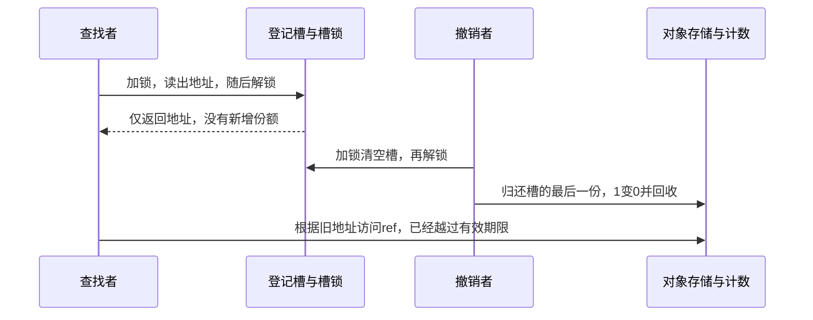
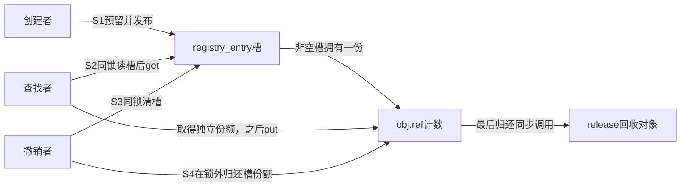
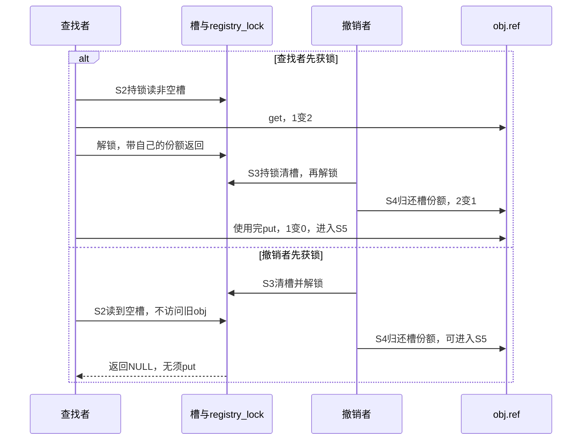

# 第8章\_lookup\_场景与\_kref\_get\_unless\_zero()

## 8.1\_本章定位

上一章把已经拥有的一份引用从创建者交给了队列，再交给消费者。接下来换一个入口：请求只带对象编号，处理者需要到共享登记表中寻找对象。表里保存着地址，可处理者尚未拥有任何一份。**第一次取得自己的引用，该从哪里获得安全保证？**

先回想 P02 的单槽登记模块：登记槽拥有一份，查找在槽锁内追加一份，撤下入口以后旧读者仍可继续访问。本章从这个已成立的小模型出发，解释为何必须把“找到地址”和“取得引用”放在同一个受保护窗口内，再把槽扩展成链表和按编号查询的容器。读者应已理解 P03 的可见性、业务状态与存储寿命，以及 P07 的借用和转交；这里不会把它们重新合并成一个“活着”布尔值。

本章中的 lookup 指 **按入口或编号查找对象**。接口可能只借出临时地址，也可能返回调用者拥有的一份，语义由接口协议决定，不能从单词 lookup 推断。前半章先建立最容易审查的“容器持有一份”协议；只有当该保证不再成立、查找仍可能碰到零计数对象时，才引入条件取得。RCU 的读侧窗口放到后面与 P10 衔接，不把一个临界区函数当作自动回收保护。

## 8.2\_lookup\_的基本边界\_先分清指针\_对象和引用

考虑对象编号 7：创建者已把它放入登记槽，随后归还初始引用。现在计数为 1，这一份属于槽。查找者和撤销者可以在不同 CPU 上执行，查找者想把结果带回锁外处理。

### 8.2.1\_lookup\_为什么是\_kref\_最容易出错的场景

若查找接口只在内部加锁、读槽、解锁，返回后调用者才 get，锁确实保护了“读槽”这个瞬间，却没有保护下一次对对象成员的访问：



这里甚至不需要两次计数更新同时发生。撤销者完全执行完以后，查找者才开始 get，仍然错误。换成条件 get 也必须读取相同的成员地址，不能先验证地址再决定要不要访问它。计数的原子性只规定 **对有效计数存储的操作** 怎样相互排序，不负责让已经释放的分配块重新属于原对象。

若分配器恰好尚未覆盖那块内存，程序可能暂时打印出旧编号；若内存被复用，同一地址又可能装着另一个对象。因此“不崩溃”“编号看起来对”“条件 get 返回成功”均不能替代地址期限的证明。不要为了演示这一点在正常实验里真的访问已释放存储，时序图已经给出了违反前提的确切位置。

### 8.2.2\_裸指针\_有效对象\_有效引用的区别

#### (1)\_裸指针

C 指针变量只保存地址，类型系统没有记下当前路径是否拥有一份 kref。同一个 `struct registry_object *` 可以表示创建者的一份、查找者的一份，也可以只是锁内借出的地址。“裸”在这里表示 **没有随这次返回交付独立引用**，不表示所有裸指针都不可访问：借用窗口内当然可以使用，关键是知道窗口何时结束。

#### (2)\_有效对象

不要把有效压缩成单一状态。查找准备访问 `obj->ref` 时，至少要证明这块存储仍属于该对象、计数字段仍可访问；若准备普通 get，还要证明当前计数为正。前一个条件不蕴含后一个：最后 put 可以已经归零，而清理者正在等待查找者持有的锁，尚不能摘链、回收。8.4 正是为这种窗口准备的。

在本章首先建立的拥有型槽中，这两个证明恰好来自同一协议：查找持槽锁时撤销者不能清槽；槽非空意味着槽的一份还没有被归还，所以对象存储仍在、计数仍正。**不是 mutex 自动保护任意对象，而是所有发布、撤下和归还路径共同赋予这把锁含义。**

对象的业务字段是否可修改是另一个问题。编号在发布前初始化、发布后不变，可以在取得引用后读取；若增加一个可变 `state`，仍须为其读写约定锁或其他同步，kref 不会替字段消除数据竞争。

#### (3)\_有效引用

查找在受保护窗口内成功追加一份以后，才把这份责任交给调用者。窗口可以结束，对象不能因为别的拥有者归还而提前回收；调用者仍须最终 put 或明确转交这份责任。引用没有永久保证“仍登记”“设备仍接受请求”或“字段没有变化”。

| 时刻 | 查找者拥有一份吗 | 为什么现在可访问 | 可以把地址带走吗 |
| --- | --- | --- | --- |
| 锁内刚读出槽 | 否 | 槽持有一份且撤下被同锁排斥 | 尚不能依本次查找带走 |
| 锁内 get 已完成 | 是 | 自己的一份已建立 | 可以按返回契约带走 |
| 锁外且槽已撤下 | 是 | 自己仍未归还 | 可以继续允许的操作，另查业务状态 |
| 归还自己的最后使用份额以后 | 本次责任已结束 | 本次查找不再提供任何保证 | 不得凭旧局部变量继续访问 |

### 8.2.3\_错误模型\_裸\_lookup\_后直接\_get

下面只是一段有意保留的错误接口组合，`find_raw` 表示“内部读槽后就解除保护”，不是可直接调用的内核 API：

```c
/* 错误：返回地址时，保护查找窗口的锁已经释放。 */
obj = find_raw(7);
if (obj)
    kref_get(&obj->ref);
```

修复点不在第二行换函数名，而在接口边界：由查找实现把 get 移到解锁之前，成功后返回带引用结果。另一种可行接口是要求调用者先持锁，`find_locked` 只借出锁内指针，由调用者在同一窗口内决定是否追加一份。两种设计都可以；不能让双方都以为对方负责保护间隙。

请先预测：如果把 get 提前到查找锁内，撤销者先取得锁与查找者先取得锁会分别得到什么？下一节用同一完整模块闭合这两个顺序。

## 8.3\_基础保护模型\_锁保护容器\_kref\_保护生命周期

固定版本接口由[源码总索引](../../../../research/source_reading/kref/navigation/P01_Linux_6.12_kref源码阅读索引.md#1.2_按问题进入已落地证据)进入；普通取得和归零仍沿已有唯一实现核对。本节先保留只有一个槽的登记表，把链表遍历的细节暂时拿开。这样每次增加都能说清新份额属于谁，读者不必一边查链表宏一边猜回收协议。随后增加链表节点，寿命证明保持不变。

### 8.3.1\_正确模型一\_mutex/list\_lookup\_+\_kref\_get()

完整程序来自已引入的 [note_kref_registry.c](../../../../labs/kernel/object_lifetime/materials/note_kref_registry.c)，这里按“首次取得”的问题重新阅读。它没有导出并发入口，所有实验操作在模块初始化中执行；锁展示协议，不能把这次顺序运行称为真实竞争测试。

```c
// SPDX-License-Identifier: GPL-2.0
#include <linux/kref.h>
#include <linux/module.h>
#include <linux/mutex.h>
#include <linux/slab.h>

struct registry_object {
    int id;
    struct kref ref;
};

static DEFINE_MUTEX(registry_lock);
static struct registry_object *registry_entry;
static unsigned int release_calls;

static void registry_release(struct kref *ref)
{
    struct registry_object *obj = container_of(ref, struct registry_object, ref);
    ++release_calls; /* 本实验没有并发回调，记录在对象之外。 */
    kfree(obj);
}

static void registry_put(struct registry_object *obj)
{
    if (obj)
        kref_put(&obj->ref, registry_release);
}

static struct registry_object *registry_create(int id)
{
    struct registry_object *obj = kzalloc(sizeof(*obj), GFP_KERNEL);
    if (!obj)
        return NULL;
    obj->id = id;
    kref_init(&obj->ref);
    return obj;
}

/* 调用者持有一份；只允许向空槽发布，成功后槽拥有新增的一份。 */
static int registry_publish(struct registry_object *obj)
{
    int result = 0;
    kref_get(&obj->ref);
    mutex_lock(&registry_lock);
    if (registry_entry)
        result = -EEXIST;
    else
        registry_entry = obj;
    mutex_unlock(&registry_lock);
    if (result)
        registry_put(obj); /* 拒绝后归还预留，调用者原份额不变。 */
    return result;
}

static struct registry_object *registry_lookup(void)
{
    struct registry_object *obj;
    mutex_lock(&registry_lock);
    obj = registry_entry;
    if (obj)
        kref_get(&obj->ref); /* 锁内槽仍持一份，普通 get 有正引用保证。 */
    mutex_unlock(&registry_lock);
    return obj;
}

static void registry_remove(void)
{
    struct registry_object *obj;
    mutex_lock(&registry_lock);
    obj = registry_entry;
    registry_entry = NULL;
    mutex_unlock(&registry_lock);
    registry_put(obj); /* 撤下入口后归还槽那份；release 不再取槽锁。 */
}

static int __init note_registry_init(void)
{
    struct registry_object *creator = registry_create(7);
    struct registry_object *reader;
    int result;
    if (!creator)
        return -ENOMEM;
    result = registry_publish(creator);
    registry_put(creator);
    if (result)
        return result;

    reader = registry_lookup();
    registry_remove();
    if (!reader)
        return -ENOENT;
    pr_info("note_registry: detached reader id=%d\n", reader->id);
    registry_put(reader);
    return 0;
}

static void __exit note_registry_exit(void)
{
    /* 所有操作在 init 中同步完成，没有导出入口或外部使用者。 */
    pr_info("note_registry: release_calls=%u\n", release_calls);
}

module_init(note_registry_init);
module_exit(note_registry_exit);
MODULE_LICENSE("GPL");
MODULE_DESCRIPTION("容器持有引用与锁内取得实验");
```

仍按统一的 S0～S5 周期查看它。表中计数表示本实验无其他拥有者时的正常数值，不能拿生产系统中的快照数代替责任记录。

| 阶段 | 触发者与写入地址 | 改变前后 | 谁随后读取，何时退出 |
| --- | --- | --- | --- |
| S0 创建 | 创建者写 obj.id 与 obj.ref | 私有对象，初始份额为 1 | 发布前字段已初始化 |
| S1 发布 | 创建者预留一份；持 registry_lock 写 registry_entry | 成功计数 2、槽可见；槽占用则退回预留 | 创建者归还自己的份额后，槽独持 1 |
| S2 取得 | 查找者持同锁读槽，写对象计数 | 非空时 1→2，建立查找者份额 | 解锁后把这一份交给 reader |
| S3 撤下 | 撤销者持锁把槽值移入局部 obj 并清槽 | 可见→不可见；槽的一份暂由撤销者负责 | 新查找读到 NULL；旧 reader 仍持有 |
| S4 归还 | 撤销者解锁后 put 槽的一份 | 2→1；随后 reader 用完再 put | 谁最后归还，谁同步进入回调 |
| S5 回收 | release 更新对象外记录并 kfree | 1→0 后存储退出 | 只读外部记录，不再访问 obj |



锁保护槽地址的读写和交付窗口；原子计数保存共享总数。它没有拥有者数组，谁负责哪一份仍由接口协议规定。锁的释放/取得建立槽与初始化数据的同步关系，计数增减不会另给每个读者发一条“对象还活着”的通知。



第二分支的 put 可以在查找空槽之前或之后发生，两者都安全：查找者已经没有取得旧地址的入口。第一分支则允许对象在“不可再查找”时继续存活，这正是引用与可见性分开的价值。

在配好同版本目标内核构建环境后，从材料目录运行 `make -C "$KDIR" M="$PWD" modules`，其中 KDIR 指向已经配置并准备好目标头文件的构建树，不是任意版本源码目录。将生成模块放到匹配的 Linux 实验环境后执行 `sudo insmod note_kref_registry.ko`，读取日志，再用 `sudo rmmod note_kref_registry` 卸载。正常初始化日志含 `detached reader id=7`，卸载记录 `release_calls=1`。即使登记已撤下，reader 仍可打印编号，因为 S2 已建立自己的份额。

既有验证包括 ARM 前端和显式顺序替身下的成功、空槽、重复发布、重复撤下及分配失败分支；本节复用原程序，不新增另一份实现。目标构建链接、装卸及真实并发尚未执行，不能把上面的预期日志当成本次设备实测。

### 8.3.2\_list\_持有引用的模型

现在把单槽扩展成链表：对象增加一个 `struct list_head node`，表头保存多个节点。节点只是链接，不会自动增加 kref。应用程序仍须在 **每次成功挂入一个拥有型集合时交付一份**，在成功摘下那次成员关系时取回同一份。

与槽不同，链表发布还须拒绝同一节点重复插入、按接口约定处理重复编号；创建时先 `INIT_LIST_HEAD`，不能把全零节点当作合法的自链接空节点。按编号遍历也必须比较 id，不能把“遍历到了一个节点”当作命中。

下面是从完整槽协议迁移到链表时的核心片段，不是一份省去创建和退出的可加载模块。前提是调用者有独立引用、节点只用于这一张表、全部成员变化受同一锁保护、没有未说明的重新发布者：

```c
/* found 初始为 NULL；锁保护链表及其拥有的一份。 */
mutex_lock(&table_lock);
list_for_each_entry(obj, &object_list, node) {
    if (obj->id != id)
        continue;
    kref_get(&obj->ref); /* 找到时集合仍拥有一份，所以计数为正。 */
    found = obj;
    break;
}
mutex_unlock(&table_lock);
/* 非空 found 是本次取得的一份，调用者最终归还或转交。 */
```

普通链表、哈希桶、整数索引都可以采用拥有型协议，但数据结构不会替你实施它。集合维护的是可发现关系，应用维护的是成员引用。换容器以后，锁的覆盖范围、插入失败和重复删除都必须重新核对，不能只替换查找函数名。

### 8.3.3\_remove/unlink\_与\_lookup\_的顺序

拥有型集合的退出顺序是：同锁撤下入口，再归还成员那一份。两个动作之间计数暂时偏高并不危险，因为撤销者接管着待归还责任；反过来先 put 可能直接回收节点，再摘链就要访问失效存储。

还有一个比顺序更隐蔽的错误：`if (!list_empty(...)) list_del_init(...)` 后无条件 put。第一次调用摘链并归还，第二次虽然没有摘链，却仍执行 put，消耗的就可能是调用者或旧读者的一份。**是否归还成员引用必须由这次是否实际移除成员决定。**

```c
/* 片段：调用者持有独立引用；node 属于唯一的 object_list。 */
bool removed = false;
mutex_lock(&table_lock);
if (!list_empty(&obj->node)) {
    list_del_init(&obj->node);
    removed = true;
}
mutex_unlock(&table_lock);
if (removed)
    object_put(obj); /* 只归还本次成功撤下的成员份额。 */
```

该片段的独立调用者引用保证两次 remove 调用时参数都有效；不能第一次已经释放对象，第二次再拿悬挂指针来检验“幂等”。自链接判断也只在本例唯一集合协议下表示成员状态，不提供一般的容器身份验证。若允许再次发布，每次成功发布都要另交一份，每次摘下只归还它自己的那次责任。

完整槽模块通过“锁内取旧槽值并清空”自然实现同样效果：第二次只拿到 NULL，`registry_put(NULL)` 不做事。请做三项练习：先把 lookup 移到 remove 之后，预测为何不再打印编号；再连续 remove 两次，解释为何没有第二次归还；最后仅在纸上把 get 移到解锁之后，补出图中导致失效访问的交错，勿运行错误版本。前两项需同步调整 init 的返回处理，不能把原先刻意检查成功的分支保留成新的预期结果。

到这里证明了“拥有型容器 + 同锁取得”。但有些索引只提供发现关系，不拥有引用，清理者会在最后 put 之后才取锁摘链。此时锁内地址可以仍有效、计数却已经为零。下一节用这一个新约束说明条件取得为什么有必要。

## 8.4\_kref\_get\_unless\_zero()\_防复活\_不防悬挂指针

这一组内容专门收束 `kref_get_unless_zero()`。

它只解决一个问题：

```text
refcount 已经是 0 时，不能再把对象重新加引用复活。
```

它不解决另一个更基础的问题：

```text
obj 指针本身是否仍然指向有效内存。
```

所以它必须和锁、RCU、延迟释放或其他内存稳定机制配合使用。

### 8.4.1\_kref\_get\_unless\_zero()\_的定位

`kref_get_unless_zero()` 的语义是：

```text
如果引用计数不是 0，则尝试加 1；
如果引用计数已经是 0，则失败，不加引用。
```

接口形式：

```c
int kref_get_unless_zero(struct kref *kref);
```

返回值通常按布尔语义使用：

```text
返回非 0：成功获得引用；
返回 0：引用计数已经是 0，没有获得引用。
```

典型使用：

```c
if (!kref_get_unless_zero(&obj->ref))
	return NULL;
```

它解决的问题是：

```text
避免对已经归零的引用计数重新加引用。
```

也就是避免这种错误：

```text
refcount 已经到 0；
release 已经开始或即将开始；
另一个路径又把 refcount 从 0 加回 1；
对象被“复活”。
```

`kref_get_unless_zero()` 的核心价值是：

```text
只允许从非 0 引用计数上获得新引用；
不允许从 0 重新复活对象。
```

------

### 8.4.2\_kref\_get\_unless\_zero()\_不解决什么

必须强调：

```text
kref_get_unless_zero() 不解决 obj 指针本身是否有效的问题。
```

错误理解：

```text
普通 kref_get 不安全；
换成 kref_get_unless_zero 就安全。
```

这是错的。

如果 `obj` 指针已经悬挂，那么：

```c
kref_get_unless_zero(&obj->ref);
```

仍然是在访问释放后的内存。

也就是说，它必须先访问：

```c
obj->ref
```

而访问 `obj->ref` 的前提是：

```text
obj 指针仍然指向有效内存。
```

所以 `kref_get_unless_zero()` 只解决：

```text
refcount 不是 0 才加引用。
```

它不解决：

```text
obj 指针是不是悬挂；
obj 内存是不是已经 kfree；
lookup 过程有没有并发删除；
集合结构是不是一致；
对象状态是否允许使用。
```

本章最重要的一句话：

```text
kref_get_unless_zero() 不是裸 lookup 的护身符。
```

------

### 8.4.3\_kref\_get\_unless\_zero()\_仍然需要锁或\_RCU

正确使用 `kref_get_unless_zero()` 时，仍然需要一种机制保证：

```text
在执行 kref_get_unless_zero(&obj->ref) 时，
obj 所在内存还没有被释放。
```

这个机制通常来自：

```text
mutex/spinlock 保护集合；
RCU 保护读侧访问；
延迟释放；
对象内存由更外层结构保证；
释放路径和 lookup 路径有明确序列化。
```

典型错误：

```c
obj = my_obj_lookup_raw(id);
if (!obj)
	return NULL;

if (!kref_get_unless_zero(&obj->ref))
	return NULL;

return obj;
```

如果 `my_obj_lookup_raw()` 没有任何保护，这仍然是错的。

正确形式应该是：

```c
mutex_lock(&my_obj_lock);

obj = my_obj_lookup_locked(id);
if (obj && !kref_get_unless_zero(&obj->ref))
	obj = NULL;

mutex_unlock(&my_obj_lock);

return obj;
```

或者在 RCU 场景中：

```c
rcu_read_lock();

obj = my_obj_lookup_rcu(id);
if (obj && !kref_get_unless_zero(&obj->ref))
	obj = NULL;

rcu_read_unlock();

return obj;
```

但 RCU 版本还要求：

```text
对象内存释放必须延迟到 RCU grace period 之后；
release 不能立即 kfree 掉 RCU 读侧可能看到的对象内存。
```

这部分第 10 章会专门展开。

------

### 8.4.4\_什么时候用\_kref\_get()\_什么时候用\_kref\_get\_unless\_zero()

#### (1)\_可以确认\_refcount\_一定非\_0\_用\_kref\_get()

如果锁保护下可以证明：

```text
对象还在集合中；
集合持有引用；
对象不可能正在释放；
refcount 不可能为 0。
```

那么可以直接：

```c
kref_get(&obj->ref);
```

例如：

```c
mutex_lock(&my_obj_lock);

obj = my_obj_find_locked(id);
if (obj)
	kref_get(&obj->ref);

mutex_unlock(&my_obj_lock);
```

这个模式依赖：

```text
只要 obj 在 list 中，list 就持有一份引用。
```

因此 refcount 不可能是 0。

------

#### (2)\_可能看到正在退出的对象\_用\_kref\_get\_unless\_zero()

如果 lookup 可能看到一个正在退出、正在撤销、refcount 可能接近 0 的对象，就适合用：

```c
kref_get_unless_zero()
```

例如某些场景下，对象可能仍被 RCU 读侧看到，但已经从正常生命周期中退出。

此时不能无条件：

```c
kref_get(&obj->ref);
```

因为这可能把一个已经走向销毁的对象重新拉回来。

应该：

```c
if (!kref_get_unless_zero(&obj->ref))
	obj = NULL;
```

意思是：

```text
只有对象仍然有活跃引用时，当前路径才加入持有者集合；
如果引用已经归零，就不要复活它。
```

------

#### (3)\_判断表

| 场景                      | 是否能用 `kref_get()` | 是否适合 `kref_get_unless_zero()` | 说明                    |
| ------------------------- | --------------------- | --------------------------------- | ----------------------- |
| 当前路径本来就持有引用    | 可以                  | 通常不需要                        | 已经证明对象有效        |
| 锁内 lookup，集合持有引用 | 可以                  | 可用但通常多余                    | refcount 必然非 0       |
| 无保护裸 lookup           | 不可以                | 也不可以                          | 指针本身可能悬挂        |
| RCU lookup，内存延迟释放  | 不应无条件用          | 常用                              | 必须防止复活 0 引用对象 |
| 对象可能正在退出          | 不应无条件用          | 常用                              | 失败表示不能获得引用    |
| refcount 可能已为 0       | 不可以                | 可以尝试                          | 前提是 obj 内存仍有效   |

一句话：

```text
kref_get() 要求你已经证明对象活着；
kref_get_unless_zero() 只允许你在对象尚未归零时加入引用者。
```

但两者共同前提都是：

```text
obj 指针本身必须有效。
```

------

### 8.4.5\_mutex\_+\_list\_+\_kref\_get\_unless\_zero()\_模板

虽然在“list 持有引用”的模型里通常直接用 `kref_get()` 就够了，但也可以写成 `kref_get_unless_zero()` 模板。

```c
struct my_obj *my_obj_lookup_get(int id)
{
	struct my_obj *obj, *found = NULL;

	mutex_lock(&my_obj_lock);

	list_for_each_entry(obj, &my_obj_list, node) {
		if (obj->id != id)
			continue;

		if (kref_get_unless_zero(&obj->ref))
			found = obj;

		break;
	}

	mutex_unlock(&my_obj_lock);

	return found;
}
```

这个模板表达的是：

```text
在锁内找到对象；
确认引用计数未归零；
成功则当前路径获得引用；
失败则返回 NULL。
```

如果你的设计能保证：

```text
只要 obj 在 list 中，refcount 必然非 0。
```

那么 `kref_get_unless_zero()` 失败理论上不应该发生。

这时可以加调试检查：

```c
if (WARN_ON(!kref_get_unless_zero(&obj->ref)))
	found = NULL;
else
	found = obj;
```

但更常见的写法仍然是：

```c
kref_get(&obj->ref);
```

因为锁和 list 引用已经证明 refcount 非 0。

------

## 8.5\_常见容器\_lookup\_模板

这一组内容按容器类型归类。

不要把这些模板理解成新的生命周期规则，它们只是把同一条规则套到不同容器上：

```text
容器查找必须被对应同步机制保护；
返回给锁外调用者之前必须获得引用；
容器删除路径必须和 lookup 路径配套。
```

### 8.5.1\_hash\_table\_lookup\_的引用规则

hash table 和 list 本质一样：

```text
hash bucket 是可查找结构；
bucket lock 保护链表结构；
hash 表通常持有对象引用；
lookup 成功后给调用者新引用。
```

示例：

```c
struct my_obj {
	struct kref ref;
	struct hlist_node hnode;
	u32 id;
};
```

全局 hash：

```c
static DEFINE_HASHTABLE(my_obj_ht, 8);
static DEFINE_SPINLOCK(my_obj_ht_lock);
```

插入：

```c
int my_obj_hash_add(struct my_obj *obj)
{
	kref_get(&obj->ref);     /* hash 表持有引用 */

	spin_lock(&my_obj_ht_lock);
	hash_add(my_obj_ht, &obj->hnode, obj->id);
	spin_unlock(&my_obj_ht_lock);

	return 0;
}
```

lookup：

```c
struct my_obj *my_obj_hash_lookup_get(u32 id)
{
	struct my_obj *obj;

	spin_lock(&my_obj_ht_lock);

	hash_for_each_possible(my_obj_ht, obj, hnode, id) {
		if (obj->id == id) {
			kref_get(&obj->ref);
			spin_unlock(&my_obj_ht_lock);
			return obj;
		}
	}

	spin_unlock(&my_obj_ht_lock);
	return NULL;
}
```

删除：

```c
void my_obj_hash_remove(struct my_obj *obj)
{
	spin_lock(&my_obj_ht_lock);
	hash_del(&obj->hnode);
	spin_unlock(&my_obj_ht_lock);

	kref_put(&obj->ref, my_obj_release);
}
```

这个模型仍然是：

```text
hash 表持有引用；
lookup 在锁内找到对象；
lookup 在锁内 get；
remove 先 hash_del，再 put hash 引用。
```

注意：

```text
spinlock 保护 hash 结构；
kref 保护对象生命周期；
两者不能互相替代。
```

------

### 8.5.2\_xarray\_lookup\_的引用规则

xarray 常用于通过整数 ID 查找对象。

典型模型：

```text
xarray 保存对象指针；
xarray 持有对象引用；
lookup 时在 xa_lock 下查找并 get；
erase 时先从 xarray 删除，再 put xarray 引用。
```

对象：

```c
struct my_obj {
	struct kref ref;
	u32 id;
};
```

xarray：

```c
static DEFINE_XARRAY(my_obj_xa);
```

插入：

```c
int my_obj_xa_insert(struct my_obj *obj)
{
	int ret;

	kref_get(&obj->ref);       /* xarray 持有引用 */

	xa_lock(&my_obj_xa);
	ret = __xa_insert(&my_obj_xa, obj->id, obj, GFP_KERNEL);
	xa_unlock(&my_obj_xa);

	if (ret)
		kref_put(&obj->ref, my_obj_release);

	return ret;
}
```

lookup：

```c
struct my_obj *my_obj_xa_lookup_get(u32 id)
{
	struct my_obj *obj;

	xa_lock(&my_obj_xa);

	obj = xa_load(&my_obj_xa, id);
	if (obj)
		kref_get(&obj->ref);

	xa_unlock(&my_obj_xa);

	return obj;
}
```

删除：

```c
void my_obj_xa_remove(u32 id)
{
	struct my_obj *obj;

	xa_lock(&my_obj_xa);
	obj = xa_erase(&my_obj_xa, id);
	xa_unlock(&my_obj_xa);

	if (obj)
		kref_put(&obj->ref, my_obj_release);
}
```

这里要注意：

```text
xa_load() 返回的只是指针；
只有在锁内 get 成功后，调用者才真正持有引用。
```

不要写成：

```c
obj = xa_load(&my_obj_xa, id);
if (obj)
	kref_get(&obj->ref);
```

除非你明确知道当前 xarray 使用方式允许无锁 RCU 查找，并且对象释放路径也配套 RCU 延迟释放。

否则裸 `xa_load()` 后再 `kref_get()` 仍然可能踩悬挂指针。

------

### 8.5.3\_idr\_lookup\_的引用规则

idr 也是常见的 ID 到对象指针映射结构。

模型和 xarray 类似：

```text
idr 保存对象指针；
idr 持有对象引用；
lookup 在锁内完成；
remove 先删除映射，再 put。
```

定义：

```c
static DEFINE_IDR(my_obj_idr);
static DEFINE_MUTEX(my_obj_idr_lock);
```

插入：

```c
int my_obj_idr_alloc(struct my_obj *obj)
{
	int id;

	kref_get(&obj->ref);      /* idr 持有引用 */

	mutex_lock(&my_obj_idr_lock);
	id = idr_alloc(&my_obj_idr, obj, 0, 0, GFP_KERNEL);
	mutex_unlock(&my_obj_idr_lock);

	if (id < 0) {
		kref_put(&obj->ref, my_obj_release);
		return id;
	}

	obj->id = id;
	return 0;
}
```

lookup：

```c
struct my_obj *my_obj_idr_lookup_get(int id)
{
	struct my_obj *obj;

	mutex_lock(&my_obj_idr_lock);

	obj = idr_find(&my_obj_idr, id);
	if (obj)
		kref_get(&obj->ref);

	mutex_unlock(&my_obj_idr_lock);

	return obj;
}
```

remove：

```c
void my_obj_idr_remove(int id)
{
	struct my_obj *obj;

	mutex_lock(&my_obj_idr_lock);
	obj = idr_remove(&my_obj_idr, id);
	mutex_unlock(&my_obj_idr_lock);

	if (obj)
		kref_put(&obj->ref, my_obj_release);
}
```

核心仍然是：

```text
idr_find() 返回裸指针；
锁内 kref_get() 才把裸指针变成当前路径引用。
```

------

### 8.5.4\_lookup\_成功\_失败\_正在释放的状态表

lookup 不是只有“找到”和“没找到”两种状态。

更完整的状态表如下：

| 状态                 | 容器中是否可见 | refcount 是否非 0 | lookup 结果            | 当前路径是否获得引用 |
| -------------------- | -------------- | ----------------- | ---------------------- | -------------------- |
| 对象正常存在         | 是             | 是                | 成功                   | 是                   |
| 对象不存在           | 否             | 无                | 失败                   | 否                   |
| 对象已经 unlink      | 否             | 可能非 0          | 失败                   | 否                   |
| 对象正在释放         | 不应再可见     | 可能为 0          | 失败                   | 否                   |
| RCU 读侧仍可见旧指针 | 逻辑上已删除   | 可能为 0          | 取决于 get_unless_zero | 成功才有             |
| 数据结构损坏         | 不确定         | 不确定            | 不可信                 | 不可信               |

这个表想说明：

```text
lookup 成功不只是“容器里有指针”；
lookup 成功应该意味着“当前路径已经获得引用”。
```

所以函数名最好写成：

```c
my_obj_lookup_get()
```

而不是：

```c
my_obj_lookup()
```

如果函数只是返回裸指针，要明确限制：

```text
只能在持锁期间使用；
不能跨越锁；
不能保存；
不能异步传递；
不能 put；
不能在锁外访问。
```

------

## 8.6\_lookup\_API\_契约\_返回裸指针还是返回引用

这一组内容把 lookup 的接口语义收住。

lookup API 最怕名字含糊：

```text
返回的是裸指针，还是带引用对象？
调用者能否在锁外保存？
调用者是否必须 put？
失败是没找到，还是对象正在退出？
```

因此建议把 `find_locked()`、`lookup_get()`、`tryget()` 这几类接口明确拆开。

### 8.6.1\_lookup\_raw()\_和\_lookup\_get()\_必须分开

建议工程里明确区分两类函数。

#### (1)\_lookup\_raw()\_只返回临时裸指针

```c
static struct my_obj *my_obj_lookup_raw_locked(int id)
{
	struct my_obj *obj;

	lockdep_assert_held(&my_obj_lock);

	list_for_each_entry(obj, &my_obj_list, node) {
		if (obj->id == id)
			return obj;
	}

	return NULL;
}
```

这个函数的语义是：

```text
只能在 my_obj_lock 持有期间调用；
返回值不能逃出临界区；
调用者不能保存；
调用者不能 put；
调用者不能异步传递。
```

适合命名：

```c
my_obj_lookup_raw_locked()
my_obj_find_locked()
my_obj_peek_locked()
```

------

#### (2)\_lookup\_get()\_返回带引用对象

```c
struct my_obj *my_obj_lookup_get(int id)
{
	struct my_obj *obj;

	mutex_lock(&my_obj_lock);

	obj = my_obj_lookup_raw_locked(id);
	if (obj)
		kref_get(&obj->ref);

	mutex_unlock(&my_obj_lock);

	return obj;
}
```

这个函数的语义是：

```text
返回 NULL：没有获得引用；
返回非 NULL：调用者获得引用，必须 put。
```

适合命名：

```c
my_obj_lookup_get()
my_obj_find_get()
my_obj_get_by_id()
```

这类函数必须在注释里写清楚：

```text
Return object with a reference held.
Caller must drop it with my_obj_put().
```

中文就是：

```text
返回成功时，调用者持有对象引用；
使用结束必须 put。
```

------

### 8.6.2\_lookup\_get()\_的标准注释

建议写成：

```c
/**
 * my_obj_lookup_get - find object by id and take a reference
 * @id: object id
 *
 * Returns the object with a reference held on success.
 * The caller must drop the reference with my_obj_put().
 *
 * Returns NULL if no live object is found.
 */
struct my_obj *my_obj_lookup_get(int id);
```

如果使用 `kref_get_unless_zero()`，可以写得更明确：

```c
/**
 * my_obj_lookup_get - find live object by id and take a reference
 * @id: object id
 *
 * The lookup is protected by my_obj_lock.
 * If a matching object is found and its reference count is non-zero,
 * this function returns it with a reference held.
 *
 * Returns NULL if the object is not found or is no longer live.
 */
struct my_obj *my_obj_lookup_get(int id);
```

中文说明：

```text
查找成功并不只是找到指针；
查找成功表示当前路径已经获得一份引用。
```

------

### 8.6.3\_lookup\_后的调用者规则

如果函数名是：

```c
obj = my_obj_lookup_get(id);
```

调用者必须按“持有引用”处理：

```c
obj = my_obj_lookup_get(id);
if (!obj)
	return -ENOENT;

ret = do_something(obj);

kref_put(&obj->ref, my_obj_release);
return ret;
```

如果中间有多个错误路径，要保证每条路径都 put：

```c
obj = my_obj_lookup_get(id);
if (!obj)
	return -ENOENT;

ret = prepare(obj);
if (ret)
	goto out_put;

ret = run(obj);
if (ret)
	goto out_put;

out_put:
	kref_put(&obj->ref, my_obj_release);
	return ret;
```

如果要 handoff 给异步路径，有两种选择。

#### (1)\_给异步路径新引用

```c
obj = my_obj_lookup_get(id);
if (!obj)
	return -ENOENT;

ret = my_obj_schedule_work_ref(obj);

kref_put(&obj->ref, my_obj_release);
return ret;
```

这里：

```text
lookup_get 给当前路径一份引用；
schedule_work_ref 给 work 一份引用；
当前路径最后 put 自己的引用。
```

------

#### (2)\_把\_lookup\_得到的引用直接转移给异步路径

```c
obj = my_obj_lookup_get(id);
if (!obj)
	return -ENOENT;

ret = my_obj_schedule_work_take(obj);
if (ret) {
	kref_put(&obj->ref, my_obj_release);
	return ret;
}

/*
 * 成功后 work 接管 lookup 得到的引用。
 * 当前路径不能再访问 obj。
 */
return 0;
```

这里：

```text
lookup_get 得到的引用没有在当前路径 put；
而是成功转移给 work；
失败时当前路径仍负责 put。
```

这就是第 7 章 handoff 模型和本章 lookup 模型的组合。

------

### 8.6.4\_lookup\_函数不要返回\_可能要\_put\_的对象

最差的接口是这种：

```c
struct my_obj *my_obj_lookup(int id);
```

但它没有说明：

```text
返回对象是否带引用？
调用者是否要 put？
调用者能否保存？
是否只能持锁使用？
失败路径怎么处理？
```

这种接口很容易导致两类 bug。

第一类：调用者以为返回带引用，结果其实没有。

```c
obj = my_obj_lookup(id);
queue_work_with_obj(obj);     /* 可能 UAF */
```

第二类：调用者以为需要 put，结果其实只是借用。

```c
obj = my_obj_lookup(id);
kref_put(&obj->ref, my_obj_release);   /* 可能提前释放 */
```

所以建议把接口拆开：

```c
my_obj_find_locked();     /* 裸指针，只能锁内用 */
my_obj_lookup_get();      /* 返回带引用对象 */
my_obj_put();             /* 释放引用 */
```

不要写一个语义含糊的 `lookup()` 让调用者猜。

------

## 8.7\_退出\_状态和\_RCU\_边界

这一组内容处理 lookup 和对象退出阶段的关系。

对象“还没释放”和“允许新用户进入”不是一回事：

```text
对象可能仍有旧引用，但已经不允许新的 lookup 成功；
对象可能仍被 RCU 读侧看到，但不能被重新复活；
对象从容器撤销可见性，必须和最后 put、延迟释放配套。
```

### 8.7.1\_释放路径必须和\_lookup\_路径配套

lookup 正确性不是 lookup 函数自己能单独保证的。

它还依赖释放路径是否配套。

#### (1)\_正确释放路径

```c
void my_obj_destroy(struct my_obj *obj)
{
	mutex_lock(&my_obj_lock);

	if (!list_empty(&obj->node))
		list_del_init(&obj->node);

	mutex_unlock(&my_obj_lock);

	kref_put(&obj->ref, my_obj_release);
}
```

lookup：

```c
struct my_obj *my_obj_lookup_get(int id)
{
	struct my_obj *obj;

	mutex_lock(&my_obj_lock);

	obj = my_obj_find_locked(id);
	if (obj)
		kref_get(&obj->ref);

	mutex_unlock(&my_obj_lock);

	return obj;
}
```

这两个路径配套的原因是：

```text
lookup 和 unlink 都被同一把锁序列化；
lookup 在锁内看到 obj 时，unlink 不可能同时完成；
obj 仍然有集合引用；
所以 kref_get 安全。
```

------

#### (2)\_错误释放路径

```c
void my_obj_destroy_bad(struct my_obj *obj)
{
	kref_put(&obj->ref, my_obj_release);

	mutex_lock(&my_obj_lock);
	list_del_init(&obj->node);
	mutex_unlock(&my_obj_lock);
}
```

这个释放路径会破坏 lookup 假设。

因为 lookup 可能在 list 中看到一个已经 release 的对象。

所以 lookup 的正确性要问：

```text
所有删除路径是否都先 unlink，再 put？
所有 lookup 是否都在同一保护机制下完成？
所有能释放对象的路径是否都遵守这个顺序？
```

只要有一条路径破坏规则，lookup 就不安全。

------

### 8.7.2\_对象状态和\_lookup\_的关系

有时候对象虽然还没释放，但已经不应该被新的 lookup 获得。

例如状态机：

```c
enum my_obj_state {
	OBJ_LIVE,
	OBJ_DYING,
	OBJ_DEAD,
};
```

这时 lookup 不只要判断：

```text
对象是否在集合中；
refcount 是否非 0。
```

还要判断：

```text
对象状态是否允许新用户进入。
```

示例：

```c
struct my_obj *my_obj_lookup_get_live(int id)
{
	struct my_obj *obj = NULL;

	mutex_lock(&my_obj_lock);

	obj = my_obj_find_locked(id);
	if (!obj)
		goto out;

	if (obj->state != OBJ_LIVE) {
		obj = NULL;
		goto out;
	}

	kref_get(&obj->ref);

out:
	mutex_unlock(&my_obj_lock);
	return obj;
}
```

这里状态检查必须和 lookup 保护在同一个临界区里。

否则可能出现：

```text
CPU0: 查到 obj 状态是 LIVE
CPU1: 把 obj 改成 DYING 并删除
CPU0: get
```

如果状态和集合都由 `my_obj_lock` 保护，则可以保证状态判断和 get 是一致的。

规则：

```text
如果 lookup 需要检查状态，那么状态检查、集合查找、get 必须被同一套机制保护。
```

------

### 8.7.3\_DYING\_状态通常拒绝新的\_lookup\_引用

有些对象进入 `DYING` 后，仍然允许已有路径继续使用，但不允许新 lookup 进入。

这很常见。

语义可以定义为：

```text
LIVE：
    新 lookup 可以成功；
    已有引用可以继续使用。

DYING：
    新 lookup 失败；
    已有引用可以继续收尾；
    最后一个 put 后 release。

DEAD：
    不可 lookup；
    不可使用；
    内存即将或已经释放。
```

lookup 函数：

```c
struct my_obj *my_obj_lookup_get_live(int id)
{
	struct my_obj *obj;

	mutex_lock(&my_obj_lock);

	obj = my_obj_find_locked(id);
	if (!obj)
		goto out_null;

	if (obj->state != OBJ_LIVE)
		goto out_null;

	kref_get(&obj->ref);
	mutex_unlock(&my_obj_lock);
	return obj;

out_null:
	mutex_unlock(&my_obj_lock);
	return NULL;
}
```

remove 路径：

```c
void my_obj_mark_dying_and_remove(struct my_obj *obj)
{
	mutex_lock(&my_obj_lock);

	obj->state = OBJ_DYING;

	if (!list_empty(&obj->node))
		list_del_init(&obj->node);

	mutex_unlock(&my_obj_lock);

	kref_put(&obj->ref, my_obj_release);
}
```

这样做的结果是：

```text
新的 lookup 找不到或因为 DYING 失败；
已有引用不受影响，可以继续 put 收敛；
最后一个 put 后 release。
```

这体现了第 3 章的结论：

```text
撤销发布不等于立即销毁对象。
```

------

### 8.7.4\_kref\_get\_unless\_zero()\_和对象状态不能互相替代

`kref_get_unless_zero()` 只能判断：

```text
引用计数是否非 0。
```

它不能判断：

```text
对象是否还允许新用户进入；
对象是否处于 DYING；
对象是否已经从业务上关闭；
设备是否可用；
请求是否已经完成。
```

所以不能写成：

```c
if (!kref_get_unless_zero(&obj->ref))
	return NULL;

return obj;
```

然后认为这就表示对象可用。

更完整的 lookup 可能需要：

```c
mutex_lock(&my_obj_lock);

obj = my_obj_find_locked(id);
if (!obj)
	goto out_null;

if (obj->state != OBJ_LIVE)
	goto out_null;

if (!kref_get_unless_zero(&obj->ref))
	goto out_null;

mutex_unlock(&my_obj_lock);
return obj;

out_null:
	mutex_unlock(&my_obj_lock);
	return NULL;
```

这里三件事各自负责不同问题：

```text
find_locked：
    找对象。

state == OBJ_LIVE：
    判断业务状态是否允许新用户进入。

kref_get_unless_zero：
    判断生命周期引用是否还能加入。
```

不要把其中任何一个当成全部安全模型。

------

### 8.7.5\_RCU\_lookup\_的提前预告

RCU lookup 是更复杂的 lookup 场景，本章只先给出核心边界。

RCU 保护的是：

```text
读侧遍历期间，指针指向的内存不会立刻释放。
```

但 RCU 不自动给你对象引用。

所以 RCU lookup 常见结构是：

```c
rcu_read_lock();

obj = my_obj_lookup_rcu(id);
if (obj && kref_get_unless_zero(&obj->ref)) {
	rcu_read_unlock();
	return obj;
}

rcu_read_unlock();
return NULL;
```

这个模型成立必须满足：

```text
对象从 RCU 可见结构删除后，不能立即 kfree；
对象内存必须撑过 RCU grace period；
release 要用 kfree_rcu() 或 call_rcu() 之类的延迟释放方式；
或者释放路径用 synchronize_rcu() 等方式等待读侧结束。
```

否则即使用了 `kref_get_unless_zero()`，也可能访问已经释放的 `obj->ref`。

所以 RCU 场景的规则是：

```text
RCU 保证 get_unless_zero 时 obj 内存还在；
get_unless_zero 成功后，kref 保证离开 RCU 后对象继续活着。
```

第 10 章会专门展开。

------

### 8.7.6\_lookup\_与对象\_复活\_问题

对象复活指的是：

```text
refcount 已经归零；
release 已经开始；
另一个路径又把 refcount 加回去。
```

错误模型：

```text
CPU0                                CPU1
--------------------------------    -------------------------------
kref_put(&obj->ref, release);
refcount 变成 0;
进入 release(obj);

                                    obj = find_obj(id);
                                    kref_get(&obj->ref);
                                    // 以为对象又活了

release(obj) 继续执行;
kfree(obj);

                                    使用 obj;
                                    // UAF：使用了已经释放或正在释放的对象
```

这就是复活。

普通 `kref_get()` 不会检查“原来是不是 0”。

所以在可能遇到 0 的场景，要用：

```c
kref_get_unless_zero()
```

它的语义是：

```text
0 就不加；
非 0 才加。
```

也就是说：

```text
已经走到最后释放点的对象，不能被重新拉回生命周期。
```

但是再次强调：

```text
防复活不等于防悬挂指针。
```

防悬挂指针靠：

```text
锁；
RCU；
延迟释放；
集合引用；
严格 remove 顺序。
```

防复活靠：

```text
kref_get_unless_zero()。
```

这两个问题不能混。

------

## 8.8\_错误清单\_模板和检查项

这一组内容作为本章最后的落地部分。

先看错误清单，再看模板，最后用检查清单收尾：

```text
错误清单：识别常见 bug 形态。
设计模板：把正确写法固定下来。
检查清单：写代码或 review 时逐项确认。
```

### 8.8.1\_lookup\_的错误清单

#### (1)\_无保护\_lookup\_后\_get

错误：

```c
obj = my_obj_lookup_raw(id);
if (obj)
	kref_get(&obj->ref);
```

问题：

```text
obj 可能已经被删除和释放。
```

正确：

```c
mutex_lock(&my_obj_lock);
obj = my_obj_find_locked(id);
if (obj)
	kref_get(&obj->ref);
mutex_unlock(&my_obj_lock);
```

------

#### (2)\_以为\_kref\_get\_unless\_zero()\_可以替代锁

错误：

```c
obj = my_obj_lookup_raw(id);
if (obj && kref_get_unless_zero(&obj->ref))
	return obj;
```

问题：

```text
obj 指针本身可能已经悬挂。
```

正确：

```c
mutex_lock(&my_obj_lock);
obj = my_obj_find_locked(id);
if (obj && !kref_get_unless_zero(&obj->ref))
	obj = NULL;
mutex_unlock(&my_obj_lock);
return obj;
```

或者 RCU 配套延迟释放。

------

#### (3)\_lookup\_返回裸指针给锁外使用

错误：

```c
mutex_lock(&my_obj_lock);
obj = my_obj_find_locked(id);
mutex_unlock(&my_obj_lock);

obj->state = OBJ_BUSY;      /* 错误 */
```

问题：

```text
离开锁后，没有引用保护；
obj 可能已经被释放。
```

正确：

```c
mutex_lock(&my_obj_lock);
obj = my_obj_find_locked(id);
if (obj)
	kref_get(&obj->ref);
mutex_unlock(&my_obj_lock);

if (!obj)
	return -ENOENT;

obj->state = OBJ_BUSY;

kref_put(&obj->ref, my_obj_release);
```

------

#### (4)\_remove\_时先\_put\_后\_unlink

错误：

```c
kref_put(&obj->ref, my_obj_release);

mutex_lock(&my_obj_lock);
list_del_init(&obj->node);
mutex_unlock(&my_obj_lock);
```

问题：

```text
put 可能释放 obj；
后续 list_del 访问释放内存；
其他 lookup 可能看到悬挂节点。
```

正确：

```c
mutex_lock(&my_obj_lock);
list_del_init(&obj->node);
mutex_unlock(&my_obj_lock);

kref_put(&obj->ref, my_obj_release);
```

------

#### (5)\_lookup\_成功后忘记\_put

错误：

```c
obj = my_obj_lookup_get(id);
if (!obj)
	return -ENOENT;

do_something(obj);
return 0;
```

问题：

```text
lookup_get 返回带引用对象；
调用者忘记 put；
对象泄漏。
```

正确：

```c
obj = my_obj_lookup_get(id);
if (!obj)
	return -ENOENT;

do_something(obj);

kref_put(&obj->ref, my_obj_release);
return 0;
```

------

#### (6)\_lookup\_得到引用后\_handoff\_失败忘记回滚

错误：

```c
obj = my_obj_lookup_get(id);
if (!obj)
	return -ENOENT;

ret = my_obj_schedule_work_take(obj);
if (ret)
	return ret;     /* 错误：lookup 引用泄漏 */
```

正确：

```c
obj = my_obj_lookup_get(id);
if (!obj)
	return -ENOENT;

ret = my_obj_schedule_work_take(obj);
if (ret) {
	kref_put(&obj->ref, my_obj_release);
	return ret;
}

return 0;
```

------

### 8.8.2\_lookup\_函数设计模板

#### (1)\_list\_+\_mutex\_模板

```c
struct my_obj *my_obj_lookup_get(int id)
{
	struct my_obj *obj;

	mutex_lock(&my_obj_lock);

	list_for_each_entry(obj, &my_obj_list, node) {
		if (obj->id == id) {
			kref_get(&obj->ref);
			mutex_unlock(&my_obj_lock);
			return obj;
		}
	}

	mutex_unlock(&my_obj_lock);
	return NULL;
}
```

------

#### (2)\_list\_+\_mutex\_+\_state\_模板

```c
struct my_obj *my_obj_lookup_get_live(int id)
{
	struct my_obj *obj;

	mutex_lock(&my_obj_lock);

	list_for_each_entry(obj, &my_obj_list, node) {
		if (obj->id != id)
			continue;

		if (obj->state != OBJ_LIVE)
			break;

		kref_get(&obj->ref);
		mutex_unlock(&my_obj_lock);
		return obj;
	}

	mutex_unlock(&my_obj_lock);
	return NULL;
}
```

------

#### (3)\_hash\_+\_spinlock\_模板

```c
struct my_obj *my_obj_hash_lookup_get(u32 id)
{
	struct my_obj *obj;

	spin_lock(&my_obj_ht_lock);

	hash_for_each_possible(my_obj_ht, obj, hnode, id) {
		if (obj->id == id) {
			kref_get(&obj->ref);
			spin_unlock(&my_obj_ht_lock);
			return obj;
		}
	}

	spin_unlock(&my_obj_ht_lock);
	return NULL;
}
```

------

#### (4)\_xarray\_+\_lock\_模板

```c
struct my_obj *my_obj_xa_lookup_get(unsigned long index)
{
	struct my_obj *obj;

	xa_lock(&my_obj_xa);

	obj = xa_load(&my_obj_xa, index);
	if (obj)
		kref_get(&obj->ref);

	xa_unlock(&my_obj_xa);

	return obj;
}
```

------

#### (5)\_RCU\_+\_kref\_get\_unless\_zero()\_模板预告

```c
struct my_obj *my_obj_lookup_get_rcu(int id)
{
	struct my_obj *obj;

	rcu_read_lock();

	obj = my_obj_lookup_rcu(id);
	if (obj && !kref_get_unless_zero(&obj->ref))
		obj = NULL;

	rcu_read_unlock();

	return obj;
}
```

这个模板不能单独复制使用。

它依赖释放路径：

```text
删除时先从 RCU 可见结构 unlink；
对象内存延迟释放到 grace period 之后；
release 不能直接 kfree 给 RCU 读侧制造悬挂指针。
```

第 10 章再详细展开。

------

### 8.8.3\_lookup\_API\_的命名建议

推荐命名：

```c
my_obj_find_locked()
```

语义：

```text
调用者必须持锁；
返回裸指针；
不能在锁外使用；
不增加引用。
```

推荐命名：

```c
my_obj_lookup_get()
```

语义：

```text
内部完成 lookup + get；
返回成功时调用者持有引用；
调用者必须 put。
```

推荐命名：

```c
my_obj_get_by_id()
```

语义：

```text
按 ID 查找对象；
成功返回带引用对象。
```

推荐命名：

```c
my_obj_tryget()
```

语义：

```text
尝试从已有对象指针获得引用；
通常基于 kref_get_unless_zero；
但调用者仍要保证 obj 指针内存有效。
```

不推荐含糊命名：

```c
my_obj_lookup()
my_obj_find()
my_obj_get()
my_obj_search()
```

除非注释明确说明：

```text
是否返回引用；
调用者是否要 put；
是否只能锁内使用；
失败时是否可能是对象正在退出。
```

------

### 8.8.4\_本章检查清单

写 lookup 代码时，逐项检查：

```text
1. lookup 返回的是裸指针，还是带引用对象？
2. 如果是裸指针，是否只在锁内使用？
3. 如果要锁外使用，是否在锁内完成 kref_get？
4. kref_get 前由什么机制证明 obj 有效？
5. 集合是否持有对象引用？
6. 对象插入集合时是否 get？
7. 对象从集合删除时是否先 unlink 再 put？
8. 所有 add/del/lookup 是否使用同一把锁或同一套同步机制？
9. lookup 是否需要检查对象状态？
10. 状态检查和 get 是否在同一临界区完成？
11. 是否错误地用 kref_get_unless_zero 替代锁？
12. RCU lookup 是否配套延迟释放？
13. lookup_get 成功后调用者是否所有路径都 put？
14. lookup 后 handoff 失败路径是否回滚 put？
15. 函数名是否说明 find_locked / lookup_get / tryget 语义？
```

最关键的是这几个问题：

```text
我拿到的是指针，还是引用？
get 前对象由谁保护？
返回后谁负责 put？
对象从哪里撤销可见性？
最后释放是否可能和 lookup 并发？
```

------

## 8.9\_本章小结

lookup 是 kref 使用里最容易误判的场景。

因为 lookup 不是简单地从容器中拿一个地址，而是要完成下面的转换：

```text
共享结构中的裸指针
    -> 保护机制证明对象仍然有效
        -> kref_get / kref_get_unless_zero
            -> 当前路径持有有效引用
```

本章核心结论：

```text
1. 有指针不等于有引用。
2. lookup 后不能无保护 kref_get。
3. kref_get 前必须证明对象有效。
4. kref_get_unless_zero 只防止从 0 复活，不防止悬挂指针。
5. 锁保护集合关系，kref 保护对象生命周期。
6. RCU 保护读侧内存可见性，kref 保护拿到引用后的生命周期。
7. remove 路径必须先 unlink，再 put。
8. lookup_get 成功返回时，调用者必须 put。
```

再压缩成一句话：

```text
lookup 的目标不是找到对象，而是在对象仍然活着的时候拿到一份引用。
```

不要把代码写成：

```text
find pointer
then maybe get
```

而要写成：

```text
protected lookup
then get
then return referenced object
```

这才是 kref lookup 场景的正确工程模型。

------

专题导航：[kref 引用计数机制章节大纲](大纲.md)。

上一篇：[handoff 所有权转移模型](P07_handoff_所有权转移模型.md#7.8_本章小结)。

下一篇：[kref 与锁的组合](P09_kref_与锁的组合.md)。
