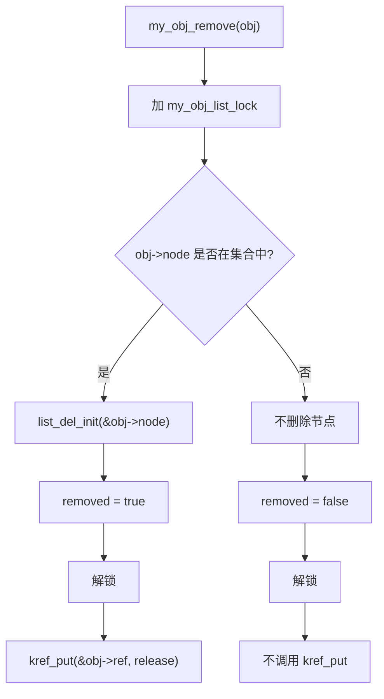
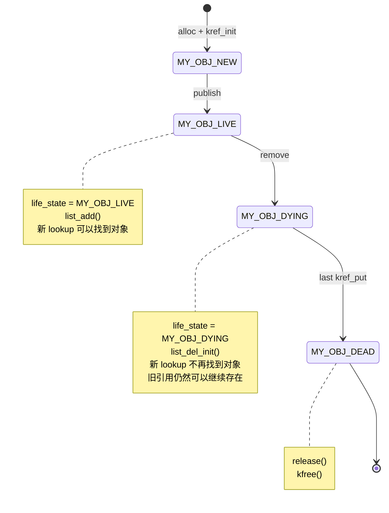
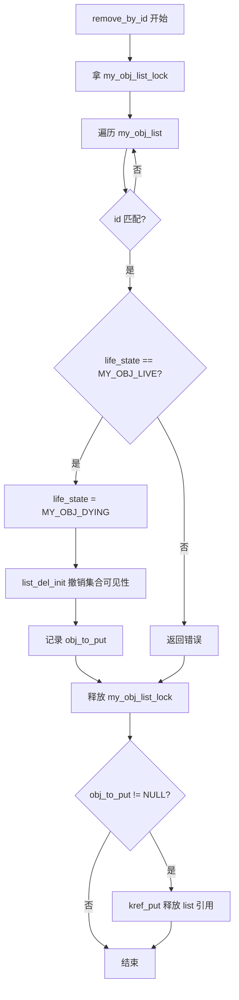
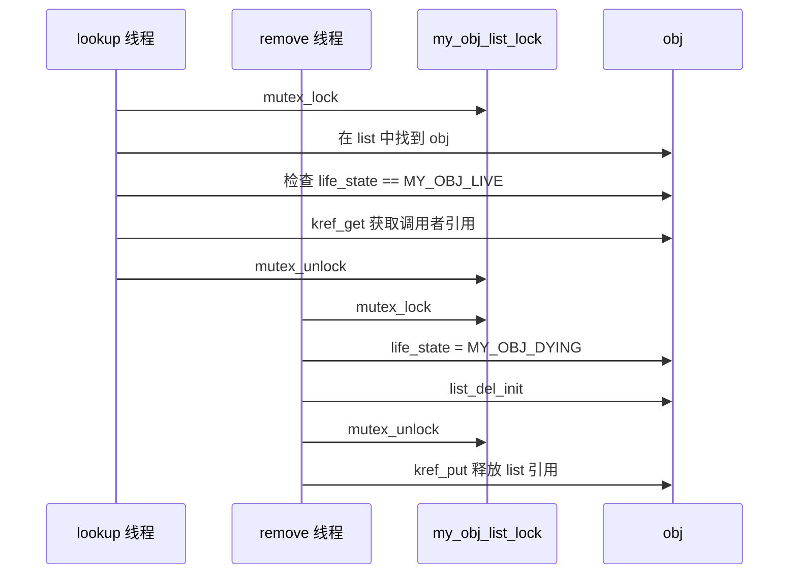
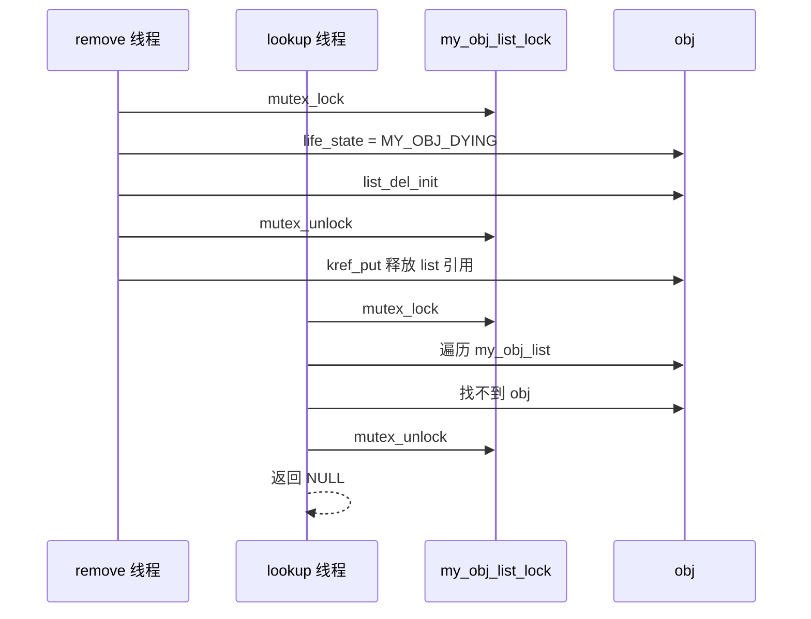
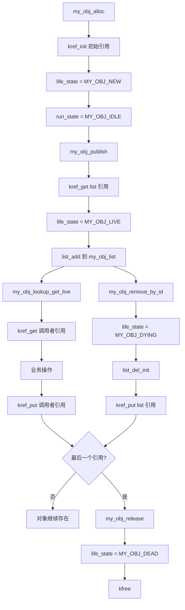

# 第9章_kref_与锁的组合

## 9.1_本章定位

前面章节已经建立了几个前置结论：

```text
kref 保护对象内存生命周期；
锁保护字段、状态和集合关系；
lookup + get 必须被保护；
handoff 要定义引用归属；
release 是最后一个 put 之后的销毁点。
```

本章不再重复证明：

```text
kref 不是锁。
```

而是专门讨论工程代码里怎么把 kref 和锁组合起来。

本章主线：

```text
kref 决定对象能不能活到你用完；
锁决定对象内部状态和外部集合关系是否一致。
```

也就是说：

```text
kref 解决“对象会不会被释放”；
锁解决“对象内容和集合关系会不会被并发改乱”。
```

两者缺一不可。

------

## 9.2_基本分工_kref_管生命周期_锁管一致性

这一组内容先把边界收住。

后面所有锁组合问题，本质上都要先回答：

```text
kref 保护的是对象内存是否还活着；
集合锁保护对象是否还能被找到；
对象锁保护对象字段和状态是否一致。
```

如果把这三件事混在一起，后面的 lookup、remove、release、put 路径都会变得难以审查。

### 9.2.1_kref_和锁分别保护什么

假设有一个对象：

```c
struct my_obj {
	struct kref ref;		// 生命周期引用计数
	struct mutex lock;		// 对象字段互斥锁
	struct list_head node;	// 挂入全局 list 的节点
	int id;				   // 查找 key
	int state;			   // 业务状态
	bool dying;			   // 是否正在退出
};
```

里面有几类东西：

```text
ref      ：生命周期引用计数
lock     ：对象字段互斥锁
node     ：挂入全局 list 的节点
id       ：查找 key
state    ：业务状态
dying    ：是否正在退出
```

kref 保护的是：

```text
struct my_obj 这块内存不会在引用持有期间被释放。
```

锁保护的是：

```text
state/dying/id 等字段的一致性；
node 是否在 list 中；
对象是否允许被 lookup；
对象是否正在 remove；
集合 add/del/遍历的一致性。
```

所以不能写成：

```text
已经 kref_get 了，所以访问 state 不需要锁。
```

这是错的。

`kref_get()` 只能说明：

```text
obj 内存还活着。
```

它不能说明：

```text
obj->state 没有人并发修改；
obj->node 没有人并发 list_del；
obj->dying 状态不会变化；
obj 还允许被新用户使用。
```

------

### 9.2.2_两类锁_集合锁和对象锁

工程里经常至少有两类锁。

#### (1)_集合锁

集合锁保护对象在哪些全局结构里可见。

例如：

```c
static LIST_HEAD(my_obj_list);
static DEFINE_MUTEX(my_obj_list_lock);
```

它保护：

```text
my_obj_list 的链表结构；
对象是否在 list 中；
lookup 和 remove 的并发关系；
list 引用的归属。
```

典型操作：

```c
mutex_lock(&my_obj_list_lock);
list_add_tail(&obj->node, &my_obj_list);
mutex_unlock(&my_obj_list_lock);
```

或者：

```c
mutex_lock(&my_obj_list_lock);
list_del_init(&obj->node);
mutex_unlock(&my_obj_list_lock);
```

------

#### (2)_对象锁

对象锁保护对象内部字段。

例如：

```c
struct my_obj {
	struct kref ref;
	struct mutex lock;
	int state;
	bool enabled;
	u32 flags;
};
```

它保护：

```text
state；
enabled；
flags；
对象内部业务状态；
对象内部资源切换。
```

典型操作：

```c
mutex_lock(&obj->lock);
obj->state = OBJ_RUNNING;
mutex_unlock(&obj->lock);
```

------

#### (3)_两者不能混用

集合锁不一定保护对象所有字段。

对象锁也不一定保护集合结构。

**警告**

> <span style="color:red;">说实话，我完全不认同这个ai总结的小结。不过我又觉得这个标题是需要提醒做到对锁职权分离的。所以保留下来。</span>

例如：

```c
mutex_lock(&obj->lock);
list_del_init(&obj->node);    /* 通常错误 */
mutex_unlock(&obj->lock);
```

如果 `node` 属于全局 list，那么它应该由全局 list 锁保护。

反过来：

```c
mutex_lock(&my_obj_list_lock);
obj->state = OBJ_RUNNING;     /* 不一定正确 */
mutex_unlock(&my_obj_list_lock);
```

如果 `state` 由 `obj->lock` 保护，那么这里也不应该只拿 list 锁。

当然，工程里可以设计成一把锁同时保护集合和字段。

但这必须明确写进设计里，不能靠猜。

------

## 9.3_lookup_remove_和状态_锁与_kref_的常规配合

这一组内容讲最常见的组合路径。

可以先记住这条主线：

```text
lookup：锁保护找到对象到 get 成功之前的窗口；
remove：先用锁撤销可见性，再 put 集合引用；
字段访问：持有引用只保证内存活着，不保证字段没人改；
状态检查：状态、集合关系、get 要在同一套同步规则下闭合。
```

### 9.3.1_lookup_时_锁保护_get_前窗口

lookup 场景的标准模型是：

```text
集合锁保护 lookup；
锁内找到对象；
锁内 kref_get；
释放锁后返回带引用对象。
```

示例：

```c
struct my_obj *my_obj_lookup_get(int id)
{
	struct my_obj *obj;

	mutex_lock(&my_obj_list_lock);

	list_for_each_entry(obj, &my_obj_list, node) {
		if (obj->id == id) {
			kref_get(&obj->ref);
			mutex_unlock(&my_obj_list_lock);
			return obj;
		}
	}

	mutex_unlock(&my_obj_list_lock);
	return NULL;
}
```

这里锁的作用不是保护 refcount 自增。

`kref_get()` 内部的 refcount 自增本身是原子的。

锁真正保护的是：

```text
obj 指针在 get 前仍然指向有效对象；
obj 还在 list 中；
list 持有的引用还没有释放；
remove 路径不能同时 unlink + put 到 release。
```

所以本质是：

```text
锁保护的是 get 前的“对象有效性证明”。
```

不是：

```text
锁保护 kref 自增。
```

------

### 9.3.2_remove_时_先_unlink_再_put_但必须匹配集合引用

对象从集合中删除时，常见顺序是：

```text
先从集合中撤销可见性；（避免并发时，被别的地方从列表找到需要被ut的节点。针对最后一个引用释放）
再释放集合持有的引用。
```

也就是：

```text
unlink first, put later.
```

但是这句话还不完整。

更准确的规则应该是：

```text
unlink first, put later;
unlink once, put once.
```

也就是说：

```text
只有本次 remove 确实撤销了集合中的可见性，
才能释放集合持有的那一份引用。
```

如果对象根本不在集合中，却仍然调用 `kref_put()`，就不是“正常 remove”，而是多释放了一次引用。

------

假设对象结构如下：

```c
struct my_obj {
	struct kref ref;
	struct list_head node;
	int id;
};
```

对象初始化时，`node` 应该先初始化为空链表节点：

```c
void my_obj_init(struct my_obj *obj)
{
	kref_init(&obj->ref);
	INIT_LIST_HEAD(&obj->node);
}
```

如果集合会长期持有对象，那么对象加入集合时，集合应当获得一份引用：

```c
void my_obj_add(struct my_obj *obj)
{
	kref_get(&obj->ref);		/* 集合获得一份引用 */

	mutex_lock(&my_obj_list_lock);
	list_add(&obj->node, &my_obj_list);
	mutex_unlock(&my_obj_list_lock);
}
```

对应地，移出集合时，集合应该释放这份引用。

------

错误写法：

```c
void my_obj_remove(struct my_obj *obj)
{
	mutex_lock(&my_obj_list_lock);

	if (!list_empty(&obj->node))
		list_del_init(&obj->node);

	mutex_unlock(&my_obj_list_lock);

	kref_put(&obj->ref, my_obj_release);
}
```

这段代码的问题不在于没有检查 `kref_put()` 的返回值。

`kref_put()` 的返回值表示：

```text
这次 put 是否导致引用计数归零，并触发 release。
```

它不能回答：

```text
这次 remove 是否真的删除了集合节点？
这次 put 是否真的对应集合持有的那份引用？
```

真正的问题是：

```text
即使 obj->node 已经不在 list 中，
代码仍然会调用 kref_put()。
```

这会导致：

```text
没有 unlink；
却执行了 put。
```

也就是：

```text
没有撤销集合引用；
却释放了一次集合引用。
```

如果 `remove` 被重复调用，第二次调用就可能造成引用计数失衡：

```text
第一次 remove:
    list_del_init()
    kref_put()      正确释放集合引用

第二次 remove:
    list_empty() 为 true
    没有 list_del_init()
    仍然 kref_put()  多 put 一次
```

严重时会导致对象提前释放、UAF 或 double put。

------

更稳妥的写法是记录本次是否真的删除了节点：

```c
void my_obj_remove(struct my_obj *obj)
{
	bool removed = false;

	mutex_lock(&my_obj_list_lock);

	if (!list_empty(&obj->node)) {
		list_del_init(&obj->node);
		removed = true;
	}

	mutex_unlock(&my_obj_list_lock);

	if (removed)
		kref_put(&obj->ref, my_obj_release);
}
```

这个版本表达的语义是：

```text
只有本次确实从集合中 unlink 了 obj，
才释放集合持有的那份引用。
```

流程如下：



这时生命周期关系是匹配的：

```text
list_del_init() 成功一次；
集合引用 put 一次。
```

------

不过，工程里还要区分两种 remove 语义。

第一种是**幂等 remove**。

也就是允许重复调用：

```text
对象在集合中：删除并 put；
对象不在集合中：什么也不做。
```

这种情况下可以使用 `removed` 标志：

```c
void my_obj_remove(struct my_obj *obj)
{
	bool removed = false;

	mutex_lock(&my_obj_list_lock);

	if (!list_empty(&obj->node)) {
		list_del_init(&obj->node);
		removed = true;
	}

	mutex_unlock(&my_obj_list_lock);

	if (removed)
		kref_put(&obj->ref, my_obj_release);
}
```

第二种是**非幂等 remove**。

也就是调用者必须保证：

```text
obj 当前一定在集合中；
remove 只能调用一次；
重复 remove 是调用路径 bug。
```

这种情况下，不应该悄悄吞掉错误，而应该暴露错误：

```c
void my_obj_remove(struct my_obj *obj)
{
	mutex_lock(&my_obj_list_lock);

	WARN_ON_ONCE(list_empty(&obj->node));
	list_del_init(&obj->node);

	mutex_unlock(&my_obj_list_lock);

	kref_put(&obj->ref, my_obj_release);
}
```

这个版本的含义是：

```text
remove 必须对应一个真实存在的集合引用；
如果 obj 不在集合中，说明调用路径已经错了。
```

------

无论采用哪种写法，都必须保证所有修改 `obj->node` 的路径使用同一把锁保护：

```text
lookup；
add；
remove；
遍历；
销毁前 unlink；
```

否则一个 CPU 判断 `!list_empty()` 的同时，另一个 CPU 也可能删除同一个节点，最终仍然会出现重复 unlink 或重复 put。

所以集合删除的核心规则是：

```text
集合可见性和集合引用必须绑定。
```

可以总结成表：

| 操作              | 集合可见性               | 集合引用            |
| ----------------- | ------------------------ | ------------------- |
| `list_add()`      | 对 lookup 可见           | 集合获得 1 份引用   |
| `list_del_init()` | 对 lookup 不可见         | 集合释放 1 份引用   |
| 没有 unlink       | 集合状态未变化           | 不应该 put 集合引用 |
| 重复 remove       | 第二次没有集合引用可释放 | 再 put 就是 bug     |

最终结论：

```text
remove 的顺序是 unlink first, put later；
但 put 的前提是本次 remove 确实撤销了集合持有的引用。
```

更短的工程口诀是：

```text
unlink once, put once.
```

---

### 9.3.3_put_前后访问字段的边界

当前路径只要还持有引用，就可以保证：

```text
obj 内存没有释放。
```

但是访问字段是否需要锁，取决于字段并发规则。

示例：

```c
mutex_lock(&obj->lock);
obj->state = OBJ_DONE;
mutex_unlock(&obj->lock);

kref_put(&obj->ref, my_obj_release);
```

这是常见正确写法。

`put` 之前修改字段，是因为当前路径还持有引用。

但是字段修改仍然需要对象锁。

------

错误写法：

```c
kref_put(&obj->ref, my_obj_release);

mutex_lock(&obj->lock);
obj->state = OBJ_DONE;
mutex_unlock(&obj->lock);
```

问题：

```text
kref_put() 之后，当前路径可能已经触发 release；
obj 可能已经被 kfree；
再访问 obj->lock 或 obj->state 都可能 UAF。
```

所以规则是：

```text
put 后当前路径不能再访问 obj。
```

如果需要在释放引用之前更新状态，要写在 put 前。

如果需要在 put 后继续使用对象，就说明当前路径还需要引用，不应该先 put。

------

### 9.3.4_持有引用只保证生命周期_不保证字段互斥

示例：

```c
obj = my_obj_lookup_get(id);
if (!obj)
	return -ENOENT;

obj->state = OBJ_RUNNING;    /* 可能错误 */

kref_put(&obj->ref, my_obj_release);
```

这里 lookup_get 成功后，当前路径确实持有引用。

但是这只保证：

```text
obj 内存存在。
```

如果 `state` 会被其他线程同时读写，那么这仍然是数据竞争。

正确写法：

```c
obj = my_obj_lookup_get(id);
if (!obj)
	return -ENOENT;

mutex_lock(&obj->lock);
obj->state = OBJ_RUNNING;
mutex_unlock(&obj->lock);

kref_put(&obj->ref, my_obj_release);
```

所以要分两步看：

```text
访问 obj 指针前：是否持有引用？
访问 obj 字段前：是否满足字段锁规则？
```

不是：

```text
有引用就什么字段都能随便改。
```

------

### 9.3.5_锁内只能借用指针_锁外必须持有引用

持有集合锁时，通过 `lookup` 找到对象，通常只能说明：

```text
在当前临界区内，obj 暂时有效。
```

也就是说，锁内拿到的是一个临时借用指针。

例如：

```c
mutex_lock(&my_obj_list_lock);

obj = my_obj_find_locked(id);
if (obj)
	do_something_locked(obj);   /* 锁内临时使用 */

mutex_unlock(&my_obj_list_lock);
```

这类代码通常可以成立，前提是：

```text
my_obj_list_lock 确实保护 lookup/remove；
对象在 list 中时不会被释放；
所有 remove 路径也遵守同一把集合锁。
```

但是，如果要在释放 `my_obj_list_lock` 之后继续使用 `obj`，就不能只保存裸指针。

错误写法：

```c
mutex_lock(&my_obj_list_lock);

obj = my_obj_find_locked(id);

mutex_unlock(&my_obj_list_lock);

if (!obj)
	return -ENOENT;

do_something(obj);    /* 错误：锁外没有引用 */
```

错误原因是：

```text
解锁之后，其他 CPU 可能把 obj 从 list 中删除；
删除路径可能 kref_put；
如果引用计数归零，release 会释放对象；
此时当前路径手里的 obj 就变成悬空指针。
```

正确写法是在锁内完成引用获取：

```c
mutex_lock(&my_obj_list_lock);

obj = my_obj_find_locked(id);
if (obj)
	kref_get(&obj->ref);

mutex_unlock(&my_obj_list_lock);

if (!obj)
	return -ENOENT;

do_something(obj);

kref_put(&obj->ref, my_obj_release);
```

这里 `kref_get()` 的位置很关键。

它必须发生在集合锁还没有释放之前。

因为在锁内，对象仍然受集合保护；这时把临时借用指针转换成正式引用是安全的。

一旦解锁之后再 `kref_get()`，就可能变成对已经释放对象加引用。

可以压缩成一句：

```text
锁内可以借用指针；
锁外必须持有引用。
```

------

### 9.3.6_集合引用模型

如果对象能被全局集合 lookup，建议让集合持有一份引用。

对象插入集合：

```c
int my_obj_publish(struct my_obj *obj)
{
	kref_get(&obj->ref);      /* 集合引用 */

	mutex_lock(&my_obj_list_lock);
	list_add_tail(&obj->node, &my_obj_list);
	mutex_unlock(&my_obj_list_lock);

	return 0;
}
```

对象从集合撤销：

```c
void my_obj_unpublish(struct my_obj *obj)
{
	mutex_lock(&my_obj_list_lock);

	if (!list_empty(&obj->node))
		list_del_init(&obj->node);

	mutex_unlock(&my_obj_list_lock);

	kref_put(&obj->ref, my_obj_release);
}
```

lookup：

```c
struct my_obj *my_obj_lookup_get(int id)
{
	struct my_obj *obj;

	mutex_lock(&my_obj_list_lock);

	list_for_each_entry(obj, &my_obj_list, node) {
		if (obj->id == id) {
			kref_get(&obj->ref);
			mutex_unlock(&my_obj_list_lock);
			return obj;
		}
	}

	mutex_unlock(&my_obj_list_lock);
	return NULL;
}
```

这个模型的关键是：

```text
只要对象在集合中，集合引用就存在；
lookup 在集合锁内看到对象时，refcount 不可能为 0；
因此锁内 kref_get 是安全的。
```

如果没有集合引用，lookup 就需要更复杂的状态和释放保护。

否则可能出现：

```text
对象还在 list 中；
但最后一个外部引用已经 put；
release 正在执行；
lookup 又从 list 中找到悬挂对象。
```

所以工程上建议：

```text
可被长期 lookup 的集合，应该持有对象引用。
```

------

### 9.3.7_对象状态_集合锁与对象锁组合

很多 `kref` 对象除了引用计数之外，还会有状态字段。

但是状态字段不能随便设计。

在工程里，至少要先区分两类状态：

```text
生命周期状态：
    描述对象是否已经发布、是否还能被 lookup 找到、是否正在退出。

业务运行状态：
    描述对象内部业务是否空闲、运行、停止、出错。
```

这两类状态的保护方式不同。

生命周期状态通常和集合关系绑定。
业务运行状态通常和对象内部字段绑定。

因此可以把对象设计成：

```c
enum my_obj_life_state {
	MY_OBJ_NEW,
	MY_OBJ_LIVE,
	MY_OBJ_DYING,
	MY_OBJ_DEAD,
};

enum my_obj_run_state {
	MY_OBJ_IDLE,
	MY_OBJ_RUNNING,
	MY_OBJ_STOPPING,
	MY_OBJ_ERROR,
};

struct my_obj {
	int id;

	struct kref ref;

	/*
	 * node 和 life_state 由 my_obj_list_lock 保护。
	 *
	 * 它们共同表达：
	 *     对象是否在全局集合中；
	 *     对象是否允许被新的 lookup 找到。
	 */
	struct list_head node;
	enum my_obj_life_state life_state;

	/*
	 * run_state 和其他业务字段由 obj->lock 保护。
	 *
	 * 它们表达：
	 *     对象内部业务是否正在运行；
	 *     对象内部资源是否处于一致状态。
	 */
	struct mutex lock;
	enum my_obj_run_state run_state;

	/* 其他业务字段 */
};
```

这里有三条分工：

| 机制               | 保护内容                       |
| ------------------ | ------------------------------ |
| `my_obj_list_lock` | 全局链表、`node`、`life_state` |
| `obj->lock`        | 对象内部业务字段、`run_state`  |
| `kref`             | 对象内存生命周期               |

一句话：

```text
list_lock 决定对象能不能被找到；
obj->lock 决定对象内部业务状态是否一致；
kref 决定对象内存能不能活到使用结束。
```

------

#### (1)_生命周期状态必须和集合动作绑定

如果 `life_state` 表示对象能不能被 lookup 找到，那么它就应该和 `node` 放在同一个保护域里。

也就是说：

```text
MY_OBJ_LIVE 绑定 list_add()；
MY_OBJ_DYING 绑定 list_del_init()。
```

不要把 `life_state` 当成一个可以随便单独修改的字段。

生命周期流转如下：



这里要注意：

```text
对象进入 MY_OBJ_DYING，不代表对象内存已经释放；
它只代表对象已经从全局集合撤销，不再接受新的 lookup。
```

真正释放发生在最后一个引用释放之后。

------

#### (2)_创建对象_只有初始引用_还没有发布

创建对象时，调用者拿到初始引用。

```c
struct my_obj *my_obj_alloc(int id)
{
	struct my_obj *obj;

	obj = kzalloc(sizeof(*obj), GFP_KERNEL);
	if (!obj)
		return NULL;

	obj->id = id;

	kref_init(&obj->ref);

	INIT_LIST_HEAD(&obj->node);
	obj->life_state = MY_OBJ_NEW;

	mutex_init(&obj->lock);
	obj->run_state = MY_OBJ_IDLE;

	return obj;
}
```

此时对象状态是：

```text
调用者持有初始引用；
对象还没有进入全局链表；
lookup 找不到它；
life_state == MY_OBJ_NEW。
```

------

#### (3)_发布对象_让全局集合持有一份引用

如果对象加入全局链表，并且之后可以通过 lookup 找到，那么全局链表本身应该持有一份引用。

发布动作可以写成：

```c
int my_obj_publish(struct my_obj *obj)
{
	int ret = 0;

	/*
	 * 调用者必须已经持有 obj 的有效引用。
	 */

	mutex_lock(&my_obj_list_lock);

	if (obj->life_state != MY_OBJ_NEW) {
		ret = -EINVAL;
		goto out;
	}

	if (!list_empty(&obj->node)) {
		ret = -EINVAL;
		goto out;
	}

	/*
	 * 从这里开始，list 持有一份引用。
	 * 只要 obj 还在 my_obj_list 中，这份引用就托住对象内存。
	 */
	kref_get(&obj->ref);

	obj->life_state = MY_OBJ_LIVE;
	list_add(&obj->node, &my_obj_list);

out:
	mutex_unlock(&my_obj_list_lock);
	return ret;
}
```

这个函数表达的是一个完整动作：

```text
publish =
    list 获得引用
    life_state = MY_OBJ_LIVE
    list_add()
```

这三件事应该在同一个集合锁保护下完成。

------

#### (4)_lookup_只从集合中取得_LIVE_对象

因为 `node` 和 `life_state` 都由 `my_obj_list_lock` 保护，所以 lookup 不需要拿 `obj->lock`。

```c
struct my_obj *my_obj_lookup_get_live(int id)
{
	struct my_obj *obj;
	struct my_obj *ret = NULL;

	mutex_lock(&my_obj_list_lock);

	list_for_each_entry(obj, &my_obj_list, node) {
		if (obj->id != id)
			continue;

		if (obj->life_state == MY_OBJ_LIVE) {
			/*
			 * obj 仍在 list 中；
			 * list 持有对象引用；
			 * my_obj_list_lock 持有期间，obj 不会被 unlink + put；
			 * 所以这里 kref_get 是安全的。
			 */
			kref_get(&obj->ref);
			ret = obj;
		}

		break;
	}

	mutex_unlock(&my_obj_list_lock);

	return ret;
}
```

这个函数的语义是：

```text
如果对象仍然对 lookup 可见，就返回一份新的引用；
如果对象不存在，或者已经从集合中撤销，就返回 NULL。
```

调用者拿到对象后，必须负责释放引用：

```c
obj = my_obj_lookup_get_live(id);
if (!obj)
	return -ENOENT;

ret = my_obj_do_something(obj);

kref_put(&obj->ref, my_obj_release);
```

这里的 `LIVE` 只表示：

```text
对象仍然在全局集合中；
新的 lookup 允许拿到它。
```

它不表示：

```text
对象内部业务一定正在运行；
对象一定可以执行任意操作。
```

业务状态要在后续操作里用 `obj->lock` 判断。

------

#### (5)_remove_从集合中撤销对象

如果删除入口是按 `id` 删除，那么函数应该写成 `remove_by_id()`。

它和 `lookup_get_live()` 是对称的：
一个负责从集合中取得引用，另一个负责从集合中撤销可见性。

```c
int my_obj_remove_by_id(int id)
{
	struct my_obj *obj;
	struct my_obj *obj_to_put = NULL;
	int ret = -ENOENT;

	mutex_lock(&my_obj_list_lock);

	list_for_each_entry(obj, &my_obj_list, node) {
		if (obj->id != id)
			continue;

		if (obj->life_state != MY_OBJ_LIVE) {
			ret = -EINVAL;
			break;
		}

		/*
		 * remove 是一个完整动作：
		 *
		 *     life_state = MY_OBJ_DYING
		 *     list_del_init()
		 *
		 * 这两件事都由 my_obj_list_lock 保护。
		 */
         mutex_lock(&obj->lock);
		obj->life_state = MY_OBJ_DYING;
		list_del_init(&obj->node); // 防止外部对象通过node查找链表，所以和状态修改合一起
         mutex_unlock(&obj->lock);

		/*
		 * list 原本持有一份引用。
		 * 从 list 删除后，这份引用需要释放。
		 *
		 * 先记录下来，等释放 list_lock 后再 put。
		 */
		obj_to_put = obj;
		ret = 0;
		break;
	}

	mutex_unlock(&my_obj_list_lock);

	if (obj_to_put)
		kref_put(&obj_to_put->ref, my_obj_release);

	return ret;
}
```

这里没有拿 `obj->lock`。

原因是 remove 只处理集合可见性：

```text
life_state；
node；
list 持有的引用。
```

这些都归 `my_obj_list_lock` 管，不归 `obj->lock` 管。

流程如下：



这就是常见纪律：

```text
锁内撤销可见性；
锁外释放集合引用。
```

`kref_put()` 放在锁外，是因为它可能触发最后一个引用释放，从而进入 `release()`。

------

#### (6)_lookup_和_remove_的并发关系

这个模型下，lookup 和 remove 只需要靠 `my_obj_list_lock` 串行化。

##### 1)_lookup_先发生



这种情况下：

```text
lookup 已经拿到了自己的引用；
remove 只是撤销集合可见性；
对象不会因为 remove 立刻释放。
```

只要 lookup 调用者还没有 `kref_put()`，对象内存就还在。

------

##### 2)_remove_先发生



这种情况下：

```text
remove 已经撤销集合可见性；
新的 lookup 找不到对象；
不会再产生新的外部引用。
```

------

#### (7)_已有对象引用时_业务状态由对象锁保护

`obj->lock` 不参与 lookup 可见性判断。

它用于对象内部业务操作。

例如启动对象：

```c
int my_obj_start(struct my_obj *obj)
{
	int ret = 0;

	/*
	 * 调用者必须已经持有 obj 引用。
	 */

	mutex_lock(&obj->lock);

	if (obj->run_state != MY_OBJ_IDLE) {
		ret = -EINVAL;
		goto out;
	}

	obj->run_state = MY_OBJ_RUNNING;

	/*
	 * 这里执行真实启动动作，例如：
	 *
	 *     初始化硬件；
	 *     启动队列；
	 *     提交 work；
	 *     打开 DMA；
	 *     等等。
	 */

out:
	mutex_unlock(&obj->lock);
	return ret;
}
```

停止对象：

```c
int my_obj_stop(struct my_obj *obj)
{
	int ret = 0;

	/*
	 * 调用者必须已经持有 obj 引用。
	 */

	mutex_lock(&obj->lock);

	if (obj->run_state != MY_OBJ_RUNNING) {
		ret = -EINVAL;
		goto out;
	}

	obj->run_state = MY_OBJ_STOPPING;

	/*
	 * 这里执行真实停止动作，例如：
	 *
	 *     停止提交新请求；
	 *     停 DMA；
	 *     flush work；
	 *     清理内部队列；
	 *     等等。
	 */

	obj->run_state = MY_OBJ_IDLE;

out:
	mutex_unlock(&obj->lock);
	return ret;
}
```

这里修改 `run_state` 是合理的。

因为它不是孤立改状态，而是和真实业务动作绑定：

```text
IDLE -> RUNNING：
    对应 start 动作。

RUNNING -> STOPPING -> IDLE：
    对应 stop 动作。
```

------

#### (8)_release_最后引用释放后的销毁点

`release` 是最后引用释放后的销毁点。

它不负责把对象从全局链表中删除。

对象进入 `release` 前，应该已经满足：

```text
对象不再对新的 lookup 可见；
对象已经不在全局 list 中；
没有其他引用持有者。
```

示例：

```c
static void my_obj_release(struct kref *ref)
{
	struct my_obj *obj;

	obj = container_of(ref, struct my_obj, ref);

	/*
	 * release 不是 remove。
	 * 到这里时，对象应该已经从全局集合撤销。
	 */
	WARN_ON_ONCE(!list_empty(&obj->node));
	WARN_ON_ONCE(obj->life_state == MY_OBJ_LIVE);

	obj->life_state = MY_OBJ_DEAD;

	mutex_destroy(&obj->lock);

	kfree(obj);
}
```

这里的分工是：

```text
remove 负责撤销集合可见性；
kref_put 负责释放某个持有者的引用；
release 负责最后销毁对象。
```

不要把这三件事混成一个动作。

------

#### (9)_整体关系图



这张图里有三条线：

```text
发布线：
    alloc -> publish -> list 可见

查找线：
    lookup -> kref_get -> 使用 -> kref_put

删除线：
    remove -> list 不可见 -> put list 引用 -> release
```

三条线不要混。

------

#### (10)_本节结论

对象状态和锁组合时，先把状态语义分清楚。

如果状态表达的是集合可见性：

```text
它应该和 list node 一起由 list_lock 保护；
publish 时 state = LIVE + list_add；
remove 时 state = DYING + list_del_init；
lookup 在 list_lock 内完成查找、状态判断、kref_get。
```

如果状态表达的是对象内部业务：

```text
它应该由 obj->lock 保护；
调用者必须已经持有对象引用；
状态变化应该绑定 start、stop、reset、error 等真实动作。
```

最后总结：

```text
list_lock 保护“对象是否能被找到”；
obj->lock 保护“对象内部状态是否一致”；
kref 保护“对象内存是否仍然存在”。
```

---

### 9.3.8_锁顺序问题

假设两个线程：

```text
CPU0:
    mutex_lock(&my_obj_list_lock);
    mutex_lock(&obj->lock);

CPU1:
    mutex_lock(&obj->lock);
    mutex_lock(&my_obj_list_lock);
```

就可能死锁：

```text
CPU0 持有 list_lock，等待 obj->lock；
CPU1 持有 obj->lock，等待 list_lock。
```

所以需要定义锁顺序。

例如：

```text
全局规则：
    先拿 my_obj_list_lock；
    再拿 obj->lock；
    禁止反向加锁。
```

这个规则应该写进对象设计中。

例如：

```c
/*
 * Locking:
 *   my_obj_list_lock protects my_obj_list and obj->node.
 *   obj->lock protects obj->state and obj->flags.
 *
 * Lock order:
 *   my_obj_list_lock -> obj->lock
 */
```

如果某条路径必须先拿 `obj->lock`，那它就不能再拿 `my_obj_list_lock`，或者要重构为：

```text
先 get 对象；
释放 obj->lock；
再按全局顺序重新加锁；
或者拆分状态。
```

锁顺序是 kref 章节里容易被忽视的问题。

因为 kref 本身不会死锁，但 kref 周围的锁组合会。

------

### 9.3.9_remove_路径中的锁组合

remove 路径通常要做几件事：

```text
阻止新的 lookup；
标记对象正在退出；
从集合中 unlink；
释放集合引用；
等待异步路径收尾；
释放当前路径引用。
```

一个常见模板：

```c
void my_obj_remove(struct my_obj *obj)
{
	mutex_lock(&my_obj_list_lock);

	mutex_lock(&obj->lock);
	obj->state = OBJ_DYING;
	mutex_unlock(&obj->lock);

	if (!list_empty(&obj->node))
		list_del_init(&obj->node);

	mutex_unlock(&my_obj_list_lock);

	kref_put(&obj->ref, my_obj_release);
}
```

含义：

```text
持 list_lock：
    防止 lookup 和 remove 并发破坏集合。

持 obj->lock：
    修改对象状态为 DYING。

list_del_init：
    新 lookup 不再能找到对象。

kref_put：
    释放集合持有的引用。
```

如果状态由 `my_obj_list_lock` 保护，也可以简化：

```c
void my_obj_remove(struct my_obj *obj)
{
	mutex_lock(&my_obj_list_lock);

	obj->state = OBJ_DYING;

	if (!list_empty(&obj->node))
		list_del_init(&obj->node);

	mutex_unlock(&my_obj_list_lock);

	kref_put(&obj->ref, my_obj_release);
}
```

这两种都可以。

关键是设计必须明确：

```text
state 由哪把锁保护；
node 由哪把锁保护；
lookup 检查 state 和 get 是否在同一保护机制下完成；
remove 是否先阻止新 lookup，再释放集合引用。
```

------

## 9.4_release_与锁_最后一个_put_发生在哪里

这一组内容专门收束 release 和锁的关系。

核心问题不是“release 里能不能拿锁”，而是：

```text
最后一个 put 可能在什么上下文发生；
最后一个 put 时当前持有哪些锁；
release 是否会反拿同一把锁；
kref_put_mutex()/kref_put_lock() 是否真的比普通模板更清楚。
```

### 9.4.1_release_和锁的基本关系

`release` 是最后一个引用释放时调用的回调。不同于驱动的remove，这里是说在应用过程中的数据，它可以被并发访问，如果使用了kref，那么就用release做内存回收。

如果是驱动的状态清除，肯定只能够使用驱动的xxx_exit()接口。

基本形式：

```c
static void my_obj_release(struct kref *ref)
{
	struct my_obj *obj;

	obj = container_of(ref, struct my_obj, ref);

	kfree(obj);
}
```

release 的关键问题是：

```text
release 是在什么上下文执行？
release 执行时是否持有锁？
release 里能不能睡眠？
release 里能不能再次拿锁？
release 里能不能访问全局集合？
```

因为 `release` 是由 `kref_put()` 的调用者同步执行的。

也就是说：

```text
谁执行了最后一个 put，谁就执行 release。
```

如果最后一个 put 在进程上下文，release 就在进程上下文。

如果最后一个 put 在中断上下文，release 就在中断上下文。（中断中的release 无锁，也不可睡眠）

如果最后一个 put 时持有某把锁，release 也可能在持锁状态下执行。

这就是 kref 和锁组合里非常关键的一点。

------

### 9.4.2_不要在普通_kref_put()_持锁路径里让_release_反拿同一把锁

错误示例：

```c
mutex_lock(&my_obj_list_lock);

list_del_init(&obj->node);
kref_put(&obj->ref, my_obj_release);

mutex_unlock(&my_obj_list_lock);
```

如果 `kref_put()` 是最后一个引用，那么会立即调用：

```c
my_obj_release(&obj->ref);
```

如果 release 里又拿同一把锁：

```c
static void my_obj_release(struct kref *ref)
{
	struct my_obj *obj = container_of(ref, struct my_obj, ref);

	mutex_lock(&my_obj_list_lock);
	/* cleanup */
	mutex_unlock(&my_obj_list_lock);

	kfree(obj);
}
```

就会死锁：

```text
remove 路径已经持有 my_obj_list_lock；
kref_put 触发 release；
release 又等待 my_obj_list_lock；
当前线程自己等自己。
```

所以普通写法通常是：

```c
mutex_lock(&my_obj_list_lock);
list_del_init(&obj->node);
mutex_unlock(&my_obj_list_lock);

kref_put(&obj->ref, my_obj_release);
```

也就是：

```text
不要在不必要的锁内执行最后 put。
```

------

### 9.4.3_release_能否拿锁取决于上下文和锁顺序

release 里能不能拿锁，取决于两件事：

```text
1. release 的执行上下文是否允许睡眠；
2. 调用最后 put 的路径是否可能已经持有这把锁。
```

如果 release 可能在中断上下文执行，就不能拿 mutex，不能睡眠。

如果 release 可能在持锁状态下执行，就不能再拿同一把锁。

如果 release 需要释放复杂资源，最好设计成：

```text
最后 put 只发生在允许 release 执行的上下文；
或者 release 只做不可阻塞的最小释放；
或者把真正释放延后到 work/RCU 路径。
```

一个安全原则：

```text
release 越简单，kref 和锁组合越不容易出错。
```

release 中适合做：

```text
WARN_ON 检查对象已经脱链；
释放对象私有内存；
释放不会阻塞的内部资源；
kfree。
```

release 中要谨慎做：

```text
拿全局锁；
等待其他线程；
cancel_work_sync；
flush_work；
阻塞 I/O；
重新注册对象；
重新发布对象。
```

------

### 9.4.4_kref_put_mutex()_的用途

`kref_put_mutex()` 是 kref 提供的特殊组合接口。

它的作用是：

```text
减少引用计数；
如果这次 put 是最后一个引用，则在调用 release 前获取 mutex；
然后在持有 mutex 的状态下执行 release。
```

语义可以理解为：

```text
if refcount 减到 0:
    lock mutex
    release(kref)
    return true
else:
    return false
```

典型用途是：

```text
最后释放需要和某个 mutex 保护的结构序列化。
```

伪代码风格：

```c
if (kref_put_mutex(&obj->ref, my_obj_release, &my_mutex)) {
	/*
	 * release 已经执行。
	 * 注意：release 返回时 mutex 的状态取决于 release 里如何处理。
	 */
}
```

但是使用它要非常谨慎。

因为它意味着：

```text
release 会在 mutex 持有状态下被调用。
```

这要求 release 的设计配套。

------

### 9.4.5_kref_put_mutex()_的典型模式

一个常见场景是：

```text
对象最后释放时，需要在持有某个 mutex 的情况下完成从集合删除或最终清理。
```

示意：

```c
static void my_obj_release_locked(struct kref *ref)
{
	struct my_obj *obj;

	obj = container_of(ref, struct my_obj, ref);

	/*
	 * 调用者通过 kref_put_mutex() 保证这里已经持有 my_obj_lock。
	 */
	lockdep_assert_held(&my_obj_lock);

	if (!list_empty(&obj->node))
		list_del_init(&obj->node);

	mutex_unlock(&my_obj_lock);

	kfree(obj);
}
```

调用：

```c
void my_obj_put_locked_final(struct my_obj *obj)
{
	kref_put_mutex(&obj->ref, my_obj_release_locked, &my_obj_lock);
}
```

这里有个非常重要的点：

```text
如果 release 是在 kref_put_mutex() 获得的 mutex 下执行，
那么 release 里通常要负责 unlock。
```

因为 `kref_put_mutex()` 获得锁后直接调用 release。

release 返回后，kref 框架不会替你自动知道你的业务锁该怎么处理。

所以这种模式必须非常清楚：

```text
release_locked() 以锁已持有为前提；
release_locked() 负责释放锁；
普通路径不能直接调用 release_locked()；
普通 kref_put() 不能搭配 release_locked() 使用。
```

如果你不想让 release 解锁，就不要用这种模式。

更简单的工程建议是：

```text
能不用 kref_put_mutex，就先不用；
优先把 unlink 放在 put 前完成；
让 release 只做 kfree。
```

------

### 9.4.6_kref_put_lock()_的用途

`kref_put_lock()` 和 `kref_put_mutex()` 类似，但它面向 spinlock。

它的作用是：

```text
减少引用计数；
如果这次 put 是最后一个引用，则在调用 release 前获取 spinlock；
然后在持有 spinlock 的状态下执行 release。
```

适用场景：

```text
最后释放需要和 spinlock 保护的结构序列化；
release 中不会睡眠；
release 能在自旋锁上下文执行。
```

示意：

```c
static void my_obj_release_spinlocked(struct kref *ref)
{
	struct my_obj *obj;

	obj = container_of(ref, struct my_obj, ref);

	/*
	 * 这里处于 spinlock 持有状态。
	 * 不能睡眠。
	 */

	if (!hlist_unhashed(&obj->hnode))
		hlist_del_init(&obj->hnode);

	spin_unlock(&my_obj_lock);

	kfree(obj);
}
```

调用：

```c
kref_put_lock(&obj->ref, my_obj_release_spinlocked, &my_obj_lock);
```

必须注意：

```text
release 在 spinlock 下执行；
release 不能调用可能睡眠的函数；
release 不能拿 mutex；
release 不能做阻塞等待；
release 通常需要负责 spin_unlock。
```

这类写法对 release 约束很强。

工程上要谨慎使用。

------

### 9.4.7_普通_kref_put()_kref_put_mutex()_kref_put_lock()_对比

| 接口               | 最后 put 时是否自动拿锁 | 锁类型         | release 执行上下文 | 典型用途                       |
| ------------------ | ----------------------- | -------------- | ------------------ | ------------------------------ |
| `kref_put()`       | 否                      | 无             | 调用者当前上下文   | 普通对象释放                   |
| `kref_put_mutex()` | 是                      | `struct mutex` | mutex 持有状态     | 最后释放需要和 mutex 序列化    |
| `kref_put_lock()`  | 是                      | `spinlock_t`   | spinlock 持有状态  | 最后释放需要和 spinlock 序列化 |

优先级建议：

```text
普通 kref_put() + 明确 unlink 顺序：优先使用；
kref_put_mutex()：只有确实需要最后 put 与 mutex 序列化时使用；
kref_put_lock()：只有 release 可在 spinlock 下安全执行时使用。
```

不要为了“看起来高级”使用特殊接口。

它们不是普通 `kref_put()` 的替代品，而是特殊锁组合工具。

------

### 9.4.8_kref_put_mutex()/kref_put_lock()_的风险

这两个接口最大的风险是：

```text
release 在持锁状态下执行。
```

因此容易出现：

```text
release 睡眠；
release 反向加锁；
release 忘记 unlock；
普通 kref_put 误用了 locked release；
locked release 被其他路径直接调用；
锁顺序和其他路径冲突；
最后 put 出现在不允许的上下文。
```

例如错误 release：

```c
static void my_obj_release_locked(struct kref *ref)
{
	struct my_obj *obj = container_of(ref, struct my_obj, ref);

	cancel_work_sync(&obj->work);  /* 可能睡眠，spinlock 下错误 */

	kfree(obj);
}
```

如果这是给 `kref_put_lock()` 用的，就很危险。

另一个错误：

```c
static void my_obj_release_locked(struct kref *ref)
{
	struct my_obj *obj = container_of(ref, struct my_obj, ref);

	kfree(obj);

	/* 忘记 unlock */
}
```

如果 `kref_put_mutex()` 或 `kref_put_lock()` 获得了锁，而 release 没有释放，系统可能死锁。

所以使用这类接口时，release 函数名最好直接体现语义：

```c
my_obj_release_mutex_locked()
my_obj_release_spin_locked()
```

并在注释中写明：

```text
Called with my_obj_lock held.
Drops my_obj_lock before returning.
```

------

### 9.4.9_更推荐的普通锁组合模板

多数时候，不需要 `kref_put_mutex()` 或 `kref_put_lock()`。

更推荐的结构是：

```text
持锁修改集合和状态；
解锁；
kref_put。
```

示例：

```c
void my_obj_unpublish(struct my_obj *obj)
{
	mutex_lock(&my_obj_list_lock);

	if (!list_empty(&obj->node))
		list_del_init(&obj->node);

	obj->state = OBJ_DYING;

	mutex_unlock(&my_obj_list_lock);

	kref_put(&obj->ref, my_obj_release);
}
```

release：

```c
static void my_obj_release(struct kref *ref)
{
	struct my_obj *obj;

	obj = container_of(ref, struct my_obj, ref);

	WARN_ON(!list_empty(&obj->node));

	kfree(obj);
}
```

这个模型的优点是：

```text
release 不需要拿全局锁；
release 不需要理解集合结构；
remove 路径已经保证对象脱链；
最后 put 可以安全释放内存；
锁顺序简单。
```

这是工程上更容易维护的写法。

------

## 9.5_put_上下文和释放边界_锁内_锁外_软中断和字段访问

这一组内容从调用上下文角度整理。

写 `kref_put()` 前要先问：

```text
这个 put 是否可能触发 release；
当前位置是否持有 spinlock/mutex；
release 是否可能睡眠；
put 后是否还会访问对象字段；
对象关闭业务和对象释放是不是被混成了一件事。
```

### 9.5.1_最后_put_可能发生在任意持有者路径

一个对象可能有很多持有者：

```text
创建者；
全局 list；
lookup 调用者；
work；
timer；
callback；
completion；
硬件完成路径。
```

最后一个 put 可能发生在任何一个路径。

这意味着：

```text
release 可能在任意一个持有者调用 put 的上下文执行。
```

例如：

```text
workfn 最后 put -> release 在 workqueue 上下文执行；
timer 最后 put -> release 在 timer/softirq 上下文执行；
remove 最后 put -> release 在 remove 调用线程执行；
lookup 调用者最后 put -> release 在普通系统调用路径执行。
```

所以设计 release 时不能只看一个路径。

必须问：

```text
所有可能执行最后 put 的路径，是否都允许 release 做这些事情？
```

如果 release 里会睡眠，那么必须保证：

```text
最后 put 不会发生在不能睡眠的上下文。
```

如果无法保证，就需要改变设计：

```text
不要让该上下文成为最后 put；
在该上下文 put 前转交到 work；
release 只做非睡眠释放；
使用 RCU 延迟释放；
拆分资源释放。
```

------

### 9.5.2_中断/软中断上下文中的_put

如果对象引用可能在中断或软中断上下文释放，就必须特别小心。

示例：

```c
irqreturn_t my_irq_handler(int irq, void *data)
{
	struct my_obj *obj = data;

	/*
	 * 如果这里可能是最后一个 put，
	 * release 就会在中断上下文执行。
	 */
	kref_put(&obj->ref, my_obj_release);

	return IRQ_HANDLED;
}
```

这要求 `my_obj_release()` 不能：

```text
睡眠；
拿 mutex；
调用 cancel_work_sync；
执行阻塞 I/O；
使用 GFP_KERNEL 分配；
等待 completion。
```

如果 release 需要这些操作，就不要让 IRQ 路径直接成为最后 put。

可以设计成：

```text
IRQ 路径只标记完成；
把释放动作交给 workqueue；
workqueue 路径 put 最后一份引用。
```

或者让 release 只做最小释放，把复杂清理提前完成。

------

### 9.5.3_锁内_put_的关键是_release_是否会在当前上下文执行

锁内 put 不是绝对禁止。

但是要判断：

```text
如果这个 put 不是最后一个引用，通常没事；
如果这个 put 是最后一个引用，release 会在锁内执行。
```

所以锁内 put 的安全性取决于：

```text
release 能否在当前锁持有状态下执行。
```

安全场景：

```c
spin_lock(&q->lock);
list_del_init(&req->node);
spin_unlock(&q->lock);

kref_put(&req->ref, req_release);
```

这是最推荐。

谨慎场景：

```c
spin_lock(&q->lock);
list_del_init(&req->node);
kref_put(&req->ref, req_release);
spin_unlock(&q->lock);
```

只有当你能证明：

```text
这个 put 不可能是最后一个引用；
或者 release 可以在 q->lock 持有状态下安全执行；
或者使用了专门设计的 locked release。
```

才可以这么写。

否则应该默认避免。

------

### 9.5.4_锁外_put_通常安全_前提是后续不再访问对象

有些人会担心：

```text
我解锁后再 put，会不会被别人 lookup 到？
```

关键看 unlink 顺序。

正确模式：

```c
mutex_lock(&my_obj_list_lock);
list_del_init(&obj->node);
mutex_unlock(&my_obj_list_lock);

kref_put(&obj->ref, my_obj_release);
```

解锁后，对象已经不在 list 中。

新的 lookup 持同一把锁，也找不到它。

所以锁外 put 不会让新 lookup 重新获得对象。

已有引用仍然可以继续使用对象。

这正是 kref 的作用：

```text
撤销可见性后，禁止新用户进入；
已有引用继续收尾；
最后一个 put 才 release。
```

这比在锁内直接释放更安全、更清晰。

------

### 9.5.5_对象锁内只做决定_实际_put_尽量放到锁外

有些对象的释放需要根据状态决定。

例如：

```text
如果 state == CLOSED，则释放；
否则只减少引用。
```

不要把业务状态和 kref 计数混为一谈。

可以写成：

```c
void my_obj_close(struct my_obj *obj)
{
	bool do_put = false;

	mutex_lock(&obj->lock);

	if (obj->state != OBJ_CLOSED) {
		obj->state = OBJ_CLOSED;
		do_put = true;
	}

	mutex_unlock(&obj->lock);

	if (do_put)
		kref_put(&obj->ref, my_obj_release);
}
```

这里锁保护：

```text
state 是否已经关闭；
close 是否重复调用。
```

kref_put 处理：

```text
当前路径释放自己的引用。
```

不要写成：

```c
mutex_lock(&obj->lock);

if (obj->state != OBJ_CLOSED) {
	obj->state = OBJ_CLOSED;
	kref_put(&obj->ref, my_obj_release);
}

mutex_unlock(&obj->lock);
```

除非你确认 release 不会反向拿 `obj->lock`，也不会释放后影响当前锁路径。

更稳妥的模式是：

```text
锁内决定；
锁外 put。
```

------

### 9.5.6_对象锁和对象释放

如果对象锁是嵌入在对象内部的：

```c
struct my_obj {
	struct kref ref;
	struct mutex lock;
};
```

那么对象释放后，锁本身也没了。

所以不能在释放对象后再 unlock。

错误示例：

```c
mutex_lock(&obj->lock);

kref_put(&obj->ref, my_obj_release);

mutex_unlock(&obj->lock);    /* 可能 UAF */
```

如果 `kref_put()` 触发 release，`obj` 被 kfree，那么 `obj->lock` 也已经释放。

后续 `mutex_unlock(&obj->lock)` 就可能访问释放内存。

所以嵌入对象内部的锁有一个规则：

```text
不要在持有 obj->lock 时执行可能释放 obj 的最后 put。
```

除非能证明：

```text
当前 put 不可能是最后一个；
或者 release 不会释放包含这把锁的内存；
或者使用了特别设计的锁转移机制。
```

更推荐写法：

```c
mutex_lock(&obj->lock);
obj->state = OBJ_DONE;
mutex_unlock(&obj->lock);

kref_put(&obj->ref, my_obj_release);
```

------

### 9.5.7_release_中检查锁保护对象已经脱链

release 不应该承担主要 unlink 工作。

更好的设计是：

```text
remove/unpublish 路径负责从集合脱链；
release 只检查对象已经不在集合中。
```

示例：

```c
static void my_obj_release(struct kref *ref)
{
	struct my_obj *obj;

	obj = container_of(ref, struct my_obj, ref);

	WARN_ON(!list_empty(&obj->node));

	kfree(obj);
}
```

这个 `WARN_ON()` 的意义是：

```text
如果 release 时对象仍然挂在 list 中，说明 remove/unpublish 路径有 bug。
```

它可以尽早发现：

```text
没有先 unlink；
多路径重复插入；
忘记 list_del_init；
release 时全局结构还保存悬挂指针。
```

但是 release 里不建议直接：

```c
list_del_init(&obj->node);
```

除非有明确锁保护。

否则 release 不知道当前是否持有 list 锁，也不知道是否和 lookup 并发。

------

### 9.5.8_list_del_和_kref_put_的常见组合

#### (1)_推荐组合

```c
mutex_lock(&list_lock);
list_del_init(&obj->node);
mutex_unlock(&list_lock);

kref_put(&obj->ref, obj_release);
```

特点：

```text
先撤销可见性；
再释放集合引用；
release 不在 list_lock 下执行；
简单安全。
```

------

#### (2)_风险组合

```c
mutex_lock(&list_lock);
list_del_init(&obj->node);
kref_put(&obj->ref, obj_release);
mutex_unlock(&list_lock);
```

风险：

```text
如果 put 是最后引用，release 在 list_lock 下执行；
release 不能拿 list_lock；
release 不能做可能需要 list_lock 的事情；
release 释放对象后，当前路径不能再访问 obj。
```

除非你能证明它安全，否则不要这么写。

------

#### (3)_错误组合

```c
kref_put(&obj->ref, obj_release);

mutex_lock(&list_lock);
list_del_init(&obj->node);
mutex_unlock(&list_lock);
```

问题：

```text
put 可能已经释放对象；
后续 list_del 访问释放内存；
全局 list 可能短时间保存悬挂指针。
```

这通常是错误的。

------

### 9.5.9_spinlock_场景下的特殊限制

spinlock 下不能睡眠。

所以如果 release 可能在 spinlock 下执行，release 就不能睡眠。

错误示例：

```c
spin_lock(&obj_lock);

list_del_init(&obj->node);
kref_put(&obj->ref, my_obj_release);

spin_unlock(&obj_lock);
```

如果 release 中有：

```c
static void my_obj_release(struct kref *ref)
{
	struct my_obj *obj = container_of(ref, struct my_obj, ref);

	cancel_work_sync(&obj->work);  /* 可能睡眠 */
	kfree(obj);
}
```

那么这就不安全。

推荐：

```c
spin_lock(&obj_lock);
list_del_init(&obj->node);
spin_unlock(&obj_lock);

kref_put(&obj->ref, my_obj_release);
```

如果必须在最后 put 时和 spinlock 序列化，才考虑 `kref_put_lock()`，并且 release 必须是 spinlock-safe。

------

### 9.5.10_mutex_场景下的睡眠问题

mutex 本身允许睡眠。

但是如果 release 在持有 mutex 时执行，仍然可能有问题。

例如：

```c
mutex_lock(&global_lock);
kref_put(&obj->ref, my_obj_release);
mutex_unlock(&global_lock);
```

如果 release 里又要拿 `global_lock`，死锁。

如果 release 里等待另一个线程，而那个线程需要 `global_lock`，也可能死锁。

例如：

```text
CPU0:
    mutex_lock(global_lock)
    kref_put -> release
    release 等待 worker 退出

CPU1 worker:
    退出前需要 mutex_lock(global_lock)
```

结果：

```text
CPU0 等 worker；
worker 等 global_lock；
global_lock 被 CPU0 持有。
```

所以即使 mutex 允许睡眠，也不代表可以随便在 mutex 内执行 release。

更稳妥的规则仍然是：

```text
能在锁外 put，就在锁外 put。
```

------

### 9.5.11_kref_get_unless_zero()_与锁组合

有些场景需要同时使用锁和 `kref_get_unless_zero()`。

例如：

```c
struct my_obj *my_obj_lookup_get_live(int id)
{
	struct my_obj *obj = NULL;

	mutex_lock(&my_obj_list_lock);

	obj = my_obj_find_locked(id);
	if (!obj)
		goto out;

	if (obj->state != OBJ_LIVE) {
		obj = NULL;
		goto out;
	}

	if (!kref_get_unless_zero(&obj->ref))
		obj = NULL;

out:
	mutex_unlock(&my_obj_list_lock);
	return obj;
}
```

这里三层保护分别是：

```text
my_obj_list_lock：
    保护 obj 指针和集合关系。

state == OBJ_LIVE：
    保护业务进入条件。

kref_get_unless_zero：
    防止从 0 复活对象。
```

不要以为用了 `kref_get_unless_zero()` 就可以去掉 `my_obj_list_lock`。

因为它仍然要访问：

```c
obj->ref
```

而访问 `obj->ref` 的前提是：

```text
obj 内存仍然有效。
```

这个前提靠锁或 RCU 等机制保证。

------

### 9.5.12_对象销毁和业务关闭不是一回事

锁通常还负责对象业务关闭。

例如：

```c
void my_obj_stop(struct my_obj *obj)
{
	mutex_lock(&obj->lock);

	if (obj->state == OBJ_STOPPED) {
		mutex_unlock(&obj->lock);
		return;
	}

	obj->state = OBJ_STOPPED;
	stop_hw(obj);

	mutex_unlock(&obj->lock);
}
```

这只是业务状态关闭。

不等于对象释放。

对象释放仍然由：

```c
kref_put(&obj->ref, my_obj_release);
```

决定。

所以不要把：

```text
state == STOPPED
```

等同于：

```text
refcount == 0
```

它们是两个维度：

```text
业务状态：
    NEW / LIVE / STOPPING / STOPPED / DYING

生命周期：
    有多少引用持有者
```

对象可以是：

```text
STOPPED 但还有引用；
DYING 但已有引用仍在收尾；
LIVE 但某些字段被锁保护；
refcount 非 0 但不允许新 lookup。
```

这就是为什么 kref 不能替代状态机，锁也不能替代 kref。

------

## 9.6_完整模板_锁_+_kref_对象的组织方式

前面的小节分别讲边界，这里把它们收束成一个完整模板。

这个模板重点展示：

```text
集合锁如何保护 lookup/remove；
对象锁如何保护内部状态；
kref 如何让锁外持有者安全使用对象内存；
remove 如何先撤销可见性，再释放集合引用；
release 如何只做最终检查和释放。
```

### 9.6.1_一个完整的锁_+_kref_对象模板

对象：

```c
enum my_obj_state {
	MY_OBJ_NEW,
	MY_OBJ_LIVE,
	MY_OBJ_DYING,
};

struct my_obj {
	struct kref ref;
	struct list_head node;

	struct mutex lock;
	enum my_obj_state state;
	int id;
};

static LIST_HEAD(my_obj_list);
static DEFINE_MUTEX(my_obj_list_lock);
```

release：

```c
static void my_obj_release(struct kref *ref)
{
	struct my_obj *obj;

	obj = container_of(ref, struct my_obj, ref);

	WARN_ON(!list_empty(&obj->node));

	kfree(obj);
}
```

alloc：

```c
struct my_obj *my_obj_alloc(int id)
{
	struct my_obj *obj;

	obj = kzalloc(sizeof(*obj), GFP_KERNEL);
	if (!obj)
		return NULL;

	kref_init(&obj->ref);
	INIT_LIST_HEAD(&obj->node);
	mutex_init(&obj->lock);

	obj->id = id;
	obj->state = MY_OBJ_NEW;

	return obj;
}
```

publish：

```c
int my_obj_publish(struct my_obj *obj)
{
	kref_get(&obj->ref);    /* list 引用 */

	mutex_lock(&my_obj_list_lock);

	mutex_lock(&obj->lock);
	obj->state = MY_OBJ_LIVE;
	mutex_unlock(&obj->lock);

	list_add_tail(&obj->node, &my_obj_list);

	mutex_unlock(&my_obj_list_lock);

	return 0;
}
```

lookup：

```c
struct my_obj *my_obj_lookup_get(int id)
{
	struct my_obj *obj;

	mutex_lock(&my_obj_list_lock);

	list_for_each_entry(obj, &my_obj_list, node) {
		if (obj->id != id)
			continue;

		mutex_lock(&obj->lock);

		if (obj->state != MY_OBJ_LIVE) {
			mutex_unlock(&obj->lock);
			break;
		}

		kref_get(&obj->ref);

		mutex_unlock(&obj->lock);
		mutex_unlock(&my_obj_list_lock);

		return obj;
	}

	mutex_unlock(&my_obj_list_lock);
	return NULL;
}
```

use：

```c
int my_obj_do_something(int id)
{
	struct my_obj *obj;
	int ret = 0;

	obj = my_obj_lookup_get(id);
	if (!obj)
		return -ENOENT;

	mutex_lock(&obj->lock);

	if (obj->state != MY_OBJ_LIVE) {
		ret = -ESHUTDOWN;
		goto out_unlock;
	}

	/*
	 * 访问 obj 内部字段。
	 */

out_unlock:
	mutex_unlock(&obj->lock);

	kref_put(&obj->ref, my_obj_release);
	return ret;
}
```

unpublish/remove：

```c
void my_obj_unpublish(struct my_obj *obj)
{
	mutex_lock(&my_obj_list_lock);

	mutex_lock(&obj->lock);
	obj->state = MY_OBJ_DYING;
	mutex_unlock(&obj->lock);

	if (!list_empty(&obj->node))
		list_del_init(&obj->node);

	mutex_unlock(&my_obj_list_lock);

	kref_put(&obj->ref, my_obj_release);
}
```

创建并发布后释放创建者引用：

```c
int create_and_publish(int id)
{
	struct my_obj *obj;
	int ret;

	obj = my_obj_alloc(id);
	if (!obj)
		return -ENOMEM;

	ret = my_obj_publish(obj);
	if (ret) {
		kref_put(&obj->ref, my_obj_release);
		return ret;
	}

	/*
	 * 创建者不再需要自己的初始引用。
	 * list 仍然持有一份引用。
	 */
	kref_put(&obj->ref, my_obj_release);

	return 0;
}
```

这个模板体现了：

```text
list_lock 保护集合；
obj->lock 保护字段；
list 持有对象引用；
lookup 在锁内 get；
remove 先 DYING + unlink，再 put list 引用；
release 只检查脱链并 kfree。
```

------

### 9.6.2_上面模板的锁顺序

模板中的锁顺序是：

```text
my_obj_list_lock -> obj->lock
```

所有路径都必须遵守。

例如 lookup：

```text
先拿 my_obj_list_lock；
再拿 obj->lock；
检查 state；
kref_get；
释放 obj->lock；
释放 my_obj_list_lock。
```

remove：

```text
先拿 my_obj_list_lock；
再拿 obj->lock；
设置 DYING；
释放 obj->lock；
list_del；
释放 my_obj_list_lock；
kref_put。
```

业务使用路径：

```text
lookup_get 已经返回带引用对象；
此时不再持有 my_obj_list_lock；
只需要拿 obj->lock 访问字段。
```

注意业务使用路径不再反向拿 list lock。

否则可能破坏锁顺序。

------

## 9.7_错误模型_注释和检查清单

这一组内容作为本章的审查入口。

实际 review 时可以按这个顺序看：

```text
先找错误模型；
再看注释是否写清楚锁和引用归属；
最后用检查清单确认 lookup、remove、put、release 是否闭环。
```

### 9.7.1_锁组合下的错误模型

#### (1)_有_kref_没字段锁

错误：

```c
obj = my_obj_lookup_get(id);
if (!obj)
	return -ENOENT;

obj->state = MY_OBJ_LIVE;  /* 没有 obj->lock */

kref_put(&obj->ref, my_obj_release);
```

问题：

```text
引用只保护内存；
state 并发访问仍然可能竞争。
```

正确：

```c
mutex_lock(&obj->lock);
obj->state = MY_OBJ_LIVE;
mutex_unlock(&obj->lock);
```

------

#### (2)_有锁_没_get_锁外使用

错误：

```c
mutex_lock(&my_obj_list_lock);
obj = my_obj_find_locked(id);
mutex_unlock(&my_obj_list_lock);

do_something(obj);
```

问题：

```text
离开 list_lock 后没有引用；
obj 可能被 remove 并释放。
```

正确：

```c
mutex_lock(&my_obj_list_lock);
obj = my_obj_find_locked(id);
if (obj)
	kref_get(&obj->ref);
mutex_unlock(&my_obj_list_lock);
```

------

#### (3)_先_put_后_unlock_对象锁

错误：

```c
mutex_lock(&obj->lock);
obj->state = MY_OBJ_DYING;
kref_put(&obj->ref, my_obj_release);
mutex_unlock(&obj->lock);
```

问题：

```text
kref_put 可能释放 obj；
obj->lock 所在内存可能已经释放；
mutex_unlock 可能 UAF。
```

正确：

```c
mutex_lock(&obj->lock);
obj->state = MY_OBJ_DYING;
mutex_unlock(&obj->lock);

kref_put(&obj->ref, my_obj_release);
```

------

#### (4)_remove_没有先阻止_lookup

错误：

```c
kref_put(&obj->ref, my_obj_release);
```

但对象还留在全局 list。

问题：

```text
新 lookup 仍然可能找到对象；
对象可能已经 release；
全局集合留下悬挂指针。
```

正确：

```c
mutex_lock(&my_obj_list_lock);
list_del_init(&obj->node);
mutex_unlock(&my_obj_list_lock);

kref_put(&obj->ref, my_obj_release);
```

------

#### (5)_release_里重新拿外部锁导致死锁

错误：

```c
mutex_lock(&global_lock);
kref_put(&obj->ref, my_obj_release);
mutex_unlock(&global_lock);
```

release：

```c
static void my_obj_release(struct kref *ref)
{
	mutex_lock(&global_lock);
	...
	mutex_unlock(&global_lock);
}
```

问题：

```text
最后 put 在 global_lock 下执行；
release 又拿 global_lock；
死锁。
```

解决：

```text
不要在 global_lock 下做可能最后 put；
或者 release 不拿 global_lock；
或者重构释放路径。
```

------

### 9.7.2_锁组合设计时要写清楚的注释

建议每个复杂 kref 对象都写一段锁说明。

例如：

```c
/*
 * Lifetime:
 *   - kref protects struct my_obj memory.
 *   - my_obj_list holds one reference while obj is published.
 *   - my_obj_lookup_get() returns obj with a reference held.
 *
 * Locking:
 *   - my_obj_list_lock protects my_obj_list and obj->node.
 *   - obj->lock protects obj->state and mutable fields.
 *
 * Lock order:
 *   - my_obj_list_lock -> obj->lock.
 *
 * Removal:
 *   - Set state to MY_OBJ_DYING under locks.
 *   - Remove obj from my_obj_list.
 *   - Drop the list reference after unlocking.
 *
 * Release:
 *   - obj must not be on my_obj_list.
 *   - release does not take my_obj_list_lock.
 */
```

中文可以写成：

```text
生命周期：
    kref 保护 my_obj 内存；
    obj 发布到全局 list 后，list 持有一份引用；
    lookup_get 成功返回时，调用者持有一份引用。

锁：
    my_obj_list_lock 保护全局 list 和 obj->node；
    obj->lock 保护 state 和可变字段。

锁顺序：
    my_obj_list_lock -> obj->lock。

删除：
    先设置 DYING；
    再从 list 删除；
    解锁后释放 list 引用。

释放：
    release 时对象必须已经不在 list 中；
    release 不再拿 my_obj_list_lock。
```

这种注释比单纯写：

```text
protected by lock
```

有用得多。

------

### 9.7.3_本章检查清单

写 kref + 锁代码时，逐项检查：

```text
1. 哪把锁保护集合关系？
2. 哪把锁保护对象字段？
3. 对象挂入集合时，集合是否持有引用？
4. lookup 是否在集合锁内完成？
5. lookup 是否在锁内 get？
6. 离开锁后使用对象，是否已经持有引用？
7. 持有引用后访问字段，是否仍然按字段锁规则加锁？
8. remove 是否先阻止新 lookup？
9. remove 是否先 unlink，再 put 集合引用？
10. put 是否可能在锁内触发 release？
11. release 是否会拿当前已经持有的锁？
12. release 是否可能睡眠？
13. 最后 put 是否可能发生在中断/软中断上下文？
14. obj->lock 是否嵌入在对象内？
15. 是否存在 put 后 unlock obj->lock 的 UAF 风险？
16. 是否定义了全局锁顺序？
17. 是否有路径反向加锁？
18. 是否错误地用 kref 替代字段锁？
19. 是否错误地用锁替代长期引用？
20. 是否需要 kref_put_mutex/kref_put_lock，还是普通 put 更清楚？
```

最重要的问题是：

```text
对象为什么还活着？
字段为什么不会被并发改乱？
集合为什么不会留下悬挂指针？
release 会在哪个上下文执行？
```

------

## 9.8_本章小结

kref 和锁的组合可以压缩成四句话：

```text
kref 保护对象内存生命周期；
锁保护对象字段和集合关系；
lookup 时锁保护 get 前窗口；
remove 时先 unlink，再 put 集合引用。
```

不要写成：

```text
有 kref，所以不需要锁。
```

也不要写成：

```text
有锁，所以锁外也能用裸指针。
```

正确模型是：

```text
锁内证明对象有效；
锁内获得引用；
锁外靠引用保证对象不释放；
访问字段仍然遵守字段锁；
撤销对象时先阻止新 lookup；
最后一个 put 才 release。
```

本章最关键的一句话：

```text
锁把对象安全地交到 kref 手里；kref 让对象活到使用者 put 为止。
```

也可以写成：

```text
锁解决“能不能安全拿到引用”；
kref 解决“拿到引用后对象能不能活着”。
```

这就是 kref 与锁组合的核心工程模型。
