# 第9章\_kref\_与锁的组合

## 9.1\_本章定位

P08 已经证明查找者怎样在受保护窗口内取得自己的一份。现在查找返回以后，两个读者都还持有引用，都想执行“把服务计数加一”。对象肯定没有提前释放，可最终结果为什么仍可能不对？再往前一步：关闭者撤下入口以后，怎样阻止这些旧读者继续修改业务字段，而又允许它们安全归还引用？

本章围绕这两个问题建立锁与 kref 的配合。先给状态划分保护范围，再看查找、业务操作与关闭怎样连成一轮；最后检查 put 同步进入 release 时继承了什么锁和上下文。P05 的最后归还锁接口、P06 的回调上下文以及 P08 的地址窗口仍作为先修，不从头重复引用计数原理。

这里的“集合锁”和“对象锁”是 **设计分工的名称**，不是 Linux 两种固定的锁类型。一把 mutex 可以同时保护多个字段与集合；也可以把无关对象的业务分别交给各自的锁。正确性取决于所有访问者是否遵守相同协议，不取决于结构体里恰好有几把锁。

## 9.2\_基本分工\_kref\_管生命周期\_锁管一致性

先保留一个服务对象：共享入口使它可被查找，value 记录已完成的同步操作次数，accepting 决定还接不接新操作。对象中还嵌入 access_lock 和 ref。计数存储与业务状态在同一个分配块内，并不意味着它们自动使用同一种同步规则。

### 9.2.1\_kref\_和锁分别保护什么

假设两个使用者各持一份，却不保护 `++obj->value`。从一次读、计算、写回的逻辑看，可以出现以下交错；这是解释状态丢失的示意，并不是允许在 C 中执行数据竞争的程序：

| 时刻 | 使用者 A | 使用者 B | value |
| --- | --- | --- | --- |
| T0 | 已持一份 | 已持一份 | 0 |
| T1 | 读到 0，准备写 1 | 尚未读取 | 0 |
| T2 | 尚未写回 | 也读到 0，准备写 1 | 0 |
| T3 | 写入 1 | 尚未写回 | 1 |
| T4 | 使用结束 | 写入 1 | 1 |

两份引用保证分配块没被回收，却没有阻止两次修改互相覆盖。真实无同步 C 数据竞争还会带来语言层面的未定义行为，不能承诺它“最多只是丢一次加法”。修复必须让所有相关读写遵守同一字段协议，例如使用 access_lock 把检查 accepting 与增加 value 放在同一个临界区。

另一方面，若只拿嵌在对象里的锁，却没有先证明对象存储有效，执行 mutex_lock 本身就可能访问失效地址。P08 的取得窗口先为调用者建立独立份额，随后才能安全访问对象内部的锁；本次份额应保留到最后一次 unlock 完成以后。

下面复用 P03 的完整 [note_kref_shutdown.c](../../../../labs/kernel/object_lifetime/materials/note_kref_shutdown.c)，从两把锁的职责重新阅读。它只有一个服务槽，全部演示操作在模块初始化中顺序执行，没有外部调用者、异步 work 或实际设备；这样关闭保证能由代码本身说明，而不藏在未定义的 stop_hw 中。

```c
// SPDX-License-Identifier: GPL-2.0
#include <linux/kref.h>
#include <linux/module.h>
#include <linux/mutex.h>
#include <linux/slab.h>

struct service_object {
    int value;
    bool accepting;
    struct mutex access_lock;
    struct kref ref;
};

static DEFINE_MUTEX(entry_lock);
static struct service_object *service_entry;
static unsigned int release_calls;

static void service_release(struct kref *ref)
{
    struct service_object *obj = container_of(ref, struct service_object, ref);
    ++release_calls; /* 本模块仅同步演示，外部计数不作为并发统计接口。 */
    kfree(obj);
}

static void service_put(struct service_object *obj)
{
    if (obj)
        kref_put(&obj->ref, service_release);
}

static struct service_object *service_create(void)
{
    struct service_object *obj = kzalloc(sizeof(*obj), GFP_KERNEL);
    if (!obj)
        return NULL;
    obj->value = 0;
    obj->accepting = true;
    mutex_init(&obj->access_lock);
    kref_init(&obj->ref);
    return obj;
}

/* 成功接管调用者现有的一份，失败不接管；仅发布全新且未发布的对象。 */
static int service_publish_take(struct service_object *obj)
{
    int result = 0;
    mutex_lock(&entry_lock);
    if (service_entry)
        result = -EEXIST;
    else
        service_entry = obj;
    mutex_unlock(&entry_lock);
    return result;
}

static struct service_object *service_lookup(void)
{
    struct service_object *obj;
    mutex_lock(&entry_lock);
    obj = service_entry;
    if (obj)
        kref_get(&obj->ref); /* 可见期间入口拥有正引用。 */
    mutex_unlock(&entry_lock);
    return obj;
}

/* 调用者已有独立引用；检查与整个操作必须在同一保护窗口中。 */
static int service_step(struct service_object *obj, int *result_value)
{
    int result = 0;
    mutex_lock(&obj->access_lock);
    if (!obj->accepting)
        result = -ESHUTDOWN;
    else
        *result_value = ++obj->value;
    mutex_unlock(&obj->access_lock);
    return result;
}

/* 单一管理者负责关闭，关闭期间不重新发布；不支持并发关闭者充当屏障。 */
static void service_shutdown(void)
{
    struct service_object *obj;
    mutex_lock(&entry_lock);
    obj = service_entry;
    service_entry = NULL;
    mutex_unlock(&entry_lock);
    if (!obj)
        return;
    /* 原入口份额暂归管理者，保护下面访问对象内部的锁。 */
    mutex_lock(&obj->access_lock);
    obj->accepting = false;
    mutex_unlock(&obj->access_lock);
    service_put(obj); /* 锁已退出；最后回调不会销毁仍被本路径使用的锁。 */
}

static int __init note_shutdown_init(void)
{
    struct service_object *creator = service_create();
    struct service_object *reader;
    int result, before_value = -1, after_value = -1;
    if (!creator)
        return -ENOMEM;
    result = service_publish_take(creator);
    if (result) {
        service_put(creator); /* 发布拒绝，初始份额仍在当前路径。 */
        return result;
    }
    creator = NULL; /* 责任已转交，不再依初始份额访问。 */
    reader = service_lookup();
    if (!reader) {
        service_shutdown();
        return -ENOENT;
    }
    result = service_step(reader, &before_value);
    pr_info("note_shutdown: before result=%d value=%d\n", result, before_value);
    service_shutdown();
    result = service_step(reader, &after_value);
    pr_info("note_shutdown: after result=%d value=%d\n", result, after_value);
    service_put(reader);
    return 0;
}

static void __exit note_shutdown_exit(void)
{
    /* 没有导出入口、工作或外部读者，所有责任在 init 返回前结束。 */
    pr_info("note_shutdown: release_calls=%u\n", release_calls);
}

module_init(note_shutdown_init);
module_exit(note_shutdown_exit);
MODULE_LICENSE("GPL");
MODULE_DESCRIPTION("业务关闭与引用退出分层实验");
```

service_step 的业务操作只是“检查是否接纳并增加一次整数值”。因为它全部在 access_lock 中完成，关闭者拿到同锁时，之前已进入的这次同步操作已经离开；关闭者写 false 后才进入的操作则返回 -ESHUTDOWN。不要把这个小结论推广成“只要关一个 bool，所有 DMA/work 都已退出”；异步对象还需要 P06 已讲过的排空或责任交付。

| 阶段 | 触发动作 | 状态地址、锁与责任 | 完成条件 |
| --- | --- | --- | --- |
| S0 私有创建 | 创建者分配初始化 | obj.value=0、accepting=true、初始化 access_lock 与 ref=1 | 发布前字段已准备好 |
| S1 发布 | publish_take 持 entry_lock 写 service_entry | 成功把初始份额交给入口，计数不增加；拒绝仍由创建者持有 | 入口可见或明确拒绝 |
| S2 取得 | lookup 持 entry_lock 读槽并 get | 入口仍拥有一份，读者得到另一份 | 解锁后读者可访问对象锁 |
| S3 业务 | step 持 obj.access_lock 读 accepting、改 value | 读者的份额保护对象存储，同锁保护业务决策和写入 | 操作完成并解锁，或拒绝且不改 value |
| S4 关闭 | shutdown 先清入口，再取对象锁写 false | 原入口份额暂由管理者持有，保障两个临界区之间的地址期限 | 业务门已关闭并解锁，再归还管理者份额 |
| S5 回收 | 最后使用者归还 | ref 正常归零同步进入 release，外部 release_calls 记录后回收 | 无本协议内继续访问者 |

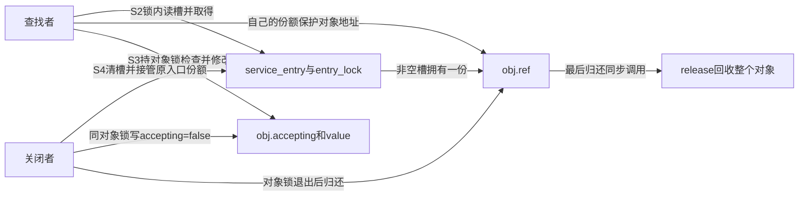
```mermaid
flowchart LR
    E[service_entry与entry_lock] -->|非空槽拥有一份| R[obj.ref]
    L[查找者] -->|S2锁内读槽并取得| E
    L -->|自己的份额保护对象地址| R
    L -->|S3持对象锁检查并修改| V[obj.accepting和value]
    D[关闭者] -->|S4清槽并接管原入口份额| E
    D -->|同对象锁写accepting=false| V
    D -->|对象锁退出后归还| R
    R -->|最后归还同步调用| F[release回收整个对象]
```

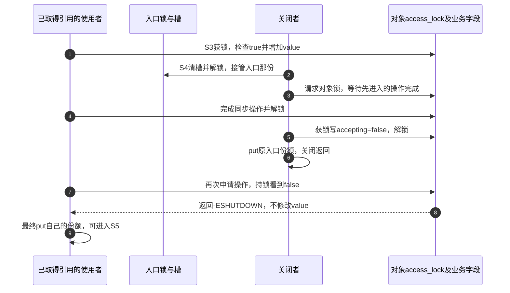
```mermaid
sequenceDiagram
    autonumber
    participant L as 已取得引用的使用者
    participant E as 入口锁与槽
    participant D as 关闭者
    participant A as 对象access_lock及业务字段
    L->>A: S3获锁，检查true并增加value
    D->>E: S4清槽并解锁，接管入口那份
    D->>A: 请求对象锁，等待先进入的操作完成
    L->>A: 完成同步操作并解锁
    D->>A: 获锁写accepting=false，解锁
    D->>D: put原入口份额，关闭返回
    L->>A: 再次申请操作，持锁看到false
    A-->>L: 返回-ESHUTDOWN，不修改value
    L->>L: 最终put自己的份额，可进入S5
```

entry_lock 的解锁/取得传递发布状态，access_lock 的解锁/取得传递业务结果和关闭决定，ref 的原子存储结算总份数。读者没有因为 kref_get 自动收到“关闭了”的通知，而是在每次操作的门锁内读取 accepting。正常操作成本是取得对象锁和读写这组共享字段，关闭路径则有清入口、等待已进入同步操作和归还原入口份额的成本。

沿材料目录已有构建方法设置 KDIR，构建模块并在匹配目标装卸 note_kref_shutdown.ko。正常预期是关闭前 result=0、value=1；关闭后 result=-ESHUTDOWN（该 Linux 错误码为 108，所以日志为 -108）、输出参数仍为初始化的 -1；最终 release_calls=1。value 的真实内容没有因拒绝改成 -1，-1 是调用者输出变量保持不变。这一点也应从 service_step 的赋值分支读出来。

既有 ARM 前端和八组顺序替身证据保留，本次复用程序没有改变行为；目标链接、装卸和真实双线程竞争仍未执行。练习时先把第二次 service_step 移到 shutdown 之前，预测输出值会继续增加；再只在纸上把“检查 accepting”移到锁外，补出读到 true 后关闭者先写 false、旧请求却继续执行的交错，不运行这个有竞争的版本。

### 9.2.2\_两类锁\_集合锁和对象锁

#### (1)\_集合锁

本例 entry_lock 保护 service_entry 以及从这个入口取得或撤下那份责任的窗口。若将槽换成链表，则对应表头、节点链接、成员状态和查找过程；哪些对象有几份引用仍由发布/撤下协议维护，不是 mutex 自带的功能。

查找时只需入口锁，不必拿业务锁：本接口承诺返回一份，并没有承诺本次业务一定获准。关闭者清槽后保留原入口那一份，才可以解除入口锁并安全地继续访问对象。这个中间份额是拆开两个临界区的依据，不能以“反正马上拿另一把锁”替代。

#### (2)\_对象锁

access_lock 保护 accepting 与 value 的读写，以及“检查允许→实际同步操作”这一完整决策。它放在对象内部，所以每个独立对象可以有自己的业务门；对不同对象的业务操作不必为了改 value 一直占住同一个全局入口锁。

id 若在发布前固定且之后不变，可以按发布/取得协议读取，不必强行增加一把 id 锁。state、enabled、flags 等可变字段则应按真实不变量选择同锁：若几个字段必须一起变化，把它们拆给互不关联的锁反而会让观察者看见不一致组合。锁按状态关系分工，不按字段数量分配。

#### (3)\_两者不能混用

**原有人工批注保留：**

> <span style="color:red;">说实话，我完全不认同这个ai总结的小结。不过我又觉得这个标题是需要提醒做到对锁职权分离的。所以保留下来。</span>

这条批注指出了原标题容易造成的误解。应把“不能混用”理解为 **不能让不同访问者各自猜一把锁来保护同一不变量**，不能理解为“集合和字段永远必须分成两把锁”。若所有相关路径都采用一个全局锁，它完全可以同时保护集合与业务字段；其代价是本可独立的对象操作也会串行。是否拆锁，要由共享状态与负载决定。

反例中的 `mutex_lock(&obj->lock); list_del_init(...);` 只有在其他链表操作采用另一把互不协调的全局锁时才违反协议；不是因为函数名叫对象锁就天然无权修改 node。同样，只拿集合锁写 state 是否正确，要看其他 state 访问者是否也遵守它。不要把位置或命名当成同步证明。

本例选择两个互不嵌套的临界区，因此没有 entry_lock→access_lock 的同时持锁依赖。代价是“入口刚撤下、业务门还没关”之间存在窗口：旧引用使用者仍可能在关闭者获得 access_lock 前完成一次同步操作。接口保证的是 **shutdown 返回时门已关闭且先进入的同步操作已退出**，不承诺清槽瞬间就停止一切旧操作。单一管理者、关闭期间不重新发布也是该保证的前提；并发第二个 shutdown 看到空槽提前返回，不能被当成第一个关闭者已经完成的屏障。

若业务要求“撤下入口与禁止旧引用新操作必须作为一个原子决策”，就要使用共同的门锁或建立明确的嵌套锁顺序，并重新检查所有读写者。本章后续将比较这种组合及最后归还触发回调的路径，而不是从一开始规定所有对象必须采用同一套锁布局。

## 9.3\_lookup\_remove\_和状态\_锁与\_kref\_的常规配合

先把上一节完整服务模块的规则迁移到链表。这里选择拥有型集合：每个成功发布的成员有集合的一份，查找在同锁内追加读者的一份，删除只归还实际摘下成员的那一份。非拥有索引另有 P08 已讲清的回调摘链协议，不能把两套前提拼接起来。

这一轮需要分别回答三个问题：查找怎样从入口锁交接到独立引用，删除怎样从成员关系交接到待归还份额，业务操作怎样在自己的份额有效期间使用对象锁。前两种交接改变责任方，第三种只改变业务状态，不自动改变引用数。

### 9.3.1\_lookup\_时\_锁保护\_get\_前窗口

当 list_lock 保持持有且对象仍在拥有型链表中，删除者不能摘下并归还成员份额，因此计数仍正，普通 get 有依据。这把锁没有代替 kref 的原子增加；它保护的是从读取成员地址到新增责任成立的整段窗口。

```c
/* 配对片段：所有成员变化依同一list_lock，成员自己拥有一份。 */
static struct my_obj *lookup_get(int id)
{
    struct my_obj *obj, *found = NULL;
    mutex_lock(&list_lock);
    list_for_each_entry(obj, &object_list, node) {
        if (obj->id != id)
            continue;
        kref_get(&obj->ref);
        found = obj;
        break;
    }
    mutex_unlock(&list_lock);
    return found; /* 非空时交付一份，NULL时没有归还义务。 */
}
```

函数返回后 list_lock 已不在，读者的份额接续对象存储期限。如果删除先完成，查找只会看见没有该成员；如果查找先完成，删除只会归还集合的一份，不能消耗读者的一份。只锁读指针、解锁后再 get，会破坏这次交接。

对象锁并没有参与这次查询，原因是本接口没有读取由它保护的业务字段。若接口还要检查接纳状态，必须按该状态的实际保护规则增加相应窗口，而不是因为名为 lookup 就禁止取得另一把锁。后面双状态模型将具体说明这项选择。

### 9.3.2\_remove\_时\_先\_unlink\_再\_put\_但必须匹配集合引用

以下讨论唯一拥有型链表的成员引用；按对象地址调用 remove 的路径须另有一份或等效期限保证，覆盖本次调用。所谓允许重复 remove，不允许重复使用已经释放的对象地址。已有讲清的逐步解释保留如下。

对象从集合中删除时，常见顺序是：

```text
先从集合中撤销可见性；（避免并发时，被别的地方从列表找到需要被ut的节点。针对最后一个引用释放）
再释放集合持有的引用。
```

也就是：

```text
unlink first, put later.
```

但是这句话还不完整。

更准确的规则应该是：

```text
unlink first, put later;
unlink once, put once.
```

也就是说：

```text
只有本次 remove 确实撤销了集合中的可见性，
才能释放集合持有的那一份引用。
```

如果对象根本不在集合中，却仍然调用 `kref_put()`，就不是“正常 remove”，而是多释放了一次引用。

------

假设对象结构如下：

```c
struct my_obj {
	struct kref ref;
	struct list_head node;
	int id;
};
```

对象初始化时，`node` 应该先初始化为空链表节点：

```c
void my_obj_init(struct my_obj *obj)
{
	kref_init(&obj->ref);
	INIT_LIST_HEAD(&obj->node);
}
```

如果集合会长期持有对象，那么对象加入集合时，集合应当获得一份引用：

```c
void my_obj_add(struct my_obj *obj)
{
	kref_get(&obj->ref);		/* 集合获得一份引用 */

	mutex_lock(&my_obj_list_lock);
	list_add(&obj->node, &my_obj_list);
	mutex_unlock(&my_obj_list_lock);
}
```

对应地，移出集合时，集合应该释放这份引用。

------

错误写法：

```c
void my_obj_remove(struct my_obj *obj)
{
	mutex_lock(&my_obj_list_lock);

	if (!list_empty(&obj->node))
		list_del_init(&obj->node);

	mutex_unlock(&my_obj_list_lock);

	kref_put(&obj->ref, my_obj_release);
}
```

这段代码的问题不在于没有检查 `kref_put()` 的返回值。

`kref_put()` 的返回值表示：

```text
这次 put 是否导致引用计数归零，并触发 release。
```

它不能回答：

```text
这次 remove 是否真的删除了集合节点？
这次 put 是否真的对应集合持有的那份引用？
```

真正的问题是：

```text
即使 obj->node 已经不在 list 中，
代码仍然会调用 kref_put()。
```

这会导致：

```text
没有 unlink；
却执行了 put。
```

也就是：

```text
没有撤销集合引用；
却释放了一次集合引用。
```

如果 `remove` 被重复调用，第二次调用就可能造成引用计数失衡：

```text
第一次 remove:
    list_del_init()
    kref_put()      正确释放集合引用

第二次 remove:
    list_empty() 为 true
    没有 list_del_init()
    仍然 kref_put()  多 put 一次
```

严重时会导致对象提前释放、UAF 或 double put。

------

更稳妥的写法是记录本次是否真的删除了节点：

```c
void my_obj_remove(struct my_obj *obj)
{
	bool removed = false;

	mutex_lock(&my_obj_list_lock);

	if (!list_empty(&obj->node)) {
		list_del_init(&obj->node);
		removed = true;
	}

	mutex_unlock(&my_obj_list_lock);

	if (removed)
		kref_put(&obj->ref, my_obj_release);
}
```

这个版本表达的语义是：

```text
只有本次确实从集合中 unlink 了 obj，
才释放集合持有的那份引用。
```

流程如下：

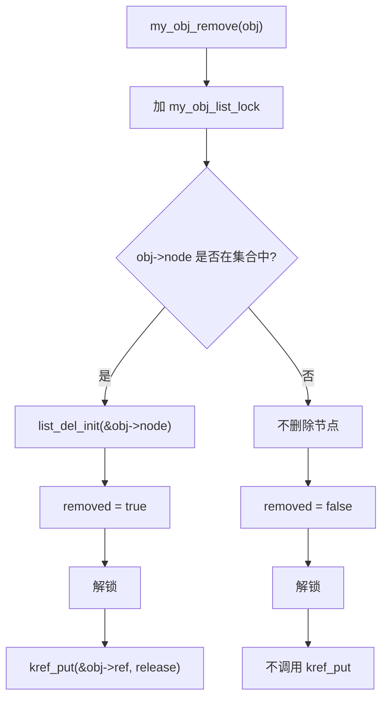
```mermaid
flowchart TD
    A["my_obj_remove(obj)"] --> B["加 my_obj_list_lock"]
    B --> C{"obj->node 是否在集合中?"}

    C -- "是" --> D["list_del_init(&obj->node)"]
    D --> E["removed = true"]
    E --> F["解锁"]
    F --> G["kref_put(&obj->ref, release)"]

    C -- "否" --> H["不删除节点"]
    H --> I["removed = false"]
    I --> J["解锁"]
    J --> K["不调用 kref_put"]
```

这时生命周期关系是匹配的：

```text
list_del_init() 成功一次；
集合引用 put 一次。
```

------

不过，工程里还要区分两种 remove 语义。

第一种是**幂等 remove**。

也就是允许重复调用：

```text
对象在集合中：删除并 put；
对象不在集合中：什么也不做。
```

这种情况下可以使用 `removed` 标志：

```c
void my_obj_remove(struct my_obj *obj)
{
	bool removed = false;

	mutex_lock(&my_obj_list_lock);

	if (!list_empty(&obj->node)) {
		list_del_init(&obj->node);
		removed = true;
	}

	mutex_unlock(&my_obj_list_lock);

	if (removed)
		kref_put(&obj->ref, my_obj_release);
}
```

第二种是**非幂等 remove**。

也就是调用者必须保证：

```text
obj 当前一定在集合中；
remove 只能调用一次；
重复 remove 是调用路径 bug。
```

这种情况下，不应该悄悄吞掉错误，而应该暴露错误：

```c
void my_obj_remove(struct my_obj *obj)
{
	mutex_lock(&my_obj_list_lock);

	if (WARN_ON_ONCE(list_empty(&obj->node))) {
		mutex_unlock(&my_obj_list_lock);
		return; /* 告警不会自动终止控制流，不能继续消耗不存在的成员份额。 */
	}
	list_del_init(&obj->node);

	mutex_unlock(&my_obj_list_lock);

	kref_put(&obj->ref, my_obj_release);
}
```

本版在告警条件成立时明确返回。WARN_ON_ONCE 自身只是诊断表达式，不会替调用者中止后面的 list_del_init 和 put；不能把诊断当成错误恢复。

这个版本的含义是：

```text
remove 必须对应一个真实存在的集合引用；
如果 obj 不在集合中，说明调用路径已经错了。
```

------

无论采用哪种写法，都必须保证所有修改 `obj->node` 的路径使用同一把锁保护：

```text
lookup；
add；
remove；
遍历；
销毁前 unlink；
```

否则一个 CPU 判断 `!list_empty()` 的同时，另一个 CPU 也可能删除同一个节点，最终仍然会出现重复 unlink 或重复 put。

所以集合删除的核心规则是：

```text
集合可见性和集合引用必须绑定。
```

可以总结成表：

| 操作              | 集合可见性               | 集合引用            |
| ----------------- | ------------------------ | ------------------- |
| `list_add()`      | 对 lookup 可见           | 集合获得 1 份引用   |
| `list_del_init()` | 对 lookup 不可见         | 集合释放 1 份引用   |
| 没有 unlink       | 集合状态未变化           | 不应该 put 集合引用 |
| 重复 remove       | 第二次没有集合引用可释放 | 再 put 就是 bug     |

最终结论：

```text
remove 的顺序是 unlink first, put later；
但 put 的前提是本次 remove 确实撤销了集合持有的引用。
```

更短的工程口诀是：

```text
unlink once, put once.
```

---

### 9.3.3\_put\_前后访问字段的边界

继续使用自己查找得到的那一份，典型顺序是“持对象锁修改字段→解锁→归还自己的份额”。每一步都有不同的依据：引用保护锁和字段所在的分配块，锁保护这次字段变化，解锁完成以后才允许这条路径放弃存储保证。

```c
/* 当前路径持有一份，state的全部读写都遵守obj->lock。 */
mutex_lock(&obj->lock);
obj->state = OBJ_DONE;
mutex_unlock(&obj->lock);
object_put(obj);
```

若把 put 提到最前面，随后连 mutex_lock 所访问的锁地址都可能已释放；若 put 放到 unlock 之前，unlock 仍要访问嵌在对象里的锁。普通 put 可能同步执行 release，不能把调用返回以前视作对象当然还在。

“put 后不能访问”针对的是本次已经归还的保护依据，不是否认独立第二份或明确的外层借用窗口。若当前路径确实保留另一份，可以按那一份继续；评审必须指出它的来源，不能用“别人应该还持有”或一次计数快照代替。

### 9.3.4\_持有引用只保证生命周期\_不保证字段互斥

两个查找者各有一份，所以双方访问的对象都还在；但他们仍可以竞争同一个 state 或 value。对同一不变量的所有读者和写者都要使用约定的锁，不能只有写方加锁，读方凭“我只是看一眼”跳过。

```c
/* 片段：lookup_get交付一份，业务决策和修改都在字段锁内完成。 */
obj = lookup_get(id);
if (!obj)
    return -ENOENT;
mutex_lock(&obj->lock);
if (obj->state == OBJ_IDLE)
    obj->state = OBJ_RUNNING;
else
    result = -EBUSY;
mutex_unlock(&obj->lock);
object_put(obj);
```

此处 result 由调用者预置为 0，片段仅展示状态许可；真实启动若包含硬件或异步任务，还须定义失败回滚与关闭流程。状态锁消除了这次检查与写入之间的竞争，不会把一个枚举赋值自动变成完整业务操作。

发布后不再变化的 id 可以按发布协议读取，某些字段也可以采用独立的原子或其他同步方案。因此结论是“遵守字段同步协议”，不是无条件要求每一次读取都额外拿 mutex。

### 9.3.5\_锁内只能借用指针\_锁外必须持有引用

原标题提醒读者不要把临时地址带出保护窗口，但“只能”和“必须”需要限定场景。在本章拥有型集合中，如果调用者原先没有别的保护，只依集合锁读到一个地址，那么锁内可以借用；要把对象交到锁外使用，就必须先取得自己的份额。

```c
/* find_locked只借出地址；锁内复制一个不可变编号，不带走对象。 */
mutex_lock(&list_lock);
obj = find_locked(id);
if (obj)
    copied_id = obj->id;
mutex_unlock(&list_lock);
/* 后续仅使用copied_id，不能再凭这次借用访问obj。 */
```

锁内也可以已经持有独立引用，两者并不互斥；锁外也可能处于明确的外层借用协议，例如管理者保有一份并等待借用 worker 完成。P06 的完整管理者模块就属于后一种。把这些前提省略后写成“所有锁外指针都必须由当前线程 get”，会把 P07 合法借用和转交误判为错误。

决定能否跨窗口的不是指针放在栈上还是结构体里，而是保护期限。准备把指针放到异步参数时，须指出新增份额、转交份额或覆盖执行全程的借用者；仅保存地址不产生期限。

### 9.3.6\_集合引用模型

拥有型集合适合需要独立发布/撤下的对象：成功发布交给集合一份；只要成员仍在，集合的一份就保证它不是零计数对象；查找锁内可普通 get。代价是退出必须有显式移除路径，否则最后一个外部使用者离开以后，集合的一份仍会保留对象。

完整槽程序、链表迁移片段和整数索引模块已经在[P08](P08_lookup_场景与_kref_get_unless_zero%28%29.md#8.3_基础保护模型_锁保护容器_kref_保护生命周期)建立。本节沿同一模型检查三个决策点，而不再给一组与前文退出规则冲突的重复函数：

| 决策 | 成功后的责任 | 拒绝或重复调用 |
| --- | --- | --- |
| 追加式发布 | 集合新增一份，调用者保留原份额 | 拒绝退回预留，不消耗原份额 |
| 接管式发布 | 原指定份额交给集合，计数可不变 | 按本例契约，失败不消费 |
| 成员移除 | 本次取得成员份额，解锁后归还 | 没有实际移除就没有那份可归还 |

集合不会因调用 list_add 自动 get；表格写的是应用协议。一个对象若有多个索引，应分别登记每个拥有型索引的份额；若索引只借用，必须另外建立 8.4 的零计数与地址保护规则。

非拥有索引并非天然错误，它适合最后外部使用者离开后自动从索引退出的设计；代价是最后归还必须与查找串行，或者查找使用条件取得、回调在同锁下才能回收。选择两者要看发布/撤下职责，不能按“哪个少一次 get”孤立比较。

接下来给成员可见性与业务运行分别命名。两组状态可以处于不同保护范围，但跨组决策仍须有一条完整的同步路径。

### 9.3.7\_对象状态\_集合锁与对象锁组合

上一节把查找交给独立引用，把业务读写交给字段锁。现在给状态命名：这不是一个枚举从头走到尾的单一状态机，而是成员可见性、业务运行与引用责任三组正交状态共同组成的协议。必须先说明每组状态的地址和写入者，再看一次完整周期。

但是状态字段不能随便设计。

在工程里，至少要先区分两类状态：

```text
生命周期状态：
    描述对象是否已经发布、是否还能被 lookup 找到、是否正在退出。

业务运行状态：
    描述对象内部业务是否空闲、运行、停止、出错。
```

这两类状态的保护方式不同。

生命周期状态通常和集合关系绑定。
业务运行状态通常和对象内部字段绑定。

因此可以把对象设计成：

```c
enum my_obj_life_state {
	MY_OBJ_NEW,
	MY_OBJ_LIVE,
	MY_OBJ_DYING,
	MY_OBJ_DEAD,
};

enum my_obj_run_state {
	MY_OBJ_IDLE,
	MY_OBJ_RUNNING,
	MY_OBJ_STOPPING,
	MY_OBJ_ERROR,
};

struct my_obj {
	int id;

	struct kref ref;

	/*
	 * node 和 life_state 由 my_obj_list_lock 保护。
	 *
	 * 它们共同表达：
	 *     对象是否在全局集合中；
	 *     对象是否允许被新的 lookup 找到。
	 */
	struct list_head node;
	enum my_obj_life_state life_state;

	/*
	 * run_state 和其他业务字段由 obj->lock 保护。
	 *
	 * 它们表达：
	 *     对象内部业务是否正在运行；
	 *     对象内部资源是否处于一致状态。
	 */
	struct mutex lock;
	enum my_obj_run_state run_state;

	/* 其他业务字段 */
};
```

这里采用的 life_state 只表示成员发布/撤下阶段，不能单独证明业务已停止；run_state 只表示本例同步业务状态，不能证明对象还在表中。id 在发布前写入并保持不变。本节是配对接口模型，完整可构建起点仍为 9.2 的服务模块；以下 start/stop 只演示同步状态转换，不冒充真实 DMA 或 work 关闭。

这里有三条分工：

| 机制               | 保护内容                       |
| ------------------ | ------------------------------ |
| `my_obj_list_lock` | 全局链表、`node`、`life_state` |
| `obj->lock`        | 对象内部业务字段、`run_state`  |
| `kref`             | 对象内存生命周期               |

一句话：

```text
list_lock 决定对象能不能被找到；
obj->lock 决定对象内部业务状态是否一致；
kref 决定对象内存能不能活到使用结束。
```

------

沿同一 S0～S5 阅读这组接口，注意本模型的 S4 只撤下成员，是否还要业务关闭由外层流程决定：

| 阶段 | 触发与写入者 | 状态地址和变化 | 同步及退出 |
| --- | --- | --- | --- |
| S0 | alloc 私有初始化 | life_state=NEW，run_state=IDLE，ref=1，node自链接 | 尚未发布，无共享读者 |
| S1 | publish | list_lock内追加集合一份，NEW→LIVE并挂链 | 后续lookup依同锁观察，拒绝不追加 |
| S2 | lookup | list_lock内比较id与LIVE，再get | 调用者独立份额接续到锁外 |
| S3 | start/stop | obj.lock内检查并改变run_state | 本节仅同步状态模型，不创建异步活动 |
| S4 | remove_by_id | list_lock内LIVE→DYING并摘链，记录待归还份额 | 本页保留双锁写段，顺序为集合锁→对象锁；解除两锁后put |
| S5 | 最后put触发release | 最后责任退出，检查节点、写DEAD并回收 | 此时正常协议下无其他读写者；创建未发布也可直接走此阶段 |

因而 LIVE+IDLE、LIVE+RUNNING、DYING+RUNNING 都可能有意义。最后一种说明入口已撤下，但本节并没有宣称业务停止；若产品要求撤下以后旧用户也不能启动，必须补业务门，不能靠 life_state 的名字猜保证。

#### (1)\_生命周期状态必须和集合动作绑定

如果 `life_state` 表示对象能不能被 lookup 找到，那么它就应该和 `node` 放在同一个保护域里。

也就是说：

```text
MY_OBJ_LIVE 绑定 list_add()；
MY_OBJ_DYING 绑定 list_del_init()。
```

不要把 `life_state` 当成一个可以随便单独修改的字段。

生命周期流转如下：

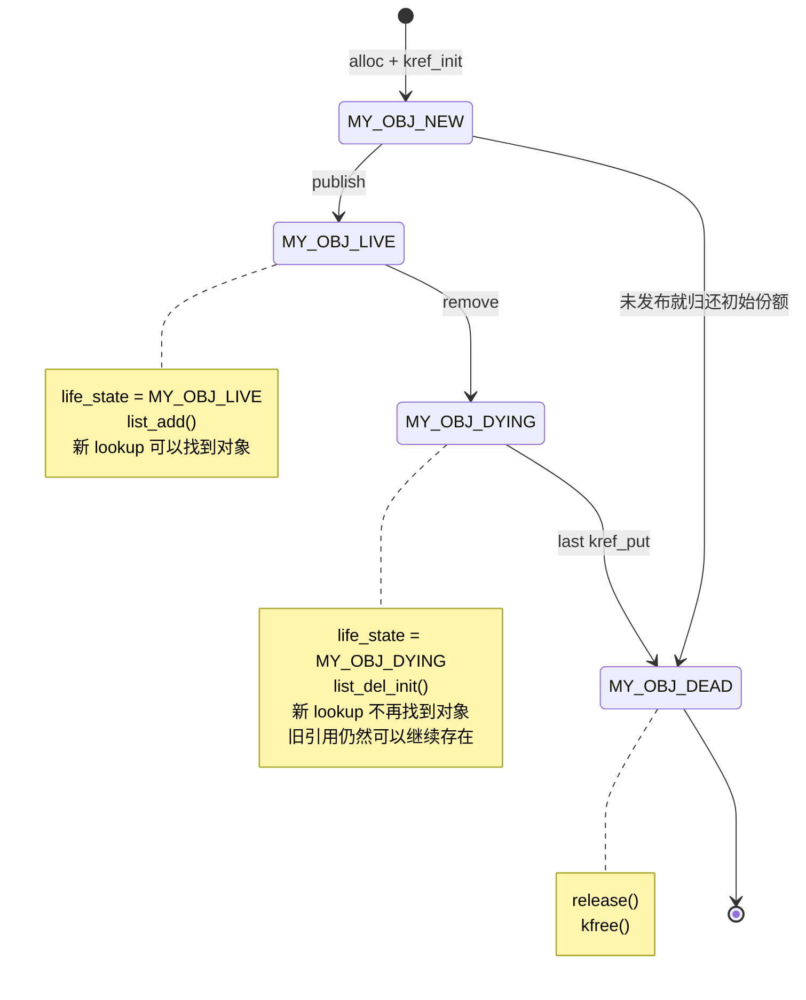
```mermaid
stateDiagram-v2
    [*] --> MY_OBJ_NEW: alloc + kref_init

    MY_OBJ_NEW --> MY_OBJ_LIVE: publish
    MY_OBJ_NEW --> MY_OBJ_DEAD: 未发布就归还初始份额
    note right of MY_OBJ_LIVE
        life_state = MY_OBJ_LIVE
        list_add()
        新 lookup 可以找到对象
    end note

    MY_OBJ_LIVE --> MY_OBJ_DYING: remove
    note right of MY_OBJ_DYING
        life_state = MY_OBJ_DYING
        list_del_init()
        新 lookup 不再找到对象
        旧引用仍然可以继续存在
    end note

    MY_OBJ_DYING --> MY_OBJ_DEAD: last kref_put
    note right of MY_OBJ_DEAD
        release()
        kfree()
    end note

    MY_OBJ_DEAD --> [*]
```

这里要注意：

```text
对象进入 MY_OBJ_DYING，不代表对象内存已经释放；
它只代表对象已经从全局集合撤销，不再接受新的 lookup。
```

真正释放发生在最后一个引用释放之后。

------

#### (2)\_创建对象\_只有初始引用\_还没有发布

创建对象时，调用者拿到初始引用。

```c
struct my_obj *my_obj_alloc(int id)
{
	struct my_obj *obj;

	obj = kzalloc(sizeof(*obj), GFP_KERNEL);
	if (!obj)
		return NULL;

	obj->id = id;

	kref_init(&obj->ref);

	INIT_LIST_HEAD(&obj->node);
	obj->life_state = MY_OBJ_NEW;

	mutex_init(&obj->lock);
	obj->run_state = MY_OBJ_IDLE;

	return obj;
}
```

此时对象状态是：

```text
调用者持有初始引用；
对象还没有进入全局链表；
lookup 找不到它；
life_state == MY_OBJ_NEW。
```

------

#### (3)\_发布对象\_让全局集合持有一份引用

如果对象加入全局链表，并且之后可以通过 lookup 找到，那么全局链表本身应该持有一份引用。

发布动作可以写成：

```c
int my_obj_publish(struct my_obj *obj)
{
	struct my_obj *candidate;
	int ret = 0;

	/*
	 * 调用者必须已经持有 obj 的有效引用。
	 */

	mutex_lock(&my_obj_list_lock);

	if (obj->life_state != MY_OBJ_NEW) {
		ret = -EINVAL;
		goto out;
	}

	if (!list_empty(&obj->node)) {
		ret = -EINVAL;
		goto out;
	}

	/* 编号是本索引的唯一键，重复编号不得形成含糊查找结果。 */
	list_for_each_entry(candidate, &my_obj_list, node) {
		if (candidate->id == obj->id) {
			ret = -EEXIST;
			goto out;
		}
	}

	/*
	 * 从这里开始，list 持有一份引用。
	 * 只要 obj 还在 my_obj_list 中，这份引用就托住对象内存。
	 */
	kref_get(&obj->ref);

	obj->life_state = MY_OBJ_LIVE;
	list_add(&obj->node, &my_obj_list);

out:
	mutex_unlock(&my_obj_list_lock);
	return ret;
}
```

这个函数表达的是一个完整动作：

```text
publish =
    list 获得引用
    life_state = MY_OBJ_LIVE
    list_add()
```

这三件事应该在同一个集合锁保护下完成。

------

#### (4)\_lookup\_只从集合中取得\_LIVE\_对象

因为 `node` 和 `life_state` 都由 `my_obj_list_lock` 保护，所以 lookup 不需要拿 `obj->lock`。

```c
struct my_obj *my_obj_lookup_get_live(int id)
{
	struct my_obj *obj;
	struct my_obj *ret = NULL;

	mutex_lock(&my_obj_list_lock);

	list_for_each_entry(obj, &my_obj_list, node) {
		if (obj->id != id)
			continue;

		if (obj->life_state == MY_OBJ_LIVE) {
			/*
			 * obj 仍在 list 中；
			 * list 持有对象引用；
			 * my_obj_list_lock 持有期间，obj 不会被 unlink + put；
			 * 所以这里 kref_get 是安全的。
			 */
			kref_get(&obj->ref);
			ret = obj;
		}

		break;
	}

	mutex_unlock(&my_obj_list_lock);

	return ret;
}
```

这个函数的语义是：

```text
如果对象仍然对 lookup 可见，就返回一份新的引用；
如果对象不存在，或者已经从集合中撤销，就返回 NULL。
```

调用者拿到对象后，必须负责释放引用：

```c
obj = my_obj_lookup_get_live(id);
if (!obj)
	return -ENOENT;

ret = my_obj_do_something(obj);

kref_put(&obj->ref, my_obj_release);
```

这里的 `LIVE` 只表示：

```text
对象仍然在全局集合中；
新的 lookup 允许拿到它。
```

它不表示：

```text
对象内部业务一定正在运行；
对象一定可以执行任意操作。
```

业务状态要在后续操作里用 `obj->lock` 判断。

------

#### (5)\_remove\_从集合中撤销对象

如果删除入口是按 `id` 删除，那么函数应该写成 `remove_by_id()`。

它和 `lookup_get_live()` 是对称的：
一个负责从集合中取得引用，另一个负责从集合中撤销可见性。

```c
int my_obj_remove_by_id(int id)
{
	struct my_obj *obj;
	struct my_obj *obj_to_put = NULL;
	int ret = -ENOENT;

	mutex_lock(&my_obj_list_lock);

	list_for_each_entry(obj, &my_obj_list, node) {
		if (obj->id != id)
			continue;

		if (obj->life_state != MY_OBJ_LIVE) {
			ret = -EINVAL;
			break;
		}

		/*
		 * remove 是一个完整动作：
		 *
		 *     life_state = MY_OBJ_DYING
		 *     list_del_init()
		 *
		 * 这两件事都由 my_obj_list_lock 保护。
		 */
         mutex_lock(&obj->lock);
		obj->life_state = MY_OBJ_DYING;
		list_del_init(&obj->node); // 防止外部对象通过node查找链表，所以和状态修改合一起
         mutex_unlock(&obj->lock);

		/*
		 * list 原本持有一份引用。
		 * 从 list 删除后，这份引用需要释放。
		 *
		 * 先记录下来，等释放 list_lock 后再 put。
		 */
		obj_to_put = obj;
		ret = 0;
		break;
	}

	mutex_unlock(&my_obj_list_lock);

	if (obj_to_put)
		kref_put(&obj_to_put->ref, my_obj_release);

	return ret;
}
```

当前保留的代码实际上在 list_lock 内又取得了 obj->lock，原文“这里没有拿对象锁”与代码不符。原有插锁和中文注释保留，按它们的实际行为解释：这是集合锁→对象锁的嵌套写段，两把锁都不保护独立的 put；归还在全部解锁后发生。

本节的既定字段表仍把这些状态归集合锁保护：

```text
life_state；
node；
list 持有的引用。
```

这些写入已有 my_obj_list_lock 排斥所有成员读写者，因此在本节协议下，额外对象锁并非保护 node/life_state 所必需。它增加了锁依赖，却不会自动让只拿对象锁的其他路径获得遍历全局链表的资格。若额外锁的实际目的是阻止业务启动，还必须让 start 检查同一关闭状态；当前代码只看 run_state，所以不能宣称它已经做到业务关闭。

流程如下：

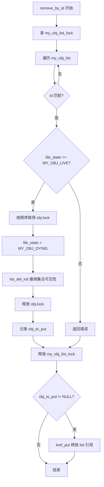
```mermaid
flowchart TD
    A[remove_by_id 开始] --> B[拿 my_obj_list_lock]
    B --> C[遍历 my_obj_list]
    C --> D{id 匹配?}
    D -- 否 --> C
    D -- 是 --> E{life_state == MY_OBJ_LIVE?}
    E -- 否 --> F[返回错误]
    E -- 是 --> N[按顺序取得 obj.lock]
    N --> G[life_state = MY_OBJ_DYING]
    G --> H[list_del_init 撤销集合可见性]
    H --> U[释放 obj.lock]
    U --> I[记录 obj_to_put]
    I --> J[释放 my_obj_list_lock]
    F --> J
    J --> K{obj_to_put != NULL?}
    K -- 是 --> L[kref_put 释放 list 引用]
    K -- 否 --> M[结束]
    L --> M
```

这就是常见纪律：

```text
锁内撤销可见性；
锁外释放集合引用。
```

`kref_put()` 放在锁外，是因为它可能触发最后一个引用释放，从而进入 `release()`。

------

#### (6)\_lookup\_和\_remove\_的并发关系

这个模型下，lookup 和 remove 只需要靠 `my_obj_list_lock` 串行化。

##### 1)\_lookup\_先发生

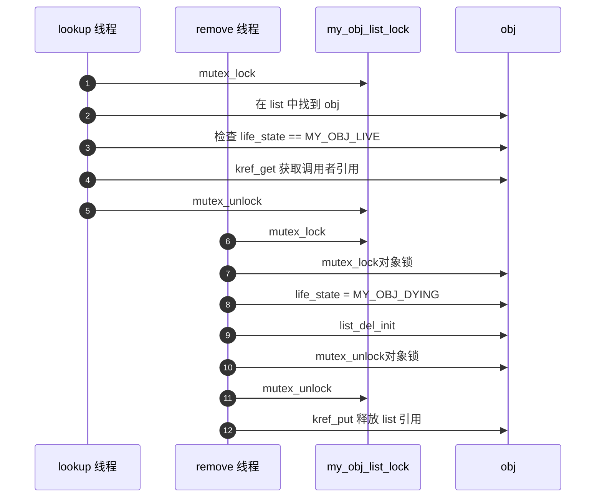
```mermaid
sequenceDiagram
    autonumber
    participant L as lookup 线程
    participant R as remove 线程
    participant Lock as my_obj_list_lock
    participant Obj as obj

    L->>Lock: mutex_lock
    L->>Obj: 在 list 中找到 obj
    L->>Obj: 检查 life_state == MY_OBJ_LIVE
    L->>Obj: kref_get 获取调用者引用
    L->>Lock: mutex_unlock

    R->>Lock: mutex_lock
    R->>Obj: mutex_lock对象锁
    R->>Obj: life_state = MY_OBJ_DYING
    R->>Obj: list_del_init
    R->>Obj: mutex_unlock对象锁
    R->>Lock: mutex_unlock
    R->>Obj: kref_put 释放 list 引用
```

这种情况下：

```text
lookup 已经拿到了自己的引用；
remove 只是撤销集合可见性；
对象不会因为 remove 立刻释放。
```

只要 lookup 调用者还没有 `kref_put()`，对象内存就还在。

------

##### 2)\_remove\_先发生

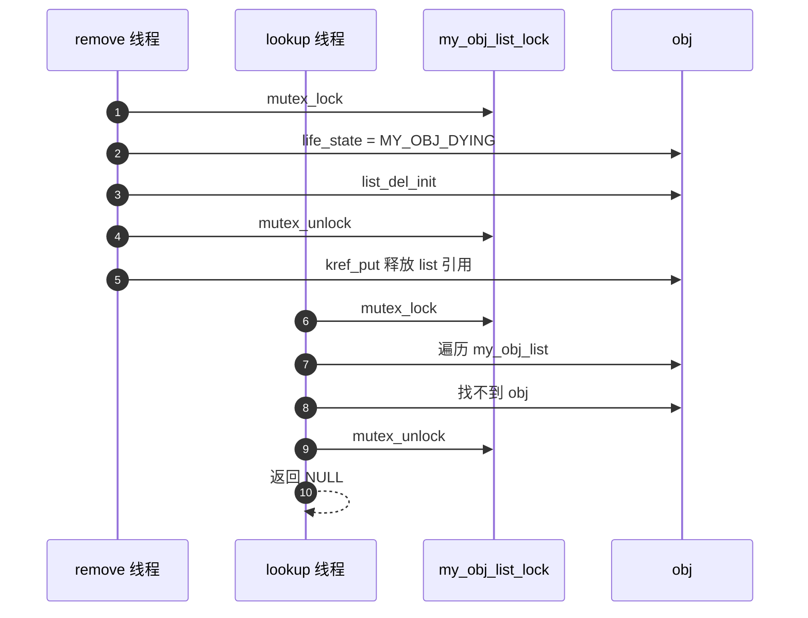
```mermaid
sequenceDiagram
    autonumber
    participant R as remove 线程
    participant L as lookup 线程
    participant Lock as my_obj_list_lock
    participant Obj as obj

    R->>Lock: mutex_lock
    R->>Obj: life_state = MY_OBJ_DYING
    R->>Obj: list_del_init
    R->>Lock: mutex_unlock
    R->>Obj: kref_put 释放 list 引用

    L->>Lock: mutex_lock
    L->>Obj: 遍历 my_obj_list
    L->>Obj: 找不到 obj
    L->>Lock: mutex_unlock
    L-->>L: 返回 NULL
```

这种情况下：

```text
remove 已经撤销集合可见性；
新的 lookup 找不到对象；
不会再由这个已经撤下的入口产生新引用；已有拥有者仍可能按自己的协议追加独立份额。
```

------

#### (7)\_已有对象引用时\_业务状态由对象锁保护

`obj->lock` 不参与 lookup 可见性判断。

它用于对象内部业务操作。

例如启动对象：

```c
int my_obj_start(struct my_obj *obj)
{
	int ret = 0;

	/*
	 * 调用者必须已经持有 obj 引用。
	 */

	mutex_lock(&obj->lock);

	if (obj->run_state != MY_OBJ_IDLE) {
		ret = -EINVAL;
		goto out;
	}

	obj->run_state = MY_OBJ_RUNNING;

	/* 本节只演示同步状态转换，没有启动硬件或异步任务。 */

out:
	mutex_unlock(&obj->lock);
	return ret;
}
```

停止对象：

```c
int my_obj_stop(struct my_obj *obj)
{
	int ret = 0;

	/*
	 * 调用者必须已经持有 obj 引用。
	 */

	mutex_lock(&obj->lock);

	if (obj->run_state != MY_OBJ_RUNNING) {
		ret = -EINVAL;
		goto out;
	}

	obj->run_state = MY_OBJ_STOPPING;

	/* 本节没有异步执行者；这里只演示同步收尾再回到IDLE。 */

	obj->run_state = MY_OBJ_IDLE;

out:
	mutex_unlock(&obj->lock);
	return ret;
}
```

这里修改 `run_state` 是合理的。

本模型把这些枚举赋值作为同步业务动作本身。真实工程必须另行把状态转换与成功、失败、排空条件对应：

```text
IDLE -> RUNNING：
    对应 start 动作。

RUNNING -> STOPPING -> IDLE：
    对应 stop 动作。
```

------

若把 work 或 DMA 加入模型，不能直接把 flush/cancel 塞进持 obj.lock 的 stop 中：被等待者也许需要同锁才能退出。应先在锁内关闭新请求和登记停止阶段，保留覆盖整个收尾的一份，解除锁后等待，再按锁协议发布停止结果。P06 已有借用退出实例；本段没有实现这个扩展。

#### (8)\_release\_最后引用释放后的销毁点

`release` 是最后引用释放后的销毁点。

它不负责把对象从全局链表中删除。

对象进入 `release` 前，应该已经满足：

```text
对象不再对新的 lookup 可见；
对象已经不在全局 list 中；
没有其他引用持有者。
```

示例：

```c
static void my_obj_release(struct kref *ref)
{
	struct my_obj *obj;

	obj = container_of(ref, struct my_obj, ref);

	/*
	 * release 不是 remove。
	 * 到这里时，对象应该已经从全局集合撤销。
	 */
	WARN_ON_ONCE(!list_empty(&obj->node));
	WARN_ON_ONCE(obj->life_state == MY_OBJ_LIVE);

	obj->life_state = MY_OBJ_DEAD;

	mutex_destroy(&obj->lock);

	kfree(obj);
}
```

正常拥有型协议下，最后归零意味着没有合法共享访问者，节点已摘下或从未发布，回调可以检查状态并写最终标记。DEAD 只在回收前写入，不允许别的线程在释放后读取它。WARN 是诊断，不会修复损坏链表；它没有告警也不能证明所有并发路径已经被测试。

这里的分工是：

```text
remove 负责撤销集合可见性；
kref_put 负责释放某个持有者的引用；
release 负责最后销毁对象。
```

不要把这三件事混成一个动作。

------

#### (9)\_整体关系图

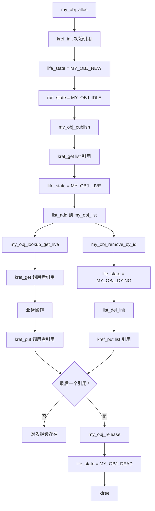
```mermaid
flowchart TD
    A[my_obj_alloc] --> B[kref_init 初始引用]
    B --> C[life_state = MY_OBJ_NEW]
    C --> D[run_state = MY_OBJ_IDLE]

    D --> E[my_obj_publish]
    E --> F[kref_get list 引用]
    F --> G[life_state = MY_OBJ_LIVE]
    G --> H[list_add 到 my_obj_list]

    H --> I[my_obj_lookup_get_live]
    I --> J[kref_get 调用者引用]
    J --> K[业务操作]
    K --> L[kref_put 调用者引用]

    H --> M[my_obj_remove_by_id]
    M --> N[life_state = MY_OBJ_DYING]
    N --> O[list_del_init]
    O --> P[kref_put list 引用]

    L --> Q{最后一个引用?}
    P --> Q

    Q -- 否 --> R[对象继续存在]
    Q -- 是 --> S[my_obj_release]
    S --> T[life_state = MY_OBJ_DEAD]
    T --> U[kfree]
```

这张图里有三条线：

```text
发布线：
    alloc -> publish -> list 可见

查找线：
    lookup -> kref_get -> 使用 -> kref_put

删除线：
    remove -> list 不可见 -> put list 引用 -> release
```

这三条线使用的是成员、业务和引用三组状态，而不是一条单独的生命周期枚举。请用图和阶段表解释：创建后发布失败可以从 S0 直接退出；查找先取得一份后，S4 撤下不妨碍它归还；S4 已发生却仍为 RUNNING，说明业务关闭尚未由本模型证明。

------

#### (10)\_本节结论

对象状态和锁组合时，先把状态语义分清楚。

如果状态表达的是集合可见性：

```text
它应该和 list node 一起由 list_lock 保护；
publish 时 state = LIVE + list_add；
remove 时 state = DYING + list_del_init；
lookup 在 list_lock 内完成查找、状态判断、kref_get。
```

如果状态表达的是对象内部业务：

```text
它应该由 obj->lock 保护；
调用者必须已经持有对象引用；
状态变化应该绑定 start、stop、reset、error 等真实动作。
```

最后总结：

```text
list_lock 保护“对象是否能被找到”；
obj->lock 保护“对象内部状态是否一致”；
kref 保护“对象内存是否仍然存在”。
```

---

### 9.3.8\_锁顺序问题

刚才保留的 remove 写段同时持集合锁和对象锁，因此已经建立一条真实的锁依赖：先拿 my_obj_list_lock，再拿 obj->lock。若另一路径反过来，就可能各持一把并互等：

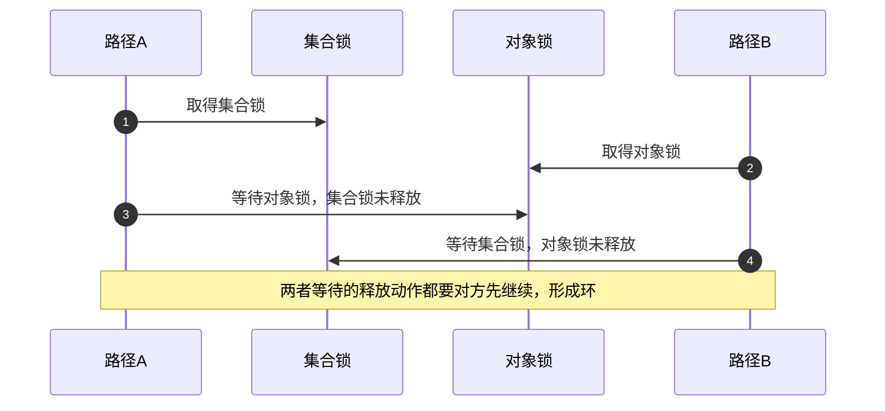
```mermaid
sequenceDiagram
    autonumber
    participant A as 路径A
    participant G as 集合锁
    participant O as 对象锁
    participant B as 路径B
    A->>G: 取得集合锁
    B->>O: 取得对象锁
    A->>O: 等待对象锁，集合锁未释放
    B->>G: 等待集合锁，对象锁未释放
    Note over A,B: 两者等待的释放动作都要对方先继续，形成环
```

引用不会打破这个等待环；它只让对象和锁所在内存仍在。应把锁依赖写进所有可能嵌套的路径，而不是只在 remove 注释中声明顺序。

```c
/*
 * my_obj_list_lock保护成员关系与life_state。
 * obj->lock保护run_state与业务字段。
 * 需要同时取得时，顺序固定为my_obj_list_lock -> obj->lock。
 * 只持对象锁的业务路径不得反向取得集合锁。
 */
```

若业务路径先持对象锁，又发现需要查集合，一种改造是保留已有独立引用，解除对象锁，再按全局顺序取得所需锁。这里多出一个必须面对的窗口：解锁期间业务和成员状态都可能变化，所以重新加锁后必须重新验证条件，不能继续使用此前判断。独立引用只保护地址，不能冻结决策依据。

另一种改造是像 9.2 那样把操作拆成不嵌套的阶段，由份额覆盖中间时间，并明确接口保证在何时成立。若业务真的要求两个状态同时变化，则不能仅为避免嵌套随意拆开；要重新设计共同保护范围或锁顺序。这是保证与代价的选择，不是“越少拿锁越正确”。

### 9.3.9\_remove\_路径中的锁组合

remove 可能只撤下成员，也可能承担停止接纳甚至等待异步执行者退出。先给它确定任务，再决定锁组合；函数名本身不说明它已经完成哪些事。

若关闭标志由对象锁保护，且要求标记关闭与撤下入口作为同一排他阶段，可以采用下面的配对片段。调用者持有独立引用，node 只属于这一个拥有型集合；全部状态读取遵守对象锁，所有成员操作遵守集合锁，嵌套顺序与上节一致。

```c
static void my_obj_unpublish(struct my_obj *obj)
{
    bool removed = false;
    mutex_lock(&my_obj_list_lock);
    mutex_lock(&obj->lock);
    obj->state = OBJ_DYING;
    if (!list_empty(&obj->node)) {
        list_del_init(&obj->node);
        removed = true;
    }
    mutex_unlock(&obj->lock);
    mutex_unlock(&my_obj_list_lock);
    if (removed)
        object_put(obj); /* 只归还本次摘下的成员份额；调用者原份额保留。 */
}
```

这里 state 是本片段定义的业务门字段，不是把 9.3.7 的 life_state 偷换成对象锁字段。若决定由集合锁同时保护 state，就让所有相应读写者一起改用集合锁，再取消多余对象锁；不能只改写一处 remove。重复调用虽不再次归还成员份额，却仍需要有效对象参数，也不能在与重新发布并发的情况下默认它会操作最早那次成员关系。

同一临界区内的关闭决定能够排斥按相同对象锁检查的 **新操作**，却不意味着此前启动的异步操作已经结束。需要等待 work、回调或硬件停止时，必须持有覆盖等待期的责任，按实际协议阻止重新提交，释放等待者需要的锁以后再同步退出。不能在未证明的情况下把“等待异步路径收尾”添在任何 put 之后；那时可能连等待对象都已回收。

9.3.7 的 remove_by_id 是另一种明确入口：它在集合锁内查到并摘下节点，暂接原成员份额，然后解锁归还。它不依赖一个调用者传入的对象地址，也不承诺业务停止；按 id 操作还须考虑编号重用。两种接口都能正确，但不能把它们的参数期限和完成保证混成一个模板。

至此可以检查查找、业务决策和成员移除的责任。剩下的危险点在最后一个 put：它会同步进入回调，而回调可能再次取锁、等待或释放锁所在对象。下一节把这条调用路径接到现有锁顺序上。

## 9.4\_release\_与锁\_最后一个\_put\_发生在哪里

上一节的成员移除在解锁后归还那一份。这不仅缩短了临界区，还把一个隐藏的调用边接到了容易审查的位置：普通 put 可能同步进入 release。只看 remove 里直接写出的 mutex_lock 不够，回调和回调调用的函数也属于当前路径。

这里先比较普通归还，再看非拥有索引为何需要把最后减少放在锁内。两种方案保留的保证不同，特殊接口并不是“更高级的 put”。

### 9.4.1\_release\_和锁的基本关系

普通 kref_put 在本次合法归还使计数归零时调用 release，回调沿调用者当前栈执行。调用者处于进程、软中断或硬中断上下文，当前还持有什么锁，都会影响回调可以执行的操作。接口不会替它切换成后台清理线程，也不自动释放调用者原有的锁。

原文的阅读旁注保留如下，并在这里限定其技术含义：

> `release` 是最后一个引用释放时调用的回调。不同于驱动的remove，这里是说在应用过程中的数据，它可以被并发访问，如果使用了kref，那么就用release做内存回收。
>
> 如果是驱动的状态清除，肯定只能够使用驱动的xxx_exit()接口。
>
> 如果最后一个 put 在中断上下文，release 就在中断上下文。（中断中的release 无锁，也不可睡眠）

需要校正两处绝对化结论。驱动资源何时关闭应由设备解绑、关闭、移除或其他实际生命周期接口决定，没有一个通用的 xxx_exit 名称可替所有驱动作判断；release 可以清理按协议归它所有的资源，但不能代替缺失的停止/排空流程。中断回调不能使用需要睡眠的操作，却不等于“没有持锁”或“禁止任何锁”：调用者可能已经持适用的自旋锁，回调也可能按经过证明的顺序使用非睡眠锁。必须核对实际上下文和原语，不能仅凭 callback 名称推断。

P06 已详细比较资源关闭与最后回收。本节只追问：把 release 的全部同步调用展开后，是否还满足当前锁顺序、等待关系和存储期限？

### 9.4.2\_不要在普通\_kref\_put()\_持锁路径里让\_release\_反拿同一把锁

考虑调用者持全局 mutex，普通 put 恰好是最后一份，而 release 也要取得这个 mutex。它不是“两个线程运气不好”，一个线程就足以形成自等待：

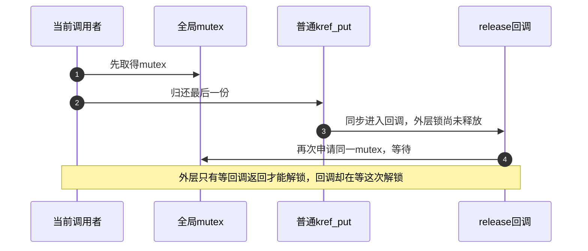
```mermaid
sequenceDiagram
    autonumber
    participant T as 当前调用者
    participant M as 全局mutex
    participant K as 普通kref_put
    participant R as release回调
    T->>M: 先取得mutex
    T->>K: 归还最后一份
    K->>R: 同步进入回调，外层锁尚未释放
    R->>M: 再次申请同一mutex，等待
    Note over T,R: 外层只有等回调返回才能解锁，回调却在等这次解锁
```

若对象是拥有型集合成员，可以先在集合锁内摘下，保留待归还成员份额到解锁后，再 put。这份责任保证从摘下到 put 之间对象仍有效。若其他共享字段还需要更新，应在它们各自协议允许的窗口里完成，不能把“锁外 put”简化成在最后归还后继续清理字段。

如果把锁外归还改成锁内归还，也不是所有情形都错：另有确定的一份使本次不可能归零，或者回调和锁存储已经按特定协议配对，可能成立。但必须指出这个证明，不能依靠日志里恰好没触发 release。

### 9.4.3\_release\_能否拿锁取决于上下文和锁顺序

检查时沿三条线追踪：调用点允许怎样的阻塞；外层持锁与回调再取锁是否形成依赖环；回调是否会回收后续 unlock 仍要访问的锁存储。全局锁和嵌入对象的锁在最后一点尤其不同：外壳回收后，全局锁可能仍在，而 obj->lock 已经随着对象消失。

mutex 持有期间可以发生合法睡眠，并不意味着可以等待任何对象。若回调持 global_lock 等 worker 完成，而 worker 必须拿 global_lock 才能退出，就形成“等待完成→等待锁”的环；它不必在源码里表现为反向的两次 mutex_lock。把等待放到锁外的前提仍是有一份或其他独立期限覆盖整个等待。

将复杂回收转到 work 也需要明确的责任移交和模块退出保证。RCU 回调通常不是通用可睡眠 workqueue，不能把“延迟执行”当作“上下文已经安全”。对于本章普通拥有型模型，优先在归零前完成关闭/排空，让 release 回收已经就绪的资源，通常更容易证明；选择依据是依赖关系，而不是回调代码行数。

### 9.4.4\_kref\_put\_mutex()\_的用途

现在改变一个前提：索引不持有引用，最后外部用户离开时才自动摘下对象，同时查找希望在同锁内继续使用普通 get。P08 已解释过，若先在锁外归零，再由回调取索引锁，查找可能在锁内看见零，只能使用条件取得。另一种设计是 **在取得索引锁以前保留最后候选那一份**，不允许最终归零越过查找窗口。

kref_put_mutex 就为这种组合提供包装：正常非最后份额可以先减少而不取索引锁；观察到可能最后时保留该份额，取得 mutex 后才实际减少并重新判断。等待期间查找者可能先拿锁新增一份，因此慢路径也可能最终不归零。

| 分支 | 减少与锁的顺序 | 谁解锁 | 是否调用release |
| --- | --- | --- | --- |
| 正常非最后快路径 | 比较减少成功，不取mutex | 没有新取得的锁 | 否 |
| 最后候选等待后又有新份额 | 先取mutex，再减少仍非零 | helper自己 | 否 |
| 锁内正常归零 | 先取mutex，再减少为零 | 回调接管并负责解锁 | 是，入口已持锁 |

这张表解释了为什么返回 0 不等于“从来没有取锁”，也解释了为什么快路径曾看到 1 不等于本次必然回收。固定版本的异常饱和返回更不能当作正常责任消费的诊断。

从[源码总索引](../../../../research/source_reading/kref/navigation/P01_Linux_6.12_kref源码阅读索引.md#1.2_按问题进入已落地证据)进入[锁交接模块](../../../../research/source_reading/kref/navigation/P04_最后归还与锁交接导读.md#4.2_把最后减少留在锁内)，再核对[kref 入口](../../../../research/source_reading/kref/source_explanations/include/linux/kref.h.md#1.8_归零时把锁交给回调)、[保留最后候选的快路径](../../../../research/source_reading/kref/source_explanations/lib/refcount.c.md#1.2_快路径保留最后一份)和[锁内重新减少](../../../../research/source_reading/kref/source_explanations/lib/refcount.c.md#1.3_取得锁后再次减少判断)。这里复用唯一实现，不从函数名推测为“先归零再拿锁”。

### 9.4.5\_kref\_put\_mutex()\_的典型模式

复用 P05 的完整 [note_kref_locked.c](../../../../labs/kernel/object_lifetime/materials/note_kref_locked.c)。它的索引没有新增一份，创建者保留初始份额；全部归还统一走 indexed_put，调用者不得已经持有 index_lock。回调入口与普通 release 恰好相反：已经接到锁，必须完成摘下并解锁。

```c
// SPDX-License-Identifier: GPL-2.0
#include <linux/kref.h>
#include <linux/module.h>
#include <linux/mutex.h>
#include <linux/slab.h>

struct indexed_object {
    int value;
    struct kref ref;
};

static DEFINE_MUTEX(index_lock);
static struct indexed_object *index_entry; /* 非拥有索引，不额外持引用。 */
static unsigned int release_calls;

/* 只供 kref_put_mutex 调用：进入时已持 index_lock，必须接管解锁。 */
static void indexed_release_locked(struct kref *ref)
{
    struct indexed_object *obj = container_of(ref, struct indexed_object, ref);
    if (index_entry == obj)
        index_entry = NULL;
    mutex_unlock(&index_lock);
    ++release_calls; /* 本模块只同步运行，统计保存在对象之外。 */
    kfree(obj);
}

/* 调用者负责一份，且没有持 index_lock；所有归还路径统一使用此接口。 */
static void indexed_put(struct indexed_object *obj)
{
    if (obj)
        kref_put_mutex(&obj->ref, indexed_release_locked, &index_lock);
}

static struct indexed_object *indexed_create(void)
{
    struct indexed_object *obj = kzalloc(sizeof(*obj), GFP_KERNEL);
    if (!obj)
        return NULL;
    obj->value = 42;
    kref_init(&obj->ref);
    return obj;
}

/* 成功只发布非拥有入口，创建者仍保留原份额；只接受尚未发布的新对象。 */
static int indexed_publish(struct indexed_object *obj)
{
    int result = 0;
    mutex_lock(&index_lock);
    if (index_entry)
        result = -EEXIST;
    else
        index_entry = obj;
    mutex_unlock(&index_lock);
    return result;
}

static struct indexed_object *indexed_lookup(void)
{
    struct indexed_object *obj;
    mutex_lock(&index_lock);
    obj = index_entry;
    if (obj)
        kref_get(&obj->ref); /* 最后归零也必须经同锁，锁内可见时仍为正。 */
    mutex_unlock(&index_lock);
    return obj;
}

static int __init note_locked_init(void)
{
    struct indexed_object *creator = indexed_create();
    struct indexed_object *reader;
    int result;
    if (!creator)
        return -ENOMEM;
    result = indexed_publish(creator);
    if (result) {
        indexed_put(creator); /* 私有失败对象也走统一回调，不清除别人的入口。 */
        return result;
    }
    reader = indexed_lookup();
    indexed_put(creator);
    if (!reader)
        return -ENOENT;
    pr_info("note_locked: reader value=%d\n", reader->value);
    indexed_put(reader); /* 最后归零在锁内，回调清入口、解锁并回收。 */
    return 0;
}

static void __exit note_locked_exit(void)
{
    /* 没有导出入口或异步参与者，所有责任已在 init 内结束。 */
    pr_info("note_locked: release_calls=%u\n", release_calls);
}

module_init(note_locked_init);
module_exit(note_locked_exit);
MODULE_LICENSE("GPL");
MODULE_DESCRIPTION("非拥有索引与最后归还锁交接实验");
```

先预测正常计数：创建为 1，发布不变，lookup 后为 2；创建者归还走非最后分支到 1，读者最后归还在锁内到 0，回调清入口、解锁并回收。预期初始化日志 reader value=42，卸载 release_calls=1。程序没有外部并发入口，不能用这次顺序输出证明慢路径真实阻塞已经测试。

把普通周期进一步细分：S4a 尝试非最后减少，S4b 保留候选份额等待索引锁，S4c 在锁内真正减少；归零后 S5a 由回调接管索引锁、摘下并解锁，S5b 回收外壳。共享状态是 ref、index_entry 和对象外的 index_lock；是否最后由锁内新观察决定，不保存一个永远有效的“刚才计数是一”的结论。

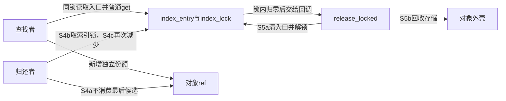
```mermaid
flowchart LR
    L[查找者] -->|同锁读取入口并普通get| I[index_entry与index_lock]
    L -->|新增独立份额| C[对象ref]
    P[归还者] -->|S4a不消费最后候选| C
    P -->|S4b取索引锁，S4c再次减少| I
    I -->|锁内归零后交给回调| R[release_locked]
    R -->|S5a清入口并解锁| I
    R -->|S5b回收存储| F[对象外壳]
```

如果查找者在 S4b 期间先取得锁并把 1 增到 2，归还者以后只减到 1，helper 自行解锁，回调不会执行。新读者以后仍须按相同归还协议退出。不能混入一条普通锁外 put，把“最后减少也在索引锁内”的证明破坏掉。

按材料目录的 KDIR 构建方式在匹配目标装卸该模块；既有 ARM 前端、六组模块控制路径和十类 helper 分支证据仍有效，本次没有改动程序。宿主的锁和原子为顺序替身，未执行真实等待、目标装卸或内存序验证。

### 9.4.6\_kref\_put\_lock()\_的用途

spinlock 版本沿同样的“先避免最后减少→取锁→重新减少→归零才交回调”结构，但同步原语不同。在本仓库固定的非 PREEMPT_RT 配置边界内，持 spinlock 时不得睡眠；这个 helper 使用普通 spin_lock，不自动保存或关闭中断状态。

回调必须按契约 spin_unlock，不能再次取得已经交给它的同一把锁，也不能调用可能阻塞的清理。解锁以后是否允许睡眠仍取决于原调用上下文：硬中断不会因释放自旋锁就变成进程上下文。若这把锁也被本 CPU 的中断路径使用，必须另行证明禁中断与取得规则，不能把 helper 自动当成 irqsave 包装。

特殊接口是否适合的判断顺序是：是否确实要把最后归零与这个共享索引串行；所有可能最后归还的上下文是否允许取该锁；回调是否正确接管、解锁和回收。原语选择由这三个约束推出，不是把 mutex 版本的名字换成 lock 就可适配中断。

### 9.4.7\_普通\_kref\_put()\_kref\_put\_mutex()\_kref\_put\_lock()\_对比

| 应用协议/接口 | 地址与正计数的依据 | 最后归还如何与查找相遇 | 代价与限制 |
| --- | --- | --- | --- |
| 拥有型容器+普通put | 成员那一份在同锁查找期间仍在 | 先摘下，解锁后归还成员份额 | 要有显式撤下路径，回调不必再操作容器 |
| 非拥有索引+普通put+条件取得 | 查找锁挡住回调回收，可能见零 | 锁外归零，回调再取索引锁 | 条件失败是正常分支，回调上下文允许拿锁 |
| 非拥有索引+kref_put_mutex | 最后减少也被索引mutex串行 | 正常非最后少走锁；候选等锁后再判断 | 全部归还协议一致；回调负责解锁；上下文允许mutex |
| 非拥有索引+kref_put_lock | 最后减少也被指定spinlock串行 | 与上行同类，锁语义不同 | 本基线持锁不睡眠，不自动irqsave |

若应用本来就有明确注册/撤下动作，拥有型容器通常更容易表达责任；若希望最后外部用户退出时自动摘下非拥有索引，才比较后面几种方案。两者都能正确，不能单独比较函数调用次数便宣称一种普遍更快。引用增减、索引锁争用、失败重试和实际负载都影响代价。

### 9.4.8\_kref\_put\_mutex()/kref\_put\_lock()\_的风险

最先核对的是回调入口契约：普通回调没有自动获得这把锁，locked 回调却以已经持锁为前提；混用会让回调对未持有的锁解锁，或让普通回调再次取得已持有锁。还要检查非归零分支由 helper 解锁、归零分支由回调解锁，不能两边都解或两边都不解。

回收次序同样重要。本例先清入口、解锁，再 kfree；锁在对象外，回调可以独立操作它。若改成嵌入对象的锁，必须确保任何仍需要锁地址的步骤结束以后才能回收外壳。不要在 kfree 后再通过 obj 查找 unlock 参数。

等待关系也不因换成特殊 helper 自动消失：回调持锁等待一个需要此锁的 worker，仍可能死锁；在非 RT spinlock 下调用同步取消，还可能违反不可睡眠约束。`release_mutex_locked`、`release_spin_locked` 这类命名有助于提示契约，但必须同时写出中文注释，说明入口谁持锁、出口谁解锁、允许什么上下文。

### 9.4.9\_更推荐的普通锁组合模板

回到本章已经建立的拥有型集合，它有独立的发布和撤下责任，因此可以保持普通 put：集合锁内检查本次成员关系并摘下，记录待归还份额，解除相关锁后只归还那一份。回调无需再理解集合遍历，也不会因为本次 remove 留着集合锁而自等待。

这条路线“更推荐”只针对上述应用前提，不覆盖非拥有索引的自动摘链需求。重复 remove 仍须有 removed 或返回旧条目的依据；回调诊断节点为空不替你修复丢失的成员份额。9.3.2 的完整推导和 9.2 的完整服务模块已经给出可审查的正例，不再另抄一个缺少重复调用条件的简化函数。

做一个分支练习：在 9.4.5 中，若原归还者看见 1 后新查找者先加到 2，谁应该解锁、谁以后负责最后一份？答案是本次 helper 解锁，成功查找者保留新的责任；不能调用 release。再问：若回调忘记解锁，计数正确是否能救活系统？不能，责任数与锁所有权是两种独立状态。

下一节把这些路径按进程、软中断、持对象锁和等待执行者的实际调用点逐一检查，避免只验证一个理想的最后归还者。

## 9.5\_put\_上下文和释放边界\_锁内\_锁外\_软中断和字段访问

上一节已经知道归零回调会沿当前调用栈执行。本节把视角从“这段回调看起来简单”移到“哪些路径可能最后归还”：同一个对象可能在读者、关闭者或异步完成者手里结束，而最后者不是由创建者预先指定的。

先为每条可能归还的路径写出当前份额来源、持锁集合和执行上下文，再检查它是否允许全部回调动作。检查的是完整路径，不是单独一行 kref_put。

### 9.5.1\_最后\_put\_可能发生在任意持有者路径

若没有额外协议限定，任何持有一份并调用 put 的路径都可能成为最后者。创建者、容器、lookup 读者和异步接收者谁先结束，取决于实际时序；因此回调若会拿 mutex，就不能只验证管理线程结束时的分支。

也可以有意限制最后者：例如 P06 的管理者借用模型保留自己的那一份，直到 worker 已退出，最后在允许的上下文归还。这里的保证来自管理者份额与等待顺序，不来自“worker 一般结束得早”。如果把 worker 改为独立持有一份，就要重新列出它最后归还时的回调上下文。

completion、timer 和 IRQ 这些名字本身不是份额来源。完成事件可以通知等待者但不消费任何引用；定时器改期不一定追加回调票据；中断注册参数也可能只是借用。先按 P07 的真实接收协议确认责任，再把它加入最后归还者列表。

### 9.5.2\_中断/软中断上下文中的\_put

硬中断或通常的非线程化软中断路径不能调用需要睡眠的回收步骤，如 mutex_lock、阻塞 I/O、GFP_KERNEL 分配或等待 completion。若普通 put 在这里归零，这些限制直接作用于 release。基线的非 PREEMPT_RT 假设应保留；不能从本页结论反推所有实时配置的执行线程和锁语义。

原来把 dev_id 直接转成 obj 后无条件 put 的 IRQ 片段缺少责任来源：若 dev_id 是注册期借用指针，每次中断都 put 就会连续消耗不属于这次中断的份额。正确协议必须说明这次完成事件对应哪个已预留的请求份额、为什么只会消费一次、撤销和迟到中断怎样分工，或者由注册管理者保有存储并同步注销后再归还。不要根据中断函数形参自动创造一份。

如果这个完成者已有合法份额但回收必须在可睡眠上下文进行，可以在它归零以前把指定份额交给进程上下文的工作，也可以提前完成所有可阻塞关闭，让 IRQ 最后回调只做适用的非睡眠清理。前者须处理投递拒绝、重复完成和模块退出，不能在 IRQ 先 put 最后一份、回收后才安排 work。

### 9.5.3\_锁内\_put\_的关键是\_release\_是否会在当前上下文执行

对普通 put，把两个正常分支分别展开：非最后只减少责任，最后则继续执行回调。若要允许锁内归还，必须证明两支都成立，或者有一个真实、覆盖当前时段的独立份额排除了最后分支。瞬间读取到计数大于一不是这样的证明，别的拥有者可能马上归还。

对于拥有型队列，最容易审查的顺序仍是同锁摘下节点、保存取回的一份、解锁后归还。这样队列锁不再被这次归还带入回调。若回调只释放与外层全局锁无关的存储，锁内归还也可能正确，但不会因为这次测试计数未归零就自动得到这个结论。

特殊 locked 回调有专门的入口持锁和出口解锁契约，应按 9.4 的两类分支分别审查，不能把它当作普通回调来套用锁外模板。

### 9.5.4\_锁外\_put\_通常安全\_前提是后续不再访问对象

拥有型成员摘下后，原成员份额暂归撤销者，保护对象到锁外 put 为止。新查找已经没有这个入口；旧查找者若先取得自己的份额，则继续靠自己的责任使用。这解释了为什么不需要为了防止回收而在整个 put 期间继续持集合锁。

“锁外”只去掉了这把锁，不改变原调用上下文，也不取消其他锁或关闭协议。即使在锁外，IRQ 回调仍不能执行会睡眠的清理。归还以后还要打印字段、解锁对象锁或等待嵌入对象的 work，则都需要另外指出仍有效的保护，不能继续依靠已经归还的那一份。

若只需记录日志，可以在最后使用窗口内复制不可变编号或结果值，之后仅打印副本。复制应满足字段自身的同步协议，不能无锁读取可变字段再把“只打印”当作例外。

### 9.5.5\_对象锁内只做决定\_实际\_put\_尽量放到锁外

“只有第一次 close 才 put”必须先回答那一次 put 对应谁的份额。仅有 `state != CLOSED` 的条件，不会自动产生一个可归还的引用。若每个调用者各带自己的份额，重复 close 时跳过 put 反而可能漏掉各调用者的责任；若这次 put 消费的是对象专门持有的关闭票据，就应明确命名和初始化它。

下面是后一种协议的片段：建立对象时已经为关闭流程额外预留一份，由 close_ticket=true 表示；每个调用者另外持有覆盖整个函数的独立份额。close_gate 只关闭同步业务门，不等待异步活动，也不消费调用者原份额。

```c
static void close_gate(struct close_object *obj)
{
    bool release_ticket = false;
    mutex_lock(&obj->lock);
    obj->accepting = false;
    if (obj->close_ticket) {
        obj->close_ticket = false;
        release_ticket = true; /* 这次调用者接走唯一的关闭票据。 */
    }
    mutex_unlock(&obj->lock);
    if (release_ticket)
        close_object_put(obj); /* 只归还那份预留，调用者自己的份额还在。 */
}
```

两个关闭者若各持独立份额，先取得锁者接走票据，后取得锁者看到 false，不会重复消费同一份；二者仍分别负责归还各自调用份额。这里 close_ticket 的写入通过同一 mutex 被后继调用者观察，bool 只是票据归属的外层记录，kref 计数本身没有这个名字。

该片段要求关闭流程最终确实被执行，否则专门预留的一份会一直保留对象。若应用不需要一份独立的关闭责任，通常可以像完整 service_shutdown 一样接管入口原有的份额，而不额外发明一张票据。选择取决于谁拥有关闭流程，不取决于想把 put 放在哪一行。

### 9.5.6\_对象锁和对象释放

嵌入对象的锁是对象存储的一部分，不能在最后普通 put 回收外壳后再 unlock。即使 release 自己完全不拿锁，下面的路径也可能失效：

```c
/* 错误示意：没有其他保护，普通put可能直接回收整个obj。 */
mutex_lock(&obj->lock);
object_put(obj);
mutex_unlock(&obj->lock); /* 锁本身的存储可能已经无效。 */
```

修复通常是先完成字段操作并解锁，再归还那份。若使用特别设计的回调接管解锁，则调用者和回调必须统一由谁完成 unlock，且保证锁的最后一次访问早于回收；不能让两边都以为另一方解锁了。

外部全局锁不会随 obj 一起消失，因此“持全局锁回收 obj”不自动产生这种 unlock 地址失效，却仍要审查自等待、锁顺序和阻塞限制。存储期限与锁依赖是两个独立检查。

### 9.5.7\_release\_中检查锁保护对象已经脱链

在拥有型集合模型里，正常最后归零意味着成员那份已经被归还，因而成员应已摘下或从未发布。release 可以检查自链接节点是否为空，帮助发现调用者违反协议；它不负责替调用者补做漏掉的摘链。

这种检查也有前提：本来应由责任协议保证此时没有合法并发访问者。若协议已经损坏，锁外检查一眼 node 不会自动修好并发，更不能靠“未告警”证明所有路径正确。list_empty 只检查其约定的链接状态，不知道这个节点原来属于哪张表，也不能代替对象的身份或引用账本。

非拥有索引的 locked release 则可以按已持锁契约真正摘链，普通条件取得模型的回调也可以先取同锁再摘链。是否由 release 摘链取决于整套协议，不能从拥有型例子推广为“回调永远不应摘链”。

### 9.5.8\_list\_del\_和\_kref\_put\_的常见组合

#### (1)\_推荐组合

拥有型成员实际摘下以后，先解锁再归还成员那份。这个顺序把容器变更和可能执行复杂回调的阶段分开；重复调用要先判断这次是否确实接回一份，参数地址也须有效。9.3.2 已给出完整推导。

#### (2)\_风险组合

先摘下，仍持集合锁时普通 put，然后解锁：回调可能继承锁并阻塞、自等待或回收后续还要访问的对象。这种写法并非语法错误，但须对最后和非最后两支逐项证明；仅有“release 很短”不够。

#### (3)\_错误组合

先归还拥有型成员那份，再使用对象 node 去摘链，可能在最后归还后访问已释放存储，而且破坏成员仍在就持有一份的正计数依据。不要用非拥有回调摘链协议来为这段混合代码辩护，后者的地址保护和责任来源完全不同。

### 9.5.9\_spinlock\_场景下的特殊限制

按本仓库固定非 PREEMPT_RT 边界，持 spinlock 时不得执行可能睡眠的步骤。若最后回调调用同步取消或阻塞分配，即使它不反拿同一锁，也可能因上下文不允许而错误。

解锁再 put 可去掉这一段持锁限制，但调用点若仍在硬中断、软中断或其他不可睡眠环境，回调并没有因此得到睡眠许可。需要把最后归还移到工作线程时，应先保留或转交一份，并配套关闭投递入口；不能先减到零再补上下文。

kref_put_lock 还会自行取得普通 spin_lock，不替调用者完成 irqsave。某些抢占/实时配置有不同锁实现时，应独立查配置与调用路径，不能把本节固定边界推广为全部 Linux 行为。

### 9.5.10\_mutex\_场景下的睡眠问题

mutex 允许合法等待取得，但不会替应用判断等待图是否有环。回调已经持 mutex，又等一个退出前要取得它的 worker，就形成依赖：回调等 worker，worker 等 mutex，mutex 的释放又要等回调完成。

因此同步等待前要检查被等待者退出的最后几步，而不只检查当前函数里有没有第二次 mutex_lock。可以在门锁内禁止新操作，持有覆盖收尾的一份，解锁后等待，再按协议发布关闭结果；如果别的关闭者需要等待同一个完成结果，还须有单独的完成状态，不能只看到入口为空就返回“已经完成”。9.2 的单管理者前提正是为了不掩盖这个扩展。

### 9.5.11\_kref\_get\_unless\_zero()\_与锁组合

先证明地址仍可访问，再问计数是否保证正。如果是拥有型成员，或最后减少也在同一查找锁内，普通 get 可以有完整依据；若最后减少在锁外、回调只能拿锁后回收，则窗口内可能见零，应使用条件取得。

业务状态检查是再独立的一层：条件 get 不读 LIVE/DYING，状态检查也不保证任意地址有效。将它们放到同一正确保护窗口可以组合保证，却不能相互替代。具体比较与完整 C 模型回到[P08 条件取得](P08_lookup_场景与_kref_get_unless_zero%28%29.md#8.4.3_kref_get_unless_zero%28%29_仍然需要锁或_RCU)，本节不另引入一套缺少发布/回收配对的 lookup。

### 9.5.12\_对象销毁和业务关闭不是一回事

停止接纳、同步操作退出、异步活动排空、成员撤下与最后存储回收，可能是不同阶段。锁帮助各阶段完成一致的状态决定，引用覆盖仍需访问对象的时间；二者不能把缺失的阶段凭空补出来。

完整 service_shutdown 关闭一个同步操作门，旧读者仍可持引用、收到 ESHUTDOWN 并归还；它不假装还关闭了硬件。9.3.7 的 remove_by_id 只撤下成员，run_state 可能仍是 RUNNING；这是其已声明边界，若要销毁一个真实运行资源，必须先增加实际的停止与排空证明。

尝试评审一个新对象时，不妨把“关闭完成”具体写成可检查的条件：不能再从入口取得；已有同步操作已退出；不会再投递异步工作；已接收的工作全部归还或退出；最后仍存在哪一份。只有把这些条件与本对象真实活动对应，最后 put 才是完整流程的结束，而不只是把计数减到零的一行代码。

## 9.6\_完整模板\_锁\_+\_kref\_对象的组织方式

现在把查找、业务操作和撤下接成一个完整模块，并提出比 9.2 更紧的约束：对象仍登记时允许同步请求；撤下和关闭业务门放在同一个嵌套保护阶段，旧读者随后提交也必须被拒绝。

本例与 9.3.7 的两组状态模型任务不同：不再分别模拟 RUNNING/STOPPING，而用一个由对象锁保护的 state 表示本例同步服务是否接纳；链表成员仍由集合锁保护。没有硬件、worker 或 DMA，所以“一个请求完成”就是锁内增加一次 completed。先让这个小系统完整，再讨论真实驱动的额外退出阶段。

### 9.6.1\_一个完整的锁\_+\_kref\_对象模板

完整 [note_kref_table.c](../../../../labs/kernel/object_lifetime/materials/note_kref_table.c) 如下。每个对象有独立对象锁，所有表成员使用同一 table_lock；涉及两者的路径固定先集合锁、后对象锁。id 发布前固定，表内编号唯一；一个对象只允许成功发布一次，撤下以后不再重新发布。

```c
// SPDX-License-Identifier: GPL-2.0
#include <linux/errno.h>
#include <linux/kref.h>
#include <linux/list.h>
#include <linux/module.h>
#include <linux/mutex.h>
#include <linux/slab.h>

enum object_state { OBJECT_NEW, OBJECT_LIVE, OBJECT_DYING };
struct table_object {
    int id; /* 发布前固定；编号在当前表内唯一。 */
    struct list_head node; /* table_lock保护。 */
    struct mutex lock; /* 保护state与completed。 */
    enum object_state state;
    unsigned int completed;
    struct kref ref;
};
static LIST_HEAD(object_table);
static DEFINE_MUTEX(table_lock);
static unsigned int release_calls; /* 本模块无外部入口，初始化内顺序演示。 */

static void table_release(struct kref *ref)
{
    struct table_object *obj = container_of(ref, struct table_object, ref);
    WARN_ON(!list_empty(&obj->node));
    WARN_ON(obj->state == OBJECT_LIVE);
    ++release_calls;
    kfree(obj); /* 正常协议已无其他使用者，所有对象锁操作已经结束。 */
}

static void table_put(struct table_object *obj)
{
    if (obj)
        kref_put(&obj->ref, table_release);
}

static struct table_object *table_create(int id)
{
    struct table_object *obj = kzalloc(sizeof(*obj), GFP_KERNEL);
    if (!obj)
        return NULL;
    obj->id = id;
    INIT_LIST_HEAD(&obj->node);
    mutex_init(&obj->lock);
    obj->state = OBJECT_NEW;
    kref_init(&obj->ref);
    return obj;
}

/* 调用者持有一份；成功另给表一份，失败不消费。只发布一次。 */
static int table_publish(struct table_object *obj)
{
    struct table_object *candidate;
    int result = -EINVAL;
    mutex_lock(&table_lock);
    mutex_lock(&obj->lock);
    if (obj->state != OBJECT_NEW || !list_empty(&obj->node))
        goto out;
    list_for_each_entry(candidate, &object_table, node) {
        if (candidate->id == obj->id) {
            result = -EEXIST;
            goto out;
        }
    }
    kref_get(&obj->ref);
    obj->state = OBJECT_LIVE;
    list_add_tail(&obj->node, &object_table);
    result = 0;
out:
    mutex_unlock(&obj->lock);
    mutex_unlock(&table_lock);
    return result;
}

static struct table_object *table_lookup(int id)
{
    struct table_object *obj, *found = NULL;
    mutex_lock(&table_lock);
    list_for_each_entry(obj, &object_table, node) {
        if (obj->id != id)
            continue;
        mutex_lock(&obj->lock);
        if (obj->state == OBJECT_LIVE) {
            kref_get(&obj->ref);
            found = obj;
        }
        mutex_unlock(&obj->lock);
        break;
    }
    mutex_unlock(&table_lock);
    return found;
}

/* 仅同步增加计数；不启动硬件或异步工作。调用者持有一份。 */
static int table_request(struct table_object *obj, unsigned int *completed)
{
    int result = -ESHUTDOWN;
    mutex_lock(&obj->lock);
    if (obj->state == OBJECT_LIVE) {
        *completed = ++obj->completed;
        result = 0;
    }
    mutex_unlock(&obj->lock);
    return result;
}

/* 调用者独立持有一份；只归还本次取回的表份额，支持有效参数上重复调用。 */
static void table_unpublish(struct table_object *obj)
{
    bool removed = false;
    mutex_lock(&table_lock);
    mutex_lock(&obj->lock);
    if (!list_empty(&obj->node)) {
        obj->state = OBJECT_DYING;
        list_del_init(&obj->node);
        removed = true;
    }
    mutex_unlock(&obj->lock);
    mutex_unlock(&table_lock);
    if (removed)
        table_put(obj);
}

static int __init note_table_init(void)
{
    struct table_object *creator = table_create(7), *reader;
    unsigned int completed = 0;
    int result;
    if (!creator)
        return -ENOMEM;
    result = table_publish(creator);
    if (result) {
        table_put(creator);
        return result;
    }
    reader = table_lookup(7);
    if (!reader) {
        table_unpublish(creator);
        table_put(creator);
        return -ENOENT;
    }
    table_put(creator);
    result = table_request(reader, &completed);
    pr_info("note_table: before=%d completed=%u\n", result, completed);
    table_unpublish(reader);
    table_unpublish(reader);
    result = table_request(reader, &completed);
    pr_info("note_table: after=%d completed=%u\n", result, completed);
    table_put(reader);
    return 0;
}

static void __exit note_table_exit(void)
{
    pr_info("note_table: release=%u empty=%d\n", release_calls, list_empty(&object_table));
}

module_init(note_table_init);
module_exit(note_table_exit);
MODULE_LICENSE("GPL");
MODULE_DESCRIPTION("集合锁与对象锁配对的完整同步服务实验");
```

先从正常日志预测整个过程：

```text
note_table: before=0 completed=1
note_table: after=-108 completed=1
note_table: release=1 empty=1
```

- 第一次请求看到 LIVE，增加 completed 并成功返回。
- 第一次 unpublish 同时关闭业务门、摘下成员，随后归还表的一份；reader 自己的一份仍在。
- 第二次 unpublish 看到节点已空，不再归还任何成员份额；参数仍有效是因为 reader 的份额未结束。
- 第二次请求看到 DYING，返回 -ESHUTDOWN，不改输出值和 completed；它没有继续业务，但仍可安全进入对象锁并检查。
- reader 最后归还才进入回调，表为空、对象不再 LIVE，所有锁操作先结束再回收。

这几步不要合并成“remove 释放对象”。在本例正常路径中，remove 恰好没有回收对象；最后回收发生在旧读者归还自己的那一份时。

| 阶段 | 具体字段与责任 | 谁写、谁读，怎样交接 |
| --- | --- | --- |
| S0 私有创建 | id固定，node自链接，state=NEW，completed=0，ref=1 | 创建者初始化全部存储后才发布 |
| S1 发布 | 检查NEW/空节点/唯一id；追加表份额，state=LIVE并挂链 | 集合锁→对象锁内完成；拒绝分支不新增份额 |
| S2 查找 | 集合锁中定位id，对象锁内检查LIVE并get | 返回读者拥有一份，解锁后仍能安全访问对象锁 |
| S3 请求 | 对象锁内检查state并更新completed | 自己的一份保护存储，锁保证检查与同步操作不可分割 |
| S4 撤下 | 两锁内state=DYING和摘链；removed记录本次责任 | 解除两锁后归还成员那份，重复调用不归还 |
| S5 回收 | 最后普通put触发检查与kfree | 正常协议下无其他使用者，不能再从对象读日志字段 |

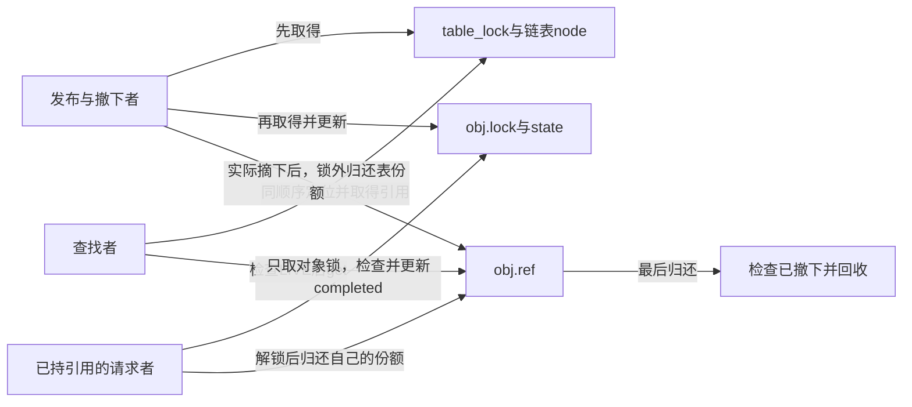
```mermaid
flowchart LR
    P[发布与撤下者] -->|先取得| G[table_lock与链表node]
    P -->|再取得并更新| O[obj.lock与state]
    L[查找者] -->|同顺序定位并取得引用| G
    L -->|检查LIVE后get| R[obj.ref]
    U[已持引用的请求者] -->|只取对象锁，检查并更新completed| O
    P -->|实际摘下后，锁外归还表份额| R
    U -->|解锁后归还自己的份额| R
    R -->|最后归还| F[检查已撤下并回收]
```

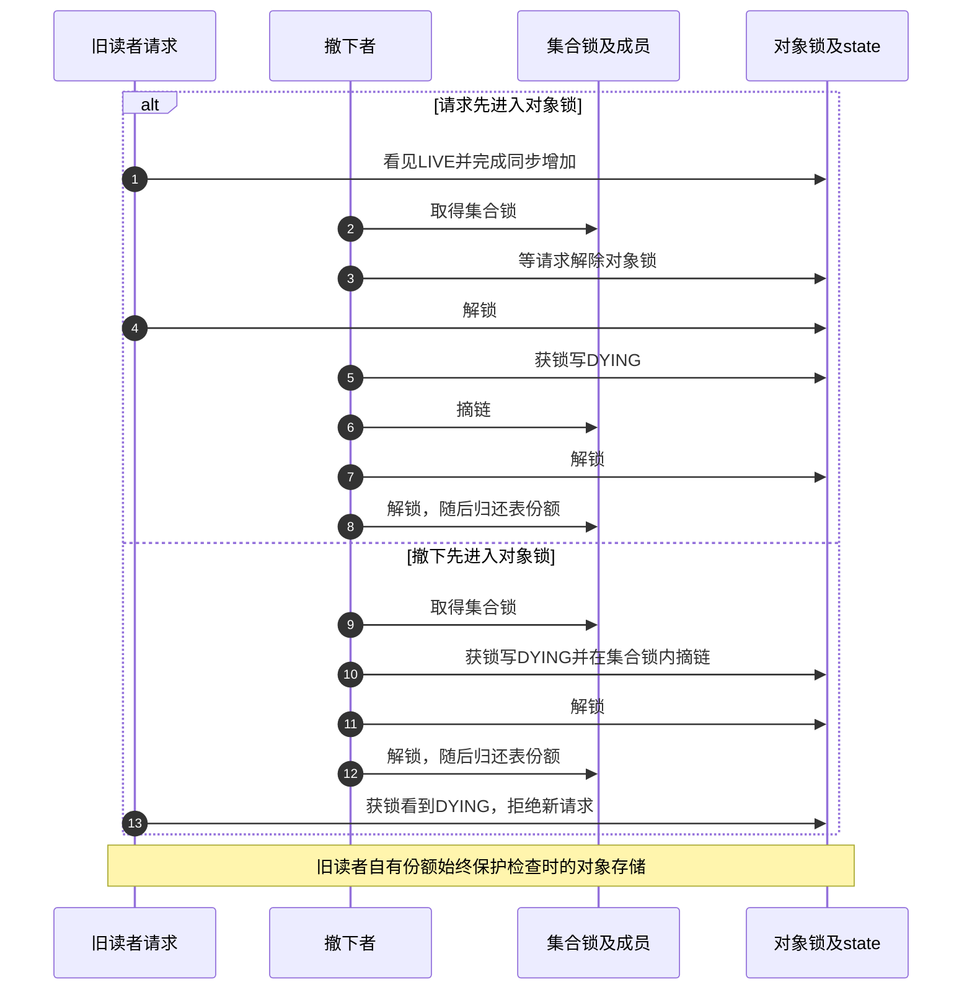
```mermaid
sequenceDiagram
    autonumber
    participant Q as 旧读者请求
    participant U as 撤下者
    participant G as 集合锁及成员
    participant O as 对象锁及state
    alt 请求先进入对象锁
        Q->>O: 看见LIVE并完成同步增加
        U->>G: 取得集合锁
        U->>O: 等请求解除对象锁
        Q->>O: 解锁
        U->>O: 获锁写DYING
        U->>G: 摘链
        U->>O: 解锁
        U->>G: 解锁，随后归还表份额
    else 撤下先进入对象锁
        U->>G: 取得集合锁
        U->>O: 获锁写DYING并在集合锁内摘链
        U->>O: 解锁
        U->>G: 解锁，随后归还表份额
        Q->>O: 获锁看到DYING，拒绝新请求
    end
    Note over Q,O: 旧读者自有份额始终保护检查时的对象存储
```

发布也要处理拒绝。重复发布同一对象违反只发布一次的状态约定，返回 -EINVAL；另一个新对象使用已占编号，则返回 -EEXIST。两者都在 get 之前退出，调用者初始份额始终保留，不需要猜“这次失败是否已经消费”。创建失败返回 -ENOMEM，尚无对象引用可归还。

在材料目录设置匹配构建树的 KDIR，执行 `make -C "$KDIR" M="$PWD" modules`，将 note_kref_table.ko 放到匹配 Linux 实验环境中装卸并读取日志。这里给出的是预期输出：本轮仅完成 ARM 前端和宿主六组顺序检查，目标构建链接与装卸尚未执行。宿主使用实际模块、固定普通引用和链表删除 helper，锁、原子、分配、插入和遍历采用显式顺序替身；检查同节点/同编号拒绝、未发布退出、查找先后、重复移除、关闭后请求、锁顺序与无遗留分配，不声称真实线程竞争或内存序得到验证。

### 9.6.2\_上面模板的锁顺序

publish、lookup、unpublish 在需要两把锁时均为 table_lock→obj.lock；request 只持对象锁，且从不反向进入集合。这样依赖图没有 obj.lock→table_lock 的边。若以后在 request 中调用一个看似普通却内部查表的函数，就必须把它隐含的集合锁也加入检查，不能只看本函数表面。

相较 9.2 的分步关闭，本例以嵌套锁把业务门和成员撤下绑定。代价是撤下者等待对象锁时仍持集合锁，其他对象的查找也可能被它挡住；本例请求很短，所以先选择易于证明的规则。若业务变长，可考虑像 9.2 那样分阶段并明确关闭返回保证，或重新设计保护范围，但不能在拆锁后继续承诺原来那个不可分割的状态变化。

put 都在本路径的对象锁和集合锁解除后执行。release 不再拿这两把锁，也没有异步执行者需要等待；这个简单回收之所以成立，是前面的成员/份额协议和同步业务范围都已落实，不是因为 kfree 本身会处理那些事情。

## 9.7\_错误模型\_注释和检查清单

现在用完整模块反向定位错误。每一项都问“哪一份或哪一把锁提供保证”，而不是看到 get、lock、WARN 都出现就认为安全。

### 9.7.1\_锁组合下的错误模型

#### (1)\_有\_kref\_没字段锁

引用使对象存储存在，却不排斥其他请求者更新 completed。应像 table_request 一样把 state 检查与更新放在同一对象锁里。单纯在写 state 外面补锁也不等于任意把 DYING 改回 LIVE 合法，状态转换还必须符合只发布一次的业务协议。

#### (2)\_有锁\_没\_get\_锁外使用

如果查表仅在集合锁内读地址，返回后没有自己的份额，随后拿 obj.lock 也可能已访问失效存储。修复点在查找窗口里取得，而不是到业务函数开头再补一个无保护 get。

#### (3)\_先\_put\_后\_unlock\_对象锁

普通最后 put 可以直接回收包含锁的外壳，后面的 unlock 会访问失效锁地址。应把当前路径最后一次锁访问放在归还以前；特殊回调接锁必须另有一致契约，不能与本模块普通回调混用。

#### (4)\_remove\_没有先阻止\_lookup

本模块的表拥有一份，所以必须在同锁下摘下，再归还成员份额。若仍在表中就消费那一份，查找的正计数证明消失；若二次 remove 没有实际摘下还继续 put，又会消耗 reader 的份额。不能把计数返回值当作成员归属判断。

#### (5)\_release\_里重新拿外部锁导致死锁

最后 put 会同步进入回调，因此要把回调再取锁和等待的依赖接到调用者已有锁上。本模块避免这个环的方法是锁外归还且 release 不重新取得表锁；非拥有索引采用别的配对协议时，必须重新说明谁取得、谁接管、谁释放。

### 9.7.2\_锁组合设计时要写清楚的注释

对完整模块，可以在代码旁写出下列中文约定。它们描述真实实现，不能只保留“由 lock 保护”而省略对应地址与责任：

```c
/*
 * 存储：发布者最初一份，表在发布成功时新增一份，lookup成功另交付一份。
 * 集合：table_lock保护object_table及每个成员node；id发布以后不再改变。
 * 字段：obj->lock保护state与completed，所有相关读写遵守同一规则。
 * 顺序：需要嵌套时先table_lock、后obj->lock；业务请求不得反向查表。
 * 撤下：持两锁写DYING并摘链；只有实际摘下才在解锁后归还表份额。
 * 参数：按对象地址撤下的调用者另持独立份额，覆盖整个调用。
 * 回收：普通最后put同步调用release；它不再取得上述锁，回收前锁访问已结束。
 * 范围：无异步硬件或worker，只有初始化内的同步实验；不允许重新发布同一对象。
 */
```

代码发生变化时重新核对这些句子。例如新增一个不持对象锁的字段读取、新增一个回调中的查表，都会使原声明失真；注释不能成为忽略新路径的理由。

### 9.7.3\_本章检查清单

沿一次完整操作回答下面的问题，能把答案落到具体字段、函数和分支才算完成：

1. 哪些字段发布前固定，哪些会并发变化，各自由什么保护？
2. 查找的地址窗口覆盖到取得完成了吗，计数为正由谁保证？
3. 集合到底拥有一份还是只作索引，发布失败与重复移除由谁归还？
4. 对象锁自己所在的存储，是否有覆盖每次 lock/unlock 的期限？
5. 嵌套顺序是否在全部调用路径一致，包括同步回调与隐藏的查表函数？
6. 最后归还可能来自哪些上下文，release 的锁、睡眠、等待与回收是否都适用？
7. 成员撤下、业务门关闭和已有执行者退出是否被错误合并，接口保证具体在何时成立？
8. 行为检查、顺序替身、前端编译和目标实际运行各自证明了什么，哪些尚未完成？

不需要为了通过清单给每个对象增加更多锁或更多状态。单一锁、分步双锁和嵌套双锁都可以建立正确协议，选择依据是需要保证的不变量、允许的窗口与实际代价。

## 9.8\_本章小结

本章把“对象还在”和“这次操作一致”拆成两条证明，再通过取得与归还把它们连接起来：集合窗口让地址安全交到独立份额手里，份额覆盖对象锁的使用，业务锁让检查和更新形成完整决定，最后归还则把当前上下文交给回调。

回看两份完整服务程序：9.2 在清入口后再关闭对象门，用原入口份额覆盖中间窗口；9.6 按集合锁→对象锁绑定撤下与关闭决定，代价是等待对象锁时会占着集合锁。9.4 的非拥有索引又改变了最后归还规则，必须让回调接管已经取得的索引锁。它们不是三个可任意拼接的代码片段，而是三套需要完整采用的协议。

做三项渐进练习。先给完整链表模块增加第二个不同编号对象，预测哪个锁会被共享、哪个锁独立；再让第二个对象使用相同编号，检查失败者仍保留自己的初始份额；最后在纸上把 request 改成异步排队，列出新接收责任、拒绝回滚、关闭入口与等待退出还缺哪些状态。前两项可对照已覆盖的宿主分支，第三项仅是设计练习，不能沿用同步模块日志宣称异步退出已经实现。

下一章讨论 RCU 与 kref：取得前的地址窗口不再总是由排他的集合锁提供，回收顺序也会改变，但“自己的一份从哪里来、何时离开保护、谁负责最后回收”的问题仍要逐步回答。

专题导航：[kref 引用计数机制章节大纲](大纲.md)。

上一篇：[lookup 场景与 kref_get_unless_zero()](P08_lookup_场景与_kref_get_unless_zero%28%29.md#8.9_本章小结)。

下一篇：[kref 与 RCU](P10_kref_与_RCU.md#10.1_本章导读_RCU_负责看到_kref_负责带走)。
