# 第9章\_kref\_与锁的组合

## 9.1\_本章定位

P08 已经证明查找者怎样在受保护窗口内取得自己的一份。现在查找返回以后，两个读者都还持有引用，都想执行“把服务计数加一”。对象肯定没有提前释放，可最终结果为什么仍可能不对？再往前一步：关闭者撤下入口以后，怎样阻止这些旧读者继续修改业务字段，而又允许它们安全归还引用？

本章围绕这两个问题建立锁与 kref 的配合。先给状态划分保护范围，再看查找、业务操作与关闭怎样连成一轮；最后检查 put 同步进入 release 时继承了什么锁和上下文。P05 的最后归还锁接口、P06 的回调上下文以及 P08 的地址窗口仍作为先修，不从头重复引用计数原理。

这里的“集合锁”和“对象锁”是 **设计分工的名称**，不是 Linux 两种固定的锁类型。一把 mutex 可以同时保护多个字段与集合；也可以把无关对象的业务分别交给各自的锁。正确性取决于所有访问者是否遵守相同协议，不取决于结构体里恰好有几把锁。

## 9.2\_基本分工\_kref\_管生命周期\_锁管一致性

先保留一个服务对象：共享入口使它可被查找，value 记录已完成的同步操作次数，accepting 决定还接不接新操作。对象中还嵌入 access_lock 和 ref。计数存储与业务状态在同一个分配块内，并不意味着它们自动使用同一种同步规则。

### 9.2.1\_kref\_和锁分别保护什么

假设两个使用者各持一份，却不保护 `++obj->value`。从一次读、计算、写回的逻辑看，可以出现以下交错；这是解释状态丢失的示意，并不是允许在 C 中执行数据竞争的程序：

| 时刻 | 使用者 A | 使用者 B | value |
| --- | --- | --- | --- |
| T0 | 已持一份 | 已持一份 | 0 |
| T1 | 读到 0，准备写 1 | 尚未读取 | 0 |
| T2 | 尚未写回 | 也读到 0，准备写 1 | 0 |
| T3 | 写入 1 | 尚未写回 | 1 |
| T4 | 使用结束 | 写入 1 | 1 |

两份引用保证分配块没被回收，却没有阻止两次修改互相覆盖。真实无同步 C 数据竞争还会带来语言层面的未定义行为，不能承诺它“最多只是丢一次加法”。修复必须让所有相关读写遵守同一字段协议，例如使用 access_lock 把检查 accepting 与增加 value 放在同一个临界区。

另一方面，若只拿嵌在对象里的锁，却没有先证明对象存储有效，执行 mutex_lock 本身就可能访问失效地址。P08 的取得窗口先为调用者建立独立份额，随后才能安全访问对象内部的锁；本次份额应保留到最后一次 unlock 完成以后。

下面复用 P03 的完整 [note_kref_shutdown.c](../../../../labs/kernel/object_lifetime/materials/note_kref_shutdown.c)，从两把锁的职责重新阅读。它只有一个服务槽，全部演示操作在模块初始化中顺序执行，没有外部调用者、异步 work 或实际设备；这样关闭保证能由代码本身说明，而不藏在未定义的 stop_hw 中。

```c
// SPDX-License-Identifier: GPL-2.0
#include <linux/kref.h>
#include <linux/module.h>
#include <linux/mutex.h>
#include <linux/slab.h>

struct service_object {
    int value;
    bool accepting;
    struct mutex access_lock;
    struct kref ref;
};

static DEFINE_MUTEX(entry_lock);
static struct service_object *service_entry;
static unsigned int release_calls;

static void service_release(struct kref *ref)
{
    struct service_object *obj = container_of(ref, struct service_object, ref);
    ++release_calls; /* 本模块仅同步演示，外部计数不作为并发统计接口。 */
    kfree(obj);
}

static void service_put(struct service_object *obj)
{
    if (obj)
        kref_put(&obj->ref, service_release);
}

static struct service_object *service_create(void)
{
    struct service_object *obj = kzalloc(sizeof(*obj), GFP_KERNEL);
    if (!obj)
        return NULL;
    obj->value = 0;
    obj->accepting = true;
    mutex_init(&obj->access_lock);
    kref_init(&obj->ref);
    return obj;
}

/* 成功接管调用者现有的一份，失败不接管；仅发布全新且未发布的对象。 */
static int service_publish_take(struct service_object *obj)
{
    int result = 0;
    mutex_lock(&entry_lock);
    if (service_entry)
        result = -EEXIST;
    else
        service_entry = obj;
    mutex_unlock(&entry_lock);
    return result;
}

static struct service_object *service_lookup(void)
{
    struct service_object *obj;
    mutex_lock(&entry_lock);
    obj = service_entry;
    if (obj)
        kref_get(&obj->ref); /* 可见期间入口拥有正引用。 */
    mutex_unlock(&entry_lock);
    return obj;
}

/* 调用者已有独立引用；检查与整个操作必须在同一保护窗口中。 */
static int service_step(struct service_object *obj, int *result_value)
{
    int result = 0;
    mutex_lock(&obj->access_lock);
    if (!obj->accepting)
        result = -ESHUTDOWN;
    else
        *result_value = ++obj->value;
    mutex_unlock(&obj->access_lock);
    return result;
}

/* 单一管理者负责关闭，关闭期间不重新发布；不支持并发关闭者充当屏障。 */
static void service_shutdown(void)
{
    struct service_object *obj;
    mutex_lock(&entry_lock);
    obj = service_entry;
    service_entry = NULL;
    mutex_unlock(&entry_lock);
    if (!obj)
        return;
    /* 原入口份额暂归管理者，保护下面访问对象内部的锁。 */
    mutex_lock(&obj->access_lock);
    obj->accepting = false;
    mutex_unlock(&obj->access_lock);
    service_put(obj); /* 锁已退出；最后回调不会销毁仍被本路径使用的锁。 */
}

static int __init note_shutdown_init(void)
{
    struct service_object *creator = service_create();
    struct service_object *reader;
    int result, before_value = -1, after_value = -1;
    if (!creator)
        return -ENOMEM;
    result = service_publish_take(creator);
    if (result) {
        service_put(creator); /* 发布拒绝，初始份额仍在当前路径。 */
        return result;
    }
    creator = NULL; /* 责任已转交，不再依初始份额访问。 */
    reader = service_lookup();
    if (!reader) {
        service_shutdown();
        return -ENOENT;
    }
    result = service_step(reader, &before_value);
    pr_info("note_shutdown: before result=%d value=%d\n", result, before_value);
    service_shutdown();
    result = service_step(reader, &after_value);
    pr_info("note_shutdown: after result=%d value=%d\n", result, after_value);
    service_put(reader);
    return 0;
}

static void __exit note_shutdown_exit(void)
{
    /* 没有导出入口、工作或外部读者，所有责任在 init 返回前结束。 */
    pr_info("note_shutdown: release_calls=%u\n", release_calls);
}

module_init(note_shutdown_init);
module_exit(note_shutdown_exit);
MODULE_LICENSE("GPL");
MODULE_DESCRIPTION("业务关闭与引用退出分层实验");
```

service_step 的业务操作只是“检查是否接纳并增加一次整数值”。因为它全部在 access_lock 中完成，关闭者拿到同锁时，之前已进入的这次同步操作已经离开；关闭者写 false 后才进入的操作则返回 -ESHUTDOWN。不要把这个小结论推广成“只要关一个 bool，所有 DMA/work 都已退出”；异步对象还需要 P06 已讲过的排空或责任交付。

| 阶段 | 触发动作 | 状态地址、锁与责任 | 完成条件 |
| --- | --- | --- | --- |
| S0 私有创建 | 创建者分配初始化 | obj.value=0、accepting=true、初始化 access_lock 与 ref=1 | 发布前字段已准备好 |
| S1 发布 | publish_take 持 entry_lock 写 service_entry | 成功把初始份额交给入口，计数不增加；拒绝仍由创建者持有 | 入口可见或明确拒绝 |
| S2 取得 | lookup 持 entry_lock 读槽并 get | 入口仍拥有一份，读者得到另一份 | 解锁后读者可访问对象锁 |
| S3 业务 | step 持 obj.access_lock 读 accepting、改 value | 读者的份额保护对象存储，同锁保护业务决策和写入 | 操作完成并解锁，或拒绝且不改 value |
| S4 关闭 | shutdown 先清入口，再取对象锁写 false | 原入口份额暂由管理者持有，保障两个临界区之间的地址期限 | 业务门已关闭并解锁，再归还管理者份额 |
| S5 回收 | 最后使用者归还 | ref 正常归零同步进入 release，外部 release_calls 记录后回收 | 无本协议内继续访问者 |

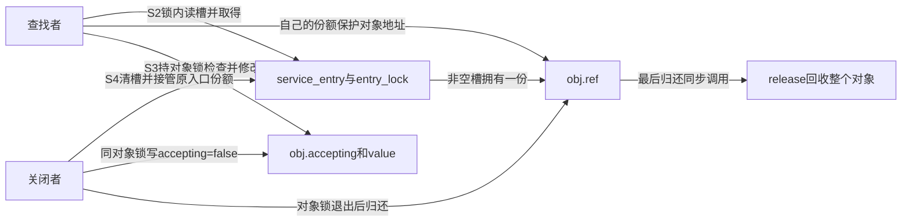
```mermaid
flowchart LR
    E[service_entry与entry_lock] -->|非空槽拥有一份| R[obj.ref]
    L[查找者] -->|S2锁内读槽并取得| E
    L -->|自己的份额保护对象地址| R
    L -->|S3持对象锁检查并修改| V[obj.accepting和value]
    D[关闭者] -->|S4清槽并接管原入口份额| E
    D -->|同对象锁写accepting=false| V
    D -->|对象锁退出后归还| R
    R -->|最后归还同步调用| F[release回收整个对象]
```

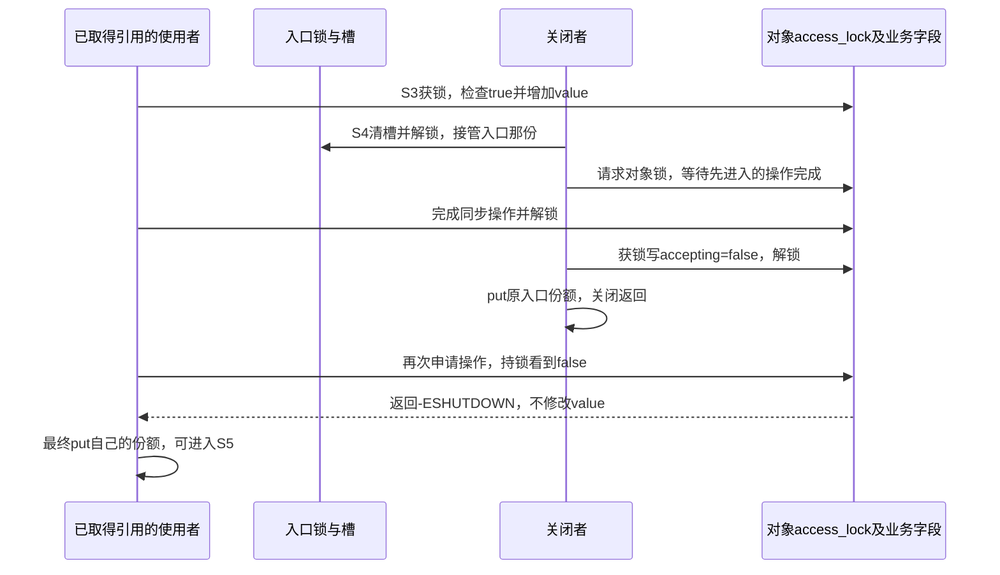
```mermaid
sequenceDiagram
    participant L as 已取得引用的使用者
    participant E as 入口锁与槽
    participant D as 关闭者
    participant A as 对象access_lock及业务字段
    L->>A: S3获锁，检查true并增加value
    D->>E: S4清槽并解锁，接管入口那份
    D->>A: 请求对象锁，等待先进入的操作完成
    L->>A: 完成同步操作并解锁
    D->>A: 获锁写accepting=false，解锁
    D->>D: put原入口份额，关闭返回
    L->>A: 再次申请操作，持锁看到false
    A-->>L: 返回-ESHUTDOWN，不修改value
    L->>L: 最终put自己的份额，可进入S5
```

entry_lock 的解锁/取得传递发布状态，access_lock 的解锁/取得传递业务结果和关闭决定，ref 的原子存储结算总份数。读者没有因为 kref_get 自动收到“关闭了”的通知，而是在每次操作的门锁内读取 accepting。正常操作成本是取得对象锁和读写这组共享字段，关闭路径则有清入口、等待已进入同步操作和归还原入口份额的成本。

沿材料目录已有构建方法设置 KDIR，构建模块并在匹配目标装卸 note_kref_shutdown.ko。正常预期是关闭前 result=0、value=1；关闭后 result=-ESHUTDOWN（该 Linux 错误码为 108，所以日志为 -108）、输出参数仍为初始化的 -1；最终 release_calls=1。value 的真实内容没有因拒绝改成 -1，-1 是调用者输出变量保持不变。这一点也应从 service_step 的赋值分支读出来。

既有 ARM 前端和八组顺序替身证据保留，本次复用程序没有改变行为；目标链接、装卸和真实双线程竞争仍未执行。练习时先把第二次 service_step 移到 shutdown 之前，预测输出值会继续增加；再只在纸上把“检查 accepting”移到锁外，补出读到 true 后关闭者先写 false、旧请求却继续执行的交错，不运行这个有竞争的版本。

### 9.2.2\_两类锁\_集合锁和对象锁

#### (1)\_集合锁

本例 entry_lock 保护 service_entry 以及从这个入口取得或撤下那份责任的窗口。若将槽换成链表，则对应表头、节点链接、成员状态和查找过程；哪些对象有几份引用仍由发布/撤下协议维护，不是 mutex 自带的功能。

查找时只需入口锁，不必拿业务锁：本接口承诺返回一份，并没有承诺本次业务一定获准。关闭者清槽后保留原入口那一份，才可以解除入口锁并安全地继续访问对象。这个中间份额是拆开两个临界区的依据，不能以“反正马上拿另一把锁”替代。

#### (2)\_对象锁

access_lock 保护 accepting 与 value 的读写，以及“检查允许→实际同步操作”这一完整决策。它放在对象内部，所以每个独立对象可以有自己的业务门；对不同对象的业务操作不必为了改 value 一直占住同一个全局入口锁。

id 若在发布前固定且之后不变，可以按发布/取得协议读取，不必强行增加一把 id 锁。state、enabled、flags 等可变字段则应按真实不变量选择同锁：若几个字段必须一起变化，把它们拆给互不关联的锁反而会让观察者看见不一致组合。锁按状态关系分工，不按字段数量分配。

#### (3)\_两者不能混用

**原有人工批注保留：**

> <span style="color:red;">说实话，我完全不认同这个ai总结的小结。不过我又觉得这个标题是需要提醒做到对锁职权分离的。所以保留下来。</span>

这条批注指出了原标题容易造成的误解。应把“不能混用”理解为 **不能让不同访问者各自猜一把锁来保护同一不变量**，不能理解为“集合和字段永远必须分成两把锁”。若所有相关路径都采用一个全局锁，它完全可以同时保护集合与业务字段；其代价是本可独立的对象操作也会串行。是否拆锁，要由共享状态与负载决定。

反例中的 `mutex_lock(&obj->lock); list_del_init(...);` 只有在其他链表操作采用另一把互不协调的全局锁时才违反协议；不是因为函数名叫对象锁就天然无权修改 node。同样，只拿集合锁写 state 是否正确，要看其他 state 访问者是否也遵守它。不要把位置或命名当成同步证明。

本例选择两个互不嵌套的临界区，因此没有 entry_lock→access_lock 的同时持锁依赖。代价是“入口刚撤下、业务门还没关”之间存在窗口：旧引用使用者仍可能在关闭者获得 access_lock 前完成一次同步操作。接口保证的是 **shutdown 返回时门已关闭且先进入的同步操作已退出**，不承诺清槽瞬间就停止一切旧操作。单一管理者、关闭期间不重新发布也是该保证的前提；并发第二个 shutdown 看到空槽提前返回，不能被当成第一个关闭者已经完成的屏障。

若业务要求“撤下入口与禁止旧引用新操作必须作为一个原子决策”，就要使用共同的门锁或建立明确的嵌套锁顺序，并重新检查所有读写者。本章后续将比较这种组合及最后归还触发回调的路径，而不是从一开始规定所有对象必须采用同一套锁布局。

## 9.3\_lookup\_remove\_和状态\_锁与\_kref\_的常规配合

先把上一节完整服务模块的规则迁移到链表。这里选择拥有型集合：每个成功发布的成员有集合的一份，查找在同锁内追加读者的一份，删除只归还实际摘下成员的那一份。非拥有索引另有 P08 已讲清的回调摘链协议，不能把两套前提拼接起来。

这一轮需要分别回答三个问题：查找怎样从入口锁交接到独立引用，删除怎样从成员关系交接到待归还份额，业务操作怎样在自己的份额有效期间使用对象锁。前两种交接改变责任方，第三种只改变业务状态，不自动改变引用数。

### 9.3.1\_lookup\_时\_锁保护\_get\_前窗口

当 list_lock 保持持有且对象仍在拥有型链表中，删除者不能摘下并归还成员份额，因此计数仍正，普通 get 有依据。这把锁没有代替 kref 的原子增加；它保护的是从读取成员地址到新增责任成立的整段窗口。

```c
/* 配对片段：所有成员变化依同一list_lock，成员自己拥有一份。 */
static struct my_obj *lookup_get(int id)
{
    struct my_obj *obj, *found = NULL;
    mutex_lock(&list_lock);
    list_for_each_entry(obj, &object_list, node) {
        if (obj->id != id)
            continue;
        kref_get(&obj->ref);
        found = obj;
        break;
    }
    mutex_unlock(&list_lock);
    return found; /* 非空时交付一份，NULL时没有归还义务。 */
}
```

函数返回后 list_lock 已不在，读者的份额接续对象存储期限。如果删除先完成，查找只会看见没有该成员；如果查找先完成，删除只会归还集合的一份，不能消耗读者的一份。只锁读指针、解锁后再 get，会破坏这次交接。

对象锁并没有参与这次查询，原因是本接口没有读取由它保护的业务字段。若接口还要检查接纳状态，必须按该状态的实际保护规则增加相应窗口，而不是因为名为 lookup 就禁止取得另一把锁。后面双状态模型将具体说明这项选择。

### 9.3.2\_remove\_时\_先\_unlink\_再\_put\_但必须匹配集合引用

以下讨论唯一拥有型链表的成员引用；按对象地址调用 remove 的路径须另有一份或等效期限保证，覆盖本次调用。所谓允许重复 remove，不允许重复使用已经释放的对象地址。已有讲清的逐步解释保留如下。

对象从集合中删除时，常见顺序是：

```text
先从集合中撤销可见性；（避免并发时，被别的地方从列表找到需要被ut的节点。针对最后一个引用释放）
再释放集合持有的引用。
```

也就是：

```text
unlink first, put later.
```

但是这句话还不完整。

更准确的规则应该是：

```text
unlink first, put later;
unlink once, put once.
```

也就是说：

```text
只有本次 remove 确实撤销了集合中的可见性，
才能释放集合持有的那一份引用。
```

如果对象根本不在集合中，却仍然调用 `kref_put()`，就不是“正常 remove”，而是多释放了一次引用。

------

假设对象结构如下：

```c
struct my_obj {
	struct kref ref;
	struct list_head node;
	int id;
};
```

对象初始化时，`node` 应该先初始化为空链表节点：

```c
void my_obj_init(struct my_obj *obj)
{
	kref_init(&obj->ref);
	INIT_LIST_HEAD(&obj->node);
}
```

如果集合会长期持有对象，那么对象加入集合时，集合应当获得一份引用：

```c
void my_obj_add(struct my_obj *obj)
{
	kref_get(&obj->ref);		/* 集合获得一份引用 */

	mutex_lock(&my_obj_list_lock);
	list_add(&obj->node, &my_obj_list);
	mutex_unlock(&my_obj_list_lock);
}
```

对应地，移出集合时，集合应该释放这份引用。

------

错误写法：

```c
void my_obj_remove(struct my_obj *obj)
{
	mutex_lock(&my_obj_list_lock);

	if (!list_empty(&obj->node))
		list_del_init(&obj->node);

	mutex_unlock(&my_obj_list_lock);

	kref_put(&obj->ref, my_obj_release);
}
```

这段代码的问题不在于没有检查 `kref_put()` 的返回值。

`kref_put()` 的返回值表示：

```text
这次 put 是否导致引用计数归零，并触发 release。
```

它不能回答：

```text
这次 remove 是否真的删除了集合节点？
这次 put 是否真的对应集合持有的那份引用？
```

真正的问题是：

```text
即使 obj->node 已经不在 list 中，
代码仍然会调用 kref_put()。
```

这会导致：

```text
没有 unlink；
却执行了 put。
```

也就是：

```text
没有撤销集合引用；
却释放了一次集合引用。
```

如果 `remove` 被重复调用，第二次调用就可能造成引用计数失衡：

```text
第一次 remove:
    list_del_init()
    kref_put()      正确释放集合引用

第二次 remove:
    list_empty() 为 true
    没有 list_del_init()
    仍然 kref_put()  多 put 一次
```

严重时会导致对象提前释放、UAF 或 double put。

------

更稳妥的写法是记录本次是否真的删除了节点：

```c
void my_obj_remove(struct my_obj *obj)
{
	bool removed = false;

	mutex_lock(&my_obj_list_lock);

	if (!list_empty(&obj->node)) {
		list_del_init(&obj->node);
		removed = true;
	}

	mutex_unlock(&my_obj_list_lock);

	if (removed)
		kref_put(&obj->ref, my_obj_release);
}
```

这个版本表达的语义是：

```text
只有本次确实从集合中 unlink 了 obj，
才释放集合持有的那份引用。
```

流程如下：

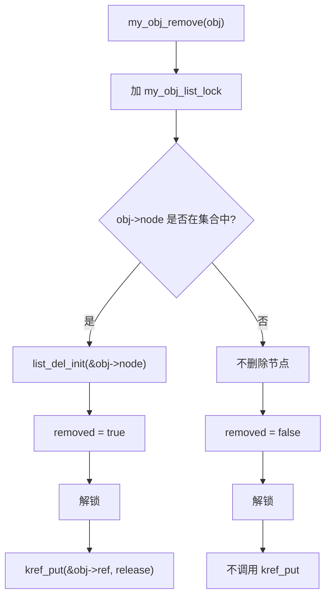
```mermaid
flowchart TD
    A["my_obj_remove(obj)"] --> B["加 my_obj_list_lock"]
    B --> C{"obj->node 是否在集合中?"}

    C -- "是" --> D["list_del_init(&obj->node)"]
    D --> E["removed = true"]
    E --> F["解锁"]
    F --> G["kref_put(&obj->ref, release)"]

    C -- "否" --> H["不删除节点"]
    H --> I["removed = false"]
    I --> J["解锁"]
    J --> K["不调用 kref_put"]
```

这时生命周期关系是匹配的：

```text
list_del_init() 成功一次；
集合引用 put 一次。
```

------

不过，工程里还要区分两种 remove 语义。

第一种是**幂等 remove**。

也就是允许重复调用：

```text
对象在集合中：删除并 put；
对象不在集合中：什么也不做。
```

这种情况下可以使用 `removed` 标志：

```c
void my_obj_remove(struct my_obj *obj)
{
	bool removed = false;

	mutex_lock(&my_obj_list_lock);

	if (!list_empty(&obj->node)) {
		list_del_init(&obj->node);
		removed = true;
	}

	mutex_unlock(&my_obj_list_lock);

	if (removed)
		kref_put(&obj->ref, my_obj_release);
}
```

第二种是**非幂等 remove**。

也就是调用者必须保证：

```text
obj 当前一定在集合中；
remove 只能调用一次；
重复 remove 是调用路径 bug。
```

这种情况下，不应该悄悄吞掉错误，而应该暴露错误：

```c
void my_obj_remove(struct my_obj *obj)
{
	mutex_lock(&my_obj_list_lock);

	if (WARN_ON_ONCE(list_empty(&obj->node))) {
		mutex_unlock(&my_obj_list_lock);
		return; /* 告警不会自动终止控制流，不能继续消耗不存在的成员份额。 */
	}
	list_del_init(&obj->node);

	mutex_unlock(&my_obj_list_lock);

	kref_put(&obj->ref, my_obj_release);
}
```

本版在告警条件成立时明确返回。WARN_ON_ONCE 自身只是诊断表达式，不会替调用者中止后面的 list_del_init 和 put；不能把诊断当成错误恢复。

这个版本的含义是：

```text
remove 必须对应一个真实存在的集合引用；
如果 obj 不在集合中，说明调用路径已经错了。
```

------

无论采用哪种写法，都必须保证所有修改 `obj->node` 的路径使用同一把锁保护：

```text
lookup；
add；
remove；
遍历；
销毁前 unlink；
```

否则一个 CPU 判断 `!list_empty()` 的同时，另一个 CPU 也可能删除同一个节点，最终仍然会出现重复 unlink 或重复 put。

所以集合删除的核心规则是：

```text
集合可见性和集合引用必须绑定。
```

可以总结成表：

| 操作              | 集合可见性               | 集合引用            |
| ----------------- | ------------------------ | ------------------- |
| `list_add()`      | 对 lookup 可见           | 集合获得 1 份引用   |
| `list_del_init()` | 对 lookup 不可见         | 集合释放 1 份引用   |
| 没有 unlink       | 集合状态未变化           | 不应该 put 集合引用 |
| 重复 remove       | 第二次没有集合引用可释放 | 再 put 就是 bug     |

最终结论：

```text
remove 的顺序是 unlink first, put later；
但 put 的前提是本次 remove 确实撤销了集合持有的引用。
```

更短的工程口诀是：

```text
unlink once, put once.
```

---

### 9.3.3\_put\_前后访问字段的边界

继续使用自己查找得到的那一份，典型顺序是“持对象锁修改字段→解锁→归还自己的份额”。每一步都有不同的依据：引用保护锁和字段所在的分配块，锁保护这次字段变化，解锁完成以后才允许这条路径放弃存储保证。

```c
/* 当前路径持有一份，state的全部读写都遵守obj->lock。 */
mutex_lock(&obj->lock);
obj->state = OBJ_DONE;
mutex_unlock(&obj->lock);
object_put(obj);
```

若把 put 提到最前面，随后连 mutex_lock 所访问的锁地址都可能已释放；若 put 放到 unlock 之前，unlock 仍要访问嵌在对象里的锁。普通 put 可能同步执行 release，不能把调用返回以前视作对象当然还在。

“put 后不能访问”针对的是本次已经归还的保护依据，不是否认独立第二份或明确的外层借用窗口。若当前路径确实保留另一份，可以按那一份继续；评审必须指出它的来源，不能用“别人应该还持有”或一次计数快照代替。

### 9.3.4\_持有引用只保证生命周期\_不保证字段互斥

两个查找者各有一份，所以双方访问的对象都还在；但他们仍可以竞争同一个 state 或 value。对同一不变量的所有读者和写者都要使用约定的锁，不能只有写方加锁，读方凭“我只是看一眼”跳过。

```c
/* 片段：lookup_get交付一份，业务决策和修改都在字段锁内完成。 */
obj = lookup_get(id);
if (!obj)
    return -ENOENT;
mutex_lock(&obj->lock);
if (obj->state == OBJ_IDLE)
    obj->state = OBJ_RUNNING;
else
    result = -EBUSY;
mutex_unlock(&obj->lock);
object_put(obj);
```

此处 result 由调用者预置为 0，片段仅展示状态许可；真实启动若包含硬件或异步任务，还须定义失败回滚与关闭流程。状态锁消除了这次检查与写入之间的竞争，不会把一个枚举赋值自动变成完整业务操作。

发布后不再变化的 id 可以按发布协议读取，某些字段也可以采用独立的原子或其他同步方案。因此结论是“遵守字段同步协议”，不是无条件要求每一次读取都额外拿 mutex。

### 9.3.5\_锁内只能借用指针\_锁外必须持有引用

原标题提醒读者不要把临时地址带出保护窗口，但“只能”和“必须”需要限定场景。在本章拥有型集合中，如果调用者原先没有别的保护，只依集合锁读到一个地址，那么锁内可以借用；要把对象交到锁外使用，就必须先取得自己的份额。

```c
/* find_locked只借出地址；锁内复制一个不可变编号，不带走对象。 */
mutex_lock(&list_lock);
obj = find_locked(id);
if (obj)
    copied_id = obj->id;
mutex_unlock(&list_lock);
/* 后续仅使用copied_id，不能再凭这次借用访问obj。 */
```

锁内也可以已经持有独立引用，两者并不互斥；锁外也可能处于明确的外层借用协议，例如管理者保有一份并等待借用 worker 完成。P06 的完整管理者模块就属于后一种。把这些前提省略后写成“所有锁外指针都必须由当前线程 get”，会把 P07 合法借用和转交误判为错误。

决定能否跨窗口的不是指针放在栈上还是结构体里，而是保护期限。准备把指针放到异步参数时，须指出新增份额、转交份额或覆盖执行全程的借用者；仅保存地址不产生期限。

### 9.3.6\_集合引用模型

拥有型集合适合需要独立发布/撤下的对象：成功发布交给集合一份；只要成员仍在，集合的一份就保证它不是零计数对象；查找锁内可普通 get。代价是退出必须有显式移除路径，否则最后一个外部使用者离开以后，集合的一份仍会保留对象。

完整槽程序、链表迁移片段和整数索引模块已经在[P08](P08_lookup_场景与_kref_get_unless_zero%28%29.md#8.3_基础保护模型_锁保护容器_kref_保护生命周期)建立。本节沿同一模型检查三个决策点，而不再给一组与前文退出规则冲突的重复函数：

| 决策 | 成功后的责任 | 拒绝或重复调用 |
| --- | --- | --- |
| 追加式发布 | 集合新增一份，调用者保留原份额 | 拒绝退回预留，不消耗原份额 |
| 接管式发布 | 原指定份额交给集合，计数可不变 | 按本例契约，失败不消费 |
| 成员移除 | 本次取得成员份额，解锁后归还 | 没有实际移除就没有那份可归还 |

集合不会因调用 list_add 自动 get；表格写的是应用协议。一个对象若有多个索引，应分别登记每个拥有型索引的份额；若索引只借用，必须另外建立 8.4 的零计数与地址保护规则。

非拥有索引并非天然错误，它适合最后外部使用者离开后自动从索引退出的设计；代价是最后归还必须与查找串行，或者查找使用条件取得、回调在同锁下才能回收。选择两者要看发布/撤下职责，不能按“哪个少一次 get”孤立比较。

接下来给成员可见性与业务运行分别命名。两组状态可以处于不同保护范围，但跨组决策仍须有一条完整的同步路径。

### 9.3.7\_对象状态\_集合锁与对象锁组合

上一节把查找交给独立引用，把业务读写交给字段锁。现在给状态命名：这不是一个枚举从头走到尾的单一状态机，而是成员可见性、业务运行与引用责任三组正交状态共同组成的协议。必须先说明每组状态的地址和写入者，再看一次完整周期。

但是状态字段不能随便设计。

在工程里，至少要先区分两类状态：

```text
生命周期状态：
    描述对象是否已经发布、是否还能被 lookup 找到、是否正在退出。

业务运行状态：
    描述对象内部业务是否空闲、运行、停止、出错。
```

这两类状态的保护方式不同。

生命周期状态通常和集合关系绑定。
业务运行状态通常和对象内部字段绑定。

因此可以把对象设计成：

```c
enum my_obj_life_state {
	MY_OBJ_NEW,
	MY_OBJ_LIVE,
	MY_OBJ_DYING,
	MY_OBJ_DEAD,
};

enum my_obj_run_state {
	MY_OBJ_IDLE,
	MY_OBJ_RUNNING,
	MY_OBJ_STOPPING,
	MY_OBJ_ERROR,
};

struct my_obj {
	int id;

	struct kref ref;

	/*
	 * node 和 life_state 由 my_obj_list_lock 保护。
	 *
	 * 它们共同表达：
	 *     对象是否在全局集合中；
	 *     对象是否允许被新的 lookup 找到。
	 */
	struct list_head node;
	enum my_obj_life_state life_state;

	/*
	 * run_state 和其他业务字段由 obj->lock 保护。
	 *
	 * 它们表达：
	 *     对象内部业务是否正在运行；
	 *     对象内部资源是否处于一致状态。
	 */
	struct mutex lock;
	enum my_obj_run_state run_state;

	/* 其他业务字段 */
};
```

这里采用的 life_state 只表示成员发布/撤下阶段，不能单独证明业务已停止；run_state 只表示本例同步业务状态，不能证明对象还在表中。id 在发布前写入并保持不变。本节是配对接口模型，完整可构建起点仍为 9.2 的服务模块；以下 start/stop 只演示同步状态转换，不冒充真实 DMA 或 work 关闭。

这里有三条分工：

| 机制               | 保护内容                       |
| ------------------ | ------------------------------ |
| `my_obj_list_lock` | 全局链表、`node`、`life_state` |
| `obj->lock`        | 对象内部业务字段、`run_state`  |
| `kref`             | 对象内存生命周期               |

一句话：

```text
list_lock 决定对象能不能被找到；
obj->lock 决定对象内部业务状态是否一致；
kref 决定对象内存能不能活到使用结束。
```

------

沿同一 S0～S5 阅读这组接口，注意本模型的 S4 只撤下成员，是否还要业务关闭由外层流程决定：

| 阶段 | 触发与写入者 | 状态地址和变化 | 同步及退出 |
| --- | --- | --- | --- |
| S0 | alloc 私有初始化 | life_state=NEW，run_state=IDLE，ref=1，node自链接 | 尚未发布，无共享读者 |
| S1 | publish | list_lock内追加集合一份，NEW→LIVE并挂链 | 后续lookup依同锁观察，拒绝不追加 |
| S2 | lookup | list_lock内比较id与LIVE，再get | 调用者独立份额接续到锁外 |
| S3 | start/stop | obj.lock内检查并改变run_state | 本节仅同步状态模型，不创建异步活动 |
| S4 | remove_by_id | list_lock内LIVE→DYING并摘链，记录待归还份额 | 本页保留双锁写段，顺序为集合锁→对象锁；解除两锁后put |
| S5 | 最后put触发release | 最后责任退出，检查节点、写DEAD并回收 | 此时正常协议下无其他读写者；创建未发布也可直接走此阶段 |

因而 LIVE+IDLE、LIVE+RUNNING、DYING+RUNNING 都可能有意义。最后一种说明入口已撤下，但本节并没有宣称业务停止；若产品要求撤下以后旧用户也不能启动，必须补业务门，不能靠 life_state 的名字猜保证。

#### (1)\_生命周期状态必须和集合动作绑定

如果 `life_state` 表示对象能不能被 lookup 找到，那么它就应该和 `node` 放在同一个保护域里。

也就是说：

```text
MY_OBJ_LIVE 绑定 list_add()；
MY_OBJ_DYING 绑定 list_del_init()。
```

不要把 `life_state` 当成一个可以随便单独修改的字段。

生命周期流转如下：

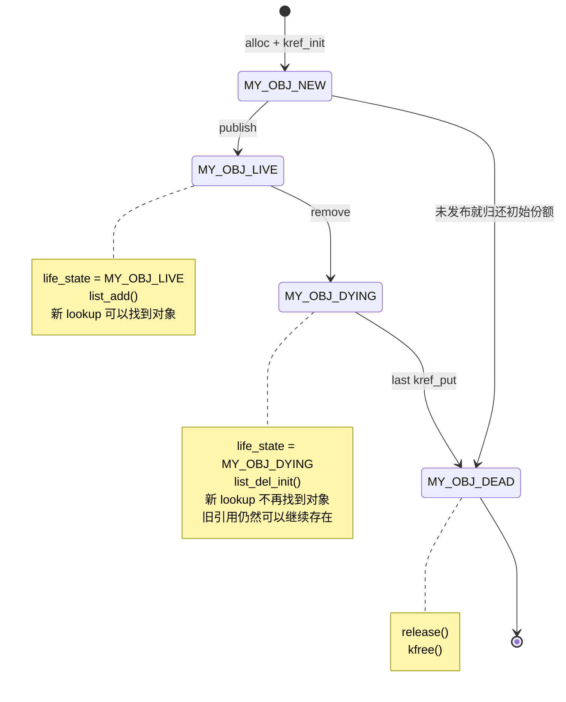
```mermaid
stateDiagram-v2
    [*] --> MY_OBJ_NEW: alloc + kref_init

    MY_OBJ_NEW --> MY_OBJ_LIVE: publish
    MY_OBJ_NEW --> MY_OBJ_DEAD: 未发布就归还初始份额
    note right of MY_OBJ_LIVE
        life_state = MY_OBJ_LIVE
        list_add()
        新 lookup 可以找到对象
    end note

    MY_OBJ_LIVE --> MY_OBJ_DYING: remove
    note right of MY_OBJ_DYING
        life_state = MY_OBJ_DYING
        list_del_init()
        新 lookup 不再找到对象
        旧引用仍然可以继续存在
    end note

    MY_OBJ_DYING --> MY_OBJ_DEAD: last kref_put
    note right of MY_OBJ_DEAD
        release()
        kfree()
    end note

    MY_OBJ_DEAD --> [*]
```

这里要注意：

```text
对象进入 MY_OBJ_DYING，不代表对象内存已经释放；
它只代表对象已经从全局集合撤销，不再接受新的 lookup。
```

真正释放发生在最后一个引用释放之后。

------

#### (2)\_创建对象\_只有初始引用\_还没有发布

创建对象时，调用者拿到初始引用。

```c
struct my_obj *my_obj_alloc(int id)
{
	struct my_obj *obj;

	obj = kzalloc(sizeof(*obj), GFP_KERNEL);
	if (!obj)
		return NULL;

	obj->id = id;

	kref_init(&obj->ref);

	INIT_LIST_HEAD(&obj->node);
	obj->life_state = MY_OBJ_NEW;

	mutex_init(&obj->lock);
	obj->run_state = MY_OBJ_IDLE;

	return obj;
}
```

此时对象状态是：

```text
调用者持有初始引用；
对象还没有进入全局链表；
lookup 找不到它；
life_state == MY_OBJ_NEW。
```

------

#### (3)\_发布对象\_让全局集合持有一份引用

如果对象加入全局链表，并且之后可以通过 lookup 找到，那么全局链表本身应该持有一份引用。

发布动作可以写成：

```c
int my_obj_publish(struct my_obj *obj)
{
	struct my_obj *candidate;
	int ret = 0;

	/*
	 * 调用者必须已经持有 obj 的有效引用。
	 */

	mutex_lock(&my_obj_list_lock);

	if (obj->life_state != MY_OBJ_NEW) {
		ret = -EINVAL;
		goto out;
	}

	if (!list_empty(&obj->node)) {
		ret = -EINVAL;
		goto out;
	}

	/* 编号是本索引的唯一键，重复编号不得形成含糊查找结果。 */
	list_for_each_entry(candidate, &my_obj_list, node) {
		if (candidate->id == obj->id) {
			ret = -EEXIST;
			goto out;
		}
	}

	/*
	 * 从这里开始，list 持有一份引用。
	 * 只要 obj 还在 my_obj_list 中，这份引用就托住对象内存。
	 */
	kref_get(&obj->ref);

	obj->life_state = MY_OBJ_LIVE;
	list_add(&obj->node, &my_obj_list);

out:
	mutex_unlock(&my_obj_list_lock);
	return ret;
}
```

这个函数表达的是一个完整动作：

```text
publish =
    list 获得引用
    life_state = MY_OBJ_LIVE
    list_add()
```

这三件事应该在同一个集合锁保护下完成。

------

#### (4)\_lookup\_只从集合中取得\_LIVE\_对象

因为 `node` 和 `life_state` 都由 `my_obj_list_lock` 保护，所以 lookup 不需要拿 `obj->lock`。

```c
struct my_obj *my_obj_lookup_get_live(int id)
{
	struct my_obj *obj;
	struct my_obj *ret = NULL;

	mutex_lock(&my_obj_list_lock);

	list_for_each_entry(obj, &my_obj_list, node) {
		if (obj->id != id)
			continue;

		if (obj->life_state == MY_OBJ_LIVE) {
			/*
			 * obj 仍在 list 中；
			 * list 持有对象引用；
			 * my_obj_list_lock 持有期间，obj 不会被 unlink + put；
			 * 所以这里 kref_get 是安全的。
			 */
			kref_get(&obj->ref);
			ret = obj;
		}

		break;
	}

	mutex_unlock(&my_obj_list_lock);

	return ret;
}
```

这个函数的语义是：

```text
如果对象仍然对 lookup 可见，就返回一份新的引用；
如果对象不存在，或者已经从集合中撤销，就返回 NULL。
```

调用者拿到对象后，必须负责释放引用：

```c
obj = my_obj_lookup_get_live(id);
if (!obj)
	return -ENOENT;

ret = my_obj_do_something(obj);

kref_put(&obj->ref, my_obj_release);
```

这里的 `LIVE` 只表示：

```text
对象仍然在全局集合中；
新的 lookup 允许拿到它。
```

它不表示：

```text
对象内部业务一定正在运行；
对象一定可以执行任意操作。
```

业务状态要在后续操作里用 `obj->lock` 判断。

------

#### (5)\_remove\_从集合中撤销对象

如果删除入口是按 `id` 删除，那么函数应该写成 `remove_by_id()`。

它和 `lookup_get_live()` 是对称的：
一个负责从集合中取得引用，另一个负责从集合中撤销可见性。

```c
int my_obj_remove_by_id(int id)
{
	struct my_obj *obj;
	struct my_obj *obj_to_put = NULL;
	int ret = -ENOENT;

	mutex_lock(&my_obj_list_lock);

	list_for_each_entry(obj, &my_obj_list, node) {
		if (obj->id != id)
			continue;

		if (obj->life_state != MY_OBJ_LIVE) {
			ret = -EINVAL;
			break;
		}

		/*
		 * remove 是一个完整动作：
		 *
		 *     life_state = MY_OBJ_DYING
		 *     list_del_init()
		 *
		 * 这两件事都由 my_obj_list_lock 保护。
		 */
         mutex_lock(&obj->lock);
		obj->life_state = MY_OBJ_DYING;
		list_del_init(&obj->node); // 防止外部对象通过node查找链表，所以和状态修改合一起
         mutex_unlock(&obj->lock);

		/*
		 * list 原本持有一份引用。
		 * 从 list 删除后，这份引用需要释放。
		 *
		 * 先记录下来，等释放 list_lock 后再 put。
		 */
		obj_to_put = obj;
		ret = 0;
		break;
	}

	mutex_unlock(&my_obj_list_lock);

	if (obj_to_put)
		kref_put(&obj_to_put->ref, my_obj_release);

	return ret;
}
```

当前保留的代码实际上在 list_lock 内又取得了 obj->lock，原文“这里没有拿对象锁”与代码不符。原有插锁和中文注释保留，按它们的实际行为解释：这是集合锁→对象锁的嵌套写段，两把锁都不保护独立的 put；归还在全部解锁后发生。

本节的既定字段表仍把这些状态归集合锁保护：

```text
life_state；
node；
list 持有的引用。
```

这些写入已有 my_obj_list_lock 排斥所有成员读写者，因此在本节协议下，额外对象锁并非保护 node/life_state 所必需。它增加了锁依赖，却不会自动让只拿对象锁的其他路径获得遍历全局链表的资格。若额外锁的实际目的是阻止业务启动，还必须让 start 检查同一关闭状态；当前代码只看 run_state，所以不能宣称它已经做到业务关闭。

流程如下：

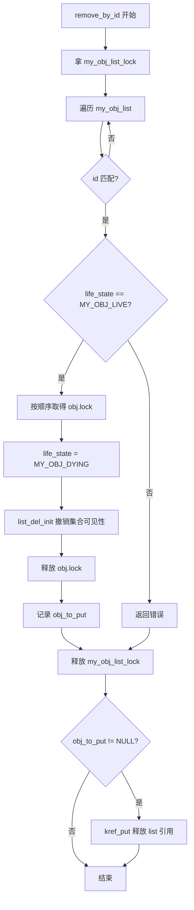
```mermaid
flowchart TD
    A[remove_by_id 开始] --> B[拿 my_obj_list_lock]
    B --> C[遍历 my_obj_list]
    C --> D{id 匹配?}
    D -- 否 --> C
    D -- 是 --> E{life_state == MY_OBJ_LIVE?}
    E -- 否 --> F[返回错误]
    E -- 是 --> N[按顺序取得 obj.lock]
    N --> G[life_state = MY_OBJ_DYING]
    G --> H[list_del_init 撤销集合可见性]
    H --> U[释放 obj.lock]
    U --> I[记录 obj_to_put]
    I --> J[释放 my_obj_list_lock]
    F --> J
    J --> K{obj_to_put != NULL?}
    K -- 是 --> L[kref_put 释放 list 引用]
    K -- 否 --> M[结束]
    L --> M
```

这就是常见纪律：

```text
锁内撤销可见性；
锁外释放集合引用。
```

`kref_put()` 放在锁外，是因为它可能触发最后一个引用释放，从而进入 `release()`。

------

#### (6)\_lookup\_和\_remove\_的并发关系

这个模型下，lookup 和 remove 只需要靠 `my_obj_list_lock` 串行化。

##### 1)\_lookup\_先发生

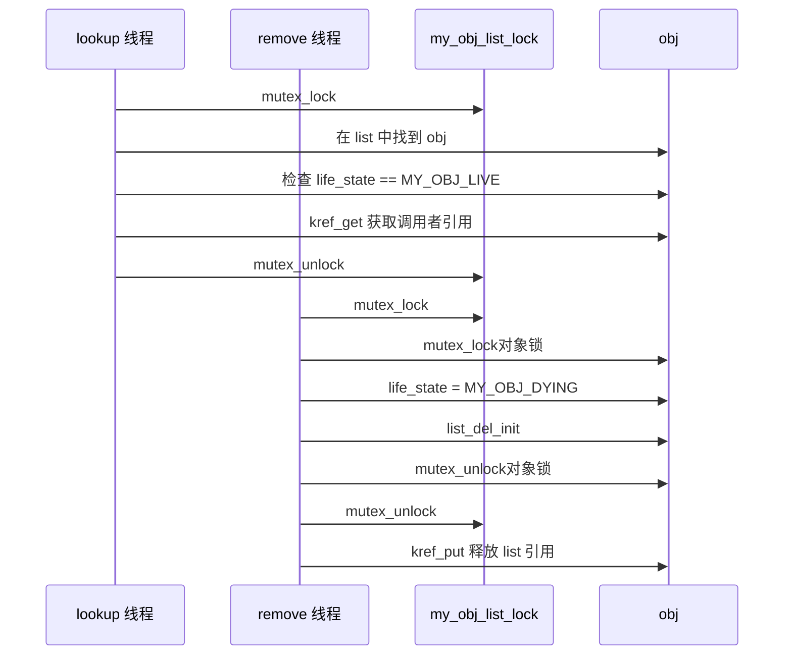
```mermaid
sequenceDiagram
    participant L as lookup 线程
    participant R as remove 线程
    participant Lock as my_obj_list_lock
    participant Obj as obj

    L->>Lock: mutex_lock
    L->>Obj: 在 list 中找到 obj
    L->>Obj: 检查 life_state == MY_OBJ_LIVE
    L->>Obj: kref_get 获取调用者引用
    L->>Lock: mutex_unlock

    R->>Lock: mutex_lock
    R->>Obj: mutex_lock对象锁
    R->>Obj: life_state = MY_OBJ_DYING
    R->>Obj: list_del_init
    R->>Obj: mutex_unlock对象锁
    R->>Lock: mutex_unlock
    R->>Obj: kref_put 释放 list 引用
```

这种情况下：

```text
lookup 已经拿到了自己的引用；
remove 只是撤销集合可见性；
对象不会因为 remove 立刻释放。
```

只要 lookup 调用者还没有 `kref_put()`，对象内存就还在。

------

##### 2)\_remove\_先发生

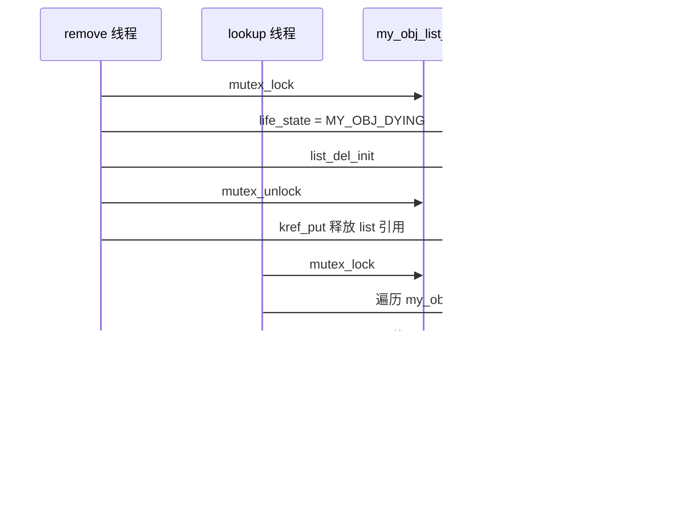
```mermaid
sequenceDiagram
    participant R as remove 线程
    participant L as lookup 线程
    participant Lock as my_obj_list_lock
    participant Obj as obj

    R->>Lock: mutex_lock
    R->>Obj: life_state = MY_OBJ_DYING
    R->>Obj: list_del_init
    R->>Lock: mutex_unlock
    R->>Obj: kref_put 释放 list 引用

    L->>Lock: mutex_lock
    L->>Obj: 遍历 my_obj_list
    L->>Obj: 找不到 obj
    L->>Lock: mutex_unlock
    L-->>L: 返回 NULL
```

这种情况下：

```text
remove 已经撤销集合可见性；
新的 lookup 找不到对象；
不会再由这个已经撤下的入口产生新引用；已有拥有者仍可能按自己的协议追加独立份额。
```

------

#### (7)\_已有对象引用时\_业务状态由对象锁保护

`obj->lock` 不参与 lookup 可见性判断。

它用于对象内部业务操作。

例如启动对象：

```c
int my_obj_start(struct my_obj *obj)
{
	int ret = 0;

	/*
	 * 调用者必须已经持有 obj 引用。
	 */

	mutex_lock(&obj->lock);

	if (obj->run_state != MY_OBJ_IDLE) {
		ret = -EINVAL;
		goto out;
	}

	obj->run_state = MY_OBJ_RUNNING;

	/* 本节只演示同步状态转换，没有启动硬件或异步任务。 */

out:
	mutex_unlock(&obj->lock);
	return ret;
}
```

停止对象：

```c
int my_obj_stop(struct my_obj *obj)
{
	int ret = 0;

	/*
	 * 调用者必须已经持有 obj 引用。
	 */

	mutex_lock(&obj->lock);

	if (obj->run_state != MY_OBJ_RUNNING) {
		ret = -EINVAL;
		goto out;
	}

	obj->run_state = MY_OBJ_STOPPING;

	/* 本节没有异步执行者；这里只演示同步收尾再回到IDLE。 */

	obj->run_state = MY_OBJ_IDLE;

out:
	mutex_unlock(&obj->lock);
	return ret;
}
```

这里修改 `run_state` 是合理的。

本模型把这些枚举赋值作为同步业务动作本身。真实工程必须另行把状态转换与成功、失败、排空条件对应：

```text
IDLE -> RUNNING：
    对应 start 动作。

RUNNING -> STOPPING -> IDLE：
    对应 stop 动作。
```

------

若把 work 或 DMA 加入模型，不能直接把 flush/cancel 塞进持 obj.lock 的 stop 中：被等待者也许需要同锁才能退出。应先在锁内关闭新请求和登记停止阶段，保留覆盖整个收尾的一份，解除锁后等待，再按锁协议发布停止结果。P06 已有借用退出实例；本段没有实现这个扩展。

#### (8)\_release\_最后引用释放后的销毁点

`release` 是最后引用释放后的销毁点。

它不负责把对象从全局链表中删除。

对象进入 `release` 前，应该已经满足：

```text
对象不再对新的 lookup 可见；
对象已经不在全局 list 中；
没有其他引用持有者。
```

示例：

```c
static void my_obj_release(struct kref *ref)
{
	struct my_obj *obj;

	obj = container_of(ref, struct my_obj, ref);

	/*
	 * release 不是 remove。
	 * 到这里时，对象应该已经从全局集合撤销。
	 */
	WARN_ON_ONCE(!list_empty(&obj->node));
	WARN_ON_ONCE(obj->life_state == MY_OBJ_LIVE);

	obj->life_state = MY_OBJ_DEAD;

	mutex_destroy(&obj->lock);

	kfree(obj);
}
```

正常拥有型协议下，最后归零意味着没有合法共享访问者，节点已摘下或从未发布，回调可以检查状态并写最终标记。DEAD 只在回收前写入，不允许别的线程在释放后读取它。WARN 是诊断，不会修复损坏链表；它没有告警也不能证明所有并发路径已经被测试。

这里的分工是：

```text
remove 负责撤销集合可见性；
kref_put 负责释放某个持有者的引用；
release 负责最后销毁对象。
```

不要把这三件事混成一个动作。

------

#### (9)\_整体关系图

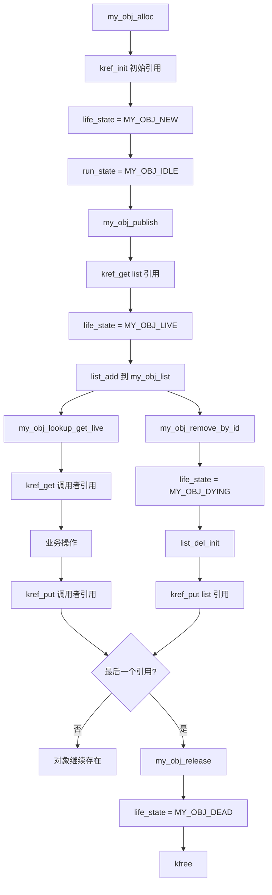
```mermaid
flowchart TD
    A[my_obj_alloc] --> B[kref_init 初始引用]
    B --> C[life_state = MY_OBJ_NEW]
    C --> D[run_state = MY_OBJ_IDLE]

    D --> E[my_obj_publish]
    E --> F[kref_get list 引用]
    F --> G[life_state = MY_OBJ_LIVE]
    G --> H[list_add 到 my_obj_list]

    H --> I[my_obj_lookup_get_live]
    I --> J[kref_get 调用者引用]
    J --> K[业务操作]
    K --> L[kref_put 调用者引用]

    H --> M[my_obj_remove_by_id]
    M --> N[life_state = MY_OBJ_DYING]
    N --> O[list_del_init]
    O --> P[kref_put list 引用]

    L --> Q{最后一个引用?}
    P --> Q

    Q -- 否 --> R[对象继续存在]
    Q -- 是 --> S[my_obj_release]
    S --> T[life_state = MY_OBJ_DEAD]
    T --> U[kfree]
```

这张图里有三条线：

```text
发布线：
    alloc -> publish -> list 可见

查找线：
    lookup -> kref_get -> 使用 -> kref_put

删除线：
    remove -> list 不可见 -> put list 引用 -> release
```

这三条线使用的是成员、业务和引用三组状态，而不是一条单独的生命周期枚举。请用图和阶段表解释：创建后发布失败可以从 S0 直接退出；查找先取得一份后，S4 撤下不妨碍它归还；S4 已发生却仍为 RUNNING，说明业务关闭尚未由本模型证明。

------

#### (10)\_本节结论

对象状态和锁组合时，先把状态语义分清楚。

如果状态表达的是集合可见性：

```text
它应该和 list node 一起由 list_lock 保护；
publish 时 state = LIVE + list_add；
remove 时 state = DYING + list_del_init；
lookup 在 list_lock 内完成查找、状态判断、kref_get。
```

如果状态表达的是对象内部业务：

```text
它应该由 obj->lock 保护；
调用者必须已经持有对象引用；
状态变化应该绑定 start、stop、reset、error 等真实动作。
```

最后总结：

```text
list_lock 保护“对象是否能被找到”；
obj->lock 保护“对象内部状态是否一致”；
kref 保护“对象内存是否仍然存在”。
```

---

### 9.3.8\_锁顺序问题

刚才保留的 remove 写段同时持集合锁和对象锁，因此已经建立一条真实的锁依赖：先拿 my_obj_list_lock，再拿 obj->lock。若另一路径反过来，就可能各持一把并互等：

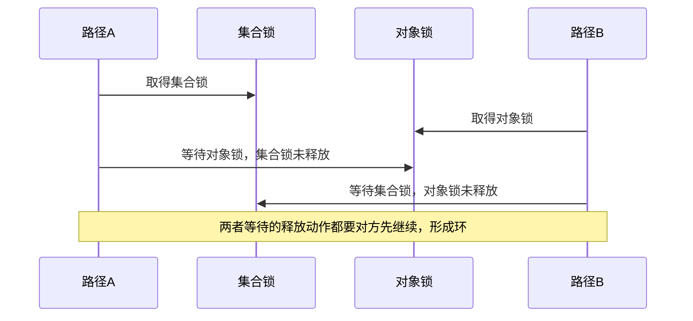
```mermaid
sequenceDiagram
    participant A as 路径A
    participant G as 集合锁
    participant O as 对象锁
    participant B as 路径B
    A->>G: 取得集合锁
    B->>O: 取得对象锁
    A->>O: 等待对象锁，集合锁未释放
    B->>G: 等待集合锁，对象锁未释放
    Note over A,B: 两者等待的释放动作都要对方先继续，形成环
```

引用不会打破这个等待环；它只让对象和锁所在内存仍在。应把锁依赖写进所有可能嵌套的路径，而不是只在 remove 注释中声明顺序。

```c
/*
 * my_obj_list_lock保护成员关系与life_state。
 * obj->lock保护run_state与业务字段。
 * 需要同时取得时，顺序固定为my_obj_list_lock -> obj->lock。
 * 只持对象锁的业务路径不得反向取得集合锁。
 */
```

若业务路径先持对象锁，又发现需要查集合，一种改造是保留已有独立引用，解除对象锁，再按全局顺序取得所需锁。这里多出一个必须面对的窗口：解锁期间业务和成员状态都可能变化，所以重新加锁后必须重新验证条件，不能继续使用此前判断。独立引用只保护地址，不能冻结决策依据。

另一种改造是像 9.2 那样把操作拆成不嵌套的阶段，由份额覆盖中间时间，并明确接口保证在何时成立。若业务真的要求两个状态同时变化，则不能仅为避免嵌套随意拆开；要重新设计共同保护范围或锁顺序。这是保证与代价的选择，不是“越少拿锁越正确”。

### 9.3.9\_remove\_路径中的锁组合

remove 可能只撤下成员，也可能承担停止接纳甚至等待异步执行者退出。先给它确定任务，再决定锁组合；函数名本身不说明它已经完成哪些事。

若关闭标志由对象锁保护，且要求标记关闭与撤下入口作为同一排他阶段，可以采用下面的配对片段。调用者持有独立引用，node 只属于这一个拥有型集合；全部状态读取遵守对象锁，所有成员操作遵守集合锁，嵌套顺序与上节一致。

```c
static void my_obj_unpublish(struct my_obj *obj)
{
    bool removed = false;
    mutex_lock(&my_obj_list_lock);
    mutex_lock(&obj->lock);
    obj->state = OBJ_DYING;
    if (!list_empty(&obj->node)) {
        list_del_init(&obj->node);
        removed = true;
    }
    mutex_unlock(&obj->lock);
    mutex_unlock(&my_obj_list_lock);
    if (removed)
        object_put(obj); /* 只归还本次摘下的成员份额；调用者原份额保留。 */
}
```

这里 state 是本片段定义的业务门字段，不是把 9.3.7 的 life_state 偷换成对象锁字段。若决定由集合锁同时保护 state，就让所有相应读写者一起改用集合锁，再取消多余对象锁；不能只改写一处 remove。重复调用虽不再次归还成员份额，却仍需要有效对象参数，也不能在与重新发布并发的情况下默认它会操作最早那次成员关系。

同一临界区内的关闭决定能够排斥按相同对象锁检查的 **新操作**，却不意味着此前启动的异步操作已经结束。需要等待 work、回调或硬件停止时，必须持有覆盖等待期的责任，按实际协议阻止重新提交，释放等待者需要的锁以后再同步退出。不能在未证明的情况下把“等待异步路径收尾”添在任何 put 之后；那时可能连等待对象都已回收。

9.3.7 的 remove_by_id 是另一种明确入口：它在集合锁内查到并摘下节点，暂接原成员份额，然后解锁归还。它不依赖一个调用者传入的对象地址，也不承诺业务停止；按 id 操作还须考虑编号重用。两种接口都能正确，但不能把它们的参数期限和完成保证混成一个模板。

至此可以检查查找、业务决策和成员移除的责任。剩下的危险点在最后一个 put：它会同步进入回调，而回调可能再次取锁、等待或释放锁所在对象。下一节把这条调用路径接到现有锁顺序上。

## 9.4\_release\_与锁\_最后一个\_put\_发生在哪里

上一节的成员移除在解锁后归还那一份。这不仅缩短了临界区，还把一个隐藏的调用边接到了容易审查的位置：普通 put 可能同步进入 release。只看 remove 里直接写出的 mutex_lock 不够，回调和回调调用的函数也属于当前路径。

这里先比较普通归还，再看非拥有索引为何需要把最后减少放在锁内。两种方案保留的保证不同，特殊接口并不是“更高级的 put”。

### 9.4.1\_release\_和锁的基本关系

普通 kref_put 在本次合法归还使计数归零时调用 release，回调沿调用者当前栈执行。调用者处于进程、软中断或硬中断上下文，当前还持有什么锁，都会影响回调可以执行的操作。接口不会替它切换成后台清理线程，也不自动释放调用者原有的锁。

原文的阅读旁注保留如下，并在这里限定其技术含义：

> `release` 是最后一个引用释放时调用的回调。不同于驱动的remove，这里是说在应用过程中的数据，它可以被并发访问，如果使用了kref，那么就用release做内存回收。
>
> 如果是驱动的状态清除，肯定只能够使用驱动的xxx_exit()接口。
>
> 如果最后一个 put 在中断上下文，release 就在中断上下文。（中断中的release 无锁，也不可睡眠）

需要校正两处绝对化结论。驱动资源何时关闭应由设备解绑、关闭、移除或其他实际生命周期接口决定，没有一个通用的 xxx_exit 名称可替所有驱动作判断；release 可以清理按协议归它所有的资源，但不能代替缺失的停止/排空流程。中断回调不能使用需要睡眠的操作，却不等于“没有持锁”或“禁止任何锁”：调用者可能已经持适用的自旋锁，回调也可能按经过证明的顺序使用非睡眠锁。必须核对实际上下文和原语，不能仅凭 callback 名称推断。

P06 已详细比较资源关闭与最后回收。本节只追问：把 release 的全部同步调用展开后，是否还满足当前锁顺序、等待关系和存储期限？

### 9.4.2\_不要在普通\_kref\_put()\_持锁路径里让\_release\_反拿同一把锁

考虑调用者持全局 mutex，普通 put 恰好是最后一份，而 release 也要取得这个 mutex。它不是“两个线程运气不好”，一个线程就足以形成自等待：

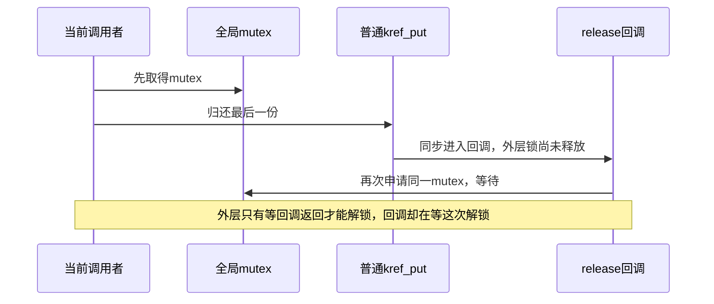
```mermaid
sequenceDiagram
    participant T as 当前调用者
    participant M as 全局mutex
    participant K as 普通kref_put
    participant R as release回调
    T->>M: 先取得mutex
    T->>K: 归还最后一份
    K->>R: 同步进入回调，外层锁尚未释放
    R->>M: 再次申请同一mutex，等待
    Note over T,R: 外层只有等回调返回才能解锁，回调却在等这次解锁
```

若对象是拥有型集合成员，可以先在集合锁内摘下，保留待归还成员份额到解锁后，再 put。这份责任保证从摘下到 put 之间对象仍有效。若其他共享字段还需要更新，应在它们各自协议允许的窗口里完成，不能把“锁外 put”简化成在最后归还后继续清理字段。

如果把锁外归还改成锁内归还，也不是所有情形都错：另有确定的一份使本次不可能归零，或者回调和锁存储已经按特定协议配对，可能成立。但必须指出这个证明，不能依靠日志里恰好没触发 release。

### 9.4.3\_release\_能否拿锁取决于上下文和锁顺序

检查时沿三条线追踪：调用点允许怎样的阻塞；外层持锁与回调再取锁是否形成依赖环；回调是否会回收后续 unlock 仍要访问的锁存储。全局锁和嵌入对象的锁在最后一点尤其不同：外壳回收后，全局锁可能仍在，而 obj->lock 已经随着对象消失。

mutex 持有期间可以发生合法睡眠，并不意味着可以等待任何对象。若回调持 global_lock 等 worker 完成，而 worker 必须拿 global_lock 才能退出，就形成“等待完成→等待锁”的环；它不必在源码里表现为反向的两次 mutex_lock。把等待放到锁外的前提仍是有一份或其他独立期限覆盖整个等待。

将复杂回收转到 work 也需要明确的责任移交和模块退出保证。RCU 回调通常不是通用可睡眠 workqueue，不能把“延迟执行”当作“上下文已经安全”。对于本章普通拥有型模型，优先在归零前完成关闭/排空，让 release 回收已经就绪的资源，通常更容易证明；选择依据是依赖关系，而不是回调代码行数。

### 9.4.4\_kref\_put\_mutex()\_的用途

现在改变一个前提：索引不持有引用，最后外部用户离开时才自动摘下对象，同时查找希望在同锁内继续使用普通 get。P08 已解释过，若先在锁外归零，再由回调取索引锁，查找可能在锁内看见零，只能使用条件取得。另一种设计是 **在取得索引锁以前保留最后候选那一份**，不允许最终归零越过查找窗口。

kref_put_mutex 就为这种组合提供包装：正常非最后份额可以先减少而不取索引锁；观察到可能最后时保留该份额，取得 mutex 后才实际减少并重新判断。等待期间查找者可能先拿锁新增一份，因此慢路径也可能最终不归零。

| 分支 | 减少与锁的顺序 | 谁解锁 | 是否调用release |
| --- | --- | --- | --- |
| 正常非最后快路径 | 比较减少成功，不取mutex | 没有新取得的锁 | 否 |
| 最后候选等待后又有新份额 | 先取mutex，再减少仍非零 | helper自己 | 否 |
| 锁内正常归零 | 先取mutex，再减少为零 | 回调接管并负责解锁 | 是，入口已持锁 |

这张表解释了为什么返回 0 不等于“从来没有取锁”，也解释了为什么快路径曾看到 1 不等于本次必然回收。固定版本的异常饱和返回更不能当作正常责任消费的诊断。

从[源码总索引](../../../../research/source_reading/kref/navigation/P01_Linux_6.12_kref源码阅读索引.md#1.2_按问题进入已落地证据)进入[锁交接模块](../../../../research/source_reading/kref/navigation/P04_最后归还与锁交接导读.md#4.2_把最后减少留在锁内)，再核对[kref 入口](../../../../research/source_reading/kref/source_explanations/include/linux/kref.h.md#1.8_归零时把锁交给回调)、[保留最后候选的快路径](../../../../research/source_reading/kref/source_explanations/lib/refcount.c.md#1.2_快路径保留最后一份)和[锁内重新减少](../../../../research/source_reading/kref/source_explanations/lib/refcount.c.md#1.3_取得锁后再次减少判断)。这里复用唯一实现，不从函数名推测为“先归零再拿锁”。

### 9.4.5\_kref\_put\_mutex()\_的典型模式

复用 P05 的完整 [note_kref_locked.c](../../../../labs/kernel/object_lifetime/materials/note_kref_locked.c)。它的索引没有新增一份，创建者保留初始份额；全部归还统一走 indexed_put，调用者不得已经持有 index_lock。回调入口与普通 release 恰好相反：已经接到锁，必须完成摘下并解锁。

```c
// SPDX-License-Identifier: GPL-2.0
#include <linux/kref.h>
#include <linux/module.h>
#include <linux/mutex.h>
#include <linux/slab.h>

struct indexed_object {
    int value;
    struct kref ref;
};

static DEFINE_MUTEX(index_lock);
static struct indexed_object *index_entry; /* 非拥有索引，不额外持引用。 */
static unsigned int release_calls;

/* 只供 kref_put_mutex 调用：进入时已持 index_lock，必须接管解锁。 */
static void indexed_release_locked(struct kref *ref)
{
    struct indexed_object *obj = container_of(ref, struct indexed_object, ref);
    if (index_entry == obj)
        index_entry = NULL;
    mutex_unlock(&index_lock);
    ++release_calls; /* 本模块只同步运行，统计保存在对象之外。 */
    kfree(obj);
}

/* 调用者负责一份，且没有持 index_lock；所有归还路径统一使用此接口。 */
static void indexed_put(struct indexed_object *obj)
{
    if (obj)
        kref_put_mutex(&obj->ref, indexed_release_locked, &index_lock);
}

static struct indexed_object *indexed_create(void)
{
    struct indexed_object *obj = kzalloc(sizeof(*obj), GFP_KERNEL);
    if (!obj)
        return NULL;
    obj->value = 42;
    kref_init(&obj->ref);
    return obj;
}

/* 成功只发布非拥有入口，创建者仍保留原份额；只接受尚未发布的新对象。 */
static int indexed_publish(struct indexed_object *obj)
{
    int result = 0;
    mutex_lock(&index_lock);
    if (index_entry)
        result = -EEXIST;
    else
        index_entry = obj;
    mutex_unlock(&index_lock);
    return result;
}

static struct indexed_object *indexed_lookup(void)
{
    struct indexed_object *obj;
    mutex_lock(&index_lock);
    obj = index_entry;
    if (obj)
        kref_get(&obj->ref); /* 最后归零也必须经同锁，锁内可见时仍为正。 */
    mutex_unlock(&index_lock);
    return obj;
}

static int __init note_locked_init(void)
{
    struct indexed_object *creator = indexed_create();
    struct indexed_object *reader;
    int result;
    if (!creator)
        return -ENOMEM;
    result = indexed_publish(creator);
    if (result) {
        indexed_put(creator); /* 私有失败对象也走统一回调，不清除别人的入口。 */
        return result;
    }
    reader = indexed_lookup();
    indexed_put(creator);
    if (!reader)
        return -ENOENT;
    pr_info("note_locked: reader value=%d\n", reader->value);
    indexed_put(reader); /* 最后归零在锁内，回调清入口、解锁并回收。 */
    return 0;
}

static void __exit note_locked_exit(void)
{
    /* 没有导出入口或异步参与者，所有责任已在 init 内结束。 */
    pr_info("note_locked: release_calls=%u\n", release_calls);
}

module_init(note_locked_init);
module_exit(note_locked_exit);
MODULE_LICENSE("GPL");
MODULE_DESCRIPTION("非拥有索引与最后归还锁交接实验");
```

先预测正常计数：创建为 1，发布不变，lookup 后为 2；创建者归还走非最后分支到 1，读者最后归还在锁内到 0，回调清入口、解锁并回收。预期初始化日志 reader value=42，卸载 release_calls=1。程序没有外部并发入口，不能用这次顺序输出证明慢路径真实阻塞已经测试。

把普通周期进一步细分：S4a 尝试非最后减少，S4b 保留候选份额等待索引锁，S4c 在锁内真正减少；归零后 S5a 由回调接管索引锁、摘下并解锁，S5b 回收外壳。共享状态是 ref、index_entry 和对象外的 index_lock；是否最后由锁内新观察决定，不保存一个永远有效的“刚才计数是一”的结论。

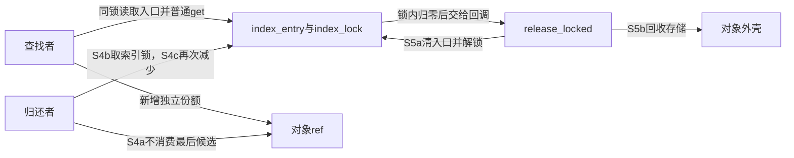
```mermaid
flowchart LR
    L[查找者] -->|同锁读取入口并普通get| I[index_entry与index_lock]
    L -->|新增独立份额| C[对象ref]
    P[归还者] -->|S4a不消费最后候选| C
    P -->|S4b取索引锁，S4c再次减少| I
    I -->|锁内归零后交给回调| R[release_locked]
    R -->|S5a清入口并解锁| I
    R -->|S5b回收存储| F[对象外壳]
```

如果查找者在 S4b 期间先取得锁并把 1 增到 2，归还者以后只减到 1，helper 自行解锁，回调不会执行。新读者以后仍须按相同归还协议退出。不能混入一条普通锁外 put，把“最后减少也在索引锁内”的证明破坏掉。

按材料目录的 KDIR 构建方式在匹配目标装卸该模块；既有 ARM 前端、六组模块控制路径和十类 helper 分支证据仍有效，本次没有改动程序。宿主的锁和原子为顺序替身，未执行真实等待、目标装卸或内存序验证。

### 9.4.6\_kref\_put\_lock()\_的用途

spinlock 版本沿同样的“先避免最后减少→取锁→重新减少→归零才交回调”结构，但同步原语不同。在本仓库固定的非 PREEMPT_RT 配置边界内，持 spinlock 时不得睡眠；这个 helper 使用普通 spin_lock，不自动保存或关闭中断状态。

回调必须按契约 spin_unlock，不能再次取得已经交给它的同一把锁，也不能调用可能阻塞的清理。解锁以后是否允许睡眠仍取决于原调用上下文：硬中断不会因释放自旋锁就变成进程上下文。若这把锁也被本 CPU 的中断路径使用，必须另行证明禁中断与取得规则，不能把 helper 自动当成 irqsave 包装。

特殊接口是否适合的判断顺序是：是否确实要把最后归零与这个共享索引串行；所有可能最后归还的上下文是否允许取该锁；回调是否正确接管、解锁和回收。原语选择由这三个约束推出，不是把 mutex 版本的名字换成 lock 就可适配中断。

### 9.4.7\_普通\_kref\_put()\_kref\_put\_mutex()\_kref\_put\_lock()\_对比

| 应用协议/接口 | 地址与正计数的依据 | 最后归还如何与查找相遇 | 代价与限制 |
| --- | --- | --- | --- |
| 拥有型容器+普通put | 成员那一份在同锁查找期间仍在 | 先摘下，解锁后归还成员份额 | 要有显式撤下路径，回调不必再操作容器 |
| 非拥有索引+普通put+条件取得 | 查找锁挡住回调回收，可能见零 | 锁外归零，回调再取索引锁 | 条件失败是正常分支，回调上下文允许拿锁 |
| 非拥有索引+kref_put_mutex | 最后减少也被索引mutex串行 | 正常非最后少走锁；候选等锁后再判断 | 全部归还协议一致；回调负责解锁；上下文允许mutex |
| 非拥有索引+kref_put_lock | 最后减少也被指定spinlock串行 | 与上行同类，锁语义不同 | 本基线持锁不睡眠，不自动irqsave |

若应用本来就有明确注册/撤下动作，拥有型容器通常更容易表达责任；若希望最后外部用户退出时自动摘下非拥有索引，才比较后面几种方案。两者都能正确，不能单独比较函数调用次数便宣称一种普遍更快。引用增减、索引锁争用、失败重试和实际负载都影响代价。

### 9.4.8\_kref\_put\_mutex()/kref\_put\_lock()\_的风险

最先核对的是回调入口契约：普通回调没有自动获得这把锁，locked 回调却以已经持锁为前提；混用会让回调对未持有的锁解锁，或让普通回调再次取得已持有锁。还要检查非归零分支由 helper 解锁、归零分支由回调解锁，不能两边都解或两边都不解。

回收次序同样重要。本例先清入口、解锁，再 kfree；锁在对象外，回调可以独立操作它。若改成嵌入对象的锁，必须确保任何仍需要锁地址的步骤结束以后才能回收外壳。不要在 kfree 后再通过 obj 查找 unlock 参数。

等待关系也不因换成特殊 helper 自动消失：回调持锁等待一个需要此锁的 worker，仍可能死锁；在非 RT spinlock 下调用同步取消，还可能违反不可睡眠约束。`release_mutex_locked`、`release_spin_locked` 这类命名有助于提示契约，但必须同时写出中文注释，说明入口谁持锁、出口谁解锁、允许什么上下文。

### 9.4.9\_更推荐的普通锁组合模板

回到本章已经建立的拥有型集合，它有独立的发布和撤下责任，因此可以保持普通 put：集合锁内检查本次成员关系并摘下，记录待归还份额，解除相关锁后只归还那一份。回调无需再理解集合遍历，也不会因为本次 remove 留着集合锁而自等待。

这条路线“更推荐”只针对上述应用前提，不覆盖非拥有索引的自动摘链需求。重复 remove 仍须有 removed 或返回旧条目的依据；回调诊断节点为空不替你修复丢失的成员份额。9.3.2 的完整推导和 9.2 的完整服务模块已经给出可审查的正例，不再另抄一个缺少重复调用条件的简化函数。

做一个分支练习：在 9.4.5 中，若原归还者看见 1 后新查找者先加到 2，谁应该解锁、谁以后负责最后一份？答案是本次 helper 解锁，成功查找者保留新的责任；不能调用 release。再问：若回调忘记解锁，计数正确是否能救活系统？不能，责任数与锁所有权是两种独立状态。

下一节把这些路径按进程、软中断、持对象锁和等待执行者的实际调用点逐一检查，避免只验证一个理想的最后归还者。

## 9.5\_put\_上下文和释放边界\_锁内\_锁外\_软中断和字段访问

这一组内容从调用上下文角度整理。

写 `kref_put()` 前要先问：

```text
这个 put 是否可能触发 release；
当前位置是否持有 spinlock/mutex；
release 是否可能睡眠；
put 后是否还会访问对象字段；
对象关闭业务和对象释放是不是被混成了一件事。
```

### 9.5.1\_最后\_put\_可能发生在任意持有者路径

一个对象可能有很多持有者：

```text
创建者；
全局 list；
lookup 调用者；
work；
timer；
callback；
completion；
硬件完成路径。
```

最后一个 put 可能发生在任何一个路径。

这意味着：

```text
release 可能在任意一个持有者调用 put 的上下文执行。
```

例如：

```text
workfn 最后 put -> release 在 workqueue 上下文执行；
timer 最后 put -> release 在 timer/softirq 上下文执行；
remove 最后 put -> release 在 remove 调用线程执行；
lookup 调用者最后 put -> release 在普通系统调用路径执行。
```

所以设计 release 时不能只看一个路径。

必须问：

```text
所有可能执行最后 put 的路径，是否都允许 release 做这些事情？
```

如果 release 里会睡眠，那么必须保证：

```text
最后 put 不会发生在不能睡眠的上下文。
```

如果无法保证，就需要改变设计：

```text
不要让该上下文成为最后 put；
在该上下文 put 前转交到 work；
release 只做非睡眠释放；
使用 RCU 延迟释放；
拆分资源释放。
```

------

### 9.5.2\_中断/软中断上下文中的\_put

如果对象引用可能在中断或软中断上下文释放，就必须特别小心。

示例：

```c
irqreturn_t my_irq_handler(int irq, void *data)
{
	struct my_obj *obj = data;

	/*
	 * 如果这里可能是最后一个 put，
	 * release 就会在中断上下文执行。
	 */
	kref_put(&obj->ref, my_obj_release);

	return IRQ_HANDLED;
}
```

这要求 `my_obj_release()` 不能：

```text
睡眠；
拿 mutex；
调用 cancel_work_sync；
执行阻塞 I/O；
使用 GFP_KERNEL 分配；
等待 completion。
```

如果 release 需要这些操作，就不要让 IRQ 路径直接成为最后 put。

可以设计成：

```text
IRQ 路径只标记完成；
把释放动作交给 workqueue；
workqueue 路径 put 最后一份引用。
```

或者让 release 只做最小释放，把复杂清理提前完成。

------

### 9.5.3\_锁内\_put\_的关键是\_release\_是否会在当前上下文执行

锁内 put 不是绝对禁止。

但是要判断：

```text
如果这个 put 不是最后一个引用，通常没事；
如果这个 put 是最后一个引用，release 会在锁内执行。
```

所以锁内 put 的安全性取决于：

```text
release 能否在当前锁持有状态下执行。
```

安全场景：

```c
spin_lock(&q->lock);
list_del_init(&req->node);
spin_unlock(&q->lock);

kref_put(&req->ref, req_release);
```

这是最推荐。

谨慎场景：

```c
spin_lock(&q->lock);
list_del_init(&req->node);
kref_put(&req->ref, req_release);
spin_unlock(&q->lock);
```

只有当你能证明：

```text
这个 put 不可能是最后一个引用；
或者 release 可以在 q->lock 持有状态下安全执行；
或者使用了专门设计的 locked release。
```

才可以这么写。

否则应该默认避免。

------

### 9.5.4\_锁外\_put\_通常安全\_前提是后续不再访问对象

有些人会担心：

```text
我解锁后再 put，会不会被别人 lookup 到？
```

关键看 unlink 顺序。

正确模式：

```c
mutex_lock(&my_obj_list_lock);
list_del_init(&obj->node);
mutex_unlock(&my_obj_list_lock);

kref_put(&obj->ref, my_obj_release);
```

解锁后，对象已经不在 list 中。

新的 lookup 持同一把锁，也找不到它。

所以锁外 put 不会让新 lookup 重新获得对象。

已有引用仍然可以继续使用对象。

这正是 kref 的作用：

```text
撤销可见性后，禁止新用户进入；
已有引用继续收尾；
最后一个 put 才 release。
```

这比在锁内直接释放更安全、更清晰。

------

### 9.5.5\_对象锁内只做决定\_实际\_put\_尽量放到锁外

有些对象的释放需要根据状态决定。

例如：

```text
如果 state == CLOSED，则释放；
否则只减少引用。
```

不要把业务状态和 kref 计数混为一谈。

可以写成：

```c
void my_obj_close(struct my_obj *obj)
{
	bool do_put = false;

	mutex_lock(&obj->lock);

	if (obj->state != OBJ_CLOSED) {
		obj->state = OBJ_CLOSED;
		do_put = true;
	}

	mutex_unlock(&obj->lock);

	if (do_put)
		kref_put(&obj->ref, my_obj_release);
}
```

这里锁保护：

```text
state 是否已经关闭；
close 是否重复调用。
```

kref_put 处理：

```text
当前路径释放自己的引用。
```

不要写成：

```c
mutex_lock(&obj->lock);

if (obj->state != OBJ_CLOSED) {
	obj->state = OBJ_CLOSED;
	kref_put(&obj->ref, my_obj_release);
}

mutex_unlock(&obj->lock);
```

除非你确认 release 不会反向拿 `obj->lock`，也不会释放后影响当前锁路径。

更稳妥的模式是：

```text
锁内决定；
锁外 put。
```

------

### 9.5.6\_对象锁和对象释放

如果对象锁是嵌入在对象内部的：

```c
struct my_obj {
	struct kref ref;
	struct mutex lock;
};
```

那么对象释放后，锁本身也没了。

所以不能在释放对象后再 unlock。

错误示例：

```c
mutex_lock(&obj->lock);

kref_put(&obj->ref, my_obj_release);

mutex_unlock(&obj->lock);    /* 可能 UAF */
```

如果 `kref_put()` 触发 release，`obj` 被 kfree，那么 `obj->lock` 也已经释放。

后续 `mutex_unlock(&obj->lock)` 就可能访问释放内存。

所以嵌入对象内部的锁有一个规则：

```text
不要在持有 obj->lock 时执行可能释放 obj 的最后 put。
```

除非能证明：

```text
当前 put 不可能是最后一个；
或者 release 不会释放包含这把锁的内存；
或者使用了特别设计的锁转移机制。
```

更推荐写法：

```c
mutex_lock(&obj->lock);
obj->state = OBJ_DONE;
mutex_unlock(&obj->lock);

kref_put(&obj->ref, my_obj_release);
```

------

### 9.5.7\_release\_中检查锁保护对象已经脱链

release 不应该承担主要 unlink 工作。

更好的设计是：

```text
remove/unpublish 路径负责从集合脱链；
release 只检查对象已经不在集合中。
```

示例：

```c
static void my_obj_release(struct kref *ref)
{
	struct my_obj *obj;

	obj = container_of(ref, struct my_obj, ref);

	WARN_ON(!list_empty(&obj->node));

	kfree(obj);
}
```

这个 `WARN_ON()` 的意义是：

```text
如果 release 时对象仍然挂在 list 中，说明 remove/unpublish 路径有 bug。
```

它可以尽早发现：

```text
没有先 unlink；
多路径重复插入；
忘记 list_del_init；
release 时全局结构还保存悬挂指针。
```

但是 release 里不建议直接：

```c
list_del_init(&obj->node);
```

除非有明确锁保护。

否则 release 不知道当前是否持有 list 锁，也不知道是否和 lookup 并发。

------

### 9.5.8\_list\_del\_和\_kref\_put\_的常见组合

#### (1)\_推荐组合

```c
mutex_lock(&list_lock);
list_del_init(&obj->node);
mutex_unlock(&list_lock);

kref_put(&obj->ref, obj_release);
```

特点：

```text
先撤销可见性；
再释放集合引用；
release 不在 list_lock 下执行；
简单安全。
```

------

#### (2)\_风险组合

```c
mutex_lock(&list_lock);
list_del_init(&obj->node);
kref_put(&obj->ref, obj_release);
mutex_unlock(&list_lock);
```

风险：

```text
如果 put 是最后引用，release 在 list_lock 下执行；
release 不能拿 list_lock；
release 不能做可能需要 list_lock 的事情；
release 释放对象后，当前路径不能再访问 obj。
```

除非你能证明它安全，否则不要这么写。

------

#### (3)\_错误组合

```c
kref_put(&obj->ref, obj_release);

mutex_lock(&list_lock);
list_del_init(&obj->node);
mutex_unlock(&list_lock);
```

问题：

```text
put 可能已经释放对象；
后续 list_del 访问释放内存；
全局 list 可能短时间保存悬挂指针。
```

这通常是错误的。

------

### 9.5.9\_spinlock\_场景下的特殊限制

spinlock 下不能睡眠。

所以如果 release 可能在 spinlock 下执行，release 就不能睡眠。

错误示例：

```c
spin_lock(&obj_lock);

list_del_init(&obj->node);
kref_put(&obj->ref, my_obj_release);

spin_unlock(&obj_lock);
```

如果 release 中有：

```c
static void my_obj_release(struct kref *ref)
{
	struct my_obj *obj = container_of(ref, struct my_obj, ref);

	cancel_work_sync(&obj->work);  /* 可能睡眠 */
	kfree(obj);
}
```

那么这就不安全。

推荐：

```c
spin_lock(&obj_lock);
list_del_init(&obj->node);
spin_unlock(&obj_lock);

kref_put(&obj->ref, my_obj_release);
```

如果必须在最后 put 时和 spinlock 序列化，才考虑 `kref_put_lock()`，并且 release 必须是 spinlock-safe。

------

### 9.5.10\_mutex\_场景下的睡眠问题

mutex 本身允许睡眠。

但是如果 release 在持有 mutex 时执行，仍然可能有问题。

例如：

```c
mutex_lock(&global_lock);
kref_put(&obj->ref, my_obj_release);
mutex_unlock(&global_lock);
```

如果 release 里又要拿 `global_lock`，死锁。

如果 release 里等待另一个线程，而那个线程需要 `global_lock`，也可能死锁。

例如：

```text
CPU0:
    mutex_lock(global_lock)
    kref_put -> release
    release 等待 worker 退出

CPU1 worker:
    退出前需要 mutex_lock(global_lock)
```

结果：

```text
CPU0 等 worker；
worker 等 global_lock；
global_lock 被 CPU0 持有。
```

所以即使 mutex 允许睡眠，也不代表可以随便在 mutex 内执行 release。

更稳妥的规则仍然是：

```text
能在锁外 put，就在锁外 put。
```

------

### 9.5.11\_kref\_get\_unless\_zero()\_与锁组合

有些场景需要同时使用锁和 `kref_get_unless_zero()`。

例如：

```c
struct my_obj *my_obj_lookup_get_live(int id)
{
	struct my_obj *obj = NULL;

	mutex_lock(&my_obj_list_lock);

	obj = my_obj_find_locked(id);
	if (!obj)
		goto out;

	if (obj->state != OBJ_LIVE) {
		obj = NULL;
		goto out;
	}

	if (!kref_get_unless_zero(&obj->ref))
		obj = NULL;

out:
	mutex_unlock(&my_obj_list_lock);
	return obj;
}
```

这里三层保护分别是：

```text
my_obj_list_lock：
    保护 obj 指针和集合关系。

state == OBJ_LIVE：
    保护业务进入条件。

kref_get_unless_zero：
    防止从 0 复活对象。
```

不要以为用了 `kref_get_unless_zero()` 就可以去掉 `my_obj_list_lock`。

因为它仍然要访问：

```c
obj->ref
```

而访问 `obj->ref` 的前提是：

```text
obj 内存仍然有效。
```

这个前提靠锁或 RCU 等机制保证。

------

### 9.5.12\_对象销毁和业务关闭不是一回事

锁通常还负责对象业务关闭。

例如：

```c
void my_obj_stop(struct my_obj *obj)
{
	mutex_lock(&obj->lock);

	if (obj->state == OBJ_STOPPED) {
		mutex_unlock(&obj->lock);
		return;
	}

	obj->state = OBJ_STOPPED;
	stop_hw(obj);

	mutex_unlock(&obj->lock);
}
```

这只是业务状态关闭。

不等于对象释放。

对象释放仍然由：

```c
kref_put(&obj->ref, my_obj_release);
```

决定。

所以不要把：

```c
state == STOPPED
```

等同于：

```c
refcount == 0
```

它们是两个维度：

```text
业务状态：
    NEW / LIVE / STOPPING / STOPPED / DYING

生命周期：
    有多少引用持有者
```

对象可以是：

```text
STOPPED 但还有引用；
DYING 但已有引用仍在收尾；
LIVE 但某些字段被锁保护；
refcount 非 0 但不允许新 lookup。
```

这就是为什么 kref 不能替代状态机，锁也不能替代 kref。

------

## 9.6\_完整模板\_锁\_+\_kref\_对象的组织方式

前面的小节分别讲边界，这里把它们收束成一个完整模板。

这个模板重点展示：

```text
集合锁如何保护 lookup/remove；
对象锁如何保护内部状态；
kref 如何让锁外持有者安全使用对象内存；
remove 如何先撤销可见性，再释放集合引用；
release 如何只做最终检查和释放。
```

### 9.6.1\_一个完整的锁\_+\_kref\_对象模板

对象：

```c
enum my_obj_state {
	MY_OBJ_NEW,
	MY_OBJ_LIVE,
	MY_OBJ_DYING,
};

struct my_obj {
	struct kref ref;
	struct list_head node;

	struct mutex lock;
	enum my_obj_state state;
	int id;
};

static LIST_HEAD(my_obj_list);
static DEFINE_MUTEX(my_obj_list_lock);
```

release：

```c
static void my_obj_release(struct kref *ref)
{
	struct my_obj *obj;

	obj = container_of(ref, struct my_obj, ref);

	WARN_ON(!list_empty(&obj->node));

	kfree(obj);
}
```

alloc：

```c
struct my_obj *my_obj_alloc(int id)
{
	struct my_obj *obj;

	obj = kzalloc(sizeof(*obj), GFP_KERNEL);
	if (!obj)
		return NULL;

	kref_init(&obj->ref);
	INIT_LIST_HEAD(&obj->node);
	mutex_init(&obj->lock);

	obj->id = id;
	obj->state = MY_OBJ_NEW;

	return obj;
}
```

publish：

```c
int my_obj_publish(struct my_obj *obj)
{
	kref_get(&obj->ref);    /* list 引用 */

	mutex_lock(&my_obj_list_lock);

	mutex_lock(&obj->lock);
	obj->state = MY_OBJ_LIVE;
	mutex_unlock(&obj->lock);

	list_add_tail(&obj->node, &my_obj_list);

	mutex_unlock(&my_obj_list_lock);

	return 0;
}
```

lookup：

```c
struct my_obj *my_obj_lookup_get(int id)
{
	struct my_obj *obj;

	mutex_lock(&my_obj_list_lock);

	list_for_each_entry(obj, &my_obj_list, node) {
		if (obj->id != id)
			continue;

		mutex_lock(&obj->lock);

		if (obj->state != MY_OBJ_LIVE) {
			mutex_unlock(&obj->lock);
			break;
		}

		kref_get(&obj->ref);

		mutex_unlock(&obj->lock);
		mutex_unlock(&my_obj_list_lock);

		return obj;
	}

	mutex_unlock(&my_obj_list_lock);
	return NULL;
}
```

use：

```c
int my_obj_do_something(int id)
{
	struct my_obj *obj;
	int ret = 0;

	obj = my_obj_lookup_get(id);
	if (!obj)
		return -ENOENT;

	mutex_lock(&obj->lock);

	if (obj->state != MY_OBJ_LIVE) {
		ret = -ESHUTDOWN;
		goto out_unlock;
	}

	/*
	 * 访问 obj 内部字段。
	 */

out_unlock:
	mutex_unlock(&obj->lock);

	kref_put(&obj->ref, my_obj_release);
	return ret;
}
```

unpublish/remove：

```c
void my_obj_unpublish(struct my_obj *obj)
{
	mutex_lock(&my_obj_list_lock);

	mutex_lock(&obj->lock);
	obj->state = MY_OBJ_DYING;
	mutex_unlock(&obj->lock);

	if (!list_empty(&obj->node))
		list_del_init(&obj->node);

	mutex_unlock(&my_obj_list_lock);

	kref_put(&obj->ref, my_obj_release);
}
```

创建并发布后释放创建者引用：

```c
int create_and_publish(int id)
{
	struct my_obj *obj;
	int ret;

	obj = my_obj_alloc(id);
	if (!obj)
		return -ENOMEM;

	ret = my_obj_publish(obj);
	if (ret) {
		kref_put(&obj->ref, my_obj_release);
		return ret;
	}

	/*
	 * 创建者不再需要自己的初始引用。
	 * list 仍然持有一份引用。
	 */
	kref_put(&obj->ref, my_obj_release);

	return 0;
}
```

这个模板体现了：

```text
list_lock 保护集合；
obj->lock 保护字段；
list 持有对象引用；
lookup 在锁内 get；
remove 先 DYING + unlink，再 put list 引用；
release 只检查脱链并 kfree。
```

------

### 9.6.2\_上面模板的锁顺序

模板中的锁顺序是：

```text
my_obj_list_lock -> obj->lock
```

所有路径都必须遵守。

例如 lookup：

```text
先拿 my_obj_list_lock；
再拿 obj->lock；
检查 state；
kref_get；
释放 obj->lock；
释放 my_obj_list_lock。
```

remove：

```text
先拿 my_obj_list_lock；
再拿 obj->lock；
设置 DYING；
释放 obj->lock；
list_del；
释放 my_obj_list_lock；
kref_put。
```

业务使用路径：

```text
lookup_get 已经返回带引用对象；
此时不再持有 my_obj_list_lock；
只需要拿 obj->lock 访问字段。
```

注意业务使用路径不再反向拿 list lock。

否则可能破坏锁顺序。

------

## 9.7\_错误模型\_注释和检查清单

这一组内容作为本章的审查入口。

实际 review 时可以按这个顺序看：

```text
先找错误模型；
再看注释是否写清楚锁和引用归属；
最后用检查清单确认 lookup、remove、put、release 是否闭环。
```

### 9.7.1\_锁组合下的错误模型

#### (1)\_有\_kref\_没字段锁

错误：

```c
obj = my_obj_lookup_get(id);
if (!obj)
	return -ENOENT;

obj->state = MY_OBJ_LIVE;  /* 没有 obj->lock */

kref_put(&obj->ref, my_obj_release);
```

问题：

```text
引用只保护内存；
state 并发访问仍然可能竞争。
```

正确：

```c
mutex_lock(&obj->lock);
obj->state = MY_OBJ_LIVE;
mutex_unlock(&obj->lock);
```

------

#### (2)\_有锁\_没\_get\_锁外使用

错误：

```c
mutex_lock(&my_obj_list_lock);
obj = my_obj_find_locked(id);
mutex_unlock(&my_obj_list_lock);

do_something(obj);
```

问题：

```text
离开 list_lock 后没有引用；
obj 可能被 remove 并释放。
```

正确：

```c
mutex_lock(&my_obj_list_lock);
obj = my_obj_find_locked(id);
if (obj)
	kref_get(&obj->ref);
mutex_unlock(&my_obj_list_lock);
```

------

#### (3)\_先\_put\_后\_unlock\_对象锁

错误：

```c
mutex_lock(&obj->lock);
obj->state = MY_OBJ_DYING;
kref_put(&obj->ref, my_obj_release);
mutex_unlock(&obj->lock);
```

问题：

```text
kref_put 可能释放 obj；
obj->lock 所在内存可能已经释放；
mutex_unlock 可能 UAF。
```

正确：

```c
mutex_lock(&obj->lock);
obj->state = MY_OBJ_DYING;
mutex_unlock(&obj->lock);

kref_put(&obj->ref, my_obj_release);
```

------

#### (4)\_remove\_没有先阻止\_lookup

错误：

```c
kref_put(&obj->ref, my_obj_release);
```

但对象还留在全局 list。

问题：

```text
新 lookup 仍然可能找到对象；
对象可能已经 release；
全局集合留下悬挂指针。
```

正确：

```c
mutex_lock(&my_obj_list_lock);
list_del_init(&obj->node);
mutex_unlock(&my_obj_list_lock);

kref_put(&obj->ref, my_obj_release);
```

------

#### (5)\_release\_里重新拿外部锁导致死锁

错误：

```c
mutex_lock(&global_lock);
kref_put(&obj->ref, my_obj_release);
mutex_unlock(&global_lock);
```

release：

```c
static void my_obj_release(struct kref *ref)
{
	mutex_lock(&global_lock);
	...
	mutex_unlock(&global_lock);
}
```

问题：

```text
最后 put 在 global_lock 下执行；
release 又拿 global_lock；
死锁。
```

解决：

```text
不要在 global_lock 下做可能最后 put；
或者 release 不拿 global_lock；
或者重构释放路径。
```

------

### 9.7.2\_锁组合设计时要写清楚的注释

建议每个复杂 kref 对象都写一段锁说明。

例如：

```c
/*
 * Lifetime:
 *   - kref protects struct my_obj memory.
 *   - my_obj_list holds one reference while obj is published.
 *   - my_obj_lookup_get() returns obj with a reference held.
 *
 * Locking:
 *   - my_obj_list_lock protects my_obj_list and obj->node.
 *   - obj->lock protects obj->state and mutable fields.
 *
 * Lock order:
 *   - my_obj_list_lock -> obj->lock.
 *
 * Removal:
 *   - Set state to MY_OBJ_DYING under locks.
 *   - Remove obj from my_obj_list.
 *   - Drop the list reference after unlocking.
 *
 * Release:
 *   - obj must not be on my_obj_list.
 *   - release does not take my_obj_list_lock.
 */
```

中文可以写成：

```text
生命周期：
    kref 保护 my_obj 内存；
    obj 发布到全局 list 后，list 持有一份引用；
    lookup_get 成功返回时，调用者持有一份引用。

锁：
    my_obj_list_lock 保护全局 list 和 obj->node；
    obj->lock 保护 state 和可变字段。

锁顺序：
    my_obj_list_lock -> obj->lock。

删除：
    先设置 DYING；
    再从 list 删除；
    解锁后释放 list 引用。

释放：
    release 时对象必须已经不在 list 中；
    release 不再拿 my_obj_list_lock。
```

这种注释比单纯写：

```text
protected by lock
```

有用得多。

------

### 9.7.3\_本章检查清单

写 kref + 锁代码时，逐项检查：

```text
1. 哪把锁保护集合关系？
2. 哪把锁保护对象字段？
3. 对象挂入集合时，集合是否持有引用？
4. lookup 是否在集合锁内完成？
5. lookup 是否在锁内 get？
6. 离开锁后使用对象，是否已经持有引用？
7. 持有引用后访问字段，是否仍然按字段锁规则加锁？
8. remove 是否先阻止新 lookup？
9. remove 是否先 unlink，再 put 集合引用？
10. put 是否可能在锁内触发 release？
11. release 是否会拿当前已经持有的锁？
12. release 是否可能睡眠？
13. 最后 put 是否可能发生在中断/软中断上下文？
14. obj->lock 是否嵌入在对象内？
15. 是否存在 put 后 unlock obj->lock 的 UAF 风险？
16. 是否定义了全局锁顺序？
17. 是否有路径反向加锁？
18. 是否错误地用 kref 替代字段锁？
19. 是否错误地用锁替代长期引用？
20. 是否需要 kref_put_mutex/kref_put_lock，还是普通 put 更清楚？
```

最重要的问题是：

```text
对象为什么还活着？
字段为什么不会被并发改乱？
集合为什么不会留下悬挂指针？
release 会在哪个上下文执行？
```

------

## 9.8\_本章小结

kref 和锁的组合可以压缩成四句话：

```text
kref 保护对象内存生命周期；
锁保护对象字段和集合关系；
lookup 时锁保护 get 前窗口；
remove 时先 unlink，再 put 集合引用。
```

不要写成：

```text
有 kref，所以不需要锁。
```

也不要写成：

```text
有锁，所以锁外也能用裸指针。
```

正确模型是：

```text
锁内证明对象有效；
锁内获得引用；
锁外靠引用保证对象不释放；
访问字段仍然遵守字段锁；
撤销对象时先阻止新 lookup；
最后一个 put 才 release。
```

本章最关键的一句话：

```text
锁把对象安全地交到 kref 手里；kref 让对象活到使用者 put 为止。
```

也可以写成：

```text
锁解决“能不能安全拿到引用”；
kref 解决“拿到引用后对象能不能活着”。
```

这就是 kref 与锁组合的核心工程模型。

------

专题导航：[kref 引用计数机制章节大纲](大纲.md)。

上一篇：[lookup 场景与 kref_get_unless_zero()](P08_lookup_场景与_kref_get_unless_zero%28%29.md#8.9_本章小结)。

下一篇：[kref 与 RCU](P10_kref_与_RCU.md)。
