# 第10章_kref_与_RCU

## 10.1_本章导读_RCU_负责看到_kref_负责带走

本章专门讲一种组合场景：

```text
对象挂在 RCU 保护的可查找结构中；
读侧通过 RCU 无锁查找对象；
查到对象后，用 kref_get_unless_zero() 尝试取得长期引用；
成功后离开 RCU 读侧临界区；
后续使用对象依赖 kref，而不是继续依赖 RCU。
```

本章不展开 RCU 全体系，只讲 kref 需要理解的部分。

本章主线是：

```text
RCU 保护 lookup 窗口；
kref 保护 lookup 成功之后的对象生命周期；
状态机/锁保护对象是否逻辑可用和字段一致性；
kfree_rcu()/call_rcu()/synchronize_rcu() 保护最终内存回收。
```

Linux kref 文档明确把 `kref_get_unless_zero()` 放到 RCU lookup 场景里使用，并强调它必须和查找动作处在同一个受保护临界区内，否则可能访问已经释放的内存；同时，`kref_get_unless_zero()` 的返回值必须检查。([Linux Kernel 文档](https://docs.kernel.org/core-api/kref.html?utm_source=chatgpt.com))

整体关系可以先看成下面这张图：

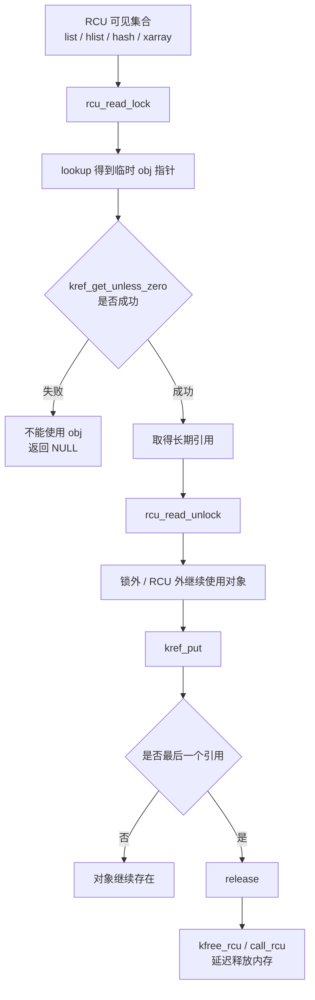

一句话：

```text
RCU 让你安全地“看到对象”；
kref 让你安全地“带走对象”。
```

------

## 10.2_边界_先分清谁保护什么

### 10.2.1_RCU_和_kref_分别保护什么

先把边界写死。

| 机制               | 保护内容                                       | 不保护内容                     |
| ------------------ | ---------------------------------------------- | ------------------------------ |
| RCU                | 读侧临界区内，旧对象内存不会被立即释放         | 不自动增加对象引用             |
| kref               | 成功 get 之后，对象生命周期不会结束            | 不保护 lookup 指针本身是否有效 |
| 锁                 | 集合修改、字段互斥、状态切换                   | 不自动延迟内存释放             |
| 状态机             | 对象是否可用、是否正在删除、是否允许新用户进入 | 不自动管理引用计数             |
| kfree_rcu/call_rcu | 对象内存延迟到 grace period 后释放             | 不表示对象逻辑上仍然可用       |

RCU 文档把 RCU 描述为适合 read-mostly 场景的同步机制，读侧和更新侧可以并发；更新侧通常先移除旧指针，再等待旧读者结束后回收旧对象。([Linux Kernel 文档](https://docs.kernel.org/RCU/whatisRCU.html?utm_source=chatgpt.com))

所以不能写成：

```text
RCU 已经保护了，所以不需要 kref。
```

也不能写成：

```text
kref 已经保护了，所以不需要 RCU。
```

正确理解是：

```text
RCU 保护 get 之前的临时指针窗口；
kref 保护 get 成功之后的长期使用窗口。
```

对应关系：


也可以压缩成一句工程规则：

```text
get 前靠 RCU/锁证明指针有效；
get 后靠 kref 证明对象活着。
```

------

### 10.2.2_为什么_RCU_lookup_不能直接_kref_get()

先看错误写法：

```c
static struct my_obj *my_obj_get_rcu_bad(int id)
{
	struct my_obj *obj;

	rcu_read_lock();

	list_for_each_entry_rcu(obj, &my_obj_list, node) {
		if (obj->id == id) {
			kref_get(&obj->ref);   /* 错误 */
			rcu_read_unlock();
			return obj;
		}
	}

	rcu_read_unlock();
	return NULL;
}
```

这个错误不在于：

```text
obj 内存一定已经被 kfree。
```

RCU 下，内存可能还没被真正释放。

真正的问题是：

```text
obj 的 refcount 可能已经变成 0；
对象已经进入最后释放流程；
此时不能用 kref_get() 把它从 0 加回 1。
```

这叫对象复活。

并发时序如下：

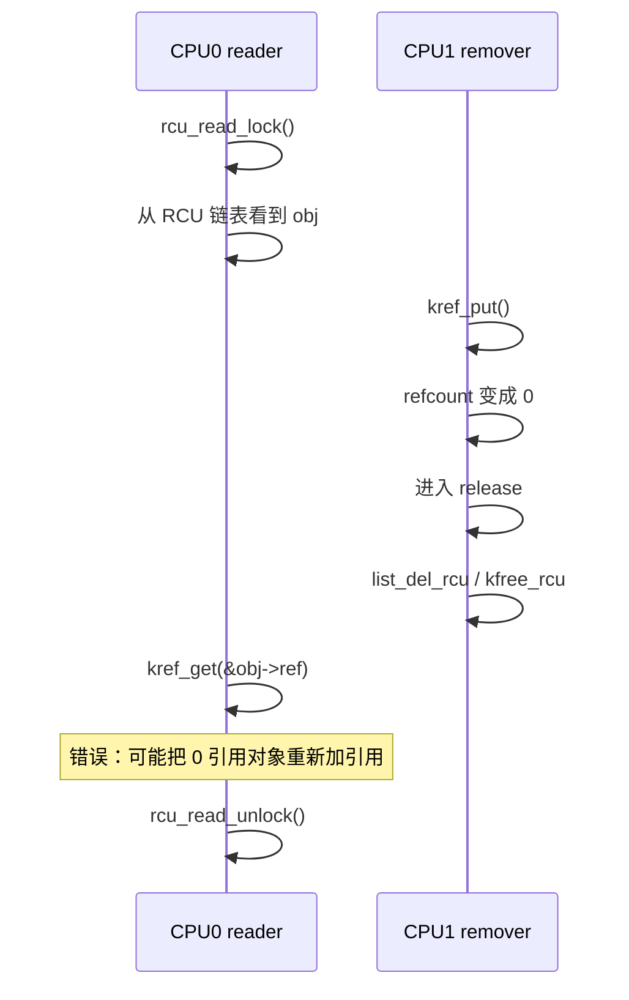

这里 RCU 只能保证：

```text
CPU0 在 rcu_read_lock() 内临时看到的 obj 内存不会被立即释放。
```

它不能保证：

```text
obj->ref 仍然大于 0。
```

所以 RCU lookup 中不能裸 `kref_get()`。

应该使用：

```c
if (!kref_get_unless_zero(&obj->ref))
	return NULL;
```

并且必须检查返回值。Linux kref 文档也明确说明：不检查 `kref_get_unless_zero()` 的返回值是非法用法。([Linux Kernel 文档](https://docs.kernel.org/core-api/kref.html?utm_source=chatgpt.com))

------

### 10.2.3_kref_get_unless_zero()_解决什么_不解决什么

`kref_get_unless_zero()` 解决的是：

```text
如果 refcount 不是 0，就尝试加 1；
如果 refcount 已经是 0，就失败。
```

它不解决：

```text
obj 指针本身是不是有效内存；
obj 是否还在集合里；
obj 是否正在 remove；
obj 是否 dying；
obj 的业务字段是否可以并发访问；
obj 是否还能接受新的业务操作。
```

所以这个写法仍然是错的：

```c
obj = global_cached_obj;

if (!kref_get_unless_zero(&obj->ref))
	return NULL;
```

除非你能证明：

```text
global_cached_obj 指向的对象内存，在 get_unless_zero 执行期间不会被释放。
```

在 RCU lookup 中，这个证明来自：

```c
rcu_read_lock();

/* 在 RCU 保护下拿到 obj 指针 */
obj = lookup_obj_rcu(id);

/* 仍然在 RCU 保护下尝试取得引用 */
if (obj && kref_get_unless_zero(&obj->ref))
	found = obj;

rcu_read_unlock();
```

不能这样写：

```c
rcu_read_lock();
obj = lookup_obj_rcu(id);
rcu_read_unlock();

if (obj && kref_get_unless_zero(&obj->ref))   /* 错误 */
	return obj;
```

原因是：

```text
rcu_read_unlock() 之后，obj 指针本身已经失去 RCU 存在性保护；
此时再访问 obj->ref，可能已经是在访问释放后的内存。
```

流程边界如下：

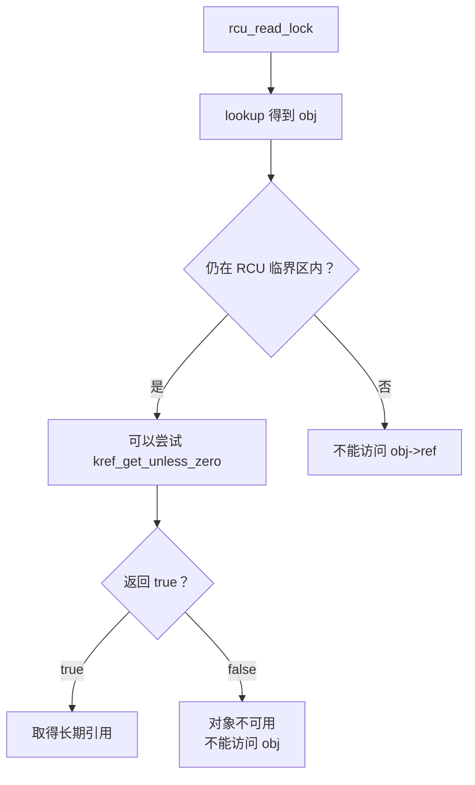

这一节的核心句：

```text
kref_get_unless_zero() 不是指针有效性证明；
它只能在指针已经被 RCU/锁证明暂时有效之后使用。
```

------

## 10.3_查找路径_从对象模型到_get_模板

### 10.3.1_基础对象模型

一个用于 RCU + kref 的私有对象通常长这样：

```c
struct my_obj {
	struct kref ref;
	struct rcu_head rcu;

	struct list_head node;

	spinlock_t lock;
	bool dying;

	int id;
	int state;
	void *priv;
};

static LIST_HEAD(my_obj_list);
static DEFINE_SPINLOCK(my_obj_list_lock);
```

每个成员的职责不同：

```text
ref：
    生命周期引用计数。

rcu：
    延迟释放对象内存。

node：
    挂入 RCU 可见集合。

my_obj_list_lock：
    保护集合更新，例如 list_add_rcu/list_del_rcu。

lock：
    保护对象内部状态，例如 dying/state。

dying：
    表示对象已经进入删除流程，不再允许新业务用户进入。
```

不要把它们混成一个问题。

```text
kref 不知道对象是否在 list 中；
RCU 不知道对象是否还有引用；
list_del_rcu 不知道对象业务上是否 dying；
dying 不负责内存延迟释放；
lock 不负责对象生命周期。
```

可以画成这样：

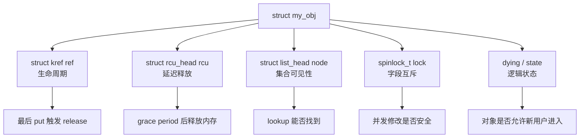

------

### 10.3.2_正确的_RCU_lookup_+_kref_模板

基础模板如下：

```c
static struct my_obj *my_obj_get_by_id(int id)
{
	struct my_obj *obj;
	struct my_obj *found = NULL;

	rcu_read_lock();

	list_for_each_entry_rcu(obj, &my_obj_list, node) {
		if (obj->id != id)
			continue;

		if (!kref_get_unless_zero(&obj->ref))
			break;

		found = obj;
		break;
	}

	rcu_read_unlock();

	return found;
}
```

这个函数的语义是：

```text
成功返回：
    调用者已经持有 obj 的一个 kref 引用。

失败返回：
    调用者没有任何引用，也不能访问查找过程中看到过的 obj。
```

调用者这样使用：

```c
obj = my_obj_get_by_id(id);
if (!obj)
	return -ENOENT;

/*
 * 这里已经离开 RCU 读侧临界区。
 * 继续使用 obj 的资格来自 kref_get_unless_zero() 成功，
 * 而不是来自 RCU。
 */
ret = do_something(obj);

kref_put(&obj->ref, my_obj_release);
return ret;
```

时序图如下：

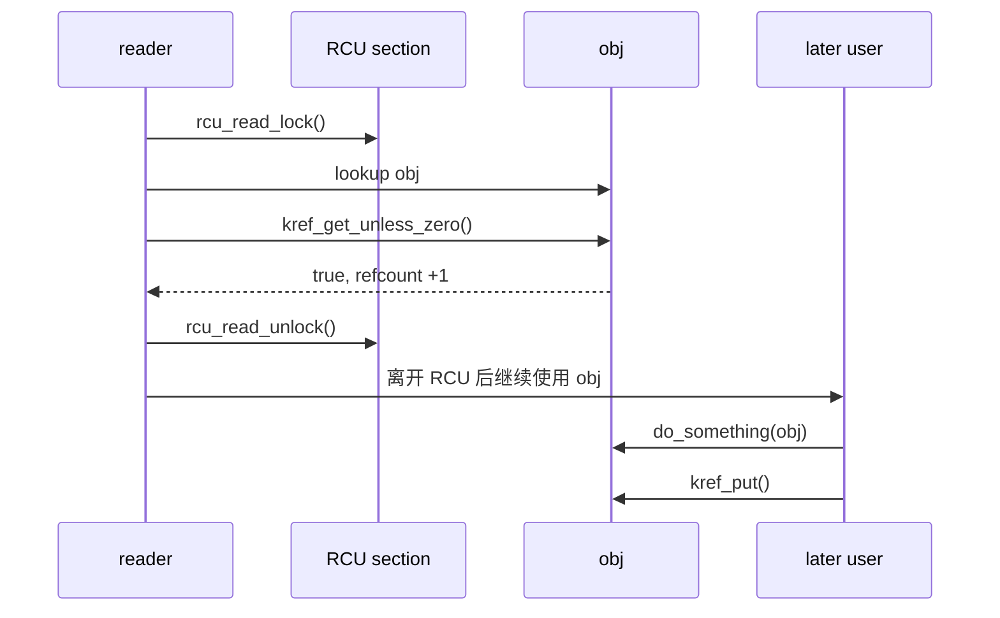

核心边界：

```text
RCU 只覆盖 lookup 到 get 成功这一段；
kref 覆盖 get 成功到 put 这一段。
```

------

### 10.3.3_lookup_成功_失败_删除并发的状态表

RCU lookup 中看到对象，不等于对象一定能用。

可以分成几种状态：

| lookup 时看到 obj | refcount 状态            | get_unless_zero  | 是否能返回 obj        | 含义                         |
| ----------------- | ------------------------ | ---------------- | --------------------- | ---------------------------- |
| 看不到            | 无关                     | 不执行           | 不能                  | 对象不存在或已经从集合删除   |
| 看得到            | > 0                      | 成功             | 可以初步返回          | 生命周期引用取得成功         |
| 看得到            | = 0                      | 失败             | 不能                  | 对象已经进入释放路径         |
| 看得到            | > 0，但 dying=true       | 成功后再检查失败 | 通常不能              | 对象还活着，但逻辑上正在删除 |
| 看得到旧对象      | 内存仍在 grace period 内 | 取决于 refcount  | 取决于 get 和状态检查 | RCU 允许旧读者看到旧对象     |

这张表要区分两层：

```text
生命周期是否存在：
    看 kref_get_unless_zero() 是否成功。

业务上是否可用：
    看 dying/state/锁保护下的状态检查。
```

所以严格版本的 lookup 通常还要检查 `dying`。

------

### 10.3.4_加入_dying_状态后的_lookup_模板

如果对象进入 remove 后，不允许新的业务用户进入，就需要 `dying` 状态。

```c
static struct my_obj *my_obj_get_by_id(int id)
{
	struct my_obj *obj;
	struct my_obj *found = NULL;

	rcu_read_lock();

	list_for_each_entry_rcu(obj, &my_obj_list, node) {
		if (obj->id != id)
			continue;

		if (!kref_get_unless_zero(&obj->ref))
			break;

		spin_lock(&obj->lock);
		if (obj->dying) {
			spin_unlock(&obj->lock);
			rcu_read_unlock();

			kref_put(&obj->ref, my_obj_release);
			return NULL;
		}
		spin_unlock(&obj->lock);

		found = obj;
		break;
	}

	rcu_read_unlock();
	return found;
}
```

这里有一个非常重要的点：

```text
dying 检查发生在 get 成功之后。
```

因为只有 get 成功后，才能保证对象在退出 RCU 之后仍然存在。

但是如果检查发现 `dying == true`，说明对象虽然还没释放，但逻辑上已经不允许新用户进入，所以必须立刻 put 掉刚刚取得的引用。

流程如下：

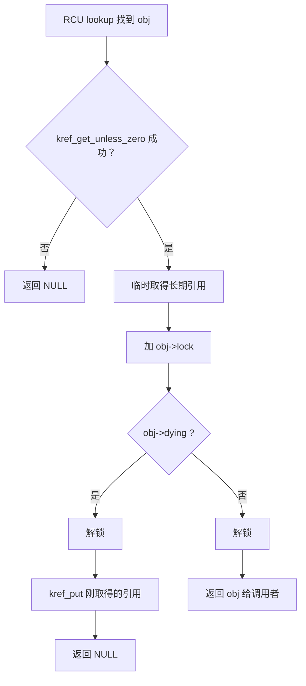

这说明：

```text
kref 只能证明对象还活着；
dying 才能证明对象还允许被新用户使用。
```

------

## 10.4_删除路径_取消发布_引用归零与延迟释放

### 10.4.1_remove_路径_先取消发布_再释放引用

推荐工程模型通常是：

```text
remove 路径负责取消发布；
已有引用继续使用；
最后一个 put 才 release；
release 使用 kfree_rcu/call_rcu 延迟释放内存。
```

也就是：

```text
先让新 lookup 找不到；
再等待旧引用自然收敛；
最后释放对象内存。
```

典型 remove 路径：

```c
static void my_obj_remove(struct my_obj *obj)
{
	spin_lock(&obj->lock);
	obj->dying = true;
	spin_unlock(&obj->lock);

	spin_lock(&my_obj_list_lock);
	list_del_rcu(&obj->node);
	spin_unlock(&my_obj_list_lock);

	kref_put(&obj->ref, my_obj_release);
}
```

语义：

```text
1. 设置 dying，阻止新业务用户进入。
2. list_del_rcu，把对象从 RCU 可见集合中脱链。
3. kref_put，释放发布者/集合持有的引用。
4. 如果还有旧用户持有引用，对象继续存在。
5. 最后一个旧用户 put 时，进入 release。
6. release 中使用 kfree_rcu/call_rcu 延迟释放内存。
```

流程图：

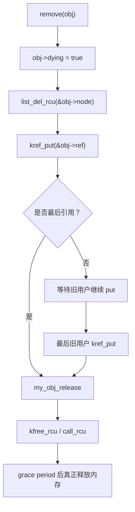

RCU list 文档说明，RCU 链表可以在读者遍历期间被更新，删除对象通常需要 RCU 延迟销毁模式；也就是说，`list_del_rcu()` 不是“所有读者立刻看不到”，而是让对象从结构中取消发布，并配合 grace period 处理旧读者。([Linux Kernel 文档](https://docs.kernel.org/RCU/listRCU.html?utm_source=chatgpt.com))

------

### 10.4.2_release_中为什么不能直接_kfree

普通 kref 对象可能这样写：

```c
static void my_obj_release(struct kref *ref)
{
	struct my_obj *obj = container_of(ref, struct my_obj, ref);

	kfree(obj);
}
```

但是如果对象曾经暴露在 RCU lookup 结构中，这样释放通常不安全。

错误写法：

```c
static void my_obj_release_bad(struct kref *ref)
{
	struct my_obj *obj = container_of(ref, struct my_obj, ref);

	kfree(obj);    /* 错误：旧 RCU 读者可能还在临界区内 */
}
```

原因：

```text
最后一个 kref_put 说明没有长期引用者了；
但这不等于没有 RCU 读者正在临时观察这个对象。
```

RCU 读者可能处在这个窗口：

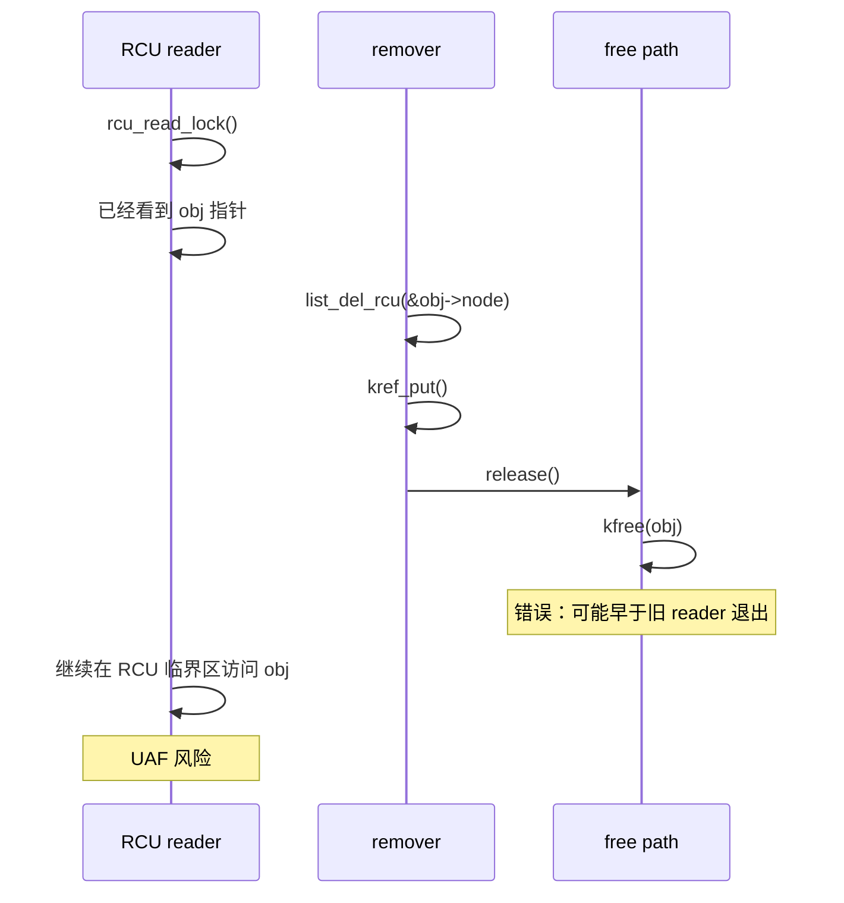

正确方式通常是：

```c
static void my_obj_release(struct kref *ref)
{
	struct my_obj *obj = container_of(ref, struct my_obj, ref);

	kfree_rcu(obj, rcu);
}
```

或者：

```c
static void my_obj_rcu_free(struct rcu_head *rcu)
{
	struct my_obj *obj = container_of(rcu, struct my_obj, rcu);

	kfree(obj);
}

static void my_obj_release(struct kref *ref)
{
	struct my_obj *obj = container_of(ref, struct my_obj, ref);

	call_rcu(&obj->rcu, my_obj_rcu_free);
}
```

在允许睡眠的上下文中，也可以使用：

```c
static void my_obj_release(struct kref *ref)
{
	struct my_obj *obj = container_of(ref, struct my_obj, ref);

	synchronize_rcu();
	kfree(obj);
}
```

但是要注意：

```text
synchronize_rcu() 可能睡眠；
不能放在持 spinlock 的路径；
不能放在原子上下文；
不适合高频释放路径。
```

因此工程上更常见的是：

```text
kfree_rcu(obj, rcu);
```

或者：

```text
call_rcu(&obj->rcu, callback);
```

kref 文档在 RCU 组合场景中也强调，`struct kref` 所在内存必须保持有效直到 RCU grace period 结束；可以使用 `kfree_rcu()`，也可以使用 `synchronize_rcu()` 后再释放。([Linux Kernel 文档](https://docs.kernel.org/core-api/kref.html?utm_source=chatgpt.com))

------

### 10.4.3_list_del_rcu()_kref_put()_kfree_rcu()_的职责边界

这三个动作经常被混在一起。

它们分别回答不同问题。

| 动作             | 回答的问题                   | 不回答的问题               |
| ---------------- | ---------------------------- | -------------------------- |
| `list_del_rcu()` | 对象是否还从 RCU 集合可见    | 对象是否还有引用           |
| `kref_put()`     | 当前持有者是否释放引用       | 对象内存是否可以立即 kfree |
| `release()`      | 最后一个引用归零后的销毁入口 | RCU 读者是否全部退出       |
| `kfree_rcu()`    | 对象内存什么时候真正释放     | 对象业务上是否可用         |

正确顺序通常是：

```text
先取消发布；
再释放发布引用；
最后延迟释放内存。
```

对应：

```c
list_del_rcu(&obj->node);
kref_put(&obj->ref, my_obj_release);

/* release 中 */
kfree_rcu(obj, rcu);
```

不能写成：

```c
list_del_rcu(&obj->node);
kfree(obj);     /* 错误 */
```

也不能以为：

```text
kref_put 归零 == 可以马上 kfree
```

在 RCU 可见对象中，最后一个 kref 归零只表示：

```text
没有长期引用者了。
```

但还要额外满足：

```text
旧 RCU 读侧临界区也结束了。
```

所以对象内存真正释放点是：

```text
最后一个 kref_put
    -> release
        -> kfree_rcu/call_rcu
            -> grace period 之后 kfree
```

可以画成状态图：

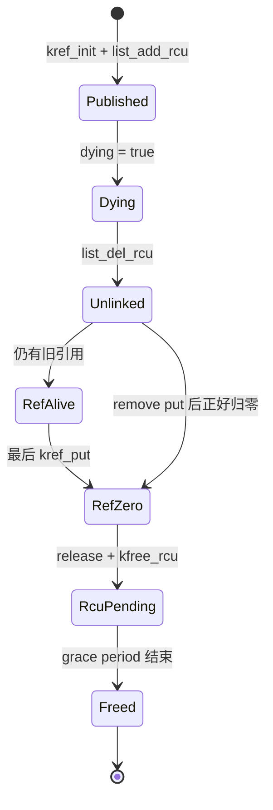

注意：

```text
Unlinked 不等于 Freed；
RefZero 不等于 Freed；
RcuPending 才表示等待 RCU grace period 后释放。
```

------

### 10.4.4_remove_和_release_是否必须在同一个地方脱链

不一定。

有两种模型。

#### (1)_模型_A_release_中脱链

这种模型是：

```text
对象只要还有引用，就仍然挂在集合中；
最后一个 put 触发 release；
release 负责 list_del_rcu + kfree_rcu。
```

示意：

```c
static void my_obj_release(struct kref *ref)
{
	struct my_obj *obj = container_of(ref, struct my_obj, ref);

	spin_lock(&my_obj_list_lock);
	list_del_rcu(&obj->node);
	spin_unlock(&my_obj_list_lock);

	kfree_rcu(obj, rcu);
}
```

这个模型的问题是：

```text
对象直到最后一个引用释放时才从集合消失；
如果你需要提前阻止新 lookup，这个模型不合适。
```

它只适合：

```text
对象生命周期结束和集合可见性结束完全绑定。
```

#### (2)_模型_B_remove_中脱链_release_只释放内存

更常见的工程模型是：

```text
remove 负责从集合取消发布；
release 只负责最终资源释放。
```

代码：

```c
static void my_obj_remove(struct my_obj *obj)
{
	spin_lock(&obj->lock);
	obj->dying = true;
	spin_unlock(&obj->lock);

	spin_lock(&my_obj_list_lock);
	list_del_rcu(&obj->node);
	spin_unlock(&my_obj_list_lock);

	kref_put(&obj->ref, my_obj_release);
}

static void my_obj_release(struct kref *ref)
{
	struct my_obj *obj = container_of(ref, struct my_obj, ref);

	kfree_rcu(obj, rcu);
}
```

这个模型更清楚：

```text
remove：
    停止新用户进入。

旧引用：
    继续完成已有工作。

release：
    最后引用归零后的最终销毁。

kfree_rcu：
    等旧 RCU 读者退出后释放内存。
```

建议优先使用模型 B。

原因是它把几个阶段拆开了：

```text
取消发布 != 没有引用；
没有引用 != 立即释放内存；
释放内存 != 状态机关闭。
```

------

## 10.5_读侧约束_临界区_字段一致性和子资源

### 10.5.1_RCU_读侧临界区内应该做什么

RCU 读侧临界区应该尽量短。

适合做：

```text
1. 遍历 RCU 保护的集合。
2. 比较 key/id。
3. 临时读取用于判断的字段。
4. 调用 kref_get_unless_zero()。
5. 成功后保存 obj。
6. 尽快 rcu_read_unlock()。
```

不适合做：

```text
1. 长时间业务处理。
2. 等待 completion。
3. 睡眠。
4. 复杂 IO。
5. 阻塞式回调。
6. 整个业务流程都包在 rcu_read_lock() 内。
```

推荐形态：

```c
obj = my_obj_get_by_id(id);
if (!obj)
	return -ENOENT;

/*
 * 业务处理放在 RCU 临界区之外。
 * 此时依靠 kref 保护对象生命周期。
 */
ret = my_obj_do_work(obj);

kref_put(&obj->ref, my_obj_release);
return ret;
```

不推荐：

```c
rcu_read_lock();

obj = lookup_obj_rcu(id);
if (obj)
	my_obj_do_long_work(obj);   /* 不推荐 */

rcu_read_unlock();
```

本质是：

```text
RCU 读侧只做查找和引用获取；
业务处理靠 kref 保护生命周期。
```

------

### 10.5.2_RCU_不保护对象字段一致性

这是本章最容易出错的点。

错误理解：

```text
我在 rcu_read_lock() 里面，所以 obj->state 一定不会并发变化。
```

这是错的。

RCU 保护的是：

```text
对象内存在读侧临界区内暂时不会被释放。
```

它不保证：

```text
对象字段不会被并发修改。
```

错误示例：

```c
rcu_read_lock();

obj = lookup_obj_rcu(id);
if (obj)
	obj->state++;     /* 错误：RCU 不是字段互斥锁 */

rcu_read_unlock();
```

如果 `state` 会并发修改，仍然需要：

```c
spin_lock(&obj->lock);
obj->state++;
spin_unlock(&obj->lock);
```

如果只是简单状态读取，可能需要：

```c
state = READ_ONCE(obj->state);
```

如果是状态切换，可能需要：

```text
对象锁；
原子变量；
seqlock；
copy-update；
状态机约束；
子系统自己的同步规则。
```

所以本章边界句是：

```text
RCU 保护对象存在性；
kref 保护长期生命周期；
锁/原子/状态机保护字段一致性。
```

对应图：

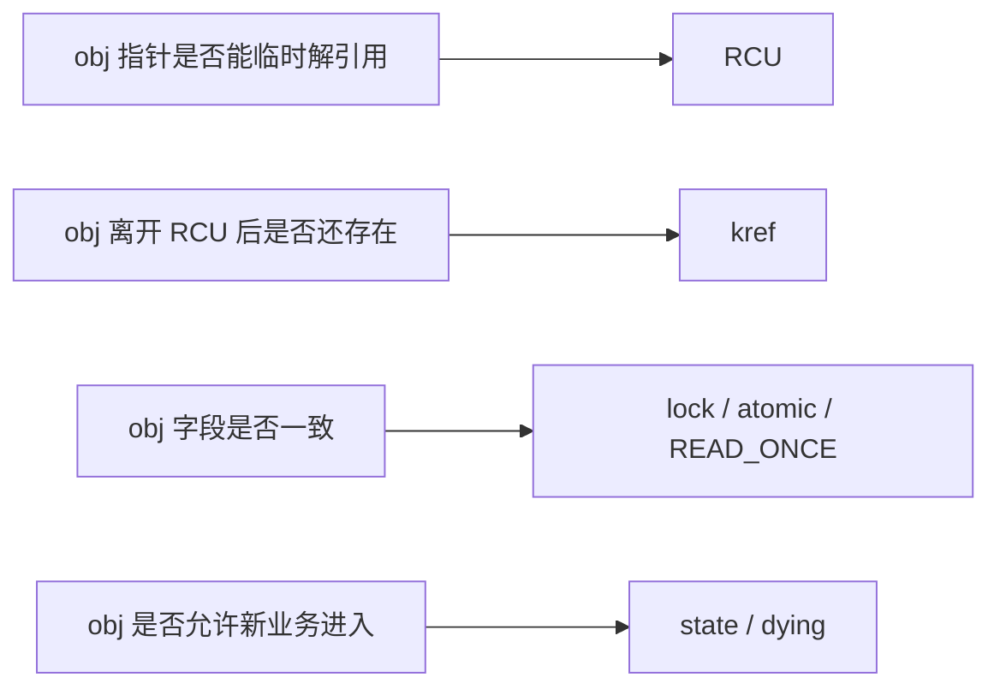

------

### 10.5.3_子资源释放不能早于_RCU_读者

假设对象里有子资源：

```c
struct my_obj {
	struct kref ref;
	struct rcu_head rcu;
	char *buf;
};
```

错误 release：

```c
static void my_obj_release(struct kref *ref)
{
	struct my_obj *obj = container_of(ref, struct my_obj, ref);

	kfree(obj->buf);
	kfree_rcu(obj, rcu);
}
```

这个写法不一定错，但有前提：

```text
RCU 读者不能通过 obj 访问 obj->buf。
```

如果 RCU 读者可能这样访问：

```c
rcu_read_lock();

obj = lookup_obj_rcu(id);
if (obj)
	use(obj->buf);

rcu_read_unlock();
```

那么 release 中提前 `kfree(obj->buf)` 就可能造成 UAF。

因为：

```text
obj 本体延迟释放了；
但 obj->buf 已经提前释放；
旧 RCU 读者仍然可能通过 obj 访问 buf。
```

正确方式之一：

```c
static void my_obj_rcu_free(struct rcu_head *rcu)
{
	struct my_obj *obj = container_of(rcu, struct my_obj, rcu);

	kfree(obj->buf);
	kfree(obj);
}

static void my_obj_release(struct kref *ref)
{
	struct my_obj *obj = container_of(ref, struct my_obj, ref);

	call_rcu(&obj->rcu, my_obj_rcu_free);
}
```

也可以设计成：

```text
1. RCU 读者不访问 buf；
2. 删除前先切断 buf 可见性；
3. 等待 grace period 后再释放 buf；
4. buf 本身也使用独立引用计数；
5. buf 使用 RCU 指针并单独 call_rcu 释放。
```

核心规则：

```text
凡是 RCU 读者可能通过 obj 访问到的内存，
都不能比 obj 本体更早释放。
```

------

## 10.6_完整工程模板

### 10.6.1_对象定义

```c
struct my_obj {
	struct kref ref;
	struct rcu_head rcu;
	struct list_head node;

	spinlock_t lock;
	bool dying;

	int id;
	int state;
};

static LIST_HEAD(my_obj_list);
static DEFINE_SPINLOCK(my_obj_list_lock);
```

------

### 10.6.2_release

release 需要提前声明，因为 lookup 失败回滚时可能要调用 `kref_put()`。

```c
static void my_obj_release(struct kref *ref)
{
	struct my_obj *obj = container_of(ref, struct my_obj, ref);

	kfree_rcu(obj, rcu);
}
```

语义：

```text
最后一个长期引用已经释放；
对象逻辑生命周期结束；
对象内存仍然延迟到 RCU grace period 后释放。
```

------

### 10.6.3_alloc

```c
static struct my_obj *my_obj_alloc(int id)
{
	struct my_obj *obj;

	obj = kzalloc(sizeof(*obj), GFP_KERNEL);
	if (!obj)
		return NULL;

	kref_init(&obj->ref);
	INIT_LIST_HEAD(&obj->node);
	spin_lock_init(&obj->lock);

	obj->id = id;
	obj->state = 0;
	obj->dying = false;

	return obj;
}
```

语义：

```text
kref_init 给创建者一个初始引用；
对象还没有发布到全局集合；
其他路径还不能 lookup 到它。
```

------

### 10.6.4_publish

```c
static void my_obj_publish(struct my_obj *obj)
{
	spin_lock(&my_obj_list_lock);
	list_add_rcu(&obj->node, &my_obj_list);
	spin_unlock(&my_obj_list_lock);
}
```

语义：

```text
对象加入 RCU 可见集合；
之后 RCU lookup 可能看到它；
发布前必须完成对象初始化。
```

------

### 10.6.5_get_by_id

```c
static struct my_obj *my_obj_get_by_id(int id)
{
	struct my_obj *obj;
	struct my_obj *found = NULL;

	rcu_read_lock();

	list_for_each_entry_rcu(obj, &my_obj_list, node) {
		if (obj->id != id)
			continue;

		if (!kref_get_unless_zero(&obj->ref))
			break;

		spin_lock(&obj->lock);
		if (obj->dying) {
			spin_unlock(&obj->lock);
			rcu_read_unlock();

			kref_put(&obj->ref, my_obj_release);
			return NULL;
		}
		spin_unlock(&obj->lock);

		found = obj;
		break;
	}

	rcu_read_unlock();

	return found;
}
```

成功返回时：

```text
调用者持有一个 kref 引用。
```

失败返回时：

```text
调用者没有引用；
不能访问 obj。
```

------

### 10.6.6_use

```c
static int my_obj_use(int id)
{
	struct my_obj *obj;
	int ret;

	obj = my_obj_get_by_id(id);
	if (!obj)
		return -ENOENT;

	ret = do_work_with_obj(obj);

	kref_put(&obj->ref, my_obj_release);
	return ret;
}
```

语义：

```text
lookup 和 get 在 RCU 临界区内完成；
业务处理在 RCU 临界区外完成；
业务处理期间依靠 kref 保证生命周期。
```

------

### 10.6.7_remove

```c
static void my_obj_remove(struct my_obj *obj)
{
	spin_lock(&obj->lock);
	obj->dying = true;
	spin_unlock(&obj->lock);

	spin_lock(&my_obj_list_lock);
	list_del_rcu(&obj->node);
	spin_unlock(&my_obj_list_lock);

	kref_put(&obj->ref, my_obj_release);
}
```

语义：

```text
dying：
    阻止新的业务用户进入。

list_del_rcu：
    从 RCU 可见集合中取消发布。

kref_put：
    释放发布者/集合持有的引用。

release：
    最后引用归零后的销毁入口。

kfree_rcu：
    延迟到 grace period 后释放内存。
```

完整生命周期：

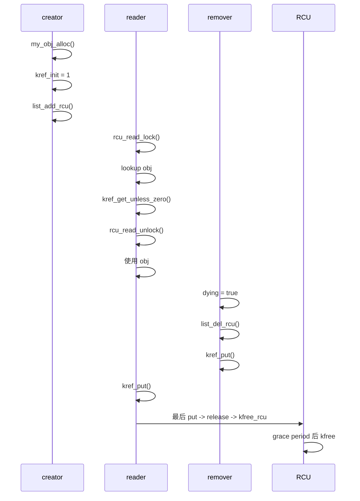

------

## 10.7_常见错误模式

### 10.7.1_错误一_RCU_lookup_后裸_kref_get

```c
rcu_read_lock();

obj = lookup_obj_rcu(id);
if (obj)
	kref_get(&obj->ref);   /* 错误 */

rcu_read_unlock();
```

错因：

```text
RCU 不保证 refcount 非 0；
kref_get 可能复活已经归零的对象。
```

正确写法：

```c
if (obj && kref_get_unless_zero(&obj->ref))
	found = obj;
```

------

### 10.7.2_错误二_离开_RCU_后才_get_unless_zero

```c
rcu_read_lock();
obj = lookup_obj_rcu(id);
rcu_read_unlock();

if (obj && kref_get_unless_zero(&obj->ref))   /* 错误 */
	return obj;
```

错因：

```text
rcu_read_unlock() 之后，obj 指针本身已经不受 RCU 保护。
```

正确写法：

```c
rcu_read_lock();

obj = lookup_obj_rcu(id);
if (obj && kref_get_unless_zero(&obj->ref))
	found = obj;

rcu_read_unlock();
```

------

### 10.7.3_错误三_list_del_rcu_后直接_kfree

```c
list_del_rcu(&obj->node);
kfree(obj);     /* 错误 */
```

错因：

```text
旧 RCU 读者可能仍然持有 obj 指针。
```

正确写法：

```c
list_del_rcu(&obj->node);
kref_put(&obj->ref, my_obj_release);

/* release 中 */
kfree_rcu(obj, rcu);
```

------

### 10.7.4_错误四_以为_list_del_rcu_后所有读者都看不到对象

错误理解：

```text
我已经 list_del_rcu() 了，所以没有任何读者能看到 obj。
```

正确理解：

```text
新的 lookup 不应该再稳定找到它；
但已经进入 RCU 读侧临界区的旧读者，仍然可能看到它。
```

所以如果删除后不允许业务使用，需要：

```text
dying 标志；
状态机；
对象锁；
get 成功后的二次检查。
```

------

### 10.7.5_错误五_把_RCU_当字段锁

```c
rcu_read_lock();

obj = lookup_obj_rcu(id);
if (obj)
	obj->state++;

rcu_read_unlock();
```

错因：

```text
RCU 不保护字段互斥。
```

正确写法可能是：

```c
spin_lock(&obj->lock);
obj->state++;
spin_unlock(&obj->lock);
```

------

### 10.7.6_错误六_get_成功后不检查_dying

```c
if (kref_get_unless_zero(&obj->ref))
	return obj;
```

这个写法只证明：

```text
对象生命周期还没结束。
```

它不能证明：

```text
对象业务上仍然允许新用户进入。
```

如果 remove 后禁止新用户进入，需要：

```c
if (!kref_get_unless_zero(&obj->ref))
	return NULL;

spin_lock(&obj->lock);
if (obj->dying) {
	spin_unlock(&obj->lock);
	kref_put(&obj->ref, my_obj_release);
	return NULL;
}
spin_unlock(&obj->lock);
```

------

### 10.7.7_错误七_release_中提前释放_RCU_子资源

```c
static void my_obj_release(struct kref *ref)
{
	struct my_obj *obj = container_of(ref, struct my_obj, ref);

	kfree(obj->buf);       /* 可能错误 */
	kfree_rcu(obj, rcu);
}
```

如果 RCU 读者可能访问 `obj->buf`，那么 `buf` 也必须延迟释放。

正确写法之一：

```c
static void my_obj_rcu_free(struct rcu_head *rcu)
{
	struct my_obj *obj = container_of(rcu, struct my_obj, rcu);

	kfree(obj->buf);
	kfree(obj);
}

static void my_obj_release(struct kref *ref)
{
	struct my_obj *obj = container_of(ref, struct my_obj, ref);

	call_rcu(&obj->rcu, my_obj_rcu_free);
}
```

------

## 10.8_与第_8_9_章的关系

第 8 章讲的是：

```text
lookup 场景为什么不能裸 get；
kref_get_unless_zero() 解决什么；
lookup 成功和失败怎么判断。
```

第 9 章讲的是：

```text
kref 和锁怎么组合；
锁如何保护集合关系和字段互斥；
remove/unlink 和 put 的顺序。
```

本章讲的是：

```text
把 lookup 保护从 mutex 扩展到 RCU；
用 RCU 保护读侧查找窗口；
用 kref_get_unless_zero() 把临时指针转换成长期引用；
用 kfree_rcu/call_rcu/synchronize_rcu 处理最后内存释放。
```

三章关系：

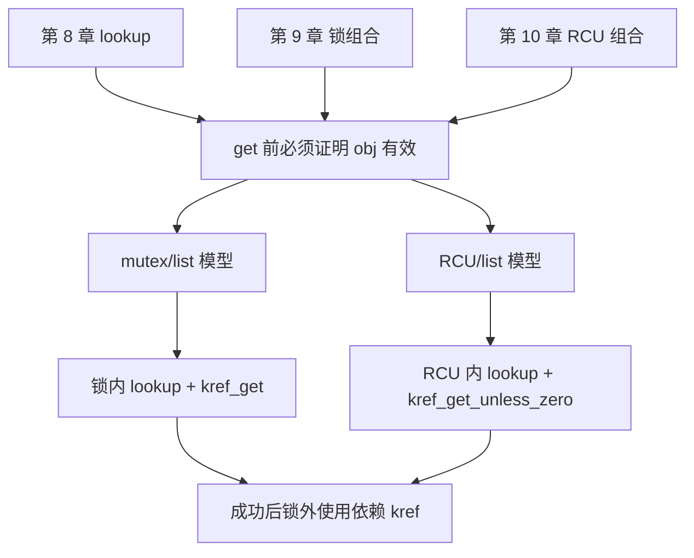

一句话区别：

```text
mutex lookup 中，锁保护“查找 + get”窗口；
RCU lookup 中，RCU 保护“查找 + get_unless_zero”窗口。
```

------

## 10.9_本章检查清单

写 RCU + kref 代码时，至少检查下面这些问题：

```text
1. 对象是否真的挂在 RCU 保护的结构中？
2. 读侧 lookup 是否包在 rcu_read_lock()/rcu_read_unlock() 内？
3. 遍历是否使用 list_for_each_entry_rcu/hlist_for_each_entry_rcu/rcu_dereference 等 RCU 接口？
4. lookup 找到对象后，是否在 RCU 临界区内调用 kref_get_unless_zero()？
5. 是否检查了 kref_get_unless_zero() 的返回值？
6. 成功 get 后，是否允许离开 RCU 再使用对象？
7. 失败 get 后，是否完全不再访问对象？
8. 如果 remove 后不允许新用户进入，是否有 dying/state 检查？
9. dying/state 检查失败时，是否 put 掉刚取得的引用？
10. remove 路径是否先设置 dying，再从 RCU 集合脱链？
11. list_del_rcu 后是否避免直接 kfree？
12. release 中是否使用 kfree_rcu/call_rcu/synchronize_rcu？
13. struct kref 所在对象内存是否撑过 RCU grace period？
14. RCU 读者可能访问的子资源是否也延迟释放？
15. 对象字段是否另有锁、原子或状态机保护？
16. RCU 读侧临界区是否足够短？
17. 是否把 list_del_rcu、kref_put、release、kfree_rcu 的职责分清？
```

------

## 10.10_本章小结

本章核心可以压缩成下面几句话：

```text
RCU 不是引用计数。

RCU 只能保证读侧临界区内，临时看到的旧对象内存不会被立即释放；
它不会自动给对象增加长期引用。

kref 不是 lookup 保护。

kref 只有在 get 成功之后，才保护对象生命周期；
在 get 之前，必须先由 RCU 或锁证明对象指针本身暂时有效。

RCU lookup 中不能裸 kref_get()。

因为对象可能已经进入 refcount 为 0 的释放流程；
必须使用 kref_get_unless_zero()，并检查返回值。

list_del_rcu() 不是 kfree。

它只是把对象从 RCU 可见结构中取消发布；
真正释放对象内存必须等待 RCU grace period。

最终模型是：

RCU 保护查找窗口；
kref 保护长期持有；
dying/state 保护逻辑可用性；
锁/原子保护字段一致性；
kfree_rcu/call_rcu/synchronize_rcu 保护最终内存回收。
```

最重要的一句话：

```text
RCU 让你安全地看到对象；
kref 让你安全地带走对象。
```
