# 第10章\_kref\_与\_RCU

## 10.1\_本章导读\_RCU\_负责看到\_kref\_负责带走

上一章让查找者持集合锁，完成定位和取得引用后才解锁。只要成员拥有的那份引用也在这把锁下撤销，查找者就能证明地址有效且计数为正。这套协议简单可靠；对象少、查找不频繁，或集合锁没有成为等待点时，可以继续使用。

现在考虑读多写少的配置表：每次请求都要按编号查找，更新者偶尔撤下一项。集合锁仍会把不同读者的定位阶段串起来；读者 A 占着锁时，B 即使只读取另一个编号，也必须等待。把读侧锁直接删掉又不行：A 刚读到节点地址，更新者就可能摘链并释放，A 随后的 get 将访问已经失效的计数器。

**RCU（Read-Copy Update，读—复制—更新）** 用另一套发布、读取与回收协议覆盖这个临时地址窗口。这里先回顾它的公共保证：更新者撤销入口后，延迟回收必须跨过相关旧读侧临界区；这个等待边界称为 **宽限期（grace period，GP）**。`rcu_read_lock()` 不会为随便一个裸指针施加魔法保护。对象必须沿匹配的 RCU 入口读取，更新者必须按约定保留旧存储，保证才成立。

本章只解决配置对象被查到后，还要离开读区继续使用的情况。RCU 不会因这个读者退出而自动新增一份引用，因此要在地址仍受保护时接到 kref。完整 RCU 的宽限期通信、CPU/任务状态与实现差异仍沿[RCU 专题](../../synchronization_and_asynchrony/synchronization/rcu/大纲.md)阅读；这里不把后台实现假装成对象自身一个等待计数。

先选定所有权：入口直接指向同一个内嵌 kref 的对象，发布成功后入口拥有一份；撤下立即归还入口份额；最后归还触发 release，由 release 安排 RCU 延迟回收。下文把它称为 **先归零、再过 GP** 协议。它允许旧读者看到计数已经归零但存储尚在的对象，所以取得时要处理失败。

还存在另一种合法协议：入口撤下后，那一份引用继续保留到 GP 完成，随后才 put；此时相关旧读者在读区内可以由这份引用证明正计数。两者的差异来自 **谁把哪一份保留到何时**，不能概括为“凡 RCU 都只能使用条件 get”。本章先建立第一种，第二种只用于边界比较；完整替代及复合版本根的责任见[所有权拓扑选择](../../synchronization_and_asynchrony/synchronization/rcu/P21_RCU_kref与复合对象生命周期.md#21.1_先按分配与所有权拓扑选模板)。

读者、更新者与回收者操作的不是同一个状态机字段，而是几组相互约束的状态：

| 阶段 | 状态落点、写入者和读取者 | 退出条件 |
| --- | --- | --- |
| S0 私有创建 | 创建者初始化 id、node、ref，尚无共享入口 | 字段和初始责任准备好 |
| S1 发布 | 更新者在更新锁下接入链；入口取得约定份额，读者按 RCU 遍历读取节点 | 读者可能保存旧地址 |
| S2 取得 | 读者仍在读区，条件原子增加对象 ref；更新者可并发推进 S3 | 成功带走一份，失败不带走 |
| S3 撤下 | 更新者在更新锁下摘链，再归还入口份额；旧读者本地地址不会被远程清空 | 后续按引用数进入 S4，或等旧持有者归还 |
| S4 归零 | 最后一份 put 同步调用 release，模块安排对象 rcu_head 的延迟回收 | 对象仍须供旧临时读者完成受允许访问 |
| S5 回收 | RCU 后端完成所需宽限期，回收路径释放存储 | 此后没有旧读区或拥有者可访问 |

S2 与 S3/S4 可以交错；表格不表示所有线程依次经过一条线性状态机。业务许可又是单独一组状态，后文才增加，不能由 ref 或成员关系代替。

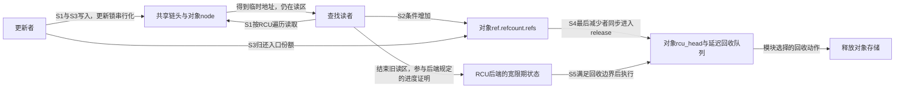
```mermaid
flowchart LR
    U[更新者] -->|S1与S3写入，更新锁串行化| N[共享链头与对象node]
    R[查找读者] -->|S1按RCU遍历读取| N
    N -->|得到临时地址，仍在读区| R
    R -->|S2条件增加| C[对象ref.refcount.refs]
    U -->|S3归还入口份额| C
    C -->|S4最后减少者同步进入release| H[对象rcu_head与延迟回收队列]
    R -->|结束旧读区，参与后端规定的进度证明| B[RCU后端的宽限期状态]
    B -->|S5满足回收边界后执行| H
    H -->|模块选择的回收动作| F[释放对象存储]
```

这里的读区退出箭头不表示每次 unlock 都发送消息。当前固定基线是 Tiny RCU，其他配置可能使用 Tree；具体状态地址、静止态报告和回调调度先从[RCU 源码总索引](../../../../research/source_reading/rcu/navigation/P01_Linux_6.12_RCU源码总阅读索引.md#1.2_先建立源码分类坐标)选择后端。本章仅依赖公共保护边界，不把双 CPU 示意当作当前单核配置的实测。

条件引用的固定证据先从[kref 源码总索引](../../../../research/source_reading/kref/navigation/P01_Linux_6.12_kref源码阅读索引.md#1.2_按问题进入已落地证据)进入，再看[条件窗口模块](../../../../research/source_reading/kref/navigation/P03_条件取得与查找窗口导读.md#3.2_从观察到自己持有)。NXP 官方固定提交 dfaf2136deb2af2e60b994421281ba42f1c087e0 的 Documentation/core-api/kref.rst 要求条件取得与查找处于同一保护区，也要求包含 kref 的内存跨过相应宽限期；本地实验提交不作证据。

## 10.2\_边界\_先分清谁保护什么

### 10.2.1\_RCU\_和\_kref\_分别保护什么

先沿一次查询划出两段重叠窗口。读者从链中拿到地址时，尚未拥有引用；从条件取得成功开始，到最终 put 之前，才有自己的份额。取得动作必须落在第一段以内，两个窗口才不会断开。

| 机制及前提 | 提供的保证 | 仍需另外证明 |
| --- | --- | --- |
| 匹配的 RCU 读取与延迟回收协议 | 本次临时观察所需存储未被回收 | 计数是否正、字段是否允许访问 |
| 正确取得且尚未归还的 kref 份额 | 本对象尚不能完成最终回收 | 当前仍在表中、业务仍接纳、字段同步 |
| 更新锁 | 遵循它的写入者不会同时破坏链关系 | 无锁读者所需的节点发布及退休规则 |
| 对象锁与业务检查 | 锁内检查和操作按应用协议一致 | 解锁以后状态不再变化并无保证 |
| 延迟回收请求 | 回收动作受 GP 边界约束 | 请求排出不等于已经执行，也不自动等待长期引用 |

RCU 并不与 kref 自动互相通知。第一种协议是应用的 release 接到延迟回收；第二种协议是应用的 GP 回调归还保留份额。若两段代码各以为另一段负责保活，就会出现回收空隙；若各自安排一次独立 free，又会重复释放。

先比较三个关键瞬间，再运行一个完整 C 模型：

| 同一个旧读者的观察点 | 先归零再过 GP | 发布份额跨 GP |
| --- | --- | --- |
| 保存地址后，更新者撤下入口 | 入口立即 put，可能归零 | 入口份额转为退休责任，暂不 put |
| 旧读者仍在读区中取得 | 条件增加可能失败，存储仍在 | 保留份额保证正计数；仍须保护发布与地址 |
| GP 后是否可以直接 free | 还须遵循最后归还排出的回收协议 | 先 put 保留份额；若有长期读者，仍不能 free |

完整 [rcu_take_window.c](../../../../labs/kernel/object_lifetime/materials/rcu_take_window.c) 用观察者账本安排两种先后顺序。它既不实现 RCU，也不模拟原子指令；alive 只是账本状态，程序从未实际分配或解引用已释放内存。

```c
#include <assert.h>
#include <stdbool.h>
#include <stdio.h>

/* 观察者账本；字段不是 Linux RCU 或 kref 的内部实现。 */
enum retire_order { ZERO_THEN_GP, GP_THEN_PUT };
struct object_model {
    enum retire_order order;
    unsigned int refs;
    bool published, in_read, reader_owns, publish_owns;
    bool gp_done, free_pending, alive;
    unsigned int release_calls, free_calls;
};

static void reclaim(struct object_model *obj)
{
    assert(obj->alive && obj->refs == 0 && obj->gp_done && !obj->in_read);
    obj->alive = false;
    ++obj->free_calls;
}

static void drop_ref(struct object_model *obj)
{
    assert(obj->alive && obj->refs > 0);
    if (--obj->refs != 0)
        return;
    ++obj->release_calls;
    if (obj->order == ZERO_THEN_GP)
        obj->free_pending = true; /* 最后归还只提出延迟回收请求。 */
    else
        reclaim(obj); /* 发布份额跨过 GP，因此现在允许直接回收。 */
}

static void unpublish(struct object_model *obj)
{
    assert(obj->published && obj->publish_owns);
    obj->published = false;
    if (obj->order == ZERO_THEN_GP) {
        obj->publish_owns = false;
        drop_ref(obj);
    }
}

static bool try_take(struct object_model *obj)
{
    assert(obj->alive && obj->in_read && !obj->reader_owns);
    if (obj->refs == 0)
        return false;
    ++obj->refs;
    obj->reader_owns = true;
    return true;
}

static bool finish_gp(struct object_model *obj)
{
    assert(!obj->published);
    if (obj->in_read)
        return false; /* 旧读者尚在，模拟器不能宣布本次 GP 完成。 */
    if (obj->order == ZERO_THEN_GP && !obj->free_pending)
        return false; /* 本模型此时尚未由 release 排出回收请求。 */
    obj->gp_done = true;
    if (obj->order == GP_THEN_PUT) {
        assert(obj->publish_owns);
        obj->publish_owns = false;
        drop_ref(obj);
    } else {
        obj->free_pending = false;
        reclaim(obj);
    }
    return true;
}

static void reader_put(struct object_model *obj)
{
    assert(obj->reader_owns && !obj->in_read);
    obj->reader_owns = false;
    drop_ref(obj);
}

static void run_case(enum retire_order order, bool reader_first)
{
    struct object_model obj = {
        .order = order, .refs = 1, .published = true,
        .in_read = true, .publish_owns = true, .alive = true
    }; /* S1：入口已有一份，读者已在读区中保存旧地址。 */
    bool taken;
    if (reader_first) {
        taken = try_take(&obj);
        unpublish(&obj);
    } else {
        unpublish(&obj);
        taken = try_take(&obj);
    }
    assert(taken == (reader_first || order == GP_THEN_PUT));
    assert(obj.alive && !finish_gp(&obj));
    printf("%s %s: taken=%d refs=%u alive=%d\n",
           order == ZERO_THEN_GP ? "zero_then_gp" : "gp_then_put",
           reader_first ? "reader_first" : "remove_first", taken, obj.refs, obj.alive);
    obj.in_read = false; /* 模拟旧读者退出，不会自动归还长期份额。 */
    if (order == GP_THEN_PUT) {
        assert(finish_gp(&obj));
        assert(obj.alive && obj.reader_owns && obj.refs == 1);
        reader_put(&obj); /* GP 已完，长期使用者现在才退出。 */
    } else {
        if (taken)
            reader_put(&obj);
        assert(finish_gp(&obj));
    }
    assert(!obj.alive && !obj.publish_owns && !obj.reader_owns);
    assert(obj.release_calls == 1 && obj.free_calls == 1);
}

int main(void)
{
    run_case(ZERO_THEN_GP, true);
    run_case(ZERO_THEN_GP, false);
    run_case(GP_THEN_PUT, true);
    run_case(GP_THEN_PUT, false);
    puts("four ownership orders passed");
    return 0;
}
```

在仓库根目录编译运行，不定义 NDEBUG，因为断言参与轨迹执行：

```bash
cc -std=c11 -Wall -Wextra -Werror -O2 \
  labs/kernel/object_lifetime/materials/rcu_take_window.c -o /tmp/rcu_take_window
/tmp/rcu_take_window
```

预测后再对照输出：

```text
zero_then_gp reader_first: taken=1 refs=1 alive=1
zero_then_gp remove_first: taken=0 refs=0 alive=1
gp_then_put reader_first: taken=1 refs=2 alive=1
gp_then_put remove_first: taken=1 refs=2 alive=1
four ownership orders passed
```

第二行最关键：refs 已为零，alive 仍为真，取得失败。第四行中入口已经撤下，refs 却仍有退休份额和读者份额共两份。随后模型先完成 GP、归还退休份额，再让长期读者归还，证明“GP 完成”也不是“所有引用结束”。四条轨迹最终各触发一次 release 和一次回收。

finish_gp 被旧读区挡住时返回 false，是模型显式安排的检查结果，不是实际 RCU API，也不是用一个全局读者计数解释内核实现。严格 C11 编译运行已通过；没有真实线程、内存序、内核 GP 调度、目标模块装卸或运行时间测量。

### 10.2.2\_为什么\_RCU\_lookup\_不能直接\_kref\_get()

本节标题限定在已经选定的“撤下立即 put、归零后延迟回收”协议。错误不在于地址必然失效，而在于地址有效与计数为正不再同时成立。

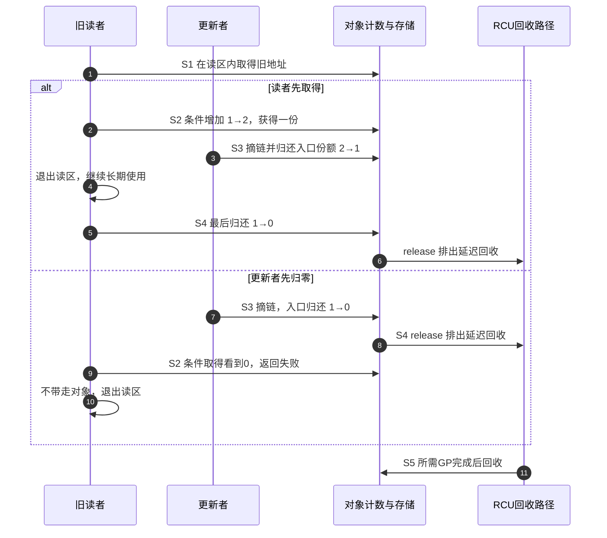
```mermaid
sequenceDiagram
    autonumber
    participant R as 旧读者
    participant U as 更新者
    participant O as 对象计数与存储
    participant Q as RCU回收路径
    R->>O: S1 在读区内取得旧地址
    alt 读者先取得
        R->>O: S2 条件增加 1→2，获得一份
        U->>O: S3 摘链并归还入口份额 2→1
        R->>R: 退出读区，继续长期使用
        R->>O: S4 最后归还 1→0
        O->>Q: release 排出延迟回收
    else 更新者先归零
        U->>O: S3 摘链，入口归还 1→0
        O->>Q: S4 release 排出延迟回收
        R->>O: S2 条件取得看到0，返回失败
        R->>R: 不带走对象，退出读区
    end
    Q->>O: S5 所需GP完成后回收
```

读者若在第二条分支调用普通 get，就违反“已有正引用保护”的前提。固定 refcount 实现会检测从零增加并进入异常处理，不能把这写成一次合法的“0→1复活”；详见[普通增加与异常检测](../../../../research/source_reading/kref/source_explanations/include/linux/refcount.h.md#1.2_普通增加与异常检测)。诊断和饱和不是取得成功协议，也不能撤销已进入 release 的动作。

如果改用发布份额跨 GP 的完整协议，相关旧读者始终受那一份保护，普通 get 可以成立；代价是退休份额与回调必须正确交接，而且查找成功仍不意味着业务许可。不能只替换一个 get 调用就宣称切换协议。继续使用条件 get 也不能修复错误的发布/回收顺序。

相比上一章，读者不再为定位取得同一把集合锁，但仍要原子写共享计数；高频 get/put 仍可能使计数所在缓存行在 CPU 间迁移。更新侧又要保留退休内存并处理回收进度。只有读写比例、临界区内容及这些成本适合时，组合才有价值，不能从“读侧无集合锁”直接推出整体更快。

### 10.2.3\_kref\_get\_unless\_zero()\_解决什么\_不解决什么

条件取得回答“地址已经有效时，本次能否从尚未归零的计数取得一份”。精确实现见[kref 条件入口](../../../../research/source_reading/kref/source_explanations/include/linux/kref.h.md#1.7_有效地址上的条件取得)。它不检查对象是否仍登记、不建立字段发布可见性，也不替调用者检查业务门。异常饱和值下的非零返回更不能作为系统健康证明。

下面是接口片段，lookup_obj_rcu 表示后文才实现的匹配 RCU 查找，不是可直接编译的完整函数：

```c
rcu_read_lock();
obj = lookup_obj_rcu(id);
if (obj && kref_get_unless_zero(&obj->ref))
    found = obj; /* 成功取得自己的份额，之后才允许带出读区。 */
rcu_read_unlock();
```

把条件取得移到 unlock 之后，会留下没有任何保护的空隙。更新者可能在这个空隙完成 GP 并回收，随后访问 obj->ref 本身就已非法；“除非为零”无法在访问无效地址之前替你探测。

失败也要分清期限：没有取得长期引用，因此不能把这个地址带出读区继续使用。它不意味着仍在正确读区内连遍历所需的链接都不能读取；这种临时读取能否成立取决于 RCU 链表保留旧路径的协议。业务字段或子资源则未必保留到同一时刻，不能由外壳仍在推出任意字段都可用。

先完成两项练习。把模型中第二种协议的 GP 之后 reader_put 提前到 GP 之前，预测最终由谁触发 release；再尝试把第一种协议的 reclaim 提前到旧读区结束前，解释是哪条断言阻止它。只在账本上构造反例，不用真实释放后解引用演示错误。下一节把这些责任映射到对象字段、查找循环和业务检查。

## 10.3\_查找路径\_从对象模型到\_get\_模板

### 10.3.1\_基础对象模型

一个用于 RCU + kref 的私有对象通常长这样：

```c
struct my_obj {
	struct kref ref;
	struct rcu_head rcu;

	struct list_head node;

	spinlock_t lock;
	bool dying;

	int id;
	int state;
	void *priv;
};

static LIST_HEAD(my_obj_list);
static DEFINE_SPINLOCK(my_obj_list_lock);
```

每个成员的职责不同：

```text
ref：
    生命周期引用计数。

rcu：
    延迟释放对象内存。

node：
    挂入 RCU 可见集合。

my_obj_list_lock：
    保护集合更新，例如 list_add_rcu/list_del_rcu。

lock：
    保护对象内部状态，例如 dying/state。

dying：
    表示对象已经进入删除流程，不再允许新业务用户进入。
```

不要把它们混成一个问题。

```text
kref 不知道对象是否在 list 中；
RCU 不知道对象是否还有引用；
list_del_rcu 不知道对象业务上是否 dying；
dying 不负责内存延迟释放；
lock 不负责对象生命周期。
```

可以画成这样：

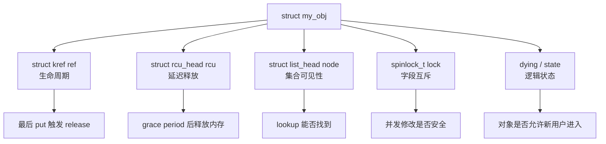
```mermaid
flowchart TB
    OBJ["struct my_obj"]

    OBJ --> REF["struct kref ref<br/>生命周期"]
    OBJ --> RCU["struct rcu_head rcu<br/>延迟释放"]
    OBJ --> NODE["struct list_head node<br/>集合可见性"]
    OBJ --> LOCK["spinlock_t lock<br/>字段互斥"]
    OBJ --> STATE["dying / state<br/>逻辑状态"]

    REF --> A["最后 put 触发 release"]
    RCU --> B["grace period 后释放内存"]
    NODE --> C["lookup 能否找到"]
    LOCK --> D["并发修改是否安全"]
    STATE --> E["对象是否允许新用户进入"]
```

------

### 10.3.2\_正确的\_RCU\_lookup\_+\_kref\_模板

基础模板如下：

```c
static struct my_obj *my_obj_get_by_id(int id)
{
	struct my_obj *obj;
	struct my_obj *found = NULL;

	rcu_read_lock();

	list_for_each_entry_rcu(obj, &my_obj_list, node) {
		if (obj->id != id)
			continue;

		if (!kref_get_unless_zero(&obj->ref))
			break;

		found = obj;
		break;
	}

	rcu_read_unlock();

	return found;
}
```

这个函数的语义是：

```text
成功返回：
    调用者已经持有 obj 的一个 kref 引用。

失败返回：
    调用者没有任何引用，也不能访问查找过程中看到过的 obj。
```

调用者这样使用：

```c
obj = my_obj_get_by_id(id);
if (!obj)
	return -ENOENT;

/*
 * 这里已经离开 RCU 读侧临界区。
 * 继续使用 obj 的资格来自 kref_get_unless_zero() 成功，
 * 而不是来自 RCU。
 */
ret = do_something(obj);

kref_put(&obj->ref, my_obj_release);
return ret;
```

时序图如下：

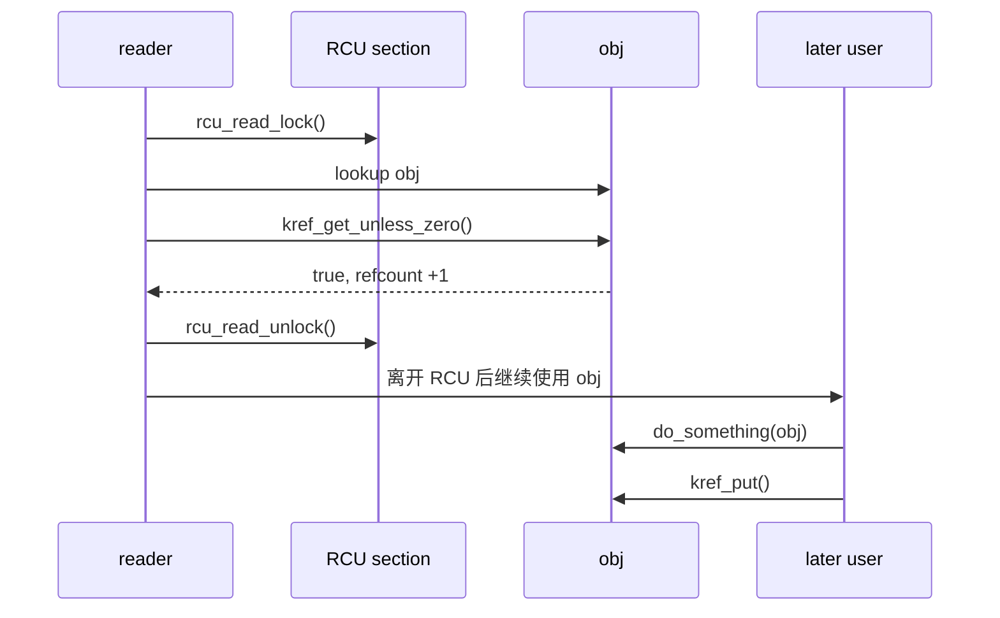
```mermaid
sequenceDiagram
    participant Reader as reader
    participant RCU as RCU section
    participant Obj as obj
    participant Later as later user

    Reader->>RCU: rcu_read_lock()
    Reader->>Obj: lookup obj
    Reader->>Obj: kref_get_unless_zero()
    Obj-->>Reader: true, refcount +1
    Reader->>RCU: rcu_read_unlock()

    Reader->>Later: 离开 RCU 后继续使用 obj
    Later->>Obj: do_something(obj)
    Later->>Obj: kref_put()
```

核心边界：

```text
RCU 只覆盖 lookup 到 get 成功这一段；
kref 覆盖 get 成功到 put 这一段。
```

------

### 10.3.3\_lookup\_成功\_失败\_删除并发的状态表

RCU lookup 中看到对象，不等于对象一定能用。

可以分成几种状态：

| lookup 时看到 obj | refcount 状态            | get_unless_zero  | 是否能返回 obj        | 含义                         |
| ----------------- | ------------------------ | ---------------- | --------------------- | ---------------------------- |
| 看不到            | 无关                     | 不执行           | 不能                  | 对象不存在或已经从集合删除   |
| 看得到            | > 0                      | 成功             | 可以初步返回          | 生命周期引用取得成功         |
| 看得到            | = 0                      | 失败             | 不能                  | 对象已经进入释放路径         |
| 看得到            | > 0，但 dying=true       | 成功后再检查失败 | 通常不能              | 对象还活着，但逻辑上正在删除 |
| 看得到旧对象      | 内存仍在 grace period 内 | 取决于 refcount  | 取决于 get 和状态检查 | RCU 允许旧读者看到旧对象     |

这张表要区分两层：

```text
生命周期是否存在：
    看 kref_get_unless_zero() 是否成功。

业务上是否可用：
    看 dying/state/锁保护下的状态检查。
```

所以严格版本的 lookup 通常还要检查 `dying`。

------

### 10.3.4\_加入\_dying\_状态后的\_lookup\_模板

如果对象进入 remove 后，不允许新的业务用户进入，就需要 `dying` 状态。

```c
static struct my_obj *my_obj_get_by_id(int id)
{
	struct my_obj *obj;
	struct my_obj *found = NULL;

	rcu_read_lock();

	list_for_each_entry_rcu(obj, &my_obj_list, node) {
		if (obj->id != id)
			continue;

		if (!kref_get_unless_zero(&obj->ref))
			break;

		spin_lock(&obj->lock);
		if (obj->dying) {
			spin_unlock(&obj->lock);
			rcu_read_unlock();

			kref_put(&obj->ref, my_obj_release);
			return NULL;
		}
		spin_unlock(&obj->lock);

		found = obj;
		break;
	}

	rcu_read_unlock();
	return found;
}
```

这里有一个非常重要的点：

```text
dying 检查发生在 get 成功之后。
```

因为只有 get 成功后，才能保证对象在退出 RCU 之后仍然存在。

但是如果检查发现 `dying == true`，说明对象虽然还没释放，但逻辑上已经不允许新用户进入，所以必须立刻 put 掉刚刚取得的引用。

流程如下：

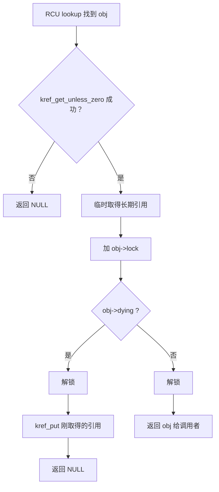
```mermaid
flowchart TD
    A["RCU lookup 找到 obj"] --> B{"kref_get_unless_zero 成功？"}
    B -- "否" --> C["返回 NULL"]
    B -- "是" --> D["临时取得长期引用"]
    D --> E["加 obj->lock"]
    E --> F{"obj->dying ?"}
    F -- "是" --> G["解锁"]
    G --> H["kref_put 刚取得的引用"]
    H --> I["返回 NULL"]
    F -- "否" --> J["解锁"]
    J --> K["返回 obj 给调用者"]
```

这说明：

```text
kref 只能证明对象还活着；
dying 才能证明对象还允许被新用户使用。
```

------

## 10.4\_删除路径\_取消发布\_引用归零与延迟释放

### 10.4.1\_remove\_路径\_先取消发布\_再释放引用

推荐工程模型通常是：

```text
remove 路径负责取消发布；
已有引用继续使用；
最后一个 put 才 release；
release 使用 kfree_rcu/call_rcu 延迟释放内存。
```

也就是：

```text
先让新 lookup 找不到；
再等待旧引用自然收敛；
最后释放对象内存。
```

典型 remove 路径：

```c
static void my_obj_remove(struct my_obj *obj)
{
	spin_lock(&obj->lock);
	obj->dying = true;
	spin_unlock(&obj->lock);

	spin_lock(&my_obj_list_lock);
	list_del_rcu(&obj->node);
	spin_unlock(&my_obj_list_lock);

	kref_put(&obj->ref, my_obj_release);
}
```

语义：

```text
1. 设置 dying，阻止新业务用户进入。
2. list_del_rcu，把对象从 RCU 可见集合中脱链。
3. kref_put，释放发布者/集合持有的引用。
4. 如果还有旧用户持有引用，对象继续存在。
5. 最后一个旧用户 put 时，进入 release。
6. release 中使用 kfree_rcu/call_rcu 延迟释放内存。
```

流程图：

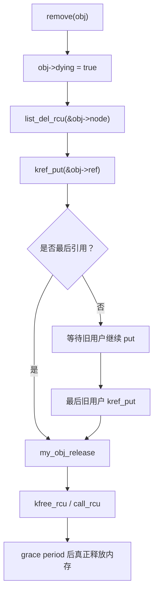
```mermaid
flowchart TD
    A["remove(obj)"] --> B["obj->dying = true"]
    B --> C["list_del_rcu(&obj->node)"]
    C --> D["kref_put(&obj->ref)"]
    D --> E{"是否最后引用？"}
    E -- "否" --> F["等待旧用户继续 put"]
    E -- "是" --> G["my_obj_release"]
    F --> H["最后旧用户 kref_put"]
    H --> G
    G --> I["kfree_rcu / call_rcu"]
    I --> J["grace period 后真正释放内存"]
```

RCU list 文档说明，RCU 链表可以在读者遍历期间被更新，删除对象通常需要 RCU 延迟销毁模式；也就是说，`list_del_rcu()` 不是“所有读者立刻看不到”，而是让对象从结构中取消发布，并配合 grace period 处理旧读者。([Linux Kernel 文档](https://docs.kernel.org/RCU/listRCU.html?utm_source=chatgpt.com))

------

### 10.4.2\_release\_中为什么不能直接\_kfree

普通 kref 对象可能这样写：

```c
static void my_obj_release(struct kref *ref)
{
	struct my_obj *obj = container_of(ref, struct my_obj, ref);

	kfree(obj);
}
```

但是如果对象曾经暴露在 RCU lookup 结构中，这样释放通常不安全。

错误写法：

```c
static void my_obj_release_bad(struct kref *ref)
{
	struct my_obj *obj = container_of(ref, struct my_obj, ref);

	kfree(obj);    /* 错误：旧 RCU 读者可能还在临界区内 */
}
```

原因：

```text
最后一个 kref_put 说明没有长期引用者了；
但这不等于没有 RCU 读者正在临时观察这个对象。
```

RCU 读者可能处在这个窗口：

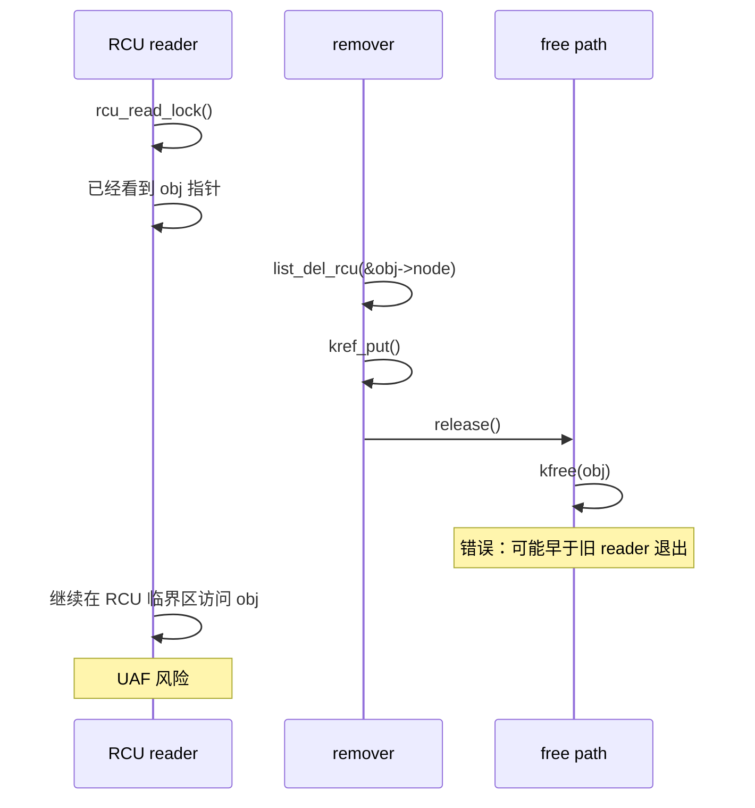
```mermaid
sequenceDiagram
    participant Reader as RCU reader
    participant Remover as remover
    participant Free as free path

    Reader->>Reader: rcu_read_lock()
    Reader->>Reader: 已经看到 obj 指针

    Remover->>Remover: list_del_rcu(&obj->node)
    Remover->>Remover: kref_put()
    Remover->>Free: release()

    Free->>Free: kfree(obj)
    Note over Free: 错误：可能早于旧 reader 退出

    Reader->>Reader: 继续在 RCU 临界区访问 obj
    Note over Reader: UAF 风险
```

正确方式通常是：

```c
static void my_obj_release(struct kref *ref)
{
	struct my_obj *obj = container_of(ref, struct my_obj, ref);

	kfree_rcu(obj, rcu);
}
```

或者：

```c
static void my_obj_rcu_free(struct rcu_head *rcu)
{
	struct my_obj *obj = container_of(rcu, struct my_obj, rcu);

	kfree(obj);
}

static void my_obj_release(struct kref *ref)
{
	struct my_obj *obj = container_of(ref, struct my_obj, ref);

	call_rcu(&obj->rcu, my_obj_rcu_free);
}
```

在允许睡眠的上下文中，也可以使用：

```c
static void my_obj_release(struct kref *ref)
{
	struct my_obj *obj = container_of(ref, struct my_obj, ref);

	synchronize_rcu();
	kfree(obj);
}
```

但是要注意：

```text
synchronize_rcu() 可能睡眠；
不能放在持 spinlock 的路径；
不能放在原子上下文；
不适合高频释放路径。
```

因此工程上更常见的是：

```c
kfree_rcu(obj, rcu);
```

或者：

```c
call_rcu(&obj->rcu, callback);
```

kref 文档在 RCU 组合场景中也强调，`struct kref` 所在内存必须保持有效直到 RCU grace period 结束；可以使用 `kfree_rcu()`，也可以使用 `synchronize_rcu()` 后再释放。([Linux Kernel 文档](https://docs.kernel.org/core-api/kref.html?utm_source=chatgpt.com))

------

### 10.4.3\_list\_del\_rcu()\_kref\_put()\_kfree\_rcu()\_的职责边界

这三个动作经常被混在一起。

它们分别回答不同问题。

| 动作             | 回答的问题                   | 不回答的问题               |
| ---------------- | ---------------------------- | -------------------------- |
| `list_del_rcu()` | 对象是否还从 RCU 集合可见    | 对象是否还有引用           |
| `kref_put()`     | 当前持有者是否释放引用       | 对象内存是否可以立即 kfree |
| `release()`      | 最后一个引用归零后的销毁入口 | RCU 读者是否全部退出       |
| `kfree_rcu()`    | 对象内存什么时候真正释放     | 对象业务上是否可用         |

正确顺序通常是：

```text
先取消发布；
再释放发布引用；
最后延迟释放内存。
```

对应：

```c
list_del_rcu(&obj->node);
kref_put(&obj->ref, my_obj_release);

/* release 中 */
kfree_rcu(obj, rcu);
```

不能写成：

```c
list_del_rcu(&obj->node);
kfree(obj);     /* 错误 */
```

也不能以为：

```text
kref_put 归零 == 可以马上 kfree
```

在 RCU 可见对象中，最后一个 kref 归零只表示：

```text
没有长期引用者了。
```

但还要额外满足：

```text
旧 RCU 读侧临界区也结束了。
```

所以对象内存真正释放点是：

```text
最后一个 kref_put
    -> release
        -> kfree_rcu/call_rcu
            -> grace period 之后 kfree
```

可以画成状态图：

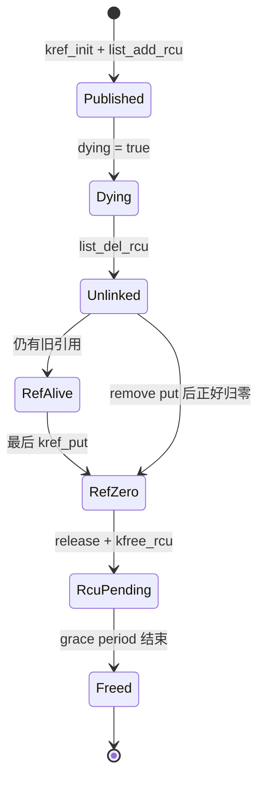
```mermaid
stateDiagram-v2
    [*] --> Published: kref_init + list_add_rcu
    Published --> Dying: dying = true
    Dying --> Unlinked: list_del_rcu
    Unlinked --> RefAlive: 仍有旧引用
    RefAlive --> RefZero: 最后 kref_put
    Unlinked --> RefZero: remove put 后正好归零
    RefZero --> RcuPending: release + kfree_rcu
    RcuPending --> Freed: grace period 结束
    Freed --> [*]
```

注意：

```text
Unlinked 不等于 Freed；
RefZero 不等于 Freed；
RcuPending 才表示等待 RCU grace period 后释放。
```

------

### 10.4.4\_remove\_和\_release\_是否必须在同一个地方脱链

不一定。

有两种模型。

#### (1)\_模型\_A\_release\_中脱链

这种模型是：

```text
对象只要还有引用，就仍然挂在集合中；
最后一个 put 触发 release；
release 负责 list_del_rcu + kfree_rcu。
```

示意：

```c
static void my_obj_release(struct kref *ref)
{
	struct my_obj *obj = container_of(ref, struct my_obj, ref);

	spin_lock(&my_obj_list_lock);
	list_del_rcu(&obj->node);
	spin_unlock(&my_obj_list_lock);

	kfree_rcu(obj, rcu);
}
```

这个模型的问题是：

```text
对象直到最后一个引用释放时才从集合消失；
如果你需要提前阻止新 lookup，这个模型不合适。
```

它只适合：

```text
对象生命周期结束和集合可见性结束完全绑定。
```

#### (2)\_模型\_B\_remove\_中脱链\_release\_只释放内存

更常见的工程模型是：

```text
remove 负责从集合取消发布；
release 只负责最终资源释放。
```

代码：

```c
static void my_obj_remove(struct my_obj *obj)
{
	spin_lock(&obj->lock);
	obj->dying = true;
	spin_unlock(&obj->lock);

	spin_lock(&my_obj_list_lock);
	list_del_rcu(&obj->node);
	spin_unlock(&my_obj_list_lock);

	kref_put(&obj->ref, my_obj_release);
}

static void my_obj_release(struct kref *ref)
{
	struct my_obj *obj = container_of(ref, struct my_obj, ref);

	kfree_rcu(obj, rcu);
}
```

这个模型更清楚：

```text
remove：
    停止新用户进入。

旧引用：
    继续完成已有工作。

release：
    最后引用归零后的最终销毁。

kfree_rcu：
    等旧 RCU 读者退出后释放内存。
```

建议优先使用模型 B。

原因是它把几个阶段拆开了：

```text
取消发布 != 没有引用；
没有引用 != 立即释放内存；
释放内存 != 状态机关闭。
```

------

## 10.5\_读侧约束\_临界区\_字段一致性和子资源

### 10.5.1\_RCU\_读侧临界区内应该做什么

RCU 读侧临界区应该尽量短。

适合做：

```text
1. 遍历 RCU 保护的集合。
2. 比较 key/id。
3. 临时读取用于判断的字段。
4. 调用 kref_get_unless_zero()。
5. 成功后保存 obj。
6. 尽快 rcu_read_unlock()。
```

不适合做：

```text
1. 长时间业务处理。
2. 等待 completion。
3. 睡眠。
4. 复杂 IO。
5. 阻塞式回调。
6. 整个业务流程都包在 rcu_read_lock() 内。
```

推荐形态：

```c
obj = my_obj_get_by_id(id);
if (!obj)
	return -ENOENT;

/*
 * 业务处理放在 RCU 临界区之外。
 * 此时依靠 kref 保护对象生命周期。
 */
ret = my_obj_do_work(obj);

kref_put(&obj->ref, my_obj_release);
return ret;
```

不推荐：

```c
rcu_read_lock();

obj = lookup_obj_rcu(id);
if (obj)
	my_obj_do_long_work(obj);   /* 不推荐 */

rcu_read_unlock();
```

本质是：

```text
RCU 读侧只做查找和引用获取；
业务处理靠 kref 保护生命周期。
```

------

### 10.5.2\_RCU\_不保护对象字段一致性

这是本章最容易出错的点。

错误理解：

```text
我在 rcu_read_lock() 里面，所以 obj->state 一定不会并发变化。
```

这是错的。

RCU 保护的是：

```text
对象内存在读侧临界区内暂时不会被释放。
```

它不保证：

```text
对象字段不会被并发修改。
```

错误示例：

```c
rcu_read_lock();

obj = lookup_obj_rcu(id);
if (obj)
	obj->state++;     /* 错误：RCU 不是字段互斥锁 */

rcu_read_unlock();
```

如果 `state` 会并发修改，仍然需要：

```c
spin_lock(&obj->lock);
obj->state++;
spin_unlock(&obj->lock);
```

如果只是简单状态读取，可能需要：

```c
state = READ_ONCE(obj->state);
```

如果是状态切换，可能需要：

```text
对象锁；
原子变量；
seqlock；
copy-update；
状态机约束；
子系统自己的同步规则。
```

所以本章边界句是：

```text
RCU 保护对象存在性；
kref 保护长期生命周期；
锁/原子/状态机保护字段一致性。
```

对应图：

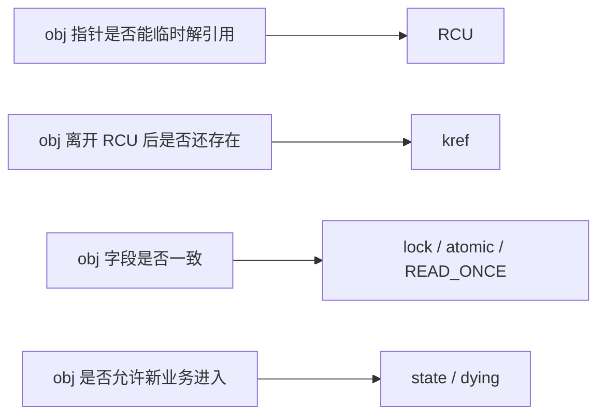
```mermaid
flowchart LR
    A["obj 指针是否能临时解引用"] --> B["RCU"]
    C["obj 离开 RCU 后是否还存在"] --> D["kref"]
    E["obj 字段是否一致"] --> F["lock / atomic / READ_ONCE"]
    G["obj 是否允许新业务进入"] --> H["state / dying"]
```

------

### 10.5.3\_子资源释放不能早于\_RCU\_读者

假设对象里有子资源：

```c
struct my_obj {
	struct kref ref;
	struct rcu_head rcu;
	char *buf;
};
```

错误 release：

```c
static void my_obj_release(struct kref *ref)
{
	struct my_obj *obj = container_of(ref, struct my_obj, ref);

	kfree(obj->buf);
	kfree_rcu(obj, rcu);
}
```

这个写法不一定错，但有前提：

```text
RCU 读者不能通过 obj 访问 obj->buf。
```

如果 RCU 读者可能这样访问：

```c
rcu_read_lock();

obj = lookup_obj_rcu(id);
if (obj)
	use(obj->buf);

rcu_read_unlock();
```

那么 release 中提前 `kfree(obj->buf)` 就可能造成 UAF。

因为：

```text
obj 本体延迟释放了；
但 obj->buf 已经提前释放；
旧 RCU 读者仍然可能通过 obj 访问 buf。
```

正确方式之一：

```c
static void my_obj_rcu_free(struct rcu_head *rcu)
{
	struct my_obj *obj = container_of(rcu, struct my_obj, rcu);

	kfree(obj->buf);
	kfree(obj);
}

static void my_obj_release(struct kref *ref)
{
	struct my_obj *obj = container_of(ref, struct my_obj, ref);

	call_rcu(&obj->rcu, my_obj_rcu_free);
}
```

也可以设计成：

```text
1. RCU 读者不访问 buf；
2. 删除前先切断 buf 可见性；
3. 等待 grace period 后再释放 buf；
4. buf 本身也使用独立引用计数；
5. buf 使用 RCU 指针并单独 call_rcu 释放。
```

核心规则：

```text
凡是 RCU 读者可能通过 obj 访问到的内存，
都不能比 obj 本体更早释放。
```

------

## 10.6\_完整工程模板

### 10.6.1\_对象定义

```c
struct my_obj {
	struct kref ref;
	struct rcu_head rcu;
	struct list_head node;

	spinlock_t lock;
	bool dying;

	int id;
	int state;
};

static LIST_HEAD(my_obj_list);
static DEFINE_SPINLOCK(my_obj_list_lock);
```

------

### 10.6.2\_release

release 需要提前声明，因为 lookup 失败回滚时可能要调用 `kref_put()`。

```c
static void my_obj_release(struct kref *ref)
{
	struct my_obj *obj = container_of(ref, struct my_obj, ref);

	kfree_rcu(obj, rcu);
}
```

语义：

```text
最后一个长期引用已经释放；
对象逻辑生命周期结束；
对象内存仍然延迟到 RCU grace period 后释放。
```

------

### 10.6.3\_alloc

```c
static struct my_obj *my_obj_alloc(int id)
{
	struct my_obj *obj;

	obj = kzalloc(sizeof(*obj), GFP_KERNEL);
	if (!obj)
		return NULL;

	kref_init(&obj->ref);
	INIT_LIST_HEAD(&obj->node);
	spin_lock_init(&obj->lock);

	obj->id = id;
	obj->state = 0;
	obj->dying = false;

	return obj;
}
```

语义：

```text
kref_init 给创建者一个初始引用；
对象还没有发布到全局集合；
其他路径还不能 lookup 到它。
```

------

### 10.6.4\_publish

```c
static void my_obj_publish(struct my_obj *obj)
{
	spin_lock(&my_obj_list_lock);
	list_add_rcu(&obj->node, &my_obj_list);
	spin_unlock(&my_obj_list_lock);
}
```

语义：

```text
对象加入 RCU 可见集合；
之后 RCU lookup 可能看到它；
发布前必须完成对象初始化。
```

------

### 10.6.5\_get\_by\_id

```c
static struct my_obj *my_obj_get_by_id(int id)
{
	struct my_obj *obj;
	struct my_obj *found = NULL;

	rcu_read_lock();

	list_for_each_entry_rcu(obj, &my_obj_list, node) {
		if (obj->id != id)
			continue;

		if (!kref_get_unless_zero(&obj->ref))
			break;

		spin_lock(&obj->lock);
		if (obj->dying) {
			spin_unlock(&obj->lock);
			rcu_read_unlock();

			kref_put(&obj->ref, my_obj_release);
			return NULL;
		}
		spin_unlock(&obj->lock);

		found = obj;
		break;
	}

	rcu_read_unlock();

	return found;
}
```

成功返回时：

```text
调用者持有一个 kref 引用。
```

失败返回时：

```text
调用者没有引用；
不能访问 obj。
```

------

### 10.6.6\_use

```c
static int my_obj_use(int id)
{
	struct my_obj *obj;
	int ret;

	obj = my_obj_get_by_id(id);
	if (!obj)
		return -ENOENT;

	ret = do_work_with_obj(obj);

	kref_put(&obj->ref, my_obj_release);
	return ret;
}
```

语义：

```text
lookup 和 get 在 RCU 临界区内完成；
业务处理在 RCU 临界区外完成；
业务处理期间依靠 kref 保证生命周期。
```

------

### 10.6.7\_remove

```c
static void my_obj_remove(struct my_obj *obj)
{
	spin_lock(&obj->lock);
	obj->dying = true;
	spin_unlock(&obj->lock);

	spin_lock(&my_obj_list_lock);
	list_del_rcu(&obj->node);
	spin_unlock(&my_obj_list_lock);

	kref_put(&obj->ref, my_obj_release);
}
```

语义：

```text
dying：
    阻止新的业务用户进入。

list_del_rcu：
    从 RCU 可见集合中取消发布。

kref_put：
    释放发布者/集合持有的引用。

release：
    最后引用归零后的销毁入口。

kfree_rcu：
    延迟到 grace period 后释放内存。
```

完整生命周期：

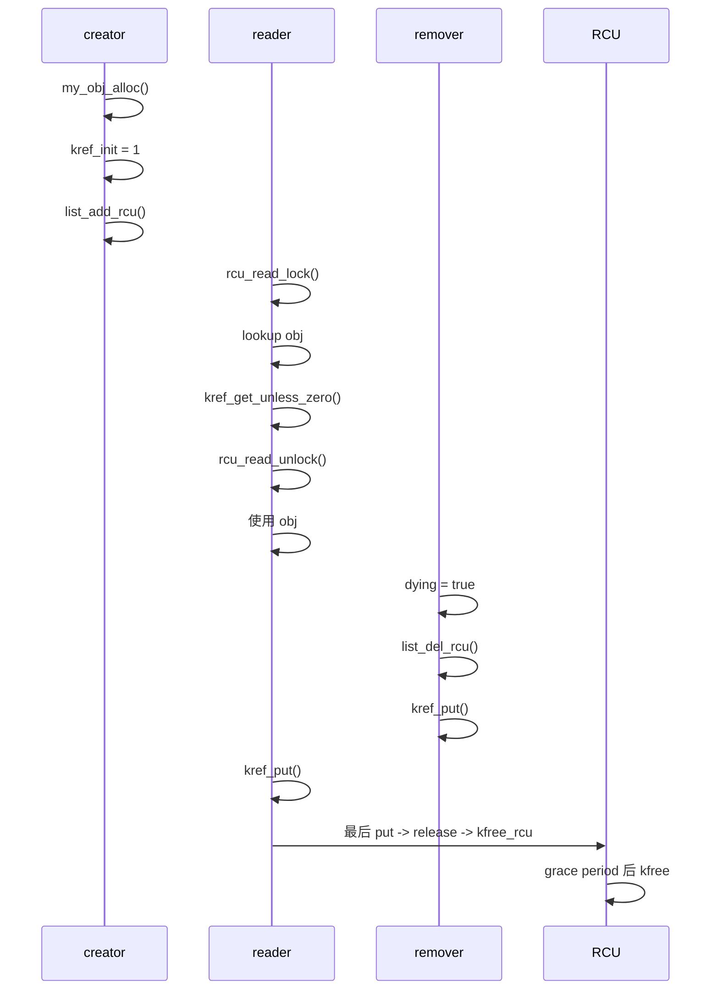
```mermaid
sequenceDiagram
    participant Creator as creator
    participant Reader as reader
    participant Remover as remover
    participant RCU as RCU

    Creator->>Creator: my_obj_alloc()
    Creator->>Creator: kref_init = 1
    Creator->>Creator: list_add_rcu()

    Reader->>Reader: rcu_read_lock()
    Reader->>Reader: lookup obj
    Reader->>Reader: kref_get_unless_zero()
    Reader->>Reader: rcu_read_unlock()
    Reader->>Reader: 使用 obj

    Remover->>Remover: dying = true
    Remover->>Remover: list_del_rcu()
    Remover->>Remover: kref_put()

    Reader->>Reader: kref_put()
    Reader->>RCU: 最后 put -> release -> kfree_rcu
    RCU->>RCU: grace period 后 kfree
```

------

## 10.7\_常见错误模式

### 10.7.1\_错误一\_RCU\_lookup\_后裸\_kref\_get

```c
rcu_read_lock();

obj = lookup_obj_rcu(id);
if (obj)
	kref_get(&obj->ref);   /* 错误 */

rcu_read_unlock();
```

错因：

```text
RCU 不保证 refcount 非 0；
kref_get 可能复活已经归零的对象。
```

正确写法：

```c
if (obj && kref_get_unless_zero(&obj->ref))
	found = obj;
```

------

### 10.7.2\_错误二\_离开\_RCU\_后才\_get\_unless\_zero

```c
rcu_read_lock();
obj = lookup_obj_rcu(id);
rcu_read_unlock();

if (obj && kref_get_unless_zero(&obj->ref))   /* 错误 */
	return obj;
```

错因：

```text
rcu_read_unlock() 之后，obj 指针本身已经不受 RCU 保护。
```

正确写法：

```c
rcu_read_lock();

obj = lookup_obj_rcu(id);
if (obj && kref_get_unless_zero(&obj->ref))
	found = obj;

rcu_read_unlock();
```

------

### 10.7.3\_错误三\_list\_del\_rcu\_后直接\_kfree

```c
list_del_rcu(&obj->node);
kfree(obj);     /* 错误 */
```

错因：

```text
旧 RCU 读者可能仍然持有 obj 指针。
```

正确写法：

```c
list_del_rcu(&obj->node);
kref_put(&obj->ref, my_obj_release);

/* release 中 */
kfree_rcu(obj, rcu);
```

------

### 10.7.4\_错误四\_以为\_list\_del\_rcu\_后所有读者都看不到对象

错误理解：

```text
我已经 list_del_rcu() 了，所以没有任何读者能看到 obj。
```

正确理解：

```text
新的 lookup 不应该再稳定找到它；
但已经进入 RCU 读侧临界区的旧读者，仍然可能看到它。
```

所以如果删除后不允许业务使用，需要：

```text
dying 标志；
状态机；
对象锁；
get 成功后的二次检查。
```

------

### 10.7.5\_错误五\_把\_RCU\_当字段锁

```c
rcu_read_lock();

obj = lookup_obj_rcu(id);
if (obj)
	obj->state++;

rcu_read_unlock();
```

错因：

```text
RCU 不保护字段互斥。
```

正确写法可能是：

```c
spin_lock(&obj->lock);
obj->state++;
spin_unlock(&obj->lock);
```

------

### 10.7.6\_错误六\_get\_成功后不检查\_dying

```c
if (kref_get_unless_zero(&obj->ref))
	return obj;
```

这个写法只证明：

```text
对象生命周期还没结束。
```

它不能证明：

```text
对象业务上仍然允许新用户进入。
```

如果 remove 后禁止新用户进入，需要：

```c
if (!kref_get_unless_zero(&obj->ref))
	return NULL;

spin_lock(&obj->lock);
if (obj->dying) {
	spin_unlock(&obj->lock);
	kref_put(&obj->ref, my_obj_release);
	return NULL;
}
spin_unlock(&obj->lock);
```

------

### 10.7.7\_错误七\_release\_中提前释放\_RCU\_子资源

```c
static void my_obj_release(struct kref *ref)
{
	struct my_obj *obj = container_of(ref, struct my_obj, ref);

	kfree(obj->buf);       /* 可能错误 */
	kfree_rcu(obj, rcu);
}
```

如果 RCU 读者可能访问 `obj->buf`，那么 `buf` 也必须延迟释放。

正确写法之一：

```c
static void my_obj_rcu_free(struct rcu_head *rcu)
{
	struct my_obj *obj = container_of(rcu, struct my_obj, rcu);

	kfree(obj->buf);
	kfree(obj);
}

static void my_obj_release(struct kref *ref)
{
	struct my_obj *obj = container_of(ref, struct my_obj, ref);

	call_rcu(&obj->rcu, my_obj_rcu_free);
}
```

------

## 10.8\_与第\_8\_9\_章的关系

第 8 章讲的是：

```text
lookup 场景为什么不能裸 get；
kref_get_unless_zero() 解决什么；
lookup 成功和失败怎么判断。
```

第 9 章讲的是：

```text
kref 和锁怎么组合；
锁如何保护集合关系和字段互斥；
remove/unlink 和 put 的顺序。
```

本章讲的是：

```text
把 lookup 保护从 mutex 扩展到 RCU；
用 RCU 保护读侧查找窗口；
用 kref_get_unless_zero() 把临时指针转换成长期引用；
用 kfree_rcu/call_rcu/synchronize_rcu 处理最后内存释放。
```

三章关系：

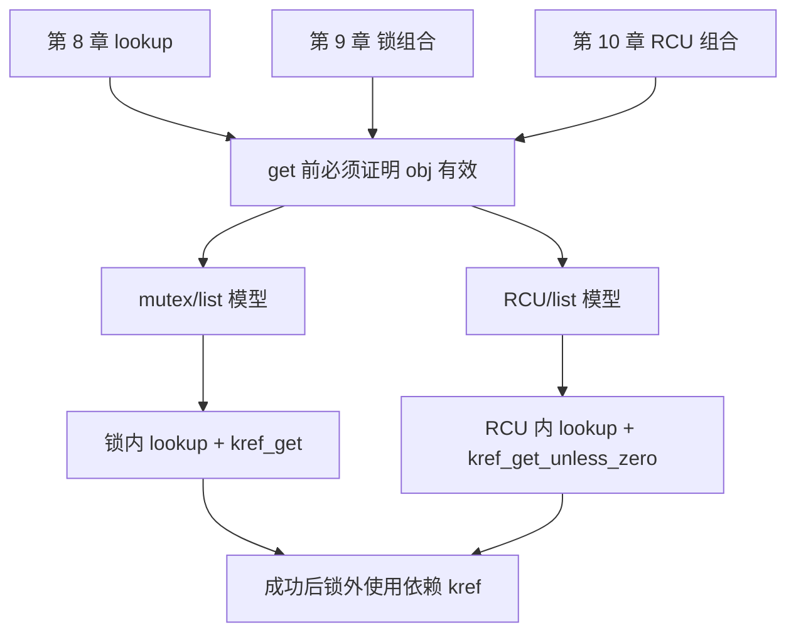
```mermaid
flowchart TD
    A["第 8 章 lookup"] --> D["get 前必须证明 obj 有效"]
    B["第 9 章 锁组合"] --> D
    C["第 10 章 RCU 组合"] --> D

    D --> E["mutex/list 模型"]
    D --> F["RCU/list 模型"]

    E --> G["锁内 lookup + kref_get"]
    F --> H["RCU 内 lookup + kref_get_unless_zero"]

    G --> I["成功后锁外使用依赖 kref"]
    H --> I
```

一句话区别：

```text
mutex lookup 中，锁保护“查找 + get”窗口；
RCU lookup 中，RCU 保护“查找 + get_unless_zero”窗口。
```

------

## 10.9\_本章检查清单

写 RCU + kref 代码时，至少检查下面这些问题：

```text
1. 对象是否真的挂在 RCU 保护的结构中？
2. 读侧 lookup 是否包在 rcu_read_lock()/rcu_read_unlock() 内？
3. 遍历是否使用 list_for_each_entry_rcu/hlist_for_each_entry_rcu/rcu_dereference 等 RCU 接口？
4. lookup 找到对象后，是否在 RCU 临界区内调用 kref_get_unless_zero()？
5. 是否检查了 kref_get_unless_zero() 的返回值？
6. 成功 get 后，是否允许离开 RCU 再使用对象？
7. 失败 get 后，是否完全不再访问对象？
8. 如果 remove 后不允许新用户进入，是否有 dying/state 检查？
9. dying/state 检查失败时，是否 put 掉刚取得的引用？
10. remove 路径是否先设置 dying，再从 RCU 集合脱链？
11. list_del_rcu 后是否避免直接 kfree？
12. release 中是否使用 kfree_rcu/call_rcu/synchronize_rcu？
13. struct kref 所在对象内存是否撑过 RCU grace period？
14. RCU 读者可能访问的子资源是否也延迟释放？
15. 对象字段是否另有锁、原子或状态机保护？
16. RCU 读侧临界区是否足够短？
17. 是否把 list_del_rcu、kref_put、release、kfree_rcu 的职责分清？
```

------

## 10.10\_本章小结

本章核心可以压缩成下面几句话：

```text
RCU 不是引用计数。

RCU 只能保证读侧临界区内，临时看到的旧对象内存不会被立即释放；
它不会自动给对象增加长期引用。

kref 不是 lookup 保护。

kref 只有在 get 成功之后，才保护对象生命周期；
在 get 之前，必须先由 RCU 或锁证明对象指针本身暂时有效。

RCU lookup 中不能裸 kref_get()。

因为对象可能已经进入 refcount 为 0 的释放流程；
必须使用 kref_get_unless_zero()，并检查返回值。

list_del_rcu() 不是 kfree。

它只是把对象从 RCU 可见结构中取消发布；
真正释放对象内存必须等待 RCU grace period。

最终模型是：

RCU 保护查找窗口；
kref 保护长期持有；
dying/state 保护逻辑可用性；
锁/原子保护字段一致性；
kfree_rcu/call_rcu/synchronize_rcu 保护最终内存回收。
```

最重要的一句话：

```text
RCU 让你安全地看到对象；
kref 让你安全地带走对象。
```

------

专题导航：[kref 引用计数机制章节大纲](大纲.md)。

上一篇：[kref 与锁的组合](P09_kref_与锁的组合.md#9.8_本章小结)。

下一篇：[kref、refcount_t 与 kobject 的边界](P11_kref_refcount_t_kobject_的边界.md)。
