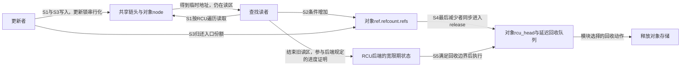
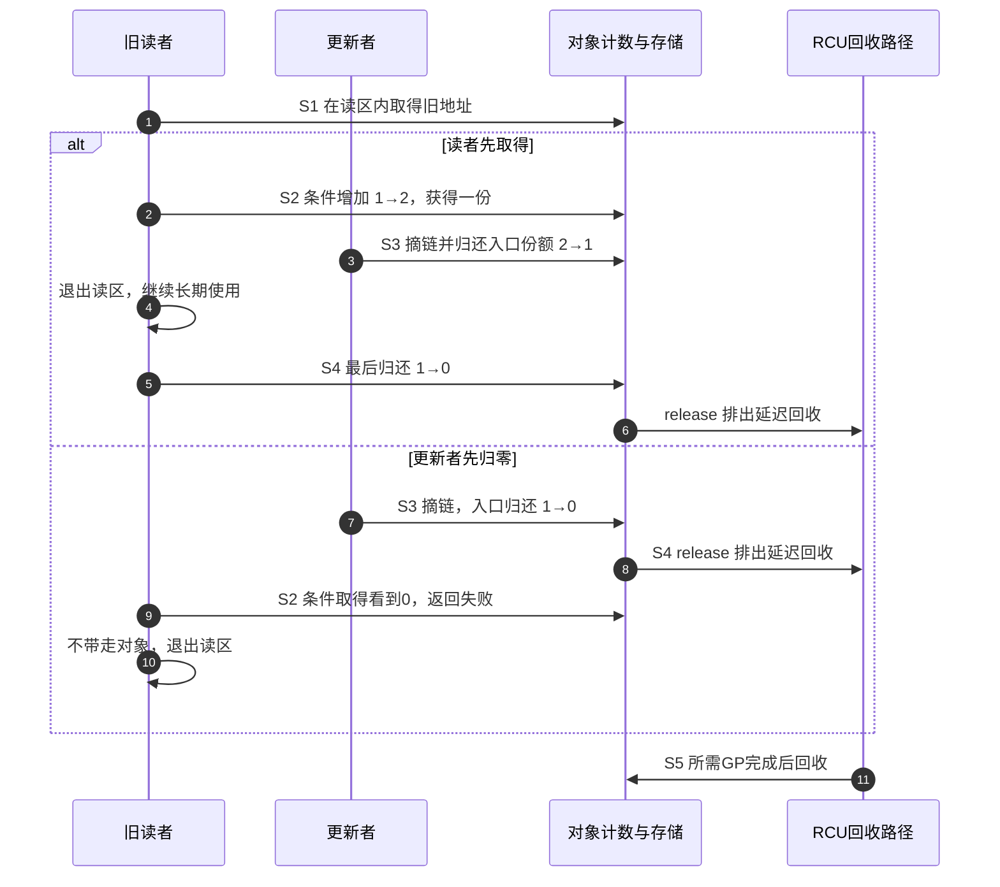
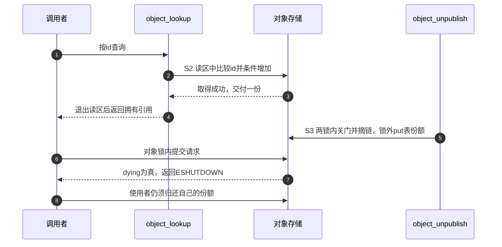

# 第10章\_kref\_与\_RCU

## 10.1\_本章导读\_RCU\_负责看到\_kref\_负责带走

上一章让查找者持集合锁，完成定位和取得引用后才解锁。只要成员拥有的那份引用也在这把锁下撤销，查找者就能证明地址有效且计数为正。这套协议简单可靠；对象少、查找不频繁，或集合锁没有成为等待点时，可以继续使用。

现在考虑读多写少的配置表：每次请求都要按编号查找，更新者偶尔撤下一项。集合锁仍会把不同读者的定位阶段串起来；读者 A 占着锁时，B 即使只读取另一个编号，也必须等待。把读侧锁直接删掉又不行：A 刚读到节点地址，更新者就可能摘链并释放，A 随后的 get 将访问已经失效的计数器。

**RCU（Read-Copy Update，读—复制—更新）** 用另一套发布、读取与回收协议覆盖这个临时地址窗口。这里先回顾它的公共保证：更新者撤销入口后，延迟回收必须跨过相关旧读侧临界区；这个等待边界称为 **宽限期（grace period，GP）**。`rcu_read_lock()` 不会为随便一个裸指针施加魔法保护。对象必须沿匹配的 RCU 入口读取，更新者必须按约定保留旧存储，保证才成立。

本章只解决配置对象被查到后，还要离开读区继续使用的情况。RCU 不会因这个读者退出而自动新增一份引用，因此要在地址仍受保护时接到 kref。完整 RCU 的宽限期通信、CPU/任务状态与实现差异仍沿[RCU 专题](../../synchronization_and_asynchrony/synchronization/rcu/大纲.md)阅读；这里不把后台实现假装成对象自身一个等待计数。

先选定所有权：入口直接指向同一个内嵌 kref 的对象，发布成功后入口拥有一份；撤下立即归还入口份额；最后归还触发 release，由 release 安排 RCU 延迟回收。下文把它称为 **先归零、再过 GP** 协议。它允许旧读者看到计数已经归零但存储尚在的对象，所以取得时要处理失败。

还存在另一种合法协议：入口撤下后，那一份引用继续保留到 GP 完成，随后才 put；此时相关旧读者在读区内可以由这份引用证明正计数。两者的差异来自 **谁把哪一份保留到何时**，不能概括为“凡 RCU 都只能使用条件 get”。本章先建立第一种，第二种只用于边界比较；完整替代及复合版本根的责任见[所有权拓扑选择](../../synchronization_and_asynchrony/synchronization/rcu/P21_RCU_kref与复合对象生命周期.md#21.1_先按分配与所有权拓扑选模板)。

读者、更新者与回收者操作的不是同一个状态机字段，而是几组相互约束的状态：

| 阶段 | 状态落点、写入者和读取者 | 退出条件 |
| --- | --- | --- |
| S0 私有创建 | 创建者初始化 id、node、ref，尚无共享入口 | 字段和初始责任准备好 |
| S1 发布 | 更新者在更新锁下接入链；入口取得约定份额，读者按 RCU 遍历读取节点 | 读者可能保存旧地址 |
| S2 取得 | 读者仍在读区，条件原子增加对象 ref；更新者可并发推进 S3 | 成功带走一份，失败不带走 |
| S3 撤下 | 更新者在更新锁下摘链，再归还入口份额；旧读者本地地址不会被远程清空 | 后续按引用数进入 S4，或等旧持有者归还 |
| S4 归零 | 最后一份 put 同步调用 release，模块安排对象 rcu_head 的延迟回收 | 对象仍须供旧临时读者完成受允许访问 |
| S5 回收 | RCU 后端完成所需宽限期，回收路径释放存储 | 此后没有旧读区或拥有者可访问 |

S2 与 S3/S4 可以交错；表格不表示所有线程依次经过一条线性状态机。业务许可又是单独一组状态，后文才增加，不能由 ref 或成员关系代替。


```mermaid
flowchart LR
    U[更新者] -->|S1与S3写入，更新锁串行化| N[共享链头与对象node]
    R[查找读者] -->|S1按RCU遍历读取| N
    N -->|得到临时地址，仍在读区| R
    R -->|S2条件增加| C[对象ref.refcount.refs]
    U -->|S3归还入口份额| C
    C -->|S4最后减少者同步进入release| H[对象rcu_head与延迟回收队列]
    R -->|结束旧读区，参与后端规定的进度证明| B[RCU后端的宽限期状态]
    B -->|S5满足回收边界后执行| H
    H -->|模块选择的回收动作| F[释放对象存储]
```

这里的读区退出箭头不表示每次 unlock 都发送消息。当前固定基线是 Tiny RCU，其他配置可能使用 Tree；具体状态地址、静止态报告和回调调度先从[RCU 源码总索引](../../../../research/source_reading/rcu/navigation/P01_Linux_6.12_RCU源码总阅读索引.md#1.2_先建立源码分类坐标)选择后端。本章仅依赖公共保护边界，不把双 CPU 示意当作当前单核配置的实测。

条件引用的固定证据先从[kref 源码总索引](../../../../research/source_reading/kref/navigation/P01_Linux_6.12_kref源码阅读索引.md#1.2_按问题进入已落地证据)进入，再看[条件窗口模块](../../../../research/source_reading/kref/navigation/P03_条件取得与查找窗口导读.md#3.2_从观察到自己持有)。NXP 官方固定提交 dfaf2136deb2af2e60b994421281ba42f1c087e0 的 Documentation/core-api/kref.rst 要求条件取得与查找处于同一保护区，也要求包含 kref 的内存跨过相应宽限期；本地实验提交不作证据。

## 10.2\_边界\_先分清谁保护什么

临时地址有效与计数仍为正，在允许读者和撤下并行以后就不再是同一个保证。先比较退休份额的两种保存方式，才能决定取得接口。

### 10.2.1\_RCU\_和\_kref\_分别保护什么

先沿一次查询划出两段重叠窗口。读者从链中拿到地址时，尚未拥有引用；从条件取得成功开始，到最终 put 之前，才有自己的份额。取得动作必须落在第一段以内，两个窗口才不会断开。

| 机制及前提 | 提供的保证 | 仍需另外证明 |
| --- | --- | --- |
| 匹配的 RCU 读取与延迟回收协议 | 本次临时观察所需存储未被回收 | 计数是否正、字段是否允许访问 |
| 正确取得且尚未归还的 kref 份额 | 本对象尚不能完成最终回收 | 当前仍在表中、业务仍接纳、字段同步 |
| 更新锁 | 遵循它的写入者不会同时破坏链关系 | 无锁读者所需的节点发布及退休规则 |
| 对象锁与业务检查 | 锁内检查和操作按应用协议一致 | 解锁以后状态不再变化并无保证 |
| 延迟回收请求 | 回收动作受 GP 边界约束 | 请求排出不等于已经执行，也不自动等待长期引用 |

RCU 并不与 kref 自动互相通知。第一种协议是应用的 release 接到延迟回收；第二种协议是应用的 GP 回调归还保留份额。若两段代码各以为另一段负责保活，就会出现回收空隙；若各自安排一次独立 free，又会重复释放。

先比较三个关键瞬间，再运行一个完整 C 模型：

| 同一个旧读者的观察点 | 先归零再过 GP | 发布份额跨 GP |
| --- | --- | --- |
| 保存地址后，更新者撤下入口 | 入口立即 put，可能归零 | 入口份额转为退休责任，暂不 put |
| 旧读者仍在读区中取得 | 条件增加可能失败，存储仍在 | 保留份额保证正计数；仍须保护发布与地址 |
| GP 后是否可以直接 free | 还须遵循最后归还排出的回收协议 | 先 put 保留份额；若有长期读者，仍不能 free |

完整 [rcu_take_window.c](../../../../labs/kernel/object_lifetime/materials/rcu_take_window.c) 用观察者账本安排两种先后顺序。它既不实现 RCU，也不模拟原子指令；alive 只是账本状态，程序从未实际分配或解引用已释放内存。

```c
#include <assert.h>
#include <stdbool.h>
#include <stdio.h>

/* 观察者账本；字段不是 Linux RCU 或 kref 的内部实现。 */
enum retire_order { ZERO_THEN_GP, GP_THEN_PUT };
struct object_model {
    enum retire_order order;
    unsigned int refs;
    bool published, in_read, reader_owns, publish_owns;
    bool gp_done, free_pending, alive;
    unsigned int release_calls, free_calls;
};

static void reclaim(struct object_model *obj)
{
    assert(obj->alive && obj->refs == 0 && obj->gp_done && !obj->in_read);
    obj->alive = false;
    ++obj->free_calls;
}

static void drop_ref(struct object_model *obj)
{
    assert(obj->alive && obj->refs > 0);
    if (--obj->refs != 0)
        return;
    ++obj->release_calls;
    if (obj->order == ZERO_THEN_GP)
        obj->free_pending = true; /* 最后归还只提出延迟回收请求。 */
    else
        reclaim(obj); /* 发布份额跨过 GP，因此现在允许直接回收。 */
}

static void unpublish(struct object_model *obj)
{
    assert(obj->published && obj->publish_owns);
    obj->published = false;
    if (obj->order == ZERO_THEN_GP) {
        obj->publish_owns = false;
        drop_ref(obj);
    }
}

static bool try_take(struct object_model *obj)
{
    assert(obj->alive && obj->in_read && !obj->reader_owns);
    if (obj->refs == 0)
        return false;
    ++obj->refs;
    obj->reader_owns = true;
    return true;
}

static bool finish_gp(struct object_model *obj)
{
    assert(!obj->published);
    if (obj->in_read)
        return false; /* 旧读者尚在，模拟器不能宣布本次 GP 完成。 */
    if (obj->order == ZERO_THEN_GP && !obj->free_pending)
        return false; /* 本模型此时尚未由 release 排出回收请求。 */
    obj->gp_done = true;
    if (obj->order == GP_THEN_PUT) {
        assert(obj->publish_owns);
        obj->publish_owns = false;
        drop_ref(obj);
    } else {
        obj->free_pending = false;
        reclaim(obj);
    }
    return true;
}

static void reader_put(struct object_model *obj)
{
    assert(obj->reader_owns && !obj->in_read);
    obj->reader_owns = false;
    drop_ref(obj);
}

static void run_case(enum retire_order order, bool reader_first)
{
    struct object_model obj = {
        .order = order, .refs = 1, .published = true,
        .in_read = true, .publish_owns = true, .alive = true
    }; /* S1：入口已有一份，读者已在读区中保存旧地址。 */
    bool taken;
    if (reader_first) {
        taken = try_take(&obj);
        unpublish(&obj);
    } else {
        unpublish(&obj);
        taken = try_take(&obj);
    }
    assert(taken == (reader_first || order == GP_THEN_PUT));
    assert(obj.alive && !finish_gp(&obj));
    printf("%s %s: taken=%d refs=%u alive=%d\n",
           order == ZERO_THEN_GP ? "zero_then_gp" : "gp_then_put",
           reader_first ? "reader_first" : "remove_first", taken, obj.refs, obj.alive);
    obj.in_read = false; /* 模拟旧读者退出，不会自动归还长期份额。 */
    if (order == GP_THEN_PUT) {
        assert(finish_gp(&obj));
        assert(obj.alive && obj.reader_owns && obj.refs == 1);
        reader_put(&obj); /* GP 已完，长期使用者现在才退出。 */
    } else {
        if (taken)
            reader_put(&obj);
        assert(finish_gp(&obj));
    }
    assert(!obj.alive && !obj.publish_owns && !obj.reader_owns);
    assert(obj.release_calls == 1 && obj.free_calls == 1);
}

int main(void)
{
    run_case(ZERO_THEN_GP, true);
    run_case(ZERO_THEN_GP, false);
    run_case(GP_THEN_PUT, true);
    run_case(GP_THEN_PUT, false);
    puts("four ownership orders passed");
    return 0;
}
```

在仓库根目录编译运行，不定义 NDEBUG，因为断言参与轨迹执行：

```bash
cc -std=c11 -Wall -Wextra -Werror -O2 \
  labs/kernel/object_lifetime/materials/rcu_take_window.c -o /tmp/rcu_take_window
/tmp/rcu_take_window
```

预测后再对照输出：

```text
zero_then_gp reader_first: taken=1 refs=1 alive=1
zero_then_gp remove_first: taken=0 refs=0 alive=1
gp_then_put reader_first: taken=1 refs=2 alive=1
gp_then_put remove_first: taken=1 refs=2 alive=1
four ownership orders passed
```

第二行最关键：refs 已为零，alive 仍为真，取得失败。第四行中入口已经撤下，refs 却仍有退休份额和读者份额共两份。随后模型先完成 GP、归还退休份额，再让长期读者归还，证明“GP 完成”也不是“所有引用结束”。四条轨迹最终各触发一次 release 和一次回收。

finish_gp 被旧读区挡住时返回 false，是模型显式安排的检查结果，不是实际 RCU API，也不是用一个全局读者计数解释内核实现。严格 C11 编译运行已通过；没有真实线程、内存序、内核 GP 调度、目标模块装卸或运行时间测量。

### 10.2.2\_为什么\_RCU\_lookup\_不能直接\_kref\_get()

本节标题限定在已经选定的“撤下立即 put、归零后延迟回收”协议。错误不在于地址必然失效，而在于地址有效与计数为正不再同时成立。


```mermaid
sequenceDiagram
    autonumber
    participant R as 旧读者
    participant U as 更新者
    participant O as 对象计数与存储
    participant Q as RCU回收路径
    R->>O: S1 在读区内取得旧地址
    alt 读者先取得
        R->>O: S2 条件增加 1→2，获得一份
        U->>O: S3 摘链并归还入口份额 2→1
        R->>R: 退出读区，继续长期使用
        R->>O: S4 最后归还 1→0
        O->>Q: release 排出延迟回收
    else 更新者先归零
        U->>O: S3 摘链，入口归还 1→0
        O->>Q: S4 release 排出延迟回收
        R->>O: S2 条件取得看到0，返回失败
        R->>R: 不带走对象，退出读区
    end
    Q->>O: S5 所需GP完成后回收
```

读者若在第二条分支调用普通 get，就违反“已有正引用保护”的前提。固定 refcount 实现会检测从零增加并进入异常处理，不能把这写成一次合法的“0→1复活”；详见[普通增加与异常检测](../../../../research/source_reading/kref/source_explanations/include/linux/refcount.h.md#1.2_普通增加与异常检测)。诊断和饱和不是取得成功协议，也不能撤销已进入 release 的动作。

如果改用发布份额跨 GP 的完整协议，相关旧读者始终受那一份保护，普通 get 可以成立；代价是退休份额与回调必须正确交接，而且查找成功仍不意味着业务许可。不能只替换一个 get 调用就宣称切换协议。继续使用条件 get 也不能修复错误的发布/回收顺序。

相比上一章，读者不再为定位取得同一把集合锁，但仍要原子写共享计数；高频 get/put 仍可能使计数所在缓存行在 CPU 间迁移。更新侧又要保留退休内存并处理回收进度。只有读写比例、临界区内容及这些成本适合时，组合才有价值，不能从“读侧无集合锁”直接推出整体更快。

### 10.2.3\_kref\_get\_unless\_zero()\_解决什么\_不解决什么

条件取得回答“地址已经有效时，本次能否从尚未归零的计数取得一份”。精确实现见[kref 条件入口](../../../../research/source_reading/kref/source_explanations/include/linux/kref.h.md#1.7_有效地址上的条件取得)。它不检查对象是否仍登记、不建立字段发布可见性，也不替调用者检查业务门。异常饱和值下的非零返回更不能作为系统健康证明。

下面是接口片段，lookup_obj_rcu 表示后文才实现的匹配 RCU 查找，不是可直接编译的完整函数：

```c
rcu_read_lock();
obj = lookup_obj_rcu(id);
if (obj && kref_get_unless_zero(&obj->ref))
    found = obj; /* 成功取得自己的份额，之后才允许带出读区。 */
rcu_read_unlock();
```

把条件取得移到 unlock 之后，会留下没有任何保护的空隙。更新者可能在这个空隙完成 GP 并回收，随后访问 obj->ref 本身就已非法；“除非为零”无法在访问无效地址之前替你探测。

失败也要分清期限：没有取得长期引用，因此不能把这个地址带出读区继续使用。它不意味着仍在正确读区内连遍历所需的链接都不能读取；这种临时读取能否成立取决于 RCU 链表保留旧路径的协议。业务字段或子资源则未必保留到同一时刻，不能由外壳仍在推出任意字段都可用。

先完成两项练习。把模型中第二种协议的 GP 之后 reader_put 提前到 GP 之前，预测最终由谁触发 release；再尝试把第一种协议的 reclaim 提前到旧读区结束前，解释是哪条断言阻止它。只在账本上构造反例，不用真实释放后解引用演示错误。下一节把这些责任映射到对象字段、查找循环和业务检查。

## 10.3\_查找路径\_从对象模型到\_get\_模板

账本已经证明了两类取得结果，接下来需要把它们落实到真实节点、引用成员和回调头；先运行一个完整对象，再审查返回值承诺。

### 10.3.1\_基础对象模型

上一节已经证明：S2 取得必须与 S1 读取共享同一段地址保护，而且 S3 撤下可以并发发生。现在把模型变成可构建模块。仍用编号 7 的同步服务，业务只是增加 completed；没有硬件操作、异步业务队列或对外注册接口，便于把 RCU 回收本身观察清楚。

本例保留上一章的两类锁，但查找不再取得集合锁。update_lock 只串行化发布和撤下；对象 lock 保护 dying 与 completed。lookup 在 RCU 读区中只比较发布前固定的 id，并尝试取得引用。可能睡眠的对象 mutex 要等取得成功、离开普通 RCU 读区之后才使用。

| 字段或共享对象 | 谁访问、采用什么协议 | 对应阶段 |
| --- | --- | --- |
| rcu_table 与 node | 更新者在 update_lock 内用 RCU 链表接口写；读者按 RCU 遍历读 | S1、S2、S3 |
| id | 创建时写，发布后固定；旧读者在读区内比较 | S0、S2 |
| ref | 发布追加表份额、lookup 条件增加、各持有者 put | S1～S4 |
| linked、ever_published | 只由更新路径在 update_lock 下读取/写入；禁止同一对象再次发布 | S1、S3 |
| dying、completed | 请求和关闭持对象锁访问；业务不是单纯读取这个 bool | S1、S3及读区外请求 |
| rcu | 最后归还登记一次回调；RCU 后端到期交给 object_rcu_free | S4、S5 |
| free_calls | 回调原子增加，模块退出等完自身回调后读取 | S5与模块退出 |

linked 不用来让 RCU 读者决定地址是否有效，也不能用 list_empty 判断已删除的 RCU 节点。撤下仍要保留旧读者所需的 next；单独的 linked 使第二次撤下能够识别“这次没有接走表份额”，不再重复 put。

完整 [note_kref_rcu.c](../../../../labs/kernel/object_lifetime/materials/note_kref_rcu.c) 如下，后面逐步跟踪它的查找和回收分支。所有按对象地址调用的发布、请求及撤下函数，都要求调用者另持一份，覆盖整个调用。

```c
// SPDX-License-Identifier: GPL-2.0
#include <linux/errno.h>
#include <linux/kref.h>
#include <linux/module.h>
#include <linux/mutex.h>
#include <linux/rculist.h>
#include <linux/slab.h>

struct rcu_object {
    struct kref ref;
    struct rcu_head rcu;
    struct list_head node;
    struct mutex lock; /* 保护dying与completed；读区外使用。 */
    int id; /* 发布前固定，旧读者可以在读区内比较。 */
    bool linked, ever_published; /* 仅由update_lock保护。 */
    bool dying;
    unsigned int completed;
};
static LIST_HEAD(rcu_table);
static DEFINE_MUTEX(update_lock);
static atomic_t free_calls = ATOMIC_INIT(0);

static void object_rcu_free(struct rcu_head *head)
{
    struct rcu_object *obj = container_of(head, struct rcu_object, rcu);
    atomic_inc(&free_calls);
    kfree(obj); /* 回调不睡眠；旧临时读者已经越过所需边界。 */
}

static void object_release(struct kref *ref)
{
    struct rcu_object *obj = container_of(ref, struct rcu_object, ref);
    WARN_ON(obj->linked);
    call_rcu(&obj->rcu, object_rcu_free); /* 私有失败对象也走同一回收出口。 */
}

static void object_put(struct rcu_object *obj)
{
    if (obj)
        kref_put(&obj->ref, object_release);
}

static struct rcu_object *object_create(int id)
{
    struct rcu_object *obj = kzalloc(sizeof(*obj), GFP_KERNEL);
    if (!obj)
        return NULL;
    obj->id = id;
    obj->dying = true; /* 私有对象尚不接纳请求。 */
    INIT_LIST_HEAD(&obj->node);
    mutex_init(&obj->lock);
    kref_init(&obj->ref);
    return obj;
}

/* 调用者保留自己的份额；成功另外建立表份额，失败不消费。 */
static int object_publish(struct rcu_object *obj)
{
    struct rcu_object *candidate;
    int result = -EINVAL;
    mutex_lock(&update_lock);
    if (obj->ever_published)
        goto out;
    list_for_each_entry(candidate, &rcu_table, node) {
        if (candidate->id == obj->id) {
            result = -EEXIST;
            goto out;
        }
    }
    mutex_lock(&obj->lock);
    obj->dying = false;
    kref_get(&obj->ref);
    obj->linked = obj->ever_published = true;
    list_add_rcu(&obj->node, &rcu_table);
    mutex_unlock(&obj->lock);
    result = 0;
out:
    mutex_unlock(&update_lock);
    return result;
}

/* 只取得存储的长期份额；不承诺后续业务请求仍会被接纳。 */
static struct rcu_object *object_lookup(int id)
{
    struct rcu_object *obj, *found = NULL;
    rcu_read_lock();
    list_for_each_entry_rcu(obj, &rcu_table, node) {
        if (obj->id == id) {
            if (kref_get_unless_zero(&obj->ref))
                found = obj;
            break;
        }
    }
    rcu_read_unlock();
    return found;
}

static int object_request(struct rcu_object *obj, unsigned int *completed)
{
    int result = -ESHUTDOWN;
    mutex_lock(&obj->lock); /* 调用者持有引用，且已经离开普通RCU读区。 */
    if (!obj->dying) {
        *completed = ++obj->completed;
        result = 0;
    }
    mutex_unlock(&obj->lock);
    return result;
}

/* 调用者另持一份；先update_lock再对象锁，只有本次摘下才归还表份额。 */
static void object_unpublish(struct rcu_object *obj)
{
    bool removed = false;
    mutex_lock(&update_lock);
    mutex_lock(&obj->lock);
    if (obj->linked) {
        obj->dying = true;
        list_del_rcu(&obj->node); /* 不清空next，旧读者可能仍沿它遍历。 */
        obj->linked = false;
        removed = true;
    }
    mutex_unlock(&obj->lock);
    mutex_unlock(&update_lock);
    if (removed)
        object_put(obj);
}

static int __init note_rcu_init(void)
{
    struct rcu_object *creator = object_create(7), *reader;
    unsigned int completed = 0;
    int result;
    if (!creator)
        return -ENOMEM;
    result = object_publish(creator);
    if (result) {
        object_put(creator);
        rcu_barrier(); /* 初始化失败也不能留下指向本模块代码的回调。 */
        return result;
    }
    reader = object_lookup(7);
    if (!reader) {
        object_unpublish(creator);
        object_put(creator);
        rcu_barrier();
        return -ENOENT;
    }
    object_put(creator);
    result = object_request(reader, &completed);
    pr_info("note_rcu: before=%d completed=%u\n", result, completed);
    object_unpublish(reader);
    object_unpublish(reader);
    result = object_request(reader, &completed);
    pr_info("note_rcu: after=%d completed=%u\n", result, completed);
    object_put(reader);
    return 0;
}

static void __exit note_rcu_exit(void)
{
    /* 本演示无外部入口，初始化已停止所有来源并归还全部份额。 */
    rcu_barrier();
    pr_info("note_rcu: free=%d empty=%d\n", atomic_read(&free_calls), list_empty(&rcu_table));
}
module_init(note_rcu_init);
module_exit(note_rcu_exit);
MODULE_LICENSE("GPL");
MODULE_DESCRIPTION("RCU临时读取转长期引用与模块回调退出实验");
```

目标构建使用已经准备好、与运行内核匹配的内核构建目录；以下命令只给出 Linux 环境步骤，KDIR 是读者环境变量，不能把当前源码目录名当作运行身份：

```bash
make -C "$KDIR" M="$PWD/labs/kernel/object_lifetime/materials" modules
sudo insmod labs/kernel/object_lifetime/materials/note_kref_rcu.ko
sudo rmmod note_kref_rcu
sudo dmesg | tail -n 20
```

预计在对应日志中看到：

```text
note_rcu: before=0 completed=1
note_rcu: after=-108 completed=1
note_rcu: free=1 empty=1
```

第三行只在退出调用 rcu_barrier 以后打印。init 最后一份 put 已登记回调，但不能据函数返回推断回调已经执行。私有失败对象也走同一回收出口，所以初始化失败路径先 barrier 再返回错误，避免代码被卸载后旧回调才调用本模块函数。

本次实际完成 ARM 前端检查，以及执行真实应用函数、固定引用 helper 和固定 list_del_rcu 的八组宿主顺序检查；底层锁、链表插入/遍历、原子、分配与 RCU 排队/完成由显式替身提供。检查覆盖正常周期、分配失败、重复发布和编号、重复撤下、条件取得先成功/归零先发生、移除后查找及保留 next 的旧路径，另覆盖可选状态过滤包装的成功与关闭回滚；该包装也通过 ARM 前端。目标构建链接、装卸、真实线程和 GP 调度均未执行；上述目标日志是预计结果，不冒充板上日志。

### 10.3.2\_正确的\_RCU\_lookup\_+\_kref\_模板

object_lookup 的第一步是进入读区，再使用 list_for_each_entry_rcu 读取入口和节点。`id` 的初始化发生在发布以前，发布后不再改，所以这里不需要先取得对象锁；如果把 id 改成动态可变字段，当前比较协议就需要重新设计。

找到匹配项后仍不退出读区，先执行条件取得。成功时 found 保存地址，新增份额从这一刻属于返回值接收者；失败时 found 仍为 NULL，不能因为本地 obj 尚非空就返回。最后统一解开读区，避免失败分支提前返回漏掉 unlock。

这份 lookup 只承诺 **成功返回一个拥有型引用**。它不在内部检查 dying，因此可能返回一个已关闭的对象；这不是函数漏掉必要动作，而是其接口只负责存储期限。随后 object_request 在自己的锁内把“是否接纳”与同步增加 completed 合成同一次决定。


```mermaid
sequenceDiagram
    autonumber
    participant R as 调用者
    participant L as object_lookup
    participant O as 对象存储
    participant U as object_unpublish
    R->>L: 按id查询
    L->>O: S2 读区中比较id并条件增加
    O-->>L: 取得成功，交付一份
    L-->>R: 退出读区后返回拥有引用
    U->>O: S3 两锁内关门并摘链，锁外put表份额
    R->>O: 对象锁内提交请求
    O-->>R: dying为真，返回ESHUTDOWN
    R->>O: 使用者仍须归还自己的份额
```

这解释了为何“查到”与“能做业务”可以得到不同结果。若应用要求已取得请求一定执行，就需要在同一次业务接纳中登记执行者并规定关闭等待，而不只是把检查提前到 lookup。当前模块只处理同步短操作，没有这种异步预留。

### 10.3.3\_lookup\_成功\_失败\_删除并发的状态表

不要把“看到正数”与“条件增加已经成功”混为一列。条件比较更新之间允许出现其他归还，S2 的返回结果才决定本次有无责任。

| 当前轨迹 | object_lookup结果 | 调用者责任与下一步 |
| --- | --- | --- |
| 遍历没有匹配编号 | NULL | 不 put，不凭旧缓存地址继续找对象 |
| 保存旧地址后，入口最后 put 先归零 | NULL | 条件增加失败；退出读区，回收仍等待所需 GP |
| 条件增加先于入口 put 成功 | 拥有一份 | 解锁后可继续持有，最终必须 put |
| 已取得，但 object_request 先于关门完成 | 拥有一份，请求返回0 | 本次同步计数操作完成；以后请求须重新检查 |
| 已取得，但关门先于本次请求 | 拥有一份，请求返回负值 | 不执行业务，仍归还所持份额 |
| 编号后来由新对象占用 | 本次可能仍带走旧对象 | 引用保护旧对象身份，不保证它仍是当前编号映射 |

最后一行引出版本问题：本例拒绝同一对象重新发布，但允许旧对象撤下后，另一个对象使用同一编号。若业务必须针对“当前一代”，应引入版本键或在受保护事务里验证当前映射；引用计数不能替你证明它是最新对象。这里不把通用链表遍历解释成整个集合的原子快照。

### 10.3.4\_加入\_dying\_状态后的\_lookup\_模板

有些调用者希望提前过滤明显已关闭的对象，可以在拥有型 object_lookup 之后增加一个包装。下面是可选片段，不属于完整模块的实际调用路径：

```c
static struct rcu_object *object_lookup_open(int id)
{
    struct rcu_object *obj = object_lookup(id);
    bool open;
    if (!obj)
        return NULL;
    /* 已经退出RCU，且有自己的份额，可以安全等待对象mutex。 */
    mutex_lock(&obj->lock);
    open = !obj->dying;
    mutex_unlock(&obj->lock);
    if (!open) {
        object_put(obj); /* 回滚的是本次取得的份额，不是表份额。 */
        return NULL;
    }
    return obj;
}
```

它保证的只是检查发生那一刻尚未关闭。mutex_unlock 之后，更新者仍可把 dying 改成 true；调用者不能因此跳过 object_request 内的检查。把本函数命名为 open 也不会让状态冻结。

先取得引用再检查的另一个作用，是让对象锁所在内存跨过读区退出和锁等待。若在普通 RCU 读区内直接等待 mutex，就把“地址保护”误用成“允许睡眠”；若先退出读区却没有取得份额，又可能连 mutex 存储都已被回收。回看本例：读区只处理入口、不可变 id 和条件引用，业务锁在接续成功以后才进入。

## 10.4\_删除路径\_取消发布\_引用归零与延迟释放

查找者取得以后能够带走一份，更新者就不能再把“摘下节点”当作“所有人都退出”。下面沿同一模块分清入口责任的归还与最终回调。

### 10.4.1\_remove\_路径\_先取消发布\_再释放引用

object_unpublish 接收的是调用者已经拥有的地址；它不是任意裸指针都能使用的全局删除器。先取得 update_lock，再取得对象锁；如果 linked 仍为真，本次操作写 dying、摘链、清 linked，并记下 removed。退出两把锁后，只有 removed 为真才归还表份额。

重复调用因此不会再次摘节点或吞掉调用者的一份。但“允许重复”不是说第一次操作回收之后还能继续传旧地址：调用者必须始终保留自己的份额。正常演示里的 reader 正是这个保活者。

关闭与摘链处在同一嵌套阶段，但无锁读者并不等待 update_lock。旧读者仍可能保存节点并取得一份；业务门通过随后 object_request 的对象锁检查落实，而不是让所有 CPU 的本地指针突然消失。对象锁上先完成的请求可以成功，关门以后才获得锁的请求被拒绝。

发布侧也要与此配对：object_publish 在检查首次发布和编号唯一之后才追加表份额。成功不消费创建者原份额；失败不新增表份额。若只 list_add_rcu 而未说明初始份额转交或另 get，后续“归还表份额”就可能归还一个从未建立的责任。

### 10.4.2\_release\_中为什么不能直接\_kfree

在本章主协议中，最后归还只排除了长期拥有者，旧 RCU 临时读者可能还在比较 id、尝试取得或沿 next 遍历。因此 object_release 调用 call_rcu 登记 object_rcu_free，暂不释放对象。S4 可以先于旧读者退出，S5 必须晚于所需保护边界。

本例回调只做原子统计和 kfree，不睡眠。普通 release 运行在最后 put 的原路径；异步 RCU 回调由后端后来调用。两者不是同一个上下文，也不能因为 release 来自可睡眠任务，就让回调随意等待 mutex 或执行阻塞 I/O。

只需回收单块内存时可采用 kfree_rcu，避免维护一个只调用 kfree 的私有回调。本例故意保留回调计数来观察 S4/S5，并展示代码生命周期：模块要先停止新来源、收束所有仍可能登记回调的持有者，再用 rcu_barrier 等已有回调真正完成。只用 synchronize_rcu 等过一次旧读区，并不保证以前排队的 callback 已经执行。

当前 Tiny 配置的这一区别可从[模块源码导读](../../../../research/source_reading/rcu/navigation/P11_Linux_6.12_Tiny_RCU模块源码概念导读.md)进入，再定位[rcu_barrier 的唯一实现](../../../../research/source_reading/rcu/source_explanations/P13_Linux_6.12_Tiny_RCU源码实现.md#13.13_rcu_barrier等待的是旧callback实际执行)。其他配置依公共契约选择自己的实现，不把 Tiny 的短函数体推成所有后端相同。

若选择同步等待再 free，所有可能最后归还路径必须允许该等待，并且不能持有被旧读者退出所需的锁，也不能在自己的普通 RCU 读区内等待自己退出。若采用发布份额跨 GP 的另一套完整协议，最终 release 可以直接 free；因为负责临时读者的等待已经在归还发布份额以前完成。不能把这种直接 free 移植到当前主协议。

### 10.4.3\_list\_del\_rcu()\_kref\_put()\_kfree\_rcu()\_的职责边界

固定 list_del_rcu 的[唯一实现说明](../../../../research/source_reading/kref/source_explanations/include/linux/rculist.h.md#1.1_摘链后保留旧读者的前向路径)可以解释一个容易遗漏的细节：它连接前后邻居并毒化 prev，但保留被删节点的 next。旧读者可能已经把被删节点保存在局部变量中，仍需 next 才能继续沿旧路径走；立即 INIT_LIST_HEAD、普通 list_del_init 或重用该节点，都可能破坏这一前提。

| 动作 | 实际改变的状态 | 没有自动完成的责任 |
| --- | --- | --- |
| list_del_rcu | 后续链路绕过节点，保留旧前向路径 | 不修改 kref，不等待 GP，不清空所有本地地址 |
| kref_put | 归还本次持有者的一份，归零才调用 release | 不自带 RCU 回收，也不知道节点是否已摘下 |
| call_rcu/kfree_rcu | 登记需要满足 GP 边界的后续回收 | 不额外取得 kref，不代替停止新的 callback 来源 |
| rcu_barrier | 等此前登记的 callback 真正完成 | 不使未来登记消失，不替你停止长期持有者 |

本例 linked 的真值不是从 poisoned prev 或保留 next 猜出来的；更新者显式维护它。ever_published 又防止撤下后立即重插同一节点，避免旧读者还沿原路径走，新发布已经改写 next。

先做一个纸上实验：表头是 B→A，读者已经保存 B；更新者删 B。画出表头改为 A，而 B.next 仍为 A，再把 B.next 改成 B 本身，比较旧读者下一步去了哪里。宿主八组检查中的旧路径分支采用前一种顺序，验证固定摘链函数保留 next；它仍不代替真实 CPU 的发布内存序测试。

### 10.4.4\_remove\_和\_release\_是否必须在同一个地方脱链

#### (1)\_模型\_A\_release\_中脱链

固定 kref 文档给出的 RCU 例子让最后引用归零后，release 拿更新锁摘链并延迟回收。该链表只是非拥有索引，不能同时声称“链表还持有一份直到 release”：如果表份额永远等 release 才归还，而 release 又要等计数归零，双方会互相等待。

此协议中，查找可以在计数归零、release 尚未摘链的窗口看到旧节点，所以条件增加仍必要。发布者的初始份额属于哪位管理者、该管理者何时退出，必须另外规定。对象可能持续被新查找者取得而维持可见；若业务要求某次撤下立即关闭入口，就需要独立停止动作，不能只等最后 put 自然出现。

#### (2)\_模型\_B\_remove\_中脱链\_release\_只释放内存

完整模块采用这一模型，并明确表拥有一份。管理者可以主动摘下，即使读者仍持有引用；之后由最后持有者触发延迟回收。read-mostly 查找与业务接纳分开，因此旧读者成功取得以后仍可能得到 ESHUTDOWN。

这两个模型解决的入口管理需求不同；与“发布份额是否跨 GP”又不是同一个分类轴。选择时先回答集合是否拥有引用、谁能主动撤下，再回答临时读者由哪个退休阶段保活。不要把非拥有索引的 release 摘链与拥有型表的 remove put 混成一段看似完整的代码。

到这里已经能证明一次发布、查找、主动撤下和回调回收的闭合关系。下一节继续审查三个尚未自动成立的条件：读区里允许做什么、可变字段如何同步、外壳之外的子资源保留到何时。

## 10.5\_读侧约束\_临界区\_字段一致性和子资源

前面的周期只闭合了对象存储责任。要把它用于实际请求，还要逐一检查执行上下文、字段一致性以及不在同一分配中的资源。

### 10.5.1\_RCU\_读侧临界区内应该做什么

完整模块的读区只承担三个动作：沿匹配的 RCU 链表找到节点，比较不可变编号，在同一窗口内取得长期份额。退出读区以后，调用者才等待对象 mutex 并处理同步请求。这样分段不是排版习惯，而是让每段依赖的保证能够单独核对。

普通 RCU 读侧不允许任意阻塞。不要在这里等待 completion、mutex、阻塞 I/O 或一个可能睡眠的业务回调；也不要因为当前 Tiny 配置的读侧实现很短，就把它当成忽略公共契约的许可。允许读者睡眠的另一保护域应按 SRCU 的独立接口、回收与退出规则设计，不能只把函数名替换一半。

即使读区内没有睡眠，也不应把无关长计算都包进去。更新者的回收边界要覆盖旧读者，延长读区会延后旧对象可回收的时刻，退休对象积压时会占用更多内存。这里的代价不是“锁住了更新者不能摘链”，而是更新可以推进、释放却必须继续等。

长期使用也不是越早 get 越好。如果操作完全在读区中完成、只读取协议允许的不变数据，而且不会带出裸指针，纯借用可能已足够。每次追加再归还引用会写共享计数；只有确实需要逃出短读区或交付独立责任时，才引入长期份额。复合快照短读者与逃逸读者的差别见[RCU 与复合所有权](../../synchronization_and_asynchrony/synchronization/rcu/P21_RCU_kref与复合对象生命周期.md#21.4_模型_C_一个_RCU_版本根拥有多个_kref_数据块)。

### 10.5.2\_RCU\_不保护对象字段一致性

用完整模块的 completed 再推一次：两个拥有者都持有引用，所以对象不会归零；两者若同时执行普通的“读旧值、加一、写回”，仍可能都读取 0、都写回 1，丢失一次请求。RCU 或 kref 已经保住地址，却没有把这三个步骤变成互斥操作。

object_request 因而把 dying 检查和 completed 更新放在同一对象锁内。如果只在锁内检查、解锁后增加，更新者可以在中间关门，本次操作就可能越过关闭决定。如果业务只需要独立原子计数，可以重新设计相应协议；但一个字段能原子增加，不代表“门仍打开才计数”这个复合条件也已原子化。

READ_ONCE 也不是给结构体拍一致快照。它约束某次访问的编译器行为，不自动提供多字段事务、对象保活或新数据发布的完整顺序。读取一个标志后再无保护地访问另一个指针，不能只靠加上 READ_ONCE 就建立两者的因果关系。写侧、读侧和发布协议必须成对说明。

选择同步方式时先列状态是否可变、需要维护几个字段的不变量、读者是否允许重试或取得旧版本，再决定对象锁、原子操作、序列计数或替换整个不变对象。本章沿对象锁完成同步服务，不在一个模板里混入所有方案。引用成功只是允许你安全进入这些协议，不能代替它们。

### 10.5.3\_子资源释放不能早于\_RCU\_读者

给对象增加 `char *buf`，它指向另一次分配。即使 obj 的存储保留到 GP，buf 也不会因此自动保留。关键要看读者在哪个阶段可以沿这个指针访问字节。

| 访问协议 | 最后 kref 归零时能否释放buf | 还必须成立的条件 |
| --- | --- | --- |
| 未取得引用的 RCU 读者会访问buf | 通常不能立即释放 | 先切断新访问，并让相关旧借用者越过保护边界 |
| 读区只读node/id/ref；必须取得引用后才能访问buf | 可以由最终release清理 | 所有buf使用者均受那份引用覆盖，无另外逃逸借用或硬件访问 |
| buf独立计数、独立RCU入口或独立版本 | 依buf自己的完整协议决定 | 外壳指针读取、buf取得及回收之间没有保护空隙 |

第一种情况可以让同一次 RCU 回调先释放 buf、再释放 obj。以下只展示回收端片段，前提是 buf 由对象独占、借用者在同一匹配读区内使用且没有额外硬件访问；发布和取得仍须遵守前文协议：

```c
static void object_with_buf_free(struct rcu_head *head)
{
    struct object_with_buf *obj;
    obj = container_of(head, struct object_with_buf, rcu);
    kfree(obj->buf); /* 相关旧借用者已经结束，且没有长期拥有者。 */
    kfree(obj);
}
```

第二种情况则可以在普通 release 中先 kfree(buf)，再延迟回收外壳。理由要完整说出：计数归零说明没有合法的长期 buf 使用者；尚在 RCU 读区的临时读者只允许碰 node/id/ref，条件取得失败后不会再读 buf。因此保留外壳足以让这些读者退出，不必替不存在的 buf 访问者继续保留资源。

所以准确规则是 **某块资源必须覆盖所有被授权的访问窗口**，不是“所有子资源一律不能早于外壳释放”。若先取消 buf 的独立入口、等完相关旧访问者，它也可能早于仍被其他用途引用的外壳回收；反之，buf 若还被设备 DMA 使用，即使本章的读区和引用都结束，也不代表硬件访问已经停止。

没有明确独立协议时，不要随手在 remove 中清空 buf 指针并立即 free。旧读者可能已经把原指针保存到本地变量，清空共享字段不会撤销那个地址。多块共享数据的版本根应沿[复合快照协议](../../synchronization_and_asynchrony/synchronization/rcu/P21_RCU_kref与复合对象生命周期.md#21.1_先按分配与所有权拓扑选模板)核对每块的份额；不能让某个外壳回调替其他拥有者擅自销毁共享块。

## 10.6\_完整工程模板

本节回访 [10.3 的完整模块](#10.3.1_基础对象模型)，按接口职责审查同一份程序，不再维护另一套缺少入口份额和退出路径的 my_obj 片段。源文件仍是 [note_kref_rcu.c](../../../../labs/kernel/object_lifetime/materials/note_kref_rcu.c)；接下来每个决定都可以回到实际函数核对。

### 10.6.1\_对象定义

struct rcu_object 把 node/ref/rcu 放在同一分配中，因而旧读者所需的节点、编号和计数都随同一外壳延迟回收。linked 与 ever_published 属更新锁；dying 与 completed 属对象锁；id 发布前固定。不要因为字段都在同一个结构体里，就认为它们天然共享一个同步协议。

两种 bool 不可互换：linked 防重复成员操作，dying 决定业务接纳。当前更新函数在同一嵌套阶段把它们一起推进，但旧读者不看 linked，业务函数也不靠链表状态猜测接纳结果。

### 10.6.2\_release

object_release 只在最后引用归零时执行，检查正常协议已经撤下，然后 call_rcu；object_rcu_free 才回收。WARN_ON 是诊断，不会修复仍挂在表中的错误对象。初始私有对象即使发布失败，也走相同出口，调用方必须在初始化错误返回前等待自己的回调。

release 的执行次数与回调的完成次数不是同一时刻的统计。模块选择在退出 barrier 后读取 free_calls，才有本演示中全部回收已完成的依据。

### 10.6.3\_alloc

object_create 建立一份初始引用，节点初始化、对象锁初始化、id 固定、dying 初始为真，尚未发布也不接纳请求。kzalloc 失败时没有对象和份额，无须 put；成功以后不论后续发布是否成功，创建者都要结算这一份。

当前对象没有另一次子资源申请。如果扩展 buf，必须增加部分初始化失败的配对清理，并明确 release 是否允许 buf 尚未建立；不能只在成功路径加 malloc/kzalloc 而把失败责任留白。

### 10.6.4\_publish

object_publish 在更新锁内先检查 ever_published 和当前表的编号冲突，失败不消费创建者份额。成功追加表份额、设接纳状态、标记登记，再通过 RCU 链表接口发布；返回后创建者仍可保留或归还自己的一份。

普通 list_add 与 RCU 发布接口不是名称可互换的便利函数。无锁读者需要匹配的初始化可见性与链路更新规则；更新 mutex 只能串行化遵循它的写入者，不能自动让没有取得该 mutex 的读者获得同样保证。

### 10.6.5\_get\_by\_id

object_lookup 返回 NULL 或一份拥有型引用。条件失败不需要 put，成功者每份都要归还。它不保证对象仍是当前编号对应的最新一代，也不保证下一次请求成功。可选 object_lookup_open 只是提前过滤，业务执行点仍要检查。

查找不得把原始 obj 直接交给异步队列而忘了取得长期份额；也不得在条件失败后，用“只打印一下”作为继续访问任意业务字段的理由。每次访问都要落在其实际许可窗口里。

### 10.6.6\_use

object_request 的参数由调用者引用保活，因此退出 RCU 后仍能等待嵌入对象的 mutex。锁内门检查与 completed 增加一起决定本次同步操作，失败保留调用者份额与原输出值；调用者处理结果后仍统一 object_put。

要改成真正异步请求，必须另外说明排队成功后的责任、失败回滚、关闭来源、等待退出和完成回调。现有 completed++ 的同步完成不能代表 work 或硬件已经退出；这个模板没有提供那些保证。

### 10.6.7\_remove

object_unpublish 只有真正摘下者才接走表份额，退出两锁后归还；普通长期份额最后归还再进入 release。旧读者的 node.next 继续保留，同一对象不允许重新发布。模块退出先确认没有外部来源和遗留拥有者，随后 rcu_barrier，不能先 barrier 再让旧持有者登记新回调。

按正常日志复盘引用数：创建1，发布2，lookup3，创建者退出2，撤下表份额1，重复撤下仍1，旧读者被业务拒绝仍1，读者退出0并登记回调，barrier 以后回收完成。这个账本比“remove 后释放”更能定位遗漏或重复归还。

## 10.7\_常见错误模式

这些错误应放回选定协议判断：同一句“可以直接释放”在两种退休顺序中可能得到不同答案。以下每项先限定缺失的证明，再指出修复位置。

### 10.7.1\_错误一\_RCU\_lookup\_后裸\_kref\_get

在本章主协议中，RCU 保留地址却不保正计数，普通 get 可能碰到已经归零的对象，触发引用协议错误。修正是保持匹配读区并检查条件取得结果。若采用另一套发布份额跨 GP 协议，普通 get 可以由该份额证明；不能把“只要是 RCU 就绝不允许普通 get”写成通用规则。

### 10.7.2\_错误二\_离开\_RCU\_后才\_get\_unless\_zero

读者保存地址、退出保护、然后条件增加，这三个动作之间出现了空隙。GP 和最终回收可能在空隙完成，计数访问本身已经非法。把条件尝试移回匹配读区，成功以后才带出地址；若有另一份独立引用覆盖全程，应说明那份引用，而不是依赖过期 RCU 窗口。

### 10.7.3\_错误三\_list\_del\_rcu\_后直接\_kfree

摘链只改变共享拓扑，旧读者可能已经拿到节点，长期持有者也可能尚未退出。当前协议必须归还表份额、等待最后引用触发延迟回收；不能用一次直接 free 跳过这两类访问者。若其他完整协议已经等待旧借用者并排除所有拥有者，直接 free 才能另行证明。

### 10.7.4\_错误四\_以为\_list\_del\_rcu\_后所有读者都看不到对象

旧读者的局部地址不会随共享链路更新而消失，它甚至可能仍成功取得引用。摘链不是广播撤销。若不准继续业务，要在实际业务接纳点以对象锁和状态落实；如果允许旧操作完成，应规定其责任和关闭等待范围，不能靠一个 dying bool 猜测它们已经结束。

### 10.7.5\_错误五\_把\_RCU\_当字段锁

地址有效不使 completed++ 原子化，也不使“检查门—执行操作”成为一致事务。按字段与不变量选择同步方式，发布后固定的 id 不必和可变 completed 一样处理。加 READ_ONCE 不会把多个字段变成一份一致快照。

### 10.7.6\_错误六\_get\_成功后不检查\_dying

此错误取决于接口承诺。纯拥有型 lookup 只返回存储份额，不在内部检查 dying 可以完全正确；完整模块就在 object_request 中决定接纳。真正错误的是把取得成功当成业务永久许可，或只在早先 lookup 时检查一次、之后无保护执行。

若过滤发现关闭，应归还刚取得的份额；但 put 必须处于对象规定的合法上下文。本例先退出普通 RCU 读区再等待 mutex 和处理回滚，不把可能阻塞的最终路径随意塞回读区。

### 10.7.7\_错误七\_release\_中提前释放\_RCU\_子资源

先画访问边：谁能够在尚未取得引用时沿 obj→buf 读取，谁只有成功持有后才可访问，谁可能把 buf 单独交给硬件或其他任务。只延迟外壳却提前释放仍被借用的 buf 会造成悬空访问；反过来，如果所有 buf 使用都由已归零的引用保护，提前于外壳清理也可以成立。

回调中同时清理两者是一种方案，不是对所有分配拓扑的唯一答案。独立共享块应由自己的最后责任者销毁，不由任意一个父对象强行 free。

## 10.8\_与第\_8\_9\_章的关系

三章都在接续“暂时能看到”与“以后仍可使用”，区别是外围协议怎样提供地址和正计数依据：

| 协议 | get以前的地址依据 | 正计数依据或失败处理 | 长期字段访问 |
| --- | --- | --- | --- |
| P08 拥有型表、同锁撤下份额 | 集合锁排除摘除回收 | 表份额保持为正，可以普通get | 依字段协议，引用本身不互斥 |
| P08 非拥有索引、release取同锁回收 | 查找锁挡住最终回收 | 可能已归零，条件取得并判结果 | 同上 |
| P09 最后减少与索引锁交接 | 最后候选先取同一锁 | 同协议内，查找窗口不越过归零 | 回调负责约定的解锁 |
| P10 撤下立即put、最终RCU回收 | 匹配读区与回收协议 | 可能已归零，条件取得 | 取得后离开读区，再按业务锁处理 |
| 发布份额跨GP | 读区与保留的退休份额 | 那一份保证相关旧读者取得期间为正 | 仍须字段/业务协议 |

选择时先看谁拥有入口份额，再看什么时候可能归零和回收，最后决定 API。不能把“mutex 就普通 get、RCU 就条件 get”当作选择算法；同一种锁或保护域可以承载不同的所有权协议。

## 10.9\_本章检查清单

审查自己的实现时，逐项把答案写到具体函数、字段或失败分支：

1. RCU 入口直接指向哪个分配，kref 和回调头是否在同一块？
2. 初始份额属于谁，发布转交它还是另建表份额？
3. 查找是否按匹配 RCU 接口访问，地址保护是否覆盖整个取得？
4. 哪份责任证明正计数；如果不能证明，条件失败怎样退出？
5. 成功返回的每一份在正常、拒绝和取消路径由谁归还？
6. 编号和其他读区字段是否发布后固定，变化时由什么协议同步？
7. 业务许可在实际执行点如何检查，是否错误依赖早先状态快照？
8. 普通 RCU 读区里是否调用可能睡眠的函数？
9. 更新者是否串行化，重复发布、重复编号和重复移除怎样处理？
10. 摘链是否保留旧路径，同一节点是否可能过早初始化或重用？
11. 谁停止新入口，谁处理长期引用，谁发起最终延迟回收？
12. 每个子资源是否覆盖全部借用者、拥有者与外部硬件的访问期限？
13. 回调需要的函数代码、上下文和资源是否一直有效？
14. 模块退出是否先停止未来回调来源，再等已有回调执行完毕？
15. 验证是否区分顺序模型、固定 helper、ARM 前端和目标实跑？

回答“用了 RCU”或“有个引用计数”不足以覆盖这些问题。反过来，如果对象从不离开读区、不需要单独长期持有，也不应为了清单而无条件加入 kref。

## 10.10\_本章小结

本章从集合锁保护的查找出发，允许读者与撤下并行，再用两段重叠期限接到长期持有。主协议中，入口归还可以使计数先归零，RCU 则让旧读者完成条件失败与遍历退出；最后回收因此是引用责任和旧读区两套证明的共同结果。

完整模块进一步说明：发布份额必须真的建立，旧 next 必须保留，业务门检查要与同步操作合在一起，私有回调的代码也有退出期限。替代协议可以让入口份额跨 GP，但必须整套切换，不能只替换 get 或 free。

完成三个渐进练习，再核对推导。

1. 在 C 账本中让长期读者先于 GP 归还。发布份额跨 GP 的协议为什么仍不提前回收？因为退休份额还在，最后归还转移到 GP 后的责任结算；读者退出本身不允许跳过该份额。
2. 在完整模块里加入一个不同编号对象，再令旧读者沿被删节点 next 走到它。应保留什么？被删节点和前向链接必须撑过读区，目标对象仍需在同一窗口取得自己的份额；持有 B 不自动拥有 A。宿主检查覆盖了这一顺序，真实并发仍待目标验证。
3. 增加只由拥有者访问的 buf，然后改为允许未取得引用的短读者也访问。回收设计为什么必须改变？第一种可在普通 release 清理 buf；第二种必须覆盖旧借用者，不能只延迟外壳。再增加跨版本共享时，还要转到独立块所有权，而不是让一个父回调直接 free。

下一章比较 kref、refcount_t 与 kobject：已经建立的份额责任不会因为引入更高层框架消失，但谁建立入口、谁调用最终回调、谁管理名称与层次，需要重新按框架契约定位。

专题导航：[kref 引用计数机制章节大纲](大纲.md)。

上一篇：[kref 与锁的组合](P09_kref_与锁的组合.md#9.8_本章小结)。

下一篇：[kref、refcount_t 与 kobject 的边界](P11_kref_refcount_t_kobject_的边界.md#11.1_本章导读_先分清对象层次)。
