# 第11章_kref_refcount_t_kobject_的边界

## 11.1_本章导读_先分清对象层次

前面章节一直在讲裸 `kref`：

```text
struct my_obj {
	struct kref ref;
	...
};
```

这种模型适合描述：

```text
自定义内核对象；
子系统私有对象；
驱动内部对象；
需要自己管理引用归属和 release 的对象。
```

但是 Linux 内核里还有一些更高层对象：

```text
struct kobject
struct device
struct class
struct bus_type
```

它们也和引用计数有关，但它们不是裸 `kref` 的简单换皮。

本章目的就是把几个层次分开：

```text
atomic_t      是通用原子计数工具；
refcount_t   是引用计数安全原语；
kref         是对象生命周期引用计数封装；
kobject      是内核对象模型和 sysfs 层级对象；
device       是 driver core 的设备对象；
class/bus    是 driver core 的分类、匹配、组织结构。
```

本章不展开完整 kobject 体系，也不展开 driver core 全体系。

本章只解决一个问题：

```text
什么时候该用裸 kref？
什么时候不应该把裸 kref 模型强行套到 device/class/bus 上？
```

核心结论先写在前面：

```text
如果你只是想给自定义对象做生命周期引用计数，用 kref。

如果你要接入 sysfs、uevent、层级对象模型、driver core，用 kobject/device/class/bus。

不要为了“引用计数”强行引入 kobject。

也不要把 device/class/bus 的 release 当成裸 kref 示例里的 my_obj_release。
```

整体层次关系：

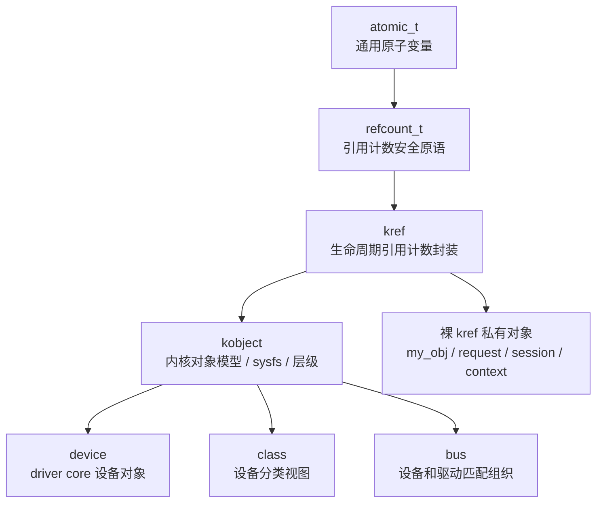

注意这张图不是说：

```text
所有 device/class/bus 都是你手写 kref 管理。
```

而是说：

```text
它们内部或底层会用到引用计数思想；
但暴露给驱动作者的管理接口已经被 driver core 封装了。
```

------

## 11.2_底层计数工具_atomic_t_refcount_t_kref

### 11.2.1_atomic_t_通用原子计数工具

`atomic_t` 是底层原子变量。

它可以做很多事：

```text
计数；
状态位；
统计；
标志；
序号；
并发递增递减。
```

但是 `atomic_t` 本身不知道你在实现引用计数。

例如：

```c
struct my_obj {
	atomic_t count;
};
```

你当然可以写：

```c
atomic_inc(&obj->count);
atomic_dec(&obj->count);
```

但是 `atomic_t` 不会替你表达：

```text
什么时候对象活着；
什么时候对象该释放；
什么时候禁止从 0 加回 1；
什么时候 underflow；
什么时候 overflow；
什么时候触发 release。
```

所以裸 `atomic_t` 的问题是：

```text
它只是“原子操作工具”；
不是“引用计数语义工具”。
```

如果用 `atomic_t` 手写引用计数，你必须自己处理大量规则：

```text
1. 不能从 0 复活对象。
2. 不能 underflow。
3. 不能 overflow。
4. 最后一个 put 要触发 release。
5. get 前必须证明对象有效。
6. put 后不能访问对象。
7. 并发路径必须有明确所有权。
```

这会把生命周期规则分散到业务代码里。

所以现代内核里，如果你要表达“引用计数”，优先考虑 `refcount_t` 或 `kref`，而不是直接用 `atomic_t`。

一句话：

```text
atomic_t 可以实现计数；
但它不表达引用计数纪律。
```

------

### 11.2.2_refcount_t_引用计数安全原语

`refcount_t` 是比 `atomic_t` 更接近引用计数语义的底层工具。

它的定位是：

```text
为对象引用计数提供最小 API；
在底层仍然使用原子操作；
但加入引用计数相关的安全约束和内存序语义。
```

内核文档明确说明，`refcount_t` API 的目标是为对象引用计数器提供最小 API，虽然通用实现底层使用原子操作，但它和 `atomic_t` 在内存序保证等方面存在差异。([Linux Kernel 文档](https://docs.kernel.org/core-api/refcount-vs-atomic.html))

典型定义可以理解成：

```c
typedef struct refcount_struct {
	atomic_t refs;
} refcount_t;
```

也就是说：

```text
refcount_t 不是脱离 atomic 的神秘机制；
它是在 atomic 基础上封装出引用计数专用语义。
```

`refcount_t` 更关注这些问题：

```text
1. 引用计数不能随便从 0 加回 1。
2. 引用计数不能 underflow。
3. 引用计数不能 overflow。
4. 某些错误路径需要 WARN 或饱和处理。
5. 引用计数递减到 0 时需要配合释放语义。
```

但是 `refcount_t` 仍然只是底层引用计数原语。

如果你直接用它，代码通常是这种风格：

```c
struct my_obj {
	refcount_t refs;
};

refcount_set(&obj->refs, 1);

if (refcount_inc_not_zero(&obj->refs)) {
	...
}

if (refcount_dec_and_test(&obj->refs)) {
	release_obj(obj);
}
```

这当然可以。

但它还有几个问题：

```text
1. 每个对象都要自己约定字段名。
2. 每个释放路径都要自己组织 dec_and_test + release。
3. release 函数的参数通常是业务对象指针。
4. 不形成统一的 kref_init/kref_get/kref_put 写法。
5. 不天然形成 container_of(ref, struct my_obj, ref) 的模式。
```

所以 `refcount_t` 是更底层的引用计数工具。

一句话：

```text
refcount_t 负责“引用计数安全原语”；
kref 负责“对象生命周期引用计数模板”。
```

------

### 11.2.3_kref_对象生命周期引用计数封装

`kref` 是对 `refcount_t` 的再封装。

它的典型结构是：

```c
struct kref {
	refcount_t refcount;
};
```

也就是说：

```text
kref 本身不保存对象指针；
kref 本身不保存 release 函数；
kref 本身不保存对象状态；
kref 本身不保存锁；
kref 本身只封装一个 refcount_t。
```

但它形成了一套固定生命周期 API：

```c
kref_init(&obj->ref);
kref_get(&obj->ref);
kref_put(&obj->ref, my_obj_release);
```

这套 API 把对象生命周期压缩成一个模板：

```text
创建对象：
    kref_init()

增加长期持有者：
    kref_get()

释放当前持有者：
    kref_put()

最后一个持有者释放：
    release(ref)

从 ref 找回业务对象：
    container_of(ref, struct my_obj, ref)
```

例如：

```c
struct my_obj {
	struct kref ref;
	int id;
	void *priv;
};

static void my_obj_release(struct kref *ref)
{
	struct my_obj *obj = container_of(ref, struct my_obj, ref);

	kfree(obj);
}
```

这就是裸 kref 最小模型。

它解决的是：

```text
自定义对象的生命周期引用计数；
谁持有引用；
谁释放引用；
最后一个 put 时怎么销毁对象。
```

它不解决：

```text
对象是否在 list 中；
对象字段是否需要锁；
对象是否已经 dying；
对象是否接入 sysfs；
对象是否属于某个 bus/class；
对象是否和 driver core 绑定。
```

所以裸 kref 的边界是：

```text
kref 是生命周期工具；
不是对象模型；
不是设备模型；
不是 sysfs 模型；
不是 driver core。
```

------

### 11.2.4_kref_和_refcount_t_的关系

可以这样理解：

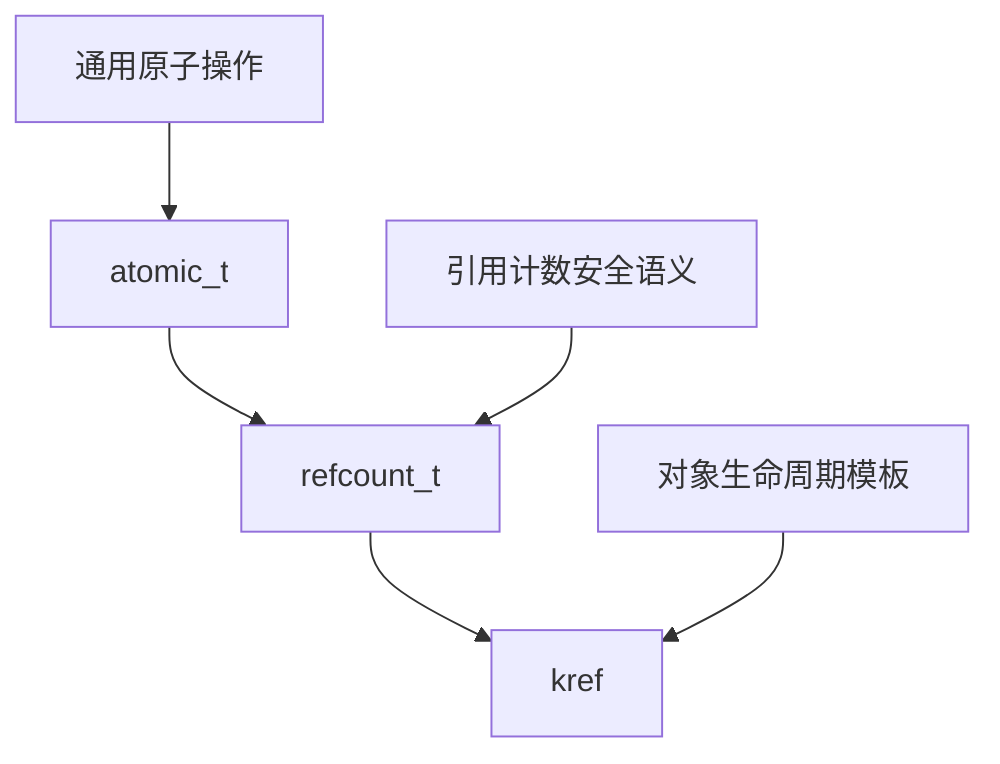

更具体一点：

| 层次         | 示例                      | 解决什么                  | 不解决什么                   |
| ------------ | ------------------------- | ------------------------- | ---------------------------- |
| `atomic_t`   | `atomic_inc()`            | 通用原子计数              | 引用计数语义                 |
| `refcount_t` | `refcount_inc_not_zero()` | 安全引用计数原语          | 对象 release 模板            |
| `kref`       | `kref_put(ref, release)`  | 对象生命周期引用模板      | sysfs / driver core / 字段锁 |
| `kobject`    | `kobject_get/put`         | 内核对象模型和 sysfs 层级 | 业务对象全部语义             |
| `device`     | `get_device/put_device`   | driver core 设备生命周期  | 私有对象所有权协议           |

关系不是：

```text
atomic_t、refcount_t、kref、kobject、device 是同一级 API。
```

而是：

```text
它们从底层原子工具逐步上升到对象模型和 driver core 模型。
```

所以写代码时不要问：

```text
atomic_t、refcount_t、kref、kobject，我随便选哪个？
```

应该问：

```text
我现在要解决的是哪一层问题？
```

如果只是：

```text
我有一个自定义对象，需要引用计数生命周期。
```

答案通常是：

```text
kref。
```

如果是：

```text
我有一个 struct device，需要增加设备引用。
```

答案通常是：

```text
get_device() / put_device()。
```

如果是：

```text
我要接入 sysfs 层级对象模型。
```

答案才可能是：

```text
kobject。
```

------

## 11.3_kobject_边界_引用计数之外的对象模型

### 11.3.1_kobject_不只是引用计数

`kobject` 经常让人误解。

因为它里面也有引用计数，所以很多人会把它看成：

```text
高级版 kref。
```

这个理解不准确。

内核文档对 `kobject` 的描述是：`kobject` 有名字和引用计数，也有父指针、类型，通常还会在 sysfs 中有表示；并且 `kobject` 通常嵌入到更大的结构中，而不是单独使用。([Linux Kernel 文档](https://docs.kernel.org/core-api/kobject.html))

也就是说，`kobject` 至少包含这些维度：

```text
1. 名字。
2. 引用计数。
3. 父子层级。
4. ktype 类型。
5. sysfs 表示。
6. kset 归属。
7. uevent 相关行为。
```

所以 `kobject` 不是：

```text
struct kref 的增强版。
```

而是：

```text
Linux 内核对象模型的基础构件。
```

简化模型如下：

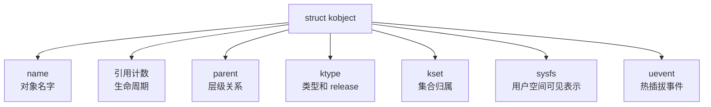

裸 kref 对象通常只关心：

```text
对象什么时候释放？
```

kobject 还要关心：

```text
对象叫什么名字？
对象挂在哪个父节点下面？
对象属于哪个类型？
对象是否出现在 sysfs？
对象释放时用哪个 ktype->release？
对象是否属于某个 kset？
对象是否参与 uevent？
```

所以不要因为“我需要引用计数”，就直接引入 kobject。

如果只是私有对象：

```c
struct my_request {
	struct kref ref;
	struct list_head node;
	...
};
```

没有必要写成：

```c
struct my_request {
	struct kobject kobj;
	...
};
```

否则你会被迫面对：

```text
kobject_init/add；
kobject_put；
kobj_type；
sysfs_ops；
default_groups；
release；
命名；
父子层级；
错误路径；
sysfs 生命周期。
```

这些都不是普通私有对象必须承担的成本。

一句话：

```text
kref 是生命周期引用计数工具；
kobject 是带引用计数的内核对象模型。
```

------

### 11.3.2_kobject_的_release_和_kref_release_的区别

裸 kref 的 release 是这样：

```c
static void my_obj_release(struct kref *ref)
{
	struct my_obj *obj = container_of(ref, struct my_obj, ref);

	kfree(obj);
}
```

它的入口参数是：

```c
struct kref *ref
```

它通过：

```c
container_of(ref, struct my_obj, ref)
```

找回业务对象。

而 kobject 的 release 通常来自 `struct kobj_type`：

```c
struct kobj_type {
	void (*release)(struct kobject *kobj);
	...
};
```

内核 kobject 文档说明，`struct kobj_type` 里的 `release` 字段就是这个 kobject 类型的 release 方法；其他字段如 `sysfs_ops` 和 `default_groups` 控制它在 sysfs 中的表示。([Linux Kernel 文档](https://docs.kernel.org/core-api/kobject.html))

所以 kobject release 的入口是：

```c
struct kobject *kobj
```

而不是：

```c
struct kref *ref
```

典型写法是：

```c
static void my_kobj_release(struct kobject *kobj)
{
	struct my_obj *obj = container_of(kobj, struct my_obj, kobj);

	kfree(obj);
}
```

二者对比：

| 模型    | release 参数       | 找回对象方式                              | 表达层次             |
| ------- | ------------------ | ----------------------------------------- | -------------------- |
| 裸 kref | `struct kref *`    | `container_of(ref, struct my_obj, ref)`   | 生命周期引用计数     |
| kobject | `struct kobject *` | `container_of(kobj, struct my_obj, kobj)` | 内核对象模型         |
| device  | `struct device *`  | 通常 `container_of(dev, xxx_device, dev)` | driver core 设备对象 |

所以不要把这几种 release 混成一种。

错误理解：

```text
kobject 的 release 就是 kref release。
```

更准确说法：

```text
kobject 内部也管理引用；
但是它的 release 属于 kobject 类型系统，不是裸 kref API 的 release。
```

------

### 11.3.3_为什么不要为了引用计数强行引入_kobject

如果你的对象只是驱动内部对象：

```c
struct my_session {
	struct kref ref;
	struct list_head node;
	int id;
	void *priv;
};
```

那么用 kref 就够了。

不要写成：

```c
struct my_session {
	struct kobject kobj;
	struct list_head node;
	int id;
	void *priv;
};
```

除非你真的需要：

```text
1. 这个对象出现在 sysfs 中。
2. 这个对象有 kobject 层级父子关系。
3. 这个对象属于某个 kset。
4. 这个对象需要 ktype 管理 release 和 sysfs 属性。
5. 这个对象参与内核对象模型。
6. 这个对象需要向用户空间暴露属性或 uevent。
```

否则引入 kobject 只会增加复杂度。

对比：

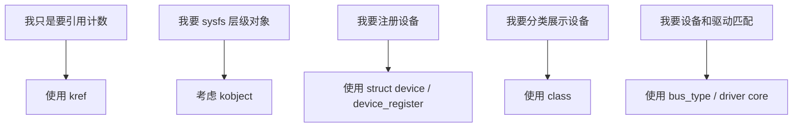

所以本章给出明确规则：

```text
只要引用计数：
    kref。

需要内核对象模型：
    kobject。

需要 driver core 设备模型：
    device/class/bus。

不要从“需要引用计数”直接跳到 kobject。
```

------

## 11.4_driver_core_边界_device_class_bus_不是裸_kref

### 11.4.1_device_driver_core_已经封装好的对象模型

`struct device` 是 driver core 的设备对象。

它不是普通裸 kref 示例里的 `my_obj`。

它承担的职责远超过引用计数：

```text
1. 设备名字。
2. 父子设备关系。
3. 所属 bus。
4. 所属 class。
5. 绑定 driver。
6. sysfs 节点。
7. 设备属性。
8. 电源管理。
9. DMA / IOMMU 相关信息。
10. 设备 release。
11. driver core 注册和注销流程。
```

driver model 文档说明，发现设备的 bus driver 用 `device_register()` 把设备注册到 core；设备从 core 中移除发生在引用计数归零时，并且设备引用通过 `get_device()` 和 `put_device()` 调整。([Linux Kernel 文档](https://docs.kernel.org/driver-api/driver-model/device.html))

所以对 `struct device`，普通驱动代码通常不应该写：

```c
kref_get(&dev->kobj.kref);
kref_put(&dev->kobj.kref, ...);
```

而应该使用 driver core 给你的接口：

```c
get_device(dev);
put_device(dev);
```

或者在 managed resource 场景下使用：

```c
devm_kzalloc(dev, ...);
devm_request_irq(dev, ...);
devm_...
```

这背后的原因是：

```text
device 的生命周期不只是 refcount++ / refcount--；
它还绑定了 driver core 的注册、注销、父子关系、sysfs、class、bus、uevent 和 release 约定。
```

裸 kref 对象的模型是：

```text
我自己定义对象；
我自己决定谁 get；
我自己决定谁 put；
我自己写 release。
```

device 模型是：

```text
driver core 管理设备对象；
驱动通过 device_register/device_unregister/get_device/put_device 等接口参与生命周期；
release 必须符合 driver core 约定。
```

对比图：

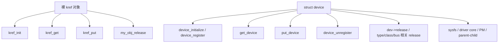

一句话：

```text
device 不是“带 kref 的 my_obj”；
device 是 driver core 的类型化对象。
```

------

### 11.4.2_get_device/put_device_和_kref_get/kref_put_的区别

从表面看：

```c
kref_get(&obj->ref);
kref_put(&obj->ref, obj_release);
```

和：

```c
get_device(dev);
put_device(dev);
```

都像是在做引用计数。

但它们的层次不同。

| API             | 对象类型                     | 所属层次       | 调用者关心什么                     |
| --------------- | ---------------------------- | -------------- | ---------------------------------- |
| `kref_get()`    | 自定义对象内的 `struct kref` | 裸生命周期工具 | 引用归属                           |
| `kref_put()`    | 自定义对象内的 `struct kref` | 裸生命周期工具 | 最后 put 调 release                |
| `get_device()`  | `struct device *`            | driver core    | 设备对象引用                       |
| `put_device()`  | `struct device *`            | driver core    | 释放设备引用，可能触发设备 release |
| `kobject_get()` | `struct kobject *`           | kobject core   | kobject 引用                       |
| `kobject_put()` | `struct kobject *`           | kobject core   | 释放 kobject 引用                  |

所以如果你拿到的是：

```c
struct device *dev;
```

你应该想：

```text
这是 driver core 对象；
用 get_device/put_device。
```

而不是想：

```text
我去找它内部 kref 字段手动操作。
```

类似地，如果你拿到的是：

```c
struct kobject *kobj;
```

你应该想：

```text
这是 kobject；
用 kobject_get/kobject_put。
```

如果你拿到的是：

```c
struct my_obj *obj;
```

并且对象内部是：

```c
struct kref ref;
```

你才使用：

```c
kref_get(&obj->ref);
kref_put(&obj->ref, my_obj_release);
```

这个边界非常关键。

------

### 11.4.3_device_release_不是_my_obj_release

裸 kref release：

```c
static void my_obj_release(struct kref *ref)
{
	struct my_obj *obj = container_of(ref, struct my_obj, ref);

	kfree(obj);
}
```

device release 通常是：

```c
static void my_dev_release(struct device *dev)
{
	struct my_dev *mdev = container_of(dev, struct my_dev, dev);

	kfree(mdev);
}
```

这两个函数虽然都可能最终 `kfree()`，但意义不同。

裸 kref release 表示：

```text
自定义对象最后一个引用释放；
进入对象私有销毁路径。
```

device release 表示：

```text
driver core 设备对象最后一个引用释放；
设备模型允许最终销毁这个设备对象。
```

device release 的重要性更高，因为 `struct device` 一旦注册到 driver core，就可能被多个 core 路径持有引用：

```text
sysfs；
bus；
class；
driver；
parent/child；
device links；
PM；
用户空间打开的属性访问；
异步 probe/remove 路径。
```

所以不能用裸 kref 的思维写：

```text
我 unregister 了，所以马上 kfree device。
```

更准确的模型是：

```text
device_unregister() 取消发布设备；
put_device() 释放引用；
最后一个引用归零时，driver core 调用 release；
release 才能释放包含 struct device 的外层对象。
```

这里和前面 RCU 一样，要区分：

```text
取消发布 != 没有引用；
没有引用 != 所有框架关系都已经清理；
release 才是最终释放点。
```

------

### 11.4.4_class_release_也不是_my_obj_release

`struct class` 也是 driver core 的分类对象。

它用于把设备按功能类别组织起来，例如：

```text
input
net
block
tty
gpio
leds
hwmon
```

class 也会涉及 kobject/sysfs 层级和引用管理。

但是它不是你的业务对象。

所以不要把：

```text
class_release
```

理解成：

```text
释放某个业务 obj。
```

更准确地说：

```text
class_release 释放的是 class 这个 driver core 分类对象本身。
```

如果你有一个设备：

```c
struct my_dev {
	struct device dev;
	struct kref ref;
	...
};
```

这时一定要分清：

```text
dev 的引用：
    由 driver core 管理，用 get_device/put_device。

my_dev 私有业务引用：
    如果确实需要，才由你自己的 kref 管理。

class 的引用：
    属于 class 对象，不是某个设备实例的私有引用。
```

很多混乱来自下面这种误解：

```text
class 管 device；
device 管 obj；
所以 class_release/device_release/my_obj_release 是一条链。
```

这个理解太粗糙。

更准确的关系是：

```text
class 是分类视图；
bus 是匹配和组织机制；
device 是设备实例；
driver 是驱动实例；
私有 obj 是驱动自己的业务对象。
```

它们可以有关联，但不是简单总分 kref 链。

------

### 11.4.5_bus_type_不是引用计数对象模板

`struct bus_type` 是 driver core 中描述一类总线的结构。

它关心的是：

```text
设备和驱动如何匹配；
设备添加/删除时如何产生 uevent；
probe/remove/shutdown/suspend/resume 怎么走；
bus/device/driver 的默认属性；
父锁需求；
DMA/IOMMU 等总线相关行为。
```

内核 driver infrastructure 文档中，`struct bus_type` 包含 `match`、`uevent`、`probe`、`remove`、`shutdown`、`suspend`、`resume` 等成员，用于组织设备和驱动之间的关系。([Linux Kernel 文档](https://docs.kernel.org/driver-api/infrastructure.html))

所以 bus 不是：

```text
一个大的 kref 管理器。
```

也不是：

```text
bus 持有 device 的 kref，然后 device 持有 obj 的 kref。
```

这种说法过度简化。

更准确的是：

```text
bus_type 是 driver core 的匹配和组织层；
device 是挂在某个 bus/class/parent 关系里的设备实例；
引用计数只是这些对象生命周期管理的一部分。
```

bus 的核心不是：

```text
refcount++ / refcount--
```

而是：

```text
match；
probe；
remove；
uevent；
device-driver 绑定关系；
sysfs 组织；
PM 回调。
```

所以不要把 bus 当成 kref 教材里的“大对象”。

------

## 11.5_分层对照_裸_kref_driver_core_和私有引用

### 11.5.1_裸_kref_对象和_driver_core_对象的对比

这一节把边界集中放到一张表里。

| 对象              | 是否只是引用计数 | 典型 API                     | release 类型                       | 主要职责             |
| ----------------- | ---------------- | ---------------------------- | ---------------------------------- | -------------------- |
| `atomic_t`        | 不是             | `atomic_inc/dec`             | 无                                 | 通用原子操作         |
| `refcount_t`      | 接近             | `refcount_inc/dec_and_test`  | 调用者自己组织                     | 安全引用计数原语     |
| `struct kref`     | 是生命周期封装   | `kref_get/put`               | `void (*)(struct kref *)`          | 自定义对象生命周期   |
| `struct kobject`  | 不是             | `kobject_get/put`            | `ktype->release(struct kobject *)` | 内核对象模型/sysfs   |
| `struct device`   | 不是             | `get_device/put_device`      | `release(struct device *)`         | driver core 设备对象 |
| `struct class`    | 不是             | `class_create/destroy` 等    | class release                      | 设备分类             |
| `struct bus_type` | 不是             | `bus_register/unregister` 等 | bus/core 管理                      | 设备-驱动匹配组织    |

重点是：

```text
kref 是“工具”；
kobject/device/class/bus 是“对象模型”。
```

工具可以嵌入对象模型。

但是不能反过来把对象模型降级理解成工具。

图示：

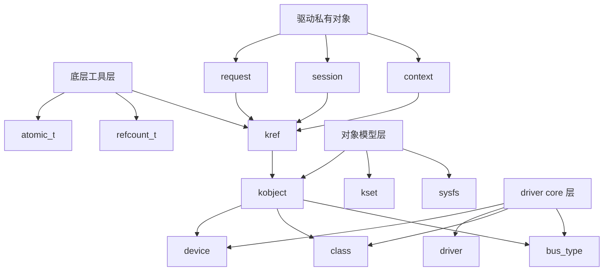

------

### 11.5.2_为什么裸_kref_示例不能直接套到_device/class/bus

前面章节里经常用这种对象：

```c
struct my_obj {
	struct kref ref;
	struct list_head node;
	int id;
};
```

这是教学模型。

它的假设是：

```text
对象是你自己定义的；
对象由你自己发布到集合；
对象由你自己 lookup；
对象由你自己 get/put；
对象由你自己的 release 销毁。
```

但是 `struct device` 的假设完全不同：

```text
对象被 driver core 注册；
对象可能出现在 sysfs；
对象可能属于 bus；
对象可能属于 class；
对象可能有 parent；
对象可能绑定 driver；
对象可能被 core、driver、sysfs、PM、device link 等路径持有引用；
对象释放必须走 driver core 的 release 约定。
```

所以你不能把第 1-10 章里的 `my_obj` 模型直接替换成：

```c
struct device
```

然后得出：

```text
device 里面也有 kref，所以我照着 my_obj_release 写就行。
```

这是错误的。

正确理解是：

```text
my_obj 是裸生命周期对象；
device 是 driver core 对象；
两者都涉及引用计数，但生命周期协议不在同一层。
```

对比图：

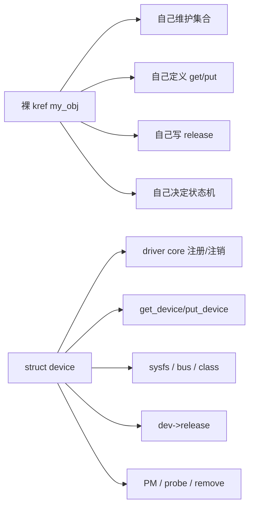

一句话：

```text
裸 kref 讲的是自定义对象生命周期；
device/class/bus 讲的是 driver core 已经封装好的分层对象模型。
```

------

### 11.5.3_kobject_和_device_中仍然可以有私有_kref_吗

可以，但要非常谨慎。

有些驱动对象可能长这样：

```c
struct my_dev {
	struct device dev;

	struct kref ref;
	struct mutex lock;

	struct list_head sessions;
};
```

这里有两个生命周期层次：

```text
struct device dev：
    driver core 设备对象生命周期。

struct kref ref：
    驱动私有业务对象生命周期。
```

这时必须明确：

```text
dev 的引用由 get_device/put_device 管；
my_dev 私有业务引用由 kref_get/kref_put 管；
两者不能混用。
```

错误写法：

```c
kref_get(&mdev->ref);
/* 以为这能保护 mdev->dev 在 driver core 中有效 */
```

这不一定成立。

因为：

```text
私有 kref 只能保护你定义的私有生命周期；
不能替代 driver core 对 struct device 的引用规则。
```

反过来也一样：

```c
get_device(&mdev->dev);
/* 以为这能保护所有私有业务状态可用 */
```

这也不一定成立。

因为：

```text
get_device 保护 device 对象生命周期；
不代表你的私有 session、队列、硬件状态、业务状态仍然可用。
```

所以如果一个结构里同时存在 `struct device` 和私有 `struct kref`，需要明确两张表。

#### (1)_device_引用表

```text
引用对象：
    struct device dev

引用 API：
    get_device()
    put_device()

release：
    dev->release

保护内容：
    driver core 设备对象生命周期
```

#### (2)_私有_kref_引用表

```text
引用对象：
    struct my_dev / my_session / my_request

引用 API：
    kref_get()
    kref_put()

release：
    my_xxx_release(struct kref *ref)

保护内容：
    私有业务对象生命周期
```

不要把两张表合成一张。

------

### 11.5.4_一个典型的分层结构

假设你写一个驱动，里面有设备对象和用户会话对象：

```c
struct my_device {
	struct device dev;
	struct mutex lock;
	bool dying;

	struct list_head session_list;
};

struct my_session {
	struct kref ref;
	struct my_device *mdev;
	struct list_head node;
	int id;
};
```

这里的生命周期层次是：

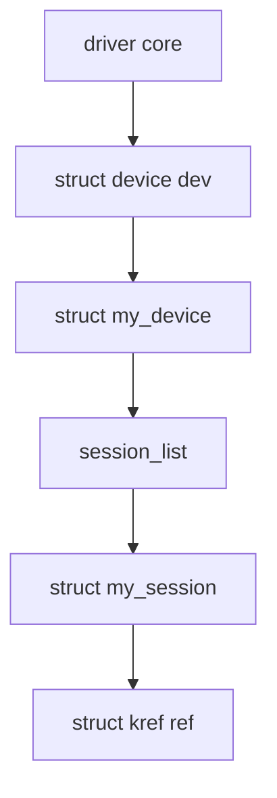

但是注意：

```text
my_session 的 kref 不等于 my_device 的 device 引用；
my_device 的 dev 引用不等于 my_session 的引用；
session_list 的锁不等于 session 的生命周期；
dying 状态不等于引用计数。
```

可能的规则是：

```text
my_device：
    由 driver core 管理注册和注销；
    用 get_device/put_device 保护 device 对象；
    remove 时设置 dying，阻止新 session 创建。

my_session：
    由驱动自己管理；
    创建时 kref_init；
    加入 session_list 前持有一个引用；
    异步任务或用户上下文使用时 kref_get；
    最后 put 时 my_session_release。
```

这比简单说：

```text
device 管 session
```

准确得多。

因为真正要回答的是：

```text
session 是否持有 mdev？
mdev remove 时如何阻止新 session？
已有 session 如何退出？
session 是否需要 get_device(&mdev->dev)？
mdev release 前是否必须 drain 所有 session？
session release 是否能访问 mdev？
```

这些都不是 `kref` 或 `device` 自动帮你决定的。

------

### 11.5.5_container_of_在不同层次中的作用

裸 kref：

```c
static void my_obj_release(struct kref *ref)
{
	struct my_obj *obj = container_of(ref, struct my_obj, ref);
}
```

kobject：

```c
static void my_kobj_release(struct kobject *kobj)
{
	struct my_obj *obj = container_of(kobj, struct my_obj, kobj);
}
```

device：

```c
static void my_dev_release(struct device *dev)
{
	struct my_device *mdev = container_of(dev, struct my_device, dev);
}
```

这三种写法都使用 `container_of()`。

但是不要因为都用了 `container_of()`，就认为它们是同一层机制。

`container_of()` 只是：

```text
通过内嵌成员指针找回外层对象。
```

它不决定：

```text
引用计数语义；
release 语义；
sysfs 语义；
driver core 语义；
对象是否可 lookup；
对象是否 dying。
```

对比：

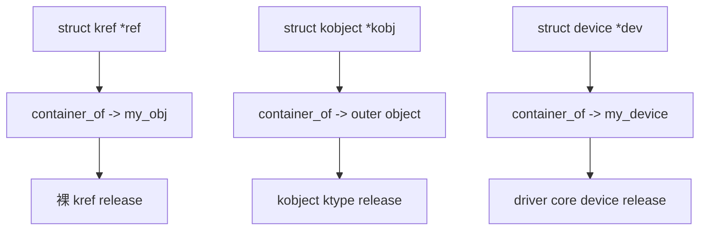

同一个 C 技巧，不代表同一种生命周期协议。

------

### 11.5.6_不同层次的_get/put_命名规律

可以把命名规律记成下面这样：

```text
你操作什么对象，就用那个对象层次的 get/put。
```

具体：

```c
struct my_obj *obj;
kref_get(&obj->ref);
kref_put(&obj->ref, my_obj_release);
struct kobject *kobj;
kobject_get(kobj);
kobject_put(kobj);
struct device *dev;
get_device(dev);
put_device(dev);
struct module *mod;
try_module_get(mod);
module_put(mod);
struct file *file;
get_file(file);
fput(file);
```

这说明 Linux 内核里引用计数不是只有一个 API。

原因是：

```text
不同对象层次有不同生命周期协议。
```

不要看到引用计数就统一替换成 `kref_get/kref_put`。

`kref_get/kref_put` 只适合：

```text
你自己在对象里嵌入 struct kref；
你自己定义 release；
你自己管理引用归属。
```

------

## 11.6_本章常见误解

### 11.6.1_误解一_kobject_是高级_kref

错误。

更准确：

```text
kobject 是带引用计数、名字、父子层级、ktype、sysfs 表示和 kset 归属的内核对象模型。
```

如果只是引用计数，用 `kref`。

------

### 11.6.2_误解二_device_就是内嵌_kref_的对象

错误。

更准确：

```text
device 是 driver core 的设备对象；
引用计数只是它生命周期管理的一部分。
```

对 `struct device` 应该用：

```c
get_device(dev);
put_device(dev);
```

不是手动摸内部 kref。

------

### 11.6.3_误解三_class/bus_是_device_的总引用管理器

错误。

更准确：

```text
class 是分类视图；
bus 是匹配和组织机制；
device 是设备实例；
它们之间有 driver core 关系，但不是简单的“大 kref 管小 kref”。
```

------

### 11.6.4_误解四_release_都是_kfree

错误。

release 可能做：

```text
取消 sysfs 表示；
释放属性组；
释放私有资源；
释放子对象；
等待异步路径；
call_rcu/kfree_rcu；
最终 kfree 外层对象。
```

而且不同层次 release 的入口参数不同：

```text
kref release:
    struct kref *

kobject release:
    struct kobject *

device release:
    struct device *
```

------

### 11.6.5_误解五_get_device_可以替代私有_kref

不一定。

`get_device()` 保护的是：

```text
struct device 对象生命周期。
```

它不自动保护：

```text
你的私有 request；
你的私有 session；
你的硬件状态；
你的业务队列；
你的 opened file context。
```

如果这些私有对象有独立生命周期，仍然需要自己的引用模型。

------

### 11.6.6_误解六_私有_kref_可以替代_get_device

也不一定。

私有 `kref` 保护的是：

```text
你定义的私有对象。
```

它不自动保护：

```text
driver core 对 struct device 的生命周期规则。
```

如果你要长期保存 `struct device *dev`，通常要按 driver core 规则持有设备引用。

------

## 11.7_选择规则

写代码时可以按下面规则选择。

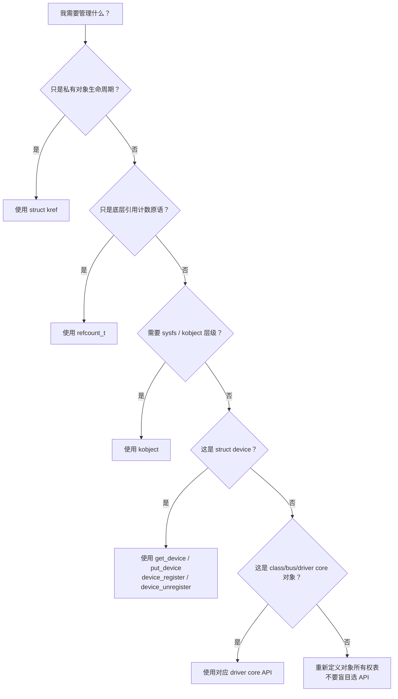

简化成表：

| 需求                   | 优先选择                                    |
| ---------------------- | ------------------------------------------- |
| 私有对象生命周期       | `struct kref`                               |
| 自己封装更底层引用计数 | `refcount_t`                                |
| 通用原子变量           | `atomic_t`                                  |
| sysfs 层级对象         | `struct kobject`                            |
| 设备对象生命周期       | `get_device()` / `put_device()`             |
| 设备注册注销           | `device_register()` / `device_unregister()` |
| 分类设备               | `struct class` / class API                  |
| 设备驱动匹配           | `struct bus_type` / bus API                 |

------

## 11.8_和前面章节的关系

第 1 章讲：

```text
kref 解决的是引用所有权，不是锁，不是状态机，不是设备安全代理。
```

第 2 章讲：

```text
struct kref 内部嵌入 refcount_t；
release 通过 container_of 找回外层对象。
```

第 3 章讲：

```text
kref_init/get/put/release 串成生命周期状态机。
```

第 8、9、10 章讲：

```text
lookup、锁、RCU 如何保护 get 前窗口。
```

本章补上边界：

```text
这些规则主要针对裸 kref 私有对象；
不能直接照搬到 kobject/device/class/bus。
```

也就是说：

```text
裸 kref 是你自己管理对象生命周期；
driver core 对象是框架已经定义好了生命周期协议。
```

三层关系如下：

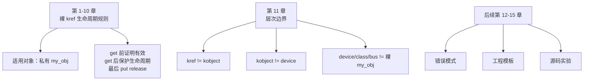

------

## 11.9_本章检查清单

看到一个引用计数对象时，先问这些问题：

```text
1. 这是私有对象，还是 driver core 对象？
2. 对象里是 struct kref，还是 struct kobject，还是 struct device？
3. 应该用 kref_get，还是 kobject_get，还是 get_device？
4. release 的参数是 struct kref *、struct kobject *，还是 struct device *？
5. release 是我自己定义的，还是 ktype/device/class/bus 框架定义的？
6. 这个对象是否需要出现在 sysfs？
7. 这个对象是否参与 uevent？
8. 这个对象是否有 parent/child 层级？
9. 这个对象是否属于 class？
10. 这个对象是否挂在 bus 上参与 match/probe/remove？
11. 我是不是只是为了引用计数而错误引入 kobject？
12. 我是不是把 device 当成裸 kref 对象手动管理？
13. 如果 struct device 和私有 kref 同时存在，两套引用表是否分清？
14. 私有 kref 是否错误替代了 get_device？
15. get_device 是否错误替代了私有对象状态机或私有 kref？
```

如果这些问题答不清楚，就不要急着写：

```c
kref_get(...)
```

也不要急着写：

```c
kobject_init(...)
```

先把对象层次画出来。

------

## 11.10_本章小结

本章核心不是学习更多 API，而是分清层次。

可以压缩成下面几句话：

```text
atomic_t 是通用原子工具。

refcount_t 是引用计数安全原语。

kref 是基于 refcount_t 的对象生命周期引用计数封装。

kobject 是带名字、引用、父子层级、ktype、sysfs 表示和 kset 归属的内核对象模型。

device 是 driver core 的设备对象，不是裸 kref 的 my_obj。

class 是设备分类视图，不是业务对象 release 管理器。

bus_type 是设备和驱动匹配组织机制，不是大号 kref 管理器。
```

最重要的边界是：

```text
裸 kref 讲的是自定义对象如何管理引用；
device/class/bus 讲的是 driver core 已经封装好的分层对象模型。
```

一句话总结：

```text
需要引用计数，不等于需要 kobject；
操作 struct device，不等于直接操作 kref；
不同对象层次，必须使用对应层次的生命周期 API。
```
